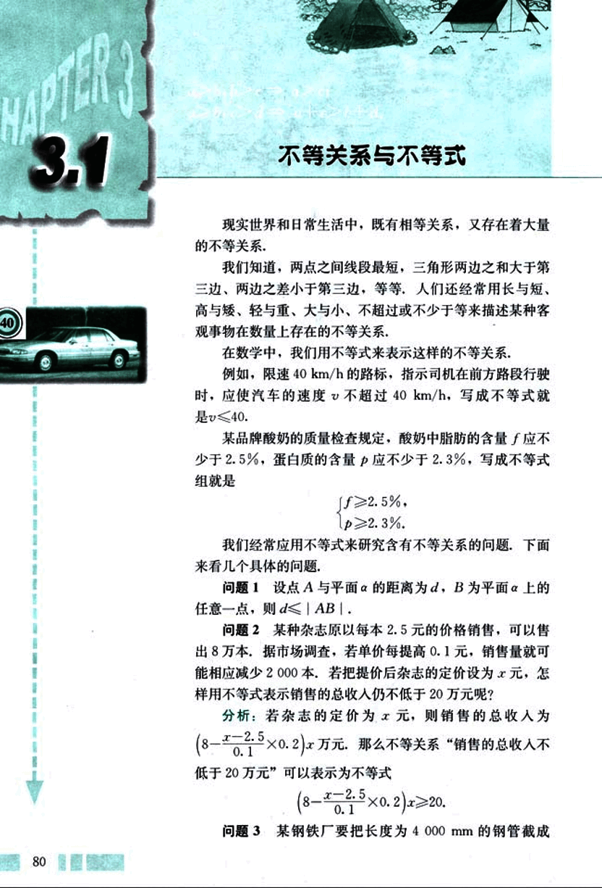
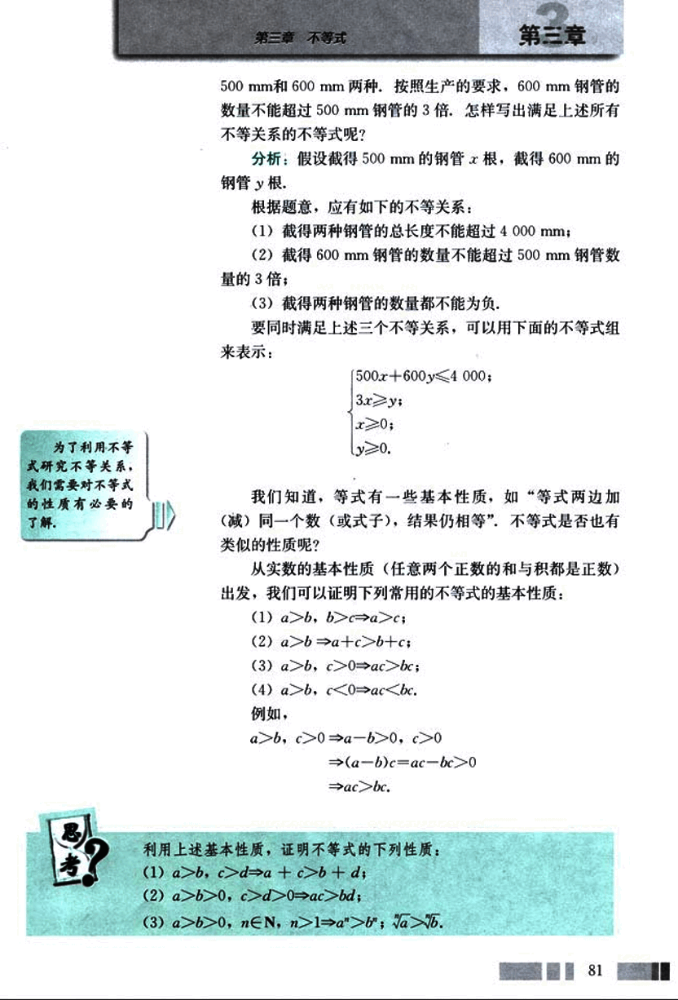
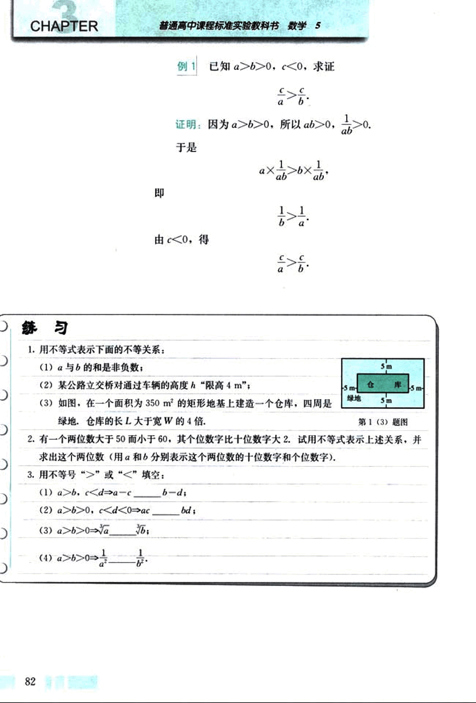
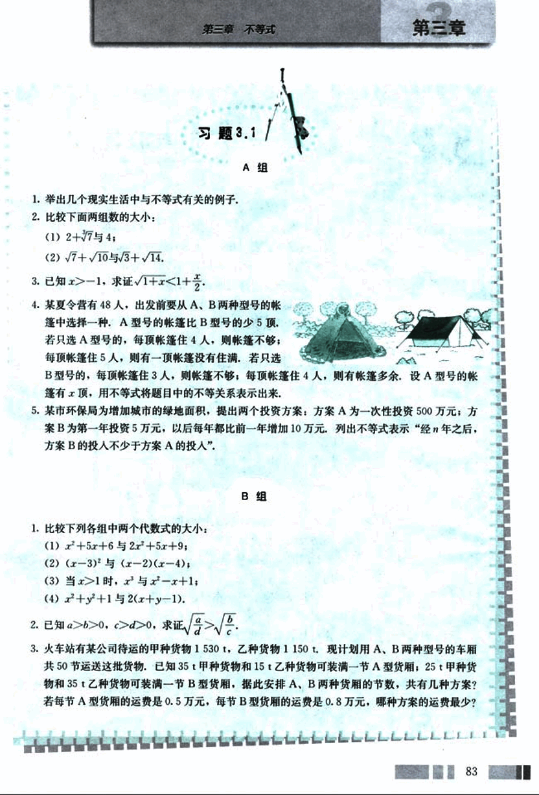

# 3.1　不等关系与不等式

93

# CHAPTER 3

## 3.1 不等关系与不等式

现实世界和日常生活中，既有相等关系，又存在着大量的不等关系。

我们知道，两点之间线段最短，三角形两边之和大于第三边，两边之差小于第三边，等等，人们还经常用长与短，高与矮，轻与重，大与小，不超过或不少于等来描述某种客观事物在数量上存在的不等关系。

在数学中，我们用不等式来表示这样的不等关系。

例如，限速 40 km/h 的路标，指示司机在前方路段行驶时，应使汽车的速度  *v* 不超过 40 km/h，写成不等式就是 *v* ≤40。

某品牌酸奶的质量检查规定，酸奶中脂肪的含量 *f* 应不少于 2.5%，蛋白质的含量 *p* 应不少于 2.3%，写成不等式组就是

```
{f ≥ 2.5%
{p ≥ 2.3%
```

我们经常应用不等式来研究含有不等关系的问题，下面来看几个具体的问题。

**问题 1**  设点 A 与平面 α 的距离为 d，B 为平面 α 上的任意一点，则 d ≤ |AB|。

**问题 2** 某种杂志原以每本 2.5 元的价格销售，可以售出 8 万本。据市场调查，若单价每提高 0.1 元，销售量就能相应减少 2000 本。若把提价后杂志的定价设为 x 元，怎样用不等式表示销售的总收入仍不低于 20 万元呢？

**分析：** 若杂志的定价为 x 元，则销售的总收入为 (8 - $\frac{x - 2.5}{0.1}$ × 0.2)x 万元。那么不等关系“销售的总收入不低于 20 万元”可以表示为不等式

(8 - $\frac{x - 2.5}{0.1}$ × 0.2)x ≥ 20。

**问题 3** 某钢铁厂要把长度为 4 000 mm 的钢管截成



94

# 第三章 不等式

500mm和 600 mm两种,按照生产的要求,600mm钢管的数量不能超过500mm钢管的3倍,怎样写出满足上述所有不等关系的不等式呢?

## 分析:

假设截得500mm的钢管x根,截得600mm的钢管y根.

根据题意,应有如下的不等关系:

(1) 截得两种钢管的总长度不能超过4000mm;

(2) 截得600mm钢管的数量不能超过500mm钢管数量的3倍;

(3) 截得两种钢管的数量都不能为负.

要同时满足上述三个不等关系,可以用下面的不等式组来表示:

```
500x + 600y ≤ 4000;
3x ≥ y;
x ≥ 0;
y ≥ 0.
```

我们知道,等式有一些基本性质,如“等式两边加(减)同一个数(或式子),结果仍相等”,不等式是否也有类似的性质呢?

从实数的基本性质(任意两个正数的和与积都是正数)出发,我们可以证明下列常用的不等式的基本性质:

(1)  `a > b, b > c ⇒ a > c;`

(2)  `a > b ⇒ a + c > b + c;`

(3)  `a > b, c > 0 ⇒ ac > bc;`

(4)  `a > b, c < 0 ⇒ ac < bc.`

例如,

`a > b, c > 0 ⇒ a - b > 0, c > 0`

`⇒ (a - b)c = ac - bc > 0`

`⇒ ac > bc.`

利用上述基本性质,证明不等式的下列性质:

(1) `a > b, c > d ⇒ a + c > b + d;`

(2) `a > b > 0, c > d > 0 ⇒ ac > bd;`

(3) `a > b > 0, n ∈ N, n > 1 ⇒ a<sup>n</sup> > b<sup>n</sup>; √a > √b.`


81


95

# CHAPTER 练习

普通高中课程标准实验教科书 数学 5

## 例 1

已知 $a>b>0$, $c<0$, 求证 $\frac{c}{a} > \frac{c}{b}$.

证明: 因为 $a>b>0$, 所以 $ab>0$, $\frac{1}{ab}>0$.

于是

$a \times \frac{1}{ab} > b \times \frac{1}{ab}$,

即

$\frac{1}{b} > \frac{1}{a}$.

由 $c<0$, 得

$\frac{c}{a} > \frac{c}{b}$.


## 练习

1. 用不等式表示下面的不等关系:

(1) a 与 b 的和是非负数;

(2) 某公路立交桥对通过车辆的高度 h “限高 4 m”;

(3) 如图，在一个面积为 350 m<sup>2</sup> 的矩形地基上建造一个仓库，四周是绿地，仓库的长 L 大于宽 W 的 4 倍.

[image1](images/image1.png)

2. 有一个两位数大于 50 而小于 60，其个位数字比十位数字大 2. 试用不等式表示上述关系，并求出这个两位数（用 a 和 b 分别表示这个两位数的十位数字和个位数字）。

3. 用不等号 “>” 或 “<” 填空：

(1) $a>b$, $c<d \Rightarrow a-c$ __ $b-d$;

(2) $a>b>0$, $c<d<0 \Rightarrow ac$ __ $bd$;

(3) $a>b>0 \Rightarrow \sqrt{a}$ __ $\sqrt{b}$;

(4) $a>b>0 \Rightarrow \frac{1}{a^2}$ __ $\frac{1}{b^2}$;

82


96

# 第三章 不等式

## 习题 3.1

**A 组**

1. 举出几个现实生活中与不等式有关的例子。

2. 比较下面两组数的大小：

(1) 2 + √7 与 4；

(2) √7 + √10 与 √3 + √14.

3. 已知 x > -1，求证 √1 + x < 1 +  $\frac{x}{2}$。

4. 某夏令营有 48 人，出发前要从 A、B 两种型号的帐篷中选择一种。A 型号的帐篷比 B 型号的少 5 顶。若只选 A 型号的，每顶帐篷住 4 人，则帐篷不够；每顶帐篷住 5 人，则有一顶帐篷没有住满。若只选 B 型号的，每顶帐篷住 3 人，则帐篷不够；每顶帐篷住 4 人，则有帐篷多余。设 A 型号的帐篷有 *x* 顶，用不等式将题目中的不等关系表示出来。

5. 某市环保局为增加城市的绿地面积，提出两个投资方案：方案 A 为一次性投资 500 万元；方案 B 为第一年投资 5 万元，以后每年都比前一年增加 10 万元。列出不等式表示“经 *n* 年之后，方案 B 的投入不少于方案 A 的投入”。


**B 组**

1. 比较下列各组中两个代数式的大小：

(1) $x^2 + 5x + 6$ 与 $2x^2 + 5x + 9$；

(2) $(x - 3)^2$ 与 $(x - 2)(x - 4)$；

(3) 当 x > 1 时，$x^2$ 与 $x^2 - x + 1$；

(4) $x^2 + y^2 + 1$ 与 $2(x + y - 1)$。

2. 已知 a > b > 0, c > d > 0, 求证 $\sqrt{\frac{a}{d}} > \sqrt{\frac{b}{c}}$。

3. 火车站有某公司待运的甲种货物 1530 t，乙种货物 1150 t。现计划用 A、B 两种型号的车厢共 50 节运送这批货物。已知 35 t 甲种货物和 15 t 乙种货物可装满一节 A 型货厢；25 t 甲种货物和 35 t 乙种货物可装满一节 B 型货厢。据此安排 A、B 两种货厢的节数，共有几种方案？若每节 A 型货厢的运费是 0.5 万元，每节 B 型货厢的运费是 0.8 万元，哪种方案的运费最少？

83


