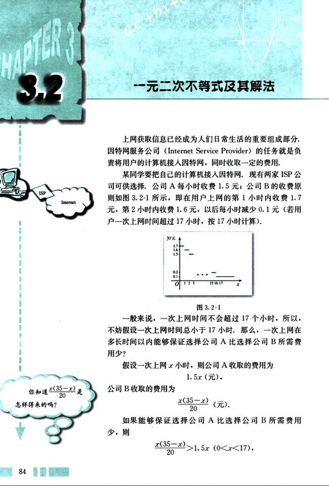
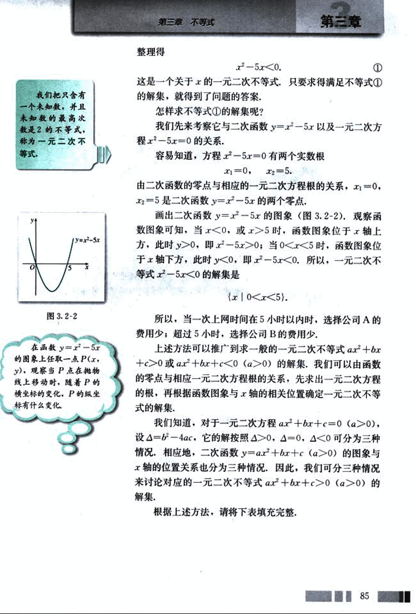
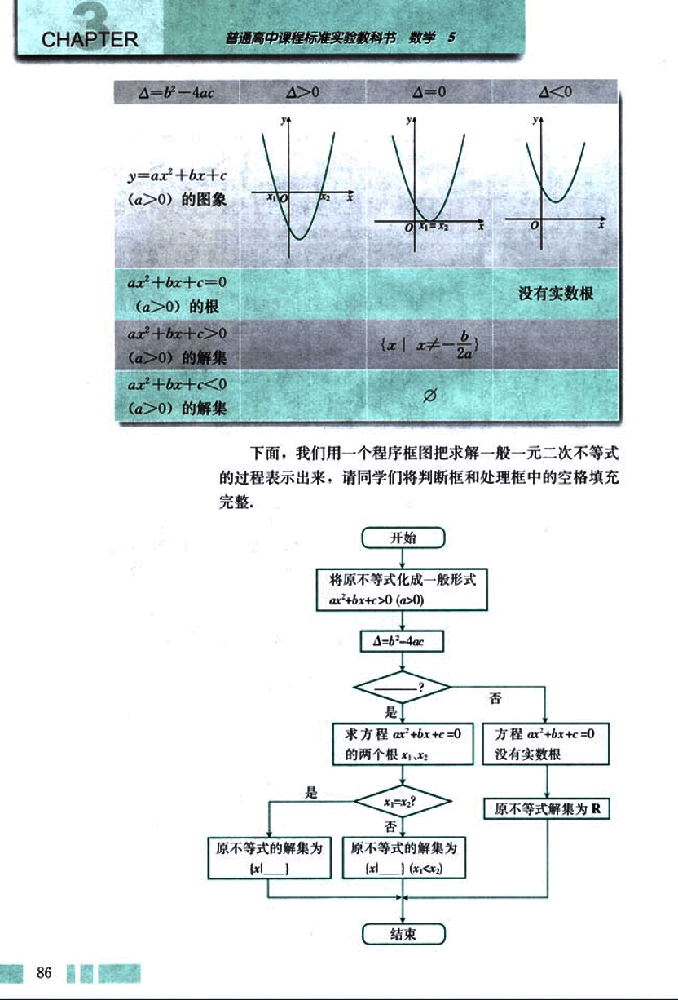
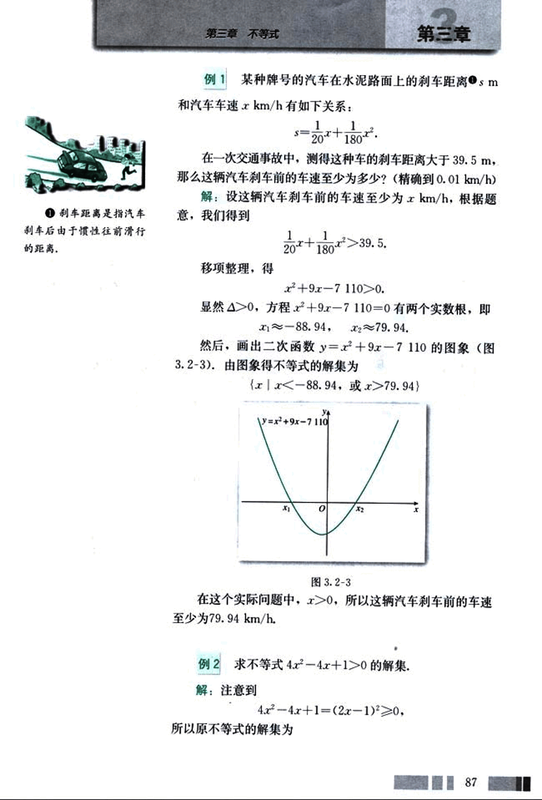
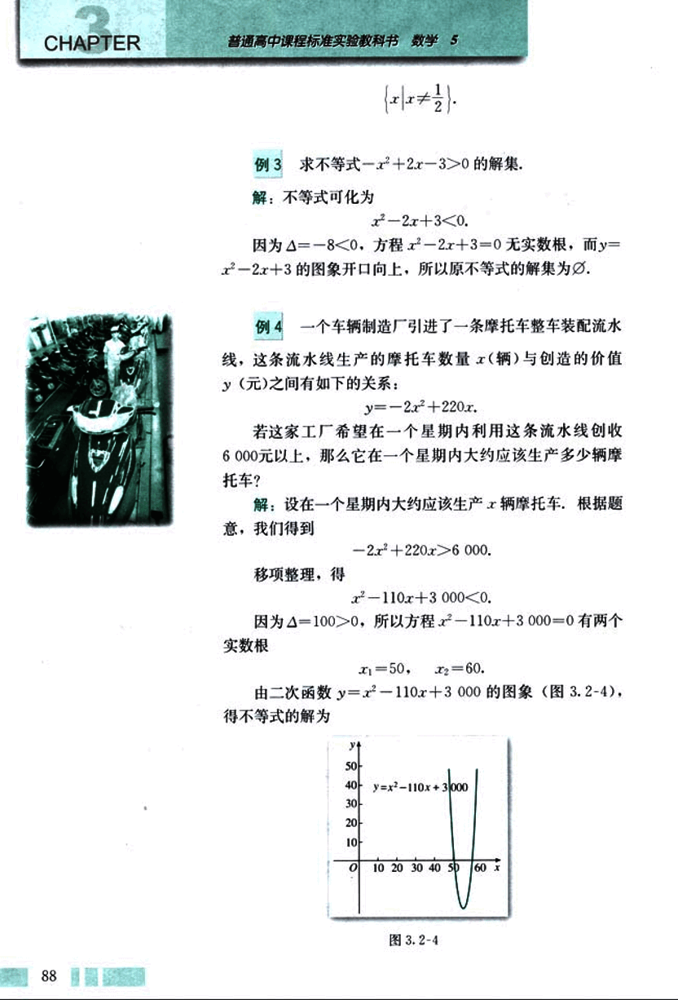
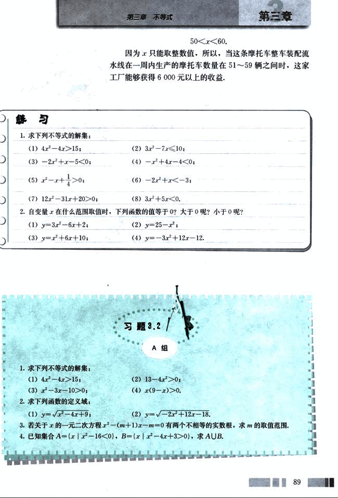
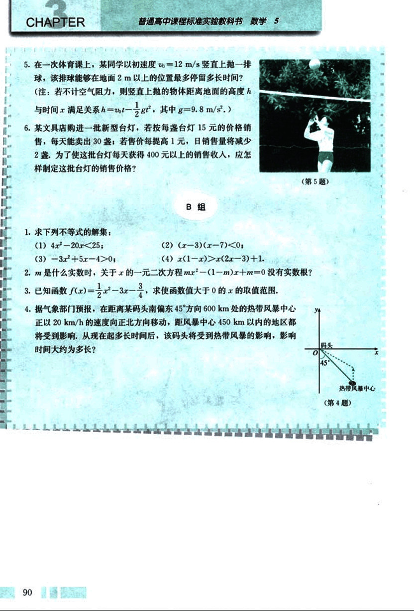

# 3.2　一元二次不等式及其解法

97

# CHAPTER 3

## 3.2 一元二次不等式及其解法

上网获取信息已经成为人们日常生活的重要组成部分，因特网服务公司(Internet Service Provider)的任务就是负责将用户的计算机接入因特网，同时收取一定的费用。

某同学要把自己的计算机接入因特网，现有两家ISP公司可供选择，公司A每小时收费1.5元；公司B的收费原则如图3.2-1所示，即在用户上网的第1小时内收费1.7元，第2小时内收费1.6元，以后每小时减少0.1元（若用户一次上网时间超过17小时，按17小时计算）。

一般来说，一次上网时间不会超过17个小时，所以，不妨假设一次上网时间总小于17小时，那么，一次上网在多长时间以内能够保证选择公司A比选择公司B所需费用少？

假设一次上网x小时，则公司A收取的费用为 1.5x(元)，公司B收取的费用为 $\frac{x(35-x)}{20}$(元)。

如果能够保证选择公司A比选择公司B所需费用少，则
$\frac{x(35-x)}{20} > 1.5x$  (0<x<17),

98

# 第三章 不等式

## 整理得

这是一个关于x的一元二次不等式，只要求得满足不等式①的解集，就得到了问题的答案。

怎样求不等式①的解集呢？

我们先来考察它与二次函数 y = x² - 5x 以及一元二次方程 x² - 5x = 0 的关系。

容易知道，方程 x² - 5x = 0 有两个实数根

x₁ = 0, x₂ = 5.

由二次函数的零点与相应的一元二次方程根的关系，x₁ = 0，x₂ = 5 是二次函数 y = x² - 5x 的两个零点。

画出二次函数 y = x² - 5x 的图象（图 3.2-2）。观察函数图象可知，当 x < 0，或 x > 5 时，函数图象位于 x 轴上方，此时 y > 0，即 x² - 5x > 0；当 0 < x < 5 时，函数图象位于 x 轴下方，此时 y < 0，即 x² - 5x < 0。所以，一元二次不等式 x² - 5x < 0 的解集是

{x | 0 < x < 5}.

所以，当一次上网时间在 5 小时以内时，选择公司 A 的费用少；超过 5 小时，选择公司 B 的费用少。

上述方法可以推广到求一般的一元二次不等式 ax² + bx + c > 0 或 ax² + bx + c < 0 (a > 0) 的解集。我们可以由函数的零点与相应一元二次方程根的关系，先求出一元二次方程的根，再根据函数图象与 x 轴的相关位置确定一元二次不等式的解集。

我们知道，对于一元二次方程 ax² + bx + c = 0 (a > 0)，设 Δ = b² - 4ac，它的解按照 Δ > 0，Δ = 0，Δ < 0 可分为三种情况，相应地，二次函数 y = ax² + bx + c (a > 0) 的图象与 x 轴的位置关系也分为三种情况。因此，我们可分三种情况来讨论对应的一元二次不等式 ax² + bx + c > 0 (a > 0) 的解集。

根据上述方法，请将下表填充完整。

85

99

# CHAPTER 3

普通高中课程标准实验教科书 数学 5

| △=b²−4ac | △>0 | △=0 | △<0 |
|---|---|---|---|
| y=ax²+bx+c (a>0)的图像 |  [image1](images/image1.png) | [image2](images/image2.png) | [image3](images/image3.png) |
| ax²+bx+c=0 (a>0)的根 |  |  | 没有实数根 |
| ax²+bx+c>0 (a>0)的解集 |  |  | {x|x≠$\frac{b}{2a}$} |
| ax²+bx+c<0 (a>0)的解集 |  | Ø |  |

下面，我们用一个程序框图把求解一般一元二次不等式
的过程表示出来，请同学们将判断框和处理框中的空格填充
完整。

开始

将原不等式化成一般形式 
ax²+bx+c>0 (a>0)

△=b²-4ac

?

是

求方程ax²+bx+c=0 
的两个根x₁,x₂

是

x₁=x₂?

否

原不等式的解集为{x}

原不等式的解集为{x| (x₁<x<x₂)}

否

方程ax²+bx+c=0 
没有实数根

原不等式解集为R

结束

100

# 第三章 不等式

## 例1

某种牌号的汽车在水泥路面上的刹车距离 $s$ m 和汽车车速 $x$ km/h 有如下关系：

$s = \frac{1}{20}x + \frac{1}{180}x^2$

在一次交通事故中，测得这种车的刹车距离大于 39.5 m，那么这辆汽车刹车前的车速至少为多少？（精确到 0.01 km/h）

**解：**设这辆汽车刹车前的车速至少为 $x$ km/h，根据题意，我们得到

$\frac{1}{20}x + \frac{1}{180}x^2 > 39.5$

移项整理，得

$x^2 + 9x - 7110 > 0$

显然 $\Delta \ge 0$，方程 $x^2 + 9x - 7110 = 0$ 有两个实数根，即

$x_1 \approx -88.94$ ,  $x_2 \approx 79.94$

然后，画出二次函数 $y = x^2 + 9x - 7110$ 的图象（图 3.2-3）。由图象得不等式的解集为

$\{x | x < -88.94, 或 x > 79.94\}$

[图3.2-3](images/3.2-3.png)

在这个实际问题中，$x > 0$，所以这辆汽车刹车前的车速至少为 79.94 km/h.

## 例2

求不等式 $4x^2 - 4x + 1 > 0$ 的解集。

**解：**注意到

$4x^2 - 4x + 1 = (2x - 1)^2 \ge 0$

所以原不等式的解集为

101

# CHAPTER 3

普通高中课程标准实验教科书 数学 5

$\left\{x\left|x\neq\frac{1}{2}\right.\right\}.$

## 例 3

求不等式$-x^2+2x-3>0$的解集.

解：不等式可化为

$x^2-2x+3<0.$

因为$\Delta=-8<0$，方程$x^2-2x+3=0$无实数根，而$y=$
$x^2-2x+3$的图象开口向上，所以原不等式的解集为$\emptyset$.

## 例 4

一个车辆制造厂引进了一条摩托车整车装配流水线，这条流水线生产的摩托车数量$x$(辆)与创造的价值$y$(元)之间有如下的关系：

$y=-2x^2+220x.$

若这家工厂希望在一个星期内利用这条流水线创收6000元以上，那么它在一个星期内大约应该生产多少辆摩托车？

解：设在一个星期内大约应该生产$x$辆摩托车，根据题意，我们得到

$-2x^2+220x>6000.$

移项整理，得

$x^2-110x+3000<0.$

因为$\Delta=100>0$，所以方程$x^2-110x+3000=0$有两个实数根

$x_1=50,$  $x_2=60.$

由二次函数$y=x^2-110x+3000$的图象(图3.2-4),

得不等式的解为

[image](images/image.png)

图3.2-4

102

# 第三章 不等式

50<x<60.

因为x只能取整数值，所以，当这条摩托车整车装配流水线在一周内生产的摩托车数量在51～59辆之间时，这家工厂能够获得6000元以上的收益。

## 练习

1. 求下列不等式的解集：
(1) 4x² - 4x > 15;
(2) 3x² - 7x ≤ 10;
(3) -2x² + x - 5 < 0;
(4) -x² + 4x - 4 < 0;
(5) x² - x + 1/4 > 0;
(6) -2x² + x < -3;
(7) 12x² - 31x + 20 > 0;
(8) 3x² + 5x < 0.

2. 自变量x在什么范围取值时，下列函数的值等于0？大于0呢？小于0呢？
(1) y = 3x² - 6x + 2;
(2) y = 25 - x²;
(3) y = x² + 6x + 10;
(4) y = -3x² + 12x - 12.

## 习题 3.2

### A组

1. 求下列不等式的解集：
(1) 4x² - 4x ≥ 15;
(2) 13 - 4x² > 0;
(3) x² - 3x - 10 > 0;
(4) x(9 - x) > 0.

2. 求下列函数的定义域：
(1) y = x² - 4x + 9;
(2) y = √(-2x² + 12x - 18).

3. 若关于x的一元二次方程 x² - (m + 1)x - m = 0 有两个不相等的实数根，求m的取值范围。

4. 已知集合 A = {x | x² - 16 < 0}, B = {x | x² - 4x + 3 > 0}，求 A∪B.

89

103

# CHAPTER

普通高中课程标准实验教科书 数学 5

5. 在一次体育课上，某同学以初速度 $v_0=12 m/s$ 竖直上抛一排球，该排球能够在地面 2 m 以上的位置最多停留多长时间？
(注：若不计空气阻力，则竖直上抛的物体距离地面的高度 h 与时间 t 满足关系 $h = v_0t - \frac{1}{2}gt^2$；其中 $g = 9.8 m/s^2$.)

6. 某文具店购进一批新型台灯，若按每盏台灯 15 元的价格销售，每天能卖出 30 盏；若售价每提高 1 元，日销售量将减少 2 盏，为了使这批台灯每天获得 400 元以上的销售收入，应怎样制定这批台灯的销售价格？

## B 组

1. 求下列不等式的解集：
(1) $4x^2 - 20x < 25$;
(3) $-3x^2 + 5x - 4 > 0$;
(2) $(x - 3)(x - 7) < 0$;
(4) $x(1 - x) > x(2x - 3) + 1$.

2. m 是什么实数时，关于 x 的一元二次方程 $mx^2 - (1 - m)x + m = 0$ 没有实数根？

3. 已知函数 $f(x) = \frac{1}{2}x^2 - 3x - \frac{3}{4}$，求使函数值大于 0 的 x 的取值范围.

4. 据气象部门预报，在距离某码头南偏东 45° 方向 600 km 处的热带风暴中心正以 20 km/h 的速度向正北方向移动，距风暴中心 450 km 以内的地区都将受到影响，从现在起多长时间后，该码头将受到热带风暴的影响，影响时间大约为多长？

[图5](images/图5.png)

[图4](images/图4.png)

90

