# 3.3　二元一次不等式（组）与简单的线性规划问题

104

# CHAPTER 3

## 3.3 二元一次不等式(组)与简单的线性规划问题

### 3.3.1 二元一次不等式(组)与平面区域

在现实生活和数学中，我们会遇到各种不同的不等关系，需要用不同的数学模型来刻画和研究它们。前面我们学习了一元二次不等式及其解法，这里我们将学习另一种不等关系的模型。

先看一个实际例子：

一家银行的信贷部计划年初投入25 000 000元用于企业和个人贷款，希望这笔资金至少可带来30 000元的收益，其中从企业贷款中获益12%，从个人贷款中获益10%。那么，信贷部应该如何分配资金呢？

这个问题中存在一些不等关系，我们应该用什么不等式模型来刻画它们呢？

设用于企业贷款的资金为x元，用于个人贷款的资金为y元。由资金总数为25 000 000元，得到

$x + y ≤ 25 000 000$  ①

由于预计企业贷款创收12%，个人贷款创收10%，共创收30 000元以上，所以

$(12\%)x + (10\%)y ≥ 30 000$

即

$12x + 10y ≥ 3 000 000$  ②

最后考虑到用于企业贷款和个人贷款的资金数额都不能是负值，于是

$x ≥ 0, y ≥ 0$  ③

91

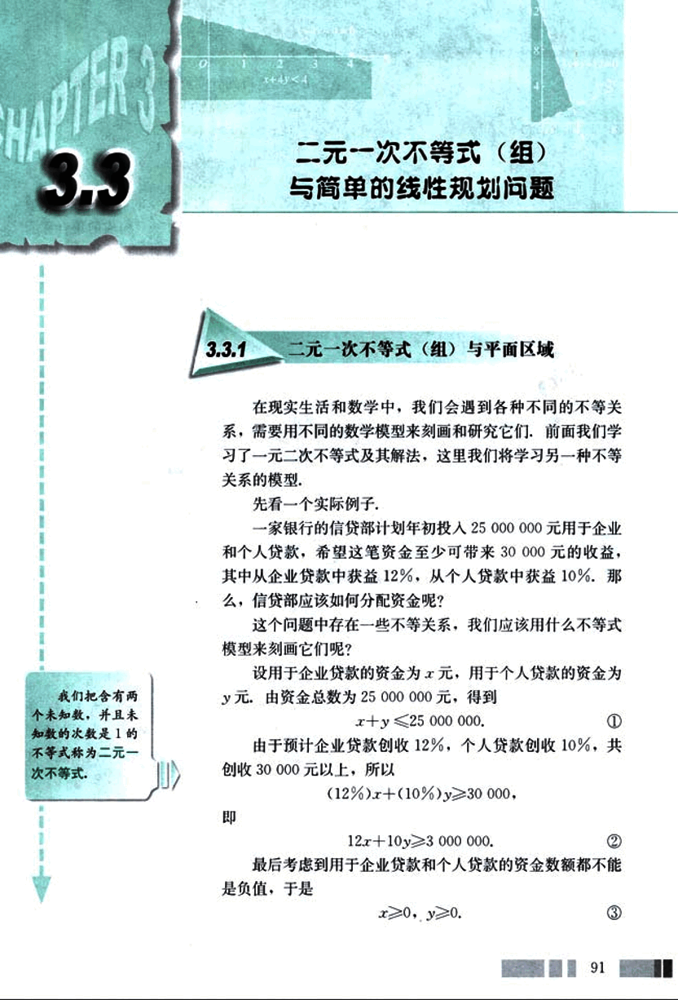
105

# CHAPTER 3

我们把由几个二元一次不等式组成的不等式组称为二元一次不等式组.

将①②③合在一起，得到分配资金应该满足的条件：
```
x + y ≤ 25 000 000,
12x + 10y ≥ 3 000 000,
x ≥ 0,
y ≥ 0.
```

满足二元一次不等式(组)的x和y的取值构成有序数对(x, y)，所有这样的有序数对(x, y)构成的集合称为二元一次不等式(组)的解集，有序数对可以看成直角坐标平面内点的坐标，于是，二元一次不等式(组)的解集就可以看成直角坐标系内的点构成的集合.


## 思考？

我们知道，一元一次不等式(组)的解集可以表示为数轴上的区间，
例如，$\begin{cases} x+3>0, \\ x-4<0 \end{cases}$ 的解集为数轴上的一个区间（图3.3-1），那么，在直角坐标系内，二元一次不等式(组)的解集表示什么图形呢？


我们不妨先研究一个具体的二元一次不等式 $x - y < 6$ 的解集所表示的图形.

如图3.3-2，在平面直角坐标系中，$x - y = 6$ 表示一条直线，平面内所有的点被直线 $x - y = 6$ 分成三类：在直线 $x - y = 6$ 上的点；在直线 $x - y = 6$ 左上方的区域内的点；在


92

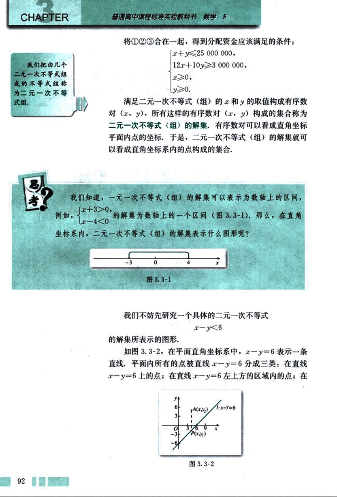
106

# 第三章 不等式

## 直线 $x - y = 6$ 右下方的区域内的点

设点 $P(x, y_1)$ 是直线上的点，选取点 $A(x, y_2)$，使它的坐标满足不等式 $x - y < 6$，填表 3-1，并在图 3.3-2 中标出点 P 和点 A.

表 3-1

| 横坐标 | x | -3 | -2 | -1 | 0 | 1 | 2 | 3 |
|---|---|---|---|---|---|---|---|---|
| 点 P 的纵坐标 $y_1$ |  |  |  |  |  |  |  |  |
| 点 A 的纵坐标 $y_2$ |  |  |  |  |  |  |  |  |


当点 A 与点 P 有相同的横坐标时，它们的纵坐标有什么关系？据此说说，直线 l 左上方点的坐标与不等式 $x - y < 6$ 有什么关系？直线 l 右下方点的坐标呢？

可以发现，在平面直角坐标系中，以二元一次不等式 $x - y < 6$ 的解为坐标的点都在直线的左上方；反过来，直线左上方点的坐标都满足不等式 $x - y < 6$。因此，在平面直角坐标系中，不等式 $x - y < 6$ 表示直线 $x - y = 6$ 左上方的平面区域，如图 3.3-3。类似地，二元一次不等式 $x - y > 6$ 表示直线 $x - y = 6$ 右下方的平面区域（图 3.3-4）。直线 $x - y = 6$ 叫做这两个区域的边界 (boundary)。这里，我们把直线 $x - y = 6$ 画成虚线，以表示区域不包括边界。

[图3.3-3](images/3.3-3.png)
[图3.3-4](images/3.3-4.png)

一般地，在平面直角坐标系中，二元一次不等式 $Ax + By + C < 0$


93

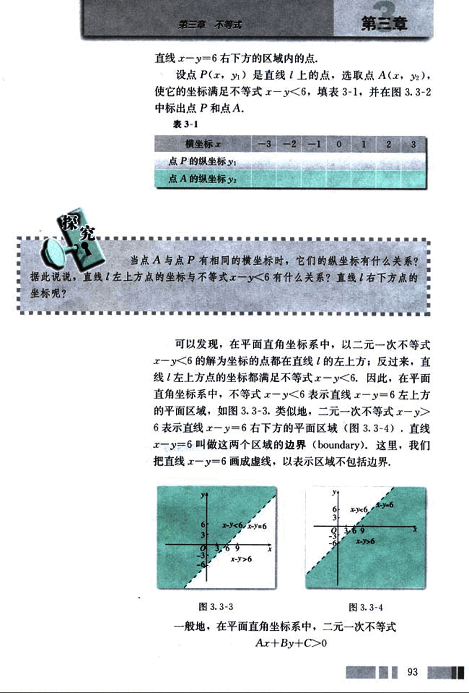
107

# CHAPTER 3

普通高中课程标准实验教科书 数学 5

表示直线Ax+By+C=0某一侧所有点组成的平面区域， 我们把直线画成虚线，以表示区域不包括边界， 不等式

Ax+By+C≥0

表示的平面区域包括边界，把边界画成实线.

对于直线Ax+By+C=0同一侧的所有点，把它的坐标(x, y)代入Ax+By+C，所得的符号都相同，因此只需要在直线Ax+By+C=0的同一侧取某个特殊点(x₀, y₀)作为测试点，由Ax₀+By₀+C的符号就可以断定Ax+By+C>0表示的是直线Ax+By+C=0哪一侧的平面区域，

下面我们看几个例子：

## 例 1

画出不等式x+4y<4表示的平面区域。

解：先作出边界x+4y=4，因为这条线上的点都不满足x+4y<4，所以画成虚线。

取原点(0, 0)，代入x+4y−4=0。因为

0+4×0−4=−4<0，

所以原点(0, 0)在x+4y−4<0表示的平面区域内，不等式x+4y<4表示的区域如图3.3-5.

[图3.3-5](images/3.3-5.png)

## 例 2

用平面区域表示不等式组

```
y ≤ -3x + 12,
x < 2y
```

的解集.

分析：由于所求平面区域的点的坐标要同时满足两个不等式，因此二元一次不等式组表示的平面区域是各个不等式的公共区域.

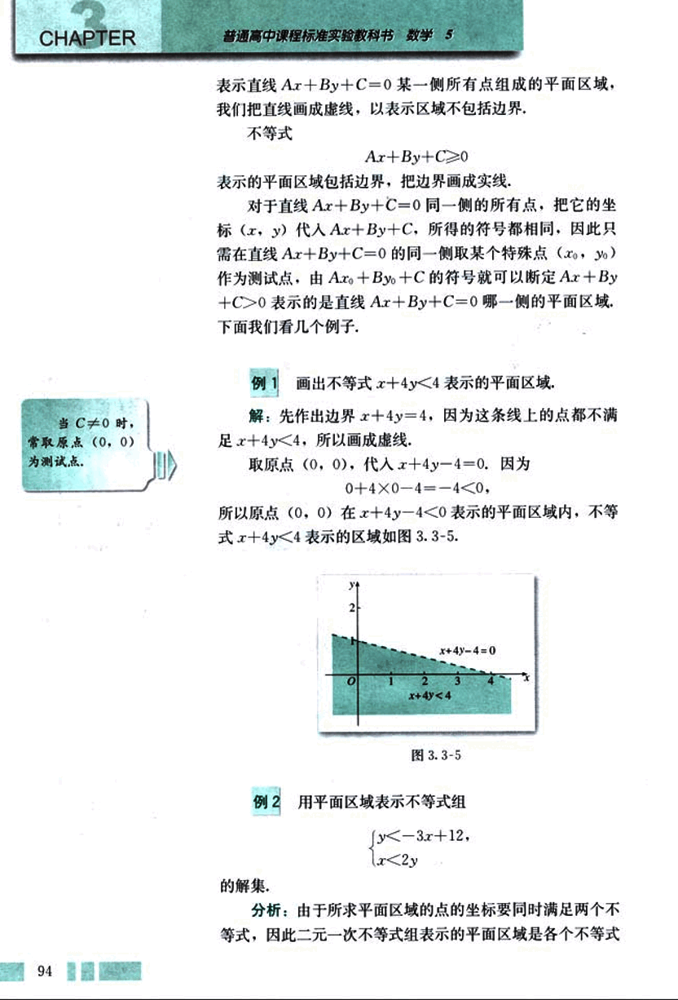
108

# 第三章 不等式

表示的平面区域的交集，即各个不等式表示的平面区域的公共部分。

解：不等式 $y < -3x + 12$ 表示直线 $y = -3x + 12$ 下方的区域；不等式 $x < 2y$ 表示直线 $y = \frac{1}{2}x$ 上方的区域，取两区域重叠的部分，图 3.3-6 中的阴影部分就表示原不等式组的解集。

[图3.3-6](images/3.3-6.png)

例 3  某人准备投资 1200 万元兴办一所完全中学，对教育市场进行调查后，他得到了下面的数据表格（以班级为单位）：

| 学段 | 班级学生数 | 配备教师数 | 硬件建设(万元) | 教师年薪(万元) |
|---|---|---|---|---|
| 初中 | 45 | 2 | 26/班 | 2/人 |
| 高中 | 40 | 3 | 54/班 | 2/人 |

分别用数学关系式和图形表示上述限制条件。

解：设开设初中班 x 个，高中班 y 个，根据题意，总共招生班数应限制在 20～30 之间，所以有

$20 \le x + y \le 30$.

考虑到所投资金的限制，得到

$26x + 54y + 2 \times 2x + 2 \times 3y \le 1200$,

即

$x + 2y \le 40$.

另外，开设的班数不能为负，则

$x \ge 0$,  $y \ge 0$.

把上面四个不等式合在一起，得到：

95

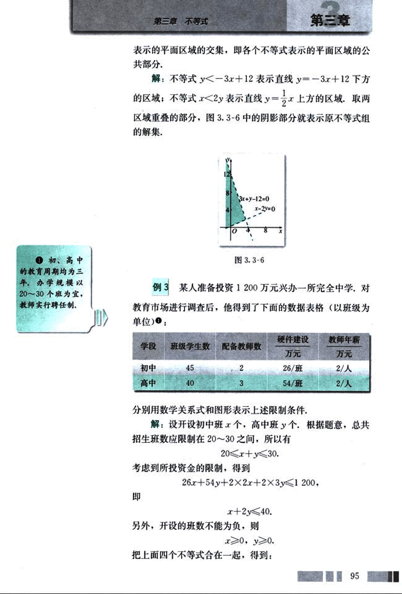
109

# CHAPTER 3

普通高中课程标准实验教科书 数学 5

$20 \le x + y \le 30,$
$x + 2y \le 40,$
$x \ge 0,$
$y \ge 0.$

用图形表示这个限制条件，得到图 3.3-7 中的平面区域（阴影部分）。

[图3.3-7](images/3.3-7.png)

# 例 4

一个化肥厂生产甲、乙两种混合肥料，生产 1 车皮甲种肥料的主要原料是磷酸盐 4t，硝酸盐 18t；生产 1 车皮乙种肥料需要的主要原料是磷酸盐 1t，硝酸盐 15t。现库存磷酸盐 10t，硝酸盐 66t，在此基础上生产这两种混合肥料，列出满足生产条件的数学关系式，并画出相应的平面区域。

解：设 x，y 分别为计划生产甲、乙两种混合肥料的车皮数，于是满足以下条件：

$\begin{cases}
4x + y \le 10, \\
18x + 15y \le 66, \\
x \ge 0, \\
y \ge 0.
\end{cases}$

在直角坐标系中可表示成图 3.3-8 中的平面区域（阴影部分）。

[图3.3-8](images/3.3-8.png)

96

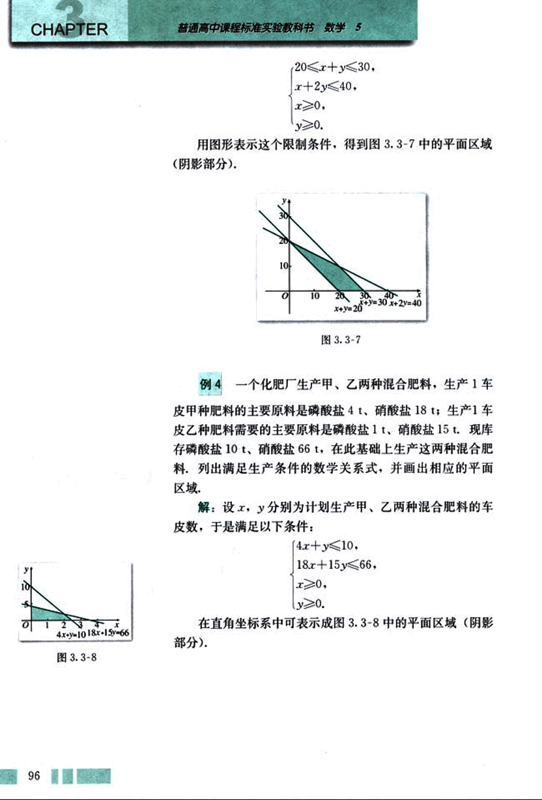
110

# 第三章 不等式

## 练习

1. 不等式 x - 2y + 6 > 0 表示的区域在直线 x - 2y + 6 = 0 的 ( )
(A) 右上方.  (B) 右下方.  (C) 左上方.  (D) 左下方.

2. 不等式 3x + 2y - 6 < 0 表示的平面区域是 ( ).


3. 不等式组 $\begin{cases} x - 3y + 6 \ge 0 \\ x - y + 2 < 0 \end{cases}$ 表示的平面区域是 ( ).


4. 一个小型家具厂计划生产两种类型的桌子 A 和 B. 每类桌子都要经过打磨、着色、上漆三道工序，桌子 A 需要 10 min 打磨，6 min 着色，6 min 上漆；桌子 B 需要 5 min 打磨，12 min 着色，9 min 上漆。如果一个工人每天打磨和上漆分别至多工作 450 min，着色每天至多工作 480 min，请你列出满足生产条件的数学关系式，并在直角坐标系中画出相应的平面区域.


## 3.3.2 简单的线性规划问题

在现实生产、生活中，经常会遇到资源利用、人力调配、生产安排等问题.

97

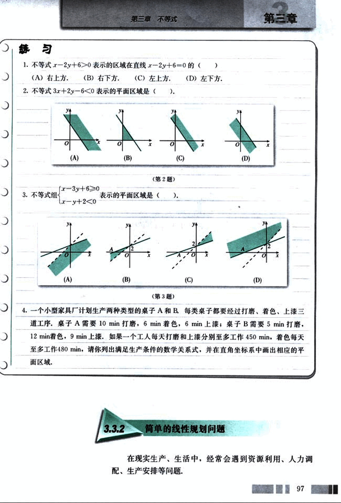
111

# CHAPTER 2

普通高中课程标准实验教科书 数学 5

例如，某工厂用A、B两种配件生产甲、乙两种产品，每生产一件甲产品使用4个A配件耗时1h，每生产一件乙产品使用4个B配件耗时2h，该厂每天最多可从配件厂获得16个A配件和12个B配件，按每天工作8h计算，该厂所有可能的日生产安排是什么？

设甲、乙两种产品分别生产x、y件，由已知条件可得二元一次不等式组：

$\begin{cases}
x+2y \le 8 \\
4x \le 16 \\
4y \le 12 \\
x \ge 0 \\
y \ge 0
\end{cases}$ (1)

如图3.3-9，将上述不等式组表示成平面上的区域，图中的阴影部分中的整点（坐标为整数的点）就代表所有可能的日生产安排，即当点P(x,y)在上述平面区域中时，所安排的生产任务x，y才有意义。

[图3.3-9](images/3.3-9.png)

进一步，若生产一件甲产品获利2万元，生产一件乙产品获利3万元，采用哪种生产安排利润最大？

设生产甲产品x件，乙产品y件时，工厂获得的利润为z，则z=2x+3y。这样，上述问题就转化为：当x，y满足不等式组(1)并且为非负整数时，z的最大值是多少？

把z=2x+3y变形为$y = -\frac{2}{3}x + \frac{z}{3}$，这是斜率为$-\frac{2}{3}$，在y轴上的截距为$\frac{z}{3}$的直线，当z变化时，可以得到一族互相平行的直线（图3.3-10）。由于这些直线的斜率是确定的，因此只要给定一个点（例如(1,2)），就能确定一条直线


98

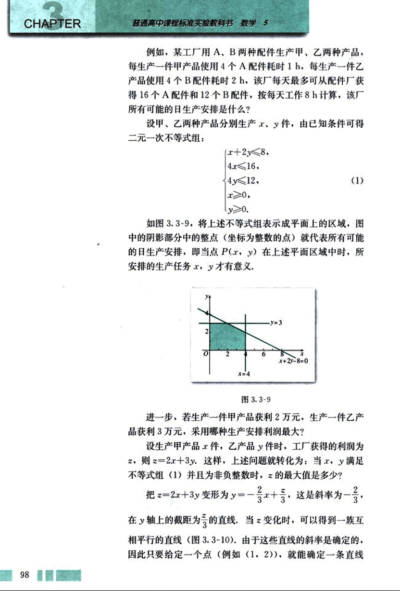
112

# 第三章 不等式

## 第三章

(y = -$\frac{2}{3}$x + $\frac{8}{3}$). 这说明，截距可以由平面内的一个点的坐标唯一确定，可以看到，直线 y = -$\frac{2}{3}$x + $\frac{8}{3}$ 与表示不等式组 (1) 的区域的交点坐标满足不等式组 (1)，而且当截距最大时，z 取最大值。因此，问题可以转化为当直线 y = -$\frac{2}{3}$x + $\frac{8}{3}$ 与不等式组 (1) 确定的平面区域有公共点时，在区域内找一个点 P，使直线经过点 P 时截距最大。

由图 3.3-10 可以看出，当直线 y = -$\frac{2}{3}$x + $\frac{8}{3}$ 经过直线 x = 4 与直线 x + 2y - 8 = 0 的交点 M(4, 2) 时，截距的值最大，最大值为 $\frac{14}{3}$。这时 2x + 3y = 14。所以，每天生产甲产品 4 件、乙产品 2 件时，工厂可获最大利润 14 万元。

在上述问题中，不等式组 (1) 是一组对变量 x、y 的约束条件，这组约束条件都是关于 x、y 的一次不等式，所以又称为线性约束条件，我们把要求最大值的函数 z = 2x + 3y 称为目标函数 (objective function)，又因这里的 z = 2x + 3y 是关于变量 x、y 的一次解析式，所以又称为线性目标函数 (linear objectives)。目标函数中的变量要满足的线性约束条件除了用一次不等式表示外，有时也用一次方程表示。一般的，在线性约束条件下求线性目标函数的最大值或最小值问题，统称为线性规划 (linear program) 问题。满足线性约束条件的解 (x, y) 叫做可行解 (feasible solution)，由所有可行解组成的集合叫做可行域 (feasible region)，其中，使目标函数取得最大值或最小值的可行解叫做这个问题的最优解。上述问题的可行域就是图 3.3-10 的阴影部分，其中可行解 (4, 2) 为最优解。

[图3.3-10](images/3.3-10.png)

99

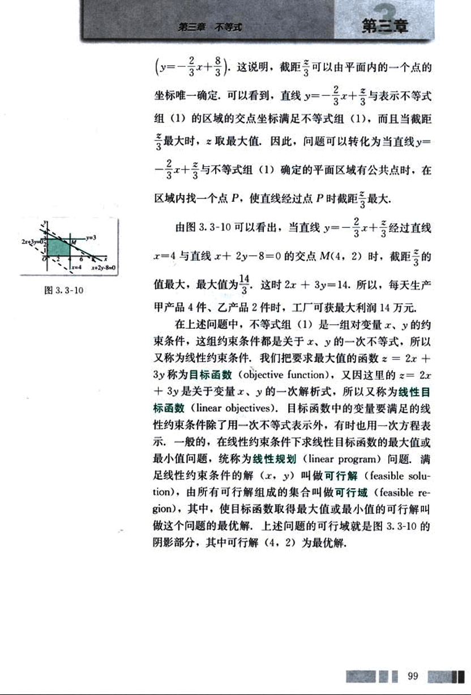
113

# CHAPTER

普通高中课程标准实验教科书 数学 5

## 探究

(1)在上述问题中,如果每生产一件甲产品获利3万元,每生产一件乙产品获利2万元,又应当如何安排生产才能获得最大利润?再换几组数据试试.

(2)由上述过程,你能得出最优解与可行域之间的关系吗?

## 例5

营养学家指出,成人良好的日常饮食应该至少提供0.075 kg的碳水化合物,0.06kg的蛋白质,0.06kg的脂肪.1kg食物A含有0.105kg碳水化合物,0.07kg蛋白质,0.14 kg脂肪,花费28元;而1kg食物B含有0.105 kg碳水化合物,0.14kg蛋白质,0.07kg脂肪,花费21元.

为了满足营养专家指出的日常饮食要求,同时使花费最低,需要同时食用食物A和食物B多少kg?

### 分析:

将已知数据列成下表:

| 食物/kg | 碳水化合物/kg | 蛋白质/kg | 脂肪/kg |
|---|---|---|---|
| A | 0.105 | 0.07 | 0.14 |
| B | 0.105 | 0.14 | 0.07 |

### 解:

设每天食用x kg食物A, y kg食物B,总成本为z.那么

$\begin{cases}
0.105x + 0.105y \ge 0.075 \\
0.07x + 0.14y \ge 0.06 \\
0.14x + 0.07y \ge 0.06 \\
x \ge 0 \\
y \ge 0
\end{cases}$  ①

目标函数为

$z = 28x + 21y$.

二元一次不等式组①等价于

$\begin{cases}
7x + 7y \ge 5 \\
7x + 14y \ge 6 \\
14x + 7y \ge 6 \\
x \ge 0 \\
y \ge 0
\end{cases}$ ②


100

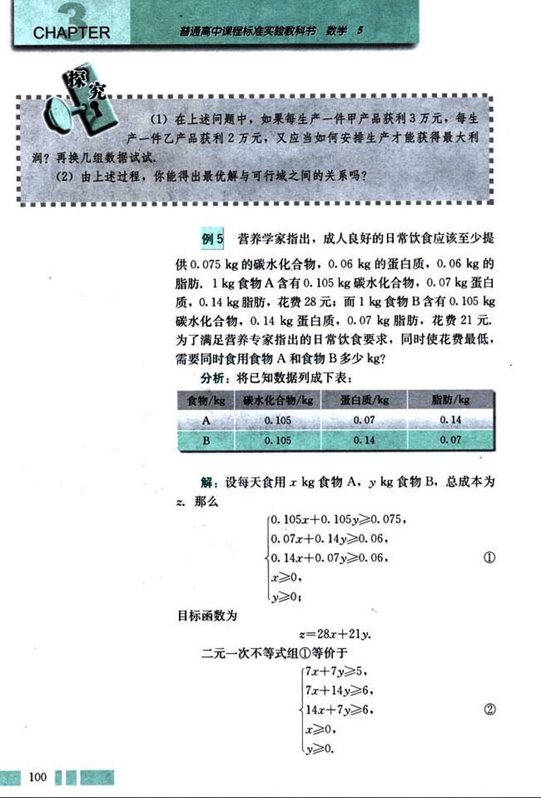
114

# 第三章 不等式

## 作图

作出二元一次不等式组②所表示的平面区域（图 3.3-11），即可行域。

[图](images/图3.3-11.png)

## 考虑

考虑 $z = 28x + 21y$，将它变形为 $y = -\frac{4}{3}x + \frac{z}{28}$。这是斜率为 $-\frac{4}{3}$，随 $z$ 变化的一族平行直线，$\frac{z}{28}$ 是直线在 $y$ 轴上的截距。当 $z$ 取最小值时，$z$ 的值最小，当然直线要与可行域相交，即在满足约束条件时目标函数 $z = 28x + 21y$ 取得最小值。由图 3.3-11 可见，当直线 $z = 28x + 21y$ 经过可行域上的点 M 时，截距最小，即 $z$ 最小。


## 解方程组

$\begin{cases} 7x + 7y = 5 \\ 14x + 7y = 6 \end{cases}$

得 M 的坐标为  $x = \frac{1}{7}, y = \frac{4}{7}$。

所以 $z_{min} = 28x + 21y = 16$。

由此可知，每天食用食物 A 约 143 g，食物 B 约 571 g，能够满足日常饮食要求，又使花费最低，最低成本为 16 元。

## 例 6

在上一节例 3 中，若根据有关部门的规定，初中每人每年可收取学费 1600 元，高中每人每年可收取学费 2700 元，那么开设初中班和高中班各多少个，每年收取的学费总额最多？


101

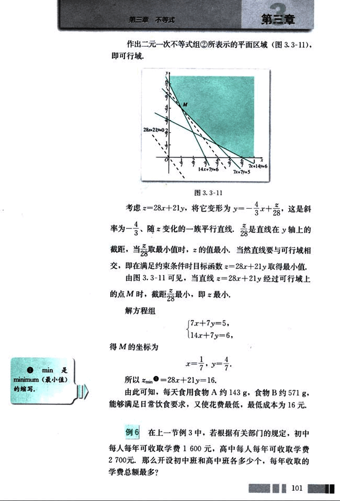
115

# CHAPTER 3

普通高中课程标准实验教科书 数学 5

解：设开设初中班x个，高中班y个，收取的学费总额为z万元，

此时，目标函数为$z = 0.16 \times 45x + 0.27 \times 40y$，可行域如图3.3-7.

把$z = 7.2x + 10.8y$变形为$y = -\frac{2}{3}x + \frac{5}{54}z$，得到斜率为$-\frac{2}{3}$，在y轴上的截距为$\frac{5}{54}z$，随之变化的一族平行直线。

由图3.3-12可以看出，当直线$z = 7.2x + 10.8y$经过可行域上的点M时，截距$\frac{5}{54}z$最大，即z最大。


解方程组
$\begin{cases}
x + y = 30 \\
x + 2y = 40
\end{cases}$

得M的坐标为  x = 20, y = 10.

所以$z_{max} = 7.2 \times 20 + 10.8 \times 10 = 252$.

由此可知，开设20个初中班和10个高中班，收取的学费最多，为252万元。


例7  在上一节例4中，若生产1车皮甲种肥料，产生的利润为10 000元；生产1车皮乙种肥料，产生的利润为5 000元，那么分别生产甲、乙两种肥料各多少车皮，能够产生最大的利润？

解：设生产甲种肥料x车皮，乙种肥料y车皮，能够产生利润z万元，目标函数为$z = x + 0.5y$，可行域如图3.3-8.

把$z = x + 0.5y$变形为$y = -2x + 2z$，得到斜率为-2，


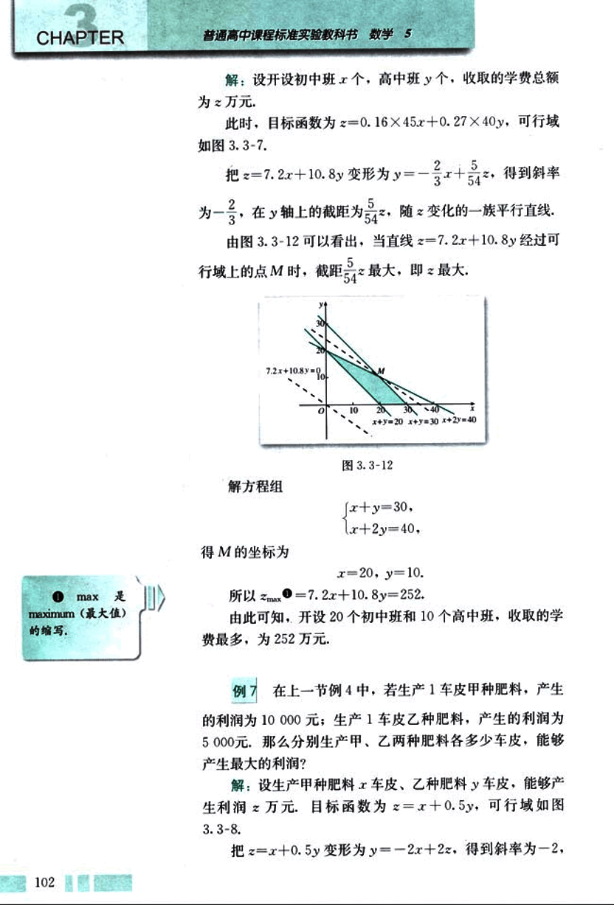
116

# 第三章 不等式

在y轴上的截距为2z，随z变化的一族平行直线。由图3.3-13可以看出，当直线y=-2x+2z经过可行域上的点M时，截距2z最大，即z最大。


解方程组
```
18x + 15y = 66,
4x + y = 10,
```
得M的坐标为  x=2, y=2.

所以$z_{max} = x + 0.5y = 3$.

由此可知，生产甲种、乙两种肥料各2车皮，能够产生最大利润，最大利润为3万元。

# 练习

1. 解下列线性规划问题：
    (1) 求z=2x+y的最大值，使x，y满足约束条件
    ```
    y ≤ x,
    x + y ≤ 1,
    y ≥ -1.
    ```
    (2) 求z=3x+5y的最大值和最小值，使x，y满足约束条件
    ```
    5x + 3y ≤ 15,
    y ≤ x + 1,
    x - 5y ≤ 3.
    ```

2. 某厂拟生产甲、乙两种适销产品，每件销售收入分别为3 000元、2 000元。甲、乙产品都需要在A、B两种设备上加工，在每台A、B上加工1件甲所需工时分别为1h、2h。加工1件乙所需工时分别为2h、1h。A、B两种设备每月有效使用台时数分别为400h和500h。如何安排生产可使收入最大？

103

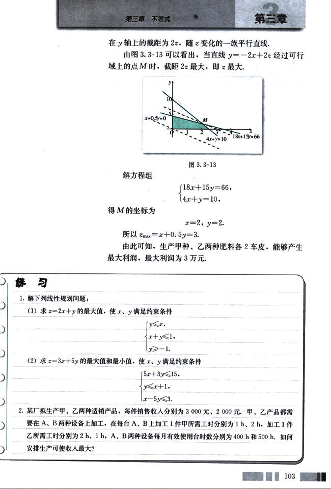
117

# CHAPTER 3

## 错在哪儿

在一节解不等式课上，刘老师给出了一道题，让同学们先求解，题目是这样的：

已知

$\begin{cases} 1 \le x+y \le 3 \\ -1 \le x-y \le 1 \end{cases}$

求$4x+2y$的值域。

题目给出后，同学们马上投入紧张的解答中，结果很快出来了，可是，大家解出的结果却有两个，而且都觉得自己的没错，于是同学们分成了两派，展开了激烈的辩论，结果谁也说服不了谁，于是刘老师让两边各派一名代表，把自己的解法写到黑板上。

**第一种解法：**联立①②这两个不等式，用类似于解二元一次方程组的方法分别求出$x$和$y$的范围，然后直接代入后面的式子求范围，即：

①+②，得  $0 \le 2x \le 4$，即$0 \le 4x \le 8$.  (3)

②×(-1)，得  $-1 \le y-x \le 1$.  (4)

①+④，得  $0 \le 2y \le 4$.  (5)

代入$4x+2y$，得  $0 \le 4x+2y \le 12$.


**第二种解法：**因为

$4x+2y=3(x+y)+(x-y)$,

且由已知条件有

$3 \le 3(x+y) \le 9$, (6)

$-1 \le x-y \le 1$. (7)

将⑥⑦二式相加，得

$2 \le 4x+2y=3(x+y)+(x-y) \le 10$.

为什么两种解法的结果不一样呢？

学习了本节的内容，你应该能够解释出现这种情况的原因了吧？实际上，不等式①②确定了一个平面区域(图1)。由图1可以看出，$x$和$y$并不是相互独立的关系，而是由不等式组决定的相互制约的关系，$x$取得最大(小)值时，$y$并不能同时取得最大(小)值；$y$取得最大(小)值时，$x$并不能同时取得最大(小)值。第一种解法的问题正在于此，由于忽略了[图1](images/图1.png)
104

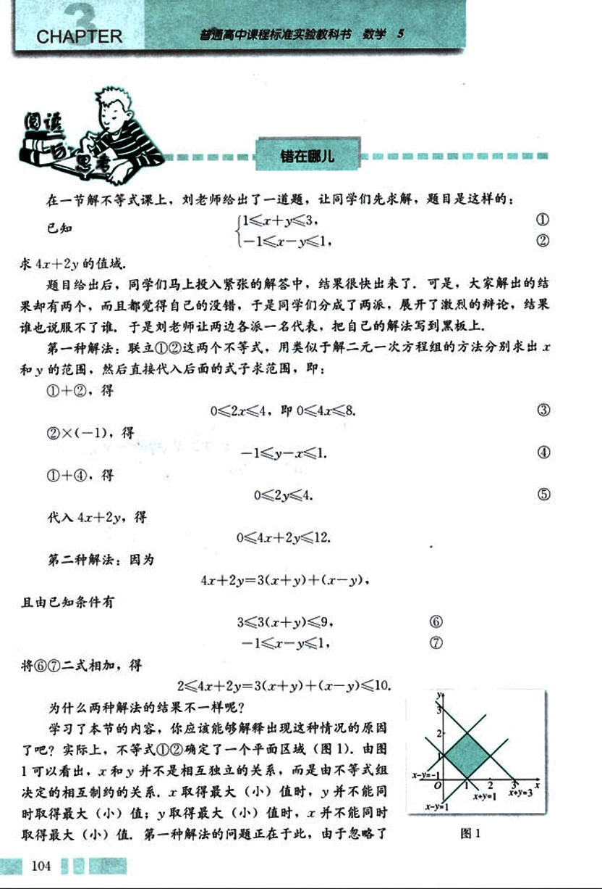
118

# 第三章 不等式

x和y的相互制约关系，所得出的取值范围比实际的范围要大，第二种解法整体上保持了
x和y的相互制约关系，因而得出的范围是准确的。
同学们现在明白了吗？

## 习题3.3

**A组**

1. 画出下列不等式表示的平面区域：
(1)  x+y≥2;  (2) 2x-y>2;  (3) y≤-2;  (4) x≥3.

2. 画出不等式组 $\begin{cases} -x+y-2\le0 \\ x+y-4\le0 \\ x-3y+3\ge0 \end{cases}$ 表示的平面区域。

3. 电视台应某企业之约播放两套连续剧，其中，连续剧甲每次播放时间为80 min，广告时间为
1 min，收视观众为60万；连续剧乙每次播放时间为40 min，广告时间为1 min，收视观众为
20万。已知此企业与电视台达成协议，要求电视台每周至少播放6 min广告，而电视台每周
只能为该企业提供不多于320 min的节目时间。如果你是电视台的制片人，电视台每周应播映
两套连续剧各多少次，才能获得最高的收视率？

4. 某家电生产企业根据市场调查分析，决定调整产品生产方案，准备每周（按40个工时计算）
生产空调器、彩电、冰箱共120台，且冰箱至少生产20台。已知生产这些家电产品每台所需
工时和每台产值如下表：

| 家电名称 | 空调器 | 彩电 | 冰箱 |
|---|---|---|---|
| 工时 | $\frac{1}{2}$ | $\frac{1}{3}$ | $\frac{1}{4}$ |
| 产值/千元 | 4 | 3 | 2 |

问每周应生产空调器、彩电、冰箱各多少台，才能使产值最高？最高产值是多少？（以千元为
单位）

105

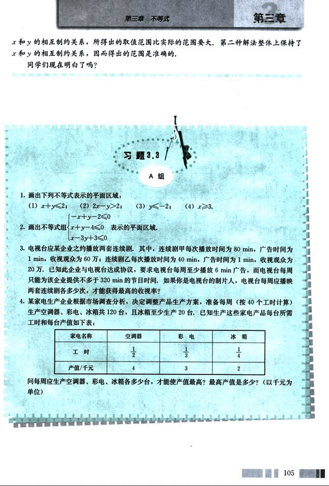
119

# CHAPTER 3

## B 组

1. 画出二元一次不等式组
$\begin{cases}
2x+3y \le 12 \\
2x+3y > -6 \\
x \ge 0 \\
y \ge 0
\end{cases}$
所表示的平面区域.

2. 画出$(x+2y-1)(x-y+3)>0$表示的平面区域.

3. 甲、乙两个粮库要向A、B两镇运送大米，已知甲库可调出100 t大米，乙库可调出80 t大米，A镇需70 t大米，B镇需110 t大米。两库到两镇的路程和运费如下表：

|          | 路程/km | 运费(元·t·km⁻¹) |
|----------|----------|----------------------|
|          | 甲库     | 乙库     | 甲库     | 乙库     |
| A镇      | 20       | 15       | 12       | 12       |
| B镇      | 25       | 20       | 10       | 8        |

(1) 这两个粮库各运往A、B两镇多少大米，才能使总运费最省？此时总运费是多少？

(2) 最不合理的调运方案是什么？它使国家造成的损失是多少？

106

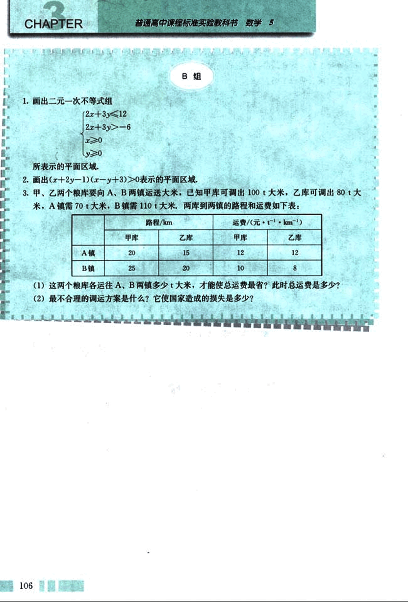
120

# 第三章 不等式

## 用Excel 解线性规划问题举例

通过前面的学习，我们已经能利用平面区域来解决线性规划问题了。事实上，许多计算机软件都提供了解线性规划问题简单而有效的工具。下面我们就以Excel为例，用它的“规划求解”工具解第3.3.2节例1的线性规划问题，具体操作步骤如下：

1. 打开Excel菜单栏中“工具”选项的菜单，单击其中的“加载宏”命令，就可以打开“加载宏”的窗口，选中其中的“规划求解”，单击“确定”按钮。

2. 在工作表中输入例1中的数据和限制条件，并将单元格B2、C2、D3分别作为变量x、y的解和最值的输出区域，如图1所示。

|   | A | B | C | D | E | F |
|---|---|---|---|---|---|---|
| 1 |  | x | y | 计算值 | 条件限制 |  |
| 2 | 变元 |  |  |  |  |  |
| 3 | 目标函数 | 28 | 21 |  |  |  |
| 4 | 条件1 | 0.105 | 0.105 | 0.075 |  |  |
| 5 | 条件2 | 0.07 | 0.14 | 0.06 |  |  |
| 6 | 条件3 | 0.14 | 0.07 | 0.06 |  |  |
| 7 |  |  |  |  |  |  |

图1

3. 在单元格D3中输入公式“=$B$2\*B3+$C$2\*C3”（该公式即为目标函数），把这个公式分别复制到单元格D4（双击D4可见公式变为“=$B$2\*B4+$C$2\*C4”，表示0.105x+0.105y）、D5和D6。

4. 选中单元格D3，打开“工具”菜单，单击“规划求解”命令，弹出“规划求解参数”对话框，如图2所示。在“等于”栏中选择“最小值”，在“可变单元格”框中输入“$B$2:$C$2”。

[图2](images/图2.png)

单击“约束”中的“添加”按钮，打开“添加约束”对话框，在“单元格引用位置”框中输入“$D$4”，在下拉式比较符列表中选择“>=”，在“约束值[C]:”框中输入“$E$4”（表示约束条件0.105 x+0.105 y≥0.075），如图3所示。单击“添加”按钮。

107

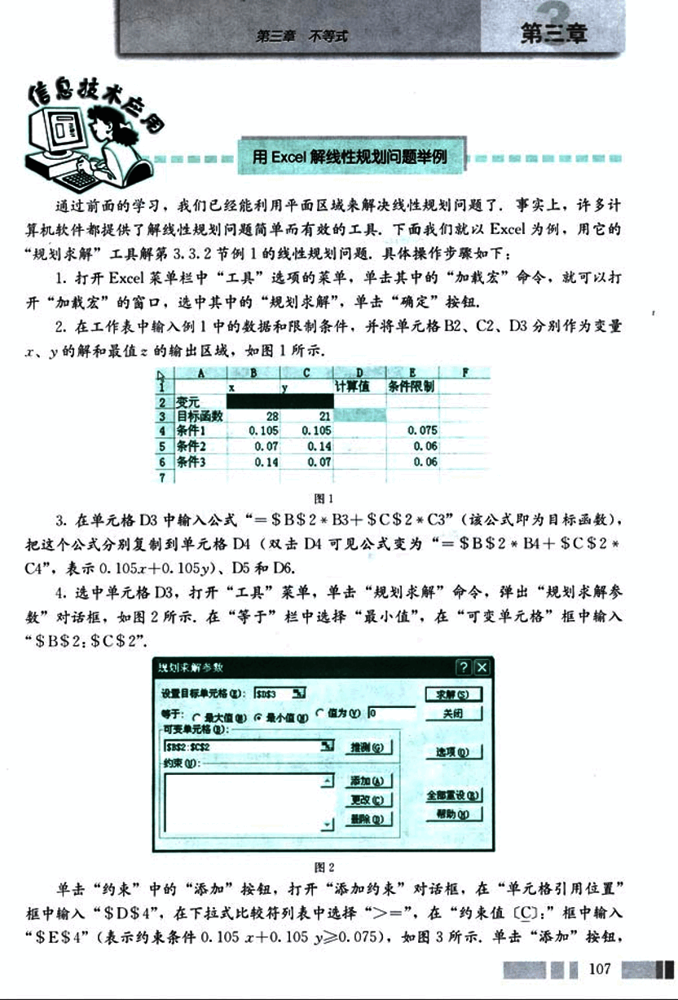
121

# CHAPTER 3

普通高中课程标准实验教科书 数学 5

类似地完成其他约束条件的输入，即“$D$5$E$5”、“$D$6>=$E$6”、“$D$4>=$E$4”。

| A | B | C | D | E |
|---|---|---|---|---|
| 1 | 变元 | x | y | 计算值 | 条件限制 |
| 2 |  |  |  |  |  |
| 3 | 目标函数 | 28 | 21 | 0 |  |
| 4 | 条件1 | 0.105 | 0.105 | 0 | 0.075 |
| 5 | 条件2 | 0.07 | 0.14 | 0 | 0.06 |
| 6 | 条件3 | 0.14 | 0.07 | 0 | 0.06 |
图3

最后，输入变元非负条件“$B$2:$C$2>=0”（图4）。

[图4](images/图4.png)

单击“确定”按钮后，结果如图5所示。

[图5](images/图5.png)

点击“求解”按钮完成求解（图6）：

| A | B | C | D | E |
|---|---|---|---|---|
| 1 |  | x | y | 计算值 | 条件限制 |
| 2 | 变元 |  |  |  |  |
| 3 | 目标函数 | 28 | 21 | 16 |  |
| 4 | 条件1 | 0.105 | 0.105 | 0.075 | 0.075 |
| 5 | 条件2 | 0.07 | 0.14 | 0.09 | 0.06 |
| 6 | 条件3 | 0.14 | 0.07 | 0.06 | 0.06 |
图6

即当$x$=0.142 857，$y$=0.571 429时，$min$=16.

上面我们只举了一个简单的线性规划例子，使用Excel还可以解决多变量的线性规划问题和非线性规划问题，有兴趣的同学可以参考Excel中的“规划求解”帮助菜单。

108

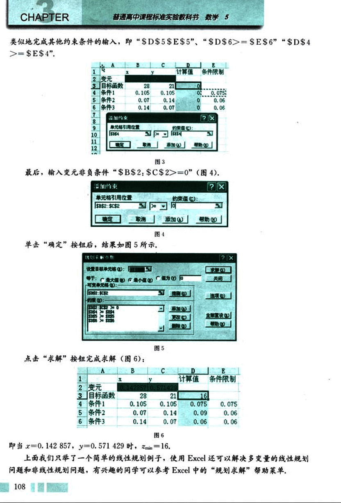


