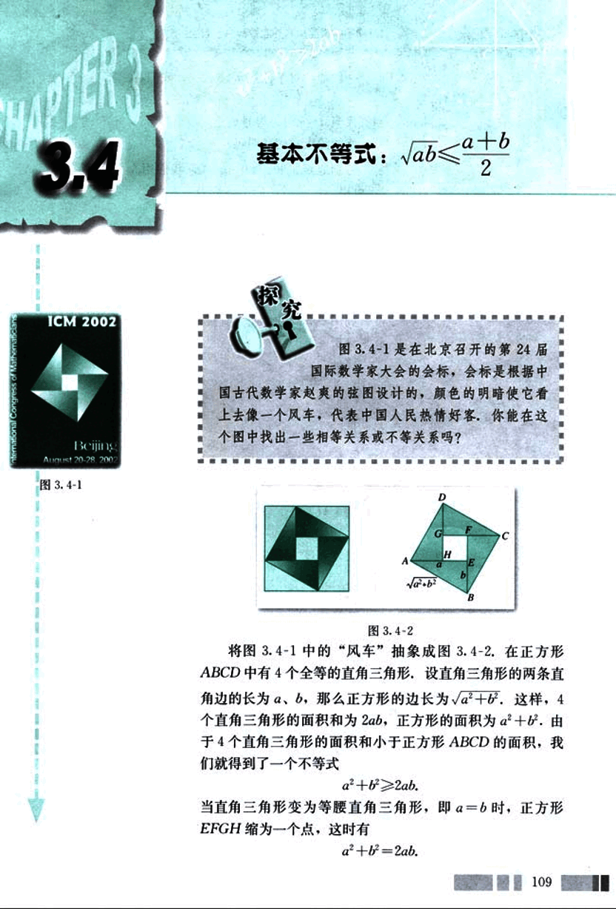
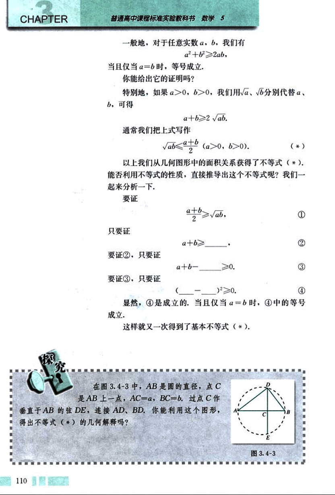
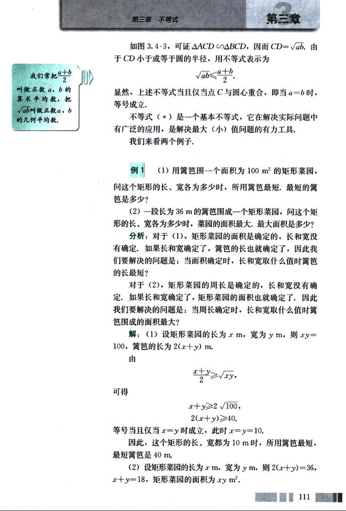
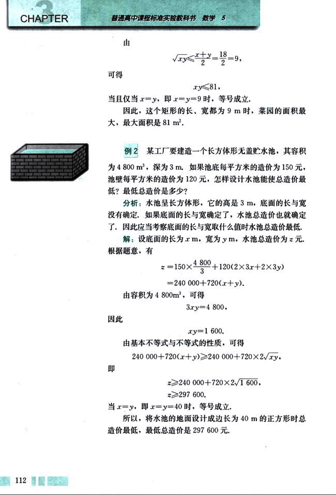
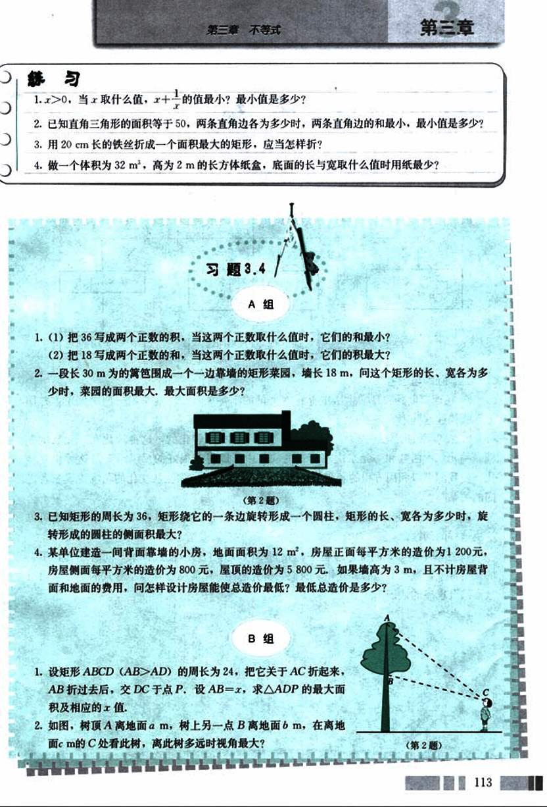

# 3.4　基本不等式

122

# CHAPTER 3

## 3.4 基本不等式: $\sqrt{ab} \le \frac{a+b}{2}$

图 3.4-1 是在北京召开的第 24 届国际数学家大会的会标，会标是根据中国古代数学家赵爽的弦图设计的，颜色的明暗使它看起来像一个风车，代表中国人民热情好客，你能在这个图中找出一些相等关系或不等关系吗？

[图3.4-1](images/3.4-1.png)

图 3.4-2

[图3.4-2](images/3.4-2.png)

将图 3.4-1 中的“风车”抽象成图 3.4-2。在正方形 ABCD 中有 4 个全等的直角三角形，设直角三角形的两条直角边的长为 a、b，那么正方形的边长为 $\sqrt{a^2+b^2}$。这样，4 个直角三角形的面积和为 2ab，正方形的面积为 $a^2+b^2$。由于 4 个直角三角形的面积和小于正方形 ABCD 的面积，我们就得到了一个不等式

$a^2+b^2 \ge 2ab$.

当直角三角形变为等腰直角三角形，即 a=b 时，正方形 EFGH 缩为一个点，这时有

$a^2+b^2 = 2ab$.

109

123

# CHAPTER 3

普通高中课程标准实验教科书 数学 5

一般地，对于任意实数 $a, b$，我们有
$a^2 + b^2 ≥ 2ab$,

当且仅当 $a = b$ 时，等号成立。

你能给出它的证明吗？

特别地，如果 $a > 0, b > 0$，我们用 $\sqrt{a}$、$\sqrt{b}$ 分别代替 $a$、$b$，可得

$a + b ≥ 2\sqrt{ab}$.

通常我们把上式写作

$\sqrt{ab} ≤ \frac{a + b}{2} \quad (a > 0, b > 0)$.

(*)

以上我们从几何图形中的面积关系获得了不等式(*)。能否利用不等式的性质，直接推导出这个不等式呢？我们一起来分析一下。

要证

$\frac{a + b}{2} ≥ \sqrt{ab}$.     ①

只要证

$a + b ≥$ ______.     ②

要证②，只要证

$a + b -$ ______ $≥ 0$.     ③

要证③，只要证

(______ - ______)$^2 ≥ 0$.     ④

显然，④是成立的。当且仅当 $a = b$ 时，④中的等号成立。

这样就又一次得到了基本不等式(*)。

[图3.4-3](images/3.4-3.png)

在图 3.4-3 中，AB 是圆的直径，点 C 是 AB 上一点，AC = a，BC = b。过点 C 作垂直于 AB 的弦 DE，连接 AD、BD，你能利用这个图形，得出不等式 (*) 的几何解释吗？

110

124

# 第三章 不等式

## 如图 3.4-3，可证△ACD ≅ △BCD，因而 CD = √ab。由于 CD 小于或等于圆的半径，用不等式表示为

$\sqrt{ab} \le \frac{a+b}{2}$

显然，上述不等式当且仅当点 C 与圆心重合，即当 a=b 时，等号成立。

不等式 (*) 是一个基本不等式，它在解决实际问题中 有广泛的应用，是解决最大(小)值问题的有力工具。

我们来看两个例子。

## 例 1

(1) 用篱笆围一个面积为 100 m² 的矩形菜园，问这个矩形的长、宽各为多少时，所用篱笆最短，最短的篱笆是多少？

(2) 一段长为 36 m 的篱笆围成一个矩形菜园，问这个矩形的长、宽各为多少时，菜园的面积最大，最大面积是多少？

**分析:** 对于 (1)，矩形菜园的面积是确定的，长和宽没有确定，如果长和宽确定了，篱笆的长也就确定了，因此我们要解决的问题是：当面积确定时，长和宽取什么值时篱笆的长最短？

对于 (2)，矩形菜园的周长是确定的，长和宽没有确定，如果长和宽确定了，矩形菜园的面积也就确定了，因此我们要解决的问题是：当周长确定时，长和宽取什么值时篱笆围成的面积最大？

**解:** (1) 设矩形菜园的长为 x m，宽为 y m，则 xy = 100，篱笆的长为 2(x+y) m。

由

$\frac{x+y}{2} \ge \sqrt{xy}$

可得

$x+y \ge 2\sqrt{100}$

$2(x+y) \ge 40$

等号当且仅当 x=y 时成立，此时 x=y=10。

因此，这个矩形的长、宽都为 10 m 时，所用篱笆最短，最短篱笆是 40 m。

(2) 设矩形菜园的长为 x m，宽为 y m，则 2(x+y) = 36，x+y=18，矩形菜园的面积为 xy m².

111

125

# CHAPTER 3

普通高中课程标准实验教科书 数学 5

由 $\sqrt{xy} \le \frac{x+y}{2} = 9$,

可得 $xy \le 81$,

当且仅当 $x=y$，即 $x=y=9$ 时，等号成立。

因此，这个矩形的长、宽都为 9 m 时，菜园的面积最大，最大面积是 81 m².

## 例 2

某工厂要建造一个长方体形无盖贮水池，其容积为 4 800 m³，深为 3 m。如果池底每平方米的造价为 150 元，池壁每平方米的造价为 120 元，怎样设计水池能使总造价最低？最低总造价是多少？

分析：水池呈长方体形，它的高是 3 m，底面的长与宽没有确定。如果底面的长与宽确定了，水池总造价也就确定了。因此应当考察底面的长与宽取什么值时水池总造价最低。

解：设底面的长为 x m，宽为 y m，水池总造价为 z 元。

根据题意，有

$z = 150 \times \frac{4800}{3} + 120(2 \times 3x + 2 \times 3y)$

$= 240\ 000 + 720(x+y)$.

由容积为 4 800 m³，可得

$3xy = 4\ 800$,

因此

$xy = 1\ 600$.

由基本不等式与不等式的性质，可得

$240\ 000 + 720(x+y) \ge 240\ 000 + 720 \times 2\sqrt{xy}$.

即

$z \ge 240\ 000 + 720 \times 2\sqrt{1600}$,

$z \ge 297\ 600$.

当 $x=y$，即 $x=y=40$ 时，等号成立。

所以，将水池的地面设计成边长为 40 m 的正方形时总造价最低，最低总造价是 297 600 元.

112

126

# 第三章 不等式

## 练习

1. x>0, 当x取什么值, $x + \frac{1}{x}$ 的值最小? 最小值是多少?

2. 已知直角三角形的面积等于50，两条直角边各为多少时，两条直角边的和最小，最小值是多少？

3. 用20 cm长的铁丝折成一个面积最大的矩形，应当怎样折？

4. 做一个体积为32 m³，高为2 m的长方体纸盒，底面的长与宽取什么值时用纸最少？

## 习题 3.4

### A组

1. (1) 把36写成两个正数的积，当这两个正数取什么值时，它们的和最小？
   (2) 把18写成两个正数的和，当这两个正数取什么值时，它们的积最大？

2. 一段长30 m的篱笆围成一个一边靠墙的矩形菜园，墙长18 m，问这个矩形的长、宽各为多少时，菜园的面积最大，最大面积是多少？

[image1](images/image1.png)

3. 已知矩形的周长为36，矩形绕它的一条边旋转形成一个圆柱，矩形的长、宽各为多少时，旋转形成的圆柱的侧面积最大？

4. 某单位建造一间背面靠墙的小房，地面面积为12 m²，房屋正面每平方米的造价为1200元，房屋侧面每平方米的造价为800元，屋顶的造价为5800元。如果墙高为3 m，且不计房屋背面和地面的费用，问怎样设计房屋能使总造价最低？最低总造价是多少？

### B组

1. 设矩形ABCD (AB>AD)的周长为24，把它关于AC折起来，AB折过去后，交DC于点P。设AB=x，求△ADP的最大面积及相应的值。

2. 如图，树顶A离地面a m，树上另一点B离地面b m，在离地面c m的C处看此树，离此树多远时视角最大？

[image2](images/image2.png)

113

