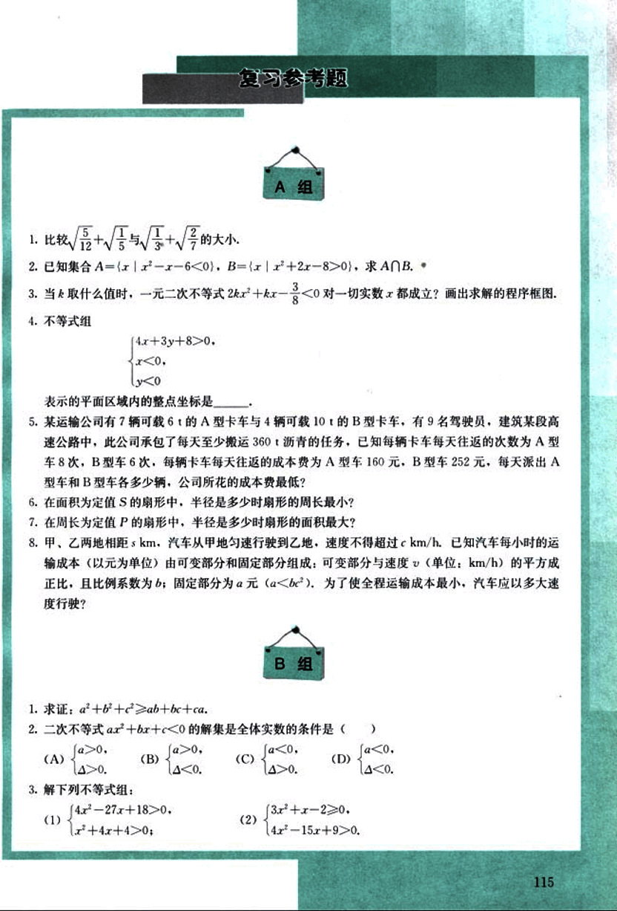
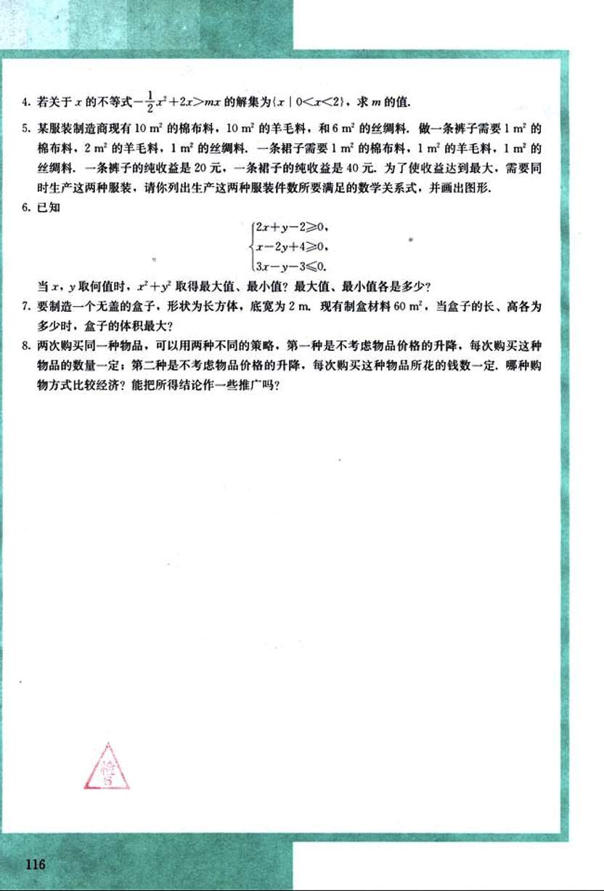

# 复习参考题

128

# 复习参考题

## A组

1. 比较$\sqrt{\frac{5}{12}}+\sqrt{\frac{1}{5}}$与$\sqrt{\frac{1}{3}}+\sqrt{\frac{2}{7}}$的大小。

2. 已知集合A={x|x²-x-6<0}, B={x|x²+2x-8>0}, 求A∩B.

3. 当k取什么值时，一元二次不等式2kx²+kx-$\frac{3}{8}$<0对一切实数x都成立？画出求解的程序框图。

4. 不等式组
$\begin{cases}
4x+3y+8>0, \\
x<0, \\
y<0
\end{cases}$
表示的平面区域内的整点坐标是________。

5. 某运输公司有7辆可载6t的A型卡车与4辆可载10t的B型卡车，有9名驾驶员，建筑某段高速公路中，此公司承包了每天至少搬运360t沥青的任务。已知每辆卡车每天往返的次数为A型车8次，B型车6次，每辆卡车每天往返的成本费为A型车160元，B型车252元，每天派出A型车和B型车各多少辆，公司所花的成本费最低？

6. 在面积为定值S的扇形中，半径是多少时扇形的周长最小？

7. 在周长为定值P的扇形中，半径是多少时扇形的面积最大？

8. 甲、乙两地相距s km，汽车从甲地匀速行驶到乙地，速度不得超过c km/h。已知汽车每小时的运输成本（以元为单位）由可变部分和固定部分组成：可变部分与速度（单位：km/h）的平方成正比，且比例系数为b；固定部分为a元（a<bc²）。为了使全程运输成本最小，汽车应以多大速度行驶？

## B组

1. 求证：a²+b²+c²≥ab+bc+ca.

2. 二次不等式ax²+bx+c<0的解集是全体实数的条件是（ ）
(A) $\begin{cases} a>0, \\ \Delta <0 \end{cases}$  (B) $\begin{cases} a>0, \\ \Delta <0 \end{cases}$  (C) $\begin{cases} a<0, \\ \Delta >0 \end{cases}$  (D) $\begin{cases} a<0, \\ \Delta <0 \end{cases}$

3. 解下列不等式组：
(1) $\begin{cases} 4x²-27x+18>0, \\ x²+4x+4>0; \end{cases}$  (2) $\begin{cases} 3x²+x-2≥0, \\ 4x²-15x+9>0. \end{cases}$

115

129

# 题目

4. 若关于 $x$ 的不等式 $- \frac{1}{2}x^2 + 2x > mx$ 的解集为 $\{x | 0 < x < 2\}$，求 $m$ 的值.

5. 某服装制造商现有 10 m² 的棉布料，10 m² 的羊毛料，和 6 m² 的丝绸料，做一条裤子需要 1 m² 的棉布料，2 m² 的羊毛料，1 m² 的丝绸料，一条裙子需要 1 m² 的棉布料，1 m² 的羊毛料，1 m² 的丝绸料，一条裤子的纯收益是 20 元，一条裙子的纯收益是 40 元，为了使收益达到最大，需要同时生产这两种服装，请你列出生产这两种服装件数所要满足的数学关系式，并画出图形.

6. 已知
$\begin{cases}
2x + y - 2 \ge 0 \\
x - 2y + 4 \ge 0 \\
3x - y - 3 \le 0
\end{cases}$

当 $x$，$y$ 取何值时，$x^2 + y^2$ 取得最大值、最小值？最大值、最小值各是多少？

7. 要制造一个无盖的盒子，形状为长方体，底宽为 2 m. 现有制盒材料 60 m²，当盒子的长、高各为多少时，盒子的体积最大？

8. 两次购买同一种物品，可以用两种不同的策略：第一种是不考虑物品价格的升降，每次购买这种物品的数量一定；第二种是不考虑物品价格的升降，每次购买这种物品所花的钱数一定，哪种购物方式比较经济？能把所得结论作一些推广吗？

116

