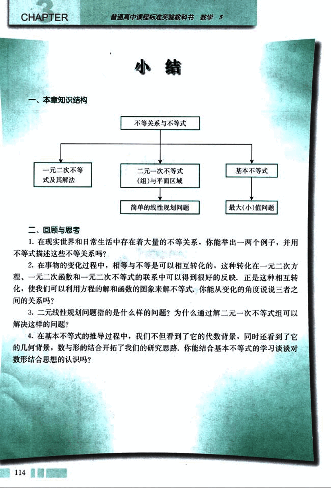

# 小结

127

# 小结

## 一、本章知识结构

```
不等关系与不等式
     ├── 一元二次不等式及其解法
     └── 二元一次不等式(组)与平面区域
          └── 简单的线性规划问题
     └── 基本不等式
          └── 最大(小)值问题
```

## 二、回顾与思考

1. 在现实世界和日常生活中存在着大量的不等关系，你能举出一两个例子，并用不等式描述这些不等关系吗？

2. 在事物的变化过程中，相等与不等是可以相互转化的，这种转化在一元二次方程、一元二次函数和一元二次不等式的联系中可以得到很好的反映。正是这种相互转化，使我们可以利用方程的解和函数的图像来解不等式。你能从变化的角度说说三者之间的关系吗？

3. 二元线性规划问题指的是什么样的问题？为什么通过解二元一次不等式组可以解决这样的问题？

4. 在基本不等式的推导过程中，我们不但看到了它的代数背景，同时还看到了它的几何背景，数与形的结合开拓了我们的研究思路。你能结合基本不等式的学习谈谈对数形结合思想的认识吗？

114


