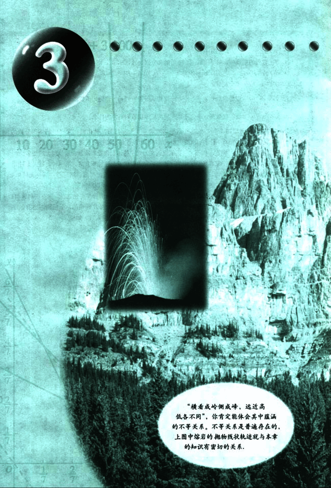
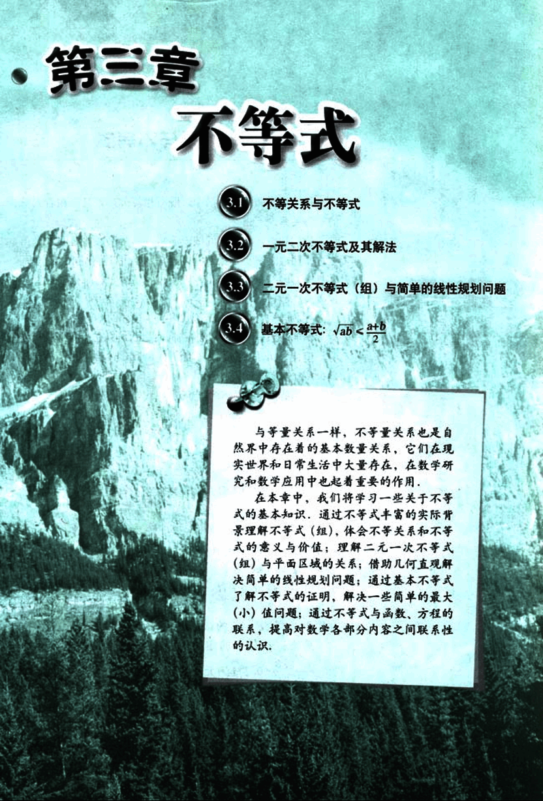

# 第3章　不等式

91

# 3

10 20 30 40 50 60

“横看成岭侧成峰，远近高低各不同”，你肯定能体会其中蕴涵的不等关系。不等关系是普遍存在的，上图中熔岩的抛物线状轨迹就与本章的知识有密切的关系。

92

# 第三章 不等式

3.1 不等关系与不等式
3.2 一元二次不等式及其解法
3.3 二元一次不等式(组)与简单的线性规划问题
3.4 基本不等式: $\sqrt{ab} \le \frac{a+b}{2}$

与等量关系一样，不等量关系也是自然界中存在着的基本数量关系，它们在现实世界和日常生活中大量存在，在数学研究和数学应用中也起着重要的作用。

在本章中，我们将学习一些关于不等式的基本知识，通过不等式丰富的实际背景理解不等式(组)，体会不等关系和不等式的意义与价值；理解二元一次不等式(组)与平面区域的关系；借助几何直观解决简单的线性规划问题；通过基本不等式了解不等式的证明，解决一些简单的最大(小)值问题；通过不等式与函数、方程的联系，提高对数学各部分内容之间联系性的认识。

