# 选修 1-1

1

# 普通高中课程标准实验教科书
## 数学
### 选修 1-1

人民教育出版社 课程教材研究所 编著

中学数学课程教材研究开发中心

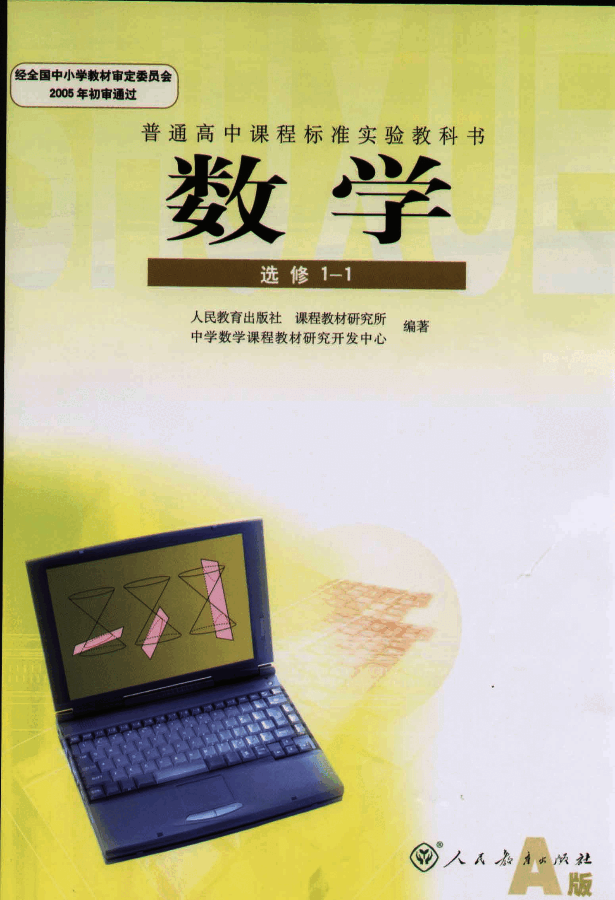
2

# 本书部分数学符号

$p \land q$  p且q

$p \lor q$  p或q

$\neg p$  p的否定；非p

$p \to q$  若p则q

$p \leftrightarrow q$  p↔q，且q↔p；p等价于q

$\forall x \in M, p(x)$  对于每一个属于M的x，p(x)成立

$\exists x_0 \in M, p(x_0)$  存在M中的元x₀使p(x₀)成立

$x \to a$  x趋于a

$\Delta x$  x的增量

$f'(a)$  函数f的导(函)数在a的值

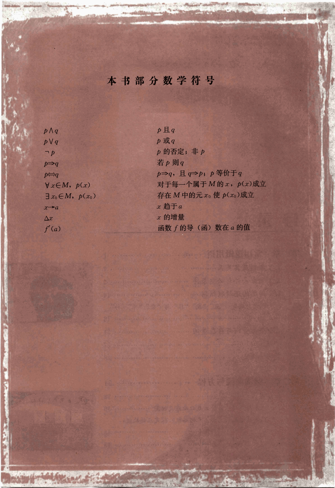
3

# 目录

# 第一章 常用逻辑用语

1.1 命题及其关系  1
1.2 充分条件与必要条件  2
1.3 简单的逻辑联结词  9
阅读与思考 “且”、“或”、“非”与“交”、“并”、“补” 14
1.4 全称量词与存在量词  18
小结  21
复习参考题  27
28

# 第二章 圆锥曲线与方程

2.1 椭圆  31
探究与发现 为什么截口曲线是椭圆  32
信息技术应用 用《几何画板》探究点的轨迹: 椭圆  36
2.2 双曲线  43
45

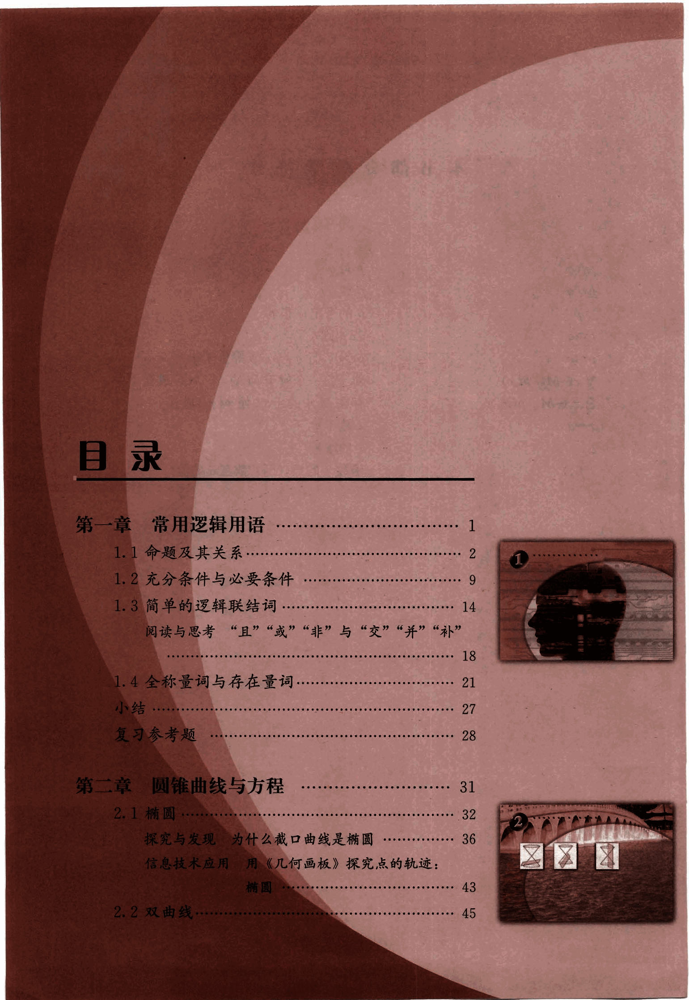
4

# 第三章 导数及其应用

71

## 3.1 变化率与导数

72

## 3.2 导数的计算

81

探究与发现 牛顿法——用导数方法求方程的近似解

86

## 3.3 导数在研究函数中的应用

89

信息技术应用 图形技术与函数性质

99

## 3.4 生活中的优化问题举例

101

实习作业 走进微积分

106

小结

108

复习参考题

110

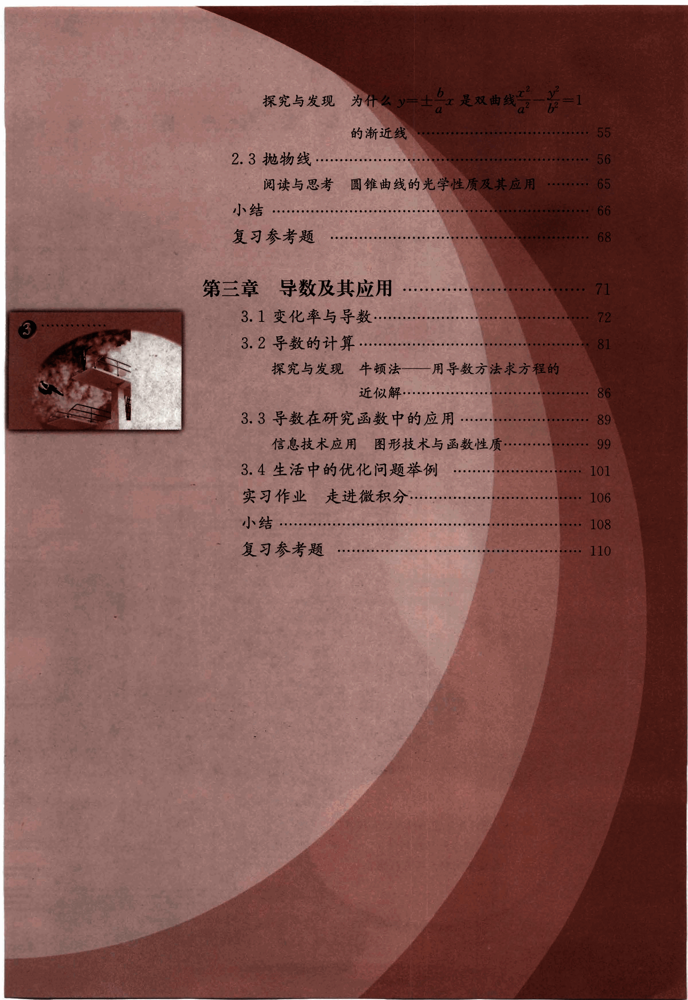
5

# 1

逻辑是研究思维形式和规律的科学；“数学是思维的科学”，逻辑与数学的联系是天然的。

6

# 第一章 常用逻辑用语

## 1.1 命题及其关系
## 1.2 充分条件与必要条件
## 1.3 简单的逻辑联结词
## 1.4 全称量词与存在量词

在我们日常交往、学习和工作中，逻辑用语是必不可少的工具。正确使用逻辑用语是现代社会公民应具备的基本素质。

数学是一门逻辑性很强的学科，表述数学概念和结论、进行推理和论证都要使用逻辑用语。学习一些常用逻辑用语，可以使我们正确理解数学概念、合理论证数学结论、准确表达数学内容。

本章中，我们将学习命题及四种命题之间的关系、充分条件与必要条件、简单的逻辑联结词、全称量词与存在量词等一些基本知识，通过学习和使用常用逻辑用语，掌握常用逻辑用语的用法，纠正出现的逻辑错误，体会运用常用逻辑用语表述数学内容的准确性、简洁性。

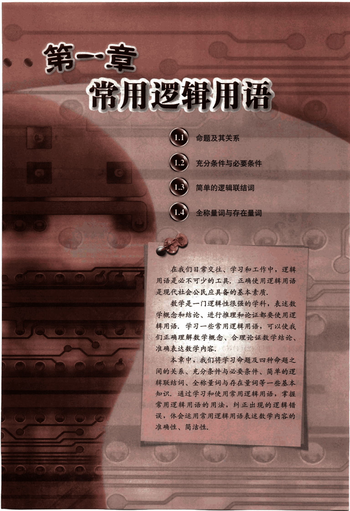
7

# CHAPTER 1

## 1.1 命题及其关系

### 1.1.1 命题

思考？

下列语句的表述形式有什么特点？你能判断它们的真假吗？

(1) 若直线 $a//b$，则直线 $a$ 和直线 $b$ 无公共点；
(2) $2+4=7$；
(3) 垂直于同一条直线的两个平面平行；
(4) 若 $x^2=1$，则 $x=1$；
(5) 两个全等三角形的面积相等；
(6) 3 能被 2 整除.

可以看到，这些语句都是陈述句，并且可以判断真假。其中语句 (1)(3)(5) 判断为真，语句 (2)(4)(6) 判断为假。

一般地，在数学中我们把用语言、符号或式子表达的，可以判断真假的陈述句叫做命题 (proposition)。其中判断为真的语句叫做真命题 (true proposition)，判断为假的语句叫做假命题 (false proposition)。

所以，在上面的语句中，(1)(3)(5) 是真命题，(2)(4)(6) 是假命题。

例 1 下列语句中哪些是命题？是真命题还是假命题？

(1) 空集是任何集合的子集；

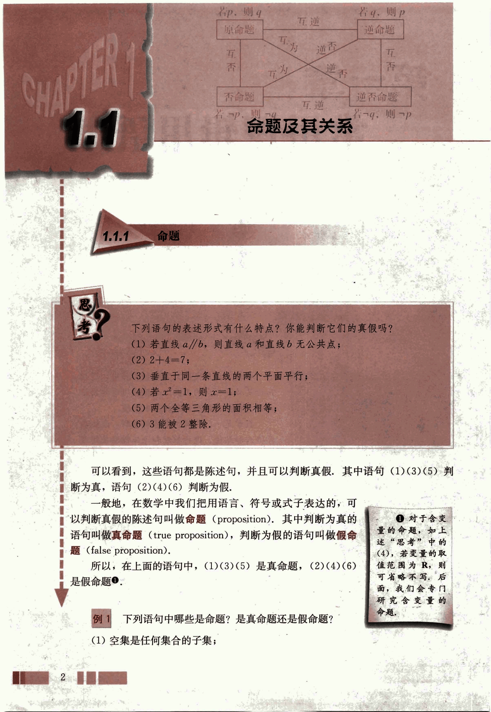
8

# 第一章 常用逻辑用语

(2) 若整数 $a$ 是素数，则 $a$ 是奇数；

(3) 指数函数是增函数吗？

(4) 若空间中两条直线不相交，则这两条直线平行；

(5) $\sqrt{(-2)^2} = 2$；

(6) $x > 15$.

分析：判断一个语句是不是命题，就是要看它是否符合“是陈述句”和“可以判断真假”这两个条件。

解：上面 6 个语句中，(3) 不是陈述句，所以它不是命题；(6) 虽然是陈述句，但因为无法判断它的真假，所以它也不是命题；其余 4 个都是陈述句，而且都可以判断真假，所以它们都是命题，其中 (1)(5) 是真命题，(2)(4) 是假命题。

容易看出，例 1 中的命题 (2)(4) 具有“若 $p$，则 $q$”的形式，在数学中，这种形式的命题是常见的。

通常，我们把这种形式的命题中的 $p$ 叫做命题的条件，$q$ 叫做命题的结论。

例 2 指出下列命题中的条件 $p$ 和结论 $q$:

(1) 若整数 $a$ 能被 2 整除，则 $a$ 是偶数；

(2) 若四边形是菱形，则它的对角线互相垂直且平分。

解：(1) 条件 $p$：整数 $a$ 能被 2 整除，结论 $q$：整数 $a$ 是偶数。

(2) 条件 $p$：四边形是菱形，结论 $q$：四边形的对角线互相垂直且平分。

数学中有一些命题虽然表面上不是“若 $p$，则 $q$”的形式，例如“垂直于同一条直线的两个平面平行”，但是把它的表述作适当改变，就可以写成“若 $p$，则 $q$”的形式：

若两个平面垂直于同一条直线，则这两个平面平行。

这样，它的条件和结论就很清楚了。

例 3 将下列命题改写成“若 $p$，则 $q$”的形式，并判断真假：

(1) 垂直于同一条直线的两条直线平行；

(2) 负数的立方是负数；

(3) 对顶角相等。

解：(1) 若两条直线垂直于同一条直线，则这两条直线平行。

它是假命题。

(2) 若一个数是负数，则这个数的立方是负数。

3

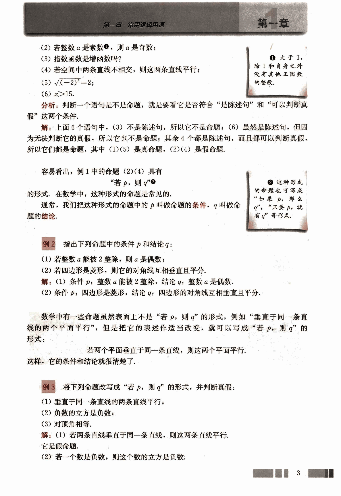
9

# CHAPTER 1

它是真命题.

(3) 若两个角是对顶角，则这两个角相等.

它是真命题.

## 练习

1. 举出一些命题的例子，并判断它们的真假.
2. 判断下列命题的真假：
    (1) 能被 6 整除的整数一定能被 3 整除；
    (2) 若一个四边形的四条边相等，则这个四边形是正方形；
    (3) 二次函数的图象是一条抛物线；
    (4) 两个内角等于 45° 的三角形是等腰直角三角形.
3. 把下列命题改写成“若 p，则 q”的形式，并判断它们的真假：
    (1) 等腰三角形两腰的中线相等；
    (2) 偶函数的图象关于 y 轴对称；
    (3) 垂直于同一个平面的两个平面平行.

## 1.1.2 四种命题

思考？

下列四个命题中，命题 (1) 与命题 (2)(3)(4) 的条件和结论之间分别有什么关系？

(1) 若 $f(x)$ 是正弦函数，则 $f(x)$ 是周期函数；
(2) 若 $f(x)$ 是周期函数，则 $f(x)$ 是正弦函数；
(3) 若 $f(x)$ 不是正弦函数，则 $f(x)$ 不是周期函数；
(4) 若 $f(x)$ 不是周期函数，则 $f(x)$ 不是正弦函数.

可以看到，命题 (1) 的条件是命题 (2) 的结论，且命题 (1) 的结论是命题 (2) 的条件，即它们的条件和结论互换了.

一般地，对于两个命题，如果一个命题的条件和结论分别是另一个命题的结论和条件，那么我们把这样的两个命题叫做互逆命题，其中一个命题叫做原命题 (original proposition)，另一个叫做原命题的逆命题 (inverse proposition). 也就是说，如果原命题为

4

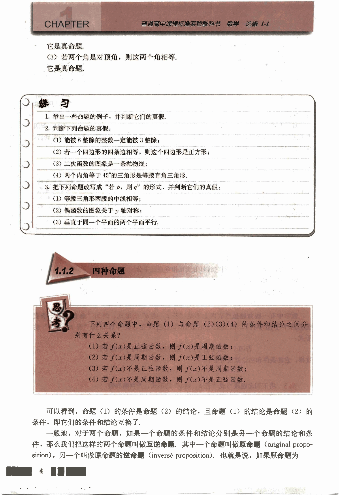
10

# 第一章 常用逻辑用语

## 那么它的逆命题为 “若p,则q”, “若q,则p”.

这样一来,将一个已知命题的条件和结论互换,就可以得到一个新的命题,它是已知命题的逆命题.

例如,将命题“同位角相等,两直线平行”的条件和结论互换,就得到它的逆命题“两直线平行,同位角相等”.

1. 举出一些互逆命题的例子,并判断原命题与逆命题的真假.
2. 如果原命题是真命题,那么它的逆命题一定是真命题吗?

## 对于命题(1)(3),其中一个命题的条件和结论恰好是另一个命题的条件的否定和结论的否定,我们把这样的两个命题叫做互否命题,如果把其中的一个命题叫做原命题,那么另一个叫做原命题的否命题 (negative proposition),也就是说,如果原命题为 “若p,则q”, 那么它的否命题为 “若¬p,则¬q".

为书写简便, 我们常常把条件p 的否定和结论q 的否定,分别记作 “¬p”,“¬q”,读作“非p”和“非q”.

例如,如果原命题是“同位角相等,两直线平行”,那么它的否命题是“同位角不相等,两直线不平行”.

又如,如果原命题是“若整数a不能被2整除,则a是奇数”,那么它的否命题是“若整数a能被2整除,则a是偶数”.

1. 举出一些互否命题的例子,并判断原命题与否命题的真假.
2. 如果原命题是真命题,那么它的否命题一定是真命题吗?

## 对于命题(1)(4),其中一个命题的条件和结论恰好是另一个命题的结论的否定和条件的否定,我们把这样的两个命题叫做互为逆否命题,如果把其中的一个命题叫做原命题,那么另一个叫做原命题的逆否命题(inverse and negative proposition),也就是说,如果原命题为 “若p,则q”, 那么它的逆否命题为

5

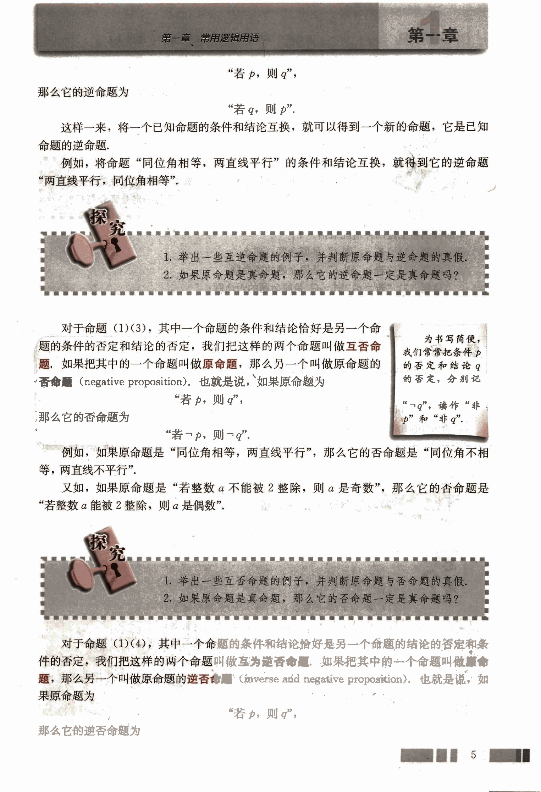
11

# CHAPTER 1

“若¬q,则¬p”.

例如,如果原命题是“同位角相等,两直线平行”,那么它的逆否命题是“两直线不平行,同位角不相等”.

## 探究

1. 举出一些互为逆否命题的例子,并判断原命题与逆否命题的真假。
2. 如果原命题是真命题,那么它的逆否命题一定是真命题吗?

下面我们将上述四种情况概括一下。

设命题(1)“若p,则q”是原命题，那么

命题(2)“若q,则p”是原命题的逆命题;

命题(3)“若¬p,则¬q”是原命题的否命题;

命题(4)“若¬q,则¬p”是原命题的逆否命题.

## 练习

写出下列命题的逆命题、否命题和逆否命题,并判断它们的真假:

(1) 若一个整数的末位数字是0,则这个整数能被5整除;

(2) 若一个三角形的两条边相等,则这个三角形的两个角相等;

(3) 奇函数的图象关于原点对称.

## 1.1.3 四种命题间的相互关系

观察下面四个命题:

(1) 若 $f(x)$ 是正弦函数,则 $f(x)$ 是周期函数;

(2) 若 $f(x)$ 是周期函数,则 $f(x)$ 是正弦函数;

(3) 若 $f(x)$ 不是正弦函数,则 $f(x)$ 不是周期函数;

(4) 若 $f(x)$ 不是周期函数,则 $f(x)$ 不是正弦函数.

我们已经知道命题(1)与命题(2)(3)(4)之间的关系,你能说出其中任意两个命题之间的相互关系吗?

6

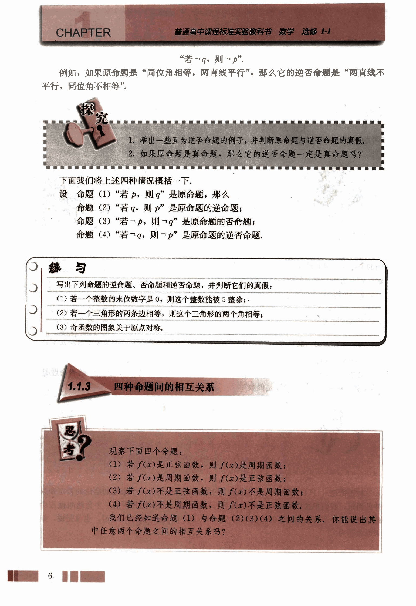
12

# 第一章 常用逻辑用语

我们发现，命题(2)(3)是互为逆否命题，命题(2)(4)是互否命题，命题(3)(4)是互逆命题。

一般地，原命题、逆命题、否命题与逆否命题这四种命题之间的相互关系，如图1.1-1所示。

若p，则q
原命题
互逆
若q，则p
逆命题
互为
互为逆否
逆否
否命题
若¬p，则¬q
互逆
逆否命题
若¬q，则¬p

图1.1-1

上面考察了四种命题之间的相互关系，那么，它们的真假性是否也有一定的相互关系呢？

以“思考”中的命题(1)~(4)为例，并设命题(1)是原命题。容易判断，原命题(1)是真命题，它的逆命题(2)是假命题，它的否命题(3)也是假命题，而它的逆否命题(4)是真命题。

1. 以“若$x^2-3x+2=0$，则$x=2$”为原命题，写出它的逆命题、否命题与逆否命题，并判断这些命题的真假。
2. 分析其他的命题，你能从中发现四种命题的真假性间有什么规律吗？

一般地，四种命题的真假性，有而且仅有下面四种情况：

| 原命题 | 逆命题 | 否命题 | 逆否命题 |
|---|---|---|---|
| 真 | 真 | 真 | 真 |
| 真 | 假 | 假 | 真 |
| 假 | 真 | 真 | 假 |
| 假 | 假 | 假 | 假 |

由于逆命题和否命题也是互为逆否命题，因此四种命题的真假性之间的关系如下：

(1) 两个命题互为逆否命题，它们有相同的真假性；
(2) 两个命题互为逆命题或互否命题，它们的真假性没有关系。

由于原命题和它的逆否命题有相同的真假性，所以在直接证明某一个命题为真命题有困难时，可以通过证明它的逆否命题为真命题，来间接地证明原命题为真命题。

7

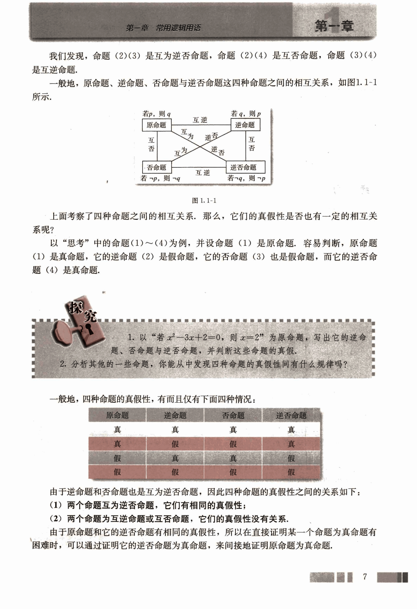
13

# CHAPTER

普通高中课程标准实验教科书 数学选修 1-1

## 例4

证明:若$x^2+y^2=0$，则$x=y=0$.

分析:将“若$x^2+y^2=0$，则$x=y=0$”视为原命题，要证明原命题为真命题，可以考虑证明它的逆否命题“若x,y中至少有一个不为0，则$x^2+y^2≠0$”为真命题，从而达到证明原命题为真命题的目的.

证明:若x,y中至少有一个不为0，不妨设$x≠0$，则$x^2≥0$，所以$x^2+y^2>0$.

也就是说$x^2+y^2≠0$.

因此，原命题的逆否命题为真命题，从而原命题也为真命题.

## 练习

证明:若$a^2-b^2+2a-4b-3≠0$，则$a-b≠1$.

## 习题1.1

### A组

1. 判断下列语句是不是命题:
    (1) 12>5;
    (2) 若a为正无理数，则$\sqrt{a}$也是无理数;
    (3) $x∈${1, 2, 3, 4, 5};
    (4) 正弦函数是周期函数吗?

2. 写出下列命题的逆命题、否命题和逆否命题，并判断它们的真假:
    (1) 若a,b都是偶数，则a+b是偶数;
    (2) 若m>0，则方程$x^2+x-m=0$有实数根.

3. 把下列命题改写成“若p，则q”的形式，并写出它们的逆命题、否命题和逆否命题，然后判断它们的真假:
    (1) 线段的垂直平分线上的点到这条线段两个端点的距离相等;
    (2) 矩形的对角线相等.

4. 求证:若一个三角形的两条边不相等，则这两条边所对的角也不相等.

### B组

求证:圆的两条不是直径的相交弦不能互相平分.

8

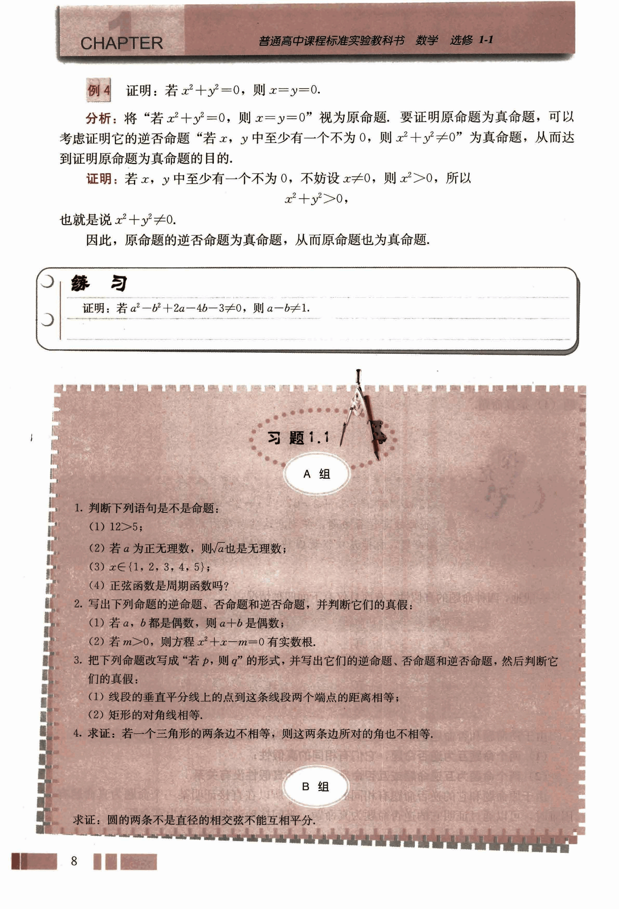
14

# CHAPTER 1

## 1.2 充分条件与必要条件

### 1.2.1 充分条件与必要条件

前面我们讨论了“若p,则q”形式的命题，其中有的命题为真命题，有的命题为假命题，例如，下列两个命题中：

(1) 若$x>a^2+b^2$，则$x>2ab$；

(2) 若$ab=0$，则$a=0$；

命题(1)为真命题，命题(2)为假命题。

一般地，“若p，则q”为真命题，是指由p通过推理可以得出q。这时，我们就说，由p可推出q，记作

$p \implies q$，

并且说p是q的充分条件(sufficient condition)，q是p的必要条件(necessary condition)。

上面的命题(1)是真命题，即

$x > a^2 + b^2 \implies x > 2ab$，

所以“$x > a^2 + b^2$”是“$x > 2ab$”的充分条件，“$x > 2ab$”是“$x > a^2 + b^2$”的必要条件。①

下列“若p，则q”形式的命题中，哪些命题中的p是q的充分条件？

(1) 若x=1，则$x^2-4x+3=0$；

(2) 若$f(x)=x$，则$f(x)$在$(-∞,+∞)$上为增函数；

(3) 若x为无理数，则$x^2$为无理数。

解：命题(1)(2)是真命题，命题(3)是假命题，所以，命题(1)(2)中的p是q的充分条件。

如果“若p，则q”为假命题，那么由p推不出q，记作$p \cancel{\implies} q$。此时，我们就说p不是q的充分条件，q不是p的必要条件。

9

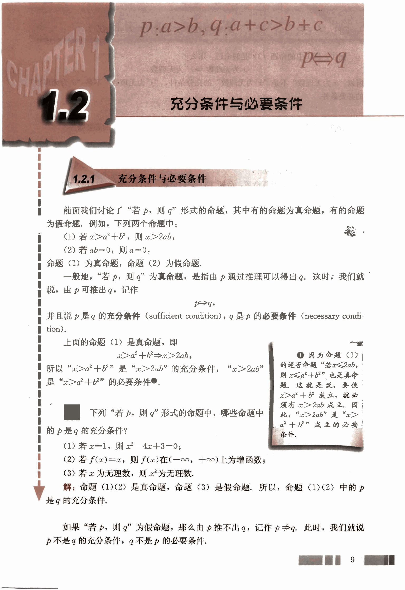
15

# CHAPTER

普通高中课程标准实验教科书 数学 选修 1-1

例如，例1中的命题(3)是假命题，那么
x为无理数$\implies$x²为无理数，

所以“x为无理数”不是“x²为无理数”的充分条件，“x²为无理数”不是“x为无理数”
的必要条件.

## 例2

下列“若p，则q”形式的命题中，哪些命题中的q是p的必要条件？

(1) 若x=y，则x²=y²；
(2) 若两个三角形全等，则这两个三角形的面积相等；
(3) 若a>b，则ac>bc.

解：命题(1)(2)是真命题，命题(3)是假命题，所以，命题(1)(2)中的q是p
的必要条件.

## 练习

1. 用符号“→”与“$\iff$”填空：
    (1) x²=y² _______ x=y;
    (2) 内错角相等 _______ 两直线平行；
    (3) 整数a能被6整除 _______ a的个位数字为偶数；
    (4) ac=bc _______ a=b.

2. 下列“若p，则q”形式的命题中，哪些命题中的p是q的充分条件？
    (1) 若两条直线的斜率相等，则这两条直线平行；
    (2) 若x>5，则x>10.

3. 下列“若p，则q”形式的命题中，哪些命题中的q是p的必要条件？
    (1) 若a+5是无理数，则a是无理数；
    (2) 若(x-a)(x-b)=0，则x=a.

4. 判断下列命题的真假：
    (1) x=2是x²-4x+4=0的必要条件；
    (2) 圆心到直线的距离等于半径是这条直线为圆的切线的必要条件；
    (3) sinα=sinβ是α=β的充分条件；
    (4) ab≠0是a≠0的充分条件.

10

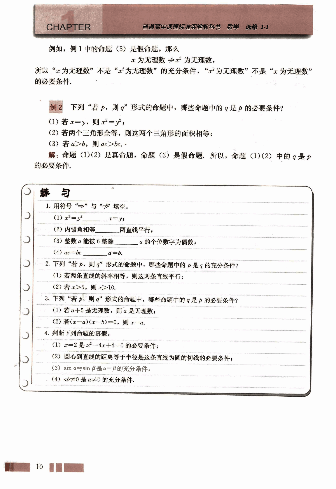
16

# 第一章 常用逻辑用语

## 1.2.2 充要条件

已知 *p*: 整数 *a* 是 6 的倍数；*q*: 整数 *a* 是 2 和 3 的倍数.
那么 *p* 是 *q* 的什么条件？*q* 又是 *p* 的什么条件？

在上述问题中，*p* ⇒ *q*，所以 *p* 是 *q* 的充分条件，*q* 是 *p* 的必要条件.
另一方面，*q* ⇒ *p*，所以 *p* 也是 *q* 的必要条件，*q* 也是 *p* 的充分条件.

一般地，如果既有 *p* ⇒ *q*，又有 *q* ⇒ *p*，就记作
*p* ⇔ *q*.

此时，我们说，*p* 是 *q* 的充分必要条件，简称充要条件 (sufficient and necessary condition). 显然，如果 *p* 是 *q* 的充要条件，那么 *q* 也是 *p* 的充要条件.

概括地说，如果 *p* ⇔ *q*，那么 *p* 与 *q* 互为充要条件.

### 例 3  下列各题中，哪些 *p* 是 *q* 的充要条件？

(1) *p*:  *b* = 0； *q*: 函数 *f*(x) = *a*x² + *bx* + *c* 是偶函数；
(2) *p*: *x* > 0, *y* > 0； *q*: *xy* > 0；
(3) *p*: *a* > *b*； *q*: *a* + *c* > *b* + *c*.

解：在 (1)(3) 中，*p* ⇔ *q*，所以 (1)(3) 中的 *p* 是 *q* 的充要条件. 在 (2) 中，*q* ⊈ *p*，
所以 (2) 中的 *p* 不是 *q* 的充要条件.

### 例 4  已知：○○ 的半径为 *r*，圆心 O 到直线 *l* 的距离
为 *d*. 求证：*d* = *r* 是直线 *l* 与 ○○ 相切的充要条件.

分析：设 *p*: *d* = *r*； *q*: 直线 *l* 与 ○○ 相切. 要证 *p* 是 *q*
的充要条件，只需分别证明充分性 (*p* ⇒ *q*) 和必要性 (*q* ⇒ *p*) 即可.

证明：如图 1.2-1 所示，作 OP ⊥ *l* 于点 P，则 OP = *d*.

(1) 充分性 (*p* ⇒ *q*): 若 *d* = *r*，则点 P 在 ○○ 上. 在直线 *l* 上任取一点 Q (异于点 P)，
连接 OQ. 在 Rt△OPQ 中，OQ > OP = *r*. 所以，除点 P 外，直线上的点都在 ○○ 的外部，
即直线 *l* 与 ○○ 仅有一个公共点 P. 因此，直线 *l* 与 ○○ 相切.

(2) 必要性 (*q* ⇒ *p*): 若直线 *l* 与 ○○ 相切，不妨设切点为 P，则 OP ⊥ *l*. 因此，
*d* = OP = *r*.

[图1.2-1](images/1.2-1.png)

11

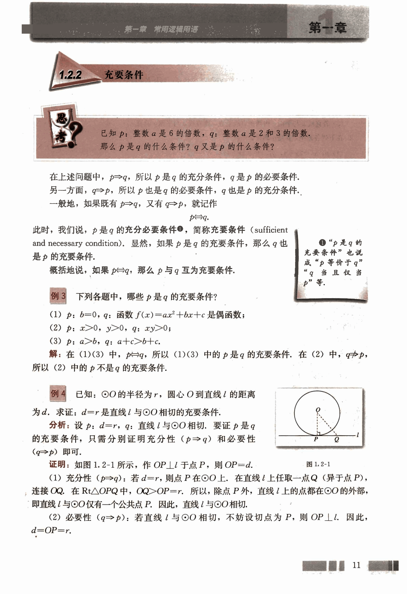
17

# CHAPTER 1 习

1. 下列形如“若p，则q”的命题是真命题吗？它的逆命题是真命题吗？p是q的什么条件？
(1) 若平面外一条直线a与平面内一条直线平行，则直线a与平面平行；
(2) 若数列{$a_n$}的通项公式是$a_n = n + c$(c是常数)，则数列{$a_n$}是公差等于1的等差数列；
(3) 若直线a与平面内两条直线垂直，则直线a与平面垂直。

2. 在下列各题中，p是q的什么条件？
(1) p: $x^2 = 3x + 4$;  q: $x = \sqrt{3x + 4}$；
(2) p: $x - 3 = 0$; q: $(x - 3)(x - 4) = 0$；
(3) p: $b^2 - 4ac \ge 0$ ($a \ne 0$); q: $ax^2 + bx + c = 0$ ($a \ne 0$)有实根；
(4) p: x = 1是方程$ax^2 + bx + c = 0$的一个根； q: $a + b + c = 0$。

## 习题 1.2 A组

1. 举例说明：
(1) p是q的充分条件；
(2) p是q的必要条件；
(3) p是q的充要条件。

2. 判断下列命题的真假：
(1) “$a > b$”是“$a^2 > b^2$”的充分条件；
(2) “$|a| > |b|$”是“$a^2 > b^2$”的必要条件；
(3) “$a > b$”是“$a + c > b + c$”的充要条件。

3. 下列各题中，p是q的什么条件？
(1) p: $x = 1$; q: $x - 1 = \sqrt{x - 1}$；
(2) p: $-2 \le x \le 3$; q: $-1 \le x < 5$；
(3) p: $x = 2$; q: $x - 3 = \sqrt{3 - x}$；
(4) p: 三角形是等边三角形； q: 三角形是等腰三角形。

4. 求圆$(x - a)^2 + (y - b)^2 = r^2$经过原点的充要条件。

12

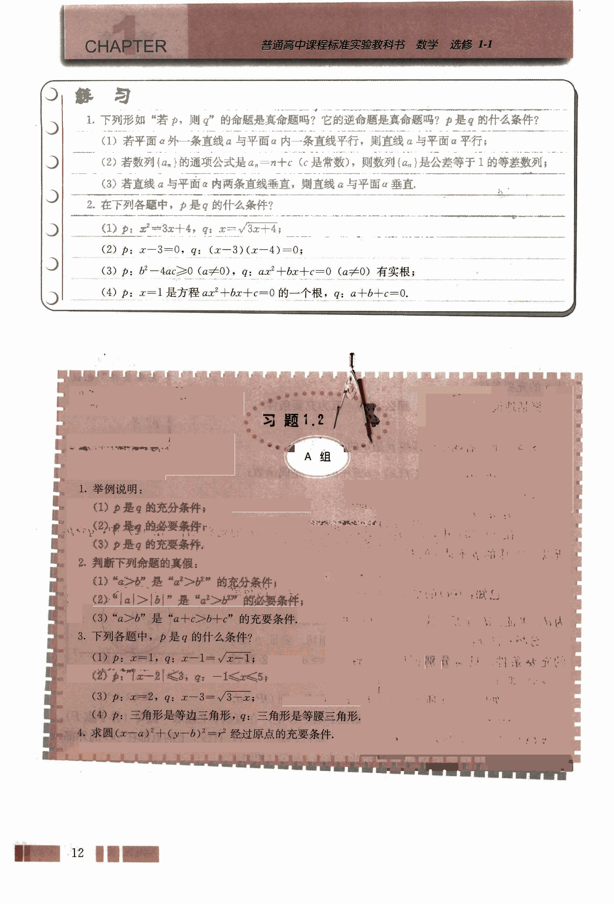
18

# 第一章 常用逻辑用语

## B组

1. 已知A={x|x满足条件p}, B={x|x满足条件q}.
(1)如果A⊆B,那么p是q的什么条件;
(2)如果B⊆A,那么p是q的什么条件;
(3)如果A=B,那么p是q的什么条件.

2. 求证: △ABC是等边三角形的充要条件是
$a^2+b^2+c^2=ab+ac+bc,$

这里a, b, c是△ABC的三条边.

13

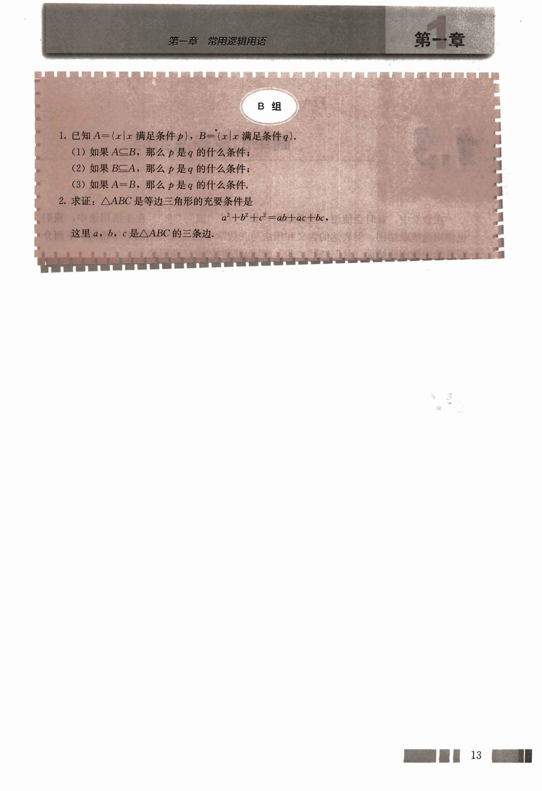
19

# CHAPTER 1
## 1.3 简单的逻辑联结词

在数学中，有时会使用一些联结词，如“且”、“或”、“非”，在生活用语中，我们也使用这些联结词，但表达的含义和用法与在数学中的含义和用法不尽相同。下面介绍数学中使用联结词“且”、“或”、“非”联结命题时的含义和用法。

为叙述简便，今后常用小写字母 *p*, *q*, *r*, *s*, …表示命题。

### 1.3.1 且 (and)

**思考?**

下列三个命题间有什么关系？
(1) 12能被3整除；
(2) 12能被4整除；
(3) 12能被3整除且能被4整除。

可以看到，命题(3)是由命题(1)(2)使用联结词“且”联结得到的新命题。

一般地，用联结词“且”把命题 *p* 和命题 *q* 联结起来，就得到一个新命题，记作

$p∧q$

读作“*p* 且 *q*”。

命题 $p∧q$ 的真假如何确定呢？

一般地，我们规定：

当 *p*, *q* 都是真命题时，$p∧q$ 是真命题；当 *p*, *q* 两个命题中有一个命题是假命题时，$p∧q$ 是假命题。

上面“思考”中的命题(1)(2)都是真命题，所以命题(3)是真命题。

[电路图](images/circuit.png)

我们可以从串联电路理解联结词“且”的含义。若开关 *p*, *q* 的闭合与断开分别对应命题 *p*, *q* 的真与假，则整个电路的接通与断开分别对应命题 $p∧q$ 的真与假。

**例1** 将下列命题用“且”联结成新命题，并判断它们的真假：

14

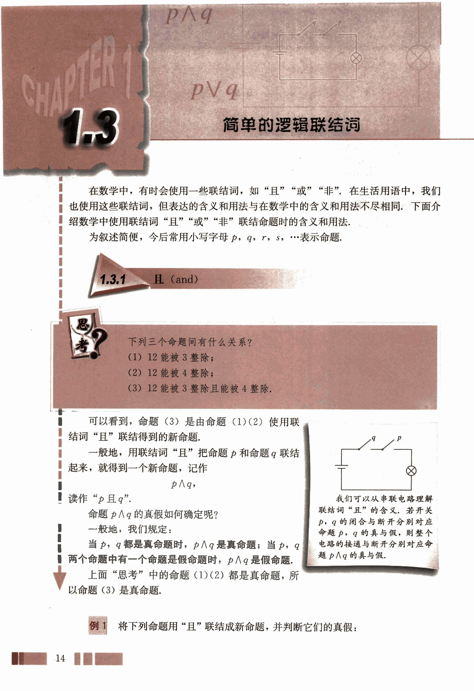
20

# 第一章 常用逻辑用语

(1) p: 平行四边形的对角线互相平分，q: 平行四边形的对角线相等；
(2) p: 菱形的对角线互相垂直，q: 菱形的对角线互相平分；
(3) p: 35 是 15 的倍数，q: 35 是 7 的倍数.

解：(1) $p∧q$: 平行四边形的对角线互相平分且相等.
由于 p 是真命题，q 是假命题，所以 $p∧q$ 是假命题.

(2) $p∧q$: 菱形的对角线互相垂直且平分.
由于 p 是真命题，q 是真命题，所以 $p∧q$ 是真命题.

(3) $p∧q$: 35 是 15 的倍数且是 7 的倍数.
由于 p 是假命题，q 是真命题，所以 $p∧q$ 是假命题.

## 例2

用逻辑联结词“且”改写下列命题，并判断它们的真假：
(1) 1 既是奇数，又是素数；
(2) 2 和 3 都是素数.

解：(1) 命题“1 既是奇数，也是素数”可以改写为“1 是奇数且 1 是素数”.
因为“1 是素数”是假命题，所以这个命题是假命题.

(2) 命题“2 和 3 都是素数”可以改写为“2 是素数且 3 是素数”.
因为“2 是素数”与“3 是素数”都是真命题，所以这个命题是真命题.

## 1.3.2 或 (or)

思考？

下列三个命题间有什么关系？
(1) 27 是 7 的倍数；
(2) 27 是 9 的倍数；
(3) 27 是 7 的倍数或是 9 的倍数.

命题 (3) 是由命题 (1)(2) 用联结词“或”联结得到的新命题.

一般地，用联结词“或”把命题 p 和命题 q 联结起来，就得到一个新命题，记作

$pVq$,

读作“p 或 q”.

命题 $pVq$ 的真假如何确定呢？

一般地，我们规定：

当 p, q 两个命题中有一个命题是真命题时，$pVq$ 是真命题；当 p, q 两个命题都是假命题时，$pVq$ 是假命题.

[image](images/circuit.png)

我们可以从并联电路理解联结词“或”的含义，若开关 p, q 的闭合与断开对应命题的真与假，则整个电路的接通与断开分别对应命题 $pVq$ 的真与假.

15

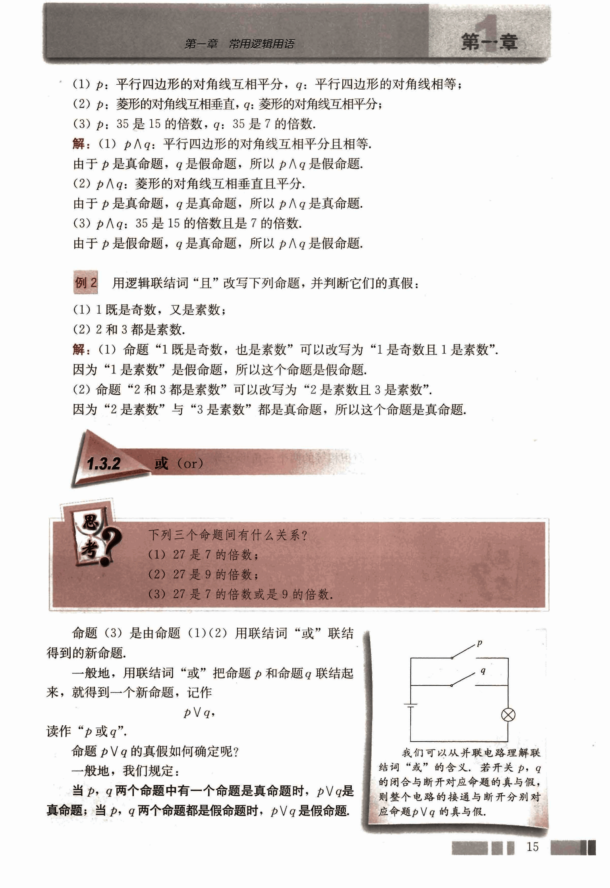
21

# CHAPTER

普通高中课程标准实验教科书 数学 选修 1-1

上面“思考”中的命题(1)是假命题，命题(2)是真命题，所以命题(3)是真命题。

## 例3

判断下列命题的真假：

(1) 2 ≤ 2;

(2) 集合A是A∩B的子集或是A∪B的子集;

(3) 周长相等的两个三角形全等或面积相等的两个三角形全等.

解：(1) 命题“2 ≤ 2”是由命题：

p: 2 = 2;  q: 2 < 2

用“或”联结后构成的新命题，即p∨q.

因为命题p是真命题，所以命题p∨q是真命题。

(2) 命题“集合A是A∩B的子集或是A∪B的子集”是由命题：

p: 集合A是A∩B的子集;

q: 集合A是A∪B的子集

用“或”联结后构成的新命题，即p∨q.

因为命题q是真命题，所以命题p∨q是真命题。

(3) 命题“周长相等的两个三角形全等或面积相等的两个三角形全等”是由命题：

p: 周长相等的两个三角形全等;

q: 面积相等的两个三角形全等

用“或”联结后构成的新命题，即p∨q.

因为命题p, q都是假命题，所以命题p∨q是假命题。

## 思考

如果p∧q为真命题，那么p∨q一定是真命题吗？反之，如果p∨q为真命题，那么p∧q一定是真命题吗？

## 1.3.3

非 (not)

下列两个命题间有什么关系？

(1) 35能被5整除;

(2) 35不能被5整除.

16

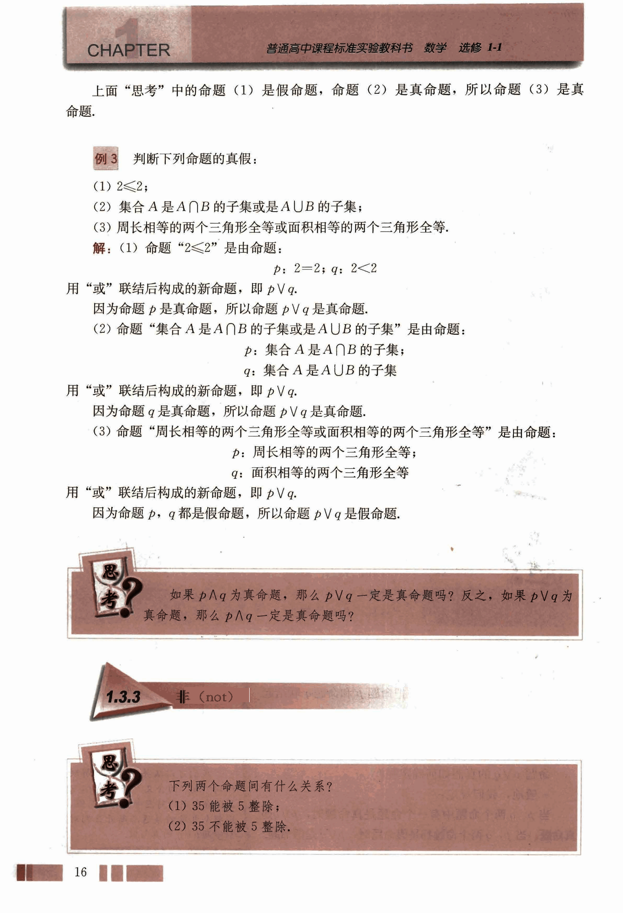
22

# 第一章 常用逻辑用语

可以看到，命题(2)是命题(1)的否定。
一般地，对一个命题p全盘否定，就得到一个新命题，记作¬p，
读作“非p”或“p的否定”。

① 注意此处
命题的否定与
1.1.2中否命题的
区别。

上面“思考”中，命题(1)是真命题，命题(2)是假命题。
既然命题¬p是p的否定，那么¬p与p不能同为真命题，也不能同
为假命题，也就是说，
若p是真命题，则¬p必是假命题；若p是假命题，则¬p必是真命题。

## 例4

写出下列命题的否定，并判断它们的真假：
(1) p:  y=sinx是周期函数；
(2) p: 3<2；
(3) p: 空集是集合A的子集。

解：(1) ¬p: y=sinx不是周期函数。
命题p是真命题，¬p是假命题。

(2) ¬p: 3≥2.
命题p是假命题，¬p是真命题。

(3) ¬p: 空集不是集合A的子集。
命题p是真命题，¬p是假命题。

## 练习

1. 判断下列命题的真假：
(1) 12是48且是36的约数；
(2) 矩形的对角线互相垂直且平分。

2. 判断下列命题的真假：
(1) 47是7的倍数或49是7的倍数；
(2) 等腰梯形的对角线互相平分或互相垂直。

3. 写出下列命题的否定，然后判断它们的真假：
(1) 2+2=5；
(2) 3是方程x²-9=0的根；
(3) √(-1)²=-1.

17

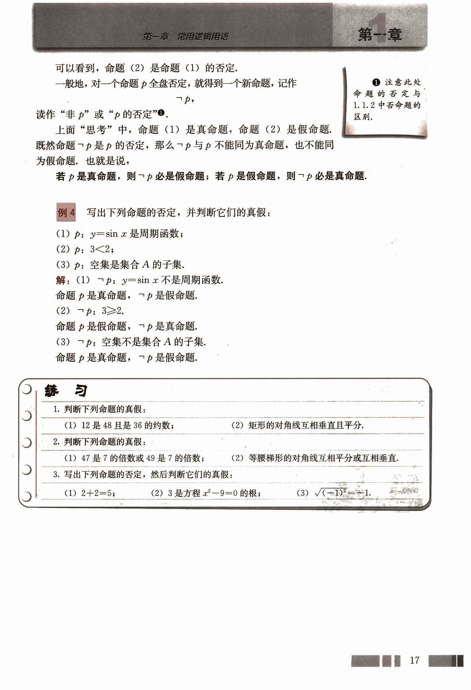
23

# CHAPTER 1

普通高中课程标准实验教科书 数学选修 1-1

# 习题 1.3

## A 组

1. 写出下列命题，并判断它们的真假：
(1) p∨q，这里 p: 4∈{2, 3}，q: 2∈{2, 3};
(2) p∧q，这里 p: 4∈{2, 3}，q: 2∈{2, 3};
(3) p∨q，这里 p: 2 是偶数，q: 3 不是质数；
(4) p∧q，这里 p: 2 是偶数，q: 3 不是质数。

2. 判断下列命题的真假：
(1) 5 > 2 且 7 > 3;
(2) 3 > 4 或 3 < 4;
(3) 7 ≥ 8.

3. 写出下列命题的否定，并判断它们的真假：
(1) √2 是有理数；
(2) 5 不是 15 的约数；
(3) 2 < 3;
(4) 8 + 7 ≠ 15;
(5) 空集是任何集合的真子集。

## B 组

判断下列命题的真假，并说明理由：
(1) p∨q，这里 p: π 是无理数，q: π 是实数；
(2) p∧q，这里 p: π 是无理数，q: π 是实数；
(3) p∨q，这里 p: 2 > 3，q: 8 + 7 ≠ 15;
(4) p∧q，这里 p: 2 > 3，q: 8 + 7 ≠ 15.

逻辑联结词“且”、“或”、“非”与集合的“交”、“并”、“补”之间有关系吗？

先看一个具体例子。

我们知道，由“2 是偶数”与“2 是素数”都是真命题，可以得到“2 是偶数且是素数”是真命题。另一方面，由集合的“交”运算可以知道：由 2∈{偶数}，2∈{素数}，可以得到 2∈{偶数}∩{素数}。如果把“真”对应于“∈”,“且”对应于“交”，那么，“2 是偶数是真命题”可以对应于“2∈{偶数}”,“2 是素数是真命题”可以对应于“2∈{素数}”,“2 是偶数且是素数是真命题”就可以对应于“2∈{偶数}∩{素数}”。

18

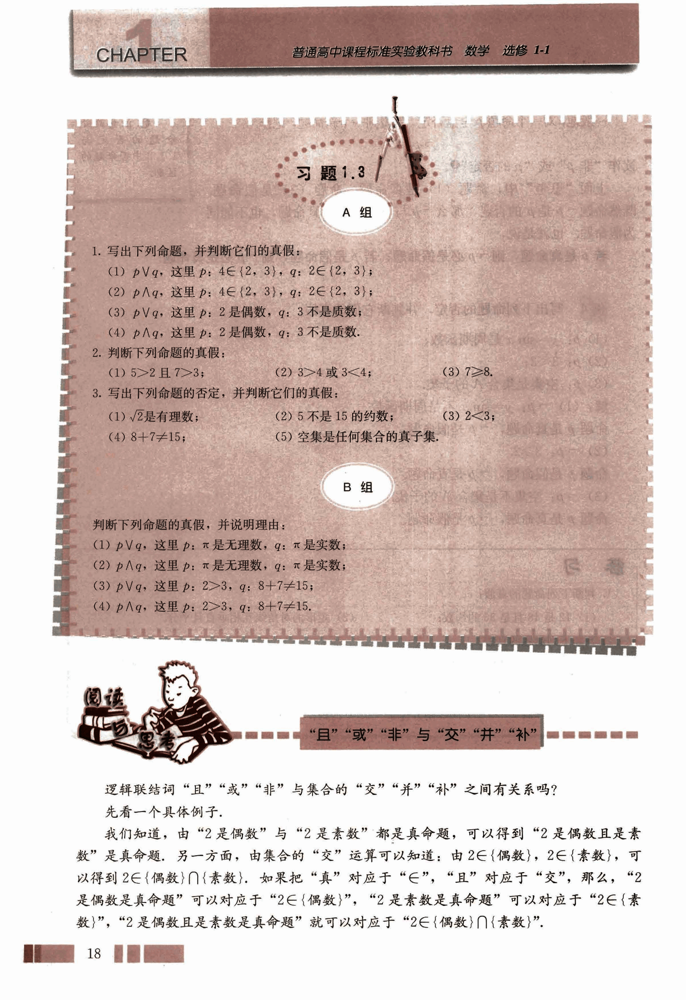
24

# 第一章 常用逻辑用语

从上述例子得到启发，我们可以在逻辑联结词“且”与集合的“交”运算之间建立联系。

我们知道，对于逻辑联结词“且”有如下规定：

若p，q都是真命题，则p∧q是真命题；若p，q中有假命题，则p∧q是假命题。

对于集合的“交”有如下规定：

若a∈P，a∈Q，则a∈P∩Q；若a∉P或a∉Q，则a∉P∩Q。

把命题p，q分别对应于集合P，Q，“真”“假”“∧”分别对应于“∈”“∉”“∩”，那么上述关于“且”与“交”的规定就具有形式的一致性，具体地说，就是“p是真命题”对应于“a∈P”，“q是真命题”对应于“a∈Q”，“p∧q是真命题”对应于“a∈P∩Q”，“p∧q是假命题”对应于“a∉P∩Q”。

探究

你能发现逻辑联结词“或”和集合的“并”运算的规定在形式上的一致性吗？

逻辑联结词“非”和集合的“补”又有什么关系呢？

再看一个具体例子。

若以整数集为全集，则偶数集和奇数集互为补集。由“2是偶数”是真命题，可以得到“2是奇数”是假命题；由“3是偶数”是假命题，可以得到“3是奇数”是真命题。用集合的方式则可表达为：由2∈{偶数}，可以得到2∉{奇数}；由3∉{偶数}，可以得到3∈{奇数}。如果把“非”“真”“假”分别对应于“补”“∈”“∉”，那么，命题p和它的否定¬p可以对应于集合P和它的补集CUP，“p是真命题”对应于“a∈P”，“¬p是假命题”对应于“a∉CUP”，“p是假命题”对应于“a∉P”，“¬p是真命题”对应于“a∈CUP”。

一般地，对于逻辑联结词“非”有如下规定：

若p是真命题，则¬p是假命题；若p是假命题，则¬p是真命题。

对于集合的“补”有如下规定：

设U为全集，P⊆U，若a∈P，则a∉CUP；若a∉P，则a∈CUP。

探究

类比“且”与“交”的联系，并结合上述例子，你能建立逻辑联结词“非”与集合的“补”运算之间的对应关系吗？

19

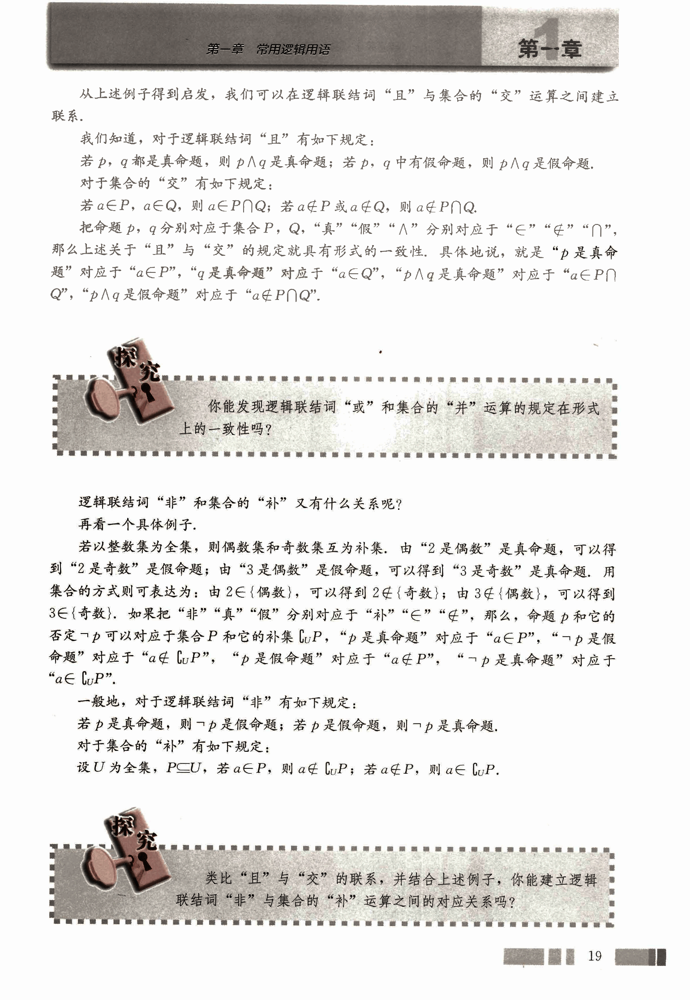
25

# CHAPTER

普通高中课程标准实验教科书 数学 选修 1-1

从上述讨论可以发现：命题与集合之间可以建立对应关系。在这样的对应下，逻辑联结词与集合的运算具有一致性，命题的“且”、“或”、“非”恰好分别对应集合的“交”、“并”、“补”。因此，我们就可以从集合的角度进一步认识有关这些逻辑联结词的规定。

20

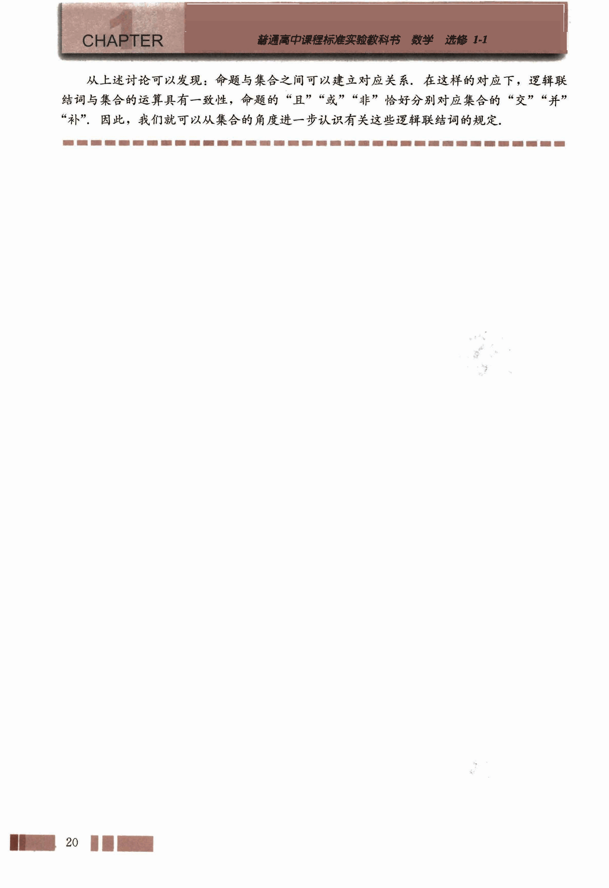
26

# CHAPTER 1
## 1.4 全称量词与存在量词

### 1.4.1 全称量词

**思考？**

下列语句是命题吗？(1)与(3)，(2)与(4)之间有什么关系？

(1)  x > 3;
(2) 2x + 1是整数;
(3) 对所有的 x ∈ R, x > 3;
(4) 对任意一个 x ∈ Z, 2x + 1是整数.

我们知道，命题是可以判断真假的陈述句。语句(1)(2)含有变量，由于不知道变量x代表什么数，无法判断它们的真假，因而不是命题。语句(3)在(1)的基础上，用短语“对所有的”对变量x进行限定；语句(4)在(2)的基础上，用短语“对任意一个”对变量x进行限定，从而使(3)(4)成为可以判断真假的语句，因此语句(3)(4)是命题。

短语“对所有的”“对任意一个”在逻辑中通常叫做全称量词 (universal quantifier), 并用符号“∀”表示。含有全称量词的命题，叫做全称命题。

例如，命题：

对任意的 n ∈ Z, 2n + 1是奇数；

所有的正方形都是矩形

都是全称命题。

通常，将含有变量x的语句用 p(x), q(x), r(x), … 表示，变量x的取值范围用M表示。那么，全称命题“对M中任意一个x，有p(x)成立”可用符号简记为

∀x ∈ M, p(x),

21

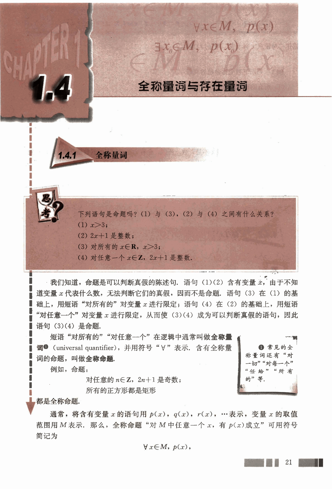
27

# CHAPTER 1

普通高中课程标准实验教科书 数学 选修 1-1

读作“对任意 x 属于 M，有 p(x) 成立”。

## 例 1

判断下列全称命题的真假：

(1) 所有的素数是奇数；

(2) ∀x∈R，x²+1≥1；

(3) 对每一个无理数 x，x²也是无理数。

分析：要判定全称命题“∀x∈M，p(x)”是真命题，需要对集合 M 中每个元素 x，证明 p(x) 成立；如果在集合 M 中找到一个元素 x0，使得 p(x0) 不成立，那么这个全称命题就是假命题。

解：(1) 2 是素数，但 2 不是奇数，所以，全称命题“所有的素数是奇数”是假命题。

(2) ∀x∈R，总有 x²≥0，因而 x²+1≥1。所以，全称命题“∀x∈R，x²+1≥1”是真命题。

(3) √2 是无理数，但 (√2)²=2 是有理数，所以，全称命题“对每一个无理数 x，x²也是无理数”是假命题。

## 1.4.2 存在量词

下列语句是命题吗？(1) 与 (3)，(2) 与 (4) 之间有什么关系？

(1) 2x+1=3；

(2) x 能被 2 和 3 整除；

(3) 存在一个 x0∈R，使 2x0+1=3；

(4) 至少有一个 x0∈Z，x0 能被 2 和 3 整除。

容易判断，(1)(2) 不是命题。语句 (3) 在 (1) 的基础上，用短语“存在一个”对变量 x 的取值进行限定；语句 (4) 在 (2) 的基础上，用“至少有一个”对变量 x 的取值进行限定，从而使 (3)(4) 变成了可以判断真假的语句，因此语句 (3)(4) 是命题。

短语“存在一个”“至少有一个”在逻辑中通常叫做存在量词 (existential quantifier)，并用符号“∃”表示。含有存在量词的命题，叫做特称命题。

例如，命题：

有的平行四边形是菱形；

22

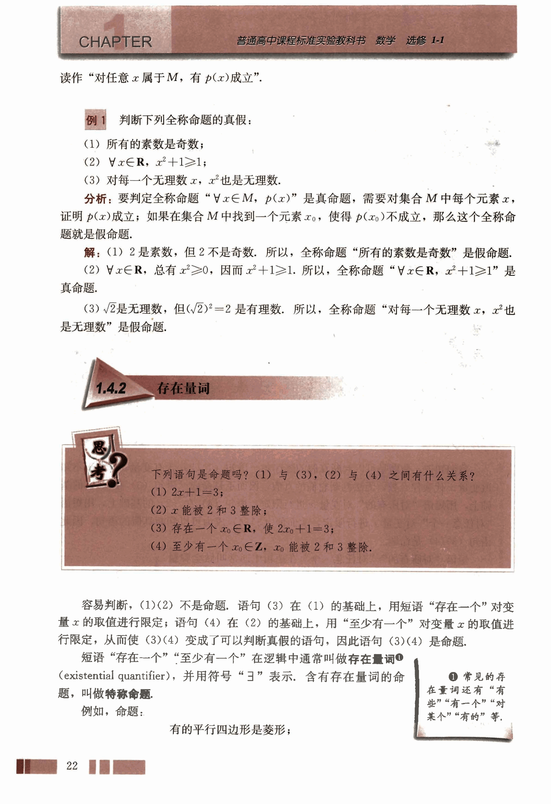
28

# 第一章 常用逻辑用语

都是特称命题.
有一个素数不是奇数

特称命题“存在M中的一个$x_0$，使$p(x_0)$成立”可用符号简记为
$\exists x_0 \in M, p(x_0)$,

读作“存在一个$x_0$属于M，使$p(x_0)$成立”.

## 例2 判断下列特称命题的真假:

(1) 有一个实数$x_0$，使$x_0^2+2x_0+3=0$;

(2) 存在两个相交平面垂直于同一条直线;

(3) 有些整数只有两个正因数.

分析：要判定特称命题“$\exists x_0 \in M, p(x_0)$”是真命题，只需在集合M中找到一个元素$x_0$，使$p(x_0)$成立即可，如果在集合M中，使$p(x)$成立的元素x不存在，那么这个特称命题是假命题.

解：(1) 由于$\forall x \in R$，$x^2+2x+3=(x+1)^2+2 \ge 2$，因此使$x^2+2x+3=0$的实数x不存在，所以，特称命题“有一个实数$x_0$，使$x^2+2x+3=0$”是假命题.

(2) 由于垂直于同一条直线的两个平面是互相平行的，因此不存在两个相交的平面垂直于同一条直线，所以，特称命题“存在两个相交平面垂直于同一条直线”是假命题.

(3) 由于存在整数3只有两个正因数1和3，所以特称命题“有些整数只有两个正因数”是真命题.

## 练习

1. 判断下列全称命题的真假:

(1) 每个指数函数都是单调函数;

(2) 任何实数都有算术平方根;

(3) $\forall x \in \{x|x是无理数\}$，$x^2$是无理数.

2. 判断下列特称命题的真假:

(1) $\exists x_0 \in R, x_0 \le 0$;

(2) 至少有一个整数，它既不是合数，也不是素数;

(3) $\exists x_0 \in \{x|x是无理数\}$，$x_0$是无理数.

23

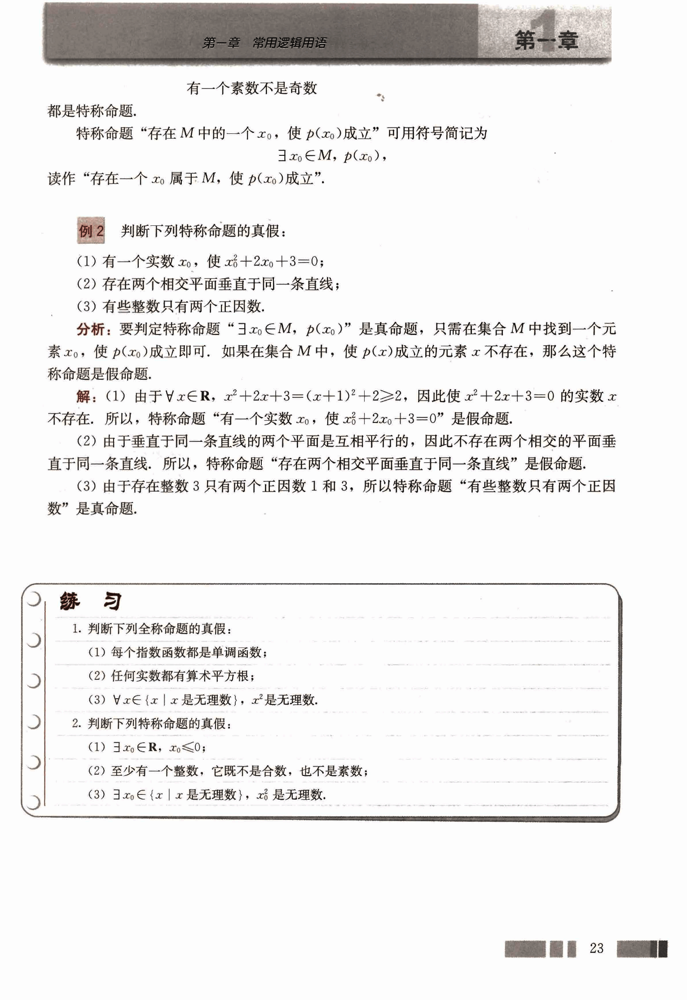
29

# 1.4.3 含有一个量词的命题的否定

## 探究

写出下列命题的否定：
(1) 所有的矩形都是平行四边形；
(2) 每一个素数都是奇数；
(3) ∀x∈R, x² - 2x + 1 ≥ 0.

这些命题和它们的否定在形式上有什么变化？

上面三个命题都是全称命题，即具有形式“∀x∈M，p(x)”。其中命题(1)的否定是“并非所有的矩形都是平行四边形”，也就是说，

存在一个矩形不是平行四边形；

命题(2)的否定是“并非每一个素数都是奇数”，也就是说，

存在一个素数不是奇数；

命题(3)的否定是“并非所有的x∈R，x² - 2x + 1 ≥ 0”，也就是说，

∃x₀∈R, x₀² - 2x₀ + 1 < 0.

从命题形式看，这三个全称命题的否定都变成了特称命题。

一般地，对于含有一个量词的全称命题的否定，有下面的结论：

全称命题p:  ∀x∈M, p(x),

它的否定¬p: ∃x₀∈M, ¬p(x₀).

全称命题的否定是特称命题。

## 例3

写出下列全称命题的否定：

(1) p: 所有能被3整除的整数都是奇数；
(2) p: 每一个四边形的四个顶点共圆；
(3) p: 对任意x∈Z, x²的个位数字不等于3.

解：(1) ¬p: 存在一个能被3整除的整数不是奇数.
(2) ¬p: 存在一个四边形的四个顶点不共圆.
(3) ¬p: ∃x₀∈Z, x₀²的个位数字等于3.

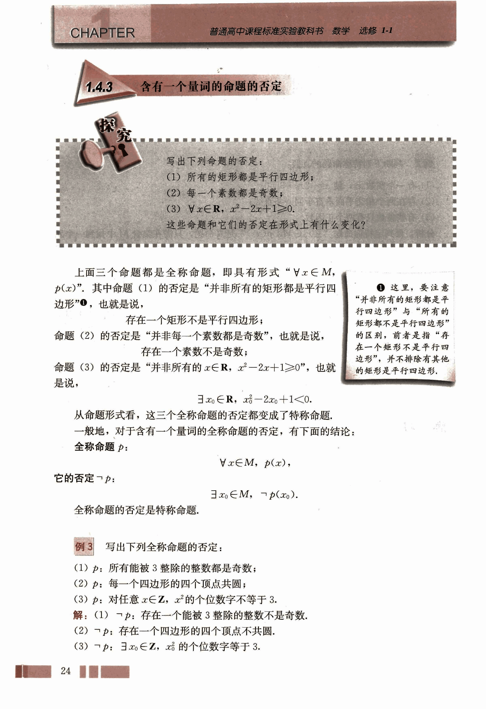
30

# 第一章 常用逻辑用语

## 探究

写出下列命题的否定:

(1) 有些实数的绝对值是正数;

(2) 某些平行四边形是菱形;

(3) ∃x₀∈R, x₀²+1<0.

这些命题和它们的否定在形式上有什么变化?

这三个命题都是特称命题，即具有形式“∃x₀∈M, p(x₀)”，其中命题(1)的否定是“不存在一个实数，它的绝对值是正数”，也就是说，所有实数的绝对值都不是正数；

命题(2)的否定是“没有一个平行四边形是菱形”，也就是说，每一个平行四边形都不是菱形；

命题(3)的否定是“不存在x₀∈R, x₀²+1<0”，也就是说，∀x∈R, x²+1≥0.

从命题形式看，这三个特称命题的否定都变成了全称命题。

一般地，对于含一个量词的特称命题的否定，有下面的结论：

特称命题p:  ∃x₀∈M, p(x₀),

它的否定¬p: ∀x∈M, ¬p(x).

特称命题的否定是全称命题.

## 例4

写出下列特称命题的否定:

(1) p: ∃x₀∈R, x₀²+2x₀+2≤0;

(2) p: 有的三角形是等边三角形;

(3) p: 有一个素数含三个正因数.

解:

(1) ¬p: ∀x∈R, x²+2x+2>0.

(2) ¬p: 所有三角形都不是等边三角形.

(3) ¬p: 每一个素数都不含三个正因数.

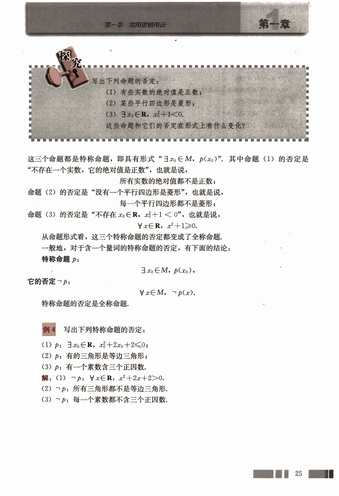
31

# CHAPTER 练习

1. 写出下列命题的否定:
(1) $\forall n \in Z, n \in Q$;
(2) 任意素数都是奇数;
(3) 每个指数函数都是单调函数.

2. 写出下列命题的否定:
(1) 有些三角形是直角三角形;
(2) 有的梯形是等腰梯形;
(3) 存在一个实数,它的绝对值不是正数.

# 习题 1.4

## A组

1. 判断下列全称命题的真假:
(1) 末位是 0 的整数,可以被 5 整除;
(2) 线段的垂直平分线上的点到这条线段两个端点的距离相等;
(3) 负数的平方是正数;
(4) 梯形的对角线相等.

2. 判断下列特称命题的真假:
(1) 有些实数是无限不循环小数;
(2) 有些三角形不是等腰三角形;
(3) 有的菱形是正方形.

3. 写出下列命题的否定:
(1) $\forall x \in N, x^3 > x^2$;
(2) 所有可以被 5 整除的整数,末位数字都是 0;
(3) $\exists x \in R, x^2 - x_0 + 1 < 0$;
(4) 存在一个四边形,它的对角线互相垂直.

## B组

判断下列命题的真假,并写出这些命题的否定:
(1) 每条直线在 y 轴上都有截距;
(2) 每个二次函数的图象都与 y 轴相交;
(3) 存在一个三角形,它的内角和小于 180°;
(4) 存在一个四边形没有外接圆.

26

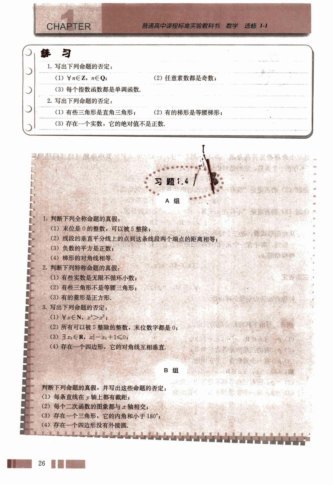
32

# 第一章 常用逻辑用语

## 小结

### 一、本章知识结构

常用逻辑用语

| 命题及其关系 | 充分条件 | 简单的逻辑联结词 | 全称量词 | 存在量词 |
|---|---|---|---|---|
|  | 必要条件 |  |  |  |
|  | 充要条件 |  |  |  |

### 二、回顾与思考

1. 能够判断真假的陈述句叫做命题，把形如“若p，则q”的命题的条件和结论作一些变换，就可以得到它的逆命题、否命题和逆否命题：
(1) 逆命题：若q，则p；
(2) 否命题：若¬p，则¬q；
(3) 逆否命题：若¬q，则¬p.

你能说说四种命题的真假性之间的关系吗？

四种命题真假性之间的内在联系可以为我们进行推理论证带来方便，例如，因为原命题与它的逆否命题有相同的真假性，因此当证明原命题较困难时，我们可以通过证明逆否命题而得到原命题的证明，你能举一些类似的例子吗？

2. 如果从p可以推出q ($p \to q$)，那么就说p是q的充分条件，q是p的必要条件；如果从p可以推出q ($p \to q$)，从q也可以推出p ($q \to p$)，就说p是q的充要条件。

3. 逻辑联结词“且”、“或”、“非”分别用符号“∧”、“∨”、“¬”表示。

如何确定命题 $p∧q$，$pVq$，¬p的真假性与p，q真假性之间的关系呢？

4. 命题中的“对所有”、“任意一个”等短语叫做全称量词，用符号“∀”表示；“存在”、“至少有一个”等短语叫做存在量词，用符号“∃”表示。含有全称量词的命题叫做全称命题，含有存在量词的命题叫做特称命题。

从命题形式上看，全称命题的否定是特称命题，特称命题的否定是全称命题，因此，我们可以通过“举反例”来否定一个全称命题。

如何否定含有一个量词的命题？

5. 用联系的观点看问题，可以使我们更加深刻地理解数学知识，本章中，把逻辑联结词与集合运算、电路的串联和并联联系起来，都体现了联系的观点，你能谈谈学习后的体会吗？

27

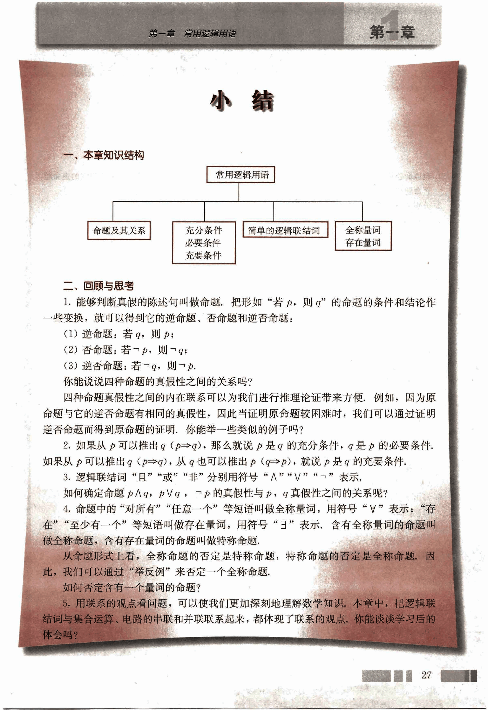
33

# 复习参考题

## A组

1. 设原命题是“等边三角形的三内角相等”，把原命题写成“若p,则q”的形式，并写出它的逆命题，否命题和逆否命题，然后指出它们的真假。

2. 分别举例说明：
(1) p是q的充分条件但不是必要条件；
(2) p是q的必要条件但不是充分条件；
(3) p是q的充分必要条件。

3. 已知a, b, c是实数，判断下列命题的真假：
(1) “a>b”是“a²>b²”的充分条件；
(2) “a>b”是“a²>b²”的必要条件；
(3) “a>b”是“ac²>bc²”的充分条件；
(4) “a>b”是“|a|>|b|”的充要条件。

4. 判断下列命题的真假：
(1) 27是3的倍数或27是9的倍数；
(2) 27是3的倍数且27是9的倍数；
(3) 平行四边形的对角线互相垂直且平分；
(4) 平行四边形的对角线互相垂直或平分；
(5) 1是方程x-1=0的根，且是方程x²-5x+4=0的根。

5. 用符号“√”与“×”表示下列含有量词的命题：
(1) 自然数的平方大于零；
(2) 圆x²+y²=r²上任一点P到圆心的距离是r；
(3) 存在一对整数x₀, y₀, 使得2x₀+4y₀=3；
(4) 存在一个无理数，它的立方是有理数。

6. 写出下列命题的否定：
(1) 3=2；
(2) 5>4；
(3) 对任意实数x, x>0；
(4) 每个正方形都是平行四边形。

## B组

1. 在一次射击训练中，某战士连续射击了两次，设命题p是“第一次射击击中目标”，q是“第二次射击

28

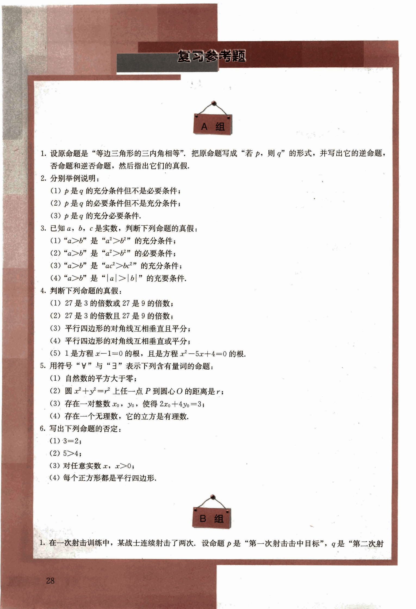
34

# 击中目标

试用 *p*, *q* 以及逻辑联结词“或”“且”“非”（或∨,∧,¬）表示下列命题：

(1) 两次都击中目标；

(2) 两次都没有击中目标。

# 把下列定理表示的命题写成含有量词的命题：

(1) 勾股定理；

(2) 正弦定理。

29

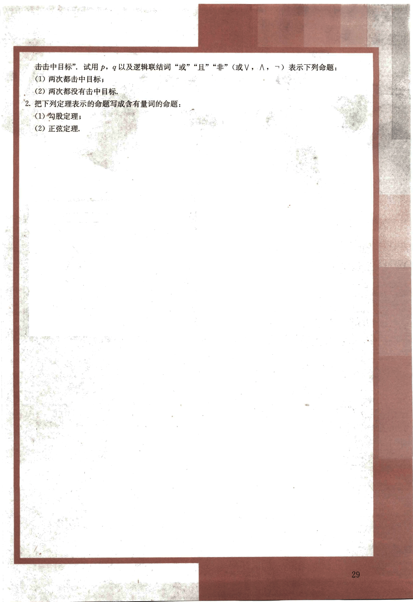
35

# 2

 

圆锥曲线有丰富的实际背景，它在刻画现实世界和解决实际问题中有重要的作用，用坐标法研究圆锥曲线，我们可以进一步感受数形结合的思想。

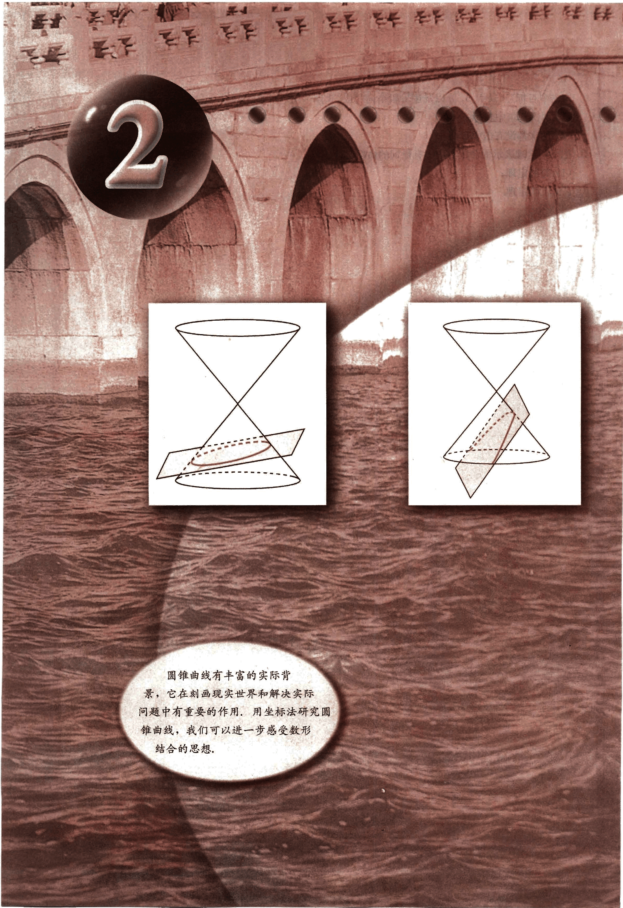
36

# 第二章 圆锥曲线与方程

## 2.1 椭圆

## 2.2 双曲线

## 2.3 抛物线

我们知道，用一个垂直于圆锥的轴的平面截圆锥，截口曲线（截面与圆锥侧面的交线）是一个圆。如果改变平面与圆锥轴线的夹角，会得到什么图形呢？

如图，用一个不垂直于圆锥的轴的平面截圆锥，当截面与圆锥的轴夹角不同时，可以得到不同的截口曲线，它们分别是椭圆、抛物线、双曲线。我们通常把圆、椭圆、抛物线、双曲线统称为圆锥曲线。

圆锥曲线与科研、生产以及人类生活有着紧密的关系，早在16、17世纪之交，开普勒就发现行星绕太阳运行的轨道是一个椭圆；探照灯反射镜面是抛物线绕其对称轴旋转形成的抛物面；发电厂冷却塔的外形线是双曲线……为什么圆锥曲线有如此巨大的作用呢？我们可以从它们的几何特征及其性质中找到答案。

圆锥曲线具有怎样的几何特征？如何研究圆锥曲线的性质？

事实上，圆锥曲线的发现与研究始于古希腊。当时人们从纯粹几何学的观点研究了这种与圆密切相关的曲线，它们的几何性质是圆的几何性质的自然推广，17世纪初期，笛卡尔发明了坐标系，人们开始在坐标系的基础上，用代数方法研究圆锥曲线。

本章我们继续采用必修课程《数学2》中研究直线与圆所用的坐标法，在探究圆锥曲线几何特征的基础上，建立它们的方程，通过方程研究它们的简单性质，并用坐标法解决一些与圆锥曲线有关的简单几何问题和实际问题，进一步感受数形结合的基本思想。

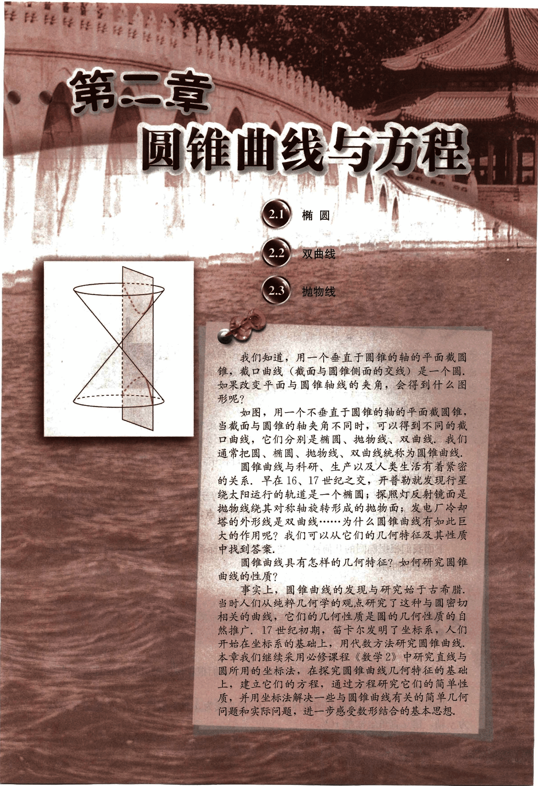
37

# CHAPTER 2
## 2.1 椭圆

### 2.1.1 椭圆及其标准方程

探究

取一条定长的细绳，把它的两端都固定在图板的同一点，套上铅笔，拉紧绳子，移动笔尖，这时笔尖（动点）画出的轨迹是一个圆。如果把细绳的两端拉开一段距离，分别固定在图板的两点处（图2.1-1），套上铅笔，拉紧绳子，移动笔尖，画出的轨迹是什么曲线？

在这一过程中，你能说出移动的笔尖（动点）满足的几何条件吗？

把细绳的两端拉开一段距离，移动笔尖的过程中，细绳的长度保持不变，即笔尖到两个定点的距离之和等于常数。

我们把平面内与两个定点 $F_1$，$F_2$ 的距离之和等于常数（大于 $|F_1F_2|$）的点的轨迹叫做椭圆 (ellipse)。这两个定点叫做椭圆的焦点，两焦点间的距离叫做椭圆的焦距。

下面我们根据椭圆的几何特征，建立适当的坐标系，求出椭圆的方程，并通过方程研究椭圆的性质。

思考

观察椭圆的形状，你认为怎样建立坐标系才能使椭圆的方程简单？

类比利用圆的对称性建立圆的方程的过程，我们根据椭圆的几何特征选择适当的坐标系，建立它的方程。

如图 2.1-2，以经过椭圆两焦点 $F_1$，$F_2$ 的直线为 x 轴，线段 $F_1F_2$ 的垂直平分线为 y 轴，建立直角坐标系 xOy。

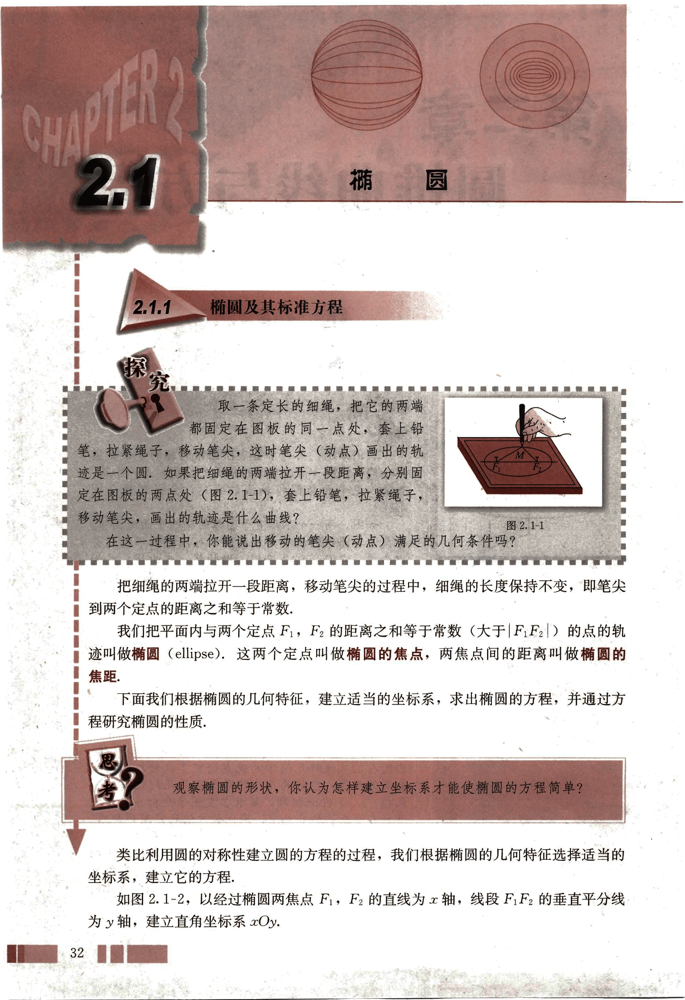
38

# 第二章 圆锥曲线与方程

设M(x, y)是椭圆上任意一点，椭圆的焦距为2c (c>0)，那么焦点F₁, F₂的坐标分别为(-c, 0), (c, 0)。

又设M与F₁, F₂的距离的和等于2a。

由椭圆的定义，椭圆就是集合

P = {M ||MF₁| + |MF₂| = 2a}。

因为|MF₁| = √(x+c)²+y²，|MF₂| = √(x-c)²+y²，

所以

√(x+c)²+y² + √(x-c)²+y² = 2a。

为化简这个方程，将左边的一个根式移到右边，得

√(x+c)²+y² = 2a - √(x-c)²+y²

将这个方程两边平方，得

(x+c)²+y² = 4a² - 4a√(x-c)²+y² + (x-c)²+y²

整理得

a² - cx = a√(x-c)²+y²

上式两边再平方，得

a⁴ - 2a²cx + c²x² = a²(x-c)² + a²y²

整理得

a⁴ - 2a²cx + c²x² = a²x² - 2a²cx + a²c² + a²y²

整理得

(a² - c²)x² + a²y² = a²(a² - c²)

两边同除以a²(a² - c²), 得

$\frac{x^2}{a^2} + \frac{y^2}{a^2 - c^2} = 1$

由椭圆的定义可知，2a > 2c，即a > c，所以a² - c² > 0。

## 思考

观察图2.1-3，你能从中找出表示a, c, √a²-c²的线段吗？

[图2.1-3](images/2.1-3.png)

由图2.1-3可知，|PF₁| = |PF₂| = a，|OF₁| = |OF₂| = c，|PO| = √a²-c²。令b = √a²-c²，那么①式就是

$\frac{x^2}{a^2} + \frac{y^2}{b^2} = 1$ (a > b > 0).

从上述过程可以看到，椭圆上任意一点的坐标都满足方程②。

[图2.1-2](images/2.1-2.png)
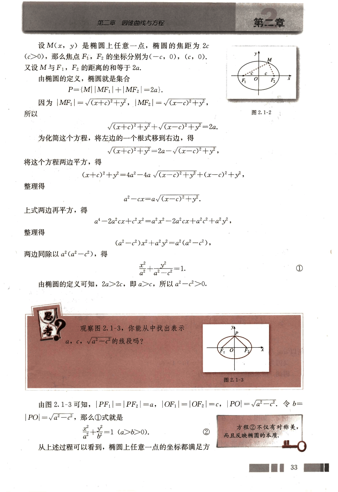
39

# CHAPTER 2

普通高中课程标准实验教科书 数学选修 1-1

程②;以方程②的解(x,y)为坐标的点到椭圆两个焦点(-c,0),(c,0)的距离之和为2a,
即以方程②的解为坐标的点都在椭圆上,这样,我们把方程②叫做椭圆的标准方程,它的焦
点在x轴上,两个焦点分别是F₁(-c, 0), F₂(c,0),这里c²= a²-b².

## 思考?

如图2.1-4,如果焦点 F₁, F₂ 在y轴上,
且F₁,F₂的坐标分别为(0,-c), (0, c), a,
b的意义同上,那么椭圆的方程是什么?

[图2.1-4](images/2.1-4.png)

容易知道,此时椭圆的方程是

$\frac{x^2}{b^2} + \frac{y^2}{a^2} = 1$ (a>b>0),

这个方程也是椭圆的标准方程.

## 例1

已知椭圆两个焦点的坐标分别是(-2,0),(2,0),并且经过点$(\frac{5}{2}, -\frac{3}{2})$,求
它的标准方程.

解:因为椭圆的焦点在x轴上,所以设它的标准方程为

$\frac{x^2}{a^2} + \frac{y^2}{b^2} = 1$ (a>b>0).

由椭圆的定义知

$2a = \sqrt{(\frac{5}{2}+2)^2 + (-\frac{3}{2})^2} + \sqrt{(\frac{5}{2}-2)^2 + (-\frac{3}{2})^2}$

$=2\sqrt{10},$

所以a=√10.

又因为c=2,所以b²= a²-c²=10-4=6.

因此,所求椭圆的标准方程为

$\frac{x^2}{10} + \frac{y^2}{6} = 1.$

## 例2

如图2.1-5,在圆x²+y²=4上任取一点P,过点
P作x轴的垂线段PD,D为垂足,当点P在圆上运动时,线
段PD的中点M的轨迹是什么?

[图2.1-5](images/2.1-5.png)

34

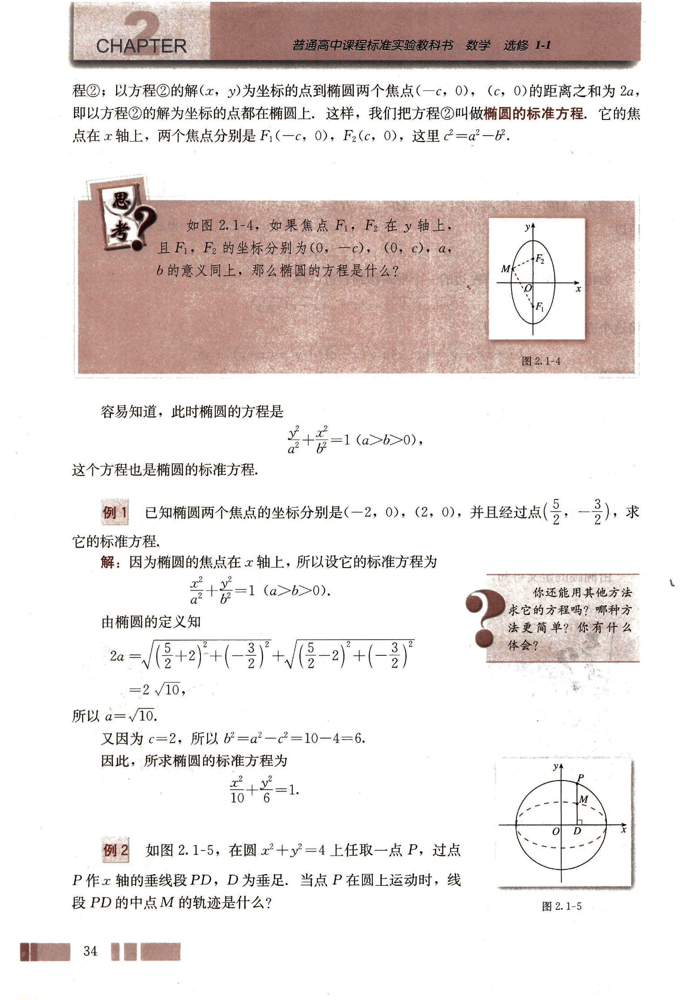
40

# 第二章 圆锥曲线与方程

## 分析

点P在圆 $x^2+y^2=4$ 上运动，点P的运动引起点M的运动，我们可以由M为线段PD的中点得到点M与点P坐标之间的关系式，并由点P的坐标满足圆的方程得到点M的坐标所满足的方程。

## 解

设点M的坐标为(x,y)，点P的坐标为($x_0,y_0$)，则

$x=x_0, y=\frac{y_0}{2}$.

因为点P($x_0,y_0$)在圆$x^2+y^2=4$上，所以

$x_0^2+y_0^2=4$.

把$x_0=x, y_0=2y$代入方程①，得

$x^2+4y^2=4$,

即

$\frac{x^2}{4}+y^2=1$.

所以，点M的轨迹是一个椭圆。

## 思考

从例2你能发现椭圆与圆之间的关系吗？

## 例3

如图2.1-6，设点A，B的坐标分别为(-5,0)，(5,0)。直线AM，BM相交于点M，且它们的斜率之积是$-\frac{4}{9}$，求点M的轨迹方程。

## 分析

设点M的坐标为(x,y)，那么直线AM，BM的斜率就可以用含x,y的式子表示。由于直线AM，BM的斜率之积是$-\frac{4}{9}$，因此，可以建立x,y之间的关系式，得出点M的轨迹方程。

## 解

设点M的坐标为(x,y)，因为点A的坐标是(-5,0)，所以，直线AM的斜率

$k_{AM}=\frac{y}{x+5}$  (x≠-5);

同理，直线BM的斜率

$k_{BM}=\frac{y}{x-5}$  (x≠5).

由已知有

[图2.1-6](images/2.1-6.png)

35

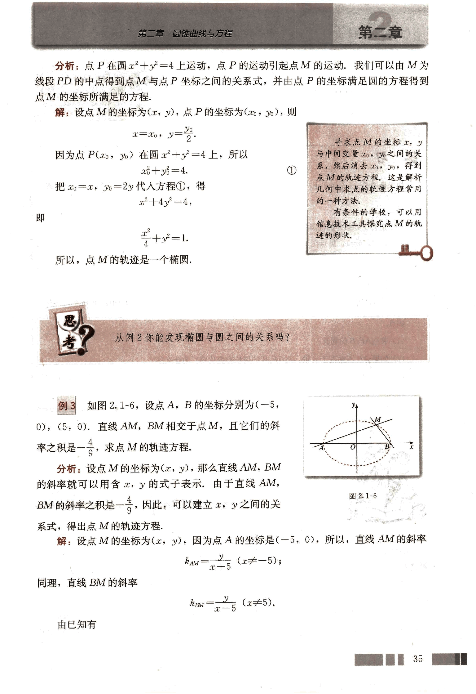
41

# CHAPTER 2

普通高中课程标准实验教科书 数学 选修 1-1

$\frac{y}{x+5} \cdot \frac{y}{x-5} = \frac{4}{9} \quad (x \neq \pm 5)$

化简，得点M的轨迹方程为

$\frac{x^2}{25} + \frac{y^2}{100} = 1 \quad (x \neq \pm 5)$

有条件的学校，请用信息技术工具探究点M的轨迹的形状。

## 练习

1. 如果椭圆 $\frac{x^2}{100} + \frac{y^2}{36} = 1$ 上一点P到焦点$F_1$的距离等于6，那么点P到另一个焦点$F_2$的距离是______。

2. 写出适合下列条件的椭圆的标准方程：

(1) $a=4, b=1$，焦点在x轴上；

(2) $a=4, c=\sqrt{15}$，焦点在y轴上；

(3) $a+b=10, c=2\sqrt{5}$。

3. 已知经过椭圆$\frac{x^2}{25} + \frac{y^2}{16} = 1$的右焦点$F_2$作垂直于x轴的直线AB，交椭圆于A，B两点，$F_1$是椭圆的左焦点。

(1) 求$\triangle AF_1B$的周长；

(2) 如果AB不垂直于x轴，$\triangle AF_1B$的周长有变化吗？为什么？

4. 点A，B的坐标分别是$(-1, 0), (1, 0)$，直线AM，BM相交于点M，且直线AM的斜率与直线BM的斜率的商是2，点M的轨迹是什么？

## 为什么截口曲线是椭圆

如图1，用一个平面去截圆锥，得到的截口曲线是椭圆。那么，为什么截口曲线是椭圆呢？

历史上，许多人从纯几何角度出发对这个问题进行过研究，下面的方法是数学家Germinal Dandelin给出的。

在圆锥内放两个大小不同的球，使得它们分别与圆锥的侧面、截面相切，两个球分别与截面相切于点E，F，在截口曲线上任取一点A，过点A作圆锥的母线，分别与两个球
36

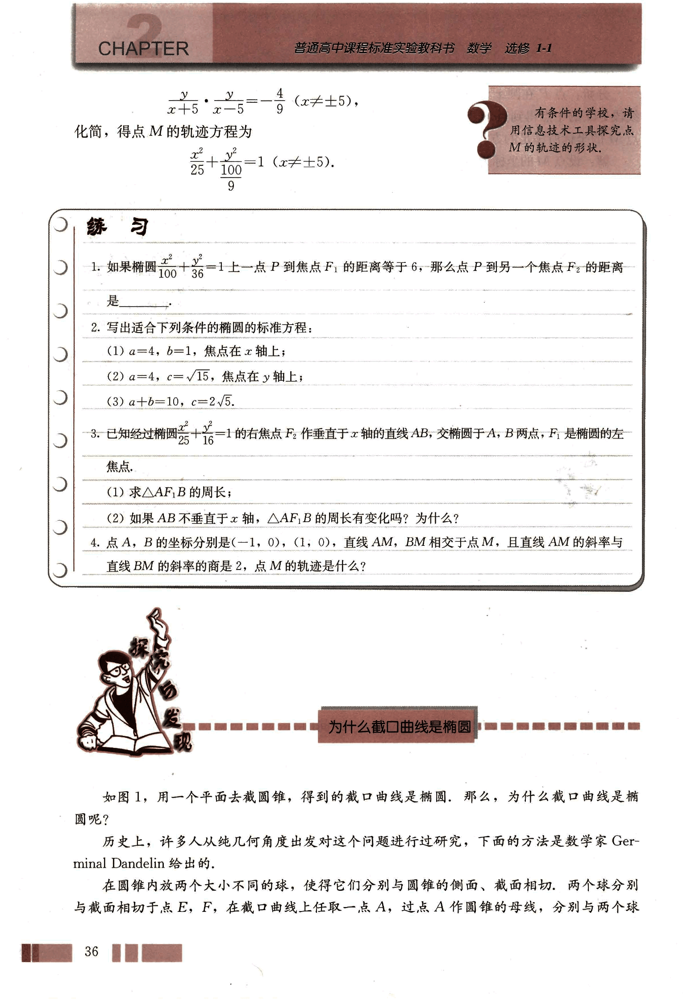
42

# 第二章 圆锥曲线与方程

相切于点C，B. 由球和圆的几何性质，可以知道
AE=AC，AF=AB，
于是
AE+AF=AB+AC=BC.

由切点B，C的产生方法可知，它们之间的距离BC是定值，这样，截口曲线上任意一点A到两个定点E，F的距离之和为常数.

由椭圆的定义可知，截口曲线是椭圆.

Germinal Dandelin的工作非常巧妙，极具创造性.

如图2，用一个与圆柱的母线斜交的平面截圆柱，得到一条截口曲线，你能仿照上述方法，证明截口曲线也是椭圆吗？

[图1](images/图1.png)  [图2](images/图2.png)

## 2.1.2 椭圆的简单几何性质

上面从椭圆的定义（几何特征）出发建立了椭圆的标准方程，下面再利用椭圆的标准方程研究它的几何性质，包括椭圆的形状、大小、对称性和位置等.

我们用椭圆的标准方程

$\frac{x^2}{a^2} + \frac{y^2}{b^2} = 1$  (a>b>0)  ①

来研究椭圆的几何性质.

观察

观察椭圆$\frac{x^2}{a^2} + \frac{y^2}{b^2} = 1$ (a>b>0)的形状，你能从图上看出它的范围吗？它具有怎样的对称性？椭圆上哪些点比较特殊？

37

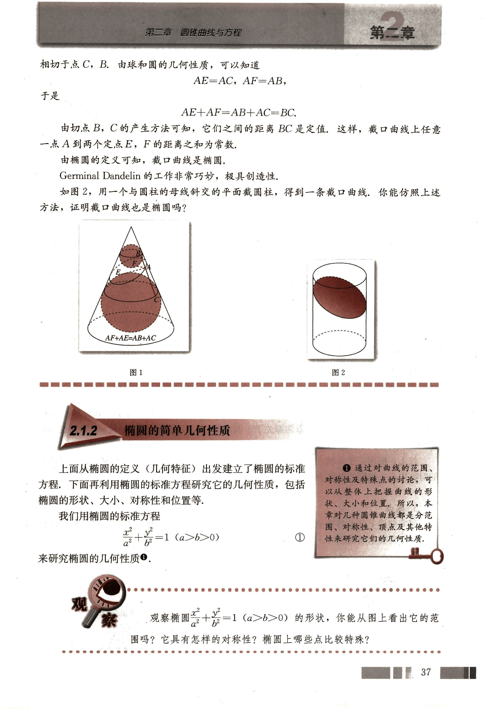
43

# CHAPTER 2

## 1.范围

观察图2.1-7，容易看出椭圆上点的横坐标的范围是$-a \le x \le a$，纵坐标的范围是$-b \le y \le b$。下面，我们利用方程（代数方法）研究它的范围。

由方程①可知

$\frac{y^2}{b^2} = 1 - \frac{x^2}{a^2} \ge 0$，

所以，椭圆上点的横坐标都适合不等式

$\frac{x^2}{a^2} \le 1$，

即

$-a \le x \le a$。

同理有

$\frac{y^2}{b^2} \le 1$，

即

$-b \le y \le b$。

这说明椭圆位于直线$x = \pm a$和$y = \pm b$所围成的矩形框里（图2.1-7）。

## 2.对称性

观察椭圆的形状，可以发现椭圆既是轴对称图形，又是中心对称图形。

在椭圆$\frac{x^2}{a^2} + \frac{y^2}{b^2} = 1$ ($a > b > 0$)中，以$-y$代$y$，方程并不改变，这说明当点$P(x, y)$在椭圆上时，它关于$x$轴的对称点$P_1(x, -y)$也在椭圆上，所以椭圆关于$x$轴对称；同理，以$-x$代$x$，方程也不改变，所以椭圆关于$y$轴对称；以$-x$代$x$，以$-y$代$y$，方程也不改变，所以椭圆关于原点对称。

综上，椭圆关于$x$轴、$y$轴都是对称的。这里，坐标轴是椭圆的对称轴，原点是椭圆的对称中心，椭圆的对称中心叫做椭圆的中心。

## 3.顶点

研究曲线上某些特殊点的位置，可以确定曲线的位置。要确定曲线在坐标系中的位置，常常需要求出曲线与$x$轴、$y$轴的交点坐标。

[图2.1-7](images/2.1-7.png)

38
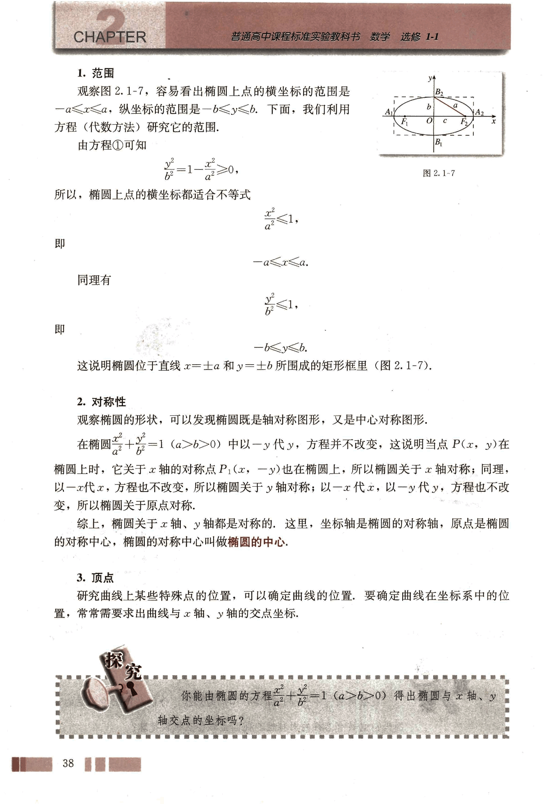
44

# 第二章 圆锥曲线与方程

在椭圆的标准方程里,令x=0,得y=±b,这说明B₁(0, -b), B₂(0, b)是椭圆与y轴的两个交点,同理,令y=0,得x=±a,这说明A₁(-a, 0), A₂(a, 0)是椭圆与x轴的两个交点,因为x轴、y轴是椭圆的对称轴,所以椭圆与它的对称轴有四个交点,这四个交点叫做椭圆的顶点(图2.1-8).

线段A₁A₂, B₁B₂分别叫做椭圆的长轴和短轴,它们的长分别等于2a和2b,a和b分别叫做椭圆的长半轴长和短半轴长.

## 4. 离心率

观察不同的椭圆(图2.1-9),我们发现,椭圆的扁平程度不一,那么,用什么量可以刻画椭圆的扁平程度呢?

如图2.1-10,椭圆$\frac{x^2}{a^2} + \frac{y^2}{b^2} = 1$ (a>b>0)的长半轴长为a,半焦距为c.保持长半轴长a不变,改变椭圆的半焦距c,可以发现,c越接近a,椭圆越扁平,这样,利用c和a这两个量,可以刻画椭圆的扁平程度.

我们把椭圆的焦距与长轴长的比$\frac{c}{a}$称为椭圆的离心率,用e表示,即$e = \frac{c}{a}$.

因为a>c>0,所以0<e<1. e越接近于1,则c越接近于a,从而$b = \sqrt{a^2 - c^2}$越小,因此椭圆越扁;反之,e越接近于0,c越接近于0,从而b越接近于a,这时椭圆就越接近于圆.

当且仅当a=b时,c=0,这时两个焦点重合,图形变为圆,它的方程为$x^2 + y^2 = a^2$.

椭圆的离心率可以形象地理解为,在椭圆的长轴长不变的前提下,两个焦点离开中心的程度。

这样规定会给今后研究圆锥曲线的统一性等性质带来方便.

39

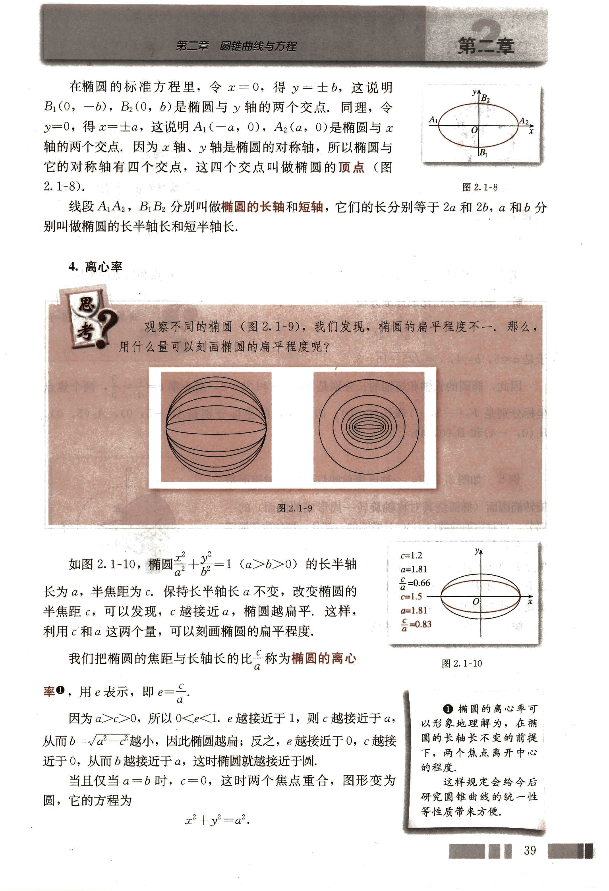
45

# CHAPTER 2

## 探究

1. $\frac{b}{a}$ 或 $e$ 的大小能刻画椭圆的扁平程度吗？为什么？

2. 你能运用三角函数的知识解释为什么 $e = \frac{c}{a}$ 越大，椭圆越扁？$e = \frac{c}{a}$ 越小，椭圆越圆吗？

## 例 4

求椭圆 $16x^2 + 25y^2 = 400$ 的长轴和短轴的长、离心率、焦点和顶点的坐标。

解：把已知方程化成标准方程

$\frac{x^2}{25} + \frac{y^2}{16} = 1$，

于是 $a = 5$，$b = 4$，$c = \sqrt{25 - 16} = 3$。

因此，椭圆的长轴和短轴的长分别是 $2a = 10$ 和 $2b = 8$，离心率 $e = \frac{c}{a} = \frac{3}{5}$，两个焦点的坐标分别是 $F_1(-3, 0)$ 和 $F_2(3, 0)$，四个顶点的坐标分别是 $A_1(-5, 0)$，$A_2(5, 0)$，$B_1(0, -4)$ 和 $B_2(0, 4)$。

## 例 5

如图 2.1-11，一种电影放映灯泡的反射镜面是旋转椭圆面（椭圆绕其对称轴旋转一周形成的曲面）的一部分，过对称轴的截口 BAC 是椭圆的一部分，灯丝位于椭圆的一个焦点 $F_1$ 上，片门位于另一个焦点 $F_2$ 上。由椭圆一个焦点 $F_1$ 发出的光线，经过旋转椭圆面反射后集中到另一个焦点 $F_2$。已知 $BC \perp F_1F_2$，$|F_1B| = 2.8 cm$，$|F_1F_2| = 4.5 cm$。试建立适当的坐标系，求截口 BAC 所在椭圆的方程。

解：建立图 2.1-11 所示的直角坐标系，设所求椭圆方程为 $\frac{x^2}{a^2} + \frac{y^2}{b^2} = 1$。

在 $Rt\triangle BF_1F_2$ 中，$|F_2B| = \sqrt{|F_1B|^2 + |F_1F_2|^2} = \sqrt{2.8^2 + 4.5^2}$。

由椭圆的性质知，$|F_1B| + |F_2B| = 2a$，所以

$a = \frac{1}{2}(|F_1B| + |F_2B|) = \frac{1}{2}(2.8 + \sqrt{2.8^2 + 4.5^2}) \approx 4.1$；

[图2.1-11](images/2.1-11.png)

40

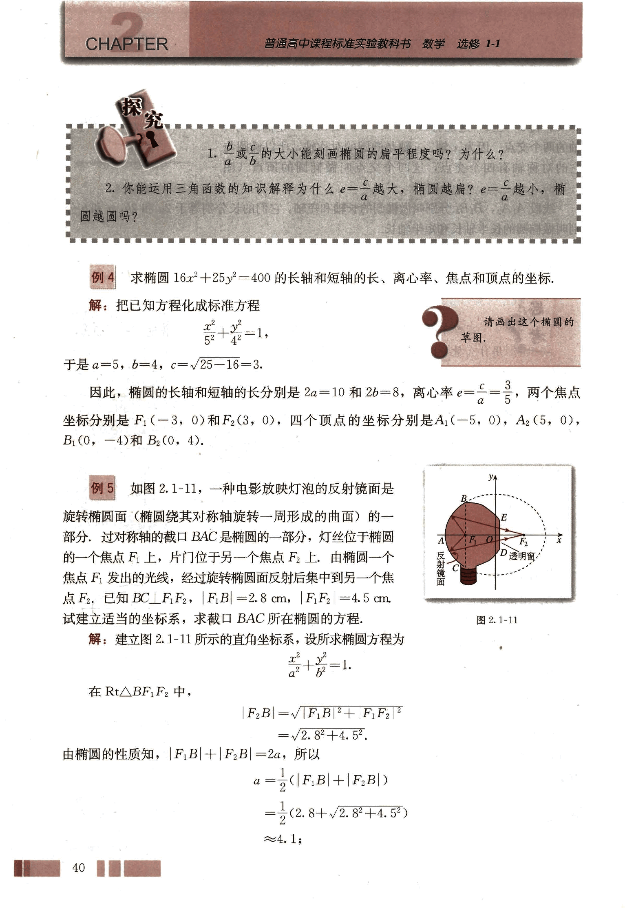
46

# 第二章 圆锥曲线与方程

## 第二章

b=√a²-c²
=√4.1²-2.25²
≈3.4.

所以,所求的椭圆方程为

$\frac{x^2}{4.1^2} + \frac{y^2}{3.4^2} = 1.$

### 例6

点M(x,y)与定点F(4,0)的距离和它到直线l:x=$\frac{25}{4}$的距离的比是常数$\frac{4}{5}$，求点M的轨迹.

解：设d是点M到直线l:x=$\frac{25}{4}$的距离，根据题意，点M的轨迹就是集合

P={M|$ \frac{|MF|}{d} = \frac{4}{5}$},

由此得

$\frac{\sqrt{(x-4)^2 + y^2}}{|\frac{25}{4} - x|} = \frac{4}{5}$.

将上式两边平方，并化简，得

9x²+25y²=225,

即

$\frac{x^2}{25} + \frac{y^2}{9} = 1$.

所以，点M的轨迹是长轴、短轴长分别为10、6的椭圆(图2.1-12).

## 练习

1.你能标出图中椭圆焦点的位置吗？依据是什么？

2.求下列椭圆的焦点坐标：

(1) $\frac{x^2}{100} + \frac{y^2}{36} = 1$;     (2) $2x^2 + y^2 = 8$.

3.求适合下列条件的椭圆的标准方程：

(1)焦点在x轴上，a=6，e=$\frac{1}{3}$;     (2)焦点在y轴上，c=3，e=$\frac{3}{5}$.

4.求适合下列条件的椭圆的标准方程：

(1)经过点P(-3, 0), Q(0, -2);     (2)长轴长等于20，离心率等于$\frac{3}{5}$.

5.比较下列每组中椭圆的形状，哪一个更圆，哪一个更扁？为什么？

(1) $9x^2 + y^2 = 36$ 与 $\frac{x^2}{16} + \frac{y^2}{12} = 1$;

(2) $x^2 + 9y^2 = 36$ 与 $\frac{x^2}{6} + \frac{y^2}{10} = 1$.

41

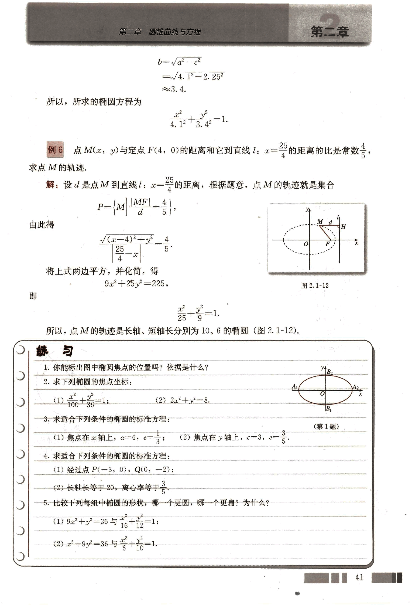
47

# 习题 2.1

## A组

1. 如果点 M(x, y) 在运动过程中，总满足关系式 $\sqrt{x^2 + (y+3)^2} + \sqrt{x^2 + (y-3)^2} = 10$，点 M 的轨迹是什么曲线？为什么？写出它的方程。

2. 写出适合下列条件的椭圆的标准方程：
    (1) 焦点在 x 轴上，焦距等于 4，并且经过点 P(3, -2√6)；
    (2) 焦点坐标分别为 (0, -4), (0, 4), a = 5；
    (3) a + c = 10, a - c = 4.

3. 讨论下列椭圆的范围，并画出图形：
    (1) 4x² + y² = 16；
    (2) 5x² + 9y² = 100.

4. 求下列椭圆的长轴和短轴长、离心率、焦点坐标、顶点坐标：
    (1) x² + 4y² = 16；
    (2) 9x² + y² = 81.

5. 求适合下列条件的椭圆的标准方程：
    (1) 经过点 P(-2√2, 0), Q(0, √5)；
    (2) 长轴长是短轴长的 3 倍，且经过点 P(3, 0)；
    (3) 焦距是 8，离心率等于 0.8.

6. 已知点 P 是椭圆 $\frac{x^2}{5} + \frac{y^2}{4} = 1$ 上的一点，且以点 P 及焦点 F₁, F₂ 为顶点的三角形的面积等于 1，求点 P 的坐标。

7. 如图，圆 O 的半径为定长 r，A 是圆内一个定点，P 是圆上任意一点。线段 AP 的垂直平分线和半径 OP 相交于点 Q，当点 P 在圆上运动时，点 Q 的轨迹是什么？为什么？[图](images/7.png)

8. 彗星“紫金山一号”是南京紫金山天文台发现的，它的运行轨道是以太阳为一个焦点的椭圆。测得轨道的近日点（距离太阳最近的点）距太阳中心 1.486 天文单位，远日点（距离太阳最远的点）距太阳中心 5.563 天文单位（1 天文单位是太阳到地球的平均距离，约 1.5 × 10⁸ km），且近日点、远日点及太阳中心在同一条直线上，求轨道的方程。

9. 已知地球运行的轨道是长半轴长 a = 1.50 × 10⁸ km，离心率 e = 0.0192 的椭圆，且太阳在这个椭圆的一个焦点上，求地球到太阳的最大和最小距离。

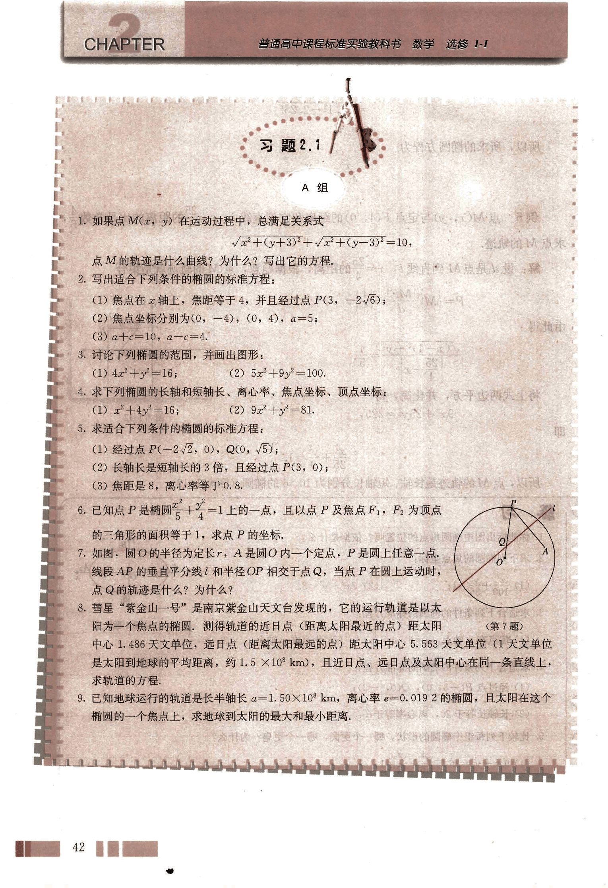
48

# 第二章 圆锥曲线与方程

## B组

1. 如图，DP⊥x轴，点M在DP的延长线上，且$\frac{DM}{DP} = \frac{3}{2}$。当点P在圆$x^2+y^2=4$上运动时，求点M的轨迹方程，并说明轨迹的形状。与例2相比，你有什么发现？

[图1](images/图1.png)
[图2](images/图2.png)

2. 点P与定点F(2,0)的距离和它到定直线x=8的距离的比是1:2，求点P的轨迹方程，并说明轨迹是什么图形。

3. 如图，矩形ABCD中，|AB|=8，|BC|=6。E，F，G，H分别是矩形四条边的中点，R，S，T是线段OF的四等分点，R'，S'，T'是线段CF的四等分点。请证明直线ER与GR'，ES与GS'，ET与GT'的交点L，M，N都在椭圆$\frac{x^2}{16} + \frac{y^2}{9} = 1$上。

[图3](images/图3.png)

## 用《几何画板》探究点的轨迹：椭圆

如图1，F是定点，l是不经过点F的定直线，动点M到定点F的距离和它到定直线l的距离的比e是小于1的常数。用《几何画板》软件画出动点M的轨迹，观察这个轨迹，可以发现它是一个椭圆。

在0<e<1的范围内，改变e的大小，或改变点F与直线l的相对位置，可以发现动点M的轨迹仍然是一个椭圆（图1）。

借助平面直角坐标系，我们可以把上述问题叙述为：

若点M(x,y)与定点F(c,0)的距离和它到定直线l: $x = \frac{a^2}{c}$的距离的比是常数$\frac{c}{a}$ (a>c>0)，则点M的轨迹是一个椭圆（图2）。定点F(c,0)是椭圆的一个焦点，直线l: $x = \frac{a^2}{c}$称为相应于焦点F的准线。由椭圆的对称性，相应于焦点F'(-c,0)，椭圆的准线为$x = -\frac{a^2}{c}$。

43

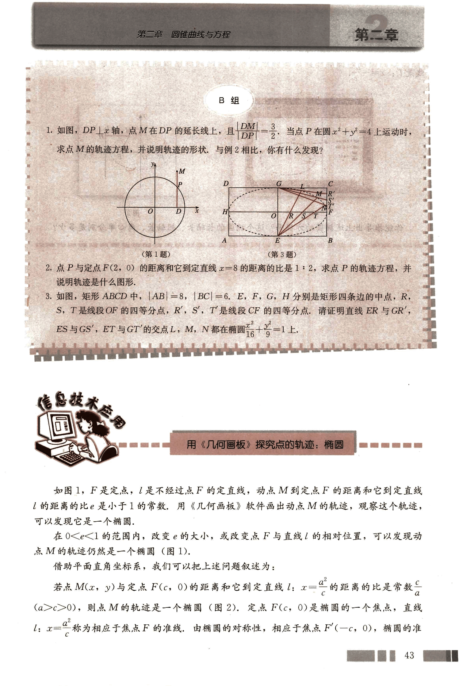
49

# CHAPTER 2 普通高中课程标准实验教科书 数学 选修 1-1

线是 $l': x = \frac{a^2}{c}$

图1 [image1](images/image1.png)

图2 [image2](images/image2.png)

你能推导出上述椭圆的方程吗？这个椭圆的长轴长、短轴长、离心率分别是多少？

44

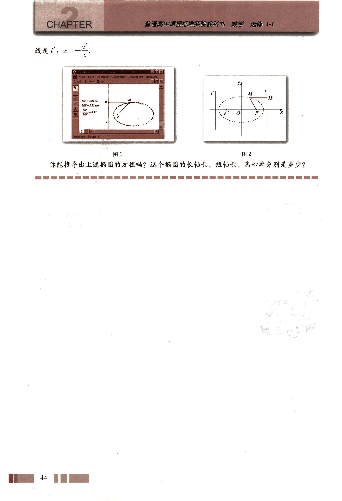
50

# CHAPTER 2

## 2.2 双曲线

### 2.2.1 双曲线及其标准方程

思考？我们知道，与两个定点距离的和为非零常数（大于两个定点间的距离）的点的轨迹是椭圆，那么，与两个定点距离的差为非零常数的点的轨迹是什么？

如图2.2-1，取一条拉链，拉开它的一部分，在拉开的两边上各选择一点，分别固定在点$F_1$，$F_2$上，把笔尖放在点M处，随着拉链逐渐拉开或者闭拢，笔尖所经过的点就画出一条曲线，这条曲线是满足下面条件的点的集合：

$P=\{M||MF_1|-|MF_2|=常数\}$

如果使点M到点$F_2$的距离减去到点$F_1$的距离所得的差等于同一个常数，就得到另一条曲线（图2.2-1中左边的曲线），这条曲线是满足下面条件的点的集合：

$P=\{M||MF_2|-|MF_1|=常数\}$

这两条曲线合起来叫做双曲线，每一条叫做双曲线的一支。

[图2.2-1](images/2.2-1.png)

思考？类比椭圆的定义，你能给出双曲线的定义吗？

我们把平面内与两个定点$F_1$，$F_2$的距离的差的绝对值等于常数（小于$|F_1F_2|$）的点的轨迹叫做双曲线(hyperbola)。这两个定点叫做双曲线的焦点，两焦点间的距离叫做双曲线的焦距。

45

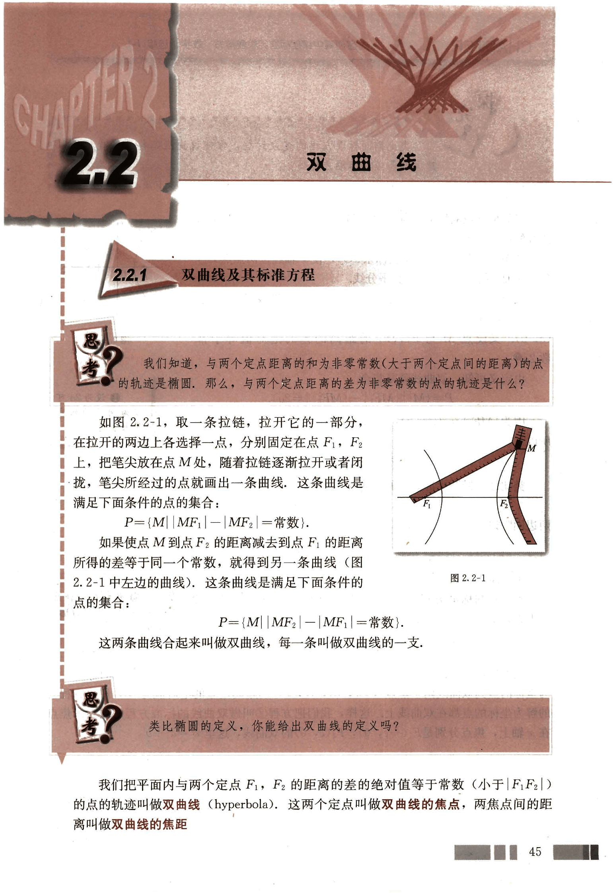
51

# CHAPTER 2 探究

类比椭圆标准方程的建立过程，你能说说应怎样选择坐标系，建立双曲线的标准方程吗？

我们根据双曲线的几何特征，选择恰当的坐标系，建立双曲线的标准方程。

如图 2.2-2，建立直角坐标系 xOy，使 x 轴经过两焦点 F1，F2，y 轴为线段 F1F2 的垂直平分线。

设 M(x, y) 是双曲线上任意一点，双曲线的焦距为 2c(c > 0)，那么，焦点 F1，F2 的坐标分别是 (–c, 0)，(c, 0)。又设点 M 与 F1，F2 的距离的差的绝对值等于常数 2a > 0。

由定义可知，双曲线就是集合
P = {M || |MF1| – |MF2|| = 2a}

因为 |MF1| = $\sqrt{(x+c)^2 + y^2}$，|MF2| = $\sqrt{(x-c)^2 + y^2}$，

所以  $\sqrt{(x+c)^2 + y^2} - \sqrt{(x-c)^2 + y^2} = \pm 2a$ ①

类比建立椭圆标准方程的化简过程，化简①，得

(c2 – a2)x2 – a2y2 = a2(c2 – a2)

两边同除以 a2(c2 – a2)，得

$\frac{x^2}{a^2} - \frac{y^2}{c^2 - a^2} = 1$

由双曲线的定义可知，2c > 2a，即 c > a，所以 c2 – a2 > 0。

类比椭圆标准方程的建立过程，我们令 c2 – a2 = b2，其中 b > 0，代入上式，得

$\frac{x^2}{a^2} - \frac{y^2}{b^2} = 1$ (a > 0, b > 0)

从上述过程可以看到，双曲线上任意一点的坐标都满足方程②；以方程②的解 (x, y) 为坐标的点到双曲线两个焦点 (–c, 0), (c, 0) 的距离之差的绝对值为 2a，即以方程②的解为坐标的点都在双曲线上。这样，我们把方程②叫做双曲线的标准方程，它表示焦点在 x 轴上，焦点分别是 F1(–c, 0), F2(c, 0) 的双曲线，这里 c2 = a2 + b2。

46

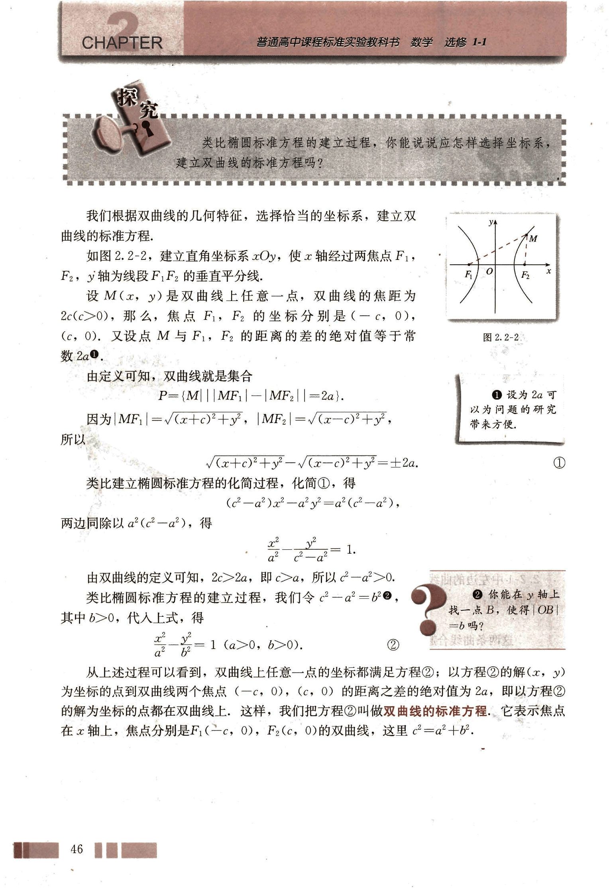
52

# 第二章 圆锥曲线与方程

## 思考

类比焦点在y轴上的椭圆标准方程,如图2.2-3,双曲线的焦点分别是F₁(0,-c), F₂(0,c), a,b的意义同上,这时双曲线的标准方程是什么？

此时双曲线的方程是

$\frac{y^2}{a^2} - \frac{x^2}{b^2} = 1$ (a>0, b>0),

这个方程也是双曲线的标准方程.

## 例1

已知双曲线两个焦点分别为F₁(-5,0),F₂(5,0),双曲线上一点P到F₁, F₂距离差的绝对值等于6,求双曲线的标准方程.

解:因为双曲线的焦点在x轴上,所以设它的标准方程为

$\frac{x^2}{a^2} - \frac{y^2}{b^2} = 1$ (a>0, b>0).

因为2a=6, 2c=10, 所以a=3, c=5, 所以$b^2=5^2-3^2=16$.

因此,双曲线的标准方程为

$\frac{x^2}{9} - \frac{y^2}{16} = 1$.

## 例2

已知A,B两地相距800m,在A地听到炮弹爆炸声比在B地晚2s,且声速为340 m/s,求炮弹爆炸点的轨迹方程.

分析:首先根据题意,判断轨迹的形状.由声速及A,B两处听到爆炸声的时间差,可知A,B两处与爆炸点的距离的差为定值,这样,爆炸点在以A,B为焦点的双曲线上.因为爆炸点离A处比离B处远,所以爆炸点应在靠近B处的双曲线的一支上.

解:如图[2.2-4](images/2.2-4.png),建立直角坐标系xOy,使A,B两点在x轴上,并且坐标原点与线段AB的中点重合.

设爆炸点P的坐标为(x,y),则

$|PA| - |PB| = 340 \times 2 = 680$,

即

2a=680, a=340.

47

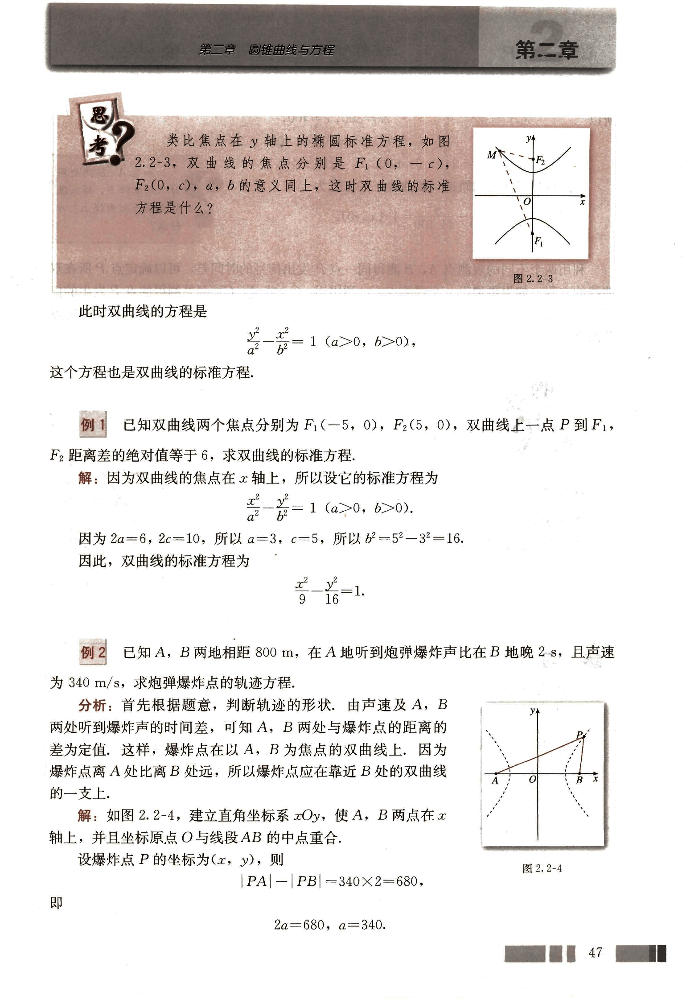
53

# CHAPTER 2

## 又

所以 |AB|=800,

2c=800, c=400,

b²=c²-a²=44 400.

因为|PA|-|PB|=340×2=680>0, 所以x>0.

因此炮弹爆炸点的轨迹(双曲线)的方程为

$\frac{x^2}{115600} - \frac{y^2}{44400} = 1$ (x>0).

利用两个不同的观测点A, B测得同一点P发出信号的时间差, 可以确定点P所在双曲线的方程. 如果再增设一个观测点C, 利用B, C(或A, C)两处测得的点P发出的信号的时间差, 就可以求出另一个双曲线的方程. 解这两个方程组成的方程组, 就能确定点P的准确位置, 这是双曲线的一个重要应用.

## 探究

如图2.2-5, 点A, B的坐标分别为(-5, 0), (5, 0), 直线AM, BM相交于点M, 且它们的斜率之积是$\frac{4}{9}$, 试求点M的轨迹方程, 并由点M的轨迹方程判断轨迹的形状. 与2.1例3比较, 你有什么发现?

[图2.2-5](images/2.2-5.png)

## 练习

1. 求适合下列条件的双曲线的标准方程:

(1) 焦点在x轴上, a=4, b=3;

(2) 焦点在x轴上, 经过点($-\sqrt{2}$, $-\sqrt{3}$), ($\frac{\sqrt{15}}{3}$, $\sqrt{2}$);

(3) 焦点为(0, -6), (0, 6), 且经过点(2, -5).

2. 求证: 双曲线$x^2 - 15y^2 = 15$与椭圆$\frac{x^2}{25} + \frac{y^2}{9} = 1$的焦点相同.

48

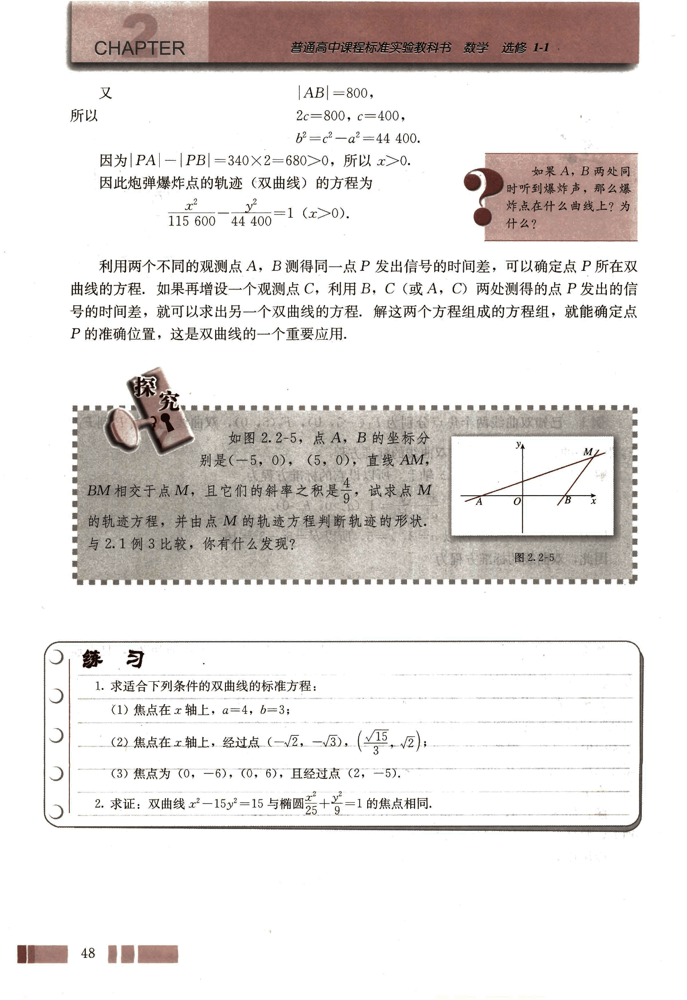
54

# 第二章 圆锥曲线与方程

## 2.2.2 双曲线的简单几何性质

类比椭圆几何性质的研究方法，我们根据双曲线的标准方程

$\frac{x^2}{a^2} - \frac{y^2}{b^2} = 1$  (a>0, b>0)

研究它的几何性质。

### 1. 范围

观察双曲线，可以看出它在不等式x≤-a与x≥a表示的区域内。下面利用双曲线的方程求出它的范围。

将方程①化为

$\frac{y^2}{b^2} = \frac{x^2}{a^2} - 1$

$x^2 \ge a^2$

于是，双曲线上点的坐标(x,y)都适合$\frac{x^2}{a^2} \ge 1$，即

$x \le -a$, 或 $x \ge a$.

这说明双曲线在不等式x≤-a与x≥a所表示的区域内。

### 2. 对称性

类比研究椭圆$\frac{x^2}{a^2} + \frac{y^2}{b^2} = 1$ (a>b>0)对称性的方法，容易得到，双曲线关于x轴、y轴和原点都是对称的，这时，坐标轴是双曲线的对称轴，原点是双曲线的对称中心，双曲线的对称中心叫做双曲线的中心。

### 3. 顶点

在方程①里，令y=0，得x=±a，因此双曲线和x轴有两个交点A1(-a, 0), A2(a, 0)。因为x轴是双曲线的对称轴，所以双曲线和它的对称轴有两个交点，它们叫做双曲线的顶点。

令x=0，得y2=-b2，这个方程没有实数根，说明双曲线和y轴没有交点，但我们也
49

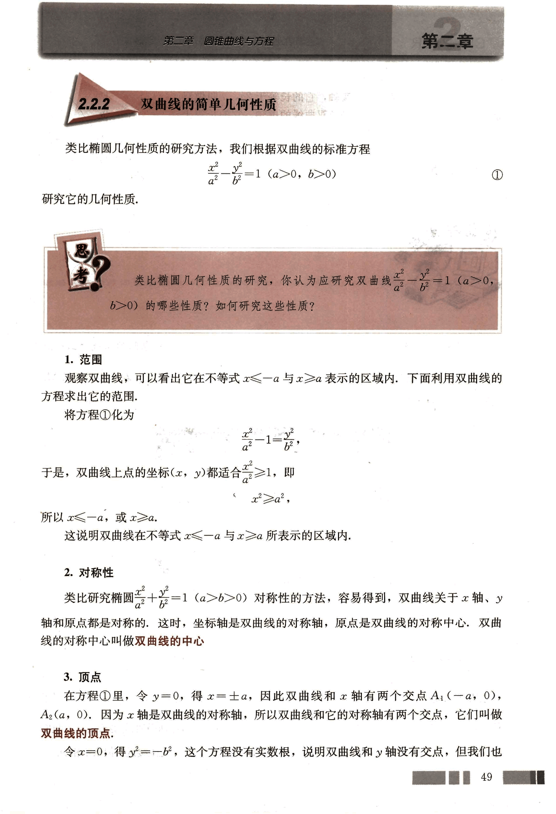
55

# CHAPTER 2

把B₁(0, -b), B₂(0, b)画在y轴上(图2.2-6).

线段A₁A₂叫做双曲线的实轴,它的长等于2a, a叫做双曲线的半实轴长;线段B₁B₂叫做双曲线的虚轴,它的长等于2b, b叫做双曲线的半虚轴长.

## 4. 渐近线

[图2.2-6](images/2.2-6.png)

如图2.2-7, 用《几何画板》画双曲线$\frac{x^2}{9}-\frac{y^2}{4}=1$, 在位于第一象限的曲线上一­点M, 测量点M的横坐标xM以及它到直线$\frac{x}{2}-y=0$的距离d. 沿曲线向右上角拖动点M, 观察xM与d的大小关系, 你发现了什么?

[图2.2-7](images/2.2-7.png)

可以发现, 点M的横坐标xM越来越大, d越来越小, 但永远不等于0.

实际上, 经过A₁, A₂作y轴的平行线x = ±a, 经过B₁, B₂作x轴的平行线y = ±b, 四条直线围成一个矩形(图2.2-7). 矩形的两条对角线所在直线的方程是$\frac{x}{a} \pm \frac{y}{b} = 0$. 利用信息技术, 可以看到, 双曲线$\frac{x^2}{a^2}-\frac{y^2}{b^2}=1$的各支向外延伸时, 与这两条直线逐渐接近, 我们把这两条直线叫做双曲线的渐近线, 也就是说, 双曲线与它的渐近线无限接近, 但永不相交.

50

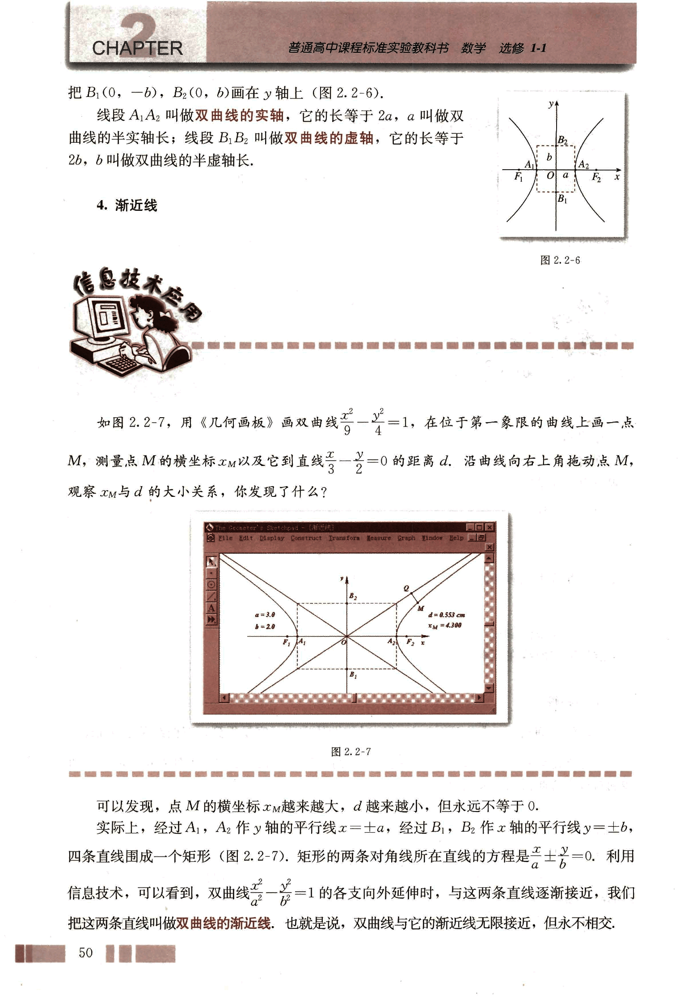
56

# 第二章 圆锥曲线与方程

## 在方程$\frac{x^2}{a^2}-\frac{y^2}{b^2}=1$中，如果$a=b$，那么双曲线的方程为$x^2-y^2=a^2$，它的实轴和虚轴的长都等于$2a$。这时，四条直线$x = ±a$，$y = ±a$围成正方形，渐近线方程为$y=±x$，它们互相垂直，并且平分双曲线实轴和虚轴所成的角。实轴和虚轴等长的双曲线叫做等轴双曲线。

## 5. 离心率

与椭圆类似，双曲线的焦距与实轴长的比，叫做双曲线的离心率，因为$c>a>0$，所以双曲线的离心率$e = \frac{c}{a} > 1$。

## 思考？

离心率可以刻画椭圆的扁平程度，双曲线的离心率刻画双曲线的什么几何特征？

## 例3 求双曲线$9y^2 - 16x^2 = 144$的实半轴长和虚半轴长、焦点坐标、离心率、渐近线方程。

解：把方程$9y^2 - 16x^2 = 144$化为标准方程
$\frac{y^2}{4^2} - \frac{x^2}{3^2} = 1$。

由此可知，实半轴长$a=4$，虚半轴长$b=3$；
$c = \sqrt{a^2 + b^2} = \sqrt{4^2 + 3^2} = 5$，

焦点坐标是$(0, -5)$，$(0, 5)$；离心率$e = \frac{c}{a} = \frac{5}{4}$；渐近线方程为$y = ±\frac{4}{3}x$。

## 例4 双曲线型冷却塔的外形，是双曲线的一部分绕其虚轴旋转所成的曲面（图2.2-8(1)），它的最小半径为12m，上口半径为13m，下口半径为25m，高为55m。试选择适当的坐标系，求出此双曲线的方程。（精确到1m）

解：如图2.2-8(2)，在冷却塔的轴截面所在的平面上建立直角坐标系$xOy$，使小圆的直径$AA'$在$x$轴上，圆心与原点重合。这时，上、下口的直径$CC'$，$BB'$都平行于$x$轴，且$|CC'| = 13 \times 2$，$|BB'| = 25 \times 2$。

设双曲线的方程为$\frac{x^2}{a^2} - \frac{y^2}{b^2} = 1 (a > 0, b > 0)$，令点C的坐标为$(13, y)$，则点B的坐标为$(25, y - 55)$。

51

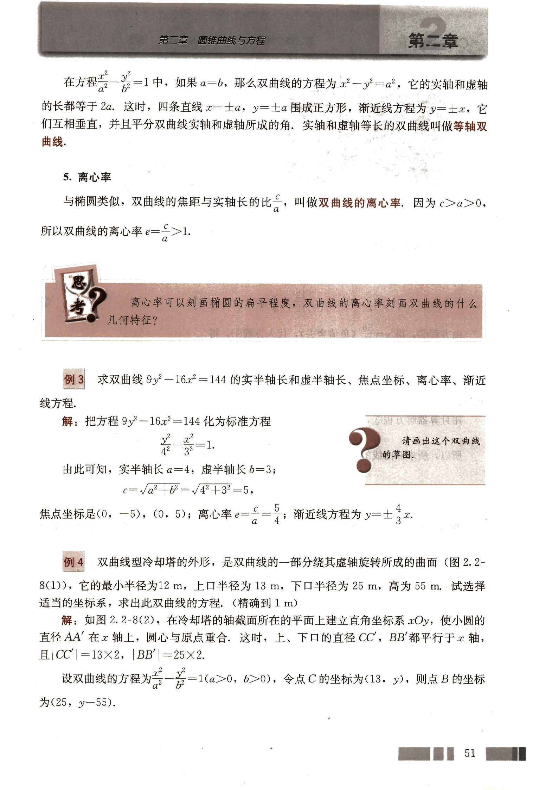
57

# CHAPTER 2

普通高中课程标准实验教科书 数学 选修 1-1

图2.2-8

因为点B，C在双曲线上，所以

$\{\begin{array}{l} \frac{25^2}{12^2} (\frac{y-55}{b})^2 = 1, \\ \frac{13^2}{12^2} y^2 = 1. \end{array}$

由方程②，得$y = \frac{5b}{12}$(负值舍去)，代入方程①，得

$\frac{25^2}{12^2} (\frac{\frac{5b}{12}-55}{b})^2 = 1,$

化简得

$196b^2 + 275b - 18150 = 0.$

用计算器解方程③，得

$b \approx 25.$

所以，所求双曲线的方程为

$\frac{x^2}{144} - \frac{y^2}{625} = 1.$

例 5  点M(x, y)到定点F(5, 0)的距离和它到定直线l: $x = \frac{16}{5}$的距离的比是常数$\frac{5}{4}$，求点M的轨迹。

解：设d是点M到直线l的距离，根据题意，所求轨迹就是集合

$P = \{\frac{|MF|}{d} = \frac{5}{4}\},$

由此得

$\frac{\sqrt{(x-5)^2 + y^2}}{\frac{16}{5} - x} = \frac{5}{4}.$

将上式两边平方，并化简，得

$9x^2 - 16y^2 = 144,$

即

52

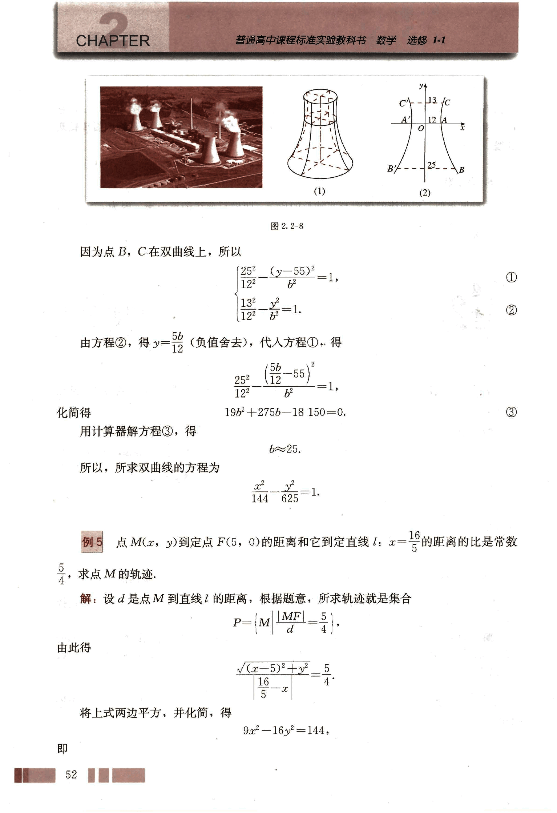
58

# 第二章 圆锥曲线与方程

$\frac{x^2}{16} - \frac{y^2}{9} = 1$

所以，点M的轨迹是实轴、虚轴长分别为8，6的双曲线（图2.2-9）.

[图2.2-9](images/2.2-9.png)

## 思考

比较例5与第41页的例6，你有什么发现？

## 练习

1. 求下列双曲线的实轴、虚轴的长，顶点、焦点的坐标和离心率：
    (1)  $x^2 - 8y^2 = 32;$
    (2)  $9x^2 - y^2 = 81;$
    (3)  $x^2 - y^2 = -4;$
    (4)  $\frac{x^2}{49} - \frac{y^2}{25} = 1.$

2. 求符合下列条件的双曲线的标准方程：
    (1) 顶点在x轴上，两顶点间的距离是8，$e = \frac{5}{4};$
    (2) 焦点在y轴上，焦距是16，$e = \frac{4}{3}.$

3. 求以椭圆 $\frac{x^2}{8} + \frac{y^2}{5} = 1$ 的焦点为顶点，以椭圆的顶点为焦点的双曲线的方程.

4. 等轴双曲线的一个焦点是$F_1(-6, 0)$，求它的标准方程和渐近线方程.

53

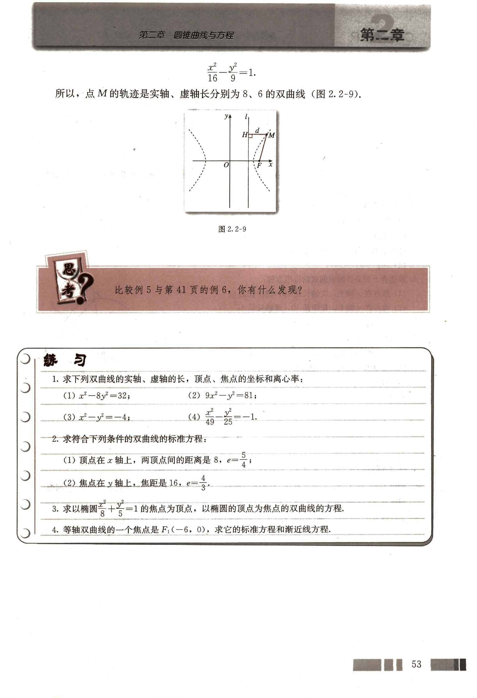
59

# CHAPTER 2

## 习题 2.2

### A组

1. 双曲线 4x² - y² + 64 = 0 上一点 P 到它的一个焦点的距离等于 1，那么点 P 到另一个焦点的距离等于 ______。

2. 求适合下列条件的双曲线的标准方程：

(1) 焦点在 x 轴上，a = 2√5，经过点 A(-5, 2);

(2) 经过两点 A(-7, -6√2)，B(2√7, 3)。

3. 已知下列双曲线的方程，求它的焦点坐标、离心率和渐近线方程：

(1) 16x² - 9y² = 144;

(2) 16x² - 9y² = -144.

4. 求适合下列条件的双曲线的标准方程：

(1) 焦点在 x 轴上，实轴长是 10，虚轴长是 8；

(2) 焦点在 y 轴上，焦距是 10，虚轴长是 8；

(3) 离心率 e = √2，经过点 M(-5, 3)。

5. 如图，圆 O 的半径为定长 r，A 是圆 O 外一个定点，P 是圆上任意一点，线段 AP 的垂直平分线和直线 OP 相交于点 Q，当点 P 在圆上运动时，点 Q 的轨迹是什么？为什么？

[image](images/diagram.png)

6. 求经过点 A(3, -1)，并且对称轴都在坐标轴上的等轴双曲线的方程。

### B组

1. 求与椭圆 $\frac{x^2}{49} + \frac{y^2}{24} = 1$ 有公共焦点，且离心率 $e = \frac{5}{4}$ 的双曲线的方程。

2. 相距 1400 m 的 A，B 两个哨所，听到炮弹爆炸声的时间相差 3 s，已知声速是 340 m/s，问炮弹爆炸点在怎样的曲线上，为什么？

3. 求到定点 F(c, 0) 与到定直线 l: x = $\frac{a^2}{c}$ 距离之比是 $(\frac{c}{a} > 1)$ 的点 M 的轨迹。

54

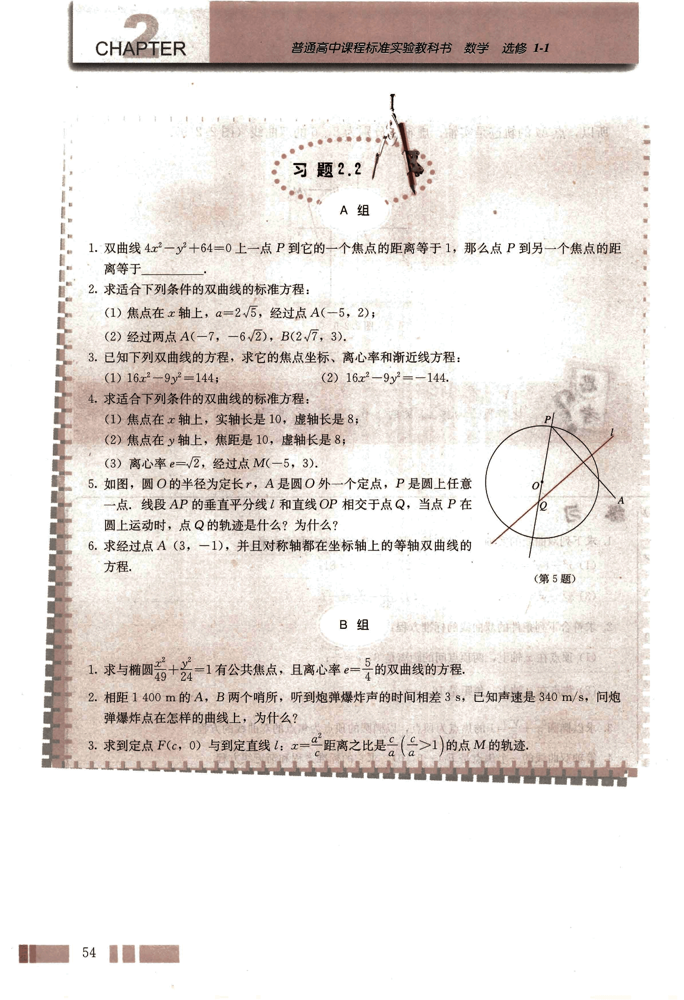
60

# 第二章 圆锥曲线与方程

## 为什么 $y = \pm \frac{b}{a}x$ 是双曲线 $\frac{x^2}{a^2} - \frac{y^2}{b^2} = 1$ 的渐近线

如图，先取双曲线 $\frac{x^2}{a^2} - \frac{y^2}{b^2} = 1$ 在第一象限内的一部分进行证明，这一部分的方程可写为
$y = \frac{b}{a}\sqrt{x^2 - a^2} (x > a)$.

设 M(x, y) 是它上面的点，N(x, Y) 是直线 $y = \frac{b}{a}x$ 上与 M 有相同横坐标的点，则 $Y = \frac{b}{a}x$.

因为 $y = \frac{b}{a}\sqrt{x^2 - a^2} = \frac{b}{a}\sqrt{1 - (\frac{a}{x})^2} < \frac{b}{a}x = Y$,

所以 $|MN| = Y - y = \frac{b}{a}(x - \sqrt{x^2 - a^2})$

$= \frac{b}{a} \cdot \frac{(x - \sqrt{x^2 - a^2})(x + \sqrt{x^2 + a^2})}{x + \sqrt{x^2 - a^2}}$

$= \frac{ab}{x + \sqrt{x^2 - a^2}}$.

设 $|MQ|$ 是点 M 到直线 $y = \frac{b}{a}x$ 的距离，则 $|MQ| < |MN|$.

当 x 逐渐增大时，$|MN|$ 逐渐减小，x 无限增大，$|MN|$ 无限接近于零，$|MQ|$ 也无限接近于零， 就是说，双曲线在第一象限的部分从射线 ON 的下方逐渐接近于射线 ON.

在其他象限内，也可以证明类似的情况。你能证明吗？

另外，我们也可直接计算 $|MQ|$，证明当 x 无限增大时，$|MQ|$ 无限接近于零.

55

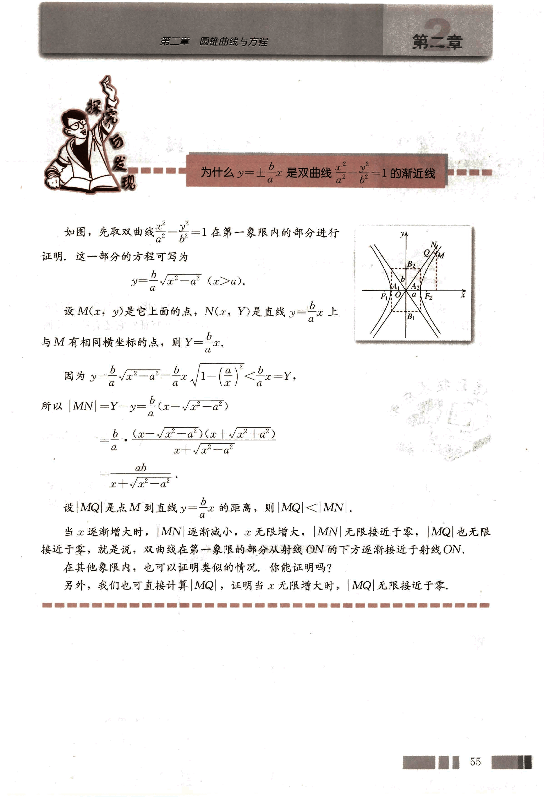
61

# CHAPTER 2
## 2.3 抛物线

### 2.3.1 抛物线及其标准方程

我们知道二次函数 y = ax² + bx + c (a≠0) 的图象是一条抛物线，而且研究过它的顶点坐标、对称轴等问题。那么，抛物线到底有怎样的几何特征？它还有哪些几何性质？

[image](images/image.png)

用《几何画板》画图，如图 2.3-1，点 F 是定点，l 是不经过点 F 的定直线。H 是 l 上任意一点，过点 H 作 MH ⊥ l，线段 FH 的垂直平分线 m 交 MH 于点 M。拖动点 H，观察点 M 的轨迹，你能发现点 M 满足的几何条件吗？

[image](images/image2.png)

图 2.3-1

56

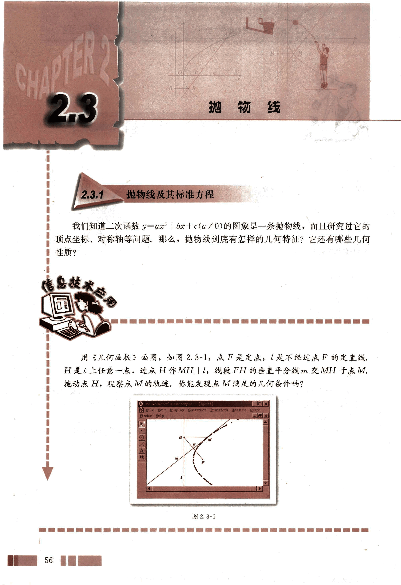
62

# 第二章 圆锥曲线与方程

## 第二章

可以发现，点M随着H运动的过程中，始终有$|MF|=|MH|$，即点M到定点F的距离与它到定直线l的距离相等。

我们把平面内与一个定点F和一条定直线的距离相等的点的轨迹叫做抛物线(parabola)。点F叫做抛物线的焦点，直线l叫做抛物线的准线

### 思考？

比较椭圆、双曲线标准方程的建立过程，你认为应如何选择坐标系，建立的抛物线的方程才能更简单？

根据抛物线的几何特征，我们取经过点F且垂直于直线l的直线为x轴，垂足为K，并使原点与线段KF的中点重合，建立直角坐标系xOy，如图2.3-2所示。

[image](images/2.3-2.png)

设$|KF|=p(p>0)$，那么焦点F的坐标为$(\frac{p}{2},0)$，准线的方程为$x=-\frac{p}{2}$。

设点M(x,y)是抛物线上任意一点，点M到l的距离为d。由抛物线的定义，抛物线就是点的集合

$P=\{M||MF|=d\}$。

因为$|MF|=\sqrt{(x-\frac{p}{2})^2+y^2}$，$d=|x+\frac{p}{2}|$，所以

$\sqrt{(x-\frac{p}{2})^2+y^2}=|x+\frac{p}{2}|$。

将上式两边平方并化简，得

$y^2=2px\quad(p>0)$. ①

从上述过程可以看到，抛物线上任意一点的坐标都满足方程①；以方程①的解(x,y)为坐标的点到抛物线焦点的距离与到准线的距离相等，即以方程①的解为坐标的点都在抛物线上。这样，我们把方程①叫做抛物线的标准方程，它所表示的抛物线的焦点坐标是$(\frac{p}{2},0)$，准线方程是$x=-\frac{p}{2}$。

57

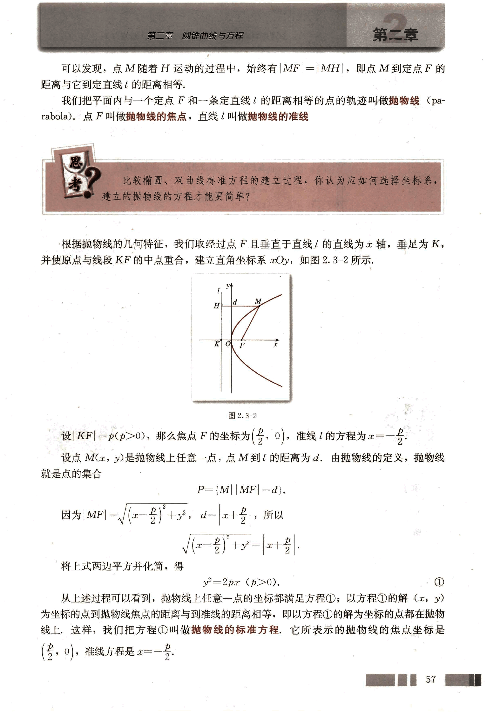
63

# CHAPTER 2

## 探究

在建立椭圆、双曲线的标准方程时，选择不同的坐标系得到了不同形式的标准方程，那么，抛物线的标准方程有哪些不同的形式？请探究之后填写下表.

| 图形 | 标准方程 | 焦点坐标 | 准线方程 |
|---|---|---|---|
| [image1](images/image1.png) | $y^2 = 2px$ ($p>0$) | $(\frac{p}{2}, 0)$ | $x = -\frac{p}{2}$ |
| [image2](images/image2.png) |  |  |  |
| [image3](images/image3.png) |  |  |  |

## 思考

你能说明二次函数 $y = ax^2$ ($a \ne 0$) 的图象为什么是抛物线吗？指出它的焦点坐标、准线方程.

**例 1**

(1) 已知抛物线的标准方程是 $y = 6x$，求它的焦点坐标和准线方程；

(2) 已知抛物线的焦点是 $F(0, -2)$，求它的标准方程.

**解:**

(1) 因为 $p = 3$，所以抛物线的焦点坐标是 $(\frac{3}{2}, 0)$，准线方程是 $x = -\frac{3}{2}$.

(2) 因为抛物线的焦点在 $y$ 轴的负半轴上，且 $\frac{p}{2} = 2$，$p = 4$，所以，所求抛物线的标准方程是 $x^2 = -8y$.

**例 2**

一种卫星接收天线的轴截面如图 2.3-3(1) 所示. 卫星波束呈近似平行状态射入轴截面为抛物线的接收天线，经反射聚集到焦点处. 已知接收天线的口径(直径)为 4.8 m.

58

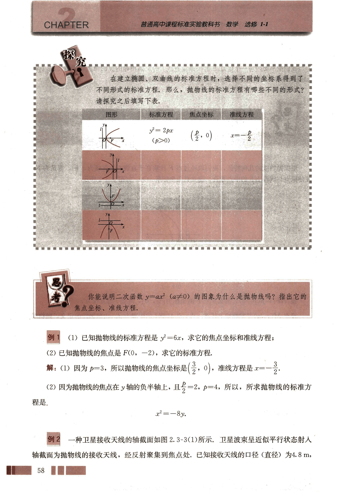
64

# 第二章 圆锥曲线与方程

深度为0.5 m. 试建立适当的坐标系，求抛物线的标准方程和焦点坐标.

解：如图 2.3-3(2)，在接收天线的轴截面所在平面内建立直角坐标系，使接收天线的顶点（即抛物线的顶点）与原点重合.

设抛物线的标准方程是 $y^2 = 2px$ ($p>0$)，由已知条件可得，点 A 的坐标是 (0.5, 2.4)，代入方程，得

$2.4^2 = 2p \times 0.5$

即 $p = 5.76$.

所以，所求抛物线的标准方程是 $y^2 = 11.52x$，焦点坐标是 (2.88, 0).

## 练习

1. 根据下列条件写出抛物线的标准方程：
    (1) 焦点是 F(3, 0);
    (2) 准线方程是 $x = -1$;
    (3) 焦点到准线的距离是 2.

2. 求下列抛物线的焦点坐标和准线方程：
    (1) $y^2 = 20x$;
    (2) $x^2 = \frac{1}{2}y$;
    (3) $2y^2 + 5x = 0$;
    (4) $x^2 + 8y = 0$.

3. 填空：
    (1) 抛物线 $y^2 = 2px$ ($p>0$) 上一点 M 到焦点的距离是 $a (a > \frac{p}{2})$，则点 M 到准线的距离是 _______，点 M 的横坐标是 _______;
    (2) 抛物线 $y^2 = 12x$ 上与焦点的距离等于 9 的点的坐标是 _______.

59

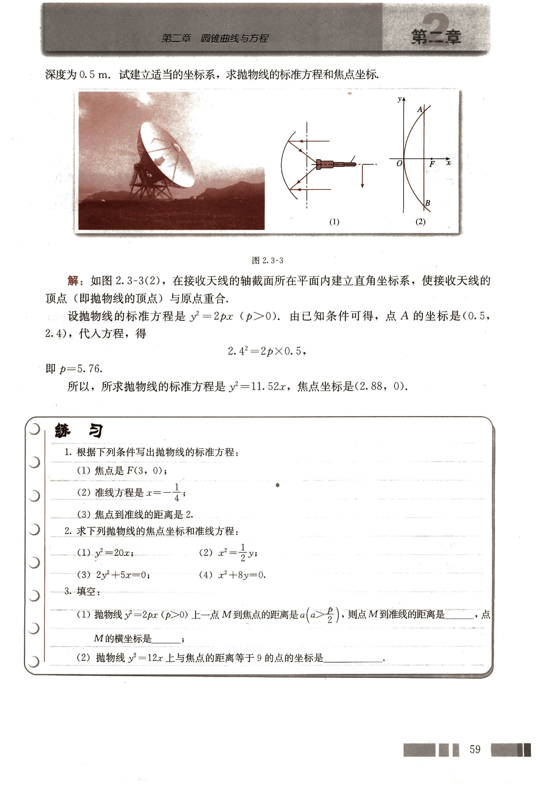
65

# CHAPTER 2.3.2 抛物线的简单几何性质

## 思考

类比椭圆、双曲线的几何性质，你认为可以讨论抛物线的哪些几何性质？

抛物线有许多重要性质，我们根据抛物线的标准方程

$y^2=2px (p>0)$ ①

研究它的一些简单几何性质。

1. 范围

因为 $p>0$，由方程①可知，对于抛物线①上的点 $M(x, y)$，$x≥0$，所以这条抛物线在y轴的右侧，开口方向与x轴正向相同；当x的值增大时，$|y|$也增大，这说明抛物线向右上方和右下方无限延伸。

2. 对称性

以 $-y$ 代 $y$，方程①不变，所以这条抛物线关于x轴对称。我们把抛物线的对称轴叫做抛物线的轴。

3. 顶点

抛物线和它的轴的交点叫做抛物线的顶点。在方程①中，当$y=0$时，$x=0$，因此抛物线①的顶点就是坐标原点。

4. 离心率

抛物线上的点M到焦点的距离和它到准线的距离之比，叫做抛物线的离心率，用 $e$ 表示，由定义可知，$e=1$。

例3 已知抛物线关于x轴对称，它的顶点在坐标原点，并且经过点$M(2, -2\sqrt{2})$，求它的标准方程。

解：因为抛物线关于x轴对称，它的顶点在原点，并且经过点$M(2, -2\sqrt{2})$，所以，可设它的标准方程为

$y^2=2px (p>0)$。

因为点M在抛物线上，所以

$(-2\sqrt{2})^2=2p \cdot 2$

60

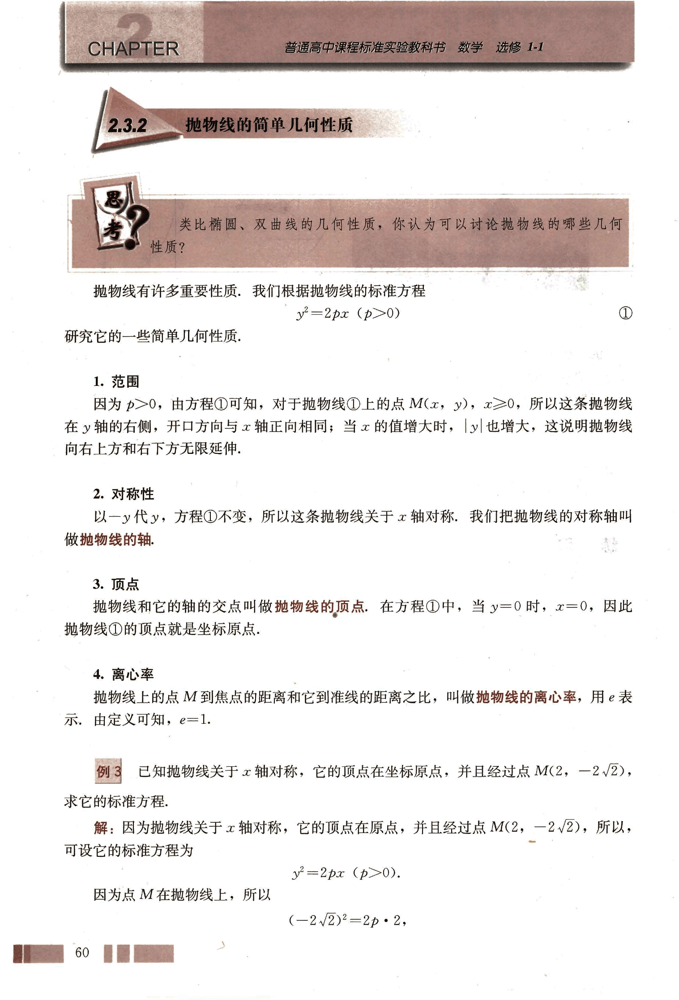
66

# 第二章 圆锥曲线与方程

##  即

p = 2.

因此，所求抛物线的标准方程是

y² = 4x.

## 思 考 ?

顶点在坐标原点，对称轴是坐标轴，并且经过点M(2,-2√2)的抛物线有几条？求出它们的标准方程。

## 例4

斜率为1的直线经过抛物线y²=4x的焦点，且与抛物线相交于A，B两点，求线段AB的长。

**分析:** 由抛物线的方程可以得到它的焦点坐标，又直线l的斜率为1，所以可以求出直线的方程；与抛物线的方程联立，可以求出A，B两点的坐标；利用两点间的距离公式可以求出|AB|。这种方法虽然思路简单，但是需要复杂的代数运算。

下面，我们介绍另外一种方法——数形结合的方法。

在图2.3-4中，设A(x₁,y₁), B(x₂,y₂). 由抛物线的定义可知，|AF|等于点A到准线的距离|AA'|。设|AA'| = dA, 则dA = x₁+1, 于是|AF| = dA = x₁+1. 同理，|BF| = |BB'| = dB = x₂+1, 于是得

|AB| = |AF| + |BF| = x₁ + x₂ + 2.

由此可见，只要求出点A，B的横坐标之和x₁+x₂, 就可 以求出|AB|。

**解:** 如图2.3-4, 设A(x₁,y₁), B(x₂,y₂), A, B到准线的距离分别为dA, dB. 由抛物线的定义可知

|AF| = dA = x₁+1,  |BF| = dB = x₂+1,

|AB| = |AF| + |BF| = x₁ + x₂ + 2.

由已知得抛物线的焦点为F(1,0), 所以直线AB的方程为

y = x - 1.

将①代入方程y²=4x, 得

(x-1)² = 4x,

化简得

x² - 6x + 1 = 0.

由求根公式得

[图2.3-4](images/2.3-4.png)

61

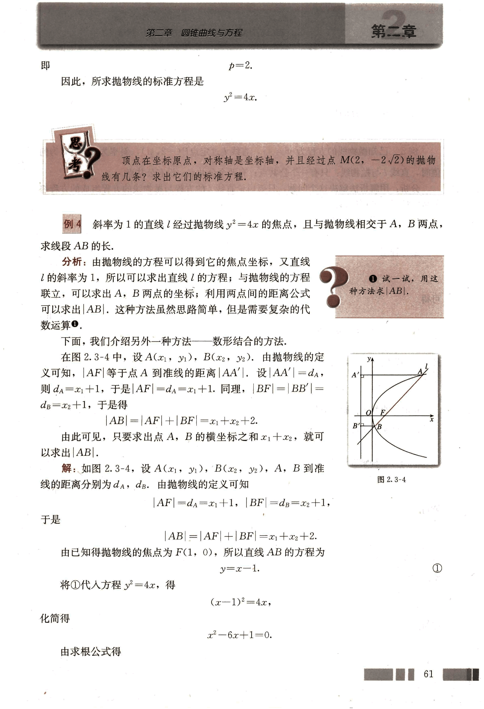
67

# CHAPTER 2

x₁ = 3 + 2√2,  x₂ = 3 - 2√2,

于是

|AB| = x₁ + x₂ + 2 = 8.

所以，线段AB的长是8.

## 例5

已知抛物线的方程为 y² = 4x，直线 *l* 过定点P(-2, 1), 斜率为 *k*. 当 *k* 为何值时，直线 *l* 与抛物线：只有一个公共点；有两个公共点；没有公共点.

分析：用解析法解决这个问题，只要讨论直线的方程与抛物线的方程组成的方程组的解的情况，就可以得出直线 *l* 与抛物线的位置关系.

解：由题意，直线的方程为

y = kx + 2k + 1.

由方程组

$\begin{cases}
y = kx + (2k + 1), \\
y² = 4x
\end{cases}$

(I)

可得

ky² - 4y + 4(2k + 1) = 0.                (II)

(1) 当 k = 0 时，由方程 (II)，得

y = 1.

把 y = 1 代入 y² = 4x，得

x = $\frac{1}{4}$.

这时，直线 *l* 与抛物线只有一个公共点 ($\frac{1}{4}$, 1).

(2) 当 k ≠ 0 时，方程 (II) 的判别式为

Δ = -16(2k² + k - 1).

下面分三种情况讨论.

① 由 Δ = 0，即

2k² + k - 1 = 0,

解得

k = -1 或 k = $\frac{1}{2}$.

于是，当 k = -1 或 k = $\frac{1}{2}$ 时，方程 (II) 只有一个解，从而方程组 (I) 只有一个解. 这时，直线 *l* 与抛物线只有一个公共点.

② 由 Δ > 0，即

2k² + k - 1 < 0,

解得

-1 < k < $\frac{1}{2}$.

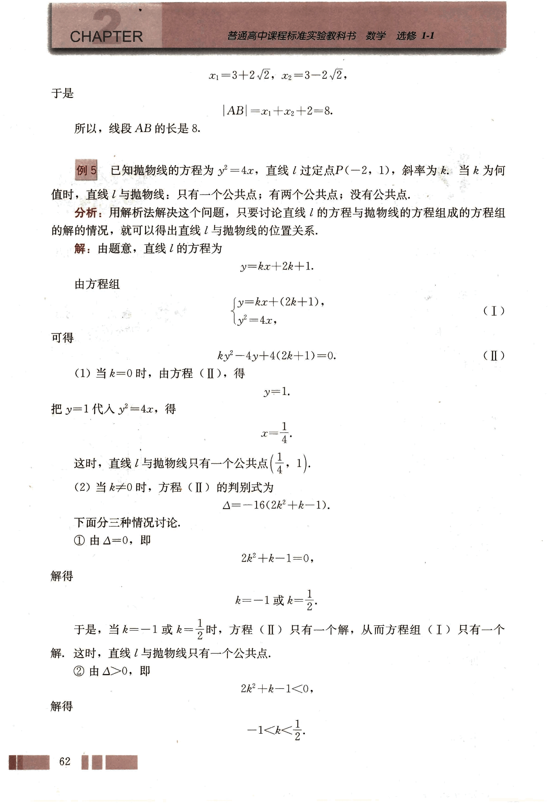
68

# 第二章 圆锥曲线与方程

##  

于是,当$-1 < k < \frac{1}{2}$，且$k \ne 0$时，方程(II)有两个解，从而方程组(I)有两个解，这时，直线 *l* 与抛物线有两个公共点.

③ 由$\Delta > 0$，即

$2k^2 + k - 1 > 0$，

解得

$k < -1 或 k > \frac{1}{2}$

于是，当$k < -1$，或$k > \frac{1}{2}$时，方程(II)没有实数解，从而方程组(I)没有解. 这时，直线 *l* 与抛物线没有公共点.

综上可得：

当$k = -1$，或$k = \frac{1}{2}$，或$k = 0$时，直线 *l* 与抛物线只有一个公共点；

当$-1 < k < \frac{1}{2}$，且$k \ne 0$时，直线 *l* 与抛物线有两个公共点；

当$k < -1$，或$k > \frac{1}{2}$时，直线 *l* 与抛物线没有公共点.

你能通过作图验证这些结论吗？

## 练习

1. 求符合下列条件的抛物线的标准方程：

(1) 顶点在原点，关于 *x* 轴对称，并且经过点M(5, -4);

(2) 顶点在原点，焦点是F(0, 5);

(3) 顶点在原点，准线是$x = 4$;

(4) 焦点是F(0, -8)，准线是$y = 8$.

2. 在同一平面直角坐标系中画出下列抛物线，观察它们开口的大小，并说明抛物线开口大小与方程中的系数有什么样的关系.

(1) $y^2 = \frac{1}{2}x$;

(2) $y^2 = x$;

(3) $y^2 = 2x$;

(4) $y^2 = 4x$.

3. 一条隧道的顶部是抛物拱形，拱高是1.1 m，跨度是2.2 m. 求拱形的抛物线方程.

[image](images/tunnel.png)

63

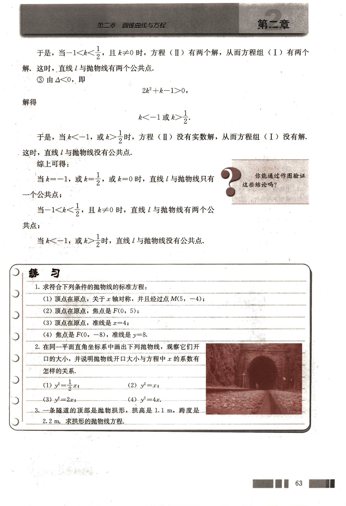
69

# CHAPTER 2

## 习题 2.3

### A 组

1. 选择题.

准线方程为 $x=2$ 的抛物线的标准方程是 (  ).

(A) $y^2 = -4x$     (B) $y^2 = -8x$     (C) $y^2 = 4x$     (D) $y^2 = 8x$

2. 求下列抛物线的焦点坐标和准线方程：

(1) $x^2 = 2y$;

(2) $4x^2 + 3y = 0$;

(3) $2y^2 + x = 0$;

(4) $y^2 - 6x = 0$.

3. 抛物线 $y^2 = 2px (p > 0)$ 上一点 M 到焦点 F 的距离 $|MF| = 2p$，求点 M 的坐标.

4. 根据下列条件，求抛物线的方程，并画出图形：

(1) 顶点在原点，对称轴是 x 轴，并且顶点与焦点的距离等于 6；

(2) 顶点在原点，对称轴是 y 轴，并经过点 P(-6, -3).

5. 如图，吊车梁的鱼腹部分 AOB 是一段抛物线，宽为 7 m，高为 0.7 m，求这条抛物线的方程.  [image1](images/image1.png)

6. 图中是抛物线形拱桥，当水面在 1 时，拱顶离水面 2 m，水面宽 4 m. 水面下降 1 m 后，水面宽多少？ [image2](images/image2.png)

### B 组

1. 从抛物线 $y^2 = 2px (p > 0)$ 上各点向 x 轴作垂线段，求垂线段中点的轨迹方程，并说明它是什 么曲线.

2. 正三角形的一个顶点位于原点，另外两个顶点在抛物线 $y^2 = 2px (p > 0)$ 上，求这个正三角形 的边长.

3. 上网搜索“天文望远镜”“卫星接收天线”“奥运圣火采集”，了解抛物线的应用.

64

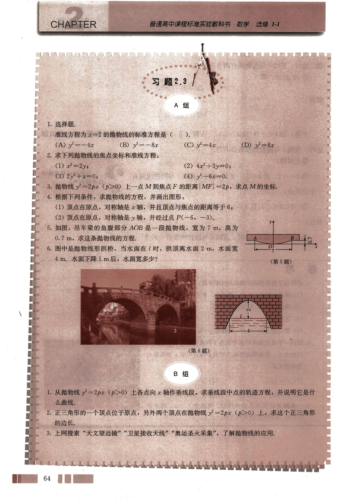
70

# 第二章 圆锥曲线与方程

## 圆锥曲线的光学性质及其应用

一只很小的灯泡发出的光，会分散地射向各方，但把它装在圆柱形手电筒里，经过适当调节，就能射出一束比较强的平行光线，这是为什么呢？

原来手电筒内，在小灯泡后面有一个反光镜，镜面的形状是一个由抛物线绕它的轴旋转所得到的曲面（图1），叫做抛物面，人们已经证明，抛物线有一条重要性质：从焦点发出的光线，经过抛物线上的一点反射（图2）后，反射光线平行于抛物线的轴，探照灯（图3）也是利用这个原理设计的。

[图1](images/图1.png) [图2](images/图2.png) [图3](images/图3.png)

应用抛物线的这个性质，也可以使一束平行于抛物线的轴的光线，经过抛物面的反射集中于它的焦点，人们应用这个原理设计了一种加热水和食物的太阳灶（图4）。在这种太阳灶上装有一个旋转抛物面形的反光镜，当它的轴与太阳光线平行时，太阳光线经过反射后集中于焦点处，这一点的温度就会很高。

[图4](images/图4.png)

椭圆和双曲线的光学性质与抛物线不同，从椭圆的一个焦点发出的光线，经过椭圆反射后，反射光线交于椭圆的另一个焦点上（图5）；从双曲线的一个焦点发出的光线，经过双曲线反射后，反射光线是散开的，它们就好像是从另一个焦点射出的一样（图6）。椭圆、双曲线的光学性质也被人们广泛地应用于各种设计中。

[图5](images/图5.png) [图6](images/图6.png)

如图7，电影放映机的聚光灯有一个反射镜，它的形状是旋转椭圆面，为了使片门（电影胶片通过的地方）处获得最强的光线，灯丝F₂与片门F₁应位于椭圆的两个焦点处，这就是利用椭圆光学性质的一个实例。

[图7](images/图7.png)

65

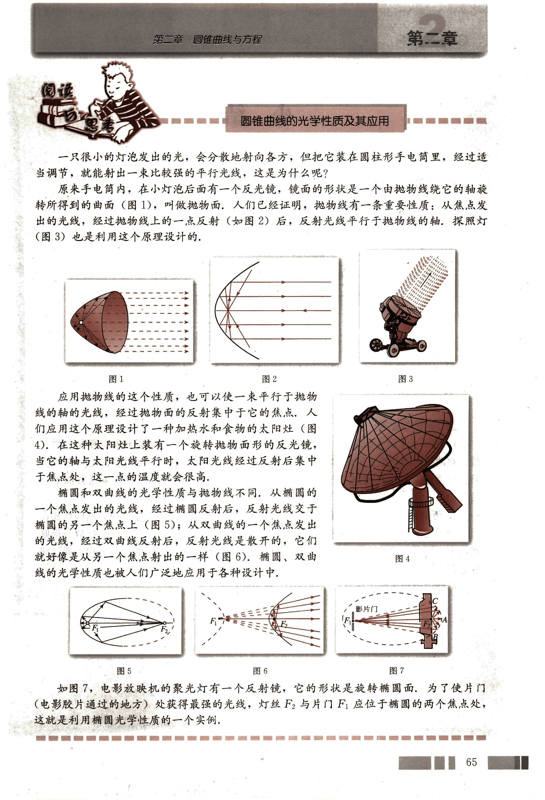
71

# CHAPTER 2

普通高中课程标准实验教科书 数学 选修 1-1

# 小结

## 一、本章知识结构

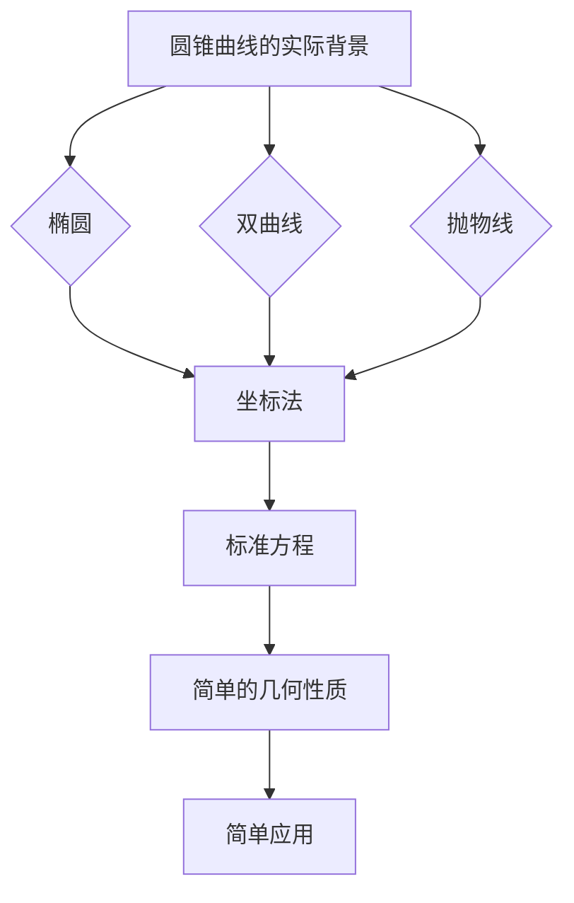
```mermaid
graph TD
    A[圆锥曲线的实际背景] --> B{椭圆};
    A --> C{双曲线};
    A --> D{抛物线};
    B --> E[坐标法];
    C --> E;
    D --> E;
    E --> F[标准方程];
    F --> G[简单的几何性质];
    G --> H[简单应用];
```

## 二、回顾与思考

1. 用一个平面去截圆锥，改变平面与圆锥轴线的夹角，可以得到圆、椭圆、抛物线、双曲线，因此把它们统称为圆锥曲线。事实上，圆锥曲线与天文学、物理学等的 研究紧密相关，也与我们的日常生活紧密相关，请你查阅资料，了解一下这方面的有关知识。

2. 历史上，人们用纯粹几何的方法，得到了关于圆锥曲线的大量性质，这些性质在后来的天文学研究中得到了应用。笛卡儿发明了坐标系后，人们借助坐标系把数与形联系起来，根据圆锥曲线的几何特征，选择适当的坐标系，建立圆锥曲线的方程，通过研究方程而得到圆锥曲线的几何性质，这就是用坐标法研究圆锥曲线。

你能说说用坐标法研究圆锥曲线的具体过程吗？

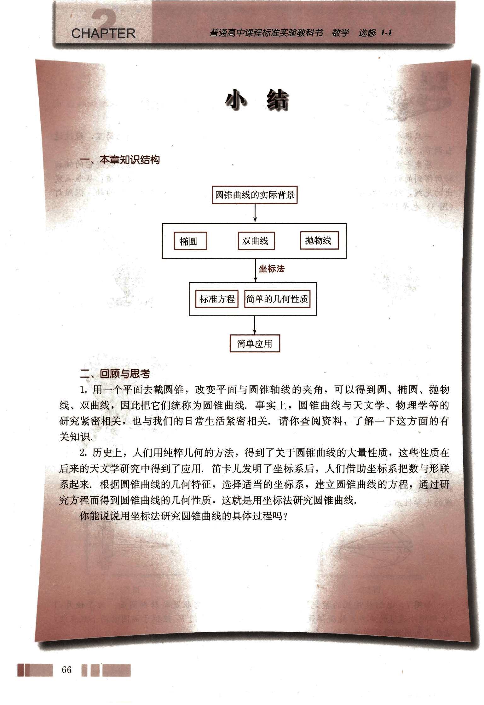
72

# 第二章 圆锥曲线与方程

## 3. 完成下表.

|         | 椭圆     | 双曲线     | 抛物线     |
| :------ | :-------- | :-------- | :-------- |
| 定义     |           |           |           |
| 图形     |  |  |  |
| 标准方程 |           |           |           |
| 顶点坐标 |           |           |           |
| 对称轴   |           |           |           |
| 焦点坐标 |           |           |           |
| 离心率   |           |           |           |

4. 各种圆锥曲线有内在的联系，这种联系能为我们提出问题、获得研究方法提供思路，例如，在研究了椭圆的几何特征、定义、标准方程、简单性质等以后，通过类比，就能得到双曲线、抛物线所要研究的问题以及研究的基本方法。

5. 在圆锥曲线的研究中，信息技术可以发挥很好的作用，例如，借助信息技术，可以方便地画出曲线图形；通过改变某些量（如椭圆的长、短轴或焦距等），可以帮助我们发现曲线的几何特征及其基本性质（变化中保持不变的特征）；等等。总之，研究圆锥曲线时，信息技术在发现问题、形成思想方法、获得结论等方面，都能发挥作用。

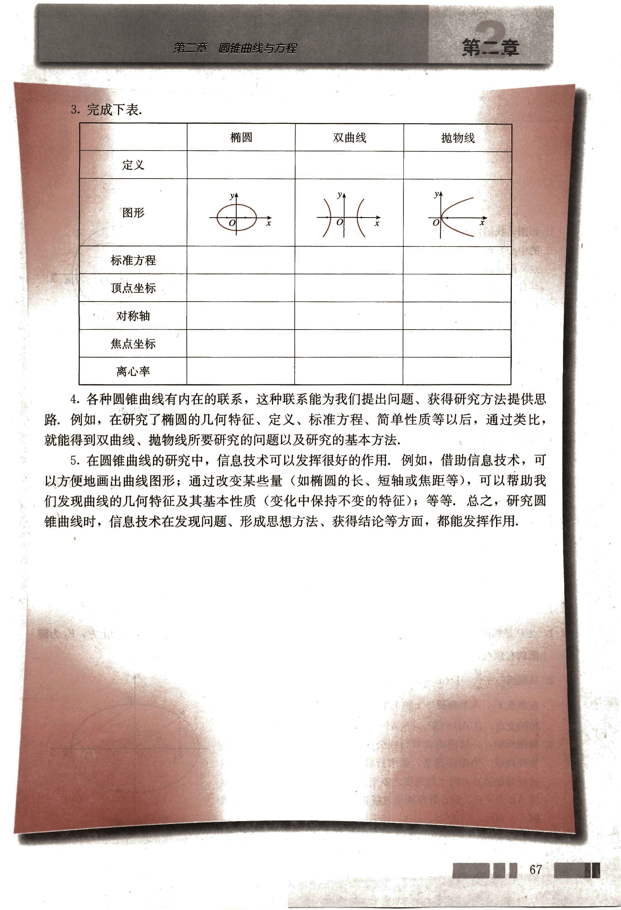
73

# 复习参考题

## A组

1. 如图,我国发射的第一颗人造地球卫星的运行轨道,是以地心(地球的中心)F2为一个焦点的椭圆.已知它的近地点A(离地面最近的点)距地面439 km,远地点B(离地面最远的点)距地面2384 km,并且F2,A,B在同一直线上,地球半径约为6371 km.求卫星运行的轨道方程(精确到1 km).

2. 人造地球卫星的运行轨道是以地心为一个焦点的椭圆.设地球半径为R,卫星近地点,远地点离地面的距离分别为r1,r2,求卫星轨道的离心率.

3. 选择题.

曲线$\frac{x^2}{25} + \frac{y^2}{9} = 1$与曲线$\frac{x^2}{25-k} + \frac{y^2}{9-k} = 1 (k<9)$的( ).

(A)长轴长相等  (B)短轴长相等  (C)离心率相等  (D)焦距相等

4. 双曲线的离心率等于$\frac{\sqrt{5}}{2}$,且与椭圆$\frac{x^2}{9} + \frac{y^2}{4} = 1$有公共焦点,求此双曲线的方程.

5. 当α从0°到180°变化时,方程x2+y2cosα=1表示的曲线的形状怎样变化?

6. 设抛物线的顶点为O,经过焦点垂直于轴的直线和抛物线交于两点B,C,经过抛物线上一点P垂直于轴的直线和轴交于点Q,求证:|PQ|是|BC|和|OQ|的比例中项.

7. 正三角形的一个顶点位于抛物线y2=2px(p>0)的焦点,另外两个顶点在抛物线上,求这个正三角形的边长.

## B组

1. 点P是椭圆16x2+25y2=1600上一点,F1,F2是椭圆的两个焦点,又知点P在x轴上方,F2为椭圆的右焦点,直线PF2的斜率为-4√3,求△PF1F2的面积.

2. 从椭圆$\frac{x^2}{a^2} + \frac{y^2}{b^2} = 1 (a>b>0)$上一点P向x轴作垂线,垂足恰为左焦点F1,A是椭圆与x轴正半轴的交点,B是椭圆与y轴正半轴的交点,且AB//OP, |F1A|=$\sqrt{10} + \sqrt{5}$,求此椭圆方程.

3. 如图所示,一隧道内设双行线公路,其截面由一个长方形和抛物线构成,为保证安全,要求行驶车辆顶部(设为平顶)与隧道顶部在竖直方向上的高度之差至少要有0.5 m.若行车道总宽度AB为6 m,请计算车辆通过隧道的限制高度是多少米(精确到0.1 m)?

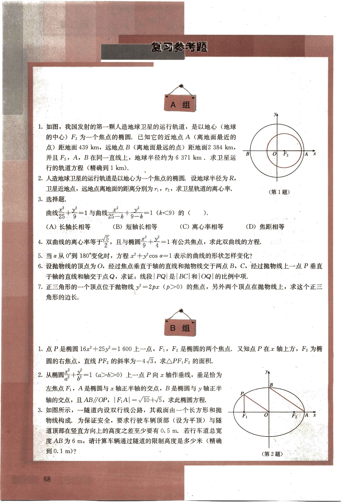
74

# 综合应用抛物线和双曲线的光学性质

4. 综合应用抛物线和双曲线的光学性质，可以设计制造反射式天文望远镜，这种望远镜的特点是，镜筒可以很短而观察天体运动又很清楚，例如，某天文仪器厂设计制造的一种镜筒直径为 0.6 m，长为 2 m 的反射式望远镜，其光学系统的原理如图（中心截口示意图）所示，其中，一个反射镜 PO₁Q 弧所在的曲线为抛物线，另一个反射镜 MO₂N 弧所在的曲线为双曲线的一个分支，已知 F₁, F₂ 是双曲线的两个焦点，其中 F₂ 同时又是抛物线的焦点，试根据图示尺寸（单位：mm），分别求抛物线和双曲线的方程。

## 图示

[image1](images/image1.png)

## 计算

(第3题)  6m, 3m, 8m, 2m 的图形

(第4题)  1763, 2080, 529 的图形

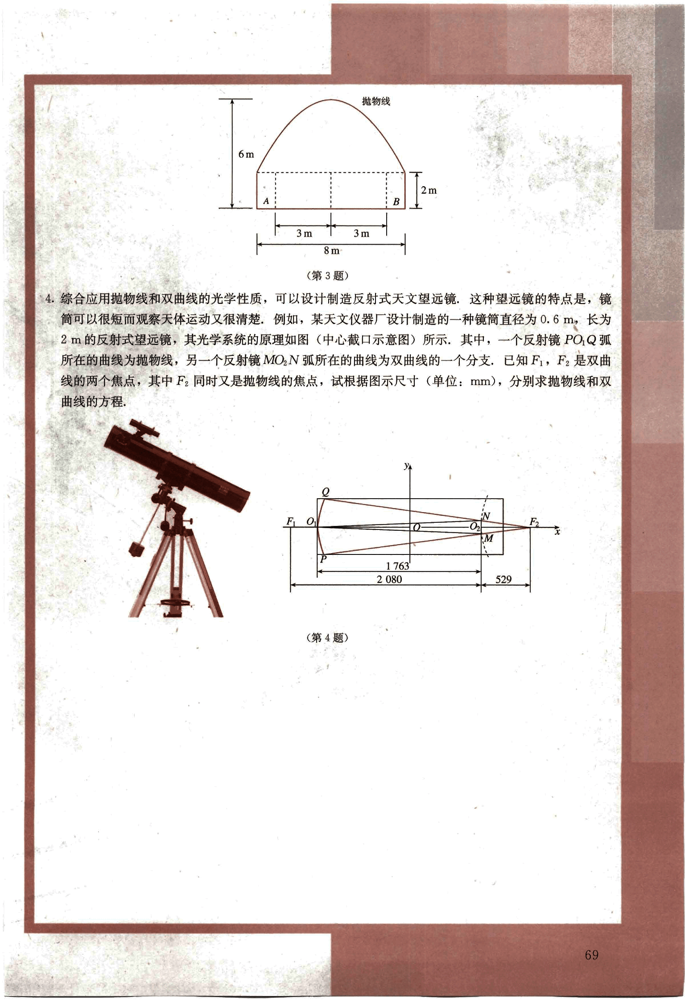
75

# 你看过高台跳水比赛吗？

照片中记录了运动员比赛的瞬间，已知起跳 $t$ s 后，运动员相对于水面的高度 $h$ (单位：m) 可用函数 $h(t) = -4.9t^2 + 6.5t + 10$ 表示。

如何求他在某一时刻的速度？他距水面的最大高度是多少？

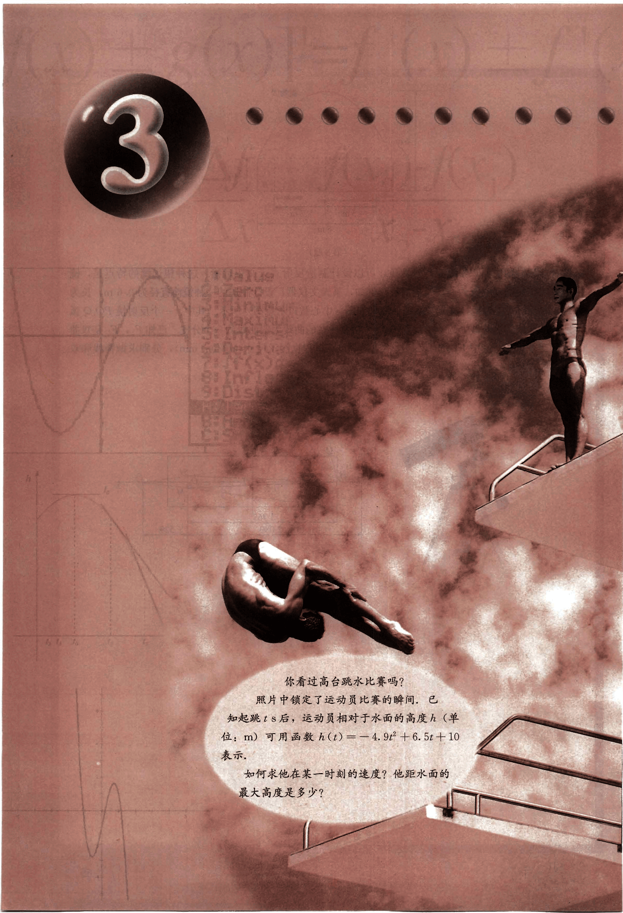
76

# 第三章 导数及其应用

## 3.1 变化率与导数

## 3.2 导数的计算

## 3.3 导数在研究函数中的应用

## 3.4 生活中的优化问题举例

为了描述现实世界中运动、过程等变化着的现象，在数学中引入
了函数，刻画动态的函数与刻画静态的数一样，都是数学中非常重要
的概念。随着对函数的研究，产生了微积分，它是数学发展史上继欧
氏几何后的又一个具有划时代意义的伟大创造，被称为数学史上的里
程碑，它的创立，被誉为“人类精神的最高胜利”。

微积分的创立与自然科学中四类问题的处理直接相关。一是已知
物体运动的路程作为时间的函数，求物体在任意时刻的速度与加速度，以及已知物体的加速度作为时间的函数，求速度与路程；二是求
曲线的切线；三是求已知函数的最大值与最小值；四是求长度、面
积、体积和重心等。历史上科学家们对这些问题的兴趣和研究经久不
衰，经历数百年之久，终于在十七世纪中叶，牛顿和莱布尼兹“站在
巨人的肩膀上”，凭着他们敏锐的直觉和丰富的想象力，各自独立地
创立了微积分。

导数是微积分的核心概念之一，它是研究函数增减、变化快慢、
最大(小)值等问题最一般、最有效的工具，因而也是解决诸如运动
速度、物种繁殖率、绿化面积增长率，以及用料最省、利润最大、效
率最高等实际问题的最有力的工具。微积分在物理、化学、生物、天
文、地理以及经济等各种科学领域中都有非常广泛而重要的应用。

在本章，我们将利用丰富的背景与大量实例，学习导数的基本概
念与思想方法；通过应用导数研究函数性质、解决生活中的最优化问
题等实践活动，初步感受导数在解决数学问题与实际问题中的作用。

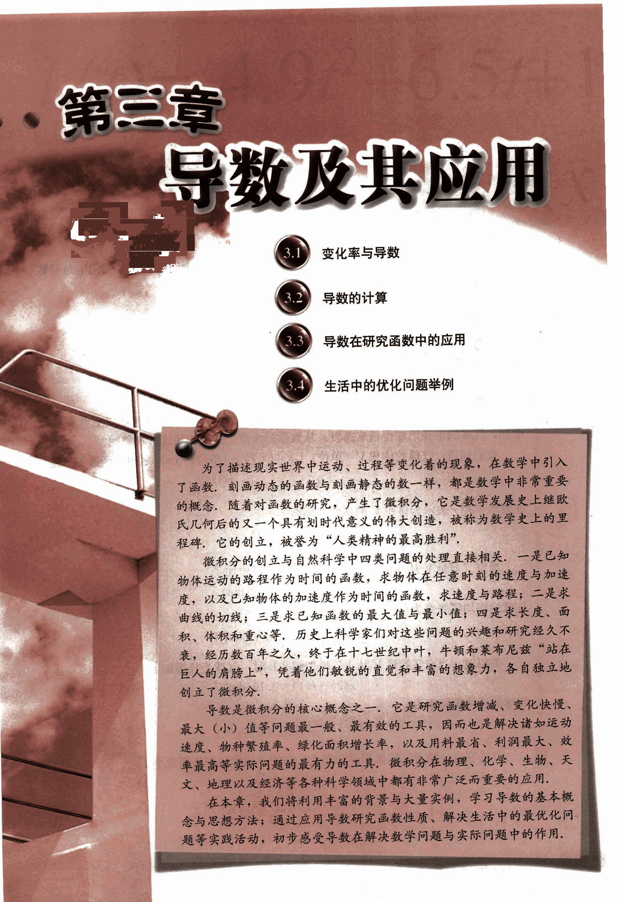
77

# CHAPTER 3

## 3.1 变化率与导数

丰富多彩的变化率问题随处可见，让我们从其中的两个问题，开始变化率与导数的学习吧！

## 3.1.1 变化率问题

**问题1 气球膨胀率**

很多人都吹过气球，回忆一下吹气球的过程，可以发现，随着气球内空气容量的增加，气球的半径增加得越来越慢，从数学的角度，如何描述这种现象呢？

我们知道，气球的体积 *V* (单位：L) 与半径 *r* (单位：dm) 之间的函数关系是

$V(r) = \frac{4}{3}\pi r^3$

如果将半径 *r* 表示为体积 *V* 的函数，那么

$r(V) = \sqrt[3]{\frac{3V}{4\pi}}$

当空气容量 *V* 从 0 增加到 1 L 时，气球半径增加了

气球的平均膨胀率为

$\frac{r(1)-r(0)}{1-0} \approx 0.62(dm/L).$

类似地，当空气容量 *V* 从 1 L 增加到 2 L 时，气球半径增加了

$r(2)-r(1) \approx 0.16(dm),$

气球的平均膨胀率为

$\frac{r(2)-r(1)}{2-1} \approx 0.16(dm/L).$

可以看出，随着气球体积逐渐变大，它的平均膨胀率逐渐变小了.

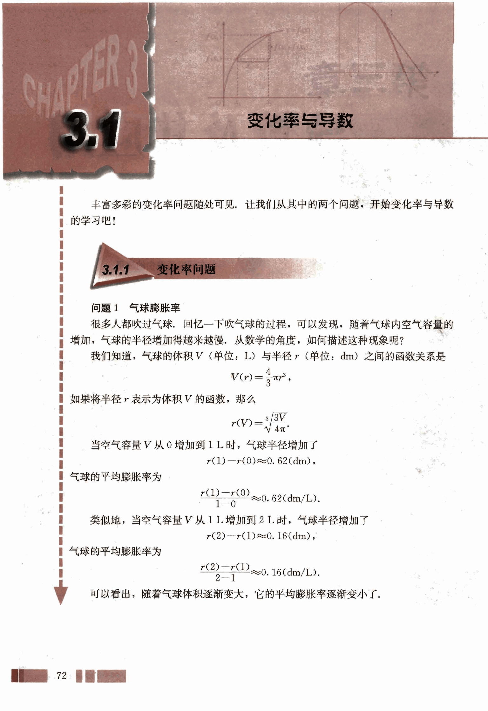
78

# 第三章 导数及其应用

## 思考？

当空气容量从 V₁ 增加到 V₂ 时，气球的平均膨胀率是多少？

## 问题 2 高台跳水

人们发现，在高台跳水运动中，运动员相对于水面的高度 h (单位：m) 与起跳后的时间 t (单位：s) 存在函数关系

h(t) = -4.9t² + 6.5t + 10.

如果我们用运动员在某段时间内的平均速度描述其运动状态，那么：

在 0 < t ≤ 0.5 这段时间里，

v = $\frac{h(0.5) - h(0)}{0.5 - 0}$ = 4.05(m/s);

在 1 < t ≤ 2 这段时间里，

v = $\frac{h(2) - h(1)}{2 - 1}$ = -8.2(m/s).

## 探究

计算运动员在 0 < t ≤ $\frac{65}{49}$ 这段时间里的平均速度，并思考下面的问题：

(1) 运动员在这段时间里是静止的吗？
(2) 你认为用平均速度描述运动员的运动状态有什么问题吗？

如果上述两个问题中的函数关系用 y = f(x) 表示，那么问题中的变化率可用式子

$\frac{f(x_2) - f(x_1)}{x_2 - x_1}$

表示，我们把这个式子称为函数 y = f(x) 从 x₁ 到 x₂ 的平均变化率 (average rate of change)，习惯上用 Δx 表示 x₂ - x₁

Δx = x₂ - x₁.

可把 Δx 看作是相对于 x₁ 的一个“增量”，可用 x₁ + Δx 代替 x₂；类似地，

Δy = f(x₂) - f(x₁).

于是，平均变化率可以表示为

$\frac{\Delta y}{\Delta x}$

73

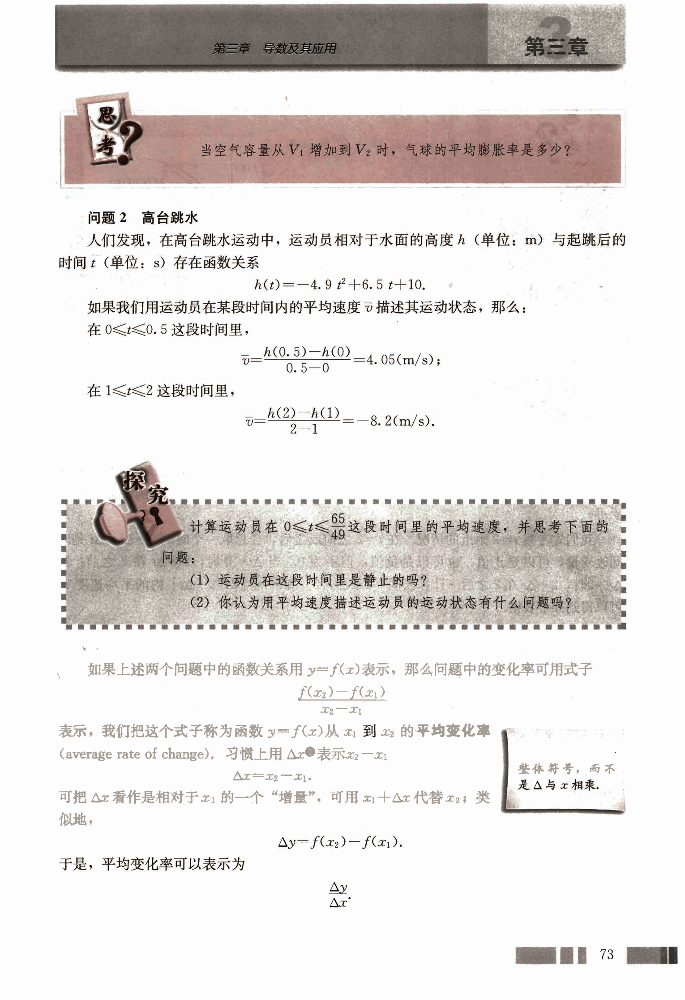
79

# CHAPTER 3

普通高中课程标准实验教科书 数学 选修 1-1

## 思考

观察函数 $y = f(x)$ 的图象 (图 3.1-1), 平均变化率

$\frac{\Delta y}{\Delta x} = \frac{f(x_2) - f(x_1)}{x_2 - x_1}$

表示什么？

图 3.1-1

## 3.1.2 导数的概念

在高台跳水运动中，运动员在不同时刻的速度是不同的。我们把物体在某一时刻的速度称为瞬时速度 (instantaneous velocity)。运动员的平均速度不一定能反映他(她)在某一时刻的瞬时速度，那么，如何求运动员的瞬时速度呢？比如，$t = 2$ 时的瞬时速度是多少？

我们先考察 $t = 2$ 附近的情况。在 $t = 2$ 之前或之后，任意取一个时刻 $2 + \Delta t$，$\Delta t$ 是时间改变量，可以是正值，也可以是负值，但不为 0。当 $\Delta t < 0$ 时，$2 + \Delta t$ 在 2 之前；当 $\Delta t > 0$ 时，$2 + \Delta t$ 在 2 之后。计算区间 $[2 + \Delta t, 2]$ 和区间 $[2, 2 + \Delta t]$ 内的平均速度，可以得到如下表格。

$\Delta t < 0$ 时，在 $[2 + \Delta t, 2]$ 这段时间内

$v = \frac{h(2) - h(2 + \Delta t)}{2 - (2 + \Delta t)} = \frac{4.9\Delta t^2 + 13.1\Delta t}{-\Delta t} = -4.9\Delta t - 13.1$

当 $\Delta t = -0.01$ 时，$v = -13.051$；

当 $\Delta t = -0.001$ 时，$v = -13.0951$；

当 $\Delta t = -0.0001$ 时，$v = -13.09951$；

当 $\Delta t = -0.00001$ 时，$v = -13.099951$；

当 $\Delta t = -0.000001$ 时，$v = -13.0999951$；

……

$\Delta t > 0$ 时，在 $[2, 2 + \Delta t]$ 这段时间内

$v = \frac{h(2 + \Delta t) - h(2)}{(2 + \Delta t) - 2} = \frac{-4.9\Delta t^2 - 13.1\Delta t}{\Delta t} = -4.9\Delta t - 13.1$

当 $\Delta t = 0.01$ 时，$v = -13.149$；

当 $\Delta t = 0.001$ 时，$v = -13.1049$；

当 $\Delta t = 0.0001$ 时，$v = -13.10049$；

当 $\Delta t = 0.00001$ 时，$v = -13.100049$；

当 $\Delta t = 0.000001$ 时，$v = -13.1000049$；

……

74

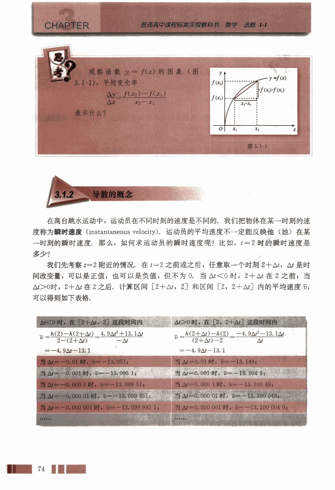
80

# 第三章 导数及其应用

## 观察

当△t趋近于0时，平均速度有什么样的变化趋势？

我们发现，当△t趋近于0时，即无论从小于2的一边，还是从大于2的一边趋近于2时，平均速度都趋近于一个确定的值—13.1.

从物理的角度看，时间间隔|△t|无限变小时，平均速度就无限趋近于t=2时的瞬时速度，因此，运动员在t=2时的瞬时速度是-13.1 m/s.

为了表述方便，我们用

$\lim_{\Delta t \to 0} \frac{h(2+\Delta t)-h(2)}{\Delta t} = -13.1$

表示“当t=2, △t趋近于0时，平均速度趋近于确定值-13.1”.

## 探究

1. 运动员在某一时刻t0的瞬时速度怎样表示？
2. 函数f(x)在x=x0处的瞬时变化率怎样表示？

一般地，函数y=f(x)在x=x0处的瞬时变化率是

$\lim_{\Delta x \to 0} \frac{\Delta y}{\Delta x} = \lim_{\Delta x \to 0} \frac{f(x_0 + \Delta x) - f(x_0)}{\Delta x}$

我们称它为函数y=f(x)在x=x0处的导数(derivative)，记作f'(x0)或y'|x=x0，即

$f'(x_0) = \lim_{\Delta x \to 0} \frac{\Delta y}{\Delta x} = \lim_{\Delta x \to 0} \frac{f(x_0 + \Delta x) - f(x_0)}{\Delta x}$

17世纪，力学、航海、天文等方面取得了突飞猛进的发展，这些发展对数学提出了新的要求，它们突出地表现为本章引言中提到的四类问题，其中的两类问题直接导致了导数的产生：一是根据物体的路程关于时间的函数求速度和加速度；二是求已知曲线的切线.

由导数的定义，我们知道，高度h关于时间t的导数就是运动员的瞬时速度；气球半径r关于体积V的导数就是气球的瞬时膨胀率.

实际上，导数可以描述任何事物的瞬时变化率，如效率、国内生产总值(GDP, Gross Domestic Product的缩写)的增长率等等.

## 例1

将原油精炼为汽油、柴油、塑胶等各种不同产品，需要对原油进行冷却和加

75

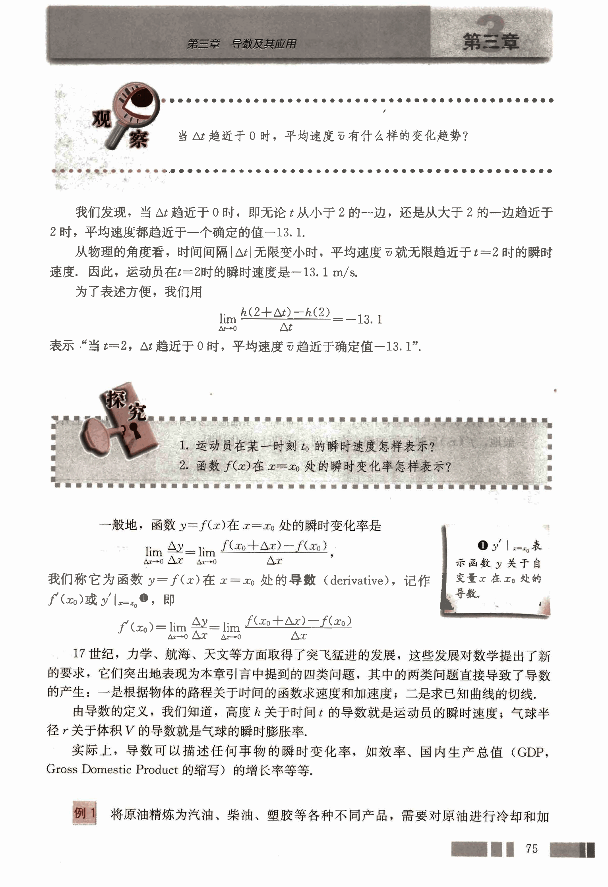
81

# CHAPTER

普通高中课程标准实验教科书 数学 选修 1-1

热. 如果第 $x$ h 时，原油的温度（单位：℃）为 $y = f(x) = x^2 - 7x + 15 (0 ≤ x ≤ 8)$。计算第 2 h 和第 6 h 时，原油温度的瞬时变化率，并说明它们的意义。

解：在第 2 h 和第 6 h 时，原油温度的瞬时变化率就是 $f'(2)$ 和 $f'(6)$。

根据导数的定义，

$\frac{\Delta y}{\Delta x} = \frac{f(2 + \Delta x) - f(2)}{\Delta x} = \frac{(2 + \Delta x)^2 - 7(2 + \Delta x) + 15 - (2^2 - 7 \times 2 + 15)}{\Delta x} = \frac{4\Delta x + (\Delta x)^2 - 7\Delta x}{\Delta x} = \Delta x - 3,$

所以，

$f'(2) = \lim_{\Delta x \to 0} \frac{\Delta y}{\Delta x} = \lim_{\Delta x \to 0} (\Delta x - 3) = -3.$

同理可得

$f'(6) = 5.$

在第 2 h 与第 6 h 时，原油温度的瞬时变化率分别为 -3 与 5。它说明在第 2 h 附近，原油温度大约以 3 ℃/h 的速率下降；在第 6 h 附近，原油温度大约以 5 ℃/h 的速率上升。一般地，$f'(x_0)$ 反映了原油温度在时刻 $x_0$ 附近的变化情况。

## 练习

计算第 3 h 和第 5 h 时原油温度的瞬时变化率，并说明它们的意义。

### 3.1.3 导数的几何意义

我们知道，导数 $f'(x_0)$ 表示函数 $f(x)$ 在 $x = x_0$ 处的瞬时变化率，反映了函数 $f(x)$ 在 $x = x_0$ 附近的变化情况。那么，导数 $f'(x_0)$ 的几何意义是什么呢？

76

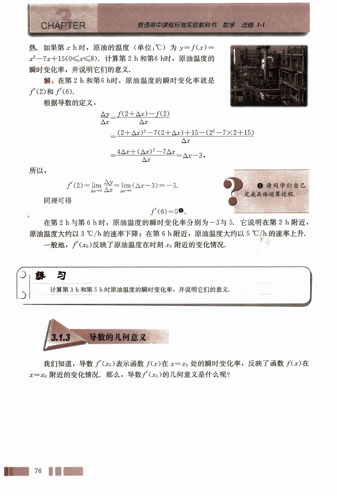
82

# 第三章 导数及其应用

## 观察

如图3.1-2，当点 $P_n(x_n, f(x_n))$ (n=1, 2, 3, 4) 沿着曲线 $f(x)$ 趋近于点 $P(x_0, f(x_0))$ 时，割线 $PP_n$ 的变化趋势是什么？

利用信息技术工具，演示图 3.1-2 中 $PP_n$ 的动态变化效果，做一做，看一看！

我们发现，当点 $P_n$ 趋近于点 $P$ 时，割线 $PP_n$ 趋近于确定的位置，这个确定位置的直线 PT 称为点 P 处的切线 (tangent line)。值得关注的问题是，割线 $PP_n$ 的斜率与切线 PT 的斜率有什么关系呢？

● 此处切线定义与以前学过的切线定义有什么不同？

容易知道，割线 $PP_n$ 的斜率是

$k_n = \frac{f(x_n) - f(x_0)}{x_n - x_0}$

当点 $P_n$ 无限趋近于点 $P$ 时，$k_n$ 无限趋近于切线 PT 的斜率，因此，函数 $f(x)$ 在 $x = x_0$ 处的导数就是切线 PT 的斜率，即

$k = \lim_{\Delta x \to 0} \frac{f(x_0 + \Delta x) - f(x_0)}{\Delta x} = f'(x_0)$

继续观察图 3.1-2，可以发现，在点 P 附近，$PP_2$ 比 $PP_1$ 更贴近曲线 $f(x)$，$PP_3$ 比 $PP_2$ 更贴近曲线 $f(x)$…………… 过点 P 的切线 PT 最贴近点 P 附近的曲线 $f(x)$。因此，在点 P 附近，曲线 $f(x)$ 就可以用过点 P 的切线 PT 近似代替。

## 例 2

如图 3.1-3，它表示跳水运动中高度随时间变化的函数 $h(t) = -4.9t^2 + 6.5t + 10$ 的图象，根据图象，请描述、比较曲线 $h(t)$ 在 $t_0, t_1, t_2$ 附近的变化情况。

数学上常用简单的对象刻画复杂的对象，例如，用有理数 3.1416 近似代替无理数 π，这里，我们用曲线上某点处的切线近似代替这一点附近的曲线，这是微积分中重要的思想方法——以直代曲。

77

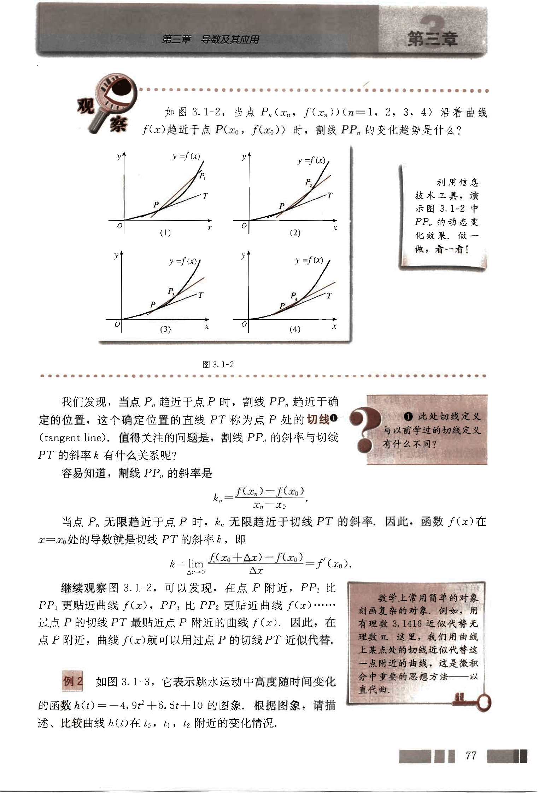
83

# CHAPTER 2

##  普通高中课程标准实验教科书 数学 选修 1-1

**解:** 我们用曲线 $h(t)$ 在 $t_0, t_1, t_2$ 处的切线，刻画曲线 $h(t)$ 在上述三个时刻附近的变化情况.

(1) 当 $t = t_0$ 时，曲线 $h(t)$ 在 $t_0$ 处的切线 $l_0$ 平行于 x 轴. 所以，在 $t = t_0$ 附近曲线比较平坦，几乎没有升降.

(2) 当 $t = t_1$ 时，曲线 $h(t)$ 在 $t_1$ 处的切线 $l_1$ 的斜率 $h'(t_1) < 0$. 所以，在 $t = t_1$ 附近曲线下降，即函数 $h(t)$ 在 $t = t_1$ 附近单调递减.

(3) 当 $t = t_2$ 时，曲线 $h(t)$ 在 $t_2$ 处的切线 $l_2$ 的斜率 $h'(t_2) < 0$. 所以，在 $t = t_2$ 附近曲线下降，即函数 $h(t)$ 在 $t = t_2$ 附近也单调递减.

从图 3.1-3 可以看出，直线 $l_0$ 的倾斜程度小于直线 $l_2$ 的倾斜程度，这说明曲线 $h(t)$ 在 $t_0$ 附近比在 $t_2$ 附近下降得缓慢.

## 练习

根据图 3.1-3，描述函数 $h(t)$ 在 $t_3$ 和 $t_4$ 附近增(减)以及增(减)快慢的情况.

## 例 3

如图 3.1-4，它表示人体血管中药物浓度 $c = f(t)$ (单位: mg/mL) 随时间 $t$ (单位: min) 变化的函数图象，根据图象，估计 $t = 0.2, 0.4, 0.6, 0.8$ 时，血管中药物浓度的瞬时变化率（精确到 0.1）.

78

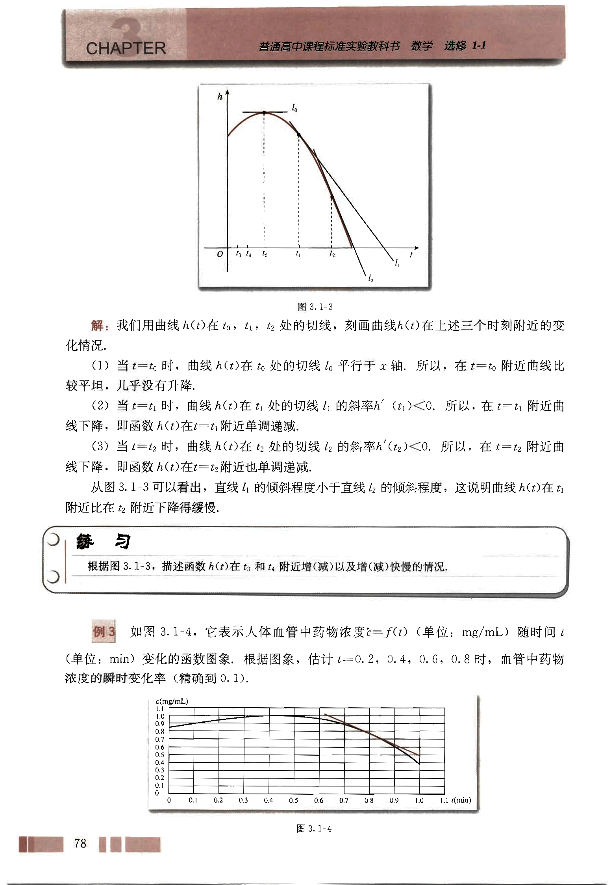
84

# 第三章 导数及其应用

## 解：

血管中某一时刻药物浓度的瞬时变化率，就是药物浓度 *f(t)* 在此时刻的导数，从图象上看，它表示曲线 *f(t)* 在此点处的切线的斜率。

如图 3.1-4，画出曲线上某点处的切线，利用网格估计这条切线的斜率，可以得到此时刻药物浓度瞬时变化率的近似值。

作 *t* = 0.8 处的切线，并在切线上取两个点，如 (0.7, 0.91), (1.0, 0.48)，则它的斜率约为

$k = \frac{0.48 - 0.91}{1.0 - 0.7} \approx -1.4$

*f'(0.8)* ≈ -1.4

下表给出了药物浓度瞬时变化率的估计值，验证一下，这些值是否正确。

| *t*   | 0.2 | 0.4 | 0.6 | 0.8 |
| :---- | :-: | :-: | :-: | :-: |
| *f(t)* | 0.4 | 0   | -0.7 | -1.4 |

从求函数 *f(x)* 在 *x* = *x0* 处导数的过程可以看到，当 *x* = *x0* 时，*f'(x0)* 是一个确定的数。这样，当 *x* 变化时，*f'(x)* 便是 *x* 的一个函数，我们称它为 *f(x)* 的导函数 (*derivative function*) (简称导数)。*y* = *f(x)* 的导函数有时也记作 *y'*, 即

$f'(x) = y' = \lim_{\Delta x \to 0} \frac{f(x + \Delta x) - f(x)}{\Delta x}$

## 练习

利用信息技术工具，画出函数 $r(V) = \sqrt[3]{\frac{3V}{4\pi}}$ (0 ≤ *V* ≤ 5) 的图象，并根据图象，估计 *V* = 0.6，1.2 时，气球的瞬时膨胀率。

## 习题 3.1

**A 组**

1. 国家环保总局对长期超标准排放污物，污染严重而又未进行治理的单位，规定出一定期限，强令在此期限内完成排污治理。右图是国家环保总局在规定的排污达标日期前，对甲、乙两家企业连续检测的结果 (*W* 表示排污量)，哪个企业治理的效率比较高？为什么？

[image1](images/image1.png)

2. 在高台跳水运动中，*t* s 时运动员相对于水面的高度（单位：m）是 *h(t)* = -4.9*t*² + 6.5*t* + 10，求运动员在 *t* = 1 s 时的瞬时速度，并解释此时的运动状况。

79

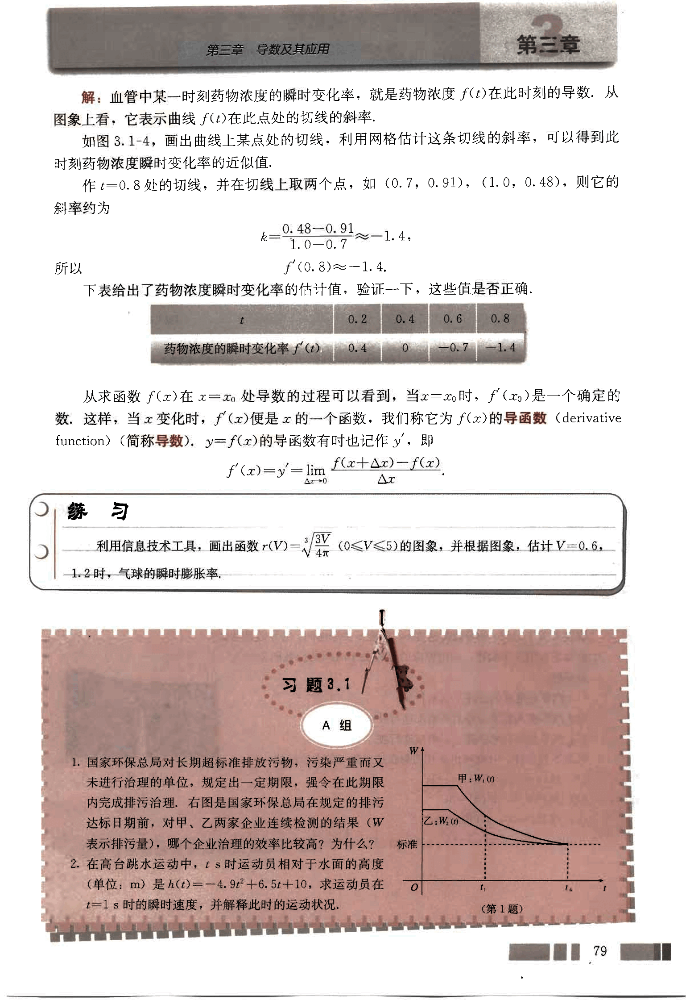
85

# CHAPTER

普通高中课程标准实验教科书 数学选修 1-1

3. 一个质量为 3 kg 的物体作直线运动，设运动距离 s (单位：m) 与时间 t (单位：s) 的关系可用函数 $s(t) = 1 + t^2$ 表示，并且物体的动能 $U = \frac{1}{2}mv^2$。求物体开始运动后第 5 s 时的动能。

4. 已知车轮旋转的角度与时间的平方成正比，如果车轮启动后转动第一圈需要 0.8 s，求转动开始后第 3.2 s 时的瞬时角速度。

5. 如图，试描述函数 $f(x)$ 在 $x = -5, -4, -2, 0, 1$ 附近的变化情况。

6. 已知函数 $f(x)$ 的图象，试画出其导函数 $f'(x)$ 图象的大致形状。

B 组

1. 在高台跳水运动中，t s 时运动员相对于水面的高度 (单位：m) 是 $h(t) = -4.9t^2 + 6.5t + 10$。高度关于时间 t 的导数是速度，速度关于时间 t 的导数是什么？

2. 根据下面的文字叙述，画出相应的路程关于时间的函数图象的大致形状。
(1) 汽车在笔直的公路上匀速行驶；
(2) 汽车在笔直的公路上不断加速行驶；
(3) 汽车在笔直的公路上不断减速行驶。

3. 根据下列条件，分别画出函数图象在这点附近的大致形状：
(1) $f(1) = -5$，$f'(1) = -1$；
(2) $f(5) = 10$，$f'(5) = 3$；
(3) $f(10) = 20$，$f'(10) = 0$。

80

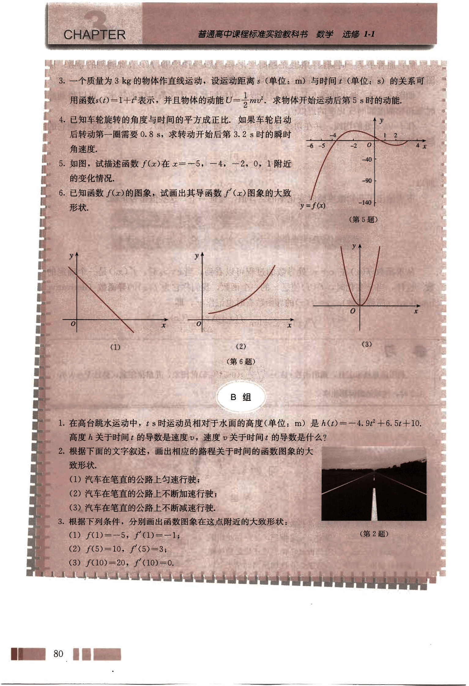
86

# 3.2 导数的计算

## 3.2.1 几个常用函数的导数

我们知道，导数的几何意义是曲线在某一点处的切线的斜率，物理意义是运动物体在某一时刻的瞬时速度，那么，对于函数 $y = f(x)$，如何求它的导数呢？

根据导数的定义，求函数 $y = f(x)$ 的导数，就是求出当 $\Delta x$ 趋近于 0 时，$\frac{\Delta y}{\Delta x}$ 所趋于的那个定值。

下面我们求几个常用函数的导数。

1. **函数 $y = f(x) = c$ 的导数**

因为 $\frac{\Delta y}{\Delta x} = \frac{f(x + \Delta x) - f(x)}{\Delta x} = \frac{c - c}{\Delta x} = 0$，

所以

$y' = \lim_{\Delta x \to 0} \frac{\Delta y}{\Delta x} = \lim_{\Delta x \to 0} 0 = 0$。

若 $y = c$ 表示路程关于时间的函数，则 $y' = 0$ 可以解释为某物体的瞬时速度始终为 0，即一直处于静止状态。[图3.2-1](images/3.2-1.png)

2. **函数 $y = f(x) = x$ 的导数**

因为 $\frac{\Delta y}{\Delta x} = \frac{f(x + \Delta x) - f(x)}{\Delta x} = \frac{x + \Delta x - x}{\Delta x} = 1$，

所以

$y' = \lim_{\Delta x \to 0} \frac{\Delta y}{\Delta x} = \lim_{\Delta x \to 0} 1 = 1$。

若 $y = x$ 表示路程关于时间的函数，则 $y' = 1$ 可以解释为某物体做瞬时速度为 1 的匀速运动。[图3.2-2](images/3.2-2.png)

81

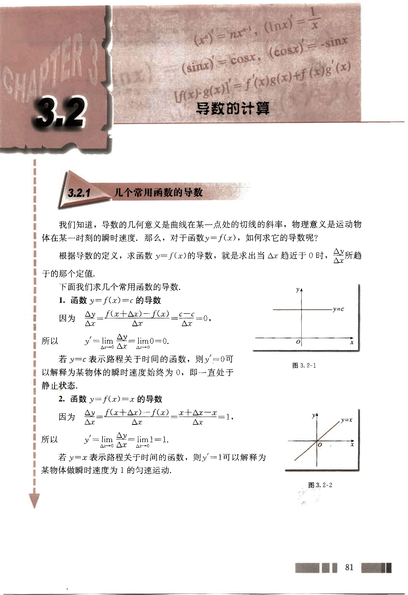
87

# CHAPTER

探究

## 在同一平面直角坐标系中，画出函数y=2x, y=3x, y=4x的图象，并根据导数定义，求它们的导数。

(1) 从图象上看，它们的导数分别表示什么？
(2) 这三个函数中，哪一个增加得最快？哪一个增加得最慢？
(3) 函数y=kx(k≠0)增(减)的快慢与什么有关？

## 3. 函数y=f(x)=x²的导数

因为 $\frac{\Delta y}{\Delta x} = \frac{f(x+\Delta x) - f(x)}{\Delta x} = \frac{(x+\Delta x)^2 - x^2}{\Delta x} = \frac{x^2 + 2x \cdot \Delta x + (\Delta x)^2 - x^2}{\Delta x} = 2x + \Delta x$，

所以 $y' = \lim_{\Delta x \to 0} \frac{\Delta y}{\Delta x} = \lim_{\Delta x \to 0} (2x + \Delta x) = 2x$.

y'=2x表示函数y=x²图象([图](images/3.2-3.png))上点(x,y)处切线的斜率为2x，说明随着x的变化，切线的斜率也在变化。另一方面，从导数作为函数在一点的瞬时变化率来看，y'=2x表明：当x<0时，随着x的增加，函数y=x²减少得越来越慢；当x>0时，随着x的增加，函数y=x²增加得越来越快。若y=x²表示路程关于时间的函数，则y'=2x可以解释为某物体做变速运动，它在时刻x的瞬时速度为2x。

## 4. 函数y=f(x)=$\frac{1}{x}$的导数

因为 $\frac{\Delta y}{\Delta x} = \frac{f(x+\Delta x) - f(x)}{\Delta x} = \frac{\frac{1}{x+\Delta x} - \frac{1}{x}}{\Delta x} = \frac{x - (x+\Delta x)}{x(x+\Delta x)\Delta x} = \frac{-1}{x(x+\Delta x)}$，

所以 $y' = \lim_{\Delta x \to 0} \frac{\Delta y}{\Delta x} = \lim_{\Delta x \to 0} (\frac{-1}{x(x+\Delta x)}) = \frac{-1}{x^2}$.

画出函数y=$\frac{1}{x}$的图象，根据图象，描述它的变化情况，并求出曲线在点(1,1)处的切线方程。

82

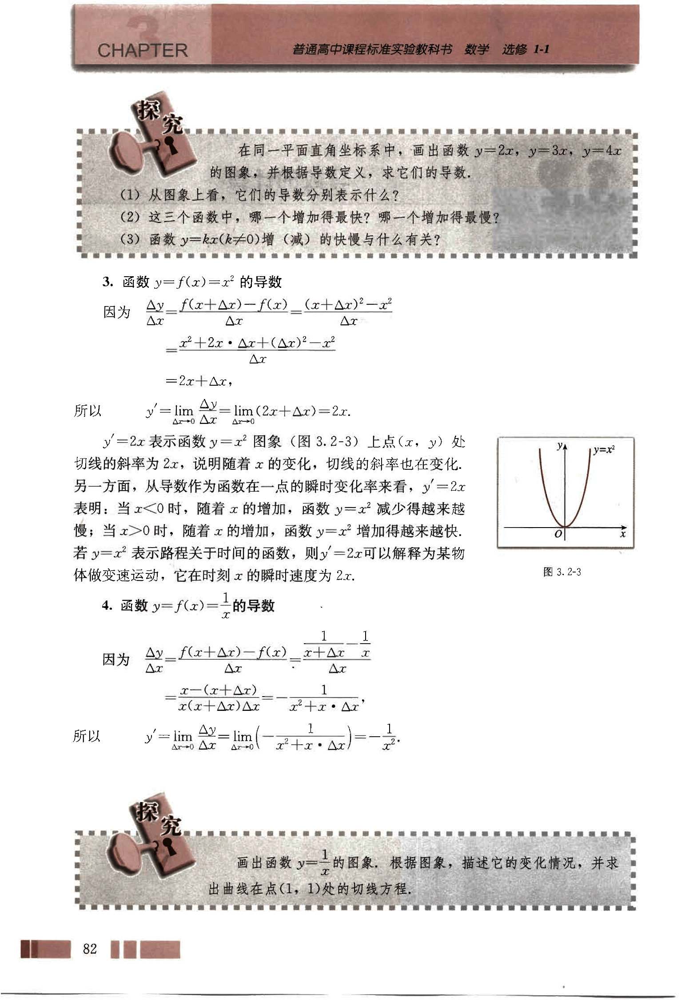
88

# 第三章 导数及其应用

## 3.2.2 基本初等函数的导数公式及导数的运算法则

为了方便，今后我们可以直接使用下面的基本初等函数的导数公式表。

### 基本初等函数的导数公式

1. 若 $f(x)=c$，则 $f'(x)=0$；
2. 若 $f(x)=x^n$ ($n∈Q^+$)，则 $f'(x)=nx^{n-1}$；
3. 若 $f(x)=\sin x$，则 $f'(x)=\cos x$；
4. 若 $f(x)=\cos x$，则 $f'(x)=-\sin x$；
5. 若 $f(x)=a^x$，则 $f'(x)=a^x \ln a$ ($a>0$)；
6. 若 $f(x)=e^x$，则 $f'(x)=e^x$；
7. 若 $f(x)=\log_a x$，则 $f'(x)=\frac{1}{x \ln a}$ ($a>0$, 且 $a≠1$)；
8. 若 $f(x)=\ln x$，则 $f'(x)=\frac{1}{x}$。

### 例1

假设某国家在20年期间的年均通货膨胀率为5%，物价 $p$ (单位：元)与时间 $t$ (单位：年)有如下函数关系

$p(t)=p_0(1+5\%)^t$，

其中 $p_0$ 为 $t=0$ 时的物价，假定某种商品的 $p_0=1$，那么在第10个年头，这种商品的价格上涨的速度大约是多少（精确到0.01）？

**解：**根据基本初等函数导数公式表，有

$p'(t)=1.05^t \ln 1.05$。

所以，

$p'(10)=1.05^{10} \ln 1.05 \approx 0.08$ (元/年)。

因此，在第10个年头，这种商品的价格约以0.08元/年的速度上涨。

### 思考

如果上式中某种商品的 $p_0=5$，那么在第10个年头，这种商品的价格上涨的速度大约是多少？

当 $p_0=5$ 时，$p(t)=5 \times 1.05^t$。这时，求 $p$ 关于 $t$ 的导数可以看成求函数 $f(t)=5$ 与 $g(t)=1.05^t$ 乘积的导数。下面的“导数运算法则”可以帮助我们解决两个函数加、减、乘、除的求导问题。

83

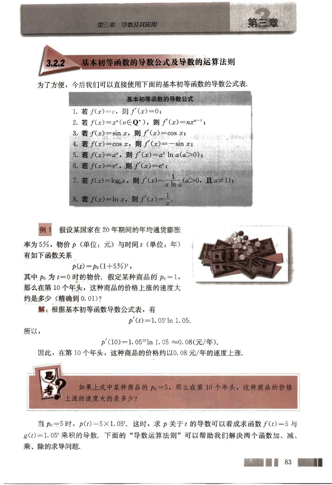
89

# CHAPTER

普通高中课程标准实验教科书 数学 选修 1-1

## 导数运算法则

1. $[f(x) \pm g(x)]' = f'(x) \pm g'(x);$
2. $[f(x) \cdot g(x)]' = f'(x)g(x) + f(x)g'(x);$
3. $[\frac{f(x)}{g(x)}]' = \frac{f'(x)g(x) - f(x)g'(x)}{[g(x)]^2} \quad (g(x) \ne 0).$

从法则2可以得出

$[cf(x)]' = c'f(x) + c[f(x)]' = cf'(x),$

也就是说，常数与函数的积的导数，等于常数乘函数的导数，即

$[cf(x)]' = cf'(x).$

## 例2

根据基本初等函数的导数公式和导数运算法则，求函数 $y = x^3 - 2x + 3$ 的导数.

解：因为 $y = (x^3 - 2x + 3)' = (x^3)' - (2x)' + (3)'$

$= 3x^2 - 2,$

所以，函数 $y = x^3 - 2x + 3$ 的导数是

$y' = 3x^2 - 2.$

## 例3

日常生活中饮用水通常是经过净化的。随着水纯净度的提高，所需净化费用不断增加。已知将1吨水净化到纯净度为 $x\%$ 时所需费用(单位：元)为

$c(x) = \frac{5 \ 284}{100 - x} \quad (80 < x < 100).$

求净化到下列纯净度时，所需净化费用的瞬时变化率：

(1) 90%;

(2) 98%.

解：净化费用的瞬时变化率就是净化费用函数的导数.

$c'(x) = (\frac{5 \ 284}{100 - x})'$

$= \frac{5 \ 284'(100 - x) - 5 \ 284(100 - x)'}{(100 - x)^2}$

$= \frac{0 \times (100 - x) - 5 \ 284 \times (-1)}{(100 - x)^2}$

$= \frac{5 \ 284}{(100 - x)^2}.$

(1) 因为 $c'(90) = \frac{5 \ 284}{(100 - 90)^2} = 52.84$，所以，纯净度为90%时，费用的瞬时变化率是52.84元/吨.

(2) 因为 $c'(98) = \frac{5 \ 284}{(100 - 98)^2} = 1321$，所以，纯净度为98%时，费用的瞬时变化率

84

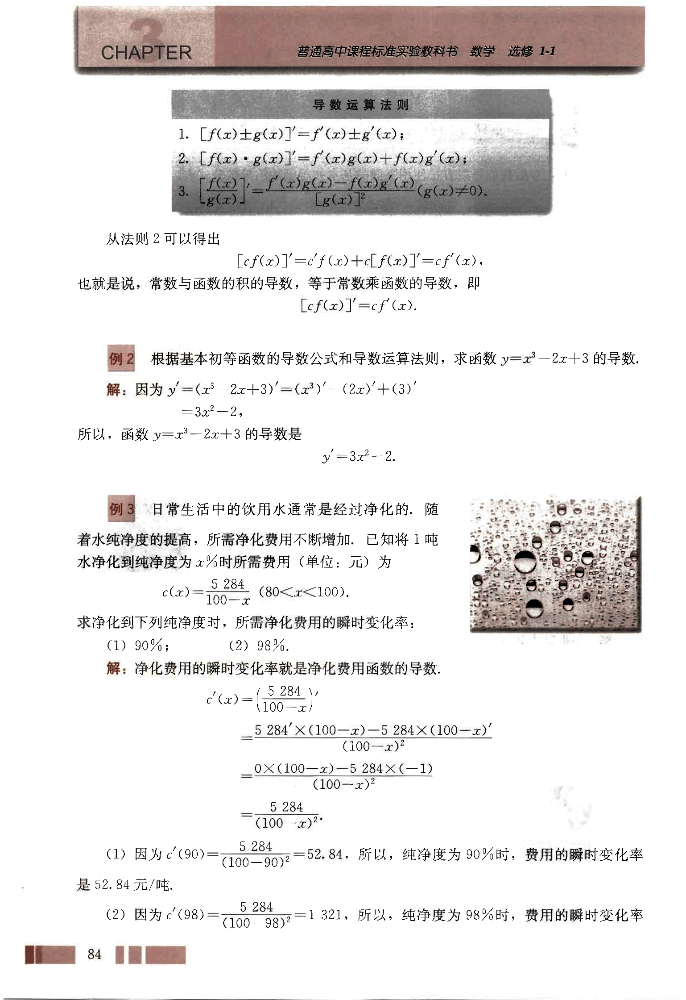
90

# 第三章 导数及其应用

## 练习

1. 运用基本初等函数的导数公式与导数运算法则，重新求解 3.1 节例 1. 你是否感觉到运算法则给解题带来的方便简捷？

2. 求下列函数的导数：
    (1)  y = log2x;
    (2)  y = 2ex;
    (3)  y = 2x5 - 3x2 + 5x - 4;
    (4)  y = 3cos x - 4sin x.

## 习题 3.2  A 组

1. 已知圆面积 S = πr2，根据导数定义求 S'(r)。

2. 利用基本初等函数导数公式与导数运算法则，求 3.1 节高台跳水运动中运动员的高度关于时间的函数的导数。

3. 求描述气球膨胀状态的函数 $V(r) = \frac{3V}{4\pi r}$ 的导数。

4. 求下列函数的导数：
    (1) y = x + log2x;
    (2) y = xex;
    (3) y = $\frac{cos x}{sin x}$

5. 已知函数 f(x) = 13 - 8x + √(2x2), 且 f'(x0) = 4, 求 x0。

6. 已知函数 y = xln x.
    (1) 求这个函数的导数；
    (2) 求这个函数在点 x = 1 处的切线方程。

7. 求曲线 y = sin x 在点 M($\frac{\pi}{2}$, 0) 处的切线的方程。

8. 氡气是一种由地表自然散发的无味的放射性气体，如果最初有 500 克氡气，那么 t 天后，氡气的剩余量为 A(t) = 500 × 0.834t.
    (1) 氡气的散发速度是多少？
    (2) A'(7) 的值是什么（精确到 0.1）？它表示什么意义？

85

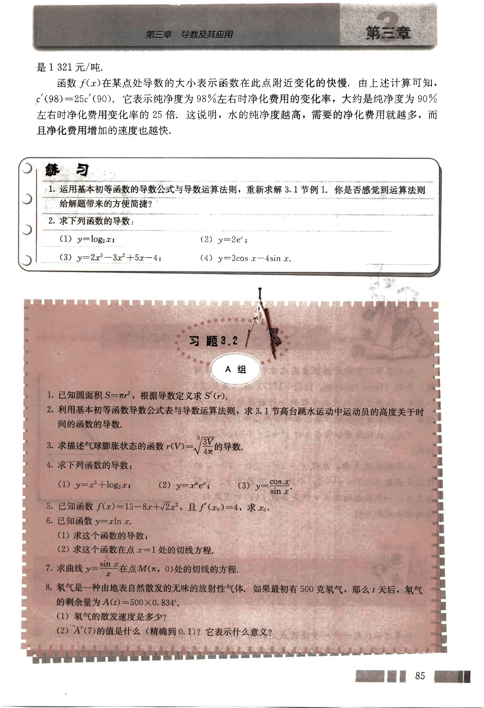
91

# CHAPTER 3 普通高中课程标准实验教科书 数学 选修 1-1

## B组

1. 设函数 $f(x) = 1 - e^x$ 的图象与x轴相交于点P，求曲线在点P处的切线的方程。

2. 某海湾拥有世界上最大的海潮，其高低水位之差可达到15 m。假设在该海湾某一固定点，大海水深d(单位：m)与午夜后的时间t(单位：h)的关系由函数 $d(t) = 10 + 4\cos t$ 表示，求下列时刻潮水的速度(精确到0.01)：
(1) 上午6:00;
(2) 上午9:00;
(3) 中午12:00;
(4) 下午6:00.

## 牛顿法——用导数方法求方程的近似解

人们很早以前就开始探索高次方程的数值求解问题。牛顿(Issac Newton, 1642—1727)在《流数法》一书中，给出了高次代数方程的一种数值解法——牛顿法，这种求方程根的方法，在科学界已被广泛采用。

下面，我们看看如何求方程 $x^3 + 2x^2 + 10x - 20 = 0$ 的根。

从函数的观点看，方程 $x^3 + 2x^2 + 10x - 20 = 0$ 的根就是函数 $f(x) = x^3 + 2x^2 + 10x - 20$ 的零点，从图形上看，一个函数的零点r就是函数$f(x)$的图象与x轴的交点的横坐标。

[image](images/graph.png)

如何求r的值呢？

如果可以找到一步一步逼近点r的点 $x_0, x_1, ..., x_n$，使得 $|x_n - r|$ 很小很小，那么，我们就可以把$x_n$的值作为r的近似值，即把$x_n$作为方程 $f(x) = 0$ 的近似解。

86

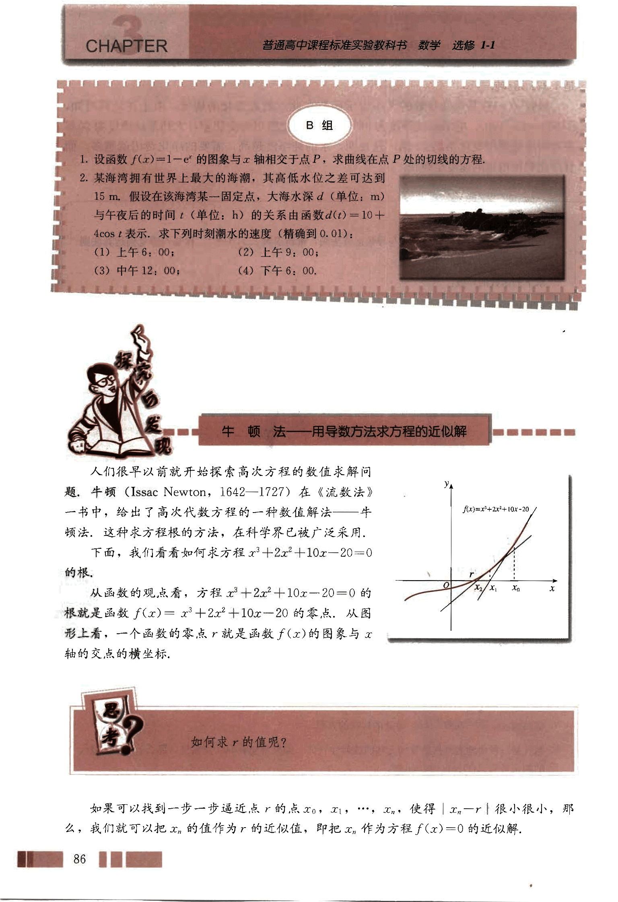
92

# 第三章 导数及其应用

牛顿用“作切线”的方法找到了这一串 $x_0, x_1,…,x_n$。当然，要有一个起始点。比如，我们从 $x_0=4$ 开始。

在点 $x_0=4$ 处作 $f(x)$ 的切线，切线与 $x$ 轴的交点就是 $x_1$；用 $x_1$ 代替 $x_0$ 重复上面的过程得到 $x_2$；一直继续下去，得到 $x_0, x_1,…,x_n$。从图形上我们可以看到，$x_1$ 较 $x_0$ 接近 $r$，$x_2$ 较 $x_1$ 接近 $r$，等等，它们越来越逼近 $r$。接下来的任务是计算…我们知道，$f(x)$ 在点 $x_0$ 处切线的斜率是 $f'(x_0)$，因此切线方程为：

$y - f(x_0) = f'(x_0)(x - x_0)$。

如果 $f'(x_0) \ne 0$，那么，切线与 $x$ 轴的交点是

$x_1 = x_0 - \frac{f(x_0)}{f'(x_0)}$。

继续这个过程，就可以推导出如下求方程根的牛顿法公式：

如果 $f'(x_{n-1}) \ne 0$，那么

$x_n = x_{n-1} - \frac{f(x_{n-1})}{f'(x_{n-1})}$。

请同学们自己推导。

对于一个给定的精确度，我们可以根据上述公式，求出方程 $x^3 + 2x^2 + 10x - 20 = 0$ 的近似解。

下面，我们给出牛顿法的算法框图，同学们可以根据它编一个程序，让计算机帮你完成计算任务。

**给定精度 $ε_0$ 和初始值 $x_0$**

$\downarrow$

**根据牛顿法公式计算当前值：**

$x_1 = x_0 - \frac{x_0^3 + 2x_0^2 + 10x_0 - 20}{3x_0^2 + 4x_0 + 10}$

$\downarrow$

**计算当前精度：$z = |\frac{x_1 - x_0}{x_0}|$**

$\downarrow$

**令 $x_0 = x_1$**

$\downarrow$

$z \le ε_0$

$\swarrow$  $\searrow$

No                 Yes

$\downarrow$                $\downarrow$

$x_1$ 为方程的近似解

$\downarrow$

**求解结束**

87

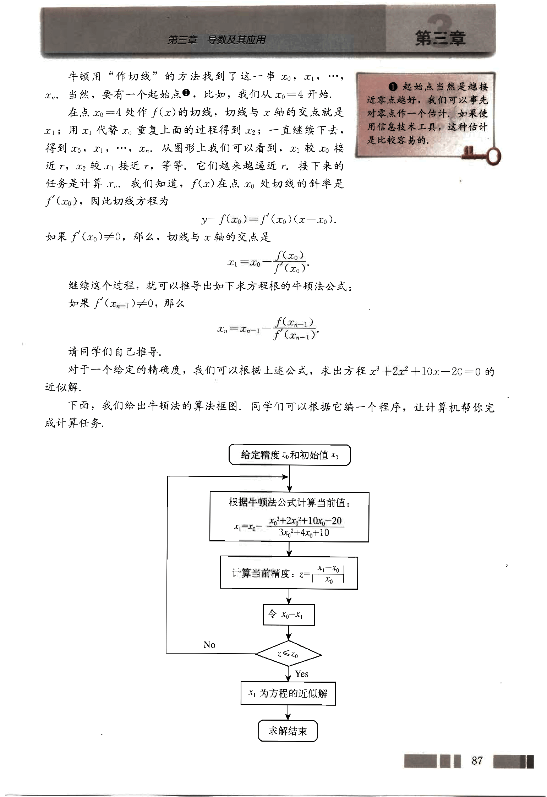
93

# CHAPTER 3

普通高中课程标准实验教科书 数学 选修 1-1

## 思考

1. 不同的初始值对求方程的近似解有影响吗？如果有，影响在什么地方？

2. 你还知道其他求方程近似解的方法吗？你认为牛顿法的优点和缺点是什么？

88

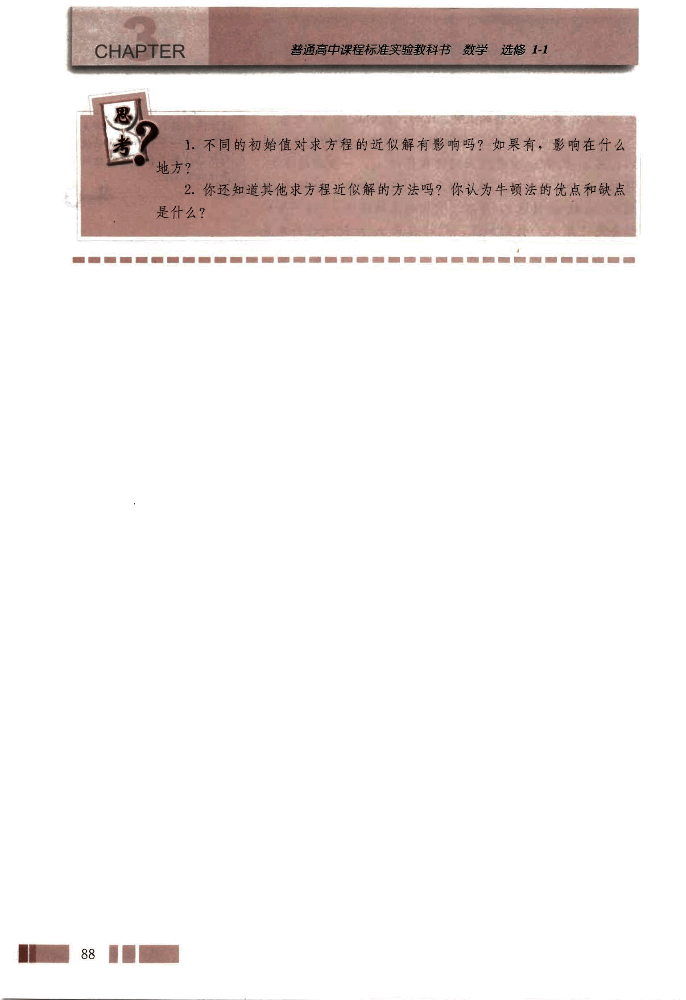
94

# CHAPTER 3

## 3.3 导数在研究函数中的应用

函数是描述客观世界变化规律的重要数学模型，研究函数时，了解函数的增与减、增减的快与慢以及函数的最大值或最小值等性质是非常重要的，通过研究函数的这些性质，我们可以对数量的变化规律有一个基本的了解，正如本章引言所说，科学家们对数量的变化规律进行了长期的研究，导致了微积分的创立。

下面，我们运用导数研究函数的性质，从中你可以体会导数在研究函数中的作用。

### 3.3.1 函数的单调性与导数

图3.3-1(1)表示高台跳水运动员的高度 *h* 随时间 *t* 变化的函数 $h(t)=-4.9t^2+6.5t+10$ 的图象，图3.3-1(2)表示高台跳水运动员的速度 *v* 随时间 *t* 变化的函数 $v(t)=h'(t)=-9.8t+6.5$ 的图象。

运动员从起跳到最高点，以及从最高点到入水这两段时间的运动状态有什么区别？

通过观察图象，我们可以发现：

(1) 运动员从起跳到最高点，离水面的高度 *h* 随时间 *t* 的增加而增加，即 *h(t)* 是增函数，相应地，$v(t)=h'(t)>0$。

(2) 从最高点到入水，运动员离水面的高度 *h* 随时间 *t* 的增加而减小，即 *h(t)* 是减函数，相应地，$v(t)=h'(t)<0$。

89

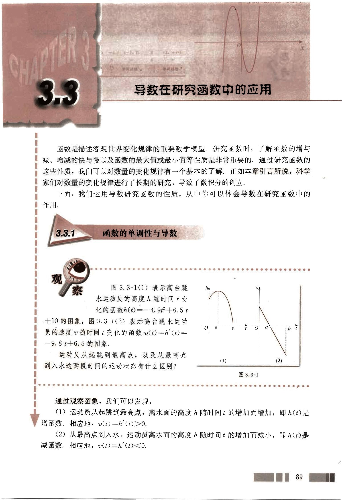
95

# CHAPTER 3

## 思考

这种情况是否具有一般性呢？

观察下面一些函数的图象，探讨函数的单调性与其导函数正负的关系。

图 3.3-2

如图 3.3-3，导数 $f'(x)$ 表示函数 $f(x)$ 在点 $(x_0, f(x_0))$ 处的切线的斜率。在 $x = x_0$ 处，$f'(x_0) > 0$，切线是“左下右上”式的，这时，函数 $f(x)$ 在 $x_0$ 附近单调递增；在 $x = x_1$ 处，$f'(x_1) < 0$，切线是“左上右下”式的，这时，函数 $f(x)$ 在 $x_1$ 附近单调递减。

一般地，函数的单调性与其导函数的正负有如下关系：

在某个区间 $(a, b)$ 内，如果 $f'(x) > 0$，那么函数 $y = f(x)$ 在这个区间内单调递增；如果 $f'(x) < 0$，那么函数 $y = f(x)$ 在这个区间内单调递减。

图 3.3-3

如果在某个区间内恒有 $f'(x) = 0$，那么函数 $f(x)$ 有什么特性？

请同学们回顾一下函数单调性的定义，并思考某个区间内函数 $y = f(x)$ 的平均变化率的几何意义与其导数正负的关系。

90

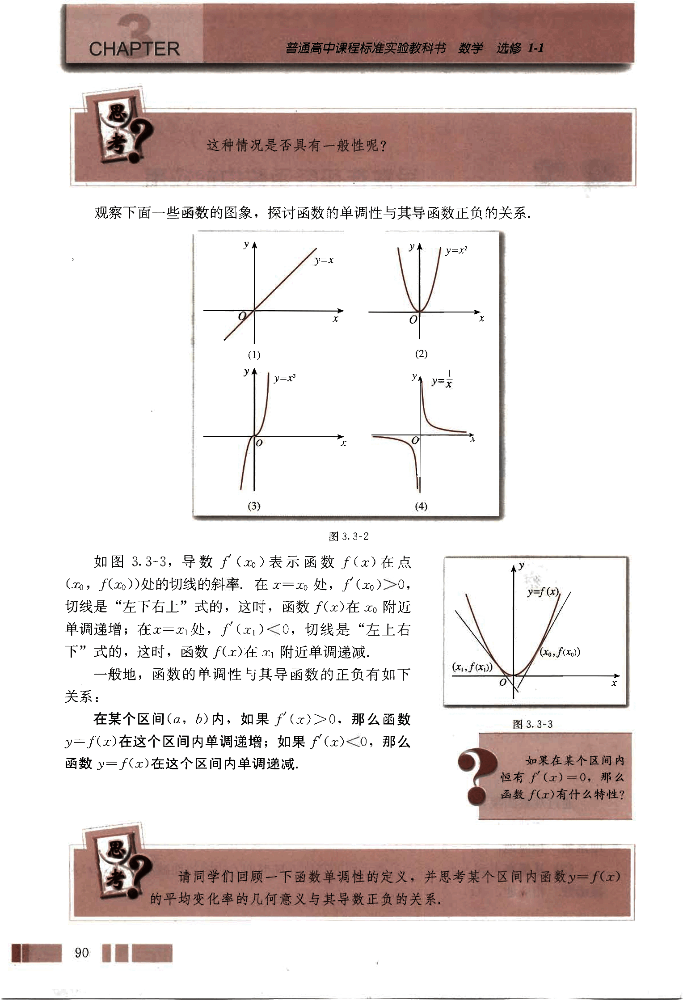
96

# 第三章 导数及其应用

## 例1

已知导函数 $f'(x)$ 的下列信息：

当 $1 < x < 4$ 时，$f'(x) > 0$；

当 $x > 4$，或 $x < 1$ 时，$f'(x) < 0$；

当 $x = 4$，或 $x = 1$ 时，$f'(x) = 0$。

试画出函数 $f(x)$ 图象的大致形状：

解：当 $1 < x < 4$ 时，$f'(x) > 0$，可知 $f(x)$ 在此区间内单调递增；

当 $x > 4$，或 $x < 1$ 时，$f'(x) < 0$，可知 $f(x)$ 在此区间内单调递减；

当 $x = 4$，或 $x = 1$ 时，$f'(x) = 0$，这两点比较特殊，我们称它们为“临界点”。

综上，函数 $f(x)$ 图象的大致形状如图 3.3-4 所示。

[图3.3-4](images/3.3-4.png)

## 例2

判断下列函数的单调性，并求出单调区间：

(1) $f(x) = x^2 + 3x$；

(2) $f(x) = x^2 - 2x - 3$；

(3) $f(x) = \sin x - x$，$x \in (0, \pi)$；

(4) $f(x) = 2x^3 + 3x^2 - 24x + 1$。

解：(1) 因为 $f(x) = x^2 + 3x$，所以

$f'(x) = 3x^2 + 3 = 3(x^2 + 1) > 0$。

因此，函数 $f(x) = x^2 + 3x$ 在 $\mathbb{R}$ 上单调递增，如图 3.3-5(1) 所示。

[图3.3-5(1)](images/3.3-5(1).png)

(2) 因为 $f(x) = x^2 - 2x - 3$，所以

$f'(x) = 2x - 2 = 2(x - 1)$。

当 $f'(x) > 0$，即 $x > 1$ 时，函数 $f(x) = x^2 - 2x - 3$ 单调递增；

当 $f'(x) < 0$，即 $x < 1$ 时，函数 $f(x) = x^2 - 2x - 3$ 单调递减。

函数 $f(x) = x^2 - 2x - 3$ 的单调递增区间为 $(1, +\infty)$，单调递减区间为 $(-\infty, 1)$。

函数 $f(x) = x^2 - 2x - 3$ 的图象如图 3.3-5(2) 所示。

[图3.3-5(2)](images/3.3-5(2).png)

(3) 因为 $f(x) = \sin x - x$，$x \in (0, \pi)$，所以

91

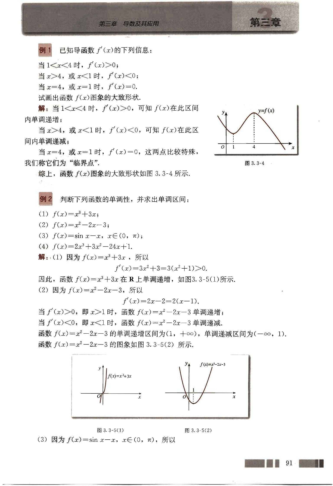
97

# CHAPTER 普通高中课程标准实验教科书 数学 选修 1-1

函数$f(x) = \sin x - x$在$(0, \pi)$内，如图3.3-5(3)所示.

(4) 因为$f(x) = 2x^3 + 3x^2 - 24x + 1$，所以

$f'(x) =$

当$f'(x) > 0$，即________时，函数$f(x) = 2x^3 + 3x^2 - 24x + 1$________；

当$f'(x) < 0$，即________时，函数$f(x) = 2x^3 + 3x^2 - 24x + 1$________.

函数$f(x) = 2x^3 + 3x^2 - 24x + 1$的单调递增区间为________，单调递减区间为________.

函数$f(x) = 2x^3 + 3x^2 - 24x + 1$的图象如图3.3-5(4)所示.

[图3.3-5(3)](images/3.3-5(3).png) [图3.3-5(4)](images/3.3-5(4).png)

**例3** 如图3.3-6，水以常速（即单位时间内注入水的体积相同）注入下面四种底面积相同的容器中，请分别找出与各容器对应的水的高度$h$与时间$t$的函数关系图象.

[图3.3-6(1)](images/3.3-6(1).png) [图3.3-6(2)](images/3.3-6(2).png) [图3.3-6(3)](images/3.3-6(3).png) [图3.3-6(4)](images/3.3-6(4).png)

[图3.3-6(A)](images/3.3-6(A).png) [图3.3-6(B)](images/3.3-6(B).png) [图3.3-6(C)](images/3.3-6(C).png) [图3.3-6(D)](images/3.3-6(D).png)

**分析**: 以容器(2)为例，由于容器上细下粗，所以水以常速注入时，开始阶段高度增加得慢，以后高度增加得越来越快，反映在图象上，(A)符合上述变化情况，同理可知

92

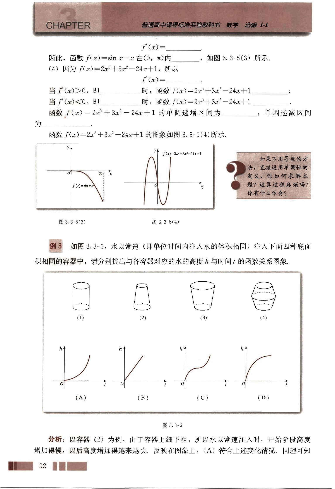
98

# 第三章 导数及其应用

## 其他三种容器的情况

解：(1)→(B)，(2)→(A)，(3)→(D)，(4)→(C)。

## 思考

例3表明，通过函数图象，不仅可以看出函数的增或减，还可以看出其变化的快慢。结合图象，你能从导数的角度解释变化快慢的情况吗？

一般地，如果一个函数在某一范围内导数的绝对值较大，那么函数在这个范围内变化得快，这时，函数的图象就比较“陡峭”（向上或向下）；反之，函数的图象就“平缓”一些。如图3.3-7所示，函数 y = f(x) 在 (0, b) 或 (a, 0) 内的图象“陡峭”，在 (b, +∞) 或 (-∞, a) 内的图象“平缓”。

[图3.3-7](images/3.3-7.png)

## 练习

1. 判断下列函数的单调性，并求出单调区间：
    (1) f(x) = x² - 2x + 4;
    (2) f(x) = e⁻ˣ;
    (3) f(x) = 3x - x³;
    (4) f(x) = x³ - x² - x.

2. 函数 y = f(x) 的图象如图所示，试画出导函数 f’(x) 图象的大致形状。

[第2题](images/2.png)

3. 讨论二次函数 f(x) = ax² + bx + c (a ≠ 0) 的单调区间。

4. 求证：函数 f(x) = 2x³ - 6x² + 7 在 (0, 2) 内是减函数。

## 3.3.2 函数的极值与导数

观察图 3.3-8，我们发现，t = a 时，高台跳水运动员距水面的高度最大，那么，函数 h(t) 在此点的导数是多少呢？此点附近的图象有什么特点？相应地，导数的符号有什么变化规律？

放大 t = a 附近函数 h(t) 的图象，如图 3.3-9。可以看出，h’(a) = 0；在 t = a 的附近，当 t < a 时，函数 h(t) 单调递增，h’(t) > 0；当 t > a 时，函数 h(t) 单调递减，h’(t) < 0。这就是说，在 t = a 附近，函数值先增 (t < a, h’(t) > 0) 后减 (t > a, h’(t) < 0)，这样，当 t 在 a 的附近从小到大经过 a 时，h’(t) 先正后负，且 h’(t) 连续变化，于是有 h’(a) = 0.

93

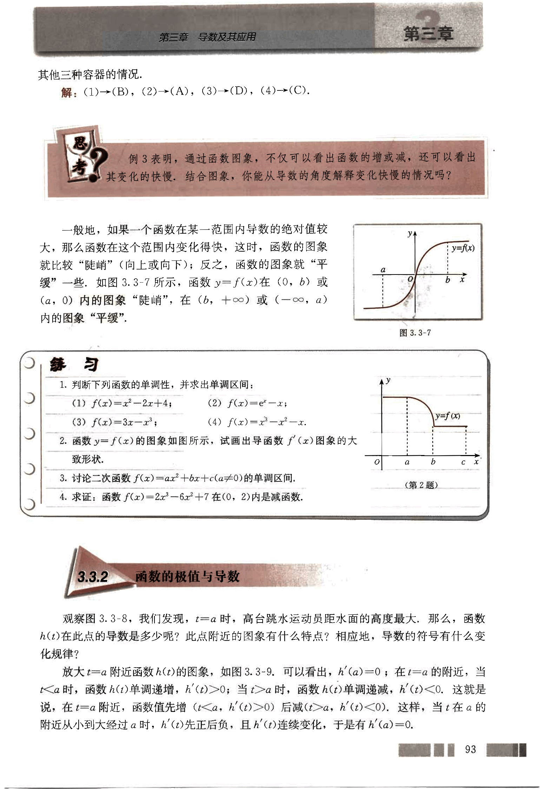
99

# CHAPTER 3

## 普通高中课程标准实验教科书 数学 选修 1-1

对于一般的函数 y = f(x), 是否也有同样的性质呢？

## 探究

如图 3.3-10 和图 3.3-11，函数 y = f(x) 在 a, b, c, d, e, f, g, h 等点的函数值与这些点附近的函数值有什么关系？y = f(x) 在这些点的导数值是多少？在这些点附近，y = f(x) 的导数的符号有什么规律？

以 a, b 两点为例，我们可以发现，函数 y = f(x) 在点 x = a 的函数值 f(a) 比它在点 x = a 附近其他点的函数值都小，f'(a) = 0；而且在点 x = a 附近的左侧 f'(x) < 0，右侧 f'(x) > 0。类似地，函数 y = f(x) 在点 x = b 的函数值 f(b) 比它在点 x = b 附近其他点的函数值都大，f'(b) = 0；而且在点 x = b 附近的左侧 f'(x) > 0，右侧 f'(x) < 0。

我们把点 a 叫做函数 y = f(x) 的极小值点，f(a) 叫做函数 y = f(x) 的极小值；点 b 叫做函数 y = f(x) 的极大值点，f(b) 叫做函数 y = f(x) 的极大值。极小值点、极大值点统称为极值点，极大值和极小值统称为极值 (extreme value)。极值反映了函数在某一点附近的大小情况，刻画的是函数的局部性质。

## 例 4

求函数 $f(x) = \frac{1}{3}x^3 - 4x + 4$ 的极值。

解：因为 $f(x) = \frac{1}{3}x^3 - 4x + 4$，所以

94

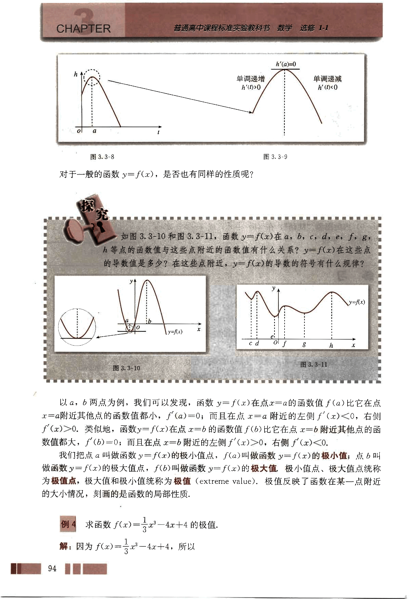
100

# 第三章 导数及其应用

##  

$f'(x) = x^2 - 4 = (x-2)(x+2)$

$f'(x) = 0,$

$x = 2,$ 或 $x = -2.$

下面分两种情况讨论：

(1) 当 $f'(x) > 0$，即 $x > 2$，或 $x < -2$ 时；

(2) 当 $f'(x) < 0$，即 $-2 < x < 2$ 时。

当 $x$ 变化时，$f'(x)$，$f(x)$ 的变化情况如下表：

|          | $(-\infty, -2)$ | $-2$ | $(-2, 2)$ | $2$ | $(2, +\infty)$ |
|----------|-----------------|-----|-------------|-----|-----------------|
| $f'(x)$  |        $+$      |  0  |       $-$    |  0  |        $+$      |
| $f(x)$  | 单调递增       | $\frac{28}{3}$ | 单调递减     | $-\frac{4}{3}$ | 单调递增       |

因此，当 $x = -2$ 时，$f(x)$ 有极大值，并且极大值为

$f(-2) = \frac{28}{3};$

当 $x = 2$ 时，$f(x)$ 有极小值，并且极小值为

$f(2) = -\frac{4}{3}$

函数 $f(x) = \frac{1}{3}x^3 - 4x + 4$ 的图象如图 3.3-12 所示。

[image](images/3.3-12.png)

导数值为 0 的点一定是函数的极值点吗？

极大值一定大于极小值吗？

导数值为 0 的点不一定是函数的极值点。例如，对于函数 $f(x) = x^3$，我们有 $f'(x) = 3x^2$。虽然 $f(0) = 0$，但由于无论 $x > 0$，还是 $x < 0$，恒有 $f'(x) > 0$，即函数 $f(x) = x^3$ 是单调递增的，所以 $x = 0$ 不是函数 $f(x) = x^3$ 的极值点。也就是说，函数 $y = f(x)$ 在一点的导数值为 0 是函数 $y = f(x)$ 在这点取极值的必要条件，而非充分条件。

95

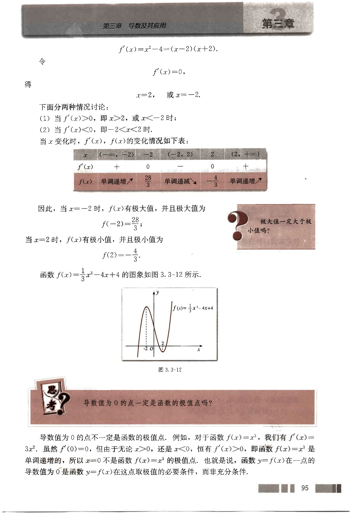
101

# CHAPTER 3

普通高中课程标准实验教科书 数学 选修 1-1

一般地，求函数 $y = f(x)$ 的极值的方法是：

解方程 $f'(x) = 0$。当 $f'(x_0) = 0$ 时：

(1) 如果在 $x_0$ 附近的左侧 $f'(x) > 0$，右侧 $f'(x) < 0$，那么 $f(x_0)$ 是极大值；

(2) 如果在 $x_0$ 附近的左侧 $f'(x) < 0$，右侧 $f'(x) > 0$，那么 $f(x_0)$ 是极小值。

## 练习

1. 求下列函数的极值：

(1) $f(x) = 6x^2 - x - 2$;

(2) $f(x) = x^3 - 27x$;

(3) $f(x) = 6 + 12x - x^3$;

(4) $f(x) = 3x - x^3$.

2. 右图是导函数 $y = f'(x)$ 的图像，试找出函数 $y = f(x)$ 的极值点，并指出哪些是极大值点，哪些是极小值点。

[image](images/image.png)

## 3.3.3 函数的最大(小)值与导数

我们知道，极值反映的是函数在某一点附近的局部性质，而不是函数在整个定义域内的性质，也就是说，如果 $x_0$ 是 $f(x)$ 的极大(小)值点，那么在点 $x_0$ 附近找不到比 $f(x_0)$ 更大(或更小)的值，但是，在解决实际问题或研究函数的性质时，我们往往更关心函数在某个区间上，哪个值最大，哪个值最小。如果 $x_0$ 是 $f(x)$ 的最大(小)值点，那么 $f(x_0)$ 不小于(大于) $f(x)$ 在相应区间上的所有函数值。

如图 3.3-13，观察区间 $[a, b]$ 上函数 $y = f(x)$ 的图像，你能找出它的极大值、极小值吗？

[image](images/image2.png)

观察图像，我们发现，$f(x_1)$，$f(x_3)$，$f(x_5)$ 是函数 $y = f(x)$ 的极小值，$f(x_2)$，$f(x_4)$，$f(x_6)$ 是函数 $y = f(x)$ 的极大值。

96

你能找出函数 $y = f(x)$ 在区间 $[a, b]$ 上的最大值、最小值吗？

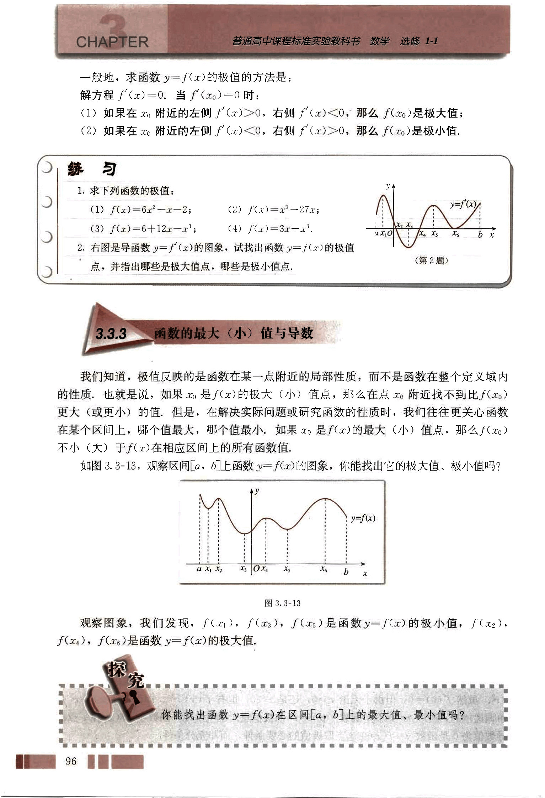
102

# 第三章 导数及其应用

从图 3.3-13 可以看出，函数 $y = f(x)$ 在区间 $[a, b]$ 上的最大值是 $f(a)$，最小值是 $f(x_3)$。

在图 3.3-14、图 3.3-15 中，观察 $[a, b]$ 上的函数 $y = f(x)$ 的图象，它们在 $[a, b]$ 上有最大值、最小值吗？如果有，最大值和最小值分别是什么？

一般地，如果在区间 $[a, b]$ 上函数 $y = f(x)$ 的图象是一条连续不断的曲线，那么它必有最大值和最小值。

结合图 3.3-14、图 3.3-15，以及函数极值中的例子，不难看出，只要把函数 $y = f(x)$ 的所有极值连同端点的函数值进行比较，就可以求出函数的最大值与最小值。

## 例 5

求函数 $f(x) = \frac{1}{3}x^3 - 4x + 4$ 在 $[0, 3]$ 上的最大值与最小值。

解：由例 4 可知，在 $[0, 3]$ 上，当 $x = 2$ 时，

有极小值，并且极小值为

$f(2) = -\frac{4}{3}$。

又由于

$f(0) = 4$，$f(3) = 1$，

因此，函数

$f(x) = \frac{1}{3}x^3 - 4x + 4$

在 $[0, 3]$ 上的最大值是 4，最小值是 $-\frac{4}{3}$。

上述结论可以从函数 $f(x) = \frac{1}{3}x^3 - 4x + 4$ 在 $[0, 3]$ 上的图象（图 3.3-16）得到直观验证。

一般地，求函数 $y = f(x)$ 在 $[a, b]$ 上的最大值与最小值的步骤如下：

(1) 求函数 $y = f(x)$ 在 $(a, b)$ 内的极值；

(2) 将函数 $y = f(x)$ 的各极值与端点处的函数值 $f(a)$，$f(b)$ 比较，其中最大的一个就是函数在 $[a, b]$ 上的最大值，最小的一个就是函数在 $[a, b]$ 上的最小值。

97

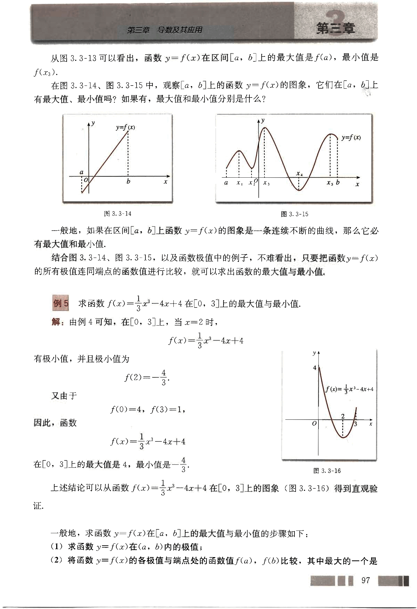
103

# CHAPTER 3

最大值,最小的一个是最小值.

## 练习

参照第3.3.2节的练习,求下列函数在给定区间上的最大值与最小值:

(1)  *f*(x) = 6*x*² - *x* - 2,  *x* ∈ [0, 2];

(2)  *f*(x) = *x*² - 27*x*,  *x* ∈ [-4, 4];

(3)  *f*(x) = 6 + 12*x* - *x*³,  *x* ∈ [-⅓, 3];

(4)  *f*(x) = 3*x* - *x*²,  *x* ∈ [2, 3].

## 习题 3.3

### A组

1. 判断下列函数的单调性,并求出单调区间:

(1)  *f*(x) = -2*x* + 1;

(2)  *f*(x) = *x* + cos *x*,  *x* ∈ (0, π/2);

(3)  *f*(x) = 2*x* - 4;

(4)  *f*(x) = 2*x*² + 4*x*.

2. 判断下列函数的单调性,并求出单调区间:

(1)  *f*(x) = *x*² + 2*x* - 4;

(2)  *f*(x) = 2*x*² - 3*x* + 3;

(3)  *f*(x) = 3*x* + *x*³;

(4)  *f*(x) = *x*⁴ + *x*² - *x*.

3. 已知汽车在笔直的公路上行驶:

(1) 如果函数 *y* = *f*(*t*) 表示时刻 *t* 时汽车与起点的距离,请标出汽车速度等于0的点.

(2) 如果函数 *y* = *f*(*t*) 表示时刻 *t* 时汽车的速度,那么(1)中标出点的意义是什么?

[图3](images/图3.png)

4. 如图是导函数 *y* = *f'*(*x*) 的图象,在标记的点中,在哪一点处

(1) 导函数 *y* = *f'*(*x*) 有极大值?

(2) 导函数 *y* = *f'*(*x*) 有极小值?

(3) 函数 *y* = *f*(x) 有极大值?

(4) 函数 *y* = *f*(x) 有极小值?

[图4](images/图4.png)

98

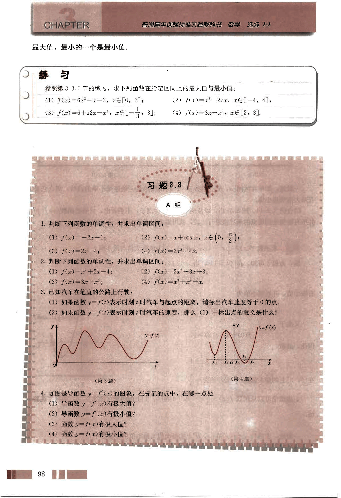
104

# 第三章 导数及其应用

## 5. 求下列函数的极值：

(1)  $f(x) = 6x^2 + x + 2$;

(2)  $f(x) = x^3 - 12x$;

(3)  $f(x) = 6 - 12x + x^3$;

(4)  $f(x) = 48x - x^3$.

## 6. 参照第 5 题，求下列函数在给定区间上的最大值与最小值：

(1)  $f(x) = 6x^2 + x + 2$,  $x ∈ [-1, 1]$;

(2)  $f(x) = x^3 - 12x$,  $x ∈ [-3, 3]$;

(3)  $f(x) = 6 - 12x + x^3$,  $x ∈ [-\frac{1}{3}, 1]$;

(4)  $f(x) = 48x - x^3$,  $x ∈ [-3, 5]$.

## B 组

利用函数的单调性，证明下列不等式，并通过函数图象直观验证：

(1) $\sin x < x$,  $x ∈ (0, π)$;

(2) $x - x^2 > 0$,  $x ∈ (0, 1)$;

(3) $e^x > 1 + x$,  $x ≠ 0$;

(4) $\ln x < x < e^x$,  $x > 0$.

## 图形技术与函数性质

当前，不少图形计算器、计算机软件的图形技术功能非常强大，函数作图和分析功能是图形技术的一个重要方面，它主要包括：

1. 由函数 $f(x)$ 的解析式直接画出其图象；

2. 移动光标，显示函数 $f(x)$ 图象上任一点的坐标；

3. 由函数 $f(x)$ 的解析式及其图象求出其导函数 $f'(x)$，并画出其图象；

4. 显示并求出经过函数 $f(x)$ 图象上某点切线的斜率和切线的方程；

5. 求出并显示函数 $f(x)$ 的零点；

6. 对函数 $f(x)$ 图象的局部进行放大和缩小；

7. 通过确定区间的两个端点，得出函数 $f(x)$ 在给定区间上的最大值与最小值等。

[图1](images/图1.png)

图形计算器和计算机软件提供的函数作图和分析功能，对我们把握函数的性质有重要

99

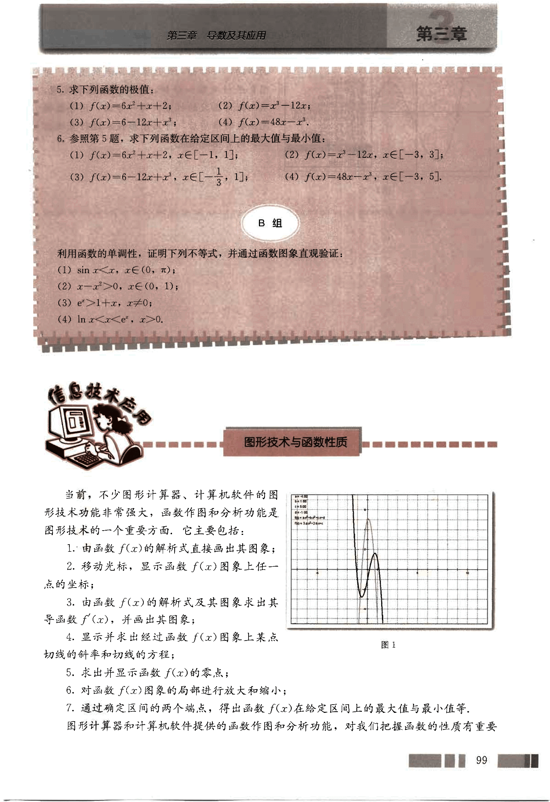
105

# CHAPTER

## 普通高中课程标准实验教科书 数学 选修 1-1

图2

| 1 | Value |
|---|---|
| 2 | Zero |
| 3 | Minimum |
| 4 | Maximum |
| 5 | Intersection |
| 6 | Derivatives▸ |
| 7 | ∫f(x)dx |
| 8 | Inflection |
| 9 | Distance |
| R | Tangent |
| B | Arc |
| C | Shade |

的帮助：一方面，通过画出函数的图象，对图象进行观察和分析，并作出猜想和发现，从而探讨函数的性质；另一方面，用导数研究函数的性质后，可用图形技术进行直观验证，两者相辅相成。

100

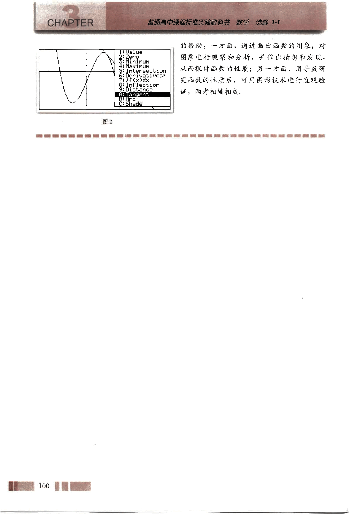
106

# CHAPTER 3

## 3.4 生活中的优化问题举例

生活中经常遇到求利润最大、用料最省、效率最高等问题，这些问题通常称为优化问题，通过前面的学习，我们知道，导数是求函数最大(小)值的有力工具。本节我们运用导数，解决一些生活中的优化问题。

### 例1 海报版面尺寸的设计

学校或班级举行活动，通常需要张贴海报进行宣传，现让 你设计一张如图 [3.4-1](images/3.4-1.png) 所示的竖向张贴的海报，要求版心面积 为128 dm²，上、下两边各空2 dm，左、右两边各空1 dm。如何 设计海报的尺寸，才能使四周空白面积最小？

解：设版心的高为 *x* dm，则版心的宽为 $\frac{128}{x}$ dm，此时四周 周空白面积为

$S(x)=(x+4)(\frac{128}{x}+2)-128$

$=2x+\frac{512}{x}+8, x>0.$

求导数，有

$S'(x)=2-\frac{512}{x^2},$

令 $S'(x)=2-\frac{512}{x^2}=0$，解得 $x=16$ ($x=-16$ 舍去)。

于是宽为 $\frac{128}{16}=8$.

当 $x∈(0, 16)$ 时，$S'(x)<0$；当 $x∈(16, +∞)$ 时，$S'(x)>0$。

因此，$x=16$ 是函数 $S(x)$ 的极小值点，也是最小值点，所以，当版心高为 16 dm，宽为 8 dm 时，能使四周空白面积最小。

答：当版心高为 16 dm，宽为 8 dm 时，海报四周空白面积最小。

101

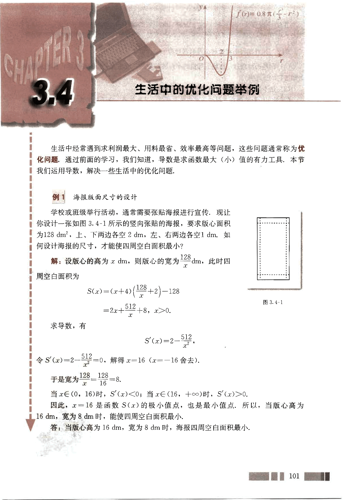
107

# CHAPTER

普通高中课程标准实验教科书 数学选修 1-1

## 例2 饮料瓶大小对饮料公司利润的影响

(1) 你是否注意过，市场上等量的小包装的物品一般比大包装的要贵些？你想从数学上知道它的道理吗？

(2) 是不是饮料瓶越大，饮料公司的利润越大？

【背景知识】某制造商制造并出售球形瓶装的某种饮料，瓶子的制造成本是 0.8πr² 分，其中 r 是瓶子的半径，单位是厘米，已知每出售 1ml 的饮料，制造商可获利 0.2 分，且制造商能制作的瓶子的最大半径为 6cm.

问题：(1) 瓶子半径多大时，能使每瓶饮料的利润最大？

(2) 瓶子半径多大时，每瓶饮料的利润最小？

解：由于瓶子的半径为 r，所以每瓶饮料的利润是

y = f(r) = 0.2 × $\frac{4}{3}$πr³ - 0.8πr² 
= 0.8π($\frac{r^3}{3}$ - r²),  0 < r ≤ 6.

f'(r) = 0.8π(r² - 2r) = 0.

当 r = 2 时，f'(r) = 0.

当 r ∈ (0, 2) 时，f'(r) < 0；当 r ∈ (2, 6) 时，f'(r) > 0.

因此，当半径 r > 2 时，f'(r) > 0，它表示 f(r) 单调递增，即半径越大，利润越高；半径 r < 2 时，f'(r) < 0，它表示 f(r) 单调递减，即半径越大，利润越低.

I. 半径为 2cm 时，利润最小，这时 f(2) < 0，表示此种瓶内饮料的利润还不够瓶子的成本，此时利润是负值.

II. 半径为 6cm 时，利润最大.

换一个角度：如果我们不用导数工具，直接从函数的图象（图 3.4-2）上观察，你有什么发现？

从图象上容易看出，当 r = 3 时，f(3) = 0，即瓶子的半径是 3cm 时，饮料的利润与饮料瓶的成本恰好相等；当 r > 3 时，利润才为正值.

当 r ∈ (0, 2) 时，f'(r) 是减函数，你能解释它的实际意义吗？

通过此问题的解决，我们很容易回答开始时的问题，请同学们自己作出回答.

## 例3 磁盘的最大存储量问题

(1) 你知道计算机是如何存储、检索信息的吗？

(2) 你知道磁盘的结构吗？

(3) 如何使一个圆环状的磁盘存储尽可能多的信息？

【背景知识】计算机把信息存储在磁盘上，磁盘是带

102

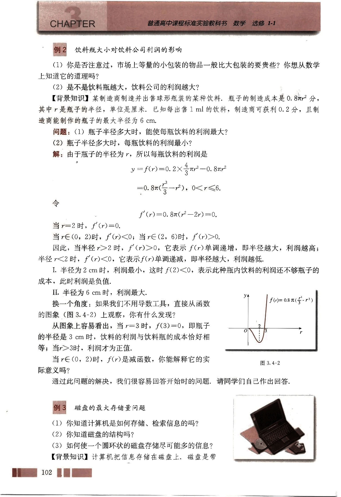
108

# 第三章 导数及其应用

## 第三章

有磁性介质的圆盘，并由操作系统将其格式化成磁道和扇区，磁道是指不同半径所构成的同心圆轨道，扇区是指被圆心角分割成的扇形区域，磁道上的定长的弧可作为基本存储单元，根据其磁化与否可分别记录数据0或1，这个基本单元通常称为比特(bit)。磁盘的构造如图3.4-3所示。

为了保障磁盘的分辨率，磁道之间的宽度必须大于*m*，每比特所占用的磁道长度不得小于*n*。为了数据检索的方便，磁盘格式化时要求所有磁道具有相同的比特数。

**问题:**现有一张半径为*R*的磁盘，它的存储区是半径介于*r*与*R*的环行区域。

(1)是不是*r*越小，磁盘的存储量越大？

(2)*r*为多少时，磁盘具有最大存储量（最外面的磁道不存储任何信息）？

**解:**存储量=磁道数×每磁道的比特数。

[图3.4-3](images/3.4-3.png)

设存储区的半径介于*r*与*R*之间，由于磁道之间的宽度必须大于*m*，且最外面的磁道不存储任何信息，所以磁道数最多可达$\frac{R-r}{m}$，又由于每条磁道上的比特数相同，为获得最大的存储量，最内一条磁道必须装满，即每条磁道上的比特数可达到$\frac{2\pi r}{n}$。所以，磁盘总存储量

$f(r) = \frac{R-r}{m} \cdot \frac{2\pi r}{n} = \frac{2\pi r(R-r)}{mn}$

(1)它是一个关于*r*的二次函数，从函数的解析式上可以判断，不是*r*越小，磁盘的存储量越大。

(2)为求*f(r)*的最大值，计算*f’(r)*=0.

$f'(r) = \frac{2\pi}{mn}(R-2r)$

解得

$f'(r) = 0,$

$r = \frac{R}{2}$

当$r < \frac{R}{2}$时，$f'(r) > 0$；当$r > \frac{R}{2}$时，$f'(r) < 0$。因此，当$r = \frac{R}{2}$时，磁盘具有最大存储量，最大存储量为$\frac{\pi R^2}{2mn}$。

**思考？**

如果每条磁道存储的信息与磁道的长度成正比，那么如何计算磁盘的存储量？此时，是不是*r*越小，磁盘的存储量越大？

103

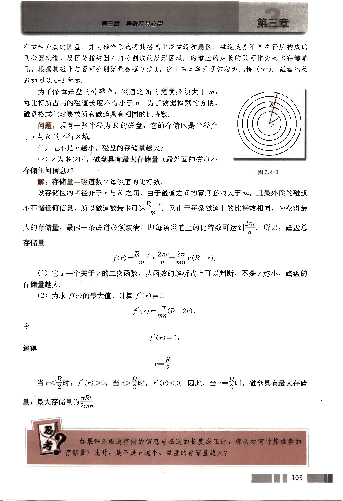
109

# CHAPTER

普通高中课程标准实验教科书 数学选修 1-1

由上述例子,我们不难发现,解决优化问题的基本思路是:

优化问题 → 用函数表示的数学问题
↓
优化问题的答案 → 用导数解决数学问题

上述解决优化问题的过程是一个典型的数学建模过程.

# 习题 3.4

## A组

1. 一条长为 $l$ 的铁丝截成两段，分别弯成两个正方形，要使两个正方形的面积和最小，两段铁丝的长度分别是多少？

2. 无盖方盒的最大容积问题

一边长为 $a$ 的正方形铁片，铁片的四角截去四个边长都为 $x$ 的小正方形，然后做成一个无盖方盒.

(1) 试把方盒的容积 $V$ 表示为 $x$ 的函数.
(2) $x$ 多大时，方盒的容积 $V$ 最大？

3. 圆柱形金属饮料罐容积一定时，它的高与半径应怎样选择，才能使所用材料最省？

4. 用测量工具测量某物体的长度，由于工具的精度以及测量技术的原因，测得 $n$ 个数据 $a_1, a_2, a_3,..., a_n$.

求证：用 $n$ 个数据的平均值 
$x = \frac{1}{n}\sum_{i=1}^{n}a_i$

表示这个物体的长度，能使这 $n$ 个数据的方差

$f(x) = \frac{1}{n}\sum_{i=1}^{n}(x - a_i)^2$

最小.

思考：这个结果说明了什么？通过这个问题，你能说明最小二乘法的基本原理吗？

5. 如图，用铁丝弯成一个上面是半圆，下面是矩形的图形，其面积为 $a m^2$. 为使所用材料最省，底宽应为多少？

[第5题](images/题5.png)

6. 已知某商品生产成本 $C$ 与产量 $q$ 的函数关系为 $C = 100 + 4q$，单价 $p$ 与产量 $q$ 的函数关系式为 $p = 25 - \frac{1}{8}q$. 求产量 $q$ 为何值时，利润 $L$ 最大？

104

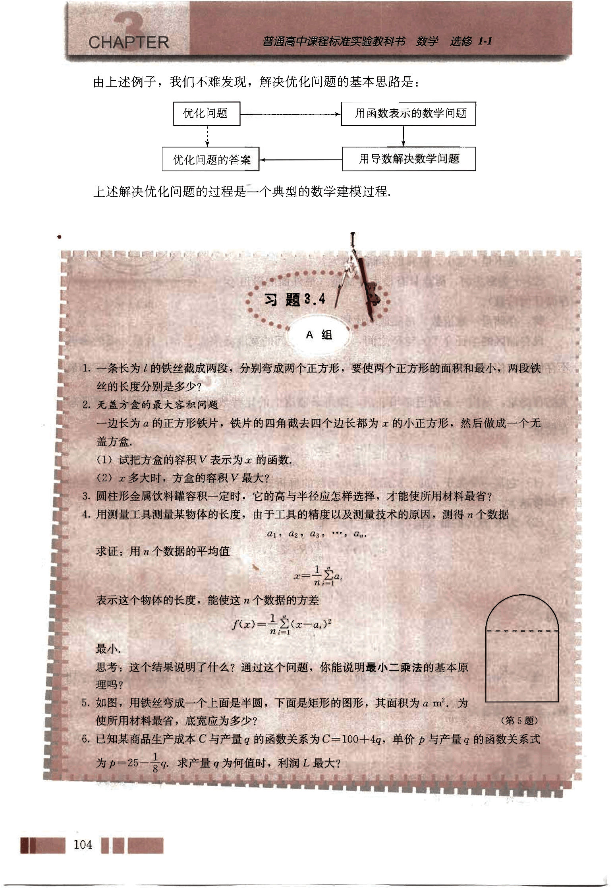
110

# 第三章 导数及其应用

## B组

1. 房价应定为多少

某宾馆有 50 个房间供游客居住，当每个房间定价为每天 180 元时，房间会全部住满；房间单价每增加 10 元，就会有一个房间空闲，如果游客居住房间，宾馆每间每天需花费 20 元的各种维护费用，房间定价多少时，宾馆利润最大？

2. 已知某商品进价为 $a$ 元/件，根据以往经验，当售价是 $b(b \ge \frac{4}{3}a)$ 元/件时，可卖出 $c$ 件。市场调查表明，当售价下降 10% 时，销量可增加 40%。现决定一次性降价，销售价为多少时，可获得最大利润？

105

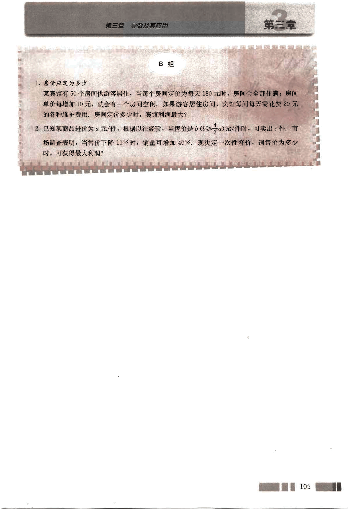
111

# 走进微积分

## 目的

通过收集微积分创立的时代背景和历史意义的有关材料，体会微积分在数学思想史和科学思想史上的价值.

## 过程

1. 微积分 (differential and integral calculus) 是研究函数的微分 (differential)、积分 (integral) 以及有关概念和应用的数学分支，微积分中的基本概念是极限、导数、积分等。导数是微积分中的核心概念之一。

  * 请同学们收集介绍“微积分”的有关书籍，了解微积分的研究对象，以及微积分的基本概念。

2. 微积分的创立不仅是数学思想史上的里程碑，也是科学思想史上的里程碑。

  * 请同学们收集历史上对微积分创立和发展的一些重要评价。

3. 微积分的创立具有悠久的历史渊源。

  * 请同学们收集历史上我国和古代欧洲有关微积分思想的一些代表性的工作。

4. 微积分的创立有深刻的时代背景，当时的技术对数学提出了许多要求。

  * 请同学们通过收集从欧洲文艺复兴到 17 世纪期间的社会、经济状况、科学发展、贸易、航运等情况，了解它们对数学的要求。

5. 牛顿和莱布尼茨是微积分的创立者。

  * 请同学们收集牛顿和莱布尼茨的生平资料，以及他们创立微积分时所做的开创性工作。

## 思考

微积分的创立说明了什么？它的历史意义是什么？你有什么体会？

106

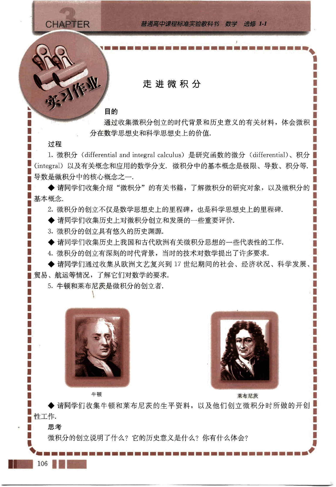
112

# 第三章 导数及其应用

## 要求

以小组为单位，按上述问题分头收集材料，最后汇总，每组写一个实习报告，各组分头交流。

## 主要参考书目：

[1] 《中国大百科全书》（数学卷），中国大百科全书出版社。
[2] 《古今数学思想》，第2册，上海科学技术出版社。
[3] 《数学的源与流》，高等教育出版社。
[4] 《数学的思想、方法和应用》，北京大学出版社。

107

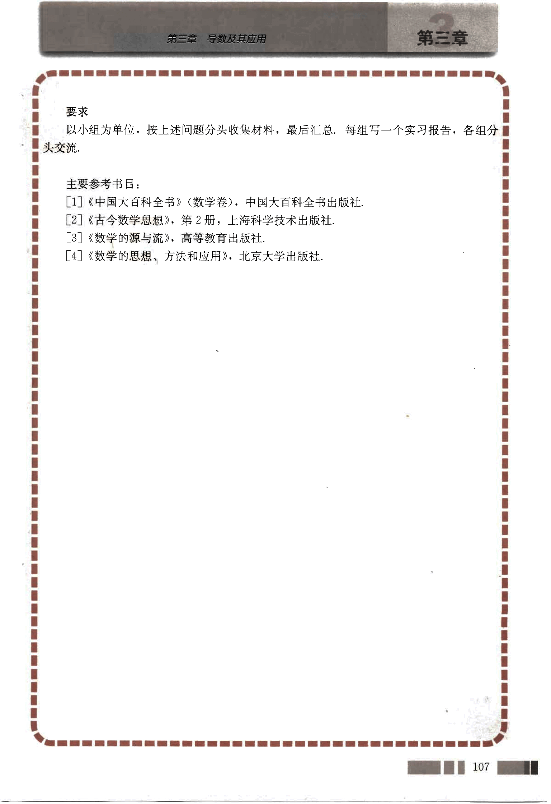
113

# 小结

## 一、本章知识结构

```mermaid
graph TD
A[平均速度] --> B(瞬时速度);
C[平均变化率] --> B;
D[割线斜率] --> B;
B --> E(导数);
F[基本初等函数导数公式] --> E;
G[导数运算法则] --> E;
E --> H[导数与函数单调性的关系];
E --> I[导数与极(最)值的关系];

```

## 二、回顾与思考

1. 函数 $y = f(x)$ 在 $x = x_0$ 处的导数记作 $f'(x_0)$ 或 $y'|_{x=x_0}$，其定义用符号表示是

$f'(x_0) = \lim_{\Delta x \to 0} \frac{\Delta y}{\Delta x} = \lim_{\Delta x \to 0} \frac{f(x_0 + \Delta x) - f(x_0)}{\Delta x}$

用语言来描述，就是

当 $\Delta x$ 趋近于 0 时，$\frac{f(x_0 + \Delta x) - f(x_0)}{\Delta x}$ 趋于一个定数，这个定数就是 $f'(x_0)$。

通过本章的学习，你对导数概念有什么认识？有人说，导数概念的核心是变化率，你是怎么想的？

2. 你能从物理和几何两方面解释导数的意义吗？

请你根据导数的几何意义，画出在 $f(12) = 8$，$f'(12) = 0$ 条件下，函数 $y = f(x)$ 在点 $x = 12$ 附近曲线的大致形状。

请你根据导数的物理意义，举出一些实际例子。

3. 对很多运动变化问题的研究最后都会归结为研究各式各样的函数，除了本章中我们已解决的种种问题外，还有诸如行星的运动、热传导问题等等，研究函数最基本的的问题是，它是如何变化的，也就是它是增还是减，以及增减的范围、增减的快慢。导数简明地回答了这些问题：由 $f'(x)$ 的符号可知函数 $f(x)$ 是增还是减，由 $|f'(x)|$ 的大小可知函数变化得急剧还是平缓，导数是研究函数的有力工具。

108

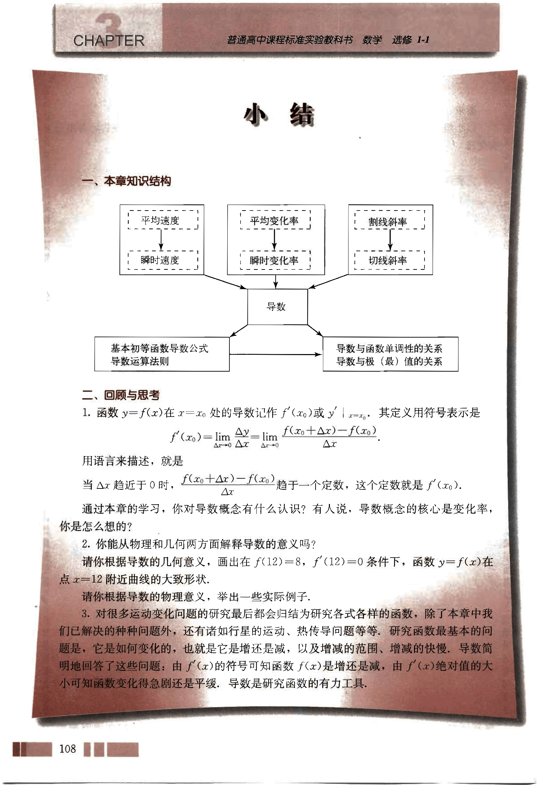
114

# 第三章 导数及其应用

不仅如此，导数也是解决函数最(极)值问题，从而是解决优化问题的一种通法。虽然用配方法求二次函数极值的方法很漂亮，但它只是特殊情况下的特殊解法，并不能解决三次函数等一般函数的极值问题。利用导数，我们可以求出满足方程 $f(x)=0$ 的点，然后根据此点附近两侧导数的符号求出极值。这同时体现了导数这个工具的力量。

通过本章的学习，你对这些是否已经有所体会？

109

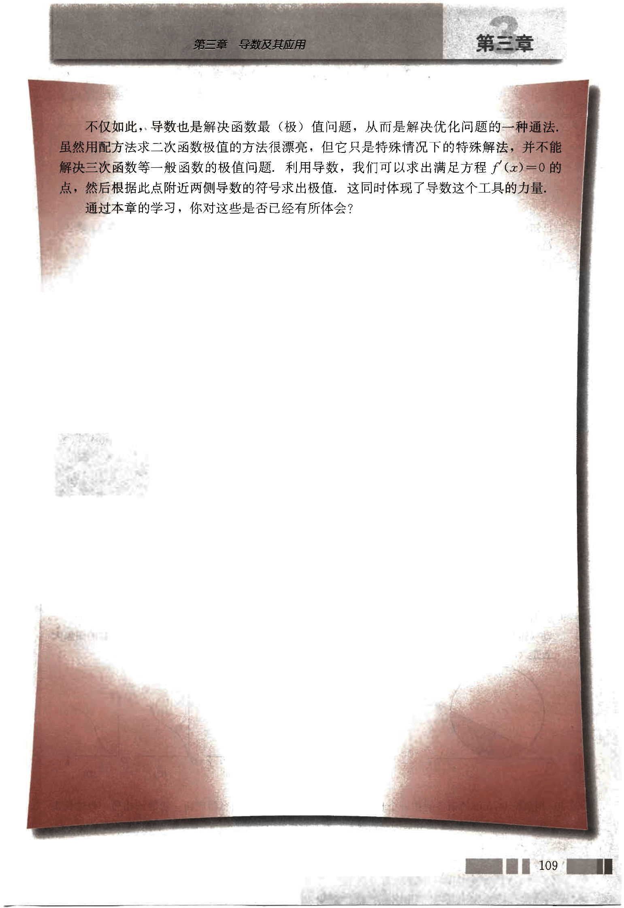
115

# 复习参考题
## A组

1. 已知点P和点Q是曲线y=x²-2x-3上的两点，且点P的横坐标是1，点Q的横坐标是4，求：
(1)割线PQ的斜率；
(2)点P处的切线方程.

2. 求下列函数的导数：
(1) y=2xtan x;
(2) y=eln x.

3. 一个距地心距离为r，质量为m的人造卫星，与地球之间的万有引力F由公式$F=\frac{GMm}{r^2}$给出，其中M为地球质量，G为常量，求F对于r的瞬时变化率.

4. 一杯80℃的热红茶置于20℃的房间里，它的温度会逐渐下降，温度T(单位：℃)与时间t(单位：min)间的关系，由函数T=f(t)给出。请问：
(1) f(t)的符号是什么？为什么？
(2) f(3)=-4的实际意义是什么？如果f(3)=65℃，你能画出函数在点t=3时图象的大致形状吗？

5. 求函数$f(x)=\sqrt{x^2}$的单调区间.

6. 已知函数f(x)=x²+px+q，试确定p，q的值，使当x=1时，f(x)有最小值4.

7. 已知函数f(x)=x(x-c)²在x=2处有极大值，求c的值.

8. 如图，过点P(1,1)作直线AB，分别与x轴的正半轴，y轴的正半轴交于A，B两点，当直线AB在什么位置时，△AOB的面积最小，最小面积是多少？
[image](images/question8.png)

9. 如图，直线l和圆C，当l从l0开始在平面上绕点O按逆时针方向匀速转动（转动角度不超过90°）时，它扫过的圆内阴影部分的面积S是时间t的函数，这个函数的图象大致是().
[image](images/question9.png)

10. 用总长14.8m的钢条制作一个长方体容器的框架，如果所制容器底面一边的长比另一边的长多0.5m，那么高为多少时容器的容积最大？最大容积是多少？

110

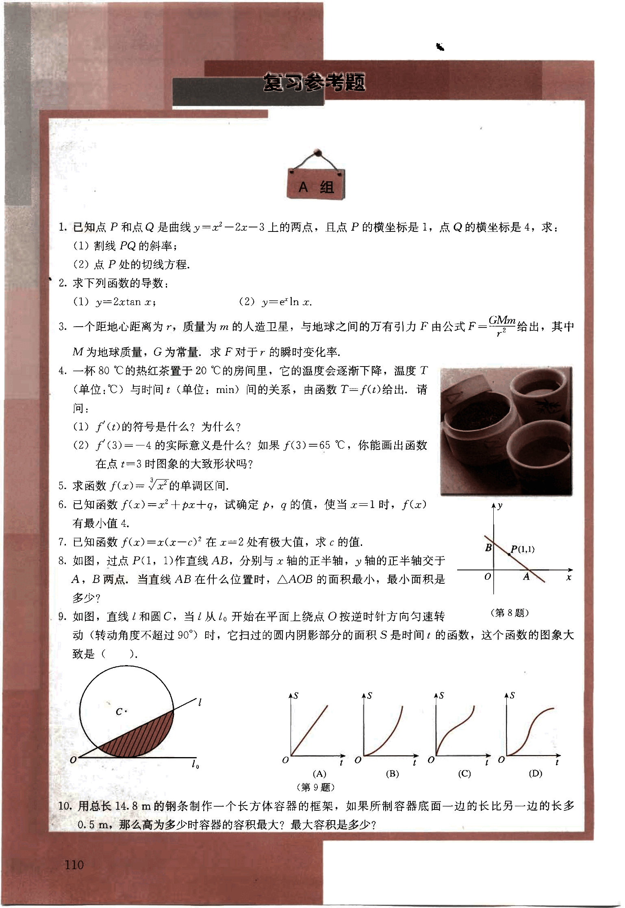
116

# 团体旅行

11. 某旅行社在暑假期间推出如下旅游团组团办法:达到100人的团体，每人收费1000元，如果团体的人数超过100人，那么每超过1人，每人平均收费降低5元，但团体人数不能超过180人，如何组团，可使旅行社的收费最多？

# 打印纸型号设计原理

12. 如图，某种打印纸的面积为623.7 cm²，要求上、下页边距分别为2.54 cm，左、右页边距分别为3.17 cm。如果要求纵向打印，长与宽分别为多少时可使其打印面积最大（精确到0.01 cm）？（可使用计算器）请搜集一下各种型号打印纸的数据资料，并说明其中所蕴含的设计原理。
[第12题](images/12.png)

# 养猪场利润最大化

13. 已知某养猪场每年的固定成本是20000元，每年最大规模的养殖量是400头，每养1头猪，成本增加100元，如果收入函数是$R(q) = -\frac{1}{2}q^2 + 400q$ (q是猪的数量)，每年养多少头猪可使总利润最大？总利润是多少？（可使用计算器）

# B组

1. 当室内的有毒细菌开始增加时，就要使用杀菌剂，刚开始使用的时候，细菌数量还会继续增加，随着时间的增加，它增加幅度逐渐变小，到一定时间，细菌数量开始减少。如果使用杀菌剂t小时后的细菌数量为
$b(t) = 10^5 + 10^4t - 10^3t^2$.

(1) 求细菌在t=5与t=10时的瞬时速度；

(2) 细菌在哪段时间增加，在哪段时间减少？为什么？

2. 已知一个扇形的周长为l，扇形的半径和中心角分别为多大时，扇形的面积最大？

3. 用半径为R的圆铁皮剪去一个圆心角为α的扇形，制成一个圆锥形容器，扇形的圆心角多大时，容器的容积最大？

4. 一艘船的燃料费与船速度的平方成正比，如果此船速度是10 km/h，那么每小时的燃料费是80元。已知船航行时其他费用为480元/时，在20 km航程中，航速多少时船行驶总费用最少（精确到1 km/h）？此时每小时费用等于多少（精确到1元）？（可使用计算器）

5. 已知A，B两地的距离是130 km，按交通法规规定，A，B两地之间的公路车速应限制在50～100 km/h。假设汽油的价格是3元/升，汽车的耗油率为$(3 + \frac{x}{360})$ L/h，司机每小时的工资是14元，那么最经济的车速是多少（精确到1 km/h）？如果不考虑其他费用，这次行车的总费用是多少（精确到1元）？（可用计算器）

111

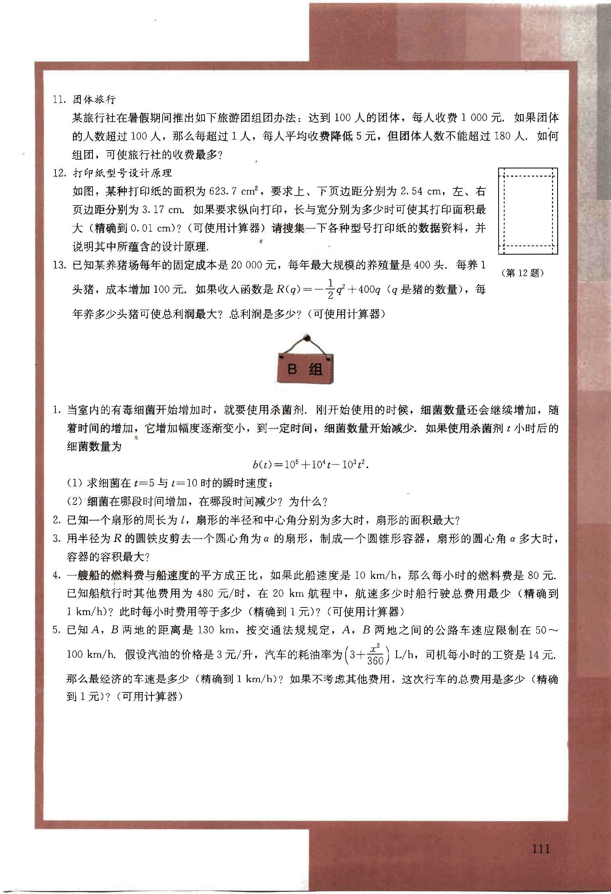
