# 选修 1-2

1

# 普通高中课程标准实验教科书 数学

## 选修 1-2

人民教育出版社 课程教材研究所 编著

中学数学课程教材研究开发中心

经全国中小学教材审定委员会
2005 年初审通过

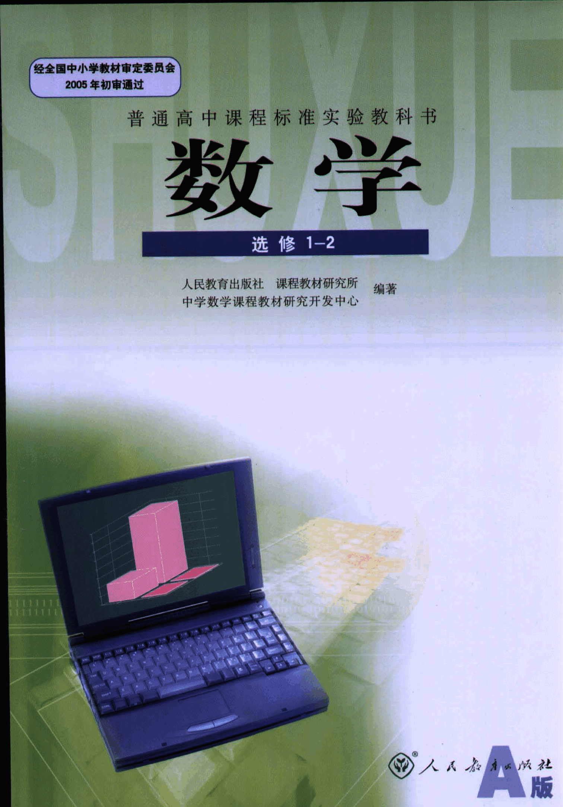
2

# 本书部分数学符号

$\sum_{i=1}^{n}(y_i - \hat{y})^2$ 总偏差平方和

$\hat{e}$ 残差

$\sum_{i=1}^{n}(y_i - \hat{y})^2$ 残差平方和

C 虚数单位

复数集

z, a+bi 复数 z, 实部为 a, 虚部为 b 的复数

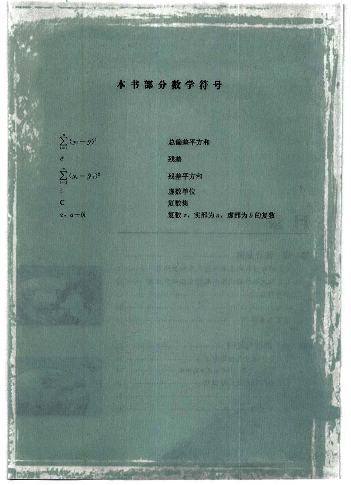
3

# 目录

# 第一章 统计案例

1. 1 回归分析的基本思想及其初步应用 …………… 2
1. 2 独立性检验的基本思想及其初步应用 …………… 12
   实习作业 …………… 19
   小结 …………… 20
   复习参考题 …………… 21

# 第二章 推理与证明

2. 1 合情推理与演绎推理 …………… 24
   阅读与思考 科学发现中的推理 …………… 35
3. 2 直接证明与间接证明 …………… 38
   小结 …………… 47
   复习参考题 …………… 48

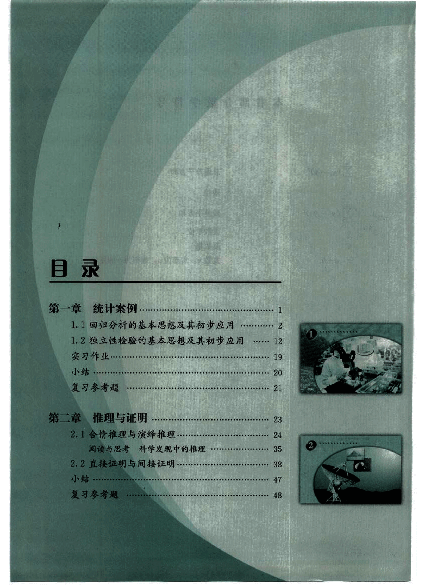
4

# 第三章 数系的扩充与复数的引入

51

## 3.1 数系的扩充和复数的概念

52

## 3.2 复数代数形式的四则运算

58

小结

64

复习参考题

65

# 第四章 框图

67

## 4.1 流程图

68

## 4.2 结构图

76

信息技术应用 用 Word2002 绘制流程图

81

小结

84

复习参考题

85
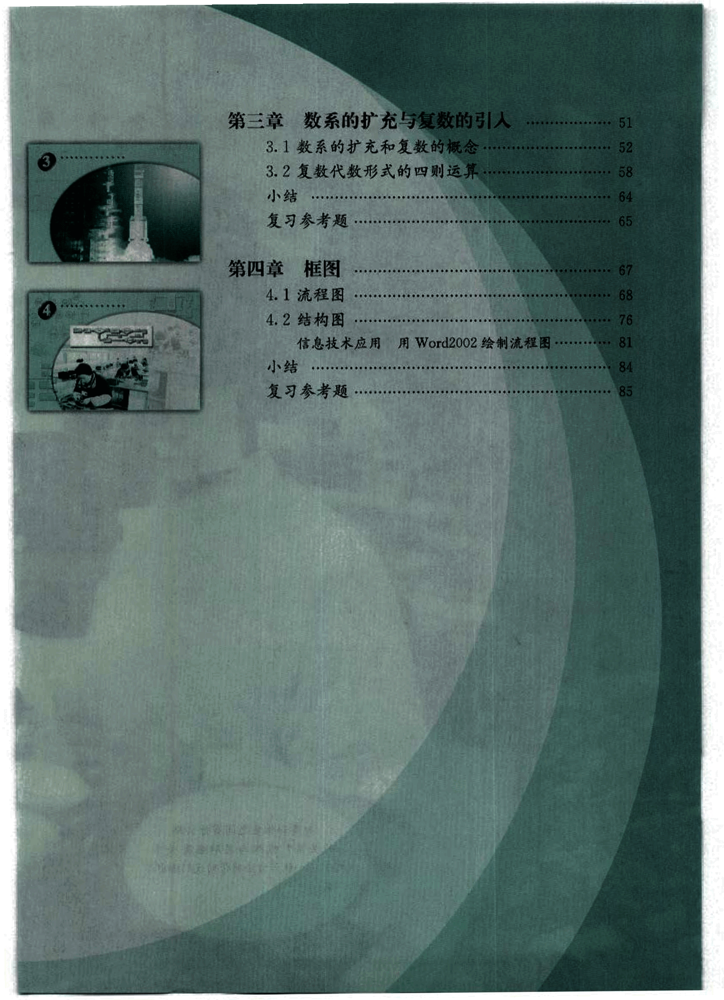
5

# 1

身高和体重之间有什么样的关系？吸烟与患肺癌有关系吗？……统计方法将帮助我们给出答案。


6

# 第一章 统计案例

## 1.1 回归分析的基本思想及其初步应用

## 1.2 独立性检验的基本思想及其初步应用

在现实中，我们经常会遇到类似下面的问题：肥胖是影响人类健康的一个重要因素，标准的身高和体重之间是否存在线性相关关系？肺癌是严重威胁人类生命的一种疾病，吸烟与患肺癌有关系吗？等等。

为了回答这些问题，必须明确问题涉及的对象（总体）是什么，用怎样的量来描述要解决的问题，并确定获取变量值（数据）的方法，然后用恰当的统计方法分析数据，以得到最可靠的结论。

在必修模块中，我们学习过抽样、样本估计总体、线性回归等基本知识，本章中，我们将在此基础上，通过对典型案例的讨论，进一步学习线性回归分析方法及其应用，并初步了解独立性检验的基本思想，认识统计方法在决策中的作用。

[image1](images/image1.png)

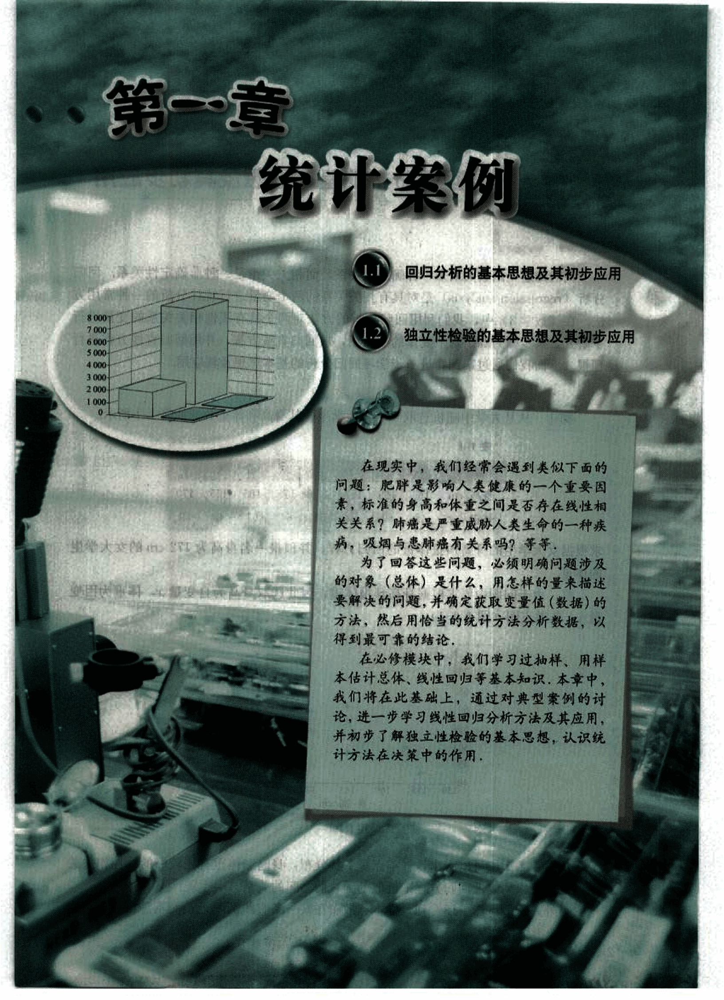
7

# 1.1 回归分析的基本思想及其初步应用

我们知道，函数关系是一种确定性关系，而相关关系是一种非确定性关系。回归分析 (regression analysis) 是对具有相关关系的两个变量进行统计分析的一种常用方法。在《数学 3》中，我们利用回归分析的方法对两个具有线性相关关系的变量进行了研究，其步骤为画出两个变量的散点图，求回归直线方程，并用回归直线方程进行预报。下面我们通过案例，进一步学习回归分析的基本思想及其应用。

## 例 1

从某大学中随机选取 8 名女大学生，其身高和体重数据如表 1-1 所示。

表 1-1

| 编号 | 身高/cm | 体重/kg |
| ---- | ------- | ------- |
| 1    | 165     | 48      |
| 2    | 165     | 57      |
| 3    | 157     | 50      |
| 4    | 170     | 54      |
| 5    | 175     | 64      |
| 6    | 165     | 61      |
| 7    | 155     | 43      |
| 8    | 170     | 59      |

求根据女大学生的身高预报体重的回归方程，并预报一名身高为 172 cm 的女大学生的体重。

解：由于问题中要求根据身高预报体重，因此选取身高为自变量 _x_，体重为因变量 _y_。作散点图（图 1.1-1）：

[图 1.1-1](images/1.1-1.png)

从图 1.1-1 中可以看出，样本点呈条状分布，身高和体重有比较好的线性相关关系，因此可以用线性回归方程来近似刻画它们之间的关系。

另外，从散点图中还看到，样本点散布在一条直线的附近，而不是在一条直线上。

2

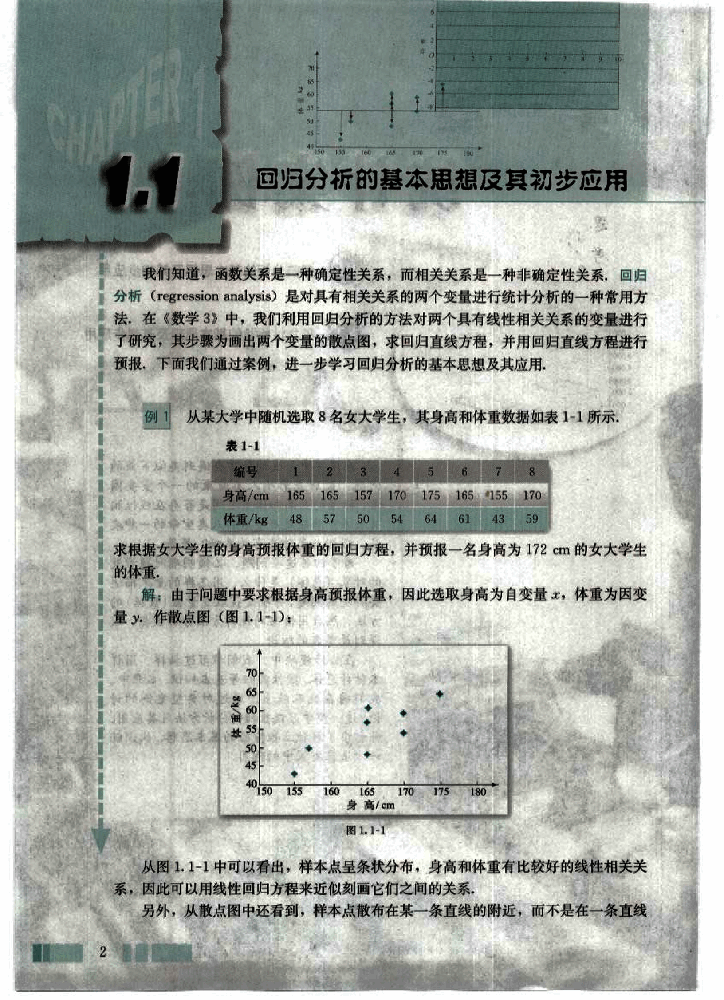
8

# 第一章 统计案例

上，所以不能用一次函数

$y = bx + a$

来描述它们之间的关系，这时我们把身高和体重的关系用下面的线性回归模型来表示：

$y = bx + a + e$,

其中$a$和$b$为模型的未知参数，$e$称为随机误差

产生随机误差项$e$的原因是什么？

实际上，一个人的体重除了受身高的影响外，还受许多其他因素的影响，例如饮食习惯、是否喜欢运动、度量误差等。另一方面，没有人知道身高和体重之间的真正关系是什么，现在只是利用线性回归方程来近似这种关系，而这种近似和上面提到的影响因素都会导致随机误差的产生。

线性回归模型(1)与我们熟悉的一次函数模型的不同之处是增加了随机误差项$e$，因变量$y$的值由自变量$x$和随机误差$e$共同确定，即自变量$x$只能解释部分$y$的变化。在统计中，我们也把自变量$x$称为解释变量，因变量$y$称为预报变量。

解释变量$x$(身高) -----> 预报变量$y$(体重)

随机误差$e$

图 1.1-2

如何估计模型(1)中的未知参数$a$和$b$? 由（数学 3）的知识可知，最小二乘估计$a$和$b$就是未知参数$a$和$b$的最好估计，其计算公式如下：

$b = \frac{\sum{(x_i - \overline{x})(y_i - \overline{y})}}{\sum{(x_i - \overline{x})^2}}$,

$a = \overline{y} - b\overline{x}$,

其中$\overline{x} = \frac{1}{n}\sum{x_i}$, $\overline{y} = \frac{1}{n}\sum{y_i}$。$(x, y)$称为样本点的中心。

在本例中，根据上面的公式，可以得到

$b = 0.849$，$a = -85.712$。

于是得到线性回归方程

$y = 0.849x - 85.712$。

回归直线过样本点的中心。

所以，对于身高为 172 cm 的女大学生，由回归方程可以预报其体重为

$y = 0.849 \times 172 - 85.712 = 60.316(kg)$。

3

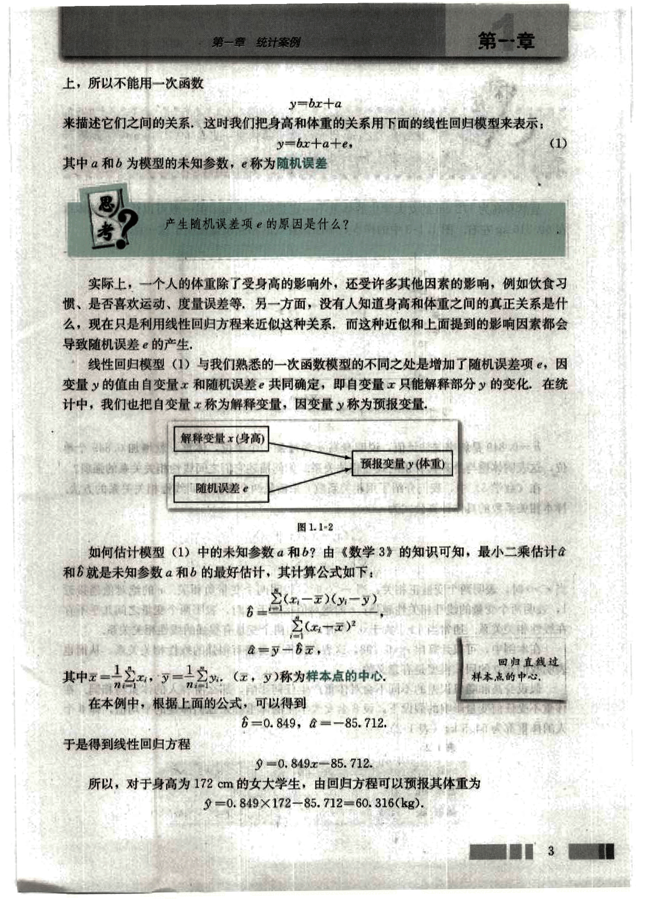
9

# CHAPTER

普通高中课程标准实验教科书 数学 选修 1-2

## 探究

身高为 172 cm 的女大学生的体重一定是 60.316 kg 吗？如果
不是，你能解释一下原因吗？

显然身高为 172 cm 的女大学生的体重不一定是 60.316 kg，但一般可以认为她的体重
在 60.316 kg 左右。图 1.1-3 中的样本点和回归直线的相互位置说明了这一点。


$r = \frac{\sum_{i=1}^{n}(x_i - \overline{x})(y_i - \overline{y})}{\sqrt{\sum_{i=1}^{n}(x_i - \overline{x})^2\sum_{i=1}^{n}(y_i - \overline{y})^2}}$

$b = 0.849$是斜率的估计值，说明身高 $x$ 每增加一个单位，体重 $y$ 就增加 0.849 个单
位，这表明体重与身高具有正的线性相关关系。如何描述它们之间线性相关关系的强弱？

在《数学 3》中，我们介绍了用相关系数 $r$ 来衡量两个变量之间线性相关关系的方法。

当 $r > 0$ 时，表明两个变量正相关；当 $r < 0$ 时，表明两个变量负相关；$r$ 的绝对值越接近
1，表明两个变量的线性相关性越强；$r$ 的绝对值接近于 0 时，表明两个变量之间几乎不存
在线性相关关系。通常当 $|r|$ 大于 0.75 时，认为两个变量有很强的线性相关关系。

在本例中，可以计算出 $r = 0.798$，这表明体重与身高有很强的线性相关关系，从而也
表明我们建立的回归模型是有意义的。

假设身高和随机误差的不同不会对体重产生任何影响，那么所有人的体重将相同。在
体重不受任何变量影响的假设下，设 8 名女大学生的体重都是她们体重的平均值，即 8 个
人的体重都为 54.5 kg（表 1-2）。

表 1-2

| 编号    | 1    | 2    | 3    | 4    | 5    | 6    | 7    | 8    |
| ------- | ---- | ---- | ---- | ---- | ---- | ---- | ---- | ---- |
| 身高/cm | 165  | 165  | 157  | 170  | 175  | 165  | 155  | 170  |
| 体重/kg | 54.5 | 54.5 | 54.5 | 54.5 | 54.5 | 54.5 | 54.5 | 54.5 |

4

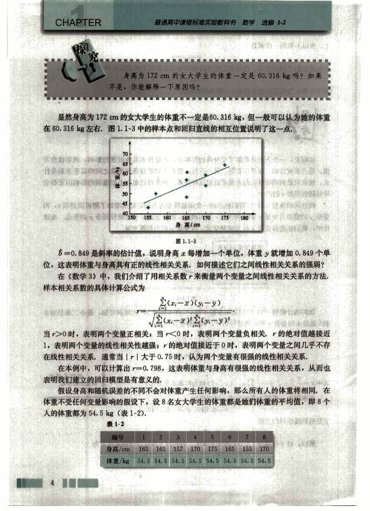
10

# 第一章 统计案例

## 第一章

在根据表 1-2 的数据作出的散点图中，所有的点应该落在同一条水平直线上，但是观测到的数据并非如此，它们的散布情况如图 1.1-4 所示，这就意味着预报变量（体重）的值受解释变量（身高）和随机误差的影响。


## 思考

如何刻画预报变量（体重）的变化？这个变化在多大程度上与解释变量（身高）有关？在多大程度上与随机误差有关？

例如，编号为 6 的女大学生的体重并没有落在水平直线上，她的体重为 61 kg。解释变量（身高）和随机误差共同把这名学生的体重从 54.5 kg “推”到了 61 kg，相差 6.5 kg，所以 6.5 kg 是解释变量和随机误差的组合效应。类似地，编号为 3 的女大学生的体重也没有落在水平直线上，她的体重为 50 kg，这时解释变量和随机误差的组合效应为-4.5。用这种方法可以对所有预报变量计算组合效应。

如何把所有这些效应合并在一个数中呢？在数学上，把每个效应（观测值减去总的平均值）的平方加起来，即用

$\sum_{i=1}^{n}(y_i - \overline{y})^2$

表示总的效应，称为总偏差平方和（corrected total sum of squares），在例 1 中，总偏差平方和为 354。

那么，在这个总的效应（总偏差平方和）中，有多少来自于解释变量（身高）？有多少来自于随机误差？假设随机误差对体重没有影响，也就是说，体重仅受身高的影响，那么散点图中所有的点将完全落在回归直线上，但是，在图 1.1-3 中，数据点并没有完全落在回归直线上，这些点散布在回归直线附近，所以一定是随机误差把这些点从回归直线上“推”开了。

## 因此，数据点和它在回归直线上相应位置的差异($y_i - \hat{y}_i$)是随机误差的效应，称

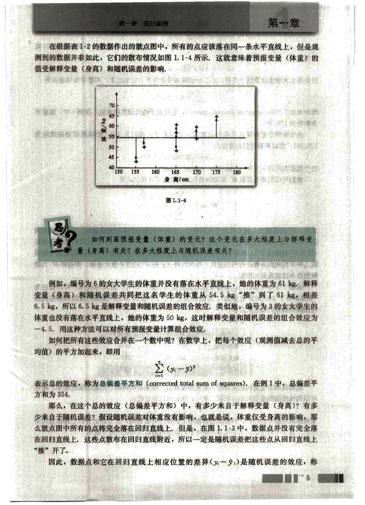
11

# CHAPTER 普通高中课程标准实验教科书 数学选修 1-2

$\epsilon_i = y_i - \hat{y_i}$ 为残差 (residual)。例如，对于编号为 6 的女大学生，计算随机误差的效应为

61 - (0.849 × 165 - 85.712) = 6.627.

对每名女大学生计算这个差异，然后分别将所得的值平方后加起来，用数学符号表示为

$\sum_{i=1}^{n}(y_i - \hat{y_i})^2$

称为残差平方和 (residual sum of squares)，它代表了随机误差的效应。在例 1 中，残差平方和约为 128.361。

由于解释变量和随机误差的总效应（总偏差平方和）为 354，而随机误差的效应为 128.361，所以解释变量的效应为

354 - 128.361 = 225.639，

这个值称为回归平方和 (regression sum of squares)。

我们可以用相关指数 $R^2$ 来刻画回归的效果，其计算公式是

$R^2 = 1 - \frac{\sum_{i=1}^{n}(y_i - \hat{y_i})^2}{\sum_{i=1}^{n}(y_i - \bar{y})^2}$

显然，$R^2$ 的值越大，说明残差平方和越小，也就是说模型的拟合效果越好。在线性回归模型中，$R^2$ 表示解释变量对预报变量变化的贡献率，$R^2$ 越接近于 1，表示回归的效果越好（因为 $R^2$ 越接近于 1，表示解释变量和预报变量的线性相关性越强）。如果某组数据可能采取几种不同回归方程进行回归分析，则可以通过比较 $R^2$ 的值来做出选择，即选择 $R^2$ 大的模型作为这组数据的模型。

从表 1-3 中可以看出，解释变量对总效应约贡献了 64%，即 $R^2$ ≈ 0.64，可以叙述为“身高解释了 64% 的体重变化”，而随机误差贡献了剩余的 36%。所以，身高对体重的效应比随机误差的效应大得多。

表 1-3

| 来源     | 平方和  | 比例 |
| -------- | ------- | ---- |
| 解释变量 | 225.639 | 64%  |
| 随机误差 | 128.361 | 36%  |
| 总计     | 354     | 100% |

在研究两个变量间的关系时，首先要根据散点图来粗略判断它们是否线性相关，是否可以用线性回归模型来拟合数据。然后，我们可以通过残差 $\epsilon_1, \epsilon_2, \dots, \epsilon_n$ 来判断模型拟合的效果，判断原始数据中是否存在可疑数据，这方面的分析工作称为残差分析。表 1-4 列出了女大学生身高和体重的原始数据以及相应的残差数据。

6

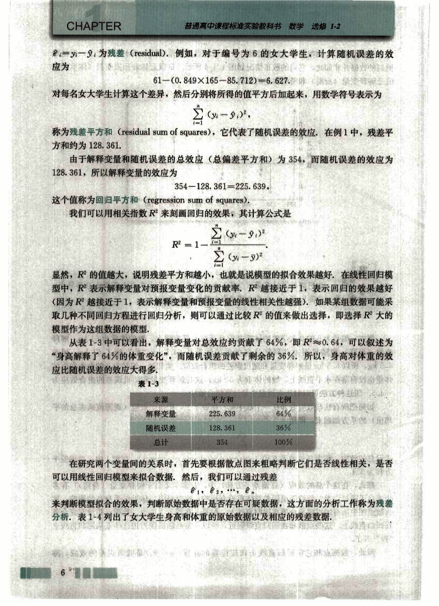
12

# 第一章 统计案例

## 表 1-4

| 编号    | 1      | 2     | 3     | 4      | 5     | 6     | 7      | 8     |
| ------- | ------ | ----- | ----- | ------ | ----- | ----- | ------ | ----- |
| 身高/cm | 165    | 165   | 157   | 170    | 175   | 165   | 155    | 170   |
| 体重/kg | 48     | 57    | 50    | 54     | 64    | 61    | 43     | 59    |
| 残差    | -6.373 | 2.627 | 2.419 | -4.618 | 1.137 | 6.627 | -2.883 | 0.382 |

我们可以利用图形来分析残差特性，作图时纵坐标为残差，横坐标可以选为样本编号，或身高数据，或体重估计值等，这样作出的图形称为残差图。图 1.1-5 是以样本编号为横坐标的残差图。

[图 1.1-5](images/1.1-5.png)

从图 1.1-5 中可以看出，第 1 个样本点和第 6 个样本点的残差比较大，需要确认在采集这两个样本点的过程中是否有人为的错误。如果数据采集有错误，就予以纠正，然后再重新利用线性回归模型拟合数据；如果数据采集没有错误，则需要寻找其他的原因。另外，残差点比较均匀地落在水平的带状区域中，说明选用的模型比较合适，这样的带状区域的宽度越窄，说明模型拟合精度越高，回归方程的预报精度越高。

用身高预报体重时，需要注意下列问题：

1. 回归方程只适用于我们所研究的样本的总体，例如，不能用女大学生的身高和体重之间的回归方程，描述女运动员的身高和体重之间的关系，同样，不能用生长在南方多雨地区的树木的高与直径之间的回归方程，描述北方干旱地区的树木的高与直径之间的关系。

2. 我们所建立的回归方程一般都有时间性，例如，不能用 20 世纪 80 年代的身高、体重数据所建立的回归方程，描述现在的身高和体重之间的关系。

3. 样本取值的范围会影响回归方程的适用范围，例如，我们的回归方程是由女大学生身高和体重的数据建立的，那么用它来描述一个人幼儿时期的身高和体重之间的关系就不恰当（即在回归方程中，解释变量的样本的取值范围为[155 cm, 170 cm]，而用这个方程计算 x=70 cm 时的 y 值，显然不合适）。

4. 不能期望回归方程得到的预报值就是预报变量的精确值，事实上，它是预报变量的可能取值的平均值。

一般地，建立回归模型的基本步骤为：

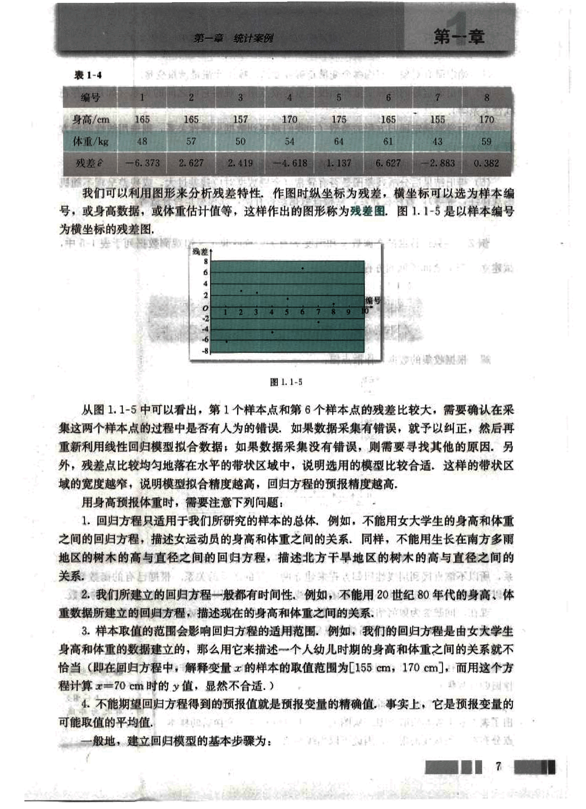
13

# CHAPTER

普通高中课程标准实验教科书 数学 选修 1-2

(1) 确定研究对象，明确哪个变量是解释变量，哪个变量是预报变量。

(2) 画出确定好的解释变量和预报变量的散点图，观察它们之间的关系（如是否存在线性关系等）。

(3) 由经验确定回归方程的类型（如我们观察到数据呈线性关系，则选用线性回归方程 $y = bx + a$）。

(4) 按一定规则估计回归方程中的参数（如最小二乘法）。

(5) 得出结果后分析残差图是否有异常（个别数据对应残差过大，或残差呈现不随机的规律性，等等），若存在异常，则检查数据是否有误，或模型是否合适等。

例 2 一只红铃虫的产卵数 $y$ 和温度 $x$ 有关，现收集了 7 组观测数据列于表 1-5 中，试建立 $y$ 与 $x$ 之间的回归方程。

表 1-5

| 温度 x/℃    | 21  | 23  | 25  | 27  | 29  | 32  | 35  |
| ----------- | --- | --- | --- | --- | --- | --- | --- |
| 产卵数 y/个 | 7   | 11  | 21  | 24  | 66  | 115 | 325 |

解：根据收集的数据，作散点图：[图](images/图1.1-6.png)

在图 1.1-6 中，样本点并没有分布在某个带状区域内，因此两个变量不呈线性相关关系，所以不能直接利用线性回归方程来建立两个变量之间的关系。根据已有的函数知识，可以发现样本点分布在某一条指数函数曲线 $y = c_1e^{c_2x}$ 的周围；其中 $c_1$ 和 $c_2$ 是待定的参数。

现在，问题变为如何估计待定参数 $c_1$ 和 $c_2$，我们可以通过对数变换把指数关系变为线性关系，令 $z = \ln y$，则变换后样本点应该分布在直线

$z = bx + a$ ($a = \ln c_1$，$b = c_2$)

的周围，这样，就可以利用线性回归模型来建立 $y$ 和 $x$ 之间的非线性回归方程了。

由表 1-5 中的数据可以得到变换后的样本数据表 1-6，图 1.1-7 给出了表 1-6 中数据的散点图，从图 1.1-7 中可以看出，变换后的样本点分布在一条直线的附近，因此可以用线性回归方程来拟合。

当回归方程不是形如 $y = bx + a$ ($a, b \in R$) 时，称之为非线性回归方程。

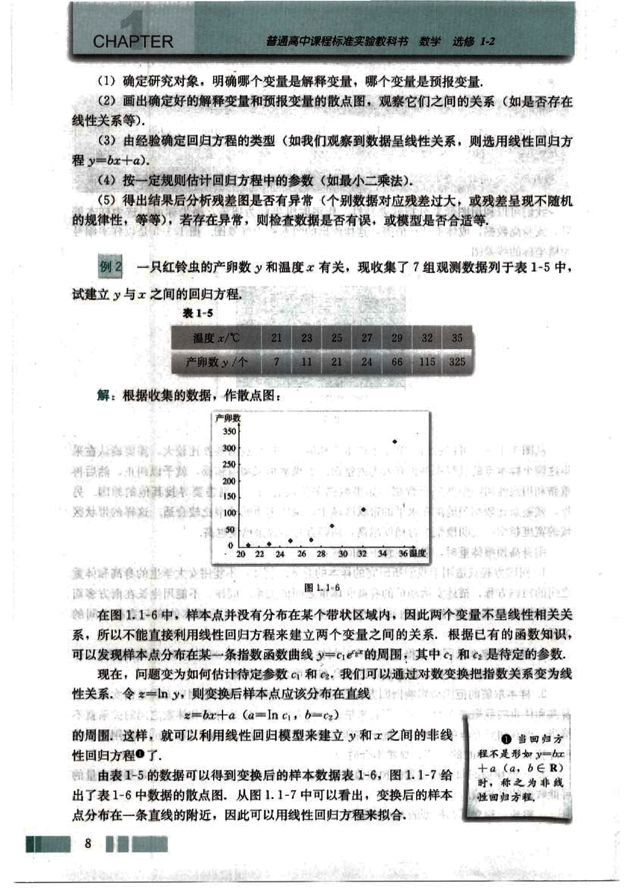
14

# 第一章 统计案例

## 表 1-6

| x   | 21    | 23    | 25    | 27    | 29    | 32    | 35    |
| :-- | :---- | :---- | :---- | :---- | :---- | :---- | :---- |
| y   | 1.946 | 2.398 | 3.045 | 3.178 | 4.190 | 4.745 | 5.784 |

[图 1.1-7](images/1.1-7.png)

由表 1-6 中的数据得到线性回归方程

$ξ = 0.272x - 3.849$

因此红铃虫的产卵数对温度的非线性回归方程为

$ξ = e^{0.272x - 3.849}$ (2)

另一方面，可以认为图 1.1-6 中样本点集中在某二次曲线 $y = c_3x^2 + c_4$ 的附近，其中 $c_3$ 和 $c_4$ 为待定参数，因此可以对温度变量做变换，即令 $t = x^2$，然后建立 y 与 t 之间的线性回归方程，从而得到 y 与 x 之间的非线性回归方程。

表 1-7 是红铃虫的产卵数和对应的温度的平方，图 1.1-8 是相应的散点图

| t   | 441 | 529 | 625 | 729 | 841 | 1 024 | 1 225 |
| :-- | :-- | :-- | :-- | :-- | :-- | :---- | :---- |
| y   | 7   | 11  | 21  | 24  | 66  | 115   | 325   |

[图 1.1-8](images/1.1-8.png)

从图 1.1-8 中可以看出，y 与 t 的散点图并不分布在一条直线的周围，因此不宜用线性回归方程来拟合它，即不宜用二次曲线 $y = c_3x^2 + c_4$ 来拟合 y 和 x 之间的关系，这个结论还可以通过残差分析得到，下面介绍具体方法。

为比较两个不同模型的残差，需要建立两个相应的回归方程，前面我们已经建立了 y

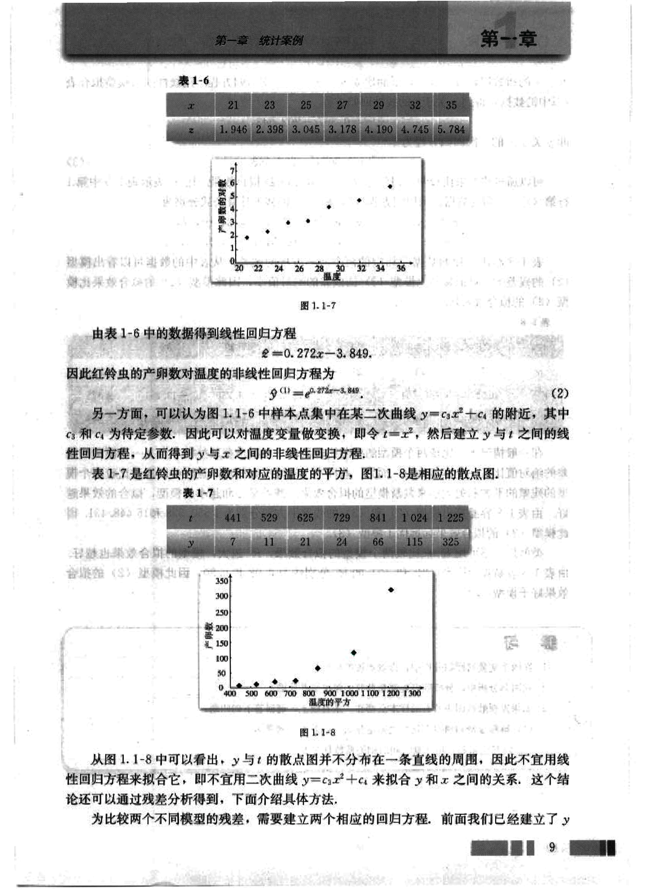
15

# CHAPTER

普通高中课程标准实验教科书 数学 选修 1-2

关于 _x_ 的指数回归方程 (2), 下面建立 _y_ 关于 _x_ 的二次回归方程。用线性回归模型拟合表 1-7 中的数据，得到关于 _x_ 的线性回归方程

$\hat{y}(x) = 0.367x - 202.543,$

即 _y_ 关于 _x_ 的二次回归方程为

$\hat{y}(x) = -0.367x^2 - 202.543.$ (3)

可以通过残差来比较两个回归方程 (2) 和 (3) 的拟合效果。用 $e_i^{(j)}$ 表示表 1-5 中第 1 行第 (_i_ + 1) 列的数据，则回归方程 (2) 和 (3) 的残差计算公式分别为

$e_i^{(1)} = y_i - \hat{y}_i^{(1)} = y_i - e^{0.367x_i - 3.849}$, _i_ = 1, 2, …, 7;

$e_i^{(2)} = y_i - \hat{y}_i^{(2)} = y_i - (-0.367x_i^2 + 202.543)$, _i_ = 1, 2, …, 7.

表 1-8 给出了原始数据及相应的两个回归方程的残差，从表中的数据可以看出模型 (2) 的残差的绝对值显然比模型 (3) 的残差的绝对值小，因此模型 (2) 的拟合效果比模型 (3) 的拟合效果好。

表 1-8

| _x_         | 21     | 23     | 25     | 27      | 29      | 32      | 35     |
| ----------- | ------ | ------ | ------ | ------- | ------- | ------- | ------ |
| _y_         | 7      | 11     | 21     | 24      | 66      | 115     | 325    |
| $e_i^{(1)}$ | 0.557  | -0.101 | 1.875  | -8.950  | 9.230   | -13.381 | 34.675 |
| $e_i^{(2)}$ | 47.696 | 19.400 | -5.832 | -41.000 | -40.104 | -58.265 | 77.968 |

在一般情况下，比较两个模型的残差比较困难，原因是在某些样本点上一个模型的残差的绝对值比另一个模型的小，而另一些样本点的情况则相反。这时可以通过比较两个模型的残差的平方和的大小来判断模型的拟合效果，残差平方和越小的模型，拟合的效果越好。由表 1-8 容易算出模型 (2) 和 (3) 的残差平方和分别为 1550.538 和 15448.431。因此模型 (2) 的拟合效果远远优于模型 (3)。

类似地，还可用 $R^2$ 来比较两个模型的拟合效果，$R^2$ 越大，模型的拟合效果也越好。由表 1-8 容易算出模型 (2) 和 (3) 的 $R^2$ 分别约为 0.98 和 0.80，因此模型 (2) 的拟合效果好于模型 (3)。

## 练习

1. 在两个变量的回归分析中，作散点图的目的是什么？
2. 在回归分析中，分析残差能够帮助我们解决哪些问题？
3. 如果发现散点图中所有的样本点都在一条直线上，请回答下列问题：
   (1) 解释变量和预报变量的关系是什么？残差平方和是多少？
   (2) 解释变量和预报变量之间的相关系数是多少？

10

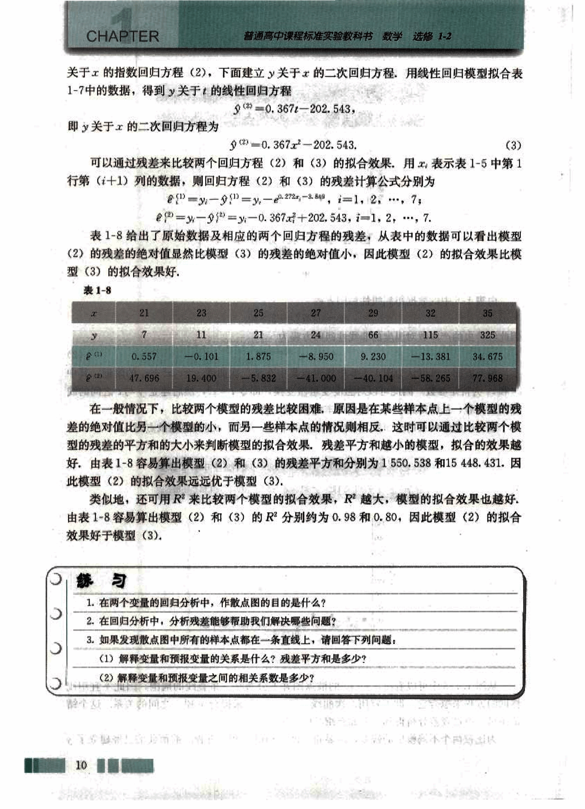
16

# 第一章 统计案例

## 学习题 1.1

1. 1993 年到 2002 年中国的国内生产总值 (GDP) 的数据 (单位: 亿元) 如下:

| 年份 | GDP       |
| ---- | --------- |
| 1993 | 34 634.4  |
| 1994 | 46 759.4  |
| 1995 | 58 478.1  |
| 1996 | 67 884.6  |
| 1997 | 74 462.6  |
| 1998 | 78 345.2  |
| 1999 | 82 067.5  |
| 2000 | 89 468.1  |
| 2001 | 97 314.8  |
| 2002 | 104 790.6 |

(1) 作 GDP 和年份的散点图，根据该图猜想它们之间的关系是什么。

(2) 建立年份为解释变量，GDP 为预报变量的回归模型，并计算残差。

(3) 根据你得到的模型，预报 2003 年的 GDP，看看你的预报与实际 GDP (117 251.9 亿元) 的误差是多少。

(4) 你认为这个模型能较好地刻画 GDP 和年份的关系吗？请说明理由。

2. 收集本班的某一学期的期中和期末数学考试的成绩，二者之间可以用线性模型来描述吗？如果可以，期中成绩能够在多大程度上解释期末的成绩？进一步发现数据中的异常点，分析其形成的原因。

3. 如下表所示，某地区一段时间内观察到的大于或等于某震级的地震个数为 N，试建立回归方程表述二者之间的关系。

| 震级 | 地震数 | 震级 | 地震数 |
| ---- | ------ | ---- | ------ |
| 3    | 28 381 | 5.2  | 746    |
| 3.2  | 20 380 | 5.4  | 604    |
| 3.4  | 14 795 | 5.6  | 435    |
| 3.6  | 10 695 | 5.8  | 274    |
| 3.8  | 7 641  | 6    | 206    |
| 4    | 5 502  | 6.2  | 148    |
| 4.2  | 3 842  | 6.4  | 98     |
| 4.4  | 2 698  | 6.6  | 57     |
| 4.6  | 1 919  | 6.8  | 41     |
| 4.8  | 1 356  | 7    | 25     |
| 5.0  | 973    |      |        |

11

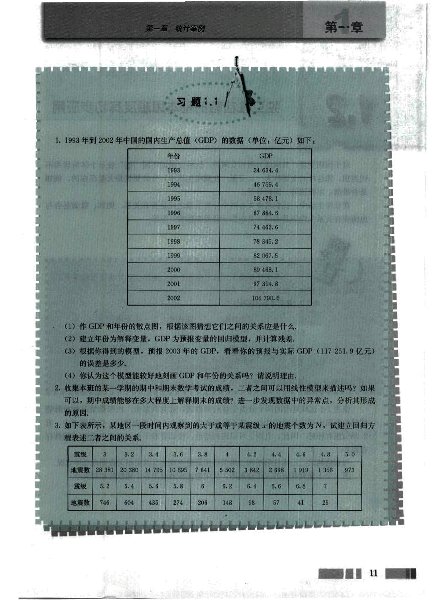
17

# CHAPTER 1

## 1.2 独立性检验的基本思想及其初步应用

对于性别变量，其取值为男和女两种，这种变量的不同“值”表示个体所属的不同类别，像这样的变量称为分类变量。在现实生活中，分类变量是大量存在的，例如是否吸烟，宗教信仰，国籍等等。

在日常生活中，我们常常关心两个分类变量之间是否有关系，例如，吸烟是否与患肺癌有关系？性别是否对于喜欢数学课程有影响？等等。

为调查吸烟是否对患肺癌有影响，某肿瘤研究所随机地调查了 9965 人，得到如下结果(单位：人)：

表 1-9 吸烟与患肺癌列联表

|        | 不患肺癌 | 患肺癌 | 总计  |
| ------ | -------- | ------ | ----- |
| 不吸烟 | 7 775    | 42     | 7 817 |
| 吸烟   | 2 099    | 49     | 2 148 |
| 总计   | 9 874    | 91     | 9 965 |

那么吸烟是否对患肺癌有影响？

像表 1-9 这样列出的两个分类变量的频数表，称为列联表，由吸烟情况和患肺癌情况的列联表可以粗略估计出：在不吸烟者中，有 0.54%患有肺癌；在吸烟者中，有 2.28%患有肺癌，因此，直观上可以得到结论：吸烟者和不吸烟者患肺癌的可能性存在差异。

与表格相比，三维柱形图和二维条形图能更直观地反映出相关数据的总体状况。图 1.2-1 是列联表的三维柱形图，从中能清晰地看出各个频数的相对大小。

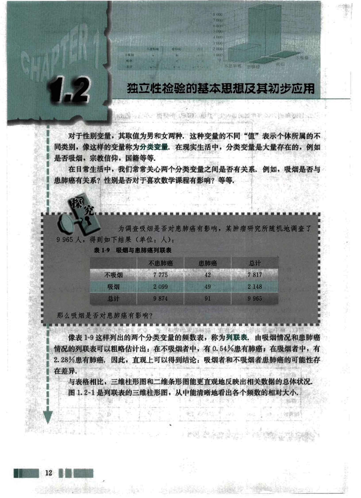
18

# 第一章 统计案例

## 作三维柱形图要注意选择恰当的视角，以使每个柱体都能被看到。

图 1.2-1 是[图 1.2-1](images/1.2-1.png)

图 1.2-2 是叠在一起的二维条形图，其中浅色条高表示不患肺癌的人数，深色条高表示患肺癌的人数。从图中可以看出，吸烟者中患肺癌的比例高于不吸烟者中患肺癌的比例。

[图 1.2-2](images/1.2-2.png)

为了更清晰地表达这个特征，我们还可用如下的等高条形图表示两种情况下患肺癌的比例。如图 1.2-3 所示，在等高条形图中，浅色的条高表示不患肺癌的百分比；深色的条高表示患肺癌的百分比。

[图 1.2-3](images/1.2-3.png)

通过分析数据和图形，我们得到的直观印象是吸烟和患肺癌有关系。那么我们是否能够以一定的把握认为“吸烟与患肺癌有关系”呢？

为了回答上述问题，我们先假设

H₀：吸烟与患肺癌没有关系。

13

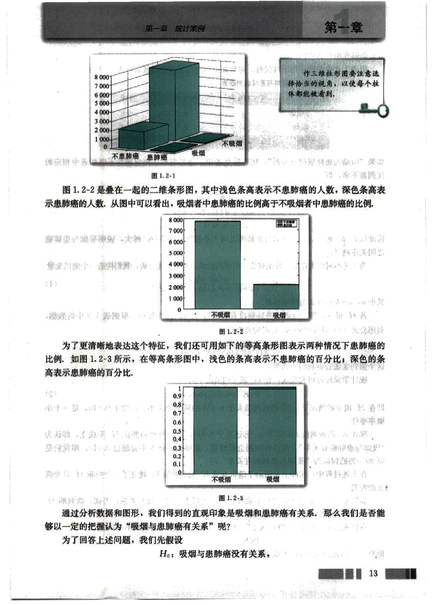
19

# CHAPTER

普通高中课程标准实验教科书 数学 选修 1-2

看看能够推出什么样的结论。

把表 1-9 中的数字用字母代替，得到如下用字母表示的列联表(表 1-10)：

表 1-10 吸烟与患肺癌列联表

|        | 不患肺癌 | 患肺癌 | 总计    |
| :----- | :------- | :----- | :------ |
| 不吸烟 | a        | b      | a+b     |
| 吸烟   | c        | d      | c+d     |
| 总计   | a+c      | b+d    | a+b+c+d |

如果“吸烟与患肺癌没有关系”，则在吸烟者中不患肺癌的比例应该与不吸烟者中相应的比例差不多，即

$\frac{a}{a+b} \approx \frac{c}{c+d}$

$a(c+d) \approx c(a+b)$,

$ad - bc \approx 0$.

因此$|ad - bc|$越小，说明吸烟与患肺癌之间关系越弱；$|ad - bc|$越大，说明吸烟与患肺癌之间关系越强。

为了使不同样本容量的数据有统一的评判标准，基于上述分析，我们构造一个随机变量

$K^2 = \frac{n(ad-bc)^2}{(a+b)(c+d)(a+c)(b+d)}$

其中$n = a+b+c+d$为样本容量。(1)

若$H_0$成立，即“吸烟与患肺癌没有关系”，则$K^2$应该很小。根据表 1-9 中的数据，利用公式(1)计算得到$K^2$的观测值为

$k^2 = \frac{9965(7775 \times 49 - 42 \times 2099)^2}{7817 \times 2148 \times 9874 \times 91} \approx 56.632$.

这个值到底能告诉我们什么呢？

统计学家经过研究发现，在$H_0$成立的情况下，

$P(K^2 \ge 6.635) \approx 0.010$. (2)

即在$H_0$成立的情况下，$K^2$的观测值大于 6.635 的概率非常小，近似于 0.010，是一个小概率事件。

现在$K^2$的观测值$k^2 \approx 56.632$，远远大于 6.635，所以有理由断定$H_0$不成立，即认为“吸烟与患肺癌有关系”，但这种判断会犯错误，犯错误的概率不会超过 0.010，即我们是 以 99%的把握认为“吸烟与患肺癌有关系”的。

在上述过程中，实际上是借助于随机变量$K^2$的观测值 k，建立了一个判断 H_0 是否成立的规则：

如果$k^2 \ge 6.635$，就判断$H_0$不成立，即认为吸烟与患肺癌有关系；否则，就判断$H_0$成立，即认为吸烟与患肺癌没有关系。

在该规则下，把结论“$H_0$成立”错判成“$H_0$不成立”的概率不会超过

$P(K^2 \ge 6.635) \approx 0.010$,

即有 99%的把握认为$H_0$不成立。

14

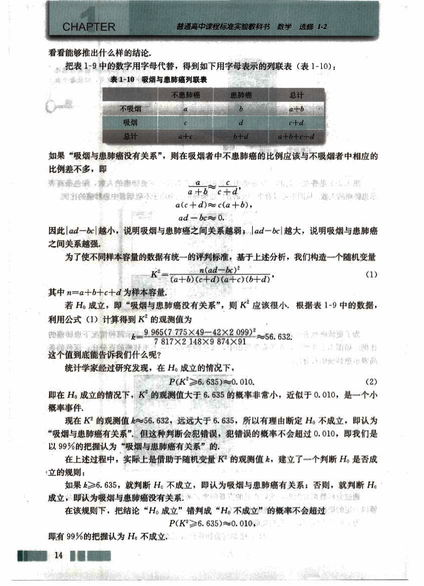
20

# 第一章 统计案例

## 上面解决问题的想法类似于数学上的反证法

要确认是否能以给定的可信程度认为“两个分类变量有关系”，首先假设该结论不成立，即

$H_0$: 两个分类变量没有关系.

在该假设下我们所构造的随机变量$K^2$应该很小，如果由观测数据计算得到的$K^2$的观测值 k 很大，则在一定可信程度上说明$H_0$不成立，即在一定可信程度上认为“两个分类变量有关系”；如果 k 的值很小，则说明由样本观测数据没有发现反对$H_0$的充分理由。

怎样判断$K^2$的观测值是大还是小呢？这仅需确定一个正数$k_c$，当$k≥k_c$时就认为$K^2$的观测值大，此时相应于$H_0$的判断规则为：

如果$k≥k_c$，就认为“两个分类变量有关系”；否则就认为“两个分类变量没有关系”。

我们称这样的$k_c$为一个判断规则的临界值，按照上述规则，把“两个分类变量没有关系”错误地判断为“两个分类变量有关系”的概率为$P(K^2≥k_c)$.

在实际应用中，我们把$k≥k_c$解释为有$(1-P(K^2≥k_c))×100\%$的把握认为“两个分类变量有关系”；把$k<k_c$解释为不能以$(1-P(K^2≥k_c))×100\%$的把握认为“两个分类变量有关系”，或者由样本观测数据不能充分说明“两个分类变量有关系”。

上面这种利用随机变量$K^2$来确定是否能以给定把握认为“两个分类变量有关系”的方法，称为两个分类变量的独立性检验。

## 思考

利用上面的结论，你能从列联表的三维柱形图中看出两个分类变量是否相关吗？

一般地，假设有两个分类变量 X 和 Y，它们的可能取值分别为$\{x_1, x_2\}$和$\{y_1, y_2\}$，其样本频数列联表（称为 2×2 列联表）为：

表 1-11 2×2 列联表

|       | $y_1$ | $y_2$ | 总计    |
| :---- | :---- | :---- | :------ |
| $x_1$ | a     | b     | a+b     |
| $x_2$ | c     | d     | c+d     |
| 总计  | a+c   | b+d   | a+b+c+d |

若要推断的论述为

$H_1$: X 与 Y 有关系，

可以按如下步骤判断$H_1$成立的可能性：

1. 通过三维柱形图和二维条形图，可以粗略地判断两个分类变量是否有关系，但是这种判断无法精确地给出所得结论的可靠程度。
   (1)在三维柱形图中，主对角线上两个柱形高度的乘积 ad 与副对角线上两个柱形高度的乘积 bc 相差越大，$H_1$成立的可能性就越大。
   (2)在二维条形图中，可以估计满足条件 X=$x_1$的个体中具有 Y=$y_1$的个体所占的比

15

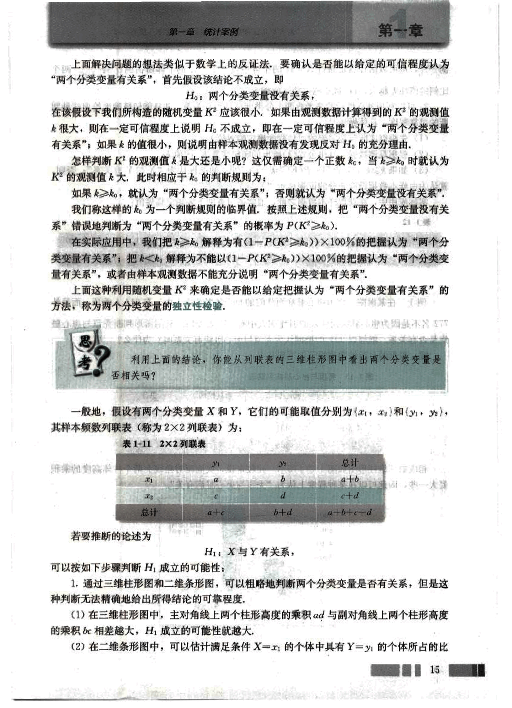
21

# CHAPTER

普通高中课程标准实验教科书 数学 选修 1-2

例 $\frac{\alpha}{a+b}$，也可以估计满足条件 X = x₂ 的个体中具有 Y = y₂ 的个体所占的比例。两个比例的值相差越大，H₁ 成立的可能性就越大。

2. 可以利用独立性检验来考察两个分类变量是否有关系，并且能较精确地给出这种判断的可靠程度。具体做法是：

(1) 先根据实际问题需要的可信程度确定临界值 k₀;

(2) 根据观测数据计算由公式(1)给出的随机变量 K² 的值 k;

(3) 如果 k ≥ k₀，就以(1 - P(K² ≥ k₀)) × 100%的把握认为“X 与 Y 有关系”；否则，就认为由样本数据没有充分的证据显示“X 与 Y 有关系”。

实际应用中，在获取样本数据之前，通常通过查阅下表确定临界值：

表 1-12

| P(K²≥k₀) | 0.50  | 0.40  | 0.25  | 0.15  | 0.10  | 0.05  | 0.025 | 0.010 | 0.005 | 0.001  |
| -------- | ----- | ----- | ----- | ----- | ----- | ----- | ----- | ----- | ----- | ------ |
| k₀       | 0.455 | 0.708 | 1.323 | 2.072 | 2.706 | 3.841 | 5.024 | 6.635 | 7.879 | 10.828 |

例 1 在某医院，因为患心脏病而住院的 665 名男性病人中，有 214 人秃顶；而另外 772 名不是因为患心脏病而住院的男性病人中有 175 人秃顶。利用图形判断秃顶与患心脏病是否有关系，能够以 99%的把握认为秃顶与患心脏病有关系吗？为什么？

解：根据题目所给数据得到如下列联表：

表 1-13 秃顶与患心脏病列联表

|        | 患心脏病 | 患其他病 | 总计 |
| ------ | -------- | -------- | ---- |
| 秃顶   | 214      | 175      | 389  |
| 不秃顶 | 451      | 597      | 1048 |
| 总计   | 665      | 772      | 1437 |

相应的三维柱形图如图[1.2-4](images/1.2-4.png)所示。比较来说，底面副对角线上两个柱体高度的乘积要大一些，因此可以在某种程度上认为“秃顶与患心脏病有关”。

16

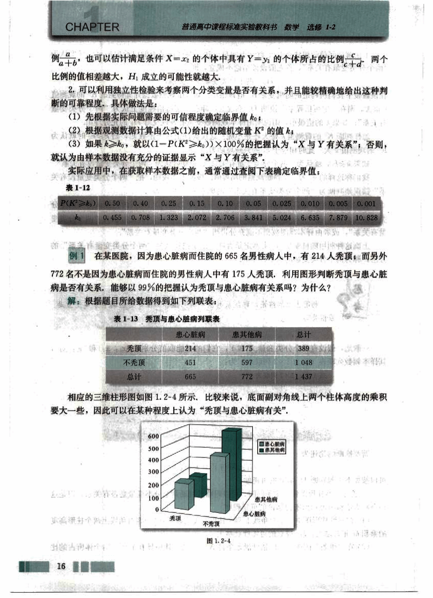
22

# 第一章 统计案例

## 根据列联表 1-13 中的数据，得$K^2$的观测值为

$k = \frac{1437 \times (214 \times 597 - 175 \times 451)^2}{389 \times 1048 \times 665 \times 772} \approx 16.373 > 6.635.$

所以有 99%的把握认为“秃顶与患心脏病有关”。

## 例 2

为考察高中生的性别与是否喜欢数学课程之间的关系，在某城市的某校高中生中随机抽取 300 名学生，得到如下列联表：

表 1-14 性别与喜欢数学课程列联表

|      | 喜欢数学课程 | 不喜欢数学课程 | 总计 |
| ---- | ------------ | -------------- | ---- |
| 男   | 37           | 85             | 122  |
| 女   | 35           | 143            | 178  |
| 总计 | 72           | 228            | 300  |

由表中数据计算得到$K^2$的观测值$k \approx 4.514$。能够以 95%的把握认为高中生的性别与是否喜欢数学课程之间有关系吗？为什么？

解：在假设“性别与是否喜欢数学课程之间没有关系”的前提下，$K^2$应该很小，并且

$P(K^2 \ge 3.841) \approx 0.05,$

而我们所得到的$K^2$的观测值$k \approx 4.514$超过 3.841，这就意味着“性别与是否喜欢数学课程之间有关系”这一结论是错误的可能性约为 0.05，即有 95%的把握认为“性别与是否喜欢数学课程之间有关系”。

## 练习

甲乙两个班级进行一门考试，按照学生考试成绩优秀和不优秀统计成绩后，得到如下的列联表：

班级与成绩列联表

|      | 优秀 | 不优秀 | 总计 |
| ---- | ---- | ------ | ---- |
| 甲班 | 10   | 35     | 45   |
| 乙班 | 7    | 38     | 45   |
| 总计 | 17   | 73     | 90   |

画出列联表的条形图，并通过图形判断成绩与班级是否有关，利用列联表的独立性检验判断，是否能够以 99%的把握认为“成绩与班级有关系”。

17

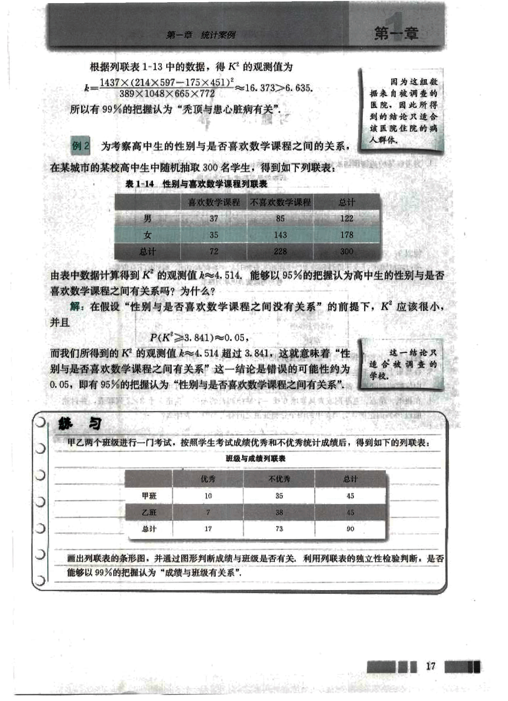
23

# CHAPTER

普通高中课程标准实验教科书 数学选修 1-2

## 习题 1.2

1. 为考察某种药物预防疾病的效果，进行动物试验，得到如下的列联表：

药物效果与动物试验列联表

|          | 患病 | 未患病 | 总计 |
| -------- | ---- | ------ | ---- |
| 服用药   | 10   | 45     | 55   |
| 没服用药 | 20   | 30     | 50   |
| 总计     | 30   | 75     | 105  |

能以 97.5% 的把握认为药物有效吗？为什么？

2. 通过随机询问 72 名不同性别的大学生在购买食物时是否看营养说明，得到如下列联表：

性别与读营养说明列联表

|              | 女  | 男  | 总计 |
| ------------ | --- | --- | ---- |
| 读营养说明   | 16  | 28  | 44   |
| 不读营养说明 | 20  | 8   | 28   |
| 总计         | 36  | 36  | 72   |

能以 99.5% 的把握认为性别与读营养说明之间有关系吗？为什么？

3. 收集班上所有学生身高的数据，构造一个关于每一个学生的性别与其身高是否高于（或低于）中位数的列联表，能以 99% 的把握认为性别与身高有关系吗？为什么？

4. 在报纸、杂志、互联网或者其他地方找一个抽样调查的报告，构造一个 2 × 2 列联表，并讨论能以 95% 的把握认为调查中的两个分类变量之间有关系吗，为什么？

18

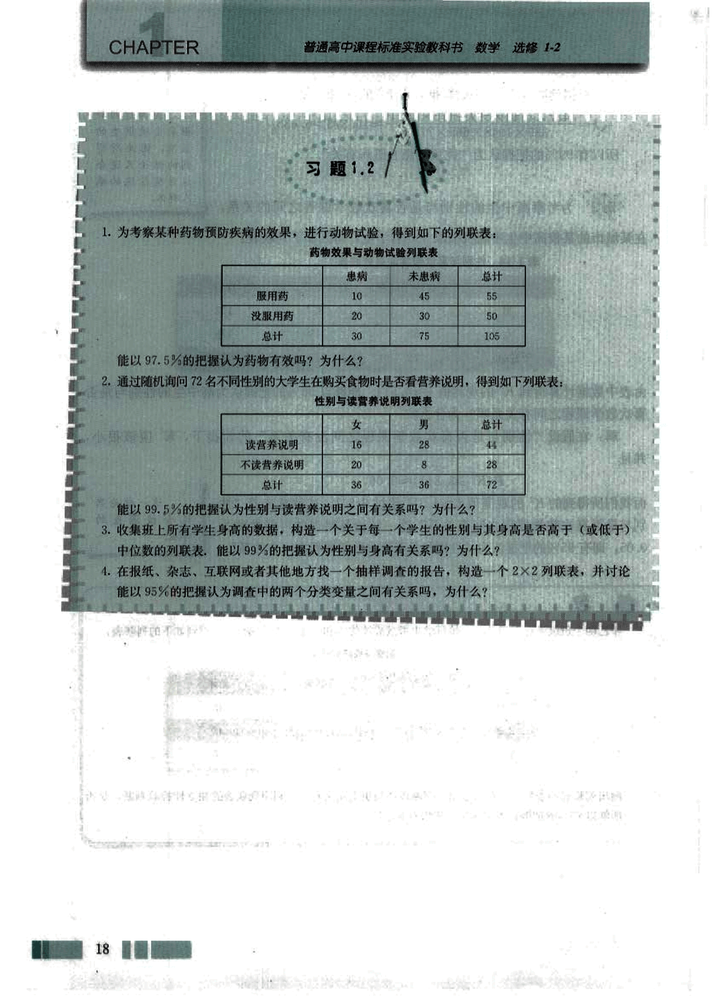
24

# 第一章 统计案例

## 实习作业

在本章中，我们通过几个统计案例了解了一些统计思想。请同学们根据自己对身边事物的观察，通过查阅资料、讨论等方式，确定要研究的统计问题，然后进行抽样调查，收集数据，并进行整理和分析，最后对问题中的规律作出判断。

以下几个问题，供同学们参考：

1. 你们学校学生的体重与身高之间的关系可以用什么模型刻画？

解决这个问题时，要认真思考以下几个问题：
(1) 要研究的问题是什么？
(2) 如何设计抽样方案？
(3) 如何分析数据？
(4) 中能能够得出什么规律？
(5) 与例题中的结果比较，所用的拟合模型相同吗？

2. 中学生喜欢文科还是理科与性别有关吗？是否喜欢看足球比赛与性别有关吗？是否喜欢音乐与性别有关吗？

解决这个问题时，要认真思考以下几个问题：
(1) 要调查的问题是什么？
(2) 如何设计抽样方案？
(3) 如何分析数据？
(4) 中从能够得出什么规律？发现什么问题？

19

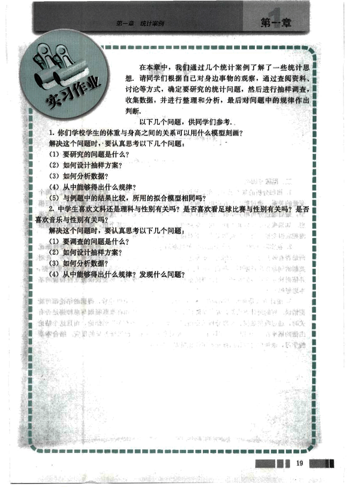
25

# 小结

## 一、本章知识结构

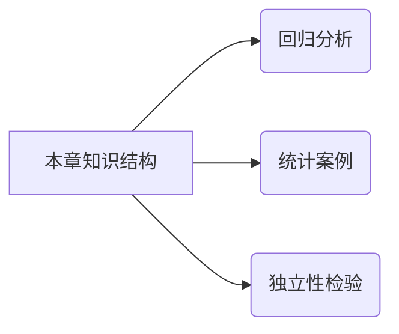
```mermaid
graph LR
    A[本章知识结构] --> B(回归分析);
    A --> C(统计案例);
    A --> D(独立性检验);
```

## 二、回顾与思考

1. 回归分析的基本思想：在必修课程《数学 3》的基础上，我们进一步研究了两个变量的关系，通过散点图直观地了解两个变量的关系，然后通过最小二乘法建立回归模型，最后通过分析相关指数、随机误差等，评价模型的好坏，这就是回归分析的基本思想，如果模型比较好地刻画了两个变量的关系，对自变量的某个值，就可以通过模型预测相应因变量的值，与同学交流一下对最小二乘法的理解。

2. 在实际问题中，经常会面临需要推断的问题，比如研制出一种新药，需要推断此药是否有效？有人怀疑吸烟的人更易患肺癌，那么吸烟是否与肺癌有关呢？等等。在对类似的问题作出推断时，我们不能仅凭主观意愿作出结论，需要通过试验来收集数据，并依据独立性检验的原理做出合理的推断。通过本章的学习，你能谈谈独立性检验的基本思想吗？

3. 统计方法是可能犯错误的：不管是回归分析还是独立性检验，得到的结论都可能犯错误，好的统计方法就是要尽量降低犯错误的概率，比如在推断吸烟与患肺癌是否有关时，通过收集数据、整理分析数据得到“吸烟与患肺癌有关”的结论，而且这个结论出错的概率在 0.01 以下。实际上，这是统计思维与确定性思维差异的反应。结合本章的学习，谈谈你对统计思维和确定性思维差异的理解。

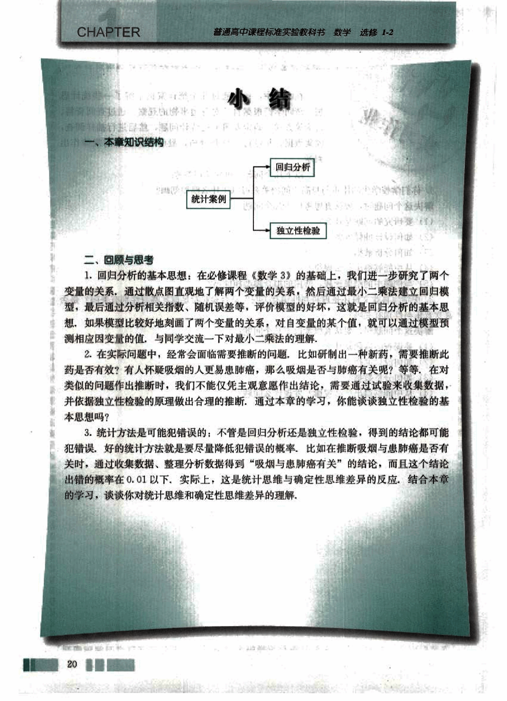
26

# 复习参考题

## A 组

1. 收集 1993 年至 2002 年每年中国人口总数的数据，建立人口与年份的关系，预测 2003 年和 2004 年的人口总数，并计算与实际数据的误差。

2. 假设美国 10 家最大的工业公司提供了以下数据：（单位：百万美元）

| 公司                | 通用汽车 | 福特   | 埃克森 | IBM    | 通用电气 | 美孚   | 菲利普·莫利斯 | 克莱斯勒 | 杜邦   | 德士古 |
| ------------------- | -------- | ------ | ------ | ------ | -------- | ------ | ------------- | -------- | ------ | ------ |
| 销售总额 (百万美元) | 126 974  | 96 933 | 86 656 | 63 438 | 55 264   | 50 976 | 39 069        | 36 156   | 35 209 | 32 416 |
| 利润 (百万美元)     | 4 224    | 3 835  | 3 510  | 3 758  | 3 939    | 1 809  | 2 946         | 359      | 2 480  | 2 413  |

(1) 作销售总额和利润的散点图，根据该图猜想它们之间的关系应是什么形式。

(2) 建立销售总额为解释变量，利润为预报变量的回归模型，并计算残差。

(3) 你认为这个模型能较好地刻画销售总额和利润之间的关系吗？请说明理由。

3. 调查某医院某段时间内婴儿出生的时间与性别的关系，得到下面的数据表，能以 90% 的把握认为婴儿的性别与出生的时间有关系吗？为什么？

| 出生时间 | 晚上 | 白天 | 合计 |
| -------- | ---- | ---- | ---- |
| 性别     |      |      |      |
| 男婴     | 24   | 31   | 55   |
| 女婴     | 8    | 26   | 34   |
| 合计     | 32   | 57   | 89   |

## B 组

1. 若样本点为 ($x_1, y_1$), ($x_2, y_2$), ···, ($x_n, y_n$), $\overline{x} = \frac{1}{n}\sum_{i=1}^{n}x_i$, $\overline{y} = \frac{1}{n}\sum_{i=1}^{n}y_i$，试证明第 3 页的公式 $\sum_{i=1}^{n}(x_i - \overline{x})^2 = \sum_{i=1}^{n}(x_i - \hat{y}_i)^2 + \sum_{i=1}^{n}(\hat{y}_i - \overline{y})^2$。

2. 在线性回归模型中，有 $\sum_{i=1}^{n}(x_i - \overline{x})^2 = \sum_{i=1}^{n}(x_i - \hat{y}_i)^2 + \sum_{i=1}^{n}(\hat{y}_i - \overline{y})^2$。

解释总偏差平方和、回归平方和、残差平方和以及该等式的统计含义。

3. 分别研究数学成绩与物理成绩的关系，数学成绩与语文成绩的关系，你能得到什么结论？

21

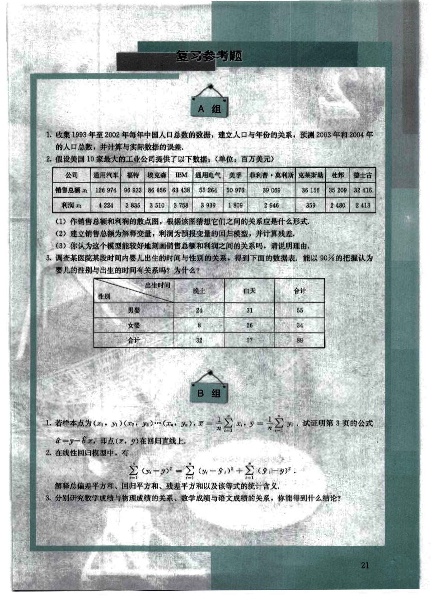
27

# Untitled

2


1 3

$P \implies Q_1 \implies Q_1 \implies Q_2$

A E C D M

$M_1$ $M_2$ $M$

O $N_1$ $N_2$

P $P_2$ $P_1$ O $Q_1$ $R_1$ $Q$ $R$ $Q_2$ $R_2$

“土星绕太阳运行的轨迹为
什么是椭圆？金字塔大约是什么
年代建造的？为什么三角形的内角和
等于 180°？……科学研究需要“推
理与证明”。

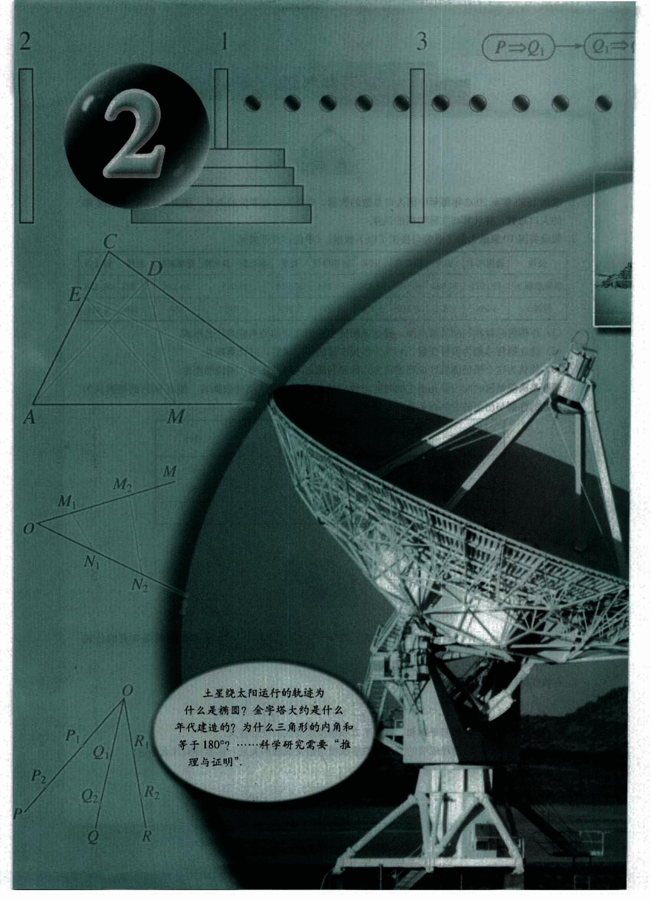
28

# 第二章 推理与证明

## 2.1 合情推理与演绎推理

## 2.2 直接证明与间接证明

在日常活动中，人们常常需要进行这样那样的推理，例如，医生诊断病人的病症，警察侦破案件，气象专家预测天气的可能状态，考古学家推断遗址的年代，数学家论证命题的真伪等等，其中都包含了推理活动。在数学中，证明的过程更离不开推理。

本章我们将学习两种基本的推理——合情推理和演绎推理。合情推理具有猜测和发现新结论、探索和提供解决问题的思路和方向的作用；演绎推理则具有证明结论，整理和建构知识体系的作用，是公理体系中的基本推理方法，因此它们联系紧密、相辅相成，成为获得数学结论的基本手段。同时，我们还将学习证明的两类基本方法——直接证明和间接证明，从中体会证明的功能和特点，了解数学证明的基本方法，感受逻辑证明在数学以及日常生活中的作用，养成言之有理、论证有据的习惯。

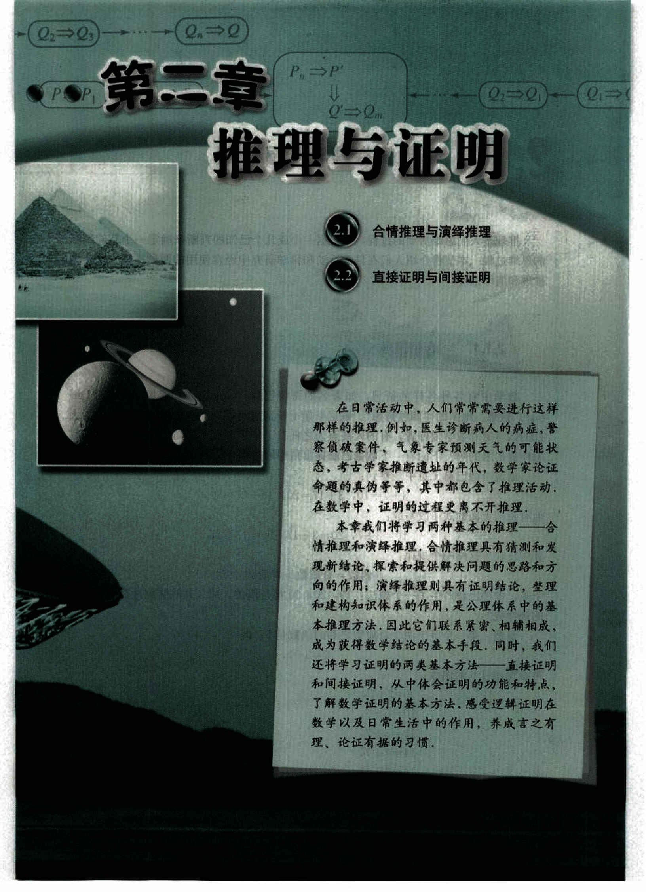
29

# CHAPTER 2

## 2.1 合情推理与演绎推理

推理是人们思维活动的过程，是根据一个或几个已知的判断来确定一个新的判断的思维过程。本节将介绍人们在日常活动和科学研究中经常使用的两种推理——合情推理和演绎推理。

## 2.1.1 合情推理

数学中有各种各样的猜想，如著名的哥德巴赫(Goldbach)猜想、费马(Fermat)猜想、地图的“四色猜想”、哥尼斯堡七桥猜想等等。某些猜想的证明吸引了大量的数学家和数学爱好者，有的人甚至为之耗费了毕生心血。你知道这些数学猜想是怎样提出来的吗？下面看一下哥德巴赫提出猜想的过程。

据说哥德巴赫无意中观察到：

3 + 7 = 10, 3 + 17 = 20, 13 + 17 = 30,

他有意把上面的式子改写成：

10 = 3 + 7, 20 = 3 + 17, 30 = 13 + 17.

其中反映出这样一个规律：

偶数 = 奇质数 + 奇质数.

于是，哥德巴赫产生了一个想法：10，20，30 都是偶数，那么其他偶数是否也有类似的规律呢？

显然，第一个等于两个奇质数之和的偶数是 6，即

6 = 3 + 3.

再看看超过 6 的偶数：

8 = 3 + 5,
10 = 5 + 5,
12 = 5 + 7,
14 = 7 + 7,
16 = 5 + 11,
......
1000 = 29 + 971,

继续这个过程，你能提出一个猜想吗？

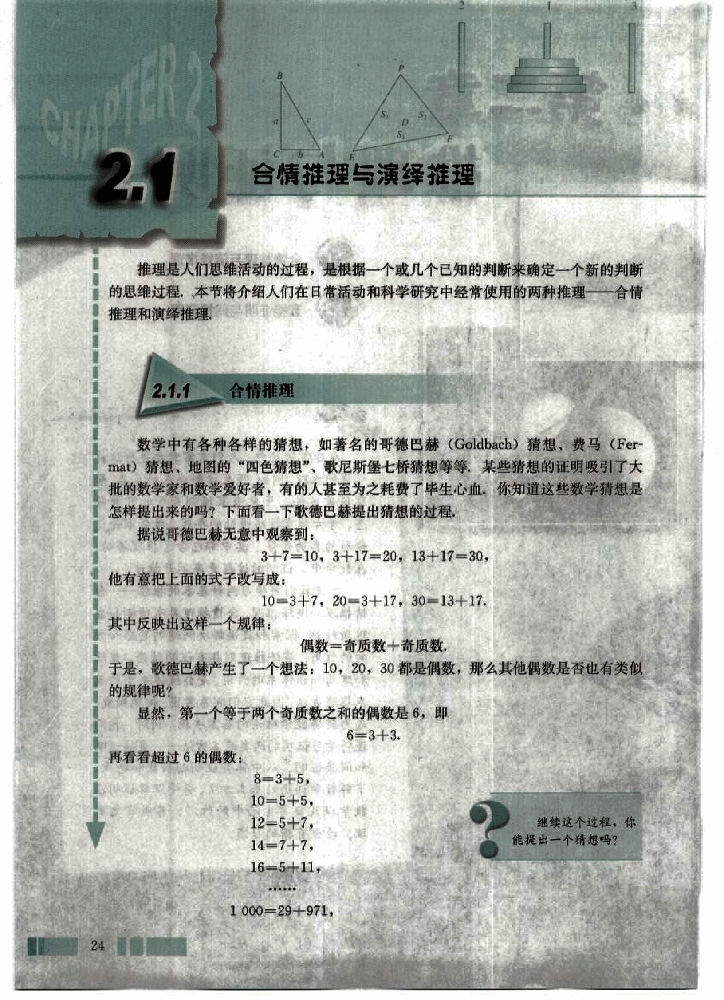
30

# 第二章 推理与证明

1 002 = 139 + 863,

根据上述过程，哥德巴赫大胆地猜想：任何一个不小于 6 的偶数都等于两个奇质数之和，这是正确的吗？多少年来，许多优秀的数学家都在努力证明这个猜想，而且已经取得了很好的进展。

现在，我们来考察一下哥德巴赫提出猜想的推理过程：通过对一些偶数的验证，他发现它们总可以表示成两个奇质数之和，而且没有出现反例，于是，提出猜想——“任何一个不小于 6 的偶数都等于两个奇质数之和”。

这种由某类事物的部分对象具有某些特征，推出该类事物的全部对象都具有这些特征的推理，或者由个别事实概括出一般结论的推理，称为归纳推理（简称归纳），简言之，归纳推理是由部分到整体、由个别到一般的推理。

例如，由铜、铁、铝、金、银等金属能导电，归纳出“一切金属都能导电”，这就是归纳推理。在统计学中，我们总是从所研究的对象全体中抽取一部分进行观测或试验以取得信息，从而对整体做出推断，这也是归纳推理。

应用归纳推理可以发现新事实，获得新结论。下面是一个数学中的例子。

## 例 1

观察图 2.1-1，可以发现：

1 = 1²

1 + 3 = 4 = 2²

1 + 3 + 5 = 9 = 3²

1 + 3 + 5 + 7 = 16 = 4²

1 + 3 + 5 + 7 + 9 = 25 = 5²

……

由上述具体事实能得出怎样的结论？

解：将上述事实分别叙述如下：

1 等于 1 的平方；

前 2 个正奇数的和等于 2 的平方；

前 3 个正奇数的和等于 3 的平方；

前 4 个正奇数的和等于 4 的平方；

前 5 个正奇数的和等于 5 的平方；

……

由此猜想：前 _n_ (*n*∈N*) 个连续正奇数的和等于 *n\* 的平方，即

1 + 3 + … + (2*n* - 1) = *n*²

## 例 2

已知数列{a<sub>n</sub>}的第 1 项 a<sub>1</sub> = 1，且 a<sub>n+1</sub> = $\frac{a_n}{1+a_n}$ (_n_ = 1, 2, 3, …)，试归纳出这个数列的通项公式

25

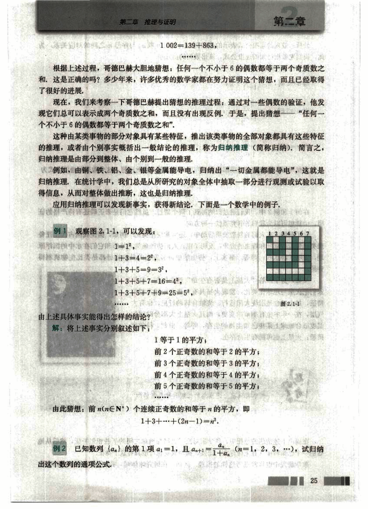
31

# CHAPTER

普通高中课程标准实验教科书 数学 选修 1-2

分析：数列的通项公式表示的是数列{$a_n$}的第$n$项 $a_n$ 与序号$n$之间的对应关系。为此，我们先根据已知的递推公式，算出数列的前几项。

解：当$n=1$时，$a_1=1$；

当$n=2$时，$a_2 = \frac{1}{1+1} = \frac{1}{2}$；

当$n=3$时，$a_3 = \frac{1}{1+\frac{1}{2}} = \frac{2}{3}$；

当$n=4$时，$a_4 = \frac{1}{1+\frac{1}{3}} = \frac{3}{4}$；

观察可得，数列的前 4 项都等于相应序号的倒数，由此猜想，这个数列的通项公式为

$a_n = \frac{1}{n}$

在例 1 和例 2 中，我们通过归纳得到了两个猜想，虽然它们是否正确还有待严格的证明，但猜想可以为我们的研究提供一种方向。

除了归纳，在人们的创造发明活动中，还常常应用类比，例如，据说我国古代工匠鲁班类比带齿的草叶和蝗虫的齿牙，发明了锯；人们仿照鱼类的外形和它们在水中的沉浮原理，发明了潜水艇；等等。事实上，仿生学中许多发明的最初构想都是类比生物机制得到的。

又如，为了回答“火星上是否有生命”这个问题，科学家们把火星与地球作类比，发现火星具有一些与地球类似的特征，如火星也是围绕太阳运行、绕轴自转的行星，也有大气层，在一年中也有季节的变更，而且火星上大部分时间的温度适合地球上某些已知生物的生存，等等。由此，科学家猜想：火星上也可能有生命存在。

科学家做出上述猜想的推理过程是怎样的？

在提出上述猜想的过程中，科学家对比了火星与地球之间的某些相似特征，然后从地球的一个已知特征（有生命存在）出发，猜测火星也可能具有这个特征。

数学研究中也常常进行这样的推理，例如，在研究球体时，我们会自然地联想到圆。

26

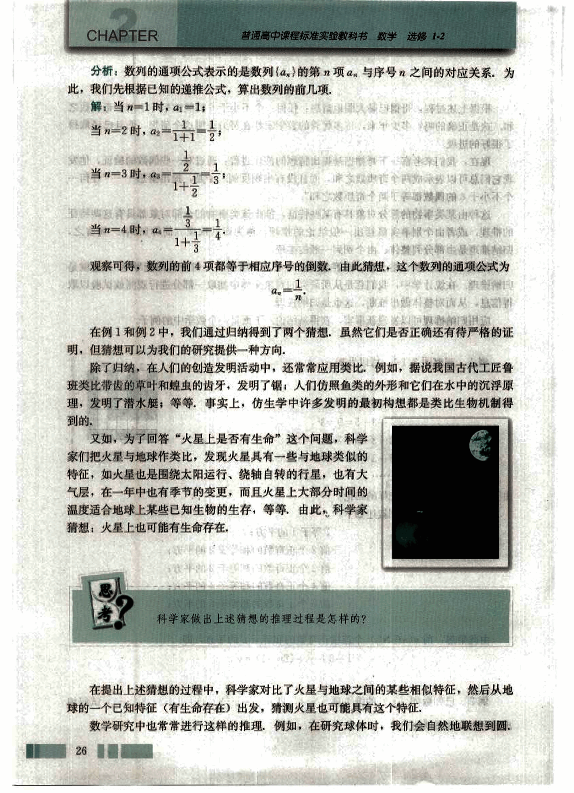
32

# 第二章 推理与证明

对于圆，我们已经有了比较充分的研究，定义了圆的一些概念，发现了圆的一些性质（表 2-1）。由于球与圆在形状上和概念上都有类似的地方，即都具有完美的对称性，都是到定点的距离等于定长的点的集合，因此我们推测对于圆的特征，球也可能具有。

例如，圆有切线，切线与圆只交于一点，切点到圆心的距离等于圆的半径；对于球，我们推测可能存在这样的平面，与球只交于一点，该点到球心的距离等于球的半径；平面内不共线的 3 个点确定一个圆，由此猜想空间中不共面的 4 个点确定一个球；等等。

类比圆的特征，填写表 2-1 中球的相关特征，并说说推理的过程。

表 2-1

| 圆的概念和性质                                                            | 球的类似概念和性质 |
| ------------------------------------------------------------------------- | ------------------ |
| 圆的周长                                                                  |                    |
| 圆的面积                                                                  |                    |
| 圆心与弦（非直径）中点的连线垂直于弦。                                    |                    |
| 与圆心距离相等的两弦相等，与圆心距离不等的两弦不等，距圆心较近的弦较长。  |                    |
| 以点($x_0, y_0$)为圆心，r 为半径的圆的方程为$(x-x_0)^2 + (y-y_0)^2 = r^2$ |                    |

这种由两类对象具有某些类似特征和其中一类对象的某些已知特征，推出另一类对象也具有这些特征的推理称为类比推理（简称类比）。简言之，类比推理是由特殊到特殊的推理。

开普勒 (Kepler, 1571—1630) 说：“我珍视类比胜过任何别的东西，它是我最可信赖的老师，它能揭示自然的秘密。”

在数学中，我们可以由已经解决的问题和已经获得的知识出发，通过类比提出新问题和作出新发现。例如，数学家波利亚 (Polya) 曾指出：“类比是一个伟大的引路人，求解立体几何问题往往有赖于平面几何中的类比问题。”数学中还有向量与数的类比，无限与有限的类比，不等与相等的类比，等等。

例 3 类比实数的加法和乘法，列出它们相似的运算性质。

分析：实数的加法和乘法都是由两个数参与的运算，都满足一定的运算律，都存在逆运算，而且“0”和“1”分别在加法和乘法中占有特殊的地位，因此，我们可以从上述 4 个方面来类比这两种运算。

27

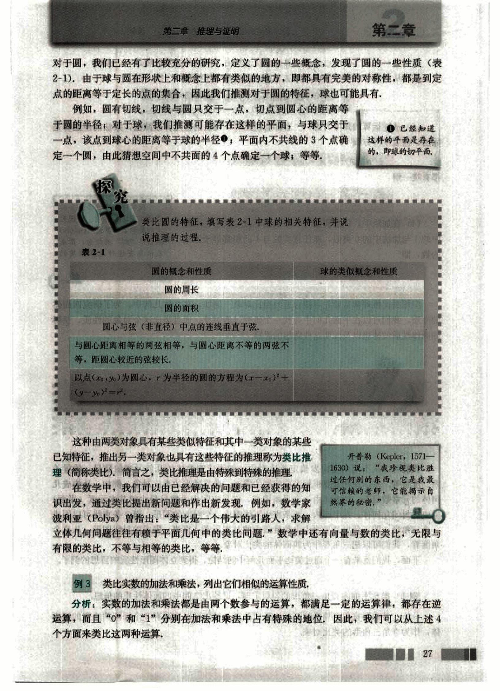
33

# CHAPTER

普通高中课程标准实验教科书 数学 选修 1-2

解：(1) 两个实数经过加法运算或乘法运算后，所得的结果仍然是一个实数。

(2) 从运算律的角度考虑，加法和乘法都满足交换律和结合律，即

$a+b=b+a$

$(a+b)+c=a+(b+c)$

$ab=ba$

$(ab)c=a(bc)$

(3) 从逆运算的角度考虑，二者都有逆运算，加法的逆运算是减法，乘法的逆运算是除法，这就使得方程

$a+x=0$

$ax=1 (a≠0)$

都有唯一解

$x=-a$

$x=\frac{1}{a}$

(4) 在加法中，任意实数与 0 相加都不改变大小；乘法中的 1 与加法中的 0 类似，即任意实数与 1 的积都等于原来的数，即

$a+0=a$

$a·1=a$

数学中还有许多集合具有这 4 条运算性质，法国天才的数学家伽罗瓦 (Galois) 提出了“群”的概念，用来表示具有这种运算性质的集合。

应用类比推理常常要先寻找合适的类比对象。例如，在立体几何中，为了研究四面体的性质，我们可以在平面几何中寻找一个研究过的对象，通过类比这个对象的性质，获得四面体性质的猜想以及证明这些猜想的思路。

你认为平面几何中的哪一类图形可以作为四面体的类比对象？

我们可以从不同角度出发确定类比对象，如围成四面体的几何元素的数目、位置关系、度量等。基本原则是要根据当前问题的需要，选择适当的类比对象。例如，从构成几何体的元素数目看，四面体由 4 个平面围成，它是空间中由数目最少的基本元素（平面）围成的封闭几何体；在平面内，两条直线不能围成一个封闭的图形，而 3 条直线可以围成一个三角形，即三角形是平面内由数目最少的基本元素（直线）围成的封闭图形，从这个角度看，我们可以把三角形作为四面体的类比对象。

下面，我们就来看一个通过类比平面几何中的结论，得到立体图形性质的猜想的例子。

例 4 类比平面内直角三角形的勾股定理，试给出空间中四面体性质的猜想。

分析：考虑到直角三角形的两条边互相垂直，我们可以选取有 3 个面两两垂直的四面体，作为直角三角形的类比对象。

28

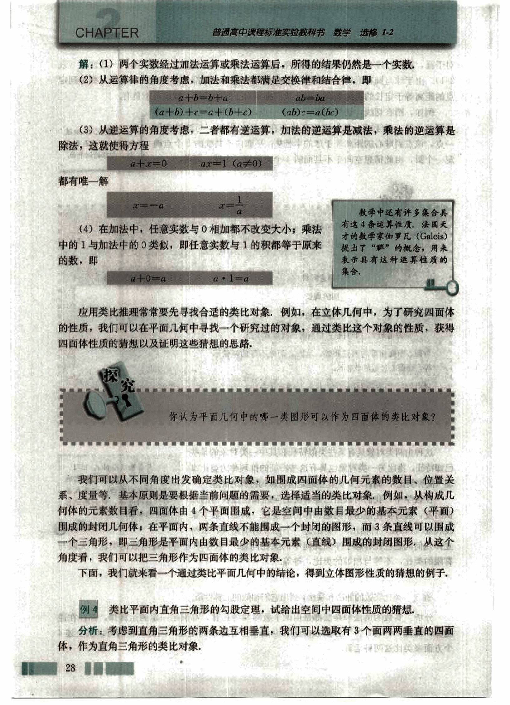
34

# 第二章 推理与证明

## 解:

如图 2.1-2(1)所示,在 Rt△ABC 中,∠C=90°.设*a*, _b_, *c*分别表示 3 条边的长度,由勾股定理,得

$c²= a²+b²$.


类似地,在四面体 P-DEF 中,∠PDF=∠PDE=∠EDF=90°,设*S<sub>1</sub>*, _S<sub>2</sub>_, *S<sub>3</sub>*和*S*分别表示 △PDF, △PDE, △EDF 和 △PEF 的面积(图 2.1-2(2)),相应于图 2.1-2(1)中直角三角形的 2 条直角边*a*, *b*和 1 条斜边*c*. 图 2.1-2(2)中的四面体有 3 个“直角面”_S<sub>1</sub>_, _S<sub>2</sub>_, *S<sub>3</sub>*和 1 个“斜面”_S_. 于是,类比勾股定理的结构,我们猜想

$S² = S_1² + S_2² + S_3²$

成立.

? 这个结论是正确的吗?请同学们自己证明.

我们把上面所进行的推理过程概括为:

| 步骤                   | 描述 |
| ---------------------- | ---- |
| 从具体问题出发         |      |
| 观察、分析、比较、联想 |      |
| 归纳、类比             |      |
| 提出猜想               |      |

可见,归纳推理和类比推理都是根据已有的事实,经过观察、分析、比较、联想,再进行归纳、类比,然后提出猜想的推理,我们把它们统称为合情推理(plausible reasoning).通俗地说,合情推理是指“合乎情理”的推理,数学研究中,得到一个新结论之前,合情推理常常能帮助我们猜测和发现结论;证明一个数学结论之前,合情推理常常能为我们提供证明的思路和方向.

下面再来看一个例子.

> 法国数学家拉普拉斯(Laplace, 1749—1827)曾经说过:“即使在数学里,发现真理的主要工具也是归纳和类比,”

## 例 5

如图 2.1-3 所示,有三根针和套在一根针上的若干金属片,按下列规则,把金属片从一根针上全部移到另一根针上.


29

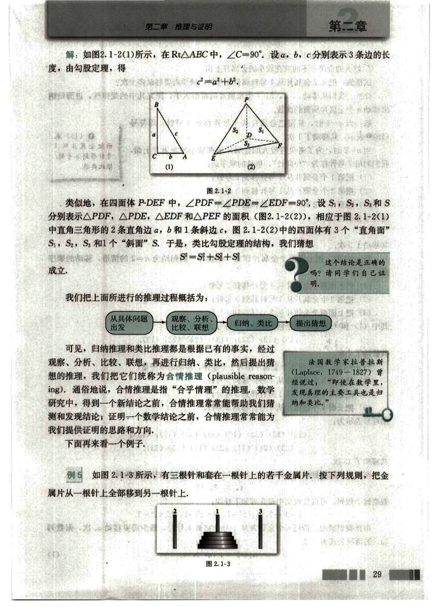
35

# CHAPTER 3

1. 每次只能移动 1 个金属片;
2. 较大的金属片不能放在较小的金属片上面.

试推测:把 _n_ 个金属片从 1 号针移到 3 号针,最少需要移动多少次?

分析:我们从移动 1, 2, 3, 4 个金属片的情形入手,探究其中的规律性,进而归纳出移动 _n_ 个金属片所需的次数.

解:当 _n_ =1 时,只需把金属片从 1 号针移到 3 号针,用符号 (13)● 表示,共移动了 1 次.

当 _n_ =2 时,为了避免将较大的金属片放在较小的金属片上面,我们利用 2 号针作为“中间针”,移动的顺序是:
(1) 把第 1 个金属片从 1 号针移到 2 号针;
(2) 把第 2 个金属片从 1 号针移到 3 号针;
(3) 把第 1 个金属片从 2 号针移到 3 号针.

用符号表示为: (12) (13) (23).

共移动了 3 次.

当 _n_ =3 时,把上面两个金属片作为一个整体,则归结为 _n_ =2 的情形,移动的顺序是:
(1) 把上面两个金属片从 1 号针移到 2 号针;
(2) 把第 3 个金属片从 1 号针移到 3 号针;
(3) 把上面两个金属片从 2 号针移到 3 号针.

其中(1)和(3)都需要借助中间针,用符号表示为:

(13) (12) (32); (13); (21) (23) (13).

共移动了 7 次.

当 _n_ =4 时,把上面 3 个金属片作为一个整体,移动的顺序是:
(1) 把上面 3 个金属片从 1 号针移到 2 号针;
(2) 把第 4 个金属片从 1 号针移到 3 号针;
(3) 把上面 3 个金属片从 2 号针移到 3 号针.

用符号表示为:

(12) (13) (23) (12) (31) (32) (12); (13); (23) (21) (31) (23) (12) (13) (23).

共移动了 15 次.

至此,我们得到依次移动 1, 2, 3, 4 个金属片所需次数构成的数列 1, 3, 7, 15.

观察这个数列,可以发现其中蕴含着如下规律:

1 = $2^1 - 1$, 3 = $2^2 - 1$, 7 = $2^3 - 1$, 15 = $2^4 - 1$.

由此我们猜想:若把 _n_ 个金属片从 1 号针移到 3 号针,最少需要移动 $a_n$ 次,则数列 {$a_n$} 的通项公式为

$a_n = 2^n - 1$ ($n \in N^+$).

(1)

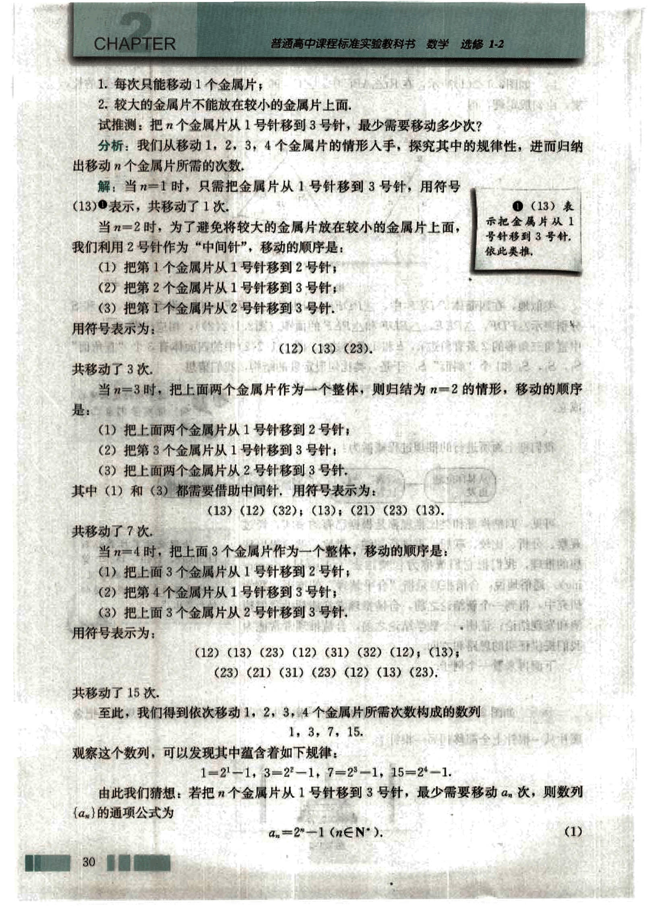
36

# 第二章 推理与证明

## 探究

把 $n$ 个金属片从 1 号针移到 3 号针，怎样移动才能达到最少的移动次数呢？

通过探究上述 $n=1,2,3,4$ 时的移动方法，我们可以归纳出对 $n$ 个金属片都适用的移动方法。当移动 $n$ 个金属片时，可分为下列 3 个步骤：

(1) 将上面 $(n-1)$ 个金属片从 1 号针移到 2 号针；

(2) 将第 $n$ 个金属片从 1 号针移到 3 号针；

(3) 将上面 $(n-1)$ 个金属片从 2 号针移到 3 号针。

这样就把移动 $n$ 个金属片的任务，转化为移动两次 $(n-1)$ 个金属片和移动一次第 $n$ 个金属片的任务，而移动 $(n-1)$ 个金属片需要移动两次 $(n-2)$ 个金属片和移动一次第 $(n-1)$ 个金属片，移动 $(n-2)$ 个金属片需要移动两次 $(n-3)$ 个金属片和移动一次第 $(n-2)$ 个金属片……如此继续，直到转化为移动 1 个金属片的情形。根据这个过程，可得递推公式

$\begin{cases} a_1=1,\\ a_n=2a_{n-1}+1 \end{cases} (n∈N^*,且n>1).$

从这个递推公式出发，可以证明 (1) 式是正确的。

一般来说，由合情推理所获得的结论，仅仅是一种猜想，未必可靠。

例如，法国数学家费马观察到

$2^2+1=5,$

$2^4+1=17,$

$2^8+1=257,$

$2^{16}+1=65537$

都是质数，于是他用归纳推理提出猜想：任何形如 $2^{2^n}+1(n∈N^*)$ 的数都是质数，这就是著名的费马猜想。半个世纪之后，善于计算的欧拉 (Euler) 发现，第 5 个费马数

$F_4=2^{16}+1=4294967297=641×6700417$

不是质数，从而推翻了费马的猜想。

同样地，类比推理所得的结论也不一定可靠。例如，分别类比得到猜想

“平面内，两组对边分别相等的四边形是平行四边形”

“平面内，同时垂直于一条直线的两条直线互相平行”

“空间中，两组对边分别相等的四边形是平行四边形”

“空间中，同时垂直于一条直线的两条直线互相平行”.

显然，这两个猜想都是错误的。

31

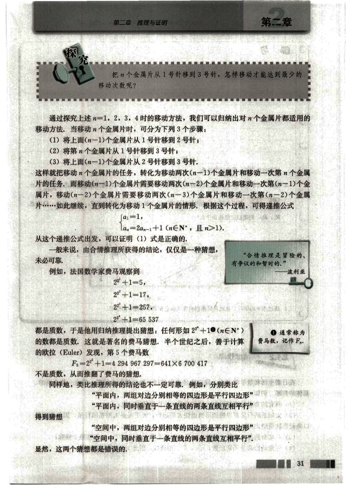
37

# CHAPTER 2 练习

1. 在数列{$a_n$}中，$a_1=1$，$a_n = \frac{1}{2}(a_{n-1} + a_{n+1})$ ($n \ge 2$)，试猜想这个数列的通项公式。

2. 观察下面的“三角形阵”:

```
    1
   1 1
  1 2 1
 1 3 3 1
1 4 6 4 1
1 10 45 ... 45 10 1
```

试找出相邻两行数之间的关系。

3. 如图，若射线 OM，ON 上分别存在点 $M_1$，$M_2$ 与点 $N_1$，$N_2$，则三角形面积之比 $\frac{S_{\triangle OM_1N_1}}{S_{\triangle OM_2N_2}} = \frac{OM_1 \cdot ON_1}{OM_2 \cdot ON_2}$。若不在同一平面内的射线 OP，OQ 和 OR 上分别存在点 $P_1$，$P_2$，点 $Q_1$，$Q_2$ 和点 $R_1$，$R_2$，则类似的结论是什么？


4. 通过本节的学习，说说合情推理的含义和它在数学发现中的作用。

# 2.1.2 演绎推理

在日常生活和数学学习中，我们还经常以某些一般的判断为前提，得出一些个别的、具体的判断，例如：

(1) 所有的金属都能够导电，铀是金属，所以铀能够导电；

(2) 太阳系的行星都以椭圆形轨道绕太阳运行，天王星是太阳系的行星，因此天王星以椭圆形轨道绕太阳运行；

(3) 一切奇数都不能被 2 整除，($2^{100}+1$) 是奇数，所以 ($2^{100}+1$) 不能被 2 整除；

(4) 三角函数都是周期函数，$tan\alpha$ 是三角函数，因此 $tan\alpha$ 是周期函数；

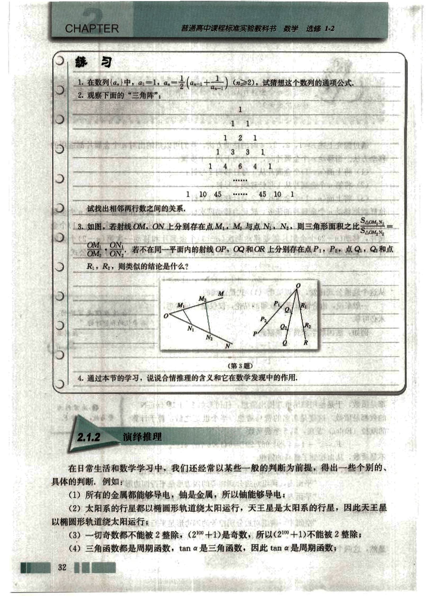
38

# 第二章 推理与证明

## (5) 两条直线平行，同旁内角互补，如果 ∠A 与 ∠B 是两条平行直线的同旁内角，那么 ∠A+∠B=180°.

上面的推理都是从一般性的原理出发，推出某个特殊情况下的结论，我们把这种推理称为**演绎推理**(demonstrative reasoning).

简言之，演绎推理是由一般到特殊的推理。

<div style="text-align: right;">
● 演绎推理<br>
又称逻辑推理
</div>

上面列举的演绎推理的例子都有三段，称为“三段论”，其中第一段称为“大前提”，如“所有的金属都能够导电”，讲的是一个一般的原理；第二段称为“小前提”，如“铀是金属”，指的是一种特殊情况；第三段称为“结论”，如“铀能够导电”，是所得的结论。

“三段论”是演绎推理的一般模式，包括：

(1) 大前提——已知的一般原理；
(2) 小前提——所研究的特殊情况；
(3) 结论——根据一般原理，对特殊情况做出的判断。

<div style="text-align: center;">
思考？
<br>
你能再举出一些用“三段论”推理的例子吗？
</div>

数学的证明主要是通过演绎推理来进行的，我们来看一个例子。

## 例 6 如图 2.1-4 所示，在锐角三角形 ABC 中，AD⊥BC，BE⊥AC，D，E 是垂足，求证：AB 的中点 M 到 D，E 的距离相等。

[图 2.1-4](images/2.1-4.png)

**证明：**

(1) 因为有一个内角是直角的三角形是直角三角形，

在 △ABD 中，AD⊥BC，即 ∠ADB=90°，

所以 △ABD 是直角三角形。

同理，△ABE 也是直角三角形。

大前提
小前提
结论

(2) 因为直角三角形斜边上的中线等于斜边的一半，

而 M 是 Rt△ABD 斜边 AB 的中点，DM 是斜边上的中线，

所以 DM = $\frac{1}{2}$AB.

同理，EM = $\frac{1}{2}$AB.

所以，DM=EM.

“三段论”可以表示为

大前提
小前提
结论

33

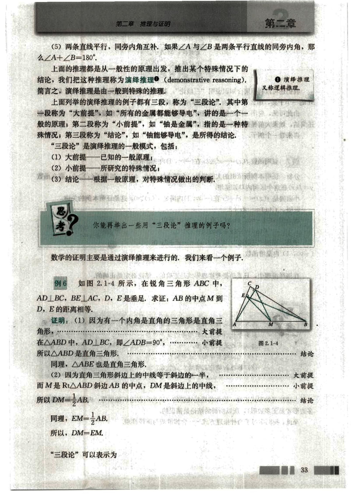
39

# CHAPTER 2

普通高中课程标准实验教科书 数学 选修 1-2

大前提: M 是 P.
小前提: S 是 M.
结论: S 是 P.

我们还可以利用集合知识说明“三段论”:若集合 M 的所有元素都具有性质 P，S 是 M 的一个子集，那么 S 中所有元素也都具有性质 P.

由此可见，应用三段论解决问题时，首先应该明确什么是大前提和小前提，但为了叙述简洁，如果大前提是显然的，则可以省略。

再来看一个例子.

## 例 7 证明函数 $f(x) = -x^2 + 2x$ 在 $(-\infty, 1)$ 内是增函数

**分析:** 证明本例所依据的大前提是: 在某个区间 $(a, b)$ 内，如果 $f'(x) > 0$，那么函数 $y = f(x)$ 在这个区间内单调递增.

**小前提** 是 $f(x) = -x^2 + 2x$ 在 $(-\infty, 1)$ 内满足 $f'(x) > 0$，这是证明本例的关键.

**证明:** $f'(x) = -2x + 2$.

因为当 $x \in (-\infty, 1)$ 时，有 $1 - x > 0$，所以
$f'(x) = -2x + 2 = 2(1 - x) > 0$.

于是，根据“三段论”，可知 $f(x) = -x^2 + 2x$ 在 $(-\infty, 1)$ 内是增函数.

还有其他的证明方法吗？

在演绎推理中，只要前提和推理形式是正确的，结论必定是正确的.

思 考？

因为所有边长都相等的凸多边形是正多边形，…… 大前提
而菱形是所有边长都相等的凸多边形，…… 小前提
所以菱形是正多边形. …… 结论

(1) 上面的推理形式正确吗？
(2) 推理的结论正确吗？为什么？

上述推理的形式正确，但大前提是错误的（因为所有边长都相等，内角也都相等的凸多边形才是正多边形），所以所得的结论是错误的.

至此，我们学习了两种推理方式——合情推理与演绎推理.

34

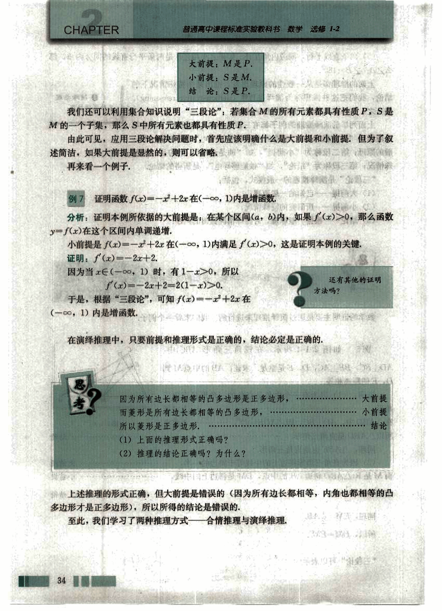
40

# 第二章 推理与证明

## 合情推理与演绎推理的主要区别是什么？

归纳和类比是常用的合情推理，从推理形式上看，归纳是由部分到整体、个别到一般的推理，类比是由特殊到特殊的推理；而演绎推理是由一般到特殊的推理。从推理所得的结论来看，合情推理的结论不一定正确，有待进一步证明；演绎推理在前提和推理形式都正确的前提下，得到的结论一定正确。

人们在认识世界的过程中，需要通过观察、实验等获取经验；也需要辨别它们的真伪，或将积累的知识加工、整理，使之条理化、系统化。合情推理和演绎推理分别在这两个环节中扮演着重要角色。

就数学而言，演绎推理是证明数学结论、建立数学体系的重要思维过程，但数学结论、证明思路等的发现，主要靠合情推理。因此，我们不仅要学会证明，也要学会猜想。

## 练习

1. 将本节开始的演绎推理(2)～(5)写成三段论的形式。

2. 证明：通项公式为 $a_n = cq^n (cq \ne 0)$ 的数列 $\{a_n\}$ 是等比数列，并分析证明过程中的三段论。

3. 如图，在 △ABC 中，AC>BC，CD 是 AB 边上的高，求证 ∠ACD>∠BCD。

证明：在 △ABC 中，因为 CD⊥AB，AC>BC，
所以 AD>BD，
于是 ∠ACD>∠BCD。

指出上面证明过程中的错误。

[第 3 题](images/3.png)

4. 通过本节的学习，说说演绎推理的含义和它的作用。

## 科学发现中的推理

合情推理不仅在数学发现中发挥着重要作用，在其他自然科学的重大发现（如行星运行三定律、生物进化论、元素周期表、原子的内部结构等等）中，也扮演着重要角色。这是因为自然科学是研究自然界的各种物质和现象的科学，要想揭示自然界的规律，就必须

35

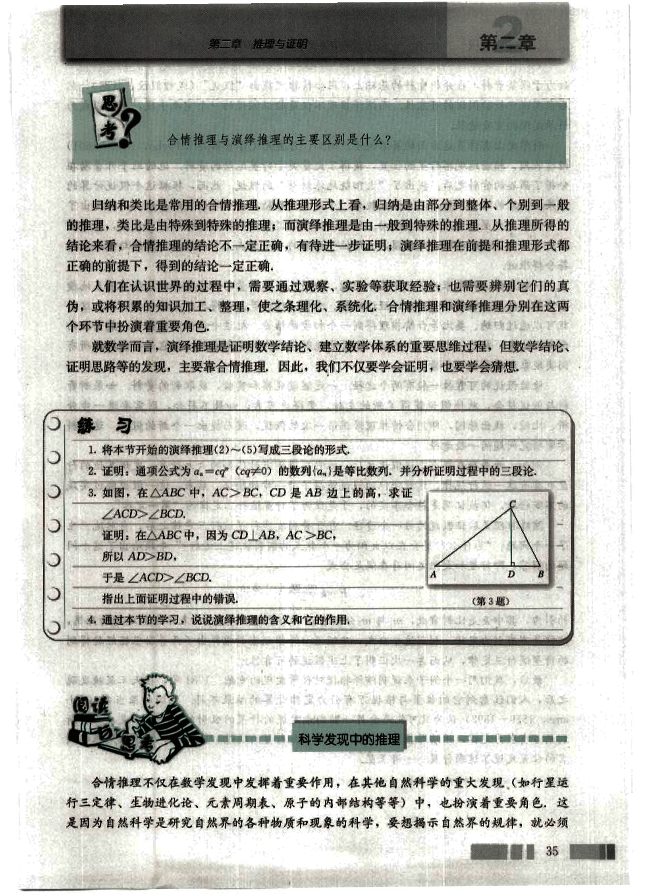
41

# CHAPTER 2

致力于收集资料，在分析资料的基础上，用合情推理提出“假说”（或称假设、猜想），然后在实践中检验假说的可靠性，而演绎推理不仅是验证假说的一个重要手段，也可以成为科学发现的重要途径。

## 科学史上的例子

科学史上有许多这方面的著名例子。例如，丹麦天文学家第谷 (Tycho, 1546—1601) 经过长期、精密地观察行星的位置，获得了大量关于行星运动的资料。他的助手开普勒在分析了第谷的资料之后，提出了“太阳绕地球转动”的假说。然而，根据这个假说计算的结果与观察的结果不符，而且误差较大。于是，开普勒在进一步研究的基础上，又提出了一个假说：火星绕太阳作圆周运动。但是，这个假说仍然与观察所得不符。最后，开普勒提出了“火星的运动轨道是椭圆，太阳位于椭圆的一个焦点上”的假说，结果与观察资料符合得很好。

## 科学研究的一般途径

一般来说，科学家为了研究某个问题，必须先通过大量的观察或实验，尽可能多地收集资料；然后对资料进行整理，经过比较、分析、综合等，获得思想上的一个飞跃。这时就可以通过归纳、类比等合情推理得到一个初步的结论，把这个结论用最简单、最全面的形式提出来，就是一个假说。不过，尽管它能解释已有的全部资料，但它是否能解释所有同类现象还需要进一步验证。

检验假说的可靠性一般有两个途径：一是继续观察和实验，获取新的资料。如果新资料与假说符合，就使假说获得了新的支持，变得更可靠；如果不符合，则需要进一步分析、比较，找出原因，即用合情推理修正第一次的假说，进而提出一个新的假说。这是科学家研究问题的一般途径。

例如，开普勒在提出上述假说之后，把它应用于当时已知的六大行星，发现其他的行星也具有这一运行规律，这就使他的假说获得了进一步的验证。后来，这一假说经过实践的不断检验，仍被证明是符合事实的，于是成为了行星运行三定律的“第一定律”。

演绎推理是验证假说的另一个途径。在开普勒发现行星运行三定律之后，自然地产生了一个问题：“为什么行星会在以太阳为一个焦点的椭圆轨道上运行？”牛顿给出了这个问题的解答，即行星和太阳之间存在满足公式

$F = k \frac{m_1 m_2}{r^2}$

的引力，其中 k 是比例常数，$m_1$ 与 $m_2$ 分别表示两个物体的质量，r 表示它们之间的距离。这就是万有引力定律。利用这个公式，牛顿用演绎推理重新推算出了开普勒根据经验得到的行星运行三定律，从而再一次证明了上述假说的可靠性。

最后，我们用一个例子来说明演绎推理对科学发现的贡献。1781 年，在天王星被发现之后，人们注意到它的位置与根据万有引力定律计算的结果不符。英国的亚当斯 (Adams, 1819—1892) 认为这可能是受另一颗尚未发现的行星的吸引的结果。于是，亚当斯利用万有引力定律，用演绎推理推算出了这颗未知行星的轨道。1846 年，人们果然根据预言的位置发现了这颗行星——海王星。

36

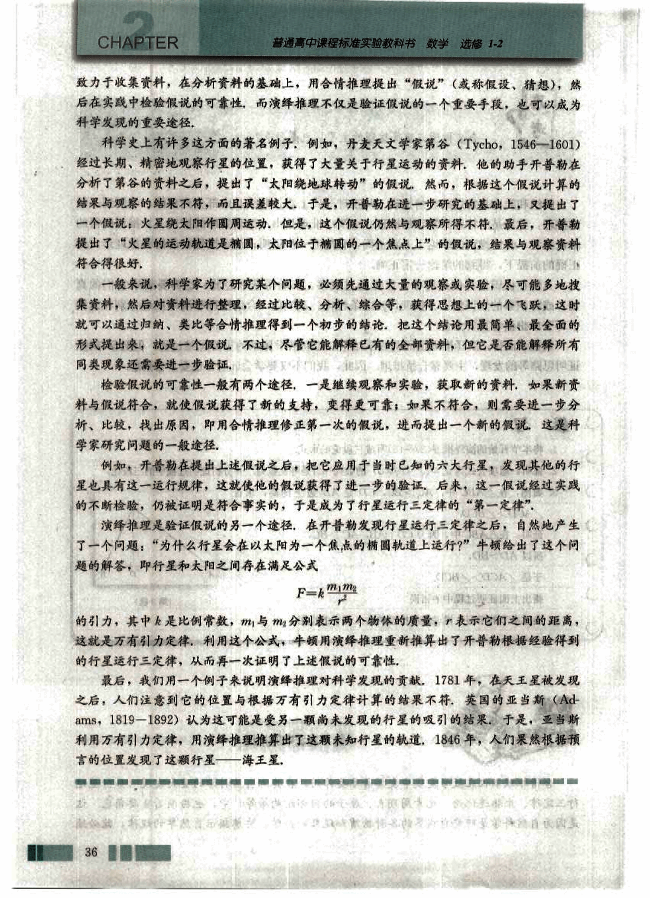
42

# 第二章 推理与证明

## 习题 2.1

**A 组**

1. 观察: 5<sup>3</sup> - 1 = 24, 7<sup>3</sup> - 1 = 48, 11<sup>3</sup> - 1 = 120, 13<sup>3</sup> - 1 = 168,… 所得的结果都是 24 的倍数，继续试验，你能得到什么猜想？

2. 在数列{a<sub>n</sub>}中，a<sub>1</sub> = 1, a<sub>n+1</sub> =  (n∈N<sup>\*</sup>)，试猜想这个数列的通项公式。

3. 探求凸多面体的面数 F、顶点数 V 和棱数 E 之间的关系。

| 凸多面体 | 面数(F) | 顶点数(V) | 棱数(E) |
| -------- | ------- | --------- | ------- |
| 三棱柱   | 5       | 6         | 9       |
| 长方体   | 6       | 8         | 12      |
| 五棱柱   | 7       | 10        | 15      |
| 三棱锥   | 4       | 4         | 6       |
| 四棱锥   | 5       | 5         | 8       |
| 五棱锥   | 6       | 6         | 10      |

4. 对于任意正整数 n，猜想 2<sup>n</sup>-1 与(n+1)<sup>2</sup>的大小关系。

5. 在 △ABC 中，不等式  成立；在四边形 ABCD 中，不等式  成立；在五边形 ABCDE 中，不等式  成立。猜想在 n 边形 A<sub>1</sub>A<sub>2</sub>…A<sub>n</sub>中，有怎样的不等式成立。

6. 在等差数列{a<sub>n</sub>}中，若 a<sub>1</sub> = 0，则有
   a<sub>1</sub> + a<sub>2</sub> + … + a<sub>n</sub> = a<sub>1</sub> + a<sub>2</sub> + … + a<sub>m</sub> (n < 19, 且 n ∈ N<sup>\*</sup>)
   成立，类比上述性质，在等比数列{b<sub>n</sub>}中，若 b<sub>1</sub> = 1，则存在怎样的等式？

7. 用三段论证明：在梯形 ABCD 中，AD//BC，AB = DC，则 ∠B = ∠C。

**B 组**

1. 已知数列{a<sub>n</sub>}的前 n 项和为 S<sub>n</sub>，a<sub>n</sub> = ，满足 S<sub>n</sub> + S<sub>n+1</sub> + 2 = a<sub>n</sub> (n ≥ 2)，计算 S<sub>1</sub>，S<sub>2</sub>，S<sub>3</sub>，S<sub>4</sub>，并猜想 S<sub>n</sub>的表达式。

2. 在学习函数时，我们将它与数类比；在学习数列时，我们将它与函数类比。你在学习的过程中还经历过哪些类比活动？

3. 找一个你感兴趣的数学定义、公式或定理，探究它的来源，你也可以通过翻阅书籍、上网查找资料寻求依据。

37

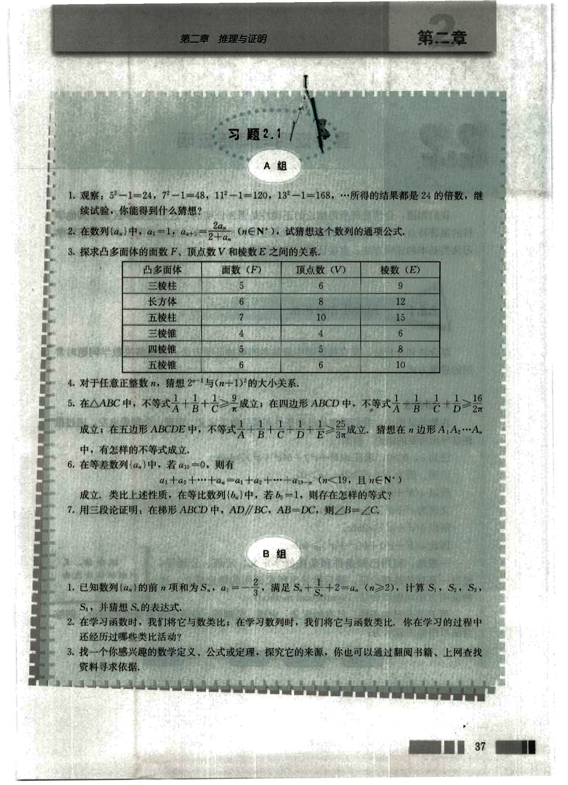
43

# CHAPTER 2

## 2.2 直接证明与间接证明

我们知道，合情推理所得结论的正确性是需要证明的，这正是数学区别于其他学科的显著特点，数学结论的正确性必须通过逻辑推理的方式加以证明。本节我们将学习两类基本的证明方法：直接证明与间接证明。

### 2.2.1 综合法和分析法

综合法和分析法，是直接证明中最基本的两种证明方法，也是解决数学问题时常用的思维方式。

1. **综合法**

在数学证明中，我们经常从已知条件和某些数学定义、定理、公理等出发，通过推理推导出所要的结论，例如：

已知 $a, b > 0$，求证 $a(b^2 + c^2) + b(c^2 + a^2) \geq 4abc$。

证明：因为 $b^2 + c^2 \geq 2bc$，$a > 0$，

所以 $a(b^2 + c^2) \geq 2abc$。

又因为 $c^2 + a^2 \geq 2ac$，$b > 0$，

所以 $b(c^2 + a^2) \geq 2abc$。

因此 $a(b^2 + c^2) + b(c^2 + a^2) \geq 4abc$。

一般地，利用已知条件和某些数学定义、定理、公理等，经过一系列的推理论证，最后推导出所要证明的结论成立，这种证明方法叫做综合法 (synthetical method)。

<div style="text-align: right;">综合法，又叫顺推证法或由因导果法。</div>

用 P 表示已知条件、已有的定义、定理、公理等，Q 表示所要证明的结论，则综合法可用框图表示为：

$P \implies Q_1 \implies Q_2 \implies Q_3 \implies ... \implies Q_n \implies Q$

38

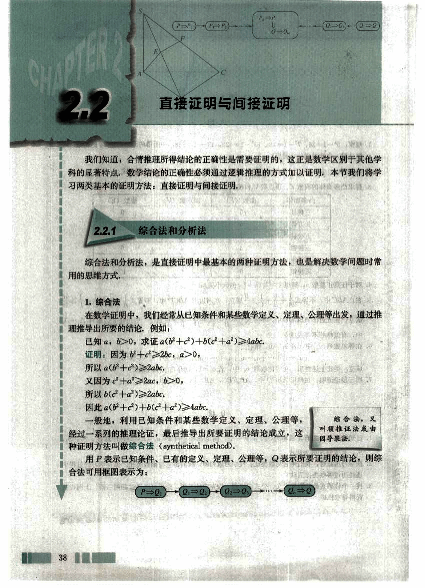
44

# 第二章 推理与证明

## 例 1

如图 2.2-1 所示，△ABC 在平面 α 外，AB∩α=P，BC∩α=Q，AC∩α=R，求证 P，Q，R 三点共线。

**分析:** 本例的条件表明，P，Q，R 三点既在平面 α 内，又在平面 ABC 内，所以可以利用两个相交平面的公理证明。

**证明:** 因为 AB∩α=P，BC∩α=Q，AC∩α=R，所以

P，Q，R∈α；

P∈AB，Q∈BC，R∈AC，

由 ② 得 P，Q，R∈ 平面 ABC。

因此 P，Q，R 是平面 ABC 与平面 α 的公共点，

因为两平面相交有且只有一条交线，所以 P，Q，R 三点在平面 ABC 与平面 α 的交线上，即 P，Q，R 三点共线。

## 例 2

在 △ABC 中，设 CB=a，CA=b，求证$S_{\triangle ABC} = \frac{1}{2}\sqrt{|a|^2|b|^2 - (a \cdot b)^2}$。

**分析:** 由条件 CB=a，CA=b，可得 △ABC 中 CB=|a|，CA=|b|，C 为向量 a 与 b 的夹角，于是可以想到$a \cdot b = |a||b|\cos C$和$S_{\triangle ABC} = \frac{1}{2}|a||b|\sin C$。利用$\sin C = \sqrt{1 - \cos^2C}$经适当转化就可以获得结论。

**证明:** 因为$S_{\triangle ABC} = \frac{1}{2}|a||b|\sin C$，

所以$S_{\triangle ABC}^2 = \frac{1}{4}|a|^2|b|^2\sin^2C = \frac{1}{4}|a|^2|b|^2(1 - \cos^2C) = \frac{1}{4}|a|^2|b|^2(1 - (\frac{a \cdot b}{|a||b|})^2) = \frac{1}{4}|a|^2|b|^2[1 - (\frac{(a \cdot b)^2}{|a|^2|b|^2})] = \frac{1}{4}[|a|^2|b|^2 - (a \cdot b)^2]$。

于是$S_{\triangle ABC} = \frac{1}{2}\sqrt{|a|^2|b|^2 - (a \cdot b)^2}$。

## 例 3

在 △ABC 中，三个内角 A，B，C 的对边分别为 a，b，c，且 A，B，C 成等差数列，a，b，c 成等比数列，求证 △ABC 为等边三角形。

**分析:** 将 A，B，C 成等差数列，转化为符号语言就是 2B=A+C；a，b，c 成等比数列，转化为符号语言就是$b^2 = ac$。A，B，C 为 △ABC 的内角，这是一个隐含条件，明确表示出来是 A+B+C=π。此时，如果能把角和边统一起来，那么就可以进一步寻找角和

39

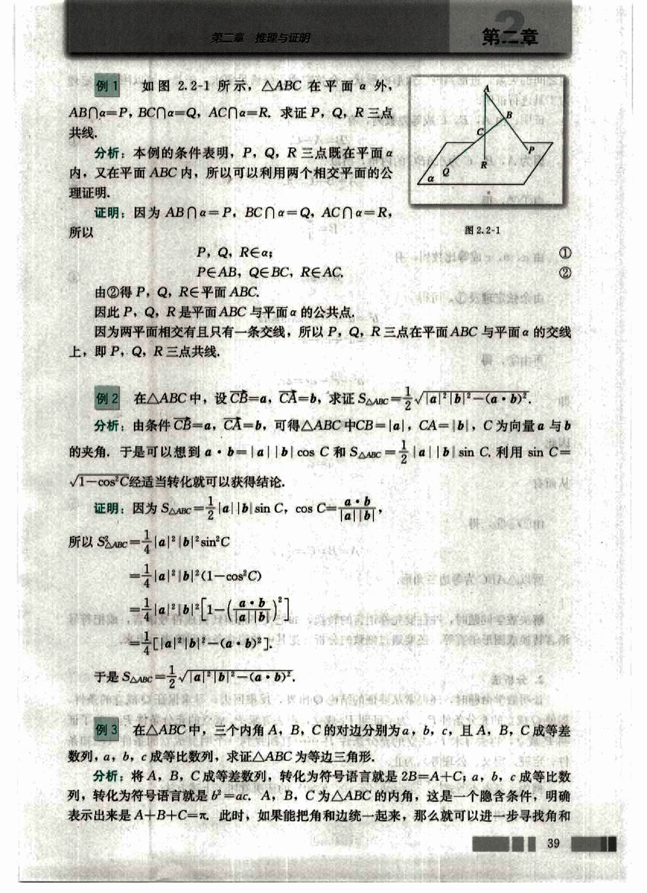
45

# CHAPTER

普通高中课程标准实验教科书 数学 选修 1-2

边之间的关系，进而判断三角形的形状，余弦定理正好满足要求，于是，可以用余弦定理为工具进行证明。

证明：由 A，B，C 成等差数列，有
2B = A + C. ①

因为 A，B，C 为 △ABC 的内角，所以
A + B + C = π. ②

由 ①②，得
$B = \frac{\pi}{3}$ ③

由 a，b，c 成等比数列，有
$b^2 = ac$. ④

由余弦定理及 ③，可得
$b^2 = a^2 + c^2 - 2ac\cos B$
$= a^2 + c^2 - ac$.

再由 ④，得
$a^2 + c^2 - ac = ac$.
$(a - c)^2 = 0$,
$a = c$.

A = C. ⑤

由 ②③⑤，得
$A = B = C = \frac{\pi}{3}$.

所以 △ABC 为等边三角形。

解决数学问题时，往往要先作语言的转换，如把文字语言转换成符号语言，或把符号语言转换成图形语言等，还要通过细致的分析，把其中的隐含条件明确表示出来。

2. 分析法

证明数学命题时，还经常从要证的结论 Q 出发，反推回去，寻求保证 Q 成立的条件，即使 Q 成立的充分条件 P₁.为了证明 P₁ 成立，再去寻求 P₁ 成立的充分条件 P₂;为了证明 P₂ 成立，再去寻求 P₂ 成立的充分条件 P₃……直到找到一个明显成立的条件（已知条件、定理、定义、公理等）为止。

例如，基本不等式$\frac{a+b}{2} \ge \sqrt{ab} (a>0, b>0)$的证明就用了上述方法。

为了证明

40

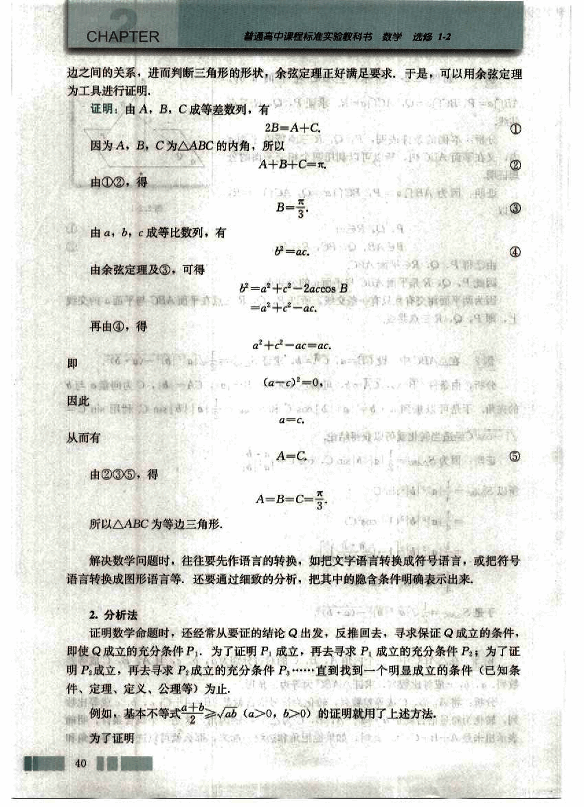
46

# 第二章 推理与证明

##

只需证

只需证

只需证

$\frac{a+b}{2} \ge \sqrt{ab}$

$a+b \ge 2\sqrt{ab}$

$a+b-2\sqrt{ab} \ge 0$

$(\sqrt{a}-\sqrt{b})^2 \ge 0$

由于$(\sqrt{a}-\sqrt{b})^2 \ge 0$显然成立，因此原不等式成立。

一般地，从要证明的结论出发，逐步寻求使它成立的充分条件，直至最后，把要证明的结论归结为判定一个明显成立的条件（已知条件、定理、定义、公理等），这种证明的方法叫做分析法(analytical method)。

用 Q 表示要证明的结论，则分析法可用框图表示为：

$Q \Leftarrow P_1 \Leftarrow P_2 \Leftarrow P_3 \Leftarrow \dots$ 得到一个明显成立的条件

分析法，又叫逆推证法或执果索因法，

## 例 4 求证$\sqrt{3}+\sqrt{7}<2\sqrt{5}$

**分析**: 从待证不等式不易发现证明的出发点，因此我们直接从待证不等式出发，分析其成立的充分条件。

**证明**: 因为$\sqrt{3}+\sqrt{7}$和$2\sqrt{5}$都是正数，所以为了证明

$\sqrt{3}+\sqrt{7}<2\sqrt{5}$

$(\sqrt{3}+\sqrt{7})^2 < (2\sqrt{5})^2$

只需证

只需证

$10+2\sqrt{21}<20$

即证

即证

即证

$2\sqrt{21}<10$

$\sqrt{21}<5$

$21<25$

因为$21<25$显然成立，所以原不等式成立。

在本例中，由于我们很难想到从“$21<25$”入手，所以用综合法证明比较困难。

41

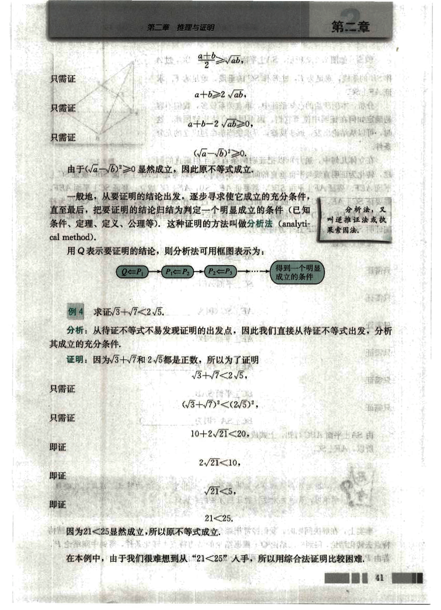
47

# CHAPTER 2

## 例 5

如图 2.2-2 所示，SA⊥ 平面 ABC，AB⊥BC，过 A 作 SB 的垂线，垂足为 E，过 E 作 SC 的垂线，垂足为 F。求证 AF⊥SC。

### 分析：

本例所给的已知条件中，垂直关系较多，我们不容易确定如何在证明中使用它们，因而用综合法比较困难。这时，可以从结论出发，逐步反推，寻求使当前命题成立的充分条件。

在立体几何中，通常可以把证明两条直线互相垂直的问题，转化为证明直线与平面垂直的问题。本例中，可以考虑证 AF⊥ 平面 SBC 或证 SC⊥ 平面 AEF。要证 AF⊥ 平面 SBC，需要证 AFSB，AF⊥BC 成立；要证 SC⊥ 平面 AEF，需要证 SCAE，SC⊥EF 成立。而已知条件“过 E 作 SC 的垂线，垂足为 F（转化为符号语言就是 EF⊥SC）”已经满足了 SC⊥ 平面 AEF 所需要的两个条件中的一个，因此可以朝证明 SC⊥ 平面 AEF 这个方向努力。

### 证明：

要证 AF⊥SC，

只需证 SC⊥ 平面 AEF，

只需证 AE⊥SC （因为**\_**），

只需证 AE⊥ 平面 SBC，

只需证 AE⊥BC （因为**\_**），

只需证 BC⊥ 平面 SAB，

只需证 BC⊥SA （因为**\_**），

由 SA⊥ 平面 ABC 可知，上式成立。

所以，AF⊥SC。

### 思考？

请对综合法与分析法进行比较，说出它们各自的特点。回顾以往的数学学习，说说你对这两种证明方法的新认识。

事实上，在解决问题时，我们经常把综合法和分析法结合起来使用：根据条件的结构特点去转化结论，得到中间结论 Q’；根据结论的结构特点去转化条件，得到中间结论 P’。若由 P’可以推出 Q’成立，就可以证明结论成立。下面来看一个例子，

42

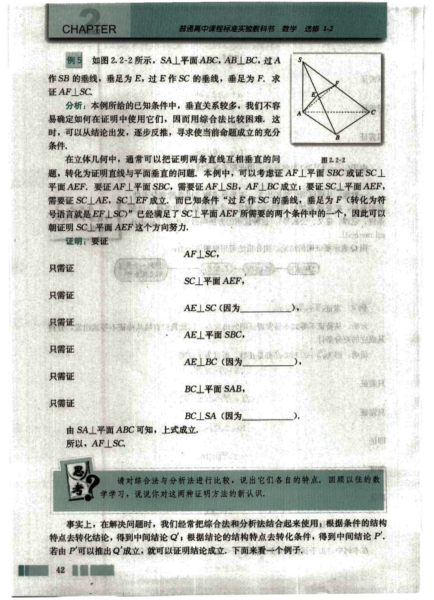
48

# 第二章 推理与证明

## 例 6

已知 $α, β ≠ kπ + \frac{π}{2} (k∈Z)$，且

$\sin θ + \cos θ = 2\sin α$, ①

$\sin θ \cdot \cos θ = \sin^2 β$, ②

求证：$\frac{1 - \tan^2 α}{1 + \tan^2 α} = \frac{1 - \tan^2 β}{2(1 + \tan^2 β)}$

**分析：**比较已知条件和结论，发现结论中没有出现角$θ$，因此第一步工作可以从已知条件中消去$θ$。观察已知条件的结构特点，发现其中蕴含数量关系$(\sin θ + \cos θ)^2 - 2\sin θ \cos θ = 1$，于是，由 ① - 2 × ② 得 $4\sin^2 α - 2\sin^2 β = 1$。

把$4\sin^2 α - 2\sin^2 β = 1$ 与结论相比较，发现角相同，但函数名称不同，于是尝试转化结论：统一函数名称，即把正切函数化为正(余)弦函数，把结论转化为$\cos^2 α - \sin^2 α = \frac{1}{2}(\cos^2 β - \sin^2 β)$，再与$4\sin^2 α - 2\sin^2 β = 1$ 比较，发现只要把$\cos^2 α - \sin^2 α = \frac{1}{2}(\cos^2 β - \sin^2 β)$ 中的角的余弦转化为正弦，就能达到目的。

**证明：**因为$(\sin θ + \cos θ)^2 - 2\sin θ \cos θ = 1$，所以将 ①② 代入，可得

$4\sin^2 α - 2\sin^2 β = 1$。③

另一方面，要证

$\frac{1 - \tan^2 α}{1 + \tan^2 α} = \frac{1 - \tan^2 β}{2(1 + \tan^2 β)}$

即证

$\frac{1 - \sin^2 α}{\cos^2 α} = \frac{1 - \sin^2 β}{2(1 + \sin^2 β)}$

即证

$\cos^2 α - \sin^2 α = \frac{1}{2}(\cos^2 β - \sin^2 β)$

即证

$1 - 2\sin^2 α = \frac{1}{2}(1 - 2\sin^2 β)$

即证

$4\sin^2 α - 2\sin^2 β = 1$

由于上式与 ③ 相同，于是问题得证。

用$P$表示已知条件、定义、定理、公理等，用$Q$表示要证明的结论，则上述过程可用框图表示为：

$P_r ⇒ P_1 ⇒ P_2 ⇒ ... ⇒ P_n ⇒ U ⇒ Q'_m ⇒ ... ⇒ Q_2 ⇒ Q_1 ⇒ Q$

43

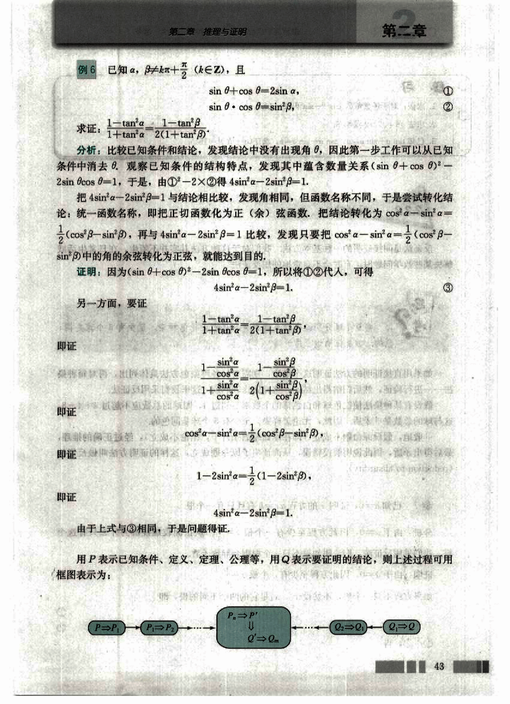
49

# CHAPTER 2

## 练习

1. 求证：对于任意角 θ，cos<sup>4</sup>θ - sin<sup>4</sup>θ = cos 2θ.
2. 求证 √6 + √7 > 2√2 + √5.
3. 已知 tan α + sin α = a，tan α - sin α = b，求证 (a<sup>2</sup> - b<sup>2</sup>)<sup>2</sup> = 16ab.

## 2.2.2 反证法

反证法是间接证明的一种基本方法，我们对于这种方法其实并不陌生，在日常生活或解决某些数学问题时，有时会不自觉地使用反证法。

### 思考

将 9 个球分别染成红色或白色，那么无论怎样染，至少有 5 个球是同色的，你能证明这个结论吗？

如果用直接证明的方法证明这个结论，则需要将各种染色方法具体列出，再对每种染色法一一进行验证，然后归纳得出结论，这样做比较麻烦，这里我们采用反证法。

假设有某种染法使红色球和白色球的个数都不超过 4，则球的总数应不超过 4 + 4 = 8，这与球的总数是 9 矛盾，因此，无论怎样染，至少有 5 个球是同色的。

一般地，假设原命题不成立（即在原命题的条件下，结论不成立），经过正确的推理，最后得出矛盾，因此说明假设错误，从而证明了原命题成立，这样的证明方法叫做反证法 (reduction to absurdity)。

### 例 7

已知 a ≠ 0，证明 x 的方程 ax = b 有且只有一个根。

**分析：**由于 a ≠ 0，因此方程至少有一个根 x = $\frac{b}{a}$。从正面较难说清为什么只有这个根，我们采用反证法，即证明如果不只一个根则会导致矛盾。

**证明：**由于 a ≠ 0，因此方程至少有一个根 x = $\frac{b}{a}$。

如果方程不只一个根，不妨设 x<sub>1</sub>，x<sub>2</sub> 是它的两个不同的根，即

ax<sub>1</sub> = b，
ax<sub>2</sub> = b.

① - ②，得 a(x<sub>1</sub> - x<sub>2</sub>) = 0. 因为 a ≠ 0，所以 x<sub>1</sub> - x<sub>2</sub> = 0，即 x<sub>1</sub> = x<sub>2</sub>，这与 x<sub>1</sub>，x<sub>2</sub> 是两个不同的根矛盾。因此，假设不成立，原命题成立。

---

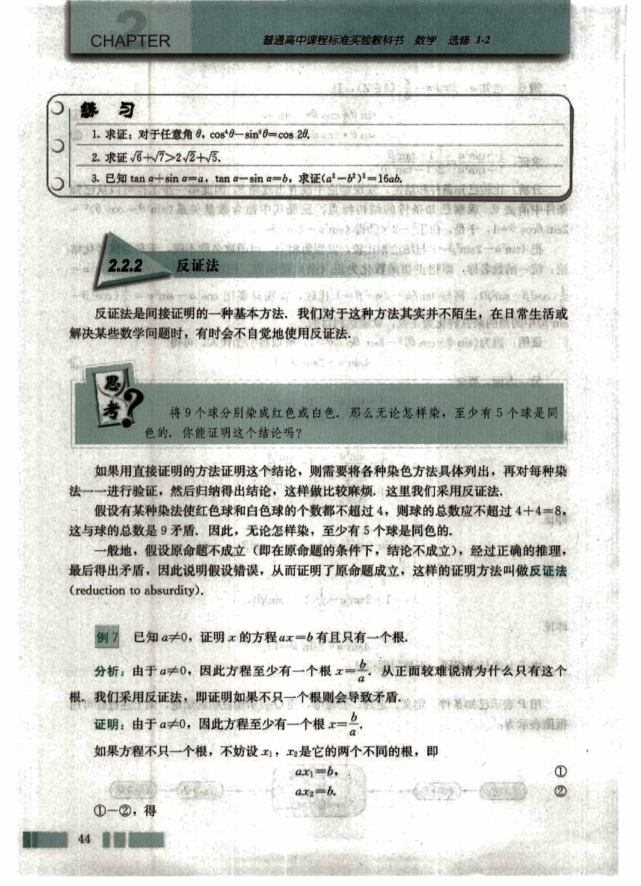
50

# 第二章 推理与证明

a(x₁-x₂)=0.

因为 x₁≠x₂, 所以 x₁-x₂≠0, 所以应有 a=0, 这与已知矛盾, 故假设错误.
所以, 当 a≠0 时, 方程 ax=b 有且只有一个根.

## 例 8

已知直线 a, b 和平面 α, 如果 a⊂α, b⊂α, 且
a//b, 求证 a//α.

**证明:** 因为 a//b,

所以经过直线 a, b 确定一个平面 β.

因为 a⊂α, 而 a⊂β,

所以 α 与 β 是两个不同的平面.

因为 b⊂α, 且 b⊂β,

所以 α∩β=b.

下面用反证法证明直线 a 与平面 α 没有公共点. 假设直线 a 与平面 α 有公共点 P, 则
P∈α∩β=b, 即点 P 是直线 a 与 b 的公共点, 这与 a//b 矛盾.

所以 a//α.

由上面的例子可以看出, 反证法的关键是在正确的推理下得出矛盾, 这个矛盾可以是
与已知条件矛盾, 或与假设矛盾, 或与定义、定理、公理、事实矛盾等.

反证法常常是解决某些“疑难”问题的有力工具, 英国近代数学家哈代曾经这样称赞
它:“……归谬法(反证法)是数学家最有力的一件武器, 比起象棋开局时牺牲一子以取得
优势的让棋法, 它还要高明. 象棋对奕者不外牺牲一卒或顶多一子, 数学家索性把全局
拱手让予对方!”

事实上, 数学史上有很多经典证明(如“质数有无限多个”, “√2 是无理数”的证明)
就采用了反证法. 感兴趣的同学可以自己查找相关书籍, 进一步了解反证法的作用及应用.

## 练习

1. 证明: 在 △ABC 中, 若 ∠C 是直角, 则 ∠B 一定是锐角.

2. 求证: √2, √3, √5 不可能成等差数列.

45

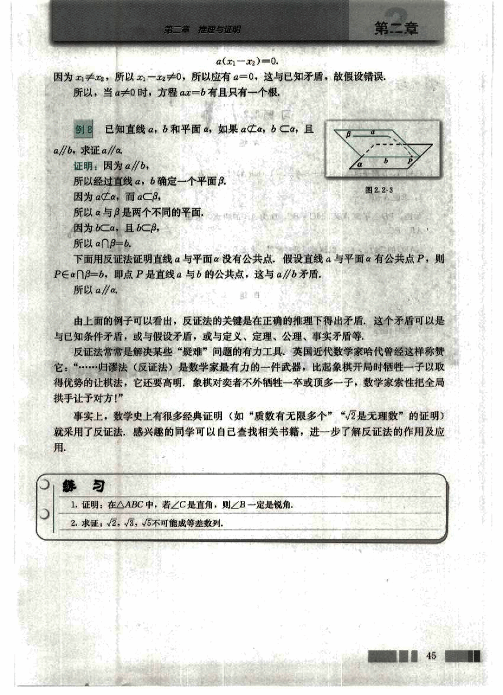
51

# CHAPTER 2

## 习题 2.2

### A 组

1. 已知 A，B 都是锐角，且 A + B ≠ $\frac{\pi}{2}$，(1 - tan A)(1 - tan B) = 0，求证 A - B = $\frac{\pi}{4}$

2. 如图，PD⊥ 平面 ABC，AC = BC，D 为 AB 的中点，求证 AB⊥PC。[image](images/image1.png)

3. △ABC 的三边 a，b，c 的倒数成等差数列，求证 B < $\frac{\pi}{2}$

### B 组

1. 已知 $\frac{1-\tan \alpha}{2+\tan \alpha}=1$，求证 3sin 2α = -4cos 2α.

2. 设实数 a，b，c 成等比数列，非零实数 x，y 分别为 a 与 b，b 与 c 的等差中项，求证 $\frac{a}{x}+\frac{c}{y}=2$.

46
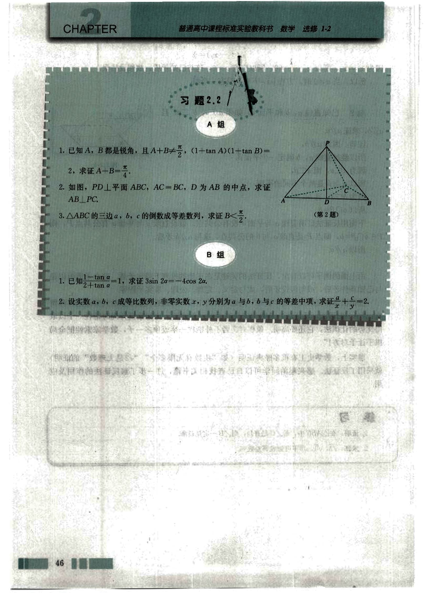
52

# B 组

1. 如图，在圆内画 1 条线段，将圆分割成两部分；画 2 条相交线段，彼此分割成 4 条线段，将圆分割成 4 部分；画 3 条线段，彼此最多分割成 9 条线段，将圆最多分割成 7 部分；画 4 条线段，彼此最多分割成 16 条线段，将圆最多分割成 11 部分，那么

(1) 在圆内画 5 条线段，它们彼此最多分割成多少条线段？将圆最多分割成多少部分？

① ② ③ ④ ⑤

(2) 猜想：圆内两两相交的 _n_ 条线段，彼此最多分割成多少条线段？

(3) 猜想：在圆内画 _n_ 条线段，两两相交，将圆最多分割成多少部分？

2. 如图，已知三棱锥 S-ABC 中，∠ASB=∠BSC=∠CSA=$\frac{\pi}{2}$，求证 △ABC 是锐角三角形。

[图](images/figure2.png)

3. 设 sinα 是 sinβ，cosβ 的等差中项，sinβ 是 sinβ，cosβ 的等比中项，求证 cos4β-4cos4α=3.

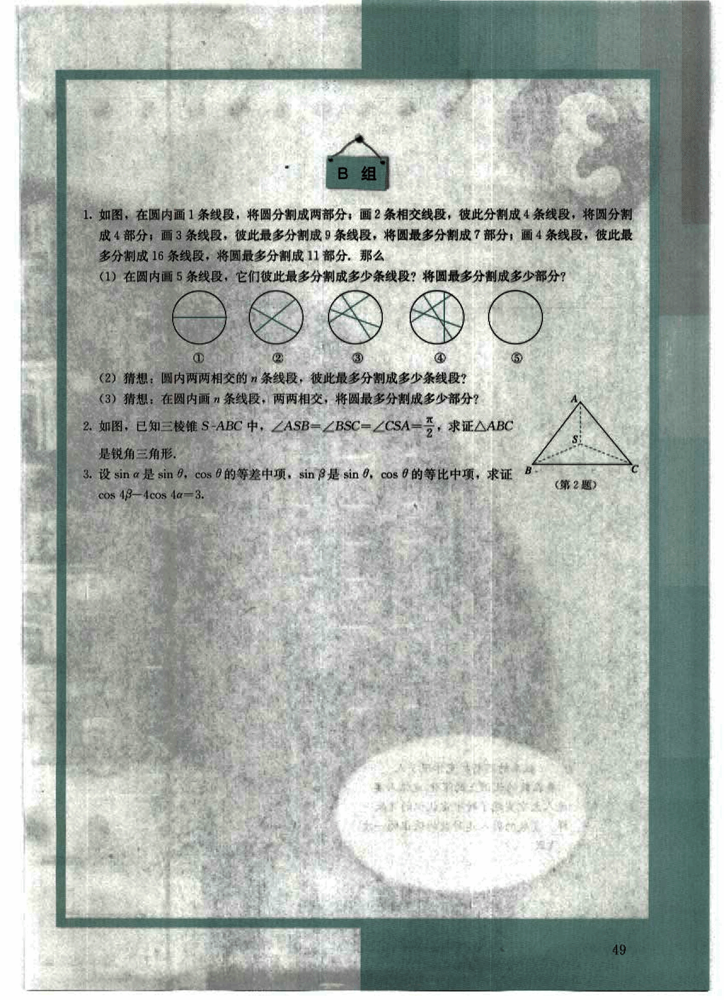
53

# Chapter 3

<br>


<br>

数系的不断扩充体现了人类在数的认识上的深化，就像人类进入太空实现了对宇宙认识的飞跃一样，复数的引入是对数的认识的一次飞跃。

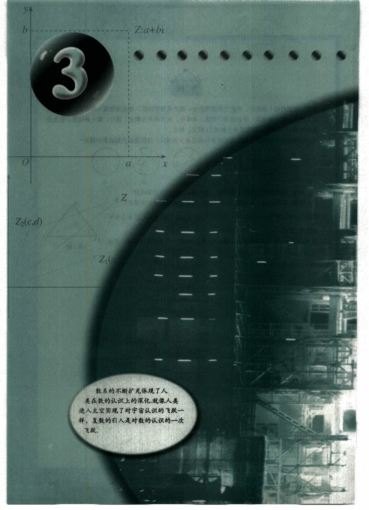
54

# 第三章 数系的扩充与复数的引入

## 3.1 数系的扩充和复数的概念

## 3.2 复数代数形式的四则运算

我们知道，在实数集内，像$x^2+1=0$这样的方程是没有根的。因此在研究代数方程的过程中，如果限于实数系，有些问题就无法解决。一个自然的想法是，能否像引进无理数而把有理数系扩充到实数系那样，通过引进新的数而使实数系得到进一步扩充，从而使问题变得可以解决呢？复数概念的引入与这种想法直接相关。

复数是 16 世纪人们在讨论一元二次方程、一元三次方程的求根公式时引入的，它在数学、力学、电学及其他学科中都有广泛的应用，复数与向量、平面解析几何、三角函数等都有密切的联系，也是进一步学习数学的基础。

本章我们将通过解方程等具体问题，感受引入复数概念的必要性，了解从实数系到复数系的扩充过程，学习复数的一些基本知识，感受人类理性思维在数系扩充中的作用。

[image](images/rocket.png)

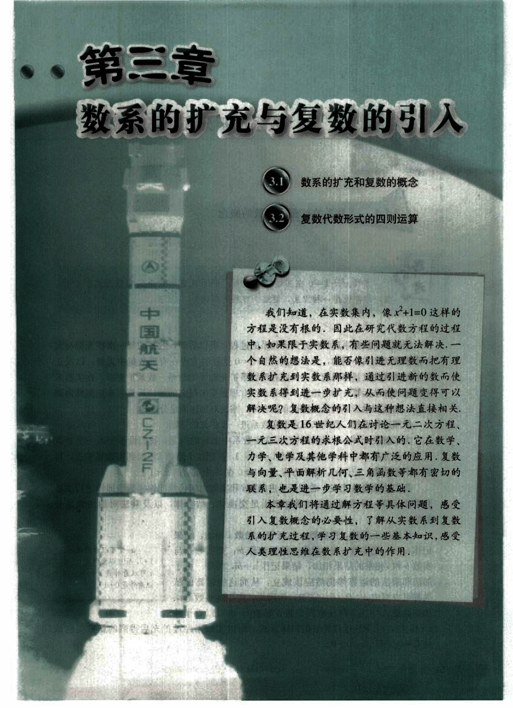
55

# CHAPTER 3

# 3.1 数系的扩充和复数的概念

## 3.1.1 数系的扩充和复数的概念

方程 $x^2+1=0$ 在实数集中无解。联系从自然数系到实数系的扩充过程，你能设想一种方法，使这个方程有解吗？

回顾从自然数系逐步扩充到实数系的过程，可以看到，数系的每一次扩充都与实际需求密切相关。例如，为了解决 $x^2-2=0$ 这样的方程在有理数集中无解，以及正方形对角线的度量等问题，人们把有理数系扩充到了实数系。数系扩充后，在实数系中规定的加法运算、乘法运算，与原来在有理数系中规定的加法运算、乘法运算协调一致：加法和乘法都满足交换律和结合律，乘法对加法满足分配律。

依照这种思想，我们来研究把实数系进一步扩充的问题。

为了解决 $x^2+1=0$ 这样的方程在实数系中无解的问题，我们设想引入一个新数 $i$，使得 $i$ 是方程 $x^2+1=0$ 的根，即 $i^2=-1$。再把这个新数 $i$ 添加到实数集中去，得到一个新数集，记作 $A$，那么方程 $x^2+1=0$ 在 $A$ 中就有解 $x=i$ 了。

我们从数集 $A$ 出发，希望新引进的数和实数之间仍然能像实数系那样进行加法和乘法运算，并希望加法和乘法都满足交换律、结合律，以及乘法对加法满足分配律。

依照以上设想，把实数 $a$ 与新引入的数 $i$ 相加，结果记作 $a+i$；把实数 $b$ 与 $i$ 相乘，结果记作 $bi$；把实数 $a$ 与实数 $b$ 和 $i$ 相乘的结果相加，结果记作 $a+bi$，等等。由于加法和乘法的运算律仍然应该成立，从而这些运算的结果都可以写成 $a+bi$ ($a,b∈R$) 的形式，应把这些数都添加到数集 $A$ 中去。再注意到实数 $a$ 和数 $i$，也可以看作是 $a+bi$ ($a,b∈R$) 这样的数的特殊形式，所以实数系经过扩充后得到的新数集应该是 $C=\{a+bi | a, b∈R\}$。

52

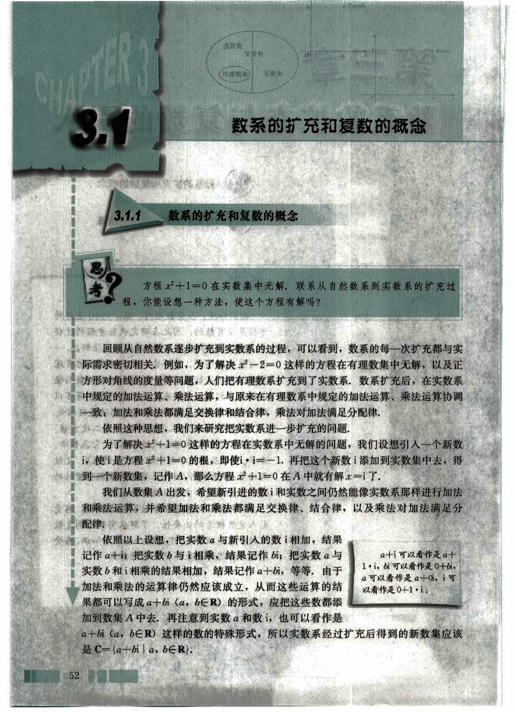
56

# 第三章 数系的扩充与复数的引入

我们把集合 C = {a + bi | a, b ∈ R} 中的数，即形如 a + bi (a, b ∈ R) 的数叫做**复数**(complex number)，其中 i 叫做**虚数单位**(imaginary unit)。全体复数所成的集合 C 叫做**复数集**(set of complex numbers)。

复数通常用字母 z 表示，即 z = a + bi (a, b ∈ R)，这一表示形式叫做复数的**代数形式**(algebraic form of complex number)。对于复数 z = a + bi，以后不作特殊说明，都有 a, b ∈ R，其中的 a 与 b 分别叫做复数 z 的**实部**(real part) 与**虚部**(imaginary part)。

在复数集 C = {a + bi | a, b ∈ R} 中任取两个数 a + bi, c + di (a, b, c, d ∈ R)，我们规定：

a + bi 与 c + di 相等的充要条件是 a = c 且 b = d。

## 思考？

复数集 C 和实数集 R 之间有什么关系？

对于复数 a + bi，当且仅当 b = 0 时，它是实数；当且仅当 a = b = 0 时，它是实数 0；当 b ≠ 0 时，叫做**虚数**；当 a = 0 且 b ≠ 0 时，叫做**纯虚数**。

例如，3 + 2i，$\frac{1}{2}$ - √3i，-√3 - $\frac{1}{2}$i，-0.2i 都是虚数，它们的实部分别是 3，$\frac{1}{2}$，-√3，0，虚部分别是 2，-√3，-$\frac{1}{2}$，-0.2，并且其中只有 -0.2i 是纯虚数。

显然，实数集 R 是复数集 C 的真子集，即 R ⊂ C。

这样，复数 z = a + bi 可以分类如下：

- 实数 (b = 0)
- 虚数 (b ≠ 0) (当 a = 0 时为纯虚数)

复数集、实数集、虚数集、纯虚数集之间的关系，用图 3.1-1 表示。

[图 3.1-1](images/3.1-1.png)

**例** 实数 m 取什么值时，复数 z = m + 1 + (m - 1)i 是 (1) 实数？(2) 虚数？(3) 纯虚数？

**分析：**因为 m ∈ R，所以 m + 1，m - 1 都是实数，由复数 z = a + bi 是实数、虚数和纯虚数的条件可以确定 m 的取值。

**解：**

(1) 当 m - 1 = 0，即 m = 1 时，复数 z 是实数；

(2) 当 m - 1 ≠ 0，即 m ≠ 1 时，复数 z 是虚数；

(3) 当 m + 1 = 0，且 m - 1 ≠ 0，即 m = -1 时，复数 z 是纯虚数。

53

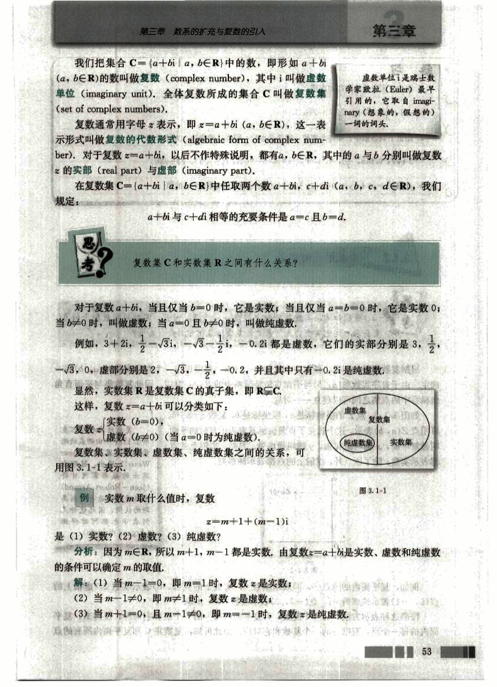
57

# CHAPTER 3

## 练习

1. 说出下列复数的实部和虚部：
   -2+1/3, √2/2, √3i, i, 0.

2. 指出下列各数中，哪些是实数，哪些是虚数，哪些是纯虚数，为什么？
   2+√7, 0.618, 2/7, 0, i, i<sup>2</sup>, 5i-8, 3-9√2i, i(1-√3), √2-√2i.

3. 如果(x+y)+(y-1)i=(2x+3y)+(2y+1)i, 求实数 x, y 的值.

# 3.1.2 复数的几何意义

## 思考？

我们知道，实数与数轴上的点一一对应，因此，实数可用数轴上的点来表示。类比实数的几何意义，复数的几何意义是什么呢？

根据复数相等的定义，任何一个复数 z=a+bi，都可以由一个有序实数对(a, b)唯一确定。由于有序实数对(a, b)与平面直角坐标系中的点一一对应，因此复数集与平面直角坐标系中的点集之间可以建立一一对应。

如图 3.1-2，点 Z 的横坐标是 a，纵坐标是 b，复数 z=a+bi 可用点 Z(a, b)表示。这个建立了直角坐标系来表示复数的平面叫做复平面，x 轴叫做实轴，y 轴叫做虚轴。显然，实轴上的点都表示实数；除了原点外，虚轴上的点都表示纯虚数。

[image](images/3.1-2.png)

例如，复平面内的原点(0, 0)表示实数 0，实轴上的点(2, 0)表示实数 2，虚轴上的点(0, -1)表示纯虚数-i，点(-2, 3)表示复数-2+3i 等。

按照这种表示方法，每一个复数，有复平面内唯一的一个点和它对应；反过来，复平面内的每一个点，有唯一的一个复数和它对应。由此可知，复数集 C 和复平面内所有的点

54

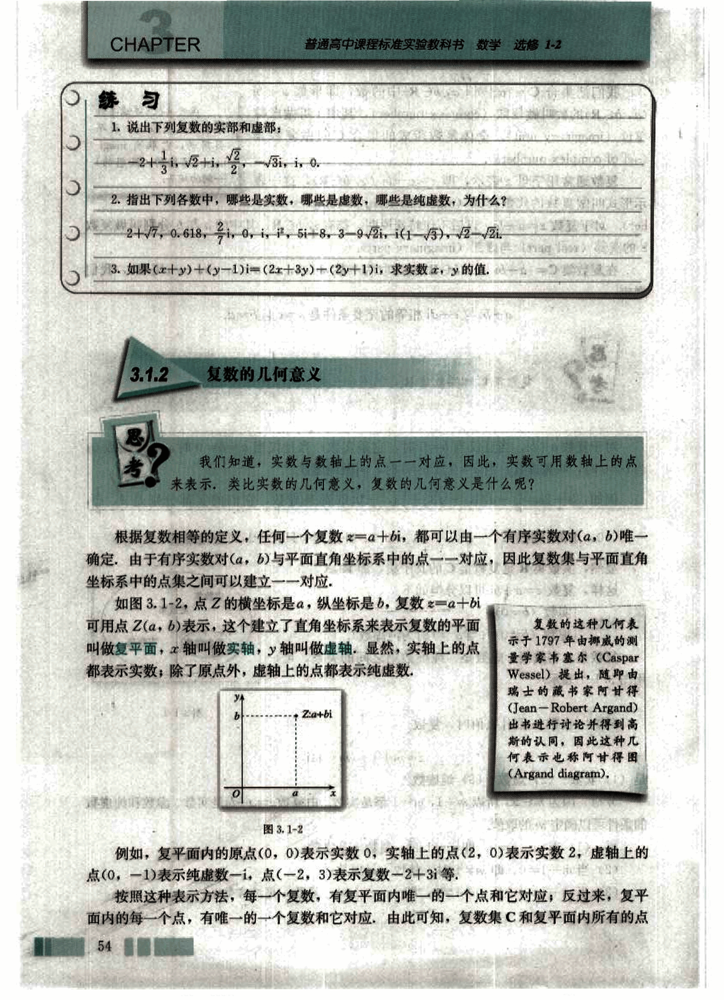
58

# 第三章 数系的扩充与复数的引入

所成的集合是**一对一**对应的，即

复数 $z = a + bi$ $\longrightarrow$ 复平面内的点 $Z(a, b)$

这是复数的一种几何意义。

在平面直角坐标系中，每一个平面向量都可以用一个有序实数对来表示，而有序实数对与复数是**一对一**对应的，这样，我们还可以用平面向量来表示复数。

如图 3.1-3 所示，设复平面内的点 Z 表示复数 $z = a + bi$，连结 OZ，显然向量 $\vec{OZ}$ 由点 Z 唯一确定的；反过来，点 Z（相对于原点来说）也可以由向量 $\vec{OZ}$ 唯一确定；因此，复数集 C 与复平面内的向量所成的集合也是**一对一**对应的（实数 0 与零向量对应），即

复数 $z = a + bi$ 对应平面向量 $\vec{OZ}$

向量的模叫做复数 $z = a + bi$ 的模，记作 $|z|$ 或 $|a + bi|$。如果 $b = 0$，那么 $z = a + bi$ 是一个实数，它的模等于 $|a|$（就是 a 的绝对值），由模的定义可知：$|z| = |a + bi| = r = \sqrt{a^2 + b^2} (r \ge 0, r \in R)$。

这是复数的另一种几何意义。


为方便起见，我们常把复数 $z = a + bi$ 说成点 Z 或说成向量 $\vec{OZ}$，并且规定，相等的向量表示同一个复数。

55

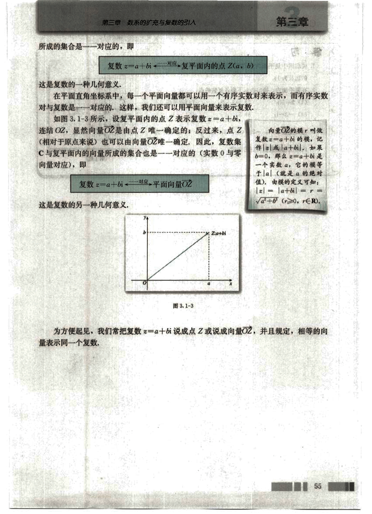
59

# CHAPTER

## 练习

1. 说出图中复平面内各点所表示的复数（每个小正方格的边长为 1）.

2. 在复平面内，描出表示下列各复数的点：
   (1) 2 + 5i; (2) -3 + 2i; (3) 2 - 4i; (4) -3 - i; (5) 5; (6) -3i.

3. 已知复数 2 + i, -2 - 4i, -2i, 4, $\frac{3}{2}$ - 4i, 在复平面内画出这些复数对应的向量.

[image1](images/image1.png)

(第 1 题)

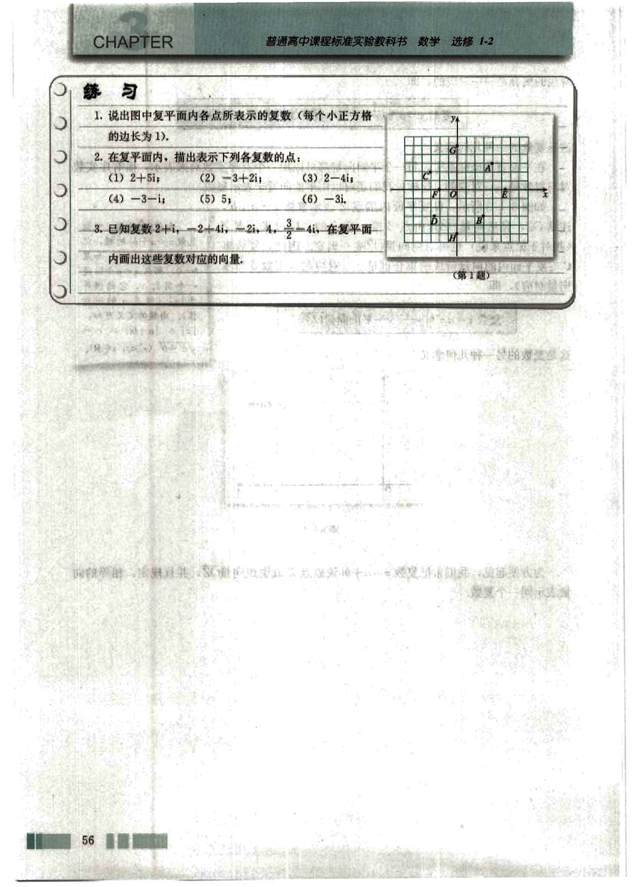
60

# 第三章 数系的扩充与复数的引入

## 习题 3.1

### A 组

1. 求适合下列方程的实数 x 与 y 的值：
   (1) (3x + 2y) + (5x - y)i = 17 - 2i;
   (2) (x + y - 3) - (x - 4)i = 0.

2. 实数 m 取什么值时，复数 ($m^2$ - 5m + 6) + ($m^2$ - 3m)i 是
   (1) 实数？
   (2) 虚数？
   (3) 纯虚数？

3. 符合下列条件的复数一定存在吗？若存在，请举出例子；若不存在，请说明理由。
   (1) 实部为 -√2 的虚数；
   (2) 虚部为 -√2 的虚数；
   (3) 虚部为 -√2 的纯虚数。

4. 如果 P 是复平面内表示复数 a + bi (a, b ∈ R) 的点，分别指出在下列条件下点 P 的位置：
   (1) a > 0, b > 0;
   (2) a < 0, b > 0;
   (3) a = 0, b ≠ 0;
   (4) b < 0.

5. 实数 m 取什么值时，复平面内表示复数 z = ($m^2$ - 8m + 15) + ($m^2$ - 5m - 14)i 的点
   (1) 位于第四象限？
   (2) 位于第一、三象限？
   (3) 位于直线 y = x 上？

### B 组

1. 在复平面内，O 是原点，向量 OA 对应的复数是 2 + i.
   (1) 如果点 A 关于实轴的对称点为点 B，求向量 OB 对应的复数；
   (2) 如果 (1) 中点 B 关于虚轴的对称点为点 C，求点 C 对应的复数。

2. 在复平面内指出与复数 $z_1$ = 1 + 2i, $z_2$ = √2 + √3i, $z_3$ = √3 - √2i, $z_4$ = -2 + i 对应的点 $Z_1$, $Z_2$, $Z_3$, $Z_4$。试判断这 4 个点是否在同一个圆上？并证明你的结论。

57

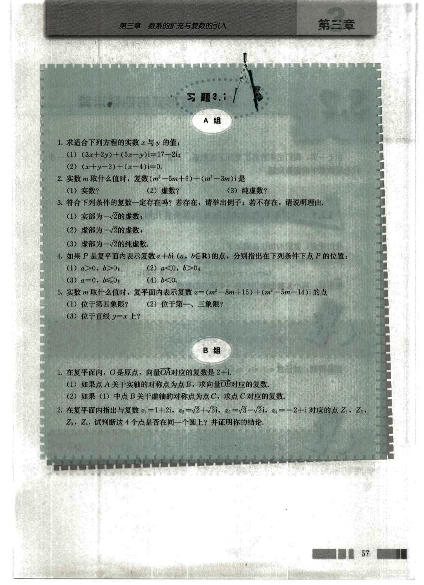
61

# CHAPTER 3.2 复数代数形式的四则运算

在上一节，我们把实数系扩充到了复数系。下面，我们按照那里的分析，进一步讨论复数系中的运算问题。

## 3.2.1 复数代数形式的加减运算及其几何意义

我们规定，复数的加法法则如下：
设 $z_1 = a + bi$，$z_2 = c + di$ 是任意两个复数，那么
$(a + bi) + (c + di) = (a + c) + (b + d)i$.

很明显，两个复数的和仍然是一个确定的复数。

**探究**

复数的加法满足交换律、结合律吗？

容易得到，对任意 $z_1, z_2, z_3 \in C$，有
$(z_1 + z_2) + z_3 = z_1 + (z_2 + z_3)$.

**探究**

复数与复平面内的向量有——一对应关系。我们讨论过向量加法的几何意义，你能由此出发讨论复数加法的几何意义吗？

58

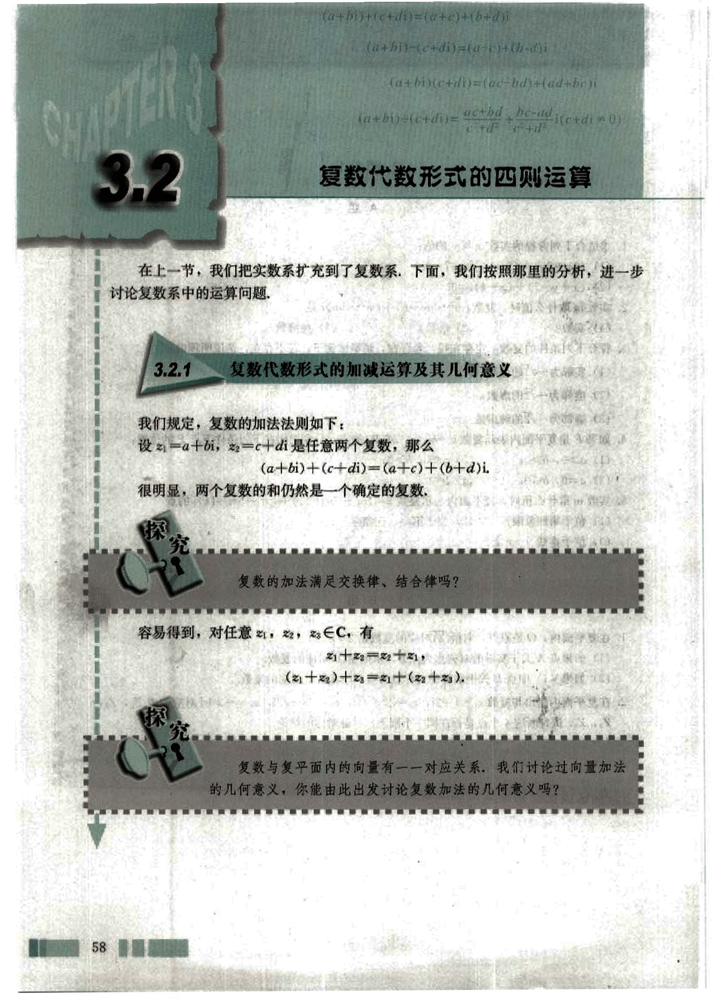
62

# 第三章 数系的扩充与复数的引入

设$OZ_1$, $OZ_2$分别与复数$a+bi$, $c+di$对应,则有$OZ_1 = (a, b)$, $OZ_2 = (c, d)$。由平面向量的坐标运算，有
$OZ_1 + OZ_2 = (a+c, b+d)$.

这说明两个向量$OZ_1$与$OZ_2$的和就是与复数$(a+c) + (b+d)i$对应的向量。因此，复数的加法可以按照向量的加法来进行(图 3.2-1)，这是复数加法的几何意义。


## 思考

复数是否有减法？如何理解复数的减法？

类比实数集中减法的意义，我们规定，复数的减法是加法的逆运算，即把满足
$(c+di) + (x+yi) = a+bi$
的复数$x+yi$叫做复数$a+bi$减去复数$c+di$的差，记作$(a+bi) - (c+di)$。根据复数相等的定义，有
$c+x=a$, $d+y=b$,
$x = a-c$, $y = b-d$.
所以
$x+yi = (a-c) + (b-d)i$,

$(a+bi) - (c+di) = (a-c) + (b-d)i$.

这就是复数的减法法则，由此可见，两个复数的差是一个确定的复数。

## 探究

类比复数加法的几何意义，请指出复数减法的几何意义。

### 例 1

计算$(5-6i) + (-2-i) - (3+4i)$.

解：$(5-6i) + (-2-i) - (3+4i)$
$= (5-2-3) + (-6-1-4)i$
$= -11i$.

59

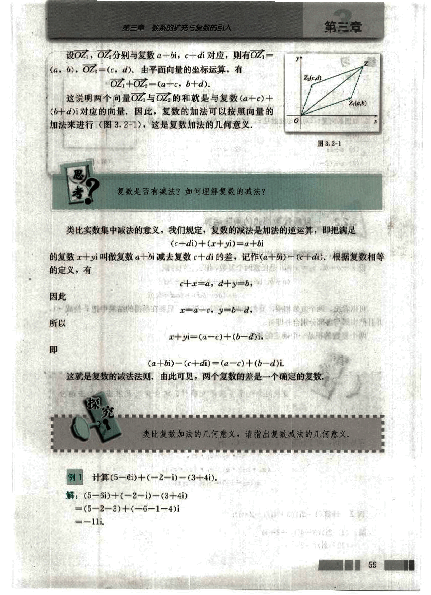
63

# 练习

1. 计算：
   (1) (2+4i) - (3-4i); (2) 5 - (3+2i);
   (3) (-3-4i) + (2+i) - (1-5i); (4) (2-i) - (2+3i) + 4i.

2. 如图的向量 OZ 对应的复数是 z，试作出下列运算的结果对应的向量：
   (1) z+1; (2) z-i; (3) z+(2-i).

[z](images/z.png)

# 3.2.2 复数代数形式的乘除运算

我们规定，复数的乘法法则如下：
设 $z_1 = a+bi$，$z_2 = c+di$ 是任意两个复数，那么它们的积
$(a+bi)(c+di) = ac+bci+adi+bdi^2$
$= (ac-bd)+(ad+bc)i$.

可以看出，两个复数相乘，类似于两个多项式相乘，只要在所得的结果中把 $i^2$ 换成-1，并且把实部与虚部分别合并即可。
两个复数的积是一个确定的复数。

容易得到，对于任意 $z_1, z_2, z_3 ∈ C$，有
$z_1 \cdot z_2 = z_2 \cdot z_1$,
$(z_1 \cdot z_2) \cdot z_3 = z_1 \cdot (z_2 \cdot z_3)$,
$z_1 \cdot (z_2 + z_3) = z_1 \cdot z_2 + z_1 \cdot z_3$.

例 2 计算 (1-2i)(3+4i)(-2+i).

解：(1-2i)(3+4i)(-2+i)
= (11-2i)(-2+i)

60

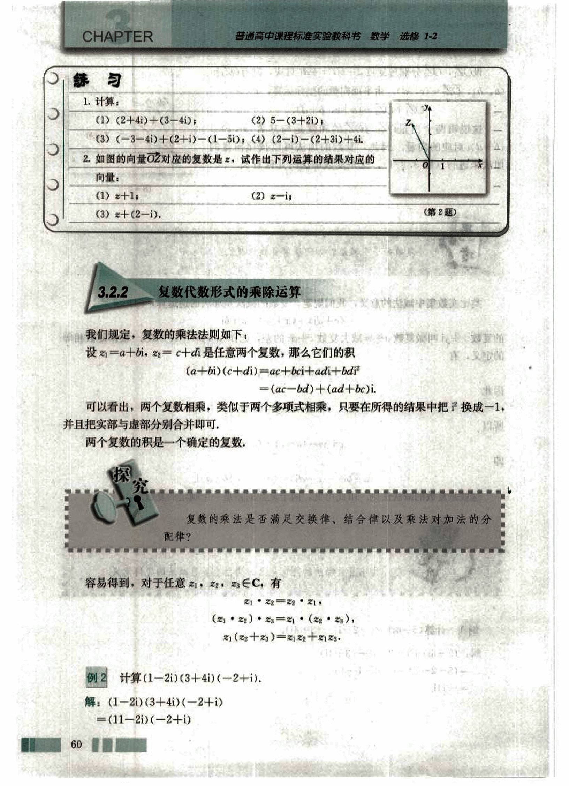
64

# 第三章 数系的扩充与复数的引入

## 例 3 计算：

(1) (3+4i)(3-4i); (2) (1+i)²;

**分析:** 本例可以用复数的乘法法则计算，也可以用乘法公式。

**计算:**

解：(1) (3+4i)(3-4i)
= 3² - (4i)²
= 9 - (-16)
= 25.

(2) (1+i)² = 1 + 2i + i²
= 1 + 2i - 1
= 2i.

本例(1)中的两个复数 3+4i, 3-4i 称为共轭复数。

一般地，当两个复数的实部相等，虚部互为相反数时，这两个复数叫做互为共轭复数 (conjugate complex number)。虚部不等于 0 的两个共轭复数也叫做共轭虚数。

**思考？**

若 $z_1$, $z_2$ 是共轭复数，那么

(1) 在复平面内，它们所对应的点有怎样的位置关系？
(2) $z_1 \cdot z_2$ 是一个怎样的数？

**探究**

类比实数的除法是乘法的逆运算，我们规定复数的除法是乘法的逆运算。

**复数除法的法则是：**

$(a+bi) \div (c+di) = \frac{ac+bd}{c^2+d^2} + \frac{bc-ad}{c^2+d^2}i$ (c+di≠0).

由此可见，两个复数相除（除数不为 0），所得的商是一个确定的复数。

在进行复数除法运算时，通常先把 $(a+bi) \div (c+di)$ 写成 $\frac{a+bi}{c+di}$ 的形式，再把分子与分母
61

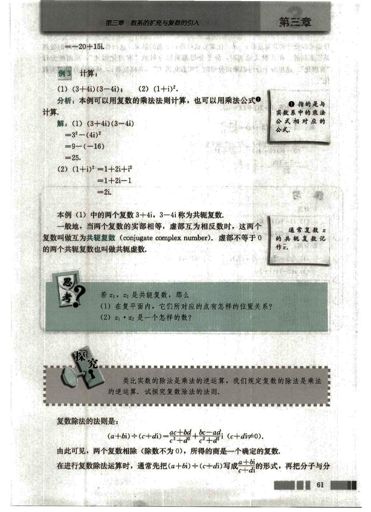
65

# CHAPTER

普通高中课程标准实验教科书 数学选修 1-2

母都乘以分母的共轭复数 $c - di$，化简后就可得到上面的结果，这与作根式除法时的处理
是很类似的，在作根式除法时，分子分母都乘以分母的“有理化因式”，从而使分母
“有理化”，这里分子分母都乘以分母的“实数化因式”（共轭复数），从而使分母“实数
化”.

例 4 计算 $(1+2i) \div (3-4i)$。

解：$(1+2i) \div (3-4i) = \frac{1+2i}{3-4i}$

$\frac{(1+2i)(3+4i)}{(3-4i)(3+4i)} = \frac{3+8i+6i+4i^2}{3^2+4^2} = \frac{3+14i-4}{25} = \frac{-1+14i}{25} = -\frac{1}{25} + \frac{14}{25}i$

## 练习

1. 计算：
   (1) $(7-6i)(-3i)$；
   (2) $(3+4i)(-2-3i)$；
   (3) $(1+2i)(3-4i)(-2-i)$.

2. 计算：
   (1) $(\sqrt{3}-\sqrt{2}i)(-\sqrt{3}+\sqrt{2}i)$；
   (2) $(1-i)^2$；
   (3) $i(2-i)(1-2i)$.

3. 计算：
   (1) $\frac{1}{1-i}$；
   (2) $\frac{1}{i}$；
   (3) $\frac{7+i}{3+4i}$；
   (4) $\frac{-1+i(2+i)}{-i}$.

62

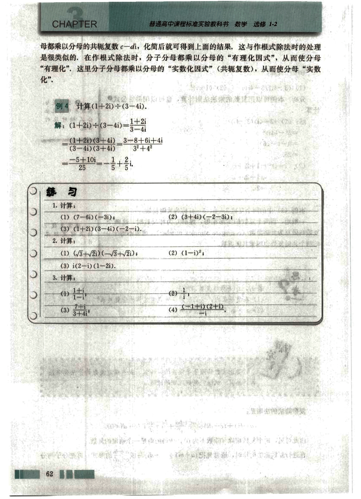
66

# 第三章 数系的扩充与复数的引入

## 习题 3.2

### A 组

1. 计算：
   (1) (6 - 5i) + (3 + 2i);
   (2) 5i - (2 - 2i);
   (3) ($\frac{2}{3}$ + i) + (1 - $\frac{2}{3}$i) - (1 + $\frac{3}{4}$i);
   (4) (0.5 + 1.3i) - (1.2 + 0.7i) + (1 - 0.4i).

2. 在复平面内，复数 6 - 5i 与 -3 + 4i 对应的向量分别是 $\vec{OA}$ 与 $\vec{OB}$，其中 O 是原点，求向量 $\vec{AB}$，$\vec{BA}$ 对应的复数。

3. ABCD 是复平面内的平行四边形，A，B，C 三点对应的复数分别是 1 + 3i，-i，2 - i，求点 D 对应的复数。

4. 计算：
   (1) (-8 - 7i)(-3i);
   (2) (4 - 3i)(-5 - 4i);
   (3) (-$\frac{1}{2}$ - $\frac{\sqrt{3}}{2}$i)(1 + i);
   (4) ($\frac{\sqrt{3}}{2}$ - $\frac{1}{2}$i)(-$\frac{1}{2}$ - $\frac{\sqrt{3}}{2}$i).

5. 计算：
   (1) $\frac{2i}{2 - i}$;
   (2) $\frac{2 + i}{7 + 4i}$;
   (3) $\frac{1}{(2 - i)^2}$;
   (4) $\frac{5(4 + i)}{i(2 - i)}$.

### B 组

已知 2i - 3 是关于 x 的方程 2x² + px - q = 0 的一个根，求实数 p，q 的值。

63

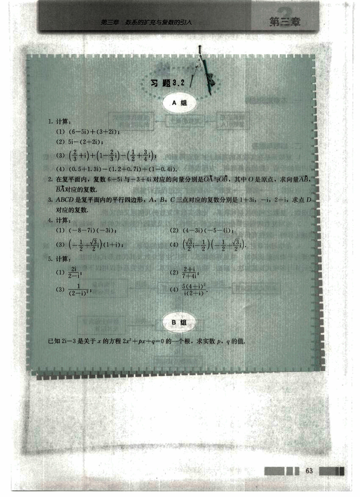
67

# 小结

## 一、本章知识结构


```mermaid
graph LR
A[数系扩充<br>复数引入] --> B(复数的概念);
B --> C[复数代数形式<br>的四则运算];
```

## 二、回顾与思考

1. 复数系是在实数系的基础上扩充而得到的，数系扩充的过程体现了实际需求与数学内部的矛盾（数的运算规则，方程求根）对数学发展的推动作用，同时也体现了人类理性思维的作用。请你收集一些从实数系扩充到复数系的数学史料，并对“整数 → 分数（有理数）→ 实数 → 复数”的数系扩充过程进行整理。

2. 学习复数应联系实数，注意到复数事实上是对有序实数，请比较实数、虚数、纯虚数、复数之间的区别和联系，比较实数和复数的几何意义的区别。

3. 你对复数四则运算法则规定的合理性，以及复数代数形式的加、减运算与向量的加减运算的一致性有什么体会？

4. 在学习本章时，应注意复数与实数、有理数的联系，复数及其代数形式的加、减运算与平面向量及其加、减运算的联系，还应注意复数及其代数形式的加法、减法、乘法运算与多项式及其加法、减法、乘法运算的联系，这些关系可以用以下框图表示：

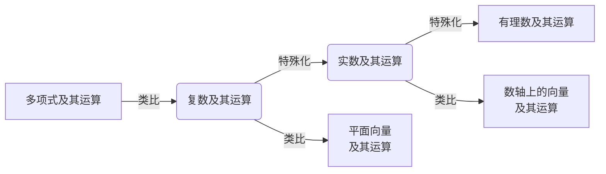
```mermaid
graph LR
A[多项式及其运算] -- 类比 --> B(复数及其运算);
B -- 特殊化 --> C(实数及其运算);
B -- 类比 --> D[平面向量<br>及其运算];
C -- 特殊化 --> E[有理数及其运算];
C -- 类比 --> F[数轴上的向量<br>及其运算];
```

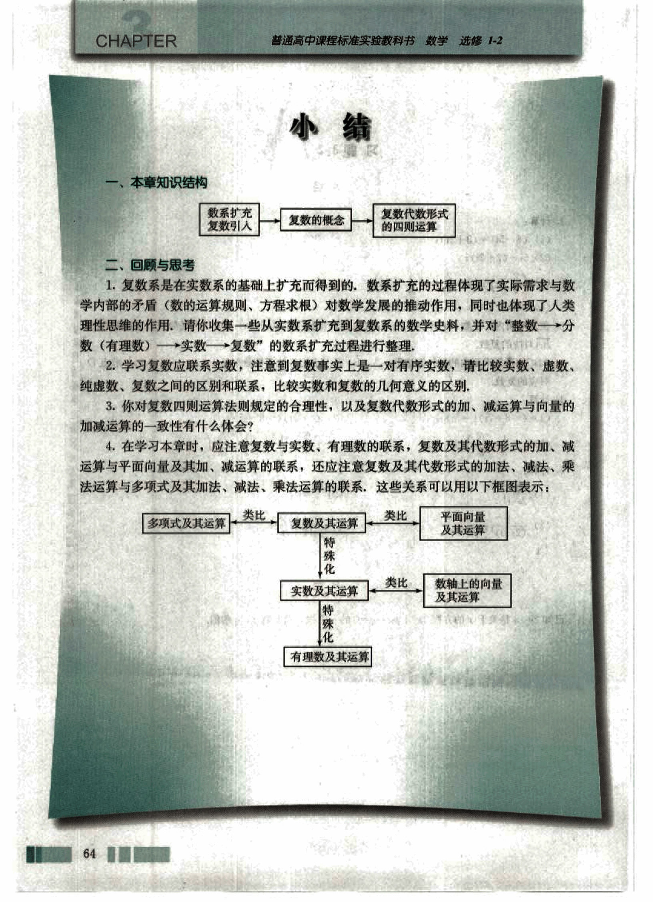
68

# 复习参考题

## A 组

1. 选择题：

(1) 复数 $a+bi$ 与 $c+di$ 的积是实数的充要条件是 ( )。
(A) $ad+bc=0$ (B) $ac+bd=0$ (C) $ac=bd$ (D) $ad=bc$

(2) 复数 $\frac{5}{i-2}$ 的共轭复数是 ( )。
(A) $i+2$ (B) $i-2$ (C) $-2-i$ (D) $2-i$

(3) 当 $\frac{2}{3} < m < 1$ 时，复数 $m(3+i)-(2+i)$ 在复平面内对应的点位于 ( )。
(A) 第一象限 (B) 第二象限 (C) 第三象限 (D) 第四象限

(4) 复数 $(\frac{1}{2}+\frac{\sqrt{3}}{2}i)^3$ 的值是 ( )。
(A) $-i$ (B) $i$ (C) $-1$ (D) $1$

2. 已知复数 $z$ 与 $(z+2)^2-8i$ 都是纯虚数，求 $z$。

3. 已知 $z_1 = 5+10i$，$z_2 = -3-4i$，$\frac{1}{z_1} + \frac{1}{z_2} + \frac{1}{z_1+z_2}$，求 $\frac{1}{z_1} + \frac{1}{z_2}$。

## B 组

1. 已知 $(1+2i)z = 4+3i$，求 $z$ 及 $\bar{z}$。

2. (1) 试求 $i^1, i^2, i^3, i^4, i^5, i^6, i^7, i^8$ 的值;

(2) 由 (1) 推测 $i^n (n∈N^*)$ 的值有什么规律？并把这个规律用式子表示出来。

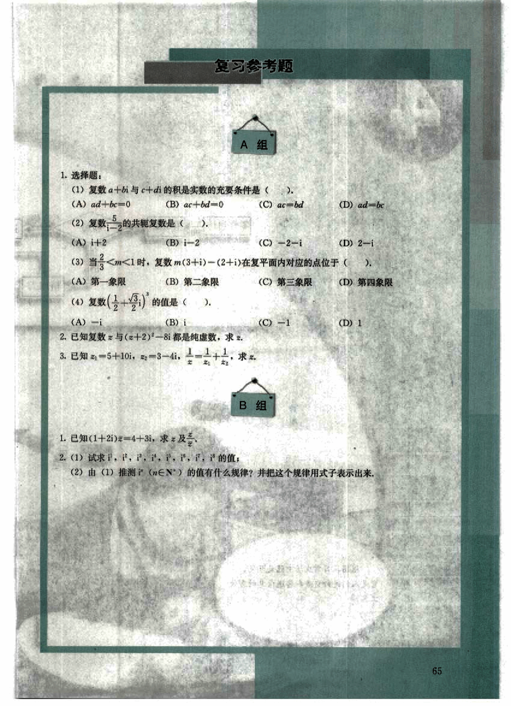
69

# 4


---

## 零件到达 → 粗加工 → 检验 → 合格/不合格 → 精加工

---

## 流程图

**人员:**

- 王琦
- 张静
- 孙锐
- 英语教师
- 电视频道客座主持
- 保龄球俱乐部成员
- 中学生
- 合唱队员
- 养老院志愿者
- 足球俱乐部成员
- 嘉中私立高中学生

---

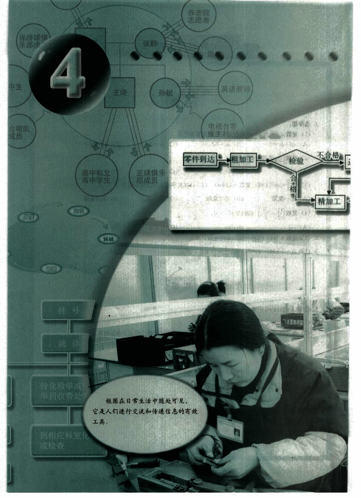
70

# 第四章 框图

## 4.1 流程图

## 4.2 结构图

同学们对框图一定不陌生，在“算法初步”一章中，我们学习了程序框图；在我们的数学教科书中，每一章的小结部分都包含一个知识结构图，框图不仅广泛应用于算法、计算机程序设计、工序流程的表述、设计方案的比较等方面，而且已经成为日常活动以及各种学术交流的常用表达方式。

本章中，我们将学习用流程图来刻画数学问题以及其他问题的解决过程，用结构图来表达某些系统的结构或组成。在这个过程中，我们将体验用框图表示数学问题解决过程以及事物发生、发展过程的优越性，提高抽象概括能力和逻辑思维能力，以及清晰地表达和交流思想的能力。

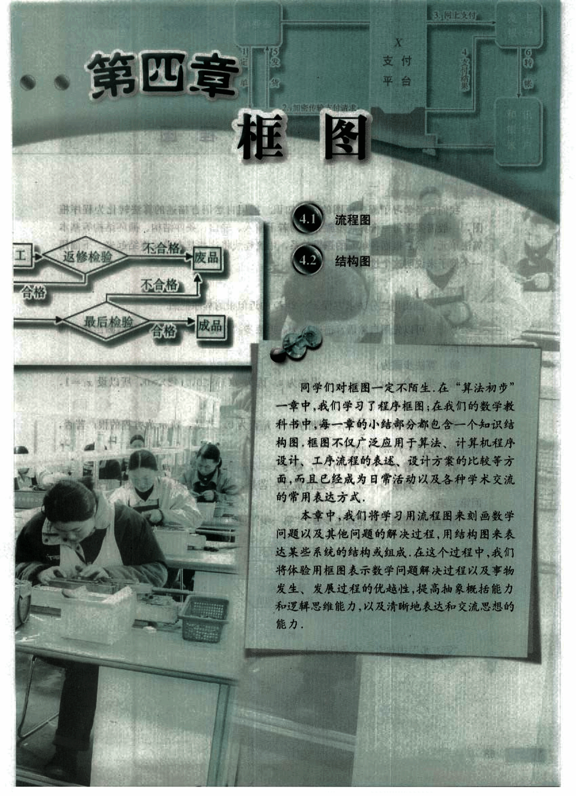
71

# CHAPTER 4

## 4.1 流程图

我们已经学习了程序框图的有关知识，把用自然语言描述的算法转化为程序框图，一般需要将每一个算法步骤分解为若干输入、输出、条件结构、循环结构等基本算法单元，然后根据各单元的逻辑关系，用流程线将这些基本单元连结起来，下面用一个例子来说明这个过程。

**例 1** 画出用二分法求方程 $x^2 - 2 = 0$ 的近似根的程序框图。

**分析:** 可以先用自然语言描述算法，再逐步“细化”算法步骤，然后画出相应的程序框图。

**解:** 算法步骤为：

**第一步** 令 $f(x) = x^2 - 2$，误差为 $\varepsilon$，因为 $f(1) < 0$，$f(2) > 0$，所以设 $x_1 = 1$，$x_2 = 2$。

**第二步** 令 $m = \frac{x_1 + x_2}{2}$，判断 $f(m)$ 是否为 0。若是，则 $m$ 为方程的根；若否，则判断 $f(x_1) \cdot f(m)$ 的符号。

**第三步** 若 $f(x_1) \cdot f(m) > 0$，则令 $x_1 = m$；否则，令 $x_2 = m$。

**第四步** 判断 $|x_1 - x_2| < \varepsilon$ 是否成立？若是，则 $m$ 为方程的近似根；若否，则返回第二步。

用程序框图表示上述算法步骤，“第一步”可以细化为：

[图 4.1-1](images/4.1-1.png)

“第二步”中包含一个条件结构：

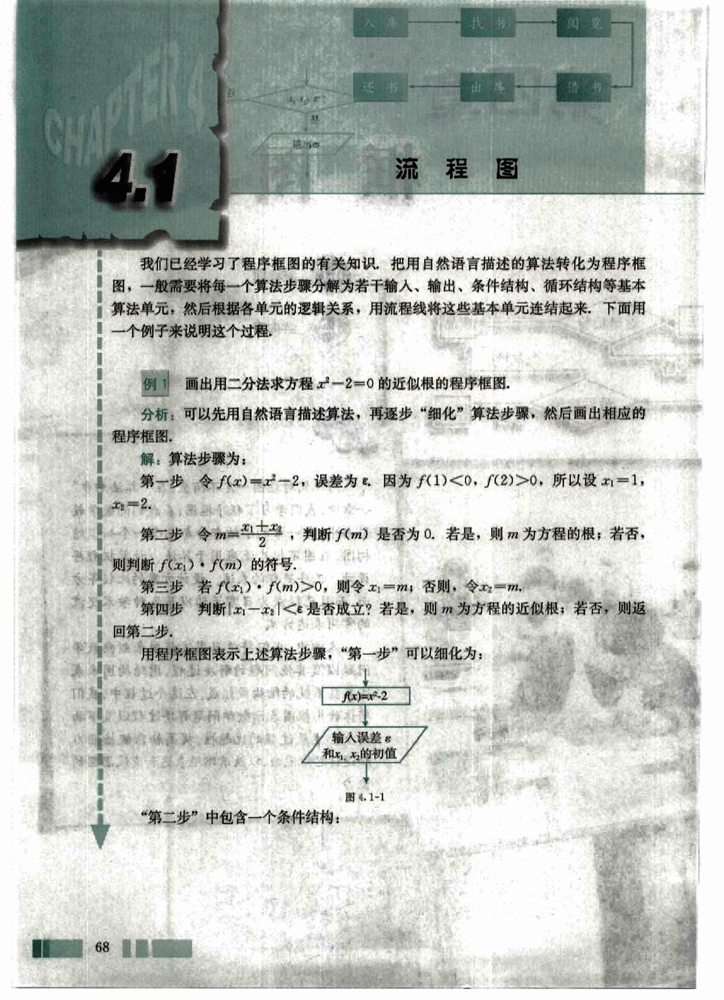
72

# 第四章 框图

##

$m = \frac{x_1 + x_2}{2}$

$f(m) = 0?$

是

输出 m

图 4.1-2

“第三步”也可以用一个条件结构来表示：

$f(x_1), f(m) > 0?$

否

是

$x_1 = m$

输出 m

$x_1 = m$

图 4.1-3

“第四步”与“第二步”“第三步”构成了一个循环结构，循环体是“第二步”“第三步”，循环结束的条件是$|x_1 - x_2| < \varepsilon$或者$f(m) = 0$，即

第二步

第三步

否

$|x_1 - x_2| < \varepsilon$ 或 $f(m) = 0$?

是

输出 m

图 4.1-4

最后，用合适的流程线把上面四步的程序框图连起来，再加上终端框，就得到了上述算法的程序框图。

从上面的过程可以看出，程序框图就是算法步骤的直观图示。算法的输入、输出、条件、循环等基本单元构成了程序框图的基本要素，基本要素之间的关系由流向线来建立，用程序框图表示的算法，比用自然语言描述的算法更加直观、明确、流向清楚，而且更容易改写成计算机程序。

69

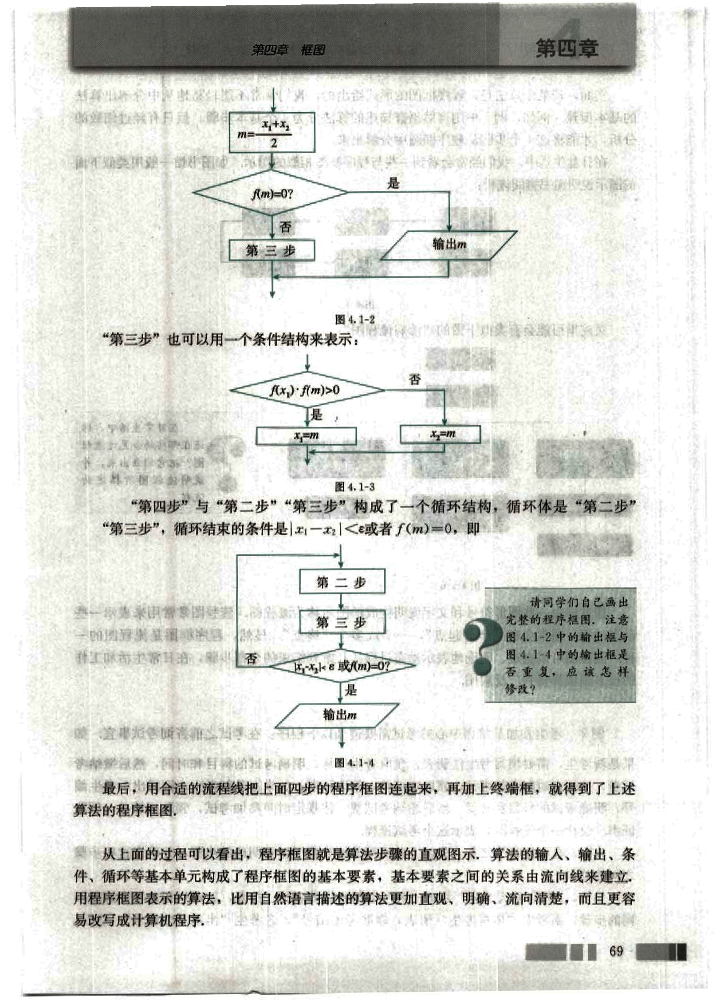
73

# CHAPTER

普通高中课程标准实验教科书 数学选修 1-2

然而，若某个算法是以程序框图的形式给出的，我们常常不能轻易地从中分解出算法的基本步骤，例如，例 1 中用自然语言描述的算法分为 4 个基本步骤，但只有经过细致的分析，才能将这 4 个步骤从程序框图中分解出来。

在日常生活中，我们经常会看到一些与程序框图相似的图示，如图书馆一般用类似下面的图示说明图书借阅流程：

|      |      |      |      |
| :--- | :--- | :--- | :--- |
| 入库 | 找书 | 阅览 | 还书 |
| 还书 | 出库 | 借书 |      |

图 4.1-5

医院里可能会有类似下图的“诊病流程图”：

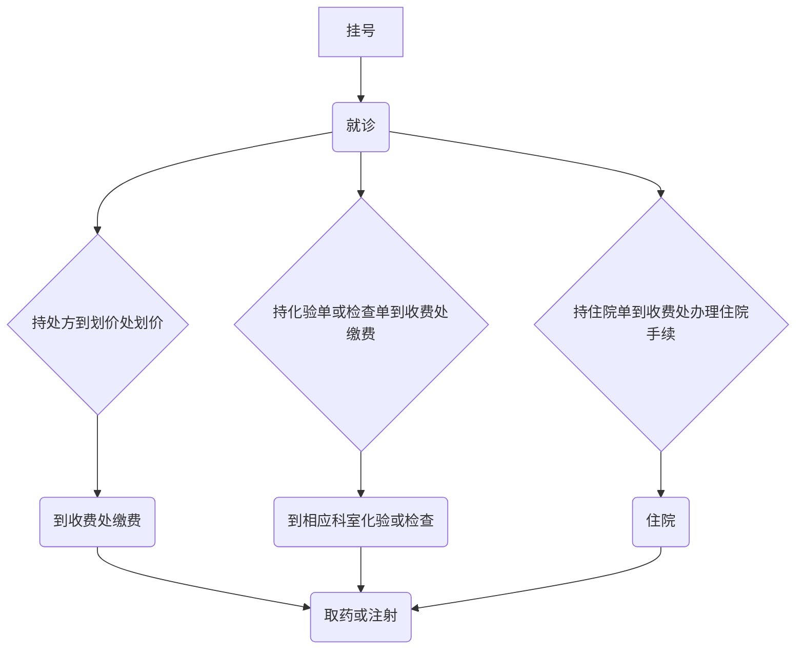
```mermaid
graph TD
    A[挂号] --> B(就诊);
    B --> C{持处方到划价处划价};
    B --> D{持化验单或检查单到收费处缴费};
    B --> E{持住院单到收费处办理住院手续};
    C --> F(到收费处缴费);
    D --> G(到相应科室化验或检查);
    E --> H(住院);
    F --> I(取药或注射);
    G --> I;
    H --> I;
```

在日常生活中，你还在哪些场合见过流程图？把它们画出来，并说明流程图所描述的流程。

图 4.1-6

像这样由一些图形符号和文字说明构成的图示称为流程图，流程图常常用来表示一些动态过程，通常会有一个“起点”，一个或多个“终点”，显然，程序框图是流程图的一种，流程图可以直观、明确地表示动态过程从开始到结束的全部步骤，在日常生活和工作的很多领域都得到广泛应用。

例 2 考生参加某培训中心的考试需要遵循以下程序：在考试之前咨询考试事宜，如果是新考生，需要填写考生注册表，领取考生编号，明确考试的科目和时间，然后缴纳考试费，按规定时间参加考试，领取成绩单，领取证书；如果不是新考生，则需出示考生编号，明确考试的科目和时间，然后缴纳考试费，按规定时间参加考试，领取成绩单，领取证书，设计一个流程图，表示这个考试流程。

分析：在画流程图之前，先将上述流程分解为若干比较明确的步骤，并确定这些步骤之间的关系，

显然，“咨询考试事宜”是每一名考生都要做的事情，接着，新考生和老考生执行不同的步骤，新考生“填写考生注册表，领取考生编号”，老考生“出示考生编号”，然后，

70

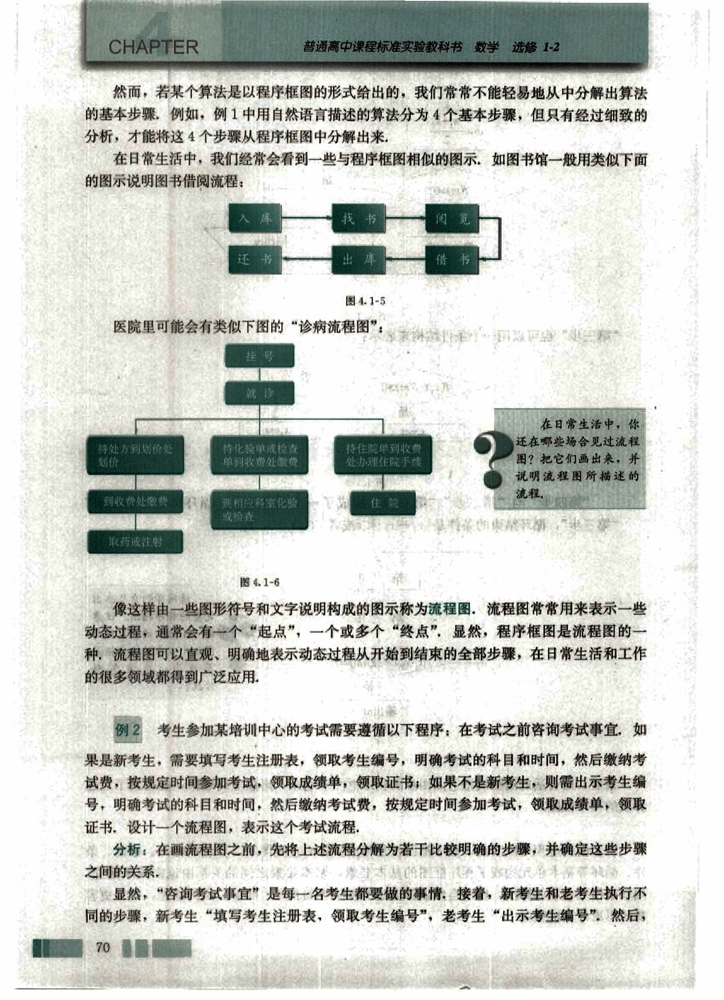
74

# 第四章 框图

## 共同执行以下步骤：“明确考试科目和时间”“缴纳考试费”“按规定时间参加考试”“领取成绩单”“领取证书”

**解:** 用流程图表示考试流程如下：

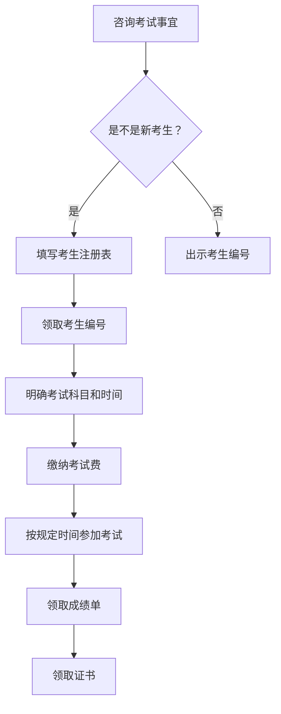
```mermaid
graph TD
    A[咨询考试事宜] --> B{是不是新考生？};
    B -- 是 --> C[填写考生注册表];
    B -- 否 --> D[出示考生编号];
    C --> E[领取考生编号];
    E --> F[明确考试科目和时间];
    F --> G[缴纳考试费];
    G --> H[按规定时间参加考试];
    H --> I[领取成绩单];
    I --> J[领取证书];

```

## 在你周围还有哪些过程可以用流程图表示？画一个流程图描述实际问题的流程。

通常，人们习惯按照从左到右，从上到下的顺序阅读图示，所以，流程图一般要按照从左到右，从上到下的顺序来画，程序框图有一定的规范和标准，而日常生活中用到的流程图则相对自由一些，可以使用不同的色彩，也可以添加一些生动的图形元素。流程图还可以用于描述工业生产的流程，这样的流程图通常称为工序流程图。

## 例 3 某工厂加工某种零件有三道工序：粗加工、返修加工和精加工，每道工序完成时，都要对产品进行检验，粗加工的合格品进入精加工，不合格品进入返修加工；返修加工的合格品进入精加工，不合格品作为废品处理；精加工的合格品为成品，不合格品为废品。用流程图表示这个零件的加工过程。

71

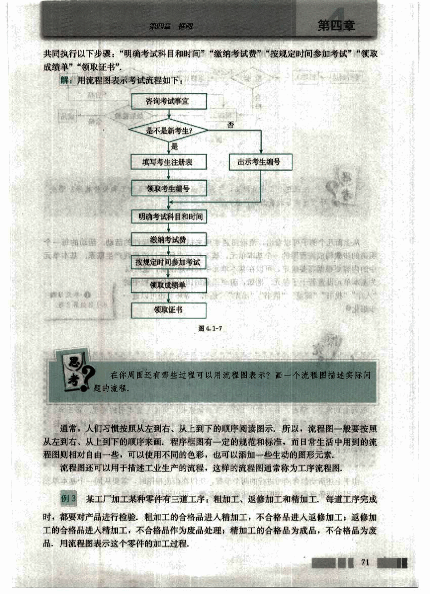
75

# CHAPTER

普通高中课程标准实验教科书 数学 选修 1-2

解：按照工序要求，可以画出下面的工序流程图：

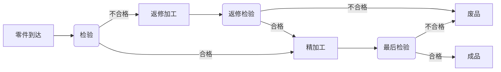
```mermaid
graph LR
A[零件到达] --> B(检验);
B -- 不合格 --> C[返修加工];
C --> D(返修检验);
D -- 不合格 --> E[废品];
D -- 合格 --> F[精加工];
B -- 合格 --> F;
F --> G(最后检验);
G -- 不合格 --> E;
G -- 合格 --> H[成品];
```

图 4.1-8

思考？

按照这个工序流程图，一件成品可能经过几道加工和检验程序？哪些环节可能导致废品的产生？

从上面几个例子可以看出，流程图通常用来描述一个过程性的活动。活动的每一个明确的步骤构成流程图的一个基本单元，基本单元之间通过流程线产生联系，基本单元中的内容要根据需要确定，可以在基本单元中具体地说明，也可以为基本单元设置若干子单元。例如，前面提到的图书借阅流程中的“入库”、“找书”、“阅览”、“借书”、“出库”、“还书”等环节还可以进一步细化。

探究

● 参见习题 4.1 B 组第 2 题。

某“儿童之家”开展亲子活动，计划活动按以下步骤进行：首先，儿童与家长按事先约定的时间来到“儿童之家”；然后，一部分工作人员接待儿童，做活动前的准备；同时，另一部分工作人员接待家长，交流儿童本周的表现；第三步，按照亲子活动方案进行活动；第四步，启导员填写亲子活动总结记录；同时，家长填写亲子活动反馈卡；最后，启导员填写服务跟踪表。你能为“儿童之家”的这项活动设计一个活动流程图吗？

由于上述活动包含同时进行的两个步骤，所以在画流程图时，需要从同一个基本单元出发，引出两条流程线，按照活动所确定的步骤，可以设计流程图如下：

72

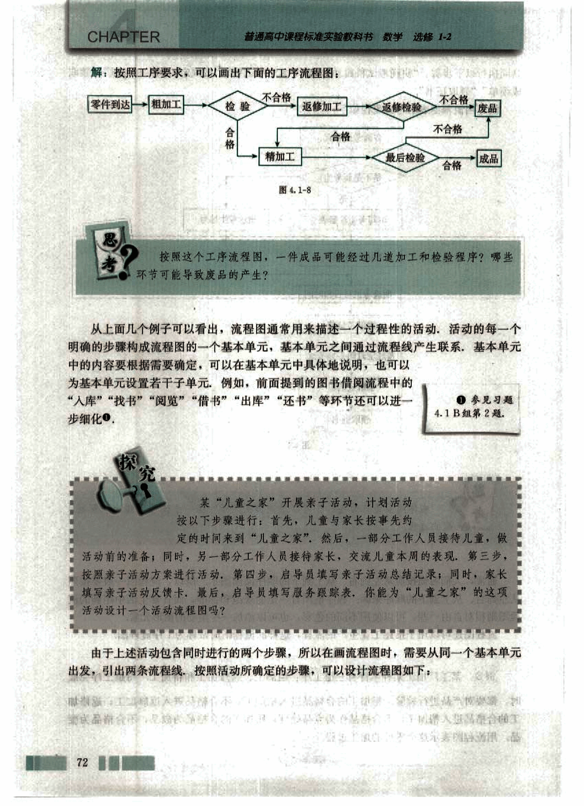
76

# 第四章 框图

## 儿童与家长如约来到“儿童之家”

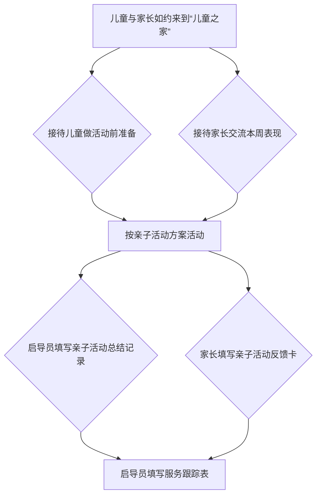
```mermaid
graph TD
    A[儿童与家长如约来到“儿童之家”] --> B{接待儿童做活动前准备};
    A --> C{接待家长交流本周表现};
    B --> D[按亲子活动方案活动];
    C --> D;
    D --> E{启导员填写亲子活动总结记录};
    D --> F{家长填写亲子活动反馈卡};
    E --> G[启导员填写服务跟踪表];
    F --> G;
```

图 4.1-9

## 流程图还可以比较直观地表达数学计算或证明过程中的主要思路，例如，在本册书的“推理与证明”中，我们用流程图表示综合法和分析法的解题过程如下：

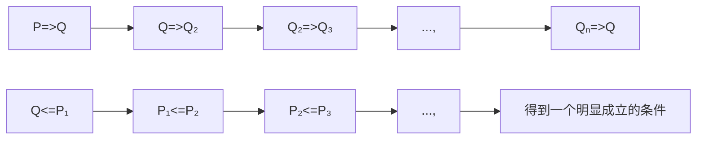
```mermaid
graph LR
    A[P=>Q] --> B[Q=>Q₂];
    B --> C[Q₂=>Q₃];
    C --> D[...,];
    D --> E[Qₙ=>Q];
    F[Q<=P₁] --> G[P₁<=P₂];
    G --> H[P₂<=P₃];
    H --> I[...,];
    I --> J[得到一个明显成立的条件];
```

图 4.1-10

其中 P 表示已知条件和已学过的定义、定理等，Q 表示要证明的结论。

一般来说，数学问题是不胜枚举的，解题的方法也千差万别，但是，我们解决数学问题的过程是类似的，可以用流程图表示如下：

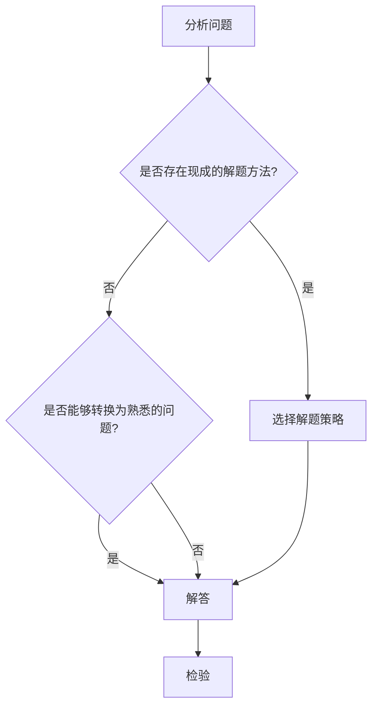
```mermaid
graph TD
    A[分析问题] --> B{是否存在现成的解题方法?};
    B -- 是 --> C[选择解题策略];
    B -- 否 --> D{是否能够转换为熟悉的问题?};
    D -- 是 --> E[解答];
    D -- 否 --> E;
    E --> F[检验];
    C --> E;

```

图 4.1-11
73

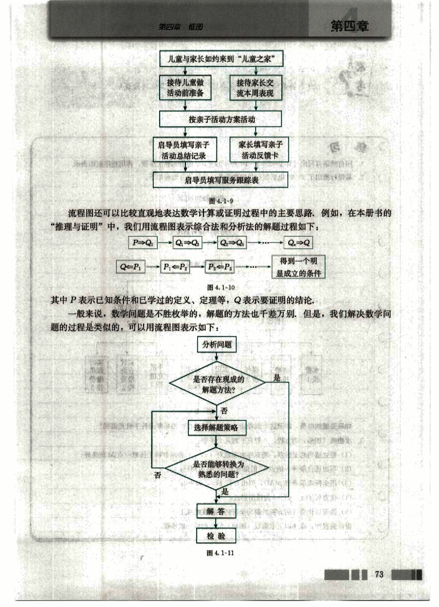
77

# CHAPTER

普通高中课程标准实验教科书 数学 选修 1-2

## 思考？

上述求解数学问题的步骤合理吗？用一个具体问题说明。

## 练习

1. 用自然语言写出计算 1 - 2 + 3 - 4 + … + 99 - 100 的值的算法步骤，再用程序框图表示。

2. 某银行推出了 95599 电话银行代缴费业务，具体业务流程如下：

拨通 95599 电话
↓
注册客户服务请按 1
↓
代缴费请按 5
↓
┌───────┐
│ 代缴公 │
│ 用事业 │
│ 费按 1 │
└───────┘
├───┬─────┬─────┐
│ 水费 │ 电费 │ 煤气 │
│ 按 1 │ 按 2 │ 按 3 │
└────┴─────┴─────┘
├───┬─────┐
│ 固定 │ 移动 │
│ 电话 │ 电话 │
│ 按 4 │ 按 5 │
└────┴─────┘
┌───────┐
│ 手机充 │
│ 值缴费 │
│ 按 2 │
└───────┘
├───┬─────┬─────┐
│ 手机 │ 实时 │ 实时 │
│ 充值 │ 查询 │ 账单 │
│ 按 1 │ 缴费 │ 缴费 │
└────┴─────┴─────┘

(第 2 题)

如果要缴纳电费，按照这个流程图，应该怎样操作？如果要进行手机充值呢？

3. 求曲线（图形）的方程，一般有下面几个步骤：

(1) 建立适当的坐标系，用有序的实数对 (x, y) 表示曲线上任意一点 M 的坐标；

(2) 写出适合条件 _p_ 的点 M 的集合 P = {M | _p_(M)}；

(3) 用坐标表示条件 _p_(M)，列出方程 _f_(x, y) = 0；

(4) 化方程 _f_(x, y) = 0 为最简形式；

(5) 说明以化简后的方程的解为坐标的点都在曲线上。

设计流程图，描述以上求曲线（图形）的方程的一般步骤。

74

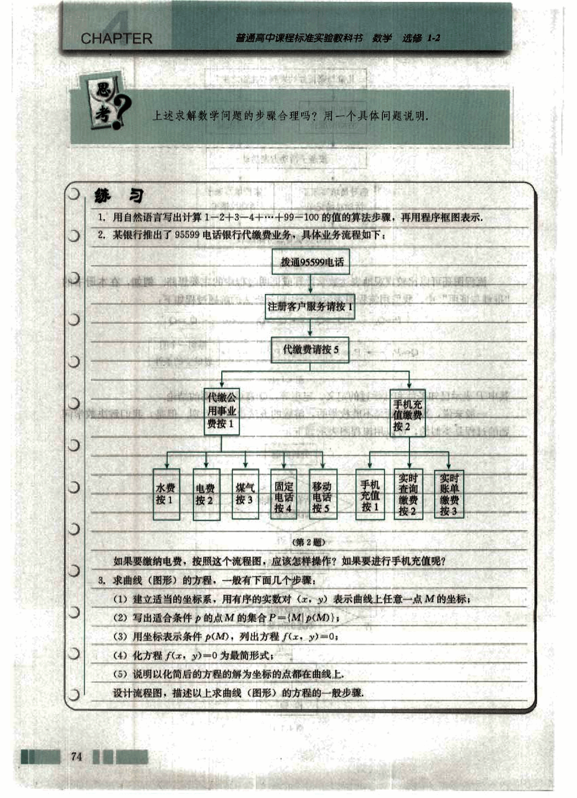
78

# 第四章 框图

## 习题 4.1

### A 组

1. 用自然语言写出将任意 5 个给定的正整数从大到小排序的算法步骤，并用程序框图表示。

2. 有这样一个游戏，每个人从任意一个正整数 _n_ 开始，连续进行如下运算：若是奇数，就把这个数乘以 3 再加 1；若是偶数，就把这个数除以 2。这样演算下去，直到第一次得到 1 为止。设计一个流程图，表示这个游戏的过程。

   例如，从 1 开始，就可以得到 1 → 4 → 2 → 1；从 17 开始，则可以得到 17 → 52 → 26 → 13 → 40 → 20 → 10 → 5 → 16 → 8 → 4 → 2 → 1。“角谷猜想”指出，按照这样的规则演算，最后总能得到 1。

3. 建立数学模型一般都要经历下列过程：从实际情境中提出问题，建立数学模型，通过计算或推导得到结果，结合实际情况进行检验，如果合乎实际，就得到可以应用的结果，否则重新审视问题的提出、建模、计算或推导得到结果的过程，直到得到合乎实际的结果为止。设计一个流程图表示这一过程。

4. 了解你所在学校入学和毕业离校的程序，并用流程图表示。

### B 组

1. 回顾“简单的线性规划问题”的求解过程，画出流程图。

2. 某中学图书馆制定了如下的图书借阅程序：

   (1) 入库：存放随身携带的物品 → 按顺序排队 → 出示本人借阅证 → 领取代书牌 → 入库；

   (2) 找书：从书架上取出一本书刊，将代书牌插放到该书刊的位置上 → 不阅览或不借，则把书刊放回原处 → 取出代书牌；

   (3) 阅览：取出要阅览的书刊（每人每次仅限—册）→ 将代书牌插放到该书刊的位置上 → 就座阅览 → 阅毕将书刊放回原处 → 取出代书牌；

   (4) 借书：若借某本书，则取出代书牌 → 将图书、借书证、代书牌一起交给工作人员 → 办理手续；

   (5) 出库：机器安全检测 → 排队领取所借图书 → 检查图书是否完好；

   (6) 还书：按顺序排队 → 把书交给工作人员 → 工作人员检查图书是否完好并办理手续 → 离开还书处。

   设计流程图表示上述图书借阅程序。

[image1](images/image1.png)
[image2](images/image2.png)

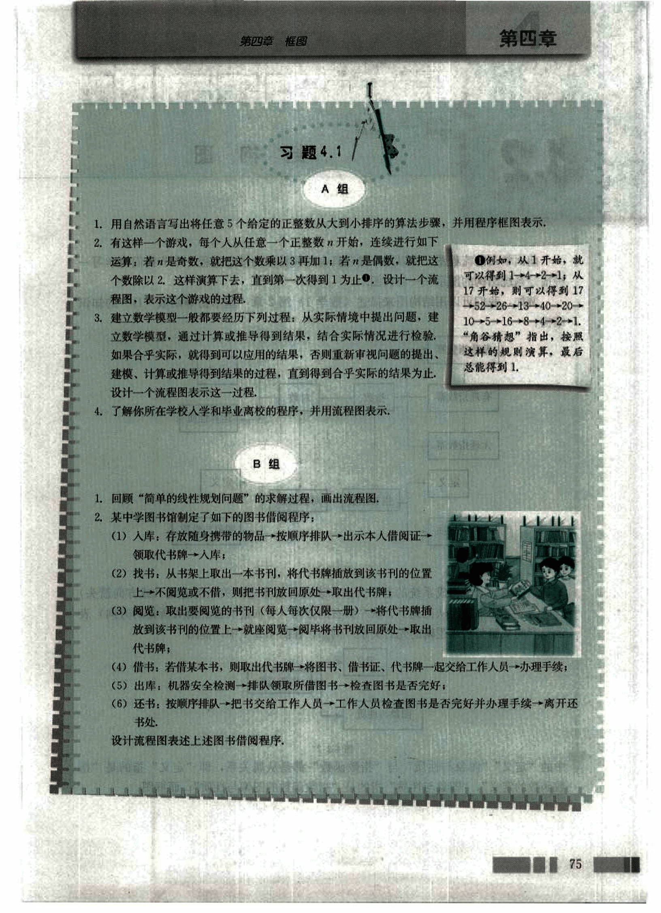
79

# CHAPTER 4.2 结构图

前面学习的流程图，可以用来描述具有时间特征的动态过程，本节我们将学习一种描述系统结构的图示——结构图。

例如，我们可以用结构图来描述《数学 1》第 2 章“基本初等函数(I)”的知识结构：

```
整数指数幂
     ├─ 指数
     │   ├─ 对数
     │   │   └─ 运算性质
     │   └─ 指数函数
     │       └─ 图象与性质
有理指数幂
     └─ 定义
无理指数幂
     └─ 定义
     └─ 对数函数
          └─ 图象与性质
```

图 4.2-1

结构图一般由构成系统的若干要素和表达各要素之间关系的连线（或方向箭头）构成。连线通常按照从上到下、从左到右的方向（方向箭头按照箭头所指的方向）表示要素的从属关系或逻辑的先后关系。例如，在图 4.2-1 中，框图

```
定义
     └─ 指数函数
          └─ 图象与性质
```

图 4.2-2

中的“定义”、“图象与性质”与“指数函数”都是从属关系，即“定义”指的是“指数函数的定义”，“图象与性质”指的是“指数函数的图像与性质”；而框图

76

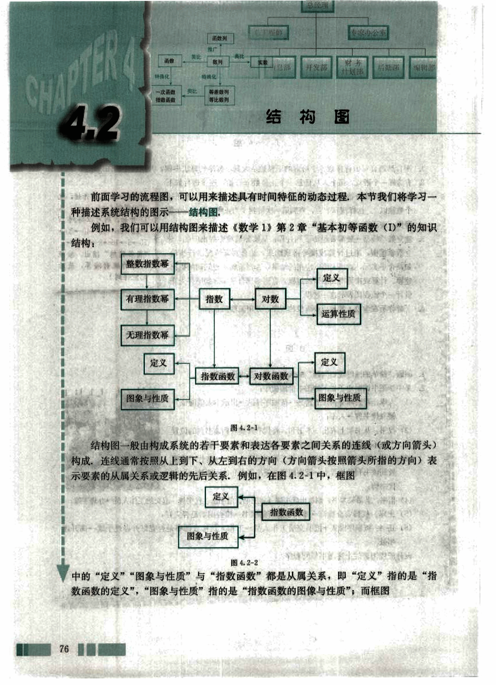
80

# 第四章 框图

## 整数指数幂

## 有理指数幂

## 无理指数幂

图 4.2-3

则反映了指数幂的推广过程.

### 思考？

从图 4.2-1 的知识结构图中，你还能获得关于这一章的哪些信息？

从图中，我们可以看出这一章主要研究了指数函数与对数函数的定义、图像和性质，还介绍了整数指数幂、有理指数幂、无理指数幂，以及对数及其运算等内容，我们还注意到指数是学习指数函数的前提，对数是学习对数函数的前提，而指数函数与对数函数之间、指数与对数之间都具有内在联系性。

画结构图与画流程图一样，首先要确定组成结构图的基本要素，然后通过连线来标明各要素之间的关系。

### 探究

设计一个结构图，表示《数学 3》第 2 章 “统计” 的知识结构。

这一章的知识结构图如下：（此处应插入图片，但由于无法处理图片，此处留空）

77

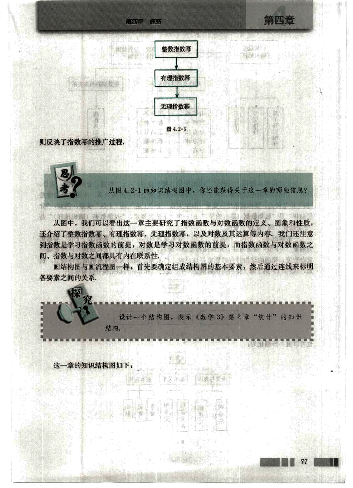
81

# CHAPTER

## 普通高中课程标准实验教科书 数学 选修 1-2

```
                      收集数据
                      (随机抽样)
                             |
                             |
                    ---------------------------
                    |                         |
             简单随机抽样             分层抽样            系统抽样
                    |                         |
                    |                         |
                    |                         |
                    ---------------------------
                             |
                             |
                     用样本估计总体
                             |
                    ---------------------------
                    |                         |
        用样本的频率分布估计总体分布     用样本数字特征估计总体数字特征
                    |                         |
                    |                         |
                    ---------------------------
                             |
                             |
                      变量间的相关关系
                             |
                             |
                         相关回归分析

```

图 4.2-4

这个结构图从整体上反映了“收集数据(随机抽样)”与“整理、分析数据，估计、推断”之间的逻辑先后关系，从上至下反映的是要素之间的从属关系，从属关系通常是“树”形结构的，即构成系统的要素一般至少有一个“上位”或“下位”要素，例如，“分层抽样”是“收集数据(随机抽样)”的一个“下位”要素，“收集数据(随机抽样)”是“分层抽样”的“上位”要素。

一般情况下，“下位”要素比“上位”要素更为具体，“上位”要素比“下位”要素更为抽象。“下位”要素越多，结构图越复杂，所以，画结构图时，应该根据具体需要确定复杂程度，简洁的结构图有时能更好地反映主体要素之间的关系和系统的整体特点，例如，《数学 1》第 1 章“集合与函数概念”中“集合”部分的知识结构可以表示为：

```
              集合
         /       |       \
含义与表示  基本关系   基本运算
```

图 4.2-5

也可以进一步细化为：

```
              集合
         /       |       \
含义与表示  基本关系   基本运算
       |          /   |   \
     -------     /    |    \
     |       |  /     |     \
列举法 描述法 包含关系 相等关系 并集 交集 补集
```

图 4.2-6

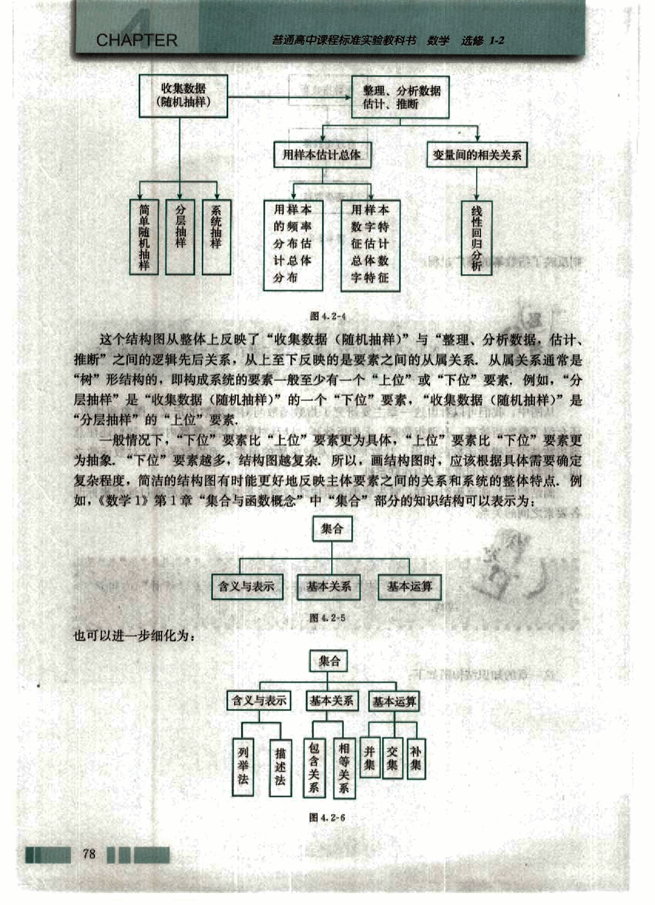
82

# 第四章 框图

## 在结构图中也经常会出现一些“环”形结构，这种情形常在表达逻辑先后关系时出现，例如，《数学 3》第 3 章“概率”的知识结构图如下：

```
随机事件 --> 频率 --> 概率，概率的意义与性质 --> 应用概率解决实际问题
                   |
                   V
               古典概型
                   |
                   V
               几何概型
                   ^
                   |
          随机数与随机模拟
```

图 4.2-7

可见，“古典概型”、“几何概型”与“随机数与随机模拟”都具有逻辑先后的关系。组织结构图还经常用来表示一个组织的构成，例如，下面的结构图是某校学生会的组织结构图：

```
                学生会
            /       |       \       |       \
       生活部   学习部   宣传部   体育部   文艺部
```

图 4.2-8

从图中可以知道，该校学生会由生活部、学习部、宣传部、体育部和文艺部 5 个部门构成。

组织结构图一般都呈“树”形结构，这种图直观，容易理解，被应用于很多领域，例如，下图是某公司的组织结构图：

```
                总经理
            /               \
       总工程师           专家办公室
       /     |     \           /     |     \     \
咨询部  监理部  信息部   开发部 财务计划部 后勤部 编辑部
```

图 4.2-9

79

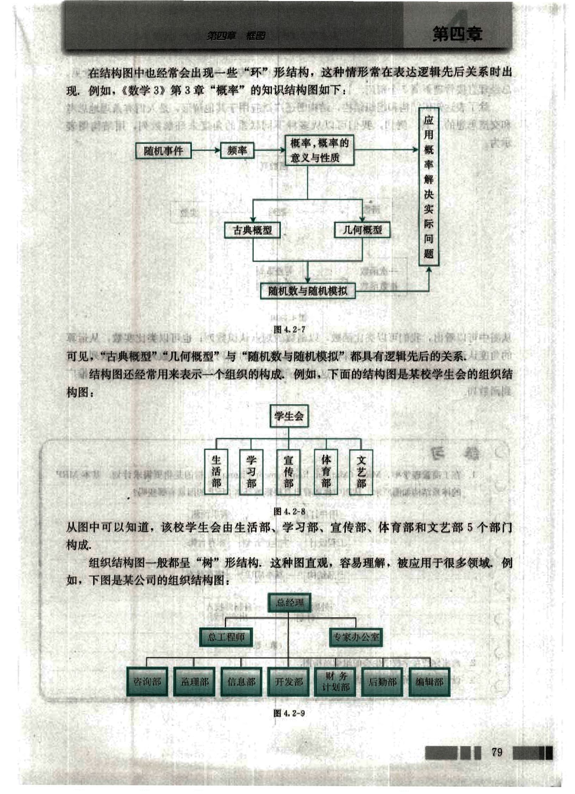
83

# CHAPTER

普通高中课程标准实验教科书 数学 选修 1-2

由图可知，总经理位居最高的领导位置，总工程师和专家办公室为总经理提供参谋意见，总经理直接管理下属 7 个部门。

除了表达知识结构和组织结构，结构图还广泛应用于其他情形，是人们有条理地思考和交流思想的工具，例如，我们可以从多种不同联系的角度来理解数列，用结构图表示为：

函数列
→ 推广 → 类比 → 实数
↑
函数 → 类比 → 数列
↓ 特殊化 ↓ 特殊化
一次函数 指数函数 → 类比 → 等差数列 等比数列

图 4.2-10

从图中可以看出，我们可以类比函数，以函数的观点认识数列；也可以类比实数，从运算的角度认识数列；也可以通过特殊化，得到两类特殊的数列——等差数列和等比数列，进而与一次函数和指数函数作类比，而这两种函数又都是函数的特殊化；还可以由数列推广到函数列。

## 练习

1. 在工商管理学中，MRP (Material Requirement Planning) 指的是物资需求计划，基本 MRP 的体系结构如图所示，从图中你能看出直接影响基本 MRP 的因素有哪些吗？

```
用户订单     需求预测
     \       /
       工程设计   主生产计划   库存台帐
            \     |     /
                产品结构   基本MRP   库存状态
                     \   |   /
                        外购件需求计划 自制件投入出产计划
```

(第 1 题)

2. 画出你所在学校学生会的组织结构图。

3. 设计一个你所在学校的课程结构图。

80

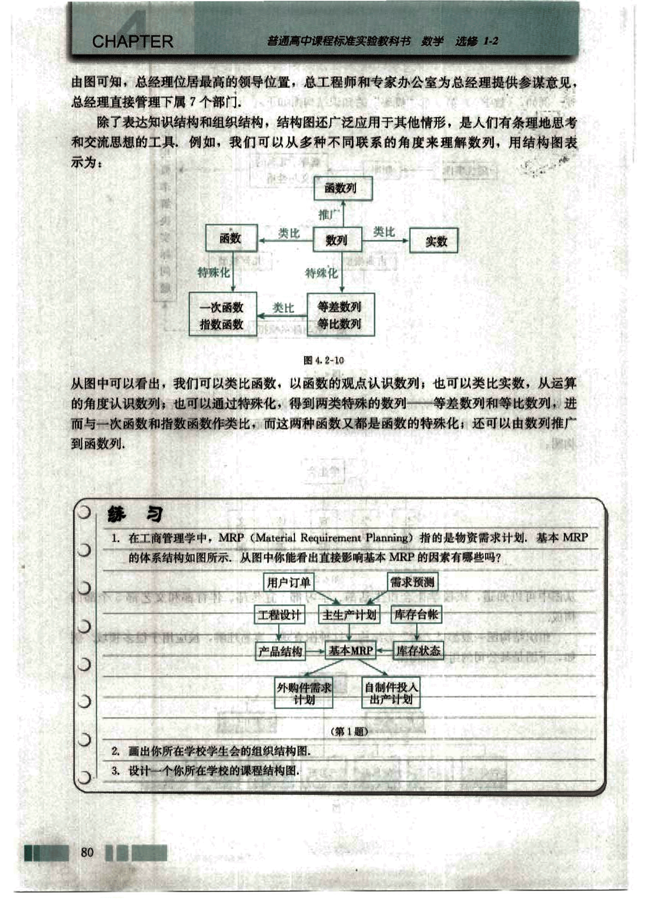
84

# 第四章 框图

## 用 Word2002 绘制流程图

手工绘制框图一般比较费时，随着信息技术的发展，出现了一些专门用于绘图的软件，如 Visio，SmartDraw 等，但这些软件比较专业。下面，我们介绍用 Word2002 自带的流程图绘图工具绘制流程图的方法，具体步骤如下：

1. 打开 Word2002，单击“绘图”工具栏上的“自选图形”，选择“流程图”，单击所需的图框符号，如单击表示“过程”的图框，[image1](images/image1.png)

2. 单击文档中要插入流程图的位置，拖动鼠标画图。[image2](images/image2.png)

3. 如果需要添加其他的图框，重复步骤 1 ～ 2，然后根据需要排列图框，如 [image3](images/image3.png)

4. 用流程线连接图框：在“绘图”工具栏上单击“自选图形”，选择“连接符”，单击所需的流程线，拖动鼠标用流程线将两个图框连接起来。

5. 重复第 4 步，直到用合适的流程线把所有的图框连接起来，如

81

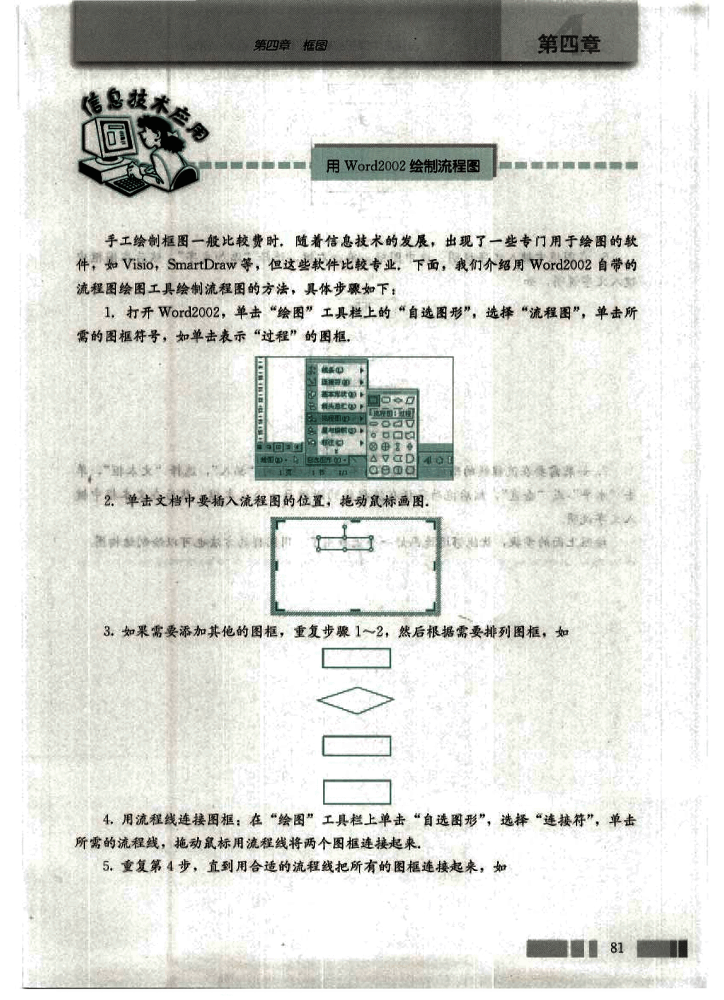
85

# CHAPTER

普通高中课程标准实验教科书 数学 选修 1-2

6. 在图框中键入文字说明：选中图框，单击右键，选择“添加文字”，然后在图框中键入文字说明，如

“开始”

7. 如果需要在流程线的附近添加文字，单击工具栏上的“插入”，选择“文本框”，单击“水平”或“垂直”，然后拖动鼠标在流程线的附近画一个文本框，然后在文本框中键入文字说明。

按照上面的步骤，就能够迅速画好一个流程图了，用同样的方法也可以绘制结构图。

82

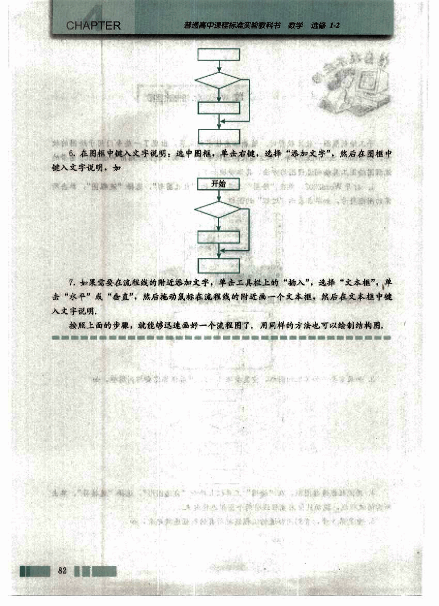
86

# 第四章 框图

## 习题 4.2

### A 组

1. 重新设计《数学 2》第 1 章 “空间几何体” 的知识结构图。
2. 考察你所在学校的机构设置情况，画出组织结构图。

### B 组

1. 总结所有有关函数的内容，画出知识结构图。
2. 根据下图中所示动物的分类结构图，理解图中各元素的从属关系，并设计一个框图表示这些关系。

| 物种名称 | 属       | 科       | 目     | 纲     | 门         | 界     |
| -------- | -------- | -------- | ------ | ------ | ---------- | ------ |
| 人       | 人属     | 人科     | 灵长目 |        |            |        |
| 豹       | 豹属     | 猫科     |        |        |            |        |
| 郊狼     |          |          | 食肉目 | 哺乳纲 |            |        |
| 狗       |          |          |        |        |            |        |
| 河狸     | 河狸属   | 河狸科   | 啮齿目 |        |            |        |
| 巨松鼠   | 巨松鼠属 | 松鼠科   |        |        |            |        |
| 长尾雀   | 长尾雀属 | 燕雀科   | 雀形目 | 鸟纲   | 脊索动物门 | 动物界 |
| 曜牛雀   | 朱雀属   |          |        |        |            |        |
| 地龟     | 龟属     | 淡水龟科 | 龟鳖目 | 爬行纲 |            |        |
| 台湾娟蛙 | 娟蛙属   | 姬蛙科   | 无尾目 | 两栖纲 |            |        |
| 德力娟蛙 |          |          |        |        |            |        |

83

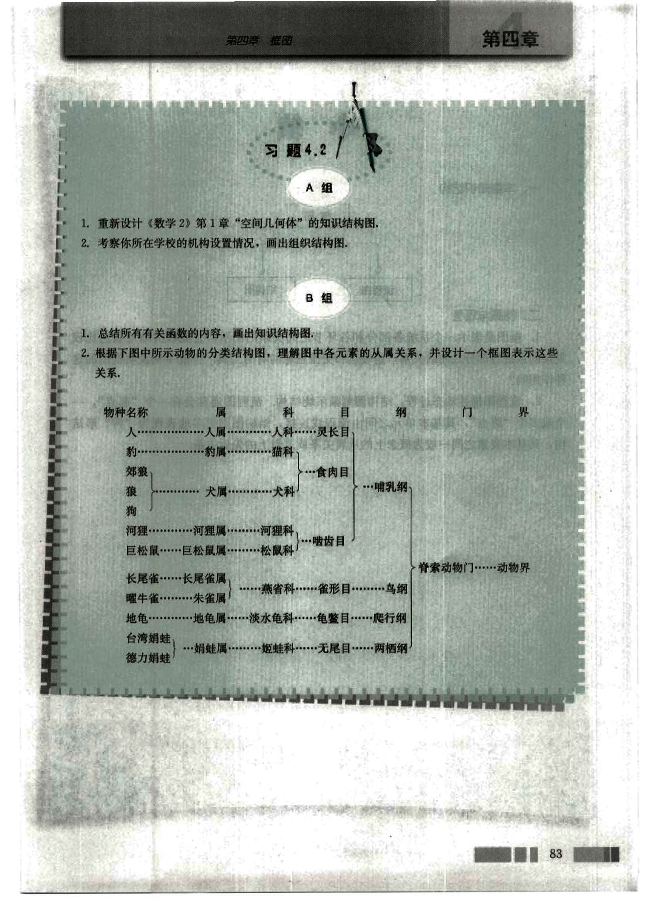
87

# 小结

## 一、本章知识结构

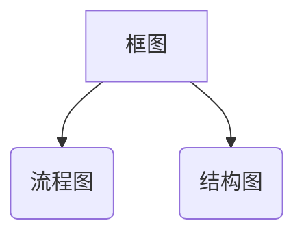
```mermaid
graph TD
    A[框图] --> B(流程图);
    A --> C(结构图);
```

## 二、回顾与思考

1. 框图是表示一个系统各部分和各环节之间关系的图示，它能够清晰地表达比较复杂的系统各部分之间的关系，是表达和交流思想的有力工具，你能举例说明框图的这种作用吗？

2. 流程图描述动态过程，结构图刻画系统结构，流程图通常会有一个“起点”，一个或多个“终点”，其基本单元之间由流程线连接；结构图则更多地表现为“树”形结构，其基本要素之间一般为概念上的从属关系或逻辑上的先后关系。

84

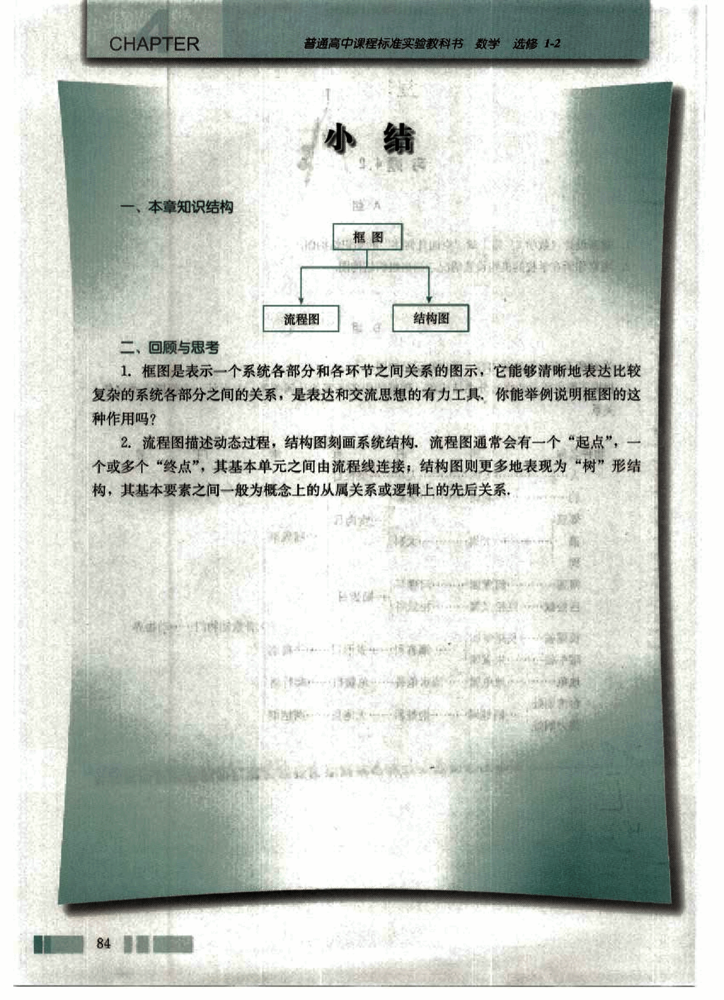
88

# 复习参考题

## A 组

1. 比较流程图和结构图的异同，并进行交流。要画出一副美观而实用的框图，你认为应该注意哪些方面的问 题。
2. 根据实际情况，画出你所在学校选举学生会干部或班干部的过程的流程图。
3. 一家新技术公司计划研制一个名片管理系统，希望系统能够具备以下功能：
   (1) 用户管理：能够修改密码，显示用户信息，修改用户信息。
   (2) 用户登录。
   (3) 名片管理：能够对名片进行删除、添加、修改、查询。
   (4) 出错信息处理。
   根据这些要求画出该系统的结构图。

## B 组

1. 根据你的经验，设计一个流程图描述解决某一具体数学问题的过程。
2. 随着计算机网络的日益普及，网上购物已经很普及，那么，人们在从事网上购物时，是怎样向商家支付费用的呢？下面的支付流程图就是一种解决方案：

```
消费者  --1-->  商家  --2-->  支付平台  --4-->  发卡银行  --6-->  转帐
        <--5--      <--7--      <--3--
             订  发   加密传输支付请求    网上支付    支付结果
             单  货
```

“网上购物支付流程图”的说明：

① 消费者向商家网站提交订单。

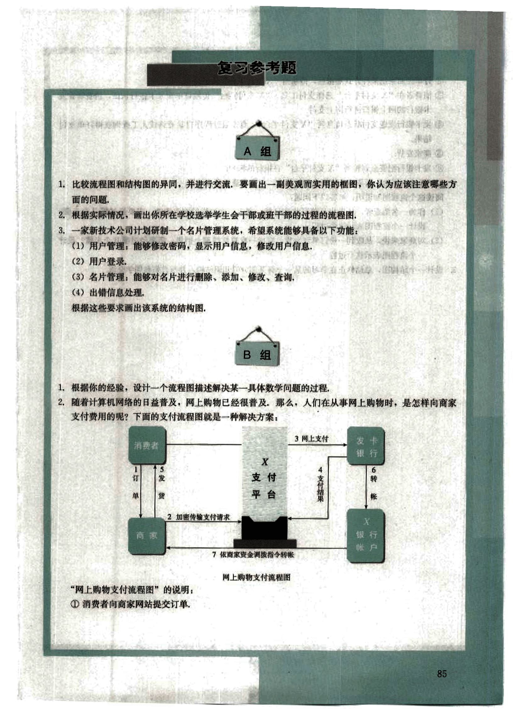
89

# 题目

② 订单经商家用某种方式加密后，传输给“X 支付平台”认证。

③ 消费者在“X 支付平台”选择支付工具，“X 支付平台”传输订单至发卡银行认证，消费者在发卡银行的网上银行进行网上支付。

④ 发卡银行发送支付状态信息到“X 支付平台”，商家通过程序自动查询或人工查询获得订单支付结果。

⑤ 商家发货。

⑥ 发卡银行把资金划转到“X 支付平台”在银行的帐户。

⑦ “X 支付平台”每周依商家资金调拨指令，与商家进行资金结算。

阅读这个流程图和说明，解答以下问题：

(1) 作为一名消费者，从发出订单到收到订货，完成一次这样的网上购物，需要经过哪几个步骤？设计一个流程图表示这个过程。

(2) 对商家来说，从收到一份订单到发货，完成一次这样的网上销售，需要经过哪几个步骤？设计一个流程图表示这个过程。

3. 设计一个结构图，总结你正在学习的某一学科某部分的知识结构，并与教师和同学交流。

86

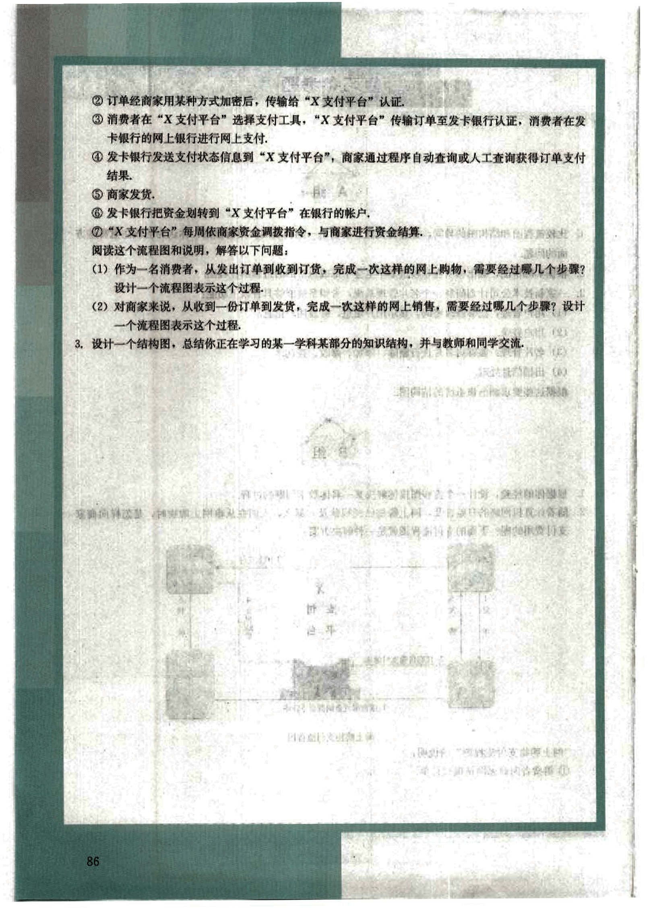
90

# 复习参考题

## A 组

1. 根据下列图案中圆圈的排列规则，猜想第(5)个图形由多少个圆圈组成，是怎样排列的；第 n 个图形中共有多少个圆圈？

```
0   000   000   0000000
(1)  (2)   (3)   (4)   (5)
```

(第 1 题)

2. 猜想$\sqrt{11\cdots1 - 22\cdots2} (n \in N^*)$的值，

3. 设$f(n) > 0 (n \in N^*)$, $f(2) = 4$, 并且对于任意$n_1, n_2 \in N^*$, $f(n_1 + n_2) = f(n_1)f(n_2)$成立，猜想$f(n)$的表达式，

4. 已知 O 是 △ABC 内任意一点，连结 AO，BO，CO 并延长交对边于 A', B', C', 则
   $\frac{OA'}{AA'} + \frac{OB'}{BB'} + \frac{OC'}{CC'} = 1$.
   这是平面几何中的一道题，其证明常采用“面积法”：

运用类比猜想，对于空间中的四面体，存在什么类似的结论，并用“体积法”证明。

5. 已知$A + B = \frac{5\pi}{4}$，且 A，B≠$k\pi - \frac{\pi}{2} (k \in Z)$，求证$(1 + \tan A)(1 + \tan B) = 2$.

48

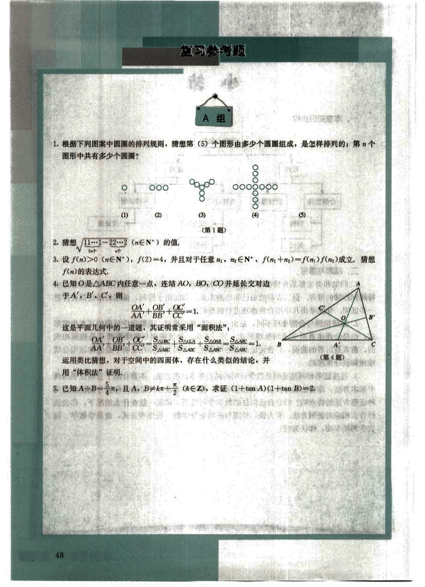
91

# 第二章 推理与证明

## 小结

### 一、本章知识结构

```
推理与证明
├─ 推理
│  ├─ 合情推理
│  │  ├─ 归纳
│  │  └─ 类比
│  └─ 演绎推理
└─ 证明
   ├─ 直接证明
   │  ├─ 综合法
   │  └─ 分析法
   └─ 间接证明
      └─ 反证法

```

### 二、回顾与思考

1. 归纳和类比都是合情推理，前者是由特殊到一般、部分到整体的推理，后者是由特殊到特殊的推理，但二者都能由已知推测未知，都能用于猜测，推理的结论都有待进一步证明。你能举出几个用合情推理进行猜想的例子吗？

2. 演绎推理与合情推理不同，是由一般到特殊的推理，是数学中证明的基本推理形式，也是公理体系所采用的推理形式。另一方面，合情推理与演绎推理又是相辅相成的，前者是后者的前提，后者论证前者的可靠性。举例说明你在证明中是怎样运用合情推理和演绎推理的。

3. 直接证明和间接证明是数学证明的两类基本证明方法。本章介绍了直接证明的两个基本方法：综合法和分析法；间接证明的一种基本方法：反证法。你能分别说出这几种证明方法的特点吗？结合自己以往的数学学习经历，说说一般在什么情况下，你会选择什么相应的证明方法。有人说，推理与证明是数学的一般思考方式，也是学数学、数学的基本功，你认为呢？

47

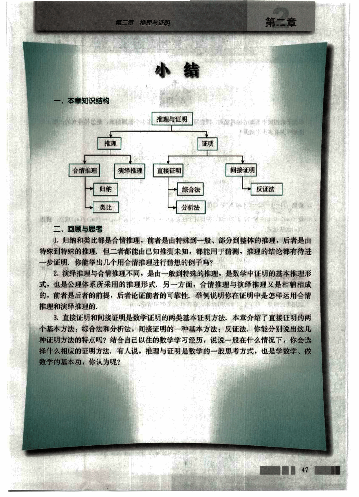
