# 选修 2-1

1

# 普通高中课程标准实验教科书

## 数学

### 选修 2-1

经全国中小学教材审定委员会 2005 年初审通过

人民教育出版社 课程教材研究所 编著

中学数学课程教材研究开发中心

[laptop](images/laptop.png)

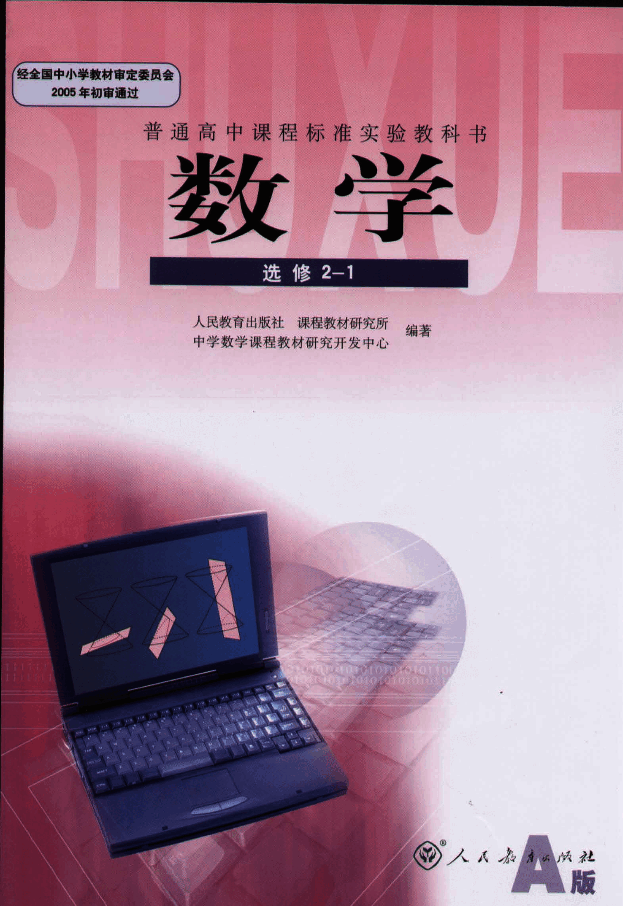
2

# 本书部分数学符号

$p \land q$ $p \land q$

$p \lor q$ $p \lor q$

$\neg p$ $p$ 的否定; 非 $p$

$p \implies q$ 若 $p$ 则 $q$

$p \iff q$ $p \implies q$, 且 $q \implies p$; $p$ 等价于 $q$

$\forall x \in M, p(x)$ 对每一个属于 $M$ 的 $x$, $p(x)$ 成立

$\exists x_0 \in M, p(x_0)$ 存在 $M$ 中的元素 $x_0$, 使 $p(x_0)$ 成立

$a$ 向量 $a$

$|a|$ 向量 $a$ 的长度或模

$\{a, b, c\}$ 空间向量的 一个基底

$\{i, j, k\}$ 空间向量的单位正交基

$a \cdot b$ 向量 $a$, $b$ 的数量积

$Oxyz$ 空间直角坐标系

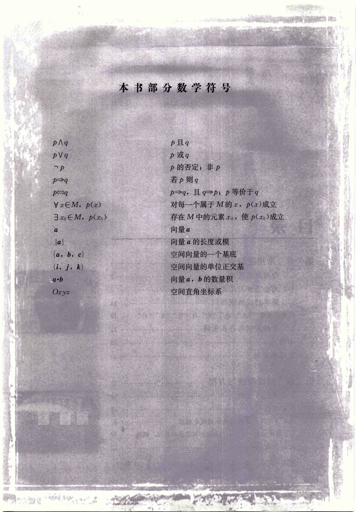
3

# 目录

# 第一章 常用逻辑用语

1.1 命题及其关系……1
1.2 充分条件与必要条件……2
1.3 简单的逻辑联结词……9
阅读与思考 “且” “或” “非” 与 “交” “并” “补”……14
1.4 全称量词与存在量词……19
小结……21
复习参考题……28
30

# 第二章 圆锥曲线与方程

2.1 曲线与方程……33
2.2 椭圆……34
探究与发现 为什么截口曲线是椭圆……38
信息技术应用 用《几何画板》探究点的轨迹：椭圆……42
50
2.3 双曲线……52
探究与发现 为什么 $y = \frac{b}{a}x$ 是双曲线 $\frac{x^2}{a^2} - \frac{y^2}{b^2} = 1$ 的……

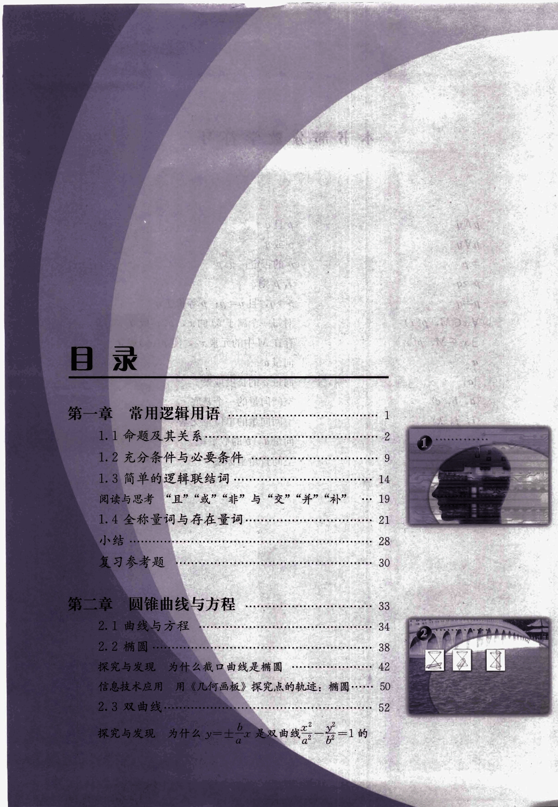
4

# 第三章 空间向量与立体几何

83

## 3.1 空间向量及其运算

84

阅读与思考 向量概念的推广与应用 99

## 3.2 立体几何中的向量方法

102

小结 115

复习参考题 117

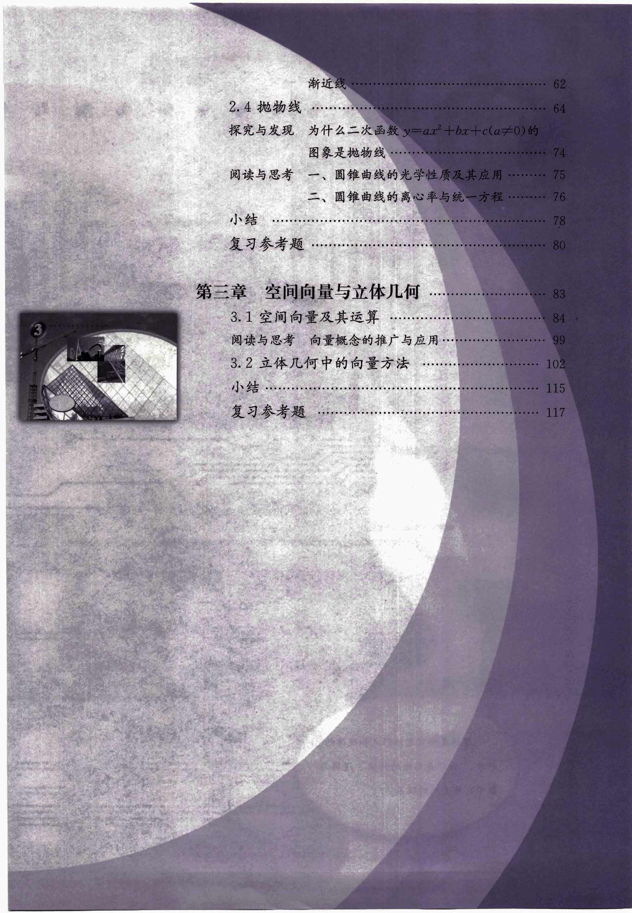
5

# 1

逻辑是研究思维形式和规律的科学，“数学是思维的科学”。逻辑与数学有着天然的联系.

6

# 第一章 常用逻辑用语

## 1.1 命题及其关系

## 1.2 充分条件与必要条件

## 1.3 简单的逻辑联结词

## 1.4 全称量词与存在量词

在我们日常交往、学习和工作中，逻辑用语是必不可少的工具，正确使用逻辑用语是现代社会公民应具备的基本素质。

数学是一门逻辑性很强的学科，表述数学概念和结论、进行推理和论证，都要使用逻辑用语。学习一些常用逻辑用语，可以使我们正确理解数学概念、合理论证数学结论、准确表达数学内容。

本章中，我们将学习命题及四种命题之间的关系、充分条件与必要条件、简单的逻辑联结词、全称量词与存在量词等一些基本知识。通过学习和使用常用逻辑用语，掌握常用逻辑用语的用法，纠正出现的逻辑错误，体会运用常用逻辑用语表述数学内容的准确性、简洁性。

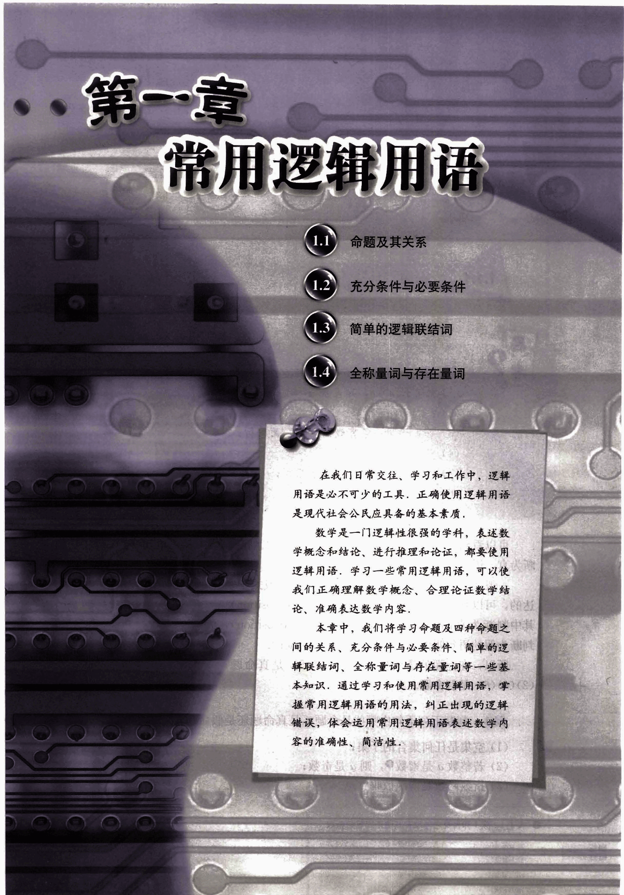
7

# CHAPTER 1

## 1.1 命题及其关系

### 1.1.1 命题

**思考？**

下列语句的表述形式有什么特点？你能判断它们的真假吗？

(1) 若直线 a//b，则直线 a 和直线 b 无公共点；
(2) 2+4=7；
(3) 垂直于同一条直线的两个平面平行；
(4) 若 $x^2=1$，则 x=1；
(5) 两个全等三角形的面积相等；
(6) 3 能被 2 整除。

可以看到，这些语句都是陈述句，并且可以判断真假。其中语句(1)(3)(5)判断为真，语句(2)(4)(6)判断为假。

一般地，在数学中，我们把用语言、符号或式子表达的，可以判断真假的陈述句叫做命题(proposition)。其中判断为真的语句叫做真命题(true proposition)，判断为假的语句叫做假命题(false proposition)。

所以，在上面的语句中，(1)(3)(5)是真命题，(2)(4)(6)是假命题。

**例 1** 判断下列语句中哪些是命题？是真命题还是假命题？

(1) 空集是任何集合的子集；
(2) 若整数 a 是素数，则 a 是奇数；
(3) 指数函数是增函数吗？

大于 1，除 1 和自身之外没有其他正因数的整数。

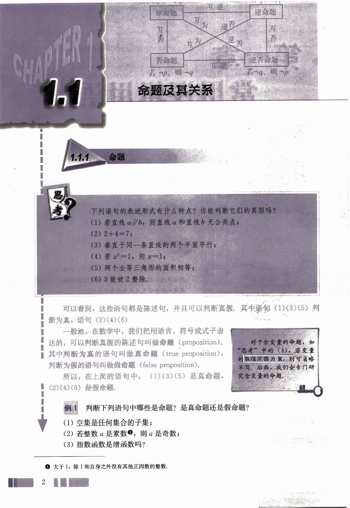
8

# 第一章 常用逻辑用语

(4) 若空间中两条直线不相交，则这两条直线平行；

(5) $\sqrt{(-2)^2} = 2$；

(6) $x > 15$.

分析：判断一个语句是不是命题，就是要看它是否符合“是陈述句”和“可以判断真假”这两个条件。

解：上面 6 个语句中，(3)不是陈述句，所以它不是命题；(6)虽然是陈述句，但因为无法判断它的真假，所以它也不是命题；其余 4 个都是陈述句，而且都可以判断真假，所以它们都是命题，其中 (1)(5) 是真命题，(2)(4) 是假命题。

容易看出，例 1 中的命题 (2)(4) 具有“若 p，则 q”的形式，在本章中，我们只讨论这种形式的命题。

通常，我们把这种形式的命题中的 p 叫做命题的条件，q 叫做命题的结论。

## 例 2 指出下列命题中的条件 p 和结论 q：

(1) 若整数 a 能被 2 整除，则 a 是偶数；

(2) 若四边形是菱形，则它的对角线互相垂直且平分。

解：(1) 条件 p：整数 a 能被 2 整除，结论 q：整数 a 是偶数。

(2) 条件 p：四边形是菱形，结论 q：四边形的对角线互相垂直且平分。

数学中有一些命题虽然表面上不是“若 p，则 q”的形式，例如“垂直于同一条直线的两个平面平行”，但是把它的表述作适当改变，就可以写成“若 p，则 q”的形式：

若两个平面垂直于同一条直线，则这两个平面平行。

这样，它的条件和结论就很清楚了。

## 例 3 将下列命题改写成“若 p，则 q”的形式，并判断真假：

(1) 垂直于同一条直线的两条直线平行；

(2) 负数的立方是负数；

(3) 对顶角相等。

解：(1) 若两条直线垂直于同一条直线，则这两条直线平行。

它是假命题。

(2) 若一个数是负数，则这个数的立方是负数。

它是真命题。

(3) 若两个角是对顶角，则这两个角相等。

它是真命题。

3

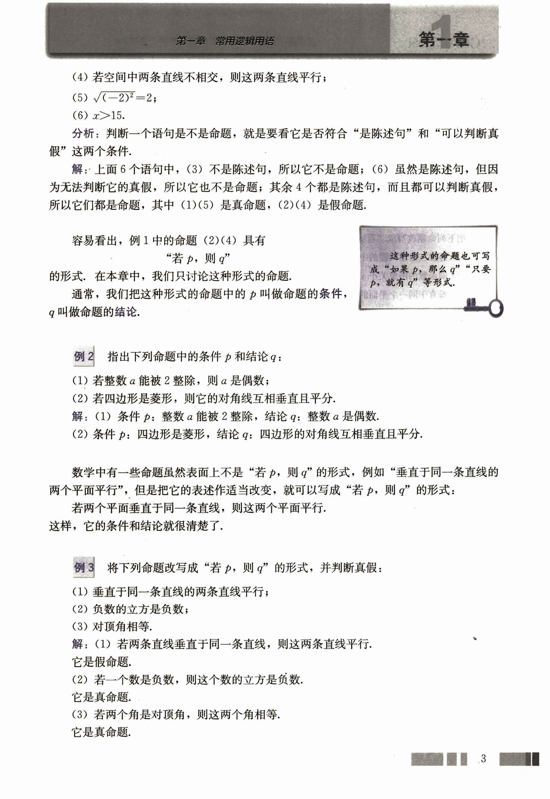
9

# CHAPTER

普通高中课程标准实验教科书 数学 选修 2-1

# 练习

1. 举出一些命题的例子，并判断它们的真假。

2. 判断下列命题的真假：
   (1) 能被 6 整除的整数一定能被 3 整除；
   (2) 若一个四边形的四条边相等，则这个四边形是正方形；
   (3) 二次函数的图象是一条抛物线；
   (4) 两个内角等于 45° 的三角形是等腰直角三角形。

3. 把下列命题改写成“若 p，则 q”的形式，并判断它们的真假：
   (1) 等腰三角形两腰的中线相等；
   (2) 偶函数的图象关于 y 轴对称；
   (3) 垂直于同一个平面的两个平面平行。

# 1.1.2 四种命题

思考

下列四个命题中，命题 (1) 与命题 (2)(3)(4) 的条件和结论之间分别有什么关系？

(1) 若 $f(x)$ 是正弦函数，则 $f(x)$ 是周期函数；
(2) 若 $f(x)$ 是周期函数，则 $f(x)$ 是正弦函数；
(3) 若 $f(x)$ 不是正弦函数，则 $f(x)$ 不是周期函数；
(4) 若 $f(x)$ 不是周期函数，则 $f(x)$ 不是正弦函数。

可以看到，命题 (1) 的条件是命题 (2) 的结论，且命题 (1) 的结论是命题 (2) 的条件，即它们的条件和结论互换了。

一般地，对于两个命题，如果一个命题的条件和结论分别是另一个命题的结论和条件，那么我们把这样的两个命题叫做互逆命题，其中一个命题叫做原命题 (original proposition)，另一个叫做原命题的逆命题 (inverse proposition)。

也就是说，如果原命题为

“若 p，则 q”，

那么它的逆命题为

“若 q，则 p”。

4

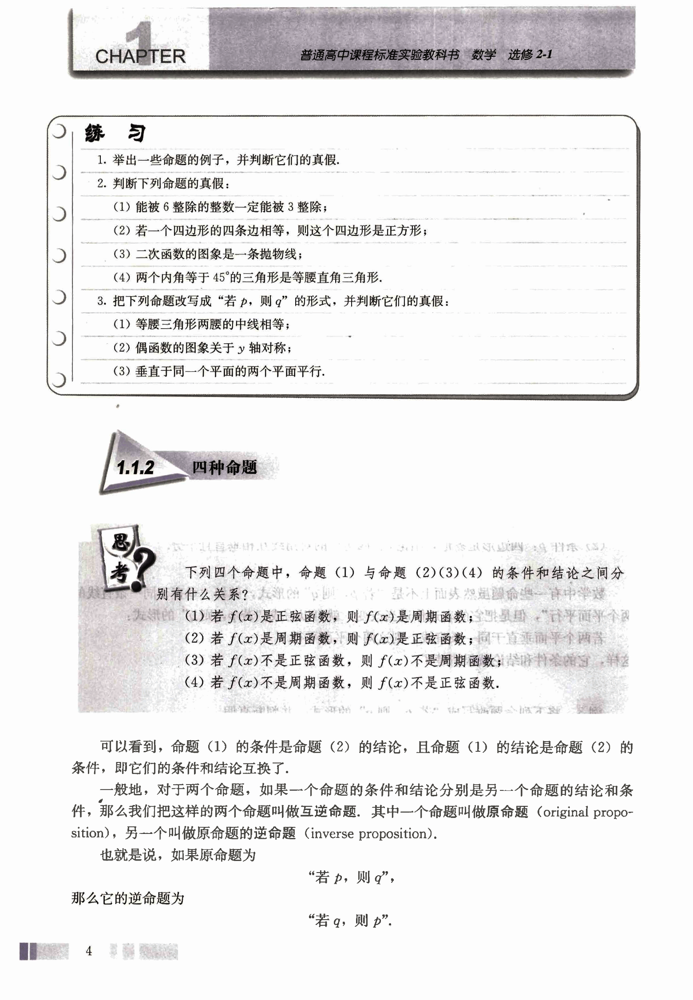
10

# 第一章 常用逻辑用语

## 第一章

这样一来，将一个已知命题的条件和结论互换，就可以得到一个新的命题，它是已知命题的逆命题。

例如，将命题“同位角相等，两直线平行”的条件和结论互换，就得到它的逆命题“两直线平行，同位角相等”。

探究

1. 举出一些互逆命题的例子，并判断原命题与逆命题的真假。
2. 如果原命题是真命题，那么它的逆命题一定是真命题吗？

对于命题(1)(3)，其中一个命题的条件和结论恰好是另一个命题的条件的否定和结论的否定，我们把这样的两个命题叫做互否命题，如果把其中的一个命题叫做原命题，那么另一个叫做原命题的否命题 (negative proposition)。

也就是说，如果原命题为
“若 p，则 q”，

那么它的否命题为
“若 ¬p，则 ¬q”。

例如，如果原命题是“同位角相等，两直线平行”，那么它的否命题是“同位角不相等，两直线不平行”。

为书写简便，我们常常把条件 p 的否定和结论 q 的否定，分别记作“¬p”和“¬q”，读作“非 p”和“非 q”。

又如，如果原命题是“若整数 a 不能被 2 整除，则 a 是奇数”，那么它的否命题是“若整数 a 能被 2 整除，则 a 是偶数”。

探究

1. 举出一些互否命题的例子，并判断原命题与否命题的真假。
2. 如果原命题是真命题，那么它的否命题一定是真命题吗？

对于命题(1)(4)，其中一个命题的条件和结论恰好是另一个命题的结论的否定和条件的否定，我们把这样的两个命题叫做互为逆否命题，如果把其中的一个命题叫做原命题，那么另一个叫做原命题的逆否命题 (inverse and negative proposition)。

也就是说，如果原命题为
“若 p，则 q”，

那么它的逆否命题为
“若 ¬q，则 ¬p”。

例如，如果原命题是“同位角相等，两直线平行”，那么它的逆否命题是“两直线不平行，同位角不相等”。

5

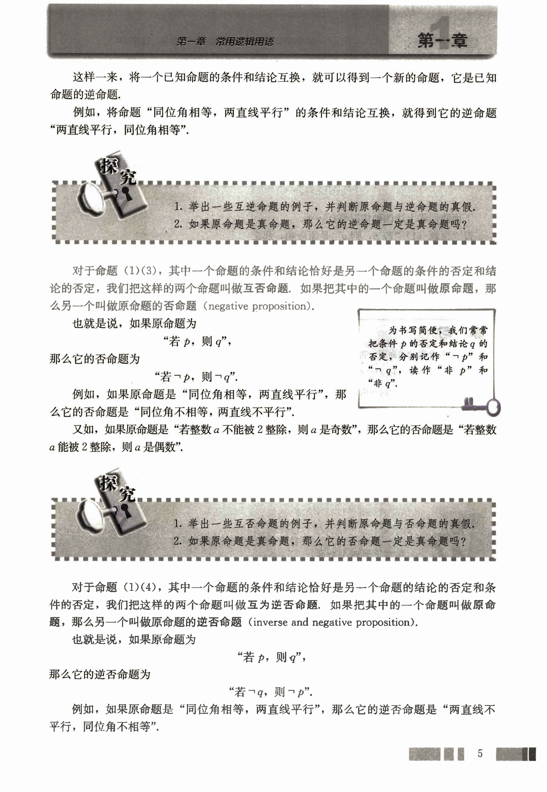
11

# CHAPTER 1

普通高中课程标准实验教科书 数学 选修 2-1

## 探究

1. 举出一些互为逆否命题的例子，并判断原命题与逆否命题的真假。
2. 如果原命题是真命题，那么它的逆否命题一定是真命题吗？

下面我们将上述四种情况概括一下。
设命题 (1) “若 p，则 q” 是原命题，那么
命题 (2) “若 q，则 p” 是原命题的逆命题，
命题 (3) “若 ¬p，则 ¬q” 是原命题的否命题，
命题 (4) “若 ¬q，则 ¬p” 是原命题的逆否命题。

## 练习

写出下列命题的逆命题、否命题和逆否命题，并判断它们的真假：
(1) 若一个整数的末位数字是 0，则这个整数能被 5 整除；
(2) 若一个三角形的两条边相等，则这个三角形的两个角相等；
(3) 奇函数的图象关于原点对称。

## 1.1.3 四种命题间的相互关系

### 思考

观察下面四个命题：
(1) 若 $f(x)$ 是正弦函数，则 $f(x)$ 是周期函数；
(2) 若 $f(x)$ 是周期函数，则 $f(x)$ 是正弦函数；
(3) 若 $f(x)$ 不是正弦函数，则 $f(x)$ 不是周期函数；
(4) 若 $f(x)$ 不是周期函数，则 $f(x)$ 不是正弦函数；

我们已经知道命题 (1) 与命题 (2)(3)(4) 之间的关系，你能说出其中任意两个命题之间的相互关系吗？

我们发现，命题 (2)(3) 是互为逆否命题，命题 (2)(4) 是互否命题，命题 (3)(4) 是互逆命题。

6

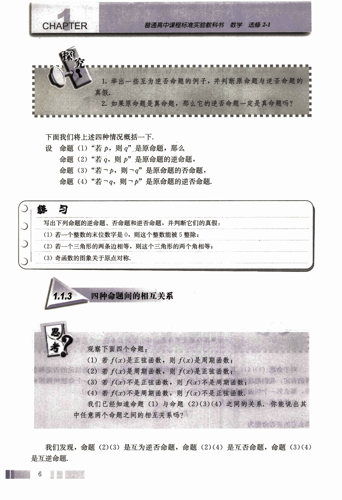
12

# 第一章 常用逻辑用语

## 一般地，原命题、逆命题、否命题与逆否命题这四种命题之间的相互关系，如图 1.1-1 所示。

上面考察了四种命题之间的相互关系，它们的真假性是否也有一定的相互关系呢？

以“思考”中的命题 (1)～(4) 为例，并设命题 (1) 是原命题。容易判断，原命题 (1) 是真命题，它的逆命题 (2) 是假命题，它的否命题 (3) 也是假命题，而它的逆否命题 (4) 是真命题。

## 探究

1. 以“若 $x^2 - 3x + 2 = 0$，则 $x = 2$” 为原命题，写出它的逆命题、否命题与逆否命题，并判断这些命题的真假。

2. 再分析其他的的一些命题，你能从中发现四种命题的真假性间有什么规律吗？

一般地，四种命题的真假性，有而且仅有下面四种情况：

| 原命题 | 逆命题 | 否命题 | 逆否命题 |
| ------ | ------ | ------ | -------- |
| 真     | 真     | 假     | 假       |
| 真     | 假     | 真     | 真       |
| 假     | 真     | 真     | 假       |
| 假     | 假     | 假     | 假       |

由于逆命题和否命题也是互为逆否命题，因此这四种命题的真假性之间的关系如下：

(1) 两个命题互为逆否命题，它们有相同的真假性；

(2) 两个命题为互逆命题或互否命题，它们的真假性没有关系。

由于原命题和它的逆否命题有相同的真假性，所以我们在直接证明某一个命题为真命题有困难时，可以通过证明它的逆否命题为真命题，来间接地证明原命题为真命题。

## 例 4 证明：若 $x^2 + y^2 = 0$，则 $x = y = 0$。

分析：将“若 $x^2 + y^2 = 0$，则 $x = y = 0$” 视为原命题，要证明原命题为真命题，可以

7

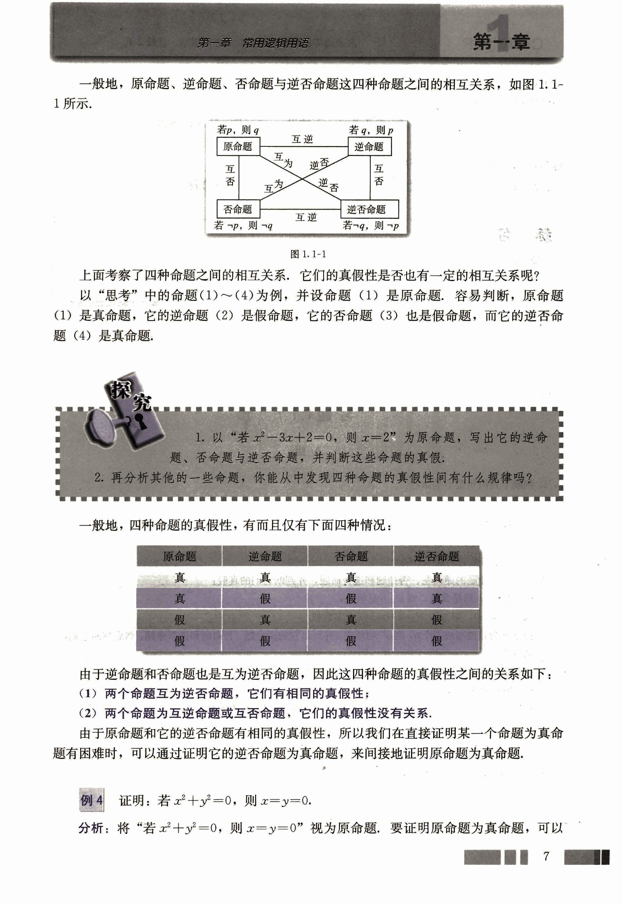
13

# CHAPTER 1

普通高中课程标准实验教科书 数学 选修 2-1

考虑证明它的逆否命题“若 x, y 中至少有一个不为 0, 则 $x^2 + y^2 ≠ 0$”为真命题，从而达到证明原命题为真命题的目的。

证明：若 x, y 中至少有一个不为 0，不妨设 x ≠ 0，则 $x^2 ≥ 0$，所以 $x^2 + y^2 > 0$。

这与已知条件 $x^2 + y^2 = 0$ 矛盾，故 x = y = 0。

这表明，原命题的逆否命题为真命题，从而原命题也为真命题。

## 练习

证明：若 $a^2 - b^2 + 2a - 4b - 3 ≠ 0$，则 a - b ≠ 1.

## 习题 1.1

### A 组

1. 判断下列语句是不是命题：
   (1) 12 > 5;
   (2) 若 a 为正无理数，则 $\sqrt{a}$ 也是无理数;
   (3) $x ∈ \{1, 2, 3, 4, 5\}$;
   (4) 正弦函数是周期函数吗？

2. 写出下列命题的逆命题、否命题和逆否命题，并判断它们的真假：
   (1) 若 a, b 都是偶数，则 a + b 是偶数；
   (2) 若 m > 0，则方程 $x^2 + x - m = 0$ 有实数根。

3. 把下列命题改写成“若 p，则 q”的形式，并写出它的逆命题、否命题和逆否命题，然后判断它们的真假：
   (1) 线段的垂直平分线上的点到这条线段两个端点的距离相等；
   (2) 矩形的对角线相等。

4. 求证：若一个三角形的两条边不相等，则这两条边所对的角也不相等。

### B 组

求证：圆的两条不是直径的相交弦不能互相平分。

8

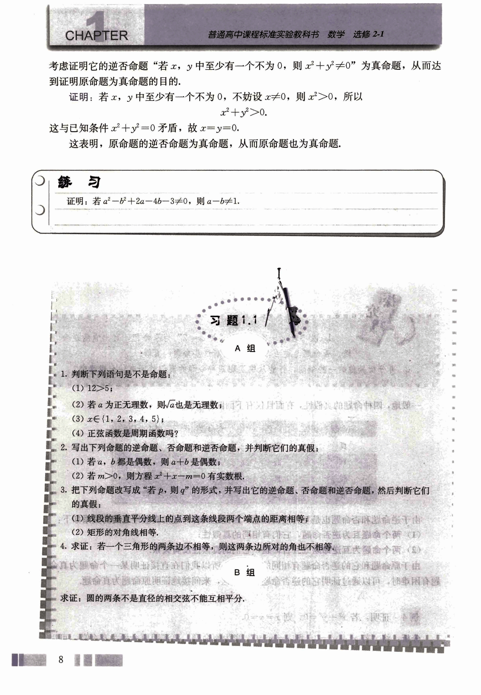
14

# CHAPTER 1

## 1.2 充分条件与必要条件

### 1.2.1 充分条件与必要条件

前面我们讨论了“若 p,则 q”形式的命题，其中有的命题为真命题，有的命题为假命题，例如，下列两个命题中：

(1) 若 x > a² + b²，则 x > 2ab，
(2) 若 ab = 0，则 a = 0，

命题(1)为真命题，命题(2)为假命题。

一般地，“若 p，则 q”为真命题，是指由 p 通过推理可以得出 q。这时，我们就说，由 p 可推出 q，记作

p → q，

并且说 p 是 q 的充分条件(sufficient condition)，q 是 p 的必要条件(necessary condition)。

上面的命题(1)是真命题，即

x > a² + b² → x > 2ab，

所以，“x > a² + b²”是“x > 2ab”的充分条件，“x > 2ab”是“x > a² + b²”的必要条件。

例 1 下列“若 p，则 q”形式的命题中，哪些命题中的 p 是 q 的充分条件？

(1) 若 x = 1，则 x² - 4x + 3 = 0；
(2) 若 f(x) = x，则 f(x)在(-∞, +∞)上为增函数；
(3) 若 x 为无理数，则 x² 为无理数。

解：命题(1)(2)是真命题，命题(3)是假命题。所以，命题(1)(2)中的 p 是 q 的充分条件。

如果“若 p，则 q”为假命题，那么由 p 推不出 q，记作 p ↛ q。此时，我们就说 p 不是 q 的充分条件，q 不是 p 的必要条件。

9

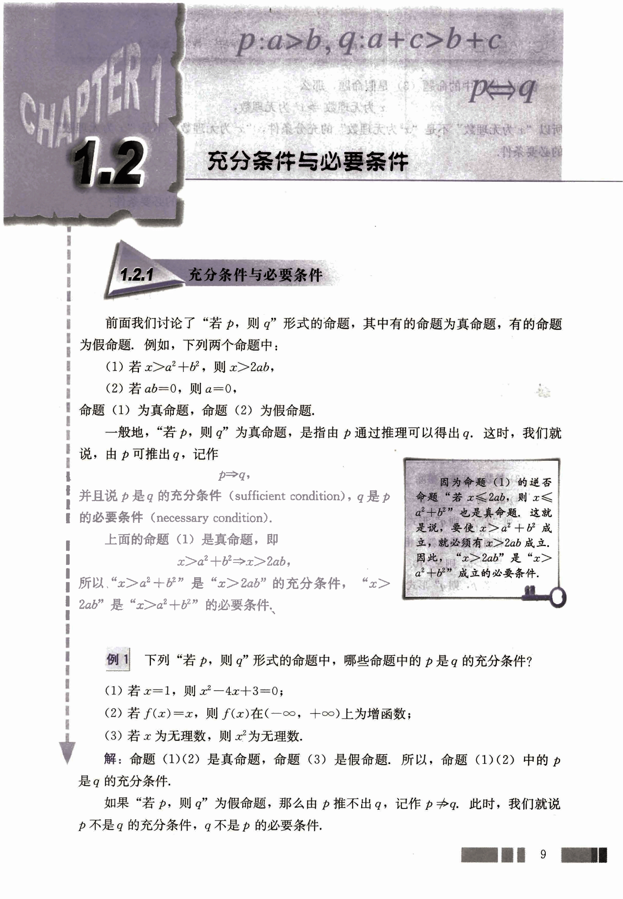
15

# CHAPTER 1

例如，例 1 中的命题(3)是假命题，那么
$x$为无理数 $\neq$ $x^2$为无理数，

所以“$x$为无理数”不是“$x^2$为无理数”的充分条件，“$x^2$为无理数”不是“$x$为无理数”
的必要条件。

## 例 2

下列“若 p，则 q”形式的命题中，哪些命题中的 q 是 p 的必要条件？

(1) 若$x = y$，则$x^2 = y^2$；
(2) 若两个三角形全等，则这两个三角形的面积相等；
(3) 若$a > b$，则$ac > bc$。

解：命题(1)(2)是真命题，命题(3)是假命题。所以，命题(1)(2)中的 q 是 p
的必要条件。

## 练习

1. 用符号“$\to$”与“$\iff$”填空：

(1) $x^2 = y^2$ **\_\_** $x = y$；
(2) 内错角相等 **\_\_** 两直线平行；
(3) 整数$a$能被 6 整除 **\_\_** $a$的个位数字为偶数；
(4) $ac = bc$ **\_\_** $a = b$。

2. 下列“若 p，则 q”形式的命题中，哪些命题中的 p 是 q 的充分条件？

(1) 若两条直线的斜率相等，则这两条直线平行；
(2) 若$x > 5$，则$x > 10$。

3. 下列“若 p，则 q”形式的命题中，哪些命题中的 p 是 q 的必要条件？

(1) 若$a + 5$是无理数，则$a$是无理数；
(2) 若$(x - a)(x - b) = 0$，则$x = a$。

4. 判断下列命题的真假：

(1) $x = 2$是$x^2 - 4x + 4 = 0$的必要条件；
(2) 圆心到直线的距离等于半径是这条直线为圆的切线的必要条件；
(3) $\sin a = \sin β$是$a = β$的充分条件；
(4) $ab \neq 0$是$a \neq 0$的充分条件。

10

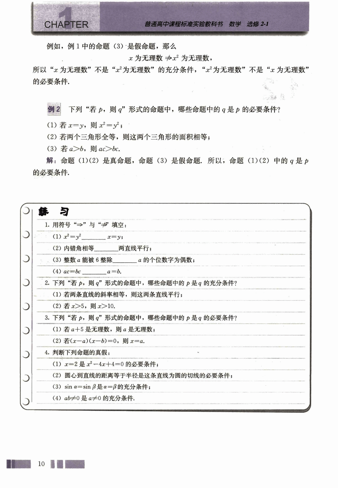
16

# 第一章 常用逻辑用语

## 1.2.2 充要条件

已知 _p_: 整数 _a_ 是 6 的倍数，_q_: 整数 _a_ 是 2 和 3 的倍数。那么 _p_ 是 _q_ 的什么条件？_q_ 又是 _p_ 的什么条件？

在上述问题中，_p_ → _q_，所以 _p_ 是 _q_ 的充分条件，_q_ 是 _p_ 的必要条件。另一方面，_q_ → _p_，所以 _p_ 也是 _q_ 的必要条件，_q_ 也是 _p_ 的充分条件。

一般地，如果既有 _p_ → _q_，又有 _q_ → _p_，就记作

_p_ ↔ _q_.

此时，我们说，_p_ 是 _q_ 的充分必要条件，简称充要条件 (sufficient and necessary condition)。显然，如果 _p_ 是 _q_ 的充要条件，那么 _q_ 也是 _p_ 的充要条件。

概括地说，如果 _p_ ↔ _q_，那么 _p_ 与 _q_ 互为充要条件。

**例 3** 下列各题中，哪些 _p_ 是 _q_ 的充要条件？

(1) _p_: _b_ = 0, _q_: 函数 _f(x)_ = *a*x² + _bx_ + _c_ 是偶函数;

(2) _p_: _x_ > 0, _y_ > 0, _q_: _xy_ > 0;

(3) _p_: _a_ < _b_, _q_: _a_ + _c_ < _b_ + _c_.

解：在 (1)(3) 中，_p_ ↔ _q_，所以 (1)(3) 中的 _p_ 是 _q_ 的充要条件。在 (2) 中，_q_ ⊈ _p_，所以 (2) 中的 _p_ 不是 _q_ 的充要条件。

**例 4** 已知：○○ 的半径为 _r_，圆心 O 到直线 _l_ 的距离为 _d_。

求证：_d_ = _r_ 是直线 _l_ 与 ○○ 相切的充要条件。

分析：设 _p_: _d_ = _r_, _q_: 直线 _l_ 与 ○○ 相切。要证 _p_ 是 _q_ 的充要条件，只需分别证明充分性 (_p_ → _q_) 和必要性 (_q_ → _p_) 即可。

证明：如图 1.2-1 所示，作 OP ⊥ _l_ 于点 P，则 OP = _d_。

(1) 充分性 (_p_ → _q_): 若 _d_ = _r_，则点 P 在 ○○ 上。在直线 _l_ 上任取一点 Q(异于点 P)，连接 OQ。在 Rt△OPQ 中，OQ > OP = _r_。所以，除点 P 外直线 _l_ 上的点都在 ○○ 的外部，即直线 _l_ 与 ○○ 仅有一个公共点 P。所以直线 _l_ 与 ○○ 相切。

(2) 必要性 (_q_ → _p_): 若直线 _l_ 与 ○○ 相切，不妨设切点为 P，则 OP ⊥ _l_。因此，_d_ = OP = _r_.

11

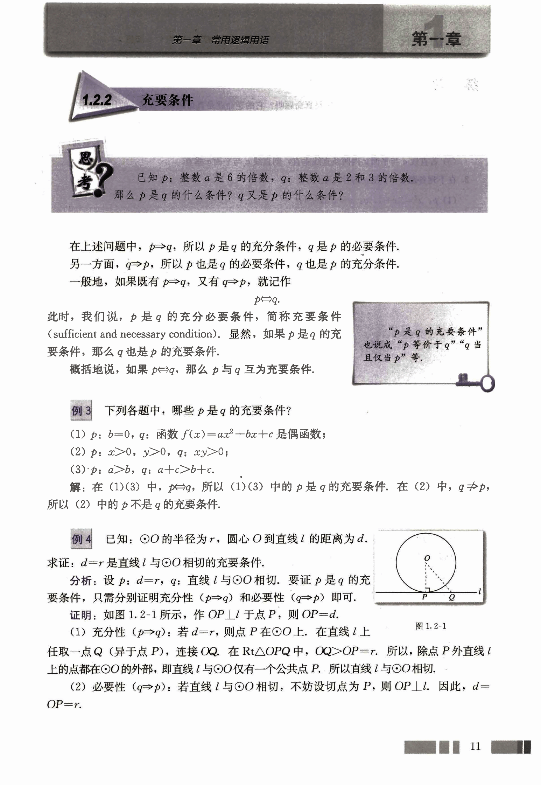
17

# CHAPTER 1

## 练习

1. 下列形如“若 p,则 q”的命题是真命题吗？它的逆命题是真命题吗？p 是 q 的什么条件？
   (1) 若平面外一条直线与平面内一条直线平行，则直线与平面平行；
   (2) 若数列{$a_n$}的通项公式是$a_n = n + c$(c 是常数)，则数列{$a_n$}是公差等于 1 的等差数列；
   (3) 若直线与平面内两条直线垂直，则直线与平面垂直。

2. 在下列各题中，p 是 q 的什么条件？
   (1) p: $x^2 = 3x + 4$, q: $x = \sqrt{3x + 4}$；
   (2) p: $x - 3 = 0$, q: $(x - 3)(x - 4) = 0$；
   (3) p: $b^2 - 4ac \ge 0$ ($a \ne 0$), q: $ax^2 + bx + c = 0$ ($a \ne 0$)有实根；
   (4) p: x = 1 是方程$ax^2 + bx + c = 0$的一个根，q: $a + b + c = 0$.

## 习题 1.2

### A 组

1. 举例说明：
   (1) p 是 q 的充分条件；
   (2) p 是 q 的必要条件；
   (3) p 是 q 的充要条件。

2. 判断下列命题的真假：
   (1) “$a > b$”是“$a^2 > b^2$”的充分条件；
   (2) “$|a| > |b|$”是“$a^2 > b^2$”的必要条件；
   (3) “$a > b$”是“$a + c > b + c$”的充要条件。

3. 下列各题中，p 是 q 的什么条件？
   (1) p: $x = 1$, q: $x - 1 = \sqrt{x - 1}$；
   (2) p: $|x - 2| \le 3$, q: $-1 \le x \le 5$；
   (3) p: $x = 2$, q: $x - 3 = \sqrt{3 - x}$；
   (4) p: 三角形是等边三角形，q: 三角形是等腰三角形。

4. 求圆$(x - a)^2 + (y - b)^2 = r^2$经过原点的充要条件。

12

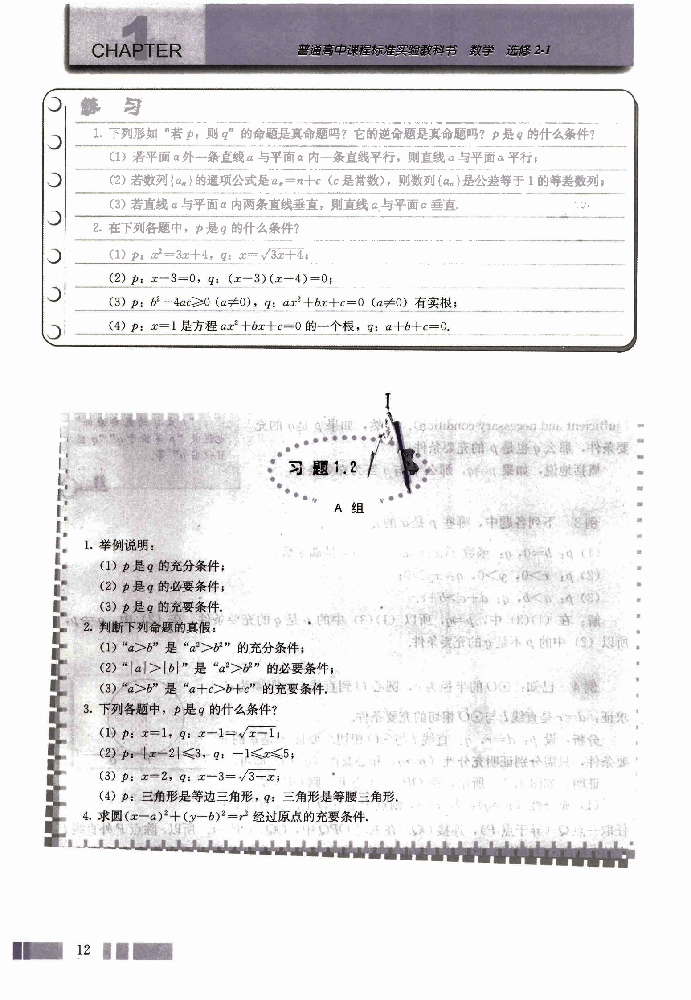
18

# 第一章 常用逻辑用语

## B 组

1. 已知 A={x|x 满足条件 p}, B={x|x 满足条件 q}.
   (1)如果 A⊆B,那么 p 是 q 的什么条件;
   (2)如果 B⊆A,那么 p 是 q 的什么条件;
   (3)如果 A=B,那么 p 是 q 的什么条件.

2. 证明:△ABC 是等边三角形的充要条件是
   $a^2+b^2+c^2=ab+ac+bc,$
   这里 a, b, c 是 △ABC 的三条边.

13

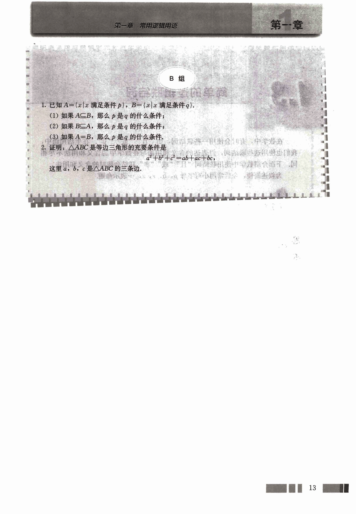
19

# CHAPTER 1

## 1.3 简单的逻辑联结词

在数学中，有时会使用一些联结词，如“且”“或”“非”。在生活用语中，我们也使用这些联结词，但表达的含义和用法与在数学中的含义和用法不尽相同。下面介绍数学中使用联结词“且”“或”“非”联结命题时的含义和用法。

为叙述简便，今后常用小写字母 _p_, _q_, _r_, _s_, …表示命题。

### 1.3.1 且 (and)

下列三个命题间有什么关系？
(1) 12 能被 3 整除；
(2) 12 能被 4 整除；
(3) 12 能被 3 整除且能被 4 整除。

可以看到，命题(3)是由命题(1)(2)使用联结词“且”联结得到的新命题。

一般地，用联结词“且”把命题 _p_ 和命题 _q_ 联结起来，就得到一个新命题，记作 _p∧q_，读作“*p*且*q*”。

命题 _p∧q_ 的真假如何确定呢？

一般地，我们规定：

当 _p_, _q_ 都是真命题时，_p∧q_ 是真命题；当 _p_, _q_ 两个命题中有一个命题是假命题时，_p∧q_ 是假命题。

上面“思考”中的命题(1)(2)都是真命题，所以命题(3)是真命题。

[circuit_diagram](images/circuit_diagram.png)

我们可以从串联电路理解联结词“且”的含义。若开关 _p_, _q_ 的闭合与断开分别对应命题 _p_, _q_ 的真与假，则整个电路的接通与断开分别对应命题 _p∧q_ 的真与假。

14

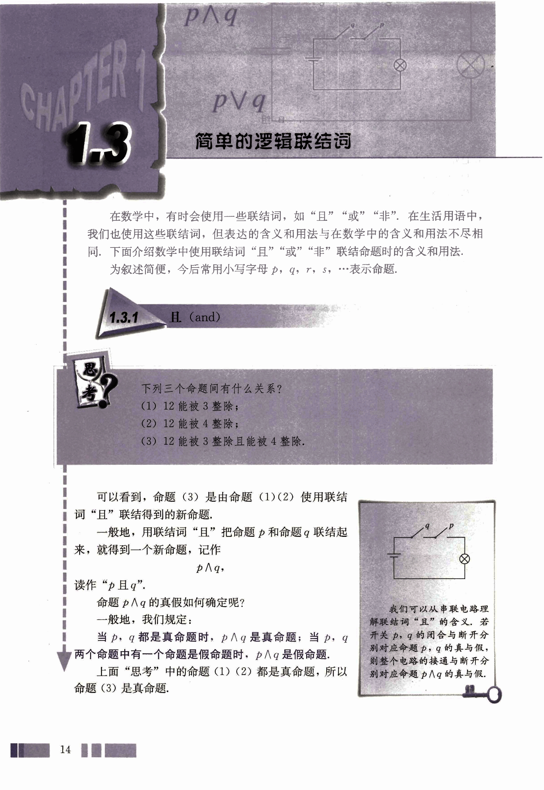
20

# 第一章 常用逻辑用语

## 例 1

将下列命题用“且”联结成新命题，并判断它们的真假：

(1) p: 平行四边形的对角线互相平分，q: 平行四边形的对角线相等；

(2) p: 菱形的对角线互相垂直，q: 菱形的对角线互相平分；

(3) p: 35 是 15 的倍数，q: 35 是 7 的倍数.

解：(1) $p \land q$: 平行四边形的对角线互相平分且相等。由于 p 是真命题，q 是假命题，所以$p \land q$是假命题。

(2) $p \land q$: 菱形的对角线互相垂直且平分。由于 p 是真命题，q 是真命题，所以$p \land q$是真命题。

(3) $p \land q$: 35 是 15 的倍数且是 7 的倍数。由于 p 是假命题，q 是真命题，所以$p \land q$是假命题。

## 例 2

用逻辑联结词“且”改写下列命题，并判断它们的真假：

(1) 1 既是奇数，又是素数；

(2) 2 和 3 都是素数.

解：(1) 命题“1 既是奇数，也是素数”可以改写为“1 是奇数且 1 是素数”，因为“1 是素数”是假命题，所以这个命题是假命题。

(2) 命题“2 和 3 都是素数”可以改写为“2 是素数且 3 是素数”。因为“2 是素数”与“3 是素数”都是真命题，所以这个命题是真命题。

## 1.3.2 或 (or)

### 思考？

下列三个命题间有什么关系？

(1) 27 是 7 的倍数；

(2) 27 是 9 的倍数；

(3) 27 是 7 的倍数或是 9 的倍数.

命题(3)是由命题(1)(2)用联结词“或”联结得到的新命题。

一般地，用联结词“或”把命题 p 和命题 q 联结起来，就得到一个新命题，记作$p \lor q$，读作“p 或 q”.

15

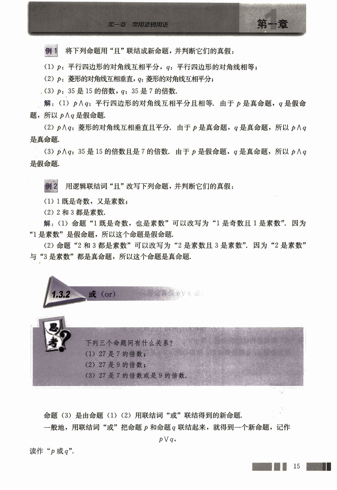
21

# CHAPTER 1

命题 $p \lor q$ 的真假如何确定呢？

一般地，我们规定：

当 $p$，$q$ 两个命题有一个命题是真命题时，$p \lor q$ 是真命题；当 $p$，$q$ 两个命题都是假命题时，$p \lor q$ 是假命题。

上面“思考”中的命题 (1) 是假命题，命题 (2) 是真命题，所以命题 (3) 是真命题。

## 例 3

判断下列命题的真假：

(1) $2 \le 2$；

(2) 集合 A 是 $A \cap B$ 的子集或是 $A \cup B$ 的子集；

(3) 周长相等的两个三角形全等或面积相等的两个三角形全等。

解：

(1) 命题 “$2 \le 2$” 是由命题：

$p$：$2 = 2$；$q$：$2 < 2$

用“或”联结后构成的新的命题，即 $p \lor q$。

因为命题 $p$ 是真命题，所以命题 $p \lor q$ 是真命题。

(2) 命题 “集合 A 是 $A \cap B$ 的子集或是 $A \cup B$ 的子集” 是由命题：

$p$：集合 A 是 $A \cap B$ 的子集；

$q$：集合 A 是 $A \cup B$ 的子集

用“或”联结后构成的新的命题，即 $p \lor q$。

因为命题 $q$ 是真命题，所以命题 $p \lor q$ 是真命题。

(3) 命题 “周长相等的两个三角形全等或面积相等的两个三角形全等” 是由命题：

$p$：周长相等的两个三角形全等；

$q$：面积相等的两个三角形全等

用“或”联结后构成的新的命题，即 $p \lor q$。

因为命题 $p$，$q$ 都是假命题，所以命题 $p \lor q$ 是假命题。

如果 $p \land q$ 为真命题，那么 $p \lor q$ 一定是真命题吗？反之，如果 $p \lor q$ 为真命题，那么 $p \land q$ 一定是真命题吗？

16

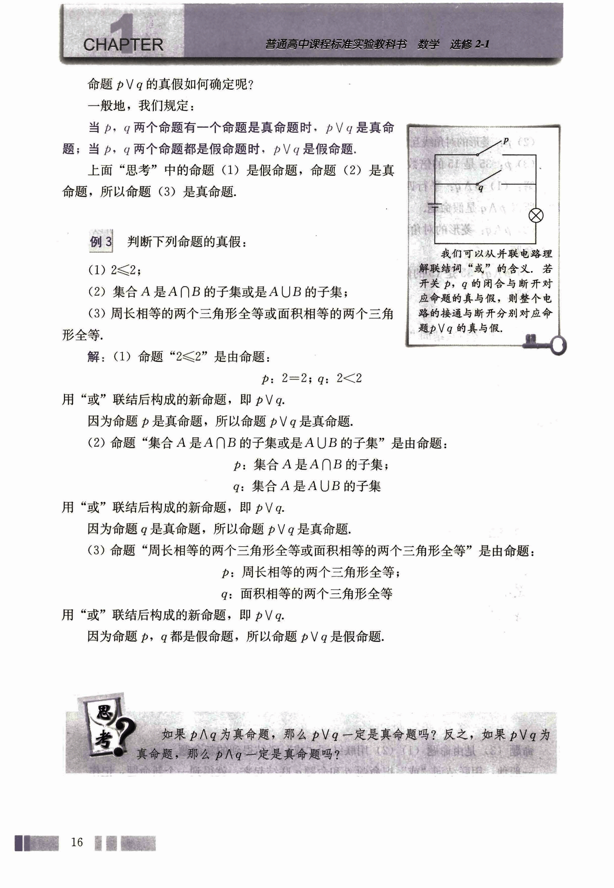
22

# 第一章 常用逻辑用语

## 1.3.3 非 (not)

思考？

下列两个命题间有什么关系？
(1) 35 能被 5 整除；
(2) 35 不能被 5 整除.

可以看到，命题 (2) 是命题 (1) 的否定。
一般地，对一个命题全盘否定，就得到一个新命题，记作 ¬p，
读作“非 p”或“p 的否定”。

上面的思考中，命题 (1) 是真命题，命题 (2) 是假命题。命题 ¬p 是 p 的否定，¬p 与 p 不能同为真命题，也不能同为假命题，也就是说，
若 p 是真命题，则 ¬p 必须是假命题；若 p 是假命题，则 ¬p 必须是真命题。

例 4 写出下列命题的否定，并判断它们的真假：
(1) p：y = sin x 是周期函数；
(2) p：3 < 2；
(3) p：空集是集合 A 的子集。

解：(1) ¬p：y = sin x 不是周期函数。
命题 p 是真命题，¬p 是假命题。

(2) ¬p：3 ≥ 2。
命题 p 是假命题，¬p 是真命题。

(3) ¬p：空集不是集合 A 的子集。
命题 p 是真命题，¬p 是假命题。

17

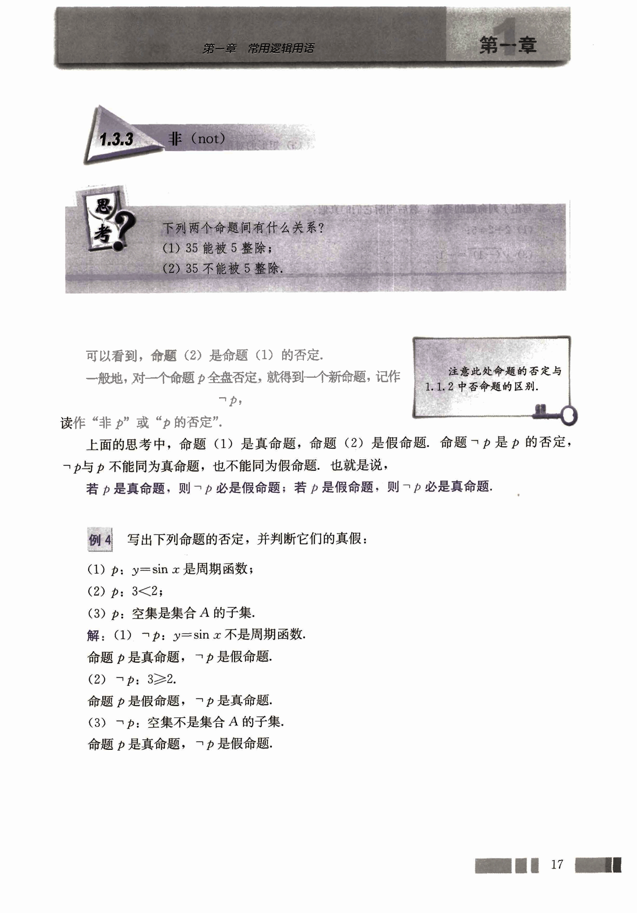
23

# CHAPTER 1

## 练习

1. 判断下列命题的真假：
   (1) 12 是 48 且是 36 的约数；
   (2) 矩形的对角线互相垂直且平分.

2. 判断下列命题的真假：
   (1) 47 是 7 的倍数或 49 是 7 的倍数；
   (2) 等腰梯形的对角线互相平分或互相垂直.

3. 写出下列命题的否定，然后判断它们的真假：
   (1) 2 + 2 = 5；
   (2) 3 是方程 $x^2 - 9 = 0$ 的根；
   (3) $\sqrt{(-1)^2} = -1$.

## 习题 1.3

### A 组

1. 写出下列命题，并判断它们的真假：
   (1) $p \lor q$，这里 $p$: $4 \in \{2, 3\}$，$q$: $2 \in \{2, 3\}$；
   (2) $p \land q$，这里 $p$: $4 \in \{2, 3\}$，$q$: $2 \in \{2, 3\}$；
   (3) $p \lor q$，这里 $p$: 2 是偶数，$q$: 3 不是质数；
   (4) $p \land q$，这里 $p$: 2 是偶数，$q$: 3 不是质数.

2. 判断下列命题的真假：
   (1) $5 > 2$ 且 $7 > 3$；
   (2) $3 > 4$ 或 $3 < 4$；
   (3) $7 \ge 8$.

3. 写出下列命题的否定，并判断它们的真假：
   (1) $\sqrt{2}$ 是有理数；
   (2) 5 不是 15 的约数；
   (3) $2 < 3$；
   (4) $8 + 7 \ne 15$；
   (5) 空集是任何集合的真子集.

### B 组

判断下列命题的真假，并说明理由：
(1) $p \lor q$，这里 $p$: π 是无理数，$q$: π 是实数；
(2) $p \land q$，这里 $p$: π 是无理数，$q$: π 是实数；
(3) $p \lor q$，这里 $p$: $2 > 3$，$q$: $8 + 7 \ne 15$；
(4) $p \land q$，这里 $p$: $2 > 3$，$q$: $8 + 7 \ne 15$.

18

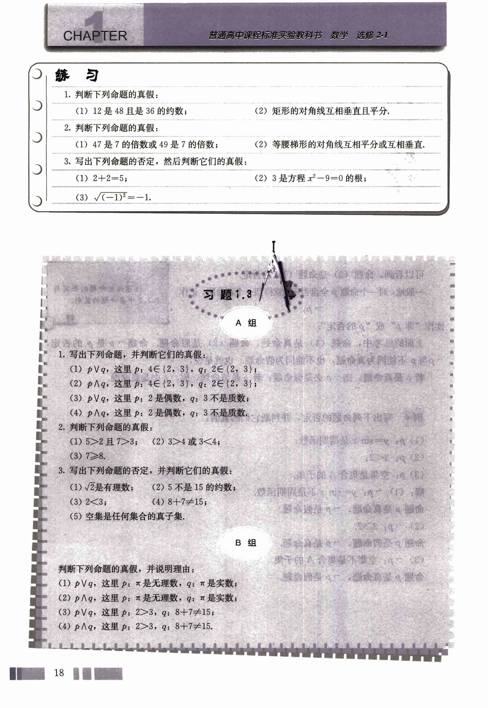
24

# 第一章 常用逻辑用语

## “且”“或”“非”与“交”“并”“补”

逻辑联结词“且”“或”“非”与集合的“交”“并”“补”之间有关系吗？

先看一个具体例子。

我们知道，由“2 是偶数”与“2 是质数”都是真命题，可以得到“2 是偶数且是质数”是真命题，另一方面，由集合的“交”运算可以知道：由 2∈{偶数}，2∈{质数}，可以得到 2∈{偶数}∩{质数}。如果把“真”对应于 ∈，“且”对应于“交”，那么，“2 是偶数是真命题”可以对应于 2∈{偶数}，“2 是质数是真命题”可以对应于 2∈{质数}，“2 是偶数且是质数”是真命题就可以对应于 2∈{偶数}∩{质数}。

从上述例子得到启发，我们可以在逻辑联结词“且”与集合的“交”运算之间建立联系。

我们知道，对于逻辑联结词“且”有如下规定：

若 p，q 都是真命题，则 p∧q 是真命题；若 p，q 中有假命题，则 p∧q 是假命题。

对于集合的“交”有如下规定：

若 a∈P，a∈Q，则 a∈P∩Q；若 a∉P 或 a∉Q，则 a∉P∩Q。

把命题 p，q 分别对应于集合 P，Q，“真”“假”“∧”分别对应于“∈”“∉”“∩”，那么上述关于“且”与“交”的规定就具有形式的一致性，更具体地说，就是“p 是真命题”对应于“a∈P”,“q 是真命题”对应于“a∈Q”,“p∧q 是真命题”对应于“a∈P∩Q”,“p∧q 是假命题”对应于“a∉P∩Q”。

你能发现逻辑联结词“或”和集合的“并”运算的规定在形式上的一致性吗？

逻辑联结词“非”和集合的“补”又有什么关系呢？

再看一个具体例子。

若以整数集为全集，则偶数集和奇数集互为补集，由“2 是偶数”是真命题，可以得到“2 是奇数”是假命题；由“3 是偶数”是假命题，可以得到“3 是奇数”是真命题，用集合的方式则可表达为：由 2∈{偶数}，可以得到 2∉{奇数}；由 3∉{偶数}，可以得到 3∈{奇数}。如果把“非”“真”“假”分别对应于“补”“∈”“∉”，那么，命题 p 和它的否定 ¬p 可以对应于集合 P 和它的补集 C∪P，“p 是真命题”对应于“a∈P”,“¬p 是假命题”对应于“a∈C∪P”,“p 是假命题”对应于“a∉P”,“¬p 是真命题”对应于“a∈C∪P”。

19

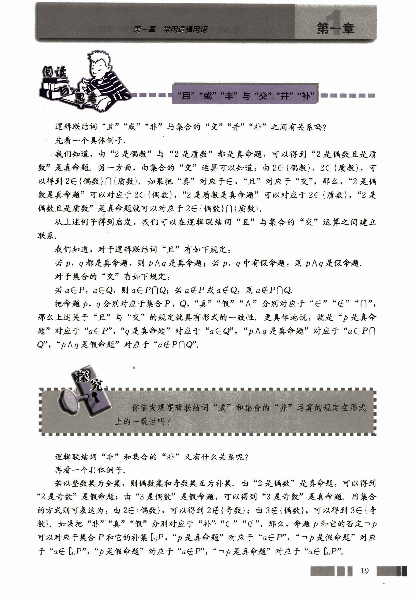
25

# CHAPTER

普通高中课程标准实验教科书 数学选修 2-1

一般地,对于逻辑联结词“非”有如下规定:

若 p 是真命题,则 ¬p 是假命题;若 p 是假命题,则 ¬p 是真命题.

设 U 为全集,P⊆U,若 a∈P,则 a∉Pc;a∉P 时,则 a∈Pc.

对于集合的“补”有如下规定:

探究

类比“且”与“交”的联系,并结合上述例子,你能建立逻辑联结词“非”与集合的“补”运算之间的对应关系吗?

从上述讨论可以发现:命题与集合之间可以建立对应关系,在这样的对应下,逻辑联结词与集合的运算具有一致性,命题的“且”“或”“非”恰好分别对应集合的“交”“并”“补”,因此,我们就可以从集合的角度进一步认识有关这些逻辑联结词的规定,

20

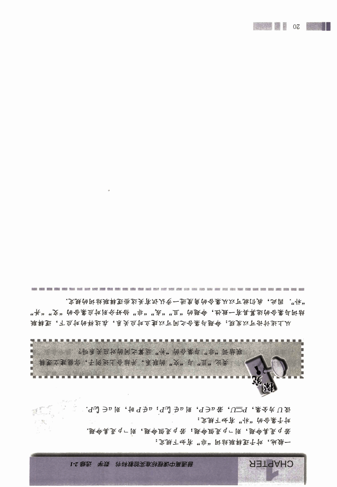
26

# CHAPTER 1

## 1.4 全称量词与存在量词

### 1.4.1 全称量词

**思考？**

下列语句是命题吗？(1)与(3)，(2)与(4)之间有什么关系？

(1) x > 3;
(2) 2x + 1 是整数;
(3) 对所有的 x ∈ R，x > 3;
(4) 对任意一个 x ∈ Z，2x + 1 是整数.

我们知道，命题是可以判断真假的陈述句。语句(1)(2)含有变量 x，由于不知道变量 x 代表什么数，无法判断它们的真假，因而不是命题。语句(3)在(1)的基础上，用短语“对所有的”对变量 x 进行限定；语句(4)在(2)的基础上，用短语“对任意一个”对变量 x 进行限定，从而使(3)(4)成为可以判断真假的语句，因此语句(3)(4)是命题。

短语“所有的”“任意一个”在逻辑中通常叫做全称量词 (universal quantifier)，并用符号“∀”表示。

含有全称量词的命题，叫做全称命题。

例如，命题：

对任意的 n ∈ Z，2n + 1 是奇数；

所有的正方形都是矩形

都是全称命题。

通常，将含有变量 x 的语句用 p(x), q(x), r(x), …表示，变量 x 的取值范围用 M 表示，那么，全称命题“对 M 中任意一个 x，有 p(x)成立”可用符号简记为

∀x ∈ M, p(x),

21

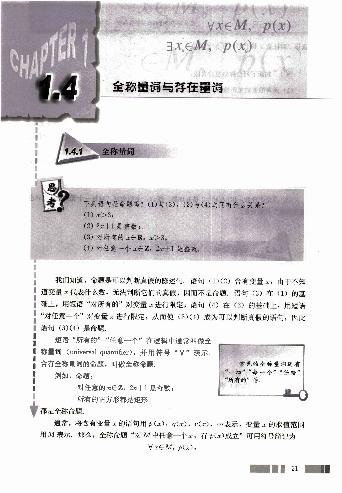
27

# CHAPTER 1

读作“对任意 x 属于 M，有 p(x) 成立”。

## 例 1

判断下列全称命题的真假：

(1) 所有的素数是奇数；

(2) ∀x∈R, x² + 1 ≥ 1；

(3) 对每一个无理数 x，x² 也是无理数.

分析：要判定全称命题 “∀x∈M, p(x)” 是真命题，需要对集合 M 中每个元素 x，证明 p(x) 成立；如果在集合 M 中找到一个元素 x₀，使得 p(x₀) 不成立，那么这个全称命题就是假命题。

解：(1) 2 是素数，但 2 不是奇数。所以，全称命题“所有的素数是奇数”是假命题。

(2) ∀x∈R，总有 x² ≥ 0，因而 x² + 1 ≥ 1。所以，全称命题 “∀x∈R, x² + 1 ≥ 1” 是真命题。

(3) √2 是无理数，但 (√2)² = 2 是有理数。所以，全称命题“对每一个无理数 x，x² 也是无理数”是假命题。

## 1.4.2 存在量词

下列语句是命题吗？(1) 与 (3)，(2) 与 (4) 之间有什么关系？

(1) 2x + 1 = 3；

(2) x 能被 2 和 3 整除；

(3) 存在一个 x₀∈R，使 2x₀ + 1 = 3；

(4) 至少有一个 x₀∈Z，x₀ 能被 2 和 3 整除。

容易判断，(1)(2) 不是命题。语句 (3) 在 (1) 的基础上，用短语“存在一个”对变量 x 的取值进行限定；语句 (4) 在 (2) 的基础上，用“至少有一个”对变量 x 的取值进行限定，从而使 (3)(4) 变成了可以判断真假的语句，因此语句 (3)(4) 是命题。

短语“存在一个”、“至少有一个”在逻辑中通常叫做存在量词 (existential quantifier)，并用符号 “∃” 表示。含有存在量词的命题，叫做特称命题。

例如，命题：

22

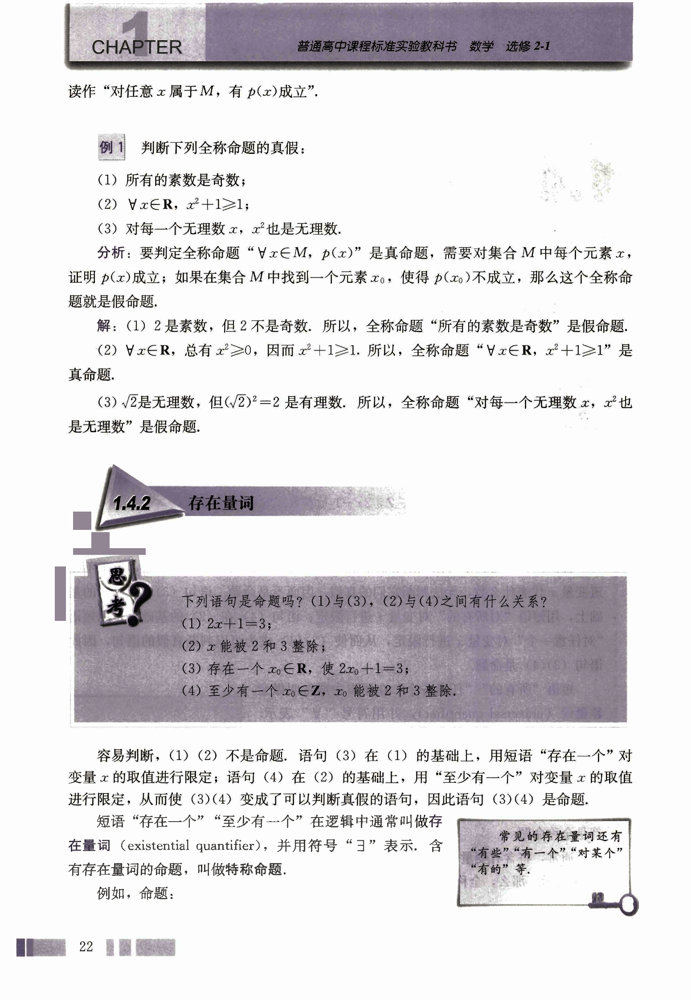
28

# 第一章 常用逻辑用语

有的平行四边形是菱形;
有一个素数不是奇数

都是特称命题.

特称命题“存在 M 中的元素$x_0$，使$p(x_0)$成立”可用符号简记为

$\exists x_0 \in M, p(x_0)$,

读作“存在 M 中的元素$x_0$，使$p(x_0)$成立”.

## 例 2 判断下列特称命题的真假:

(1) 有一个实数$x_0$，使$x^2+2x+3=0$;
(2) 存在两个相交平面垂直于同一条直线;
(3) 有些整数只有两个正因数.

分析: 要判定特称命题“$\exists x_0 \in M, p(x_0)$”是真命题，只需在集合 M 中找到一个元素$x_0$，使$p(x_0)$成立即可;如果在集合 M 中，使$p(x)$成立的元素 x 不存在，那么这个特称命题是假命题.

解:(1) 由于$\forall x \in R$，$x^2+2x+3=(x+1)^2+2 \ge 2$，因此使$x^2+2x+3=0$的实数 x 不存在, 所以，特称命题“有一个实数$x_0$，使$x^2+2x+3=0$”是假命题.

(2) 由于垂直于同一条直线的两个平面是互相平行的，因此不存在两个相交的平面垂直于同一条直线，所以，特称命题“存在两个相交平面垂直于同一条直线”是假命题.

(3) 由于存在整数 3 只有两个正因数 1 和 3，所以特称命题“有些整数只有两个正因数”是真命题.

## 练习

1. 判断下列全称命题的真假:
   (1) 每个指数函数都是单调函数;
   (2) 任何实数都有算术平方根;
   (3) $\forall x \in \{x|x是无理数\}$，$x^2$是无理数.

2. 判断下列特称命题的真假:
   (1) $\exists x_0 \in R, x_0 \le 0$;
   (2) 至少有一个整数，它既不是合数，也不是素数;
   (3) $\exists x_0 \in \{x|x是无理数\}$，$x_0$是无理数.

23

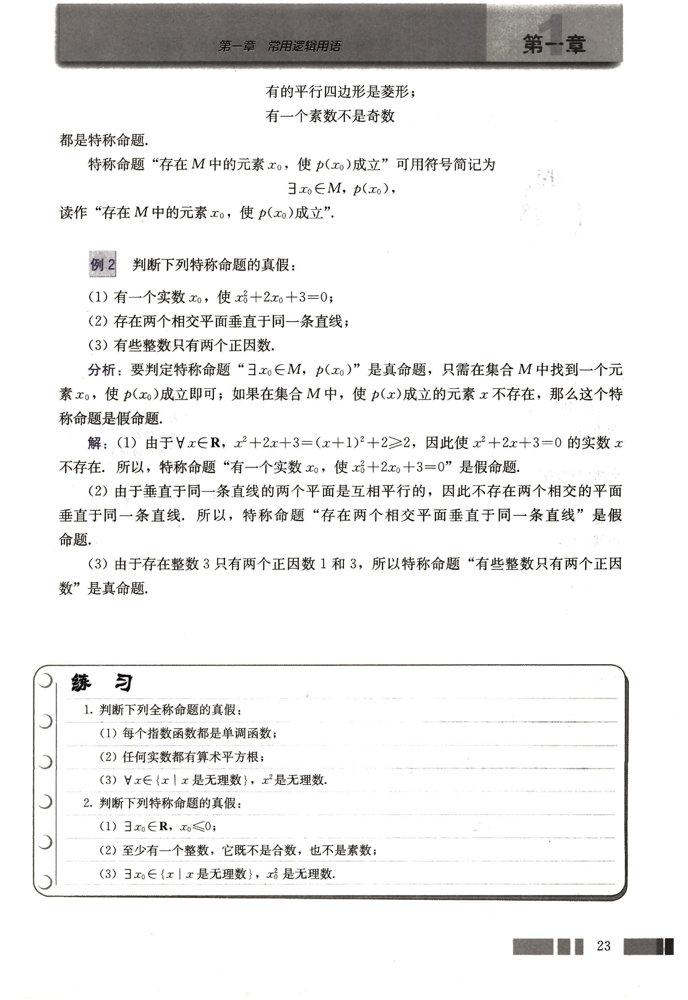
29

# CHAPTER 1

## 1.4.3 含有一个量词的命题的否定

写出下列命题的否定：

(1) 所有的矩形都是平行四边形；

(2) 每一个素数都是奇数；

(3) ∀x∈R, x² - 2x + 1 ≥ 0.

这些命题和它们的否定在形式上有什么变化？

上面三个命题都是全称命题，即具有形式 “∀x∈M，p(x)”；其中命题(1)的否定是“并非所有的矩形都是平行四边形”，也就是说，存在一个矩形不是平行四边形；命题(2)的否定是“并非每一个素数都是奇数”，也就是说，存在一个素数不是奇数；命题(3)的否定是“并非所有的 x∈R，x² - 2x + 1 ≥ 0”，也就是说，∃x₀∈R，x₀² - 2x₀ + 1 < 0.

从命题形式看，这三个全称命题的否定都变成了特称命题。

一般地，对于含有一个量词的全称命题的否定，有下面的结论：

全称命题 p: ∀x∈M，p(x)，

它的否定 ¬p: ∃x₀∈M，¬p(x₀).

全称命题的否定是特称命题。

## 例 3

写出下列全称命题的否定：

(1) p: 所有能被 3 整除的整数都是奇数；

(2) p: 每一个四边形的四个顶点共圆；

(3) p: 对任意 x∈Z, x² 的个位数字不等于 3.

解：(1) ¬p: 存在一个能被 3 整除的整数不是奇数.

(2) ¬p: 存在一个四边形，它的四个顶点不共圆.

(3) ¬p: ∃x₀∈Z, x₀² 的个位数字等于 3.

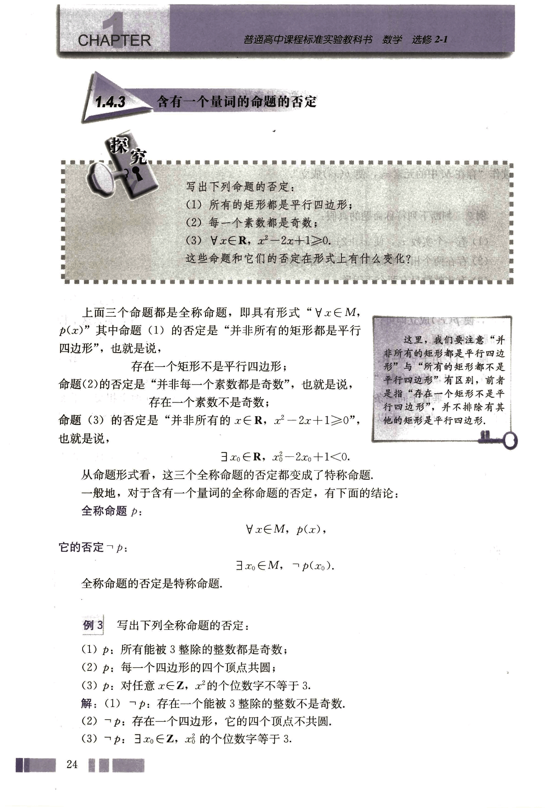
30

# 第一章 常用逻辑用语

## 探究

写出下列命题的否定：

(1) 有些实数的绝对值是正数；
(2) 某些平行四边形是菱形；
(3) ∃$x_0$∈R, $x_0^2$+1<0.

这些命题和它们的否定在形式上有什么变化？

这三个命题都是特称命题，即具有形式“∃$x_0$∈M, p($x_0$)”，其中命题(1)的否定是“不存在一个实数，它的绝对值是正数”，也就是说，所有实数的绝对值都不是正数；命题(2)的否定是“没有一个平行四边形是菱形”，也就是说，每一个平行四边形都不是菱形；命题(3)的否定是“不存在 x∈R, $x^2$+1<0”，也就是说，∀x∈R, $x^2$+1≥0.

从命题形式看，这三个特称命题的否定都变成了全称命题。

一般地，对于含一个量词的特称命题的否定，有下面的结论：

特称命题 p: ∃$x_0$∈M, p($x_0$)，

它的否定 ¬p: ∀x∈M, ¬p(x).

特称命题的否定是全称命题。

## 例 4

写出下列特称命题的否定：

(1) p: ∃$x_0$∈R, $x_0^2$+2$x_0$+2≤0;
(2) p: 有的三角形是等边三角形;
(3) p: 有一个素数含三个正因数.

解:

(1) ¬p: ∀x∈R, $x^2$+2x+2≥0.
(2) ¬p: 所有的三角形都不是等边三角形.
(3) ¬p: 每一个素数都不含三个正因数.

## 例 5

写出下列命题的否定，并判断它们的真假：

(1) p: 任意两个等边三角形都是相似的;
(2) p: ∃$x_0$∈R, $x_0^2$+2$x_0$+2=0.

25

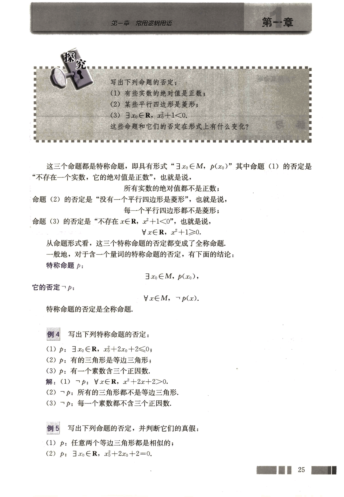
31

# CHAPTER 1

普通高中课程标准实验教科书 数学 选修 2-1

解：(1) ¬p: 存在两个等边三角形，它们不相似.

¬p 是假命题.

(2) ¬p: ∀x∈R, x²+2x+2≠0.

¬p 是真命题.

## 练习

1. 写出下列命题的否定：
   (1) ∀n∈Z, n∈Q;
   (2) 任意素数都是奇数;
   (3) 每个指数函数都是单调函数.

2. 写出下列命题的否定：
   (1) 有些三角形是直角三角形;
   (2) 有些梯形是等腰梯形;
   (3) 存在一个实数，它的绝对值不是正数.

## 习题 1.4

A 组

1. 判断下列全称命题的真假：
   (1) 末位是 0 的整数，可以被 5 整除；
   (2) 线段的垂直平分线上的点到这条线段两个端点的距离相等；
   (3) 负数的平方是正数；
   (4) 梯形的对角线相等.

2. 判断下列特称命题的真假：
   (1) 有些实数是无限不循环小数；
   (2) 有些三角形不是等腰三角形；
   (3) 有些菱形是正方形.

26

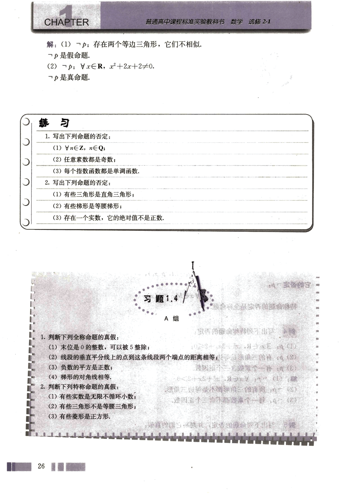
32

# 第一章 常用逻辑用语

3. 写出下列命题的否定：
   (1) ∀x∈N, x³>x²;
   (2) 所有可以被 5 整除的整数，末位数字都是 0;
   (3) ∃x₀∈R, x₀²-x₀+1<0;
   (4) 存在一个四边形，它的对角线互相垂直.

判断下列命题的真假，并写出这些命题的否定：
(1) 每条直线在 y 轴上都有截距；
(2) 每个二次函数的图像都与 x 轴相交；
(3) 存在一个三角形，它的内角和小于 180°；
(4) 存在一个四边形没有外接圆。

27

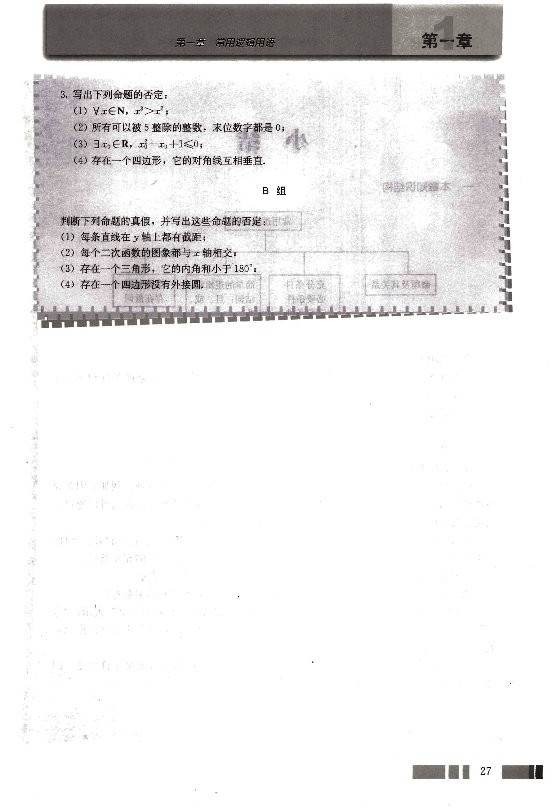
33

# 小结

## 一、本章知识结构

### 常用逻辑用语

| 命题及其关系 | 充分条件 | 简单的逻辑联结词：且、或、非 | 全称量词 |
| ------------ | -------- | ---------------------------- | -------- |
|              | 必要条件 |                              | 存在量词 |
|              | 充要条件 |                              |          |

## 二、回顾与思考

1. 能够判断真假的陈述句叫做命题，把形如“若 p，则 q”的命题的条件和结论作一些变换，就可以得到它的逆命题、否命题和逆否命题：

(1) 逆命题：若 q，则 p；

(2) 否命题：若 ¬p，则 ¬q；

(3) 逆否命题：若 ¬q，则 ¬p.

你能说说四种命题的真假性之间的关系吗？

四种命题真假性之间的内在联系可以为我们进行推理论证带来方便，例如，因为原命题与它的逆否命题有相同的真假性，因此当原命题的证明较困难时，我们可以通过证明逆否命题而得到原命题的证明，你能举一些类似的例子吗？

2. 如果从 p 可以推出 q ($p \to q$)，那么就说 p 是 q 的充分条件，q 是 p 的必要条件。

如果从 p 可以推出 q ($p \to q$)，从 q 也可以推出 p ($q \to p$)，就说 p 是 q 的充要条件。

3. 逻辑联结词“且”、“或”、“非”分别用符号“∧”、“∨”、“¬”表示。

如何确定命题 $p∧q$，$p∨q$，¬p 的真假性与 p，q 真假性之间的关系呢？

4. 命题中的“对所有”、“任意一个”等短语叫做全称量词，用符号“∀”表示；“存在”、“至少有一个”等短语叫做存在量词，用符号“∃”表示。含有全称量词的命题叫做全称命题，含有存在量词的命题叫做特称命题。

从命题形式上看，全称命题的否定是特称命题，特称命题的否定是全称命题，因此，我们可以通过“举反例”来否定一个全称命题。

28

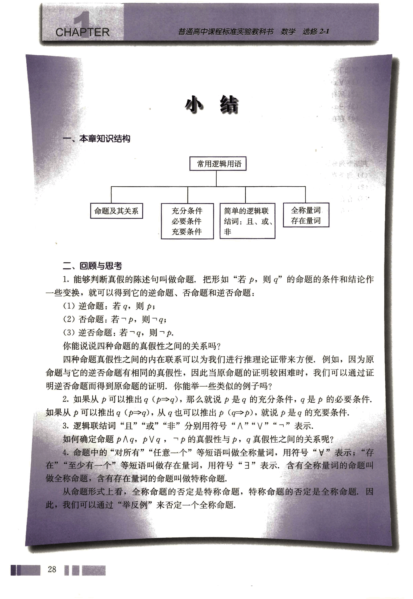
34

# 第一章 常用逻辑用语

## 第一章

如何否定含有一个量词的命题？

5. 用联系的观点看问题，可以使我们更加深刻地理解数学知识。本章中，把逻辑连接词与集合运算、电路的串联和并联联系起来等等，都体现了联系的观点，你能谈谈学习后的体会吗？

29

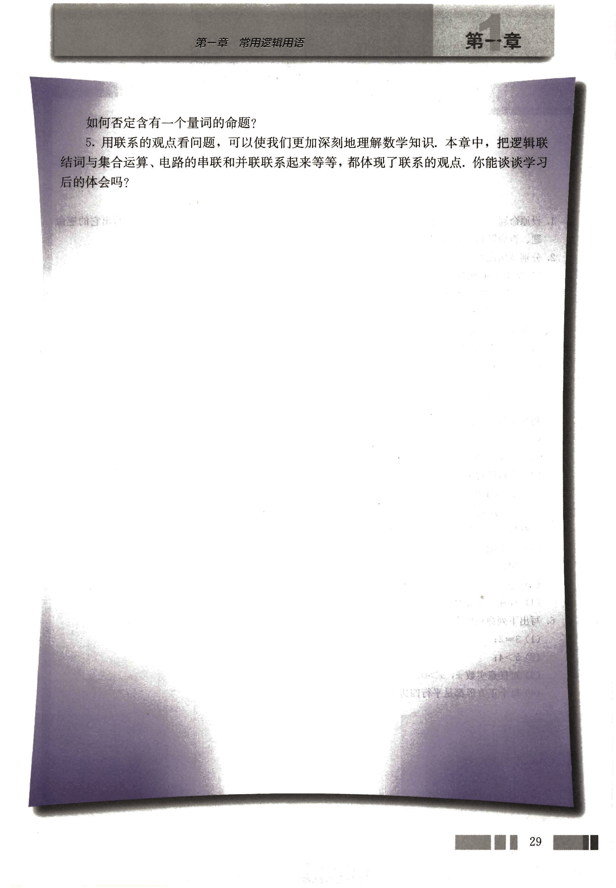
35

# 复习参考题

## A 组

1. 设原命题是“等边三角形的三内角相等”，把原命题改写成“若 p,则 q”的形式，并写出它的逆命题、否命题和逆否命题，然后指出它们的真假。
2. 分别举例说明：
   (1) p 是 q 的充分条件但不是必要条件；
   (2) p 是 q 的必要条件但不是充分条件；
   (3) p 是 q 的充分必要条件；
3. 已知 a, b, c 是实数，判断下列命题的真假：
   (1) “a>b”是“a²>b²”的充分条件；
   (2) “a>b”是“a²>b²”的必要条件；
   (3) “a>b”是“ac²>bc²”的充分条件；
   (4) “a>b”是“|a|>|b|”的充要条件。
4. 判断下列命题的真假：
   (1) 27 是 3 的倍数或 27 是 9 的倍数；
   (2) 27 是 3 的倍数且 27 是 9 的倍数；
   (3) 平行四边形的对角线互相垂直且平分；
   (4) 平行四边形的对角线互相垂直或平分；
   (5) 1 是方程 x - 1 = 0 的根，且是方程 x² - 5x + 4 = 0 的根。
5. 用符号“√”与“∃”表示下列含有量词的命题：
   (1) 自然数的平方大于零；
   (2) 圆 x² + y² = r² 上任一点到圆心的距离是 r；
   (3) 存在一对整数 x, y, 使得 2x + 4y = 3；
   (4) 存在一个无理数，它的立方是有理数。
6. 写出下列命题的否定，并判断它们的真假：
   (1) 3 = 2；
   (2) 5 > 4；
   (3) 对任意实数 x, x > 0；
   (4) 每个正方形都是平行四边形。

30

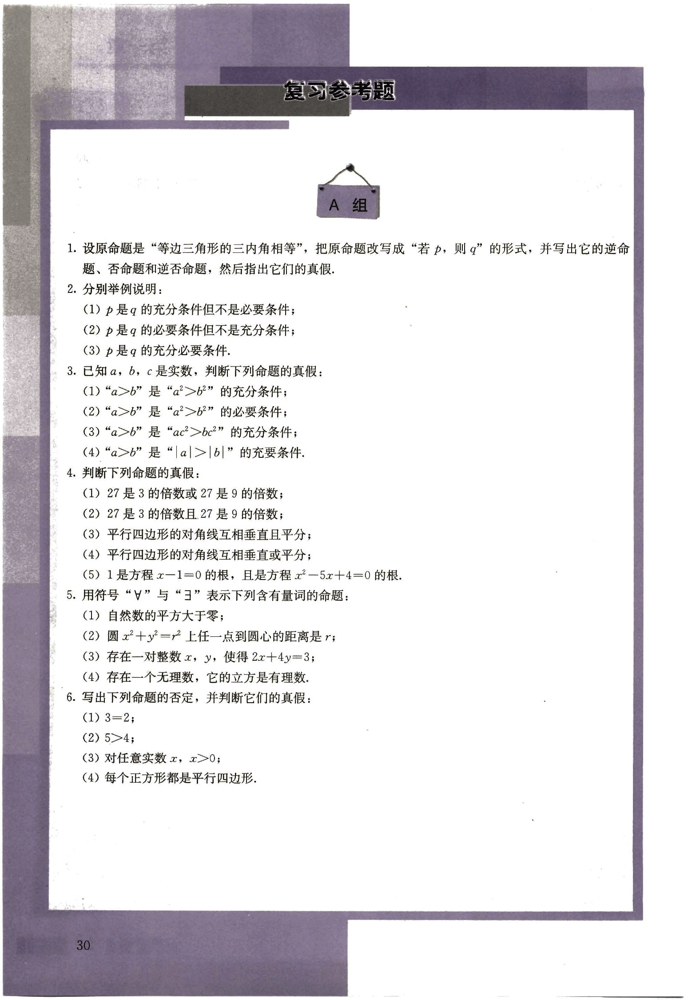
36

# B 组

1. 在一次射击训练中，某战士连续射击了两次。设命题 _p_ 是“第一次射击击中目标”，_q_ 是“第二次射击击中目标”，试用 _p_, _q_ 以及逻辑联结词“或”、“且”、“非”（或 ∨,∧,¬）表示下列命题：
   (1) 两次都击中目标；
   (2) 两次都没有击中目标。

2. 把下列定理表示的命题写成含有量词的命题：
   (1) 勾股定理；
   (2) 正弦定理。

31

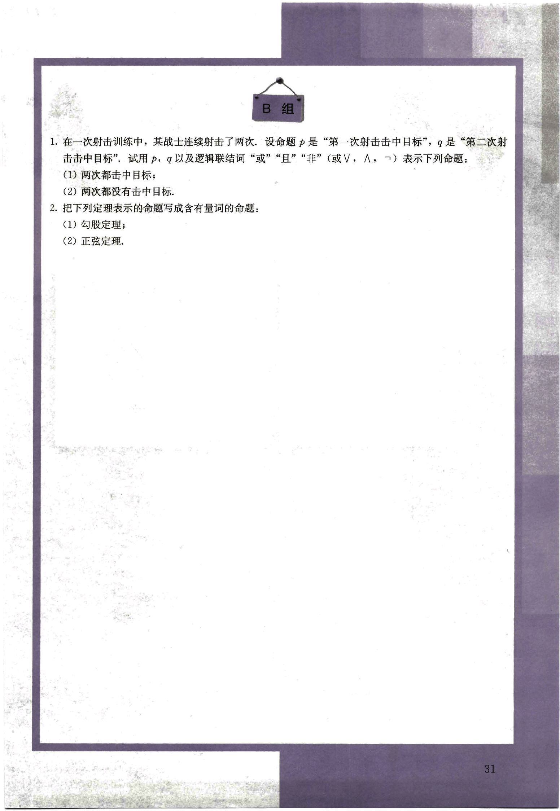
37

# 2

 

圆锥曲线有丰富的实际背景，它在刻画现实世界和解决实际问题中 有重要的作用，用坐标法研究圆锥曲线，我们可以进一步感受数形结合的思想，

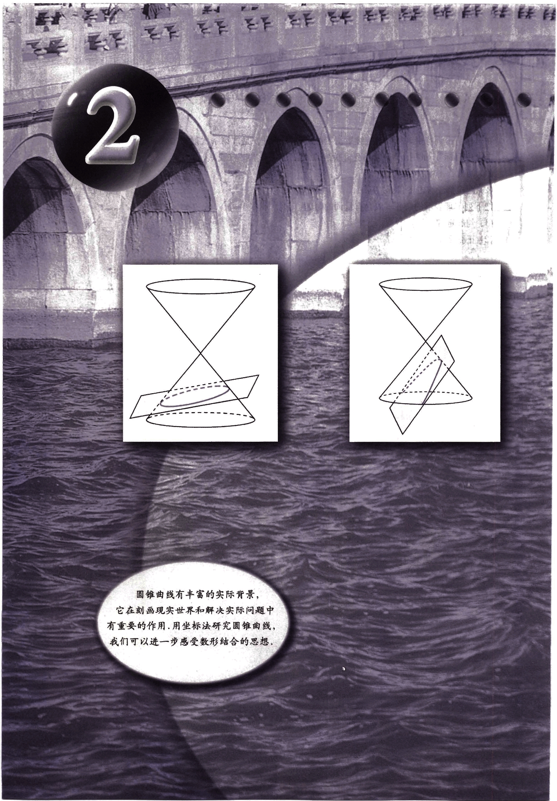
38

# 第二章 圆锥曲线与方程

## 2.1 曲线与方程

## 2.2 椭圆

## 2.3 双曲线

## 2.4 抛物线

我们知道，用一个垂直于圆锥的轴的平面截圆锥，截口曲线（截面与圆锥侧面的交线）是一个圆。如果改变平面与圆锥轴线的夹角，会得到什么图形呢？

如图，用一个不垂直于圆锥的轴的平面截圆锥，当截面与圆锥的轴夹角不同时，可以得到不同的截口曲线，它们分别是椭圆、抛物线、双曲线。我们通常把圆、椭圆、抛物线、双曲线统称为圆锥曲线(conic sections).

圆锥曲线与科研、生产以及人类生活有着紧密的关系。早在 16、17 世纪之交，开普勒就发现行星绕太阳运行的轨道是一个椭圆；探照灯反射镜面是抛物线绕其对称轴旋转形成的抛物面；发电厂冷却塔的外形线是双曲线……为什么圆锥曲线有如此巨大的作用呢？我们可以从它们的几何特征及其性质中找到答案。

圆锥曲线具有怎样的几何特征？如何研究圆锥曲线的性质？

事实上，圆锥曲线的发现与研究始于古希腊，当时人们从纯粹几何学的观点研究了这种与圆密切相关的曲线，它们的几何性质是圆的几何性质的自然推广。17 世纪初期，笛卡儿发明了坐标系，人们开始在坐标系的基础上，用代数方法研究圆锥曲线。本章我们继续采用必修课程《数学 2》中研究直线与圆所用的坐标法，在探究圆锥曲线几何特征的基础上，建立它们的方程，通过方程研究它们的简单性质，并用坐标法解决一些与圆锥曲线有关的简单几何问题和实际问题，进一步感受数形结合的基本思想。

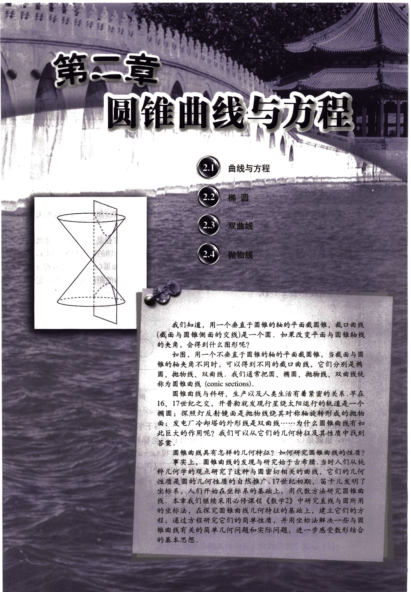
39

# CHAPTER 2

## 2.1 曲线与方程

### 2.1.1 曲线与方程

前面我们研究了直线与圆的方程，讨论了这些曲线（包括直线）和相应的方程的关系。下面进一步研究一般曲线（包括直线）和方程的关系。

我们知道，在直角坐标系中，平分第一、三象限的直线的方程是 $x - y = 0$。这就是说，如果点 $M(x_0, y_0)$ 是这条直线上的任意一点，它到两坐标轴的距离相等，即 $x_0 = y_0$，那么它的坐标 $(x_0, y_0)$ 是方程 $x - y = 0$ 的解；反过来，如果 $(x_0, y_0)$ 是方程 $x - y = 0$ 的解，即 $x_0 = y_0$，那么以这个解为坐标的点到两坐标轴的距离相等，它一定在这条直线上（图 2.1-1）。

[图 2.1-1](images/2.1-1.png)

又如，以 $(a, b)$ 为圆心，$r$ 为半径的圆的方程是 $(x - a)^2 + (y - b)^2 = r^2$。这就是说，如果 $M(x_0, y_0)$ 是圆上的点，那么它到圆心的距离一定等于半径，即 $\sqrt{(x_0 - a)^2 + (y_0 - b)^2} = r$，也就是 $(x_0 - a)^2 + (y_0 - b)^2 = r^2$，这说明它的坐标 $(x_0, y_0)$ 是方程 $(x - a)^2 + (y - b)^2 = r^2$ 的解；反过来，如果 $(x_0, y_0)$ 是方程 $(x - a)^2 + (y - b)^2 = r^2$ 的解，即 $(x_0 - a)^2 + (y_0 - b)^2 = r^2$，也就是 $\sqrt{(x_0 - a)^2 + (y_0 - b)^2} = r$，即以这个解为坐标的点到点 $(a, b)$ 的距离为 $r$，它一定在以 $(a, b)$ 为圆心，$r$ 为半径的圆上（图 2.1-2）。

[图 2.1-2](images/2.1-2.png)

一般地，在直角坐标系中，如果某曲线 C（看作点的集合或适合某种条件的点的轨迹）上的点与一个二元方程 $f(x, y) = 0$ 的实数解建立了如下的关系：

(1) 曲线上点的坐标都是这个方程的解；
(2) 以这个方程的解为坐标的点都是曲线上的点。

曲线方程是 $f(x, y) = 0$
也可以说成曲线 $f(x, y) = 0$。

34

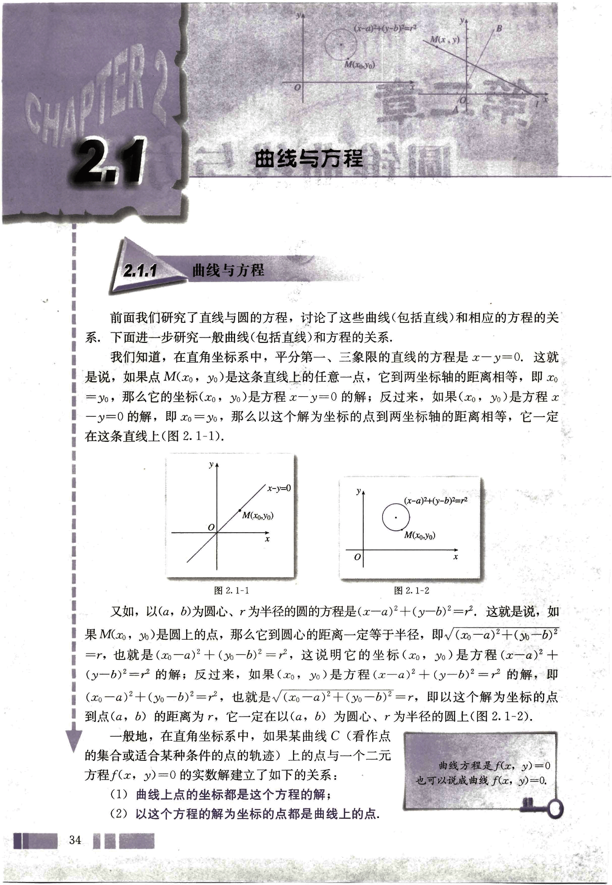
40

# 第二章 圆锥曲线与方程

## 2.1.2 求曲线的方程

我们已经建立了曲线的方程、方程的曲线的概念。利用这两个重要概念，就可以借助于坐标系，用坐标表示点，把曲线看成满足某种条件的点的集合或轨迹；用曲线上点的坐标(x, y)所满足的方程 _f(x, y) = 0_ 表示曲线，通过研究方程的性质间接地来研究曲线的性质，这就是我们反复提到的坐标法。数学中，用坐标法研究几何图形的知识形成的学科叫做解析几何。从前面的学习中可以看到，解析几何研究的主要问题是：

(1) 根据已知条件，求出表示曲线的方程；

(2) 通过曲线的方程，研究曲线的性质。

下面我们讨论求曲线方程的问题。

**例 1** 证明与两条坐标轴的距离的积是常数 _k_ (_k_ > 0) 的点的轨迹方程是 _xy = ±k_。

**证明:** (1) 如图 [2.1-3](images/2.1-3.png), 设 _M(x0, y0)_ 是轨迹上的任意一点。因为点 _M_ 与 _x_ 轴的距离为 |_y0_|, 与 _y_ 轴的距离为 |_x0_|, 所以

| _x0_ | ⋅ | _y0_ | = _k_

即 (_x0_, _y0_) 是方程 _xy = ±k_ 的解。

(2) 设点 _M1_ 的坐标 (_x1_, _y1_) 是方程 _xy = ±k_ 的解，则

_x1_ _y1_ = ±*k*

| _x1_ | ⋅ | _y1_ | = _k_

而 |_x1_|, |_y1_| 正是点 _M1_ 到纵轴、横轴的距离，因此点 _M1_ 到这两条直线的距离的积是常数 _k_，点 _M1_ 是曲线上的点。

由 (1)(2) 可知，_xy = ±k_ 是与两条坐标轴的距离的积为常数 _k_ (_k_ > 0) 的点的轨迹方程。

**例 2** 设 A, B 两点的坐标分别是 (-1, -1), (3, 7), 求线段 AB 的垂直平分线的方程。

**解:** 如图 [2.1-4](images/2.1-4.png), 设点 _M(x, y)_ 是线段 AB 的垂直平分线上的任意一点，也就是点 _M_ 属于集合

_P_ = { _M_ | | _MA_ | = | _MB_ | }

由两点间的距离公式，点 _M_ 适合的条件可表示为

√(_x_ + 1)² + (_y_ + 1)² = √(_x_ - 3)² + (_y_ - 7)²

上式两边平方，并整理得

_x_ + 2*y* - 7 = 0

我们证明方程 ① 是线段 AB 的垂直平分线的方程。

(1) 由求方程的过程可知，垂直平分线上每一点的坐标都是方程 ① 的解；

(2) 设点 _M1_ 的坐标 (_x1_, _y1_) 是方程 ① 的解，即

35

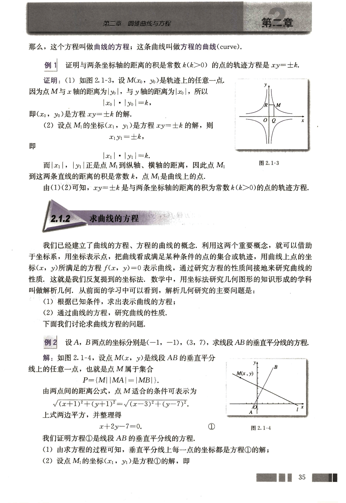
41

# CHAPTER 2

普通高中课程标准实验教科书 数学 选修 2-1

$x_1 + 2y_1 - 7 = 0,$

$x_1 = 7 - 2y_1.$

点 M 到 A，B 的距离分别是

$|M_1A| = \sqrt{(x_1 + 1)^2 + (y_1 + 1)^2} = \sqrt{(8 - 2y_1)^2 + (y_1 + 1)^2}$

$|M_1B| = \sqrt{(x_1 - 3)^2 + (y_1 - 7)^2} = \sqrt{(4 - 2y_1)^2 + (y_1 - 7)^2}$

$= \sqrt{5(y_1^2 - 6y_1 + 13)};$

$= \sqrt{5(y_1^2 - 6y_1 + 13)}.$

所以

$|M_1A| = |M_1B|,$

即点 M 在线段 AB 的垂直平分线上.

由 (1)(2) 可知，方程 ① 是线段 AB 的垂直平分线的方程.

由上述例子可以看出，求曲线的方程，一般有下面几个步骤：

(1) 建立适当的坐标系，用有序实数对 (x, y) 表示曲线上任意一点的坐标；

(2) 写出适合条件的点 M 的集合

P = {M | p(M)}；

(3) 用坐标表示条件 p(M)，列出方程 f(x, y) = 0；

(4) 化方程 f(x, y) = 0 为最简形式；

(5) 说明以化简后的方程的解为坐标的点都在曲线上.

一般地，化简前后方程的解集是相同的，步骤 (5) 可以省略不写，如有特殊情况，可以适当说明. 另外，也可以根据情况省略步骤 (2)，直接列出曲线方程.

### 例 3

已知一条直线 l 和它上方的一个点 F，点 F 到 l 的距离是 2. 一条曲线也在 l 的上方，它上面的每一点到 F 的距离减去到 l 的距离的差都是 2，建立适当的坐标系，求这条曲线的方程.

分析：在建立坐标系时，一般应当充分利用已知条件中的定点、定直线等，这样可以使问题中的几何特征得到更好的表示，从而使曲线方程的形式简单一些.

解：如图 2.1-5，取直线 l 为 x 轴，过点 F 且垂直于直线 l 的直线为 y 轴，建立坐标系 xOy.

设点 M(x, y) 是曲线上任意一点，作 MB ⊥ x 轴，垂足为 B，那么点 M 属于集合

P = {M | |MF| - |MB| = 2}.

由两点间的距离公式，点 M 适合的条件可表示为

$\sqrt{x^2 + (y - 2)^2} - y = 2,$

将 ① 式移项后两边平方，得

$x^2 + (y - 2)^2 = (y + 2)^2,$

化简得

$y = \frac{1}{8}x^2.$

[图 2.1-5](images/2.1-5.png)

36

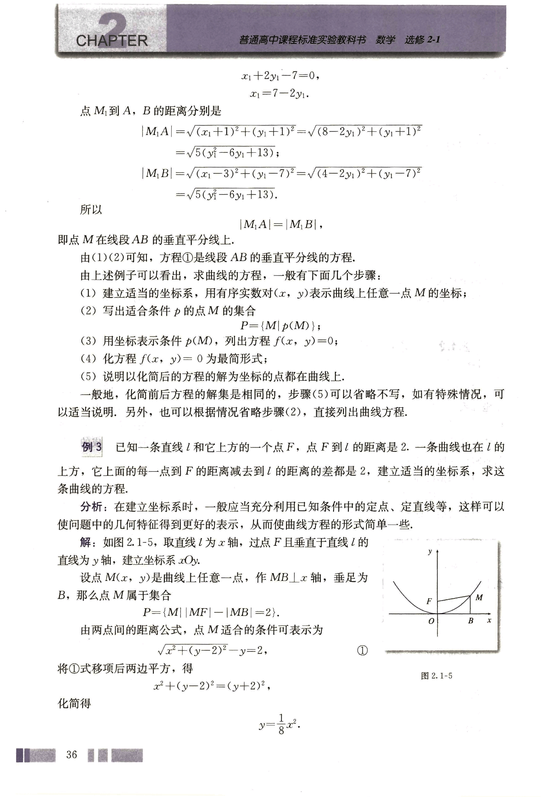
42

# 第二章 圆锥曲线与方程

因为曲线在 x 轴的上方，所以 y>0. 虽然原点的坐标(0,0)是这个方程的解，但
不属于已知曲线，所以曲线的方程应是 $y = \frac{1}{8}x^2 (x≠0)$.

## 练习

1. 已知等腰三角形三个顶点的坐标分别是 A(0, 3), B(-2, 0), C(2, 0), 中线 AO(O 为原点)所在直线的方程是 x=0 吗？为什么？

2. 已知方程$ax^2+by^2=2$的曲线经过点 A(0, $\frac{5}{3}$)和点 B(1, 1), 求 a, b 的值.

3. 如图，已知点 C 的坐标是(2, 2)，过点 C 的直线 CA 与 x 轴交于点 A，过点 C 且与直线 CA 垂直的直线 CB 与 y 轴交于点 B. 设点 M 是线段 AB 的中点，求点 M 的轨迹方程.
   [图](images/图.png)

## 习题 2.1

### A 组

1. 点 A(1, -2), B(2, -3), C(3, 10)是否在方程$x^2-xy+2y+1=0$表示的曲线上？为什么？

2. 求和点 O(0, 0), A(c, 0)距离的平方差为常数 c 的点的轨迹方程.

3. 两个定点的距离为 6，点 M 到这两个定点的距离的平方和为 26，求点 M 的轨迹方程.

4. 过原点的直线与圆$x^2+y^2-6x+5=0$相交于 A, B 两点，求弦 AB 的中点 M 的轨迹方程.

### B 组

1. 过点 P(3, 4)的动直线与两坐标轴的交点分别为 A, B, 过 A, B 分别作两轴的垂线交于点 M，求点 M 的轨迹方程.

2. 一动圆截直线 3x-y=0 和 3x+y=0 所得弦长分别为 8, 4, 求动圆圆心的轨迹方程.

37

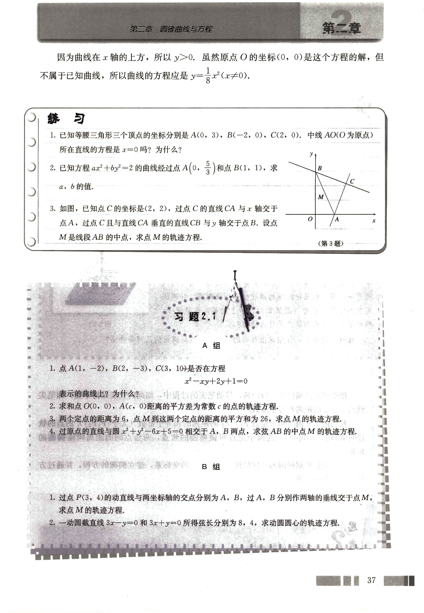
43

# CHAPTER 2

## 2.2 椭圆

### 2.2.1 椭圆及其标准方程

探究

取一条定长的细绳，把它的两端都固定在图板的同一点处，套上铅笔，拉紧绳子，移动笔尖，这时笔尖（动点）画出的轨迹是一个圆。如果把细绳的两端拉开一段距离，分别固定在图板的两点处（图 2.2-1），套上铅笔，拉紧绳子，移动笔尖，画出的轨迹是什么曲线？

在这一过程中，你能说出移动的笔尖（动点）满足的几何条件吗？

[图 2.2-1](images/2.2-1.png)

把细绳的两端拉开一段距离，移动笔尖的过程中，细绳的长度保持不变，即笔尖到两个定点的距离和等于常数。

我们把平面内与两个定点$F_1$，$F_2$的距离的和等于常数（大于$|F_1F_2|$）的点的轨迹叫做椭圆(ellipse)。这两个定点叫做椭圆的焦点，两焦点间的距离叫做椭圆的焦距。

下面我们根据椭圆的几何特征，选择适当的坐标系，建立椭圆的方程，并通过方程研究椭圆的性质。

思考？

观察椭圆的形状，你认为怎样选择坐标系才能使椭圆的方程简单？

38

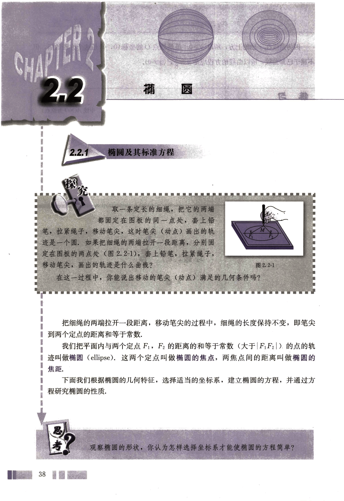
44

# 第二章 圆锥曲线与方程

## 类比法建立椭圆方程

类比利用圆的对称性建立圆的方程的过程，我们根据椭圆的几何特征，选择适当的坐标系，建立它的方程。

如图 2.2-2，以经过椭圆两焦点$F_1$,$F_2$的直线为 x 轴，线段$F_1F_2$的垂直平分线为 y 轴，建立直角坐标系 xOy。

设 M(x,y)是椭圆上任意一点，椭圆的焦距为 2c(c>0)，那么焦点$F_1$,$F_2$的坐标分别为(-c,0)，(c,0)。又设 M 与$F_1$,$F_2$的距离的和等于 2a。

由椭圆的定义，椭圆就是集合

$P = \{M||MF_1|+|MF_2|=2a\}$

因为$|MF_1| = \sqrt{(x+c)^2+y^2}$, $|MF_2| = \sqrt{(x-c)^2+y^2}$，

所以$\sqrt{(x+c)^2+y^2}+\sqrt{(x-c)^2+y^2}=2a$。

为化简这个方程，将左边的一个根式移到右边，得

$\sqrt{(x+c)^2+y^2} = 2a - \sqrt{(x-c)^2+y^2}$

将这个方程两边平方，得

$(x+c)^2+y^2 = 4a^2 - 4a\sqrt{(x-c)^2+y^2} + (x-c)^2+y^2$

整理得

$a^2 - cx = a\sqrt{(x-c)^2+y^2}$

上式两边再平方，得

$a^4 - 2a^2cx + c^2x^2 = a^2x^2 - 2a^2cx + a^2c^2 + a^2y^2$

整理得

$(a^2-c^2)x^2 + a^2y^2 = a^2(a^2-c^2)$

两边同除以$a^2(a^2-c^2)$，得

$\frac{x^2}{a^2} + \frac{y^2}{a^2-c^2} = 1$

由椭圆的定义可知，2a>2c，即 a>c，所以$a^2-c^2>0$。

## 思考

观察图 2.2-3，你能从中找出表示 a, c, $\sqrt{a^2-c^2}$的线段吗？

[图 2.2-2](images/2.2-2.png)
[图 2.2-3](images/2.2-3.png)

39

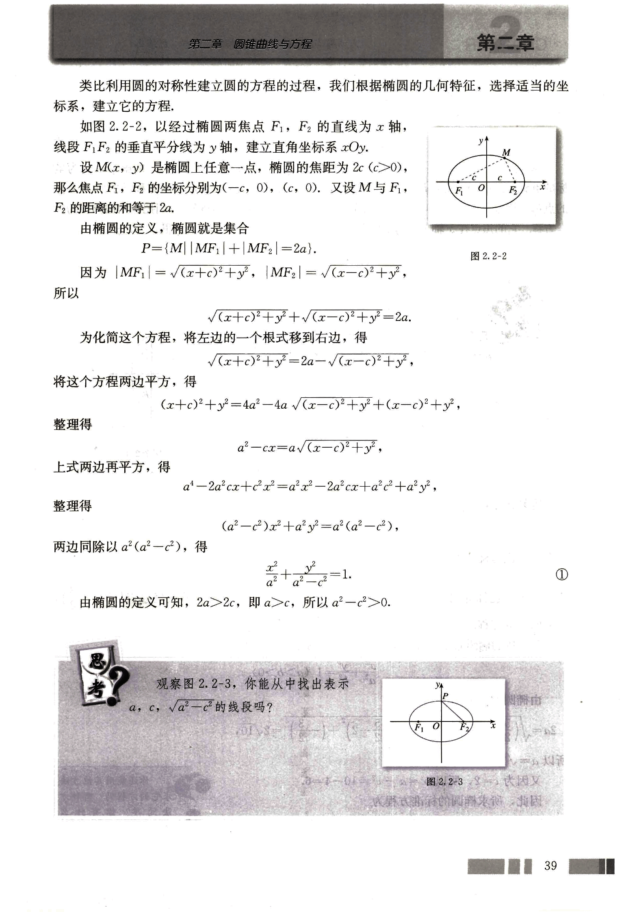
45

# CHAPTER 2

普通高中课程标准实验教科书 数学选修 2-1

由图 2.2-3 可知，|PF₁| = |PF₂| = a，|OF₁| = |OF₂| = c，|PO| = $\sqrt{a^2 - c^2}$。令 b = |PO| = $\sqrt{a^2 - c^2}$，那么 ① 式就是

$\frac{x^2}{a^2} + \frac{y^2}{b^2} = 1$ (a > b > 0). ②

从上述过程可以看到，椭圆上任意一点的坐标都满足方程 ②，以方程 ② 的解 (x, y) 为坐标的点到椭圆的两个焦点 F₁(-c, 0), F₂(c, 0) 的距离之和为 2a，即以方程 ② 的解为坐标的点都在椭圆上。由曲线与方程的关系可知，方程 ② 是椭圆的方程，我们把它叫做椭圆的标准方程。它的焦点在 x 轴上，两个焦点分别是 F₁(-c, 0), F₂(c, 0)，这里 c² = a² - b².

## 思考

如图 2.2-4，如果焦点 F₁, F₂ 在 y 轴上，且 F₁, F₂ 的坐标分别为 (0, -c), (0, c), a, b 的意义同上，那么椭圆的方程是什么？

[图 2.2-4](images/2.2-4.png)

容易知道，此时椭圆的方程是

$\frac{y^2}{a^2} + \frac{x^2}{b^2} = 1$ (a > b > 0),

这个方程也是椭圆的标准方程。

## 例 1

已知椭圆的两个焦点坐标分别是 (-2, 0), (2, 0), 并且经过点 ($\frac{5}{2}$, $-\frac{3}{2}$), 求它的标准方程.

解：因为椭圆的焦点在 x 轴上，所以设它的标准方程为

$\frac{x^2}{a^2} + \frac{y^2}{b^2} = 1$ (a > b > 0).

由椭圆的定义知

2a = $\sqrt{(\frac{5}{2} + 2)^2 + (-\frac{3}{2})^2} + \sqrt{(\frac{5}{2} - 2)^2 + (-\frac{3}{2})^2} = 2\sqrt{10}$,

所以 a = $\sqrt{10}$.

又因为 c = 2，所以 b² = a² - c² = 10 - 4 = 6.

因此，所求椭圆的标准方程为

$\frac{x^2}{10} + \frac{y^2}{6} = 1$.

40

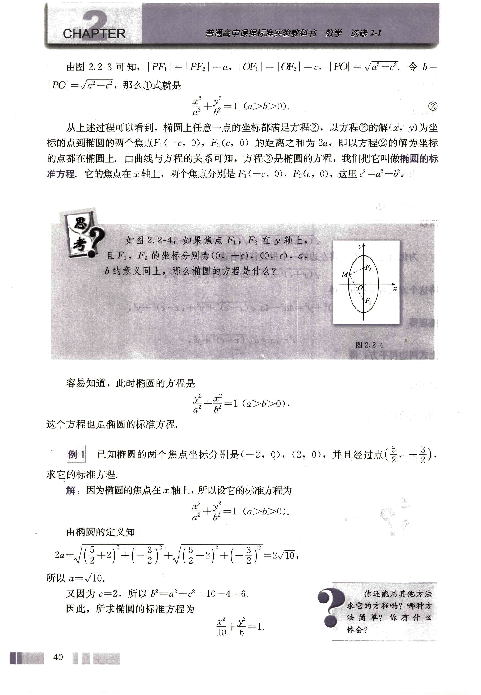
46

# 第二章 圆锥曲线与方程

## 例 2

如图 2.2-5,在圆$x^2+y^2=4$上任取一点 P，过点 P 作 x 轴的垂线段 PD，D 为垂足。当点 P 在圆上运动时，线段 PD 的中点 M 的轨迹是什么？为什么？

**分析:** 点 P 在圆$x^2+y^2=4$上运动，点 P 的运动引起点 M 运动，我们可以由 M 为线段 PD 的中点得到点 M 与点 P 坐标之间的关系式，并由点的坐标满足圆的方程得到点的坐标所满足的方程。

**解:** 设点 M 的坐标为(x,y)，点 P 的坐标为($x_0,y_0$)，则

$x = x_0, y = \frac{y_0}{2}$.

因为点 P($x_0,y_0$)在圆$x^2+y^2=4$上，所以

$x_0^2 + y_0^2 = 4$.

把$x_0 = x, y_0 = 2y$代入方程 ①，得

$x^2 + 4y^2 = 4$,

$\frac{x^2}{4} + y^2 = 1$.

所以点 M 的轨迹是一个椭圆。

[图 2.2-5](images/2.2-5.png)

## 例 3

如图 2.2-6，设点 A，B 的坐标分别为(-5, 0)，(5, 0)。直线 AM，BM 相交于点 M，且它们的斜率之积是$-\frac{4}{9}$，求点 M 的轨迹方程。

**分析:** 设点 M 的坐标为(x, y)，那么直线 AM，BM 的斜率就可以用含 x, y 的式子表示。由于直线 AM，BM 的斜率之积是$-\frac{4}{9}$，因此可以建立 x, y 之间的关系式，得出点 M 的轨迹方程。

**解:** 设点 M 的坐标为(x, y)，因为点 A 的坐标是(-5, 0)，所以，直线 AM 的斜率

$k_{AM} = \frac{y}{x+5}$

[图 2.2-6](images/2.2-6.png)

41

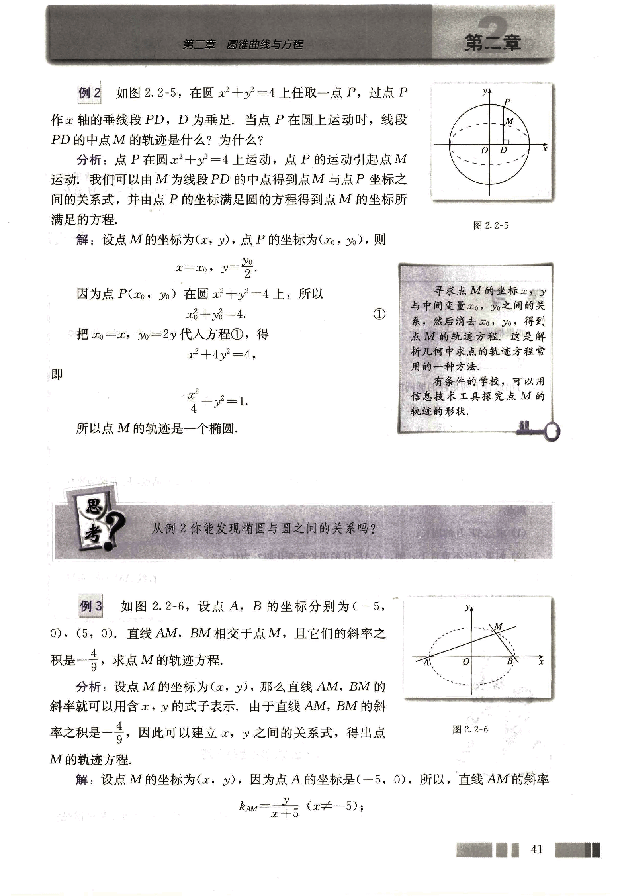
47

# CHAPTER 2

同理，直线 BM 的斜率

$k_{BM} = \frac{y}{x-5} \quad (x \neq 5).$

由已知有

$\frac{y}{x+5} \times \frac{x-y}{x-5} = \frac{4}{9} \quad (x \neq \pm 5),$

化简，得点 M 的轨迹方程为

$\frac{x^2}{25} + \frac{y^2}{100} = 1 \quad (x \neq \pm 5).$

## 练习

1. 如果椭圆$\frac{x^2}{100} + \frac{y^2}{36} = 1$上一点 P 到焦点$F_1$的距离等于 6，那么点 P 到另一个焦点$F_2$的距离是\***\*\_\_\*\***.

2. 写出适合下列条件的椭圆的标准方程：
   (1) $a=4, b=1$，焦点在 x 轴上；
   (2) $a=4, c=\sqrt{15}$，焦点在 y 轴上；
   (3) $a+b=10, c=2\sqrt{5}$.

3. 已知经过椭圆$\frac{x^2}{25} + \frac{y^2}{16} = 1$的右焦点$F_2$作垂直于 x 轴的直线 AB，交椭圆于 A，B 两点，$F_1$是椭圆的左焦点。

(1) 求$\triangle AF_1B$的周长；

(2) 如果 AB 不垂直于 x 轴，$\triangle AF_1B$的周长有变化吗？为什么？

4. 点 A，B 的坐标分别是$(-1, 0), (1, 0)$，直线 AM，BM 相交于点 M，且直线 AM 的斜率与直线 BM 的斜率的商是 2，点 M 的轨迹是什么？为什么？

42

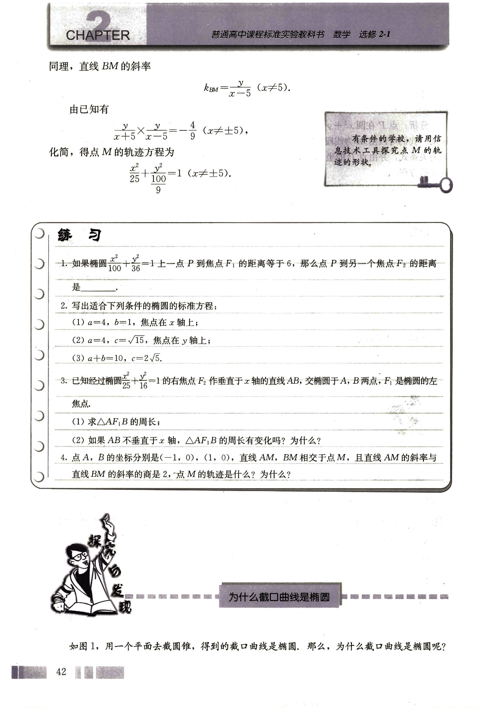
48

# 第二章 圆锥曲线与方程

历史上，许多人从纯几何角度出发对这个问题进行过研究，其中数学家 Germinal Dandelin 的方法非常巧妙。

在圆锥内放两个大小不同的球，使得它们分别与圆锥的侧面、截面相切，两个球分别与截面相切于点 E，F，在截口曲线上任取一点 A，过点 A 作圆锥的母线，分别与两个球相切于点 C，B。由球和圆的几何性质，可以知道

AE=AC，AF=AB，

AE+AF=AB+AC=BC。

由切点 B，C 的产生方法可知，它们之间的距离 BC 是定值，这样，截口曲线上任意一点 A 到两个定点 E，F 的距离之和为常数。

由椭圆的定义可知，截口曲线是椭圆。

Germinal Dandelin 的工作非常巧妙，极具创造性，看完他的工作后，你有这方面的体会吗？

如图 2，用一个与圆柱的母线斜交的平面截圆柱，得到一条截口曲线，你能仿照上述方法，证明截口曲线也是椭圆吗？

[图 1](images/图1.png)
[图 2](images/图2.png)

## 2.2.2 椭圆的简单几何性质

上面从椭圆的定义（几何特征）出发建立了椭圆的标准方程。下面再利用椭圆的标准方程研究它的几何性质，包括椭圆的形状、大小、对称性和位置等。

我们用椭圆的标准方程

$\frac{x^2}{a^2} + \frac{y^2}{b^2} = 1$ (a>b>0)

来研究椭圆的几何性质。

①

通过对曲线的范围、对称性及特殊点的讨论，可以从整体上把握曲线的形状、大小和位置，所以，本章对几种圆锥曲线都是分范围、对称性、顶点及其他特性等来研究它们的几何性质。

观察椭圆$\frac{x^2}{a^2} + \frac{y^2}{b^2} = 1$ (a>b>0)的形状，你能从图上看出它的范围吗？它具有怎样的对称性？椭圆上哪些点比较特殊？

43

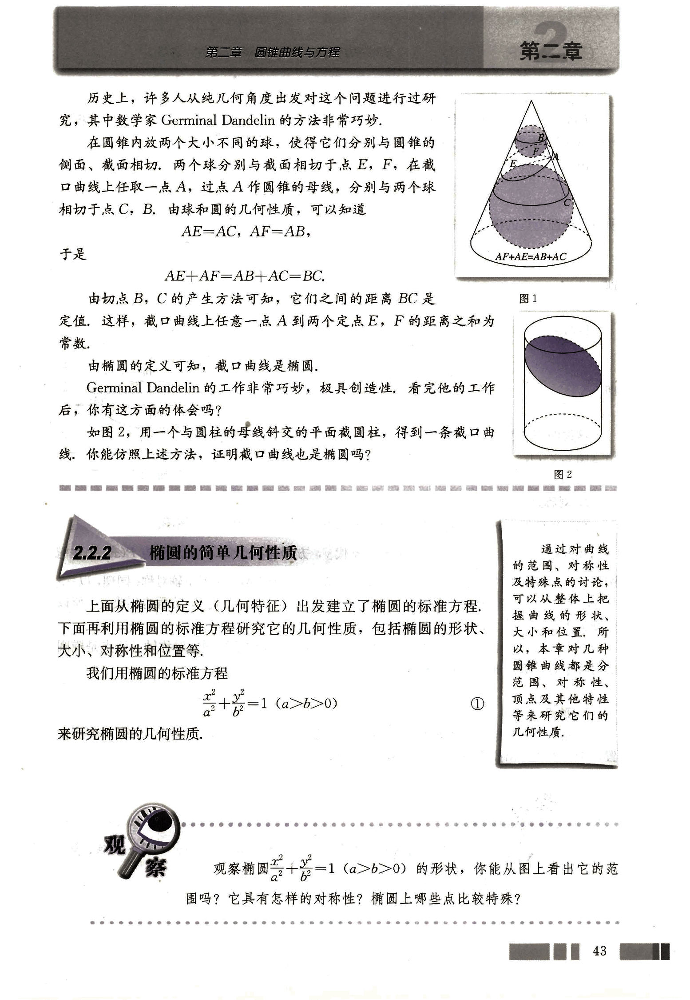
49

# CHAPTER 2

## 1.范围

观察图 2.2-7，容易看出椭圆上点的横坐标的范围是 $-a \le x \le a$，纵坐标的范围是 $-b \le y \le b$。下面，我们利用方程（代数方法）研究它的范围。

由方程 ① 可知，

$\frac{y^2}{b^2} = 1 - \frac{x^2}{a^2} \ge 0$，

所以，椭圆上点的横坐标都适合不等式

$\frac{x^2}{a^2} \le 1$，

即

$-a \le x \le a$。

同理有

$\frac{y^2}{b^2} \le 1$，

$-b \le y \le b$。

这说明椭圆位于直线 $x = \pm a$ 和 $y = \pm b$ 所围成的矩形框里（图 2.2-7）。

[图 2.2-7](images/2.2-7.png)

## 2.对称性

观察椭圆的形状，可以发现椭圆既是轴对称图形，又是中心对称图形。

在椭圆 $\frac{x^2}{a^2} + \frac{y^2}{b^2} = 1$ ($a>b>0$) 中以 $-y$ 代 $y$，方程并不改变，这说明当点 $P(x, y)$ 在椭圆上时，它关于 $x$ 轴的对称点 $P_1(x, -y)$ 也在椭圆上，所以椭圆关于 $x$ 轴对称；同理，以 $-x$ 代 $x$，方程也不改变，所以椭圆关于 $y$ 轴对称；以 $-x$ 代 $x$，以 $-y$ 代 $y$，方程也不改变，所以椭圆关于原点对称。

综上，椭圆关于 $x$ 轴、$y$ 轴都是对称的，这时，坐标轴是椭圆的对称轴，原点是椭圆的对称中心，椭圆的对称中心叫做椭圆的中心。

## 3.顶点

研究曲线上某些特殊点的位置，可以确定曲线的位置。要确定曲线在坐标系中的位置，常常需要求出曲线与 $x$ 轴、$y$ 轴的交点坐标。

44

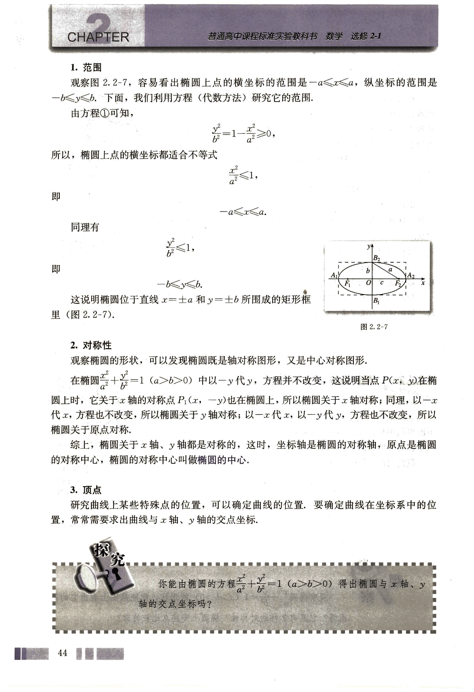
50

# 第二章 圆锥曲线与方程

在椭圆的标准方程里,令 x=0,得 y=±b,这说明 B₁(0, -b), B₂(0,b)是椭圆与 y 轴的两个交点.同理,令 y=0,得 x=±a,这说明 A₁(-a, 0), A₂(a,0)是椭圆与 x 轴的两个交点.因为 x 轴、y 轴是椭圆的对称轴,所以椭圆与它的对称轴有四个交点,这四个交点叫做椭圆的顶点(图 2.2-8).

线段 A₁A₂,B₁B₂ 分别叫做椭圆的长轴和短轴,它们的长分别等于 2a 和 2b,a 和 b 分别叫做椭圆的长半轴长和短半轴长.

## 4. 离心率

观察不同的椭圆(图 2.2-9),我们发现,椭圆的扁平程度不一.那么,用什么量可以刻画椭圆的扁平程度呢?

[图 2.2-8](images/2.2-8.png)
[图 2.2-9](images/2.2-9.png)

如图 2.2-10,椭圆$\frac{x^2}{a^2} + \frac{y^2}{b^2} = 1$ (a>b>0)的长半轴长为 a,半焦距为 c.保持长半轴长 a 不变,改变椭圆的半焦距 c,可以发现,c 越接近 a,椭圆越扁平.这样,利用 c 和 a 这两个量,可以刻画椭圆的扁平程度.

我们把椭圆的焦距与长轴长的比称为椭圆的离心率,用 e 表示,即$e = \frac{c}{a}$.

因为 a>c>0,所以 0<e<1.e 越接近 1,则 c 越接近 a,从而$b = \sqrt{a^2 - c^2}$越小,因此椭圆越扁;反之,e 越接近于 0,c 越接近于 0,从而 b 越接近于 a,这时椭圆就越接近于圆.

当且仅当 a=b 时,c=0,这时两个焦点重合,图形变为圆,它的方程为$x^2 + y^2 = a^2$.

[图 2.2-10](images/2.2-10.png)

① 椭圆的离心率可以形象地理解为,在椭圆的长轴长不变的前提下,两个焦点离开中心的程度,这样规定会给今后研究圆锥曲线的统一性等性质带来方便.

45

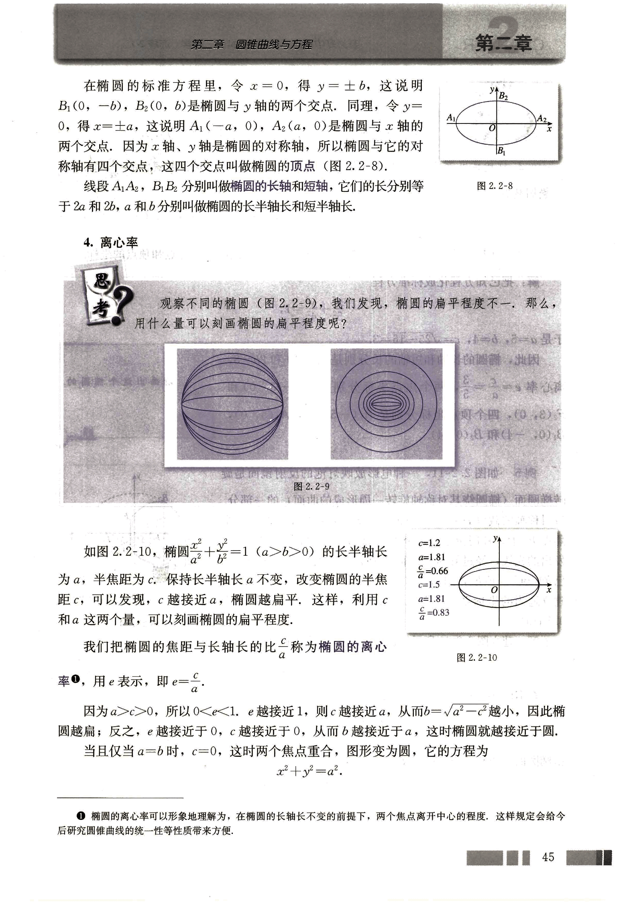
51

# CHAPTER 2 探究

1. $\frac{b}{a}$ 或 $\frac{c}{b}$ 的大小能刻画椭圆的扁平程度吗？为什么？

2. 你能运用三角函数的知识解释，为什么 $e = \frac{c}{a}$ 越大，椭圆越扁？$e = \frac{c}{a}$ 越小，椭圆越圆吗？

例 4 求椭圆 $16x^2 + 25y^2 = 400$ 的长轴和短轴的长、离心率、焦点和顶点的坐标。

解：把已知方程化成标准方程 $\frac{x^2}{25} + \frac{y^2}{16} = 1$，

于是 $a = 5$，$b = 4$，$c = \sqrt{25 - 16} = 3$。

因此，椭圆的长轴和短轴的长分别是 $2a = 10$ 和 $2b = 8$，

离心率 $e = \frac{c}{a} = \frac{3}{5}$，两个焦点坐标分别是 $F_1(-3, 0)$ 和 $F_2(3, 0)$，四个顶点坐标分别是 $A_1(-5, 0)$，$A_2(5, 0)$，$B_1(0, -4)$ 和 $B_2(0, 4)$。

例 5 如图 2.2-11，一种电影放映灯泡的反射镜面是旋转椭圆面（椭圆绕其对称轴旋转一周形成的曲面）的一部分，过对称轴的截口 BAC 是椭圆的一部分，灯丝位于椭圆的一个焦点 $F_1$ 上，片门位于另一个焦点 $F_2$ 上。由椭圆一个焦点 $F_1$ 发出的光线，经过旋转椭圆面反射后集中到另一个焦点 $F_2$。已知 $BC \perp F_1F_2$，$|F_1B| = 2.8 \, cm$，$|F_1F_2| = 4.5 \, cm$。试建立适当的坐标系，求截口 BAC 所在椭圆的方程（精确到 0.1 cm）。

解：建立图 2.2-11 所示的直角坐标系，设所求椭圆方程为 $\frac{x^2}{a^2} + \frac{y^2}{b^2} = 1$。

在 Rt△$BF_1F_2$ 中，

$|F_2B| = \sqrt{|F_1B|^2 + |F_1F_2|^2} = \sqrt{2.8^2 + 4.5^2}$。

由椭圆的性质知，$|F_1B| + |F_2B| = 2a$，所以

$a = \frac{1}{2}(|F_1B| + |F_2B|) = \frac{1}{2}(2.8 + \sqrt{2.8^2 + 4.5^2})$

[图 2.2-11](images/2.2-11.png)

46

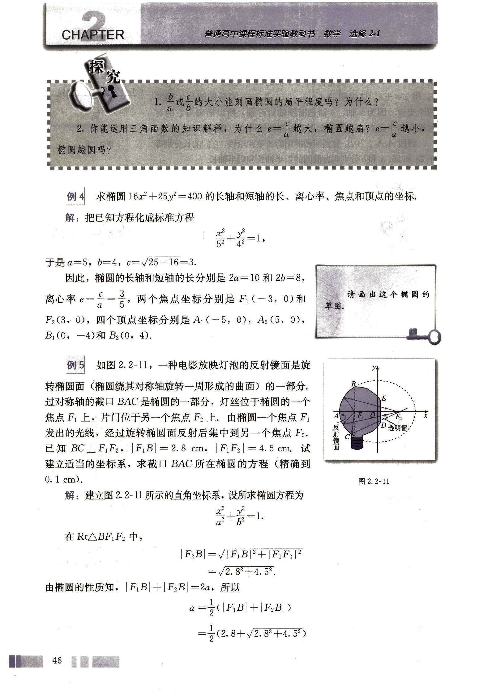
52

# 第二章 圆锥曲线与方程

## 例 6

点 M(x, y)与定点 F(4, 0)的距离和它到直线 l: $x = \frac{25}{4}$ 的距离的比是常数 $\frac{4}{5}$，求点 M 的轨迹。

解：设 d 是点 M 到直线 l: $x = \frac{25}{4}$ 的距离，根据题意，

点 M 的轨迹就是集合 $P = \{M|\frac{MF}{d} = \frac{4}{5}\}$，

由此得 $\frac{\sqrt{(x-4)^2 + y^2}}{\frac{25}{4} - x} = \frac{4}{5}$。

将上式两边平方，并化简，得

9x² + 25y² = 225，

即 $\frac{x^2}{25} + \frac{y^2}{9} = 1$。

[图 2.2-12](images/2.2-12.png)

所以，点 M 的轨迹是长轴、短轴长分别为 10、6 的椭圆 (图 2.2-12)。

## 例 7

已知椭圆 $\frac{x^2}{25} + \frac{y^2}{9} = 1$，直线 l: 4x - 5y + 40 = 0。椭圆上是否存在一点，它到直线 l 的距离最小？最小距离是多少？

分析：作出直线及椭圆 (图 2.2-13)。观察图形，可以发现，利用平行于直线 l 且与椭圆只有一个交点的直线，可以求得相应的最小距离。

解：由直线的方程与椭圆的方程可以知道，直线 l 与椭圆不相交（为什么？）。设直线 m 平行于直线 l，则直线 m 的方程可以写成

4x - 5y + k = 0.

由方程组

$\begin{cases}
4x - 5y + k = 0 \\
\frac{x^2}{25} + \frac{y^2}{9} = 1
\end{cases}$

消去 y，得

[图 2.2-13](images/2.2-13.png)

47

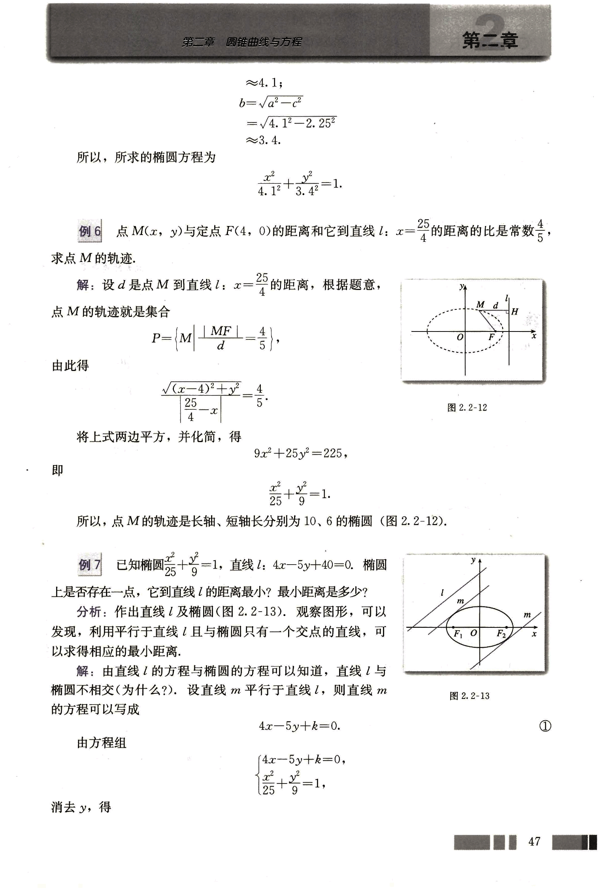
53

# CHAPTER 2

## $25x^2 + 8kx + k^2 - 225 = 0$

令方程 ② 的根的判别式$\Delta = 0$，得

$64k^2 - 4 \times 25(k^2 - 225) = 0$

解方程 ③ 得

$k_1 = 25$, 或 $k_2 = -25$

由图 2.2-13 可知，当 $k = 25$ 时，直线 m 与椭圆的交点到直线 l 的距离最近，此时直线 m 的方程为 $4x - 5y + 25 = 0$。

直线 m 与直线 l 间的距离

$d = \frac{|40 - 25|}{\sqrt{4^2 + 5^2}} = \frac{15}{41}\sqrt{41}$

所以，最小距离是 $\frac{15}{41}\sqrt{41}$。

## 练习

1. 你能标出图中椭圆焦点的位置吗？依据是什么？

2. 求下列椭圆的焦点坐标：

(1) $\frac{x^2}{100} + \frac{y^2}{36} = 1$;

(2) $2x^2 + y^2 = 8$。

3. 求适合下列条件的椭圆的标准方程：

(1) 焦点在 x 轴上，$a = 6$，$e = \frac{1}{3}$；

(2) 焦点在 y 轴上，$c = 3$，$e = \frac{3}{5}$。

4. 求适合下列条件的椭圆的标准方程：

(1) 经过点 P(-3, 0), Q(0, -2);

(2) 长轴长等于 20，离心率等于 $\frac{3}{5}$。

5. 比较下列每组中椭圆的形状，哪一个更圆，哪一个更扁？为什么？

(1) $9x^2 + y^2 = 36$ 与 $\frac{x^2}{16} + \frac{y^2}{12} = 1$；

(2) $x^2 + 9y^2 = 36$ 与 $\frac{x^2}{6} + \frac{y^2}{10} = 1$。

6. 求下列直线和椭圆的交点坐标：

(1) $3x + 10y - 25 = 0$，$\frac{x^2}{25} + \frac{y^2}{4} = 1$；

(2) $3x - y + 2 = 0$，$\frac{x^2}{16} + \frac{y^2}{4} = 1$。

7. 经过椭圆 $\frac{x^2}{2} + y^2 = 1$ 的左焦点 $F_1$ 作倾斜角为 60° 的直线 l，直线 l 与椭圆相交于 A，B 两点，求 AB 的长。

[image](images/image.png)

48

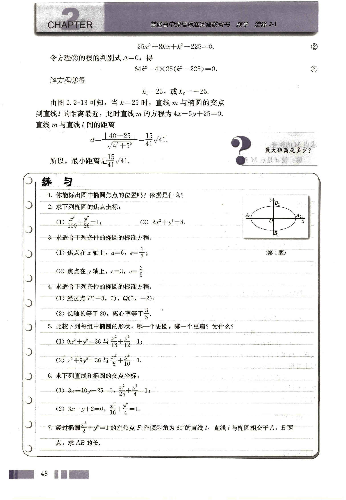
54

# 第二章 圆锥曲线与方程

## 习题 2.2

### A 组

1. 如果点 M(x,y)在运动过程中,总满足关系式
   $\sqrt{x^2+(y+3)^2} + \sqrt{x^2+(y-3)^2} = 10$，
   点 M 的轨迹是什么曲线？为什么？写出它的方程.

2. 写出适合下列条件的椭圆的标准方程：
   (1) 焦点在 x 轴上，焦距等于 4，并且经过点 P(3, -2√6)；
   (2) 焦点坐标分别为(0,-4), (0, 4), a=5；
   (3) a+c=10, a-c=4.

3. 讨论下列椭圆的范围，并画出图形：
   (1) $4x^2+y^2=16$；
   (2) $5x^2+9y^2=100$.

4. 求下列椭圆的长轴和短轴长、离心率、焦点坐标、顶点坐标：
   (1) $x^2+4y^2=16$；
   (2) $9x^2+y^2=81$.

5. 求适合下列条件的椭圆的标准方程：
   (1) 经过点 P(-2√2, 0), Q(0, √5)；
   (2) 长轴长是短轴长的 3 倍，且经过点 P(3, 0)；
   (3) 焦距是 8，离心率等于 0.8.

6. 已知点 P 是椭圆$\frac{x^2}{5} + \frac{y^2}{4} = 1$上的一点，且以点 P 及焦点 F1, F2为顶点的三角形的面积等于 1，求点 P 的坐标.

7. 如图,[图](images/图.png) 圆 O 的半径为定长 r，A 是圆内一个定点，P 是圆上任意一点，线段 AP 的垂直平分线和半径 OP 相交于点 Q，当点 P 在圆上运动时，点 Q 的轨迹是什么？为什么？

8. 已知椭圆$\frac{x^2}{4}+\frac{y^2}{9}=1$，一组平行直线的斜率是$\frac{3}{2}$.
   (1) 这组直线何时与椭圆相交？
   (2) 当它们与椭圆相交时，证明这些直线被椭圆截得的线段的中点在一条直线上.

9. 彗星“紫金山一号”是南京紫金山天文台发现的，它的运行轨道是以太阳为一个焦点的椭圆. 测得轨道的近日点（距离太阳最近的点）距太阳中心 1.486 天文单位，远日点（距离太阳最远的点）距太阳中心 5.563 天文单位（1 天文单位是太阳到地球的平均距离，约 1.5 × 108km），且近日点、远日点及太阳中心在同一条直线上，求轨道的方程.

10. 已知地球运行的轨道是长半轴长 a=1.50 × 108km，离心率 e=0.019 2 的椭圆，且太阳在这个椭圆的一个焦点上，求地球到太阳的最大和最小距离.

49

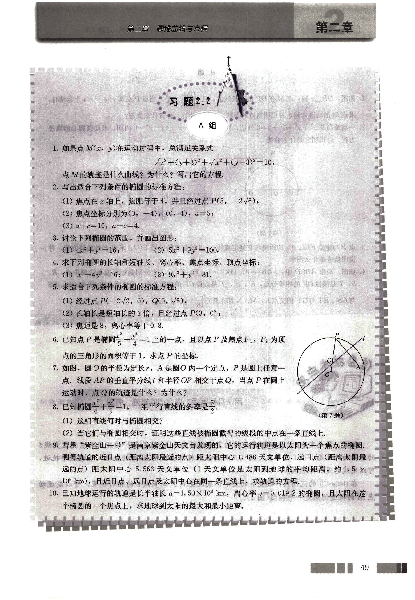
55

# CHAPTER 2

## B 组

1. 如图，DP⊥x 轴，点 M 在 DP 的延长线上，且$\frac{|DM|}{|DP|} = \frac{3}{2}$。当点 P 在圆$x^2+y^2=4$上运动时，求点 M 的轨迹方程，并说明轨迹的形状，与例 2 相比，你有什么发现？

2. 一动圆与圆$x^2+y^2+6x+5=0$外切，同时与圆$x^2+y^2-6x-91=0$内切，求动圆圆心的轨迹方程，并说明它是什么曲线。

[image1](images/image1.png)

[image2](images/image2.png)

3. 点 P 与定点 F(2, 0)的距离和它到定直线 x=8 的距离的比是 1:2，求点 P 的轨迹方程，并说明轨迹是什么图形。

4. 如图，矩形 ABCD 中，|AB|=8，|BC|=6。E，F，G，H 分别是矩形四条边的中点，R，S，T 是线段 OF 的四等分点，R’，S’，T’是线段 CF 的四等分点。请证明直线 ER 与 GR’，ES 与 GS’，ET 与 GT’的交点 L，M，N 都在椭圆$\frac{x^2}{16} + \frac{y^2}{9} = 1$上。

[image3](images/image3.png)

[image4](images/image4.png)

## 用《几何画板》探究点的轨迹：椭圆

如图，F 是定点，l 是不经过点 F 的定直线，动点 M 到定点 F 的距离和它到定直线 l 的距离的比 e 是小于 1 的常数。用《几何画板》软件画出动点 M 的轨迹，观察这个轨迹，可以发现它是一个椭圆。

在 0<e<1 的范围内，改变 e 的大小，或改变点 F 与直线 l 的相对位置，可以发现动点 M 的轨迹仍然是一个椭圆（图 1）。

50

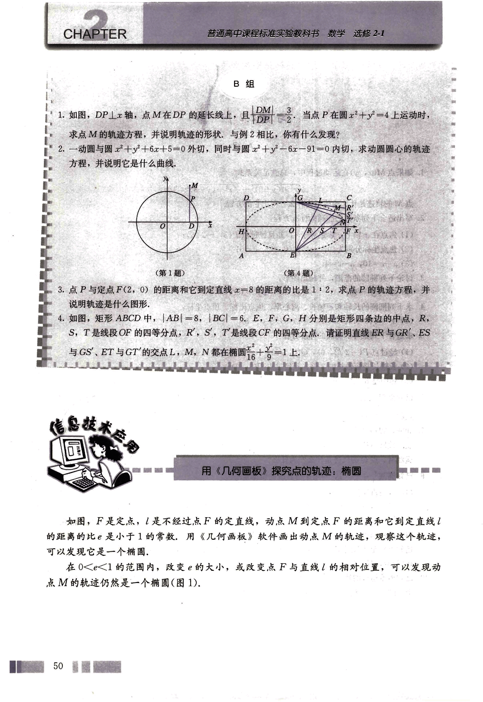
56

# 第二章 圆锥曲线与方程

图 1

图 2

借助直角坐标系，我们可以把上述问题叙述为：

若点 M(x, y)与定点 F(c, 0)的距离和它到定直线 l: $x = \frac{a^2}{c}$ 的距离的比是常数(a > c > 0), 则点 M 的轨迹是一个椭圆(图 2)。定点 F(c, 0)是椭圆的一个焦点，直线 l: $x = \frac{a^2}{c}$ 称为相应于焦点 F 的准线，由椭圆的对称性，相应于焦点 F'(-c, 0)，椭圆的准线是 l': $x = -\frac{a^2}{c}$。

你能推导出上述椭圆的方程吗？这个椭圆的长轴长、短轴长、离心率分别是多少？

51

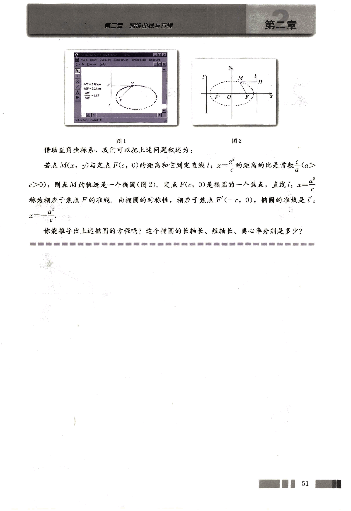
57

# CHAPTER 2

## 2.3 双曲线

### 2.3.1 双曲线及其标准方程

思考？ 我们知道，与两个定点距离的和为非零常数（大于两定点间的距离）的点的轨迹是椭圆。那么，与两定点距离的差为非零常数的点的轨迹是什么？

如图 2.3-1，取一条拉链，拉开它的一部分，在拉开的两边上各选择一点，分别固定在点 $F_1$，$F_2$ 上，把笔尖放在点 M 处，随着拉链逐渐拉开或者闭拢，笔尖所经过的点就画出一条曲线，这条曲线是满足下面条件的点的集合：

$P = \{M||MF_1| - |MF_2| = 常数\}$

如果使点 M 到点 $F_2$ 的距离减去到点 $F_1$ 的距离所得的差等于同一个常数，就得到另一条曲线（图 2.3-1 中左边的曲线），这条曲线是满足下面条件的点的集合：

$P = \{M||MF_2| - |MF_1| = 常数\}$

这两条曲线合起来叫做双曲线，每一条叫做双曲线的一支。

[image](images/2.3-1.png)

思考？ 类比椭圆的定义，你能给出双曲线的定义吗？

我们把平面内与两个定点 $F_1$，$F_2$ 的距离的差的绝对值等于常数（小于 $|F_1F_2|$）的点的轨迹叫做双曲线 (hyperbola)。这两个定点叫做双曲线的焦点，两焦点间的距

52

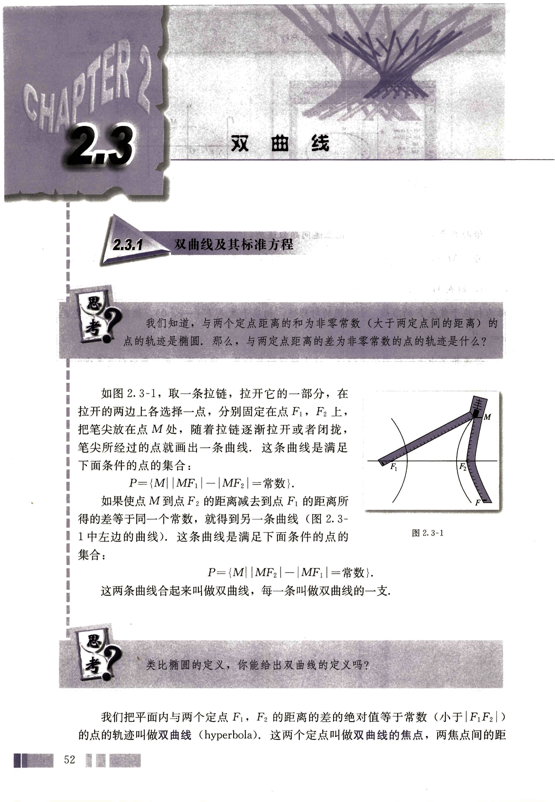
58

# 第二章 圆锥曲线与方程

## 离叫做双曲线的焦距

类比椭圆标准方程的建立过程，你能说说应怎样选择坐标系，建立双曲线的标准方程吗？

我们根据双曲线的几何特征，选择恰当的坐标系，建立双曲线
的标准方程。

如图 2.3-2，建立直角坐标系 xOy，使 x 轴经过两焦点 F₁，F₂，y 轴为线段 F₁F₂ 的垂直平分线。

设 M(x, y)是双曲线上任意一点，双曲线的焦距为 2c (c>0)，那么，焦点 F₁，F₂ 的坐标分别是(-c, 0), (c, 0)。又设点 M 与 F₁，F₂ 的距离的差的绝对值等于常数 2a.

由定义可知，双曲线就是集合

P = {M |||MF₁| - |MF₂|| = 2a}

因为 |MF₁| = √(x+c)²+y²，|MF₂| = √(x-c)²+y²，

所以

√(x+c)²+y² - √(x-c)²+y² = ±2a. ①

类比建立椭圆标准方程的化简过程，化简 ①，得

(c² - a²)x² - a²y² = a²(c² - a²)

两边同除以 a²(c² - a²), 得

$\frac{x^2}{a^2} - \frac{y^2}{c^2 - a^2} = 1$

由双曲线的定义可知，2c > 2a，即 c > a，所以 c² - a² > 0.

类比椭圆标准方程的建立过程，我们令 c² - a² = b²，其中 b > 0，代入上式，得

$\frac{x^2}{a^2} - \frac{y^2}{b^2} = 1$ (a > 0, b > 0). ②

从上述过程可以看到，双曲线上任意一点的坐标都满足方程 ②，以方程 ② 的解(x, y)为坐标的点到双曲线的两个焦点 F₁(-c, 0), F₂(c, 0)的距离之差的绝对值为 2a，即以方程 ② 的解为坐标的点都在双曲线上。由曲线与方程的关系可知，方程 ② 是双曲线的方程，我们把它叫做双曲线的标准方程，它表示焦点在 x 轴上，焦点分别是 F₁(-c, 0), F₂(c, 0)的双曲线，这里 c² = a² + b².

53

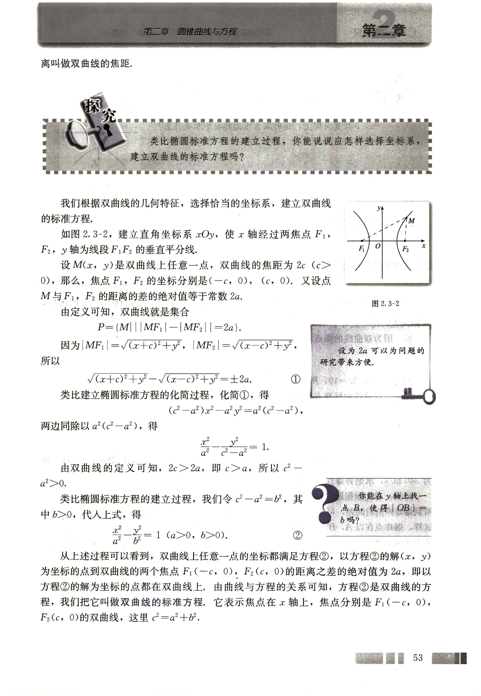
59

# CHAPTER 2

普通高中课程标准实验教科书 数学 选修 2-1

## 思考？

类比焦点在 _y_ 轴上的椭圆标准方程，如图 2.3-3，双曲线的焦点分别是 F₁ (0, -_c_), F₂ (0, _c_), _a_, _b_ 的意义同上，这时双曲线的标准方程是什么？

此时双曲线的方程是

$\frac{y^2}{a^2} - \frac{x^2}{b^2} = 1$ (_a_ > 0, _b_ > 0),

这个方程也是双曲线的标准方程。

## 例 1

已知双曲线两个焦点分别为 F₁(-5, 0), F₂(5, 0), 双曲线上一点 P 到 F₁, F₂ 距离差的绝对值等于 6，求双曲线的标准方程。

解：因为双曲线的焦点在 _x_ 轴上，所以设它的标准方程为

$\frac{x^2}{a^2} - \frac{y^2}{b^2} = 1$ (_a_ > 0, _b_ > 0).

因为 2*a* = 6, 2*c* = 10, 所以 _a_ = 3, _c_ = 5, 所以 $b^2 = c^2 - a^2 = 16$.

因此，双曲线的标准方程为

$\frac{x^2}{9} - \frac{y^2}{16} = 1$.

## 例 2

已知 A，B 两地相距 800 m，在 A 地听到炮弹爆炸声比在 B 地晚 2 s，且声速为 340 m/s，求炮弹爆炸点的轨迹方程。

分析：首先根据题意，判断轨迹的形状。由声速及 A，B 两处听到爆炸声的时间差，可知 A，B 两处与爆炸点的距离的差为定值。

这样，爆炸点在以 A，B 为焦点的双曲线上。因为爆炸点离 A 处比离 B 处远，所以爆炸点应在靠近 B 处的双曲线的一支上。

解：如图 2.3-4，建立直角坐标系 _xOy_，使 A，B 两点在 _x_ 轴上，并且坐标原点与线段 AB 的中点重合。

设爆炸点 P 的坐标为 (_x_, _y_), 则

|PA| - |PB| = 340 × 2 = 680,

即

2*a* = 680, _a_ = 340.

图 2.3-3 [image](images/2.3-3.png)

图 2.3-4 [image](images/2.3-4.png)

54

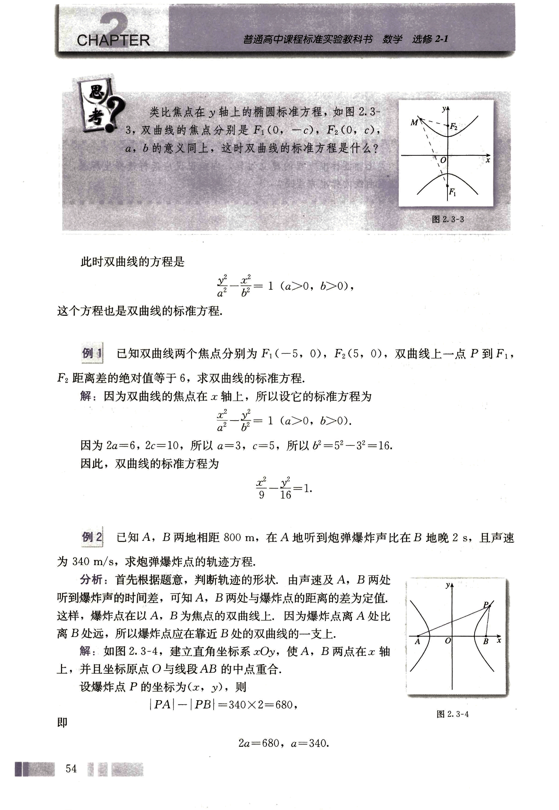
60

# 第二章 圆锥曲线与方程

## 又

|AB| = 800,

2c = 800, c = 400,

b² = c² - a² = 44 400.

因为|PA| - |PB| = 340 × 2 = 680 > 0, 所以 x > 0.

因此炮弹爆炸点的轨迹(双曲线)的方程为

$\frac{x^2}{115600} - \frac{y^2}{44400} = 1$ (x > 0).

? 如果 A, B 两处同时听到爆炸声,那么爆炸点在什么曲线上? 为什么?

利用两个不同的观测点 A, B 测得同一点 P 发出信号的时间差,可以确定点 P 所在双曲线的方程,如果再增设一个观测点 C,利用 B, C(或 A, C)两处测得的点 P 发出的信号的时间差,就可以求出另一个双曲线的方程,解这两个方程组成的方程组,就能确定点 P 的准确位置,这是双曲线的一个重要应用。

## 探究

如图 2.3-5, 点 A, B 的坐标分别是(-5, 0), (5, 0), 直线 AM, BM 相交于点 M, 且它们斜率之积是$\frac{4}{9}$，试求点 M 的轨迹方程, 并由点 M 的轨迹方程判断轨迹的形状, 与 2.2 例 3 比较, 你有什么发现？

[图 2.3-5](images/2.3-5.png)

## 练习

1. 求适合下列条件的双曲线的标准方程：

(1) 焦点在 x 轴上，a = 4, b = 3;

(2) 焦点在 y 轴上，经过点($-\sqrt{2}$, $-\sqrt{3}$), ($\frac{\sqrt{15}}{3}$, $\sqrt{2}$);

(3) 焦点为(0, -6), (0, 6), 且经过点(2, -5).

2. 求证：双曲线 x² - 15y² = 15 与椭圆$\frac{x^2}{25} + \frac{y^2}{9} = 1$的焦点相同.

3. 已知方程$\frac{x^2}{2+m} - \frac{y^2}{m+1} = 1$表示双曲线，求 m 的取值范围.

55

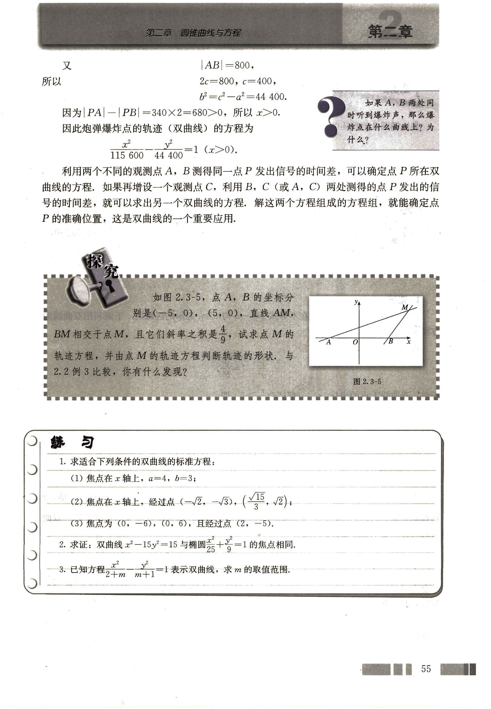
61

# CHAPTER 2

## 2.3.2 双曲线的简单几何性质

类比椭圆几何性质的研究方法，我们根据双曲线的标准方程

$\frac{x^2}{a^2} - \frac{y^2}{b^2} = 1$ (a>0, b>0)

研究它的几何性质.

### 思考？

类比椭圆几何性质的研究，你认为应研究双曲线 $\frac{x^2}{a^2} - \frac{y^2}{b^2} = 1$ (a>0, b>0) 的哪些性质？如何研究这些性质？

1. **范围**

观察双曲线，可以看出它在不等式 x≤-a 与 x≥a 表示的区域内。下面利用双曲线的方程求出它的范围。

将方程 ① 化为：

$\frac{x^2}{a^2} - 1 = \frac{y^2}{b^2}$，

$ \frac{x^2}{a^2} \ge 1$，

$x^2 \ge a^2$，

于是，双曲线上点的坐标(x, y)都适合 $\frac{x^2}{a^2} \ge 1$，即

所以 x ≤ -a，或 x ≥ a.

这说明双曲线在不等式 x≤-a 与 x≥a 所表示的区域内。

2. **对称性**

类比研究椭圆 $\frac{x^2}{a^2} + \frac{y^2}{b^2} = 1$ (a>b>0) 对称性的方法，容易得到：双曲线关于 x 轴、y 轴和原点都是对称的。这时，坐标轴是双曲线的对称轴，原点是双曲线的对称中心，双曲线的对称中心叫做双曲线的中心。

3. **顶点**

在方程 ① 里，令 y=0，得 x=±a，因此双曲线和 x 轴有两个交点 A₁(-a, 0), A₂(a, 0)。因为 x 轴是双曲线的对称轴，所以双曲线和它的对称轴有两个交点，它们叫做双曲线的顶点。

令 x=0，得 y²=-b²，这个方程没有实数根，说明双曲线和 y 轴没有交点，但我们也把 B₁(0,-b), B₂(0, b)画在 y 轴上 (图 2.3-6)。

[图 2.3-6](images/2.3-6.png)

56

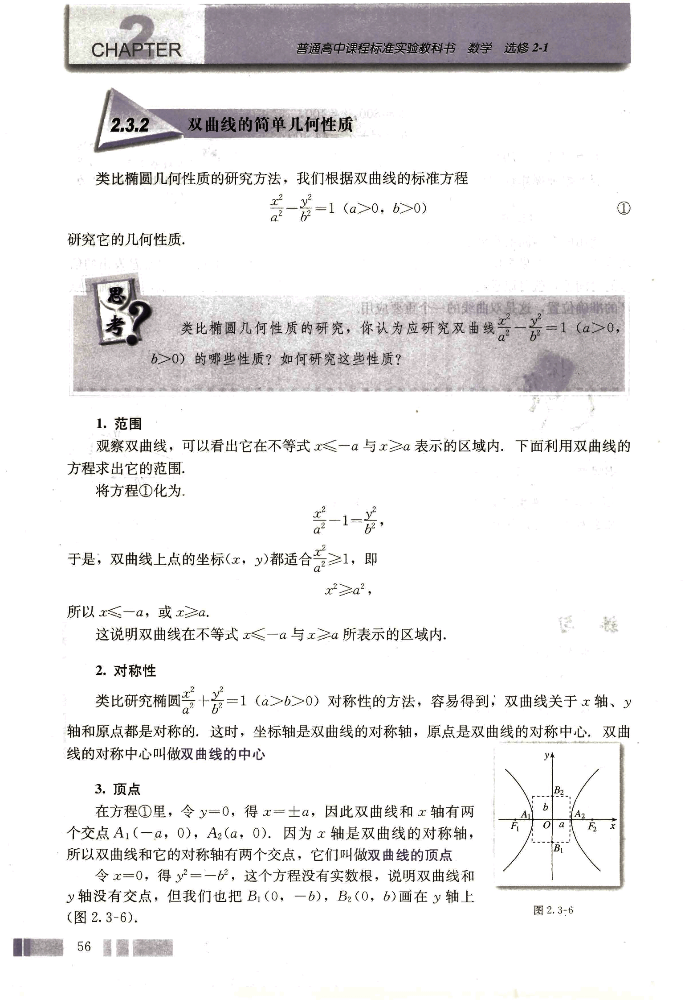
62

# 第二章 圆锥曲线与方程

线段 A₁A₂ 叫做双曲线的实轴，它的长等于 2a，a 叫做双曲线的半实轴长；线段 B₁B₂ 叫做双曲线的虚轴，它的长等于 2b，b 叫做双曲线的半虚轴长。

## 4.渐近线

[图 2.3-7](images/2.3-7.png)

如图 2.3-7，用《几何画板》画双曲线$\frac{x^2}{9}-\frac{y^2}{4}=1$，在位于第一象限的曲线上画一点 M，测量点 M 的横坐标$x_M$以及它到直线$\frac{x}{3}-\frac{y}{2}=0$的距离 d。沿曲线向右上角拖动点 M，观察$x_M$与 d 的大小关系，你发现了什么？

可以发现，点 M 的横坐标$x_M$越来越大，d 越来越小，但永远不等于 0。

实际上，经过 A₁, A₂ 作 y 轴的平行线 x=±a，经过 B₁, B₂ 作 x 轴的平行线 y=±b，四条直线围成一个矩形（图 2.3-7）。矩形的两条对角线所在直线的方程是$\frac{x}{a} \pm \frac{y}{b} = 0$。利用信息技术，可以看到，双曲线$\frac{x^2}{a^2}-\frac{y^2}{b^2}=1$的各支向外延伸时，与这两条直线逐渐接近，我们把这两条直线叫做双曲线的渐近线。也就是说，双曲线与它的渐近线无限接近，但永不相交。

在方程$\frac{x^2}{a^2}-\frac{y^2}{b^2}=1$中，如果 a=b，那么双曲线的方程为$x^2-y^2=a^2$，它的实轴和虚轴的长都等于 2a。这时，四条直线 x=±a，y=±a 围成正方形，渐近线方程为 y=±x，它们互相垂直，并且平分双曲线实轴和虚轴所成的角。实轴和虚轴等长的双曲线叫做等轴双曲线。

57

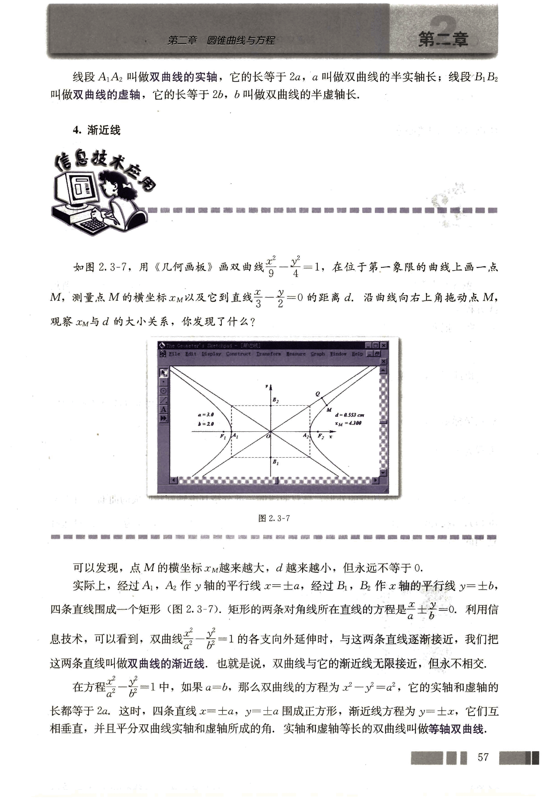
63

# CHAPTER 2

## 5. 离心率

与椭圆类似，双曲线的焦距与实轴长的比 $\frac{c}{a}$，叫做双曲线的离心率。因为 $c>a>0$，所以双曲线的离心率 $e = \frac{c}{a} > 1$。

思考

离心率可以刻画椭圆的扁平程度，双曲线的离心率刻画双曲线的什么几何特征？

## 例 3

求双曲线 $9y^2 - 16x^2 = 144$ 的半实轴长和半虚轴长、焦点坐标、离心率、渐近线方程。

解：把方程 $9y^2 - 16x^2 = 144$ 化为标准方程
$\frac{y^2}{4^2} - \frac{x^2}{3^2} = 1$。

由此可知，半实轴长 $a = 4$，半虚轴长 $b = 3$；
$c = \sqrt{a^2 + b^2} = \sqrt{4^2 + 3^2} = 5$，

焦点坐标是 $(0, -5)$，$(0, 5)$；离心率 $e = \frac{c}{a} = \frac{5}{4}$；渐近线方程为 $y = \pm \frac{4}{3}x$。

## 例 4

双曲线型冷却塔的外形，是双曲线的一部分绕其虚轴旋转所成的曲面 ([图 2.3-8](images/2.3-8.png))，它的最小半径为 12 m，上口半径为 13 m，下口半径为 25 m，高为 55 m。试选择适当的坐标系，求出此双曲线的方程（精确到 1 m）。

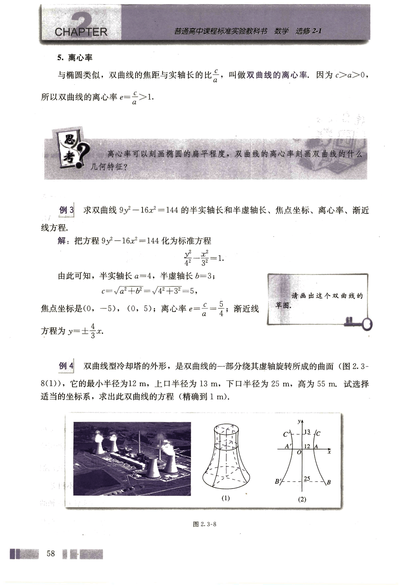
64

# 第二章 圆锥曲线与方程

## 解：

如图 2.3-8(2), 建立冷却塔的轴截面所在平面的直角坐标系 xOy, 使小圆的直径 AA′在 x 轴上，圆心与原点重合。这时，上、下口的直径 CC′，BB′都平行于 x 轴，且|CC′|=13×2，|BB′|=25×2。

设双曲线的方程为$\frac{x^2}{a^2} - \frac{y^2}{b^2} = 1 (a>0, b>0)$，令 C 点的坐标为(13, y)，则点 B 的坐标为(25, y-55)。

因为点 B，C 在双曲线上，所以

$\begin{cases} \frac{25^2}{12^2} - \frac{(y-55)^2}{b^2} = 1, \\ \frac{13^2}{12^2} - \frac{y^2}{b^2} = 1. \end{cases}$ ① ②

由方程 ②，得$y = \frac{5b}{12}$（负值舍去），代入方程 ①，得

$\frac{25^2}{12^2} - \frac{(\frac{5b}{12} - 55)^2}{b^2} = 1,$

化简得

$196b^2 + 275b - 18150 = 0.$ ③

用计算器解方程 ③，得

$b \approx 25.$

所以，所求双曲线的方程为

$\frac{x^2}{144} - \frac{y^2}{625} = 1.$

## 例 5

点 M(x, y)到定点 F(5, 0)的距离和它到定直线$l: x = \frac{16}{5}$的距离的比是常数$\frac{5}{4}$，求点 M 的轨迹。

解：设 d 是点 M 到直线 l 的距离，根据题意，所求轨迹就是集合

$P = \{M | \frac{|MF|}{d} = \frac{5}{4}\},$

由此得

$\frac{\sqrt{(x-5)^2 + y^2}}{|\frac{16}{5} - x|} = \frac{5}{4}.$

将上式两边平方，并化简，得

$9x^2 - 16y^2 = 144,$

即

$\frac{x^2}{16} - \frac{y^2}{9} = 1.$

所以，点 M 的轨迹是实轴、虚轴长分别为 8，6 的双曲线（图 2.3-9）。

[图 2.3-9](images/2.3-9.png)

59

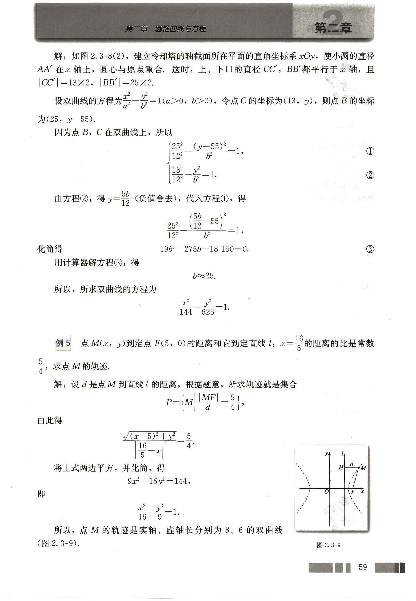
65

# CHAPTER

普通高中课程标准实验教科书 数学 选修 2-1

## 思考？

例 5 与 2.2 的例 6 比较，你有什么发现？

## 例 6

如图 2.3-10，过双曲线$\frac{x^2}{3} - \frac{y^2}{6} = 1$的右焦点$F_2$，倾斜角为 30° 的直线交双曲线于 A，B 两点，求|AB|。

解：由双曲线的方程得，两焦点分别为$F_1(-3, 0)$，$F_2(3, 0)$。

因为直线 AB 的倾斜角是 30°，且直线经过右焦点$F_2$，所以，直线 AB 的方程为

$y = \frac{\sqrt{3}}{3}(x - 3)$。

由$\begin{cases} y = \frac{\sqrt{3}}{3}(x - 3) \\ \frac{x^2}{3} - \frac{y^2}{6} = 1 \end{cases}$

消去 y，得

$5x^2 + 6x - 27 = 0$。

解这个方程得

$x_1 = -3, x_2 = \frac{9}{5}$。

将$x_1, x_2$的值代入 ①，得

$y_1 = -2\sqrt{3}, y_2 = -\frac{2\sqrt{3}}{5}$。

于是，A，B 两点的坐标分别为$(-3, -2\sqrt{3})$，$(\frac{9}{5}, -\frac{2\sqrt{3}}{5})$。

所以，$|AB| = \sqrt{(x_1 - x_2)^2 + (y_1 - y_2)^2} = \sqrt{(-3 - \frac{9}{5})^2 + (-2\sqrt{3} + \frac{2\sqrt{3}}{5})^2} = \frac{16\sqrt{3}}{5}$。

## 思考？

你能求出$\triangle AF_1B$的周长吗？

[图 2.3-10](images/2.3-10.png)

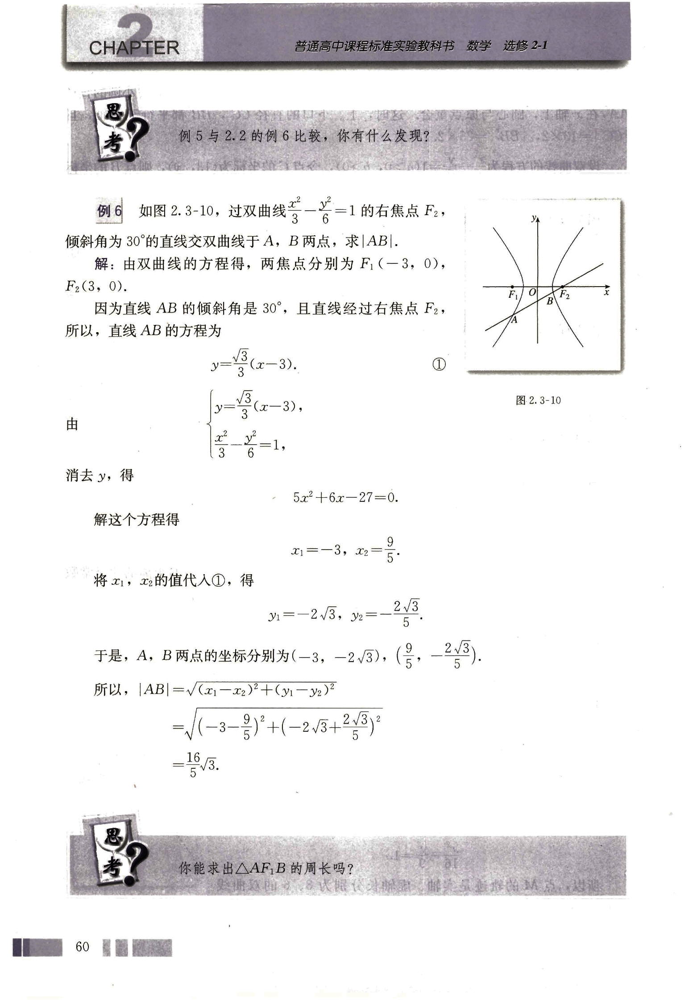
66

# 第二章 圆锥曲线与方程

## 练习

1. 求下列双曲线的实轴和虚轴的长，顶点和焦点的坐标，离心率：
   (1) $x^2 - 8y^2 = 32$;
   (2) $9x^2 - y^2 = 81$;
   (3) $x^2 - y^2 = -4$;
   (4) $\frac{x^2}{49} - \frac{y^2}{25} = 1$.

2. 求符合下列条件的双曲线的标准方程：
   (1) 顶点在 x 轴上，两顶点间的距离是 8，$e = \frac{5}{4}$；
   (2) 焦点在 y 轴上，焦距是 16，$e = \frac{4}{3}$.

3. 求以椭圆 $\frac{x^2}{8} + \frac{y^2}{5} = 1$ 的焦点为顶点，以椭圆的顶点为焦点的双曲线的方程.

4. 对称轴都在坐标轴上的等轴双曲线的一个焦点是$F_1(-6, 0)$，求它的标准方程和渐近线方程.

5. 求下列直线和双曲线的交点坐标：
   (1) $2x - y - 10 = 0$，$\frac{x^2}{20} - \frac{y^2}{5} = 1$;
   (2) $4x - 3y - 16 = 0$，$\frac{x^2}{25} - \frac{y^2}{16} = 1$.

## 习题 2.3

### A 组

1. 双曲线 $4x^2 - y^2 + 64 = 0$ 上一点 P 到它的一个焦点的距离等于 1，那么点 P 到另一个焦点的距离等于

2. 求适合下列条件的双曲线的标准方程：
   (1) 焦点在 x 轴上，$a = 2\sqrt{5}$，经过点 A(-5, 2);
   (2) 经过两点 A(-7, $-6\sqrt{2}$), B($2\sqrt{7}$, 3).

3. 已知下列双曲线的方程，求它的焦点坐标，离心率和渐近线方程：
   (1) $16x^2 - 9y^2 = 144$;
   (2) $16x^2 - 9y^2 = -144$.

4. 求适合下列条件的双曲线的标准方程：
   (1) 焦点在 x 轴上，实轴长是 10，虚轴长是 8；
   (2) 焦点在 y 轴上，焦距是 10，虚轴长是 8；

61

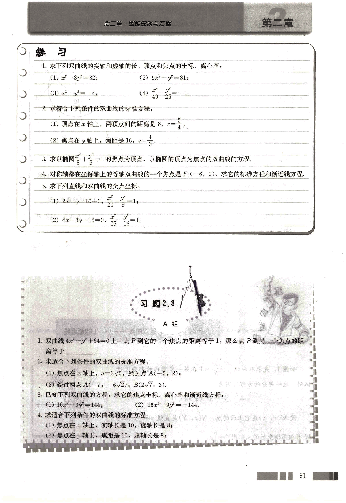
67

# CHAPTER 2 普通高中课程标准实验教科书 数学选修 2-1

(3) 离心率 $e = \sqrt{2}$，经过点 M(-5, 3).

5. 如图，圆 O 的半径为定长 r，A 是圆 O 外一个定点，P 是圆上任意一点，线段 AP 的垂直平分线和直线 OP 相交于点 Q，当点 P 在圆上运动时，点 Q 的轨迹是什么？为什么？

6. 求经过点 A(3, -1)，并且对称轴都在坐标轴上的等轴双曲线的方程。

## B 组

1. 求与椭圆 $\frac{x^2}{49} + \frac{y^2}{24} = 1$ 有公共焦点，且离心率 $e = \frac{5}{4}$ 的双曲线的方程。

2. 相距 1400 m 的 A，B 两个哨所，听到炮弹爆炸声的时间相差 3 s，已知声速是 340 m/s，问炮弹爆炸点在怎样的曲线上，为什么？

3. 求到定点 F(c, 0) (c > 0) 和它到定直线 l: $x = \frac{a^2}{c}$ 距离之比是 $(\frac{c}{a} > 1)$ 的点的轨迹方程。

4. 已知双曲线 $\frac{x^2}{a^2} - \frac{y^2}{2} = 1$，过点 P(1, 1) 能否作一条直线 l，与双曲线交于 A，B 两点，且点 P 是线段 AB 的中点？

## 为什么 $y = \frac{b}{a}x$ 是双曲线 $\frac{x^2}{a^2} - \frac{y^2}{b^2} = 1$ 的渐近线

如图 1，先取双曲线 $\frac{x^2}{a^2} - \frac{y^2}{b^2} = 1$ 在第一象限内的部分进行证明。这一部分的方程可写为

$y = \frac{b}{a}\sqrt{x^2 - a^2}$ ($x > a$).

设 M(x, y) 是它上面的点，N(x, Y) 是直线 $y = \frac{b}{a}x$ 上与 M 有相同横坐标的点，则 $Y = \frac{b}{a}x$.

[图 1](images/图1.png)
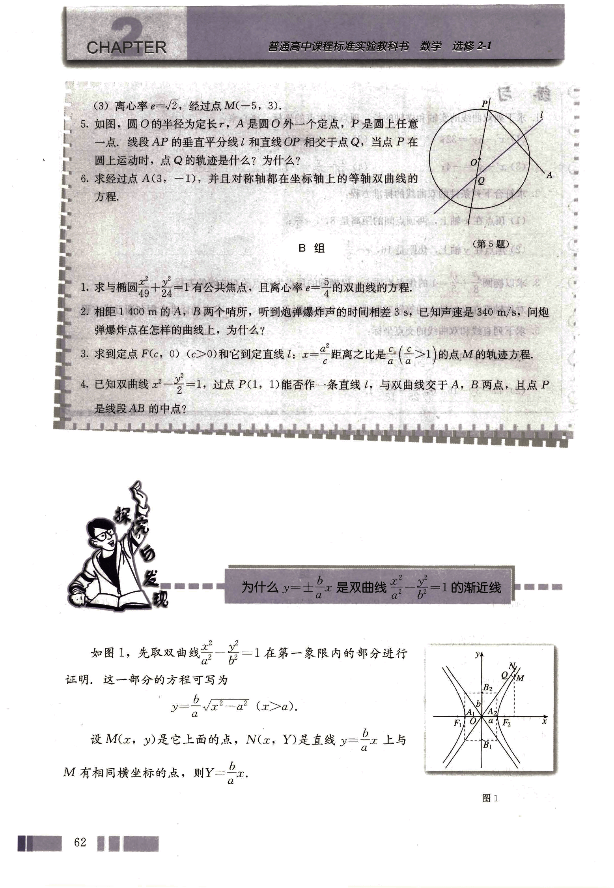
68

# 第二章 圆锥曲线与方程

因为 $y = \frac{b}{a}\sqrt{x^2 - a^2} = \frac{b}{a}\sqrt{1 - (\frac{a}{x})^2} < \frac{b}{a}x = Y$,

所以 $|MN| = Y - y = \frac{b}{a}(x - \sqrt{x^2 - a^2})$

$= \frac{b}{a} \cdot \frac{(x - \sqrt{x^2 - a^2})(x + \sqrt{x^2 + a^2})}{x + \sqrt{x^2 - a^2}}$

$= \frac{ab}{x + \sqrt{x^2 - a^2}}$

设 $|MQ|$ 是点 M 到直线 $y = \frac{b}{a}x$ 的距离，则 $|MQ| < |MN|$。

当 x 逐渐增大时，$|MN|$ 逐渐减小，x 无限增大，$|MN|$ 无限接近于零，$|MQ|$ 也无限接近于零，也就是说，双曲线在第一象限的部分从射线 ON 的下方逐渐接近于射线 ON。

在其他象限内，也可以证明类似的情况。你能证明吗？

另外，我们也可以直接计算 $|MQ|$，证明当 x 无限增大时，$|MQ|$ 无限接近于零。

63

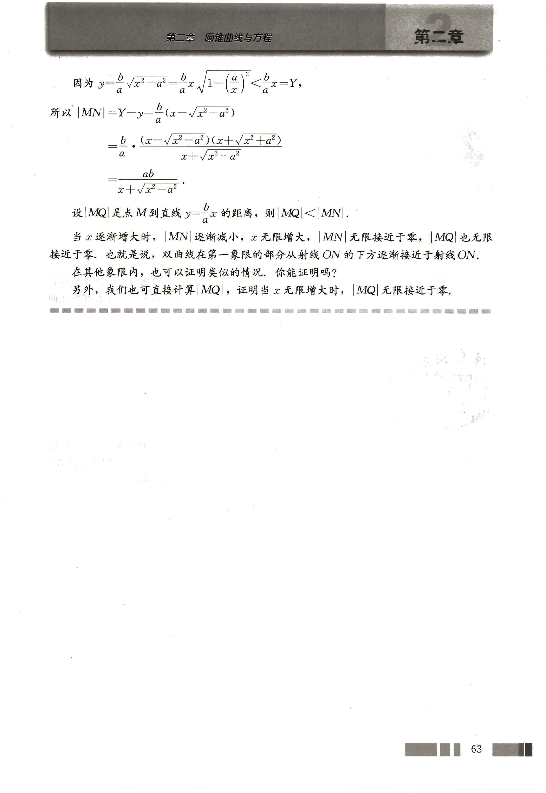
69

# CHAPTER 2

## 2.4 抛物线

### 2.4.1 抛物线及其标准方程

我们知道，二次函数 $y = ax^2 + bx + c (a \ne 0)$ 的图象是一条抛物线，而且研究过它的顶点坐标、对称轴等问题。那么，抛物线到底有怎样的几何特征？它还有哪些几何性质？

用《几何画板》画图，如图 2.4-1，点 F 是定点，$l$ 是不经过点 F 的定直线。H 是 $l$ 上任意一点，过点 H 作 MH $\perp l$，线段 FH 的垂直平分线 $m$ 交 MH 于点 M。拖动点 H，观察点 M 的轨迹，你能发现点 M 满足的几何条件吗？

[图 2.4-1](images/2.4-1.png)

64

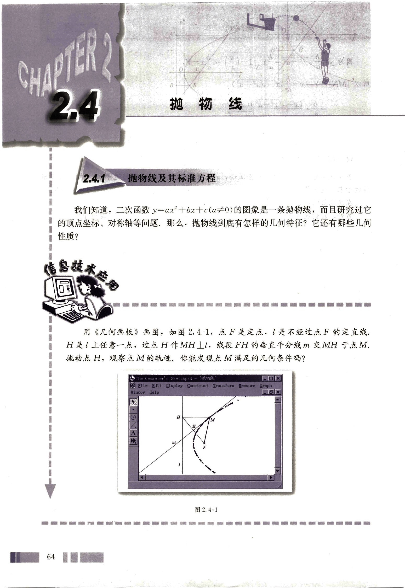
70

# 第二章 圆锥曲线与方程

##

可以发现，点 M 随着 H 运动的过程中，始终有|MF|=|MH|，即点 M 与定点 F 和定直线的距离相等。

我们把平面内与一个定点 F 和一条定直线 l（l 不经过点 F）距离相等的点的轨迹叫做抛物线(parabola)。点 F 叫做抛物线的焦点，直线 l 叫做抛物线的准线。

## 思考

比较椭圆、双曲线标准方程的建立过程，你认为应如何选择坐标系，使所建立的抛物线的方程更简单？

根据抛物线的几何特征，我们取经过点 F 且垂直于直线 l 的直线为 x 轴，垂足为 K，并使原点与线段 KF 的中点重合，建立直角坐标系 xOy（图 2.4-2）。

设|KF|=p(p>0)，那么焦点 F 的坐标为($\frac{p}{2}$, 0)，准线 l 的方程为$x = -\frac{p}{2}$。

设点 M(x,y)是抛物线上任意一点，点 M 到 l 的距离为 d。

由抛物线的定义，抛物线就是点的集合

P={M||MF|=d}.

因为|MF|=$\sqrt{(x-\frac{p}{2})^2+y^2}$，d=$|x+\frac{p}{2}|$，所以

$\sqrt{(x-\frac{p}{2})^2+y^2}=|x+\frac{p}{2}|$。

将上式两边平方并化简，得

$y^2=2px$ (p>0).

从上述过程可以看到，抛物线上任意一点的坐标都满足方程 ①；以方程 ① 的解(x,y)为坐标的点到抛物线的焦点 F($\frac{p}{2}$, 0)的距离与到准线$x = -\frac{p}{2}$的距离相等，即以方程 ① 的解为坐标的点都在抛物线上。这样，我们把方程 ① 叫做抛物线的标准方程，它所表示的抛物线的焦点坐标是($\frac{p}{2}$, 0)，准线方程是$x = -\frac{p}{2}$。

[图 2.4-2](images/2.4-2.png)

65

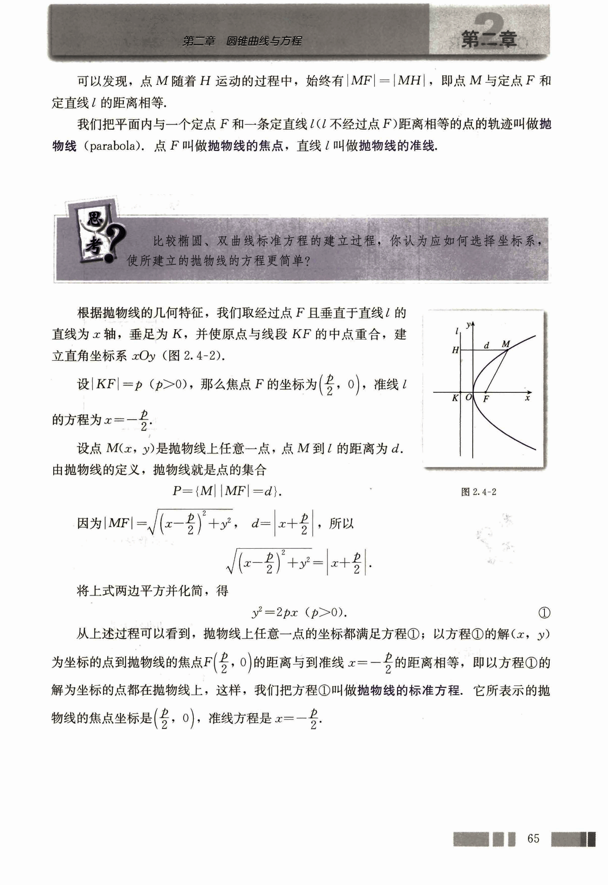
71

# CHAPTER 2

探究

在建立椭圆、双曲线的标准方程时，选择不同的坐标系我们得到了不同形式的标准方程。那么，抛物线的标准方程有哪些不同的形式？请探究之后填写下表。

| 图形                        | 标准方程            | 焦点坐标           | 准线方程           |
| --------------------------- | ------------------- | ------------------ | ------------------ |
| [image1](images/image1.png) | $y^2 = 2px$ ($p>0$) | $(\frac{p}{2}, 0)$ | $x = -\frac{p}{2}$ |
| [image2](images/image2.png) |                     |                    |                    |
| [image3](images/image3.png) |                     |                    |                    |

你能说明二次函数 $y = ax^2$ ($a \ne 0$) 的图象为什么是抛物线吗？指出它的焦点坐标、准线方程。

例 1

(1) 已知抛物线的标准方程是 $y^2 = 6x$，求它的焦点坐标和准线方程；

(2) 已知抛物线的焦点是 F(0, -2)，求它的标准方程。

解：

(1) 因为 $p = 3$，所以抛物线的焦点坐标是 $(\frac{3}{2}, 0)$，准线方程是 $x = -\frac{3}{2}$。

(2) 因为抛物线的焦点在 y 轴的负半轴上，且 $\frac{p}{2} = 2$，$p = 4$，

所以，所求抛物线的标准方程是 $x^2 = -8y$。

例 2 一种卫星接收天线的轴截面如图 2. 4-3(1) 所示。卫星波束呈近似平行状态射入轴截面为抛物线的接收天线，经反射聚集到焦点处。已知接收天线的口径（直径）为 4.8 m，

66

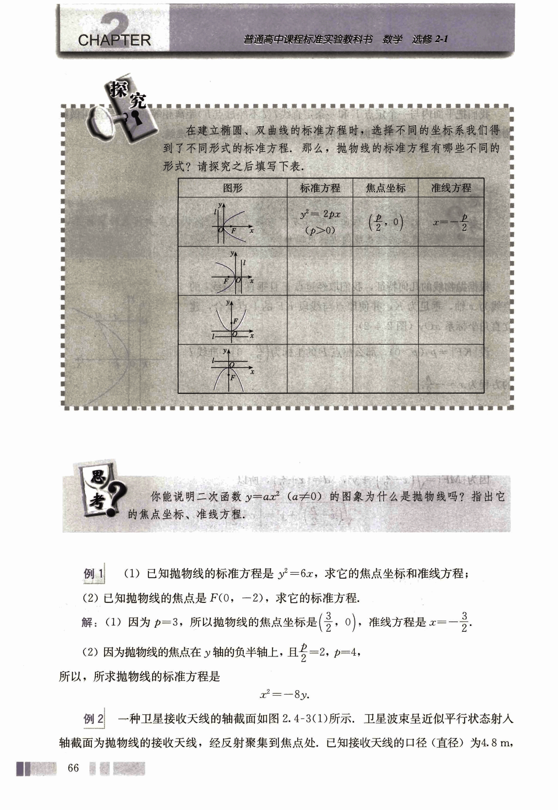
72

# 第二章 圆锥曲线与方程

深度为 0.5 m. 试建立适当的坐标系，求抛物线的标准方程和焦点坐标。

[image1](images/image1.png)

解：如图 2.4-3(2)，在接收天线的轴截面所在平面内建立直角坐标系，使接收天线的顶点（即抛物线的顶点）与原点重合。

设抛物线的标准方程是 $y^2 = 2px (p > 0)$。由已知条件可得，点 A 的坐标是 (0.5, 2.4)，代入方程，得

$2.4^2 = 2p \times 0.5$，

即 $p = 5.76$。

所以，所求抛物线的标准方程是 $y^2 = 11.52x$，焦点坐标是 (2.88, 0)。

## 练习

1. 根据下列条件写出抛物线的标准方程：
   (1) 焦点是 F(3, 0);
   (2) 准线方程是 $x = -\frac{1}{4}$;
   (3) 焦点到准线的距离是 2.

2. 求下列抛物线的焦点坐标和准线方程：
   (1) $y^2 = 20x$;
   (2) $x^2 = \frac{1}{2}y$;
   (3) $2y^2 + 5x = 0$;
   (4) $x^2 + 8y = 0$.

3. 填空：
   (1) 抛物线 $y^2 = 2px (p > 0)$ 上一点 M 到焦点距离是 $a (a > \frac{p}{2})$，则点 M 到准线的距离是 **\_\_**，点 M 的横坐标是 **\_\_**；
   (2) 抛物线 $y^2 = 12x$ 上与焦点的距离等于 9 的点的坐标是 **\_\_**。

67

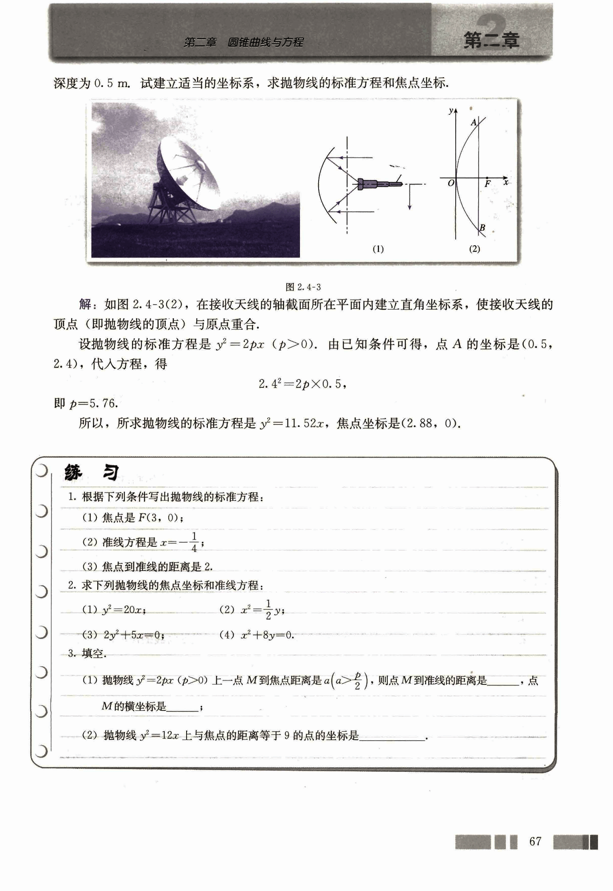
73

# CHAPTER 2

## 2.4.2 抛物线的简单几何性质

**思考?**

类比椭圆、双曲线的几何性质，你认为可以讨论抛物线的哪些几何性质？

抛物线有许多重要性质，我们根据抛物线的标准方程

$y^2 = 2px$ ($p>0$)

研究它的一些简单几何性质.

1. **范围**

因为$p>0$，由方程 ① 可知，对于抛物线 ① 上的点 M($x, y$), $x≥0$，所以这条抛物线在$y$轴的右侧，开口方向与$x$轴正向相同；当$x$的值增大时，$|y|$也增大，这说明抛物线向右上方和右下方无限延伸。

2. **对称性**

以$-y$代$y$，方程 ① 不变，所以这条抛物线关于$x$轴对称。我们把抛物线的对称轴叫做抛物线的轴。

3. **顶点**

抛物线和它的轴的交点叫做抛物线的顶点。在方程 ① 中，当$y=0$时，$x=0$，因此抛物线 ① 的顶点就是坐标原点。

4. **离心率**

抛物线上的点 M 到焦点的距离和它到准线的距离的比，叫做抛物线的离心率，用$e$表示，由定义可知，$e=1$。

**例 3** 已知抛物线关于$x$轴对称，它的顶点在坐标原点，并且经过点 M(2, $-2\sqrt{2}$), 求它的标准方程.

**解:** 因为抛物线关于$x$轴对称，它的顶点在原点，并且经过点 M(2, $-2\sqrt{2}$), 所以，可设它的标准方程为

$y^2 = 2px$ ($p>0$).

因为点 M 在抛物线上，所以

68

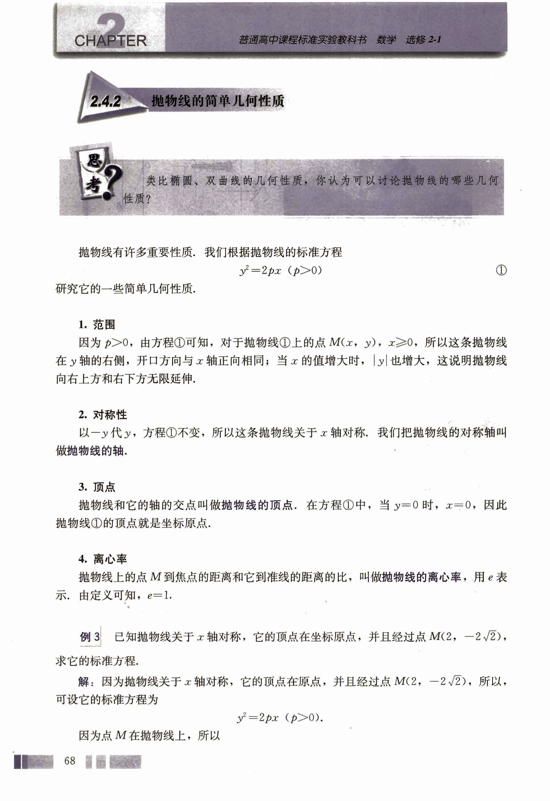
74

# 第二章 圆锥曲线与方程

(-2√2)²=2p・2,

p=2.

因此，所求抛物线的标准方程是

y²=4x.

## 思考

顶点在坐标原点，对称轴是坐标轴，并且经过点 M(2，-2√2)的抛物线有几条？求出它们的标准方程。

## 例 4

斜率为 1 的直线 l 经过抛物线 y²=4x 的焦点 F，且与抛物线相交于 A，B 两点，求线段 AB 的长。

分析：由抛物线的方程可以得到它的焦点坐标，又直线 l 的斜率为 1，所以可以求出直线的方程；与抛物线的方程联立，可以求出 A，B 两点的坐标；利用两点间的距离公式可以求出|AB|。这种方法虽然思路简单，但是需要复杂的代数运算。

下面，我们介绍另外一种方法——数形结合的方法。

在图 2.4-4 中，设 A(x₁,y₁)，B(x₂,y₂)。由抛物线的定义可知，|AF|等于点 A 到准线的距离|AA'|。设|AA'|=dA，而 dA=x₁+1，于是|AF|=dA=x₁+1。同理，|BF|=|BB'|=dB=x₂+1，于是得

|AB|=|AF|+|BF|=x₁+x₂+2.

由此可见，只要求出点 A，B 的横坐标之和 x₁+x₂，就可以求出|AB|。

解：由题意可知，p=2，$\frac{p}{2}$=1，焦点 F(1,0)，准线 l: x=-1. 如图 2.4-4，设 A(x₁,y₁), B(x₂,y₂), A, B 到准线的距离分别为 dA, dB. 由抛物线的定义可知

|AF|=dA=x₁+1, |BF|=dB=x₂+1,

|AB|=|AF|+|BF|=x₁+x₂+2.

由已知得抛物线的焦点为 F(1,0)，所以直线 AB 的方程为

y=x-1.

将 ① 代入方程 y²=4x，得

(x-1)²=4x,

[图 2.4-4](images/2.4-4.png)

69

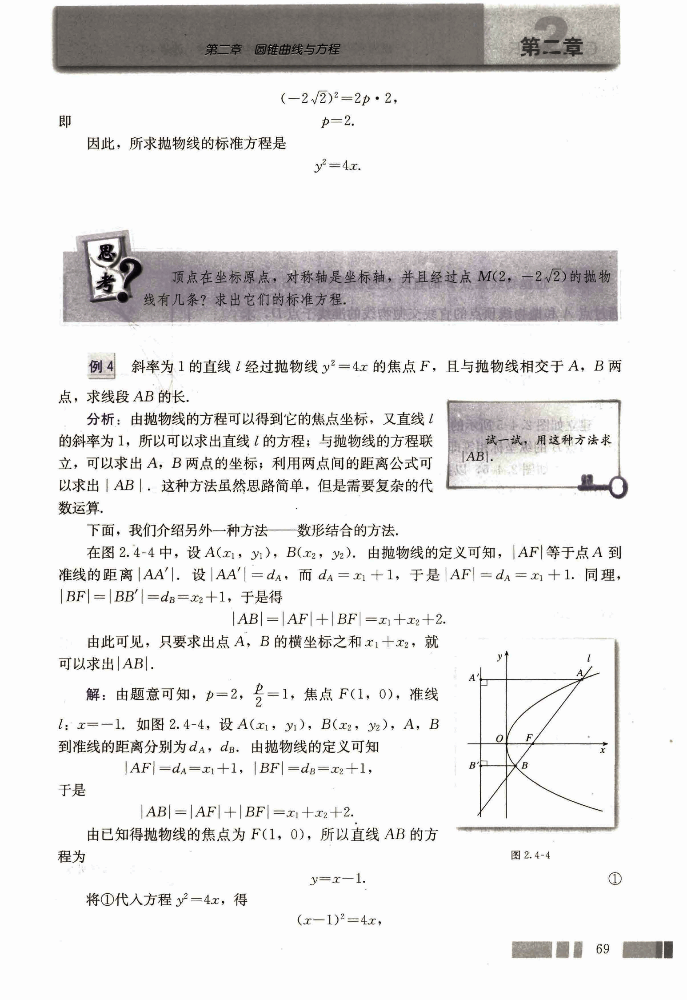
75

# CHAPTER 2

普通高中课程标准实验教科书 数学 选修 2-1

## 化简得

$x^2 - 6x + 1 = 0.$

## 由求根公式得

$x_1 = 3 + 2\sqrt{2}$, $x_2 = 3 - 2\sqrt{2}$,

## 于是

$|AB| = x_1 + x_2 + 2 = 8.$

## 所以，线段 AB 的长是 8.

## 例 5

过抛物线焦点 F 的直线交抛物线于 A，B 两点，通过点 A 和抛物线顶点的直线交抛物线的准线于点 D，求证：直线 DB 平行于抛物线的对称轴.

**分析：** 我们用坐标法证明，即通过建立抛物线及直线的方程，借助方程研究直线 DB 与抛物线对称轴之间的位置关系.

建立如图 2.4-5 所示的直角坐标系，只要证明点 D 的纵坐标与点 B 的纵坐标相等即可。

**证明：** 如图 2.4-5，以抛物线的对称轴为 x 轴，它的顶点为原点，建立直角坐标系. 设抛物线的方程为

$y^2 = 2px$,

点 A 的坐标为$(\frac{y_0}{2p}, y_0)$，则直线 OA 的方程为

$y = \frac{2p}{y_0}x$ ($y_0 \ne 0$),

抛物线的准线方程是

$x = -\frac{p}{2}$.

联立 ②③，可得点 D 的纵坐标为

$y = -\frac{p^2}{y_0}$.

因为点 F 的坐标是$(\frac{p}{2}, 0)$，所以直线 AF 的方程为

$y = \frac{2p y_0}{y_0^2 - p^2}(x - \frac{p}{2})$,

其中 $y_0^2 \ne p^2$.

联立 ①⑤，可得点 B 的纵坐标为

$y = -\frac{p^2}{y_0}$.

由 ④⑥ 可知，DB//$x$轴.

当$y_0^2 = p^2$时，结论显然成立.

[图 2.4-5](images/2.4-5.png)

⑥ 你还有其他证明方法吗？

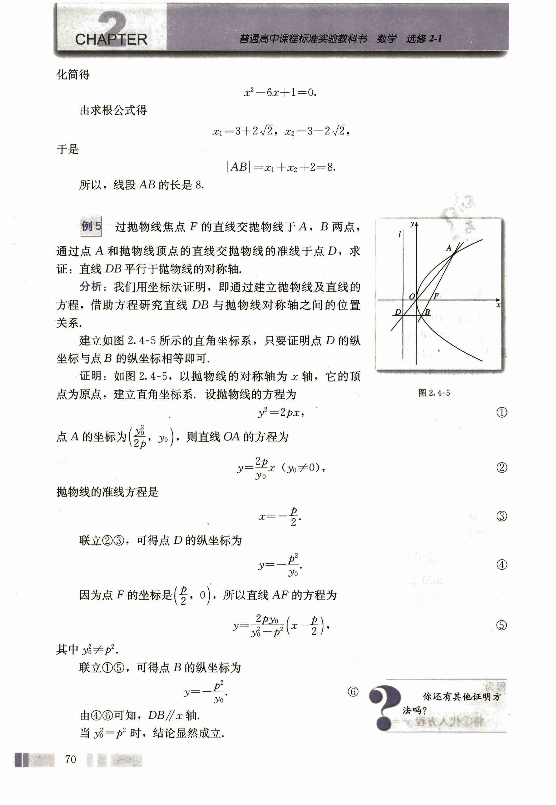
76

# 第二章 圆锥曲线与方程

所以，直线 DB 平行于抛物线的对称轴。

## 例 6

已知抛物线的方程为$y^2=4x$，直线$l$过定点 P(-2, 1)，斜率为$k$。$k$为何值时，直线$l$与抛物线$y^2=4x$：

只有一个公共点；有两个公共点；没有公共点？

**分析：**用解析法解决这个问题，只要讨论直线的方程与抛物线的方程组成的方程组的解的情况，由方程组解的情况判断直线与抛物线的位置关系。

**解：**由题意，设直线的方程为
$y-1=k(x+2)$。

由方程组
$\begin{cases}
y-1=k(x+2), \\
y^2=4x
\end{cases}$

可得
$ky^2-4y+4(2k+1)=0$。

(1) 当$k=0$时，由方程 ① 得
$y=1$。

把$y=1$代入$y^2=4x$，得
$x=\frac{1}{4}$。

这时，直线$l$与抛物线只有一个公共点$(\frac{1}{4}, 1)$。

(2) 当$k≠0$时，方程 ① 的判别式为
$\Delta=-16(2k^2+k-1)$。

1° 由$\Delta=0$，即
$2k^2+k-1=0$，

解得
$k=-1$，或$k=\frac{1}{2}$。

于是，当$k=-1$，或$k=\frac{1}{2}$时，方程 ① 只有一个解，从而方程组(\*)只有一个解，这时，直线与抛物线只有一个公共点。

2° 由$\Delta>0$，即
$2k^2+k-1<0$，

解得
$-1<k<\frac{1}{2}$。

于是，当$-1<k<\frac{1}{2}$，且$k≠0$时，方程 ① 有两个解，从而方程组(\*)有两个解，这时

[图](images/图2.4-6.png)

71

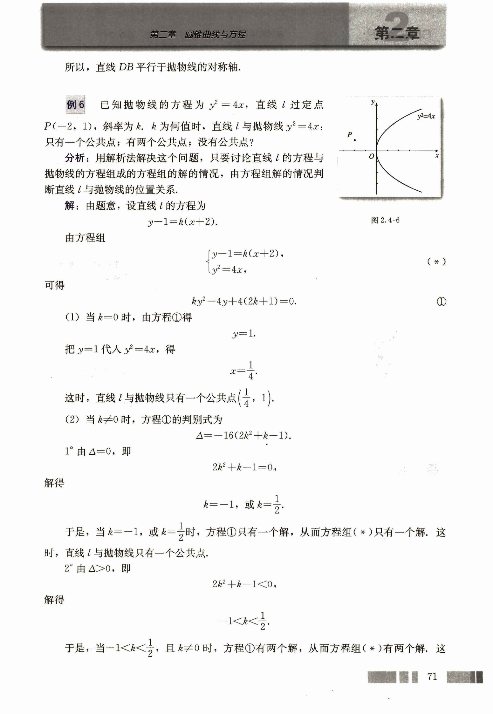
77

# CHAPTER 2

时，直线与抛物线有两个公共点。

3° 由 △<0，即

$2k^2 + k - 1 > 0$

解得

$k < -1$, 或 $k > \frac{1}{2}$

于是，当 $k < -1$，或 $k > \frac{1}{2}$ 时，方程 ① 没有实数解，从而方程组(*)没有解，这时，直线 *l\* 与抛物线没有公共点。

综上，我们可以得

当 $k = -1$，或 $k = \frac{1}{2}$，或 $k = 0$ 时，直线 _l_ 与抛物线只有一个公共点；

当 $-1 < k < \frac{1}{2}$，且 $k \ne 0$ 时，直线 _l_ 与抛物线有两个公共点；

当 $k < -1$，或 $k > \frac{1}{2}$ 时，直线 _l_ 与抛物线没有公共点。

你能通过作图验证一下结论吗？

## 探究

### 练习

1. 请你画出图形表示上述几种位置关系，从图中你发现直线与抛物线只有一个公共点时是什么情况？
2. 方程组解的个数与公共点的个数是什么关系？

3. 求适合下列条件的抛物线的标准方程：
   (1) 顶点在原点，关于 _x_ 轴对称，并且经过点 M(5, -4);
   (2) 顶点在原点，焦点是 F(0, 5);
   (3) 顶点在原点，准线是 $x = 4$;
   (4) 焦点是 F(0, -8), 准线是 $y = 8$。

4. 在同一坐标系中画出下列抛物线，观察它们开口的大小，并说明抛物线开口大小与方程中的 _x_ 的系数有怎样的关系：
   (1) $y^2 = \frac{1}{2}x$;
   (2) $y^2 = x$;
   (3) $y^2 = 2x$;
   (4) $y^2 = 4x$。

5. 过点 M(2, 0) 作斜率为 1 的直线 _l_，交抛物线 $y^2 = 4x$ 于 A, B 两点，求 |AB|。

6. 垂直于 _x_ 轴的直线交抛物线 $y^2 = 4x$ 于 A, B 两点，且 |AB| = $4\sqrt{3}$，求直线 AB 的方程。

72

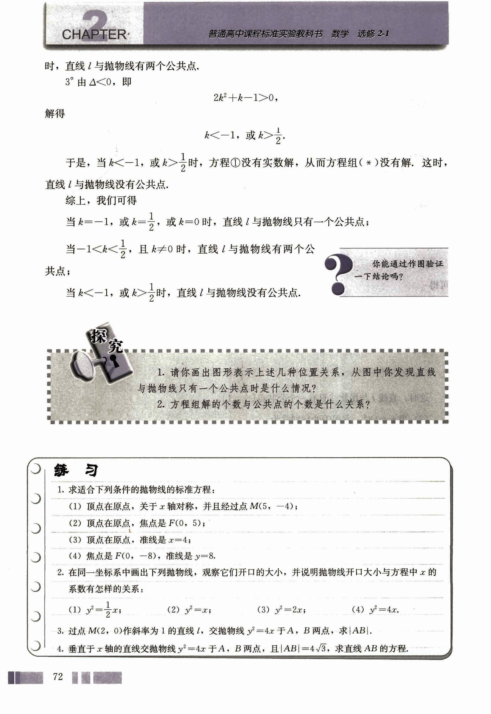
78

# 第二章 圆锥曲线与方程

## 习题 2.4

**A 组**

1. 求下列抛物线的焦点坐标和准线方程：
   (1) $x^2=2y$;
   (2) $4x^2+3y=0$;
   (3) $2y^2+x=0$;
   (4) $y^2-6x=0$.

2. 填空题.
   (1) 准线方程为 x=2 的抛物线的标准方程是 **\_\_**;
   (2) 抛物线 $y^2=8x$ 上到焦点的距离等于 6 的点的坐标是 **\_\_**.

3. 抛物线 $y^2=2px (p>0)$ 上一点 M 到焦点 F 的距离 $|MF|=2p$，求点 M 的坐标.

4. 根据下列条件，求抛物线的标准方程，并画出图形：
   (1) 顶点在原点，对称轴是 x 轴，并且顶点与焦点的距离等于 6；
   (2) 顶点在原点，对称轴是 y 轴，并经过点 P(-6, -3).

5. 如图，M 是抛物线 $y^2=4x$ 上一点，F 是抛物线的焦点，以 Fx 为始边，FM 为终边的角 $\angle xFM=60^\circ$，求$|FM|$.
   [图](images/图1.png)

6. 如图，直线 $y=x-2$ 与抛物线 $y^2=2x$ 相交于 A, B 两点，求证：$OA \perp OB$.
   [图](images/图2.png)

7. 如图，吊车梁的鱼腹部分 AOB 是一段抛物线，宽为 7 m，高为 0.7 m. 试建立适当的坐标系，求这条抛物线的方程.
   [图](images/图3.png)

8. [图](images/图4.png)

73

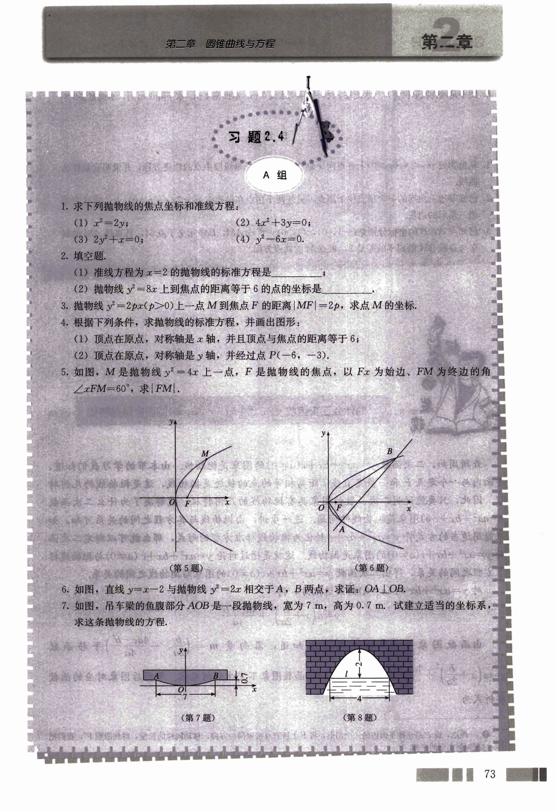
79

# CHAPTER 2

## 8. 图中是抛物线形拱桥，当水面在 _l_ 时，拱顶离水面 2 m，水面宽 4 m。水下降 1 m 后，水面宽多少？

**B 组**

1. 从抛物线 $y^2 = 2px (p > 0)$ 上各点向 x 轴作垂线段，求垂线段中点的轨迹方程，并说明它是什么曲线。

2. 已知等边三角形的一个顶点位于原点，另外两个顶点在抛物线 $y^2 = 2px (p > 0)$ 上，求这个等边三角形的边长。

3. 已知点 A，B 的坐标分别是 (-1, 0), (1, 0), 直线 AM, BM 相交于点 M，且直线 AM 的斜率与直线 BM 的斜率的差是 2，求点 M 的轨迹方程。

## 为什么二次函数 y = ax² + bx + c (a ≠ 0) 的图象是抛物线

众所周知，二次函数 y = ax² + bx + c (a ≠ 0) 的图象是抛物线。由本节的学习我们知道，平面内与一个定点 F 和一条定直线 _l_ 距离相等的点的轨迹是抛物线，这是抛物线的几何特征。因此，只要能说明二次函数的图象具有抛物线的几何特征，就解决了为什么二次函数 y = ax² + bx + c 的图象是抛物线的问题。进一步讲，由抛物线与其方程之间的关系可知，如果能用适当的方式将 y = ax² + bx + c 转化为抛物线标准方程的形式，那么就可以断定二次函数 y = ax² + bx + c (a ≠ 0) 的图象是抛物线。这就是通过讨论 y = ax² + bx + c (a ≠ 0) 与抛物线标准方程之间的关系，得出二次函数 y = ax² + bx + c (a ≠ 0) 的图象与抛物线之间的关系。

对 y = ax² + bx + c (a ≠ 0) 的右边配方，得

$y = a(x + \frac{b}{2a})^2 + \frac{4ac - b^2}{4a}$

由函数图象平移的性质可以知道，沿向量 $m = (\frac{b}{2a}, \frac{4ac - b^2}{4a})$ 平移函数 $y = a(x + \frac{b}{2a})^2 + \frac{4ac - b^2}{4a}$ 的图象（图 1），函数图象不发生任何变化。平移后图象对应的函数解析式为

74

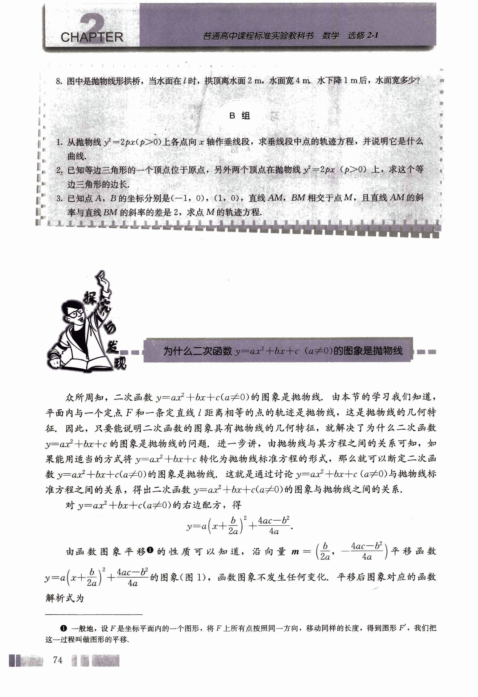
80

# 第二章 圆锥曲线与方程

## y=ax²

我们把它改写为

$x^2 = \frac{1}{a}y$

的形式(方程),这是顶点为坐标原点，焦点为(0,$\frac{1}{4a}$)的抛物线。

因此，二次函数 y=ax²+bx+c(a≠0)的图象是一条抛物线。

你还有其他方法说明二次函数 y=ax²+bx+c(a≠0)的图象是抛物线吗？

## 一、圆锥曲线的光学性质及其应用

椭圆、双曲线、抛物线这些圆锥曲线都有焦点、焦点，顾名思义，就是光线的聚集点，这说明圆锥曲线与光有紧密的联系，圆锥曲线具有丰富的光学性质。

我们知道，当一束光线照到镜面时，光线会依一定的规律反射，即入射角等于反射角（图 1）。当光照射到曲面时，特别是由圆锥曲线绕其对称轴旋转而成的曲面时，会有什么现象呢？

我们看生活中的一个实例：一只很小的灯泡发出的光，会分散地射向各方，但把它装在圆柱形手电筒里，经过适当调节，就能射出一束比较强的平行光线，这是为什么呢？

原来手电筒内，在小灯泡后面有一个反光镜，镜面的形状是一个由抛物线绕它的对称轴旋转所得到的曲面（图 2），这种曲面叫做抛物面，人们已经证明（可用导数方法证明），抛物线有一条重要性质：从焦点发出的光线，经过抛物线上的一点反射后，反射光线平行于抛物线的轴。探照灯（图 3）也是利用这个原理设计的。

[图 1](images/图1.png)
[图 2](images/图2.png)
[图 3](images/图3.png)

75

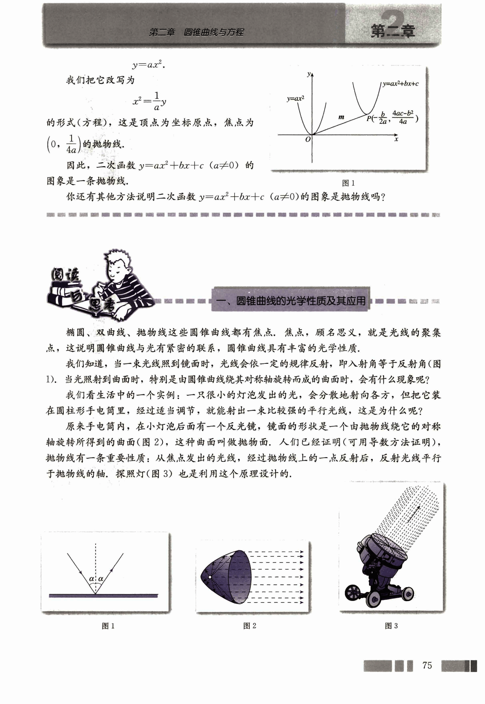
81

# CHAPTER 2

应用抛物线的这个性质，也可以使一束平行于抛物线的轴的光线，经过抛物面的反射集中于它的焦点。人们应用这个原理，设计了一种加热水和食物的太阳灶（图 4）。在这种太阳灶上装有一个旋转抛物面形的反光镜，当它的轴与太阳光线平行时，太阳光线经过反射后集中于焦点处，这一点的温度就会很高。

椭圆和双曲线的光学性质与抛物线不同。从椭圆的一个焦点发出的光线，经过椭圆反射后，反射光线交于椭圆的另一个焦点上（图 5）；从双曲线的一个焦点发出的光线，经过双曲线反射后，反射光线是散开的，它们就好像是从另一个焦点射出的一样（图 6）。椭圆、双曲线的的光学性质也被人们广泛地应用于各种设计中。

如图 7，电影放映机的聚光灯有一个反射镜，它的形状是旋转椭圆面。为了使片门（电影胶片通过的地方）处获得最强的光线，灯丝$F_2$与片门$F_1$应位于椭圆的两个焦点处，这就是利用椭圆光学性质的一个实例。

[图 4](images/图4.png)
[图 5](images/图5.png)
[图 6](images/图6.png)
[图 7](images/图7.png)

## 二、圆锥曲线的离心率与统一方程

利用信息技术作图：已知点 F 是平面上的一个定点，l 是平面上不过点 F 的一条定直线，点 M 到点 F 的距离和它到直线 l 的距离之比是一个常数 e。观察点 M 的轨迹，并判断轨迹的形状。

可以发现，点 M 的轨迹是圆锥曲线，并且

1. 当 0<e<1 时，轨迹是椭圆；
2. 当 e>1 时，轨迹是双曲线；
3. 当 e=1 时，轨迹是抛物线。

定点 F 是它的焦点，比值 e 是它的离心率，我们称定直线 l 是它的准线。

这样，我们可以对圆锥曲线下一个统一定义：

平面上到一个定点 F 的距离和它到一条定直线 l 的距离之比是一个常数 e 的点的轨迹是圆锥曲线，其中点 F 是它的焦点，直线 l 是它的准线，比值 e 是它的离心率。

如何求圆锥曲线的统一方程呢？

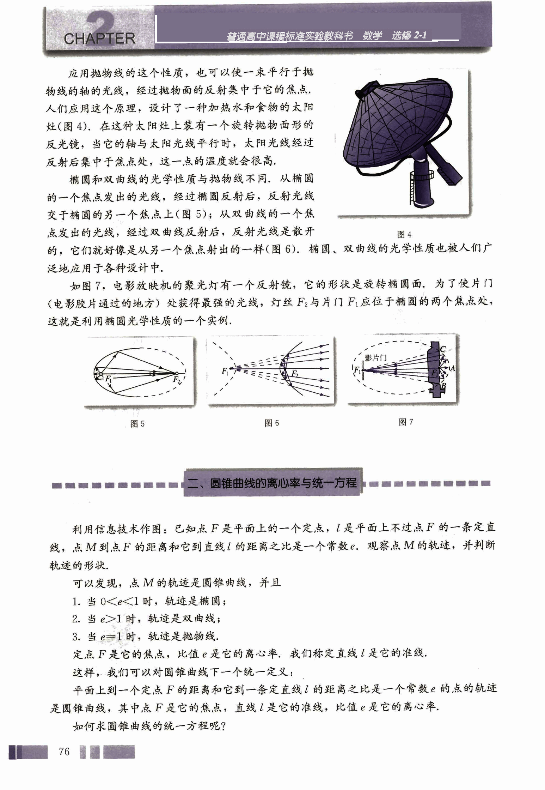
82

# 第二章 圆锥曲线与方程

如图 1，过点 M 作 MH⊥l，H 为垂足，由圆锥曲线的统一定义可知

M∈{M||FM|=e|MH|}

取过焦点 F，且与准线 l 垂直的直线为 x 轴，点 F(O)为坐标原点，建立直角坐标系。设点 M 的坐标为(x,y)，则

|OM|=$\sqrt{x^2+y^2}$.

设直线 l 的方程为 x=-p，则

|MH|=|x+p|.

把 ①② 代入|OM|=e|MH|，得

$\sqrt{x^2+y^2}$=e|x+p|.

两边平方，化简得

(1-e²)x²+y²-2pe²x-p²e²=0.

这就是圆锥曲线(椭圆、双曲线、抛物线)在直角坐标系中的统一方程。

[图 1](images/图1.png)

77

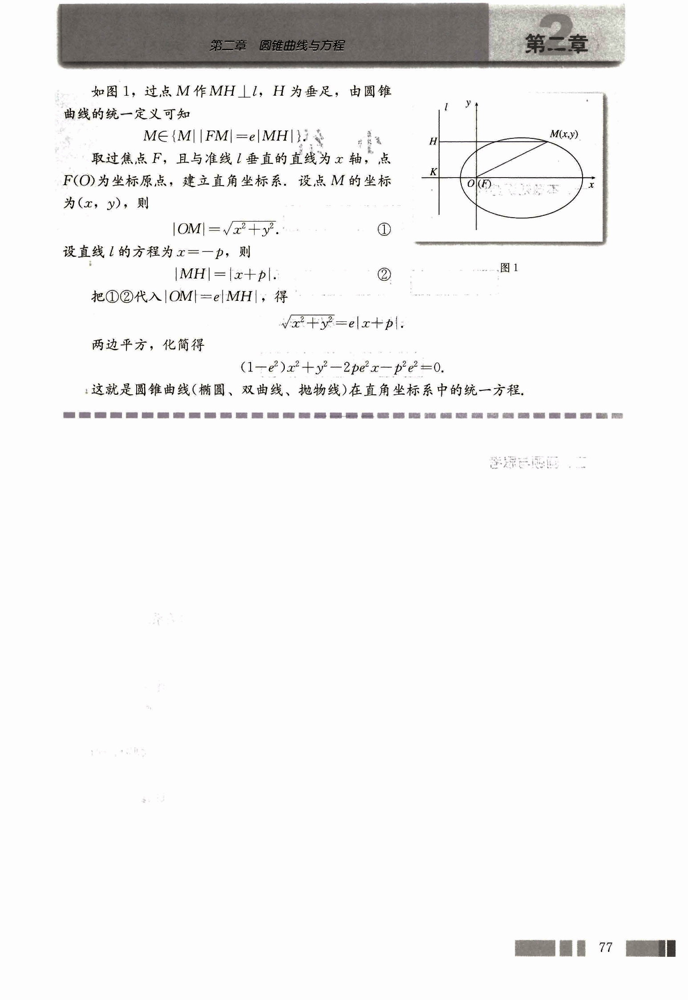
83

# 小结

## 一、本章知识结构

圆锥曲线的实际背景

[Diagram](images/diagram.png)

椭圆 双曲线 抛物线

曲线与方程 方程与曲线

标准方程 简单几何性质

简单应用

## 二、回顾与思考

1. 我们把曲线看作满足某种条件 _p_ 的点 _M_ 的集合

_P_ = { _M_ | _p_(_M_) }.

建立坐标系后，集合 _P_ 中任一元素 _M_ 都有唯一有序实数对 (_x_, _y_) 和它对应，满足条件 _p_ 的 (_x_, _y_) 构成二元方程 _f_(_x_, _y_) = 0. 也就是说，它是集合

_Q_ = { (_x_, _y_) | _f_(_x_, _y_) = 0 }

中的一个元素。反过来，对于集合 _Q_ 中任一元素 (_x_, _y_)，都有一点 _M_ 与它对应，且点 _M_ 是集合 _P_ 中的一个元素。_P_ 和 _Q_ 的这种对应关系就是曲线与方程的关系。

2. 用平面截圆锥，改变平面与圆锥轴线的夹角，可以得到的截口曲线分别是圆、椭圆、抛物线、双曲线，我们把它们统称为圆锥曲线。事实上，圆锥曲线既与天文学、物理学等研究紧密相联，又与我们的日常生活紧密相关，请你查阅资料，了解一下这方面 的有关知识。

3. 历史上，人们用纯几何的方法，得到了关于圆锥曲线的大量性质，这些性质在天文学研究中得到了应用。笛卡儿创立解析几何后，人们借助坐标系把数与形联系起来。根据圆锥曲线的几何特征，选择适当的坐标系，建立圆锥曲线的方程，通过研究方程得到圆锥曲线的几何性质，这就是用坐标法研究圆锥曲线。

你能说说用坐标法研究圆锥曲线的具体过程吗？

78

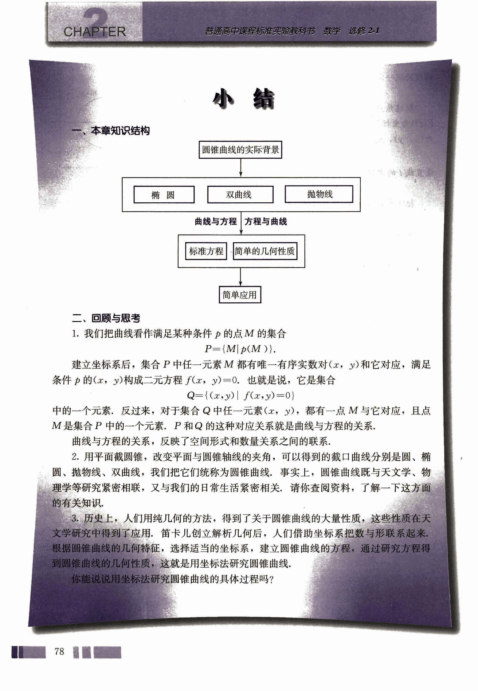
84

# 第二章 圆锥曲线与方程

## 4. 完成下列表格：

|          | 椭圆 | 双曲线 | 抛物线 |
| :------- | :--- | :----- | :----- |
| 定义     |      |        |        |
| 图形     |      |        |        |
| 标准方程 |      |        |        |
| 顶点坐标 |      |        |        |
| 对称轴   |      |        |        |
| 焦点坐标 |      |        |        |
| 离心率   |      |        |        |

5. 研究椭圆、双曲线、抛物线三种圆锥曲线的方法是一致的。例如，在研究完椭圆的几何特征、定义、标准方程、简单性质等以后，通过类比，就能得到双曲线、抛物线所要研究的问题以及研究的基本方法。

6. 圆锥曲线具有统一性：

(1) 它们都是平面截圆锥得到的截口曲线；

(2) 它们都是平面内到一个定点的距离和到一条定直线（不经过定点）距离的比值是一个常数的点的轨迹，比值的取值范围不同形成了不同的曲线；

(3) 它们的方程都是关于 _x_, _y_ 的二次方程。

7. 直线与圆锥曲线有无公共点，等价于由它们的方程组成的方程组有无实数解。方程组有几组实数解，直线 _l_ 与圆锥曲线就有几个公共点；方程组没有实数解，直线 _l_ 与曲线 _C_ 就没有公共点。

8. 在圆锥曲线的研究中，信息技术可以发挥很好的作用。例如，借助信息技术，可以方便地画出曲线；通过改变某些量（如椭圆的长轴的长、短轴的长或焦距等），可以帮助我们发现曲线的几何特征及其基本性质（变化中保持不变的特征）等等。总之，研究圆锥曲线时，信息技术在发现问题、形成思想方法、获得结论等方面，都能发挥作用。

79

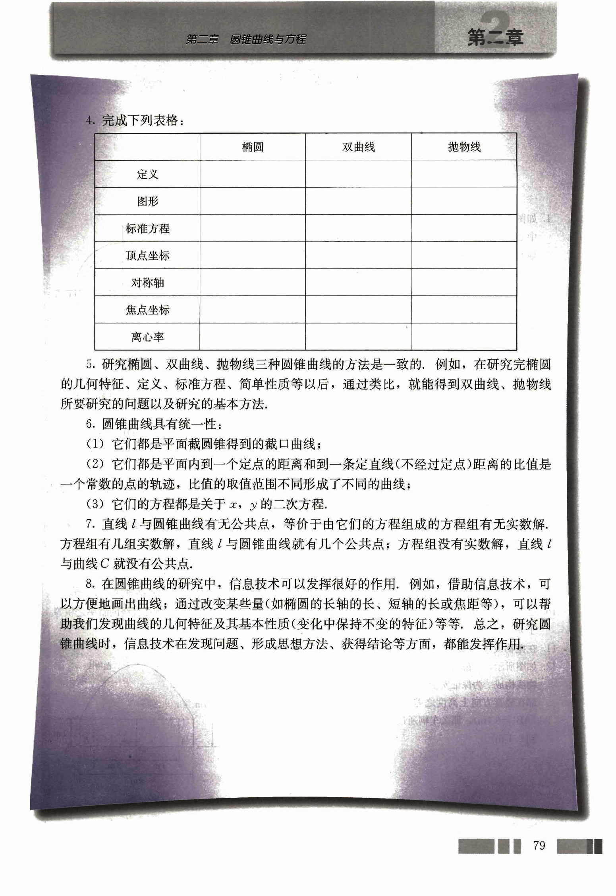
85

# 复习参考题

## A 组

1. 如图，我国发射的第一颗人造地球卫星的运行轨道，是以地心（地球的中心）$F_2$为一个焦点的椭圆。已知它的近地点（离地面最近的点）A 距地面 439 km，远地点（离地面最远的点）B 距地面 2 384 km，并且$F_2$，A，B 在同一直线上，地球半径约为 6 371 km。求卫星运行的轨道方程（精确到 1 km）。

2. 人造地球卫星的运行轨道是以地心为一个焦点的椭圆。设地球半径为 R，卫星近地点、远地点离地面的距离分别为$r_1$，$r_2$，求卫星轨道的离心率。

3. 选择题：
   (1) 曲线$\frac{x^2}{25}+\frac{y^2}{9}=1$与曲线$\frac{x^2}{25-k}+\frac{y^2}{9-k}=1$($k<9$)的( )
   (A) 长轴长相等 (B) 短轴长相等 (C) 离心率相等 (D) 焦距相等
   (2) 与圆$x^2+y^2=1$及圆$x^2+y^2-8x+12=0$都外切的圆的圆心在( )
   (A) 一个椭圆上 (B) 双曲线的一支上 (C) 一条抛物线上 (D) 一个圆上

4. 当$\alpha$从 0° 到 180° 变化时，方程$x^2+y^2 \cos \alpha=1$表示的曲线的形状怎样变化？

5. 已知直线$y=kx-1$与双曲线$x^2-y^2=4$没有公共点，求 k 的取值范围。

6. 设抛物线的顶点为 O，经过焦点且垂直于对称轴的直线交抛物线于 B，C 两点，经过抛物线上一点 P 且垂直于轴的直线与轴交于点 Q。求证：$|PQ|$是$|BC|$和$|OQ|$的比例中项。

7. 已知等边三角形的一个顶点位于抛物线$y^2=2px$($p>0$)的焦点，另外两个顶点在抛物线上，求这个等边三角形的边长。

8. 斜率为 2 的直线$l$与双曲线$\frac{x^2}{3}-\frac{y^2}{2}=1$交于 A，B 两点，且$|AB|=4$，求直线$l$的方程。

9. 经过点 M(2, 1)作直线$l$交双曲线$\frac{x^2}{3}-\frac{y^2}{2}=1$于 A，B 两点，且 M 为 AB 的中点，求直线$l$的方程。

10. 已知$\triangle ABC$的两个顶点 A，B 的坐标分别是(-5, 0), (5, 0), 且 AC, BC 所在直线的斜率之积等于 m($m\neq0$)，试探求顶点 C 的轨迹。

11. 在抛物线$y^2=4x$上求一点 P，使得点 P 到直线$y=x+3$的距离最短。

12. 如图所示，一隧道内设双行线公路，其截面由一个长方形和抛物线构成，为保证安全，要求行驶车辆顶部（设为平顶）与隧道顶部在竖直方向上高度之差至少要有 0.5 m。已知行车道总宽度$|AB|=6$(m)，那么车辆通过隧道的限制高度是多少米？（精确到 0.1 m）

[图](images/图.png)

(第 12 题)

80

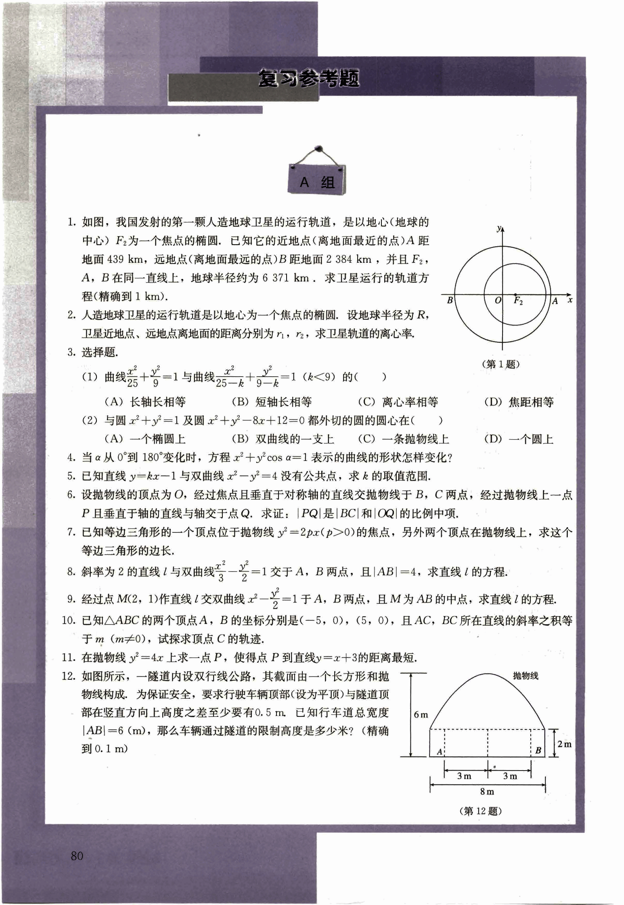
86

# B 组

1. 已知点 P 是椭圆 16x²+25y²=1600 上一点，且在 x 轴上方，F₁, F₂ 分别
   是椭圆的左、右焦点，直线 PF₂ 的斜率为-4√3，求 △PF₁F₂ 的面积。

2. 如图，从椭圆$\frac{x^2}{a^2} + \frac{y^2}{b^2} = 1(a>b>0)$上一点 P 向 x 轴作垂线，垂足恰为左
   焦点 F₁. 又点 A 是椭圆与 x 轴正半轴的交点，点 B 是椭圆与 y 轴正半
   轴的交点，且 AB//OP，|F₁A|=√10+√5，求椭圆的方程。

3. 如图，已知直线与抛物线 y²=2px(p>0)交于 A，B 两点，且 OA⊥
   OB，OD⊥AB 交 AB 于点 D，点 D 的坐标为(2,1)，求 p 的值。

4. 综合应用抛物线和双曲线的光学性质，可以设计制造反射式天文望远
   镜。这种望远镜的特点是，镜筒可以很短而观察天体运动又很清楚，例
   如，某天文仪器厂设计制造的一种镜筒直径为 0.6 m、长为 2 m 的反射
   式望远镜，其光学系统的原理如图（中心截口示意图）所示，其中，一个
   反射镜 POQ 弧所在的曲线为抛物线，另一个反射镜 MON 弧所在的曲
   线为双曲线的一个分支。已知 F₁、F₂ 是双曲线的两个焦点，其中 F₂ 同
   时又是抛物线的焦点，试根据图示尺寸（单位：mm），分别求抛物线和
   双曲线的方程。
   [图](images/图4.png)

5. 已知点 A，B 的坐标分别是(-1, 0), (1, 0)。直线 AM, BM 相交于点 M，且它们的斜率之和是 2，
   求点 M 的轨迹方程。

6. 就 m 的不同取值，指出方程(m-1)x²+(3-m)y²=(m-1)(3-m)所表示的曲线的形状，并利用信
   息技术直观验证你的结论。

7. 过抛物线 y²=2px(p>0)的焦点 F 作直线与抛物线交于 A，B 两点，以 AB 为直径画圆，借助信息技
   术工具，观察它与抛物线准线 l 的关系，你能得到什么结论？相应于椭圆、双曲线如何？你能证明你
   的结论吗？

81

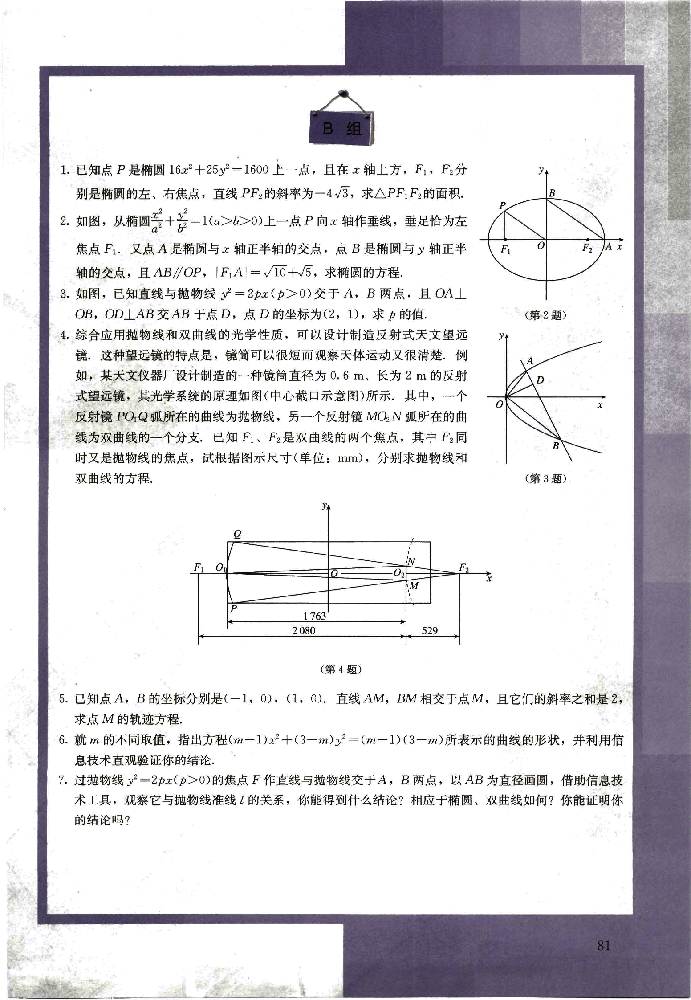
87

# 3

设计宏伟的建筑、飞架的桥梁、曲折的轨道、高大的工程机械……都会遇到许多立体几何问题，这些问题与空间向量有着密切的关系。

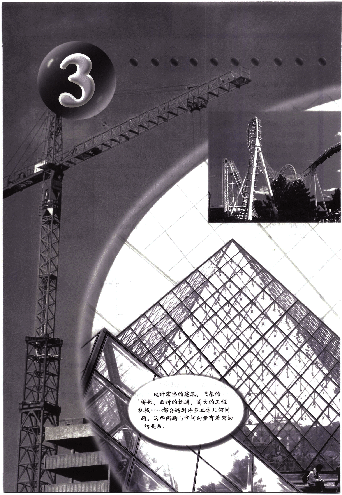
88

# 第三章 空间向量与立体几何

## 3.1 空间向量及其运算

## 3.2 立体几何中的向量方法

向量是一种重要的数学工具，它不仅在解决几何问题中有着广泛的应用，而且在物理学、工程科学等方面也有着广泛的应用。向量是近代数学的基本概念之一，它的初步知识及其应用，早已列入近代数学的基础部分。

通过学习平面向量，我们知道，平面上的点、直线可以通过向量及其运算表示出来，它们之间的关系，如平行、垂直、夹角、距离等可以通过向量运算而得到，从而有关平面图形的问题可以利用平面向量解决。在本章，我们把平面向量推广到空间向量，学习空间向量的概念、运算、坐标表示，并利用空间向量的运算解决有关立体几何问题。

空间向量与平面向量没有本质区别，都是表示具有大小和方向的量，它们的运算：加法、减法、数乘、数量积也完全相同。因此，利用空间向量解决立体几何问题，也是先利用空间向量表示空间点、直线、平面等元素，建立立体几何与空间向量的联系；进行空间向量的运算；作出运算结果的几何解释，进而得出几何结论。在学习过程中，我们要注意空间向量与平面向量的类比，体会空间向量在解决立体几何问题中的作用。

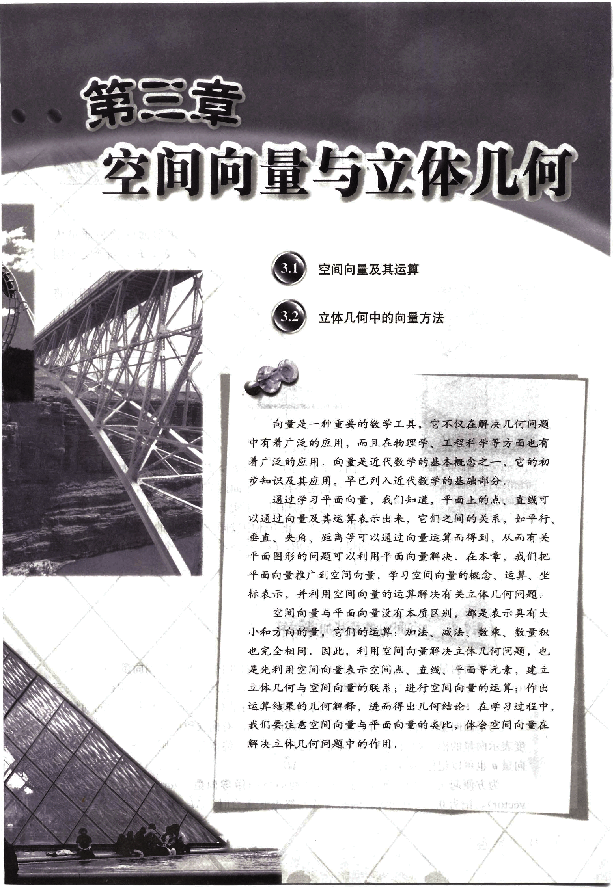
89

# CHAPTER 3

## 3.1 空间向量及其运算

如图 3.1-1，一块均匀的正三角形面的钢板质量为 500 kg，在它的顶点处分别受力 $F_1$，$F_2$，$F_3$，每个力与同它相邻的三角形的两边之间的夹角都是 60°，且 $|F_1| = |F_2| = |F_3| = 200 kg$。这块钢板在这些力的作用下将会怎样运动？这三个力至少为多大时，才能提起这块钢板？

[image1](images/image1.png)

图 3.1-1 中的三个力 $F_1$，$F_2$，$F_3$ 是既有大小又有方向的量，它们是不在同一平面内的向量。因此，解决这个问题需要空间向量的知识。事实上，不同在一个平面内的向量随处可见。例如，正方体中过同一个顶点的三条棱所表示的三个向量 $\vec{OA}$，$\vec{OB}$，$\vec{OC}$ 就是不同在一个平面内的向量（图 3.1-2）。

[image2](images/image2.png)

图 3.1-2

## 3.1.1 空间向量及其加减运算

与平面向量一样，在空间，我们把具有大小和方向的量叫做空间向量 (space vector)，向量的 大小叫做向量的长度或模 (modulus)。上述问题中三角形钢板所受的三个力 $F_1$，$F_2$，$F_3$，正方体的三条棱所表示的三个向量 $\vec{OA}$，$\vec{OB}$，$\vec{OC}$ 都是空间向量。

与平面向量一样，空间向量也用有向线段表示。有向线段的长度表示向量的模。如图 3.1-3，向量 $\vec{a}$ 的起点是 A，终点是 B，则向量 $\vec{a}$ 也 可以记作 $\vec{AB}$，其模记为 $|a|$ 或 $|\vec{AB}|$。

为方便起见，我们规定，长度为 0 的向量叫做零向量 (zero vector)，记为 $\vec{0}$。当有向线段的起点 A 与终点 B 重合时，$\vec{AB} = \vec{0}$。

[image3](images/image3.png)

图 3.1-3

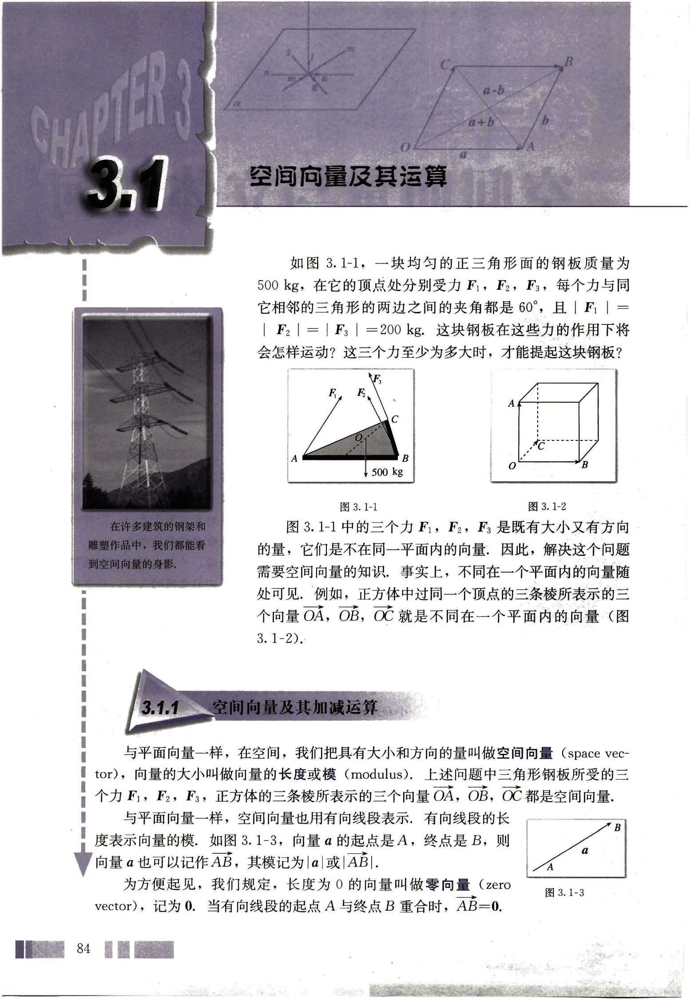
90

# 第三章 空间向量与立体几何

模为 1 的向量称为单位向量 (unit vector)。与向量 $\bold{a}$ 长度相等而方向相反的向量，称为 $\bold{a}$ 的相反向量，记为 $- \bold{a}$。

方向相同且模相等的向量称为相等向量 (equal vector)。

因此，在空间，同向且等长的有向线段表示同一向量或相等向量。空间任意两个向量都可以平移到同一个平面内，成为同一平面内的两个向量。如图 3.1-4，已知空间向量 $\bold{a}$，$\bold{b}$，我们可以把它们移到同一个平面内，以任意点 O 为起点，作向量 $\overrightarrow{OA} = \bold{a}$，$\overrightarrow{OB} = \bold{b}$。

在数学中引进一种量后，一个很自然的问题就是要研究它们的运算，类似于平面向量，我们可以定义空间向量的加法和减法运算（图 3.1-5）：

$\overrightarrow{OB} = \overrightarrow{OA} + \overrightarrow{AB} = \bold{a} + \bold{b}$，

$\overrightarrow{CA} = \overrightarrow{OA} - \overrightarrow{OC} = \bold{a} - \bold{b}$。

空间向量的加法运算满足交换律及结合律：

$\bold{a} + \bold{b} = \bold{b} + \bold{a}$，

$(\bold{a} + \bold{b}) + \bold{c} = \bold{a} + (\bold{b} + \bold{c})$。

?你能证明空间向量的交换律及结合律吗？证明结合律时，与证明平面向量的结合律有什么不同？

如图 3.1-6，在平行六面体（底面是平行四边形的四棱柱）ABCD-A'B'C'D' 中，分别标出 $\overrightarrow{AB} + \overrightarrow{AD} + \overrightarrow{AA'}$，$\overrightarrow{AB} + \overrightarrow{AA'} + \overrightarrow{AD}$ 表示的向量，从中你能体会向量加法运算的交换律及结合律吗？一般地，三个不共面的向量的和与这三个向量有什么关系？

85

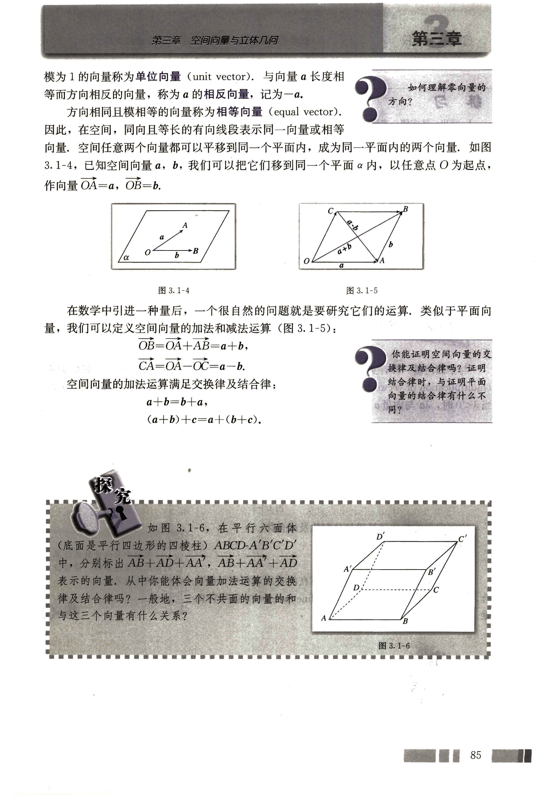
91

# CHAPTER 3

## 练习

1. 举出一些实例，表示三个不同在一个平面内的向量。

2. 如图，向量 $\vec{a}$，$\vec{b}$，$\vec{c}$ 互相平行，标出 $\vec{a}$ + $\vec{b}$ + $\vec{c}$。

[image](images/figure2.png)

3. 在图 3.1-6 中，用 $\vec{AB}$，$\vec{AD}$，$\vec{AA}$ 表示 $\vec{A'C}$，$\vec{BD}$ 及 $\vec{DB}$。

## 3.1.2 空间向量的数乘运算

与平面向量一样，实数 $\lambda$ 与空间向量 $\vec{a}$ 的乘积 $\lambda \vec{a}$ 仍然是一个向量，称为向量的数乘 (multiplication of vector by scalar) 运算。如图 3.1-7，当 $\lambda$ > 0 时，$\lambda \vec{a}$ 与向量 $\vec{a}$ 方向相同；当 $\lambda$ < 0 时，$\lambda \vec{a}$ 与向量 $\vec{a}$ 方向相反；$\lambda \vec{a}$ 的长度是 $\vec{a}$ 的长度的 $|\lambda|$ 倍。

[image](images/figure3.1-7.png)

空间向量的数乘运算满足分配律及结合律：

分配律：$\lambda(\vec{a} + \vec{b}) = \lambda\vec{a} + \lambda\vec{b}$，

结合律：$\lambda(\mu\vec{a}) = (\lambda\mu)\vec{a}$。

如果表示空间向量的有向线段所在的直线互相平行或重合，则这些向量叫做共线向量 (colliner vectors) 或平行向量 (parallel vectors)。

类似平面向量数乘运算的分配律及结合律，请你证明这两个运算律。

对空间任意两个向量 $\vec{a}$ 与 $\vec{b}$，如果 $\vec{a} = \lambda\vec{b}$，$\vec{a}$ 与 $\vec{b}$ 有什么位置关系？反过来，$\vec{a}$ 与 $\vec{b}$ 有什么位置关系时，$\vec{a} = \lambda\vec{b}$？

86

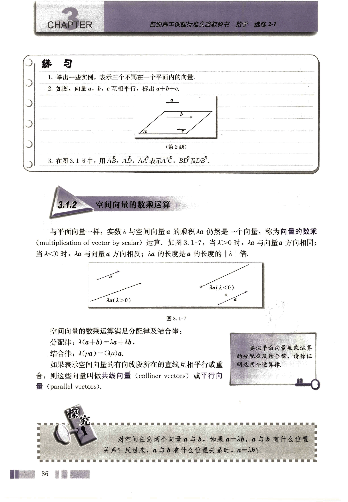
92

# 第三章 空间向量与立体几何

## 类似于平面向量共线的充要条件

类似于平面向量共线的充要条件，对空间任意两个向量 $\bm{a}$，$\bm{b}$ (b≠0)，$\bm{a}$//$\bm{b}$ 的充要条件是存在实数 λ，使

$\bm{a}$ = λ$\bm{b}$.

如图 3.1-8，l 为经过已知点 A 且平行于已知非零向量 $\bm{a}$ 的直线，对空间任意一点 O，点 P 在直线 l 上的充要条件是存在实数 t，使

$\overrightarrow{OP} = \overrightarrow{OA} + t\bm{a}$,

其中向量 $\bm{a}$ 叫做直线的方向向量 (direction vector).

在上取 AB = $\bm{a}$，则 ① 式可化为

$\overrightarrow{OP} = \overrightarrow{OA} + \overrightarrow{AB}$.

由此可见，可以利用向量之间的关系判断空间任意三点共线，这与利用平面向量判断平面内三点共线是一样的。

平行于同一个平面的向量，叫做共面向量 (coplanar vectors)。我们知道，空间任意两个向量总是共面的，但空间任意三个向量既可能是共面的，也可能是不共面的（如本节引例中的向量）。那么，什么情况下三个向量共面呢？

## 探究

对空间任意两个不共线的向量 $\bm{a}$，$\bm{b}$，如果 $\bm{p}$ = x$\bm{a}$ + y$\bm{b}$，那么向量 $\bm{p}$ 与向量 $\bm{a}$，$\bm{b}$ 有什么位置关系？反过来，向量 $\bm{p}$ 与向量 $\bm{a}$，$\bm{b}$ 有什么位置关系时，$\bm{p}$ = x$\bm{a}$ + y$\bm{b}$？

如果两个向量 $\bm{a}$，$\bm{b}$ 不共线，那么向量 $\bm{p}$ 与向量 $\bm{a}$，$\bm{b}$ 共面的充要条件是存在唯一的有序实数对 (x, y)，使 $\bm{p}$ = x$\bm{a}$ + y$\bm{b}$。

如图 3.1-9，空间一点 P 位于平面 ABC 内的充要条件是存在有序实数对 (x, y)，使

$\overrightarrow{AP}$ = x$\overrightarrow{AB}$ + y$\overrightarrow{AC}$;

或对空间任意一点 O，有

$\overrightarrow{OP}$ = $\overrightarrow{OA}$ + x$\overrightarrow{AB}$ + y$\overrightarrow{AC}$.

③ 式称为空间平面 ABC 的向量表示式。由此可知，空间中任意平面由空间一点及两个不共线向量唯一确定。利用空间向量共面的条件，你能证明这个结论吗？

87

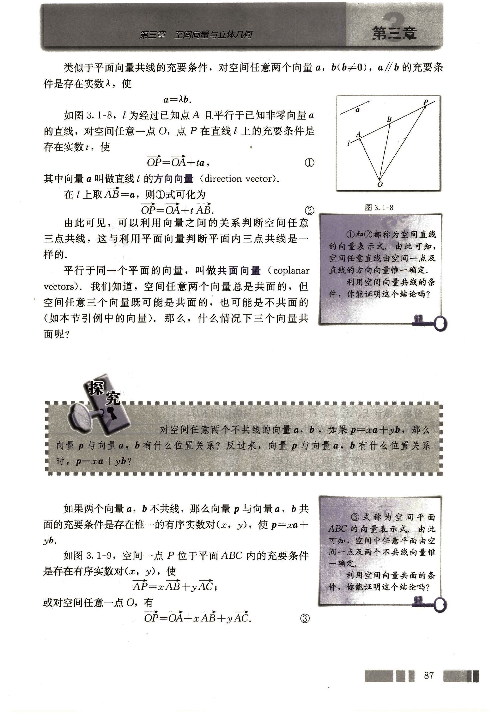
93

# CHAPTER 3

## 思考

### 1. 类似于利用向量判断三点共线，如何利用向量判断四点共面？

### 2. 已知空间任意一点 O 和不共线的三点 A，B，C，满足向量关系式

$\vec{OP} = x\vec{OA} + y\vec{OB} + z\vec{OC}$ (其中$x + y + z = 1$)
的点 P 与点 A，B，C 是否共面？

## 例 1

如图 3.1-10，已知平行四边形 ABCD，过平面 AC 外一点 O 作射线 OA，OB，OC，OD，在四条射线上分别取点 E，F，G，H，并且使$\frac{OE}{OA} = \frac{OF}{OB} = \frac{OG}{OC} = \frac{OH}{OD} = k$，求证：E，F，G，H 四点共面。

**分析:** 欲证 E，F，G，H 四点共面，只需证明 EH，EF，EG 共面。下面我们利用 AD，AB，AC 共面来证明。

**证明:** 因为$\frac{OE}{OA} = \frac{OF}{OB} = \frac{OG}{OC} = \frac{OH}{OD} = k$，
所以$\vec{OE} = k\vec{OA}$，$\vec{OF} = k\vec{OB}$，
$\vec{OG} = k\vec{OC}$，$\vec{OH} = k\vec{OD}$。

由于四边形 ABCD 是平行四边形，所以$\vec{AC} = \vec{AB} + \vec{AD}$。

因此 $\vec{EG} = \vec{OG} - \vec{OE}$
$= k\vec{OC} - k\vec{OA}$
$= k\vec{AC}$
$= k(\vec{AB} + \vec{AD})$
$= k(\vec{OB} - \vec{OA} + \vec{OD} - \vec{OA})$
$= \vec{OF} - \vec{OE} + \vec{OH} - \vec{OE}$

[图 3.1-9](images/3.1-9.png)
[图 3.1-10](images/3.1-10.png)

选择恰当的向量表示问题中的几何元素，通过向量运算得出几何元素的关系，这是解决立体几何问题的常用方法。

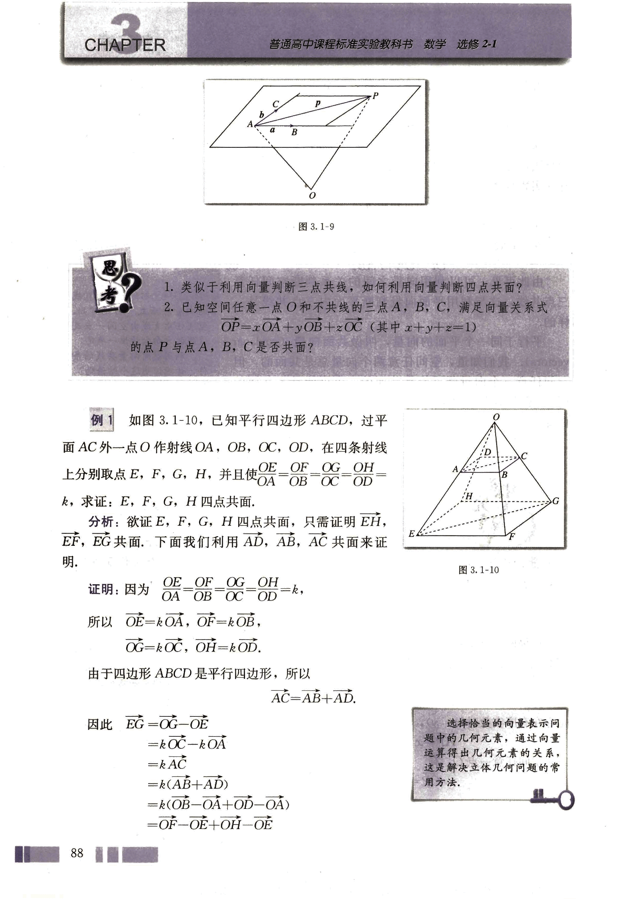
94

# 第三章 空间向量与立体几何

=EF+EH.

由向量共面的充要条件知 E,F,G,H 四点共面.

## 练习

1. 如图,已知空间四边形 ABCD,连结 AC,BD,E,F 分别是 BC,CD 的中点,化简下列各表达式,并标出化简结果的向量:

(1) $\vec{AB}$+$\vec{BC}$+$\vec{CD}$;

(2) $\vec{AB}$+$\frac{1}{2}$($\vec{BD}$+$\vec{BC}$);

(3) $\vec{AF}$-$\frac{1}{2}$($\vec{AB}$+$\vec{AC}$).

2.如图,已知正方体 ABCD-A'B'C'D',点 E,F 分别是上底面 A'C'和侧面 CD'的中心,求下列各式中 x,y 的值:

(1) $\vec{AC}$=x($\vec{AB}$+$\vec{BC}$+$\vec{CC}$);

(2) $\vec{AE}$=$\vec{AA'}$+x$\vec{AB}$+y$\vec{AD}$;

(3) $\vec{AF}$=$\vec{AD}$+x$\vec{AB}$+y$\vec{AA'}$.

3.如图,已知 A,B,C 三点不共线,O 为平面 ABC 外任一点,且平面 ABC 中的小方格为单位正方形,求作点 P, Q, R, S,使:

(1) $\vec{OP}$=$\vec{OA}$+2$\vec{AB}$+2$\vec{AC}$;

(2) $\vec{OQ}$=$\vec{OA}$-3$\vec{AB}$-2$\vec{AC}$;

(3) $\vec{OR}$=$\vec{OA}$+3$\vec{AB}$-2$\vec{AC}$;

(4) $\vec{OS}$=$\vec{OA}$+2$\vec{AB}$-3$\vec{AC}$.

89

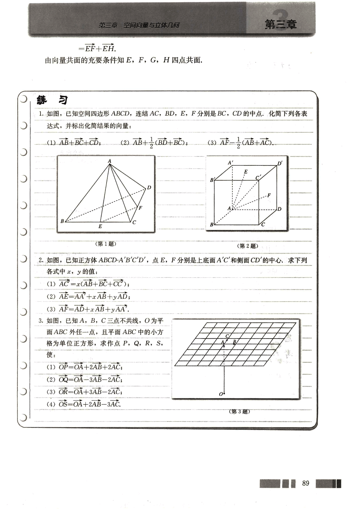
95

# CHAPTER 3

## 3.1.3 空间向量的数量积运算

在几何中，夹角与长度是两个最基本的几何量。下面我们探讨如何用空间向量的数量积表示空间两条直线的夹角和空间线段的长度。

如图 3.1-11，已知两个非零向量 $\vec{a}$，$\vec{b}$，在空间任取一点 O，作 $\vec{OA} = \vec{a}$，$\vec{OB} = \vec{b}$，则 ∠AOB 叫做向量 $\vec{a}$，$\vec{b}$ 的夹角，记作 <$\vec{a}$，$\vec{b}$>.

通常规定，$0 \le \langle \vec{a}, \vec{b} \rangle < \pi$，这样，两个向量的夹角是唯一确定的，且 $\langle \vec{a}, \vec{b} \rangle = \langle \vec{b}, \vec{a} \rangle$.

如果 $\langle \vec{a}, \vec{b} \rangle = \frac{\pi}{2}$，那么向量 $\vec{a}$，$\vec{b}$ 互相垂直，记作 $\vec{a} \perp \vec{b}$.

已知两个非零向量 $\vec{a}$，$\vec{b}$，则 $|\vec{a}||\vec{b}| \cos \langle \vec{a}, \vec{b} \rangle$ 叫做 $\vec{a}$，$\vec{b}$ 的数量积 (inner product)，记作 $\vec{a} \cdot \vec{b}$。即

$\vec{a} \cdot \vec{b} = |\vec{a}||\vec{b}| \cos \langle \vec{a}, \vec{b} \rangle$.

零向量与任何向量的数量积为 0.

特别地，$\vec{a} \cdot \vec{a} = |\vec{a}||\vec{a}| \cos \langle \vec{a}, \vec{a} \rangle = |\vec{a}|^2$.

空间向量的数量积满足如下的运算律：

$(\lambda \vec{a}) \cdot \vec{b} = \lambda (\vec{a} \cdot \vec{b})$;

$\vec{a} \cdot \vec{b} = \vec{b} \cdot \vec{a}$ (交换律);

$\vec{a} \cdot (\vec{b} + \vec{c}) = \vec{a} \cdot \vec{b} + \vec{a} \cdot \vec{c}$ (分配律).

### 思考

1. 对于三个均不为 0 的数 a, b, c, 若 ab = ac, 则 b = c. 对于向量 $\vec{a}$，$\vec{b}$，$\vec{c}$，由 $\vec{a} \cdot \vec{b} = \vec{a} \cdot \vec{c}$，能得到 $\vec{b} = \vec{c}$ 吗？如果不能，请举出反例。

2. 对于三个均不为 0 的数 a, b, c, 若 ab = c, 则 $a = \frac{c}{b}$ (或 $b = \frac{c}{a}$)。对于向量 $\vec{a}$，$\vec{b}$，若 $\vec{a} \cdot \vec{b} = k$，能不能写成 $\vec{a} = \frac{k}{\vec{b}}$ (或 $\vec{b} = \frac{k}{\vec{a}}$)？也就是说，向量有除法吗？

3. 对于三个均不为 0 的数 a, b, c, 有 (ab)c = a(bc)。对于向量 $\vec{a}$，$\vec{b}$，$\vec{c}$，$(\vec{a} \cdot \vec{b})\vec{c} = \vec{a}(\vec{b} \cdot \vec{c})$ 成立吗？向量的数量积满足结合律吗？

90

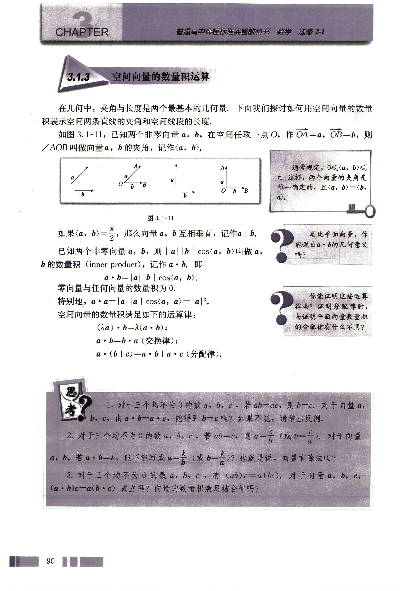
96

# 第三章 空间向量与立体几何

## 例 2

在平面 α 内的一条直线，如果和这个平面的一条斜线的射影垂直，那么它也和这条斜线垂直。①

已知：如图 3.1-12，PO，PA 分别是平面 α 的垂线、斜线，AO 是 PA 在平面 α 内的射影，l⊂α，且 l⊥OA，求证：l⊥PA。

分析：用向量方法证明这个命题时，只需证明直线的方向向量$\vec{a}$与 PA 的数量积为 0。由于 PA 与 OA，PO 构成一个三角形，且$\vec{PO}$+$\vec{OA}$=$\vec{PA}$，又已知 l⊥OA，PO⊥α，命题容易得证。

证明：如图 3.1-13，取直线 l 的方向向量$\vec{a}$，同时取向量$\vec{PO}$，$\vec{OA}$。

因为 l⊥OA，所以$\vec{a}$·$\vec{OA}$=0。

因为 PO⊥α，且 l⊂α，所以 l⊥PO，

因此$\vec{a}$·$\vec{PO}$=0。

又因为$\vec{a}$·$\vec{PA}$=$\vec{a}$·($\vec{PO}$+$\vec{OA}$)=$\vec{a}$·$\vec{PO}$+$\vec{a}$·$\vec{OA}$=0，

所以 l⊥PA。

你能用向量方法证明“在平面内的一条直线，如果和这个平面的一条斜线垂直，那么它也和这条斜线在平面内的射影垂直。”吗？②

## 例 3

如图 3.1-14，m，n 是平面 α 内的两条相交直线，如果 l⊥m，l⊥n，求证：l⊥α.

分析：要证明 l⊥α，就是要证明 l 垂直于 α 内的任何一条直线 g（直线和平面垂直的定义）。如果我们能在 g 和 m，n 之间建立某种联系，并由 l⊥m，l⊥n，得到 l⊥g，就能解决此问题。

证明：在 α 内作任一直线 g，分别在 l，m，n，g 上取非零向量$\vec{l}$，$\vec{m}$，$\vec{n}$，$\vec{g}$。

因为$\vec{m}$与$\vec{n}$相交，所以向量$\vec{m}$，$\vec{n}$不平行，由向量共面的充要条件知，存在唯一的有序实数对(x，y)，使

$\vec{g}$=x$\vec{m}$+y$\vec{n}$。

将上式两边与向量$\vec{l}$作数量积，得

$\vec{l}$·$\vec{g}$=x$\vec{l}$·$\vec{m}$+y$\vec{l}$·$\vec{n}$。

因为$\vec{l}$·$\vec{m}$=0，$\vec{l}$·$\vec{n}$=0（为什么？），

所以$\vec{l}$·$\vec{g}$=0，

① 这个命题叫做三垂线定理。

② 这个命题叫做三垂线定理的逆定理。

91

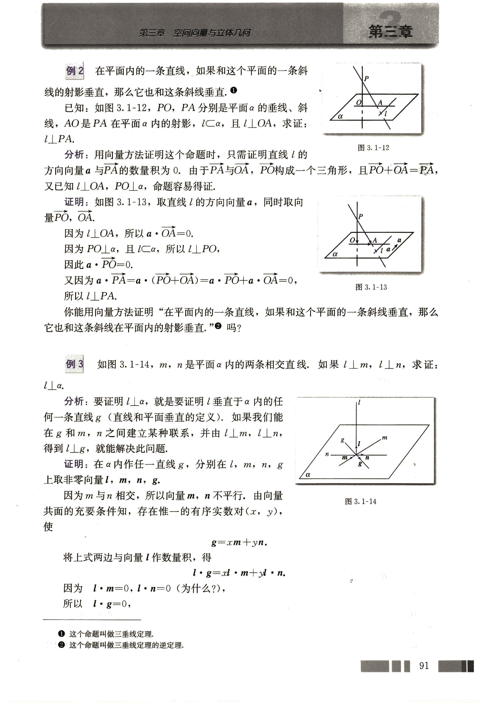
97

# CHAPTER 3

所以 $l \perp g$.

即 $l \perp g$.

这就证明了直线 $l$ 垂直于平面 $\alpha$ 内的任意一条直线，所以 $l \perp \alpha$.

## 练习

1. 如图，在正三棱柱 $ABC$-$A_1B_1C_1$ 中，若 $AB = \sqrt{2}BB_1$，则 $AB_1$ 与 $CB$ 所成角的大小为 ( )

(A) $60^\circ$ (B) $90^\circ$ (C) $105^\circ$ (D) $75^\circ$

[image1](images/image1.png)
[image2](images/image2.png)

(第 1 题) (第 2 题)

2. 如图，在平行六面体 $ABCD$-$A'B'C'D'$ 中，$AB=4$，$AD=3$，$AA'=5$，$\angle BAD = 90^\circ$，$\angle BAA' = \angle DAA' = 60^\circ$，求 $AC$ 的长.

3. 如图，线段 $AB$，$BD$ 在平面 $\alpha$ 内，$BD \perp AB$，线段 $AC \perp \alpha$，且 $AB=a$，$BD=b$，$AC=c$，求 $C$，$D$ 间的距离.

[image3](images/image3.png)

(第 3 题)

## 3.1.4 空间向量的正交分解及其坐标表示

我们知道，平面内的任意一个向量 $\vec{p}$ 都可以用两个不共线的向量 $\vec{a}$，$\vec{b}$ 来表示（平面向量基本定理）。对于空间任意一个向量，有没有类似的结论呢？

如图 3.1-15，设 $\vec{i}$，$\vec{j}$，$\vec{k}$ 是空间三个两两垂直的向量，且有公共起点 $O$。对于空间任

---

## 92

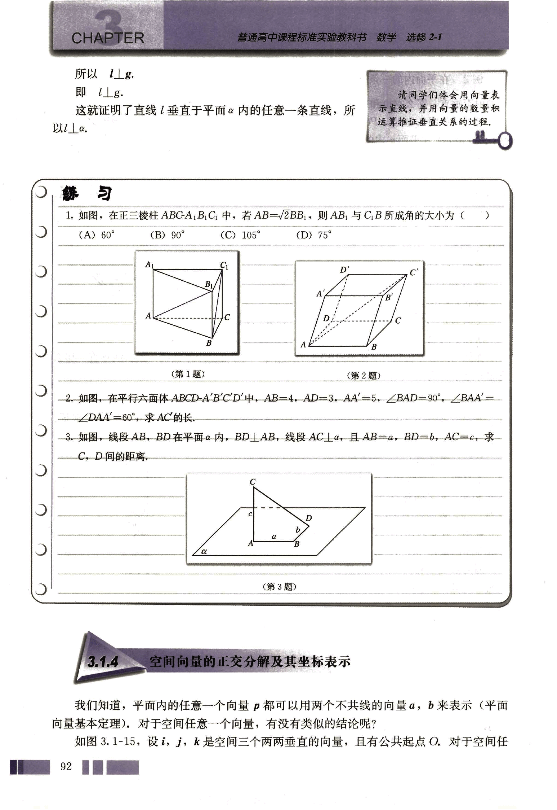
98

# 第三章 空间向量与立体几何

意一个向量 $\vec{p}$ = OP, 设点 Q 为点 P 在 i, j 所确定的平面上
的正投影, 由平面向量基本定理可知, 在 OQ, k 所确定的平面上, 存在实数 z, 使得

OP = OQ + zk.

而在 i, j 所确定的平面上, 由平面向量基本定理可知,
存在有序实数对 (x, y), 使得

OQ = xi + yj.

从而

OP = OQ + zk = xi + yj + zk.

由此可知, 如果 i, j, k 是空间三个两两垂直的向
量, 那么, 对空间任一向量 p, 存在一个有序实数组 {x, y, z}, 使得

p = xi + yj + zk.

我们称 xi, yj, zk 为向量 p 在 i, j, k 上的分向量.

探
究

在空间中, 如果用任意三个不共面向量 a, b, c 代替两两垂
直的向量 i, j, k, 你能得出类似的结论吗?

类似于平面向量基本定理, 我们有空间向量基本定理.

定理 如果三个向量 a, b, c 不共面, 那么对空间任一向量 p, 存在有序实数组 {x,
y, z}, 使得

p = xa + yb + zc.

由此可知, 如果三个向量 a, b, c 不共面, 那么所有空
间向量组成的集合就是 {p | p = xa + yb + zc, x, y, z ∈ R}.

这个集合可看作是由向量 a, b, c 生成的, 我们把 {a, b,
c} 叫做空间的一个基底 (base), a, b, c 都叫做基向量
(base vectors), 空间任何三个不共面的向量都可构成空间的
一个基底.

空间向量基本定理

与 88 页“思考”栏目
中的第 2 个问题有什么
联系? 你有何体会?

特别地, 设 $e_1$, $e_2$, $e_3$ 为有公共起点的三个两两垂直的单位向量 (我们称它们为单位
正交基底), 以 $e_1$, $e_2$, $e_3$ 的公共起点为原点, 分别以 $e_1$,
$e_2$, $e_3$ 的方向为 x 轴、y 轴、z 轴的正方向建立空间直角坐标
系 Oxyz. 那么, 对于空间任意一个向量 p, 一定可以把它平
移, 使它的起点与原点重合, 得到向量 OP = p. 由空间向
量基本定理可知, 存在有序实数组 {x, y, z}, 使得

p = $xe_1$ + $ye_2$ + $ze_3$.

计算单位正交基之间的
数量积: $e_1 \cdot e_1$, $e_1 \cdot e_2$, $e_1 \cdot e_3$,
$e_2 \cdot e_3$, $e_1 \cdot e_1$, $e_2 \cdot e_2$, $e_3 \cdot e_3$.

93

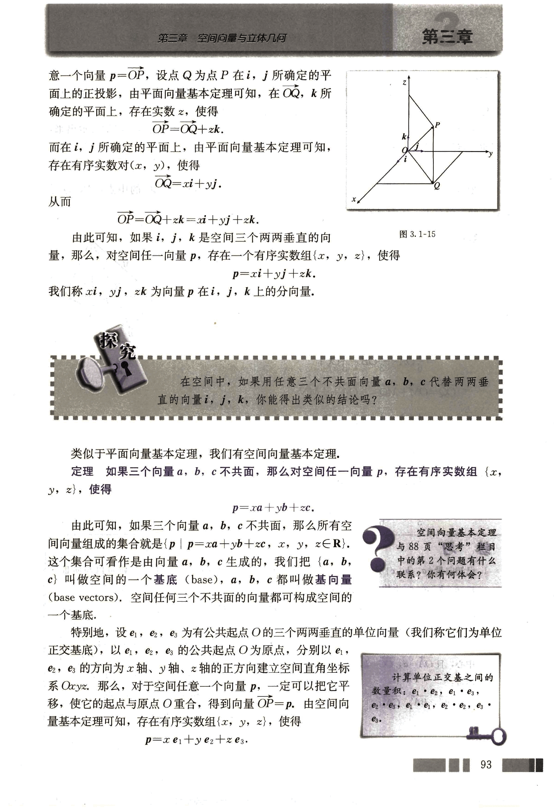
99

# CHAPTER 2

我们把 _x_, _y_, _z_ 称作向量 **p** 在单位正交基底 $e_1, e_2, e_3$ 下的坐标，记作 **p** = (_x_, _y_, _z_).

此时向量 **p** 的坐标恰是点 P 在空间直角坐标系 Oxyz 中的坐标 (_x_, _y_, _z_) (想一想，为什么？). 这样，我们就有了从正交基底到直角坐标系的转换.

由空间向量基本定理可知，空间任意一个向量都可以用三个不共面的向量表示出来，这能为解决问题带来方便.

## 例 4

如图 3.1-16，M, N 分别是四面体 OABC 的边 OA, BC 的中点，P, Q 是 MN 的三等分点，用向量 $\vec{OA}$, $\vec{OB}$, $\vec{OC}$ 表示 $\vec{OP}$ 和 $\vec{OQ}$.

解：$\vec{OP} = \vec{OM} + \vec{MP} = \frac{1}{2}\vec{OA} + \frac{2}{3}\vec{MN}$
$= \frac{1}{2}\vec{OA} + \frac{2}{3}(\vec{ON} - \vec{OM})$
$= \frac{1}{2}\vec{OA} + \frac{2}{3}(\vec{ON} - \frac{1}{2}\vec{OA})$
$= \frac{1}{2}\vec{OA} + \frac{2}{3} \times \frac{1}{2}(\vec{OB} + \vec{OC})$
$= \frac{1}{6}\vec{OA} + \frac{1}{3}\vec{OB} + \frac{1}{3}\vec{OC}$;

$\vec{OQ} = \vec{OM} + \vec{MQ} = \frac{1}{2}\vec{OA} + \frac{1}{3}\vec{MN}$
$= \frac{1}{2}\vec{OA} + \frac{1}{3}(\vec{ON} - \vec{OM})$
$= \frac{1}{2}\vec{OA} + \frac{1}{3}(\vec{ON} - \frac{1}{2}\vec{OA})$
$= \frac{1}{2}\vec{OA} + \frac{1}{3} \times \frac{1}{2}(\vec{OB} + \vec{OC})$
$= \frac{1}{3}\vec{OA} + \frac{1}{6}\vec{OB} + \frac{1}{6}\vec{OC}$.

[3.1-16](images/3.1-16.png)

## 练习

1. 已知向量 {a, b, c} 是空间的一个基底，从 a, b, c 中选哪一个向量，一定可以与向量 **p** = **a** + **b**, **q** = **a** - **b** 构成空间的另一个基底？

2. 已知 O, A, B, C 为空间四个点，且向量 $\vec{OA}$, $\vec{OB}$, $\vec{OC}$ 不构成空间的一个基底，那么点 O, A, B, C 是否共面？

3. 已知平行六面体 OABC-O'A'B'C'，点 G 是侧面 BB'C'C 的中心，且 $\vec{OA}$ = **a**, $\vec{OC}$ = **b**, $\vec{OO'}$ = **c**, 用 **a**, **b**, **c** 表示下列向量：

(1) $\vec{OB}$, $\vec{BA'}$, $\vec{CA'}$;

(2) $\vec{OG}$.

[3](images/3.png)

94

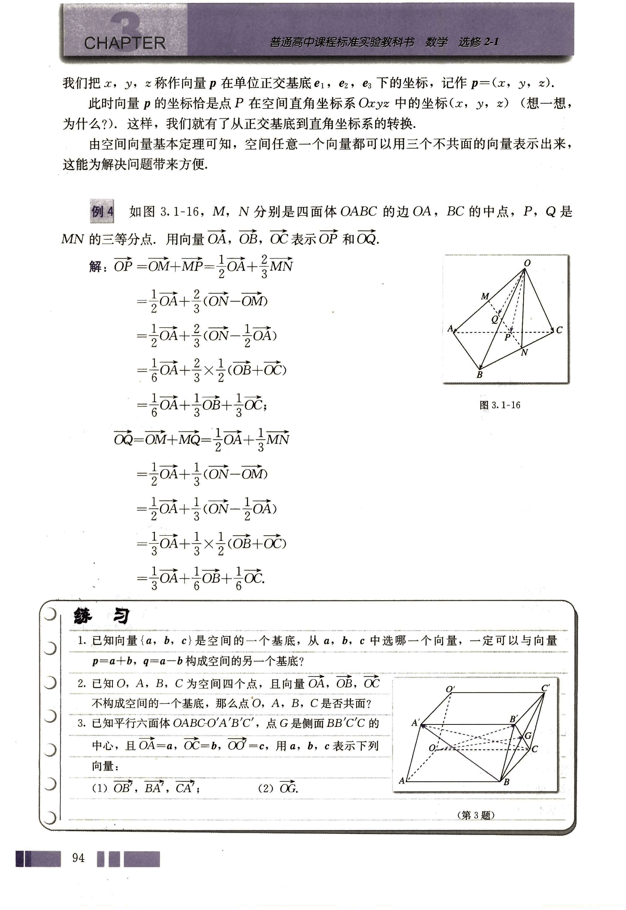
100

# 第三章 空间向量与立体几何

## 3.1.5 空间向量运算的坐标表示

我们知道，向量$\bold{a}$在平面上可用有序实数对$(x, y)$表示，在空间则可用有序实数组$\{x, y, z\}$表示。类似平面向量的坐标运算，我们可以得出空间向量的加法、减法、数乘及数量积运算的坐标表示。

设
$a = (a_1, a_2, a_3), b = (b_1, b_2, b_3),$

则
$a + b = (a_1 + b_1, a_2 + b_2, a_3 + b_3),$
$a - b = (a_1 - b_1, a_2 - b_2, a_3 - b_3),$
$\lambda a = (\lambda a_1, \lambda a_2, \lambda a_3),$
$a \cdot b = a_1b_1 + a_2b_2 + a_3b_3.$

下面我们对向量的数量积运算加以证明。

设$i, j, k$为单位正交基底，则
$a = a_1i + a_2j + a_3k, b = b_1i + b_2j + b_3k.$

所以
$a \cdot b = (a_1i + a_2j + a_3k) \cdot (b_1i + b_2j + b_3k).$

利用向量数量积的分配律以及
$i \cdot i = j \cdot j = k \cdot k = 1, i \cdot j = j \cdot k = k \cdot i = 0,$

即可得出
$a \cdot b = a_1b_1 + a_2b_2 + a_3b_3.$

类似于平面向量运算的坐标表示，我们还可以得到：
$a // b \Leftrightarrow a = \lambda b \Leftrightarrow a_1 = \lambda b_1, a_2 = \lambda b_2, a_3 = \lambda b_3 (\lambda \in R);$
$a \perp b \Leftrightarrow a \cdot b = 0 \Leftrightarrow a_1b_1 + a_2b_2 + a_3b_3 = 0;$
$|a| = \sqrt{a \cdot a} = \sqrt{a_1^2 + a_2^2 + a_3^2};$

$\cos(a, b) = \frac{a \cdot b}{|a||b|} = \frac{a_1b_1 + a_2b_2 + a_3b_3}{\sqrt{a_1^2 + a_2^2 + a_3^2}\sqrt{b_1^2 + b_2^2 + b_3^2}}.$

在空间直角坐标系中，已知点$A(a_1, b_1, c_1), B(a_2, b_2, c_2)$，则 A, B 两点间的距离
$d_{AB} = |\vec{AB}| = \sqrt{(a_2 - a_1)^2 + (b_2 - b_1)^2 + (c_2 - c_1)^2}.$

将空间向量的运算与向量的坐标表示结合起来，不仅可以解决夹角和距离的计算问题，而且可以使一些问题的解决变得简单。

95

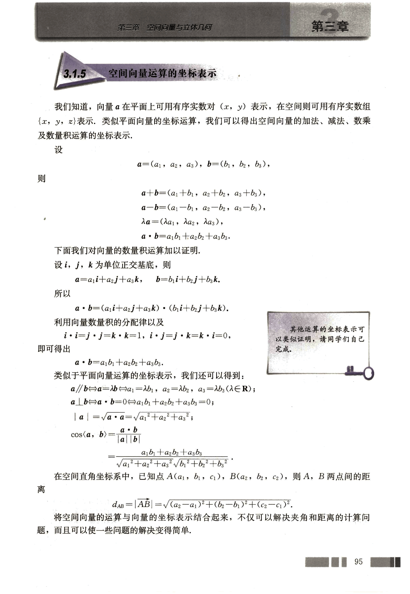
101

# CHAPTER 3

## 例 5

如图 3.1-17，在正方体 ABCD-A₁B₁C₁D₁ 中，点 E₁，F₁ 分别是 A₁B₁，C₁D₁ 的一个四等分点，求$\vec{BE₁}$与$\vec{DF₁}$所成角的余弦值。

**分析:** $\vec{BE₁}$与$\vec{DF₁}$所成的角就是$\vec{BE₁}$，$\vec{DF₁}$所成的角或它的补角。因此，我们可以通过$\vec{BE₁}$，$\vec{DF₁}$的坐标表示，计算出它们的数量积与模，进而求出它们所成角的余弦值。

**解:** 如图 3.1-17，不妨设正方体的棱长为 1，分别以$\vec{DA}$，$\vec{DC}$，$\vec{DD₁}$为单位正交基底建立空间直角坐标系 Oxyz，则

B(1, 1, 0), E₁(1, $\frac{3}{4}$, 1), D(0, 0, 0), F₁(0, $\frac{1}{4}$, 1).

所以 $\vec{BE₁}$=(1, $\frac{3}{4}$, 1)-(1, 1, 0)=(0, $-\frac{1}{4}$, 1),

$\vec{DF₁}$=(0, $\frac{1}{4}$, 1)-(0, 0, 0)=(0, $\frac{1}{4}$, 1).

|$ \vec{BE₁}$| = $\frac{\sqrt{17}}{4}$, |$\vec{DF₁}$| = $\frac{\sqrt{17}}{4}$,

$\vec{BE₁}$·$\vec{DF₁}$ = 0×0 + ($-\frac{1}{4}$) × $\frac{1}{4}$ + 1 × 1 = $\frac{15}{16}$.

所以 cos<$\vec{BE₁}$, $\vec{DF₁}$> = $\frac{\vec{BE₁} \cdot \vec{DF₁}}{|\vec{BE₁}| \cdot |\vec{DF₁}|}$ = $\frac{15/16}{\frac{\sqrt{17}}{4} \cdot \frac{\sqrt{17}}{4}}$ = $\frac{15}{17}$.

因此，$\vec{BE₁}$与$\vec{DF₁}$所成角的余弦值是$\frac{15}{17}$。

[图 3.1-17](images/3.1-17.png)

## 例 6

如图 3.1-18，正方体 ABCD-A₁B₁C₁D₁ 中，点 E，F 分别是 BB₁，D₁B₁ 的中点，求证$\vec{EF}$⊥$\vec{DA₁}$.

**证明:** 如图 3.1-18，不妨设正方体的棱长为 1，分别以$\vec{DA}$，$\vec{DC}$，$\vec{DD₁}$为单位正交基底建立空间直角坐标系 Oxyz，则

E(1, 1, $\frac{1}{2}$), F($\frac{1}{2}$, $\frac{1}{2}$, 1),

所以 $\vec{EF}$=( $-\frac{1}{2}$, $-\frac{1}{2}$, $\frac{1}{2}$).

又 A₁(1, 0, 1), D(0, 0, 0),

所以 $\vec{DA₁}$=(1, 0, 1).

所以 $\vec{EF}$·$\vec{DA₁}$=( $-\frac{1}{2}$, $-\frac{1}{2}$, $\frac{1}{2}$)·(1, 0, 1)=0.

[图 3.1-18](images/3.1-18.png)

体会用向量表示相关元素，并用向量运算（包括坐标形式的运算）求解问题的思路。
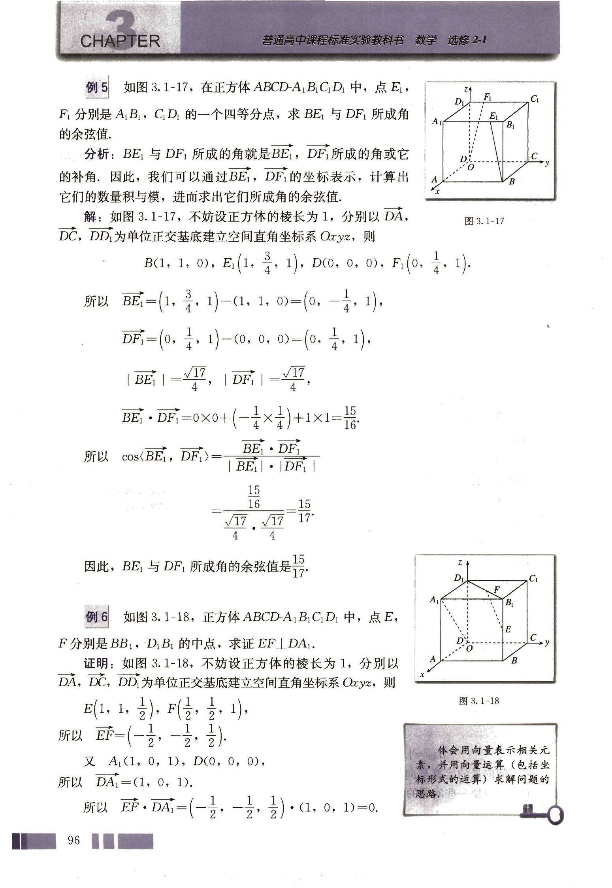
102

# 第三章 空间向量与立体几何

## 练习

1. 已知 $\vec{a} = (-3, 2, 5)$，$\vec{b} = (1, 5, -1)$，求：

(1) $\vec{a} + \vec{b}$；

(2) $3\vec{a} - \vec{b}$；

(3) $6\vec{a}$；

(4) $\vec{a} \cdot \vec{b}$。

2. 如图，正方体的棱长为 2，试建立适当的空间直角坐标系，写出正方体各顶点的坐标，并和你 的同学进行交流。(第 2 题)

[image](images/question2.png)

3. 如图，正方体 ABCD-A₁B₁C₁D₁ 中，点 M 是 AB 的中点，求 $\vec{DB₁}$ 与 $\vec{CM}$ 所成角的余弦值。(第 3 题)

[image](images/question3.png)

## 习题 3.1

### A 组

1. 如图，已知平行六面体 ABCD-A'B'C'D'，化简下列各表达式，并在图中标出化简结果的向量：

(1) $\vec{AB} + \vec{BC}$；

(2) $\vec{AB} + \vec{AD} + \vec{AA'}$；

(3) $\vec{AB} + \vec{AD} + \frac{1}{2}\vec{CC'}$；

(4) $\frac{1}{3}(\vec{AB} + \vec{AD} + \vec{AA'})$。

[image](images/question1.png)

2. 如图，平行六面体 ABCD-A₁B₁C₁D₁ 中，AC 与 BD 的交点为点 M。设 $\vec{A₁B₁} = \vec{a}$，$\vec{A₁D₁} = \vec{b}$，$\vec{A₁A} = \vec{c}$，则下列向量中与 $\vec{BM}$ 相等的向量是 ( )

(A) $-\frac{1}{2}\vec{a} + \frac{1}{2}\vec{b} + \vec{c}$ (B) $\frac{1}{2}\vec{a} + \frac{1}{2}\vec{b} + \vec{c}$ (C) $\frac{1}{2}\vec{a} - \frac{1}{2}\vec{b} + \vec{c}$ (D) $-\frac{1}{2}\vec{a} - \frac{1}{2}\vec{b} + \vec{c}$

97

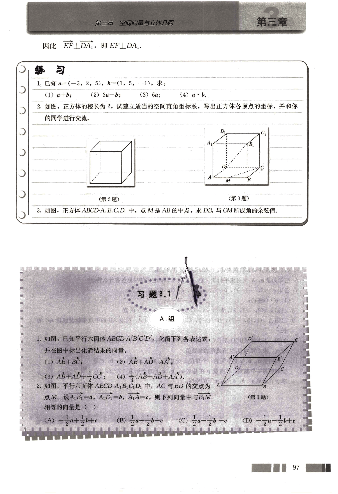
103

# CHAPTER 3

## (第 2 题)

[image1](images/image1.png)

## (第 3 题)

[image2](images/image2.png)

3. 如图，平行六面体 ABCD-A'B'C'D'中，AB=5，AD=3，AA'=7，∠BAD=60°，∠BAA'=∠DAA'=45°，求 AC 的长。

## (第 4 题)

4. 如图，已知空间四边形 ABCD 的每条边及 AC，BD 的长都等于 a，点 E，F，G 分别是 AB，AD，DC 的中点，求：
   (1) $\vec{AB} \cdot \vec{AC}$；
   (2) $\vec{AD} \cdot \vec{DB}$；
   (3) $\vec{GF} \cdot \vec{AC}$；
   (4) $\vec{EF} \cdot \vec{BC}$；
   (5) $\vec{FG} \cdot \vec{BA}$；
   (6) $\vec{GE} \cdot \vec{GF}$。

[image3](images/image3.png)

## (第 5 题)

5. 如图，正方体 ABCD-A'B'C'D'的棱长为 a。
   (1) 求 A'B 和 B'C 的夹角；
   (2) 求证：A'B⊥AC'。

[image4](images/image4.png)

6. 已知向量 a，b，c 分别平行于 x 轴，y 轴，z 轴，它们的坐标各有什么特点？

7. 已知 a=(2，-3，1)，b=(2，0，3)，c=(0，0，2)。求：
   (1) $\vec{a} \cdot (\vec{b}+\vec{c})$；
   (2) $\vec{a}+6\vec{b}-8\vec{c}$。

8. 已知 a=(2，-1，3)，b=(-4，2，x)，且 a⊥b，求 x 的值。

9. 已知 A=(3，5，-7)，B=(-2，4，3)，求$\vec{AB}$，$\vec{BA}$，线段 AB 的中点坐标及线段 AB 的长。

## (第 10 题)

10. 如图，正方体 ABCD-A1B1C1D1中，点 M，N 分别为棱 AA1和 B1B 的
    中点，求 CM 和 DN 所成角的余弦值。

[image5](images/image5.png)

11. 已知向量 a，b，c 是空间的一个单位正交基底，向量 a+b，a-b，c 是
    空间的另一个基底，若向量 p 在基底 a，b，c 下的坐标为(1，2，3)，
    求 p 在基底 a+b，a-b，c 下的坐标。

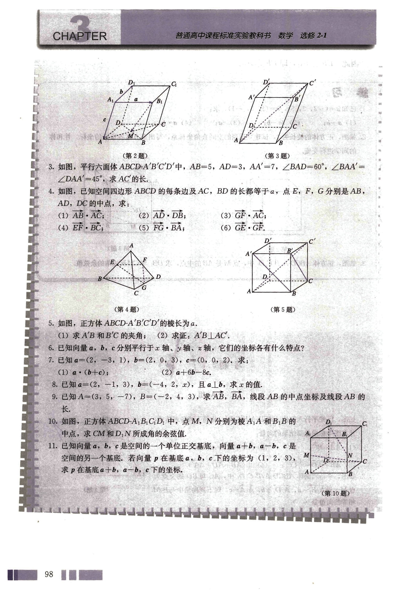
104

# 第三章 空间向量与立体几何

## B 组

1. 如图，空间四边形 OABC 中，OA⊥BC，OB⊥AC，求证：OC⊥AB.

2. 如图，已知空间四边形 OABC 中，OA=OB，CA=CB，点 E，F，G，H 分别是 OA，OB，BC，CA 的中点，求证：四边形 EFGH 是矩形.

3. 求证：如果两条直线同时垂直于一个平面，那么这两条直线平行.

## 向量概念的推广与应用

我们知道，在平面内取定正交基底建立坐标系后，坐标平面内的任意一个向量，都可以用二元有序实数对($a_1, a_2$)表示，平面向量又称为二维向量。给定空间一个正交基底，任意一个空间向量可用三元有序实数组($a_1, a_2, a_3$)表示，空间向量又称为三维向量。

二维向量、三维向量统称为几何向量。

在实际问题中，经常会遇到一些需要用更多的实数来表示的量，比如：期末进行了五门学科的考试，每个学生可用顺序排列的五科成绩来表示；在汽车生产线上，对装配好的汽车进行制动距离、最高车速、每 100 千米油耗、滑行距离、噪声、废气排放量等六项指标的测试，那么每辆新车质量可用六元有序实数组($a_1, a_2, a_3, a_4, a_5, a_6$)表示。

一般地，n 元有序实数组($a_1, a_2, \dots, a_n$)称为 n 维向量，它是几何向量的推广。n 维向量的全体构成的集合，赋予相应的结构后，叫做 n 维欧氏空间，它的每一个元素可看成 n 维向量空间的一点。

类似二维向量，对于 n 维向量，也可定义两个向量的加法运算、减法运算、数乘运算、两个向量的数量积、向量的长度(模)、两点间的“距离”等：

设$a=(a_1, a_2, \dots, a_n)$，$b=(b_1, b_2, \dots, b_n)$，则

$a \pm b = (a_1, a_2, \dots, a_n) \pm (b_1, b_2, \dots, b_n) = (a_1 \pm b_1, a_2 \pm b_2, \dots, a_n \pm b_n)$;

$\lambda a = \lambda (a_1, a_2, \dots, a_n) = (\lambda a_1, \lambda a_2, \dots, \lambda a_n)$, $\lambda \in R$;

$a \cdot b = (a_1, a_2, \dots, a_n) \cdot (b_1, b_2, \dots, b_n) = a_1b_1 + a_2b_2 + \dots + a_nb_n$;

99

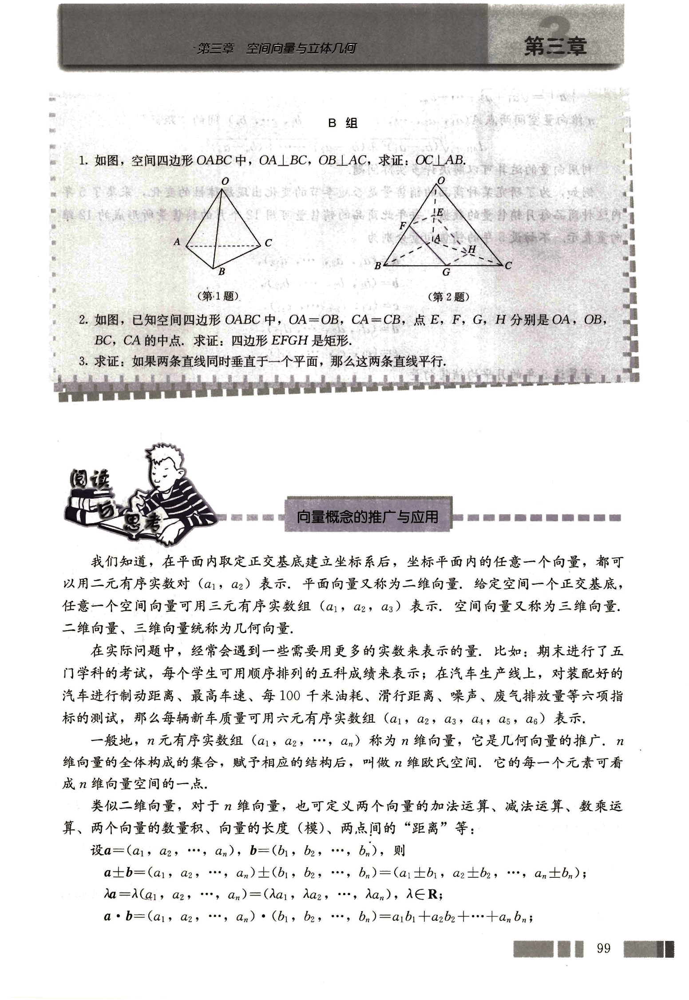
105

# CHAPTER 3

|a| = √$a_1^2$ + $a_2^2$ + ... + $a_n^2$

n 维向量空间两点 A($a_1$, $a_2$, ..., $a_n$), B($b_1$, $b_2$, ..., $b_n$)间的“距离”

$d_{AB}$ = √($b_1$-$a_1$)$^2$ + ($b_2$-$a_2$)$^2$ + ... + ($b_n$-$a_n$)$^2$ .

利用向量的运算可以解决许多实际问题.

例如,为了研究某种商品的销售量是否随季节的变化出现规律性的变化,采集了 5 年内这种商品每月销售量的数据,每年此商品的销售量可用 12 个月的销售量所形成的 12 维向量表示,不妨设 5 年的销售向量分别为

a = ($a_1$, $a_2$, ..., $a_{12}$),

b = ($b_1$, $b_2$, ..., $b_{12}$),

c = ($c_1$, $c_2$, ..., $c_{12}$),

d = ($d_1$, $d_2$, ..., $d_{12}$),

e = ($e_1$, $e_2$, ..., $e_{12}$).

计算这 5 年的月平均销售向量

$\frac{1}{5}$(a + b + c + d + e).

观察这个向量的 12 个分量,就可看出这 5 年内月平均销售量是否与季节的变化有关。

上面是一个应用向量的加法与数乘运算的例子,下面我们再来看用“距离”概念解决实际问题的例子。

依据“距离”来分类是一种常用的分类方法,计算每个向量与标准点的距离,与哪个标准点的距离最近就归哪一类,请看下面的具体例子.

燕隼和红隼是同属于隼形目隼科的鸟类,它们的体形大小如鸽,形略似燕,身体的形态特征比较相似,红隼的体形比燕隼略大,通过抽样测量已知燕隼的平均体长约为 31 cm,平均翅长约为 27 cm;红隼的平均体长约为 35 cm,平均翅长约为 25 cm.

近日在某地发现了两只形似燕隼或者红隼的鸟,经测量,知道这两只鸟的体长和翅长分别为 A(32.65, 25.2), B(33.4, 26.9).你能利用这些数据判断这两只鸟是燕隼还是红隼吗?

解:设燕隼的平均体长为$x_1$,平均翅长为$y_1$.

红隼的平均体长为$x_2$,平均翅长为$y_2$.

待判定的鸟的体长为 x,翅长为 y.

定义待判定的鸟与燕隼和红隼“距离”分别为:

$D_1$=√(x-$x_1$)$^2$+ (y-$y_1$)$^2$,

$D_2$=√(x-$x_2$)$^2$+ (y-$y_2$)$^2$.

这样定义的“距离”就能反映出待判断的鸟的体长和翅长的数据距离燕隼和红隼的平均体长和翅长的数据的波动情况,因此,判定方法为:

若$D_1$>$D_2$,说明待判断的鸟的体长和翅长较接近于红隼的平均体长和翅长,则此鸟为红隼;

若$D_1$<$D_2$,说明待判断的鸟的体长和翅长较接近于燕隼的平均体长和翅长,则此鸟为燕隼;

100

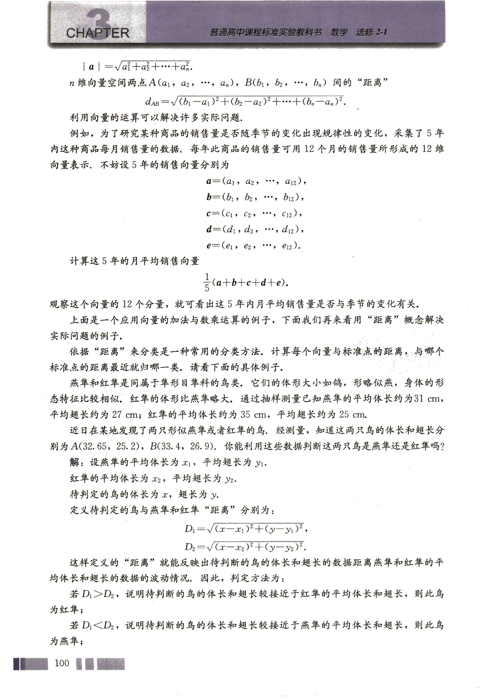
106

# 第三章 空间向量与立体几何

若 D₁=D₂, 表明仅利用这些数据无法断定。
由已知问题可以知道：
x₁=31, y₁=27, x₂=35, y₂=25;

此外还有：
xA=32.65, yA=25.2, xB=33.4, yB=26.9.

经过计算得到下面的结果：
DA1=√(xA-x₁)²+(yA-y₁)² =√5.9625≈2.44,
DA2=√(xA-x₂)²+(yA-y₂)²=√5.5625≈2.36,
DB1=√(xB-x₁)²+(yB-y₁)² =√5.77≈2.40,
DB2=√(xB-x₂)²+(yB-y₂)²=√6.17≈2.48.

因为 DA1>DA2, 可知 A 属于红隼；
DB1<DB2, 可知 B 属于燕隼。

从以上两个例子可以看出，由有序实数组构成的向量，比几何向量的应用更加广泛。在日常生活和科学研究中，有许多量都可由有序实数组构成的向量来表示，并可用向量理论研究这些量的性质。

101

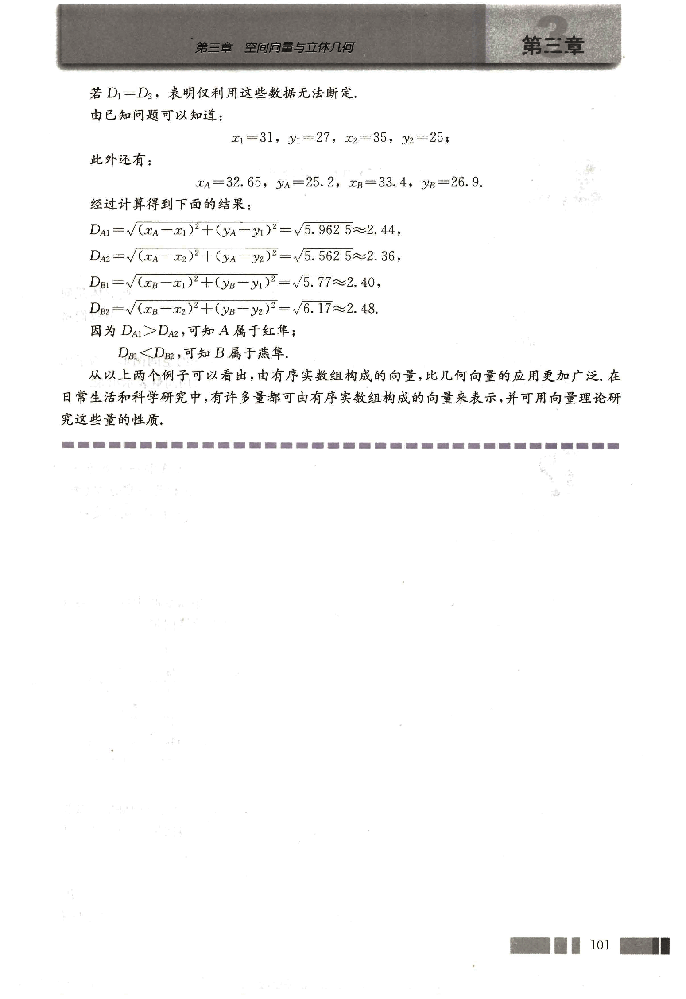
107

# CHAPTER 3

## 3.2 立体几何中的向量方法

在上一节，我们把向量从平面推广到空间，并利用空间向量解决了一些立体几何问题，你是否已经初步体会到空间向量在解决立体几何问题中的作用？这一节我们将进一步学习立体几何中的向量方法.

立体几何研究的基本对象是点、直线、平面以及由它们组成的空间图形。为了用空间向量解决立体几何问题，首先必须把点、直线、平面的位置用向量表示出来。

### 思考？

如何确定一个点在空间的位置？在空间中给一个定点 A 和一个定方向(向量)，能确定一条直线在空间的位置吗？给一个定点和两个定方向(向量)，能确定一个平面在空间的位置吗？给一个定点和一个定方向(向量)，能确定一个平面在空间的位置吗？

如图 3.2-1(1)，在空间中，我们取一定点 O 作为基点，那么空间中任意一点 P 的位置就可以用向量$\vec{OP}$来表示，我们把向量$\vec{OP}$称为点 P 的位置向量.

空间中任意一条直线的位置可以由 l 上一个定点 A 以及一个定方向确定.如图 3.2-1(2)，点 A 是直线 l 上一点，向量$\vec{a}$表示直线的方向(方向向量)。在直线上取$AB = \vec{a}$，那么对于直线 l 上任意一点 P，一定存在实数 t，使得

$\vec{AP} = t\vec{AB}$.

这样，点 A 和向量$\vec{a}$不仅可以确定直线的位置，还可以具体表示出 l 上的任意一点.

空间中平面的位置可以由内两条相交直线来确定，如图 3.2-1(3)，设这两条

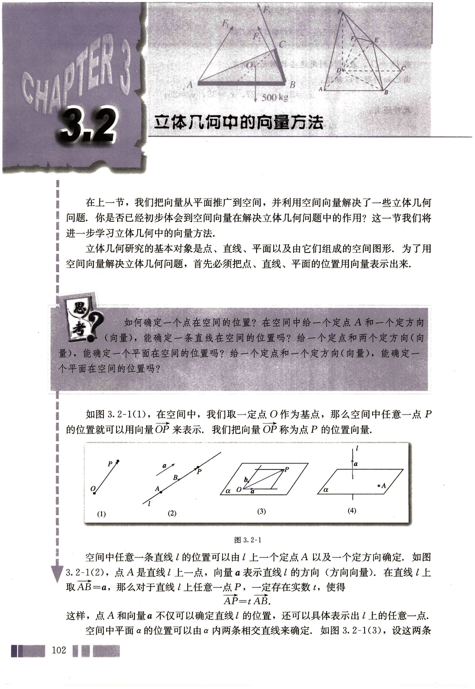
108

# 第三章 空间向量与立体几何

直线相交于点 O，它们的方向向量分别为$\vec{a}$和$\vec{b}$，P 为平面 α 上任意一点，由平面向量基本定理可知，存在有序实数对(x, y)，使得

$OP = x\vec{a} + y\vec{b}$.

这样，点 O 与向量$\vec{a}$，$\vec{b}$不仅可以确定平面 α 的位置，还可以具体表示出 α 内的任意一点.

这种表示在解决几何问题时能起到非常重要的作用.

类似于直线的方向向量，我们还可以用平面的法向量表示空间中平面的位置，如图 3.2-1(4)，直线 l 上，取直线 l 的方向向量$\vec{a}$，则向量$\vec{a}$叫做平面 α 的法向量(normal vectors). 给定一点 A 和一个向量$\vec{a}$，那么，过点 A，以向量$\vec{a}$为法向量的平面是完全确定的.

因为方向向量与法向量可以确定直线和平面的位置，所以我们可以利用直线的方向向量与平面的法向量表示空间直线、平面间的平行、垂直、夹角等位置关系.

例如，如图 3.2-2，设直线 l 的方向向量是$\vec{u}=(a_1, b_1, c_1)$，平面 α 的法向量$\vec{v}=(a_2, b_2, c_2)$，则

$l ∥ α ⇔ \vec{u} \cdot \vec{v} = 0 ⇔ a_1a_2 + b_1b_2 + c_1c_2 = 0$ (图 3.2-2(1));

$l ⊥ α ⇔ \vec{u} ∥ \vec{v} ⇔ \vec{u} = k\vec{v}$

$⇔ (a_1, b_1, c_1) = k(a_2, b_2, c_2)$

$⇔ a_1 = ka_2, b_1 = kb_2, c_1 = kc_2$ (图 3.2-2(2)).

我们随时随地看到向量运算的作用，你同意“向量是躯体，运算是灵魂”“没有运算的向量只能起路标的作用”的说法吗？

**探究**

1. 如图 3.2-2(3)，若直线 l 和平面 α 的夹角为 θ，你能用$\vec{u}$，$\vec{v}$表示 θ 吗？

2. 类似地，你能用直线的方向向量表示空间两条直线平行、垂直的位置关系以及它们之间的夹角吗？你能用平面的法向量表示空间两个平面平行、垂直的位置关系以及它们所成二面角的大小吗？

一般地，由直线、平面的位置关系以及直线的方向向量和平面的法向量，可以归纳如下结论.

103

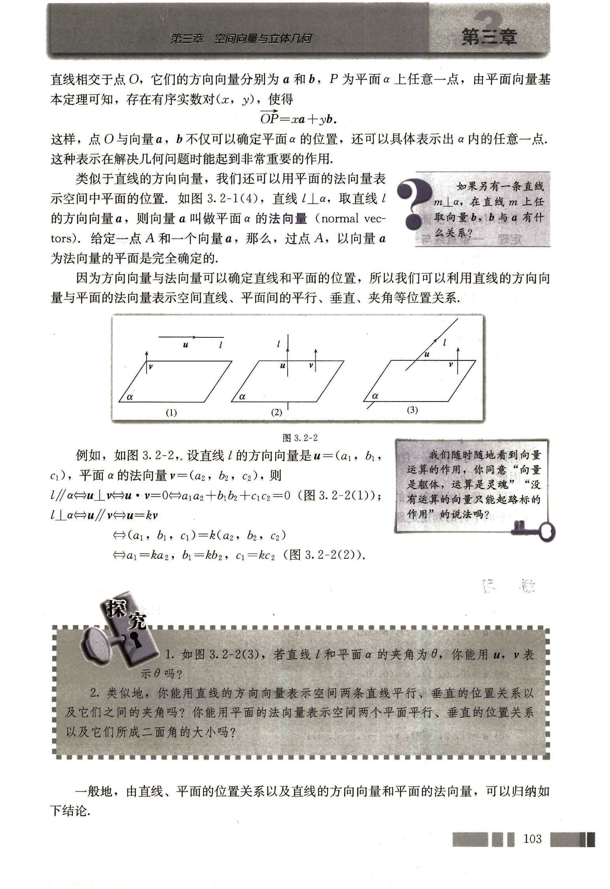
109

# CHAPTER 3

普通高中课程标准实验教科书 数学 选修 2-1

设直线 _l_, _m_ 的方向向量分别为 **a**, **b**, 平面 α, β 的法向量分别为 **u**, **v**, 则

_l_ // _m_ ⇔ **a** // **b** ⇔ **a** = _k\*\*b_, _k_ ∈ R;
_l_ ⊥ _m_ ⇔ **a** ⊥ **b** ⇔ **a** • **b** = 0;
_l_ // α ⇔ **a** ⊥ **u** ⇔ **a** • **u** = 0;
_l_ ⊥ α ⇔ **a** // **u** ⇔ **a** = _k\*\*u_, _k_ ∈ R;
α // β ⇔ **u** // **v** ⇔ **u** = _k\*\*v_, _k_ ∈ R;
α ⊥ β ⇔ **u** ⊥ **v** ⇔ **u** • **v** = 0.

下面用向量方法证明《数学 2》中的直线与平面垂直的判定定理.

**定理** 一条直线与一个平面内两条相交直线都垂直，则该直线与此平面垂直.

已知：直线 _m_, _n_ 是平面 α 内的任意两条相交直线，且 _l_ ⊥ _m_, _l_ ⊥ _n_.

求证：_l_ ⊥ α.

证明：设直线 _l_, _m_, _n_ 的方向向量分别为 **a**, **b**, **c**.

因为 _l_ ⊥ _m_, _l_ ⊥ _n_,

所以 **a** ⊥ **b**, **a** • **b** = 0.

同理 **a** • **c** = 0.

因为 _m_, _n_ ⊂ α, 且 _m_, _n_ 相交,

所以 α 内任一直线的方向向量 **p** 可以表示为如下形式

**p** = *x**b** + *y**c**, _x_, _y_ ∈ R.

因为 **a** • **p** = **a** • (*x**b** + *y**c**) = *x**a** • **b** + *y**a** • **c** = 0,

所以 _l_ 与 α 内任一直线垂直.

因此，_l_ ⊥ α.

同样，我们运用向量的方法，可以证明《数学 2》中的直线与平面平行的判定定理、平面与平面平行的判定定理以及平面与平面垂直的判定定理，有兴趣的同学可以试一试！

## 练习

1. 设 **a**, **b** 分别是直线 _l1_, _l2_ 的方向向量，根据下列条件判断直线 _l1_, _l2_ 的位置关系：

(1) **a** = (2, -1, -2), **b** = (6, -3, -6);
(2) **a** = (1, 2, -2), **b** = (-2, 3, 2);
(3) **a** = (0, 0, 1), **b** = (0, 0, -3).

2. 设 **u**, **v** 分别是平面 α, β 的法向量，根据下列条件判断平面 α, β 的位置关系：

(1) **u** = (-2, 2, 5), **v** = (6, -4, 4);
(2) **u** = (1, 2, -2), **v** = (-2, -4, 4);
(3) **u** = (2, -3, 5), **v** = (-3, 1, -4).

104

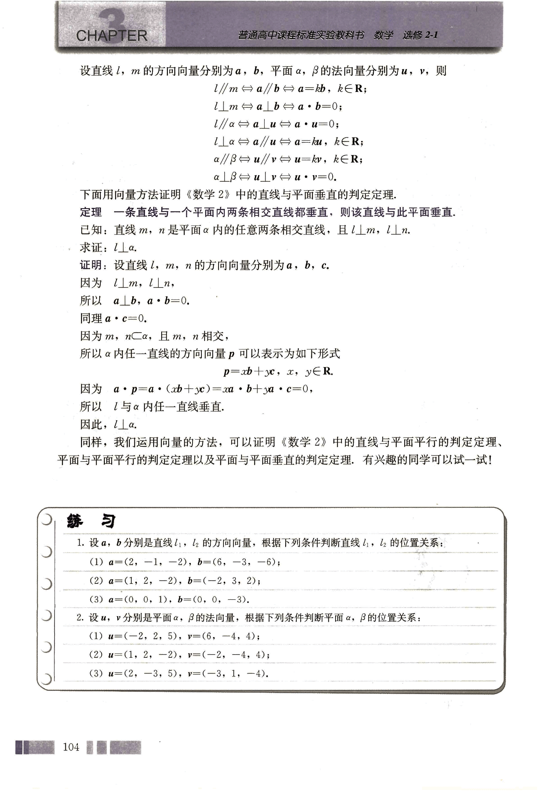
110

# 第三章 空间向量与立体几何

立体几何要解决的主要问题是空间图形的形状、大小及其位置关系，其中点到直线、点到平面之间的距离问题以及直线与直线、直线与平面、平面与平面之间的夹角问题是立体几何研究的重要问题，空间向量的运算，特别是数量积涉及向量的模以及向量之间的夹角。像前面说的那样，我们可以把点、直线、平面用向量表示，然后利用向量的运算（特别是数量积）解决点、直线、平面之间的夹角与长度等问题。

类似用平面向量解决平面几何问题的“三步曲”，我们可以得出用空间向量解决立体几何问题的“三步曲”：

(1) 建立立体图形与空间向量的联系，用空间向量表示问题中涉及的点、直线、平面，把立体几何问题转化为向量问题；

(2) 通过向量运算，研究点、直线、平面之间的位置关系以及它们之间距离和夹角等问题；

(3) 把向量的运算结果“翻译”成相应的几何意义。

## 例 1

如图 3.2-3，一个结晶体的形状为平行六面体，其中，以顶点 A 为端点的三条棱长都相等，且它们彼此的夹角都是 60°，那么以这个顶点为端点的晶体的对角线的长与棱长有什么关系？

[图 3.2-3](images/3.2-3.png)

**分析：**如图 3.2-3，由于平行六面体的棱之间具有平行关系，所以以 A 为起点的三个向量可以将各棱用向量形式表示。根据题设，不妨设这三个向量的模都等于 1。为了求出对角线$AC_1$的长，可以将$AC_1$用与棱相关的向量表示出来。

**解：**如图 3.2-3，设$AB = AA_1 = AD = 1$，$\angle BAD = \angle BAA_1 = \angle DAA_1 = 60°$。

**化为向量问题**

根据向量的加法法则，$AC_1 = AB + AD + AA_1$。

**进行向量运算**

$AC_1^2 = (AB + AD + AA_1)^2$

$= AB^2 + AD^2 + AA_1^2 + 2(AB \cdot AD + AB \cdot AA_1 + AD \cdot AA_1)$

$= 1 + 1 + 1 + 2(\cos 60° + \cos 60° + \cos 60°)$

$= 6$。

**所以**

$|AC_1| = \sqrt{6}$。

**回到图形问题**

这个晶体的对角线$AC_1$的长是棱长的$\sqrt{6}$倍。

105

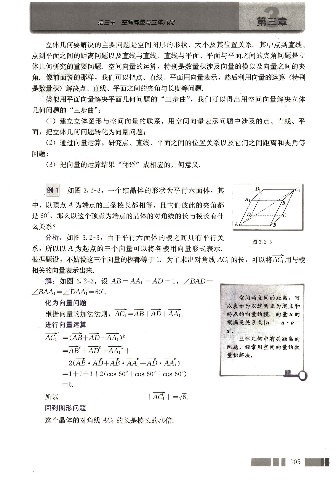
111

# CHAPTER 3

## 思考

1. 本题中平行六面体的对角线 BD 的长与棱长有什么关系？
2. 如果一个平行六面体的各条棱长都相等，并且以某一顶点为端点的各棱间的夹角都等于 α，那么由这个平行六面体的对角线的长可以确定棱长吗？
3. 本题的晶体中相对的两个面之间的距离是多少？（提示：求两个平行平面间的距离，通常归结为求两点间的距离）

## 例 2

如图 3.2-4，甲站在水库底面上的点 A 处，乙站在水坝斜面上的点 B 处，从 A，B 到直线 l（库底与水坝的交线）的距离 AC 和 BD 分别为 a 和 b，CD 的长为 c，AB 的长为 d. 求库底与水坝所成二面角的余弦值.

**分析:** 所求二面角的平面角就是图 3.2-4 中直线 AC, BD 所成的角或它的补角（想一想，为什么？），因此，我们首先根据题设，用向量表示线段 AC 与 BD 的方向，然后利用向量的数量积求出这个角.

**解:** 如图 3.2-4，AC=a, BD=b, CD=c, AB=d.

**化为向量问题**

根据向量的加法法则，AB=AC+CD+DB.

**进行向量运算**

$d^2 = AB^2 = (AC+CD+DB)^2$

$= AC^2 + CD^2 + DB^2 + 2(AC \cdot CD + AC \cdot DB + CD \cdot DB)$

$= a^2 + c^2 + b^2 + 2AC \cdot DB$

$= a^2 + c^2 + b^2 - 2CA \cdot DB$.

于是，得

$2CA \cdot DB = a^2 + b^2 + c^2 - d^2$.

设向量 CA 与 DB 的夹角为 θ，θ 就是库底与水坝所成的二面角.

因此

$2ab \cos θ = a^2 + b^2 + c^2 - d^2$.

所以

**回到图形问题**

库底与水坝所成二面角的余弦值为 $\frac{a^2 + b^2 + c^2 - d^2}{2ab}$.

106

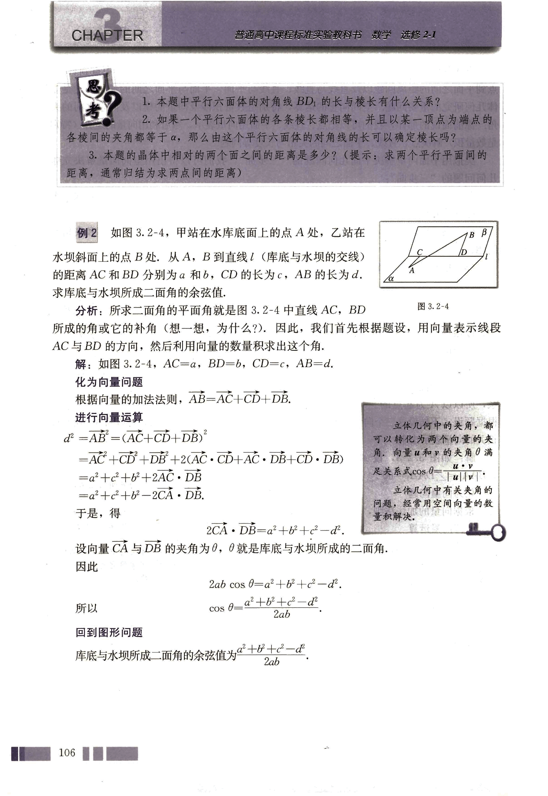
112

# 第三章 空间向量与立体几何

## 思考

1. 本题中如果夹角 θ 可以测出，而 AB 未知，其他条件不变，可以计算出 AB 的长吗？
2. 如果已知一个平行六面体的各棱长和一条对角线的长，并且以同一顶点为端点的各棱间的夹角都相等，那么可以确定各棱之间夹角的余弦值吗？
3. 如果已知一个平行六面体的各棱长都等于 _a_，并且以某一顶点为端点的各棱间的夹角都等于 θ，那么可以确定这个平行六面体相邻两个面夹角的余弦值吗？

## 练习

1. 如图，正方体 ABCD-A₁B₁C₁D₁ 中，点 E，F 分别是 BB₁，CD 的中点，求证：DF⊥ 平面 ADE。

[image1](images/image1.png)

2. 如图，60° 的二面角的棱上有 A，B 两点，直线 AC，BD 分别在这个二面角的两个半平面内，且都垂直于 AB。已知 AB=4，AC=6，BD=8，求 CD 的长。

[image2](images/image2.png)

## 例 3

如图 3.2-5，一块均匀的正三角形面的钢板的质量为 500 kg，在它的顶点处分别受力 $F_1$，$F_2$，$F_3$，每个力与同它相邻的三角形的两边之间的角都是 60°，且 $|F_1| = |F_2| = |F_3| = 200 kg$。这块钢板在这些力的作用下将会怎样运动？这三个力最小为多少时，才能提起这块钢板？

**分析：**钢板所受重力的大小为 500 kg，垂直向下作用在三角形的中心 O。如果能将各顶点处所受的力$F_1$，$F_2$，$F_3$用向量形式表示，求出其合力，就能判断钢板的运动状态。

**解：**如图 3.2-6，以点 A 为原点，平面 ABC 为 xAy 坐标平面，AB 方向为 y 轴正方向，|AB|为 y 轴的单位长度，建立空间直角坐标系 Axyz，则正三角形的顶点坐标分别为
A(0, 0, 0), B(0, 1, 0), $C(-\frac{\sqrt{3}}{2}, \frac{1}{2}, 0)$。

[image3](images/image3.png)

107

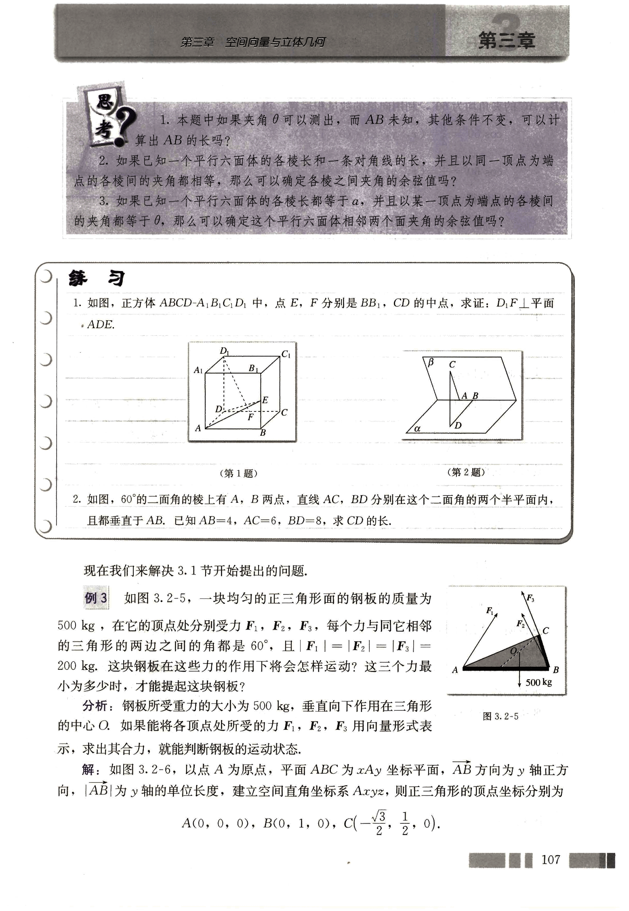
113

# CHAPTER 3

## 普通高中课程标准实验教科书 数学选修 2-1

设力 $\vec{F_1}$ 方向上的单位向量坐标为 $(x, y, z)$，由于 $\vec{F_1}$ 与 AB，AC 的夹角均为 60°，利用向量的数量积运算，得

$\cos 60° = \frac{1}{2} = (x, y, z) \cdot (0, 1, 0)$ ①

$\cos 60° = \frac{1}{2} = (x, y, z) \cdot (-\frac{\sqrt{3}}{2}, \frac{1}{2}, 0)$ ②

由 ①，② 解得

$x = -\sqrt{\frac{1}{12}}, y = \frac{1}{2}, z = \frac{\sqrt{\frac{2}{3}}}{}$

注意到向量 $(x, y, z)$ 是单位向量，$x^2 + y^2 + z^2 = 1$，因此

$z = \sqrt{\frac{2}{3}}$

于是

$F_1 = 200(-\sqrt{\frac{1}{12}}, \frac{1}{2}, \sqrt{\frac{2}{3}})$

类似地，可以求出

$F_2 = 200(-\sqrt{\frac{1}{12}}, -\frac{1}{2}, \sqrt{\frac{2}{3}})$

$F_3 = 200(\sqrt{\frac{1}{3}}, 0, \sqrt{\frac{2}{3}})$

这样，它们的合力

$F_1 + F_2 + F_3$

$= 200[(-\sqrt{\frac{1}{12}}, \frac{1}{2}, \sqrt{\frac{2}{3}}) + (-\sqrt{\frac{1}{12}}, -\frac{1}{2}, \sqrt{\frac{2}{3}}) + (\sqrt{\frac{1}{3}}, 0, \sqrt{\frac{2}{3}})]$

$= 200(0, 0, \sqrt{6})$

这说明，作用在钢板上的合力方向向上，大小为 $200\sqrt{6} kg$，作用点为 O。

由于

$200\sqrt{6} < 500$

所以钢板仍静止不动。

要提起这块钢板，设 $|F_1|, |F_2|, |F_3|$ 均为 x，则需

$\sqrt{6}x > 500$

解得

$x > \frac{500}{\sqrt{6}}$

因此，要提起这块钢板，$|F_1|, |F_2|, |F_3|$ 均要大于 $\frac{500}{\sqrt{6}} kg$。

[图 3.2-6](images/3.2-6.png)

108

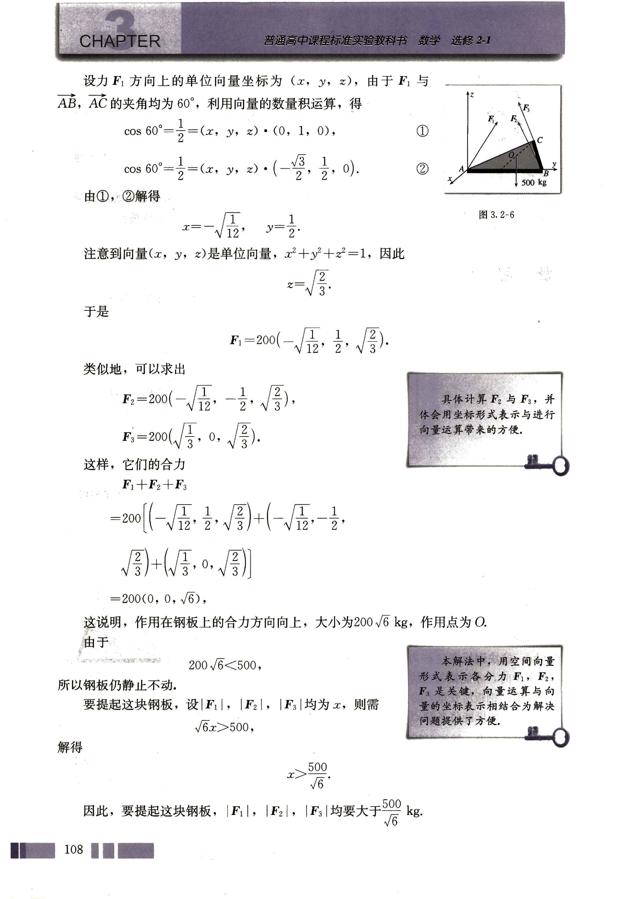
114

# 第三章 空间向量与立体几何

## 探究

不建立坐标系，如何解决这个问题？

## 例 4

如图 3.2-7，在四棱锥 P-ABCD 中，底面 ABCD 是正方形，侧棱 PD⊥ 底面 ABCD，PD=DC，点 E 是 PC 的中点，作 EF⊥PB 交 PB 于点 F.

(1)求证：PA//平面 EDB；
(2)求证：PB⊥ 平面 EFD；
(3)求二面角 C-PB-D 的大小.

[图 3.2-7](images/3.2-7.png)

分析：本题涉及的问题包括：判定直线与平面平行和垂直，计算二面角的大小，这些问题都可以利用向量方法解决。由于已知条件中四棱锥的底面是正方形，一条侧棱垂直于底面，所以非常适合建立空间直角坐标系表示向量。

解：如图 3.2-8 所示建立空间直角坐标系，点 D 为坐标原点，设 DC=1.

(1)证明：连接 AC，AC 交 BD 于点 G，连接 EG.
依题意得 A(1, 0, 0), P(0, 0, 1), E(0, $\frac{1}{2}$, $\frac{1}{2}$).
因为底面 ABCD 是正方形，所以点 G 是此正方形的中心，故点 G 的坐标为($\frac{1}{2}$, $\frac{1}{2}$, 0)，且
$\vec{PA}$=(1, 0, -1), $\vec{EG}$=($\frac{1}{2}$, 0, -$\frac{1}{2}$).
所以$\vec{PA}$=2$\vec{EG}$，即 PA//EG.
而 EG⊂ 平面 EDB，且 PA⊂ 平面 EDB，
因此 PA//平面 EDB.

(2)证明：依题意得
B(1, 1, 0), $\vec{PB}$=(1, 1, -1).
又$\vec{DE}$=(0, $\frac{1}{2}$, $\frac{1}{2}$), 故
$\vec{PB}$·$\vec{DE}$=0+$\frac{1}{2}$-$\frac{1}{2}$=0.
所以 PB⊥DE.
由已知 EF⊥PB，且 EF∩DE=E,

[图 3.2-8](images/3.2-8.png)

109

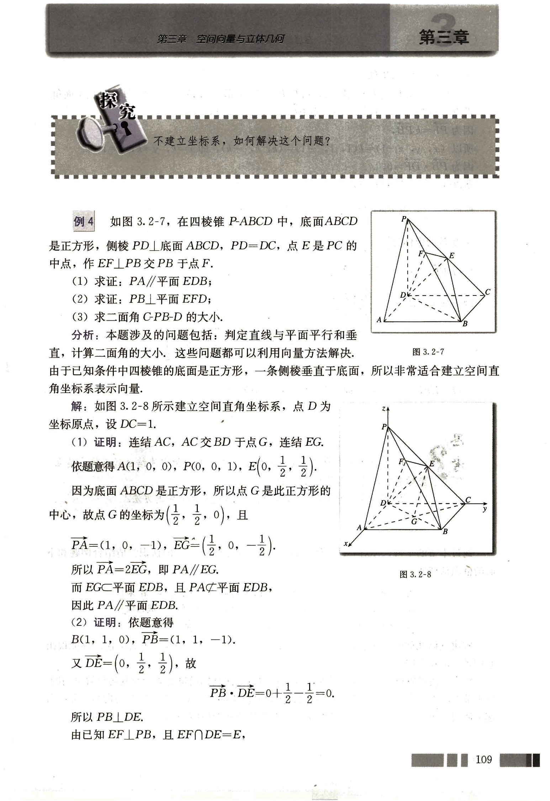
115

# CHAPTER 3

所以 PB⊥ 平面 EFD.

(3) **解:** 已知 PB⊥EF，由 (2) 可知 PB⊥DF，故 ∠EFD 是二面角 C-PB-D 的平面角.

设点 F 的坐标为 (x, y, z)，则 PF = (x, y, z - 1).

因为 PF = kPB，

所以 (x, y, z - 1) = k(1, 1, -1) = (k, k, -k)，即 x = k, y = k, z = 1 - k.

因为 PB · DF = 0，

所以 (1, 1, -1) · (k, k, 1 - k) = k + k - 1 + k = 3k - 1 = 0.

所以 k = $\frac{1}{3}$，点 F 的坐标为 ($\frac{1}{3}$, $\frac{1}{3}$, $\frac{2}{3}$).

又点 E 的坐标为 (0, $\frac{1}{2}$, $\frac{1}{2}$),

所以 FE = (-$\frac{1}{3}$, $\frac{1}{6}$, -$\frac{1}{6}$).

因为 cos∠EFD = $\frac{FE \cdot FD}{|FE||FD|}$

= (-$\frac{1}{3}$, $\frac{1}{6}$, -$\frac{1}{6}$) · (-$\frac{1}{3}$, $\frac{1}{3}$, $\frac{2}{3}$) = $\frac{\frac{1}{3}}{\frac{\sqrt{6}}{6} \cdot \frac{\sqrt{6}}{3}}$ = $\frac{1}{2}$,

所以 ∠EFD = 60°，即二面角 C-PB-D 的大小为 60°.

## 思考

1. 体会例 4 中的方法是怎样把坐标方法与向量方法结合起来的，建立坐标系在解题中起了什么作用？
2. 用综合法怎样解例 4，试比较综合法与例 4 中的方法.

通过本节的学习，你对立体几何中的向量方法是否有了一定的认识？请结合例题和下面的框图谈谈体会。

| 用空间向量表示立体图形中点、直线、平面等元素 | →   | 进行空间向量的运算，研究点、直线、平面之间的关系 | →   | 把运算结果“翻译”成相应的几何意义 |
| -------------------------------------------- | --- | ------------------------------------------------ | --- | -------------------------------- |

解决立体几何中的问题，可用三种方法：综合方法、向量方法、坐标方法，你能说出它们各自的特点吗？

综合方法以逻辑推理作为工具解决问题；向量方法利用向量的概念及其运算解决问题，如本节的例 1、例 2；坐标方法利用数及其运算来解决问题，坐标方法经常与向量运算结合起来使用，如本节的例 3 对于具体的问题，应根据它的具体条件和特点选择合适的方法.

110

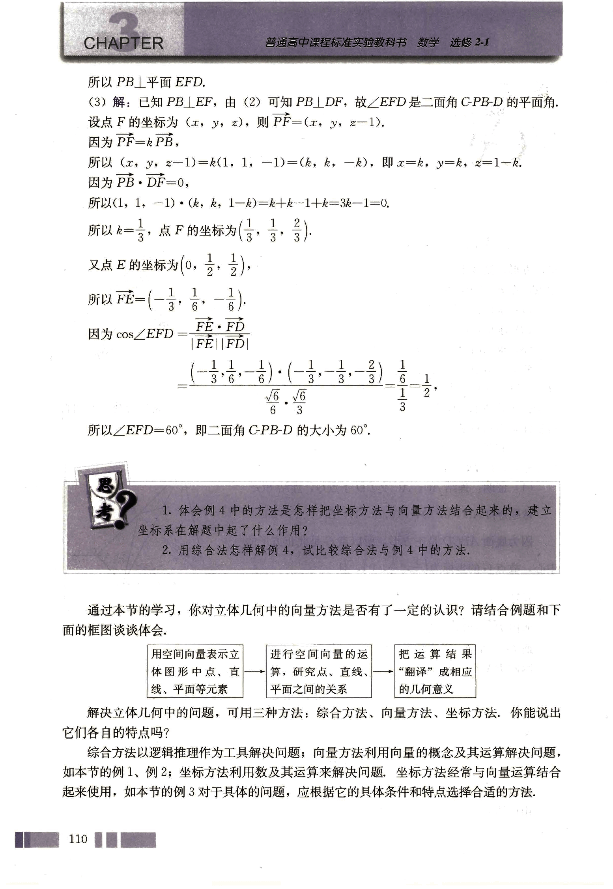
116

# 第三章 空间向量与立体几何

## 练习

1. 如图，空间四边形 ABCD 的每条边和 AC，BD 的长都等于 a，点 M，N 分别是 AB，CD 的中点，求证：MN⊥AB，MN⊥CD。

2. 如图，两条异面直线 a，b 所成的角为 θ，在直线 a，b 上分别取点 A’，E 和点 A，F，使 AA’⊥a，且 AA’=l (AA’称为异面直线 a，b 的公垂线)，已知 AE=m，AF=n，EF=l，求公垂线 AA’的长。

3. 如图，已知正方体 ABCD-A’B’C’D’，BC’和 CB’相交于点 O，连结 DO，求证：DO⊥BC’.

## 习题 3.2 A 组

1. 如图，点 M，N 分别是正方体 ABCD-A’B’C’D’的棱 BB’和 B’C’的中点，求：
   (1) MN 和 CD’所成角的大小；
   (2) MN 和 AD 所成角的大小。

111

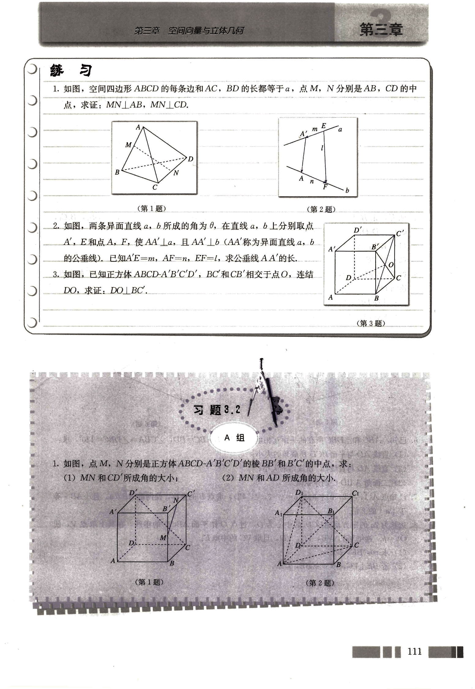
117

# CHAPTER 3

2. 如图，已知正方体 ABCD-A₁B₁C₁D₁，求证：DB₁⊥ 平面 ACD₁.

3. 如图，已知空间四边形 OABC 中，OB=OC，∠AOB=∠AOC=θ，求证：OA⊥BC.

4. 如图，正方体 ABCD-A₁B₁C₁D₁ 中，点 E、F、G、H、K、L 分别是 AB、BB₁、B₁C₁、C₁D₁、D₁D、DA 各棱的中点。

(1) 求证：A₁C⊥ 平面 EFGHKL；

(2) 求 DB₁ 与平面 EFGHKL 所成角的余弦值.

5. 如图，空间四边形 OABC 各边以及 AC，BO 的长都是 1，点 D，E 分别是边 OA，BC 的中点，连结 DE.

(1) 计算 DE 的长；

(2) 求点 O 到平面 ABC 的距离.

6. 已知 △ABC 和 △DBC 所在的平面互相垂直，且 AB=BC=BD，∠CBA=∠DBC=120°，求：

(1) 直线 AD 与平面 BCD 所成角的大小；

(2) 直线 AD 与直线 BC 所成角的大小；

(3) 二面角 A-BD-C 的余弦值.

7. 已知点 A(1，-2，0)和向量$\vec{a}$=(-3, 4, 12)，求点 B 的坐标，使向量$\vec{AB}$//$\vec{a}$，且|AB|等于$\vec{a}$的 2 倍.

8. 边长为 2a 的正方形 ABCD 的中心为 O，过点 O 作平面 ABCD 的垂线，在其上取点 V，使 OV=h. 连结 VA，VB，VC，VD，且取 VC 的中点 E.

(1) 求 cos∠(BE, DE)；

(2) 若 BE⊥VC，求 cos∠(BE, DE).

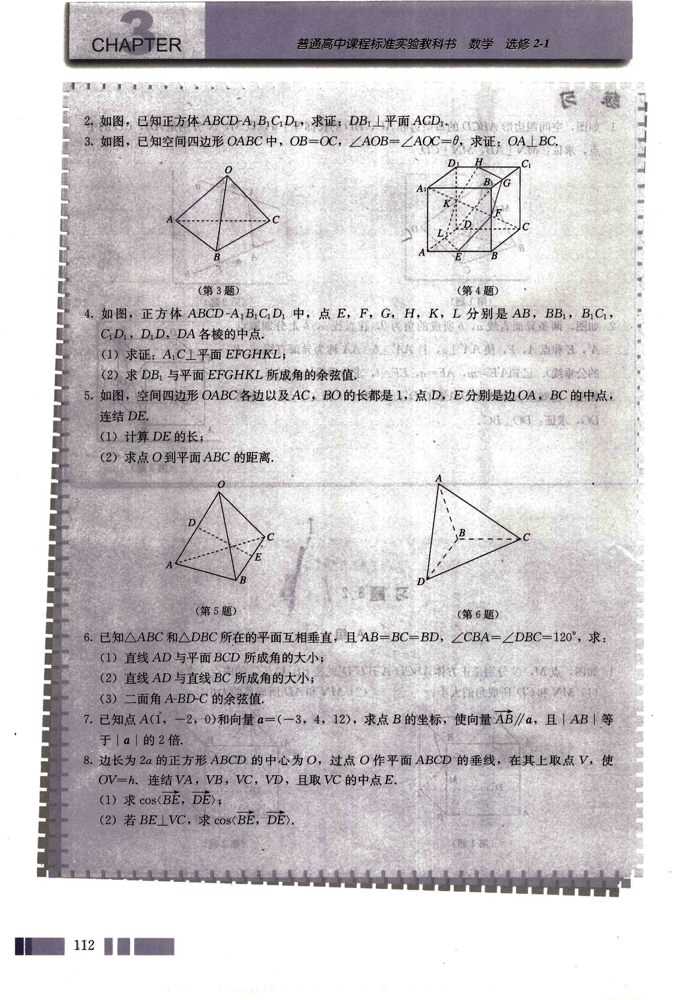
118

# 第三章 空间向量与立体几何

## 9.

如图,正方体 ABCD-A₁B₁C₁D₁ 的棱长为 1，点 M 是棱 AA₁ 的中点，点 O 是 BD₁ 的中点，求证：OM 是异面直线 AA₁ 与 BD₁ 的公垂线，并求 OM 的长。

## 10.

如图，线段 AB 在平面 α 内，线段 AC⊥α，线段 BD⊥AB，且 AB=7，AC=BD=24，CD=25，求线段 BD 与平面 α 所成的角。

## 11.

在直三棱柱(侧棱垂直于底面的三棱柱)ABO-A'B'O'中，OO'=4，OA=4，OB=3，∠AOB=90°。点 D 是线段 A'B'的中点，点 P 是侧棱 BB'上的一点，且 OP⊥BD，求 OP 与底面 AOB 所成角的正切值。

## 12.

一条线段夹在一个直二面角的两个半平面内，它与两个半平面所成的角都是 30°，求这条线段与这个二面角的棱所成角的大小。

## B 组

## 1.

如图，四面体 DABC 中，AB，BC，BD 两两垂直，且 AB=BC=2，点 E 是 AC 中点；异面直线 AD 与 BE 所成角为 θ，且$cos θ = \frac{\sqrt{10}}{10}$，求四面体 DABC 的体积。

## 2.

在如图的试验装置中，正方形框架的边长都是 1，且平面 ABCD 与平面 ABEF 互相垂直，活动弹子 M，N 分别在正方形对角线 AC 和 BF 上移动，且 CM 和 BN 的长度保持相等，记 CM=BN=a (0<a<√2)。

(1) 求 MN 的长；

(2) a 为何值时，MN 的长最小？

(3) 当 MN 的长最小时，求面 MNA 与面 MNB 所成二面角的余弦值。

113

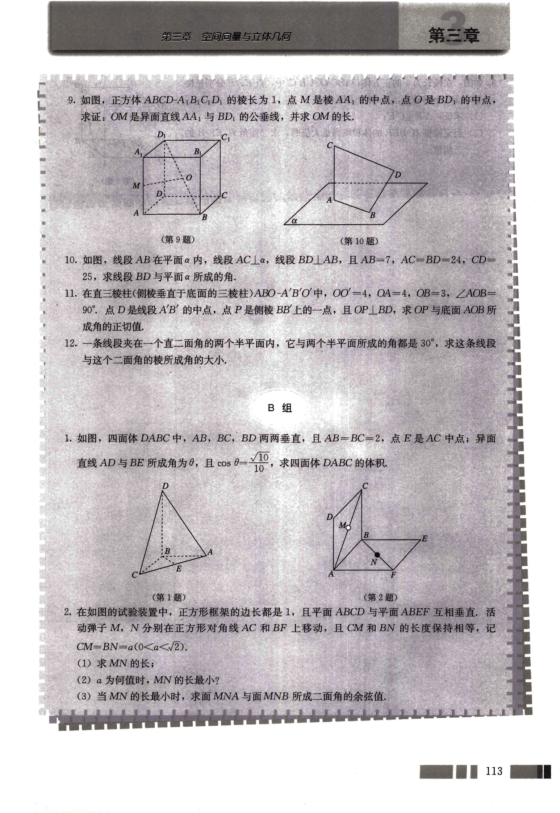
119

# CHAPTER 3

3. 如图，在棱长为 $a$ 的正方体 OABC-O'A'B'C' 中，点 E，F 分别是棱 AB，BC 上的动点，且 AE=BF.

(1) 求证：A'F ⊥ CE；

(2) 当三棱锥 B'-BEF 的体积取得最大值时，求二面角 B'-EF-B 的正切值。

114

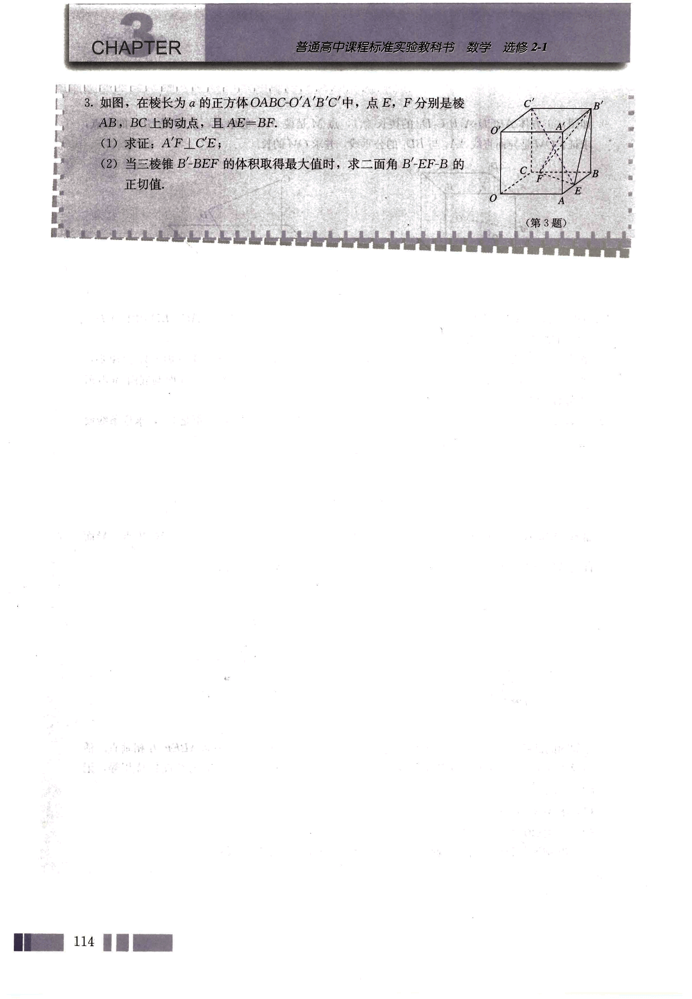
120

# 第三章 空间向量与立体几何

## 小结

### 一、本章知识结构

```mermaid
graph LR
    A[空间向量的定义及其运算] --> B(空间向量运算的几何意义(如平行四边形法则))
    B --> C{建立空间图形与空间向量的联系}
    B --> D{利用空间向量的运算解决立体几何中的问题}
    A --> E{用空间向量表示点、直线、平面等元素}
    E --> B
    B --> F(空间向量运算的坐标表示(加法、减法、数乘、数量积))
```

### 二、回顾与思考

1. 空间向量由平面向量推广而来，空间向量与平面向量有许多共同性质。如果我们把平面看成二维空间，把普通的空间看成三维空间，我们能不能把向量的概念推广到四维（例如由“长”、“宽”、“高”、“时间”等四个维度构成的空间）、五维……等“空间”中去呢？

2. 空间向量的运算法则是用几何方式引入的，如向量加法的平行四边形法则。在空间直角坐标系中，我们还可以把由几何方式引入的向量运算转化成代数运算（实数运算），你能体会这样给空间向量运算带来的方便吗？

3. 同学们已经习惯于数的运算，向量与数量不同，但它也构成一个运算体系。要从“数、量与运算”发展的角度理解向量，对比关于数的运算律，哪些对于向量的运算仍然成立，哪些不成立？

4. 利用空间向量解决立体几何中的问题，首先要探索如何用空间向量来表示点、直线、平面在空间的位置以及它们之间的关系，也就是说，要建立立体图形与向量之间的联系，然后将立体几何问题转化为空间向量问题。通过本章的学习，你对立体几何中的向量方法有怎样的认识？请结合复习参考题中的具体例子谈谈你的体会。

5. 回想一下这一章的学习过程，你对学习数学新知识、应用数学知识解决问题的思想和方法有怎样的认识？结合下面的逻辑框图谈谈你的体会。

115

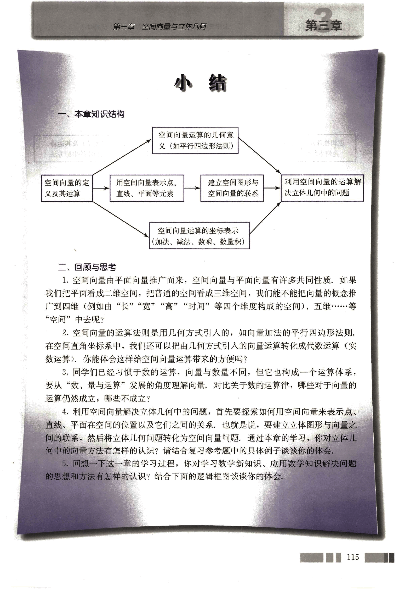
121

# CHAPTER 3

## n 维向量及其应用，在 n 维欧氏空间中的应用

```mermaid
graph LR
A[逻辑推理及几何直观，几何中的综合方法] --> B(类比);
B --> C[空间向量及其运算，立体几何中的向量方法];
C --> D(类比);
D --> E[数(变量)及其运算，几何中的坐标方法];
C --> F(特殊化);
F --> G[平面向量及其运算，平面几何中的向量方法];

```

116

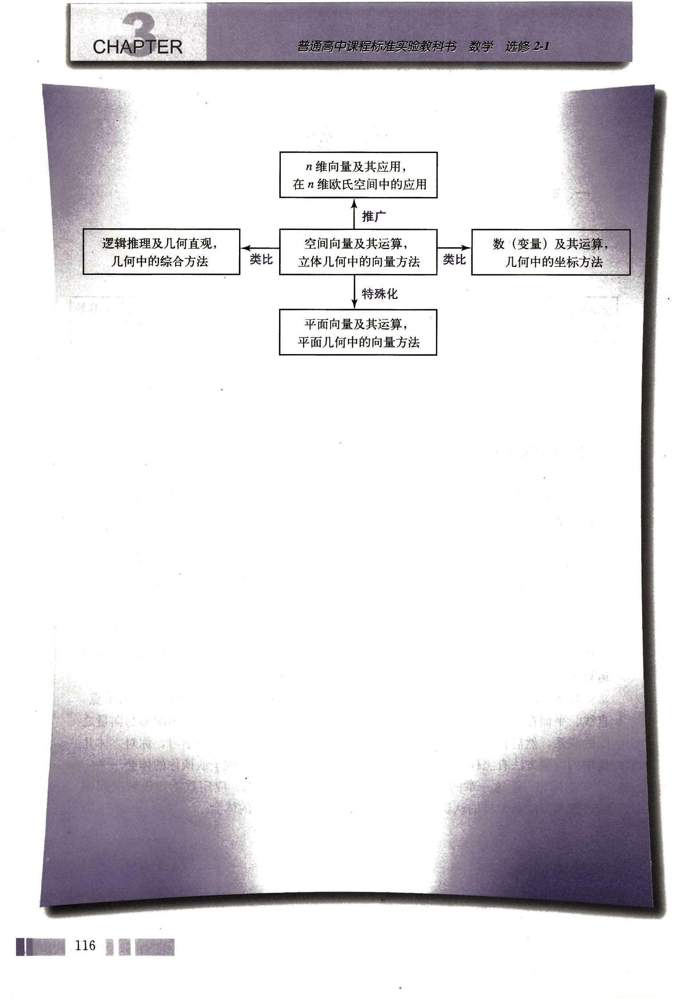
122

# 复习参考题

## A 组

1.如图,空间四边形 OABC 中,OA=$\vec{a}$, OB=$\vec{b}$, OC=$\vec{c}$.点 M 在 OA 上,且 OM=2MA,点 N 为 BC 中点,则 MN 等于( )
(A) $\frac{1}{2}\vec{a}$-$\frac{1}{3}\vec{b}$+$\frac{1}{2}\vec{c}$ (B) -$\frac{2}{3}\vec{a}$+$\frac{1}{2}\vec{b}$+$\frac{1}{2}\vec{c}$
(C) $\frac{2}{3}\vec{a}$+$\frac{1}{2}\vec{b}$-$\frac{1}{2}\vec{c}$ (D) $\frac{2}{3}\vec{a}$+$\frac{2}{3}\vec{b}$-$\frac{1}{2}\vec{c}$

[第 1 题](images/1.png)
[第 2 题](images/2.png)

2.如图,平行六面体 ABCD-A'B'C'D'中,AB=$\vec{a}$, AD=$\vec{b}$, AA'=$\vec{c}$.点 P,M,N 分别是 CA',CD',C'D'的中点,点 Q 在 CA'上,且 CQ:QA'=4:1,用基底{$\vec{a}$,$\vec{b}$,$\vec{c}$}表示下列向量:
(1) AP; (2) AM; (3) AN; (4) AQ.

[第 3 题](images/3.png)
[第 4 题](images/4.png)

3.如图,在直三棱柱 ABC-A₁B₁C₁ 中,∠ABC=90°, CB=1, CA=2, AA₁=√6,点 M 是 CC₁ 的中点,求证:AM⊥BA₁.

4.如图,正三棱柱(底面是正三角形的直棱柱)ABC-A₁B₁C₁ 的底面边长为$a$,侧棱长为 √2$a$.
(1)试建立适当的坐标系,并写出点 A,B,A₁,C₁ 的坐标;
(2)求 AC₁ 与侧面 ABB₁A₁ 所成的角.

5.已知空间三点 A(0,2,3), B(-2,1,6), C(1,-1,5).
(1)求以 AB,AC 为边的平行四边形的面积;
(2)若向量$\vec{a}$分别与 AB,AC 垂直,且|$\vec{a}$|=√3,求$\vec{a}$的坐标.

117

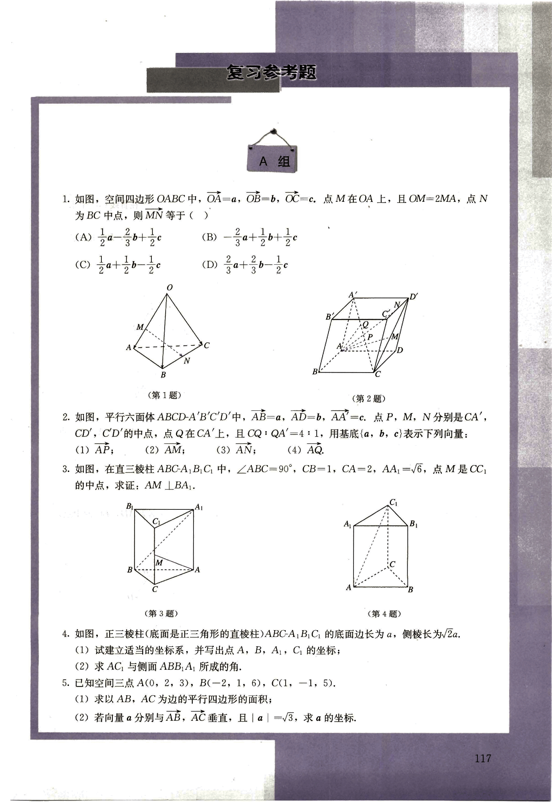
123

# 数学试卷

6. 设空间两个单位向量 $\overrightarrow{OA} = (m, n, 0)$，$\overrightarrow{OB} = (0, n, p)$ 与向量 $\overrightarrow{OC} = (1, 1, 1)$ 的夹角都等于 $\frac{\pi}{4}$，求 $\cos\angle AOB$ 的值.

7. 已知向量 $a = (1, 1, 0)$，$b = (-1, 0, 2)$，且 $ka + b$ 与 $2a - b$ 互相垂直，则 $k$ 的值是 ( )
   (A) 1 (B) $\frac{1}{5}$ (C) $\frac{3}{5}$ (D) $\frac{7}{5}$

8. 已知 $a = (1 - t, 2t - 1, 0)$，$b = (2, t, t)$，则 $|b - a|$ 的最小值是 ( )
   (A) $\sqrt{5}$ (B) $\sqrt{6}$ (C) $\sqrt{2}$ (D) $\sqrt{3}$

9. 正三棱柱 ABC-A₁B₁C₁ 的侧棱长为 2，底面边长为 1，点 M 是 BC 的中点，在直线 CC₁ 上求一点 N，使 MN⊥AB₁.

10. 如图，在棱长为 1 的正方体 ABCD-A₁B₁C₁D₁ 中，点 E，F，G 分别是 DD₁，BD，BB₁ 的中点.
    (1) 求证：EF⊥CF；
    (2) 求 EF 与 CG 所成角的余弦值；
    (3) 求 CE 的长.

[第 10 题](images/10.png)

11. 如图，在直三棱柱 ABC-A₁B₁C₁ 的底面 ABC 中，CA = CB = 1，∠BCA = 90°，AA₁ = 2，点 M，N 分别是 A₁B₁，AA₁ 的中点.
    (1) 求 BN 的长；
    (2) 求 $\cos\langle \overrightarrow{BA_1}, \overrightarrow{CB_1} \rangle$ 的值；
    (3) 求证：A₁B₁⊥CM.

[第 11 题](images/11.png)

12. 如图，把正方形纸片 ABCD 沿对角线 AC 折成直二面角，点 E，F 分别为 AD，BC 的中点，点 O 是原正方形 ABCD 的中心，求折纸后的 ∠EOF 大小.

[第 12 题](images/12.png)

13. 如图，点 E，F，G，H 分别是空间四边形 ABCD 的边 AB，BC，CD，DA 的中点.
    (1) 求证：E，F，G，H 四点共面；
    (2) 求证：BD∥ 平面 EFGH；

[第 13 题](images/13.png)

118

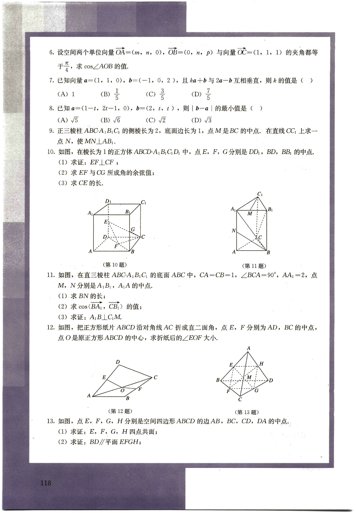
124

# B 组

1. 如图，平行六面体 ABCD-A'B'C'D'中，底面 ABCD 是边长为 a 的正方形，侧棱 AA'的长为 b，且 ∠A'AB=∠A'AD=120°。求：(1)AC 的长；(2)直线 BD'与 AC 夹角的余弦值。

2. 如图，长方体 ABCD-A₁B₁C₁D₁ 中，点 E，F 分别在 BB₁，DD₁ 上，且 AE⊥A₁B，AF⊥A₁D。

(1) 求证：A₁C⊥ 平面 AEF；

(2) 当 AB=4，AD=3，AA₁=5 时，求平面 AEF 与平面 D₁B₁BD 所成的角的余弦值。

3. 如图，在四棱锥 S-ABCD 中，底面 ABCD 是直角梯形，AB 垂直于 AD 和 BC，侧棱 SA⊥ 底面 ABCD，且 SA=AB=BC=1，AD=0.5.

(1) 求四棱锥 S-ABCD 的体积；

(2) 求面 SCD 与面 SAB 所成二面角的大小。

119

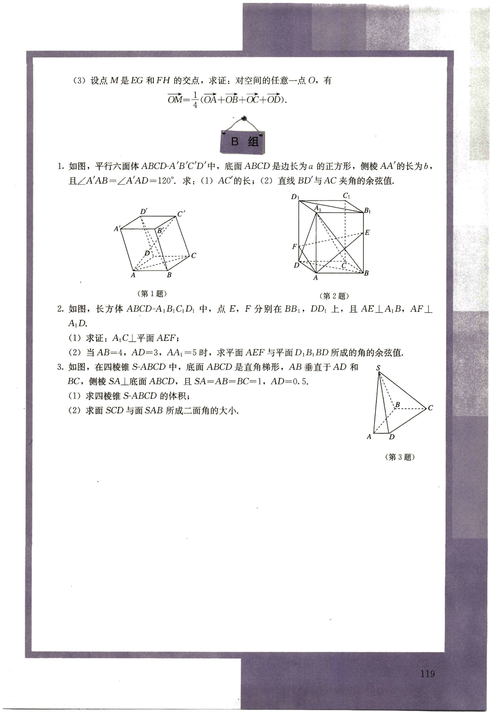
