# 选修2-3

1 

# 普通高中课程标准实验教科书
## 数学

### 选修 2-3

人民教育出版社 课程教材研究所 编著

中学数学课程教材研究开发中心

[laptop](images/laptop.png)

经全国中小学教材审定委员会
2005年初审通过

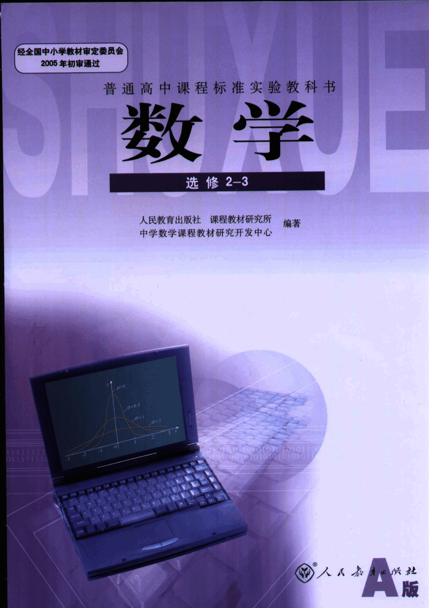
2 

# 本书部分数学符号

$A_m^n$ 从 $n$ 个不同元素中取出 $m$ 个元素的排列数

$C_n^m$ 从 $n$ 个不同元素中取出 $m$ 个元素的组合数

$n!$  $n$ 的阶乘

$\Omega$ 基本事件的全体

$A$ 事件 A 的对立事件

$n(A)$ 事件 A 中基本事件的个数

$P(A)$ 事件 A 发生的概率

$P(B|A)$ 在事件 A 发生的条件下，事件 B 发生的条件概率

$B(n, p)$ 以 n 和 p 为参数的二项分布

$E(X)$ 随机变量 X 的均值

$D(X)$ 随机变量 X 的方差

$\sigma_X$ 随机变量 X 的标准差

$N(\mu, \sigma^2)$ 均值为 $\mu$，方差为 $\sigma^2$ 的正态分布

$(\overline{x}, \overline{y})$ 样本中心

$e$ 模型误差

$\epsilon$ 残差

$Q(a, b)$ 残差平方和

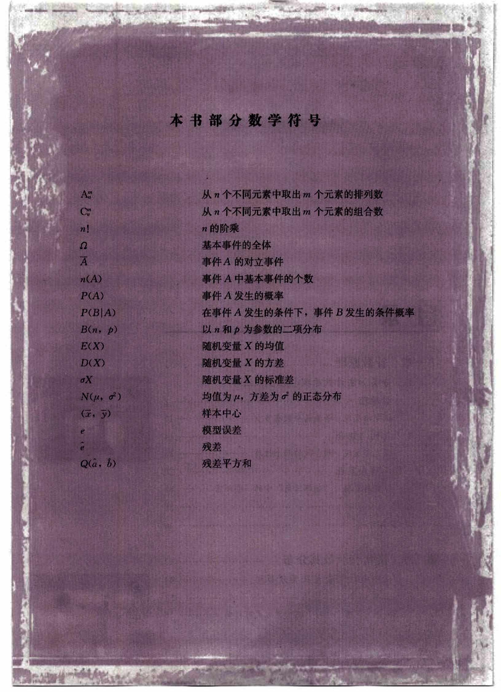
3 

# 目录

# 第一章 计数原理

1.  1

1.1 分类加法计数原理与分步乘法计数原理  2
探究与发现 子集的个数有多少 ··· 11

1.2 排列与组合  14
探究与发现 组合数的两个性质 ··· 25

1.3 二项式定理  29
探究与发现 “杨辉三角”中的一些秘密 ··· 35

小结 ··· 38
复习参考题 ··· 40

# 第二章 随机变量及其分布  43

2.1 离散型随机变量及其分布列  44

2.2 二项分布及其应用  51

阅读与思考 这样的买彩票方式可行吗  56

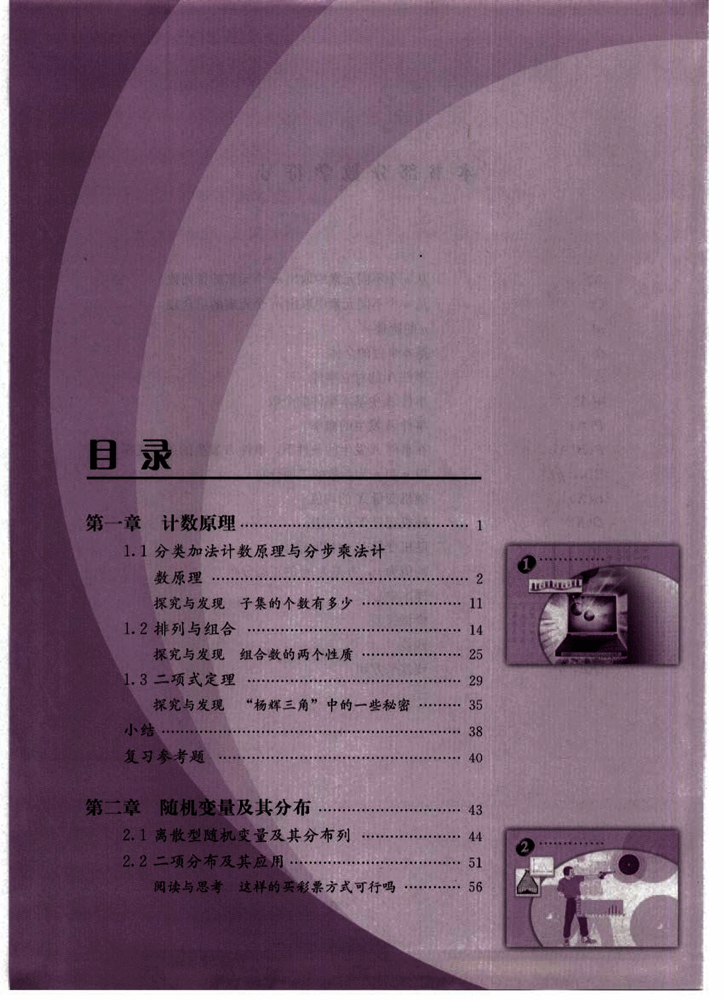
4 

# 第三章 统计案例

## 3.1 回归分析的基本思想及其初步应用

80

## 3.2 独立性检验的基本思想及其初步应用

91

实习作业…… 99

小结…… 100

复习参考题…… 101

5 

# 1

核糖核酸(RNA)分子由碱基按一定的顺序排列而成，已知碱基有4种，由成百上千个碱基组成的RNA分子的种数非常巨大，你知道它是怎么算出来的吗？

在计算机中的字符由二进制表示，英文字母和汉字所需要的字节数不一样，你知道为什么吗？

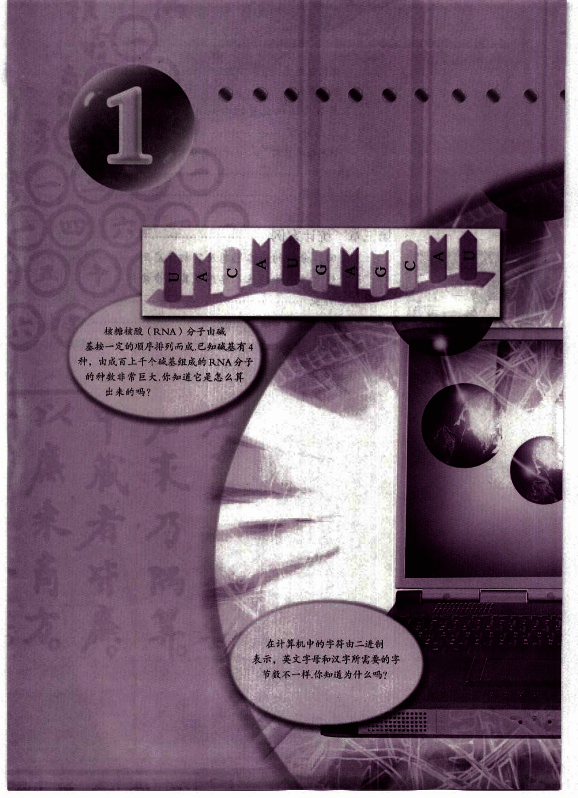
6 

# 第一章 计数原理

## 1.1 分类加法计数原理与分步乘法计数原理

## 1.2 排列与组合

## 1.3 二项式定理

汽车牌照一般从26个英文字母、10个阿拉伯数字中选出若干个,并按照适当顺序排列而成。随着人们生活水平的提高，家庭汽车拥有量迅速增长，汽车牌照号码需要扩容，另外，许多车主还希望自己的牌照“个性化”。那么，交通管理部门应如何确定汽车牌照号码的组成方法，才能满足民众的需求呢？这就需要“数出”某种汽车牌照号码组成方案下所有可能的号码数，这就是计数。日常生活、生产中类似的计数问题大量存在，例如幼儿会通过一个一个地数数的方法，计算自己拥有玩具的数量；学校要举行班际篮球比赛，在确定赛制后，体育组的老师要算一算共需要举行多少场比赛；用红、黄、绿三面旗帜组成航海信号，颜色的不同排列表示不同的信号，共可以组成多少种不同的信号………………..

虽然用列举所有各种可能性的方法，即一个一个地去数，可以求出相应的数，但当这个数很大时，列举的方法很难实施。本章所关心的是如何能不通过一个一个地数而确定出这个数。

在小学我们学了加法和乘法，这是将若干个“小的”数结合成“较大”数的最基本技巧。这种技巧经过推广就成了本章将要学习的分类加法计数原理和分步乘法计数原理，这是解决计数问题的两个最基本、最重要的方法。应用这两个计数原理，我们可以得到两类特殊计数问题的计数公式，即排列数公式和组合数公式，应用它们就可以方便地解决一些计数问题。作为计数原理与计数公式的一个应用，本章我们还将学习在数学上有广泛应用的二项式定理。

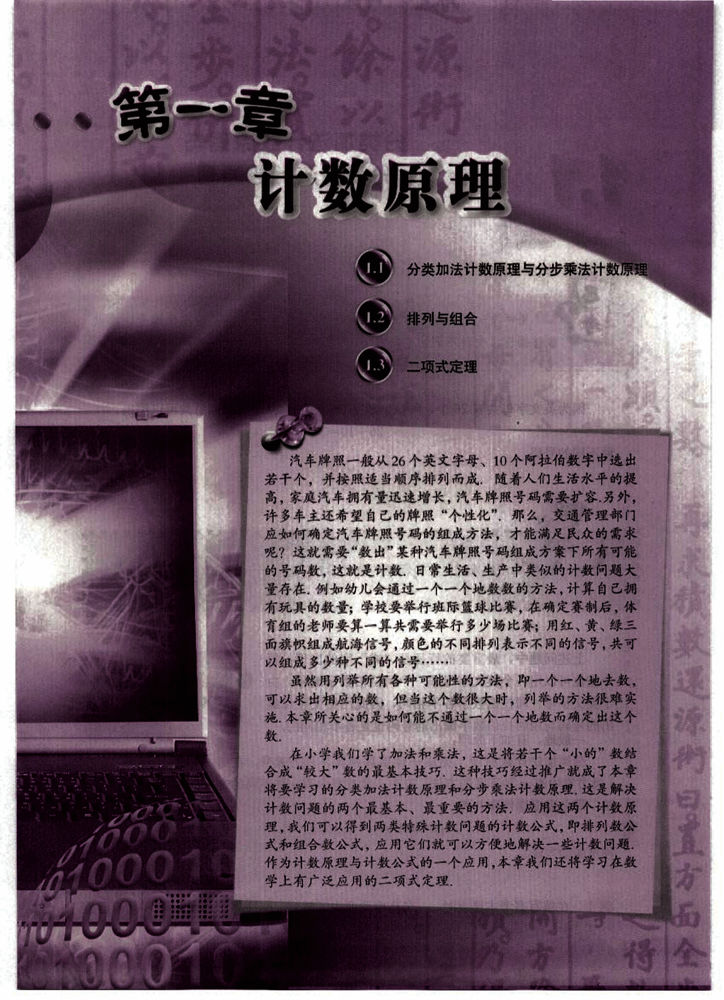
7 

# CHAPTER 1
## 1.1 分类加法计数原理与分步乘法计数原理

用一个大写的英文字母或一个阿拉伯数字给教室里的座位编号，总共能够编出多少种不同的号码？

因为英文字母共有26个，阿拉伯数字0～9共有10个，所以总共可以编出
26 + 10 = 36
种不同的号码。

你能说说这个问题的特征吗？

上述问题中，最重要的特征是“或”字的出现：每个座位可以用一个英文字母或一个阿拉伯数字编号，由于英文字母、阿拉伯数字各不相同，因此用英文字母编出的号码与用阿拉伯数字编出的号码也是各不相同的。

一般地，有如下原理：

**分类加法计数原理** 完成一件事有两类不同方案，在第1类方案中有 *m* 种不同的方法，在第2类方案中有 *n* 种不同的方法，那么完成这件事共有
$N = m + n$
种不同的方法。

你能举一些生活中类似的例子吗？

例1  在填写高考志愿表时，一名高中毕业生了解到，A，B两所大学各有一些自己感

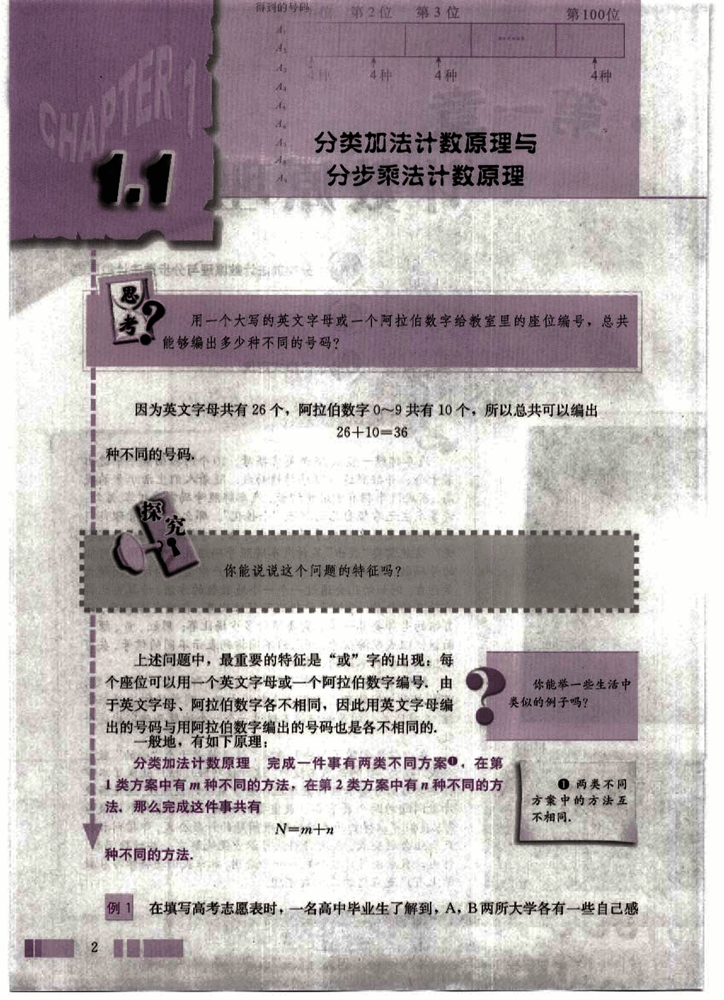
8 

# 第一章 计数原理

兴趣的强项专业，具体情况如下：

| A大学     | B大学     |
| -------- | -------- |
| 生物学     | 数学       |
| 化学       | 会计学     |
| 医学       | 信息技术学 |
| 物理学     | 法学       |
| 工程学     |           |

如果这名同学只能选一个专业，那么他共有多少种选择呢？

分析：由于这名同学在A，B两所大学中只能选择一所，而且只能选择一个专业，又由于两所大学没有共同的强项专业，因此符合分类加法计数原理的条件。

解：这名同学可以选择A，B两所大学中的一所，在A大学中有5种专业选择方法，在B大学中有4种专业选择方法，又由于没有一个强项专业是两所大学共有的，因此根据分类加法计数原理，这名同学可能的专业选择共有

5 + 4 = 9（种）。

如果完成一件事有三类不同方案，在第1类方案中有 $m_1$ 种不同的方法，在第2类方案中有 $m_2$ 种不同的方法，在第3类方案中有 $m_3$ 种不同的方法，那么完成这件事共有多少种不同的方法？

如果完成一件事情有n类不同方案，在每一类中都有若干种不同方法，那么应当如何计数呢？

用前6个大写英文字母和1～9九个阿拉伯数字，以A1，A2，…，B1，B2，…的方式给教室里的座位编号，总共能编出多少个不同的号码？

这个问题与前一问题不同。在前一问题中，用26个英文字母中的任何一个或10个阿拉伯数字中的任何一个，都可以给出一个座位号码。而在这个问题中，号码必须由一个英文字母和一个作为下标的阿拉伯数字组成，得到一个号码必须经过先确定一个英文字母，后确定一个阿拉伯数字这样两个步骤。用图1.1-1的方法可以列出所有可能的号码。

3

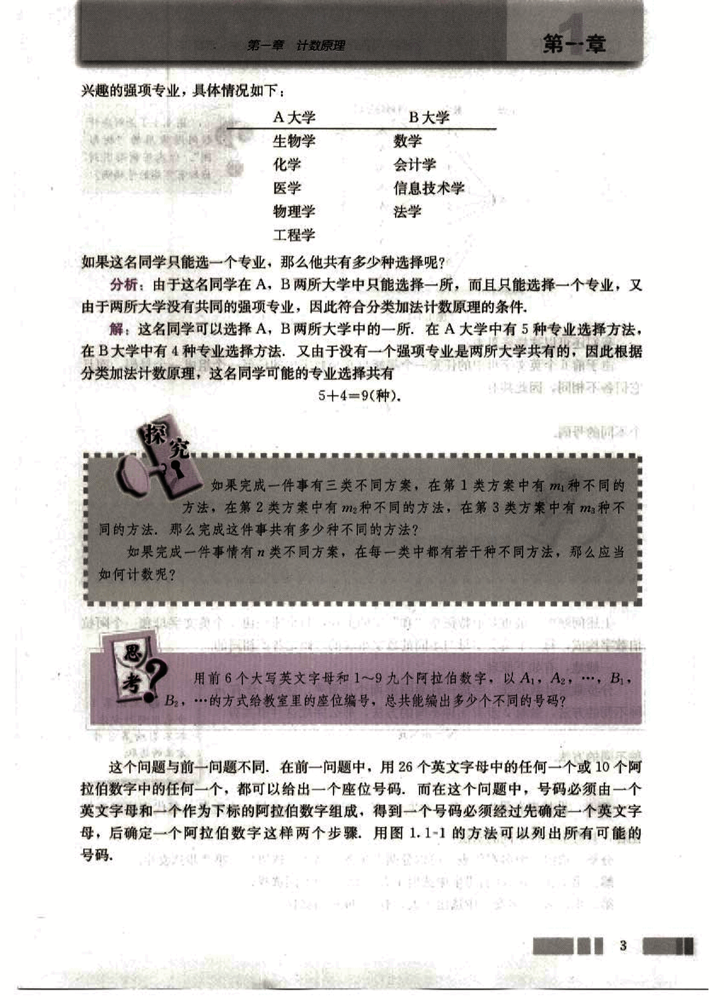
9 

# CHAPTER

普通高中课程标准实验教科书 数学 选修 2-3

## 字母 数字 得到的号码

| 字母 | 数字 | 得到的号码 |
|---|---|---|
| A | 1 | A₁ |
| A | 2 | A₂ |
| A | 3 | A₃ |
| A | 4 | A₄ |
| A | 5 | A₅ |
| A | 6 | A₆ |
| A | 7 | A₇ |
| A | 8 | A₈ |
| A | 9 | A₉ |

图 1.1-1

图 1.1-1 是解决计数问题常用的“树形图”，你能用树形图列出所有可能的号码吗？

我们还可以这样来思考：

由于前 6 个英文字母中的任意一个都能与 9 个数字中的任何一个组成一个号码，而且它们各不相同，因此共有

6 × 9 = 54

个不同的号码。

## 探究

你能说说这个问题的特征吗？

上述问题中，最重要的特征是“和”字的出现：每个座位由一个英文字母和一个阿拉伯数字构成，每一个英文字母与不同的数字组成的号码是各不相同的。

一般地，有如下原理：

**分步乘法计数原理** 完成一件事需要两个步骤，做第 1 步有 *m* 种不同的方法，做第 2 步有 *n* 种不同的方法，那么完成这件事共有

*N* = *m* × *n*

种不同的方法。

|  | 无论第 1 步采用哪种方法，都不影响第 2 步方法的选取。 |
|---|---|

**例 2**  设某班有男生 30 名，女生 24 名，现要从中选出男、女生各一名代表班级参加比赛，共有多少种不同的选法？

分析：选出一组参赛代表，可以分两个步骤，第 1 步选男生，第 2 步选女生。

解：第 1 步，从 30 名男生中选出 1 人，有 30 种不同选择；

第 2 步，从 24 名女生中选出 1 人，有 24 种不同选择。

4

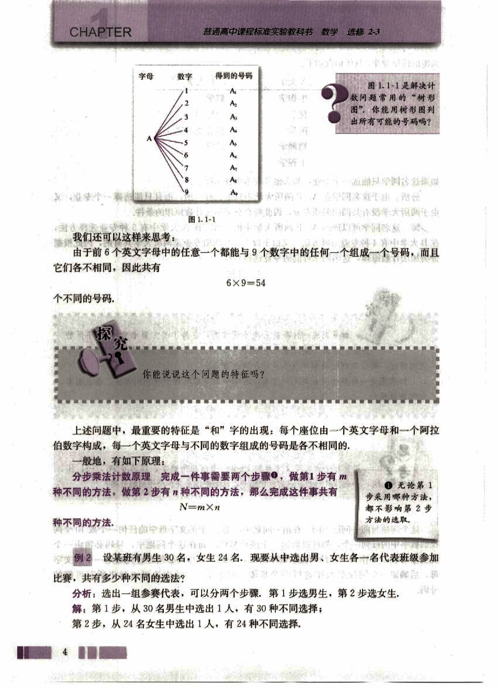
10 

# 第一章 计数原理

## 第一节

根据分步乘法计数原理，共有 30 × 24 = 720 种不同的选法。

如果完成一件事需要三个步骤，做第1步有 $m_1$ 种不同的方法，做第2步有 $m_2$ 种不同的方法，做第3步有 $m_3$ 种不同的方法，那么完成这件事共有多少种不同的方法？

如果完成一件事情需要 $n$ 个步骤，做每一步中都有若干种不同方法，那么应当如何计数？

### 例3

书架的第1层放有4本不同的计算机书，第2层放有3本不同的文艺书，第3层放有2本不同的体育书。

(1) 从书架中任取1本书，有多少种不同取法？

(2) 从书架的第1，2，3层各取1本书，有多少种不同取法？

解：(1) 从书架上任取1本书，有3类方法：第1类方法是从第1层取1本计算机书，有4种方法；第2类方法是从第2层取1本文艺书，有3种方法；第3类方法是从第3层取1本体育书，有2种方法。根据分类加法计数原理，不同取法的种数是

$N = m_1 + m_2 + m_3 = 4 + 3 + 2 = 9$；

(2) 从书架的第1，2，3层各取1本书，可以分成3个步骤完成：第1步从第1层取1本计算机书，有4种方法；第2步从第2层取1本文艺书，有3种方法；第3步从第3层取1本体育书，有2种方法。根据分步乘法计数原理，不同取法的种数是

$N = m_1 × m_2 × m_3 = 4 × 3 × 2 = 24$。

### 例4

要从甲、乙、丙3幅不同的画中选出2幅，分别挂在左、右两边墙上的指定位置，问共有多少种不同的挂法？

解：从3幅画中选出2幅分别挂在左、右两边墙上，可以分两个步骤完成：第1步，从3幅画中选1幅挂在左边墙上，有3种选法；第2步，从剩下的2幅画中选1幅挂在右边墙上，有2种选法。根据分步乘法计数原理，不同挂法的种数是

$N = 3 × 2 = 6$。

6种挂法可以表示如下：

---
5

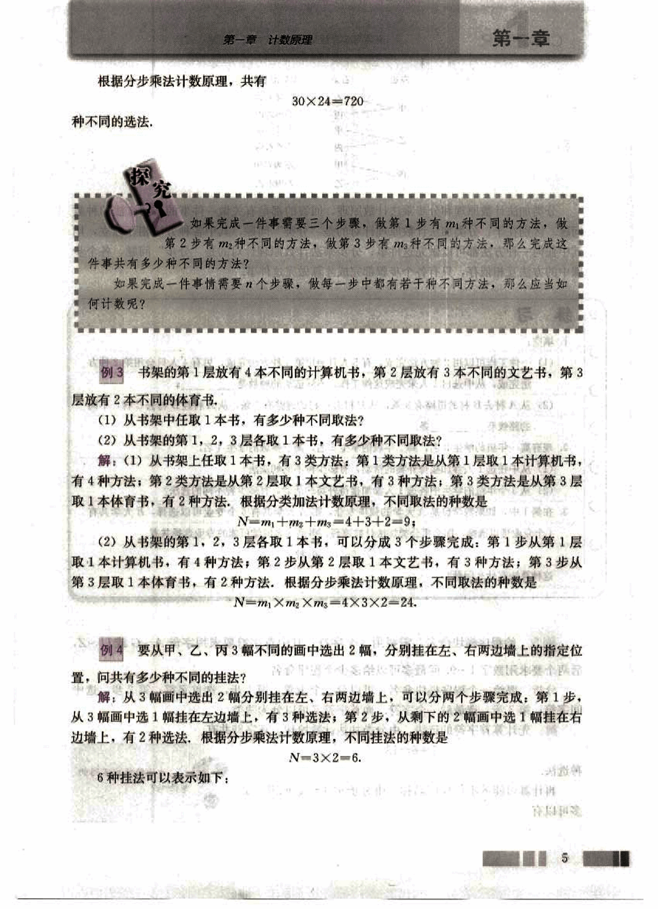
11 

# CHAPTER

普通高中课程标准实验教科书 数学 选修 2-3

左边 右边 得到的挂法
甲 乙 左甲右乙
乙 丙 左乙右丙
丙 甲 左丙右甲

分类加法计数原理和分步乘法计数原理，回答的都是有关做一件事情的不同方法的种数问题。区别在于：分类加法计数原理针对的是“分类”问题，其中各种方法相互独立，用其中任何一种方法都可以做完这件事；分步乘法计数原理针对的是“分步”问题，各个步骤中的方法互相依存，只有各个步骤都完成才算做完这件事。

## 练习

1. 填空：
 (1) 一件工作可以用 2 种方法完成，有 5 人只会用第 1 种方法完成，另有 4 人只会用第 2 种方法完成，从中选出 1 人来完成这件工作，不同选法的种数是 _______；
 (2) 从 A 村去 B 村的道路有 3 条，从 B 村去 C 村的道路有 2 条，从 A 村经 B 村去 C 村，不同的路线有 _______ 条。

2. 现有高一年级的学生 3 名，高二年级的学生 5 名，高三年级的学生 4 名。
 (1) 中任选 1 人参加接待外宾的活动，有多少种不同的选法？
 (2) 从 3 个年级的学生中各选 1 人参加接待外宾的活动，有多少种不同的选法？

3. 在例 1 中，如果数学也是 A 大学的强项专业，则 A 大学共有 6 个专业可以选择，B 大学共有 4 个专业可以选择，那么用分类加法计数原理，得到这名同学可能的专业选择共有  6 + 4 = 10(种)。

这种算法有什么问题？

## 例 5

给程序模块命名，需要用 3 个字符，其中首字符要求用字母 A～G 或 U～Z，后两个要求用数字 1～9。问最多可以给多少个程序命名？

分析：要给一个程序模块命名，可以分三个步骤：第 1 步，选首字符；第 2 步，选中间字符；第 3 步，选最后一个字符，而首字符又可以分为两类。

解：先计算首字符的选法，由分类加法计数原理，首字符共有 7 + 6 = 13 种选法。

再计算可能的不同程序名称，由分步乘法计数原理，最多可以有 _______。

? 你还能给出不同的解法吗？

6

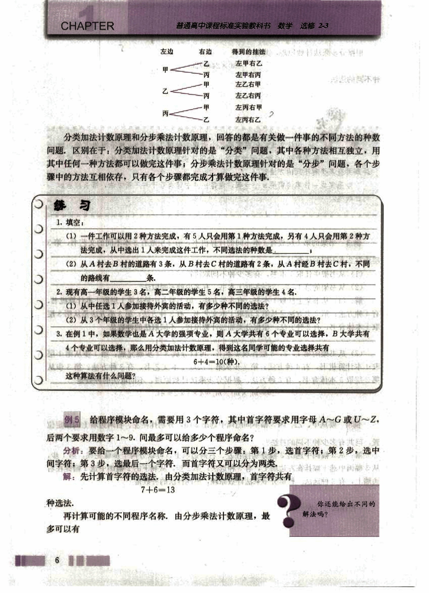
12 

# 第一章 计数原理

13 × 9 × 9 = 1053

个不同的名称，即最多可以给 1053 个程序命名。

## 例 6

核糖核酸 (RNA) 分子是在生物细胞中发现的化学成分。一个 RNA 分子是一个有着数百个甚至数千个位置的长链，长链中每一个位置上都由一种称为碱基的化学成分所占据，总共有 4 种不同的碱基，分别用 A，C，G，U 表示。在一个 RNA 分子中，各种碱基能够以任意次序出现，所以在任意一个位置上的碱基与其他位置上的碱基无关。假设有一类 RNA 分子由 100 个碱基组成，那么能有多少种不同的 RNA 分子？

[图1.1-2](images/1.1-2.png)

分析：用图 1.1-2 来表示由 100 个碱基组成的长链，这时我们共有 100 个位置，每个位置都可以从 A，C，G，U 中任选一个来占据。

解：100 个碱基组成的长链共有 100 个位置，如图 1.1-2 所示，从左到右依次在每一个位置中，从 A，C，G，U 中任选一个填入，每个位置有 4 种填充方法。根据分步乘法计数原理，长度为 100 的所有可能的不同 RNA 分子数目有

4 × 4 × 4 × ... × 4 = 4100 (个)。

4100 ≈ 1.6 × 1060，这是一个非常大的数，有兴趣的同学可以自己查阅一下 RNA 的有关资料。

## 例 7

电子元件很容易实现电路的通与断，电位的高与低等两种状态，而这也是最容易控制的两种状态，因此计算机内部就采用了每一位只有 0 或 1 两种数字的记数法，即二进制。为了使计算机能够识别字符，需要对字符进行编码，每个字符可以用一个或多个字节来表示，其中字节是计算机中数据存储的最小计量单位，每个字节由 8 个二进制位构成，问：

(1) 一个字节 (8 位) 最多可以表示多少个不同的字符？

(2) 计算机汉字国标码 (GB 码) 包含了 6763 个汉字，一个汉字为一个字符，要对这些汉字进行编码，每个汉字至少要用多少个字节表示？

分析：由于每个字节有 8 个二进制位，每一位上的值都有 0，1 两种选择，而且不同的顺序代表不同的字符，因此可以用分步乘法计数原理求解本题。

解：(1) 用图 1.1-3 来表示一个字节。

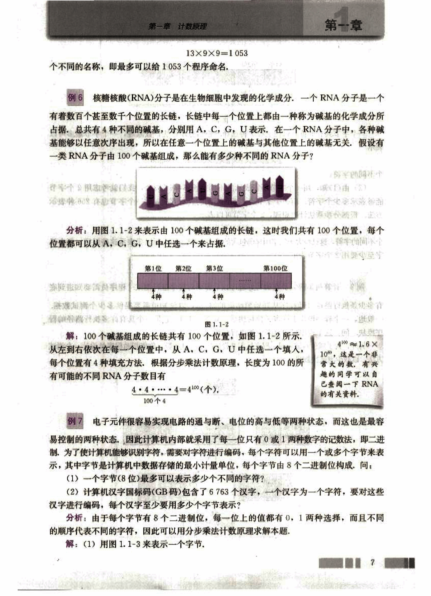
13 

# CHAPTER 普通高中课程标准实验教科书 数学 选修 2-3

##  图 1.1-3

一个字节共有 8 位，每位上有 2 种选择，根据分步乘法计数原理，一个字节最多可以表示

$2 \times 2 \times 2 \times 2 \times 2 \times 2 \times 2 \times 2 = 2^8 = 256$

个不同的字符；

(2) 由 (1) 知，用一个字节所能表示的不同字符不够 6763 个，我们就考虑用 2 个字节能够表示多少个字符，前一个字节有 256 种不同的表示方法，后一个字节也有 256 种表示方法，根据分步乘法计数原理，2 个字节可以表示

$256 \times 256 = 65536$

个不同的字符，这已经大于汉字国标码包含的汉字个数 6763。所以要表示这些汉字，每个汉字至少要用 2 个字节表示。

## 例 8

计算机编程人员在编写好程序以后需要对程序进行测试，程序员需要知道到底有多少条执行路径（即程序从开始到结束的路线），以便知道需要提供多少个测试数据。

一般地，一个程序模块由许多子模块组成，如图 1.1-4，它是一个具有许多执行路径的程序模块，问：这个程序模块有多少条执行路径？

另外，为了减少测试时间，程序员需要设法减少测试次数，你能帮助程序员设计一个测试方法，以减少测试次数吗？

[图1.1-4](images/1.1-4.png)

图 1.1-4

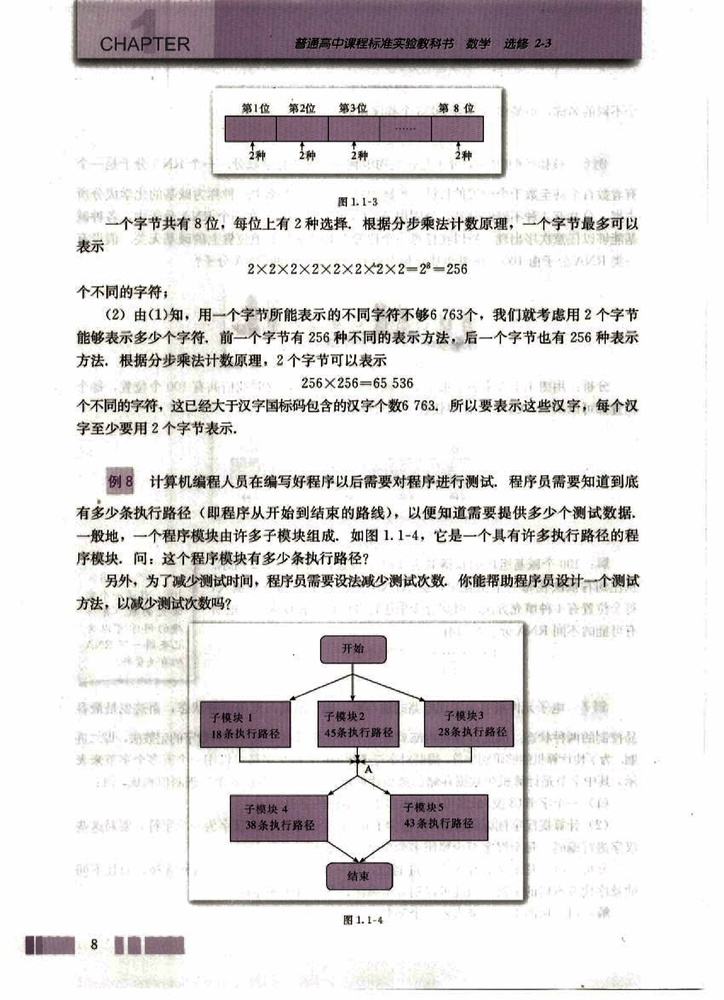
14 

# 第一章 计数原理

## 第一章

**分析:** 整个模块的任意一条执行路径都分两步完成：第 1 步是从开始执行到 A 点；第 2 步是从 A 点执行到结束，而第 1 步可由子模块 1 或子模块 2 或子模块 3 来完成；第 2 步可由子模块 4 或子模块 5 来完成。因此，分析一条指令在整个模块的执行路径需要用到两个计数原理。

**解:** 由分类加法计数原理，子模块 1 或子模块 2 或子模块 3 中的子路径共有

18 + 45 + 28 = 91(条)；

子模块 4 或子模块 5 中的子路径共有

38 + 43 = 81(条)。

又由分步乘法计数原理，整个模块的执行路径共有

91 × 81 = 7371(条)。

在实际测试中，程序员总是把每一个子模块看成一个黑箱，即通过只考察是否执行了正确的子模块的方式来测试整个模块。这样，他可以先分别单独测试 5 个模块，以考察每个子模块的工作是否正常，总共需要的测试次数为

18 + 45 + 28 + 38 + 43 = 172。

再测试各个模块之间的信息交流是否正常，只需要测试程序第 1 步中的各个子模块和第 2 步中的各个子模块之间的信息交流是否正常，需要的测试次数为

3 × 2 = 6。

如果每个子模块都工作正常，并且各个子模块之间的信息交流也正常，那么整个程序模块就工作正常。这样，测试整个模块的次数就变为

172 + 6 = 178(次)。

显然，178 与 7371 的差距是非常大的。

你看出了程序员是如何实现减少测试次数的吗？

## 例 9

随着人们生活水平的提高，某城市家庭汽车拥有量迅速增长，汽车牌照号码需要扩容，交通管理部门出台了一种汽车牌照组成办法，每一个汽车牌照都必须有 3 个不重复的英文字母和 3 个不重复的阿拉伯数字，并且 3 个字母必须合成一组出现，3 个数字也必须合成一组出现。那么这种办法共能给多少辆汽车上牌照？

**分析:** 按照新规定，牌照可以分为 2 类，即字母组合在左和字母组合在右，确定一个牌照的字母和数字可以分 6 个步骤。

**解:** 将汽车牌照分为 2 类，一类的字母组合在左，另一类的字母组合在右。

字母组合在左时，分 6 个步骤确定一个牌照的字母和数字：

第 1 步，从 26 个字母中选 1 个，放在首位，有 26 种选法；
第 2 步，从剩下的 25 个字母中选 1 个，放在第 2 位，有 25 种选法；
第 3 步，从剩下的 24 个字母中选 1 个，放在第 3 位，有 24 种选法；
第 4 步，从 10 个数字中选 1 个，放在第 4 位，有 10 种选法；
第 5 步，从剩下的 9 个数字中选 1 个，放在第 5 位，有 9 种选法；
第 6 步，从剩下的 8 个数字中选 1 个，放在第 6 位，有 8 种选法；

9

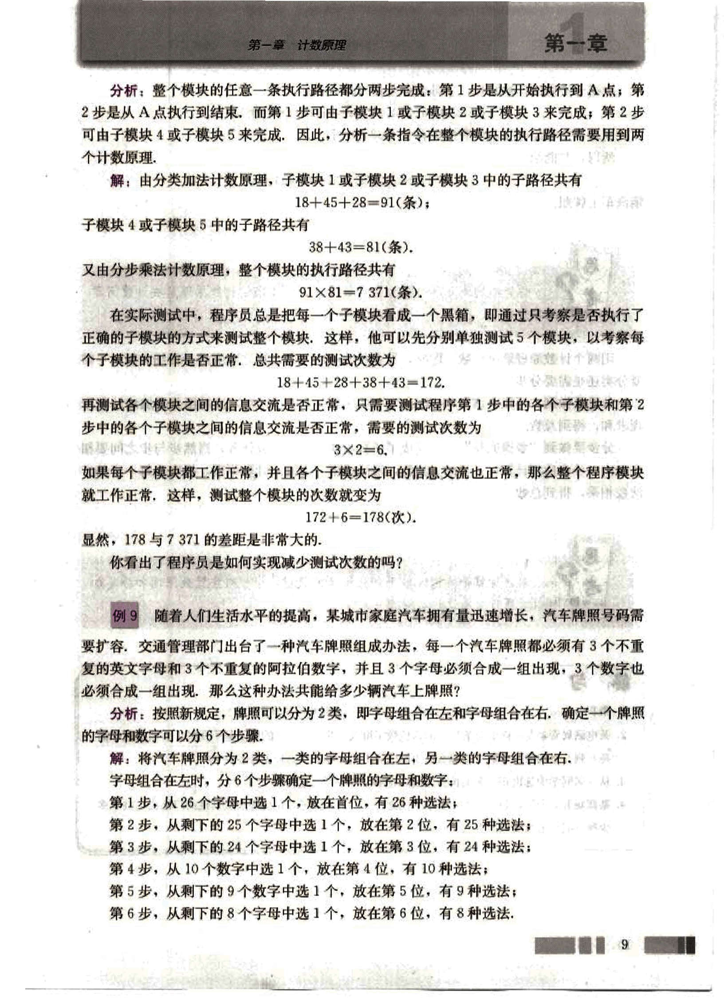
15 

# CHAPTER 普通高中课程标准实验教科书 数学 选修2-3

根据分步乘法计数原理，字母组合在左的牌照共有
26×25×24×10×9×8=11 232 000(个).

同理，字母组合在右的牌照也有11 232 000个.

所以，共能给
11 232 000+11 232 000=22 464 000
辆汽车上牌照.

## 思考？

你能归纳一下用分类加法计数原理、分步乘法计数原理解决计数问题的方法吗？

用两个计数原理解决计数问题时，最重要的是在开始计算之前要进行仔细分析——需要分类还是需要分步。

分类要做到“不重不漏”，分类后再分别对每一类进行计数，最后用分类加法计数原理求和，得到总数。

分步要做到“步骤完整”——完成了所有步骤，恰好完成任务，当然步与步之间要相互独立，分步后再计算每一步的方法数，最后根据分步乘法计数原理，把完成每一步的方法数相乘，得到总数。

## 思考？

乘法运算是特定条件下加法运算的简化，分步乘法计数原理和分类加法计数原理也有这种类似的关系吗？

## 练习

1. 乘积($a_1$+$a_2$+$a_3$)($b_1$+$b_2$+$b_3$)($c_1$+$c_2$+$c_3$+$c_4$)展开后共有多少项？

2. 某电话局管辖范围内的电话号码由八位数字组成，其中前四位的数字是不变的，后四位数字都是0到9之间的一个数字，那么这个电话局不同的电话号码最多有多少个？

3. 从5名同学中选出正、副组长各1名，有多少种不同的选法？

4. 某商场有6个门，如果某人从其中的任意一个门进入商场，并且要求从其他的门出去，共有多少种不同的进出商场的方式？

10

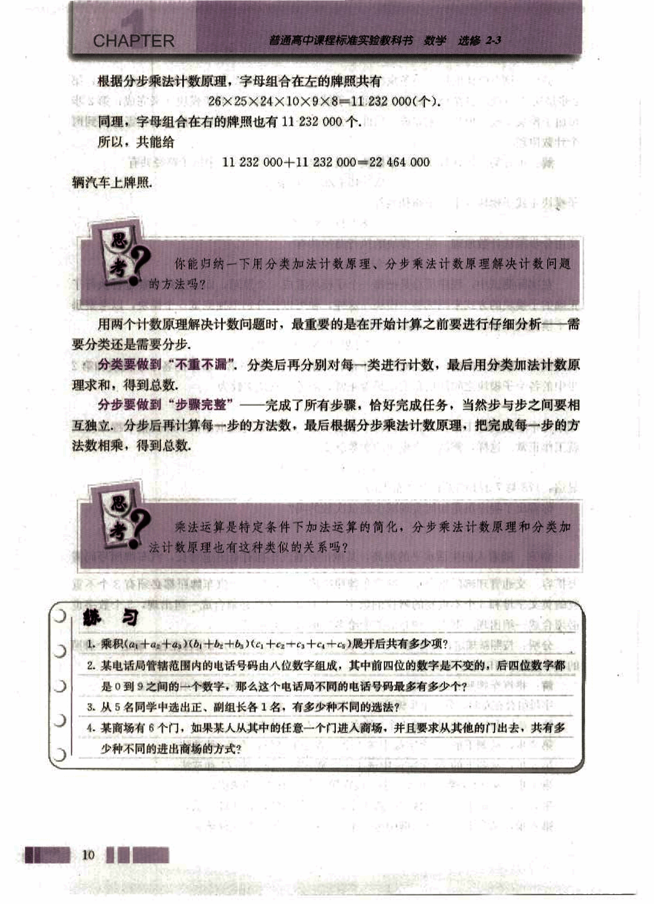
16 

# 第一章 计数原理

## 子集的个数有多少

**问题** n元集合A={a₁, a₂, …, an}的子集有多少个？

为了解决这个问题，一个可行的思路是先研究一下某些具体集合，如S={a₁, a₂, a₃}的子集个数，从中获得启发，然后再对一般的情况进行研究。

由于S中的元素只有3个，因此我们可以用列举法列出它的所有子集：

Ø, {a₁}, {a₂}, {a₃}, {a₁, a₂}, {a₁, a₃}, {a₂, a₃}, S.

因此，一个含有3个元素的集合共有8个子集。

如果一个集合所含元素较少，可以用列举法确定其子集的个数，但如果集合中的元素较多，用这种方法确定子集个数就不太方便了。另外，从上述描述中较难发现3与8之间的关系。

为了发现规律，我们需要采取另外的方法，一个自然的想法是，应当设法用上两个计数原理。

显然，元素ai (i=1, 2, 3)与各子集的关系只有两种：ai属于子集或ai不属于子集。这样，我们可以考虑用考察S中的每一个元素属不属于某个子集的方法来得到一个子集。因为S中有3个元素，所以要得到集合S的一个子集S₁，可以分三个步骤：

第1步，考察元素a₁是否在S₁中，有2种可能(a₁∈S₁, a₁∉S₁)；

第2步，考察元素a₂是否在S₁中，有2种可能(a₂∈S₁, a₂∉S₁)；

第3步，考察元素a₃是否在S₁中，有2种可能(a₃∈S₁, a₃∉S₁)；

只要完成上述三个步骤，那么集合S₁中元素就完全确定了。

根据分步乘法计数原理，对于由3个元素组成的集合，共有 2 × 2 × 2 = 2³ = 8 个不同的子集。

从上述过程我们看到了3与8之间的关系：3是2³中的指数，而8是2³的运算结果。

一般的，我们有：

n元集合A={a₁, a₂, …, an}的不同子集有2n个。

**证明:** 要得到集合A的一个子集S₁，可以分n个步骤：

11

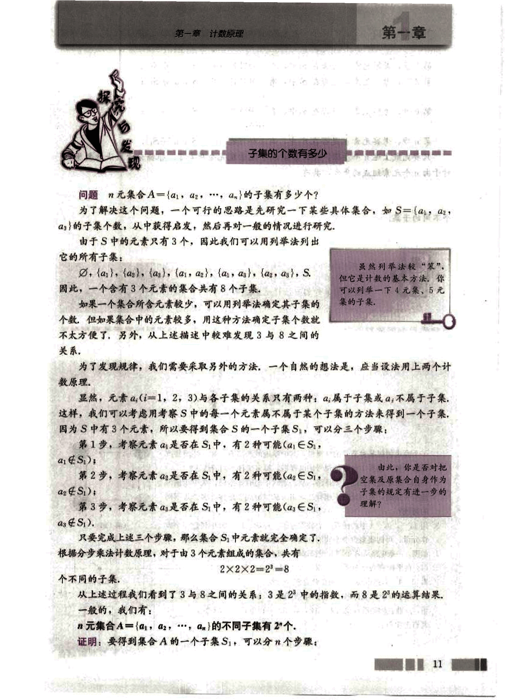
17 

# CHAPTER

普通高中课程标准实验教科书 数学 选修 2-3

第1步，考察元素 $a_1$ 是否在 $S_1$ 中，有2种可能 ($a_1 \in S_1$, $a_1 \notin S_1$);

第2步，考察元素 $a_2$ 是否在 $S_1$ 中，有2种可能 ($a_2 \in S_1$, $a_2 \notin S_1$);

......

第k步，考察元素 $a_k$ 是否在 $S_1$ 中，有2种可能 ($a_k \in S_1$, $a_k \notin S_1$);

......

第n步，考察元素 $a_n$ 是否在 $S_1$ 中，有2种可能 ($a_n \in S_1$, $a_n \notin S_1$).

只要完成上述n个步骤，那么集合$S_1$中元素就完全确定了。根据分步乘法计数原理，对于由n个元素组成的集合，共有

$\frac{2 \times 2 \times \dots \times 2}{n个2} = 2^n$

个不同的子集.

## 思考

你还能用另外的方法证明上述结论吗？

## 习题 1.1

### A组

1. 一个商店销售某种型号的电视机，其中本地的产品有4种，外地的产品有7种，要买1台这种型号的电视机，有多少种不同的选法？

2. 如图，从甲地到乙地有2条路，从乙地到丁地有3条路；从甲地到丙地有4条路，从丙地到丁地有2条路，从甲地到丁地共有多少条不同的路线？

[image1](images/image1.png)

3. 用1, 5, 9, 13中的任意一个数作分子，4, 8, 12, 16中任意一个数作分母，可构成多少个不同的分数？可构成多少个不同的真分数？

4. 如图，一条电路从A处到B处接通时，可有多少条不同的线路？

[image2](images/image2.png)

5. (1) 在平面直角坐标系内，横坐标与纵坐标均在A={0, 1, 2, 3, 4, 5}内取值的不同点共有多少个？

(2) 在平面直角坐标系内，斜率在集合B={1, 3, 5, 7}内取值，y轴上的截距在集合C={2, 4, 6, 8}内取值的不同直线共有多少条？

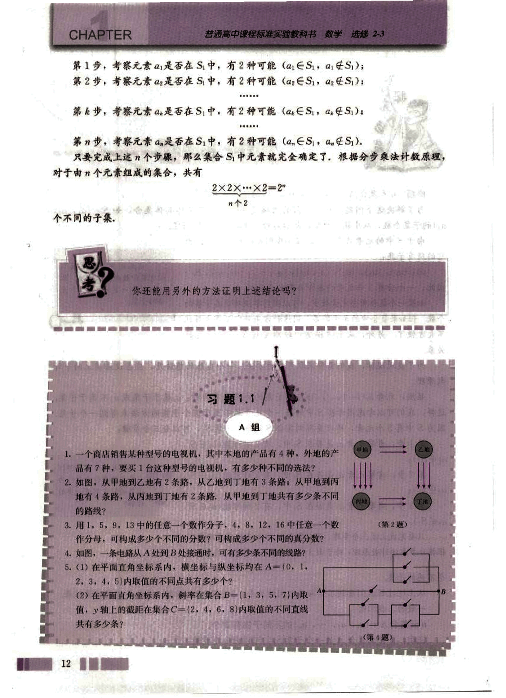
18 

# 第一章 计数原理

## 第一章

## B组

1. 一种号码锁有4个拨号盘，每个拨号盘上有从0到9共10个数字，现最后一个拨号盘出现了故障，只能在0到5这六个数字中拨号，问这4个拨号盘可组成多少个四位数字号码？

2. (1) 4名同学分别报名参加学校的足球队、篮球队、乒乓球队，每人限报其中的一个运动队，不同报法的种数是$3^4$还是$4^3$?

(2) 3个班分别从5个风景点中选择一处游览，不同选法的种数是$3^5$还是$5^3$?

13

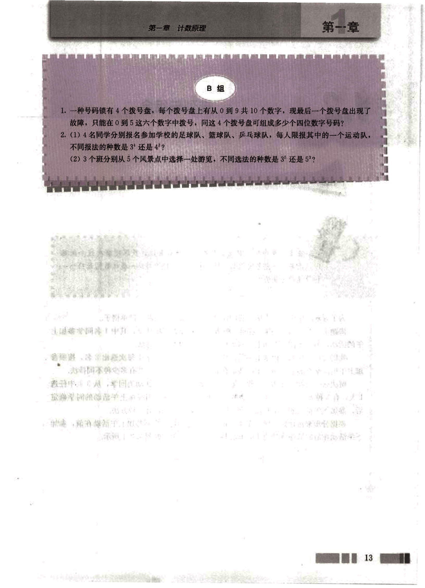
19 

# CHAPTER 11
## 1.2 排列与组合

### 1.2.1 排列

探究

在 1.1 节的例 9 中我们看到，用分步乘法计数原理解决这个问题时，因做了一些重复性工作而显得繁琐，能否对这一类计数问题给出一个简捷的方法呢？

为了寻求简便的计数方法，我们先来分析这类问题的两个简单例子。

**问题 1** 从甲、乙、丙 3 名同学中选出 2 名参加一项活动，其中 1 名同学参加上午的活动，另 1 名同学参加下午的活动，有多少种不同的选法？

我们可以这样来分析这个问题：从甲、乙、丙 3 名同学中每次选出 2 名，按照参加上午的活动在前，参加下午的活动在后的顺序排列，求一共有多少种不同排法。

解决这一问题可分两个步骤：第 1 步，确定参加上午活动的同学，从 3 人中任选 1 人，有 3 种方法；第 2 步，确定参加下午活动的同学，当参加上午活动的同学确定后，参加下午活动的同学只能从余下的 2 人中去选，于是有 2 种方法。

根据分步乘法计数原理，在 3 名同学中选出 2 名，按照参加上午活动在前，参加下午活动在后的顺序排列的不同方法共有 3 × 2 = 6 种，如图 1.2-1 所示。

上午 | 下午 | 相应的排法
---|---|---
甲 | 乙 | 甲乙
甲 | 丙 | 甲丙
乙 | 甲 | 乙甲
乙 | 丙 | 乙丙
丙 | 甲 | 丙甲
丙 | 乙 | 丙乙

图 1.2-1

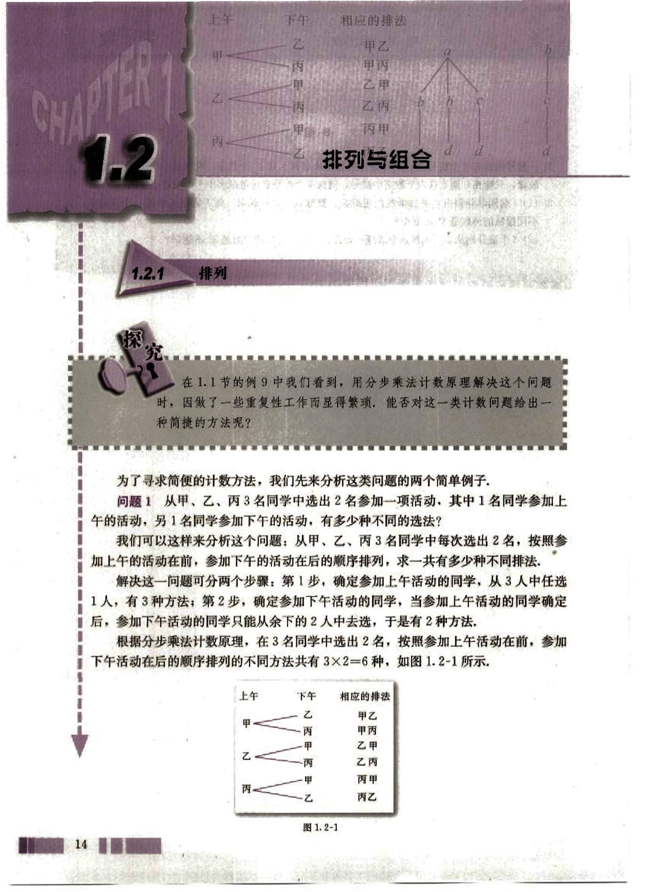
20 

# 第一章 计数原理

把上面问题中被取的对象叫做元素，于是问题可叙述为：

从3个不同的元素a, b, c中任取2个，然后按照一定的顺序排成一列，一共有多少种不同的排列方法？

所有不同的排列是：

ab, ac, ba, bc, ca, cb,

共有3×2=6种。

## 问题2

从1, 2, 3, 4这4个数字中，每次取出3个排成一个三位数，共可得到多少个不同的三位数？

显然，从4个数字中，每次取出3个，按“百”“十”“个”位的顺序排成一列，就得 到一个三位数，因此有多少种不同的排列方法就有多少个不同的三位数，可以分三个步骤来解决这个问题：

第1步，确定百位上的数字，在1, 2, 3, 4这4个数字中任取1个，有4种方法；

第2步，确定十位上的数字，当百位上的数字确定后，十位上的数字只能从余下的3个数字中去取，有3种方法；

第3步，确定个位上的数字，当百位、十位上的数字确定后，个位的数字只能从余下的2个数字中去取，有2种方法。

根据分步乘法计数原理，从1, 2, 3, 4这4个不同的数字中，每次取出3个数字，按“百”“十”“个”位的顺序排成一列，共有

4×3×2=24

种不同的排法，因而共可得到24个不同的三位数，如图1.2-2所示。

[图1.2-2](images/1.2-2.png)

由此可写出所有的三位数：

123, 124, 132, 134, 142, 143,

213, 214, 231, 234, 241, 243,

312, 314, 321, 324, 341, 342,

412, 413, 421, 423, 431, 432.

同样，问题2可以归结为：

从4个不同的元素a, b, c, d中任取3个，然后按照一定的顺序排成一列，共有多少种不同的排列方法？

所有不同排列是：

abc, abd, acb, acd, adb, adc,

bac, bad, bca, bcd, bda, bdc,

15

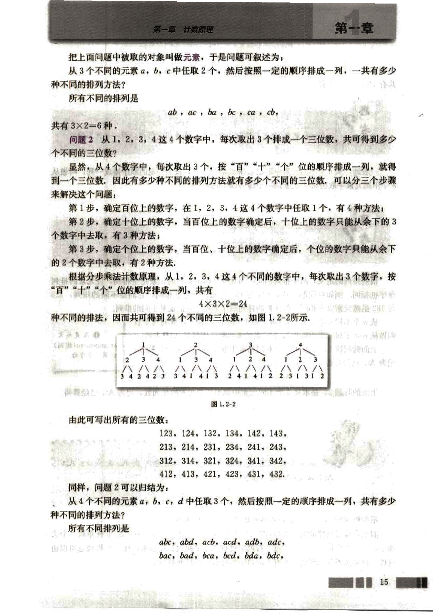
21 

# CHAPTER

普通高中课程标准实验教科书 数学 选修 2-3

cab, cad, cba, cbd, cda, cdb,
dab, dac, dba, dbc, dca, dcb.

共有 4 × 3 × 2 = 24 种.

## 思 考？

上述问题 1, 2 的共同特点是什么？你能将它们推广到一般情形吗？

一般地，从 *n* 个不同元素中取出 *m* (*m* ≤ *n*) 个元素，按照一定的顺序排成一列，叫做从 *n* 个不同元素中取出 *m* 个元素的一个排列 (arrangement).

##  考？

你能归纳一下排列的特征吗？

根据排列的定义，两个排列相同，当且仅当两个排列的元素完全相同，且元素的排列顺序也相同。例如在问题 2 中，123 与 134 的元素不完全相同，它们是不同的排列；123 与 132 虽然元素完全相同，但元素的排列顺序不同，它们也是不同的排列。

从 *n* 个不同元素中取出 *m* (*m* ≤ *n*) 个元素的所有不同排列的个数叫做从 *n* 个不同元素中取出 *m* 个元素的排列数，用符号 $A_n^m$ 表示。

上面的问题 1，是求从 3 个不同元素中取出 2 个元素的排列数，记为 $A_3^2$。已经算得

$A_3^2 = 3 × 2 = 6$;

上面的问题 2，是求从 4 个不同元素中取出 3 个元素的排列数，记为 $A_4^3$。已经算得

$A_4^3 = 4 × 3 × 2 = 24$.

## 探 究

从 *n* 个不同元素中取出 2 个元素的排列数 $A_n^2$ 是多少？$A_n^m$ (*m* ≤ *n*) 又各是多少？

根据解问题 1, 2 的经验，求排列数 $A_n^m$ 可以这样考虑：

假定有排好顺序的两个空位（图 1.2-3），从 *n* 个元素 $a_1, a_2, ..., a_n$ 中任意取 2 个去填空，一个空位填一个元素，每一种填法就得到一个排列；反过来，任一个排列总可以由这样一种填法得到，因此，所有不同填法的种数就是排列数 $A_n^2$。

16

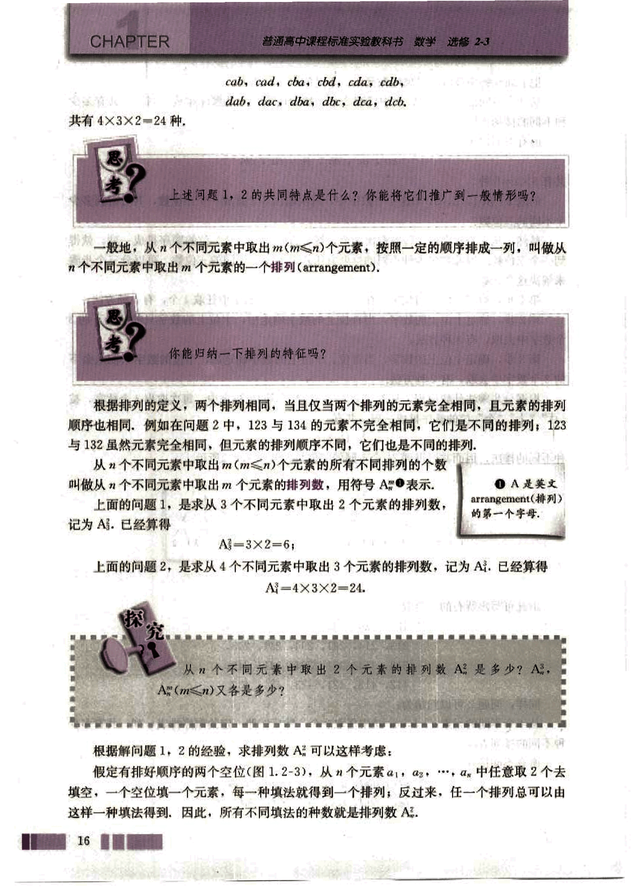
22 

# 第一章 计数原理

现在我们计算有多少种填法，完成填空这件事可分为两个步骤：

第1步，填第1个位置的元素，可以从$n$个元素中任选1个，有$n$种方法；

第2步，填第2个位置的元素，可以从剩下的$(n-1)$个元素中任选1个，有$(n-1)$种方法。

根据分步乘法计数原理，2个空位的填法种数为

$A_n^2 = n(n-1)$。

同理，求排列数$A_n^3$可以按依次填3个空位来考虑，有

$A_n^3 = n(n-1)(n-2)$。

一般地，求排列数$A_n^m$可以按依次填$m$个空位来考虑：

假定有排好顺序的$m$个空位(图1.2-4)，从$n$个元素$a_1, a_2, \dots, a_n$中任意取$m$个去填空，一个空位填1个元素，每一种填法就对应一个排列，因此，所有不同填法的种数就是排列数$A_n^m$。

[图1.2-3](images/1.2-3.png)

[图1.2-4](images/1.2-4.png)

填空可分为$m$个步骤：

第1步，第1位可以从$n$个元素中任选一个填上，共有$n$种选法；

第2步，第2位只能从余下的$(n-1)$个元素中任选一个填上，共有$(n-1)$种选法；

第3步，第3位只能从余下的$n-2$个元素中任选一个填上，共有$(n-2)$种选法；

……

第$m$步，当前面的$m-1$个空位都填上后，第$m$位只能从余下的$n-(m-1)$个元素中任选一个填上，共有$n-m+1$种选法。

根据分步乘法计数原理，全部填满$m$个空位共有

$n(n-1)(n-2)\dots[n-(m-1)]$

种填法。

这样，我们就得到公式

$A_n^m = n(n-1)(n-2)\dots(n-m+1)$。

这里，$n, m \in N^*$，并且$m \le n$。这个公式叫做排列数公式。

根据排列数公式，我们就能方便地计算出从$n$个不同元素中取出$m(m \le n)$个元素的所有排列的个数，例如

$A_5^2 = 5 \times 4$，

$A_8^3 = 8 \times 7 \times 6 = 336$。

你能概括一下排列数公式的特点吗？

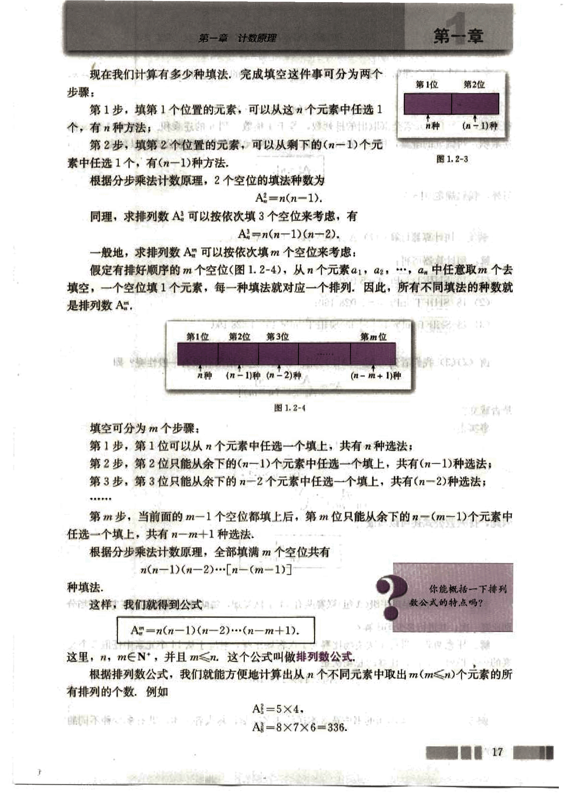
23 

# CHAPTER

普通高中课程标准实验教科书 数学 选修 2-3

n 个不同元素全部取出的一个排列，叫做 n 个元素的一个全排列，这时公式中 m=n.

$A_n^n = n(n-1)(n-2) \cdots 3 \cdot 2 \cdot 1$

就是说，n 个不同元素全部取出的排列数，等于正整数 1 到 n 的连乘积。正整数 1 到 n 的连乘积，叫做 n 的阶乘，用 n! 表示。所以 n 个不同元素的全排列数公式可以写成

$A_n^n = n!$

另外，我们规定 0! = 1.

## 例 1

用计算器计算：(1) $A_{10}^4$; (2) $A_{18}^5$; (3) $A_{18}^{18} \div A_{18}^{13}$.

解：用计算器可得：

(1) 10 SHIFT nPr 4 = 5040;

(2) 18 SHIFT nPr 5 = 1 028 160;

(3) 18 SHIFT nPr 18 = 13 SHIFT nPr 13 = 1 028 160.

由 (2)(3) 我们看到，$A_{18}^{18} = A_{18}^5 \div A_{18}^{13}$，那么，这个结果有没有一般性呢？即

是否成立？

事实上，

$A_n^m = \frac{n!}{(n-m)!}$

$A_n^m = n(n-1)(n-2)\cdots(n-m+1)$

$\frac{n(n-1)(n-2)\cdots(n-m+1)(n-m)\cdots 2 \cdot 1}{(n-m)\cdots 2 \cdot 1} = \frac{n!}{(n-m)!}$

因此，排列数公式还可以写成

$A_n^m = \frac{n!}{(n-m)!}$

## 例 2

某年全国足球甲级 (A 组) 联赛共有 14 个队参加，每队要与其余各队在主、客场分别比赛一次，共进行多少场比赛？

解：任意两队间进行 1 次主场比赛与 1 次客场比赛，对应于从 14 个元素中任取 2 个元素的一个排列，因此，比赛的总场次是

$A_{14}^2 = 14 \times 13 = 182.$

## 例 3

(1) 从 5 本不同的书中选 3 本送给 3 名同学，每人各 1 本，共有多少种不同的

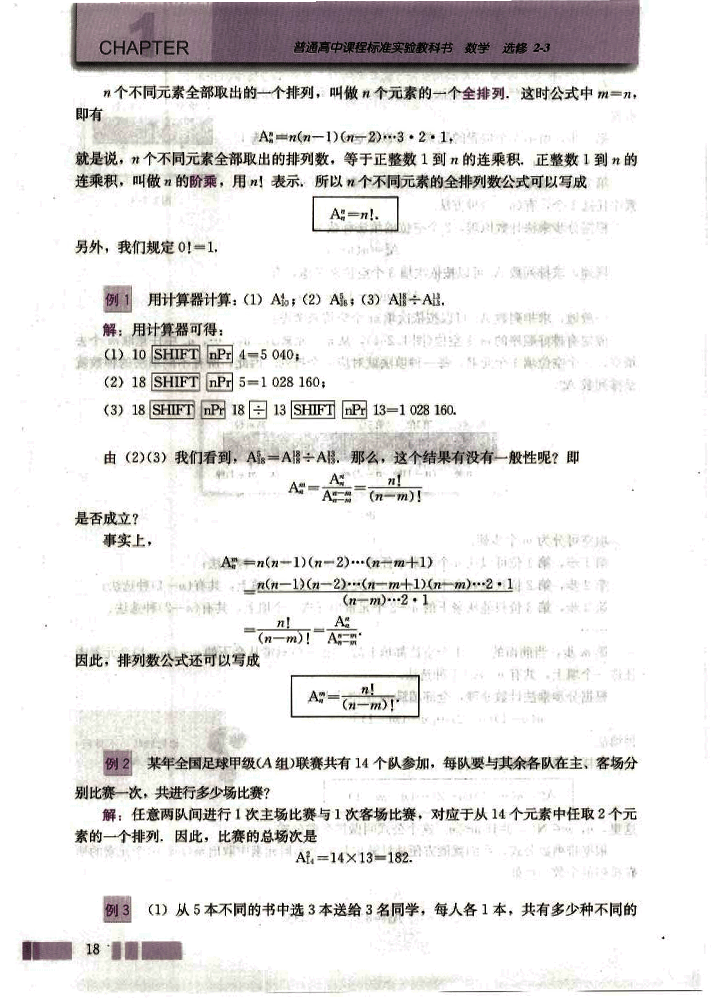
24 

# 第一章 计数原理

## 例题

**(2) 从 5 种不同的书中买 3 本送给 3 名同学，每人各 1 本，共有多少种不同的送法？**

**解：**

**(1) 从 5 本不同的书中选出 3 本分别送给 3 名同学，对应于从 5 个不同元素中任取 3 个元素的一个排列，因此不同送法的种数是**

$A_5^3 = 5 \times 4 \times 3 = 60$

**(2) 由于有 5 种不同的书，送给每个同学的 1 本书都有 5 种不同的选购方法，因此送给 3 名同学每人各 1 本书的不同方法种数是**

$5 \times 5 \times 5 = 125$

**例 3 中两个问题的区别在于：**(1) 是从 5 本不同的书中选出 3 本分送 3 名同学，各人得到 的书不同，属于求排列数问题；而 (2) 中，由于不同的人得到 的书可能相同，因此不符合使用排列数公式的条件，只能用分步乘法计数原理进行计算。

## 例4

用 0 到 9 这 10 个数字，可以组成多少个没有重复数字的三位数？

**分析：**在本问题的 0 到 9 这 10 个数字中，因为 0 不能排在百位上，而其他数可以排在任意位置上，因此 0 是一个特殊的元素。一般地，我们可以从特殊元素的排列位置入手来考虑问题。

**解法 1：**由于在没有重复数字的三位数中，百位上的数字不能是 0，因此可以分两步完成排列。第 1 步，排百位上的数字，可以从 1 到 9 这九个数字中任选 1 个，有 $A_9^1$ 种选法；第 2 步，排十位和个位上的数字，可以从余下的 9 个数字中任选 2 个，有 $A_9^2$ 种选法 (图 1.2-5)。根据分步乘法计数原理，所求的三位数有

$A_9^1 \times A_9^2 = 9 \times 9 \times 8 = 648$ (个)。

[图1.2-5](images/1.2-5.png)

**解法 2：**如图 1.2-6 所示，符合条件的三位数可分成 3 类，每一位数字都不是 0 的三位数有 $A_9^3$ 个，个位数字是 0 的三位数有 $A_9^2$ 个，十位数字是 0 的三位数有 $A_9^2$ 个。根据分类加法计数原理，符合条件的三位数有

$A_9^3 + A_9^2 + A_9^2 = 648$ 个。

[图1.2-6](images/1.2-6.png)

**解法 3：**从 0 到 9 这 10 个数字中任取 3 个数字的排列数为 $A_{10}^3$。其中 0 在百位上的排列数是 $A_9^2$。它们的差就是用这 10 个数字组成的没有重复数字的三位数的个数，即所求的三位数的个数是

$A_{10}^3 - A_9^2 = 10 \times 9 \times 8 - 9 \times 8 = 648$。

19

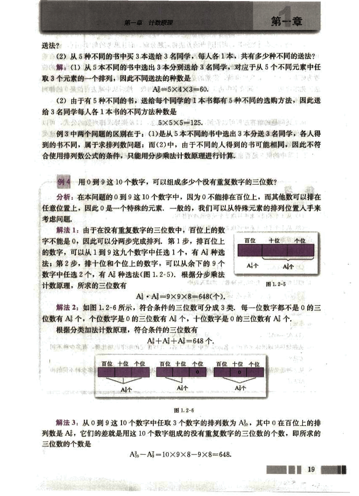
25 

# CHAPTER

普通高中课程标准实验教科书 数学 选修 2-3

对于例 4 这类计数问题，可用适当的方法将问题分解，而且思考的角度不同，就可以
有不同的解题方法。解法 1 根据百位数字不能是 0 的要求，分步完成选 3 个数组成没有重
复数字的三位数这件事，依据的是分步乘法计数原理；解法 2 以 0 是否出现以及出现的位
置为标准，分类完成这件事情，依据的是分类加法计数原理；解法 3 是一种逆向思考方
法：先求出从 10 个不同数字中选 3 个不重复数字的排列数，然后从中减去百位是 0 的排列
数（即不是三位数的个数），就得到没有重复数字的三位数的个数。

从上述问题的解答过程可以看到，引进排列的概念，以及推导求排列数的公式，可以
更加简便、快捷地求解“从 n 个不同元素中取出 m (m ≤ n) 个元素的所有排列的个数”这类
特殊的计数问题。

1.1 节中的例 9 是否也是这类计数问题？你能用排列的知识解决它吗？

## 练习

1. 写出：
    (1) 从 4 个不同元素中任取 2 个元素的所有排列；
    (2) 从 5 个不同元素中任取 2 个元素的所有排列。

2. 用计算器计算：
    (1) $A_5^3$；
    (2) $A_5^2$；
    (3) $A_4^3 - 2A_3^2$；
    (4) $\frac{A_5^3}{A_2^2}$；

3. 用计算器计算下表中的阶乘数，并填入表中：

| n | 2 | 3 | 4 | 5 | 6 | 7 | 8 |
|---|---|---|---|---|---|---|---|
| n! |  |  |  |  |  |  |  |

4. 求证：
    (1) $A_n^2 = nA_{n-1}^1$；
    (2) $A_8^3 - 8A_7^2 + 7A_6^1 = A_7^2$；

5. 从参加乒乓球团体比赛的 5 名运动员中选出 3 名，并按排定的顺序出场比赛，有多少种不同
方法？

6. 从 4 种蔬菜品种中选出 3 种，分别种植在不同土质的 3 块土地上进行实验，有多少种不同的种
植方法？

20

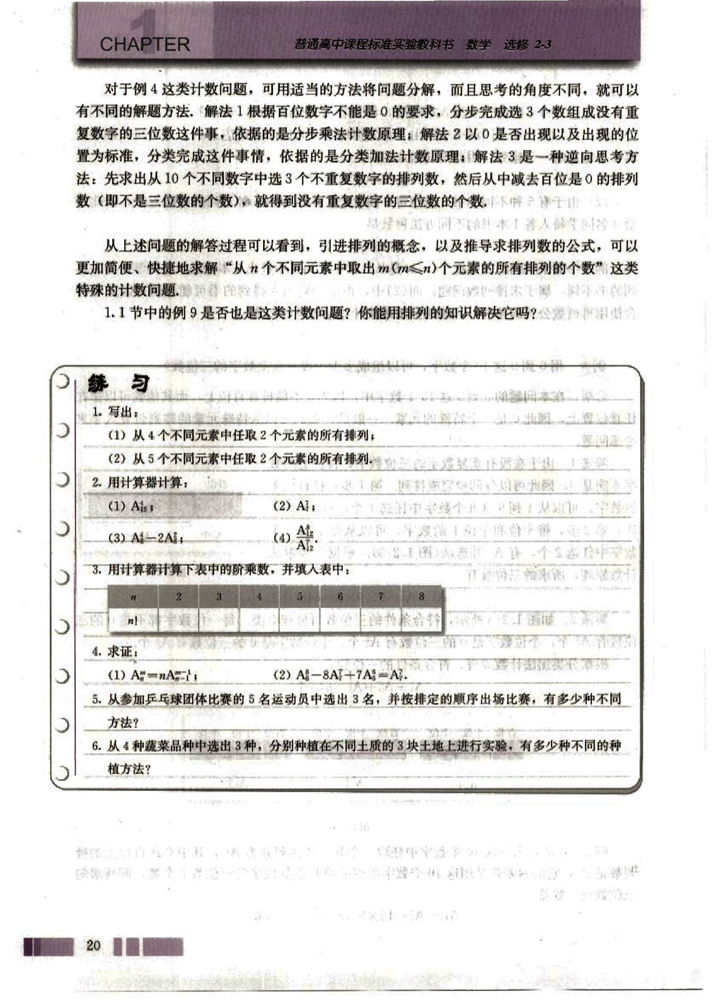
26 

# 第一章 计数原理

## 1.2.2 组合

从甲、乙、丙3名同学中选出2名去参加一项活动，有多少种不同的选法？这一问题与上一节开头提出的问题1有什么联系与区别？

从3名同学中选出2名的可能选法可以列举如下：

甲、乙；甲、丙；乙、丙。

上一节开头的问题1：“从甲、乙、丙3名同学中选出2名去参加一项活动，其中1名参加上午的活动，1名参加下午活动”，由于“甲上午，乙下午”与“乙上午，甲下午”是两种不同的选法，因此解决这个问题时，不仅要从3名同学中选出2名，而且还要将他们按照“上午在前，下午在后”的顺序排列，这是上一节研究的排列问题。

本节要研究的问题只是从3名同学中选出2名去参加一项活动，而不需要排列他们的顺序，舍去具体背景，我们可以把它概括为：

从3个不同的元素中取出2个合成一组，一共有多少个不同的组？这是我们接着要研究的问题。

一般地，从 *n* 个不同元素中取出 *m* (*m* ≤ *n*) 个元素合成一组，叫做从 *n* 个不同元素中取出 *m* 个元素的一个组合 (combination)。

你能说说排列与组合之间的联系与区别吗？

从排列与组合的定义可以知道，两者都是从 *n* 个不同元素中取出 *m* (*m* ≤ *n*) 个元素，这是排列、组合的共同点；它们的不同点是，排列与元素的顺序有关，组合与元素的顺序无关，只有元素相同且顺序也相同的两个排列才是相同的；只要两个组合的元素相同，不论元素的顺序如何，都是相同的组合。例如 ab 与 ba 是两个不同的排列，但它们却是同一个组合。

类比排列问题，我们引进如下概念：

从 *n* 个不同元素中取出 *m* (*m* ≤ *n*) 个元素的所有不同组合的个数，叫做从 *n* 个不同元素中取出 *m* 个元素的组合数，用符号 $C_n^m$ 表示。

例如，从8个不同元素中取出5个元素的组合数表示为 $C_8^5$；从7个不同元素中取出6个元素的组合数表示为 $C_7^6$。

21

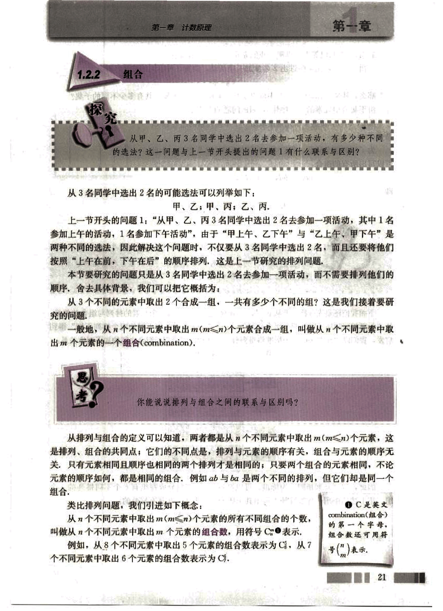
27 

# CHAPTER

普通高中课程标准实验教科书 数学 选修 2-3

那么，$C_4^3$ 的值等于多少呢？我们先来看几个具体问题。

上面，从3名同学中选出2名参加一项活动，共有3种不同的选法，即

$C_3^2 = 3$。

那么，从集合{a, b, c, d}中取出3个元素组成三元子集，共有多少不同的子集？

由于集合中元素的“无序性”，因此问题的本质是：

从a, b, c, d这4个元素中取出3个不同元素的组合数$C_4^3$是多少？

为了回答这个问题，我们可以利用树形图（图1.2-7），由此

可以写出所有的组合：

abc, abd, acd, bcd.

即

$C_4^3 = 4$。

[图1.2-7](images/1.2-7.png)

前面已经提到，组合与排列有相互联系，我们能否利用这种联系，

通过排列数$A_n^m$来求出组合数$C_n^m$呢？

下面我们还是先分析一下从a, b, c, d这4个元素中取3个元素的排列与组合的关系。

从“元素相同顺序不同的两个组合相同”，以及“元素相同顺序不同的两个排列不同”得到

启发，我们以“元素相同”为标准将排列分类，并建立起排列与组合之间的如下对应关系：

| 组合 | 排列 |
|---|---|
| abc | abc bac cab acb bca cba |
| abd | abd bad dab adb bda dba |
| acd | acd cad dac adc cda dea |
| bcd | bcd cbd dbc bdc cdb dcb |

因此，以“元素相同”为标准，可以把这24个排列分成每组有6个不同排列的4个

组，把上述结果用一种能够使人看出其来历的方式表述是非常有好处的：

$C_4^3 = 4 = \frac{24}{6} = \frac{4 \times 3 \times 2}{3 \times 2 \times 1} = \frac{A_4^3}{A_3^3}$

于是，我们有

$A_n^m = C_n^m \times A_m^m$。

22

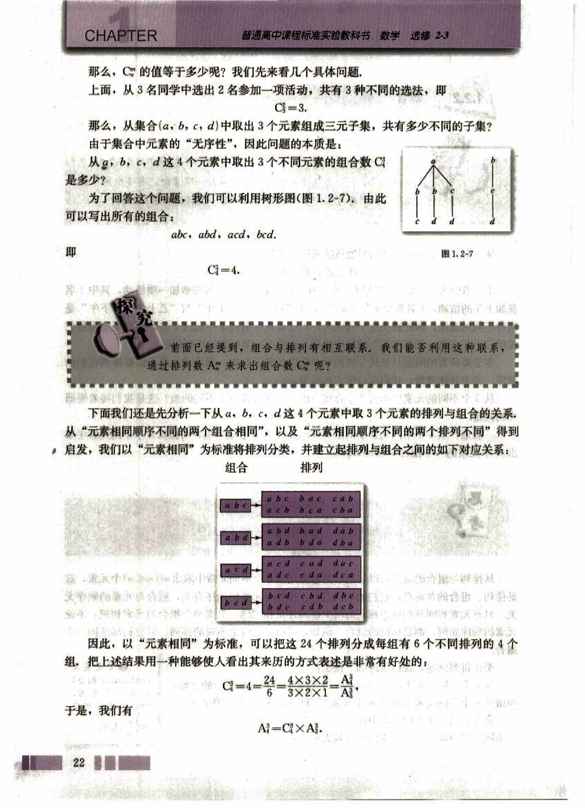
28 

# 第一章 计数原理

上述等式有什么实际意义呢？显然，左边就是“从4个不同元素中取出3个元素的排列数”，右边的两个数相乘，使我们联想到分步乘法计数原理，于是可以将它解释成为：

求从4个不同元素中取出3个元素的排列数A可以分两步完成，第1步，求从4个不同元素中取出3个元素的组合数C（不考虑顺序）；第2步，将每一个组合中的3个不同元素作全排列，各有A个排列数。

上述解释可以推广到一般的情形。

求从n个不同元素中取出m个元素的排列数，可看作由以下2个步骤得到的：

第1步，从这n个不同元素中取出m个元素，共有C种不同的取法；
第2步，将取出的m个元素做全排列，共有Am种不同的排法。

根据分步乘法计数原理，有

Am = Cmn · Amm

因此

$C_m^n = \frac{A_m^n}{A_m^m} = \frac{n(n-1)(n-2)\cdots(n-m+1)}{m!}$

这里n, m∈N*，并且m≤n. 这个公式叫做组合数公式.

因为

$A_m^n = \frac{n!}{(n-m)!}$

所以，上面的组合数公式还可以写成

$C_m^n = \frac{n!}{m!(n-m)!}$

另外，我们规定C0n=1.

## 例1

用计算器计算C710.

解：由计算器可得

10 nCr 7 = 120.

## 例2

一位教练的足球队共有17名初级学员，他们中以前没有一人参加过比赛，按照足球比赛规则，比赛时一个足球队的上场队员是11人，问：

(1)这位教练从这17名学员中可以形成多少种学员上场方案？
(2)如果在选出11名上场队员时，还要确定其中的守门员，那么教练员有多少种方式做这件事情？

23

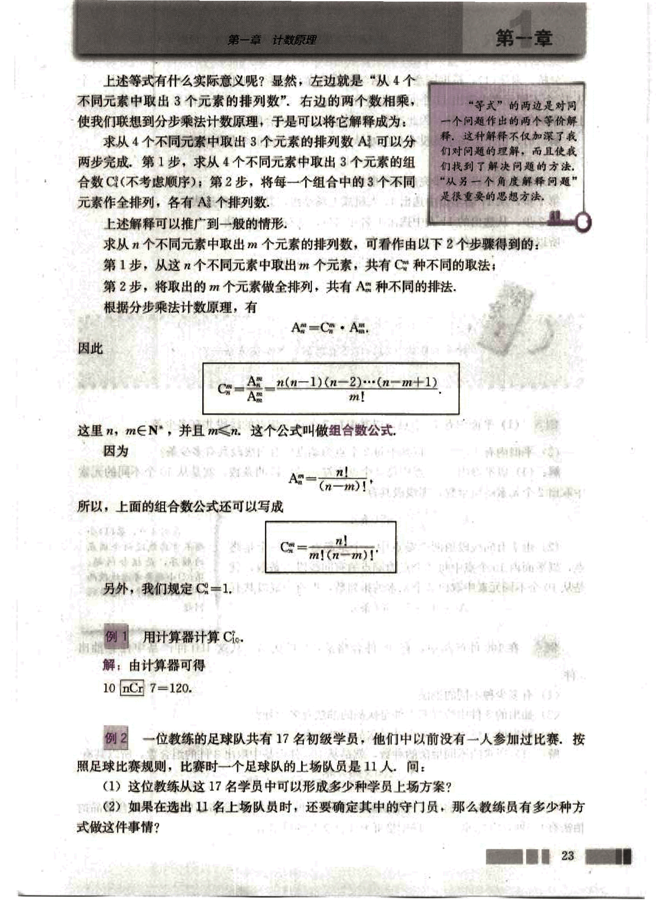
29 

# CHAPTER

普通高中课程标准实验教科书 数学 选修 2-3

分析：对于(1)，根据题意，17名学员没有角色差异，地位完全一样，因此这是一个从17个不同元素中选出11个元素的组合问题；对于(2)，守门员的位置是特殊的，其余上场学员的地位没有差异，因此这是一个分步完成的组合问题。

解：(1)由于上场学员没有角色差异，所以可以形成的学员上场方案有

$C_{17}^{11} = 12376$(种).

(2)教练员可以分两步完成这件事情：

第1步，从17名学员中选出11人组成上场小组，共有$C_{17}^{11}$种选法；

第2步，从选出的11人中选出1名守门员，共有$C_{11}^1$种选法。

所以教练员做这件事情的方法数有

$C_{17}^{11} \times C_{11}^1 = 136136$(种).

对于本题的(2)，你还能想到别的解决方法吗？

## 例3

(1) 平面内有10个点，以其中每2个点为端点的线段共有多少条？

(2) 平面内有10个点，以其中每2个点为端点的有向线段共有多少条？

解：(1)以平面内10个点中每2个点为端点的线段的条数，就是从10个不同的元素中取出2个元素的组合数，即线段共有

$C_{10}^2 = \frac{10 \times 9}{1 \times 2} = 45$(条).

(2)由于有向线段的两个端点中一个是起点、另一个是终点，以平面内10个点中每2个点为端点的有向线段的条数，就是从10个不同元素中取出2个元素的排列数，即有向线段共有

$A_{10}^2 = 10 \times 9 = 90$(条).

## 例4

在100件产品中，有98件合格品，2件次品，从这100件产品中任意抽出3件.

(1)有多少种不同的抽法？

(2)抽出的3件中恰好有1件是次品的抽法有多少种？

(3)抽出的3件中至少有1件是次品的抽法有多少种？

解：(1)所求的不同抽法的种数，就是从100件产品中取出3件的组合数，所以共有

$C_{100}^3 = \frac{100 \times 99 \times 98}{3 \times 2 \times 1} = 161700$(种).

24

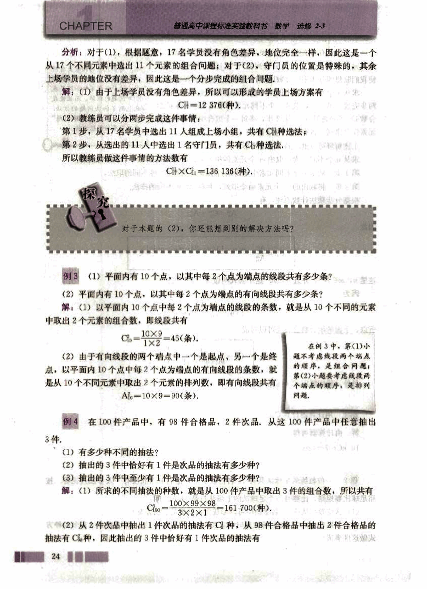
30 

# 第一章 计数原理

## (3) 解法 1

从 100 件产品抽出的 3 件中至少有 1 件是次品，包括有 1 件次品和有 2 件次品两种情况。在第 (2) 小题中已求得其中 1 件是次品的抽法有 $C_3^1 \cdot C_{97}^2$ 种，因此根据分类加法计数原理，抽出的 3 件中至少有一件是次品的抽法有

$C_3^1 \cdot C_{97}^2 + C_3^2 \cdot C_{97}^1 = 9604$ (种).

## 解法 2

抽出的 3 件产品中至少有 1 件是次品的抽法的种数，也就是从 100 件中抽出 3 件的抽法种数减去 3 件中都是合格品的抽法的种数，即

$C_{100}^3 - C_{97}^3 = 161700 - 152096 = 9604$ (种).

## 练习

1. 甲、乙、丙、丁 4 个足球队举行单循环赛：

(1) 列出所有各场比赛的双方；

(2) 列出所有冠亚军的可能情况.

2. 已知平面内 A, B, C, D 这 4 个点中任何 3 个点都不在一条直线上，写出由其中每 3 点为顶点的所有三角形.

3. 学校开设了 6 门任意选修课，要求每个学生从中选学 3 门，共有多少种不同选法？

4. 从 3, 5, 7, 11 这四个质数中任取两个相乘，可以得到多少个不相等的积？

5. 计算并用计算器验证结果：

(1) $C_5^3$;  (2) $C_7^4$;  (3) $C_8^5 - C_8^4$;  (4) $3C_5^2 - 2C_5^3$.

6. 求证 $C_n^r = \frac{n}{r}C_{n-1}^{r-1}$.

## 探究

**组合数的两个性质**

用计算器计算下列各组组合数的值，你发现了什么？你能解释你的发现吗？

$C_n^k$ 与 $C_n^{n-k}$;  $C_{18}^3$ 与 $C_{18}^{15}$;  $C_{10}^2$ 与 $C_{10}^8$; ...

25

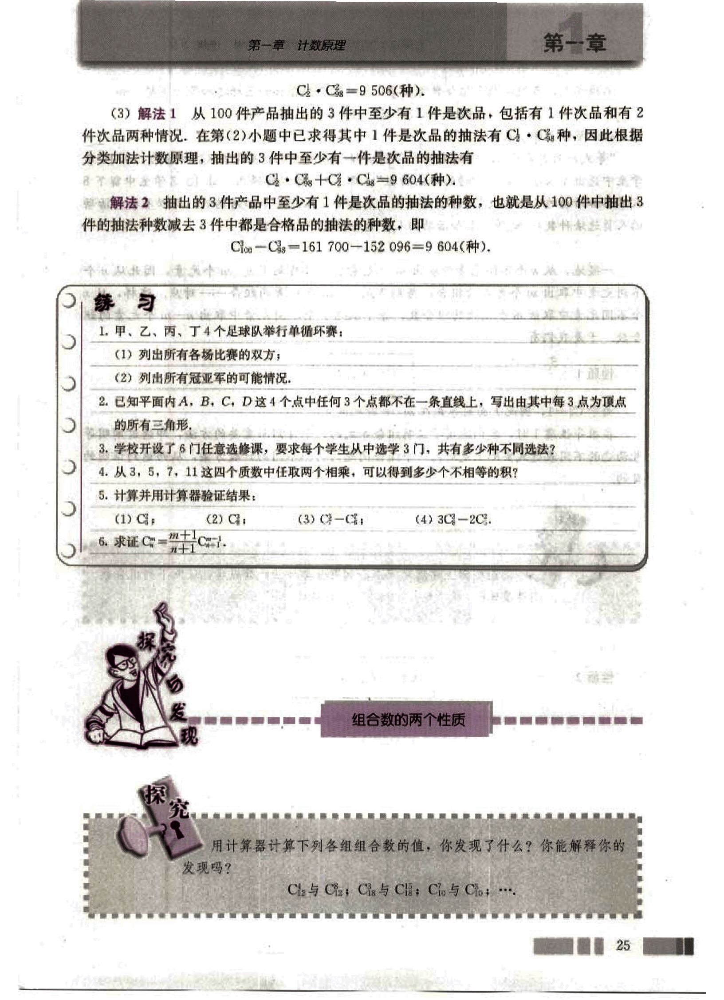
31 

# CHAPTER 普通高中课程标准实验教科书 数学 选修2-3

不难发现，各组的两个组合数都相等，而且两个组合数的上标之和等于下标，如
4+8=12，3+15=18，7+3=10，…

如何解释上述结果呢？

“等式的两边是对同一问题的两个等价解释”启发我们，如果把$C_{12}^4$解释为“从12名学生中选出4人参加某项活动的选法种数”，那么$C_{12}^8$可以解释为“让12名学生中留下8人不参加活动的选法种数”。由于留下8人后其余4人就是参加活动的，所以不参加活动的人员选法种数$C_{12}^8$就等于参加活动的人员选法种数$C_{12}^4$，即有

$C_n^m = C_n^{n-m}$

一般地，从n个不同元素中取出m个元素后，必然剩下n-m个元素，因此从n个不同元素中取出m个元素的组合，与剩下的n-m个元素的组合一一对应。这样，从n个不同元素中取出m个元素的组合数，等于从这n个不同元素中取出n-m个元素的组合数，于是我们有

## 性质1

$C_n^m = C_n^{n-m}$

由于$C_n^0 = 1$，因此上面的等式在m=n时也成立。

在推导性质1时，我们运用了证明组合等式的一个常用而重要的方法，即通过阐明等号两边的不同表达式实际上是对同一个组合问题的两个不同的计数方案，从而达到证明的目的。

## 性质2

你能根据上述思想方法，利用分类加法计数原理，证明下列组合数的性质吗？

$C_n^m = C_{n-1}^m + C_{n-1}^{m-1}$

26

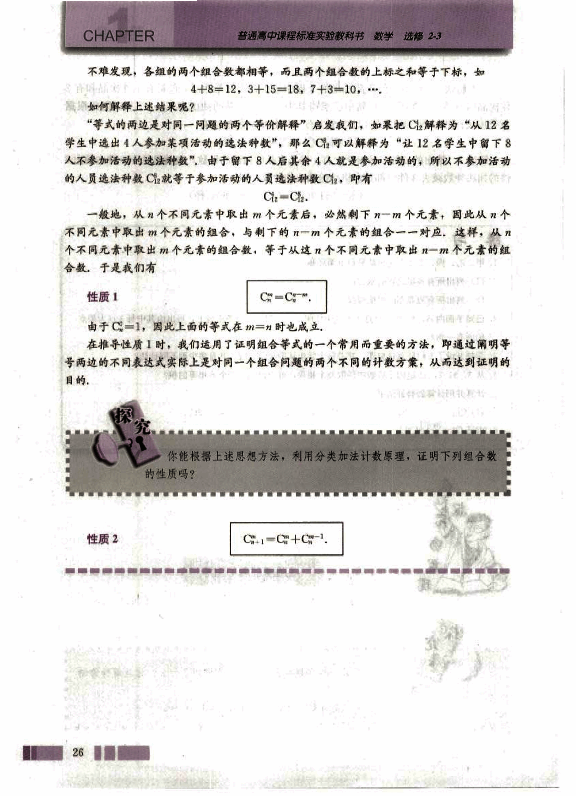
32 

# 第一章 计数原理

## 习题 1.2

### A 组

1. 用计算器计算：
    (1) 5A3 + 4A32;
    (2) A11 + A12 + A13 + A14.

2. 用计算器计算：
    (1) C53;
    (2) C197200;
    (3) C53 ÷ C52;
    (4) C53 + C52.

3. 求证：
    (1) Ank = Ann-k = n!/(n-k)!;
    (2)  (n+1)!/(k!(k-1)!) = (n-k+1)·n!/(k!).

4. 一个火车站有 8 股岔道，停放 4 列不同的火车，有多少种不同的停放方法（假定每股道只能停放 1 列火车）？

5. 一部记录影片在 4 个单位轮映，每一单位放映 1 场，有多少种轮映次序？

6. 一个学生有 20 本不同的书，所有这些书能够以多少种不同的方式排在一个单层的书架上？

7. 学校要安排一场文艺晚会的 11 个节目的演出顺序，除第 1 个节目和最后 1 个节目已确定外，4 个音乐节目要求排在第 2，5，7，10 的位置，3 个舞蹈节目要求排在第 3，6，9 的位置，2 个曲艺节目要求排在第 4，8 的位置，求共有多少种不同的排法？

8. 一个有 n × n 个数的数值方阵，最上面一行中有 n 个互不相同的数值，能否由这个 n 个数值以不同的顺序形成其余的每一行，并使任意两行的顺序都不相同？如果一个数阵有 m 行，而且每行有 n 个互不相同的数值，为使每一行都不重复，m 可以取多大的值？

9. 圆上有 10 个点：
    (1) 过每 2 个点画一条弦，一共可以画多少条弦？
    (2) 过每 3 个点画一个圆内接三角形，一共可以画多少个圆内接三角形？

10. (1) 凸五边形有多少条对角线？
    (2) 凸 n 边形有多少条对角线？

11. 壹圆、贰圆、伍圆、拾圆的人民币各 1 张，一共可以组成多少种币值？

12. (1) 空间有 8 个点，其中任何 4 个点不共面，过每 3 个点作一个平面，一共可以作多少个平面？
    (2) 空间有 10 个点，其中任何 4 点不共面，以每 4 个点为顶点作一个四面体，一共可以作多少个四面体？

27

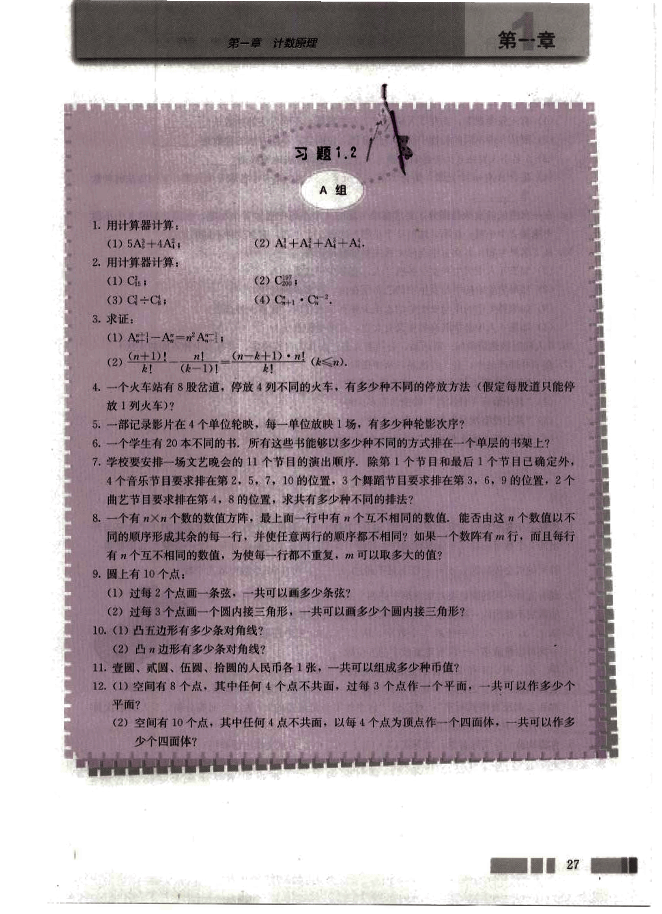
33 

# CHAPTER 1

13. 填空：

(1) 有三张参观券，要在5人中确定3人去参观，不同方法的种数是 ______。

(2) 要从5件不同的礼物中选出3件分送3位同学，不同方法的种数是 ______。

(3) 5名工人要在3天中各自选择1天休息，不同方法的种数是 ______。

(4) 集合A有m个元素，集合B有n个元素，从两个集合中各取1个元素，不同方法的种数是 ______。

14. 在一次考试的选做题部分，要求在第1题的4个小题中选做3个小题，在第2题的3个小题中选做2个小题，在第3题的2个小题中选做1个小题，有多少种不同的选法？

15. 从5名男生和4名女生中选出4人去参加辩论比赛。

(1) 如果4人中男生和女生各选2人，有多少种选法？

(2) 如果男生中的甲与女生中的乙必须在内，有多少种选法？

(3) 如果男生中的甲与女生中的乙至少要有1人在内，有多少种选法？

(4) 如果4人中必须既有男生又有女生，有多少种选法？

16. 6人同时被邀请参加一项活动，必须有人去，去几人自行决定，共有多少种不同的去法？

17. 在200件产品中，有2件次品，从中任取5件：

(1) “其中恰有2件次品”的抽法有多少种？

(2) “其中恰有1件次品”的抽法有多少种？

(3) “其中没有次品”的抽法有多少种？

(4) “其中至少有1件次品”的抽法有多少种？

## B组

1. 根据某个福利彩票方案，在1至37这37个数字中，选取7个数字，如果选出的7个数字与开出的7个数字一样（不管排列顺序）即得一等奖，问多少注彩票可有一个一等奖？如果要将一等奖的机会提高到$\frac{1}{6\ 000\ 000}$以上且不超过$\frac{1}{500\ 000}$，可在37个数中取几个数？

2. 现有五种不同的颜色要对如[图](images/figure.png)图形中的四个部分进行着色，要求有公共边的两块不能用同一种颜色，问共有几种不同的着色方法？

3. 从1，3，5，7，9中任取3个数字，从2，4，6，8中任取2个数字，一共可以组成多少个没有重复数字的五位数？

4. 甲、乙、丙、丁和戊5名学生进行劳动技术比赛，决出第1名到第5名的名次，甲、乙两名参赛者去询问成绩，回答者对甲说，“很遗憾，你和乙都没有得到冠军”；对乙说“你当然不会是最差的”，从这个回答分析，5人的名次排列可能有多少种不同情况？

5. 你能构造一个实际背景，对等式$C_n^r \cdot C_{n-r}^k = C_n^k \cdot C_{n-k}^r$的意义作出解释吗？

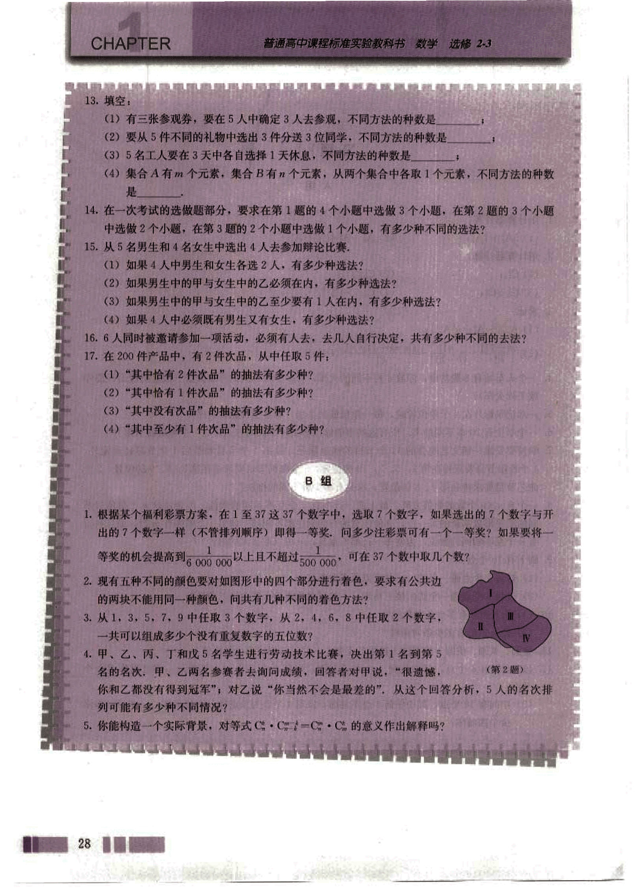
34 

# CHAPTER 11
## 1.3 二项式定理

### 1.3.1 二项式定理

二项式定理研究的是$(a+b)^n$的展开式，那么，$(a+b)^n$的展开式是什么呢？我们在计数原理这一章来学习它，说明它的展开式与分类加法计数原理、分步乘法计数原理以及排列、组合的知识有关。那么，如何把二项展开式与这些知识联系起来呢？

**探究**

如何利用两个计数原理得到$(a+b)^2$，$(a+b)^3$，$(a+b)^4$的展开式？你能由此猜想一下$(a+b)^n$的展开式是什么吗？

在初中，我们用多项式乘法法则得到了$(a+b)^2$的展开式：

$(a+b)^2 = (a+b)(a+b)$

$= a \cdot a + a \cdot b + b \cdot a + b \cdot b$

$= a^2 + 2ab + b^2$

从上述过程可以看到，$(a+b)^2$是2个$(a+b)$相乘。根据多项式乘法法则，每个$(a+b)$在相乘时有两种选择，选$a$或选$b$，而且每个$(a+b)$中的$a$或$b$都选定后，才能得到展开式的一项。于是，由分步乘法计数原理，在合并同类项之前，$(a+b)^2$的展开式共有$2 \times 2 = 2^2$项，而且每一项都是$a^{2-k} \cdot b^k (k=0, 1, 2)$的形式。

下面我们再来分析一下形如$a^{2-k} \cdot b^k$的同类项的个数。

当$k=0$时，$a^{2-k} \cdot b^k = a^2$，是由2个$(a+b)$中都不选$b$得到的，相当于从2个$(a+b)$中取0个$b$(即都取$a$)的组合数，因此$a^2$只有1个；

当$k=1$时，$a^{2-k} \cdot b^k = ab$，是由一个$(a+b)$中选$a$，另一个$(a+b)$中选$b$得到的，由于$b$选定后，$a$的选法也随之确定，因此，$ab$出现的次数相当于从2个$(a+b)$中取1个$b$的组合数，即$ab$共有$C_2^1$个；

当$k=2$时，$a^{2-k} \cdot b^k = b^2$，是由2个$(a+b)$中都选$b$得到的，相当于从2个
29

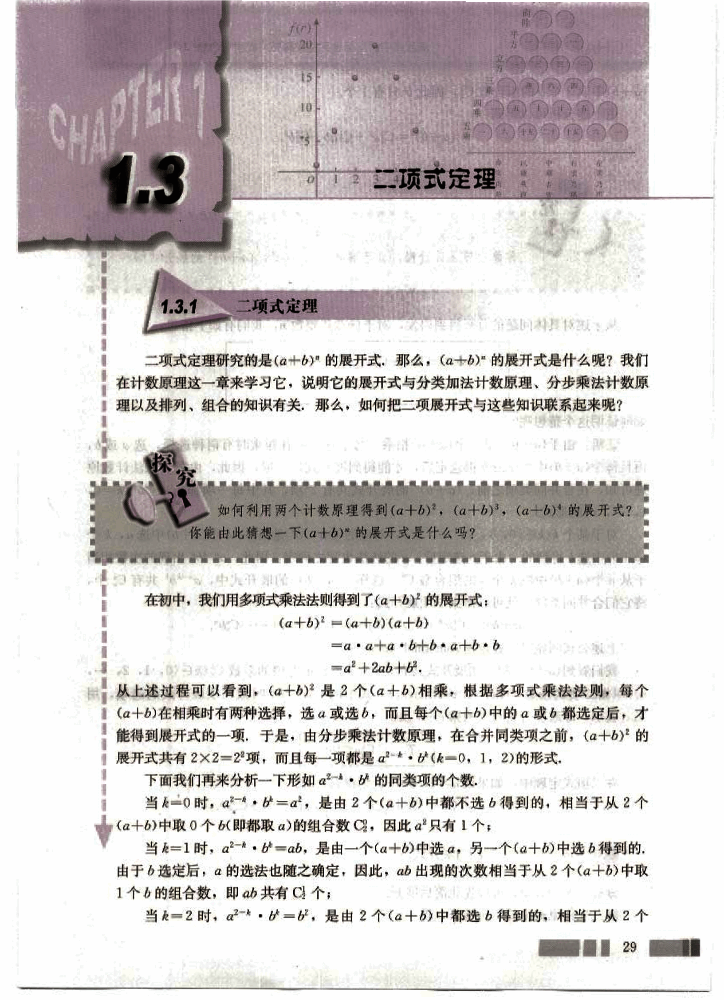
35 

# CHAPTER

普通高中课程标准实验教科书 数学 选修 2-3

(a+b)中取2个b的组合数C₂, 因此b²只有1个。

由上述分析可以得到：

(a+b)² = C²a² + C₁ab + C²b²

探究

你能仿照上述过程，自己推导出(a+b)³，(a+b)⁴的展开式吗？

从上述对具体问题的分析得到启发，对于任意正整数n，我们有如下猜想：

(a+b)ⁿ = Cⁿaⁿ + Cⁿ₋₁aⁿ⁻¹b + ... + Cⁿ₋ₖaⁿ⁻ᵏbᵏ + ... + Cⁿbⁿ (n∈N*)

如何证明这个猜想呢？

**证明**: 由于(a+b)ⁿ是n个(a+b)相乘，每个(a+b)在相乘时有两种选择，选a或b，而且每个(a+b)中的a或b都选定后，才能得到展开式的一项，因此，由分步乘法计数原理可知，在合并同类项之前，(a+b)ⁿ的展开式共有2ⁿ项，其中每一项都是aⁿ⁻ᵏbᵏ (k=0, 1,..., n)的形式。

对于某个k(k∈{0, 1, 2,..., n})，对应的项aⁿ⁻ᵏbᵏ是由n-k个(a+b)中选a，k个(a+b)中选b得到的。由于b选定后，a的选法也随之确定，因此，aⁿ⁻ᵏbᵏ出现的次数相当于从n个(a+b)中取k个b的组合数Cⁿₖ。这样，(a+b)ⁿ的展开式中，aⁿ⁻ᵏbᵏ共有Cⁿₖ个，将它们合并同类项，就可以得到二项展开式：

(a+b)ⁿ = Cⁿ₀aⁿ + Cⁿ₁aⁿ⁻¹b + ... + Cⁿₖaⁿ⁻ᵏbᵏ + ... + Cⁿⁿbⁿ

上述公式叫做二项式定理(binomial theorem)。

我们看到(a+b)ⁿ的二项展开式共有n+1项，其中各项的系数Cⁿₖ(k∈{0, 1, 2,..., n})叫做二项式系数(binomial coefficient)，式中的Cⁿₖaⁿ⁻ᵏbᵏ叫做二项展开式的通项，用Tₖ₊₁表示，即通项为展开式的第k+1项：

Tₖ₊₁ = Cⁿₖaⁿ⁻ᵏbᵏ

在二项式定理中，如果设a=1, b=x，则得到公式：

(1+x)ⁿ = Cⁿ₀ + Cⁿ₁x + Cⁿ₂x² + ... + Cⁿₖxᵏ + ... + Cⁿⁿxⁿ

例1 求(2√x - 1/√x)⁶的展开式。

分析：为了方便，可以先化简后展开。

解：先将原式化简，再展开，得
---
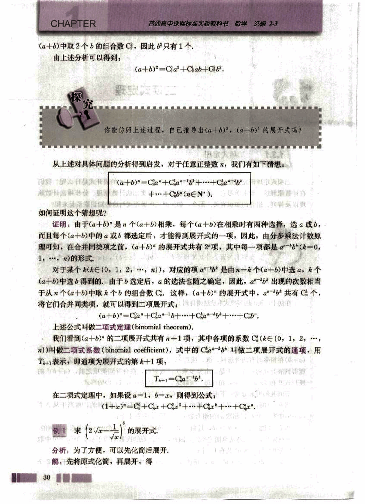
36 

# 第一章 计数原理

$(2\sqrt{x}-\frac{1}{\sqrt{x}})^6 = (\frac{2x-1}{\sqrt{x}})^6 = \frac{(2x-1)^6}{x^3}$

$= \frac{1}{x^3}[(2x)^6 - C_6^1(2x)^5 + C_6^2(2x)^4 - C_6^3(2x)^3 + C_6^4(2x)^2 - C_6^5(2x) + C_6^6]$

$= \frac{1}{x^3}(64x^6 - 6 \cdot 32x^5 + 15 \cdot 16x^4 - 20 \cdot 8x^3 + 15 \cdot 4x^2 - 6 \cdot 2x + 1)$

$= 64x^3 - 192x^2 + 240x - 160 - \frac{60}{x} + \frac{12}{x^2} - \frac{1}{x^3}$

## 例2

(1) 求$(1+2x)^7$的展开式的第4项的系数；

(2) 求$(x-\frac{1}{x})^9$的展开式中$x^3$的系数.

解：(1) $(1+2x)^7$的展开式的第4项是

$T_{3+1} = C_7^3 \cdot 1^{7-3} \cdot (2x)^3$

$= C_7^3 \cdot 2^3 \cdot x^3$

$= 35 \times 8x^3$

$= 280x^3$

所以展开式第4项的系数是280.

(2) $(x - \frac{1}{x})^9$的展开式的通项是

$C_9^r x^r (-\frac{1}{x})^{9-r} = (-1)^{9-r} C_9^r x^{2r-9}$

根据题意，得

$9 - 2r = 3,$

$r = 3.$

因此，$x^3$的系数是

$(-1)^6 C_9^3 = 84.$

## 练习

1. 写出$(p+q)^n$的展开式.

2. 求$(2a+3b)^n$的展开式的第3项.

3. 写出$(\sqrt{x}-\frac{1}{2\sqrt{x}})^n$的展开式的第$r+1$项.

4. 选择题:

$(x-1)^{10}$的展开式的第6项的系数是(     )

(A) $C_{10}^5$   (B) $-C_{10}^5$   (C) $C_{10}^6$   (D) $-C_{10}^6$

31

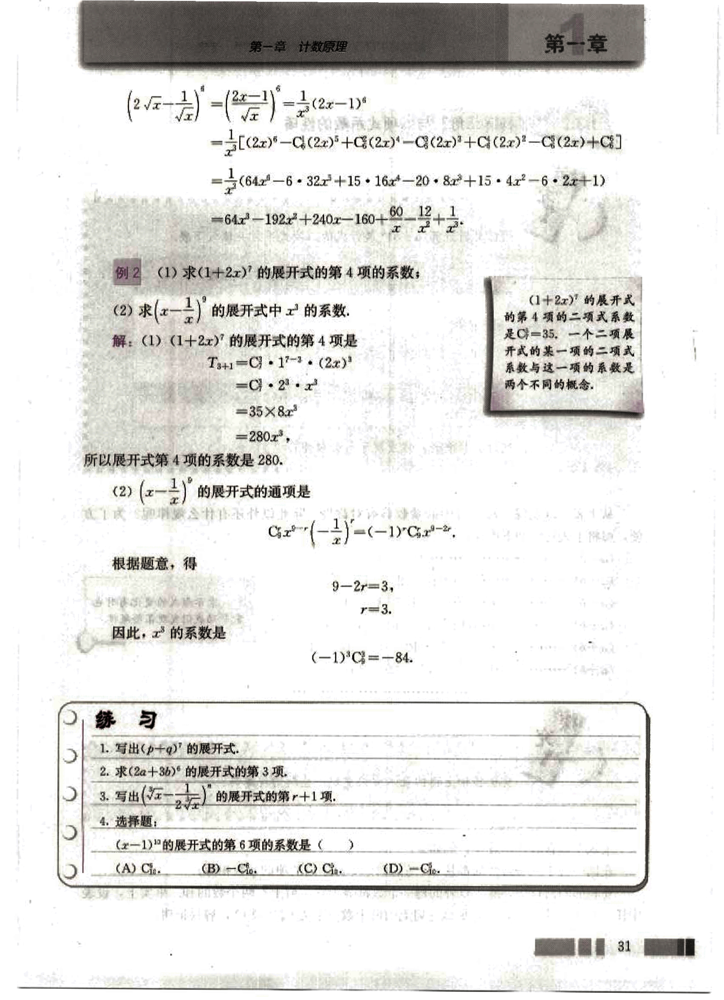
37 

# CHAPTER 1.3.2 “杨辉三角”与二项式系数的性质

## 探究

用计算器计算$(a+b)^n$展开式的二项式系数并填入下表。

| n | $(a+b)^n$展开式的二项式系数 |
|---|---|
| 1 |  |
| 2 |  |
| 3 |  |
| 4 |  |
| 5 |  |
| 6 |  |

通过计算填表，你发现了什么规律？

从上表可以发现，每一行中的系数具有对称性，除此以外还有什么规律呢？为了方便，可将上表写成如下形式：

$(a+b)^1$......1 1
$(a+b)^2$......1 2 1
$(a+b)^3$......1 3 3 1
$(a+b)^4$......1 4 6 4 1
$(a+b)^5$......1 5 10 10 5 1
$(a+b)^6$......1 6 15 20 15 6 1

表示形式的变化有时也能帮助我们发现某些规律。

## 探究

你能借助上面的表示形式发现一些新的规律吗？

上表中蕴含着许多规律，例如：

在同一行中，每行两端都是1，与这两个1等距离的项的系数相等；

在相邻的两行中，除1以外的每一个数都等于它“肩上”两个数的和。事实上，设表中任一不为1的数为$C_{n+1}^k$，那么它肩上的两个数分别为$C_n^k$及$C_n^{k-1}$，容易证明：

32

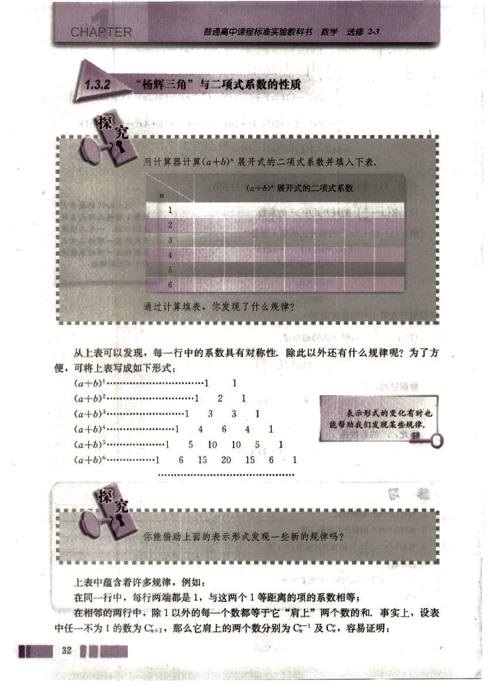
38 

# 第一章 计数原理

$C_{n}^{k+1} = C_{n}^{k} + C_{n}^{k}$

值得指出的是，这个表在我国南宋数学家杨辉在1261年所著的《详解九章算法》一书里就出现了，所不同的只是这里的表用阿拉伯数字表示，在这本书里记载的是用汉字表示的形式（图1.3-1）。

这个表称为杨辉三角，在《详解九章算法》一书里，还说明了表里“—”以外的每一个数都等于它肩上两个数的和，杨辉指出这个方法出于《释锁》算书，且我国北宋数学家贾宪（约公元11世纪）已经用过它，这表明我国发现这个表不晚于11世纪。在欧洲，这个表被认为是法国数学家帕斯卡 (Blaise Pascal, 1623-1662) 首先发现的，他们把这个表叫做帕斯卡三角，这就是说，杨辉三角的发现要比欧洲早五百年左右，由此可见我国古代数学的成就是非常值得中华民族自豪的。

对于$(a+b)^n$展开式的二项式系数

$C_n^0, C_n^1, C_n^2, \dots, C_n^n$

我们还可以从函数角度来分析它们，$C_n^k$ 可看成是k为自变量的函数$f(r)$，其定义域是 $\{0, 1, 2, \dots, n\}$。

对于确定的n，我们还可以画出它的图象，例如，当n=6时，其图象是7个孤立点（图1.3-2）。

[图1.3-1](images/1.3-1.png)

[图1.3-2](images/1.3-2.png)

下面结合“杨辉三角”和图1.3-2来研究二项式系数的一些性质。

(1) 对称性与首末两端“等距离”的两个二项式系数相等，事实上，这一性质可直接由公式$C_n^k = C_n^{n-k}$得到。

直线$r = \frac{n}{2}$ 将函数$f(r)$的图象分成对称的两部分，它是图象的对称轴。

(2) 增减性与最大值，因为

$C_n^k = \frac{n(n-1)(n-2)\dots(n-k+1)}{(k-1)!k}$

$= C_{n-1}^{k-1} \frac{(n-k+1)}{k}$

33

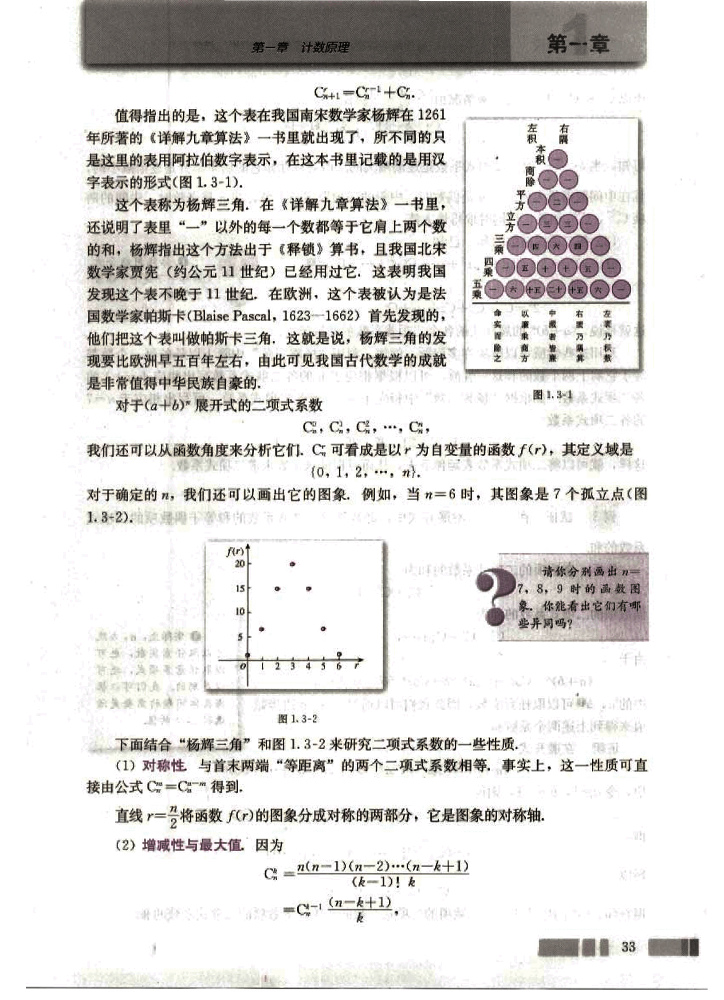
39 

# CHAPTER

普通高中课程标准实验教科书 数学 选修 2-3

所以 $C_k^n$ 相对于 $C_{k+1}^n$ 的增减情况由 $\frac{(n-k+1)}{k} > 1$ 决定，由

$\frac{(n-k+1)}{k} > 1 < k < \frac{n+1}{2}$

可知，当 $k < \frac{n+1}{2}$ 时，二项式系数是逐渐增大的，由对称性知它的后半部分是逐渐减小的，且在中间取得最大值，当 $n$ 是偶数时，中间的一项取得最大值；当 $n$ 是奇数时，中间的两项 $C_{\frac{n}{2}}^n$，$C_{\frac{n}{2}+1}^n$ 相等，且同时取得最大值。

(3) 各二项式系数的和，已知

$(1+x)^n = C_0^n + C_1^nx + C_2^nx^2 + \dots + C_n^nx^n + \dots + C_n^nx^n$ ①

令 $x=1$，则

$2^n = C_0^n + C_1^n + C_2^n + \dots + C_n^n$

这就是说，$(a+b)^n$ 的展开式的各个二项式系数的和等于 $2^n$。

❓  你能用组合意义解释一下这个“组合等式”吗？

利用这些性质可以解决许多问题，例如，利用“杨辉三角”中除 1 以外的每一个数都等于它肩上两个数的和这一性质，可以根据相应于 $n$ 的各二项式系数写出相应于 $n+1$ 的各二项式系数，如根据“杨辉三角”中相应于 $n=6$ 的各二项式系数，可写出相应于 $n=7$ 的各二项式系数

1  7  21  35  35  21  7  1

这样，就可以将二项式系数表延伸下去，从而可根据这个表来求二项式系数。

例 3  试证：在 $(a+b)^n$ 的展开式中，奇数项的二项式系数的和等于偶数项的二项式系数的和。

分析：奇数项的二项式系数的和为

$C_1^n + C_3^n + C_5^n + \dots$

偶数项的二项式系数的和为

$C_0^n + C_2^n + C_4^n + \dots$

由于

$(a+b)^n = C_0^na^n + C_1^na^{n-1}b + C_2^na^{n-2}b^2 + \dots + C_n^nb^n$

中的 $a$，$b$ 可以取任意实数，因此我们可以通过对 $a$，$b$ 适当赋值来得到上述两个系数和。

证明：在展开式

$(a+b)^n = C_0^na^n + C_1^na^{n-1}b + C_2^na^{n-2}b^2 + \dots + C_n^nb^n$

中，令 $a=1$，$b=-1$，则得

$(1-1)^n = C_0^n - C_1^n + C_2^n - C_3^n + \dots + (-1)^nC_n^n$

即

$0 = (C_0^n + C_2^n + \dots) - (C_1^n + C_3^n + \dots)$

所以

$C_1^n + C_3^n + \dots = C_0^n + C_2^n + \dots$

即在 $(a+b)^n$ 的展开式中，奇数项的二项式系数的和等于偶数项的二项式系数的和。

34

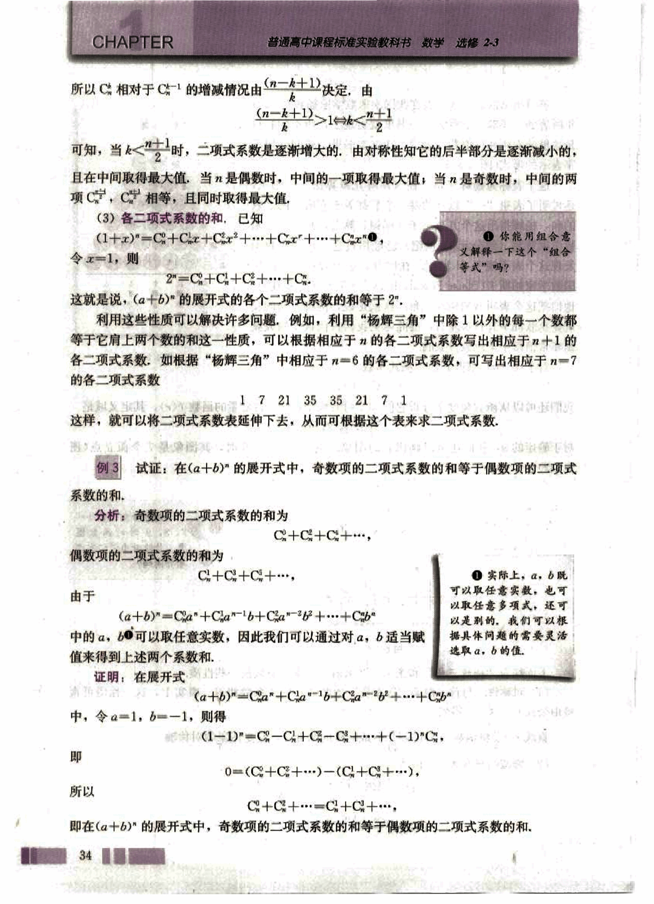
40 

# 第一章 计数原理

实际上，联想到

(1+x)$^n$=C$^n_0$+C$^n_1$x+C$^n_2$x$^2$+…+C$^n_{n-1}$x$^{n-1}$+C$^n_n$x$^n$，

把它看成是关于x的函数，即

f(x)=(1+x)$^n$

=C$^n_0$+C$^n_1$x+C$^n_2$x$^2$+…+C$^n_{n-1}$x$^{n-1}$+C$^n_n$x$^n$，

那么f(-1)=0，由此很容易得到要证明的结果。

## 练习

1. 填空：

(1) (a+b)$^n$的各二项式系数的最大值是 ______；

(2) C$^n_0$+C$^n_1$+…+C$^n_{n-1}$+C$^n_n$= ______；

(3) $\frac{C^n_0}{C^{n+1}_1}$+$\frac{C^n_1}{C^{n+1}_2}$+$\frac{C^n_2}{C^{n+1}_3}$+…+$\frac{C^n_{n-1}}{C^{n+1}_n}$= ______；

2. 证明 C$^n_0$+C$^n_2$+C$^n_4$+…+C$^n_n$=2$^{n-1}$ (n是偶数).

3. 写出从1到10的二项式系数表.

“杨辉三角”中的一些秘密

前面借助杨辉三角讨论了二项式展开式的一些性质，实际上，杨辉三角本身包含了许多有趣的性质，下面就来探索一下这些性质.

| 第0行 | 1 |
|---|---|
| 第1行 | 1  1 |
| 第2行 | 1  2  1 |
| 第3行 | 1  3  3  1 |
| 第4行 |  |
| 第5行 |  |
| 第6行 |  |
| … |  |
| 第n-1行 | 1 C$^{n-1}_1$ C$^{n-1}_2$ … C$^{n-1}_{n-1}$ 1 |
| 第n行 |  |
| … |  |

35

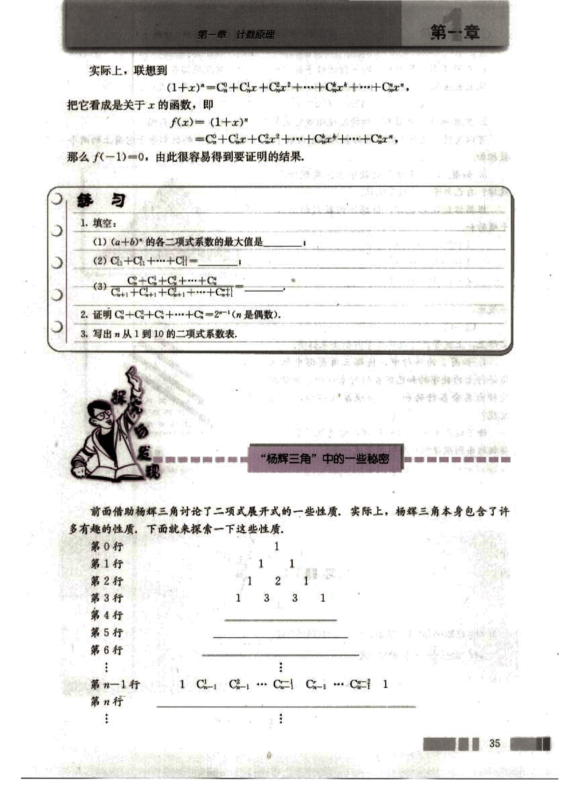
41 

# CHAPTER

普通高中课程标准实验教科书 数学 选修 2-3

1. 观察图形，你能发现每一行的数字规律吗？将你的发现填写在空格上。从上述图形可以看到，杨辉三角的第 n 行就是二项式 (a+b)n 展开式的系数，即
(a+b)n = Cn0an + Cn1an-1b + ··· + Cnn-1abn-1 + Cnnbn.

2. 观察杨辉三角图形，你能发现组成它的相邻两行的数有什么关系吗？
可以发现，这个三角形的两条腰都是由数字 1 组成的，其余的数都等于它肩上的两个数相加。

3. 如图 1，从连线上的数字你能发现什么规律？自己再连一些数字试试。
根据你发现的规律，猜想下列数列的前若干项的和：
1 + 2 + 3 + ··· + Cn1 = ______
1 + 3 + 6 + ··· + Cn2 = ______
1 + 4 + 10 + ··· + Cn3 = ______
……

一般地，
Cn1 + Cn2 + Cn3 + ··· + Cnn-1 = ______ (n > r)

实际上，上述等式可以用数学归纳法来证明。

4. 如图 2 的斜行中，杨辉三角图形中位于前几条斜行上的数字的和已经在斜行末标出，请你在“?”处标出其余各行的和，仔细观察这些和，你有什么发现？

除了这几个数的排列规律，你还能再找出其他一些数的排列规律吗？与同学交流一下！

## 习题 1.3

**A 组**

1. (1) 已知 0 < p < 1，写出 (p + (1 - p))n 的展开式；
(2) 写出 ($1 + \frac{1}{2}$)n 的展开式。

[图1](images/图1.png)
[图2](images/图2.png)

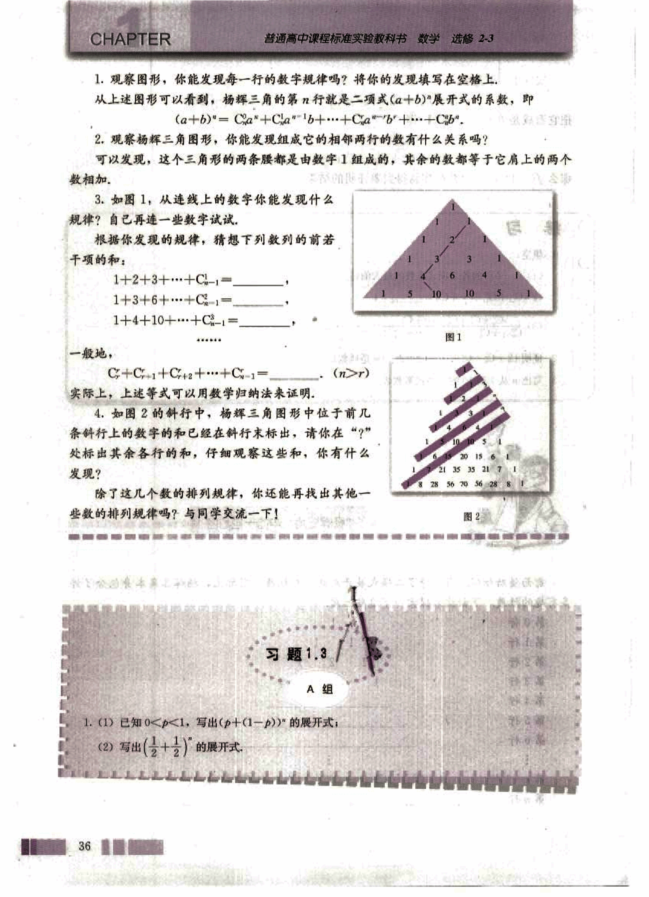
42 

# 第一章 计数原理

## 2. 用二项式定理展开：

(1) $(a+\sqrt{b})^5$；

(2) $\left( \frac{\sqrt{x}}{2} - \frac{2}{\sqrt{x}} \right)^7$。

## 3. 化简：

(1) $(1+\sqrt{x})^5 + (1-\sqrt{x})^5$；

(2) $(2x^2+3x^4)^4 - (2x^2-3x^4)^4$。

## 4. (1) 求 $(1-2x)^{10}$ 的展开式中前 4 项；

(2) 求 $(2a-3b^2)^{15}$ 的展开式中第 8 项；

(3) 求 $\left( \frac{\sqrt{x}}{3} + \frac{3}{\sqrt{x}} \right)^{12}$ 的展开式的中间一项；

(4) 求 $(x\sqrt{y}-y\sqrt{x})^{15}$ 的展开式的中间两项。

## 5. 求下列各式的二项展开式中指定各项的系数：

(1) $\left( 1-\frac{1}{2x} \right)^{11}$ 的含 $\frac{1}{x^5}$ 的项；

(2) $\left( 2x - \frac{1}{2x^2} \right)^{10}$ 的常数项。

## 6. 证明：

(1) $(x-\frac{1}{x})^{2n}$ 的展开式中常数项是 $(-2)^n \cdot 1 \cdot 3 \cdot 5 \cdots (2n-1)$；

(2) $(1+x)^{2n}$ 的展开式的中间一项是 $\frac{1 \cdot 3 \cdot 5 \cdots (2n-1)}{n!} (2x)^n$。

## 7. 利用“杨辉三角”，画出函数 $f(r) = C_7^r (r=0, 1, 2, \cdots, 7)$ 的图像。

## 8. 已知 $(1+x)^{15}$ 的展开式中第 4 项与第 8 项的二项式系数相等，求这两项的二项式系数。

## B 组

## 1. 用二项式定理证明：

(1) $(n+1)^n - 1$ 能被 $n^2$ 整除；

(2) $99^{10} - 1$ 能被 1000 整除。

## 2. 求证

$2^n - C_n^1 \cdot 2^{n-1} + C_n^2 \cdot 2^{n-2} + \cdots + (-1)^{n-1} C_n^{n-1} \cdot 2 + (-1)^n = 1$。

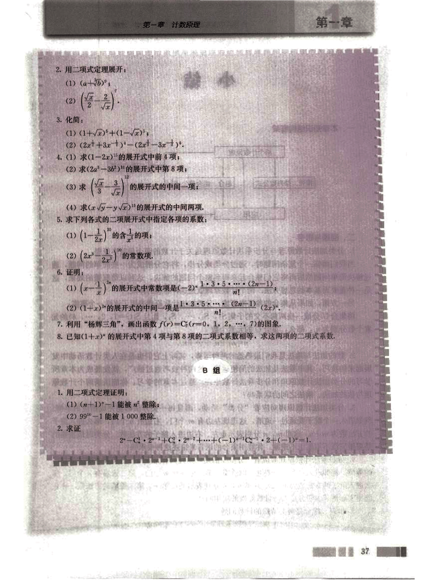
43 

# 小结

## 一、本章知识结构框架

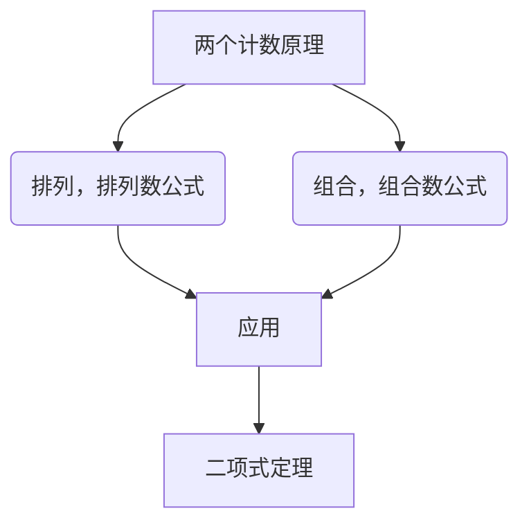
```mermaid
graph TD
    A[两个计数原理] --> B(排列，排列数公式);
    A --> C(组合，组合数公式);
    B --> D[应用];
    C --> D;
    D --> E[二项式定理];
```

## 二、回顾与思考

1. 分类加法计数原理与分步乘法计数原理是关于计数的两个最基本原理。当我们面临一个复杂问题时，通过分类或分步，将它分解成为一些简单的问题，通过解决简单问题然后再将它们整合起来得到整个问题的解决，达到以简驭繁的效果，这是一种重要而基本的思想方法，两个计数原理就是这种思想的体现。

另一方面，如果从集合的角度来考虑，分类加法计数原理表明了这样一个事实：将集合U分成一些两两不交的子集$S_1, S_2, ..., S_k$，而且$S_i(i=1, 2, ..., k)$的元素个数分别为$n_i$，那么，集合U的元素个数

$n = n_1 + n_2 + ... + n_k$

2. 数的加法与乘法是我们最熟悉的两种运算，实际上它们也是在人类计数活动中发展起来的技巧，其中乘法是加法的简便运算，这两种技巧通过推广，就发展成为本章所学习的分类加法计数原理和分步乘法计数原理。通过本章的学习，你能谈谈两个计数原理与数的加法、乘法之间的联系吗？

3. 分类加法计数原理对应着“分类”活动，而且每一类方法都能完成相应的事情，例如进入一个院子要通过一道墙，这道墙左边有m个门，右边有n个门，那么进入院子的方法数为m+n。这里m，n分别表示走左、右边进入院子的方法数，分类时最重要的是要做到既不重复也不遗漏，你能用集合的语言来描述这种要求吗？

4. 分步乘法计数原理对应着“分步”活动，而且只有完成每一个步骤才能完成相应的事情，例如进入一个院子要通过两道墙，第一道墙有m个门，第二道墙有n个门，那么进入院子的方法数为m·n。这里m，n分别表示通过第一、第二道墙的方法数，你还能用实际例子说明分步乘法计数原理的应用吗？

5. 排列、组合是两类特殊的计数问题。

38

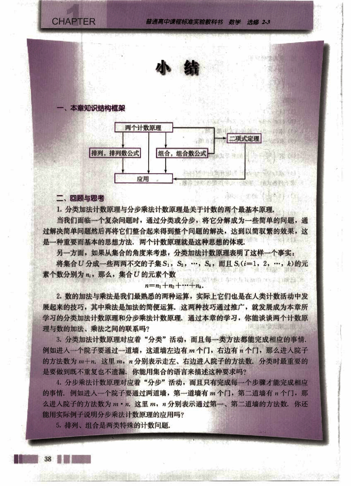
44 

# 第一章 计数原理

## 排列与组合

排列的特殊性在于排列中元素的“互异性”和“有序性”，例如“从全班 50 名同学中选出 4 名同学，分别担任班长、学习委员、文艺委员、体育委员”，这就是一个排列问题。你能说明为什么这个问题有元素的“互异性”与“有序性”的特点吗？

与排列比较，组合的特殊性在于它只有元素的“互异性”而不需要考虑顺序，例如，上述问题如果改为“从全班 50 名同学中选出 4 名代表参加一项活动”，那么它就变成了一个组合问题，本质上，“从 *n* 个不同元素中取出 *k* 个元素的组合”就是这个不同元素组成的集合的一个 *k* 元子集。

排列数公式、组合数公式的推导是两个计数原理的一个应用过程，你能回忆一下推导过程吗？

## 计数原理的应用

6. 在证明组合数的性质时，我们采用了“构建组合意义”的方法，这种方法的依据就是对同一问题的两种解释应该“殊途同归”，当我们面临一个问题时，往往需要用已有知识对其进行重新解释，这个过程实际上是一个对问题的理解过程，化未知为已知的过程，它对问题的解决经常是至关重要的。

7. 在推导二项式定理

$(a+b)^n = C_n^0 a^n + C_n^1 a^{n-1}b + \dots + C_n^{n-1}ab^{n-1} + C_n^n b^n$

时，我们应用了两个计数原理，而这种应用也是基于我们在多项式乘法中的经验：每一项都是 $a^k b^{n-k}$ (*k*=0, 1, …, *n*) 的形式，而用两个计数原理来解释得到 $a^k b^{n-k}$ 的步骤，就可以得出其同类项的个数为 $C_n^k$ 个的结论，这个过程值得我们认真回味。

8. 在得出两个计数原理、排列数公式、组合数公式以及二项式定理时，我们始终是从一些简单、具体事例出发，从中获得解决一般性问题的经验，得出解决一般问题的思路，这也是学习数学乃至学习其他学科时可以借鉴的常用方法。

39

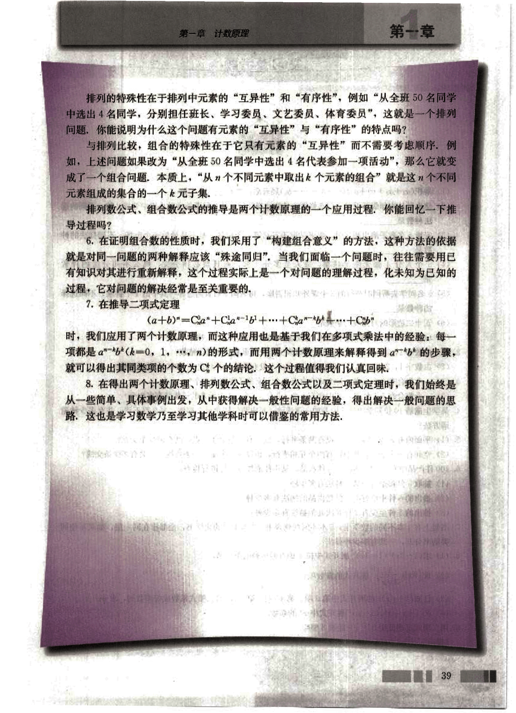
45 

# 复习参考题

## A组

1. 填空：

(1) 乘积 ($a_1$+$a_2$+···+$a_m$)($b_1$+$b_2$+···+$b_n$) 展开后，共有 ______ 项。

(2) 学生可从本年级开设的 7 门选修课中任意选择 3 门，从 6 种课外活动小组中选择 2 种，不同的选法种数是 ______。

(3) 安排 6 名歌手演出顺序时，要求某歌手不是第一个出场，也不是最后一个出场，不同排法的种数是 ______。

(4) 5 个人分 4 张无座足球票，每人至多分 1 张，而且票必须分完，那么不同分法的种数是 ______。

(5) 5 名同学去听同时举行的 3 个课外知识讲座，每名同学可自由选择听其中的 1 个讲座，不同选择的种数是 ______。

(6) 正十二边形的对角线的条数是 ______。

(7) ($1$+$x$)$^n$ ($n$∈N*) 的展开式中，系数最大的项是第 ______ 项。

2. (1) 由数字 1, 2, 3, 4, 5, 6 可以组成多少个没有重复数字的正整数？

(2) 由数字 1, 2, 3, 4, 5, 6 可以组成多少个没有重复，并且比 500000 大的正整数？

3. (1) 一个集合有 8 个元素，这个集合含有 3 个元素的子集有多少个？

(2) 一个集合有 5 个元素，其中含有 1 个、2 个、3 个、4 个元素的子集共有多少个？

4. 某学生邀请 10 位同学中的 6 位参加一项活动，其中两位同学要么都请，要么都不请，共有多少种邀请方法？

5. (1) 平面内有 $n$ 条直线，其中没有两条平行，也没有三条交于一点，共有多少个交点？

(2) 空间有 $n$ 个平面，其中没有两个互相平行，也没有三个交于一条直线，一共有多少条交线？

6. 100 件产品中有 97 件合格品，3 件次品，从中任意抽取 5 件进行检查。

(1) 抽取 5 件都是合格品的抽法有多少种？

(2) 抽出的 5 件中恰好有 2 件是次品的抽法有多少种？

(3) 抽出的 5 件至少有 2 件是次品的抽法有多少种？

7. 书架上有 4 本不同的数学书，5 本不同的物理书，3 本不同的化学书，全部排在同一层，如果不使同类的书分开，一共有多少种排法？

8. (1) 求 (1$-$2$x$)($1$+$3x$)$^n$ 展开式中 $x^2$ 的升幂排列的第 3 项；

(2) 求 ($9x$+$\frac{1}{3\sqrt{x}}$)$^{18}$ 展开式的常数项；

(3) 已知 ($1$+$\sqrt{x}$)$^n$ 的展开式中第 9 项、第 10 项、第 11 项的二项式系数成等差数列，求 $n$；

(4) 求 ($1$+$x$+$x^2$)($1$-$x$)$^n$ 展开式中 $x^m$ 的系数。

9. 用二项式定理证明 $55^{55}$+$9$ 能被 8 整除。

(提示 $55^{55}$+$9$ = ($56$-$1$)$^{55}$+$9$。)

40

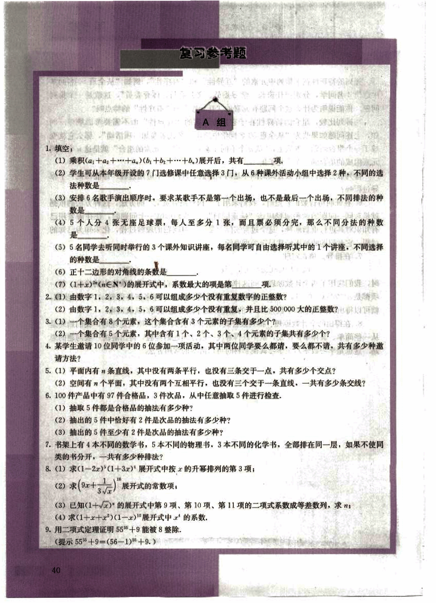
46 

# B组

1. 填空：

(1) 已知 $C_n^2 = 21$，那么 $n = $ _______

(2) 要排出某班一天中语文、数学、政治、英语、体育、艺术 6 堂课的课程表，要求数学课排在上午（前 4 节），体育课排在下午（后 2 节），不同排法种数是 _______

(3) 已知集合 A = {$a_1, a_2, a_3, a_4$}, B = {$b_1, b_2$}, 可以建立从集合 A 到集合 B 的不同映射的个数是 _______；可建立从集合 B 到集合 A 的不同映射的个数是 _______

(4) 一种汽车牌照号码由 2 个英文字母后接 4 个数字组成，且 2 个英文字母不能相同，不同牌照号码的个数是 _______

(5) 以正方体的顶点为顶点的三棱锥的个数是 _______

(6) 在 $(1 - 2x)^n$ 的展开式中，各项系数的和是 _______

2. 用数字 0, 1, 2, 3, 4, 5 组成没有重复数字的数：

(1) 能够组成多少个六位奇数？_______

(2) 能够组成多少个大于 201 345 的正整数？_______

3. (1) 平面内有两组平行线，一组有 m 条，另一组有 n 条，这两组平行线相交，可以构成多少个平行四边形？_______

(2) 空间有三组平行平面，第一组有 m 个，第二组有 n 个，第三组有 l 个，不同两组的平面都相交，且交线不都平行，可构成多少个平行六面体？_______

4. 某种产品的加工需要经过 5 道工序。

(1) 如果其中某一工序不能放在最后，有多少种排列加工顺序的方法？_______

(2) 如果其中两道工序既不能放在最前，也不能放在最后，有多少种排列加工顺序的方法？_______

5. 在 $(1 + x)^n + (1 + x)^{n-1} + ... + (1 + x) + 1$ 的展开式中，含 $x^r$ 项的系数是多少？_______

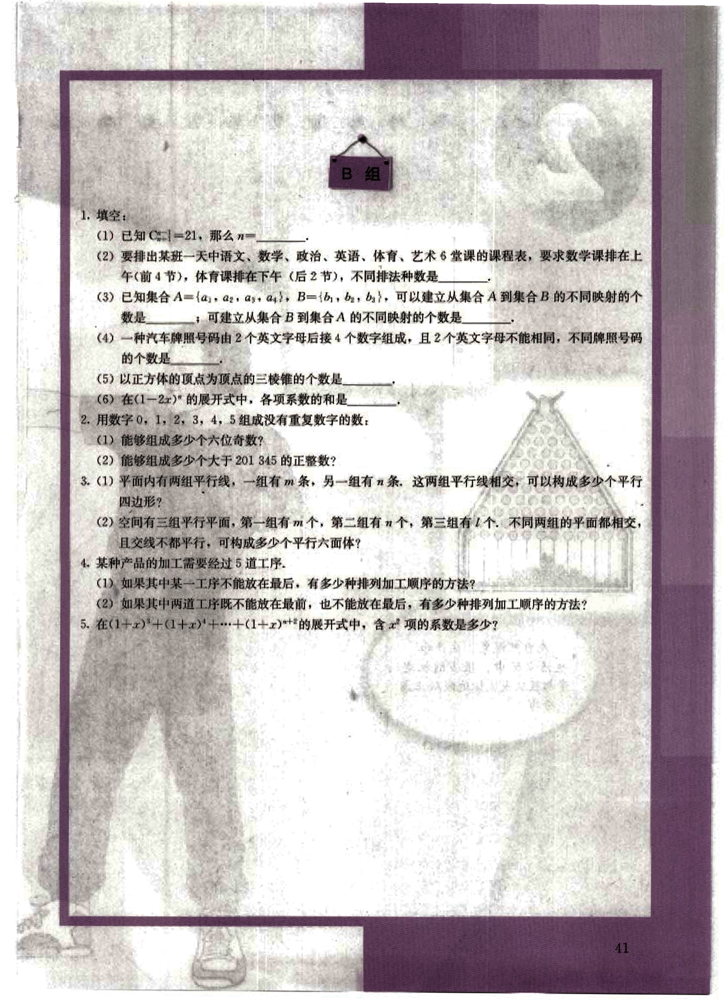
47 

# 2

在自然现象、生产和生活中，很多随机变量都服从或近似地服从正态分布。
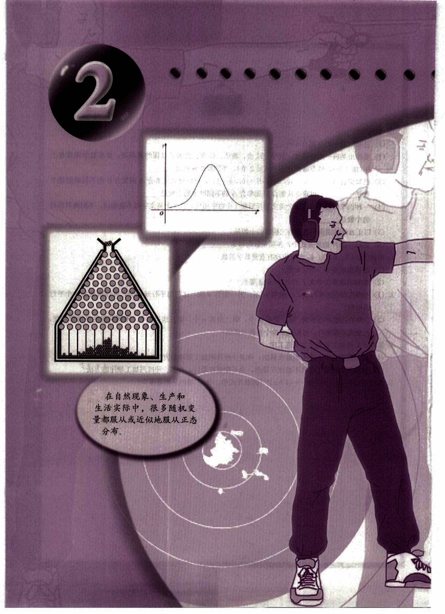
48 

# 第二章 随机变量及其分布

## 2.1 离散型随机变量及其分布列

## 2.2 二项分布及其应用

## 2.3 离散型随机变量的均值与方差

## 2.4 正态分布

射击选手的每次射击成绩具有随机性，他的射击特点该如何刻画？他的射击水平该如何评价？

我们知道，概率是描述随机事件发生可能性的大小的度量，而且我们也知道了某些简单的概率模型，例如，在掷一枚质地均匀的硬币的古典概率模型中，关心事件“正面向上”的概率；在掷一枚质地均匀的骰子的古典概率模型中，关心事件“出现1点”的概率；在描述新生儿性别的概率模型中，关心事件“新生儿是女孩”的概率……这些不同概率模型中所提及的事件有什么共同特点？是不是可以建立一个统一的概率模型来刻画这些随机事件？这就需要学习一些关于随机变量及其分布的知识。

把随机试验的结果数量化，用随机变量表示随机试验的结果，就可以利用数学工具来研究所感兴趣的随机现象。在本章中，我们将继续在必修课程学习概率的基础上，学习某些离散型随机变量分布列及其均值、方差等知识，利用离散型随机变量思想描述和分析某些随机现象，解决一些简单的实际问题，进一步体会概率模型的作用及运用概率思想思考和解决问题的特点。

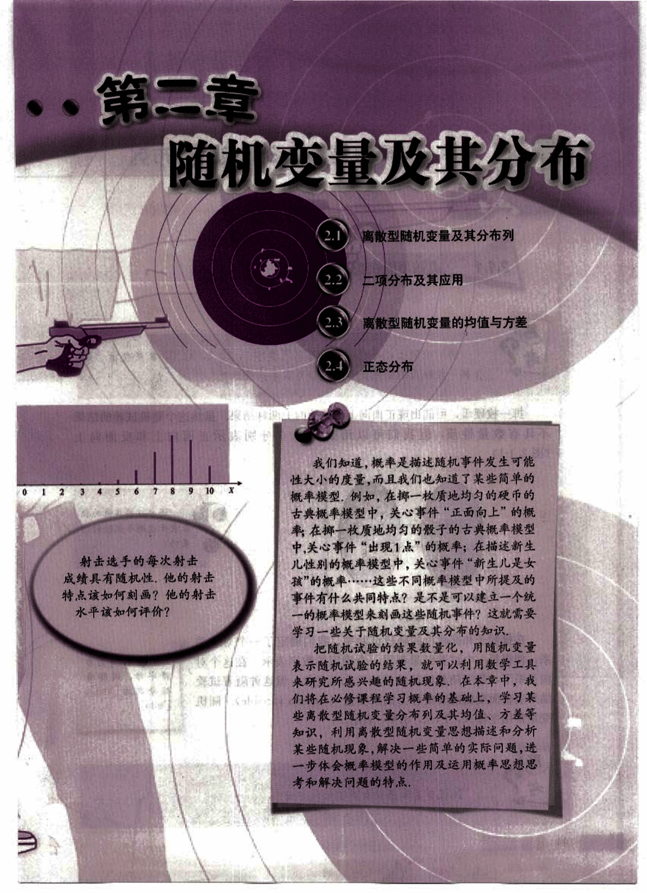
49 

# CHAPTER 2
## 2.1 离散型随机变量及其分布列

### 2.1.1 离散型随机变量

思考？

掷一枚骰子，出现的点数可以用数字1, 2, 3, 4, 5, 6来表示。那么掷一枚硬币的结果是否也可以用数字来表示呢？

掷一枚硬币，可能出现正面向上、反面向上两种结果。虽然这个随机试验的结果不具有数量性质，但我们可以用数1和0分别表示正面向上和反面向上（图2.1-1）。

[image](images/2.1-1.png)

思考？还可以用其他的数来表示这两个试验的结果吗？

在掷骰子和掷硬币的随机试验中，我们确定了一个对应关系，使得每一个试验结果都用一个确定的数字表示。在这个对应关系下，数字随着试验结果的变化而变化，像这种随着试验结果变化而变化的变量称为**随机变量**(random variable)。随机变量常用字母X, Y, ζ, η……表示。

思考？随机变量和函数有类似的地方吗？

44
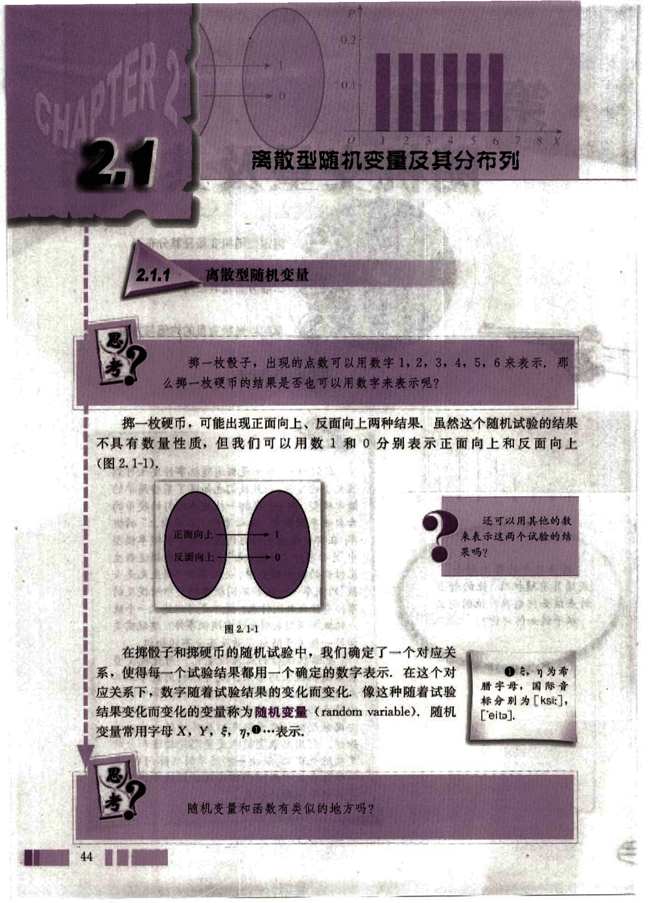
50 

# 第二章 随机变量及其分布

## 随机变量和函数

随机变量和函数都是一种映射，随机变量把随机试验的结果映为实数，函数把实数映为实数。在这两种映射之间，试验结果的范围相当于函数的定义域，随机变量的取值范围相当于函数的值域。我们把随机变量的取值范围叫做随机变量的值域。

例如，在含有10件次品的100件产品中，任意抽取4件，可能含有的次品件数X将随着抽取结果的变化而变化，是一个随机变量，其值域是{0, 1, 2, 3, 4}。

利用随机变量可以表达一些事件，例如{X=0}表示“抽出0件次品”，{X=4}表示“抽出4件次品”等，你能说出{X<3}在这里表示什么事件吗？“抽出3件以上次品”又如何用X表示呢？

所有取值可以一一列出的随机变量，称为离散型随机变量 (discrete random variable)。

离散型随机变量的例子很多，例如某人射击一次可能命中的环数X是一个离散型随机变量，它的所有可能取值为0, 1, …, 10；某网页在24小时内被浏览的次数Y也是一个离散型随机变量，它的所有可能取值为0, 1, 2, …。

## 思考

电灯泡的寿命X是离散型随机变量吗？

电灯泡的寿命X的可能取值是任何一个非负实数，而所有非负实数不能一一列出，所以X不是离散型随机变量。

在研究随机现象时，需要根据所关心的问题恰当地定义随机变量。例如，如果我们仅关心电灯泡的使用寿命是否超过1000小时，那么就可以定义如下的随机变量：

$Y = \begin{cases} 0, & \text{寿命} < 1000 \text{小时} \\ 1, & \text{寿命} \ge 1000 \text{小时} \end{cases}$

与电灯泡的寿命X相比较，随机变量Y的构造更简单，它只取两个不同的值0和1，是一个离散型随机变量，研究起来更加容易。

## 练习

1. 下列随机试验的结果能否用离散型随机变量表示？若能，请写出各随机变量可能的取值并说明这些值所表示的随机试验的结果：

(1) 抛掷两枚骰子，所得点数之和；

(2) 某足球队在5次点球中射进的球数；

(3) 任意抽取一瓶某种标有2500ml的饮料，其实际量与规定量之差。

2. 举出两个离散型随机变量的例子。

45

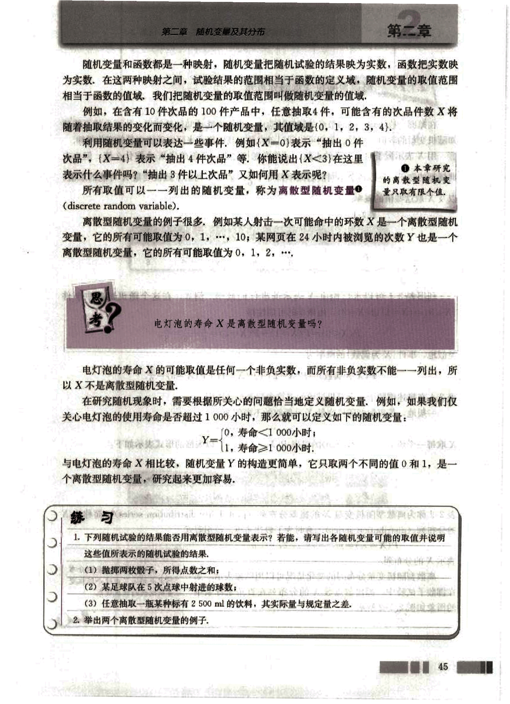
51 

# CHAPTER 2.1.2 离散型随机变量的分布列

在抛掷一枚质地均匀的骰子的随机试验中，我们不能预知试验结果，从而也就不能预知随机变量的取值，但是，我们可以通过各点数出现的概率来研究随机变量的变化规律。用X表示骰子向上一面的点数，虽然在抛掷之前，不能确定X会取什么值，但由古典概型的知识，它取各个不同值的概率都等于$\frac{1}{6}$。表2-1列出了随机变量X可能的取值，以及X取这些值的概率。

表2-1

| X | 1 | 2 | 3 | 4 | 5 | 6 |
|---|---|---|---|---|---|---|
| P | $\frac{1}{6}$ | $\frac{1}{6}$ | $\frac{1}{6}$ | $\frac{1}{6}$ | $\frac{1}{6}$ | $\frac{1}{6}$ |

利用表2-1可以求出能由X表示的事件的概率，例如，在这个随机试验中事件$\{X<3\}=\{X=1\}\cup\{X=2\}$，由概率的可加性得

$P(X<3) = P(X=1) + P(X=2) = \frac{1}{6} + \frac{1}{6} = \frac{1}{3}$

类似地，事件{X为偶数}的概率为

$P(X为偶数) = P(X=2) + P(X=4) + P(X=6) = \frac{1}{2}$

表2-1在描述掷骰子这个随机试验的规律中起着重要作用。

一般地，若离散型随机变量X可能取的不同值为

$x_1, x_2, \dots, x_i, \dots, x_n$

X取每一个值$x_i (i=1, 2, \dots, n)$的概率$P(X=x_i) = p_i$，以表格的形式表示如下：

表2-2

| X | $x_1$ | $x_2$ | $\dots$ | $x_i$ | $\dots$ | $x_n$ |
|---|---|---|---|---|---|---|
| P | $p_1$ | $p_2$ | $\dots$ | $p_i$ | $\dots$ | $p_n$ |

表2-2称为离散型随机变量X的概率分布列(probability distribution series)，简称为X的分布列(distribution series)。有时为了表达简单，也用等式

$P(X=x_i) = p_i, \quad i=1, 2, \dots, n$

表示X的分布列。

离散型随机变量分布列的变化情况可以用图象表示，如在掷骰子试验中，掷出的点数X的分布列在直角坐标系中的图象如图2.1-2所示。

46

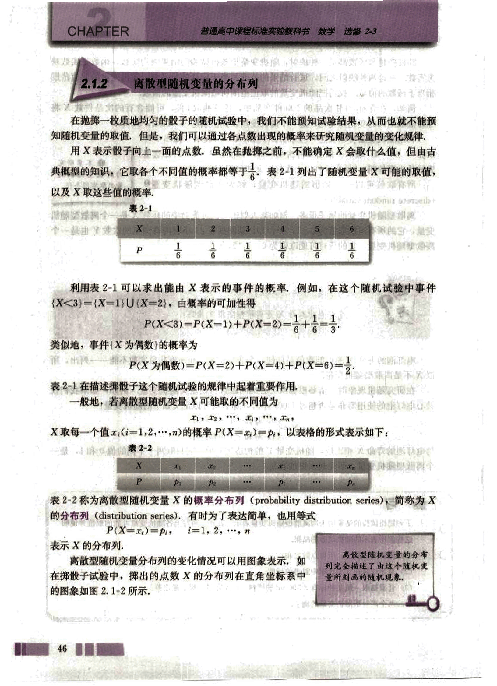
52 

# 第二章 随机变量及其分布

##  图2.1-2

[图2.1-2](images/2.1-2.png)

在图2.1-2中，横坐标是随机变量的取值，纵坐标为概率，从中可以看出，X的取值范围是{1, 2, 3, 4, 5, 6}，它取每个值的概率都是$\frac{1}{6}$。

根据概率的性质，离散型随机变量的分布列具有如下性质：

(1) $p_i ≥ 0$，$i = 1, 2, ..., n$;

(2) $\sum_{i=1}^{n}p_i = 1$。

利用分布列和概率的性质，可以计算能由随机变量表示的事件的概率。

## 例1

在掷一枚图钉的随机试验中，令：

$X = \begin{cases} 1, & \text{针尖向上;} \\ 0, & \text{针尖向下;} \end{cases}$

如果针尖向上的概率为p，试写出随机变量X的分布列。

解：根据分布列的性质，针尖向下的概率是(1-p)。于是，随机变量X的分布列是：

| X | 0 | 1 |
|---|---|---|
| P | 1-p | p |

像上面这样的分布列称为两点分布列。

两点分布列的应用非常广泛，如抽取的彩券是否中奖；买回的一件产品是否为正品；新生婴儿的性别；投篮是否命中等，都可以用两点分布列来研究。

如果随机变量X的分布列为两点分布列，就称X服从两点分布 (two-point distribution)，而称 $p = P(X=1)$ 为成功概率。

## 例2

在含有5件次品的100件产品中，任取3件，试求：

(1) 取到的次品数X的分布列；

(2) 至少取到1件次品的概率。

解：(1) 由于从100件产品中任取3件的结果数为$C_{100}^{3}$，从100件产品中任取3件，

47

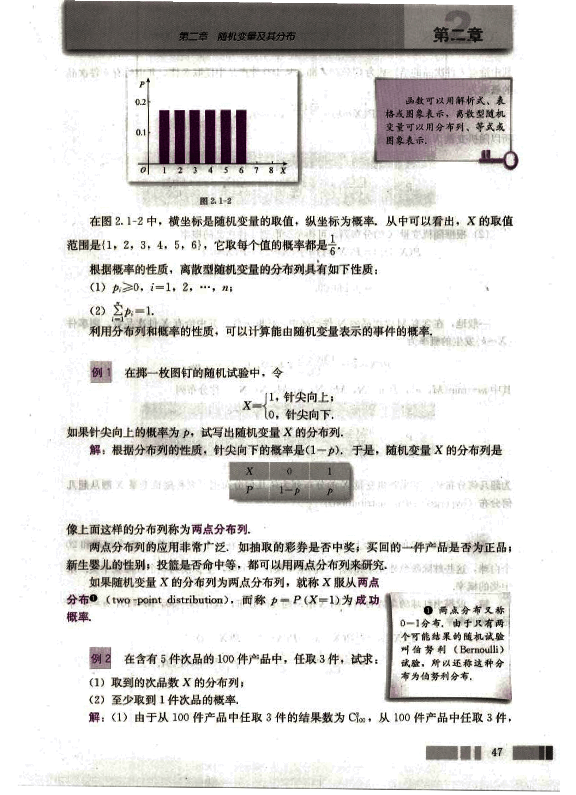
53 

# CHAPTER 2

普通高中课程标准实验教科书 数学 选修 2-3

其中恰有 *k* 件次品的结果数为 $C_5^k C_{95}^{3-k}$，那么从 100 件产品中任取 3 件，其中恰有 *k* 件次品
的概率为

$P(X = k) = \frac{C_5^k C_{95}^{3-k}}{C_{100}^3}$ ,  *k* = 0, 1, 2, 3.

所以随机变量 *X* 的分布列是

| *X* | 0 | 1 | 2 | 3 |
|---|---|---|---|---|
| *P* | $\frac{C_5^0 C_{95}^3}{C_{100}^3}$ | $\frac{C_5^1 C_{95}^2}{C_{100}^3}$ | $\frac{C_5^2 C_{95}^1}{C_{100}^3}$ | $\frac{C_5^3 C_{95}^0}{C_{100}^3}$ |

(2) 根据随机变量 *X* 的分布列，可得至少取到 1 件次品的概率

$P(X ≥ 1) = P(X = 1) + P(X = 2) + P(X = 3)$

≈ 0.138 06 + 0.005 88 + 0.000 06

= 0.144 00.

一般地，在含有 *M* 件次品的 *N* 件产品中，任取 *n* 件，其中恰有 *X* 件次品数，则事件
{*X* = *k*} 发生的概率为

$P(X = k) = \frac{C_M^k C_{N-M}^{n-k}}{C_N^n}$ , *k* = 0, 1, 2, ..., *m*

其中 *m* = min(*M*, *n*), 且 *n* ≤ *N*, *M* ≤ *N*, *n*, *M*, *N* ∈ N+. 称分布列

| *X* | 0 | 1 | ... | *m* |
|---|---|---|---|---|
| *P* | $\frac{C_M^0 C_{N-M}^n}{C_N^n}$ | $\frac{C_M^1 C_{N-M}^{n-1}}{C_N^n}$ | ... | $\frac{C_M^m C_{N-M}^{n-m}}{C_N^n}$ |

为超几何分布列。如果随机变量 *X* 的分布列为超几何分布列，则称随机变量 *X* 服从超几
何分布 (hypergeometric distribution).

例 3 在某年级的联欢会上设计了一个摸奖游戏，在一个口袋中装有 10 个红球和 20
个白球，这些球除颜色外完全相同，一次从中摸出 5 个球，至少摸到 3 个红球就中奖，求
中奖的概率.

解：设摸出红球的个数为 *X*，则 *X* 服从超几何分布，其中 *N* = 30, *M* = 10, *n* = 5. 于
是中奖的概率

$P(X ≥ 3) = P(X = 3) + P(X = 4) + P(X = 5)$

$= \frac{C_{10}^3 C_{20}^2}{C_{30}^5} + \frac{C_{10}^4 C_{20}^1}{C_{30}^5} + \frac{C_{10}^5 C_{20}^0}{C_{30}^5} \approx 0.191$.

48

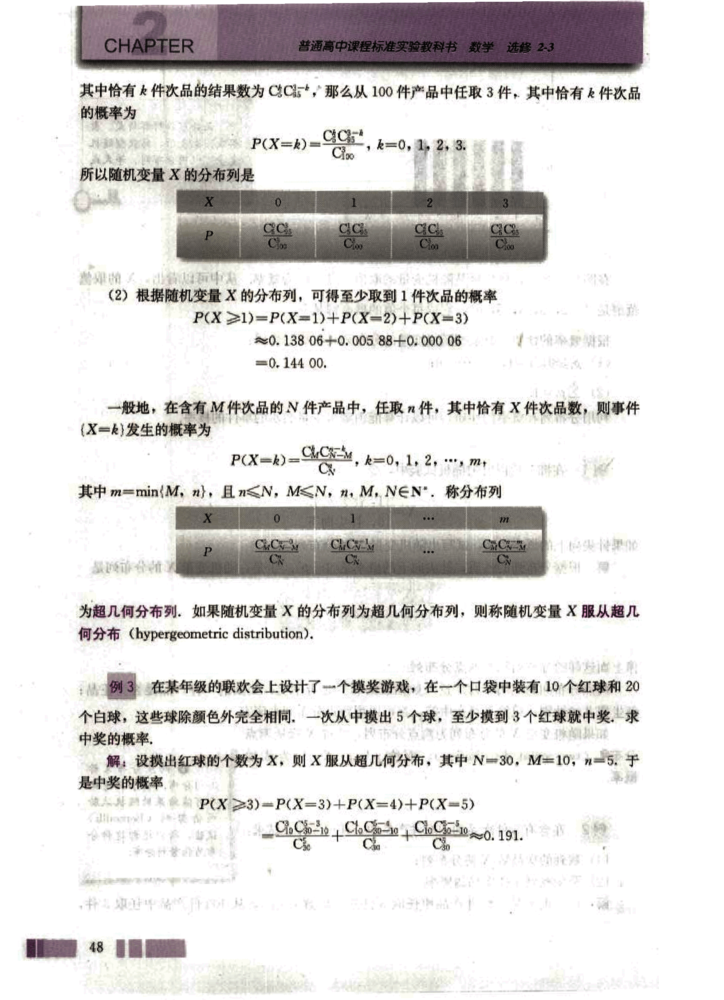
54 

# 第二章 随机变量及其分布

## 思考

如果要将这个游戏的中奖概率控制在55%左右，那么应该如何设计中奖规则？

## 练习

1. 篮球比赛中每次罚球命中得1分，不中得0分，已知某运动员罚球命中的概率为0.7，求他一次罚球得分的分布列。
2. 抛掷一枚质地均匀的硬币2次，写出正面向上次数X的分布列。
3. 从一副不含大小王的52张扑克牌中任意抽出5张，求至少有3张A的概率。
4. 举出分别服从两点分布、超几何分布的随机变量的例子各一个。

## 习题2.1

### A组

1. 下列随机试验的结果能否用离散型随机变量表示？若能，则写出各随机变量可能的取值，并说明这些值所表示的随机试验的结果：
    (1) 从学校回家要经过5个红绿灯口，可能遇到红灯的次数；
    (2) 在优、良、中、及格、不及格5个等级的测试中，某同学可能取得的成绩。
2. 在某项体能测试中，跑1km成绩在4min之内为优秀，某同学跑1km所花费的时间X是离散型随机变量吗？如果我们只关心该同学是否能够取得优秀成绩，应该如何定义随机变量？
3. 对于给定的随机试验，定义在其上的任何一个随机变量都可以描述这个随机试验可能出现的所有的随机事件吗？为什么？
4. 某同学求得一个离散型随机变量的分布列如下：

| X | 0 | 1 | 2 | 3 |
|---|---|---|---|---|
| P | 0.2 | 0.3 | 0.15 | 0.45 |

试说明该同学的计算结果是否正确。

5. 某射手射击所得环数X的分布列如下：

| X | 4 | 5 | 6 | 7 | 8 | 9 | 10 |
|---|---|---|---|---|---|---|---|
| P | 0.02 | 0.04 | 0.06 | 0.09 | 0.28 | 0.29 | 0.22 |

49

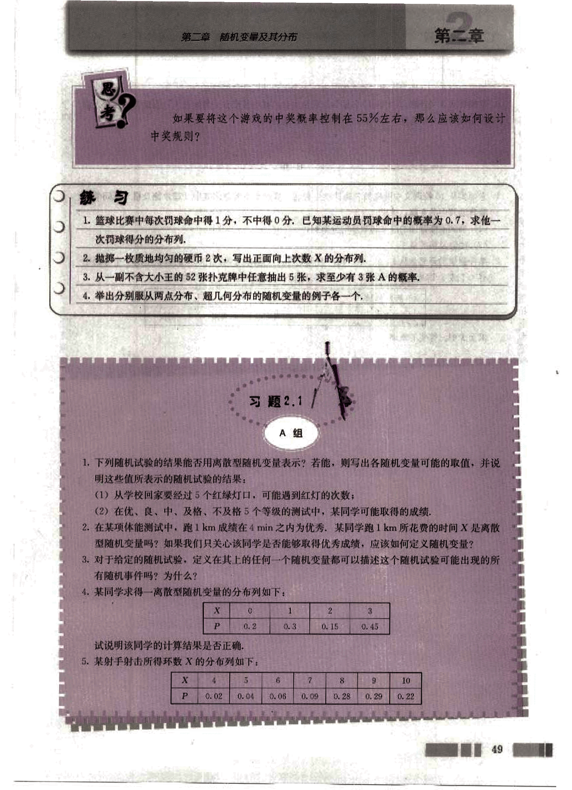
55 

# CHAPTER 2

普通高中课程标准实验教科书 数学 选修 2-3

如果命中 8～10 环为优秀，那么他射击一次为优秀的概率是多少？

6. 学校要从 30 名候选人中选 10 名同学组成学生会，其中某班有 4 名候选人，假设每名候选人都
有相同的机会被选到，求该班恰有 2 名同学被选到的概率。

## B 组

1. 老师要从 10 篇课文中随机抽 3 篇让学生背诵，规定至少要背出其中 2 篇才能及格，某同学只
能背诵其中的 6 篇，试求：
(1) 抽到他能背诵的课文的数量的分布列；
(2) 他能及格的概率。

2. 某种彩票的开奖是从 1，2，…，36 中任意选出 7 个基本号码，凡购买的彩票上的 7 个号码中
有 4 个或 4 个以上基本号码就中奖，根据基本号码个数的多少，中奖的等级为：

| 含有基本号码数 | 4     | 5     | 6     | 7     |
| :----------------- | :---- | :---- | :---- | :---- |
| 中奖等级         | 四等奖 | 三等奖 | 二等奖 | 一等奖 |

求至少中三等奖的概率。

50

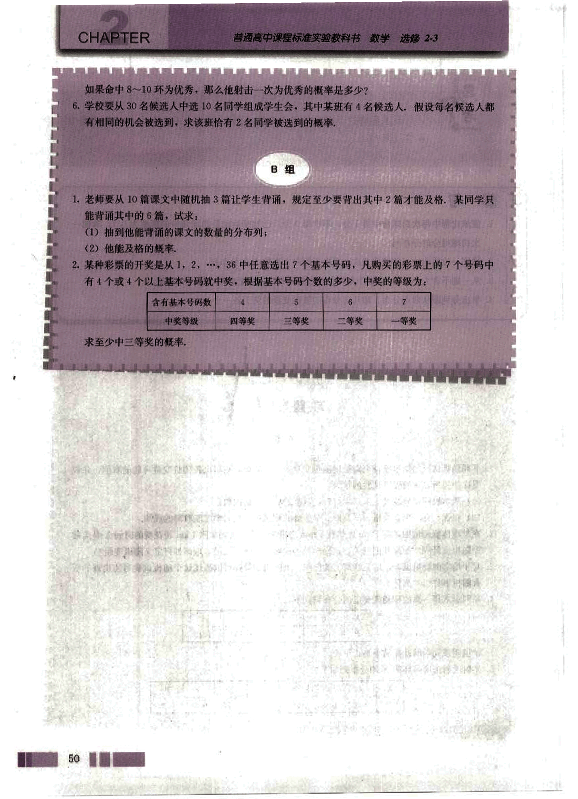
56 

# CHAPTER 2

## 2.2 二项分布及其实用

### 2.2.1 条件概率

三张彩票中只有一张中奖，现分给由三名同学无放回地抽取，问最后一名同学抽到中奖彩票的概率是多少？

若抽到中奖彩票用“Y”表示，没有抽到用“Y”表示，那么三名同学的抽奖结果共有三种可能：YYY，YY和YYY。用B表示事件“最后一名同学抽到中奖彩票”，则B仅包含一个基本事件YYY。由古典概型计算公式可知，最后一名同学抽到中奖彩票的概率为

$P(B) = \frac{1}{3}$。

如果已经知道第一名同学有抽到中奖彩票，那么最后一名同学抽到中奖彩票的概率又是多少？

因为已知第一名同学有抽到中奖彩票，所以可能出现的基本事件只有YYY和YYY，而“最后一名同学抽到中奖彩票”包含的基本事件仍是YYY。由古典概型计算公式可知，最后一名同学抽到中奖彩票的概率为$\frac{1}{2}$，不妨记为$P(B|A)$，其中A表示事件“第一名同学有抽到中奖彩票”。

51

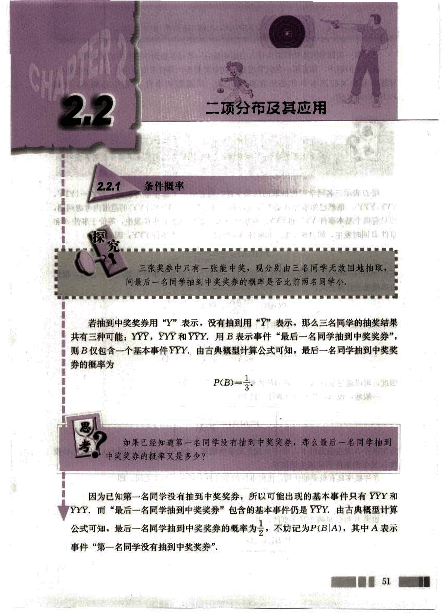
57 

# CHAPTER

普通高中课程标准实验教科书 数学 选修2-3

已知第一名同学的抽奖结果为什么会影响最后一名同学抽到中奖奖券的概率呢？
在这个问题中，知道第一名同学没有抽到中奖奖券，等价于知道事件A一定会发生，
导致可能出现的基本事件必然在事件A中，从而影响事件B发生的概率，使得
P(B|A)≠P(B).

## 思考？

对于上面的事件A和事件B，P(B|A)与它们的概率有什么关系呢？

用Ω表示三名同学可能抽取的结果全体，则它由三个基本事件组成，即Ω={YYY,
YYY,YYY}。既然已知事件A必然发生，那么只需在A={YYY,YYY}的范围内考虑问题，
即只有两个基本事件YYY和YYY。在事件A发生的情况下事件B发生，等价于事件A和
事件B同时发生，即AB发生，而事件AB中仅含一个基本事件YYY，因此

$P(B|A) = \frac{1}{2} = \frac{n(AB)}{n(A)}.$

其中n(A)和n(AB)分别表示事件A和事件AB所包含的基本事件个数。另一方面，根据
古典概型的计算公式，

$P(AB) = \frac{n(AB)}{n(Ω)},  P(A) = \frac{n(A)}{n(Ω)}.$

其中n(Ω)表示Ω中包含的基本事件个数，所以，

$P(B|A) = \frac{n(AB)}{n(A)} = \frac{n(AB)/n(Ω)}{n(A)/n(Ω)} = \frac{P(AB)}{P(A)}.$

因此，可以通过事件A和事件AB的概率来表示P(B|A)。

一般地，设A，B为两个事件，且P(A)>0，称

$P(B|A) = \frac{P(AB)}{P(A)}$

为在事件A发生的条件下，事件B发生的条件概率(conditional probability)。P(B|A)读
作A发生的条件下B发生的概率。

条件概率具有概率的性质，任何事件的条件概率都在0和1之间，即

$0 ≤ P(B|A) ≤ 1.$

如果B和C是两个互斥事件，则

$P(B∪C|A) = P(B|A) + P(C|A).$

52

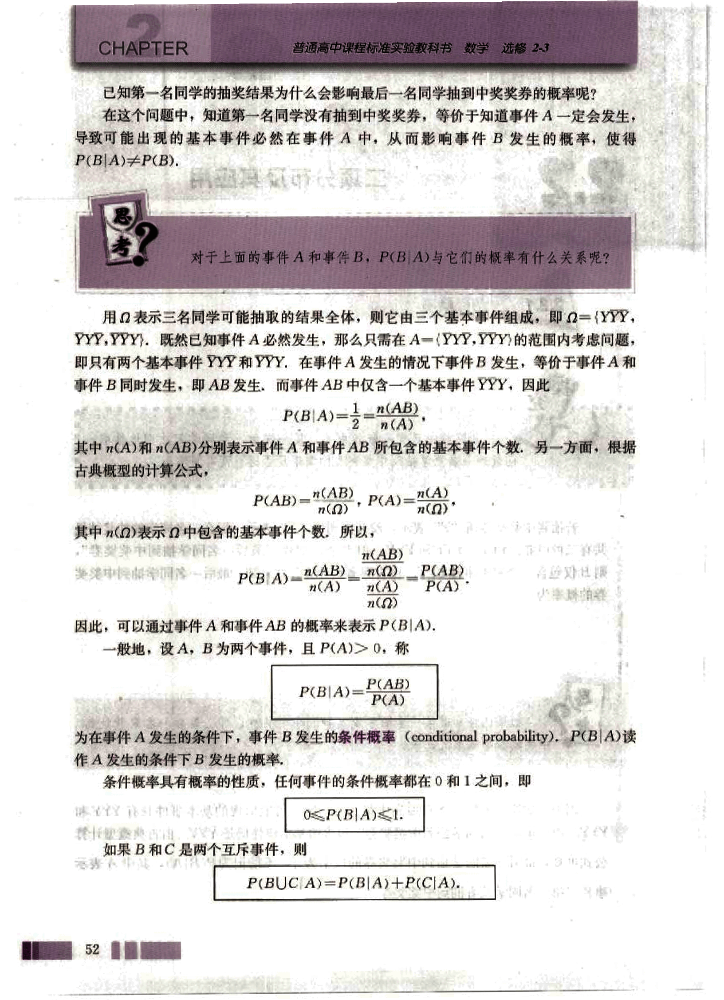
58 

# 第二章 随机变量及其分布

## 例1

在5道题中有3道理科题和2道文科题，如果不放回地依次抽取2道题，求：

(1) 第1次抽到理科题的概率；
(2) 第1次和第2次都抽到理科题的概率；
(3) 在第1次抽到理科题的条件下，第2次抽到理科题的概率。

解：设第1次抽到理科题为事件A，第2次抽到理科题为事件B，则第1次和第2次都抽到理科题为事件AB.

(1) 从5道题中不放回地依次抽取2道的事件数为 $n(\Omega) = A_5^2 = 20$。
根据分步乘法计数原理，$n(A) = A_3^1 \times A_4^1 = 12$。于是
$P(A) = \frac{n(A)}{n(\Omega)} = \frac{12}{20} = \frac{3}{5}$。

(2) 因为 $n(AB) = A_3^2 = 6$，所以
$P(AB) = \frac{n(AB)}{n(\Omega)} = \frac{6}{20} = \frac{3}{10}$。

(3) 解法1 由(1)(2)可得，在第1次抽到理科题的条件下，第2次抽到理科题的概率为
$P(B|A) = \frac{P(AB)}{P(A)} = \frac{\frac{3}{10}}{\frac{3}{5}} = \frac{1}{2}$。

解法2 因为 $n(AB) = 6$，$n(A) = 12$，所以
$P(B|A) = \frac{n(AB)}{n(A)} = \frac{6}{12} = \frac{1}{2}$。

[image](images/image.png)

## 例2

一张储蓄卡的密码共有6位数字，每位数字都可从0～9中任选一个，某人在银行自动提款机上取钱时，忘记了密码的最后一位数字，求：

(1) 任意按最后一位数字，不超过2次就按对的概率；
(2) 如果他记得密码的最后一位是偶数，不超过2次就按对的概率。

解：设第i次按对密码为事件$A_i (i = 1, 2)$，则$A = A_1 \cup (A_1^c A_2)$ 表示不超过2次就按对密码。

(1) 因为事件$A_1$与事件$A_1^c A_2$互斥，由概率的加法公式得
$P(A) = P(A_1) + P(A_1^c A_2) = \frac{1}{10} + \frac{9 \times 1}{10 \times 9} = \frac{1}{5}$

(2) 用B表示最后一位按偶数的事件，则
$P(A|B) = P(A_1|B) + P(A_1^c A_2|B)$

53

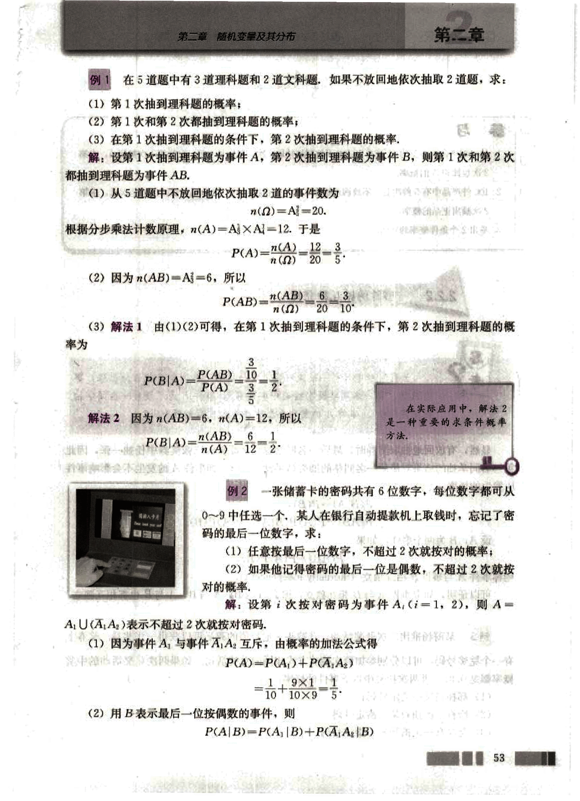
59 

# CHAPTER 2

$\frac{1}{5} + \frac{4 \times 1}{5 \times 4} = \frac{2}{5}$

## 练习

1. 从一副不含大小王的52张扑克牌中不放回地抽取2次，每次抽1张，已知第1次抽到A，求第2次也抽到A的概率。

2. 100件产品中有5件次品，不放回地抽取2次，每次抽1件，已知第1次抽出的是次品，求第2次抽出正品的概率。

3. 举出2个条件概率的实例。

## 2.2.2 事件的相互独立性

### 思考

三张奖券中只有一张能中奖，现分别由三名同学有放回地抽取，事件A为“第一名同学没有抽到中奖奖券”，事件B为“最后一名同学抽到中奖奖券”，事件A的发生会影响事件B发生的概率吗？

显然，有放回地抽取奖券时，最后一名同学也是从原来的三张奖券中任抽一张，因此第一名同学抽的结果对最后一名同学的抽奖结果没有影响，即事件A的发生不会影响事件B发生的概率，于是

$P(B|A) = P(B),$

$P(AB) = P(A)P(B|A) = P(A)P(B).$

设A，B为两个事件，如果

$P(AB) = P(A)P(B),$

则称事件A与事件B相互独立(mutually independent)。

可以证明，如果事件A与B相互独立，那么A与B，A与B，A与B也都相互独立。

### 例3

某商场推出二次开奖活动，凡购买一定价值的商品可以获得一张奖券，奖券上有一个兑奖号码，可以分别参加两次抽奖方式相同的兑奖活动，如果两次兑奖活动的中奖概率都是0.05，求两次抽奖中以下事件的概率：

(1) 都抽到某一指定号码；

(2) 恰有一次抽到某一指定号码；

(3) 至少有一次抽到某一指定号码。

54

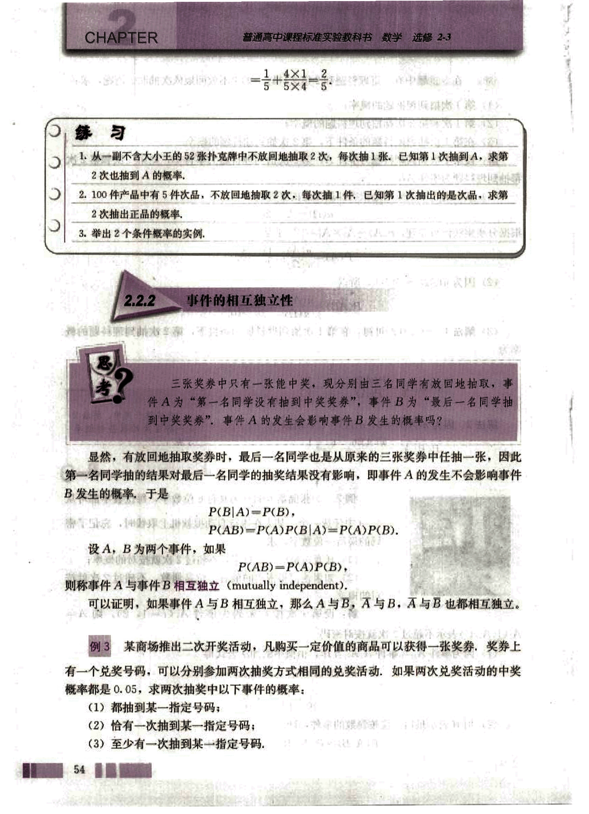
60 

# 第二章 随机变量及其分布

## 解：

(1) 记“第一次抽奖抽到某一指定号码”为事件 A，“第二次抽奖抽到某一指定号码”为事件 B，则“两次抽奖都抽到某一指定号码”就是事件 AB。由于两次抽奖结果互不影响，因此 A 与 B 相互独立，于是由独立性可得，两次抽奖都抽到某一指定号码的概率

$P(AB) = P(A)P(B) = 0.05 \times 0.05 = 0.0025$.

(2) “两次抽奖恰有一次抽到某一指定号码”可以用 $(AB) \cup (AB)$ 表示。由于事件 AB 与 $\overline{AB}$ 互斥，根据概率加法公式和相互独立事件的定义，所求的概率为

$P(AB) + P(\overline{AB}) = P(A)P(\overline{B}) + P(\overline{A})P(B)$

$= 0.05 \times (1 - 0.05) + (1 - 0.05) \times 0.05$

$= 0.095$.

(3) “两次抽奖至少有一次抽到某一指定号码”可以用 $(AB) \cup (AB) \cup (\overline{AB})$ 表示。由于事件 AB，$\overline{AB}$ 和 $\overline{AB}$ 两两互斥，根据概率加法公式和相互独立事件的定义，所求的概率为

$P(AB) + P(\overline{AB}) + P(\overline{AB}) = 0.0025 + 0.095 = 0.0975$.

## 思考

二次开奖至少中一次奖的概率是一次开奖中奖概率的两倍吗？为什么？

## 练习

1. 分别抛掷 2 枚质地均匀的硬币，设 A 是事件“第 1 枚为正面”，B 是事件“第 2 枚为正面”，C 是事件“2 枚结果相同”。问：A，B，C 中哪两个相互独立？

2. 一个口袋内装有 2 个白球和 2 个黑球，那么

(1) 先摸出 1 个白球不放回，再摸出 1 个白球的概率是多少？

(2) 先摸出 1 个白球后放回，再摸出 1 个白球的概率是多少？

3. 天气预报，在元旦假期甲地的降雨概率是 0.2，乙地的降雨概率是 0.3。假定在这段时间内两地是否降雨相互之间没有影响，计算在这段时间内：

(1) 甲、乙两地都降雨的概率；

(2) 甲、乙两地都不降雨的概率；

(3) 其中至少一个地方降雨的概率。

4. 如果事件 A 与 B 相互独立，试证明 A 与 B，A 与 $\overline{B}$，$\overline{A}$ 与 B 也都相互独立。

5. 举出相互独立事件的 2 个实例。

55

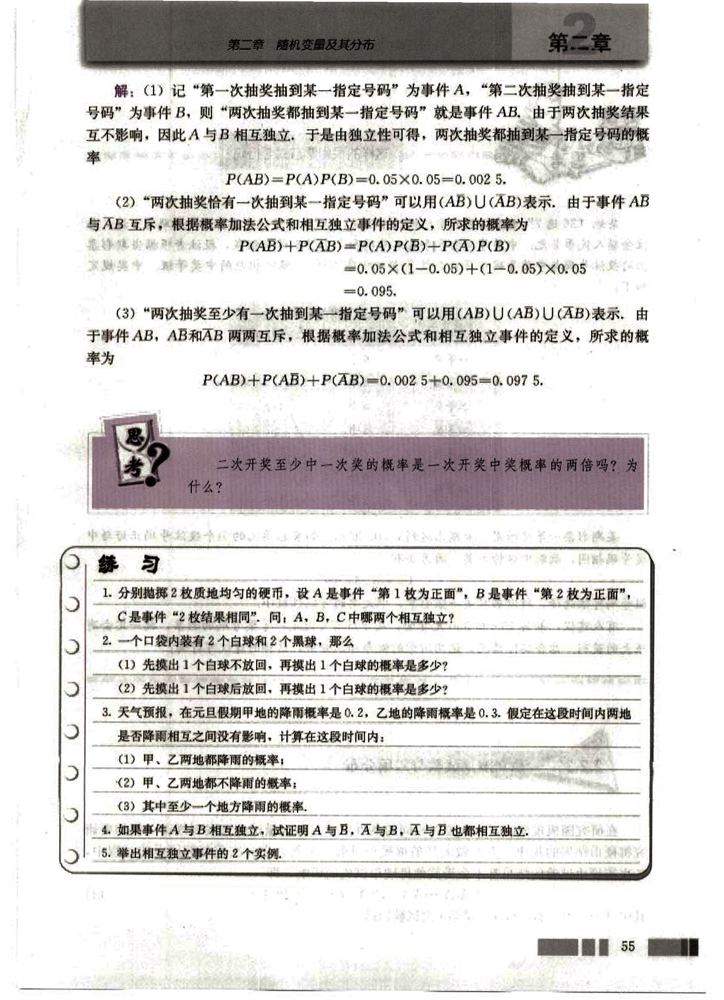
61 

# CHAPTER 2

## 这样的买彩票方式可行吗？

某地“36选7”电脑福利彩票的投注方法是，从36个号码中选择7个号码为1注，每注金额人民币2元。中奖号码由6个基本号码和1个特别号码组成，投注者根据当期彩票上的投注号码与中奖号码相符的个数多少（顺序不限），确定相应的中奖等级，中奖规定如下：

| 中奖等级 | 基本号码 | 特别号码 |
|---|---|---|
| 一等奖 | 6个 | 1个 |
| 二等奖 | 6个 |  |
| 三等奖 | 5个 | 1个 |
| 四等奖 | 5个 |  |
| 五等奖 | 4个 | 1个 |
| 六等奖 | 4个 |  |
|  | 3个 | 1个 |

某期彩票一等奖的累计金额已达到2 500万元。如果彩票上的7个投注号码正好与中奖号码相同，就能中这份大奖，因为共有 $C_7^{36}$ = 8 347 680 组号码可供选择，所以若只买一张彩票，中大奖的可能性极小。

有人建议，筹集16 695 360元资金，买下所有可能是一等奖号码的彩票，就一定会有很大的获利。结合实际情况，运用所学的概率知识分析，这样的建议可行吗？

## 2.2.3 独立重复试验与二项分布

在研究随机现象时，经常要在相同的条件下重复做大量试验来发现规律。例如要研究掷硬币结果的规律，需要做大量的掷硬币试验，显然，在 *n* 次重复掷硬币的过程中，各次掷硬币试验的结果都不会受其他掷硬币试验的影响，即

$P(A_1A_2...A_n) = P(A_1)P(A_2)...P(A_n)$

其中 $A_i$ (i=1, 2, ..., *n*) 是第 *i* 次试验的结果。(1)

56

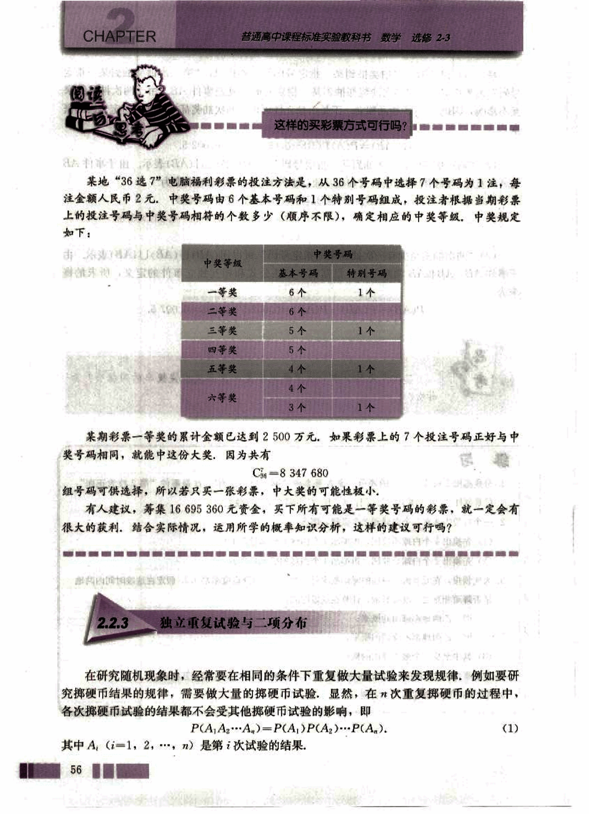
62 

# 第二章 随机变量及其分布

##  独立重复试验

一般地，在相同条件下重复做的 *n* 次试验称为 *n* 次独立重复试验 (independent and repeated trials).

在 *n* 次独立重复试验中，“在相同的条件下”等价于各次试验的结果不会受其他试验的影响，即(1)式成立。

## 例题

投掷一枚图钉，设针尖向上的概率为 *p*，则针尖向下的概率为 *q* = 1 - *p*. 连续掷一枚图钉 3 次，仅出现 1 次针尖向上的概率是多少？

连续掷一枚图钉 3 次，就是做 3 次独立重复试验，用 Ai (i = 1, 2, 3) 表示第 i 次掷得针尖向上的事件，用 B1 表示“仅出现一次针尖向上”的事件，则

B1 = (A1A2A3) ∪ (A1A2A3) ∪ (A1A2A3).

由于事件 A1A2A3，A1A2A3 和 A1A2A3 彼此互斥，由概率加法公式得

P(B1) = P(A1A2A3) + P(A1A2A3) + P(A1A2A3)

= q2p + q2p + qp2 = 3q2p.

所以，连续掷一枚图钉 3 次，仅出现 1 次针尖向上的概率是 3q2p.

## 思考题

上面我们利用掷 1 次图钉，针尖向上的概率为 *p*，求出了连续掷 3 次图钉，仅出现 1 次针尖向上的概率。类似地，连续掷 3 次图钉，出现 *k* (0 ≤ *k* ≤ 3) 次针尖向上的概率是多少？你能发现其中的规律吗？

对于任何 0 ≤ *k* ≤ 3，用 Bk 表示连续掷一枚图钉 3 次，出现 *k* 次针尖向上的事件，类似于前面的讨论，可以得到：

P(B0) = P(A1A2A3) = q3,

P(B1) = P(A1A2A3) + P(A1A2A3) + P(A1A2A3) = 3q2p,

P(B2) = P(A1A2A3) + P(A1A2A3) + P(A1A2A3) = 3qp2,

P(B3) = P(A1A2A3) = p3.

仔细观察上述等式，可以发现

P(Bk) = Ck3pkq3-k,  k = 0, 1, 2, 3.

一般地，在 *n* 次独立重复试验中，设事件 A 发生的次数为 X，在每次试验中事件 A 发生的概率为 *p*，那么在 *n* 次独立重复试验中，事件 A 恰好发生 *k* 次的概率为

57

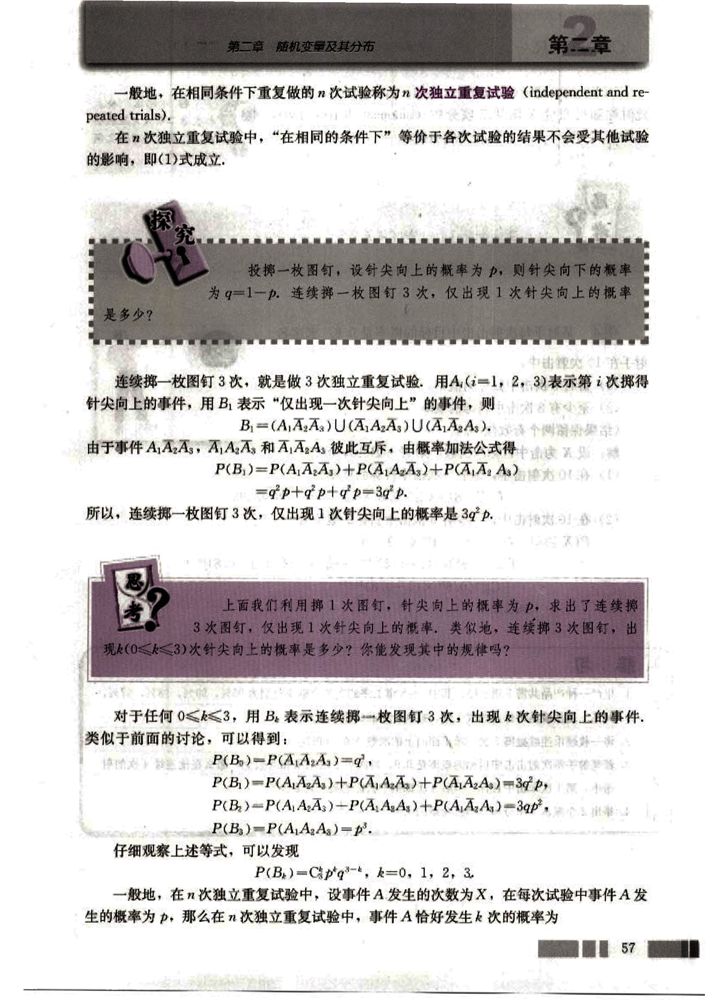
63 

# CHAPTER 2

普通高中课程标准实验教科书 数学 选修 2-3

P(X = k) = $C_n^k p^k (1 - p)^{n-k}$,  k = 0, 1, 2, ..., n.

此时称随机变量 X 服从二项分布 (binomial distribution), 记作 X ~ B(n, p), 并称 p 为成功概率。

? 对比这个公式与表示二项式定理的公式，你能看出它们之间的联系吗？

思考？

二项分布与两点分布有何关系？

## 例 4

某射手每次射击击中目标的概率是 0.8. 求这名射手在 10 次射击中，

(1) 恰有 8 次击中目标的概率；

(2) 至少有 8 次击中目标的概率.

(结果保留两个有效数字.)

解：设 X 为击中目标的次数，则 X ~ B(10, 0.8).

(1) 在 10 次射击中，恰有 8 次击中目标的概率为

P(X = 8) = $C_{10}^8 \times 0.8^8 \times (1 - 0.8)^{10 - 8} \approx 0.30$.

(2) 在 10 次射击中，至少有 8 次击中目标的概率为

P(X ≥ 8) = P(X = 8) + P(X = 9) + P(X = 10)

= $C_{10}^8 \times 0.8^8 \times (1 - 0.8)^{10 - 8} + C_{10}^9 \times 0.8^9 \times (1 - 0.8)^{10 - 9} + C_{10}^{10} \times 0.8^{10} \times (1 - 0.8)^{10 - 10}$

≈ 0.68.

## 练习

1. 生产一种产品共需 5 道工序，其中 1～5 道工序的生产合格率分别为 96%，99%，98%，97%，96%，现从成品中任意抽取 1 件，抽到合格品的概率是多少？

2. 将一枚硬币连续抛掷 5 次，求正面向上的次数 X 的分布列.

3. 若某射手每次射击击中目标的概率是 0.9，每次射击的结果相互独立，那么在他连续 4 次的射击中，第 1 次未击中目标，但后 3 次都击中目标的概率是多少？

4. 举出 2 个服从二项分布的随机变量的实例.

58

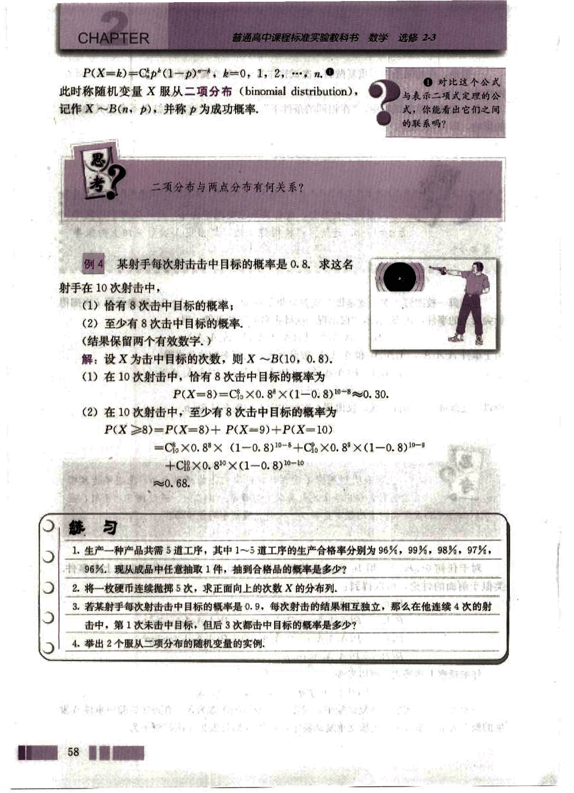
64 

# 第二章 随机变量及其分布

## 服从二项分布的随机变量取何值时概率最大

二项分布是应用最广泛的离散型随机变量概率模型，对与二项分布有关的一些问题的探究是很有意义的。例如，在上面的例4中，我们还可以提这样的问题：

如果某射手每次射击击中目标的概率为0.8，每次射击的结果相互独立，那么他在10次射击中，最有可能击中目标几次？

设他在10次射击中，击中目标的次数为X。由于射击中每次射击的结果是相互独立的，因此X~B(10, 0.8)。于是可得他恰好k次击中目标的概率为：

$P(X=k) = C_k^{10} \times 0.8^k \times 0.2^{10-k}, \quad 0 \le k \le 10.$

从而

$\frac{P(X=k)}{P(X=k-1)} = \frac{(10-k+1) \times 0.8}{k \times 0.2} = \frac{11 \times 0.8 - k}{k \times 0.2}, \quad 1 \le k \le 10.$

于是，当$k < 8.8$时，$P(X=k-1) < P(X=k)$；当$k > 8.8$时，$P(X=k-1) > P(X=k)$。

由以上分析可知，他在10次射击中，最有可能8次击中目标。

## 思考

如果X~B(n, p)，其中0 < p < 1，那么当k由0增大到n时，P(X=k)是怎样变化的？k取何值时，P(X=k)最大？

59

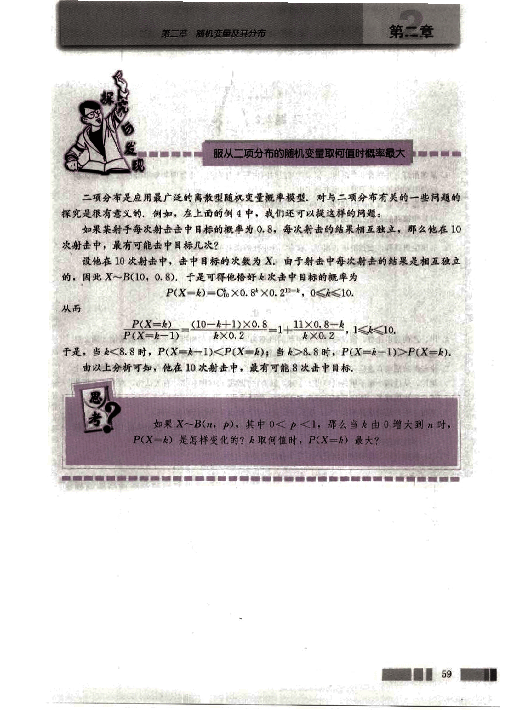
65 

# CHAPTER 2

## 习题 2.2

### A组

1. 某盏吊灯上并联着3个灯泡。如果在某段时间内每个灯泡能正常照明的概率都是0.7，那么在这段时间内吊灯能照明的概率是多少？

2. 一个箱子中装有 2*n 个白球和 (2*n - 1) 个黑球，一次摸出 *n* 个球。

(1) 求摸到的都是白球的概率；

(2) 在已知它们的颜色相同的情况下，求该颜色是白色的概率。

3. 如果生男孩和生女孩的概率相等，求有3个小孩的家庭中至少有2个女孩的概率。

4. 设事件 A，B，C 满足条件 P(A) > 0，B 和 C 互斥，试证明

P(B∪C|A) = P(B|A) + P(C|A).

### B组

1. 甲、乙两选手比赛，假设每局比赛甲胜的概率为 0.6，乙胜的概率为 0.4，那么采用3局2胜制还是采用5局3胜制对甲更有利？你对局制长短的设置有何认识？

2. 学校游园活动有这样一个项目：甲箱子里装3个白球，2个黑球，乙箱子里装2个白球，2个黑球，从这两个箱子里分别摸出1个球，如果它们都是白球则获奖，有人认为，两个箱子里装的白球比黑球多，所以获奖的概率大于0.5。你认为呢？

3. 某批件产品的次品率为2%，现从中任意地依次抽出3件进行检验，问：

(1) 当 n = 500, 5000, 50000 时，分别以放回和不放回的方式抽取，恰好抽到1件次品的概率各是多少？

(2) 根据(1)，你对超几何分布与二项分布的关系有何认识？

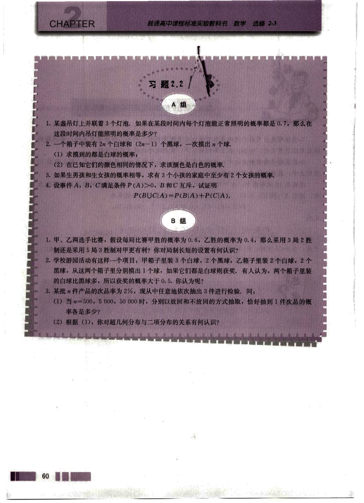
66 

# CHAPTER 2

## 2.3 离散型随机变量的均值与方差

对于离散型随机变量，可以由它的概率分布列确定与该随机变量相关事件的概率，但在实际问题中，有时我们更感兴趣的是随机变量的某些数字特征，例如，要了解某班同学在一次数学测验中的总体水平，很重要的是看平均分；要了解某班同学数学成绩是否“两极分化”，则需要考察这个班数学成绩的方差。

### 2.3.1 离散型随机变量的均值

某商场要将单价分别为18元/kg，24元/kg，36元/kg的3种糖果按3:2:1的比例混合销售，如何对混合糖果定价才合理？

由于平均在每1 kg的混合糖果中，3种糖果的质量分别是$\frac{1}{2}$ kg，$\frac{1}{3}$ kg和$\frac{1}{6}$ kg，所以混合糖果的合理价格应该是

$18 \times \frac{1}{2} + 24 \times \frac{1}{3} + 36 \times \frac{1}{6} = 23$(元/kg).

它是三种糖果价格的一种加权平均，这里的权数分别是$\frac{1}{2}$，$\frac{1}{3}$和$\frac{1}{6}$。

如果混合糖果中每一颗糖果的质量都相等，你能解释权数的实际含义吗？

根据古典概型，在混合糖果中，任取一颗糖果，这颗糖果为第一种糖果的概率为$\frac{1}{2}$，为第二种糖果的概率为$\frac{1}{3}$，为第三种糖果的概率为$\frac{1}{6}$，即取出的这颗糖果的价格为

61

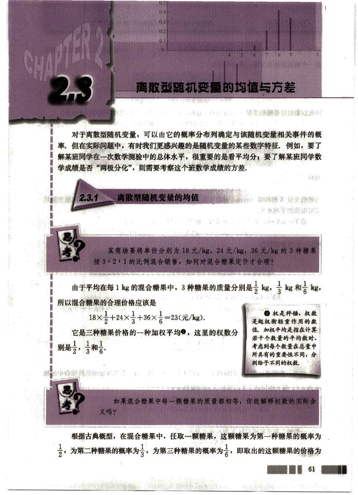
67 

# CHAPTER 2

普通高中课程标准实验教科书 数学 选修 2-3

18 元/kg，24 元/kg 或 36 元/kg 的概率分别为 $\frac{1}{2}$，$\frac{1}{3}$ 和 $\frac{1}{6}$。用 X 表示这颗糖果的价格，则它是一个离散型随机变量，其分布列为：

| X     | 18     | 24     | 36     |
| :---- | :------ | :------ | :------ |
| P     | $\frac{1}{2}$ | $\frac{1}{3}$ | $\frac{1}{6}$ |

因此权数恰好是随机变量 X 的分布列。这样，每千克混合糖果的合理价格可以表示为：

18 × P(X = 18) + 24 × P(X = 24) + 36 × P(X = 36).

一般地，若离散型随机变量 X 的分布列为：

| X     | $x_1$   | $x_2$   | …     | $x_n$   | …     | $x_n$   |
| :---- | :------ | :------ | :------ | :------ | :------ | :------ |
| P     | $p_1$   | $p_2$   | …     | $p_i$   | …     | $p_n$   |

则称

$EX = x_1p_1 + x_2p_2 + … + x_ip_i + … + x_np_n$

为随机变量 X 的均值 (mean) 或数学期望 (mathematical expectation)，它反映了离散型随机变量取值的平均水平。

若 Y = aX + b，其中 a，b 为常数，则 Y 也是随机变量，因为

P(Y = $ax_i$ + b) = P(X = $x_i$), i = 1, 2, …, n,

所以，Y 的分布列为：

| Y       | $ax_1$ + b | $ax_2$ + b | …     | $ax_i$ + b | …     | $ax_n$ + b |
| :------- | :--------- | :--------- | :------ | :--------- | :------ | :--------- |
| P       | $p_1$      | $p_2$      | …     | $p_i$      | …     | $p_n$      |

于是

EY = ($ax_1$ + b)$p_1$ + ($ax_2$ + b)$p_2$ + … + ($ax_i$ + b)$p_i$ + … + ($ax_n$ + b)$p_n$

= a($x_1p_1 + x_2p_2 + … + x_ip_i + … + x_np_n$) + b($p_1 + p_2 + … + p_i + … + p_n$)

= aEX + b.

$E(aX + b) = aEX + b$.

**例 1**  在篮球比赛中，罚球命中 1 次得 1 分，不中得 0 分。如果某运动员罚球命中的概率为 0.7，那么他罚球 1 次的得分 X 的均值是多少？

解：因为 P(X = 1) = 0.7，P(X = 0) = 0.3，所以

EX = 1 × P(X = 1) + 0 × P(X = 0) = 1 × 0.7 + 0 × 0.3 = 0.7.

一般地，如果随机变量 X 服从两点分布，那么

EX = 1 × p + 0 × (1 - p) = p.

62

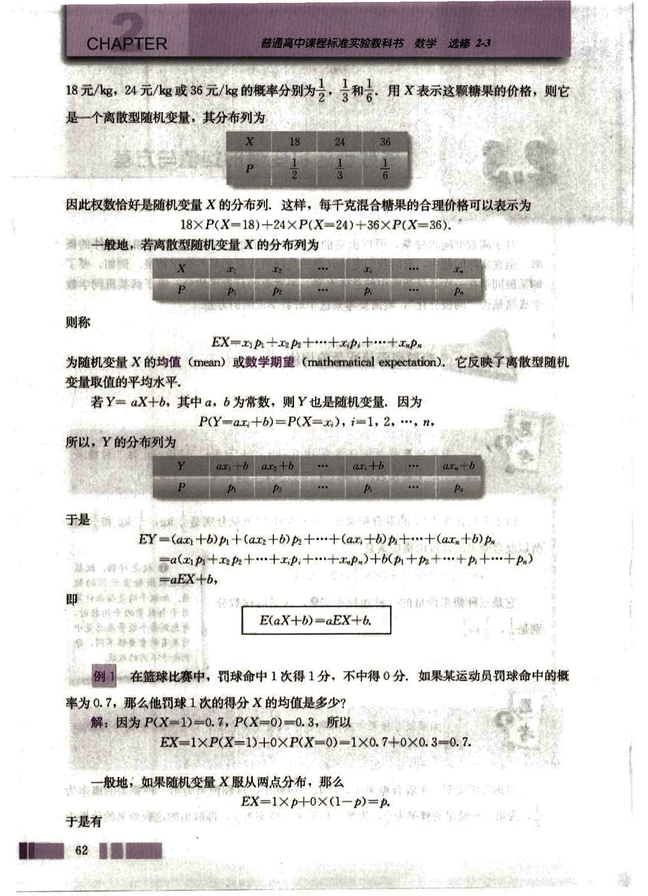
68 

# 第二章 随机变量及其分布

## 第二章

若X服从两点分布,则EX=p.

如果X~B(n,p),则由$kC_n^k=nC_n^k=1$,可得

$EX = \sum_{k=0}^n kC_n^k p^k q^{n-k} = \sum_{k=1}^n npC_{n-1}^{k-1}p^{k-1}q^{n-k}$

$= np \sum_{k=0}^{n-1} C_{n-1}^k p^k q^{n-1-k} = np$.

于是有

若X~B(n,p),则EX=np.

? 根据两点分布的均值公式,如果罚球命中概率为0.8,那么罚球1次的得分均值是多少?

思考

? 随机变量的均值与样本的平均值有何联系与区别?

可以发现,随机变量的均值是常数,而样本的平均值是随着样本的不同而变化的,因此样本均值是随机变量,对于简单随机样本,随着样本容量的增加,样本平均值越来越接近于总体均值,因此,我们常用样本均值来估计总体均值。

例2 一次单元测验由20个选择题构成,每个选择题有4个选项,其中仅有一个选项正确,每题选对得5分,不选或选错不得分,满分100分,学生甲选对任意一题的概率为0.9,学生乙则在测验中对每题都从各选项中随机地选择一个,分别求学生甲和学生乙在这次测验中的成绩的均值。

解:设学生甲和学生乙在这次单元测验中选对的题数分别是$X_1$和$X_2$,则$X_1$~B(20, 0.9), $X_2$~B(20, 0.25).所以

$EX_1=20×0.9=18$,

$EX_2=20×0.25=5$.

由于每题选对得5分,所以学生甲和学生乙在这次测验中的成绩分别是$5X_1$和$5X_2$,这样,他们在测验中的成绩的期望分别是

E(5$X_1$)=5$EX_1$=5×18=90,

E(5$X_2$)=5$EX_2$=5×5=25.

思考

? 学生甲在这次单元测试中的成绩一定会是90分吗?他的均值为90分的含义是什么?

63

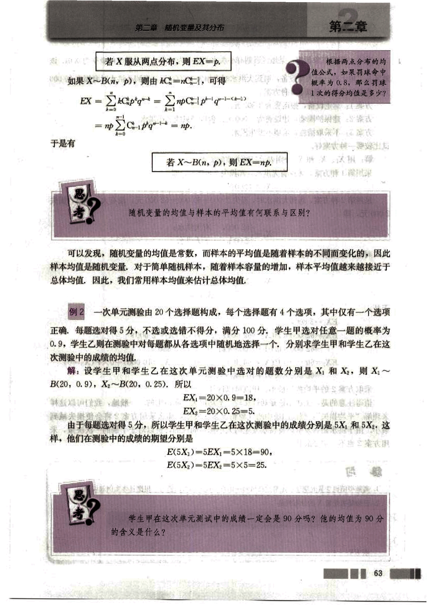
69 

# CHAPTER

普通高中课程标准实验教科书 数学 选修2-3

## 例3

根据气象预报，某地区近期有小洪水的概率为0.25，有大洪水的概率为0.01。该地区某工地上有一台大型设备，遇到大洪水时要损失60 000元，遇到小洪水时要损失10 000元。为保护设备，有以下3种方案：

方案1：运走设备，搬运费为3 800元。

方案2：建保护围墙，建设费为2 000元，但围墙只能防小洪水。

方案3：不采取措施，希望不发生洪水。

试比较哪一种方案好。

解：用$X_1$，$X_2$和$X_3$分别表示三种方案的损失。

采用第1种方案，无论有无洪水，都损失3 800元，即

$X_1 = 3\ 800$

采用第2种方案，遇到大洪水时，损失2 000 + 60 000 = 62 000元；没有大洪水时，损失2 000元，即

$X_2 = \begin{cases} 62\ 000, & \text{有大洪水;} \\ 2\ 000, & \text{无大洪水.} \end{cases}$

同样，采用第3种方案，有

$X_3 = \begin{cases} 60\ 000, & \text{有大洪水;} \\ 10\ 000, & \text{有小洪水;} \\ 0, & \text{无洪水.} \end{cases}$

于是，

$EX_1 = 3\ 800$，

$EX_2 = 62\ 000 \times P(X_2 = 62\ 000) + 2\ 000 \times P(X_2 = 2\ 000)$

$= 62\ 000 \times 0.01 + 2\ 000 \times (1 - 0.01) = 2\ 600$，

$EX_3 = 60\ 000 \times P(X_3 = 60\ 000) + 10\ 000 \times P(X_3 = 10\ 000) + 0 \times P(X_3 = 0)$

$= 60\ 000 \times 0.01 + 10\ 000 \times 0.25 = 3\ 100$。

采取方案2的平均损失最小，所以可以选择方案2。

值得注意的是，上述结论是通过比较“平均损失”而得出的，一般地，我们可以这样来理解“平均损失”：假设问题中的气象情况多次发生，那么采用方案2将会使损失减到最小。由于洪水是否发生以及洪水发生的大小都是随机的，所以对于个别的的一次决策，采用方案2也不一定是最好的。

## 练习

1. 离散型随机变量的期望一定是它在试验中出现的概率最大的值吗？根据具体实例加以说明。

2. 已知随机变量X的分布列是

| X | 0 | 1 | 2 | 3 | 4 | 5 |
|---|---|---|---|---|---|---|
| P | 0.1 | 0.2 | 0.3 | 0.2 | 0.1 | 0.1 |

求EX.

64

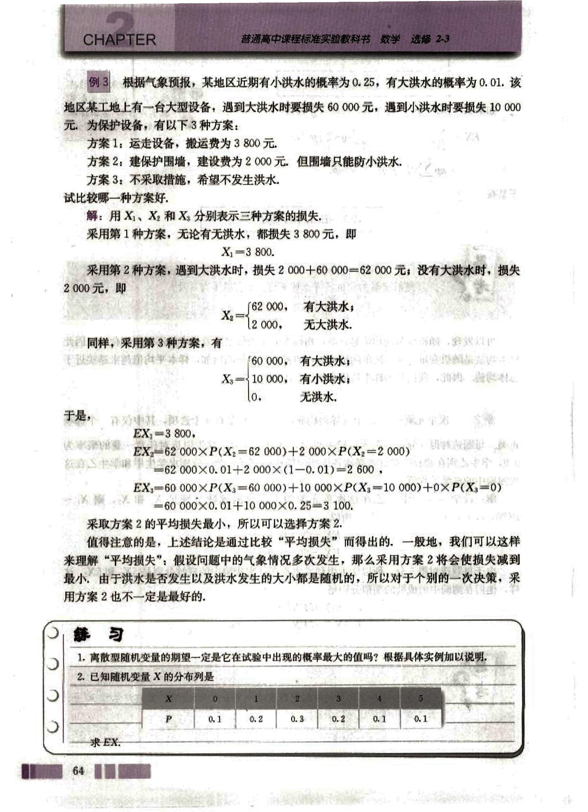
70 

# 第二章 随机变量及其分布

3. 抛掷一枚硬币，规定正面向上得1分，反面向上得-1分，求得分X的均值。

4. 产量相同的2台机床生产同一种零件，它们在一小时内生产出的次品数X1, X2的分布列分别如下：

| X1 | 0 | 1 | 2 | 3 |
|---|---|---|---|---|
| P | 0.4 | 0.3 | 0.2 | 0.1 |

| X2 | 0 | 1 | 2 |
|---|---|---|
| P | 0.3 | 0.5 | 0.2 |

问哪台机床更好？请解释你所得出结论的实际含义。

5. 同时抛掷5枚质地均匀的硬币，求出现正面向上的硬币数X的均值。

# 2.3.2 离散型随机变量的方差

要从两名同学中挑出一名，代表班级参加射击比赛，根据以往的成绩纪录，第一名同学击中目标靶的环数X1的分布列为：

| X1 | 5 | 6 | 7 | 8 | 9 | 10 |
|---|---|---|---|---|---|---|
| P | 0.03 | 0.09 | 0.20 | 0.31 | 0.27 | 0.10 |

第二名同学击中目标靶的环数X2的分布列为：

| X2 | 5 | 6 | 7 | 8 | 9 |
|---|---|---|---|---|---|
| P | 0.01 | 0.05 | 0.20 | 0.41 | 0.33 |

请问应该派哪名同学参赛？

根据已学知识，可以从平均中靶环数来比较两名同学射击水平的高低，即通过比较X1和X2的均值来确定两名同学射击水平的高低，通过计算，

EX1 = 8, EX2 = 8,

发现两个均值相等，因此只根据均值不能区分这两名同学的射击水平。

除平均中靶环数外，还有其他刻画两名同学各自射击特点的指标吗？

65

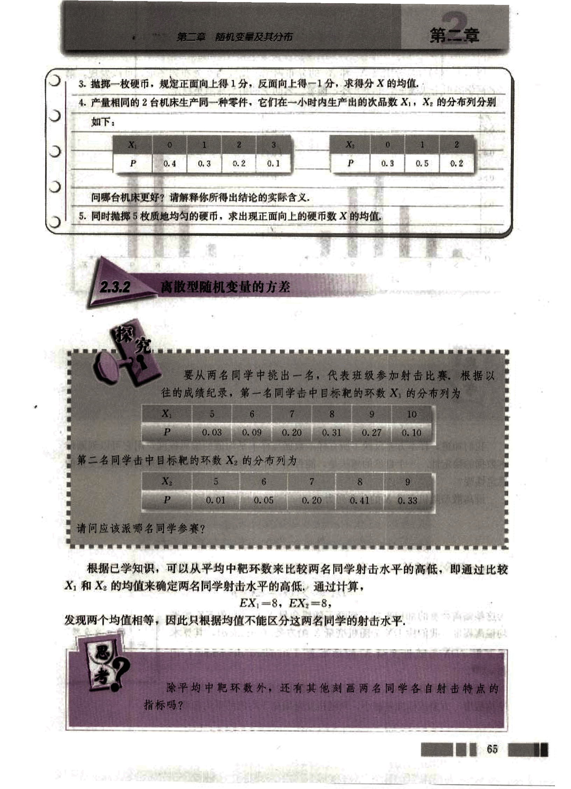
71 

# CHAPTER

普通高中课程标准实验教科书 数学 选修 2-3

图 2.3-1(1)(2) 分别是 $X_1$ 和 $X_2$ 的分布列图。比较两个分布列图形，可以发现，第二名同学的射击成绩更集中于 8 环，即第二名同学的射击成绩更稳定。

[image1](images/image1.png)

图 2.3-1

思
考?

怎样定量刻画随机变量的稳定性？

我们知道，样本方差反映了所有样本数据与样本平均值的偏离程度，用它可以刻画样本数据的稳定性。一个自然的想法是，能否用一个与样本方差类似的量来刻画随机变量的稳定性呢？

设离散型随机变量 X 的分布列为

| X     | $x_1$ | $x_2$ | ... | $x_i$ | ... | $x_n$ |
| :---- | :---- | :---- | :---- | :---- | :---- | :---- |
| P     | $p_1$  | $p_2$  | ... | $p_i$  | ... | $p_n$  |

则 $(x_i - EX)^2$ 描述了 ($i = 1, 2, ..., n$) 相对于均值 EX 的偏离程度，而

$DX = \sum_{i=1}^{n}(x_i - EX)^2 p_i$

为这些偏离程度的加权平均，刻画了随机变量 X 与其均值 EX 的平均偏离程度。我们称 DX 为随机变量 X 的方差 (variance)，其算术平方根 $\sqrt{DX}$ 为随机变量 X 的标准差 (standard deviation)，记作 $\sigma_X$。

随机变量的方差和标准差都反映了随机变量取值偏离于均值的平均程度，方差或标准差越小，则随机变量偏离于均值的平均程度越小。

66

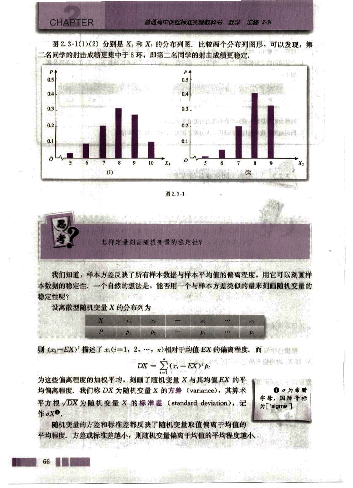
72 

# 第二章 随机变量及其分布

## 随机变量的方差与样本的方差有何联系与区别？

随机变量的方差是常数，而样本的方差是随着样本的不同而变化的，因此样本方差是随机变量，对于简单随机样本，随着样本容量的增加，样本方差越来越接近于总体方差。因此，我们常用样本方差来估计总体方差。

现在，可以用两名同学射击成绩的方差来刻画他们各自的特点，为选派选手提供依据，由前面的计算结果及方差的定义，得

$DX_1 = \sum_{i=1}^{9}(i-8)^2 P(X_1 = i) = 1.50,$

$DX_2 = \sum_{i=1}^{9}(i-8)^2 P(X_2 = i) = 0.82.$

因此第一名同学的射击成绩稳定性较差，第二名同学的射击成绩稳定性较好，稳定于8环左右。

## 如果其他班级参赛选手的射击成绩都在9环左右，本班应该派哪一名选手参赛？如果其他班级参赛选手的成绩在7环左右，又应该派哪一名选手参赛？

可以证明如下结论：

若X服从两点分布，则$DX = p(1-p).$

若$X \sim B(n, p)$，则$DX = np(1-p).$

## 你能证明下面结论吗？

$D(aX + b) = a^2DX.$

## 例4

随机抛掷一枚质地均匀的骰子，求向上一面的点数X的均值、方差和标准差。

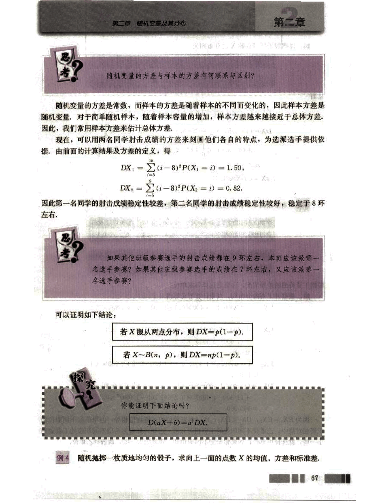
73 

# CHAPTER 2

解：抛掷骰子所得点数X的分布列为

| X | 1 | 2 | 3 | 4 | 5 | 6 |
|---|---|---|---|---|---|---|
| P | $\frac{1}{6}$ | $\frac{1}{6}$ | $\frac{1}{6}$ | $\frac{1}{6}$ | $\frac{1}{6}$ | $\frac{1}{6}$ |

从而

$EX = 1 \times \frac{1}{6} + 2 \times \frac{1}{6} + 3 \times \frac{1}{6} + 4 \times \frac{1}{6} + 5 \times \frac{1}{6} + 6 \times \frac{1}{6} = 3.5$；

$DX = (1 - 3.5)^2 \times \frac{1}{6} + (2 - 3.5)^2 \times \frac{1}{6} + (3 - 3.5)^2 \times \frac{1}{6} + (4 - 3.5)^2 \times \frac{1}{6} + (5 - 3.5)^2 \times \frac{1}{6} + (6 - 3.5)^2 \times \frac{1}{6}$

$\approx 2.92$；

$\sigma_X = \sqrt{DX} \approx 1.71$。

## 例 5

有甲乙两个单位都愿意聘用你，而你能获得如下信息：

| 甲单位不同职位月工资 X/元 | 1 200 | 1 400 | 1 600 | 1 800 |
|---|---|---|---|---|
| 获得相应职位的概率 P | 0.4 | 0.3 | 0.2 | 0.1 |

| 乙单位不同职位月工资 X/元 | 1 000 | 1 400 | 1 800 | 2 200 |
|---|---|---|---|---|
| 获得相应职位的概率 P | 0.4 | 0.3 | 0.2 | 0.1 |

根据工资待遇的差异情况，你愿意选择哪家单位？

解：根据月工资的分布列，利用计算器可算得

$EX_1 = 1200 \times 0.4 + 1400 \times 0.3 + 1600 \times 0.2 + 1800 \times 0.1$

$= 1400$，

$DX_1 = (1200 - 1400)^2 \times 0.4 + (1400 - 1400)^2 \times 0.3 + (1600 - 1400)^2 \times 0.2 + (1800 - 1400)^2 \times 0.1$

$= 40000$；

$EX_2 = 1000 \times 0.4 + 1400 \times 0.3 + 1800 \times 0.2 + 2200 \times 0.1$

$= 1400$，

$DX_2 = (1000 - 1400)^2 \times 0.4 + (1400 - 1400)^2 \times 0.3 + (1800 - 1400)^2 \times 0.2 + (2200 - 1400)^2 \times 0.1$

$= 160000$。

因为 $EX_1 = EX_2$，$DX_1 < DX_2$，所以两家单位的工资均值相等，但甲单位不同职位的工资相对集中，乙单位不同职位的工资相对分散，这样，如果你希望不同职位的工资差距小一些，就选择甲单位；如果你希望不同职位的工资差距大一些，就选择乙单位。

68

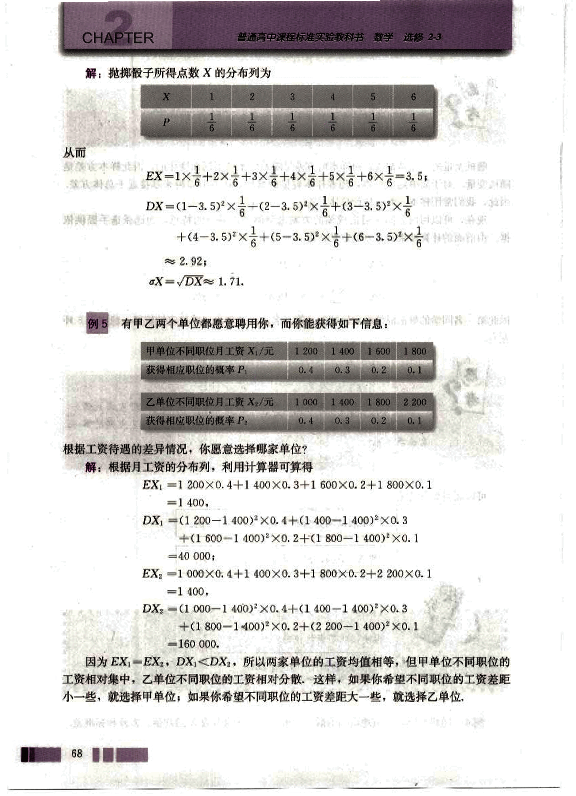
74 

# 第二章 随机变量及其分布

## 练习

1. 已知随机变量X的分布列
| X | 0 | 1 | 2 | 3 | 4 |
|---|---|---|---|---|---|
| P | 0.1 | 0.2 | 0.4 | 0.2 | 0.1 |

求DX 和 σX.

2. 若随机变量X满足P(X = c) = 1, 其中c为常数，求DX.

3. 方差在实际中有什么用？根据具体实例加以说明.

## 习题 2.3

### A 组

1. 已知随机变量X的分布列
| X | -2 | 1 | 3 |
|---|---|---|
| P | 0.16 | 0.44 | 0.40 |

求EX, E(2X + 5), DX, σX.

2. 一名射手击中靶心的概率是0.9. 如果他在同样的条件下连续射击10次，求他击中靶心的次数的均值.

3. 现要发行10000张彩票，其中中奖金额为2元的彩票1000张，10元的彩票300张，50元的彩票100张，100元的彩票50张，1000元的彩票5张，问1张彩票可能中奖金额的均值是多少元？

4. 甲、乙两名射手在同一条件下射击，所得环数$X_1$, $X_2$的分布列分别是

| $X_1$ | 6 | 7 | 8 | 9 | 10 |
|---|---|---|---|---|---|
| P | 0.16 | 0.14 | 0.42 | 0.1 | 0.18 |

| $X_2$ | 6 | 7 | 8 | 9 | 10 |
|---|---|---|---|---|---|
| P | 0.19 | 0.24 | 0.12 | 0.28 | 0.17 |

根据环数的期望和方差比较这两名射手的射击水平.

### B 组

1. 抛掷两枚骰子，当至少有一枚5点或一枚6点出现时，就说这次试验成功，求在30次试验中成功次数X的期望.

2. 一台机器在一天内发生故障的概率为0.1. 若这台机器一周5个工作日不发生故障，可获利5万元；发生1次故障仍可获利2.5万元；发生2次故障的利润为0元；发生3次或3次以上故障要亏损1万元，问这台机器一周内可能获利的均值是多少？

69

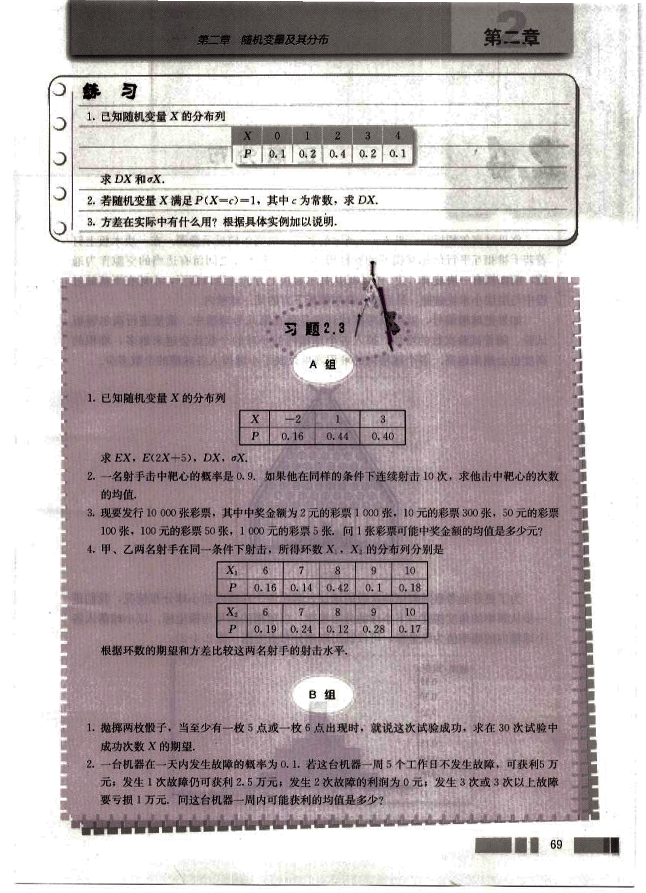
75 

# CHAPTER 2
## 2.4 正态分布

你见过高尔顿板吗？图 2.4-1 所示的就是一块高尔顿板示意图。在一块木板上钉着若干排相互平行但相互错开的圆柱形小木块，小木块之间留有适当的空隙作为通道，前面挡有一块玻璃，让一个小球从高尔顿板上方的通道口落下，小球在下落的过程中与层层小木块碰撞，最后掉入高尔顿板下方的某一球槽内。

如果把球槽编号，就可以考察球到底是落在第几号球槽中。重复进行高尔顿板试验，随着试验次数的增加，掉入各个球槽内的小球的个数就会越来越多，堆积的高度也会越来越高，各个球槽内的堆积高度反映了小球掉入各球槽的个数多少。

[图2.4-1](images/2.4-1.png)

为了更好地考察随着试验次数的增加，落在各个球槽内的小球分布情况，我们进一步从频率的角度探究一下小球的分布规律，以球槽的编号为横坐标，以小球落入各个球槽内的频率值为纵坐标，可以画出频率分布直方图（图 2.4-2）。

| 频率/组距 |
|---|---|
| 0.35 |
| 0.30 |
| 0.25 |
| 0.20 |
| 0.15 |
| 0.10 |
| 0.05 |
| 0 |

[图2.4-2](images/2.4-2.png)

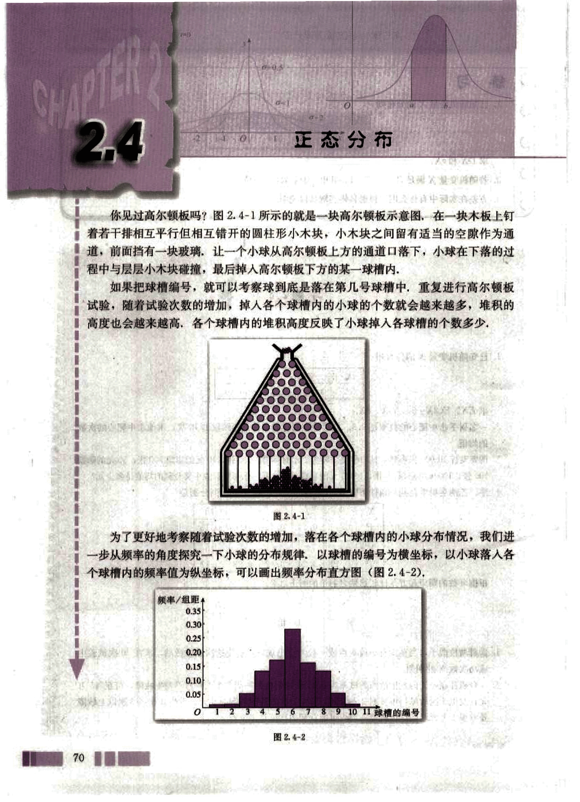
76 

# 第二章 随机变量及其分布

随着重复次数的增加，这个频率直方图的形状会越来越像一条钟形曲线（图 2.4-3）.

[图2.4-3](images/2.4-3.png)

这条曲线就是（或近似地是）下列函数的图像：

$\phi_{\mu,\sigma}(x) = \frac{1}{\sqrt{2\pi}\sigma}e^{-\frac{(x-\mu)^2}{2\sigma^2}}, x \in (-\infty, +\infty)$

其中实数 μ 和 σ(σ>0) 为参数。我们称 $\phi_{\mu,\sigma}(x)$ 的图像为正态分布密度曲线，简称正态曲线。

如果去掉高尔顿板试验中最下边的球槽，并沿其底部建立一个水平坐标轴，其刻度单位为球槽的宽度，用 X 表示落下的小球第 1 次与高尔顿板底部接触时的坐标，则 X 是一个随机变量。X 落在区间 (a, b] 的概率为

$P(a < X \le b) = \int_a^b \phi_{\mu,\sigma}(x)dx$

即由正态曲线，过点 (a, 0) 和点 (b, 0) 的两条与 x 轴垂直的垂线，及 x 轴所围成的平面图形的面积（图 2.4-4 中阴影部分的面积），就是 X 落在区间 (a, b] 的概率的近似值。

[图2.4-4](images/2.4-4.png)

一般地，如果对于任何实数 a<b，随机变量 X 满足

$P(a < X \le b) = \int_a^b \phi_{\mu,\sigma}(x)dx$

则称 X 的分布为正态分布 (normal distribution)。正态分布完全由参数 μ 和 σ2 确定，因此正态分布常记作 N(μ, σ2)。如

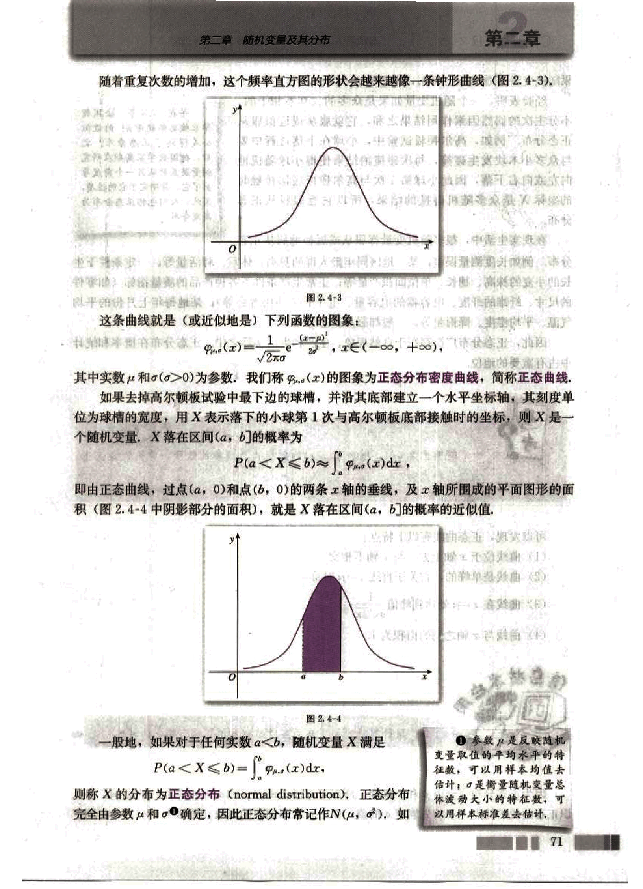
77 

# CHAPTER 2

## 果随机变量X服从正态分布

果随机变量X服从正态分布，则记为X~N(µ, σ²)

经验表明，一个随机变量如果是众多的、互不相干的，不分主次的偶然因素作用结果之和，它就服从或近似服从正态分布。例如，高尔顿板试验中，小球在下落过程中要与众多小木块发生碰撞，每次碰撞的结果使得小球随机地向左或向右下落，因此小球第1次与高尔顿板底部接触时的坐标X是众多随机碰撞的结果，所以它近似服从正态分布。

在现实生活中，很多随机变量都服从或近似地服从正态分布。例如长度测量误差；某一地区同年龄人群的身高、体重、肺活量等；一定条件下生长的麦的株高、穗长、单位面积产量等；正常生产条件下各种产品的质量指标（如零件的尺寸、纤维的纤度、电容器的电容量、电子管的使用寿命等）；某地每年七月份的平均气温、平均湿度、降雨量等；一般都服从正态分布。

因此，正态分布广泛存在于自然现象、生产和生活实际之中，正态分布在概率和统计中占有重要的地位。

## 思考

观察图2.4-4，结合$φ_{µ,σ}(x)$的解析式及概率的性质，你能说说正态曲线的特点吗？

可以发现，正态曲线有以下特点：

(1) 曲线位于x轴上方，与x轴不相交；

(2) 曲线是单峰的，它关于直线x=µ对称；

(3) 曲线在x=µ处达到峰值 $\frac{1}{σ\sqrt{2π}}$；

(4) 曲线与x轴之间的面积为1.

用计算机研究正态曲线随着µ和σ变化而变化的特点

因为正态分布完全由µ和σ确定，所以可以通过研究µ和σ对正态曲线的影响，来认识正态曲线的特点。不妨先固定σ的值，作出µ取不同值的图象（图2.4-5(1)）；再固定µ的值，作出σ取不同值的图象（图2.4-5(2)）。

72

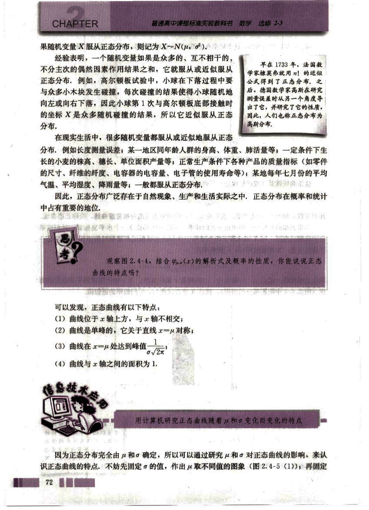
78 

# 第二章 随机变量及其分布

µ的值，作出σ取不同值的图像（图2.4-5（2））。

由上述过程还可以发现正态曲线的下述特点：

(5) 当σ一定时，曲线随着µ的变化而沿轴平移；

(6) 当µ一定时，曲线的形状由σ确定，σ越小，曲线越“瘦高”，表示总体的分布越集中；σ越大，曲线越“矮胖”，表示总体的分布越分散。

进一步，若X~N(µ, σ²), 则对于任何实数a>0, 概率

$P(µ-a < X < µ+a) = \int_{\mu-a}^{\mu+a} \phi_{\mu,\sigma}(x)dx$

为图2.4-6中阴影部分的面积，对于固定的µ和a而言，该面积随着σ的减少而变大，这说明σ越小，X落在区间(µ-a, µ+a]的概率越大，即X集中在µ周围概率越大。

特别有：

$P(µ-σ<X<µ+σ) = 0.6826,$

$P(µ-2σ<X<µ+2σ) = 0.9544,$

$P(µ-3σ<X<µ+3σ) = 0.9974.$

上述结果可用图2.4-7表示：

73

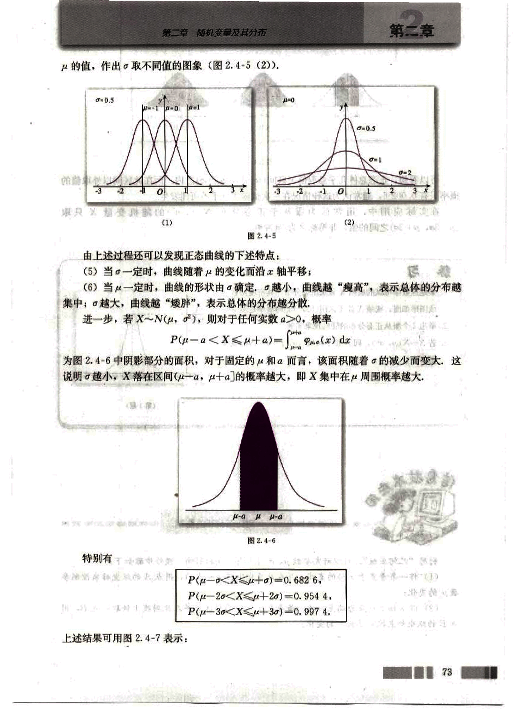
79 

# CHAPTER 2

普通高中课程标准实验教科书 数学 选修 2-3

图 2.4-7

可以看到，正态总体几乎总取值于区间($\mu$-3σ, $\mu$+3σ)之内，而在此区间以外取值的概率只有 0.0026。通常认为这种情况在一次试验中几乎不可能发生。

在实际应用中，通常认为服从于正态分布 N($\mu$, $\sigma$) 的随机变量 X 只取 ($\mu$-3σ, $\mu$+3σ) 之间的值，并简称之为 3σ 原则。

## 练习

1. 某地区数学考试的成绩 X 服从正态分布，其密度函数曲线图形如图，成绩 X 位于区间 (52, 68] 的概率是多少？

2. 举出 2 个服从正态分布的随机现象实例。

3. 若 X~N($\mu$, $\sigma$)，问 X 位于区域 ($\mu$, $\mu$+$\sigma$] 内的概率是多少？

(第 1 题)

## $\mu$, $\sigma$ 对正态分布的影响

利用“几何画板”，可以研究参数 $\mu$, $\sigma$ 对正态曲线的影晌。操作步骤如下：

(1) 作一条垂直于 x 轴的直线，并在此直线上任取一点 A，用点 A 的纵坐标来控制参数 $\mu$ 的变化；

(2) 以 x 轴上一点为端点，作一条垂直于 x 轴的射线，并在此射线上任取一点 B，用点 B 的纵坐标来控制参数 $\sigma$ 的变化；

74

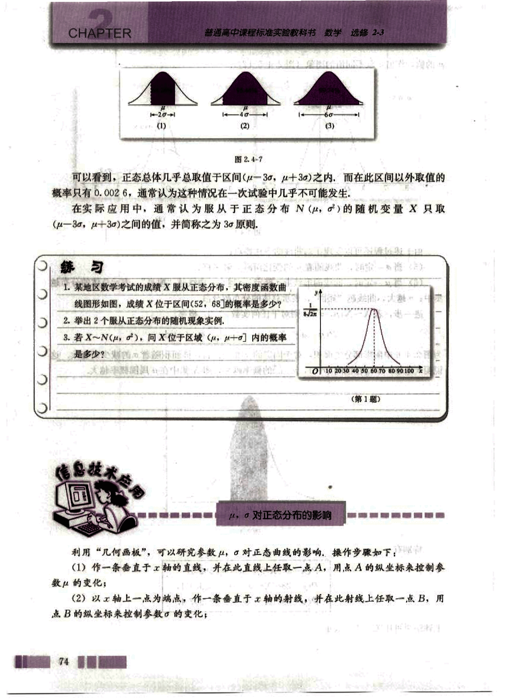
80 

# 第二章 随机变量及其分布

## (3) 输入函数解析式 $f(x) = \frac{1}{\sqrt{2\pi}\sigma}e^{-\frac{(x-\mu)^2}{2\sigma^2}}$ , 作出函数 $f(x)$ 的图像;

## (4) 拖动点 A 和点 B, 便可以观察随着参数 $\mu$ 和 $\sigma$ 取值的变化, 正态曲线变化的情况.

# 习题 2.4

## A 组

1. 标准正态总体的函数为
$f(x) = \frac{1}{\sqrt{2\pi}}e^{-\frac{x^2}{2}}, x \in (-\infty, +\infty)$.

(1) 证明 $f(x)$ 是偶函数;

(2) 求 $f(x)$ 的最大值;

(3) 利用指数函数的性质说明 $f(x)$ 的增减性.

2. 商场经营的某种包装的大米质量服从正态分布 $N(10, 0.1^2)$ (单位: kg), 任选一袋这种大米, 质量在 9.8 ~ 10.2 kg 的概率是多少?

## B 组

1. 若 $X \sim N(\mu, \sigma^2)$, $x$ 为一个实数, 证明 $P(X = x) = 0$.

2. 若 $X \sim N(5, 1)$, 求 $P(6 < X < 7)$.

75

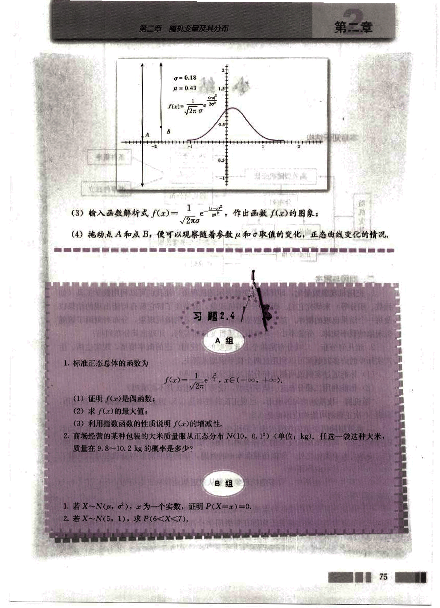
81 

# CHAPTER

普通高中课程标准实验教科书 数学 选修 2-3

# 小结

## 一、本章知识结构

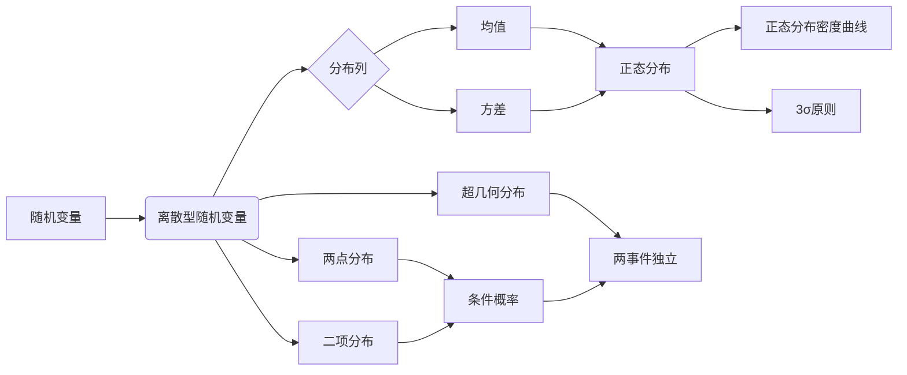
```mermaid
graph LR
A[随机变量] --> B(离散型随机变量);
B --> C{分布列};
C --> D[均值];
C --> E[方差];
D --> F[正态分布];
E --> F;
F --> G[正态分布密度曲线];
F --> H[3σ原则];
B --> I[两点分布];
B --> J[二项分布];
B --> K[超几何分布];
I --> L[条件概率];
J --> L;
K --> M[两事件独立];
L --> M;

```

## 二、回顾与思考

1. 把随机现象数量化，即用随机变量表示随机现象，使我们可以利用数学工具（如函数、积分等）来研究它们。研究一个随机现象，就是要了解它所有可能出现的结果以及每一个结果出现的概率。对于离散型随机变量所表示的随机现象，分布列刻画了该随机现象的概率规律。你能举出一些离散型随机变量的实例，并列出其分布列吗？

2. 超几何分布、二项分布是两个非常重要的、应用广泛的概率模型，现实生活、生产实际中的许多问题都可以利用这两个概率模型来解决。

(1) 你能通过实例说明超几何分布及其导出过程吗？

(2) 你能利用二项分布这一概率模型，说明下面想法并不正确吗？

“随机掷一枚质地均匀的硬币，出现正面的概率是 0.5。因此，随机抛掷 100 次硬币，出现 50 次正面的可能性应该也是 0.5。”

3. 离散型随机变量的均值代表了随机变量的平均（或中心）位置，它与样本平均数有类似之处；离散型随机变量的方差刻画了随机变量稳定于（或集中于）均值的程度，它与样本方差有类似之处。你能仿照课本中的例题，举例说明离散型随机变量的均值和方差在现实生活中的作用吗？

4. 实际生产、生活中，许多随机现象都服从或近似地服从正态分布，所以正态分布的应用非常广泛。

(1) 你能根据正态曲线的特点画出一条正态曲线的草图吗？

(2) 到体育老师处搜集关于你所在年级同学身高的数据资料，仿照课本中的方法，研究一下你们年级同学的身高分布是否近似服从正态分布？如果是，请估计参数的值。

76

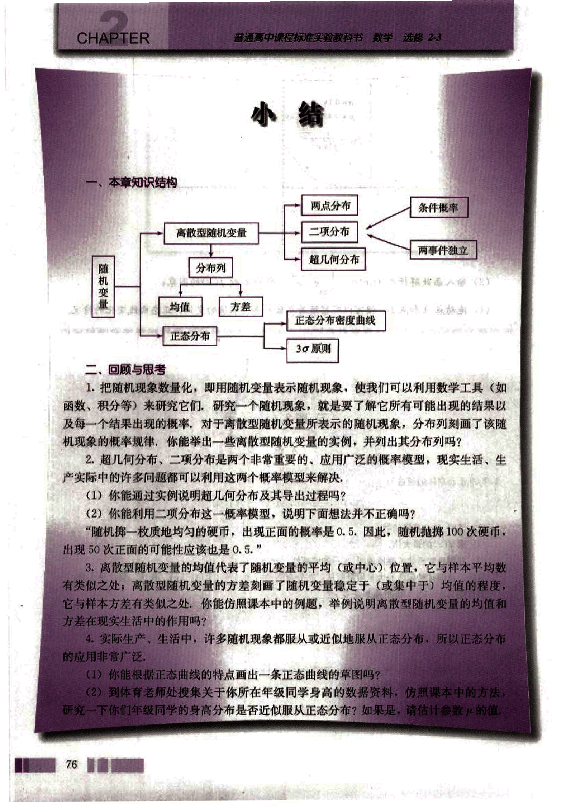
82 

# 复习参考题

## A组

1. 已知离散型随机变量X的分布列为

| X | 0 | 1 | 2 |
|---|---|---|---|
| P | 0.5 | 1-2q | $q^2$ |

2. 已知随机变量X取所有可能的值1, 2, …, n是等可能的,且X的均值为50.5, 求n的值.

3. 已知每门大炮射击一次击中目标的概率是0.3, 那么要用多少门这样的大炮同时对某一目标射击一次, 才能使目标被击中的概率超过95%? 谈谈你对提高击中目标概率的看法.

4. 某商场要根据天气预报来决定国庆节是在商场内还是在商场外展开促销活动. 统计资料表明, 每年国庆节商场内的促销活动可获得经济效益2万元; 商场外的促销活动如果不遇到有雨天气可获得经济效益10万元, 如果遇到有雨天气则带来经济损失4万元. 9月30日气象台预报国庆节当地的降水概率是40%, 商场应该选择哪种促销方式?

## B组

1. 一份某种意外伤害保险费为20元, 保险金额为45万元. 某城市的一家保险公司一年能销售10万份保单, 而需要赔付的概率为$10^{-4}$. 选择合适的方法并利用计算机或计算器求:

(1) 这家保险公司亏本的概率;

(2) 这家保险公司一年内获利不少于110万元的概率.

2. 设X~N(1, 1), 求P(3<X<4).

3. 设X~N(μ, 1), 求P(μ-3<X<μ-2).

77

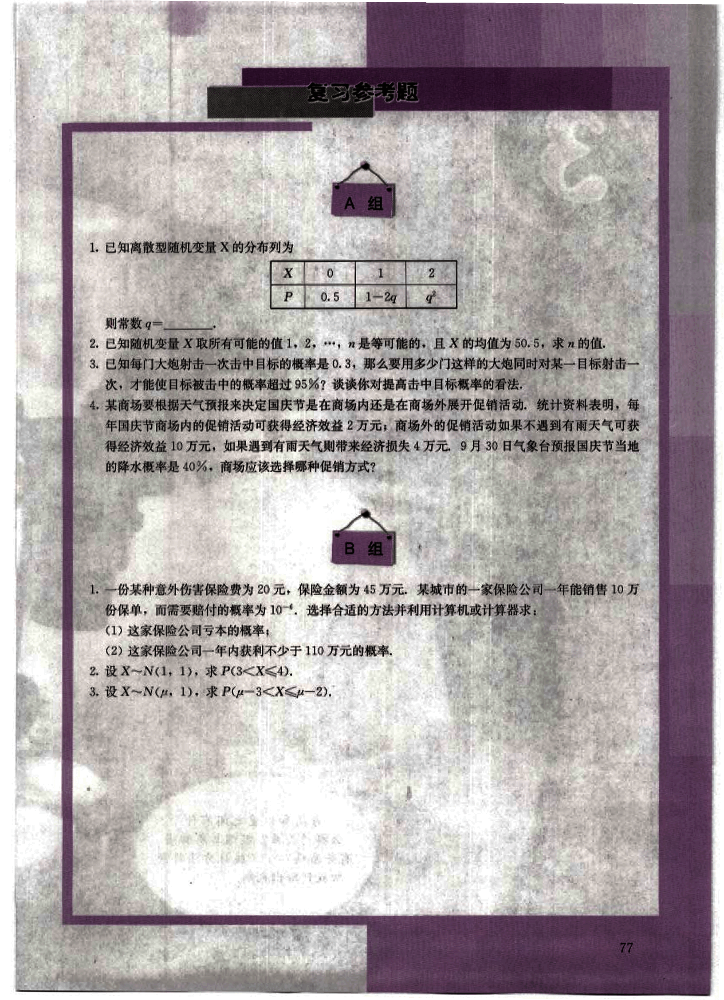
83 

# 3

身高和体重之间有什么样的关系？吸烟与患肺癌有关系吗？……统计方法将帮助我们给出判断。

84 

# 第三章 统计案例

## 3.1 回归分析的基本思想及其初步应用

## 3.2 独立性检验的基本思想及其初步应用

在现实中，我们经常会遇到类似下面的问题：肺癌是严重威胁人类生命的
一种疾病，吸烟与患肺癌有关系吗？肥
胖是影响人类健康的一个重要因素，身
高和体重之间是否存在线性相关关系？
等等。

为了回答这些问题，必须明确问题
涉及的对象（总体）是什么，用怎样的
量来描述要解决的问题，并确定获取变
量值（数据）的方法，然后用恰当的方
法分析数据，以得到最可靠的结论。

在必修模块中，我们学习过关于抽
样、用样本估计总体、线性回归等基本
知识。本章中，我们将在此基础上，通
过对典型案例的讨论，进一步讨论线性
回归分析方法及其应用，并初步了解独
立性检验的基本思想，认识统计方法在
决策中的作用。

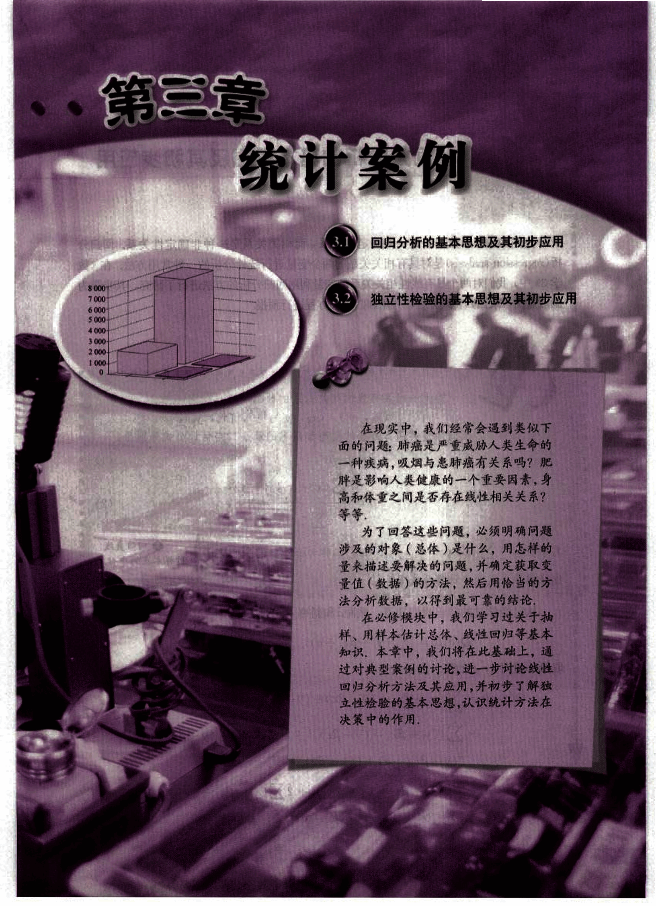
85 

# CHAPTER 3

## 3.1 回归分析的基本思想及其初步应用

我们知道，函数关系是一种确定性关系，而相关关系是一种非确定性关系。回归分析(regression analysis)是对具有相关关系的两个变量进行统计分析的一种常用方法。在《数学3》中，我们对两个具有线性相关关系的变量利用回归分析的方法进行了研究，其步骤为画散点图，求回归直线方程，并用回归直线方程进行预报。

对于一组具有线性相关关系的数据
($x_1, y_1$), ($x_2, y_2$), …, ($x_n, y_n$)，
我们知道其回归方程的截距和斜率的最小二乘估计公式分别为：

$a = \overline{y} - b\overline{x}$,  (1)

$b = \frac{\sum_{i=1}^{n}(x_i - \overline{x})(y_i - \overline{y})}{\sum_{i=1}^{n}(x_i - \overline{x})^2}$.  (2)

其中 $\overline{x} = \frac{1}{n}\sum_{i=1}^{n}x_i$，$\overline{y} = \frac{1}{n}\sum_{i=1}^{n}y_i$，($\overline{x}$, $\overline{y}$) 称为样本点的中心。

你能推导出这两个计算公式吗？

从已经学过的知识我们知道，截距和斜率b分别是使

$Q(α, β) = \sum_{i=1}^{n}(y_i - βx_i - α)^2$

取最小值时α，β的值。由于

$Q(α, β) = \sum_{i=1}^{n}[(y_i - βx_i) - (\overline{y} - β\overline{x}) + (\overline{y} - β\overline{x}) - α]^2$

$= \sum_{i=1}^{n}[(y_i - βx_i) - (\overline{y} - β\overline{x})]^2 + 2\sum_{i=1}^{n}[(y_i - βx_i) - (\overline{y} - β\overline{x})] \times$

$[(\overline{y} - β\overline{x}) - α] + n(\overline{y} - β\overline{x} - α)^2$,

80

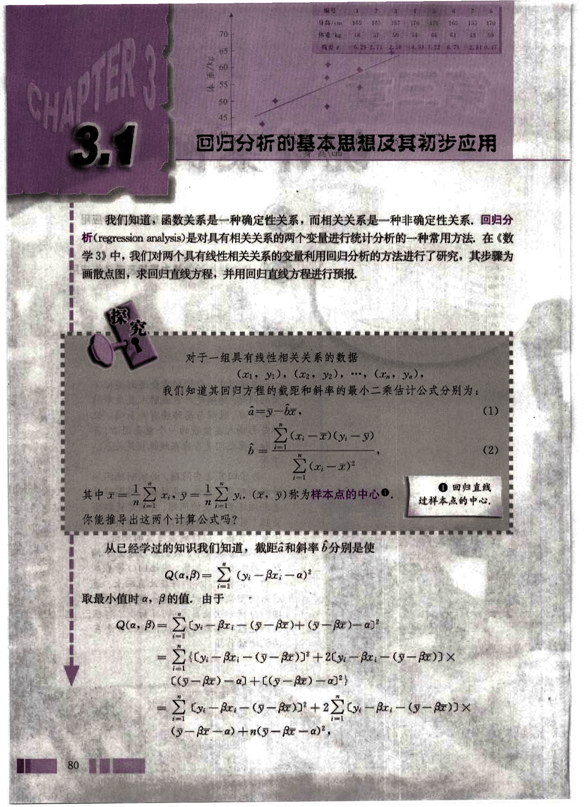
86 

# 第三章 统计案例

## 注意到

$\sum_{i=1}^n (y_i - \beta x_i - ( \bar{y} - \beta \bar{x})) (\bar{y} - \beta \bar{x} - \alpha)$

$= (\bar{y} - \beta \bar{x} - \alpha) \sum_{i=1}^n (y_i - \beta x_i - (\bar{y} - \beta \bar{x}))$

$= (\bar{y} - \beta \bar{x} - \alpha) [\sum_{i=1}^n y_i - \beta \sum_{i=1}^n x_i - n(\bar{y} - \beta \bar{x})]$

$= (\bar{y} - \beta \bar{x} - \alpha) [n\bar{y} - n\beta \bar{x} - n(\bar{y} - \beta \bar{x})] = 0.$

## 因此

$Q(\alpha, \beta) = \sum_{i=1}^n (y_i - \beta x_i - (\bar{y} - \beta \bar{x}))^2 + n(\bar{y} - \beta \bar{x} - \alpha)^2$

$= \beta^2 \sum_{i=1}^n (x_i - \bar{x})^2 - 2\beta \sum_{i=1}^n (x_i - \bar{x})(y_i - \bar{y}) + \sum_{i=1}^n (y_i - \bar{y})^2$

$= n(\bar{y} - \beta \bar{x} - \alpha)^2 + \sum_{i=1}^n (x_i - \bar{x})^2 \beta^2 - 2 \beta \sum_{i=1}^n (x_i - \bar{x})(y_i - \bar{y}) + \sum_{i=1}^n (y_i - \bar{y})^2$

$\frac{[\sum_{i=1}^n (x_i - \bar{x})(y_i - \bar{y})]^2}{\sum_{i=1}^n (x_i - \bar{x})^2} + \sum_{i=1}^n (y_i - \bar{y})^2.$

在上式中，后两项和$\alpha$, $\beta$无关，而前两项为非负数，因此要使Q取得最小值，当且仅当前两项的值均为0，即有

$\beta = \frac{\sum_{i=1}^n (x_i - \bar{x})(y_i - \bar{y})}{\sum_{i=1}^n (x_i - \bar{x})^2},$

$\alpha = \bar{y} - \beta \bar{x}.$

这正是我们所要推导的公式。

下面我们通过案例，进一步学习回归分析的基本思想及其应用。

## 例1

从某大学中随机选取8名女大学生，其身高和体重数据如表3-1所示。

表3-1

| 编号 | 1 | 2 | 3 | 4 | 5 | 6 | 7 | 8 |
|---|---|---|---|---|---|---|---|---|
| 身高/cm | 165 | 165 | 157 | 170 | 175 | 165 | 155 | 170 |
| 体重/kg | 48 | 57 | 50 | 51 | 64 | 61 | 43 | 59 |

求根据女大学生的身高预报体重的回归方程，并预报一名身高为172 cm的女大学生的体重。

解：由于问题中要求根据身高预报体重，因此选取身高为自变量x，体重为因变量y.

81

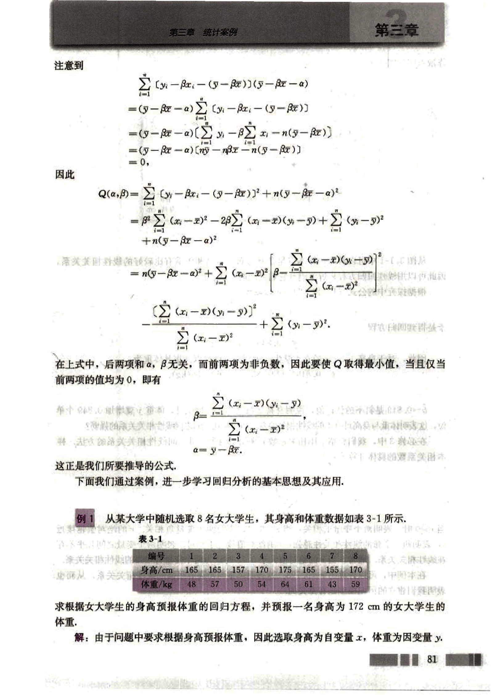
87 

# CHAPTER 3

## 作散点图 (图 3.1-1):

图 3.1-1

从图 3.1-1 中可以看出，样本点呈条状分布，身高和体重有比较好的线性相关关系，因此可以用线性回归方程来近似刻画它们之间的关系。

根据探究中的公式 (1) 和 (2)，可以得到

$b = 0.849$, $a = -85.712$。

于是得到回归方程

$y = 0.849x - 85.712$。

因此，对于身高 172 cm 的女大学生，由回归方程可以预报其体重为

$y = 0.849 \times 172 - 85.712 = 60.316 (kg)$。

$b = 0.849$ 是斜率的估计值，说明身高每增加 1 个单位时，体重 y 就增加 0.849 个单位，这表明体重与身高具有正的线性相关关系。如何描述它们之间线性相关关系的强弱？

在必修 3 中，我们介绍了用相关系数 r 来衡量两个变量之间线性相关关系的方法，样本相关系数的具体计算公式为

$r = \frac{\sum_{i=1}^{n}(x_i - \bar{x})(y_i - \bar{y})}{\sqrt{\sum_{i=1}^{n}(x_i - \bar{x})^2 \sum_{i=1}^{n}(y_i - \bar{y})^2}}$

当 $r > 0$ 时，表明两个变量正相关；当 $r < 0$ 时，表明两个变量负相关；r 的绝对值越接近 1，表明两个变量的线性相关性越强；r 的绝对值接近于 0 时，表明两个变量之间几乎不存在线性相关关系。通常，当 r 的绝对值大于 0.75 时认为两个变量有很强的线性相关关系。

在本例中，可以计算出 $r = 0.798$。这表明体重与身高有很强的线性相关关系，从而也表明我们建立的回归模型是有意义的。

82

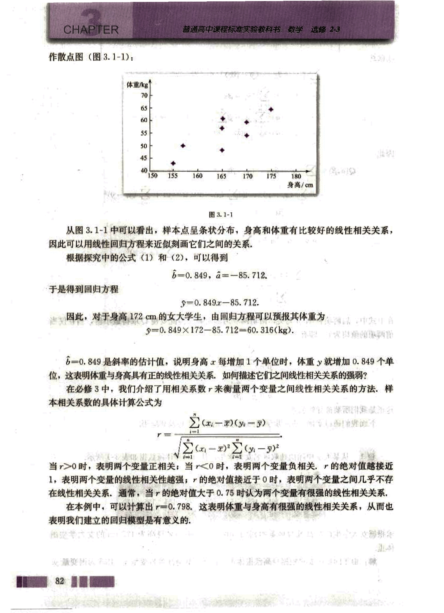
88 

# 第三章 统计案例

## 身高 172 cm 的女大学生的体重一定是 60.316 kg 吗？如果不是，其原因是什么？

显然，身高 172 cm 的女大学生的体重不一定是 60.316 kg，但一般可以认为她的体重接近于 60.316 kg。图 3.1-2 中的样本点和回归直线的相互位置说明了这一点。

体重/kg
|---|---|---|---|---|---|---|---|
| 40 | 45 | 50 | 55 | 60 | 65 | 70 |  |
|---|---|---|---|---|---|---|---|
|  |  |  |  |  |  |  |  |
|  |  |  | ♦ |  | ♦ |  |  |
|  |  | ♦ |  | ♦ |  |  |  |
|  | ♦ |  |  |  |  |  |  |
|  |  |  |  |  |  |  |  |
| 150 | 155 | 160 | 165 | 170 | 175 | 180 | 身高/cm |

图 3.1-2

由于所有的样本点不共线，而只是散布在某一条直线的附近，所以身高和体重的关系可用下面的线性回归模型来表示：

$y = bx + a + e$,  (3)

这里 $a$ 和 $b$ 为模型的未知参数，$e$ 是 $y$ 与 $y = bx + a$ 之间的误差。通常 $e$ 为随机变量，称为随机误差，它的均值 $E(e) = 0$，方差 $D(e) = σ^2 > 0$。这样线性回归模型的完整表达式为：

$\begin{cases} y = bx + a + e, \\ E(e) = 0,  D(e) = σ^2 \end{cases}$ (4)

在线性回归模型 (4) 中，随机误差 $e$ 的方差 $σ^2$ 越小，通过回归直线 $y = bx + a$ (5) 预报真实值 $y$ 的精度越高。随机误差是引起预报值与真实值 $y$ 之间误差的原因之一，其大小取决于随机误差的方差。

另一方面，由于公式 (1) 和 (2) 中 $a$ 和 $b$ 为截距和斜率的估计值，它们与真实值 $a$ 和 $b$ 之间也存在误差，这种误差是引起预报值与真实值 $y$ 之间误差的另一个原因。

## 产生随机误差项的原因是什么？
83

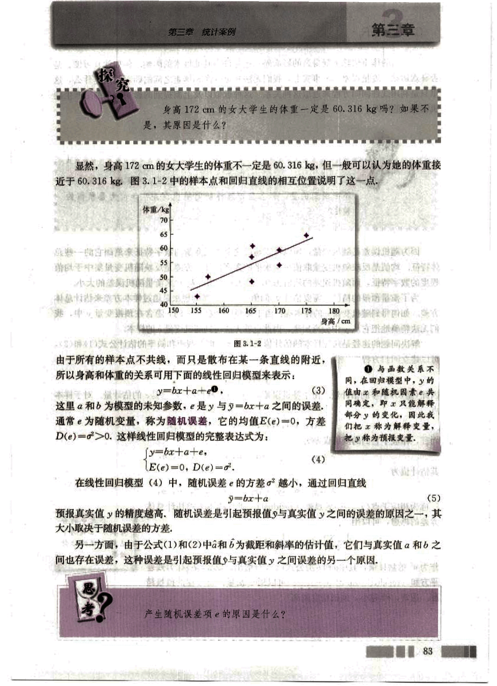
89 

# CHAPTER 3

一个人的体重值除了受身高的影响外，还受许多其他因素的影响，例如饮食习惯，是否喜欢运动，度量误差等。事实上，我们无法知道身高和体重之间的确切关系是什么，这里只是利用线性回归方程来近似这种关系，这种近似以及上面提到的影响因素都是产生随机误差的原因。

探究

在线性回归模型中，$e$是用$\hat{y}$预报真实值$y$的误差，它是一个不可观测的量，那么应该怎样研究随机误差？如何衡量预报的精度？

因为随机误差是随机变量，所以可以通过这个随机变量的数字特征来刻画它的一些总体特征，均值是反映随机变量取值平均水平的数字特征，方差是反映随机变量集中于均值程度的数字特征，而随机误差的均值为0，因此可以用方差来衡量随机误差的大小。

为了衡量预报的精度，需要估计$\sigma^2$的值，一个自然的想法是通过样本方差来估计总体方差，如何得到随机变量的样本？由于模型(3)或(4)中的$e$隐含在预报变量$y$中，我们无法精确地把它从中分离出来，因此也就无法得到随机变量的样本。

解决问题的途径是通过样本的估计值来估计$\sigma^2$。根据截距和斜率的估计公式(1)和(2)，可以建立回归方程

$\hat{y} = \hat{b}x + \hat{a}$，

因此$\hat{e}$是(5)中的估计量，由于随机误差$e = y - \hat{y}$，所以$\hat{e} = y - \hat{y}$是的估计量。对于样本点

($x_1, y_1$), ($x_2, y_2$), ..., ($x_n, y_n$)

而言，相应于它们的随机误差为

$e_i = y_i - \hat{y}_i = y_i - \hat{b}x_i - \hat{a}$,  $i = 1, 2, ..., n$.

其估计值为

$\hat{e}_i = y_i - \hat{y}_i = y_i - \hat{b}x_i - \hat{a}$,  $i = 1, 2, ..., n$.

$\hat{e}_i$称为相应于点($x_i, y_i$)的残差(residual)。类比样本方差估计总体方差的思想，可以用

$\hat{\sigma}^2 = \frac{1}{n-2}\sum_{i=1}^{n}\hat{e}_i^2 = \frac{1}{n-2}Q(\hat{a}, \hat{b}) (n > 2)$

作为$\sigma^2$的估计量，其中$\hat{a}$和$\hat{b}$由公式(1)(2)给出，$Q(\hat{a}, \hat{b})$称为残差平方和(residual sum of squares)，可以用$\hat{\sigma}^2$衡量回归方程的预报精度，通常，$\hat{\sigma}^2$越小，预报精度越高。

公式中的分母取$n-2$是为了达到更好的估计效果。

84

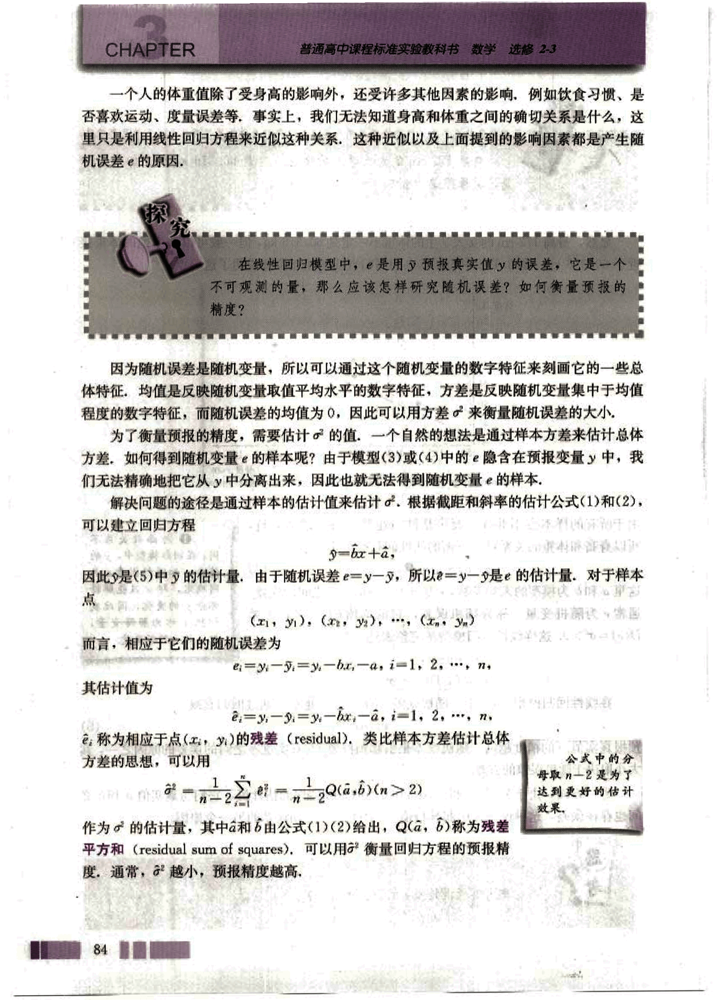
90 

# 第三章 统计案例

## 思考

当样本容量为1或2时残差平方和为多少？用这样的样本建立的线性回归方程的预报误差为0吗？

在研究两个变量间的关系时，首先要根据散点图来粗略判断它们是否线性相关，是否可以用线性回归模型来拟合数据，然后，可以通过残差 $e_1, e_2, \dots, e_n$ 来判断模型拟合的效果，判断原始数据中是否存在可疑数据，这方面的分析工作称为残差分析。表3-2列出了女大学生身高和体重的原始数据以及相应的残差数据。

## 表3-2

| 编号 | 身高/cm | 体重/kg | 残差 |
|---|---|---|---|
| 1 | 165 | 48 | -6.373 |
| 2 | 165 | 57 | 2.627 |
| 3 | 157 | 50 | 2.419 |
| 4 | 170 | 54 | -4.618 |
| 5 | 175 | 64 | 1.137 |
| 6 | 165 | 61 | 6.627 |
| 7 | 155 | 43 | -2.883 |
| 8 | 170 | 59 | 0.382 |

我们可以利用图形来分析残差特性，作图时纵坐标为残差，横坐标可以选为样本编号，或身高数据，或体重的估计值等，这样作出的图形称为残差图。图3.1-3是以样本编号为横坐标的残差图。

[图3.1-3](images/3.1-3.png)

从图3.1-3中可以看出，第1个样本点和第6个样本点的残差比较大，需要确认在采集这两个样本点的过程中是否有人为的错误。如果数据采集有错误，就予以纠正，然后再重新利用线性回归模型拟合数据；如果数据采集没有错误，则需要寻找其他的原因。另外，残差点比较均匀地落在水平的带状区域中，说明选用的模型比较合适，这样的带状区域…

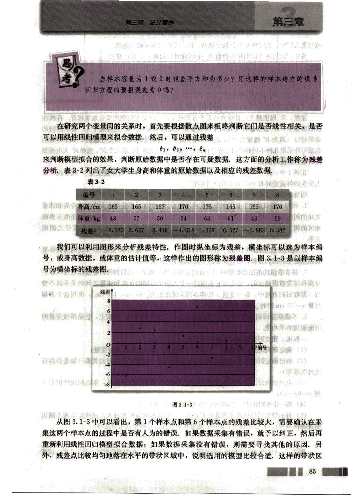
91 

# CHAPTER 3

##  普通高中课程标准实验教科书 数学 选修 2-3

域的宽度越窄，说明模型拟合精度越高，回归方程的预报精度越高。

另外，我们还可以用相关指数$R^2$来刻画回归的效果，其计算公式是：

$R^2 = 1 - \frac{\sum(y_i - \hat{y}_i)^2}{\sum(y_i - \bar{y})^2}$

在含有一个解释变量的线性模型中，$R^2$恰好等于相关系数r的平方。

显然，$R^2$取值越大，意味着残差平方和越小，也就是说模型的拟合效果越好，在线性回归模型中，表示解释变量对于预报变量变化的贡献率，$R^2$越接近于1，表示回归的效果越好（因为$R^2$越接近于1，表示解释变量和预报变量的线性相关性越强）。如果对某组数据可能采取几种不同的回归方程进行回归分析，也可以通过比较几个$R^2$，选择$R^2$大的模型作为这组数据的模型。

在例1中，$R^2$=0.64，表明“女大学生的身高解释了64%的体重变化”，或者说“女大学生的体重差异有64%是由身高引起的”。

用身高预报体重时，需要注意下列问题：

1. 回归方程只适用于我们所研究的样本的总体，例如，不能用女大学生的身高和体重之间的回归方程，描述女运动员的身高和体重之间的关系，同样，不能用生长在南方多雨地区的树木的高与直径之间的回归方程，描述北方干旱地区的树木的高与直径之间的关系。

2. 我们所建立的回归方程一般都有时间性，例如，不能用20世纪80年代的身高体重数据所建立的回归方程，描述现在的身高和体重之间的关系。

3. 样本取值的范围会影响回归方程的适用范围，例如，我们的回归方程是由女大学生身高和体重数据建立的，那么用它来描述一个人幼儿时期的身高和体重之间的关系就不恰当（即在回归方程中，解释变量x的样本的取值范围为[155 cm, 170 cm]，而用这个方程计算x=70 cm时的y值，显然不合适）。

4. 不能期望回归方程得到的预报值就是预报变量的精确值，事实上，它是预报变量的可能取值的平均值。

一般地，建立回归模型的基本步骤为：

(1) 确定研究对象，明确哪个变量是解释变量，哪个变量是预报变量；

(2) 画出确定好的解释变量和预报变量的散点图，观察它们之间的关系（如是否存在线性关系等）；

(3) 由经验确定回归方程的类型（如我们观察到数据呈线性关系，则选用线性回归程y=bx+a）；

(4) 按一定规则估计回归方程中的参数（如最小二乘法）；

(5) 得出结果后分析残差图是否有异常（个别数据对应残差过大，或残差呈现不随机的规律性等等），若存在异常，则检查数据是否有误，或模型是否合适等。

例2 一只红铃虫的产卵数y和温度x有关，现收集了7组观测数据列于表3-3中，试建

86

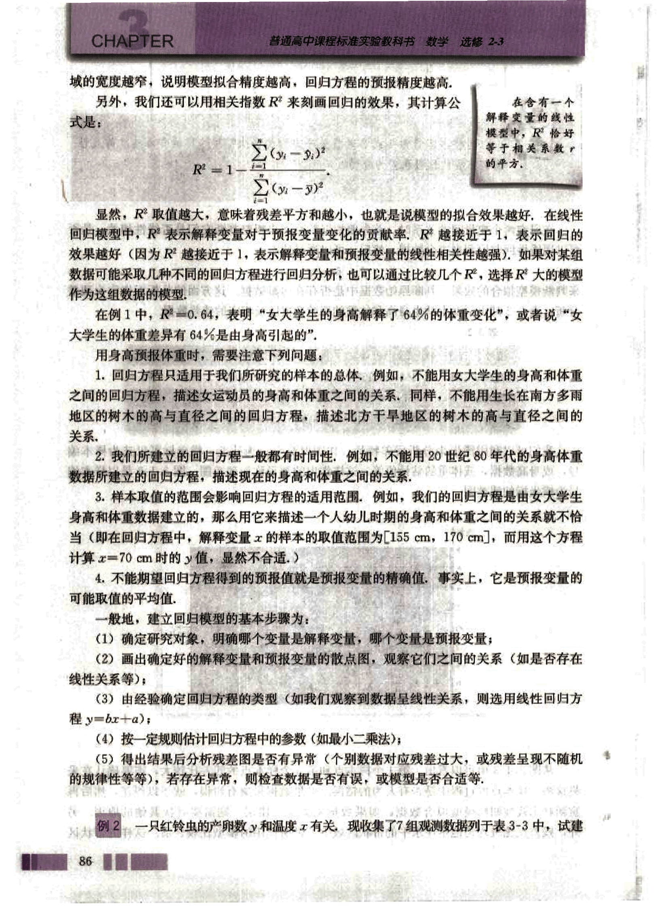
92 

# 第三章 统计案例

## 立y与x之间的回归方程.

表 3-3

| 温度 x/℃ | 21 | 23 | 25 | 27 | 29 | 32 | 35 |
|---|---|---|---|---|---|---|---|
| 产卵数 y/个 | 7 | 11 | 21 | 24 | 66 | 115 | 325 |

解：根据收集的数据作散点图（图 3.1-4）.

[图3.1-4](images/3.1-4.png)

在散点图中，样本点并没有分布在某个带状区域内，因此两个变量不呈线性相关关系，所以不能直接利用线性回归方程来建立两个变量之间的关系。根据已有的函数知识，可以发现样本点分布在某一条指数函数曲线 $y = c_1e^{c_2x}$ 的周围，其中 $c_1$ 和 $c_2$ 是待定参数。

现在，问题变为如何估计待定参数 $c_1$ 和 $c_2$。我们可以通过对数变换把指数关系变为线性关系，令 $z = ln y$，则变换后样本点应该分布在直线

$z = bx + a$ ($a = ln c_1$, $b = c_2$)

的周围。这样，就可以利用线性回归模型来建立 y 和 x 之间的非线性回归方程了。

由表 3-3 的数据可以得到变换后的样本数据表 3-4，图 3.1-5 给出了表 3-4 中数据的散点图。从图 3.1-5 中可以看出，变换后的样本点分布在一条直线的附近，因此可以用线性回归方程来拟合。

表 3-4

| x | 21 | 23 | 25 | 27 | 29 | 32 | 35 |
|---|---|---|---|---|---|---|---|
| z | 1.946 | 2.398 | 3.045 | 3.178 | 4.190 | 4.745 | 5.784 |

由表 3-4 中的数据得到线性回归方程

$z = 0.272x - 3.849$。

87

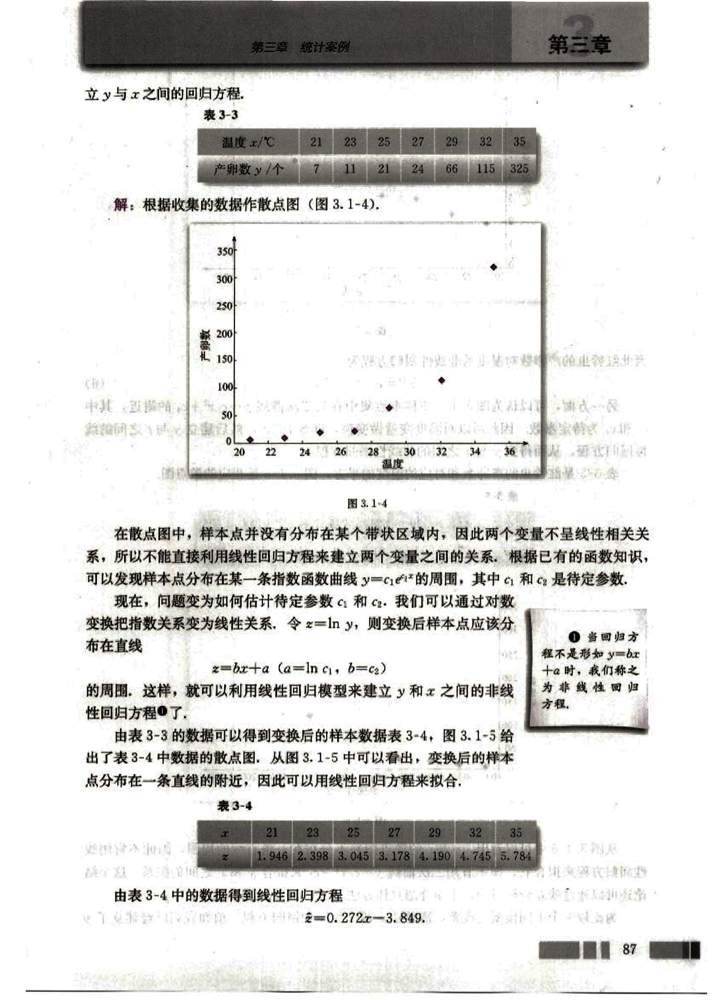
93 

# CHAPTER 3

产卵数的对数
[图3.1-5](images/3.1-5.png)

因此红铃虫的产卵数对温度的非线性回归方程为

$y^{(1)} = e^{0.272x - 3.849}$ (6)

另一方面，可以认为图3.1-4中样本点集中在某二次曲线 $y = c_3x^2 + c_4$ 的附近，其中 $c_3$ 和 $c_4$ 为待定参数，因此可以对温度变量做变换，即令 $t = x^2$，然后建立 $y$ 与 $t$ 之间的线性回归方程，从而得到 $y$ 与 $x$ 之间的非线性回归方程。

表3-5是红铃虫的产卵数和对应的温度的平方，图3.1-6是相应的散点图。

表3-5

| t | 441 | 529 | 625 | 729 | 841 | 1 024 | 1 225 |
|---|---|---|---|---|---|---|---|
| y | 7 | 11 | 21 | 24 | 66 | 115 | 325 |

[图3.1-6](images/3.1-6.png)

从图3.1-6中可以看出，y与t的散点图并不分布在一条直线的周围，因此不宜用线性回归方程来拟合它，即不宜用二次曲线 $y = c_3x^2 + c_4$ 来拟合y和x之间的关系，这个结论还可以通过残差分析得到，下面介绍具体方法。

为比较两个不同模型的残差，需要建立两个相应的回归方程，前面我们已经建立了y

88

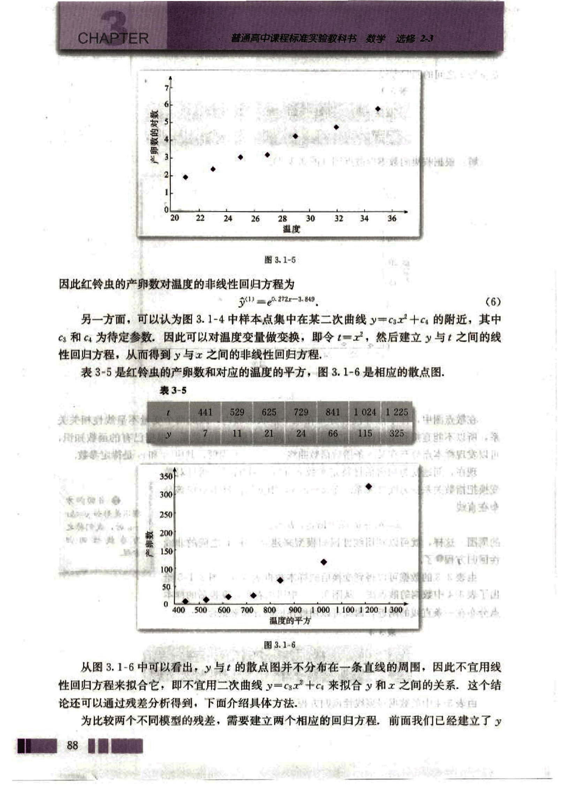
94 

# 第三章 统计案例

## 关于x的指数回归方程

关于x的指数回归方程，下面建立y关于x的二次回归方程，用线性回归模型拟合表3-5中的数据，得到y关于x的线性回归方程

$\hat{y}^{(1)} = 0.367x - 202.543,$

即y关于x的二次回归方程为

$\hat{y}^{(2)} = -0.367x^2 - 202.543.$ (7)

可以通过残差来比较两个回归方程(6)和(7)的拟合效果。用$x_i$表示表3-3中第i行第1列的数据，则回归方程(6)和(7)的残差计算公式分别为

$e_i^{(1)} = y_i - \hat{y}_i^{(1)} = y_i - e^{0.272x_i - 3.843}, i = 1, 2, \dots, 7,$

$e_i^{(2)} = y_i - \hat{y}_i^{(2)} = y_i - (-0.367x_i^2 + 202.543), i = 1, 2, \dots, 7.$

表3-6给出了原始数据及相应的两个回归方程的残差，从表中的数据可以看出模型(6)的残差的绝对值显然比模型(7)的残差的绝对值小，因此模型(6)的拟合效果比模型(7)的拟合效果好。

表3-6

| x | 21 | 23 | 25 | 27 | 29 | 32 | 35 |
|---|---|---|---|---|---|---|---|
| y | 7 | 11 | 21 | 24 | 66 | 115 | 325 |
| $e_i^{(1)}$ | 0.557 | −0.101 | 1.875 | −8.950 | 9.230 | −13.381 | 34.675 |
| $e_i^{(2)}$ | 47.696 | 19.400 | −5.832 | −41.000 | −40.104 | −58.265 | 77.968 |

在一般情况下，比较两个模型的残差比较困难，原因是在某些样本点上一个模型的残差的绝对值比另一个模型的小，而另一些样本点的情况则相反。这时可以通过比较两个模型的残差平方和的大小来判断模型的拟合效果，残差平方和越小的模型，拟合的效果越好。由表3-6容易算出模型(6)和(7)的残差平方和分别为

$Q^{(1)} = 1550.538, Q^{(2)} = 15448.431.$

因此模型(6)的拟合效果远远优于模型(7)。

类似地，还可以用$R^2$来比较两个模型的拟合效果，$R^2$越大，拟合的效果越好。由表3-6容易算出模型(6)和(7)的$R^2$分别为0.98和0.80，因此模型(6)的效果好于模型(7)的效果。

对于给定的样本点$(x_1, y_1), (x_2, y_2), \dots, (x_n, y_n)$，两个含有未知参数的模型

$\hat{y}^{(1)} = f(x, a)$ 和 $\hat{y}^{(2)} = g(x, b),$

其中a和b都是未知参数，可以按如下的步骤来比较它们的拟合效果：

(1) 分别建立对应于两个模型的回归方程$\hat{y}^{(1)} = f(x, \hat{a})$与$\hat{y}^{(2)} = g(x, \hat{b})$，其中$\hat{a}$和$\hat{b}$分别是参数a和b的估计值；

(2) 分别计算两个回归方程的残差平方和$Q^{(1)} = \sum_{i=1}^n (y_i - \hat{y}_i^{(1)})^2$ 与 $Q^{(2)} = \sum_{i=1}^n (y_i - \hat{y}_i^{(2)})^2$；

(3) 若$Q^{(1)} < Q^{(2)}$，则$\hat{y}^{(1)} = f(x, \hat{a})$的效果比$\hat{y}^{(2)} = g(x, \hat{b})$的好；反之，$\hat{y}^{(1)} = f(x, \hat{a})$的效果不如$\hat{y}^{(2)} = g(x, \hat{b})$的好。

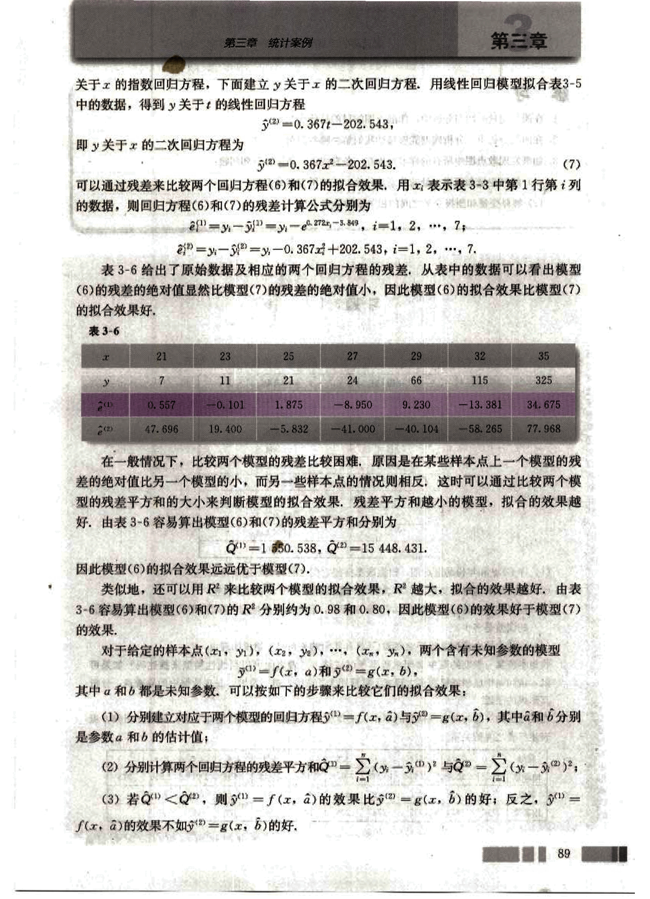
95 

# CHAPTER 3

## 习题

1. 在两个变量的回归分析中，作散点图的目的是什么？
2. 在回归分析中，分析残差能够帮助我们解决哪些问题？
3. 如果发现散点图中所有的样本点都在一条直线上，请回答下列问题：
    (1) 解释变量和预报变量的关系是什么？残差平方和是多少？
    (2) 解释变量和预报变量之间的相关系数是多少？

## 习题 3.1

1. 1993 年到 2002 年中国的国内生产总值 (GDP) 的数据（单位：亿元）如下：

| 年份 | GDP |
|---|---|
| 1993 | 34 634.4 |
| 1994 | 46 759.4 |
| 1995 | 58 478.1 |
| 1996 | 67 884.6 |
| 1997 | 74 462.6 |
| 1998 | 78 345.2 |
| 1999 | 82 067.5 |
| 2000 | 89 468.1 |
| 2001 | 97 314.8 |
| 2002 | 104 790.6 |

(1) 作 GDP 和年份的散点图，根据该图猜想它们之间的关系是什么？
(2) 建立年份为解释变量，GDP 为预报变量的回归模型，并计算残差。
(3) 根据你得到的模型，预报 2003 年的 GDP，看看你的预报与实际的 GDP (117 251.9 亿元) 的误差是多少？
(4) 你认为这个模型能较好地刻画 GDP 和年份的关系吗？请说明理由。

2. 收集本班某一学期的期中和期末数学考试成绩，二者之间可以用线性模型来描述吗？如果可以，请问期中成绩能够在多大程度上解释期末的成绩？进一步地，发现数据中的异常点，分析其形成的原因。

3. 在某地区的一段时间内观察到的不小于某震级的地震个数 $N$ 数据如下表，试建立回归方程表述二者之间的关系。

| 震级 | 地震数 | 震级 | 地震数 |
|---|---|---|---|
| 3.0 | 28 381 | 5.2 | 746 |
| 3.2 | 20 380 | 5.4 | 604 |
| 3.4 | 14 795 | 5.6 | 435 |
| 3.6 | 10 695 | 5.8 | 274 |
| 3.8 | 7 641 | 6.0 | 206 |
| 4.0 | 5 502 | 6.2 | 148 |
| 4.2 | 3 842 | 6.4 | 98 |
| 4.4 | 2 698 | 6.6 | 57 |
| 4.6 | 1 919 | 6.8 | 41 |
| 4.8 | 1 356 | 7.0 | 25 |
| 5.0 | 973 |  |  |

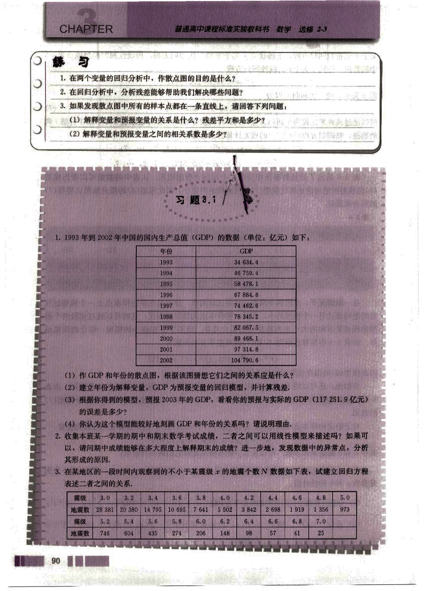
96 

# CHAPTER 3
## 3.2 独立性检验的基本思想及其初步应用

对于性别变量，其取值为男和女两种，这种变量的不同“值”表示个体所属的不同类别，像这类变量称为分类变量。在现实生活中，分类变量是大量存在的，例如是否吸烟，宗教信仰，国籍，等等。

在日常生活中，我们常常关心两个分类变量之间是否有关系，例如，吸烟与患肺癌是否有关系？性别对于是否喜欢数学课程有影响？等等。

为调查吸烟是否对患肺癌有影响，某肿瘤研究所随机地调查了9965人，得到如下结果（单位：人）：

表 3-7 吸烟与患肺癌列联表

|          | 不患肺癌 | 患肺癌 | 总计 |
|----------|-----------|---------|-------|
| 不吸烟   | 7 775     | 42      | 7 817 |
| 吸烟     | 2 099     | 49      | 2 148 |
| 总计     | 9 874     | 91      | 9 965 |

那么吸烟是否对患肺癌有影响？

像表 3-7 这样列出的两个分类变量的频数表，称为列联表。由吸烟情况和患肺癌情况的列联表可以粗略估计出：在不吸烟者中，有 0.54% 患有肺癌；在吸烟者中，有 2.28% 患有肺癌。因此，直观上可以得到结论：吸烟者和不吸烟者患肺癌的可能性存在差异。

与表格相比，三维柱形图和二维条形图能更直观地反映出相关数据的总体状况。图 3.2-1 是列联表的三维柱形图，从中能清晰地看出各个频数的相对大小。

91

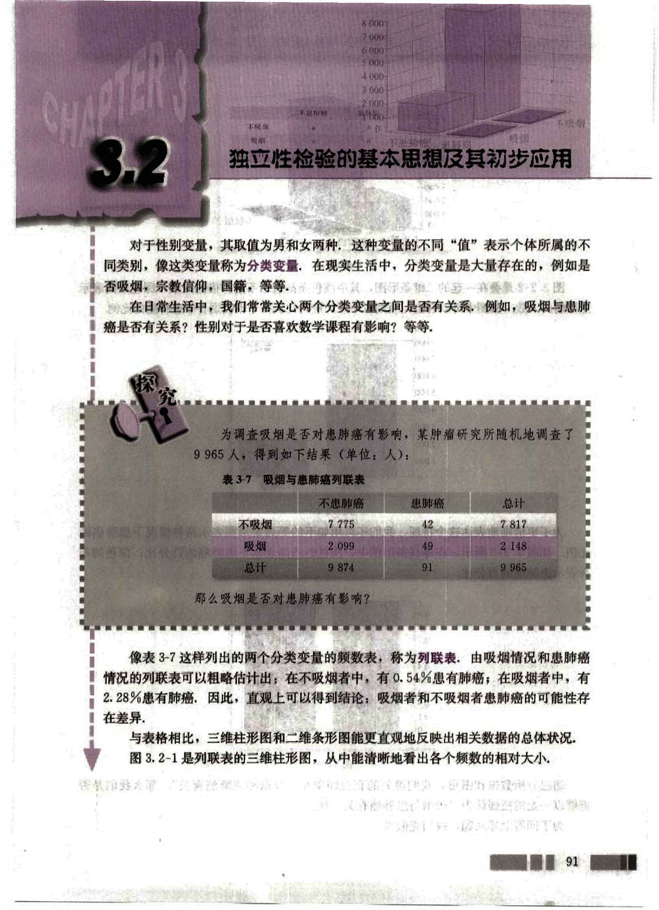
97 

# CHAPTER 3

普通高中课程标准实验教科书 数学 选修 2-3

8000
7000
6000
5000
4000
3000
2000
1000
0
不吸烟 吸烟

图 3.2-1

作三维柱形图要注意选择恰当的视角，以使每个柱体都能被看到。

图 3.2-2 是叠在一起的二维条形图，其中浅色条高表示不患肺癌的人数，深色条高表示患肺癌的人数。从图中可以看出，吸烟者中患肺癌的比例高于不吸烟者中患肺癌的比例。

8000
7000
6000
5000
4000
3000
2000
1000
0
不吸烟 吸烟

图 3.2-2

为了更清晰地表达这个特征，我们还可用如下的等高条形图表示两种情况下患肺癌的比例，如图 3.2-3 所示。在等高条形图中，浅色的条高表示不患肺癌的百分比；深色的条高表示患肺癌的百分比。

1
0.9
0.8
0.7
0.6
0.5
0.4
0.3
0.2
0.1
0
不吸烟 吸烟

图 3.2-3

通过分析数据和图形，我们得到的直观印象是“吸烟和患肺癌有关”，那么我们是否能够以一定的把握认为“吸烟与患肺癌有关”呢？

为了回答上述问题，我们先假设

92

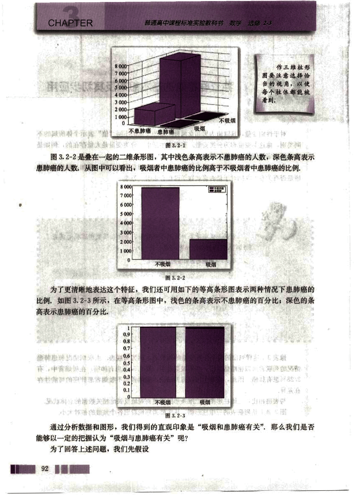
98 

# 第三章 统计案例

## $H_0$: 吸烟与患肺癌没有关系。

用 A 表示不吸烟，B 表示不患肺癌，则“吸烟与患肺癌没有关系”等价于“吸烟与患肺癌独立”，即假设 $H_0$ 等价于

$P(AB) = P(A)P(B).$

把表 3-7 中的数字用字母代替，得到如下用字母表示的列联表：

表 3-8 吸烟与患肺癌列联表

|       | 不患肺癌 | 患肺癌 | 总计 |
| :---- | :-------- | :------ | :---- |
| 不吸烟 | a         | b       | a+b   |
| 吸烟   | c         | d       | c+d   |
| 总计   | a+c       | b+d     | a+b+c+d |

在表 3-8 中，a 恰好为事件 AB 发生的频数；a+b 和 a+c 恰好分别为事件 A 和 B 发生的频数。由于频率近似于概率，所以在 $H_0$ 成立的条件下应该有

$\frac{a}{n} \approx \frac{a+b}{n} \times \frac{a+c}{n},$

其中 $n = a+b+c+d$ 为样本容量，即

$(a+b+c+d)a \approx (a+b)(a+c),$

即

$ad \approx bc.$

因此，$|ad-bc|$ 越小，说明吸烟与患肺癌之间关系越弱；$|ad-bc|$ 越大，说明吸烟与患肺癌之间关系越强。

为了使不同样本容量的数据有统一的评判标准，基于上面的分析，我们构造一个随机变量

$K^2 = \frac{n(ad-bc)^2}{(a+b)(c+d)(a+c)(b+d)}.$ (1)

其中 $n = a+b+c+d$ 为样本容量。

若 $H_0$ 成立，即“吸烟与患肺癌没有关系”，则 $K^2$ 应该很小。根据表 3-7 中的数据，利用公式 (1) 计算得到 $K^2$ 的观测值为

$k = \frac{9965(7775 \times 49 - 42 \times 2099)^2}{7817 \times 2148 \times 9874 \times 91} \approx 56.632.$

这个值到底能告诉我们什么呢？

统计学家经过研究后发现，在 $H_0$ 成立的情况下，

$P(K^2 \ge 6.635) \approx 0.01.$

(2) 式说明，在 $H_0$ 成立的情况下，$K^2$ 的观测值超过 6.635 的概率非常小，近似为 0.01，是一个小概率事件。现在 $K^2$ 的观测值 56.632，远远大于 6.635，所以有理由断定 $H_0$ 不成立，即认为“吸烟与患肺癌有关系”，但这种判断会犯错误，犯错误的概率不会超过 0.01，即我们有 99% 的把握认为“吸烟与患肺癌有关系”。

在上述过程中，实际上是借助于随机变量 $K^2$ 的观测值建立了一个判断 $H_0$ 是否成立的规则：

如果 $K^2 \ge 6.635$，就判断 $H_0$ 不成立，即认为吸烟与患肺癌有关系；否则，就判断 $H_0$  成立。

93

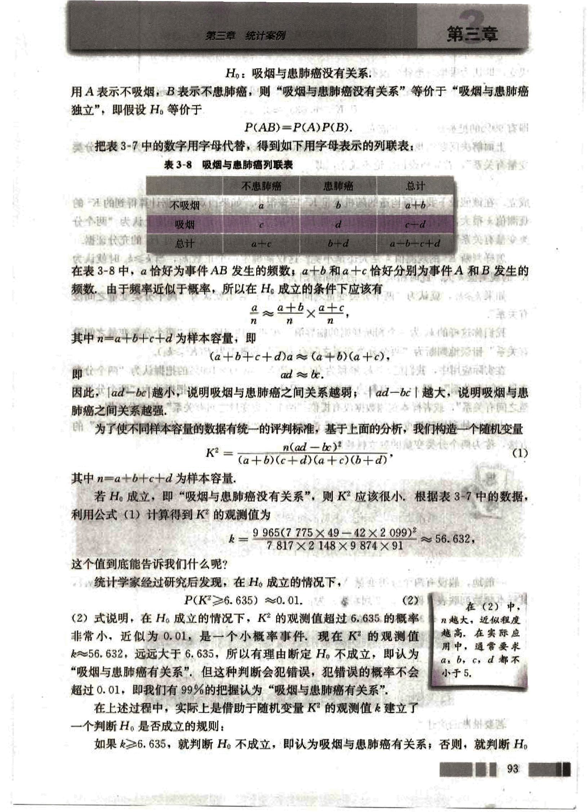
99 

# CHAPTER 3

普通高中课程标准实验教科书 数学 选修 2-3

成立，即认为吸烟与患肺癌没有关系。

在该规则下，把结论“$H_0$成立”错判成“$H_0$不成立”的概率不会超过

即有 99% 的把握认为 $H_0$ 不成立。

$P(K^2 \ge 6.635) \approx 0.01$

上面解决问题的想法类似于反证法，要确认是否能以给定的可信程度认为“两个分类变量有关系”，首先假设该结论不成立，即

$H_0$：“两个分类变量没有关系”

成立，在该假设下我们所构造的随机变量 $K^2$ 应该很小，如果由观测数据计算得到的 $K^2$ 的观测值很大，则在一定可信程度上说明 $H_0$ 不成立，即在一定可信程度上认为“两个分类变量有关系”；如果 $K^2$ 的值很小，则说明由样本观测数据没有发现反对 $H_0$ 的充分证据。

怎样判断 $K^2$ 的观测值是大还是小呢？这仅需确定一个正数 $k_0$，当 $K^2 \ge k_0$ 时就认为 $K^2$ 的观测值大，此时相应于 $k_0$ 的判断规则为：

如果 $K^2 \ge k_0$，就认为“两个分类变量之间有关系”；否则就认为“两个分类变量之间没有关系”。

我们称这样的 $k_0$ 为一个判断规则的临界值，按照上述规则，把“两个分类变量之间没有关系”错误地判断为“两个分类变量之间有关系”的概率为 $P(K^2 \ge k_0)$。

在实际应用中，我们把 $K^2 \ge k_0$ 解释为有 $(1 - P(K^2 \ge k_0)) \times 100\%$ 的把握认为“两个分类变量之间有关系”；把 $K^2 < k_0$ 解释为不能以 $(1 - P(K^2 \ge k_0)) \times 100\%$ 的把握认为“两个分类变量之间有关系”，或者样本观测数据没有提供“两个分类变量之间有关系”的充分证据。

上面这种利用随机变量 $K^2$ 来确定是否能以一定把握认为“两个分类变量有关系”的方法，称为两个分类变量的独立性检验。

利用上面的结论，你能从列联表的三维柱形图中看出两个分类变量是否相关吗？

一般地，假设有两个分类变量 X 和 Y，它们的可能取值分别为 $\{x_1, x_2\}$ 和 $\{y_1, y_2\}$，其样本频数列联表（称为 2×2 列联表）为：

表 3-9  2×2 列联表

|       | $y_1$ | $y_2$ | 总计 |
| :---- | :---- | :---- | :---- |
| $x_1$ |  a    |  b    | $a+b$ |
| $x_2$ |  c    |  d    | $c+d$ |
| 总计 | $a+c$ | $b+d$ | $a+b+c+d$ |

若要推断的论述为

$H_1$：X 与 Y 有关系，

94

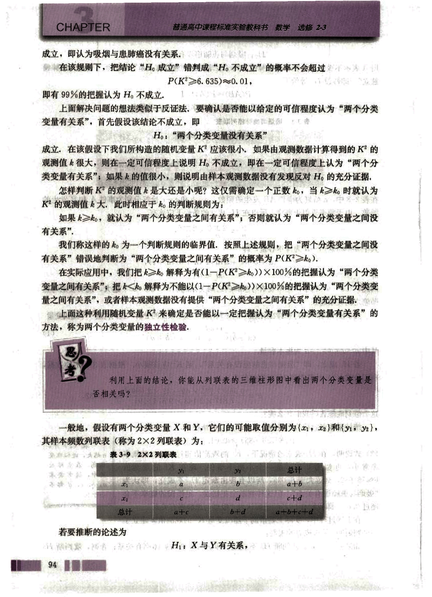
100 

# 第三章 统计案例

可以按如下步骤判断结论$H_1$成立的可能性：

1. 通过三维柱形图和二维条形图，可以粗略地判断两个分类变量是否有关系，但是这种判断无法精确地给出所得结论的可靠程度。

   ① 在三维柱形图中，主对角线上两个柱形高度的乘积$ad$与副对角线上的两个柱形高度的乘积$bc$相差越大，$H_1$成立的可能性就越大。
   ② 在二维条形图中，可以估计满足条件$X = x_1$的个体中具有$Y = y_1$的个体所占的比例$\frac{a}{a+b}$，也可以估计满足条件$X = x_2$的个体中具有$Y = y_2$的个体所占的比例$\frac{c}{c+d}$。两个比例的值相差越大，$H_1$成立的可能性就越大。

2. 可以利用独立性检验来考察两个分类变量是否有关系，并且能够较精确地给出这种判断的可靠程度，具体做法是：

   ① 根据实际问题需要的可信程度确定临界值；
   ② 利用公式(1)，由观测数据计算得到随机变量$K^2$的观测值$k$；
   ③ 如果$k \ge k_α$，就以$(1 - P(K^2 \ge k_α)) \times 100\%$的把握认为“X与Y有关系”；否则就说样本观测数据没有提供“X与Y有关系”的充分证据。

当观测数据$a, b, c, d$中有小于5时，需采用很复杂的精确的检验方法。

在实际应用中，要在获取样本数据之前通过下表确定临界值：

表 3-10

| $P(K^2 \ge k_α)$ | 0.50 | 0.40 | 0.25 | 0.15 | 0.10 | 0.05 | 0.025 | 0.010 | 0.005 | 0.001 |
|---|---|---|---|---|---|---|---|---|---|---|
| $k_α$ | 0.455 | 0.708 | 1.323 | 2.072 | 2.706 | 3.841 | 5.024 | 6.635 | 7.879 | 10.828 |

例 1  在某医院，因为患心脏病而住院的665名男性病人中，有214人秃顶，而另外772名不是因为患心脏病而住院的男性病人中有175人秃顶。

(1) 利用图形判断秃顶与患心脏病是否有关系？
(2) 能够以99%的把握认为秃顶与患心脏病有关系吗？为什么？

解：根据题目所给数据得到如下列联表：

表 3-11  秃顶与患心脏病列联表

|  | 患心脏病 | 患其他病 | 总计 |
|---|---|---|---|
| 秃顶 | 214 | 175 | 389 |
| 不秃顶 | 451 | 597 | 1048 |
| 总计 | 665 | 772 | 1437 |

(1) 相应的三维柱形图如图3.2-4所示，比较来说，底面副对角线上两个柱体高度的乘积要大一些，可以在某种程度上认为“秃顶与患心脏病有关”。

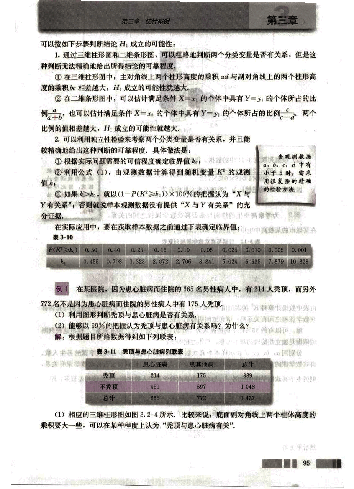
101 

# CHAPTER

普通高中课程标准实验教科书 数学 选修 2-3

[图](images/图3.2-4.png)

(2) 根据列联表 3-11 中的数据，得到

$k^2 = \frac{1437 \times (214 \times 597 - 175 \times 451)^2}{389 \times 1048 \times 665 \times 772} \approx 16.373 > 6.635.$

因此有 99% 的把握认为“秃顶与患心脏病有关”.

## 例 2

为考察高中生的性别与是否喜欢数学课程之间的关系，在某城市的某校高中生中随机抽取 300 名学生，得到如下列联表：

表 3-12 性别与喜欢数学课程列联表

|          | 喜欢数学课程 | 不喜欢数学课程 | 总计 |
|----------|-----------------|-----------------|-------|
| 男        | 37              | 85              | 122   |
| 女        | 35              | 143             | 178   |
| 总计      | 72              | 228             | 300   |

由表中数据计算得 $K^2$ 的观测值 $k \approx 4.514$。能够以 95% 的把握认为高中生的性别与是否喜欢数学课程之间有关系吗？请详细阐明得出结论的依据。

解：可以有约 95% 以上的把握认为“性别与喜欢数学课之间有关系”。作出这种判断的依据是独立性检验的基本思想，具体过程如下：

分别用 $a, b, c, d$ 表示样本中喜欢数学课的男生人数、不喜欢数学课的男生人数、喜欢数学课的女生人数、不喜欢数学课的女生人数。如果性别与是否喜欢数学课有关系，则男生中喜欢数学课的比例 $\frac{a}{a+b}$ 与女生中喜欢数学课的人数比例 $\frac{c}{c+d}$ 应该相差很多，即

$\left| \frac{a}{a+b} - \frac{c}{c+d} \right| = \left| \frac{ad - bc}{(a+b)(c+d)} \right|$

应很大。将上式等号右边的式子乘以常数因子

$\frac{\sqrt{(a+b+c+d)(a+b)(c+d)}}{\sqrt{(a+c)(b+d)}}$

然后平方得

96'

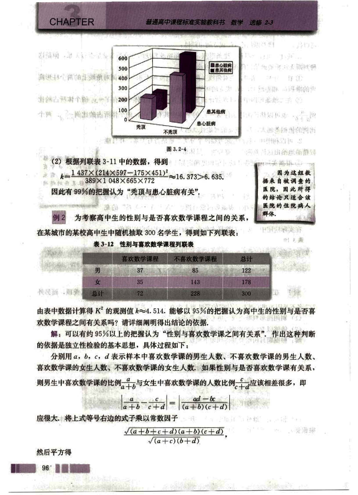
102 

# 第三章 统计案例

##  $K^2 = \frac{n(ad-bc)^2}{(a+b)(c+d)(a+c)(b+d)}$

其中 $n=a+b+c+d$。因此 $K^2$ 越大，“性别与喜欢数学课之间有关系”成立的可能性越大。

另一方面，在假设“性别与喜欢数学课之间没有关系”的前提下，事件 $A = \{K^2 ≥ 3.841\}$ 的概率为

$P(K^2 ≥ 3.841) ≈ 0.05$

因此事件A是一个小概率事件。而由样本数据计算得K的观测值 $k = 4.514$，即小概率事件A发生，因此应该断定“性别与喜欢数学课之间有关系”成立，并且这种判断结果出错的可能性约为5%。所以，约有95%的把握认为“性别与喜欢数学课之间有关系”。

这一结论只适合于被调查的学校。

## 练习

有甲乙两个班级进行一门课程的考试，按照学生考试成绩优秀和不优秀统计成绩后，得到如下的列联表。

### 班级与成绩列联表

|       | 优秀 | 不优秀 | 总计 |
| :---- | :---- | :------ | :---- |
| 甲班  | 10    | 35      | 45    |
| 乙班  | 7     | 38      | 45    |
| 总计  | 17    | 73      | 90    |

请画出列联表的条形图，并通过图形判断成绩与班级是否有关；利用列联表的独立性检验，判断是否能够以99%的把握认为“成绩与班级有关系”。

## 习题 3.2

1. 为考察某种药物预防疾病的效果，进行动物试验，得到如下的列联表：

### 药物效果试验列联表

|       | 患病 | 未患病 | 总计 |
| :---- | :---- | :------ | :---- |
| 服用药 | 10    | 45      | 55    |
| 没服用药 | 20    | 30      | 50    |
| 总计  | 30    | 75      | 105   |

能够以97.5%的把握认为药物有效吗？为什么？

97

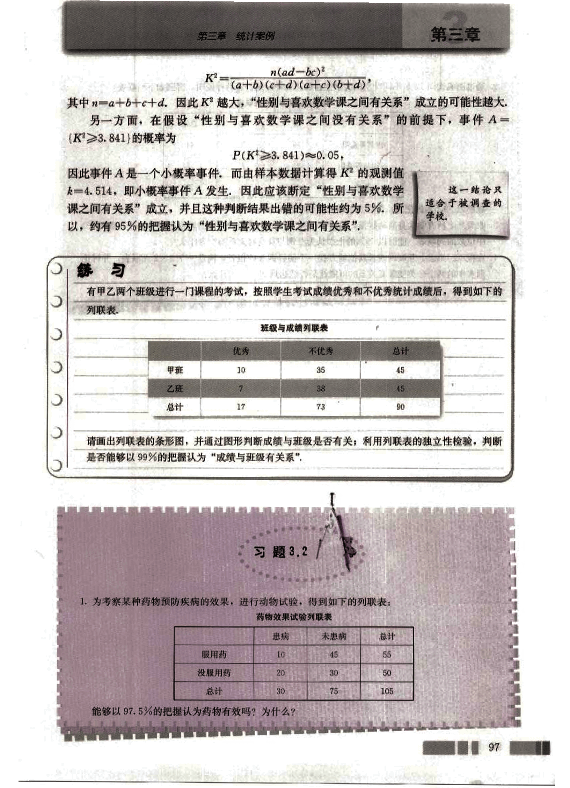
103 

# CHAPTER

普通高中课程标准实验教科书 数学 选修2-3

2. 通过随机询问72名不同性别的大学生在购买食物时是否看营养说明，得到如下列联表：

性别与读营养说明列联表

|       | 女 | 男 | 总计 |
|-------|----|----|------|
| 读营养说明 | 16 | 28 | 44    |
| 不读营养说明 | 20 | 8  | 28    |
| 总计   | 36 | 36 | 72    |

能够以99.5%的把握认为性别与读营养说明之间有关系吗？

3. 收集班上所有学生身高的数据，构造一个关于每一个学生的性别与其身高是否高于（或低于）中位数的列联表，能够以99%的把握认为性别与身高有关系吗？为什么？

4. 在报纸、杂志、互联网或者其他地方找一个抽样调查的报告，构造一个2×2列联表，并讨论调查中的两个分类变量有关系的可能性是否能达到95%。为什么？

98

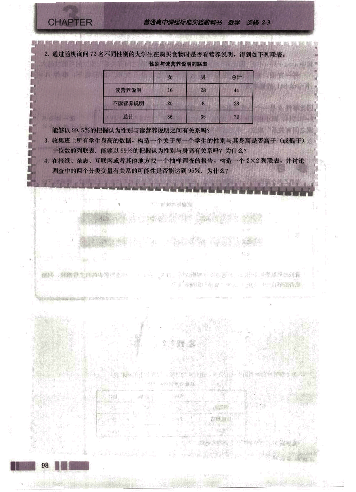
104 

# 第三章 统计案例

## 实习作业

在本章中，我们通过几个统计案例了解了一些统计思想，请同学们根据自己对身边事物的观察，通过查阅资料，讨论等方式，确定要研究的统计问题，然后进行抽样调查，收集数据，并进行整理和分析，最后对问题中的规律作出判断，确定研究问题时，要注意问题的意义。

以下几个问题，供同学们参考：

1. 你校学生的体重与身高之间的关系可以用什么模型刻画？

解决这个问题时，要认真思考以下几个问题：

(1) 要研究的问题是什么？
(2) 如何设计抽样方案？
(3) 如何分析数据？
(4) 从中能够得出什么规律？
(5) 与例题中的结果比较，所用的拟合模型相同吗？

2. 中学生喜欢文科还是理科与性别有关吗？是否喜欢看足球比赛与性别有关吗？是否喜欢音乐与性别有关吗？

解决这个问题时，要认真思考以下几个问题：

(1) 要调查的问题是什么？
(2) 如何设计抽样方案？
(3) 如何分析数据？
(4) 从中能够得出什么规律？发现什么问题？

99

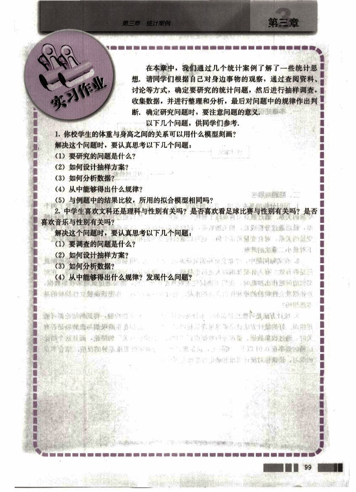
105 

# 小结

## 一、本章知识结构

```mermaid
graph LR
A[统计案例] --> B(回归分析);
B --> C[独立性检验];
```

## 二、回顾与思考

1. 回归分析的基本思想：在必修课程《数学3》的基础上，我们进一步研究了两个变量的关系，通过散点图直观地了解两个变量的关系，然后通过最小二乘法建立回归模型，最后通过分析残差，相关系数等，评价模型的好坏。如果模型比较好地刻画了两个变量的关系，对自变量的某个值，就可以通过模型预测相应因变量的值，与同学交流一下对最小二乘法的理解。

2. 在实际问题中，经常会面临需要推断的问题，比如研制出一种新药，需要推断此药是否有效？有人怀疑吸烟的人更易患肺癌，那么吸烟是否与肺癌有关呢？等等。在对类似的问题作出推断时，我们不能仅凭主观意愿作出结论，需要通过试验来收集数据，并依据独立性检验的原理作出合理的推断。通过本章的学习，你能谈谈独立性检验的基本思想吗？

3. 统计方法是可能犯错误的：不管是回归分析还是独立性检验，得到的结论都可能犯错误，好的统计方法就是要尽量降低犯错误的概率。比如在推断吸烟与患肺癌是否有关时，通过收集数据、整理分析数据得到“吸烟与患肺癌有关”的结论，而且这个结论出错的概率在0.01以下。实际上，这是统计思维与确定性思维差异的反应。结合本章的学习，谈谈你对统计思维和确定性思维差异的理解。

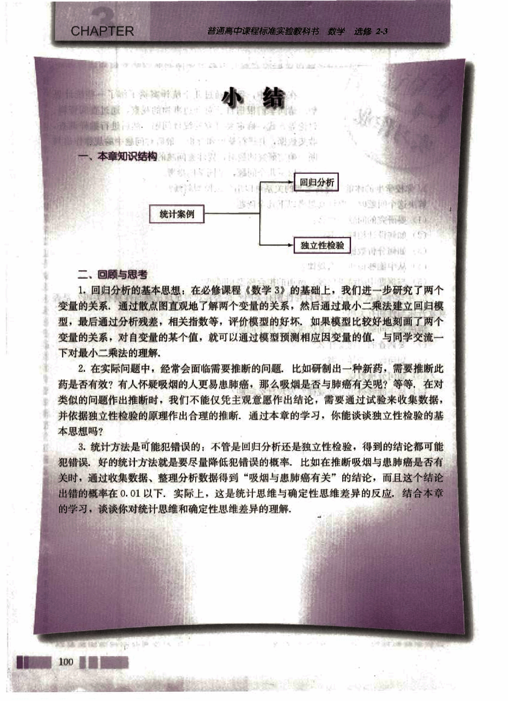
106 

# 复习参考题

## A组

1. 收集 1993 年至 2002 年每年中国人口总数的数据，建立人口与年份的关系，预测 2003 年和 2004 年的人口总数，并计算与实际数据的误差。

2. 如果美国 10 家工业公司提供了以下数据：

| 公司         | 销售总额/百万美元 | 利润/百万美元 |
|--------------|--------------------|-----------------|
| 通用汽车       | 126 974           | 4 224           |
| 福特         | 96 933            | 3 835           |
| 埃克森         | 86 656            | 3 510           |
| IBM           | 63 438            | 3 758           |
| 通用电气       | 55 264            | 3 939           |
| 美孚         | 50 976            | 1 809           |
| 菲利普·莫利斯 | 39 069            | 2 946           |
| 克莱斯勒       | 36 156            | 359            |
| 杜邦         | 35 209            | 2 480           |
| 德士古         | 32 416            | 2 413           |

(1) 作销售总额和利润的散点图，根据该图猜想它们之间的关系应是什么形式；

(2) 建立销售总额为解释变量，利润为预报变量的回归模型，并计算残差；

(3) 计算相关指数，你认为这个模型能较好地刻画销售总额和利润之间的关系吗？请说明理由。

3. 调查某医院某段时间内婴儿出生的时间与性别的关系，得到下面的数据表，能以 90% 的把握认为婴儿的性别与出生时间有关系吗？为什么？

| 出生时间 | 晚上 | 白天 | 合计 |
|---------|-----|-----|-----|
| 男婴     | 24   | 31   | 55   |
| 女婴     | 8    | 26   | 34   |
| 合计     | 32   | 57   | 89   |

101

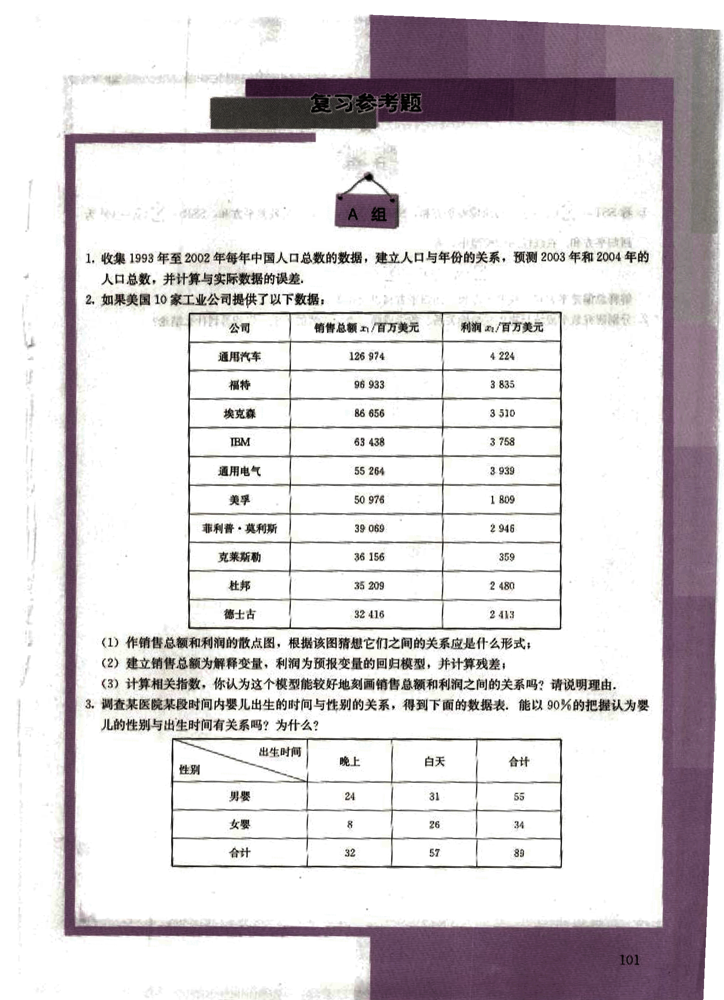
107 

# B组

1. 称 SST = $\sum_{i=1}^{n}(y_i - \overline{y})^2$ 为总偏差平方和，SSE = $\sum_{i=1}^{n}(y_i - \hat{y_i})^2$ 为残差平方和，SSR = $\sum_{i=1}^{n}(\hat{y_i} - \overline{y})^2$ 为回归平方和。在线性回归模型中，有

$\sum_{i=1}^{n}(y_i - \overline{y})^2 = \sum_{i=1}^{n}(y_i - \hat{y_i})^2 + \sum_{i=1}^{n}(\hat{y_i} - \overline{y})^2$

解释总偏差平方和、残差平方和、回归平方和以及该等式的统计含义。

2. 分别研究数学成绩与物理成绩的关系，数学成绩与语文成绩的关系，你能得到什么结论？

102

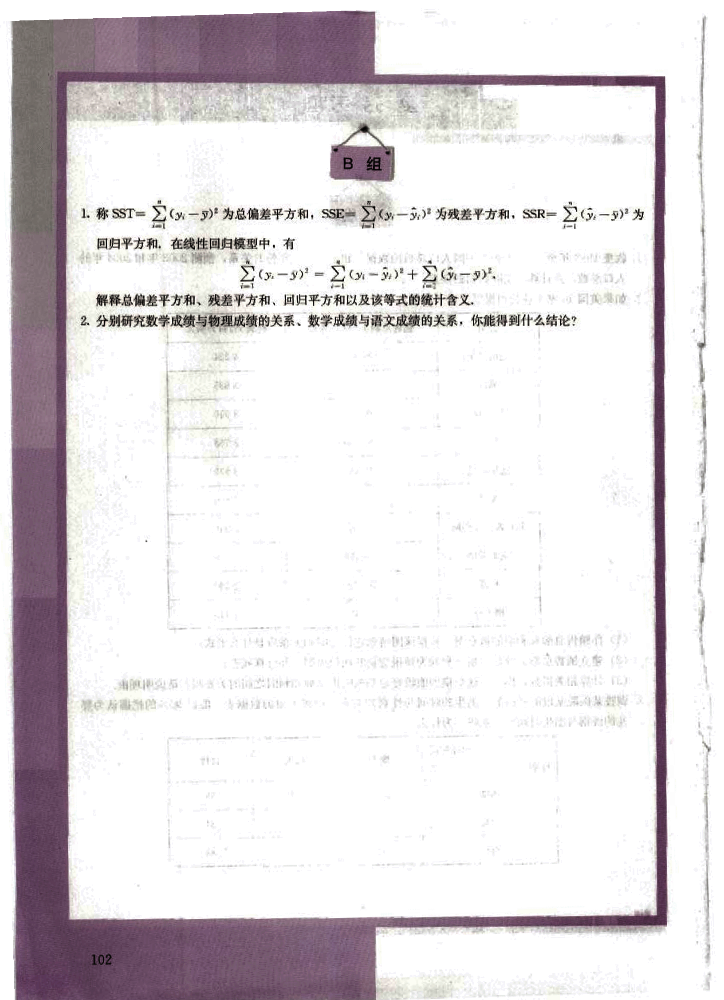
