# 选修3-4

1 

# 数学

## 选修 3-4

# 对称与群

人民教育出版社 课程教材研究所 编著

中学数学课程教材研究开发中心


[laptop](images/laptop.png)


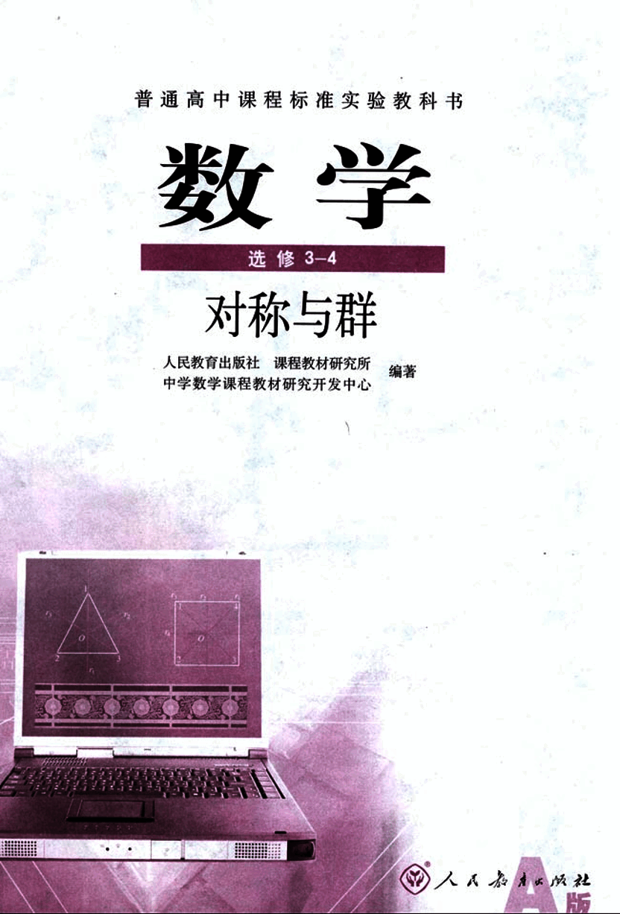
2 

# 目录

引言……1

第一讲 平面图形的对称群……4

一 平面刚体运动……4
1. 平面刚体运动的定义……4
2. 平面刚体运动的性质……7
思考题……10

二 对称变换……10
1. 对称变换的定义……10
2. 正多边形的对称变换……11
3. 对称变换的合成……14
4. 对称变换的性质……17
5. 对称变换的逆变换……20
思考题……22


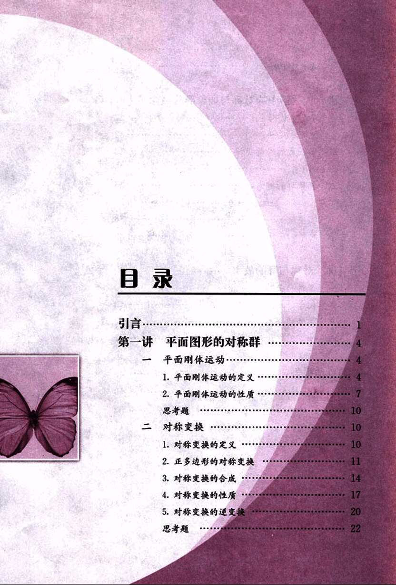
3 

# 第三讲 对称与群的故事

## 一 带饰和面饰  40

## 二 化学分子的对称群  43

## 三 晶体的分类  45

## 四 伽罗瓦理论  47

# 学习总结报告  49

# 附录一  50

# 附录二  52

# 第二讲 代数学中的对称与抽象群的概念

## 一 n元对称群S<sub>n</sub>  27

思考题  32

## 二 多项式的对称变换  32

思考题  35

## 三 抽象群的概念  36

1. 群的一般概念  36

2. 直积  38

思考题  39

# 第一讲 平面图形的对称群

思考题  26

22
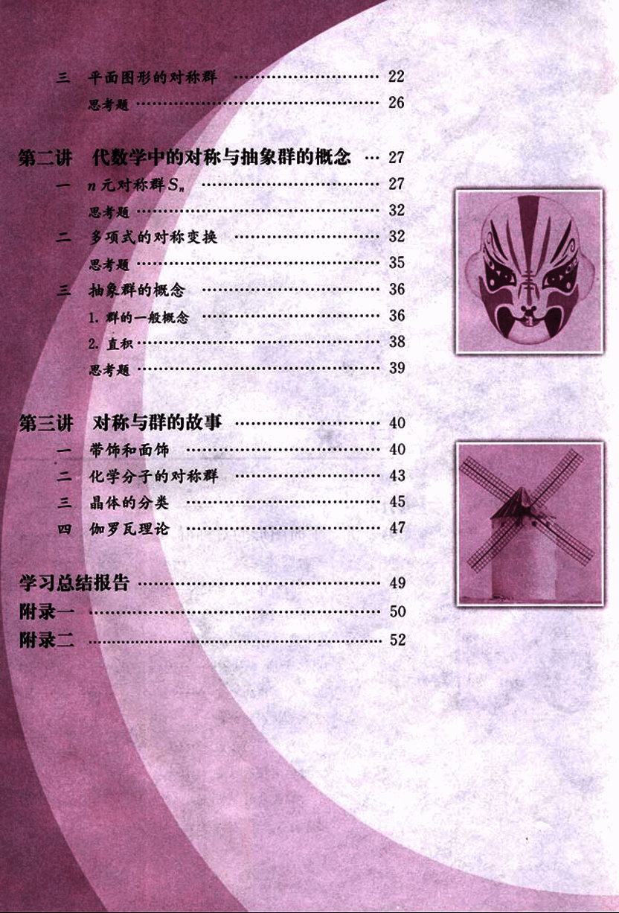
4 

# 引言

观察我们身边的事物，可以发现，对称是现实世界和日常生活中大量存在的现象。

如图 0-1 中，人体具有轴对称性；蝴蝶的翅膀、昆虫的触角都有轴对称性；飞机、天平、剪纸图案等也具有轴对称性。


如图 0-2 中，花朵、时钟、雪花、风车、齿轮等具有中心对称性。


1

5 

# 普通高中课程标准实验教科书 数学(选修3-4) 对称与群

你能再举出一
些具有轴对称、中心
对称的事物吗?

因为“对称”是一种非常普遍的自然现象，因而它在物理学、化学和生命科学中得到广泛的研究和应用；同样地，在数量关系、空间形式中“对称”现象也大量存在，因而它也是数学中重要的对象，不但得到深入研究，而且形成了系统的数学理论；对称的和谐形态总是给人以强烈的美感，因此被大量应用于建筑、造型艺术、绘画和工艺美术中，我们从许多著名的中、外建筑，古、今的艺术珍品中都能找到具有对称性的事物（图0-3）.

[图0-3](images/0-3.png)

实际上，对称这个概念对我们来说并不陌生，在初中平面几何中，我们就学过下面两个关于对称图形的定义，

**定义1**  如果一个平面图形沿着平面上一条直线折叠，直线两旁的部分能够互相重合，那么这个图形叫做轴对称图形，这条直线称为它的对称轴.

**定义2** 把一个平面图形绕平面上某一个点旋转180°，如果旋转后的图形能够和原来的图形互相重合，那么这个图形叫做中心对称图形，这个点称为它的对称中心.

我们还接触过大量具有轴对称和中心对称的图形，如图0-4，等腰三角形、等腰梯形和正五边形等都是轴对称图形.

2


6 

# 引言

等腰三角形

等腰梯形

图 0-4

如图 0-5，平行四边形、正六边形等都是中心对称图形。

平行四边形        正六边形

图 0-5

如图 0-6，圆、正方形等既是轴对称图形，又是中心对称图形。

圆        正方形

图 0-6

正五边形


# 探究

1. 试找出上述 7 个图形的对称轴或对称中心。

2. 将正五边形绕它的中心至少旋转多少度才能与原来的图形重合？正六边形呢？

3. 圆的对称轴有多少条？把圆绕它的圆心旋转多少度就能与原来的圆重合？

正是根据过圆心的任意直线都是圆的对称轴，绕圆心旋转任意角度都与原来的圆重合，古希腊毕达哥拉斯学派认为，圆是平面上最完美的图形。

对“对称性”的研究常常可以使我们加深对物体性质的认识。在本专题中，我们将借助数学工具来研究各种各样的“对称性”，介绍关于“对称”的数学理论。

3

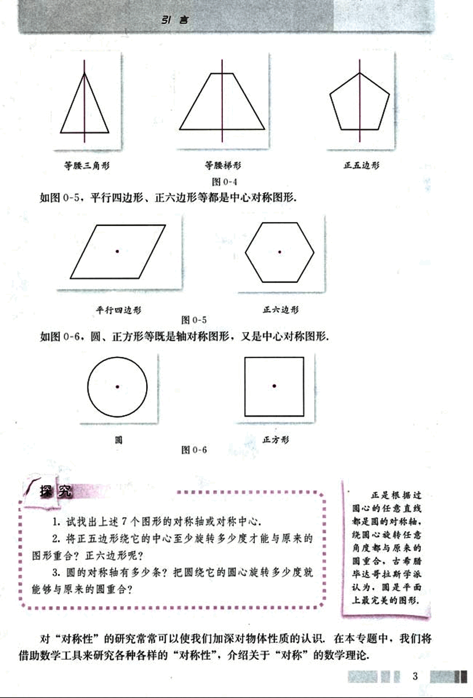
7 

# 第一讲 平面图形的对称群

## 一 平面刚体运动

### 1.平面刚体运动的定义

现在我们换一个角度来考察引言中的定义1和定义2。
按照定义1，等腰三角形是一个轴对称图形，如图1-1，把一个等腰△ABC沿它的对称轴/折叠，则直线/两旁的部分完全重合。

### 观察

如图1-2所示，在一张纸（平面）上画一个等腰△ABC，在它的底边的垂直平分线AD处放一面“双面镜”，并使镜面与纸面垂直，在镜面的反射下，△ABC被映成了什么图形？这个图形与△ABC有什么关系？

[图1-2](images/1-2.png)

从“双面镜”中可以看到，点B被映到了点C，点C被映到了点B，△ABC被映到了△ACB，而且△ACB与△ABC是全等的。
由于镜面垂直于纸面，因此上述△ABC关于镜面的反射可以看成是△ABC关于它的底边垂直平分线AD的反射。

### 探究

如图1-3，任意作一个等腰三角形ABC，任取△ABC上一点P，作点P关于△ABC底边垂直平分线AD的对称点P'。那么，A、B、C关于直线AD的对称点分别是什么？△ABC变成了什么图形？这个图形与△ABC有什么关系？

[图1-1](images/1-1.png)
[图1-3](images/1-3.png)


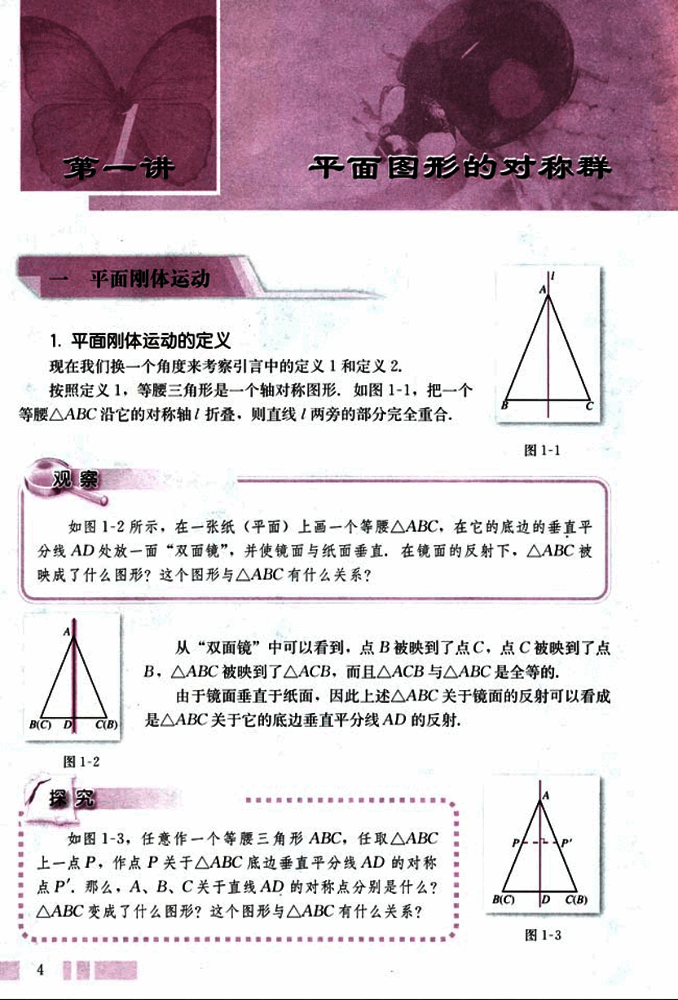
8 

# 第一讲 平面图形的对称群

可以发现，A、B、C的对应点分别是A、C、B，即A保持不动，B的对应点是C，C的对应点是B. △ABC被映成了与它全等的△ACB.

现在，代替等腰三角形，我们考察整个平面关于“双面镜”的反射。

我们知道，一个平面可以看成是点的集合，就像我们把直线看成点的集合一样，设α是一个由平面内的所有点组成的集合，l是这个平面内的一条直线，定义点集（平面）α到其自身的一个映射：

r: P → P'

r把平面α内的任意一点P映到点P关于直线l的对称点P'(图1-4)。我们把这个映射称为平面α关于直线l的反射(reflection)，数学上，把这样定义的反射称为平面α的一个反射变换。

[图1-4](images/1-4.png)

[图1-5](images/1-5.png)

可以知道，在反射变换r的作用下，平面α内的点被映到点，平面α内的图形被映到了与它全等的图形(图1-5)。

这时，如果一个平面图形(如等腰三角形)在映射r的作用下仍与原来的图形重合，我们就称这个平面图形是一个**轴对称图形**。


**思考**

按照这个定义，引言中的等腰梯形、正五边形都是轴对称图形吗？这个定义与引言中的定义1是等价的吗？

按照引言中的定义2，正方形是一个中心对称图形。

如图1-6，正方形ABCD绕它的中心O逆时针旋转180°后，得到的图形与原来的图形重合，其中，A、B、C、D分别被转到了C、D、A、B的位置。

[图1-6](images/1-6.png)

现在，代替正方形，我们考虑整个平面绕平面内一个固定点逆时针旋转180°的旋转，准确地说，设α是一个平面内所有点构成的集合，O是平面α内的一个固定点，定义点集（平面）α到其自身的一个映射：

ρ: P → P'

ρ把平面α内的任意一点P绕点O旋转180°后映到点P'(图1-7)，这个映射称为以点O为中心旋转180°的旋转(rotation)。

再看一下正方形的旋转，如图1-8，取正方形ABCD的中心O为固定点，设ρ是以


5

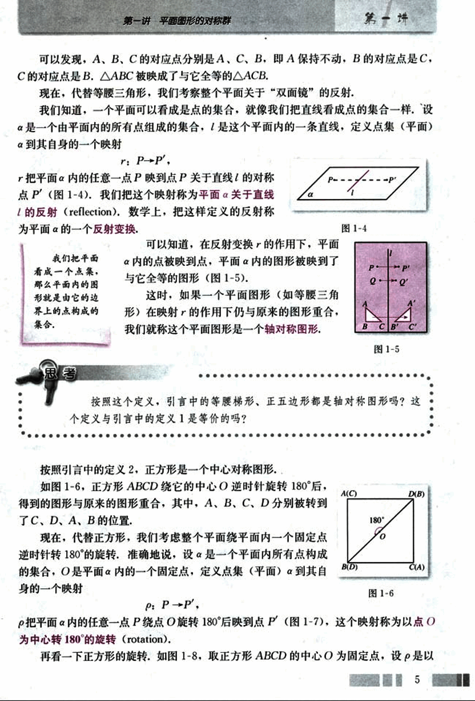
9 

# CHAPTER

普通高中课程标准实验教科书 数学(选修3-4) 对称与群

点O为中心转180°的旋转，那么，在ρ的作用下，正方形上任意一点P被映到了正方形上另一点P'，正方形的顶点A、B、C、D依次被映到点C、D、A、B，正方形ABCD被映到正方形CDAB，显然这两个正方形重合。

A(C)
D(B)

若没有特别
180°
说明，旋转的方
向都是指逆时针
方向.

P'
180°
O
P
α

图1-7
B(D)
图1-8
C(A)

一般地，如果一个平面图形在映射ρ（以点O为中心转180°的旋转）的作用下仍与原来的图形重合，我们就称这个平面图形是一个中心对称图形。

## 思考

按照这个定义，引言中的平行四边形、正六边形、圆都是中心对称图形吗？这个定义与引言中的定义2是等价的吗？

我们可以对以点O为中心转180°的旋转进行推广，请同学们自己定义一个映射，表示平面以一个固定点P为中心转任意给定角度的旋转，这样定义的映射在数学上称为旋转变换。

旋转角度为0°的旋转变换把平面上的所有点映到它自身，这个映射使整个平面上的每个点都保持不动，所以称为恒等变换(identity transformation)。

## 探究

设P、Q是平面内的任意两点，在旋转（或反射）变换的作用下，它们的对应点分别是P'、Q'。P'到Q'的距离与P到Q的距离有什么关系？

探索在某种变换下的不变量或不变关系，是数学研究的重要问题。

可以发现，反射变换和旋转变换有一个共同的特点，即所谓的“保距性”，也就是说，对于平面内的任意两点P和Q，在反射（或旋转）变换的作用下的对应点是P'和Q'，那么P'到Q'的距离等于P到Q的距离，借用物理学中的一个名词，我们把这类“保
6

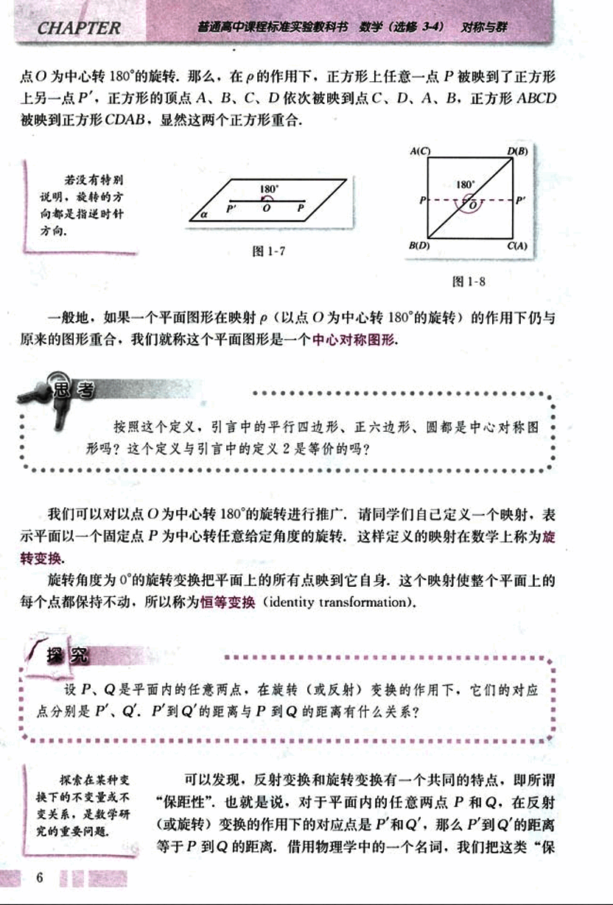
10 

# 第一讲 平面图形的对称群

## 平面刚体运动

**定义** 设$\alpha$是一个平面，映射

$m$: 平面$\alpha$→平面$\alpha$

是一个一一映射，若$m$保持平面$\alpha$内任意两点间的距离不变，则称$m$是一个平面刚体运动(the rigid motions of the plane).

下面我们对上述定义作一个简单的解释，任意一个平面刚体运动$m$:平面$\alpha$→平面$\alpha$，都满足下面四条：

(1)对于平面$\alpha$内的任意一点$P$，在平面$\alpha$内存在唯一的一点$P'$与之对应，记作$P'=m(P)$，$P'$叫做$P$在$m$作用下的象；

(2)任取平面$\alpha$内的一点$P'$，存在平面$\alpha$内的点$P$，使得$P'$是$P$在变换$m$作用下的象；

(3)任取平面$\alpha$内的两点$P_1$、$P_2$，如果$P_1≠P_2$，那么它们的象也是不同的，即$m(P_1)≠m(P_2)$；

(4)任取平面$\alpha$内的两点$P$、$Q$，它们在$m$下的象是$P'$、$Q'$，即$P'=m(P)$，$Q'=m(Q)$，那么$|P'Q'|=|PQ|$，即点$P'$、$Q'$之间的距离与点$P$、$Q$之间的距离相等。

实际上，我们在过去的学习中碰到过许多平面刚体运动，例如，我们熟悉的平移(translation)就是一类平面刚体运动。

设$\alpha$是一个平面，点$O$是$\alpha$内的一个定点，$\vec{v}$是一个以$O$为起点的定向量，平移是指平面内一个点到点的映射

$t$: $P \to P'$

$t$把平面内的任意一点$P$映到点$P'$，且满足$\vec{OP'}=\vec{OP}+\vec{v}$ (图1-9).

这个映射在数学上称为平移变换，在平移变换的作用下，平面内的所有点沿定向$\vec{v}$的方向，移动了距离$|\vec{v}|$。

## 平面刚体运动的性质

平面刚体运动$m$:平面$\alpha$→平面$\alpha$有哪些性质呢？保持距离不变是$m$的一个很强的性质，可以证明，只要知道不共线的3个点A、B、C在$m$下的象A'、B'、C'，$m$就完全确定下来了(参见附录一)。

下面我们再来证明：在平面刚体运动$m$的作用下，正边形的大小和形状都保持不变，为了证明这个结论，我们先来证明下面这个命题。

7

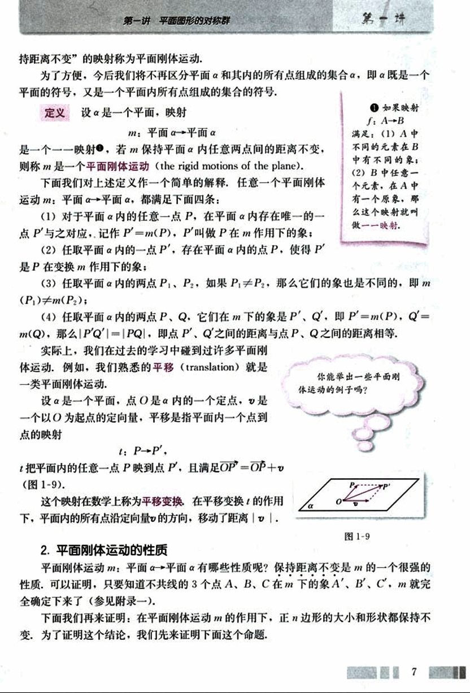
11 

# CHAPTER

普通高中课程标准实验教科书 数学(选修3-4) 对称与群

## 命题 平面刚体运动

$m$: 平面 $a \to$ 平面 $a$

将平面 $a$ 内的直线映成直线，射线映成射线，线段映成等长的线段。

### 证明：

令 $l$ 是平面 $a$ 内的任意一条直线，设 $m$ 把 $l$ 上所有的点映到点集 $l'$。在上任取两点 A、B，设 $m$ 把它们分别映到 A'、B'。下面我们来证明 $l'$ 是过点 A'、B' 的直线。

在 AB 上任取一点 C，设 m 把点 C 映到点 C'。

(1) 如图 1-10，当点 C 在 AB 之间时，由平面刚体运动的定义得

$|A'C'| + |C'B'| = |AC| + |CB|$

$= |AB|$

$= |A'B'|$

所以点 C 在线段 A'B' 上 (为什么？)。

(2) 如图 1-11，当点 C 在 AB 的延长线上时，我们有

$|A'B'| + |B'C'| = |AB| + |BC|$

$= |AC|$

$= |A'C'|$

所以 B' 在线段 A'C' 上，即点 C 在线段 A'B' 的延长线上。

同理可证，当点 C 在 BA 的延长线上时，点 C 在线段 B'A' 的延长线上。

由点 A、B、C 的任意性可知，$l'$ 是一条直线。

## 思考

如何证明平面刚体运动 m: 平面 a → 平面 a 将平面 a 上的射线映成射线，线段映成等长的线段？

## 下面，我们说明三角形在平面刚体运动的作用下，形状和大小都保持不变。

如图 1-12，设 △ABC 是平面 a 内的任意一个三角形，由已证命题可知，平面刚体运动

$m$: 平面 $a \to$ 平面 $a$

把线段 AB，BC，AC 依次映成线段 A'B'，B'C'，A'C'，

而且

AB = A'B'，BC = B'C'，AC = A'C'。

8

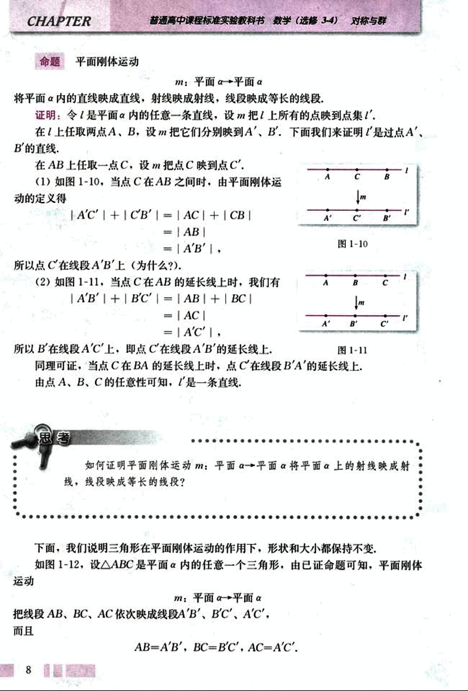
12 

# 第一讲 平面图形的对称群

<br>

## 图1-12

<br>

由于

AB + BC > AC,

故

A'B' + B'C' > A'C',

所以 A'B'、B'C'、C'A' 构成了一个以 A'、B'、C' 为顶点的三角形，而且 △ABC 与 △A'B'C' 是全等的。

<br>

## 探究

设正 n 边形 K 以 O 为中心，以点 A<sub>1</sub>, A<sub>2</sub>, …, A<sub>n</sub> (n≥3) 为顶点，说明在平面刚体运动的作用下，K 的大小和形状都保持不变，且顶点 A<sub>1</sub>, A<sub>2</sub>, …, A<sub>n</sub> 的象仍是新的正 n 边形的顶点。

<br>

最后，我们讨论一类特殊的平面刚体运动，设

m: 平面 α → 平面 α

是一个平面刚体运动，若在平面 α 内至少存在一个点 O，点 O 在 m 的作用下保持不动，即 m(O) = O，我们称为有不动点的平面刚体运动。

这类平面刚体运动在下面的学习中具有重要的地位。我们知道，关于直线的反射变换以上所有的点为不动点；以 O 为中心的旋转变换以 O 为不动点，有趣的是，有不动点的平面刚体运动只有旋转变换和反射变换（证明详见附录二）。

<br>

9

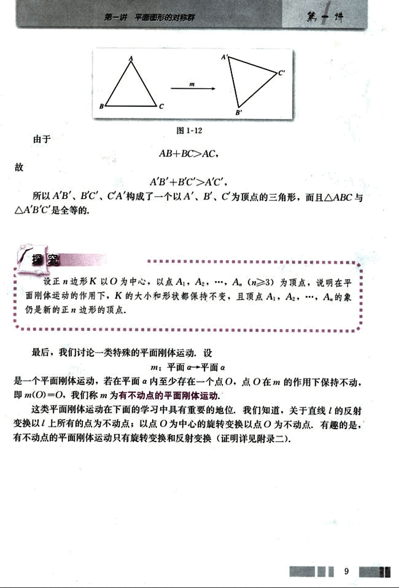
13 

# CHAPTER

## 思考题

1. 标出下图中的点A、B、C、D、E在关于直线的反射变换下的象；
2. 依次标出下图中的顶点A～H在以O为中心转90°、180°、270°的旋转变换下的象。

(1)  [image1](images/image1.png) (2) [image2](images/image2.png)


## 二 对称变换

1. **对称变换的定义**

从上面的讨论发现，我们可以利用平面刚体运动来定义平面图形的对称性，例如，由于等腰三角形在关于其对称轴的反射变换的作用下，仍与原来的图形重合，我们就称等腰三角形具有轴对称性，并把反射变换叫做等腰三角形的对称变换。

下面，我们利用平面刚体运动，将平面图形“对称”的概念推广到一般情形，

**定义**  若一个平面图形K在平面刚体运动m的作用下仍与原来的图形重合，就称K具有对称性，m叫做K的对称变换(symmetric transformation 或 symmetry)。

按照上述定义，“一个平面图形是对称图形”等价于说“一个平面图形有对称变换”。

显然，任意图形都在恒等变换下变到自身，这时我们也认为这个图形具有对称性，但是我们真正感兴趣的是那些非恒等变换的对称变换，以及在这样的对称变换下图形的对称性。

这样定义的图形的对称性，比我们熟悉的轴对称性、中心对称性要广泛得多。例如，图形的中心对称性是指这个图形绕平面上某一个点旋转180°后仍与原图形重合，而这里的对称性不局限于旋转180°，即旋转的角度可以是任意角。这样，由于正五边形绕中心旋转72°后仍然与原图形重合，因此正五边形具有对称性，而绕正五边形中心旋转72°的旋转变换就是正五边形的 一个对称变换，同样地，正六边形绕它的中心旋转60°后不变的性质，是正六边形的一个对称变换。[image3](images/image3.png) [image4](images/image4.png)

10


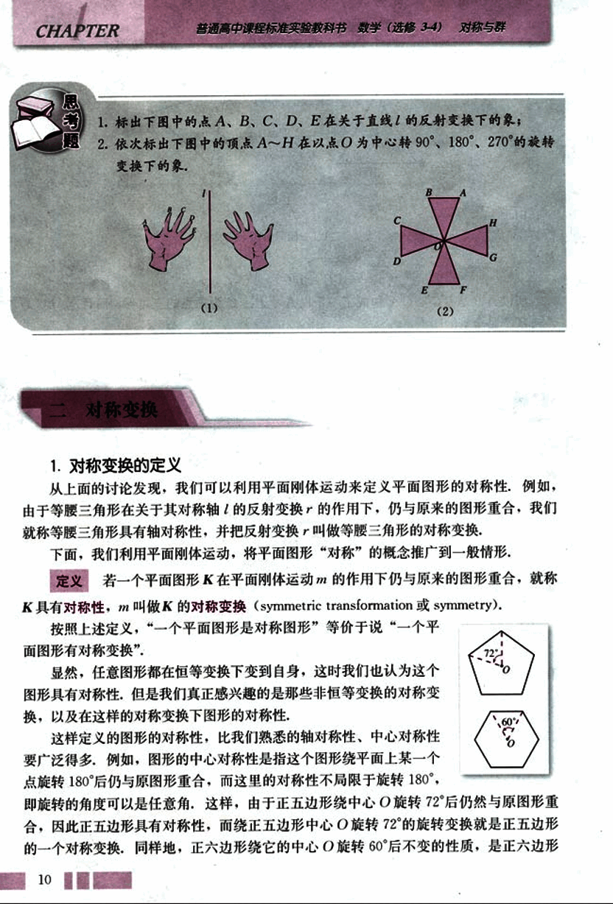
14 

# 第一讲 平面图形的对称群

## 2. 正多边形的对称变换

思考

对于一个具有对称性的平面图形，例如正多边形，它的对称变换是唯一的吗？如果不唯一，你能找出它的所有对称变换吗？

下面我们先考察一下正三角形的对称变换。

如图1-13，画一个正三角形，在它的三个顶点上标上数字1、2、3，并画出它的三条对称轴$r_1$、$r_2$、$r_3$和中心O。

通过实验，容易发现，正三角形在下列平面刚体运动的作用下保持不变。

(1) 恒等变换，记作$I$;


(2) 关于对称轴$r_1$所在直线的反射，记作$r_1$;


(3) 关于对称轴$r_2$所在直线的反射，记作$r_2$;


11

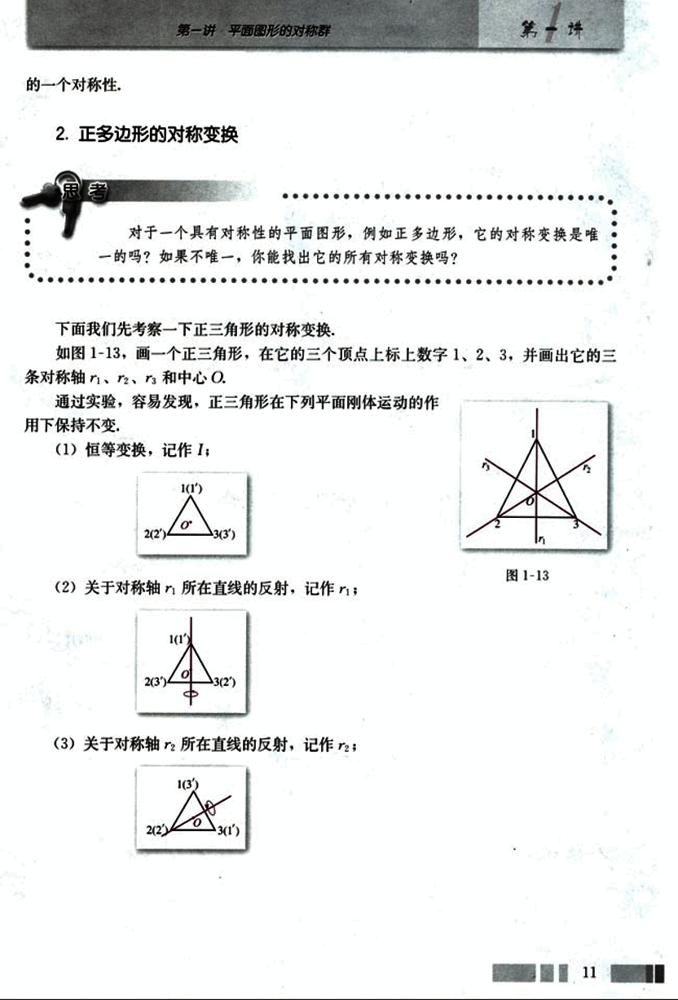
15 

# CHAPTER

普通高中课程标准实验教科书 数学(选修3-4) 对称与群

(4) 关于对称轴所在直线的反射，记作 $r_3$；


(5) 以点O为中心转120°的旋转，记作 $ρ$；


(6) 以点O为中心转240°的旋转，记作 $ρ^2$；


在上述变换中，1', 2', 3' 表示三角形 123 的顶点在变换下的象所在的位置，例如，对于 (2) 中的变换 $r_1$，我们有

1' = $r_1$(1), 2' = $r_1$(3), 3' = $r_1$(2).

这样，我们就找到了正三角形的 6 个对称变换，习惯上，把它们组成的集合记作 $D_3$，

$D_3 = \{I, r_1, r_2, r_3, ρ, ρ^2\}$.

可以发现，在这 6 个变换中，中心 O 都保持不动；在 $D_3$ 中任意一个变换的作用下，三角形的顶点 1, 2, 3 的象仍然是三角形的顶点，它们按照某种顺序落到三角形的顶点上。

由前面已有的相关知识可知，正多边形的对称变换由平面上的 3 个不共线的点唯一确定，又由于 $D_3$ 中的 6 个变换都以中心 O 为不动点，因此，$D_3$ 中的对称变换由三角形的两个顶点完全确定，例如，如果在对称变换 m 的作用下，1, 2 分别对应于 3', 1'，那么 m = $ρ^2$.

12

探究

继续作图，你还能找到正三角形其他的对称变换吗？


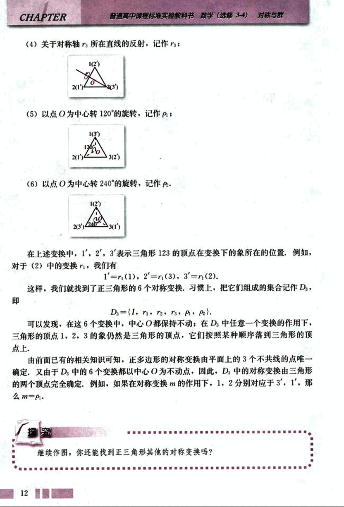
16 

# 第一讲 平面图形的对称群

你找到其他的对称变换了吗？一定没有，事实上，并不是你找不出来，而是除了上述6个对称变换外，正三角形再也没有其他的对称变换了。这是因为，正三角形的对称变换都是以其中心O为不动点的平面刚体运动，因此只有两类——或是以O为中心的旋转变换，或是关于经过O点的直线的反射变换；另一方面，由于三角形的对称变换由它的两个顶点完全确定，除了上述6个对称变换外，别的旋转变换和反射变换显然都不会是正三角形的对称变换。

为了使同学们进一步熟悉正多边形的对称变换，下面，我们再来看一下正方形有几个对称变换。与正三角形类似，正方形的对称变换都以其中心O为不动点，因此只要在以O为中心的旋转和关于经过O点的直线的反射中寻找就够了。

如图1-14，在纸片上画一个正方形，在它的4个顶点上标上数字1, 2, 3, 4，再画出它的4条对称轴 $r_1, r_2, r_3, r_4$。

[图1-14](images/图1-14.png)

通过操作，我们可以找到下列正方形的对称变换。请同学们根据下列图形，在横线上填上相应的对称变换；或根据下列对称变换，画出相应的图形。

1. 恒等变换，记作 *I*;

2. 关于对称轴 $r_i$ 所在直线的反射，记作 $r_i$;

3. _______，记作 $r_2$;

1(4')
4(1')
Φ
2(3')
3(2')


4. _______，记作 $r_3$;

1(1')
4(2')
Φ
2(4')
3(3')

13

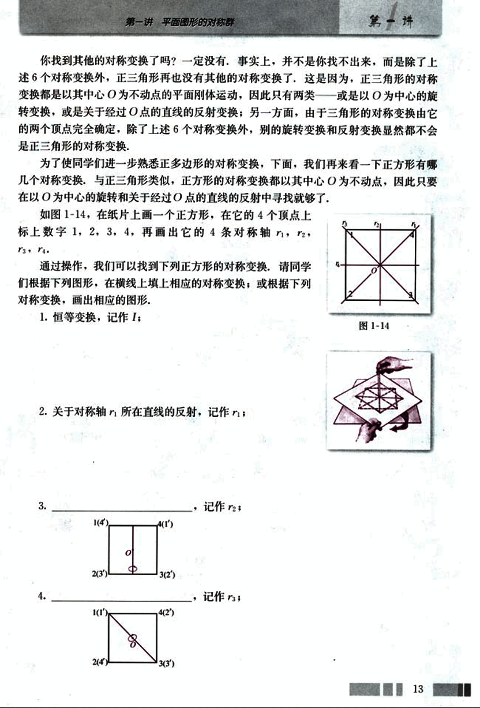
17 

# CHAPTER 1

5.  _____, 记作 $r_1$:


6. 以O点为中心转90°的旋转，记作 $r_1$:


7. _____, 记作 $r_1$:


8. _____, 记作 $r_1$:


这样，我们就找到了正方形的8个对称变换，这8个对称变换都保持正方形的中心不动，而把它的顶点仍然映成顶点，习惯上，把这8个对称变换组成的集合记作$D_4$，即

$D_4 = \{I, r_1, r_2, r_3, r_4, p_1, p_2, p_3\}$


事实上，正$n$边形的对称变换都保持它的对称中心不动，而把它的$n$个顶点仍然映成顶点。


(1) 你能给出正五边形、正六边形的对称变换吗？
(2) 你能给出等腰(不等边)三角形、平行四边形的对称变换吗？


3. **对称变换的合成**

上面我们以正三角形、正方形为例，讨论了正多边形的对称变换，像研究数的性质时要考察数的运算一样，我们想探索的是，对于一个正多边形的对称变换的集合，其中
14
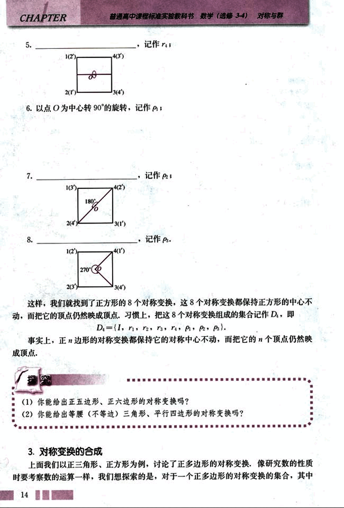
18 

# 第一讲 平面图形的对称群

## 的元素是否也可以“运算”呢？

的元素是否也可以“运算”呢？例如，若我们对正 *n* 边形连续做两次对称变换，结果会怎样？这就是我们下面要讨论的对称变换的合成问题。

所谓一个正多边形的两个对称变换的合成，是指先做一个对称变换，再做另一个对称变换，以正方形的对称变换的合成为例，先对正方形做变换 ρ，再做变换 r，用图形表示为：

```
[image1](images/image1.png)
```

这样，我们就得到了正方形的一个新的变换，记作 ρ · r ，它对正方形的作用效果是：

```
[image2](images/image2.png)
```

当然，ρ · r 仍然是正方形的一个对称变换（为什么？）。很自然地想知道，它是 D<sub>4</sub> 中哪一个对称变换呢？我们发现，ρ · r 把顶点 1，2，3，4 依次映到了 3，2，1，4；而 r 也把 1，2，3，4 依次映到了 3，2，1，4。由于正方形的对称变换由其（任意）两个顶点所唯一确定，所以 ρ · r 与 r 是相同的对称变换，即

ρ · r = r.

也就是说，ρ 与 r 的合成 ρ · r 仍然是正方形的一个对称变换，而且仍然在 D<sub>4</sub> 中。

## 探究

操作模型或画图，验证对于 D<sub>4</sub> 中的任意两个对称变换，都有类似的结论。

一般地，由对称变换的定义可以知道，一个平面图形的两个对称变换 *a* 与 *b* 的合成（即先做变换 *a*，再做变换 *b*）仍然是这个平面图形的一个对称变换，记作 *b* · *a*.

15

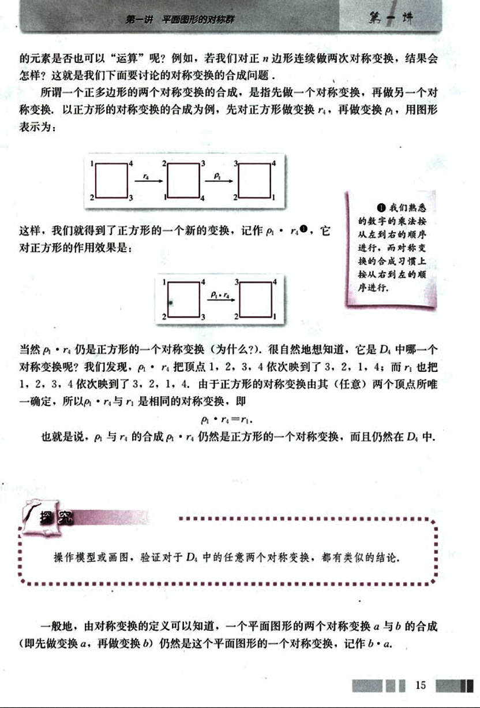
19 

# CHAPTER

例 对于 $D_3$，分别求：

(1) $I \cdot r_1$；       (2) $r_1 \cdot I$；       (3) $r_3 \cdot r_2$；
(4) $r_2 \cdot r_3$；       (5) $r_2 \cdot \rho_1$；      (6) $\rho_1 \cdot r_2$

分析：我们只要根据对称变换合成的过程，分步骤完成两个变换即可。

解：(1) 因为

[Diagram1](images/Diagram1.png)

所以 $I \cdot r_1 = r_1$。

(2) 因为

[Diagram2](images/Diagram2.png)

所以 $r_1 \cdot I = r_1$。

(3) 因为

[Diagram3](images/Diagram3.png)

所以 $r_3 \cdot r_2 = \rho_2$。

(4) 因为

[Diagram4](images/Diagram4.png)

所以 $r_2 \cdot r_3 = \rho_1$。

16
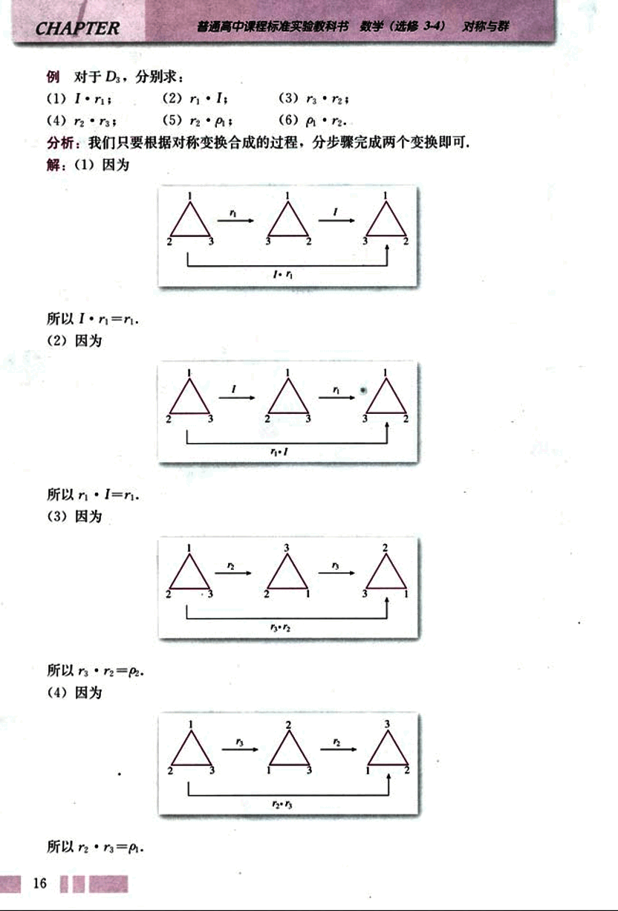
20 

# 第一讲 平面图形的对称群

(5) 因为


所以 $r_2 \cdot \rho_1 = r_3$.

(6) 因为


所以 $\rho_1 \cdot r_2 = r_1$.

# 4. 对称变换的性质

数的乘法满足交换律，对称变换的合成满足交换律吗？

我们以最简单的正三角形的对称变换为例，看一看对称变换的合成是否满足交换律。
若对正三角形 123 先做恒等变换 I，再做变换 $r_2$，即


我们发现 $r_2 \cdot I = r_2$.

反过来，先做变换 $r_2$，再做恒等变换 I，即


---
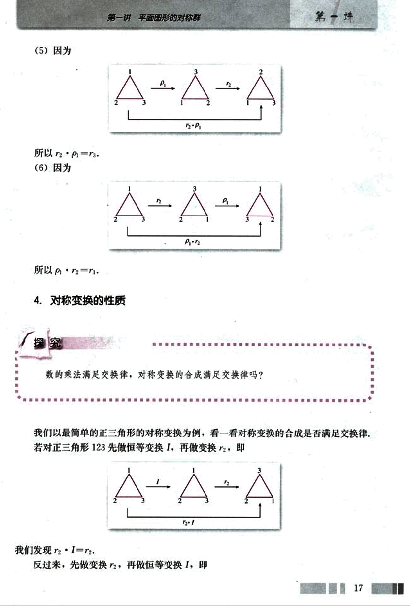
21 

# CHAPTER

普通高中课程标准实验教科书 数学(选修3-4) 对称与群

A-A-A
<center>1</center>
<center>2</center>
<center>3</center>
<center>→</center>
<center>3</center>
<center>2</center>
<center>1</center>
<center>→</center>
<center>3</center>
<center>2</center>
<center>1</center>
<center>r<sub>2</sub></center>
<center>I</center>
<center>r<sub>2</sub></center>

这时有 $I \cdot r_2 = r_2$。于是我们有

$r_2 \cdot I = I \cdot r_2$。

## 思考

对于任意对称变换 $a$ 与恒等变换 $I$，是否都有 $a \cdot I = I \cdot a$ 成立？

可以发现，对于任意对称变换 $a$ 与恒等变换 $I$，都有 $a \cdot I = I \cdot a$ 成立，但是，对于集合 $D_3$ 中的其他变换，交换律并不一定成立。例如，从上面的例子中我们可以发现，$r_3 \cdot r_2 \ne r_2 \cdot r_3$，$\rho \cdot r_2 \ne r_2 \cdot \rho$。

一般地，平面图形的对称变换的合成不满足交换律。

我们知道，数的乘法满足结合律，那么，对称变换的合成是否也满足结合律呢？

我们先来看一个正三角形的例子，例如，先对正三角形做变换 $(\rho \cdot r_2)$，再做 $r_1$，即


<center>A-A-A-A</center>

<center>$\rho \cdot r_2 = r_1$</center>
<center>$r_1 \cdot r_1 = I$</center>

我们有 $(\rho \cdot r_2) \cdot r_1 = I$。

然后先对正三角形做变换 $r_2$，再做变换 $(r_1 \cdot \rho)$，即

<center>A-A-A</center>

<center>$(r_1 \cdot \rho) \cdot r_2$</center>

我们也有 $(r_1 \cdot \rho) \cdot r_2 = I$。

18

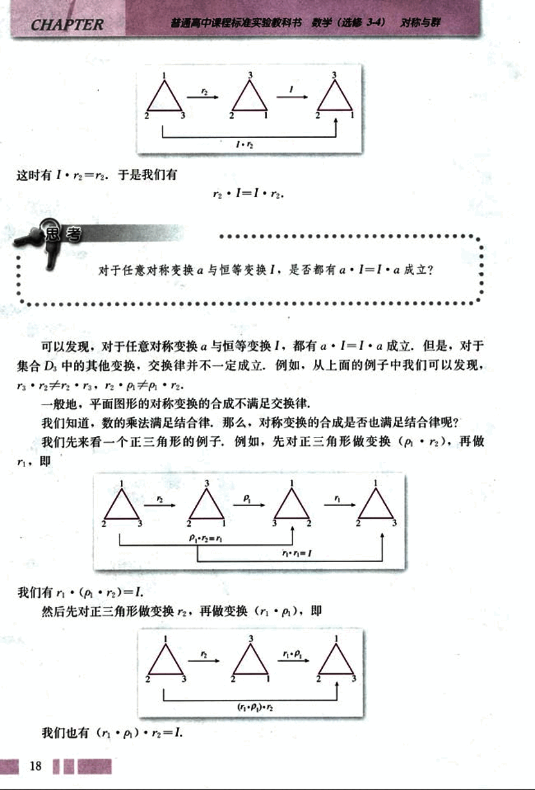
22 

# 第一讲 平面图形的对称群

## 由此可以得到

r₁ ⋅ (ρ₁ ⋅ r₂) = (r₁ ⋅ ρ₁) ⋅ r₂.


## 探究

请你在集合 D₄ 中任选三个变换，看看它们的合成是否都满足结合律？


## 再看正方形的对称变换是否满足结合律，

先对正方形做变换 ($ρ_₁⋅ρ_₂$)，再做变换 $ρ_₃$，则


于是我们得到 $ρ_₁⋅(ρ_₂⋅ρ_₃) = ρ_₅$.

若先对正方形做变换 $ρ_₁$，再做变换 ($ρ_₂⋅ρ_₃$)，那么


这时我们也得到 ($ρ_₁⋅ρ_₂$)⋅$ρ_₃ = ρ_₅$.

所以

$ρ_₁⋅(ρ_₂⋅ρ_₃) = (ρ_₁⋅ρ_₂)⋅ρ_₃$.


## 探究

请你在集合 D₄ 中任选三个变换，看看它们的合成是否都满足结合律？

从上面的讨论，我们已经看到，$ρ_₁⋅(ρ_₂⋅ρ_₃)$ 和 ($ρ_₁⋅ρ_₂)⋅ρ_₃$ 对一个图形或一个点的

19

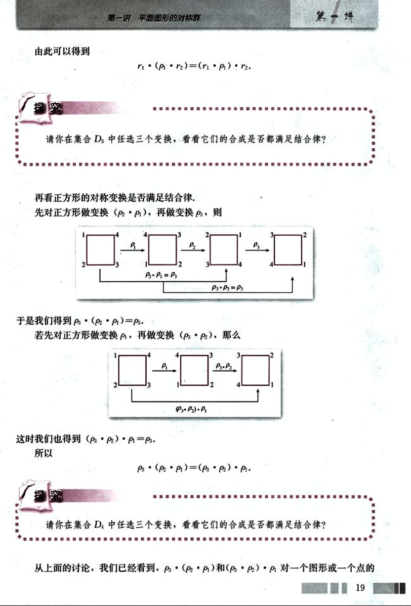
23 

# CHAPTER

普通高中课程标准实验教科书 数学(选修3-4) 对称与群

作用都是对它先施行 $\rho_2$，再施行 $\rho_1$，最后再施行 $\rho_3$。因而 $\rho_3 \cdot (\rho_2 \cdot \rho_1)$ 和 $(\rho_3 \cdot \rho_2) \cdot \rho_1$ 是完全一样的。

一般地，我们有：若 $m_1$，$m_2$，$m_3$ 是平面图形的3个对称变换，它们之间的合成满足结合律，即

$m_3 \cdot (m_2 \cdot m_1) = (m_3 \cdot m_2) \cdot m_1$

## 5. 对称变换的逆变换

我们知道，互为倒数的两数之积等于1；对数函数与指数函数互为反函数，对称变换是否也可以讨论类似的问题呢？

下面我们还是以正三角形的对称变换为例，来考察一下这个问题。

看一个例子，对正三角形先做变换 $\rho_2$，再做变换 $\rho_1$，我们有

$\rho_2 \cdot \rho_1 = I$

[image1](images/image1.png)


如果对正三角形先做变换 $\rho_1$，再做变换 $\rho_2$，仍然有

$\rho_1 \cdot \rho_2 = I$

[image2](images/image2.png)

因此我们有

$\rho_1 \cdot \rho_2 = \rho_2 \cdot \rho_1 = I$

再看一个例子，若对正三角形连续做两次变换 $r_2$，即

[image3](images/image3.png)

可见对于正三角形，$r_2$ 与 $r_2$ 的合成等于恒等变换 $I$，即 $r_2 \cdot r_2 = I$

20

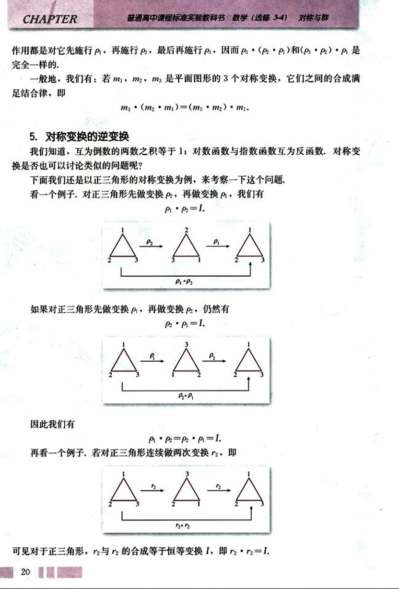
24 

# 第一讲 平面图形的对称群

一般地，如果一个对称变换 $a$ 与另一个对称变换 $b$ 的合成等于恒等变换 $I$，即
$b \cdot a = a \cdot b = I$，
我们就称 $b$ 为 $a$ 的逆变换（或 $a$ 为 $b$ 的逆变换），记作
$a^{-1} = b$ （或 $b^{-1} = a$）.

上面的例子说明，正三角形的旋转变换 $\rho$ 的逆变换是旋转变换 $\rho$，即 $\rho^2 = \rho$; 反射变换 $r$ 的逆变换是它本身，即 $r^2 = r$.

现在我们来看看正方形的旋转变换是否有逆变换。
先把正方形绕其中心旋转 90°，即对它做变换 $\rho$；为了使正方形重新回到原来的位置，再把它绕其中心旋转 270°，即对它做变换 $\rho^3$.

类似地，我们有

[image](images/image.png)

所以 $\rho$ 的逆变换是 $\rho^3$，即 $\rho^{-1} = \rho^3$.


## 探究

操作模型或画图，探究集合 $D_3$ 和 $D_4$ 中所有的对称变换是否都存在逆变换，如果存在，这些逆变换也都分别属于 $D_3$ 和 $D_4$ 吗？

我们已经知道，两个对称变换 $a$、$b$ 的合成 $b \cdot a$ 仍然是一个对称变换，那么，这个对称变换的逆变换又是怎样的呢？由对称变换满足结合律，我们得到
$(a \cdot b)^{-1} \cdot (b \cdot a) = a^{-1} \cdot (b^{-1} \cdot b) \cdot a$
$= a^{-1} \cdot I \cdot a$
$= a^{-1} \cdot a$
$= I.$

21

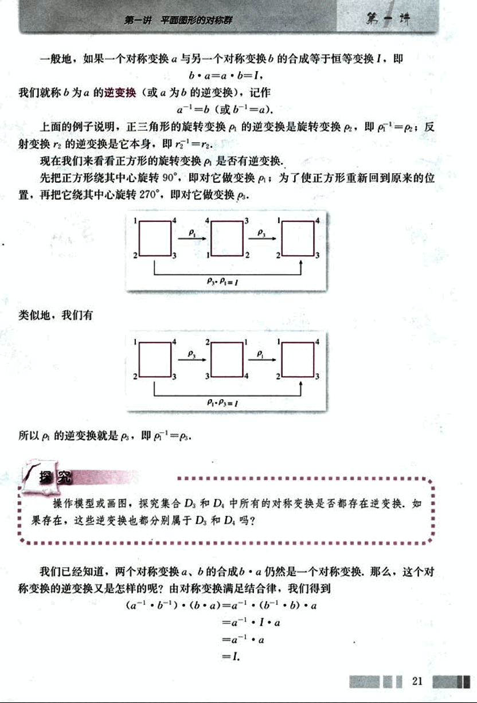
25 

# CHAPTER

普通高中课程标准实验教科书 数学(选修3-4) 对称与群

因此，$b \cdot a$ 的逆变换是对称变换 $a^{-1} \cdot b^{-1}$。这个规则与我们熟悉的一些规则是类似的，例如在穿衣服时，我们总是先穿衬衣后穿外套；而在脱衣服时，我们会遵循正好相反的顺序，先脱外套后脱衬衣。

## 思考题

1. 通过画图或操作模型，尽可能多地找出下列图形的对称变换，

[image1](images/image1.png)

## 三 平面图形的对称群

我们已经找到了正三角形所有的6个对称变换，即

$D_3 = \{I, r_1, r_2, r_3, \rho_1, \rho_2\}$

以及正方形所有的8个对称变换，即

$D_4 = \{I, r_1, r_2, r_3, r_4, \rho_1, \rho_2, \rho_3\}$

这就是说，$D_3$ 和 $D_4$ 分别包含了正三角形和正方形所有的对称变换。

正五边形所有的对称变换组成的集合一般用 $D_5$ 表示，其中共有 2×5=10 个元素，你能找出 $D_5$ 中所有的元素吗？

一般地，把一个平面图形 K 的所有对称变换组成的集合记作 S(K)。例如，对于正三角形、正方形和正五边形，S(K) 分别为 $D_3$，$D_4$ 和 $D_5$。由于平面图形 K 的每一个对称性都可通过它的一个对称变换来描述，所以 S(K) 也就刻画了平面图形 K 的全部对称性。这样，我们就把平面图形 K 的直观对称用精确的数学语言——集合 S(K) 表示出来了。S(K) 就是数学中用来刻画平面图形 K 的对称的数学模型。

22

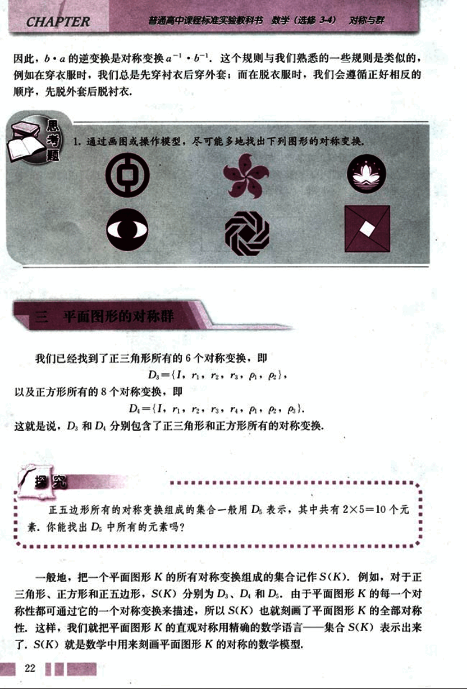
26 

# 第一讲 平面图形的对称群

既然我们用集合S(K)来刻画图形的对称，很自然地，我们希望尽可能多地了解S(K)，那么，S(K)中的元素到底有哪些性质呢？它们之间会有怎样的关系呢？下面我们仍然以正三角形和正方形为例来说明.

研究正三角形所有的对称变换组成的集合$D_3$中元素之间的关系，最基本的是看一看它们两两合成的结果，为了方便，我们可以用一个表来表示这种合成的结果(表1-1).

表1-1

|   | I | ρ | ρ² | r₁ | r₂ | r₃ |
|---|---|---|---|---|---|---|
| I | I | ρ | ρ² | r₁ | r₂ | r₃ |
| ρ | ρ | ρ² | I | r₃ | r₁ | r₂ |
| ρ² | ρ² | I | ρ | r₂ | r₃ | r₁ |
| r₁ | r₁ | r₂ | r₃ | I | ρ² | ρ |
| r₂ | r₂ | r₃ | r₁ | ρ | I | ρ² |
| r₃ | r₃ | r₁ | r₂ | ρ² | ρ | I |


这个表称为$D_3$的乘法表，这是一种常用的、有力的表示对称变换合成结果的工具。表格的第1行和第1列列出了$D_3$的全部6个元素，除了首行和首列外，表格的其他部分由6行和6列组成，表格的第(j+1)列和第(i+1)行交点处的元素是首行第j个元素与首列第i个元素的乘积，因为对称变换的合成一般是不满足交换律的，我们对于合成的次序必须有一个明确的规定，习惯上，按照先做列变换，再做行变换的次序得到这些合成的结果，例如，表格的第5列和第3行交点处的元素是$r_3$，它是由$r_1$和$\rho$合成得到的，即$r_1 \cdot \rho = r_3$.


探究

根据表1-1中元素的特点，回答下面的问题：

(1) 除了首行和首列外，每一行(或每一列)中的元素有什么特点？它们与$D_3$有什么关系？

(2) 第二行和第二列分别与第一行和第一列相等，表明对任意的$m \in D_3$，$I \cdot m = m$且$m \cdot I = m$。你能说明原因吗？

(3) 每一行都有且只有一个恒等变换，表明任意给定一个$m \in D_3$，存在唯一的$m'$，使得$m \cdot m' = I$；每一列都有且只有一个恒等变换，表明任意给定一个$m \in D_3$，存在唯一的$m''$，使得$m'' \cdot m = I$。$m'$与$m''$相等吗？根据表1-1，你能求出$D_3$中所有元素的逆变换吗？

23

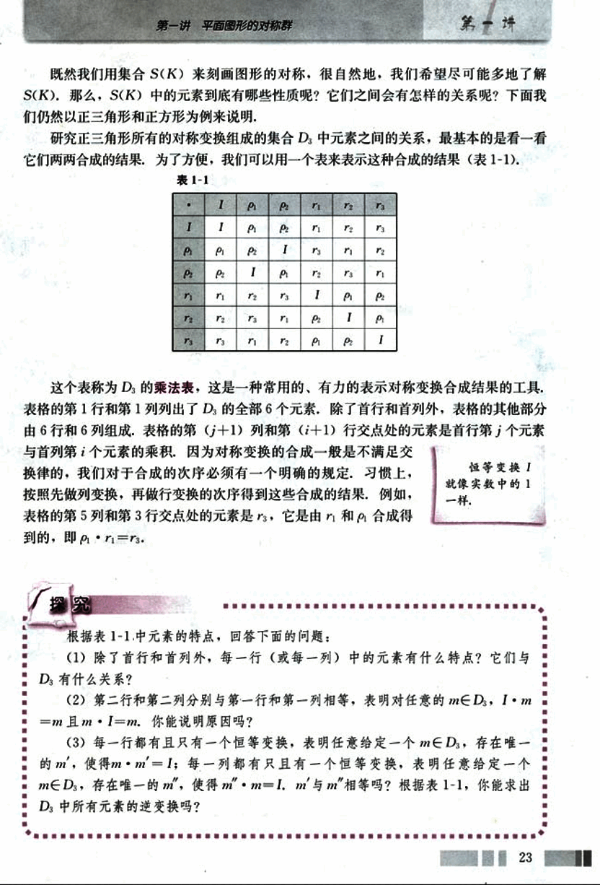
27 

# CHAPTER

普通高中课程标准实验教科书 数学(选修 3-4) 对称与群

乘法表给了我们非常丰富的关于正三角形的对称变换集合 $D_3$ 的信息，实际上，我们在前面学过的 $D_3$ 的许多性质，都可以从这个乘法表中得到。

例如，从表格中可以看到，$D_3$ 中任意两个元素的乘积仍然在 $D_3$ 中，也就是正三角形的任意两个对称变换的合成仍然是 $D_3$ 中的对称变换，我们称 $D_3$ 的这个性质为正三角形的对称变换合成的封闭性。

表格关于主对角线（就是表格所在的长方形从左上到右下的对角线）不对称，说明对称变换的合成不满足交换律。

表格中每一行（列）的元素两两不同，而且都包含了 $D_3$ 的所有元素，这说明，任意取 $D_3$ 中的一个元素 $m$，它与 $D_3$ 中任意两个不同元素分别相乘，所得的积不相等，换句话说，如果存在 $a, b \in D_3$，使得 $m \cdot a = m \cdot b$ 或 $a \cdot m = b \cdot m$，那么一定有 $a = b$。

下面我们来回答上面探究中的问题 (2) 与问题 (3)。

对于 (2)，由于恒等变换 $I$ 使三角形保持不动，所以对于三角形的任意对称变换 $m$，$I \cdot m$、$m \cdot I$ 与 $m$ 对三角形的作用效果是一样的，即有

$I \cdot m = m \cdot I = m$。

问题 (3) 中的 $m'$ 与 $m''$ 是相等的，这是因为

$m' = I \cdot m'$
$= (m'' \cdot m) \cdot m'$
$= m'' \cdot (m \cdot m')$
$= m'' \cdot I$
$= m''$。

所以 $m'(m'')$ 就是 $m$ 的逆变换，这也说明 $D_3$ 中每个元素的逆变换都是唯一的。

正方形的所有对称变换组成的集合 $D_4$ 的乘法表如表 1-2 所示，请同学们通过画图或操作模型将表格填写完整。

表 1-2

| ⋅ | $I$ | $\rho$ | $\rho_2$ | $\rho_3$ | $r_1$ | $r_2$ | $r_3$ | $r_4$ |
|---|---|---|---|---|---|---|---|---|
| $I$ |  |  |  |  |  |  |  |  |
| $\rho$ |  |  |  |  |  |  |  |  |
| $\rho_2$ |  |  |  |  |  |  |  |  |
| $\rho_3$ |  |  |  |  |  |  |  |  |
| $r_1$ |  |  |  |  |  |  |  |  |
| $r_2$ |  |  |  |  |  |  |  |  |
| $r_3$ |  |  |  |  |  |  |  |  |
| $r_4$ |  |  |  |  |  |  |  |  |

24

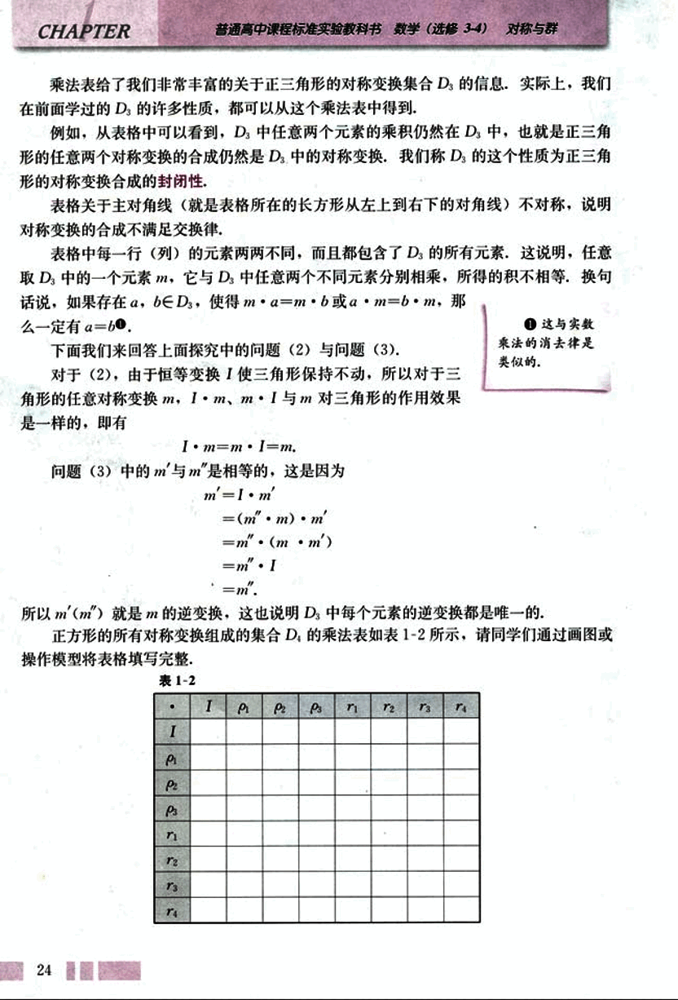
28 

# 第一讲 平面图形的对称群

一般地,对于一个平面图形K的所有对称变换组成的集合S(K),如果把变换之间
的合成看作S(K)上的一种运算,记作⋅,那么这种运算都满足下述4条:

1. S(K)中任意两个变换合成的结果仍然在S(K)中;
2. S(K)中存在恒等变换I;
3. S(K)中任意一个变换的逆变换仍然在S(K)中;
4. S(K)中的变换的合成满足结合律.

如果把这4条性质用数学的语言表达出来,我们
得到:

I. 对任意的 $m_1, m_2 \in S(K)$, $m_1 \cdot m_2 \in S(K)$;

II. S(K)中存在一个变换I,对任意的 $m \in S(K)$,有 $I \cdot m = m \cdot I = m$;

III. 对任意的 $m \in S(K)$,存在变换 $m^{-1} \in S(K)$,使得 $m \cdot m^{-1} = I = m^{-1} \cdot m$;

IV. 对任意的 $m_1, m_2, m_3 \in S(K)$, $m_3 \cdot (m_2 \cdot m_1) = (m_3 \cdot m_2) \cdot m_1$.

这时,我们把S(K)连同它的运算“⋅”称为平面图形K的对称群,记作(S(K),⋅).

因此,(D₃,⋅)是正三角形的对称群,有6个元素;(D₄,⋅)是正方形的对称
群,有8个元素.

一般地,正n边形所有的对称变换和对称变换的合成“⋅”构成它的对称群,称为
二面体群,记作(D<sub>n</sub>,⋅),其中有2n个元素.

## 观察

下面图形的对称群是什么?

[image1](images/image1.png)


25

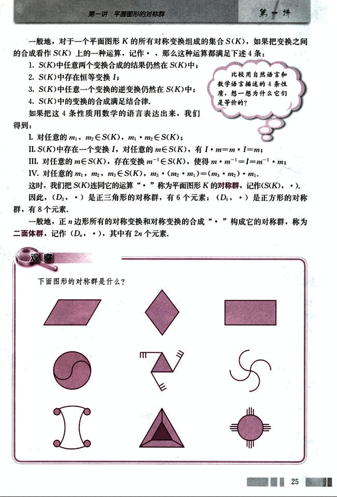
29 

# CHAPTER

普通高中课程标准实验教科书 数学(选修 3-4) 对称与群

对于一个只有有限个对称变换的平面图形 K，人们已经发现其对称群的类型只有下列 4 种：

1. 仅含有恒等变换；
2. 仅含有恒等变换和一个反射变换；
3. 含有 $n(n∈N^*)$ 个旋转变换，而没有反射变换（这样的对称群称为循环群）；
4. 含有 $n(n∈N^*)$ 个旋转变换，同时有 n 个反射变换（这样的对称群称为二面体群）。

## 思考题

1. 继续观察表 1-1，思考下述结论是否成立：
    (1) 表 1-1 的左下角由反射变换组成，表明一个旋转变换与一个反射变换的合成等于一个反射变换；
    (2) 表 1-1 的右下角由旋转变换组成，表明关于两条相交直线的两个反射变换的合成等于一个旋转变换。

26
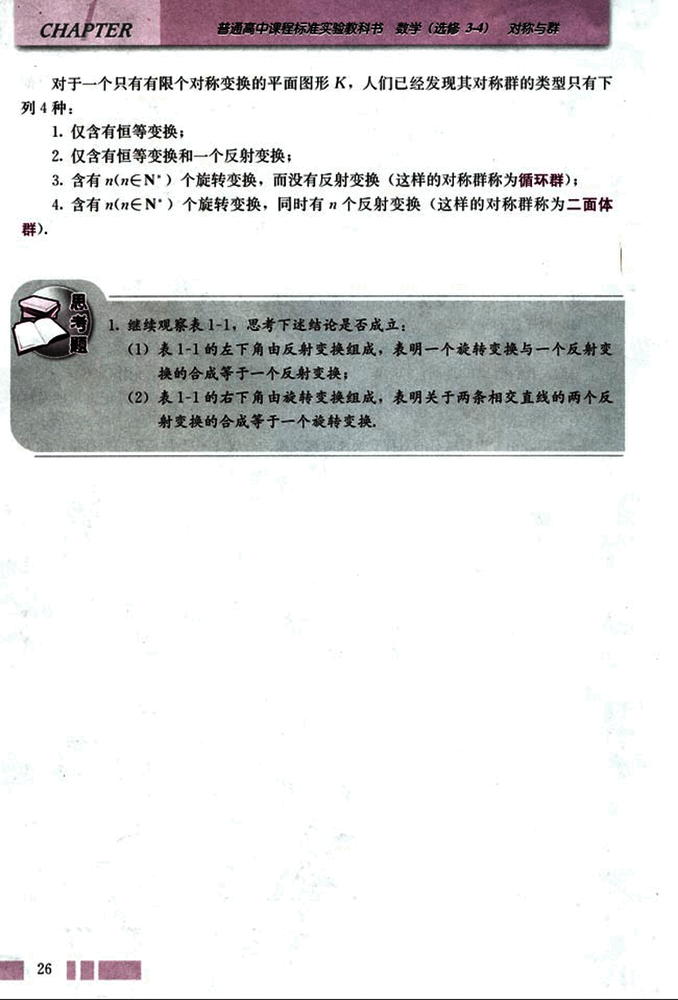
30 

# 第二讲 化教学中的对称与抽象群的概念

在第一讲中，我们学习了平面图形的对称群，并用它来刻画平面图形的对称性，对称群也是刻画其他数学对象的对称性的有力工具。这一讲，我们就将考察代数学中的对称。

## n元对称群 $S_n$

上一讲，我们通过画图或操作模型的方法，研究了正三角形的对称群($D_3$, ·)，以及正方形的对称群($D_4$, ·)。那么，有没有其他方法表示正n边形的对称变换呢？

前面我们曾经讨论过，正n边形的对称变换保持它的对称中心不动，而把它的n个顶点仍然映成顶点，所以，正n边形的对称变换可以用在对称变换的作用下相应顶点的变换来表示。

例如，表2-1列出了正三角形的对称变换、相应图形的变换和相应顶点的变换。

表2-1

| 对称变换 | 图形的变换 | 顶点的变换 |
|---|---|---|
| 恒等变换I |   | $\begin{bmatrix} 1 & 2 & 3 \\ 1 & 2 & 3 \end{bmatrix}$ ① |
| 反射变换$r_1$ |  | $\begin{bmatrix} 1 & 2 & 3 \\ 1 & 3 & 2 \end{bmatrix}$ |
| 反射变换$r_2$ |  | $\begin{bmatrix} 1 & 2 & 3 \\ 3 & 2 & 1 \end{bmatrix}$ |
| 反射变换$r_3$ |  | $\begin{bmatrix} 1 & 2 & 3 \\ 2 & 1 & 3 \end{bmatrix}$ |


① 表示把三角形的顶点1, 2, 3分别对应到顶点1, 2, 3. 即

$\begin{matrix} 1 & 2 & 3 \\ 1 & 2 & 3 \end{matrix}$

这样表示的一对一对应在数学上称为置换(permutation)。与对称变换一样，我们通常用字母a, b, c等来表示置换。

27

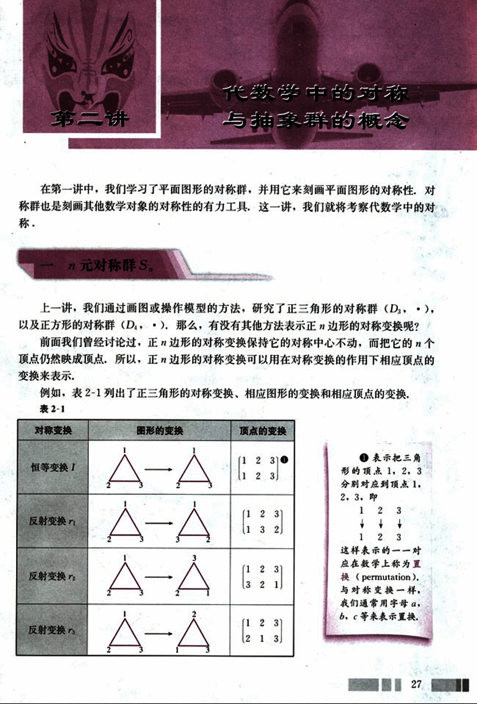
31 

# CHAPTER

普通高中课程标准实验教科书 数学(选修3-4) 对称与群

## 续表

| 对称变换 | 图形的变换 | 顶点的变换 |
|---|---|---|
| 旋转变换 ρ | Δ → Δ | $\begin{pmatrix} 1 & 2 & 3 \\ 2 & 3 & 1 \end{pmatrix}$ |
| 旋转变换 ρ | Δ → Δ | $\begin{pmatrix} 1 & 2 & 3 \\ 3 & 1 & 2 \end{pmatrix}$ |

类似地，正方形的对称变换 $\{I, r_1, r_2, r_3, r_4, p_1, p_2, p_3\}$ 也可以用数字 1, 2, 3, 4 的相应置换来表示：

$\begin{pmatrix} 1 & 2 & 3 & 4 \\ 1 & 2 & 3 & 4 \\ 1 & 2 & 3 & 4 \\ 1 & 2 & 3 & 4 \end{pmatrix}$  $\begin{pmatrix} 1 & 2 & 3 & 4 \\ 3 & 2 & 1 & 4 \\ 1 & 2 & 3 & 4 \\ 1 & 2 & 3 & 4 \end{pmatrix}$  $\begin{pmatrix} 1 & 2 & 3 & 4 \\ 4 & 3 & 2 & 1 \\ 1 & 2 & 3 & 4 \\ 1 & 2 & 3 & 4 \end{pmatrix}$  $\begin{pmatrix} 1 & 2 & 3 & 4 \\ 1 & 4 & 3 & 2 \\ 1 & 2 & 3 & 4 \\ 1 & 2 & 3 & 4 \end{pmatrix}$

置换这种表示不仅仅是一种符号，实际上定义了集合 $\{1, 2, 3, \dots, n\}$ ($n \in N^*$) 到自身的一个一一对应。1, 2, …, n 这 n 个数的每一个置换都确定了集合 $\{1, 2, 3, \dots, n\}$ 到自身的一个一一对应。例如，正三角形的对称变换所对应的置换是集合 $T_3 = \{1, 2, 3\}$ 到其自身的一一对应，它们共有 $2 \times 3 = 6$ 个， 就是表 2-1 中的 6 个置换，这是 $T_3$ 的全部置换。$T_3$ 的全部置换组成的集合记作 $S_3$。

正方形的对称变换所对应的置换是集合 $T_4 = \{1, 2, 3, 4\}$ 到其自身的一一对应，它们有 $2 \times 4 = 8$ 个，但这只是 $T_4$ 的部分置换。容易知道，$T_4$ 共有 $4! = 24$ 个置换。$T_4$ 的全部置换组成的集合记作 $S_4$。

## 例

写出集合 $T_4 = \{1, 2, 3, 4\}$ 的所有置换。

解：我们先用排序的方法写出 $T_4$ 所有排列：

(Images are not included because they are not machine-readable.  To include them, specify the file names and locations as requested in step 9.)

28

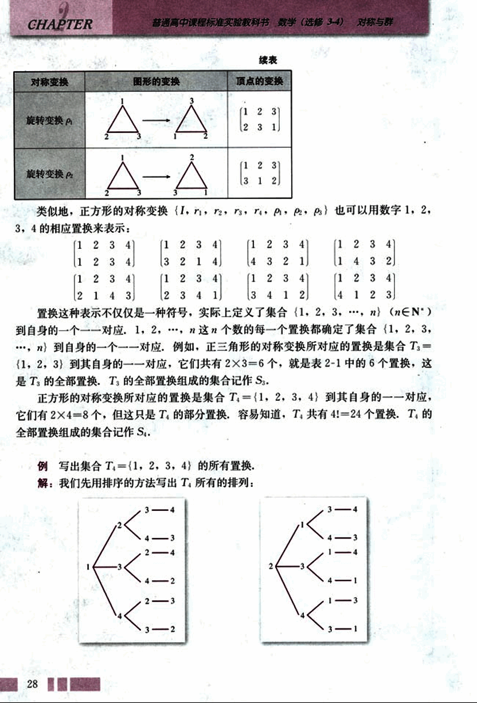
32 

# 第二讲 代数学中的对称与抽象群的概念

## 当置换第一行的顺序固定为1, 2, 3, 4的时候,每一个排列就对应了一个置换,所以这24个置换是:

```
(1 2 3 4)  (1 2 3 4)  (1 2 3 4)  (1 2 3 4)  (1 2 3 4)  (1 2 3 4)
(1 3 2 4)  (1 3 4 2)  (1 4 2 3)  (1 4 3 2)
(1 2 3 4)  (1 2 3 4)  (1 2 3 4)  (1 2 3 4)  (1 2 3 4)  (1 2 3 4)
(2 1 3 4)  (2 1 4 3)  (2 3 1 4)  (2 3 4 1)  (2 4 1 3)  (2 4 3 1)
(3 1 2 4)  (3 1 4 2)  (3 2 1 4)  (3 2 4 1)  (3 4 1 2)  (3 4 2 1)
(1 2 3 4)  (1 2 3 4)  (1 2 3 4)  (1 2 3 4)  (1 2 3 4)  (1 2 3 4)
(4 1 2 3)  (4 1 3 2)  (4 2 1 3)  (4 2 3 1)  (4 3 1 2)  (4 3 2 1)
```

## 我们知道,正五边形的对称变换共有10个,你能用1, 2, 3, 4, 5五个数字的置换表示正五边形的对称变换吗?

## 与对称变换的合成相对应,我们可以定义置换的合成,通常两个置换的合成也是按照从右到左的顺序,先做一个置换,再做另一个置换.

例如,  $\begin{pmatrix} 1 & 2 & 3 & 4 \\ 1 & 4 & 3 & 2 \end{pmatrix}$ 与 $\begin{pmatrix} 1 & 2 & 3 & 4 \\ 2 & 1 & 4 & 3 \end{pmatrix}$ 的合成记作 $\begin{pmatrix} 1 & 2 & 3 & 4 \\ 1 & 4 & 3 & 2 \end{pmatrix} \cdot \begin{pmatrix} 1 & 2 & 3 & 4 \\ 2 & 1 & 4 & 3 \end{pmatrix}$, 由$\begin{pmatrix} 1 & 2 & 3 & 4 \\ 1 & 4 & 3 & 2 \end{pmatrix}$ 表示的对应是

```
1 2 3 4
↓ ↓ ↓ ↓
1 4 3 2
```

29

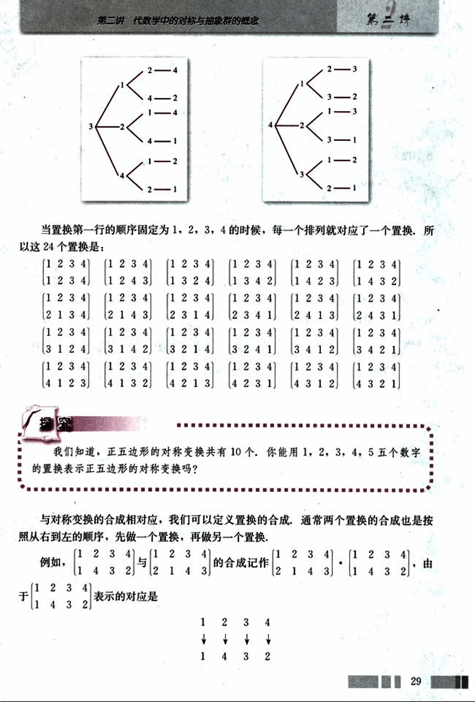
33 

# CHAPTER

普通高中课程标准实验教科书 数学(选修 3-4) 对称与群

$\begin{bmatrix} 1 & 2 & 3 & 4 \\ 2 & 1 & 4 & 3 \end{bmatrix}$ 表示的对应是

$\begin{array}{cccc}
1 & 2 & 3 & 4 \\
\downarrow & \downarrow & \downarrow & \downarrow \\
2 & 1 & 4 & 3
\end{array}$

我们规定，$\begin{bmatrix} 1 & 2 & 3 & 4 \\ 2 & 1 & 4 & 3 \end{bmatrix} \cdot \begin{bmatrix} 1 & 2 & 3 & 4 \\ 1 & 4 & 3 & 2 \end{bmatrix}$ 表示的对应是

$\begin{array}{cccc}
1 & 2 & 3 & 4 \\
\downarrow & \downarrow & \downarrow & \downarrow \\
1 & 4 & 3 & 2
\end{array}$

$\begin{array}{cccc}
1 & 2 & 3 & 4 \\
\downarrow & \downarrow & \downarrow & \downarrow \\
2 & 3 & 4 & 1
\end{array}$

所以，$\begin{bmatrix} 1 & 2 & 3 & 4 \\ 2 & 1 & 4 & 3 \end{bmatrix} \cdot \begin{bmatrix} 1 & 2 & 3 & 4 \\ 1 & 4 & 3 & 2 \end{bmatrix} = \begin{bmatrix} 1 & 2 & 3 & 4 \\ 2 & 3 & 4 & 1 \end{bmatrix}$。

可见，两个置换的合成也是一个置换，而且等于两个相应对称变换的合成所对应的置换（请同学们自己举例验证）。

像 $\begin{bmatrix} 1 & 2 & 3 \end{bmatrix} \cdot \begin{bmatrix} 1 & 2 & 3 & 4 \\ 1 & 2 & 3 & 4 \end{bmatrix}$ 这样，把各数字都对应到它本身的置换称为恒等置换。

若两个置换 $a$，$b$ 的合成等于恒等置换，即有 $a \cdot b = b \cdot a = I$，

那么我们称 $a$，$b$ 互为逆置换。

## 思考

每个置换都有逆置换吗？为什么？

## 例

求下列两个置换的合成：

(1) $\begin{bmatrix} 1 & 2 & 3 \\ 1 & 3 & 2 \end{bmatrix} \cdot \begin{bmatrix} 1 & 2 & 3 \\ 2 & 1 & 3 \end{bmatrix}$；      (2) $\begin{bmatrix} 1 & 2 & 3 \\ 2 & 1 & 3 \end{bmatrix} \cdot \begin{bmatrix} 1 & 2 & 3 \\ 1 & 3 & 2 \end{bmatrix}$。

解：(1) $\begin{bmatrix} 1 & 2 & 3 \\ 1 & 3 & 2 \end{bmatrix} \cdot \begin{bmatrix} 1 & 2 & 3 \\ 2 & 1 & 3 \end{bmatrix} = \begin{bmatrix} 1 & 2 & 3 \\ 3 & 1 & 2 \end{bmatrix}$；

(2) $\begin{bmatrix} 1 & 2 & 3 \\ 2 & 1 & 3 \end{bmatrix} \cdot \begin{bmatrix} 1 & 2 & 3 \\ 1 & 3 & 2 \end{bmatrix} = \begin{bmatrix} 1 & 2 & 3 \\ 1 & 2 & 3 \end{bmatrix}$。

30

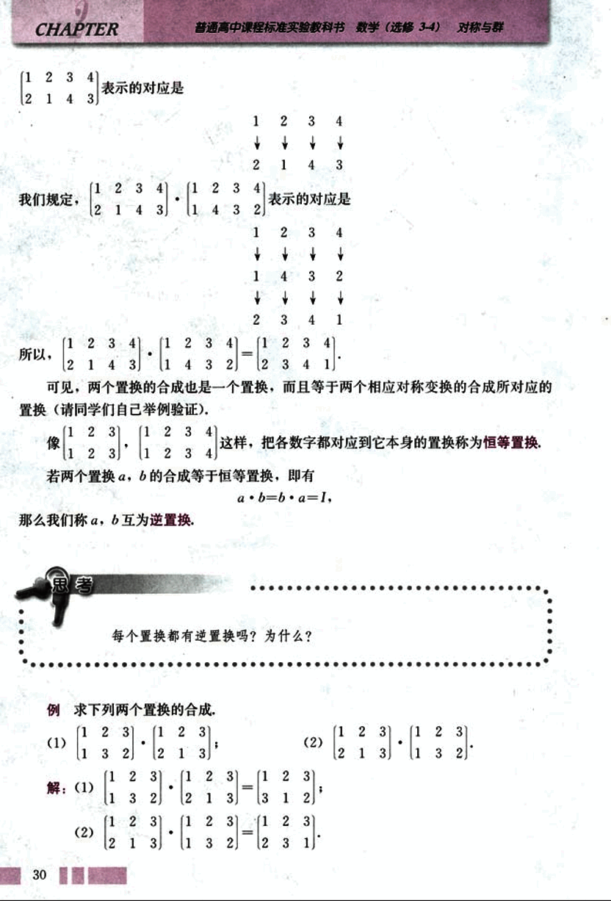
34 

# 第二讲 代数学中的对称与抽象群的概念

## 第二讲

由本例题可以知道，置换的合成不满足交换律。

有了上面的准备，我们就能用置换来表示二面体群($D_n$, ·)了。

以正三角形为例，把表2-1中的6个置换组成的集合仍然记作$D_3$，把置换之间的合成“·”看作$D_3$上的一种运算，那么通过计算可以得到下述$D_3$的乘法表（表2-2）。

表2-2

|  | $\begin{pmatrix} 1 & 2 & 3 \\ 1 & 2 & 3 \end{pmatrix}$ | $\begin{pmatrix} 1 & 2 & 3 \\ 2 & 3 & 1 \end{pmatrix}$ | $\begin{pmatrix} 1 & 2 & 3 \\ 3 & 1 & 2 \end{pmatrix}$ | $\begin{pmatrix} 1 & 2 & 3 \\ 1 & 3 & 2 \end{pmatrix}$ | $\begin{pmatrix} 1 & 2 & 3 \\ 2 & 1 & 3 \end{pmatrix}$ | $\begin{pmatrix} 1 & 2 & 3 \\ 3 & 2 & 1 \end{pmatrix}$ |
|---|---|---|---|---|---|---|
| $\begin{pmatrix} 1 & 2 & 3 \\ 1 & 2 & 3 \end{pmatrix}$ | $\begin{pmatrix} 1 & 2 & 3 \\ 1 & 2 & 3 \end{pmatrix}$ | $\begin{pmatrix} 1 & 2 & 3 \\ 2 & 3 & 1 \end{pmatrix}$ | $\begin{pmatrix} 1 & 2 & 3 \\ 3 & 1 & 2 \end{pmatrix}$ | $\begin{pmatrix} 1 & 2 & 3 \\ 1 & 3 & 2 \end{pmatrix}$ | $\begin{pmatrix} 1 & 2 & 3 \\ 2 & 1 & 3 \end{pmatrix}$ | $\begin{pmatrix} 1 & 2 & 3 \\ 3 & 2 & 1 \end{pmatrix}$ |
| $\begin{pmatrix} 1 & 2 & 3 \\ 2 & 3 & 1 \end{pmatrix}$ | $\begin{pmatrix} 1 & 2 & 3 \\ 2 & 3 & 1 \end{pmatrix}$ | $\begin{pmatrix} 1 & 2 & 3 \\ 3 & 1 & 2 \end{pmatrix}$ | $\begin{pmatrix} 1 & 2 & 3 \\ 1 & 2 & 3 \end{pmatrix}$ | $\begin{pmatrix} 1 & 2 & 3 \\ 2 & 1 & 3 \end{pmatrix}$ | $\begin{pmatrix} 1 & 2 & 3 \\ 3 & 2 & 1 \end{pmatrix}$ | $\begin{pmatrix} 1 & 2 & 3 \\ 1 & 3 & 2 \end{pmatrix}$ |
| $\begin{pmatrix} 1 & 2 & 3 \\ 3 & 1 & 2 \end{pmatrix}$ | $\begin{pmatrix} 1 & 2 & 3 \\ 3 & 1 & 2 \end{pmatrix}$ | $\begin{pmatrix} 1 & 2 & 3 \\ 1 & 2 & 3 \end{pmatrix}$ | $\begin{pmatrix} 1 & 2 & 3 \\ 2 & 3 & 1 \end{pmatrix}$ | $\begin{pmatrix} 1 & 2 & 3 \\ 3 & 2 & 1 \end{pmatrix}$ | $\begin{pmatrix} 1 & 2 & 3 \\ 1 & 3 & 2 \end{pmatrix}$ | $\begin{pmatrix} 1 & 2 & 3 \\ 2 & 1 & 3 \end{pmatrix}$ |
| $\begin{pmatrix} 1 & 2 & 3 \\ 1 & 3 & 2 \end{pmatrix}$ | $\begin{pmatrix} 1 & 2 & 3 \\ 1 & 3 & 2 \end{pmatrix}$ | $\begin{pmatrix} 1 & 2 & 3 \\ 2 & 1 & 3 \end{pmatrix}$ | $\begin{pmatrix} 1 & 2 & 3 \\ 3 & 2 & 1 \end{pmatrix}$ | $\begin{pmatrix} 1 & 2 & 3 \\ 1 & 2 & 3 \end{pmatrix}$ | $\begin{pmatrix} 1 & 2 & 3 \\ 3 & 1 & 2 \end{pmatrix}$ | $\begin{pmatrix} 1 & 2 & 3 \\ 2 & 3 & 1 \end{pmatrix}$ |
| $\begin{pmatrix} 1 & 2 & 3 \\ 2 & 1 & 3 \end{pmatrix}$ | $\begin{pmatrix} 1 & 2 & 3 \\ 2 & 1 & 3 \end{pmatrix}$ | $\begin{pmatrix} 1 & 2 & 3 \\ 3 & 2 & 1 \end{pmatrix}$ | $\begin{pmatrix} 1 & 2 & 3 \\ 1 & 3 & 2 \end{pmatrix}$ | $\begin{pmatrix} 1 & 2 & 3 \\ 2 & 3 & 1 \end{pmatrix}$ | $\begin{pmatrix} 1 & 2 & 3 \\ 3 & 1 & 2 \end{pmatrix}$ | $\begin{pmatrix} 1 & 2 & 3 \\ 1 & 2 & 3 \end{pmatrix}$ |
| $\begin{pmatrix} 1 & 2 & 3 \\ 3 & 2 & 1 \end{pmatrix}$ | $\begin{pmatrix} 1 & 2 & 3 \\ 3 & 2 & 1 \end{pmatrix}$ | $\begin{pmatrix} 1 & 2 & 3 \\ 1 & 3 & 2 \end{pmatrix}$ | $\begin{pmatrix} 1 & 2 & 3 \\ 2 & 1 & 3 \end{pmatrix}$ | $\begin{pmatrix} 1 & 2 & 3 \\ 3 & 1 & 2 \end{pmatrix}$ | $\begin{pmatrix} 1 & 2 & 3 \\ 2 & 3 & 1 \end{pmatrix}$ | $\begin{pmatrix} 1 & 2 & 3 \\ 1 & 2 & 3 \end{pmatrix}$ |


想一想，上表能够由表1-1直接得到吗？

由表2-2容易验证下述4条是成立的：

I. 对任意的$m_1, m_2 \in D_3$，$m_1 \cdot m_2 \in D_3$；

II. $D_3$中存在恒等置换$I$，满足对任意的$m \in D_3$，$I \cdot m = m \cdot I = m$；

III. 对任意的$m \in D_3$，存在置换$m' \in D_3$，使得$m \cdot m' = I = m' \cdot m$；

IV. 对任意的$m_1, m_2, m_3 \in D_3$，$m_3 \cdot (m_2 \cdot m_1) = (m_3 \cdot m_2) \cdot m_1$。

我们把置换集合$D_3$连同它上面的运算“·”也称为对称群($D_3$, ·)，这是正三角形的对称群的另外一种表示方式。

类似地，可以用置换表示正方形，正五边形，正六边形……正$n$边形的对称群，从而得到二面体群($D_n$, ·)($n \ge 3$)的另外一种表示方式。

一般地，$T = \{1, 2, \dots, n\}$共有$n!$个置换，它们组成的集合记作$S_n$。如果把置换之间的合成“·”看作$T_n$上的一种运算，可以证明，下述4条是成立的：

I. $S_n$中任意两个置换合成的结果仍然在$S_n$中；

II. $S_n$中存在恒等置换；

III. $S_n$中任意一个置换的逆置换仍然在$S_n$中；

31

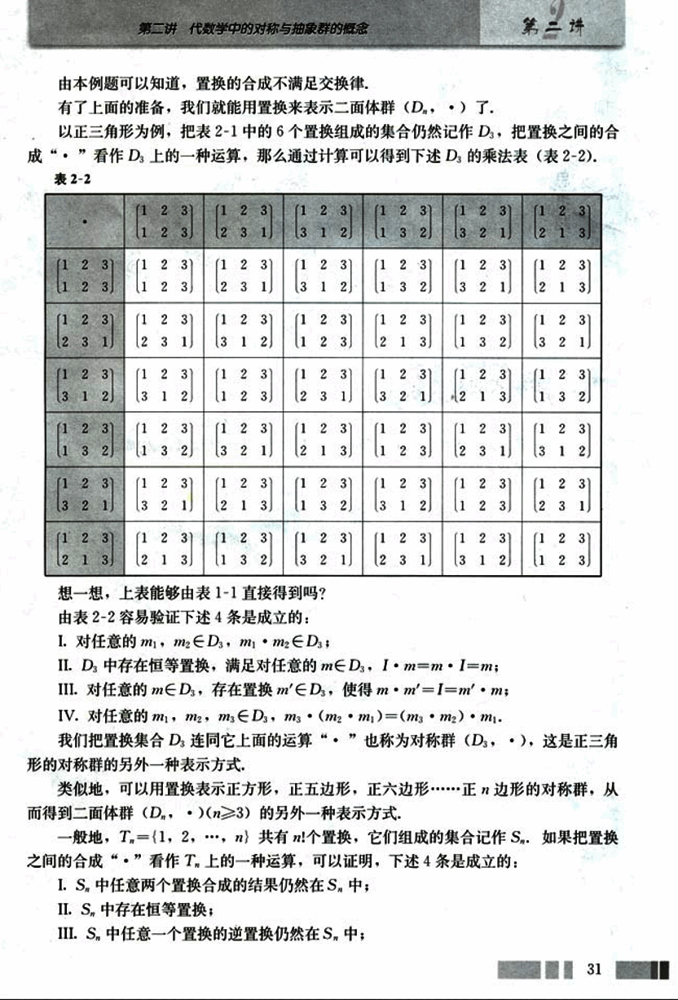
35 

# CHAPTER

普通高中课程标准实验教科书 数学(选修3-4) 对称与群

IV. S. 中置换的合成满足结合律。

因此,{S, ·}是T的对称群,称为n元对称群.

## 思考题

1. 利用置换给出正五边形的对称群(D₅, ·).
2. (S₃, ·)与用置换给出的(D₅, ·)有什么关系?

## 二 多项式的对称变换

在初中,我们学过各种各样的多项式,几个数与字母的积的和就构成了多项式,例如下面的代数式都是多项式:

x+y, x²+3xy+y², xyz, xy², x+y²+z².

类似于平面图形的对称性,多项式也有对称性。

例如,在多项式x+y中,用字母x代替字母y,同时用字母y代替字母x,我们得到一个新的多项式

y+x.

虽然这个多项式与原来的多项式形式不同,但根据数的加法交换律,我们有

x+y=y+x.

类似地,调换多项式x²+3xy+y²中的字母x, y, 可以得到一个新的多项式

y²+3yx+x².

显然, x²+3xy+y²=y²+3yx+x².

## 思考

对于多项式xyz, 怎样替换字母x, y, z, 才能得到与原来的多项式相等的多项式?

类比数字1, 2, 3的置换或正三角形的对称变换,我们可以这样来替换上述多项式中的字母x, y, z:

32

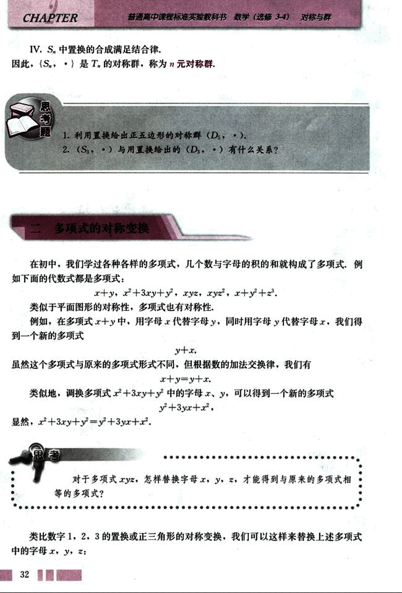
36 

# 第二讲 代数学中的对称与抽象群的概念

## 第二讲

(1) x, y, z保持不变，此时 $xyz \to xyz$；

(2) 用x代替y，y代替x，z代替z，此时 $xyz \to yxz$；

(3) 用x代替z，z代替x，y代替y，此时 $xyz \to zyx$；

(4) 用y代替z，z代替y，x代替x，此时 $xyz \to xzy$；

(5) 用x代替y，y代替z，z代替x，此时 $xyz \to xyz$；

(6) 用x代替z，z代替y，y代替x，此时 $xyz \to yzx$。

这样，我们就得到了6个相等的多项式，即

$xyz$  $yxz$  $zyx$  $xzy$  $zxy$  $yzx$

<br>

实际上，这里的字母与字母的替换，就是集合{x,y,z}到其自身的一一对应。

<br>

## 思考

还有其他的替换方式，使得到的多项式与多项式xyz相等吗？从上面的方框中任选一个多项式，用同样的方法替换它的字母，你能得到什么结果？

<br>

对于多项式$xyz$，用x代替y，用y代替x，用z代替z，得到$yxz = xyz$。而任何涉及到字母的替换都会使原来的多项式改变，如用x代替z，用z代替x，用y代替y，得到$zyx^2$，$zyx^2 \ne xyz$。所以用字母替换的办法，我们得到两个相等的多项式

$xyz$  $yxz^2$

<br>

最后，在多项式$x + y^2 + z^3$中，任何字母的替换都会使原多项式改变，因而我们得到唯一的一个多项式

$x + y^2 + z^3$

<br>

与正多边形的对称变换定义类似，我们可以利用对多项式的这种字母替换来定义多项式的对称变换。

<br>

如果一个多项式F经过字母的替换仍与原来的多项式相等，我们就称多项式F具有对称性，上述对多项式中字母的替换可以叫做多项式的对称变换。

保持字母不动的对称变换就是多项式的恒等变换。

<br>

由上面的例子可以看到，有些多项式（如$x+y$，$x^2+3xy+y^2$）在字母的任意替换下保持不变（我们认为这样的多项式的对称性很好）；有些多项式（如$xyz^2$）在字母的某些替换下保持不变；而有些多项式（如$x+y+z$）仅在字母不动时才保持不变。

<br>

对于较复杂的多项式（如$xyz+xyw+xzw+yzw$），用替换字母、比较替换后的多项式与原来的多项式是否相等的方法研究它的对称性是比较困难的，有没有更简便的方法呢？

33

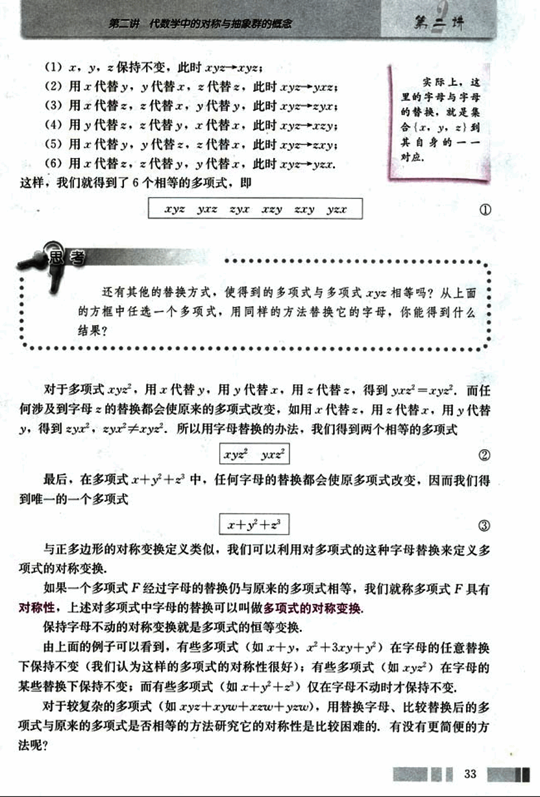
37 

# CHAPTER 9

普通高中课程标准实验教科书 数学(选修 3-4) 对称与群

我们看到，用数字的置换来表示平面图形的对称变换是一种很好的方法，能否也用置换来表示多项式的对称变换呢？

为了研究的方便，我们用同一个字母，不同的脚标来区分多项式中的不同字母，例如，我们可以把 $x+y$，$xyz$ 分别表示成

$x_1+x_2$，$x_1x_2x_3$。

这样，在多项式 $x_1+x_2$ 中调换 $x_1$ 与 $x_2$ 的位置，可以看做是调换脚标 1，2 的位置，得到 $x_2+x_1$。

$x_1+x_2$ 的对称变换有两个，用图示表示为：

```
x₁ x₂       x₁ x₂
↓↓       ↓↓
x₁ x₂       x₂ x₁
```

结合集合 $T_2=\{1,2\}$ 的置换，可以发现，这两个对称变换对 $x$ 的脚标的作用恰好是集合 $T_2=\{1,2\}$ 的两个置换，即 $S_2$ 中的两个元素：

$\sigma_1 = \begin{pmatrix} 1 & 2 \\ 1 & 2 \end{pmatrix}$，$\sigma_2 = \begin{pmatrix} 1 & 2 \\ 2 & 1 \end{pmatrix}$。

反过来看，对 $x_1+x_2$ 的脚标分别施行置换 $\sigma_1$，$\sigma_2$，可以得到与原多项式相等的两个多项式

$x_1+x_2$，$x_2+x_1$。

我们把置换 $\sigma_1$，$\sigma_2$ 称为多项式 $x_1+x_2$ 的对称变换。

类似地，由方框①知，多项式 $x_1x_2x_3$ 通过字母替换，可得到下列 6 个相等的多项式

$x_1x_2x_3 \quad x_2x_1x_3 \quad x_3x_2x_1 \quad x_1x_3x_2 \quad x_3x_1x_2 \quad x_2x_3x_1$

另一方面，$x_1x_2x_3$ 的脚标组成的集合为 $T_3=\{1,2,3\}$，其全部置换为 $S_3$ 中的 6 个元素：

$\sigma_1 = \begin{pmatrix} 1 & 2 & 3 \\ 1 & 2 & 3 \end{pmatrix}$，$\sigma_2 = \begin{pmatrix} 1 & 2 & 3 \\ 2 & 1 & 3 \end{pmatrix}$，$\sigma_3 = \begin{pmatrix} 1 & 2 & 3 \\ 3 & 2 & 1 \end{pmatrix}$，

$\sigma_4 = \begin{pmatrix} 1 & 2 & 3 \\ 1 & 3 & 2 \end{pmatrix}$，$\sigma_5 = \begin{pmatrix} 1 & 2 & 3 \\ 3 & 1 & 2 \end{pmatrix}$，$\sigma_6 = \begin{pmatrix} 1 & 2 & 3 \\ 2 & 3 & 1 \end{pmatrix}$。

对 $x_1x_2x_3$ 的脚标分别施行这 6 个置换，恰好得到上面方框中的 6 个多项式。

同样地，我们称置换 $\sigma_1，\sigma_2，\sigma_3，\sigma_4，\sigma_5，\sigma_6$ 为多项式 $x_1x_2x_3$ 的对称变换。

一般地，设一个多项式的脚标组成的集合为 $\{1,2,\dots,n\}$，$\sigma$ 是 n 元对称群 $S_n$ 中的一个置换，若对多项式中字母的脚标施行置换 $\sigma$ 后，得到的多项式仍与原来的多项式相等，我们就称置换 $\sigma$ 为这个多项式的对称变换。

按照这个定义，$S_2$ 中的任意置换都是多项式 $x_1+x_2$ 的对称变换；$S_3$ 中的任意置换都是多项式 $x_1x_2x_3$ 的对称变换。方框②说明多项式 $x_1x_2x_3$ 的对称变换只有恒等置换。

34

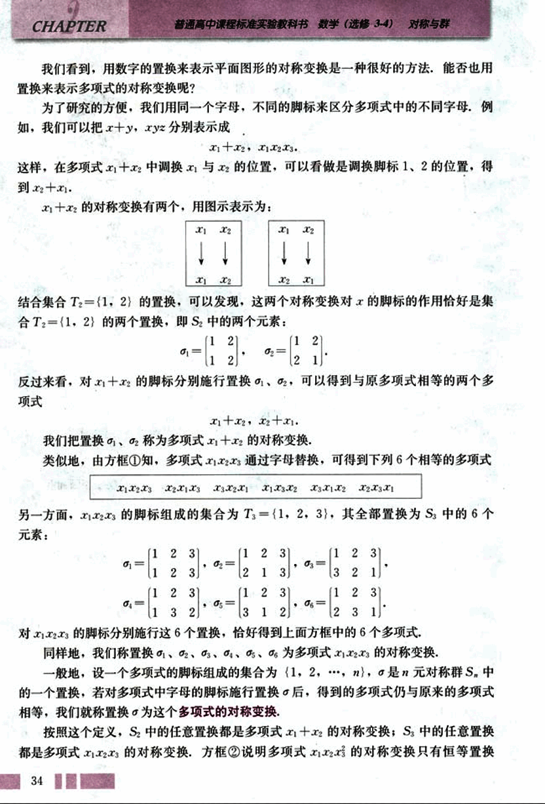
38 

# 第二讲 代数学中的对称与抽象群的概念

## 方框③说明多项式 $x_1, x_2$ 的对称变换只有恒等置换

$\begin{pmatrix} 1 & 2 & 3 \\ 1 & 2 & 3 \end{pmatrix}$ 和置换 $\begin{pmatrix} 1 & 2 & 3 \\ 2 & 1 & 3 \end{pmatrix}$

如果一个 $n$ 次多项式的对称变换是 $S_n$ 中的全部变换，这样的多项式就称为对称多项式。

我们来看两个例子，设 $x_1, x_2$ 是给定的一元二次方程

$x^2 - c_1x + c_2 = 0$

的两个根，那么它们与系数有下列关系

$\begin{cases}
c_1 = x_1 + x_2 \\
c_2 = x_1 \cdot x_2
\end{cases}$

显然，$S_2$ 中的任意置换也都是 $x_1, x_2$ 的对称变换，因此这里的 $x_1 + x_2, x_1 \cdot x_2$ 是对称多项式。

类似地，设 $x_1, x_2, x_3$ 是一元三次方程 $x^3 - c_1x^2 + c_2x - c_3 = 0$ 的根，那么有下列关系

$\begin{cases}
c_1 = x_1 + x_2 + x_3 \\
c_2 = x_1x_2 + x_1x_3 + x_2x_3 \\
c_3 = x_1x_2x_3
\end{cases}$

请同学们自己验证，$S_3$ 中的任意置换都是 $x_1 + x_2 + x_3, x_1x_2 + x_1x_3 + x_2x_3$ 和 $x_1x_2x_3$ 的对称变换，因此这几个多项式也都是对称多项式。

有兴趣的同学，可以类比平面图形的对称群的定义，试着自己给出多项式的对称群的定义。

## 思考题

1. 置换 $\begin{pmatrix} 1 & 2 \\ 2 & 1 \end{pmatrix}$ 是多项式 $(x_1 - x_2)$ 的对称变换吗？

2. $S_3$ 中的哪些置换是多项式 $x_1^2 + x_2^2 + x_3^2 + 5x_1x_3 - x_3$ 的对称变换？

3. $S_3$ 中的哪些置换是多项式 $-2x_1x_2 - 2x_1x_3 - 2x_2x_3 - 2x_1x_2x_3 - 2x_1x_3 - 2x_1 + 8$ 的对称变换？

4. 验证 $S_3$ 中的置换都是多项式 $x_1x_2 + x_1x_3 + x_2x_3 + x_1x_2x_3$ 的对称变换。

5. 设 $x_1, x_2, x_3, x_4$ 是 4 次方程 $x^4 - c_1x^3 + c_2x^2 - c_3x + c_4 = 0$ 的根，那么有下列关系

$\begin{cases}
c_1 = x_1 + x_2 + x_3 + x_4 \\
c_2 = x_1x_2 + x_1x_3 + x_1x_4 + x_2x_3 + x_2x_4 + x_3x_4 \\
c_3 = x_1x_2x_3 + x_1x_2x_4 + x_1x_3x_4 + x_2x_3x_4 \\
c_4 = x_1x_2x_3x_4
\end{cases}$

请同学们自己验证上述 3 个多项式都是对称多项式。

35

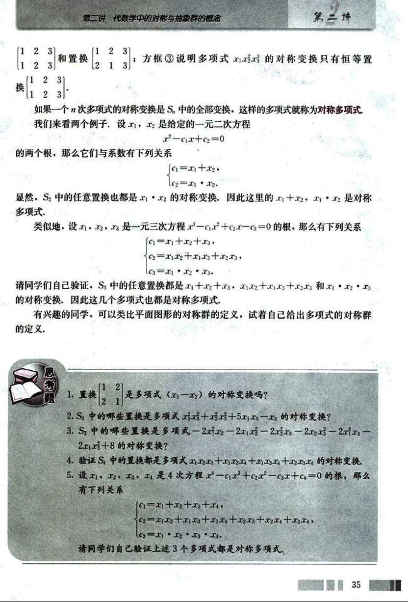
39 

# 三 抽象群的概念

## 1. 群的一般概念

在前文中，我们已经定义了正 *n* 边形的对称群 ($D_n$, ·) 和 *n* 元对称群 ($S_n$, ·)。虽然它们有着背景完全不同的集合，并且它们的运算的含义也不同，但它们却有如下共同特点：

(1) 有一个非空集合；
(2) 在这个集合上定义了一个运算；
(3) 运算满足性质Ⅰ～Ⅳ。

这样的结构在数学、物理学、化学和生命科学中大量存在，数学家把它们概括成一个抽象的概念——群，前面学习的对称群就是群的一个具体例子。

为了介绍群的一般概念，我们先来定义集合上的运算。

设 G 是一个非空集合，G 上的一个二元运算是指一个映射 “·”，它把 G 中的任意一个有序对 (a, b) 都对应到 G 中的一个元素，我们把这个元素记作 a·b。例如：

$D_n$ 中对称变换的合成是 $D_n$ 上的二元运算；
$S_n$ 中置换的合成是 $S_n$ 上的二元运算；
整数的加法 (+) 、减法 (-) 和乘法 (×) 都
是整数集 Z 上的二元运算，这是因为两个整数的和、差与积都仍然是整数。

**定义** 设非空集合 G 满足下述 4 个条件：

I. G 上有一个二元运算 “·”，即对任意的 a, b ∈G，有 a·b ∈G；

II. G 中有单位元 I，对任意的 a ∈G，I·a = a = a·I；

III. G 中的每个元素都有逆元，即对任意的 a ∈G，存在 a' ∈G，使得 a·a' = I = a'·a；

IV. G 的乘法满足结合律，即对任意的 a, b, c ∈G，(a·b)·c = a·(b·c)；

则 (G, ·) 称为一个群 (group)。

换句话说，群就是一个非空集合，这个集合有一个满足结合律的二元运算，集合中有一个单位元，集合中每一个元素都有一个逆元。

群的例子是大量存在的，例如，正有理数集 Q 连同正有理数的乘法构成一个群，记作 (Q, ·)，下面的表格说明了 Q 满足群的 4 个条件。

36

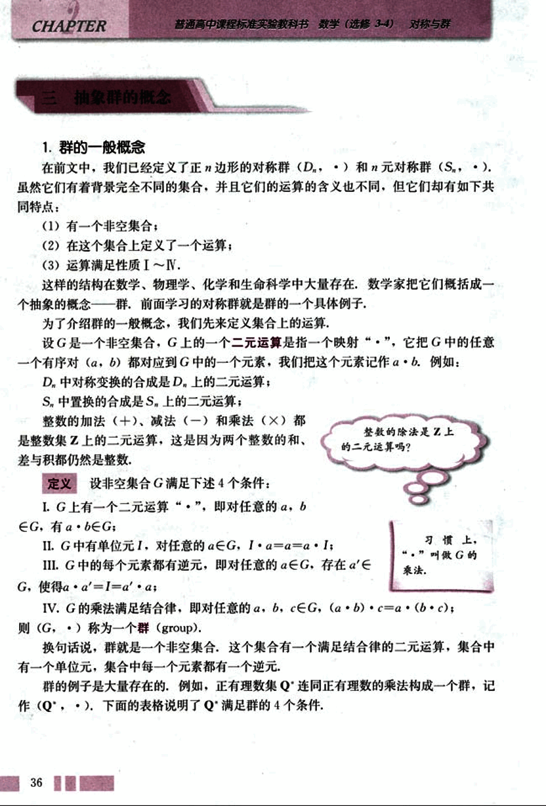
40 

# 第二讲 代数学中的对称与抽象群的概念

## 二元运算

对任意的 $a, b \in Q$，$a \cdot b \in Q$

## 单位元

$1 \in Q$

## 逆元

对任意的 $a \in Q$，存在 $a$ 的逆元 $\frac{1}{a} \in Q$

## 结合律

对任意的 $a, b, c \in Q$，$(a \cdot b) \cdot c = a \cdot (b \cdot c)$

又如整数集 Z 连同整数的加法构成一个群，记作 $(Z, +)$，下面的表格说明 Z 满足群的 4 个条件。

## 二元运算

对任意的 $a, b \in Z$，$a + b \in Z$

## 单位元

$0 \in Z$

## 逆元

对任意的 $a \in Z$，存在 $a$ 的逆元 $-a \in Z$

## 结合律

对任意的 $a, b, c \in Z$，$(a + b) + c = a + (b + c)$

这些例子告诉我们，群的定义中的乘法的含义很广，它可以是平面图形的对称变换的合成，置换的合成，也可以是数的乘法或加法。

下面，我们来看一个有限群（元素个数是有限的）的例子，我们知道，所有整数除以 3 得到的余数只有 3 个，即 0，1 和 2。记

$Z_3 = \{0, 1, 2\}$ ①

在集合 $Z_3$ 上定义一个运算，用 $\oplus$ 表示，即对任意的 $a, b \in Z_3$，使

$a \oplus b = (a + b)$ 除以 3 得到的余数.

按照这个运算，我们可以得到 $Z_3$ 的乘法表（习惯上也叫加法表）：

| $\oplus$ | 0 | 1 | 2 |
|---|---|---|---|
| 0 | 0 | 1 | 2 |
| 1 | 1 | 2 | 0 |
| 2 | 2 | 0 | 1 |

① 这里的 0, 1, 2 是借用来的新符号，它们的含义与整数 0, 1, 2 是完全不同的.


例 验证 $Z_3$ 和运算 $\oplus$ 构成一个群。

分析：只要验证 $Z_3$ 连同运算 $\oplus$ 满足群的 4 个条件 I～IV 即可。

解：I. 由 $Z_3$ 的加法表可知，$Z_3$ 中任意两个元素的和仍然在 $Z_3$ 中；

II. 因为

$0 \oplus 1 = 1$，$1 \oplus 0 = 1$，$0 \oplus 2 = 2$，$2 \oplus 0 = 2$，

所以 0 是 $Z_3$ 的单位元；

III. 由 $1 \oplus 2 = 2 \oplus 1 = 0$，$0 \oplus 0 = 0$，知 1 的逆元是 2，2 的逆元是 1，0 的逆元是 0；

IV. 容易验证，对任意的 $a, b, c \in Z_3$，$(a \oplus b) \oplus c = a \oplus (b \oplus c)$，即运算 $\oplus$ 满足结合律（请同学们自己验证）。

综上所述，$Z_3$ 和运算 $\oplus$ 构成一个群 $(Z_3, \oplus)$。

37

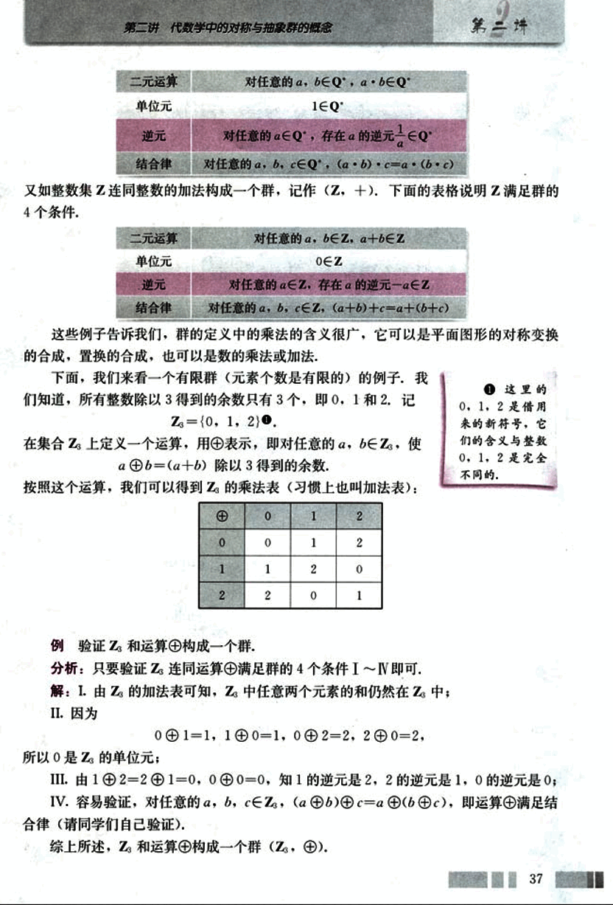
41 

# CHAPTER

普通高中课程标准实验教科书 数学(选修3-4) 对称与群

## 例题

用 $Z_4$ 表示所有的整数除以 4 得到的余数，即

$Z_4 = \{0, 1, 2, 3\}$。

在这个集合上定义一个运算 $\oplus$，即对任意的 $a, b \in Z_4$，使

$a \oplus b = (a + b)$ 除以 4 得到的余数。

完成下列 $Z_4$ 的运算表：

| $\oplus$ | 0 | 1 | 2 | 3 |
|---|---|---|---|---|
| 0 |  |  |  |  |
| 1 |  |  |  |  |
| 2 |  |  |  |  |
| 3 |  |  |  |  |

并说明 $(Z_4, \oplus)$ 也是一个群。

用类似的方法我们可以定义 $(Z_n, \oplus) (n \in N, 且 n \ge 2)$。

## 直积

从两个或多个已知群出发，可以构造新的群。设 $\{G_1, *\}$ 和 $\{G_2, \cdot\}$ 是两个群，有各自的乘法 $*$ 和 $\cdot$，和单位元 $e, I$。分别从集合 $G_1$ 和 $G_2$ 中任取一个元素，组成所有可能的有序对

$(a_1, B_1), (a_2, B_2), \dots, (a_n, B_n), \dots$

把所有这样的有序对组成的集合记作 $G_1 \times G_2$。在 $G_1 \times G_2$ 上定义一个运算 $\otimes$：对于 $G_1 \times G_2$ 中任意两个元素 $(a_1, B_1), (a_2, B_2)$，规定

$(a_1, B_1) \otimes (a_2, B_2) = (a_1 * a_2, B_1 \cdot B_2)$，

也就是说，对有序对的第一个分量作 $G_1$ 的运算 $*$，对第二个分量作 $G_2$ 的运算 $\cdot$。可以证明，$G_1 \times G_2$ 和运算 $\otimes$ 构成一个群，称为 $G_1$ 和 $G_2$ 的直积，记作 $(G_1 \times G_2, \otimes)$，它的单位元是 $(e, I)$。

现在，我们就来看看 $(Z_2, \oplus)$ 与 $(Z_3, \oplus)$ 的直积作成的群 $(Z_2 \times Z_3, \oplus)$ 是什么样子。显然，$Z_2 \times Z_3$ 中有 6 个元素，即

$\{(0, 0), (0, 1), (0, 2), (1, 0), (1, 1), (1, 2)\}$。

用 $\otimes$ 表示 $Z_2 \times Z_3$ 上的运算，那么我们有

38

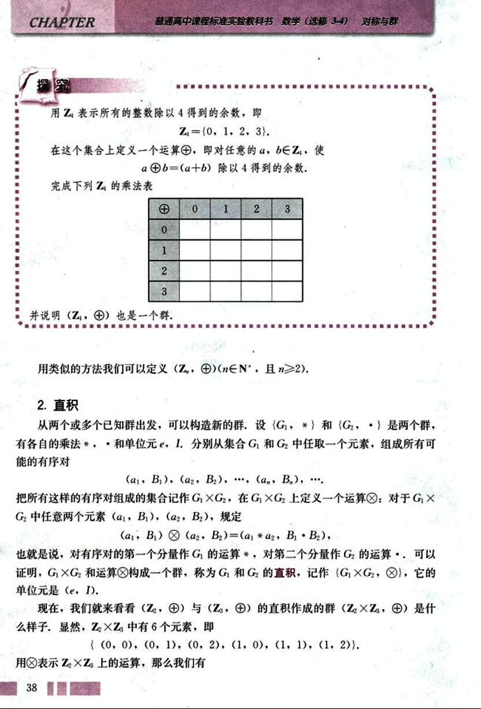
42 

# 第二讲 代数学中的对称与抽象群的概念

(0, 0) ⊗ (0, 1) = (0 + 0, 0 + 1) = (0, 1);
(1, 0) ⊗ (0, 2) = (1 + 0, 0 + 2) = (1, 2);
(1, 2) ⊗ (1, 1) = (1 + 1, 2 + 1) = (0, 0);
……

由此可得 $Z_2 \times Z_3$ 的乘法表（表 2-3），请同学们通过计算填写完整。

表 2-3

| ⊗ | (0, 0) | (0, 1) | (0, 2) | (1, 0) | (1, 1) | (1, 2) |
|---|---|---|---|---|---|---|
| (0, 0) | (0, 0) |  |  |  |  |  |
| (0, 1) |  |  |  |  |  |  |
| (0, 2) |  |  |  |  |  | (1, 2) |
| (1, 0) |  |  |  |  |  |  |
| (1, 1) |  |  |  |  |  |  |
| (1, 2) |  |  |  |  |  | (0, 0) |


思考题

举出几个群的例子。

39

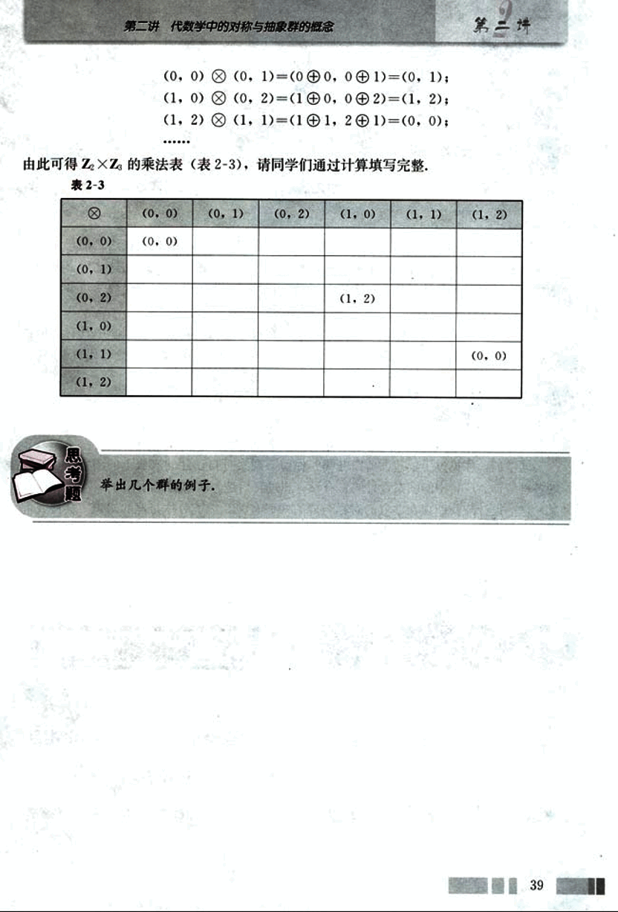
43 

# 第三节 对称与群的故事

“群”这个词是在1831年由天才的法国数学家伽罗瓦提出来的，在这之前，人们已经对各种几何图形的对称性，多项式的对称性等进行过系统的研究。在这之后，某种事物的全体对称的集合被提升到一个优美的数学结构——群，开始了现代数学对事物对称性的深层次探讨。

现在，我们从易到难地介绍一些对称与群在日常生活、化学、物理学中具有典型性的应用，最后介绍伽罗瓦其人以及伽罗瓦理论对数学，特别是代数学的划时代贡献。

## 带饰和面饰

同学们，你见过手工艺人剪窗花吗？你留心观察过自己穿的衣服上的图案、建筑物的各种装饰、广告中的图案设计吗？有没有想过它们是怎样被设计出来的？

这些设计与我们现在学习的对称与群的知识有关，学了对称与群的知识，会使我们更加清楚地认识这些设计的本质。

首先，我们研究两类在日常生活和艺术领域中常常见到的对称图形。

在服装、壁画、图书的版面、建筑物等的装饰设计中，常常可以见到类似图3-1～图3-8中的图案。

图3-1 [图3-1](images/3-1.png)

图3-2 [图3-2](images/3-2.png)

图3-3 [图3-3](images/3-3.png)

图3-4 [图3-4](images/3-4.png)

图3-5 [图3-5](images/3-5.png)

图3-6 [图3-6](images/3-6.png)

40

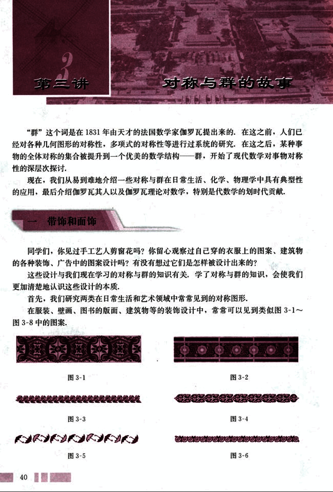
44 

# 第三讲 对称与群的故事

## 图3-7

## 图3-8

数学上，把这种平面上夹在两条平行直线中间的部分叫做带，带中的图案叫做带饰，与两条平行直线平行且到它们的距离相等的直线叫做中轴。

我们仍然用平面刚体运动来描述带的对称性，带饰可以看做由带饰单元（带饰的一部分）沿中轴方向平移生成的；若用向量表示平移的方向和大小，$n\vec{v}$ ($n∈Z$)就表示所有的平移，在每个带饰单元中，包含了旋转、反射或平移变换，人们经过研究发现，尽管带饰图案千变万化，但这些图案所可能具有的对称群的个数却是有限的，仅有7种。

下面我们就以7个简单的带饰为例说明。

(此处应插入图3-9)

## 图3-9

如图3-9，①中的带在沿中轴方向的平移变换下保持不变；②中的带在平移变换和关于中轴的反射变换下保持不变；③中的带在平移变换和关于纵轴（即垂直于横轴的直线，如图中虚线所示）的反射变换下保持不变；④中的带在平移变换和绕中轴上的某些点（如图中所示）旋转180°的变换下保持不变；⑤中的带在上述4个带的对称变换下都保持不变；⑥中的带在平移变换和滑动反射（先关于中轴反射再沿中轴方向平移$\frac{1}{2}\vec{v}$）下保持不变；⑦中的带在③、④、⑤中带的对称变换下都保持不变。

另一类在我们身边大量存在的图案如图3-10～图3-18所示。图3-10是蜜蜂筑造的蜂巢的横截面，图3-11是人们用于装饰墙壁的壁纸，图3-12是窗户的窗格，图

(此处应插入M.C. Escher的图片)

M. C. Escher (1898-1972)在他的雕刻和绘画作品中融入了多种数学思想，例如Möbius带、螺旋线、五面体、17种面饰群等，


41

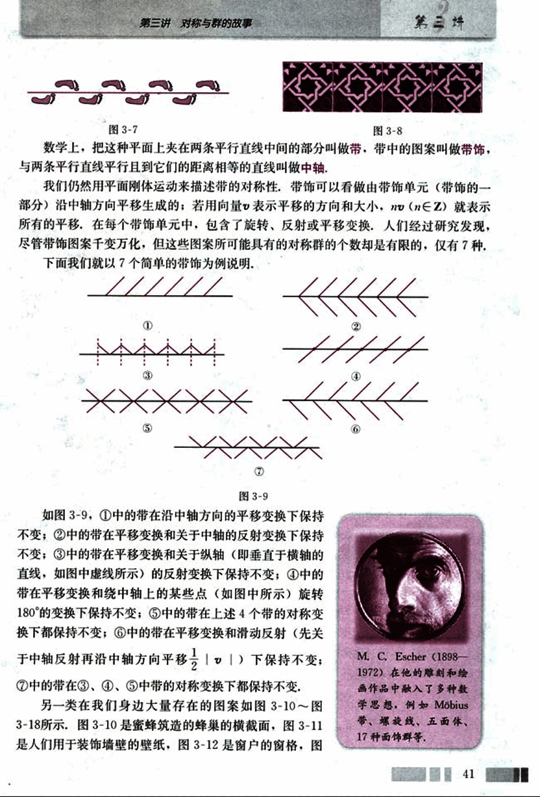
45 

# CHAPTER

普通高中课程标准实验教科书 数学(选修3-4) 对称与群

3-13~图3-15是建筑材料中的图案,图3-16~图3-18是Escher图案.

[图3-10](images/3-10.png)  [图3-11](images/3-11.png)  [图3-12](images/3-12.png)
[图3-13](images/3-13.png)  [图3-14](images/3-14.png)  [图3-15](images/3-15.png)
[图3-16](images/3-16.png)  [图3-17](images/3-17.png)  [图3-18](images/3-18.png)

这样的二维图案在数学上称为面饰，面饰是由面饰单元(面饰的一部分)经过两组不同方向的平移和 *mu* (n, m∈Z, *v* 与 *u* 不平行)生成的。数学家已经发现面饰群共有17种，这一发现具有重要的实际意义。例如，在进行壁纸设计时，只需用17个计算机程序，就可以设计出各种可能的壁纸图案。

有趣的是，对称群这一数学概念一直到19世纪才出现，但在古代的装饰图案中，尤其是在古埃及的饰物中，我们却可以找到面饰，它们的面饰群穷尽了所有17种面饰群。这个事实说明，尽管对称群这个概念非常抽象，但它与我们人类的生产、生活却有着千丝万缕的联系，数学的概念是从现实世界中经过不断抽象而来的。

42

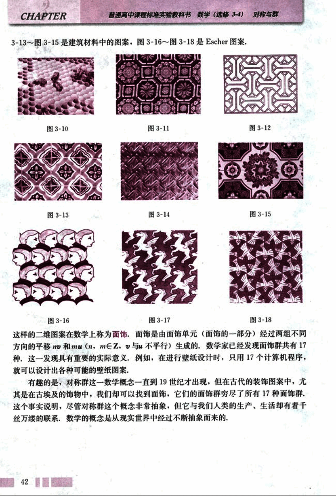
46 

# 第三讲 对称与群的故事

## 思考题

1. 设计一个你自己认为漂亮的带饰，并说出在你的设计中用到了哪些对称变换。
2. 试把下列的面饰单元平移成面饰。

## 二 化学分子的对称群

物体的形状往往具有这样那样的“对称性”。由于物体由分子构成，因此可以猜想，分子也会有这样那样的对称性，而且这种对称性往往在很大程度上能够决定分子的性质。在化学分子的研究中，对于其对称性的研究常常可以使人加深对物体性质的认识。

人们有时会说一些分子比另一些分子更对称，或者某些分子具有高度对称性，某些分子具有低对称性。虽然从直观上看，这些说法都是明确的，但是为了建立严格的分子对称性的概念，科学家们使用了群这一数学工具。

这里，我们就以水分子H₂O和氨分子NH₃为例，介绍化学分子的对称变换和对称群。

水分子H₂O由1个氧原子和2个氢原子构成，并且这3个原子在同一个平面内（图3-19）。

下面，我们就一起来寻找使水分子保持不动的对称变换（习惯上称为对称操作）。

显然，保持空间所有点不动的恒等操作是水分子的一个对称操作（图3-20）。

接着考虑水分子的反射变换，与平面图形不同，这里研究的反射变换总是与对称面联系在一起。

[图3-19](images/3-19.png)

[图3-20](images/3-20.png)

43

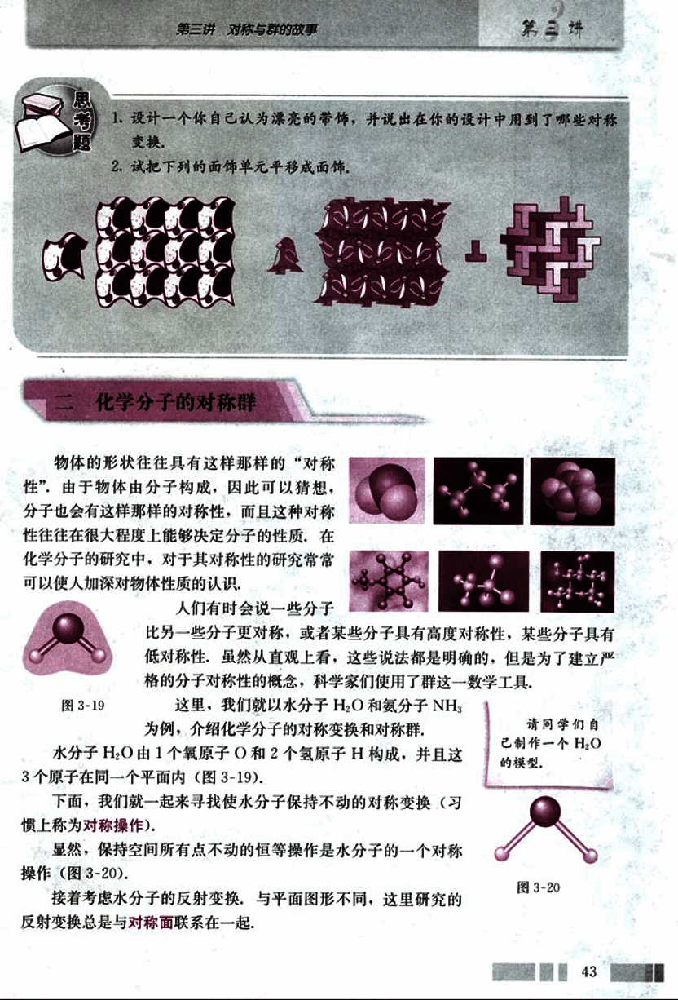
47 

# CHAPTER

普通高中课程标准实验教科书 数学(选修3-4) 对称与群

如图3-21,平面α上线段AA<sub>1</sub>,且过线段AA<sub>1</sub>的中点O，这时，交换点A、A<sub>1</sub>的位置，得到的线段与原来的线段重合，我们称平面α为线段AA<sub>1</sub>的对称面。

[图3-21](images/图3-21.png)

同样地，我们可以用这样的对称操作来定义分子的对称面，从每个原子向一个平面作垂线，把垂线向平面的反面延长相等的距离，并把原子移到垂线的另一端，如果分子的所有原子都完成了这种操作后，仍与原来的分子重合，我们就称这个平面是这个分子的一个对称面。

[图3-22](images/图3-22.png)

观察H<sub>2</sub>O的模型，容易发现它有两个对称面。

如图3-22，分子所在的平面就是一个对称面，经过关于这个平面的反射，所有的原子都保持不动。

[图3-23](images/图3-23.png)

如图3-23，包含氧原子并垂直于分子所在平面的平面也是一个对称面，经过这个对称面的反射，氧原子保持不动，而两个氢原子交换位置。

再考虑旋转变换，这里的旋转变换是绕一条直线的旋转，这条直线称为真轴。

经过实验，可以发现H<sub>2</sub>O只有一条真轴，即通过氧原子并平分氢原子连线的直线，将水分子绕真轴旋转180°后，它仍与原来的分子重合（图3-24）。

[图3-24](images/图3-24.png)

这样，我们就找到了H<sub>2</sub>O的4个对称操作：(1)恒等操作；(2)关于2个对称面的2个反射；(3)绕1条真轴的旋转。

事实上，这4个对称操作组成的集合包含了H<sub>2</sub>O的全部对称操作，两个对称操作的合成（即先做一个对称操作，再做另一个对称操作）就是这个集合上的一个二元运算，请同学们自己验证它们构成了H<sub>2</sub>O的对称群（通常记作C<sub>2v</sub>）。

[图3-25](images/图3-25.png)

再来看氨分子NH<sub>3</sub>，它由一个氮原子和3个氢原子H构成，整个分子呈正三角锥型，3个氢原子在同一个平面内（图3-25）。

[图3-26](images/图3-26.png)

如图3-26，NH<sub>3</sub>有3个对称面，每个对称面都包含氮原子和1个氢原子，并平分其他2个氢原子的连线，还有1条真轴，即通过氮原子并垂直于3个氢原子所在平面的直线。

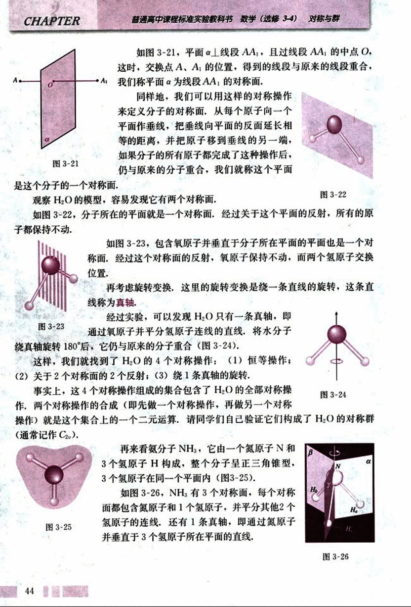
48 

# 第三讲 对称与群的故事

## 探究

下表中的NH₃都是由图3-26中的NH₃经过对称操作得到的，请你写出相应
的对称操作。

|  | 恒等操作 | 绕真轴旋转120° | 关于对称面的反射 |
|---|---|---|---|
|  | [image1](images/image1.png) | [image2](images/image2.png) | [image3](images/image3.png) |


这6个对称操作就是NH₃的全部对称操作，它们组成的集合连同对称操作的合成构
成了NH₃的对称群（通常记作C<sub>3v</sub>）。

数学上对于群的研究，并不关心群中的元素是什么，这些元素有什么物理意义，但
当把群的基本理论与化学分子的具体对称性结合起来之后，群论就成了研究分子运动规
律的一种有力的工具，如化学家利用群论推导出具有各种各样几何构型的化学分子的对
称群仅有32种；又如在利用群论分析分子对称性如何制约其量子力学解时，常常无需详
细计算就能获得一些定性的结论。有兴趣的同学可以查阅相关的书籍。

# 三 晶体的分类

在自然界中，几何对称最突出地表现在晶体中，晶体的对称是极其精巧的，例如下
图是食盐(NaCl)晶体中原子排列的模型(白点代表钠原子Na，黑点代表氯原子Cl)
(图3-27)，二氧化硅(SiO₂)晶体中原子排列的模型(白点代表硅原子Si，黑点代表氧
原子O)(图3-28)和二氧化钛(TiO₂)晶体中原子排列的模型(白点代表钛原子Ti，
黑点代表氧原子O)(图3-29)。

45

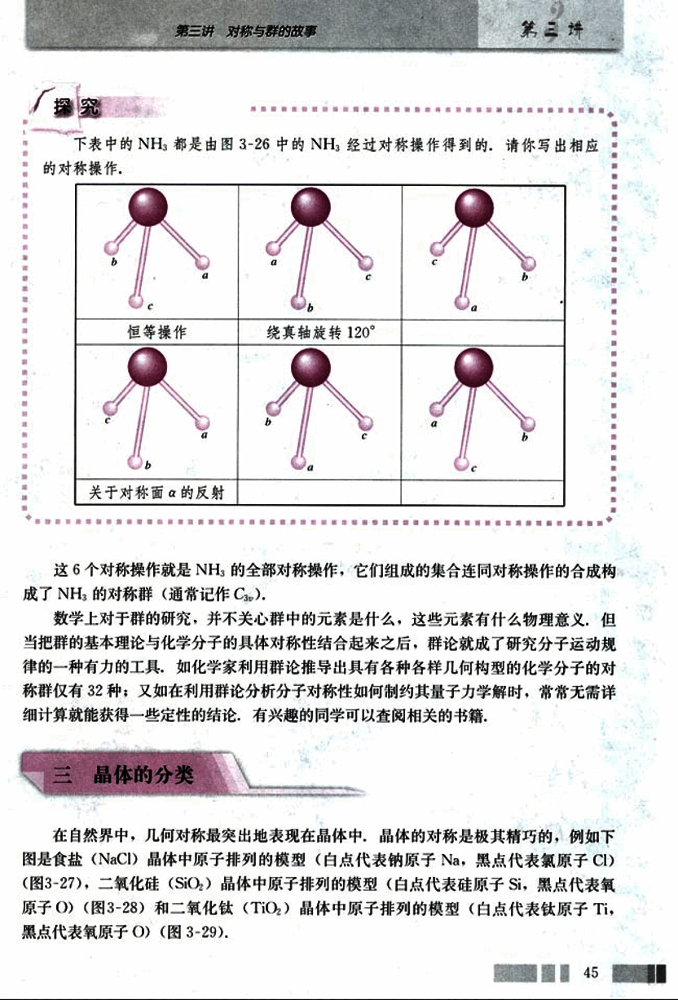
49 

# CHAPTER 9

普通高中课程标准实验教科书 数学(选修3-4) 对称与群

图3-27  图3-28  图3-29

晶体可以看成由空间单位格点(晶体原子在平衡位置时组成的空间中一个有规则的多面体)经过不在同一平面内的三组平移生成的空间格点，晶体几何形状的多样性需要有一种能描述其对称性规律的统一的表述模式，这就是群。

在19世纪后半叶，科学家们发现晶体外形的全部对称形式，也就是使单位格点保持不动的对称群(通常称为对称点群)，共有32种；而晶体内部构造的一切可能的对称形式，也就是使空间格点不动的对称群(通常称为空间群)，共有230种。32种对称点群刻画了晶体外形所呈现的全部对称关系，而晶体的物理对称性除了外形所显示的，更多的是由其内部原子的排列揭示的，230种空间群刻画了晶体内部原子及离子间全部的对称关系。

正如在二维空间中，带饰群和面饰群在平面装饰艺术中起到了非常重要的作用一样，对称点群和空间群使得晶体学中的一些重要问题得到了透彻而深入的解释，这一点可以从历史上晶体结构的发现过程得到证明。

1912年，年轻的德国物理学家劳厄(Max von Laue)首次用较窄的X射线照射某个晶体，并在晶体的后面放置照相胶卷，结果发现X射线被单位晶格转向，在胶卷上以点的形式出现(图3-30和图3-31)。这些二维图象具有重要的意义，从图中我们可以看出，晶体的对称性被忠实地表现出来了。后来，矿物学家都是通过研究晶体的二维X射线投影来确定晶体的内部结构的，通常，投影中所呈现的是二面体群D₁, D₆, D₈, D₁₂等。

[劳厄(Max von Laue)](images/laue.png)

图3-30  图3-31

劳厄第一个用晶体作光栅，发现了X射线的衍射现象，从而既证明了晶体的点阵结构
46

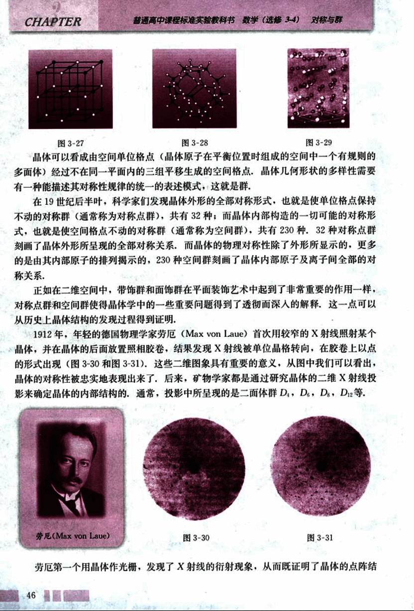
50 

# 第三讲 对称与群的故事

##  X射线与晶体结构

构，又证明了X射线是一种光波，他因此荣获了1914年度诺贝尔物理学奖。在这一重大发现的背后，晶体对称群的理论起了关键性作用。

随后不久，两位英国科学家布拉格父子(Williar Henry Bragg 和他22岁的儿子 Williar Lawrence Bragg)用劳厄的衍射点和空间群的知识计算出了晶体中原子的固有排列形状，这一发现标志着现代矿物学的诞生。1915年，布拉格父子被联名授予诺贝尔物理学奖。

现在，晶体对称理论还在不断发展，对此有兴趣的同学，可以参阅相关书籍。

# 四 伽罗瓦理论

“群”这一概念是由法国数学家伽罗瓦在1831年首次提出的。当时的代数学仍是一门以方程论为中心课题的数学学科，代数方程的求解问题依然是代数的基本问题，特别是用根式求解方程。

从代数方程的根式解法的发展过程来看，早在公元前1700年左右，古巴比伦人就能够用根式求解一元二次方程 $ax^2+bx+c=0$ 了。而直到3000多年之后，16世纪初的文艺复兴时期，三次方程 $x^3+ax^2+bx+c=0$ 和四次方程 $x^4+ax^3+bx^2+cx+d=0$ 的求根公式才由意大利数学家给出。到16世纪中叶，用根式求解四次或四次以下方程的问题获得了圆满解决。

<br>

| 所谓方程有根式解(即代数可解)，就是这个方程的解能够由该方程的系数经过有限次加减乘除以及开整数次方运算来表示。|


面对这样漂亮的结果，数学界迎来了下一个挑战：探寻五次和五次以上方程的根式解。但是经过以后近300年的努力，一直没有得到结果。在这期间，几位数学家的卓越工作是值得一提的：

1. 在1770年前后，法国数学家拉格朗日(Lagrange)利用统一的方法(现在称为拉格朗日预解式方法)，详细分析了二、三、四次方程的根式解法，提出方程根的排列与置换理论是解代数方程的关键所在。他的工作有力地促进了代数方程论的进步，但他的这种方法却不能对一般五次方程求解。

2. 在1824～1826年，年轻的挪威数学家阿贝尔(Abel)严格证明了：对于方程 $x^n+a_1x^{n-1}+…+a_n=0$，如果其次数$n≥5$，并且系数$a_1,a_2,…,a_n$看成是字母，那么任何一个由这些字母组成的根式都不可能是方程的根。这样，五次和高于五次的一般方程的求解问题就由阿贝尔解决了。他还考虑了一些特殊的能用根式求解的方程，其中的一


47

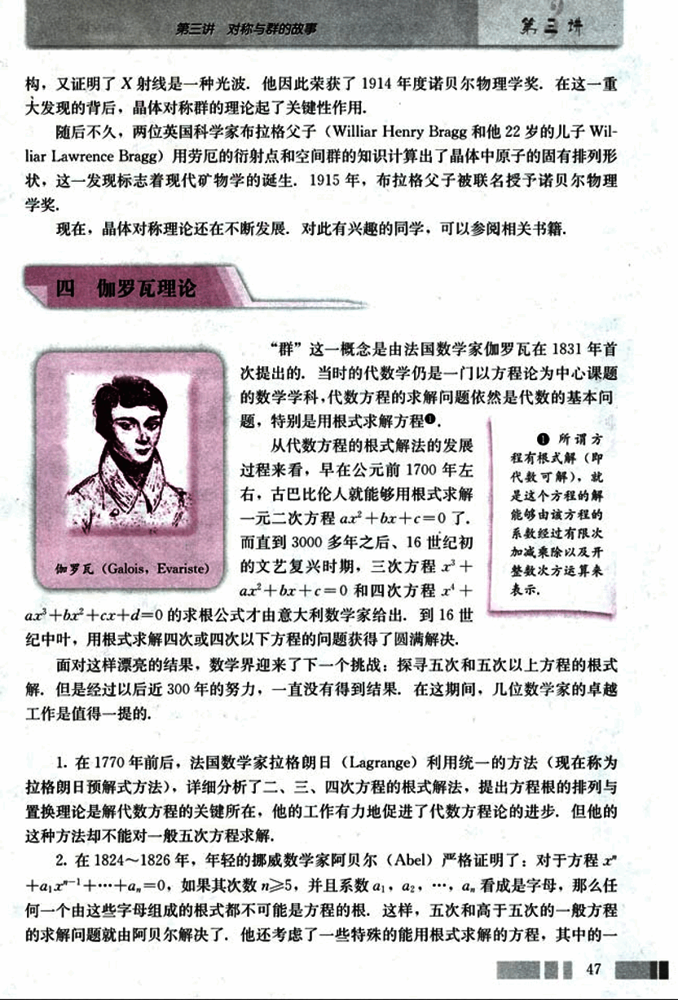
51 

# CHAPTER

类现在被称为“阿贝尔方程”.

阿贝尔关于代数方程的工作只是证明对于一般的五次和五次以上方程根式解是不可能的，但并不妨碍人们去求一些特殊的代数方程，比如阿贝尔方程的根式解。在阿贝尔的工作之后，数学家所面临的一个问题就是：什么样的特殊方程能够用根式求解？这个问题稍后被同样年轻的数学家伽罗瓦解决了，对方程的根式可解问题的研究直接导致了群论的建立。

伽罗瓦继承和发展了前人及同时代人的研究成果，融会贯通了他们的数学思想，并且凭着对数学特性的一种直觉，超越了他们，他首先提出了根的置换概念，注意到每个方程都可以与一个置换群（伽罗瓦群）联系起来，方程实际上是一个其对称性可用群的性质描述的系统，这样，伽罗瓦就把方程的根式解问题转化为群论问题来解决，而且他最终以群论为工具，为方程的根式解问题提供了全面而透彻的解答。

伽罗瓦是一位天才的数学家，他在少年时期就直接阅读了数学大师们的专著，如勒让德(Legendre)的经典著作《几何原理》、拉格朗日的《解数值方程》、《解析函数论》、欧拉(Euler)、高斯和柯西(Cauchy)等的著作，为自己打下了坚实的数学基础。他一生最主要的成就就是提出了群的概念，用群论彻底解决了代数方程的可解性问题。人们为了纪念他，把用群论的方法研究方程根式解的理论称为伽罗瓦理论。

更重要的是，群论开辟了全新的研究领域，以结构研究代替计算，在错综复杂的现象中寻求共同的结构，把偏重计算研究的思维方式转变为用结构观念研究的思维方式，群论迅速发展成为一门崭新的数学分支，对近世代数的形成和发展产生了巨大影响。群是一个高度抽象的概念，群论对于数学的其他分支，如数学分析、几何学的发展，对于物理学、化学的发展，甚至对于二十世纪结构主义哲学的产生和发展都发生了巨大的影响。

虽然伽罗瓦理论被公认为十九世纪最杰出的数学成就之一，但对十九世纪初的人来说太深奥了，就连当时的数学大师都不能理解伽罗瓦的数学思想和他的工作的实质，以至他的论文得不到发表，且在以后的几十年中一直被人们看成是一部“天书”。伽罗瓦在二十一岁时就因一场决斗而早逝，在他临终前夕给朋友的一封绝笔信中，伽罗瓦写下了有关他研究的一份说明，这封信，说明了伽罗瓦对数学本质，尤其是数学方法的追求和探索，展示了他对现代数学的远见卓识。

对伽罗瓦这位天才的数学家和伽罗瓦理论感兴趣的同学可以查阅相关的数学史和近世代数的书籍，如《数学史概论》(李文林著，高等教育出版社出版)。

48

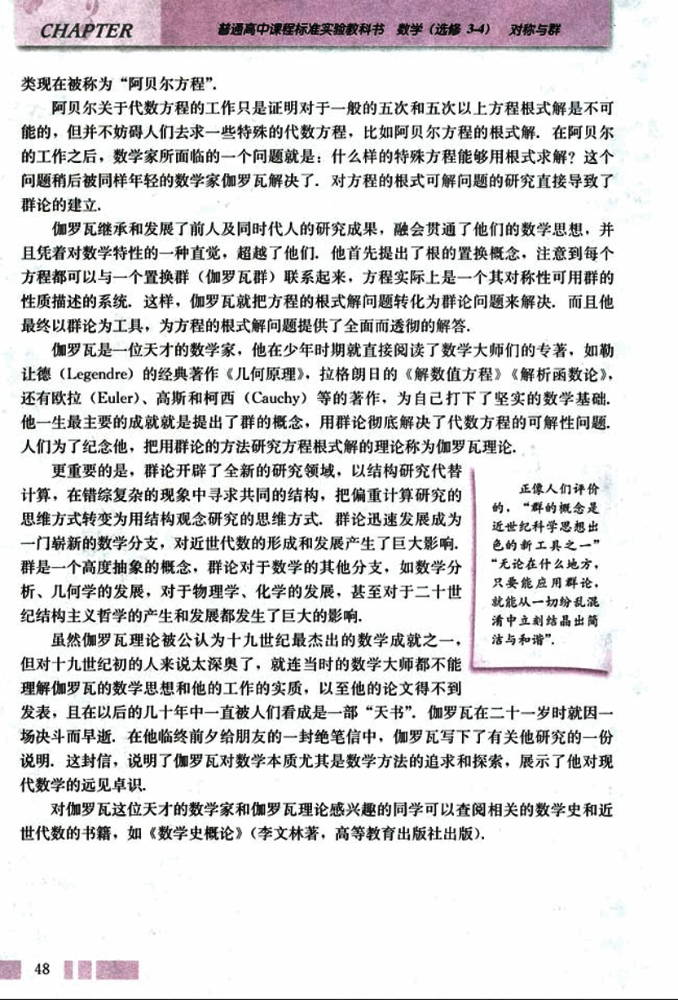
52 

# 第三讲 对称与群的故事

## 学习总结报告

同学们，前面我们学习了对称与群的一些最基本的知识，从中我们已经看到，尽管群是现代数学中一个非常抽象的概念，但它与我们熟悉的身边事物以及学过的数学知识却有着非常密切的联系。

从“对称”到对称群，再到群，从而得到一个精确的、具有普遍适用性的数学概念，这是一个在错综复杂的现象中寻求共同结构的过程，也是一个对事物认识不断深化的过程，在数学的研究中，这个过程具有代表性。通过前面的学习，你对这个过程是否有所感悟？

群是以高度抽象的形式给出的，或许它已不像最初的“对称”那么形象直观、生动活泼而富有吸引力，但因为它从事物的结构特征刻画了其本质，因此它的功能非常强大，它不仅是数学中的一个核心概念，而且在物理、化学及艺术、建筑等领域都有广泛的应用。

数学学习的过程是一个渐进的过程，对于像群这样抽象的概念，更是需要循序渐进地思考、领悟，并不断地反思、总结，才能逐步领会其中的数学思想方法。

请你写一篇学习总结报告，建议报告包括下列三方面的内容：

1. **知识的总结** 如对本专题整体结构和内容的理解，对对称的数学描述和群的概念的认识等；
2. **拓展** 通过查阅资料、调查研究、访问求教、独立思考，进一步探讨对称在自然界中的广泛性和群对刻画对称的作用；
3. **学习体会** 通过本专题的学习，谈谈你对数学中研究问题的思想方法的认识。

同学们可以参考下列书籍：

1. 段学复，《对称》，人民教育出版社；
2. 赫尔曼·外尔，《对称》，上海科技教育出版社；
3. 张远达，《运动群》，上海教育出版社；


49

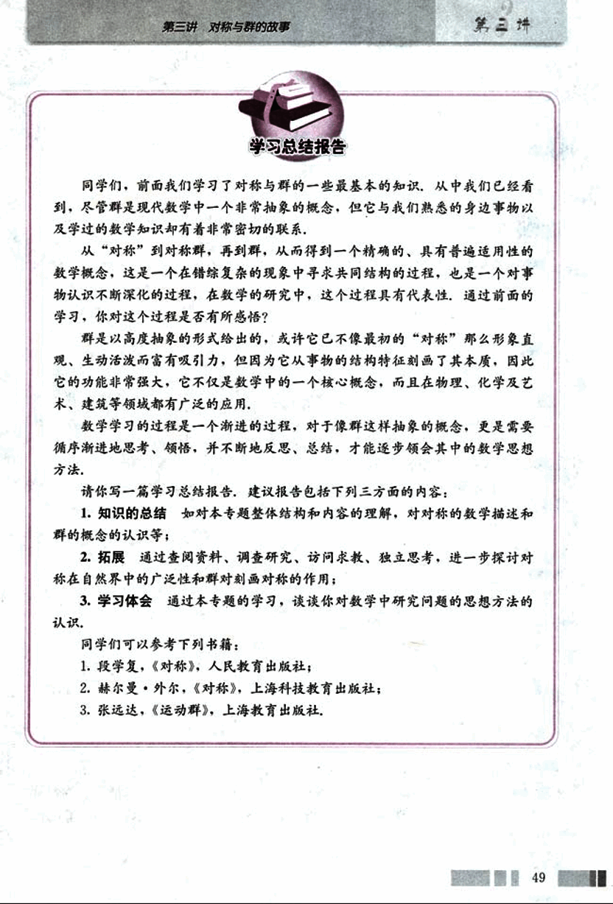
53 

# 附录一

给定一个平面刚体运动m.设A,B,C为3个不共线的点,在m的作用下,点A,B,C依次对应到点A', B', C'.有趣的是,点A,B,C的运动完全确定了平面刚体运动m,即在m的作用下,平面上任意一点的象由点A,B,C的象A', B', C'唯一确定.

现在,我们来证明这件事情。

设点P是平面上的任意一点,在m的作用下,点P被对应到了点P',我们只需证明点P'是由A', B', C'唯一确定的。

由于m保持平面内任意两点间的距离不变,故有|A'P'| = |AP| = a, |B'P'| = |BP| = b, |C'P'| = |CP| = c.所以P'必在以A'为圆心,以a为半径的圆OA'上.同样地,P'必在以B'(C')为圆心,以b(c)为半径的圆OB'(OC')上.因此,点P'是3个圆OA', OB', OC'的公共交点。

我们知道,两个不同的圆最多有两个交点,所以3个不同的圆最多也只能有两个交点.如果OA', OB', OC'有两个交点,那么P的位置就有两种选择,而不能唯一确定.

假设OA', OB', OC'有两个交点P', P", 如图1所示.

[图1](images/图1.png)

那么A', B', C'都在点P'和P"连线的垂直平分线上(为什么？),这与点A,B,C不在一条直线上,因而它们的象A'、B'、C'也不在一条直线上(为什么？)相矛盾,这说明OA', OB', OC'这3个圆只有一个交点P',这样点A', B', C'就唯一确定了点P'.

至此证明结束.

50

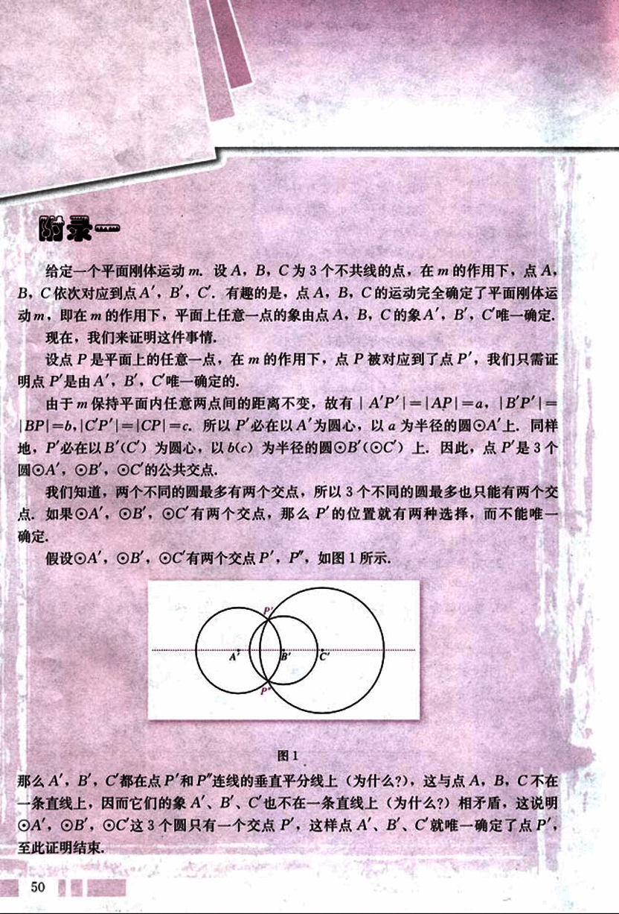
54 

# 附录

这个结果很有趣，也很有用。如果给定两个平面刚体运动 $m_1$ 和 $m_2$，若我们还知道，对不共线的3个点 A，B，C，有

$m_1(A) = m_2(A)$，$m_1(B) = m_2(B)$，$m_1(C) = m_2(C)$，

则由上面结果便得平面刚体运动 $m_1 = m_2$，即若两个平面刚体运动在不共线的3个点上的作用是一样的，则它们必是同一个平面刚体运动，这一点我们在讨论中经常用到。

51

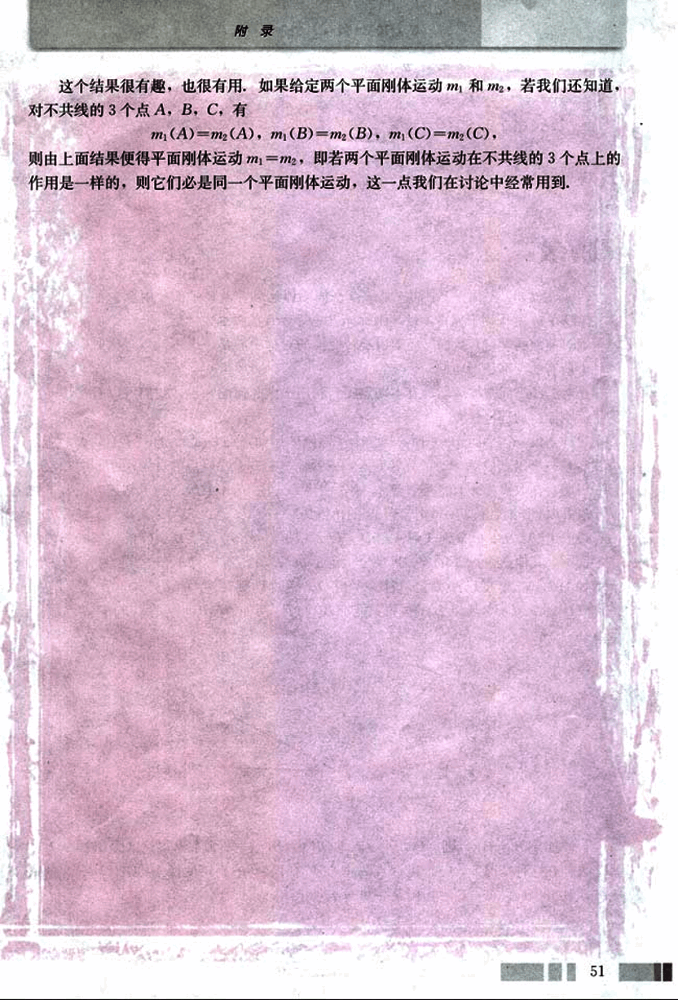
55 

# 附录二

定义 设m:平面α→平面α是一个平面刚体运动，若在平面α内至少存在一个点O，点O在m的作用下保持不动，则称为有不动点的平面刚体运动。

通过前面的学习，我们已经知道旋转变换的对称中心是一个不动点，反射变换的对称轴上所有的点都是不动点。

还有哪些平面刚体运动具有不动点呢？利用平面几何的知识，我们可以对有不动点的平面刚体运动进行分类。

定理 设m:平面α→平面α是一个平面刚体运动，点O是m的一个不动点，那么m或者是一个以O为中心的旋转变换，或者是一个关于过O点的直线的反射变换。

证明：任取平面α上的两个点A、B，使得A、B、O不共线。为了叙述方便，不妨设OB由OA逆时针旋转一个小于180°的角得到。

设m把A、B、O分别映到A′、B′、O′。根据附录一，A′、B′、O′的位置唯一确定了平面上其他点在m下的象，即完全确定了m。

如图2，如果A′已经确定，且OA′由OA逆时针旋转θ (0°<θ<360°)得到，则ΔA′O′B′≅ΔAOB，所以B′的位置只能有B₁′与B₂′两种情况。

[图2](images/图2.png)

(1)如果B′=B₁′，则∠BOB′=θ，即OB′由OB逆时针旋转θ得到（图3）。在这种情况下，一个以O为中心逆时针旋转θ的旋转变换也把O，A，B依次映射到O，A′，B′，由附录一知m=ρ<sub>θ</sub>。

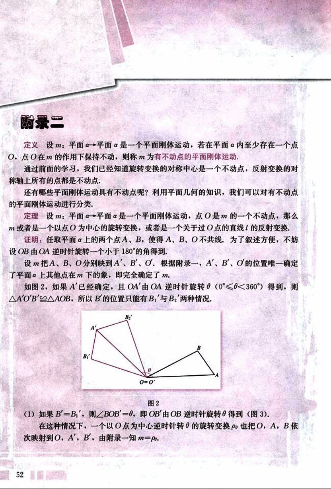
56 

# 附录

## 图3

[image1](images/image1.png)

(2) 如果 B' = B₂, 则或者 A' 在∠AOB 的外部 (图 4)，或者 A' 在∠AOB 的内部 (图 5)。无论是哪一种情况，OB' 都由 OA' 顺时针旋转∠AOB 得到。

## 图4

[image2](images/image2.png)

## 图5

[image3](images/image3.png)

作∠AOA' 的平分线，由于∠A'OB' = ∠AOB，所以 l 也是∠BOB' 的平分线。在这种情况下，一个关于直线 l 的反射变换也把 O，A，B 依次映射到 O，A'，B'，由附录一知 m = r。

综上所述，有不动点的平面刚体运动有且只有两种类型——旋转变换和反射变换。

53
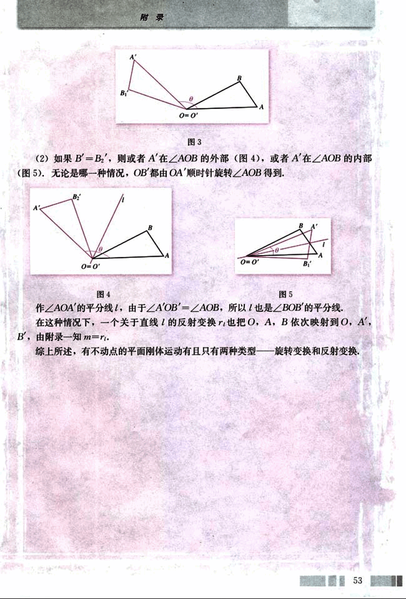
57 

# 后记

为了全面贯彻党的教育方针，适应时代发展的需要，为学生的终身发展奠定基础，根据教育部制订的普通高中各学科课程标准（实验），人民教育出版社课程教材研究所编写的各学科普通高中课程标准实验教科书，得到了诸多教育界前辈和各学科专家学者的热情帮助和大力支持，在各学科教科书终于同课程改革实验区的师生见面时，我们特别感谢担任教科书总顾问的丁石孙、许嘉璐、叶至善、顾明远、吕型伟、王梓坤、梁衡、金冲及、白春礼、陶西平同志，感谢担任教科书编写指导委员会主任委员的柳斌同志和编写指导委员会委员的江蓝生、李吉林、杨焕明、顾泠沅、袁行霈等同志。

根据教育部制订的《普通高中数学课程标准(实验)》，我们聘请北京师范大学刘绍学教授为主编，与高中数学课程标准研制组的部分成员、大学数学教师、数学教育理论工作者、中学数学教研员和数学教师共同组成编写委员会，编写了这套数学实验教科书。这里特别要感谢北京师范大学数学科学学院领导对本套教科书编写工作的高度重视和大力支持，同时还要感谢所有对本套教科书提出修改意见，提供过帮助与支持的专家、学者和教师，以及社会各界朋友。

本册教科书是编委会全体成员集体智慧的成果，除已列出的主要编写者外，参加本册教科书讨论的还有：刘绍学、章建跃、刘意竹、钱珮玲、蒋佩锦等。

我们还要感谢使用本套教材的实验区的师生们，希望你们在使用本套教材的过程中，能够及时把意见和建议反馈给我们，对此，我们将深表谢意。让我们携起手来，共同完成教材建设工作，我们的联系方式如下：

电话：(010) 64019734

E-mail: jcfk@pep.com.cn, songll@pep.com.cn

人民教育出版社 课程教材研究所
中学数学课程教材研究开发中心

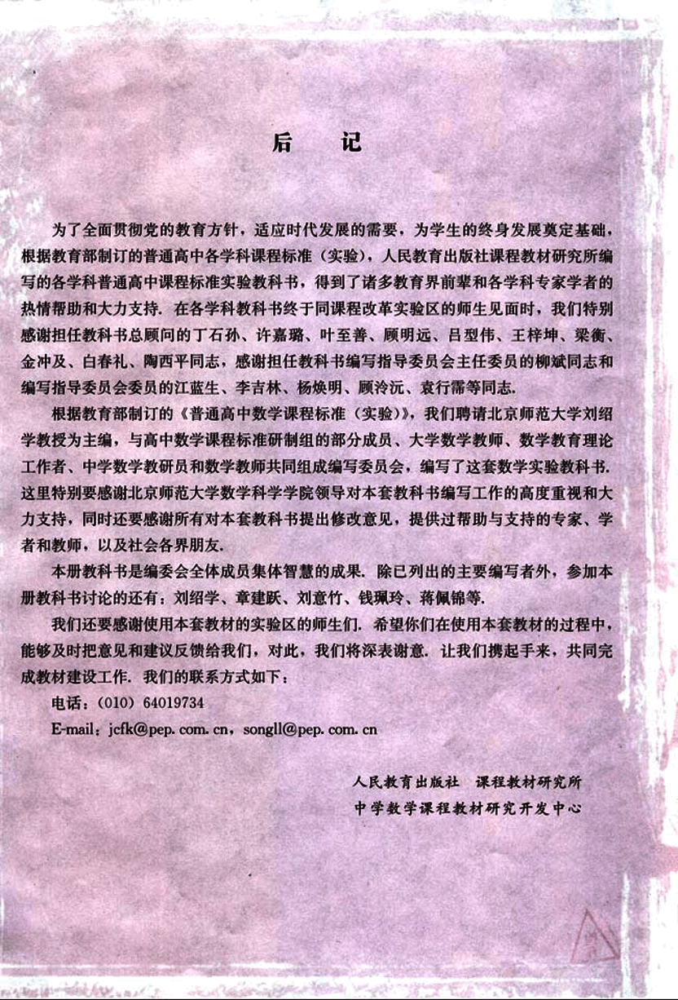
