# 选修4-1

1 

# 数学

## 选修 4-1

# 几何证明选讲

人民教育出版社  课程教材研究所  编著

中学数学课程教材研究开发中心
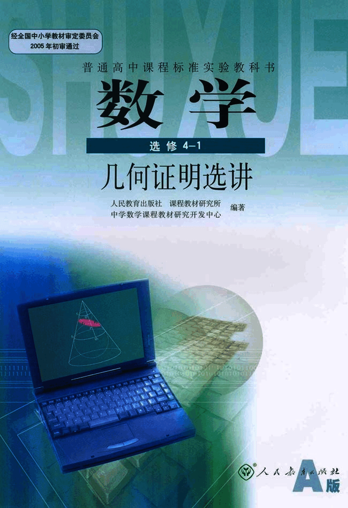
2 

# 普通高中课程标准实验教科书
## 数学

### 选修 4-1

# 几何证明选讲

人民教育出版社 课程教材研究所 编著

中学数学课程教材研究开发中心


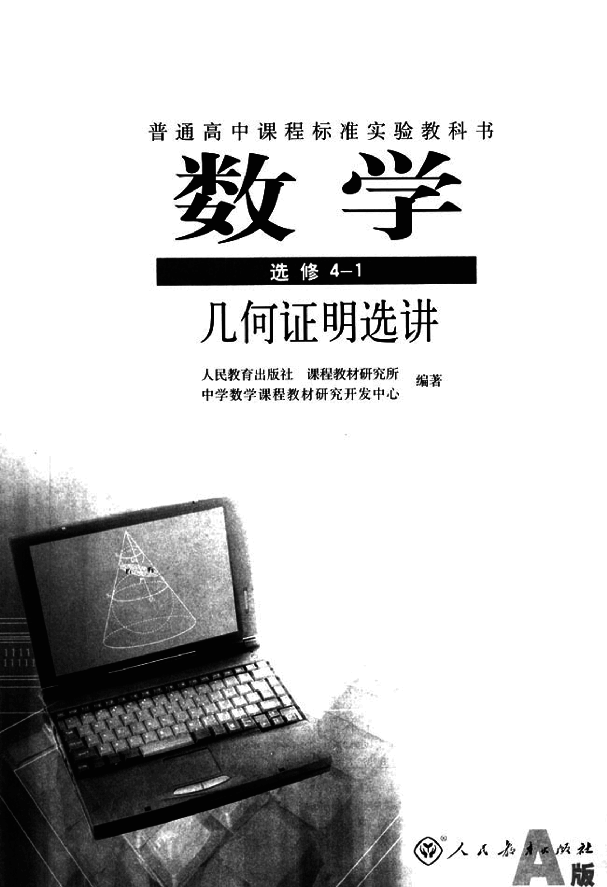
3 

# 数学 选修4-1

## 几何证明选讲 (A版)

人民教育出版社 课程教材研究所 编著

中学数学课程教材研究开发中心

人人文版社出版发行

网址: http://www.pep.com.cn

涿州市星河印刷有限公司印装 全国新华书店经销

*

开本: 890毫米×1240毫米  1/16  印张: 3.75  字数: 80000

2007年1月第2版  2008年6月第18次印刷

ISBN978-7-107-18638-7  定价: 4.00元

G・11728(课)

著作权所有·请勿擅用本书制作各类出版物·违者必究

如发现印、装质量问题，影响阅读，请与本社出版科联系调换。

(联系地址: 北京市海淀区中关村南大街17号院1号楼 邮编: 100081)


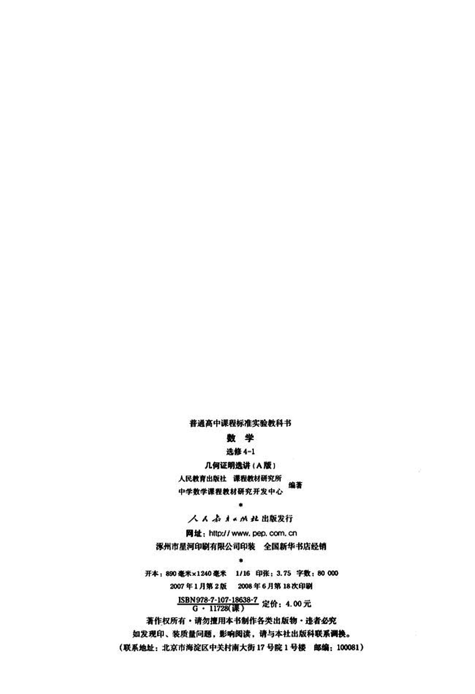
4 

# 主编:刘绍学
## 副主编:钱珮玲 章建跃
### 编者:喻平
#### 责任编辑:章建跃
#### 美术编辑:王俊宏 王艾
#### 封面设计:林荣桓


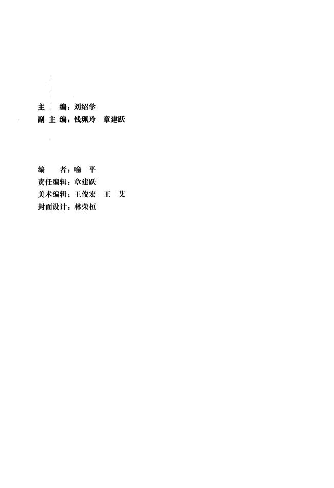
5 

# 目录

引言 1

# 第一讲 相似三角形的判定及有关性质 2

一 平行线等分线段定理 2
二 平行线分线段成比例定理 5
三 相似三角形的判定及性质 10
  1. 相似三角形的判定 10
  2. 相似三角形的性质 16
四 直角三角形的射影定理 20

# 第二讲 直线与圆的位置关系 24

一 圆周角定理 24
二 圆内接四边形的性质与判定定理 27
三 圆的切线的性质及判定定理 30
四 弦切角的性质 32
五 与圆有关的比例线段 34


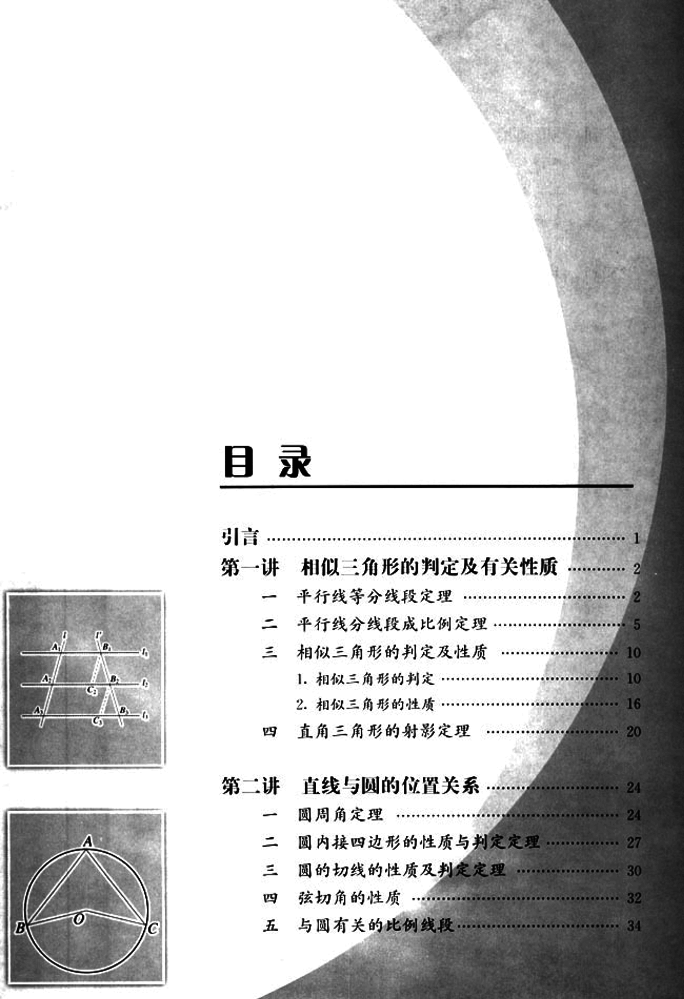
6 

# 第三讲 圆锥曲线性质的探讨

43

- 平行射影............43
- 平面与圆柱面的截线............45
- 平面与圆锥面的截线............48

学习总结报告............53

[diagram](images/diagram.png)
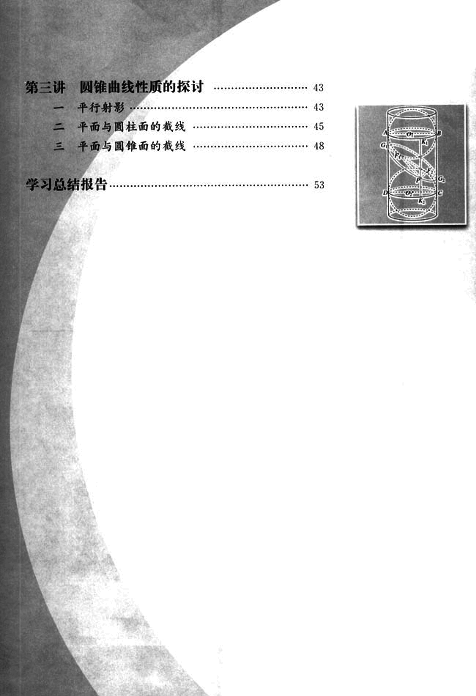
7 

# 普通高中数学选修课程系列4

## 第一讲 相似三角形的判定和性质

在初中，同学们已经学习了相似图形的概念以及相似三角形的某些性质，但当时并没有对相似三角形的有关定理进行严格的证明。本书的第一讲，主要内容就是对这些定理进行证明，并应用它们去解决一些问题。为了证明这些定理，我们引入了平行线等分线段、平行线分线段成比例的有关内容，以组成一个相对严谨的逻辑体系。


## 第二讲 直线与圆的位置关系

讨论直线与圆的位置关系，涉及圆周角、圆的内接四边形、圆的切线、弦切角、与圆有关的线段间的度量关系等内容。其中有的概念同学们在初中阶段已经学习过。本讲力求使这些知识融为一体，对相关定理进行严格论证，并注重知识的应用。


## 第三讲 圆锥曲线的概念和性质

讨论圆锥曲线的概念和性质，圆锥曲线包括椭圆、双曲线和抛物线，它们是解析几何研究的重要内容。在本讲中，我们选择了一个新的视角，用一个平面去截一个圆柱或圆锥，由平面与所截圆柱或圆锥中轴线的夹角变化去考察截口曲线的形状，得到椭圆、双曲线和抛物线，同时给出相关结论的证明。


### 在学习本书的过程中，应注意以下几点：

1. **注重证明**。数学是一门严谨的科学，得出的结论都要经过严格的证明。正是这种严谨性，使数学学习成为训练同学们逻辑推理技能、提高逻辑思维能力的有效途径。本书突出数学证明的目的也在于此。

2. **强调过程**。一般说来，正确的数学结论的形成需要“发现”和“证明”两个主要阶段，在这两个阶段中都包含着“过程”。数学知识有一个发生发展过程，通过数学学习，同学们可以领悟知识产生的背景，经历知识发展的过程，从而提高自己提出问题和解决问题的能力。因此，本书许多定理的引入和证明，都突出了其发生发展的过程。

3. **突出思想**。在陈述知识的同时，力求突出概念所反映的数学思想方法。因此，同学们在学习中，掌握知识的同时要努力领悟数学思想方法。

4. **加强探究**。学习中，同学们应跟随书中的“观察”、“思考”、“探究”等，大胆探究问题。

希望同学们通过本书的学习，在知识的积累、数学能力的提高、对数学的理解和认识等方面都能更上一个台阶。

1

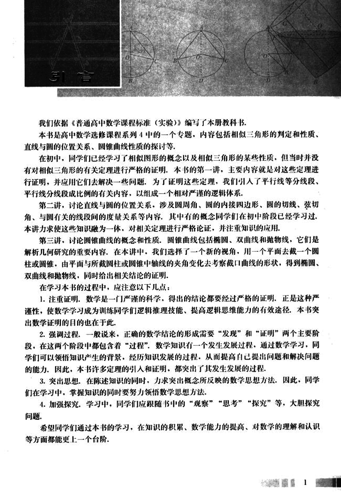
8 

# 相似三角形的判定及有关性质

## 第一讲

在初中，我们已经在平面几何中讨论过平行线的一些性质和判定的问题。例如，如果两条直线同时平行于第三条直线，那么这两条直线互相平行；同位角相等，两直线平行；两直线平行，内错角相等……下面我们继续研究平行线的性质。

## 平行线等分线段定理

研究平行线的性质，就是在已知一组直线平行的条件下，探究可以推出哪些结论。例如，一组平行线被另一组平行的或非平行的直线所截（图1-1），所得到的图形具有哪些性质呢？

# [图1-1](images/1-1.png)

## 观察

如图1-2，三条直线$l_1$、$l_2$、$l_3$满足$l_1 // l_2 // l_3$，直线$l // l'$，且分别与$l_1$、$l_2$、$l_3$相交于$A_1$、$A_2$、$A_3$和$B_1$、$B_2$、$B_3$。当$A_1A_2 = A_2A_3$时，观察图形，并测量线段$B_1B_2$、$B_2B_3$的长度，它们有什么关系？如果$l$与$l'$不平行（如图1-3），上述关系还成立吗？

2

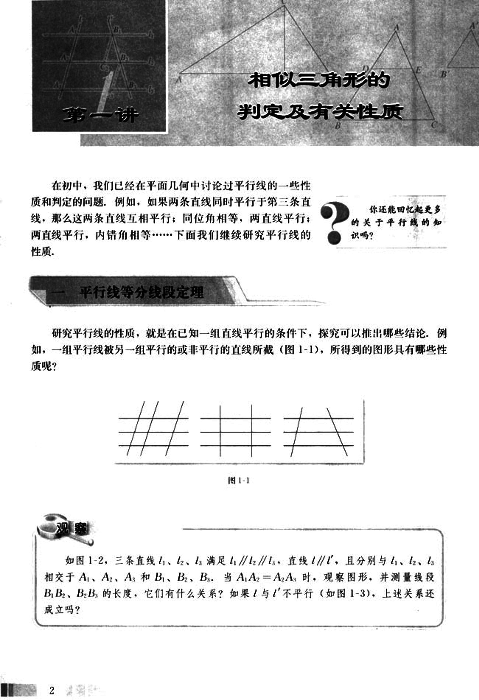
9 

# 第一讲 相似三角形的判定及有关性质

## 图1-2


## 图1-3


通过观察并测量，可以发现，无论 *l* 与 *l’* 是否平行，只要 $A_1A_2 = A_2A_3$，就有 $B_1B_2 = B_2B_3$。因此可以猜想：

已知 $l_1 // l_2 // l_3$，直线 *l* 与 *l’* 与 $l_1, l_2, l_3$ 分别交于 $A_1, A_2, A_3$ 和 $B_1, B_2, B_3$。如果 $A_1A_2 = A_2A_3$，那么 $B_1B_2 = B_2B_3$。

下面我们给出这个猜想的证明：

证明：(1) 如图 1-2，当 $l // l’$ 时，

$l_1 // l_2 // l_3$，$l // l’$。

∴ 四边形 $A_1B_1B_2A_2$ 是平行四边形，

$B_1B_2 = A_1A_2$。

同理可证 $B_2B_3 = A_2A_3$。

$A_1A_2 = A_2A_3$。

$B_1B_2 = B_2B_3$。

(2) 当 *l* 与 *l’* 不平行时，如图 1-4，过 $B_2$ 作 $B_2C_2 // A_1A_2$，交 $l_3$ 于 $C_2$；过 $B_2$ 作 $B_2C_3 // A_2A_3$，交 $l_3$ 于 $C_3$。同 (1) 的证明方法可得 $B_1C_2 = B_2C_3$。

考察 $\triangle B_1C_2B_2$ 和 $\triangle B_2C_3B_3$。

$B_1C_2 // B_2C_3$ (为什么？)

$\angle C_2B_2B_1 = \angle C_3B_2B_3$。

又 $\angle B_1B_2C_2 = \angle B_2B_3C_3$，$B_1C_2 = B_2C_3$。

$\triangle B_1C_2B_2 \cong \triangle B_2C_3B_3$。

$B_1B_2 = B_2B_3$。

于是，我们有

## 平行线等分线段定理

如果一组平行线在一条直线上截得的线段相等，那么在其他直线上截得的线段也相等。

将图 1-4 中的直线 *l’* 平移，使 *l’* 与 *l* 相交于 $A_1$，(图 1-5)，考察 $\triangle A_1A_3B_3$。因为 $A_1A_2 = A_2A_3$，所以根据平行


## 图1-4


## 图1-5


3

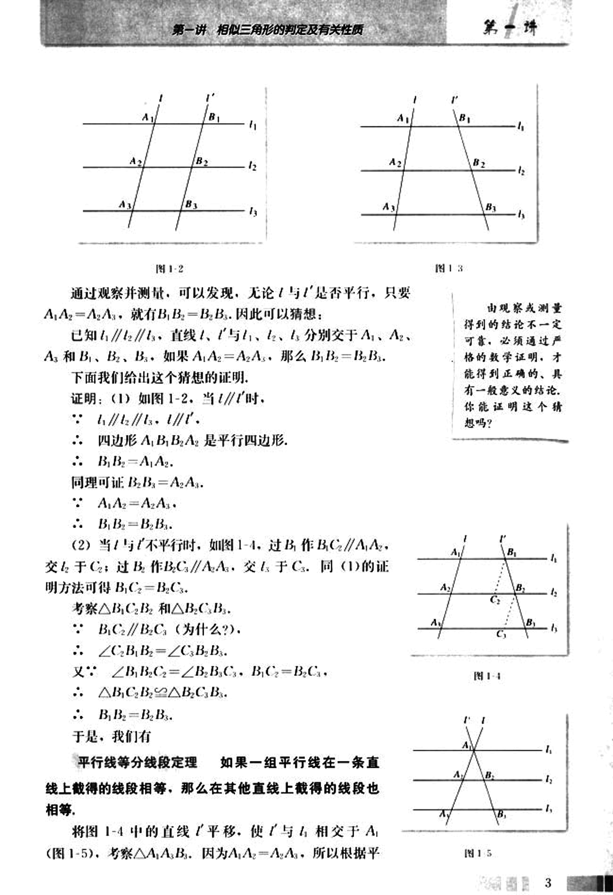
10 

# CHAPTER

普通高中课程标准实验教科书 数学(选修4-1) 几何证明选讲

行线等分线段定理可得$A_1B_2 = B_2B_3$。于是有

## 推论1

经过三角形一边的中点与另一边平行的直线必平分第三边。

考察图1-4中的梯形$A_1A_3B_3B_1$，你能发现什么结论？

## 推论2

经过梯形一腰的中点，且与底边平行的直线平分另一腰。

### 例1

如图1-6。要在一块钢板上的A、B两个小孔间再钻三个小孔，使这些小孔都在直线AB上，并且每两个相邻的小孔中心的距离相等，如果只有圆规和无刻度直尺，应当怎样确定小孔的中心位置？

作法：(1) 连结AB，过点A作适当射线AC；

(2) 在射线AC上，以适当长$r$为半径，用圆规顺次截取$AD = DE = EF = FG = r$；

(3) 连接GB；

(4) 过点F、E、D分别作GB的平行线FR、EQ、DP，分别交AB于点R、Q、P。

则P、Q、R就是中间三个小孔的中心位置。

你能说说上述作图方法的依据吗？

[图1-6](images/图1-6.png)


### 例2

如图1-7。D、E分别是$\triangle ABC$中BC边和AC边的中点，求证：$DE//BC$且$DE = \frac{1}{2}BC$。

这是已经学过的三角形中位线定理，下面我们用平行线等分线段定理证明它。

证明：过D作$DE'//BC$。根据推论1，E'为AC的中点，而E也是AC的中点，故E与E'重合，即$DE//BC$。

同样，过D作$DF//AC$，交BC于F，则$BF = FC$。

$\therefore DE//FC，DF//EC$。

[图1-7](images/图1-7.png)


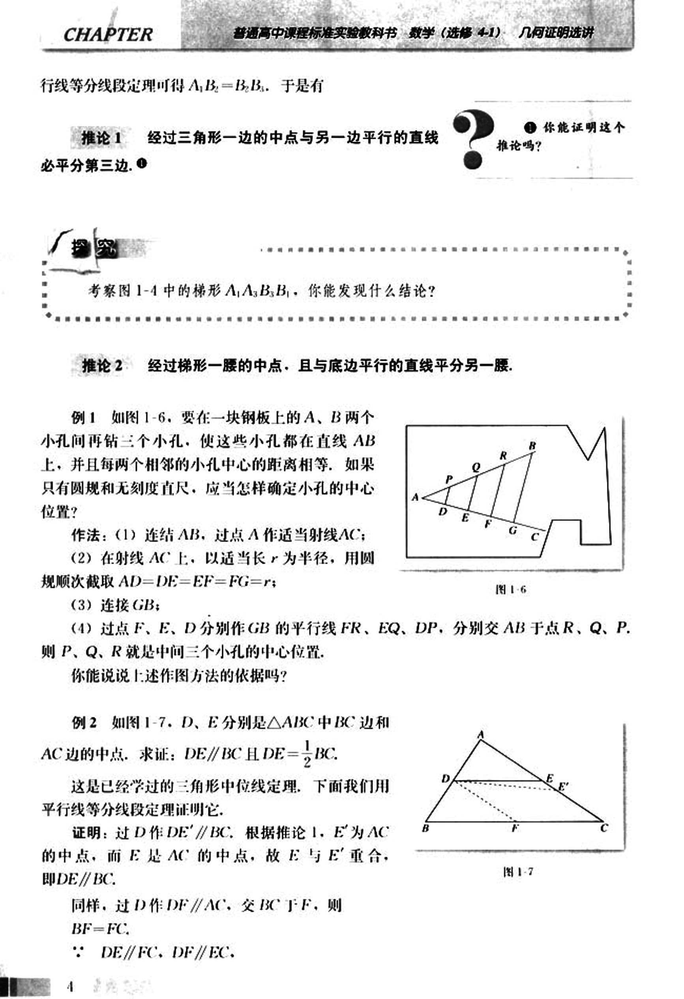
11 

# 第一讲 相似三角形的判定及有关性质

∴∴∴ 四边形 DFCE 是平行四边形.
DE=FC.
∴  $FC = \frac{1}{2}BC$.
∴  $DE = \frac{1}{2}BC$.

一个数学命题的发现往往来自于对特例的观察和概括，因为在特例中，其命题的各种信息会更加明显，容易被人们捕捉，从而更容易发现条件与结论的内在联系。将问题特殊化，通过观察特殊现象而得出一般结论的猜想，或者通过解决特例而获得解决一般问题的思想方法的启示，这是数学研究中常用的方法。请同学们回顾平行线等分线段定理的概括过程，从中体会从特殊到一般的思考方法。

1. 画一条 6 厘米长的线段，并把它 7 等分.
2. 已知：如图，M、N 分别是 ABCD 的 AB、CD 边的中点。CM 交 BD 于点 E，AN 交 BD 于点 F。请你探讨 BE、EF、FD 三条线段之间的关系，并给出证明。
3. 已知：如图，在梯形 ABCD 中，AD // BC，E、F 分别是 AB、DC 的中点，连接 EF，且 EF 交 BD 于 G，交 AC 于 H.
求证：$GH = \frac{1}{2}(BC - AD)$.

(第 2 题) [image1](images/image1.png)  (第 3 题) [image2](images/image2.png)

# 二 平行线分线段成比例定理

我们看到，平行线等分线段定理以“相邻两条平行线间的距离都相等”为条件。如果一组平行线中相邻两条平行线间距离不相等，又可以得出怎样的结论呢？

5

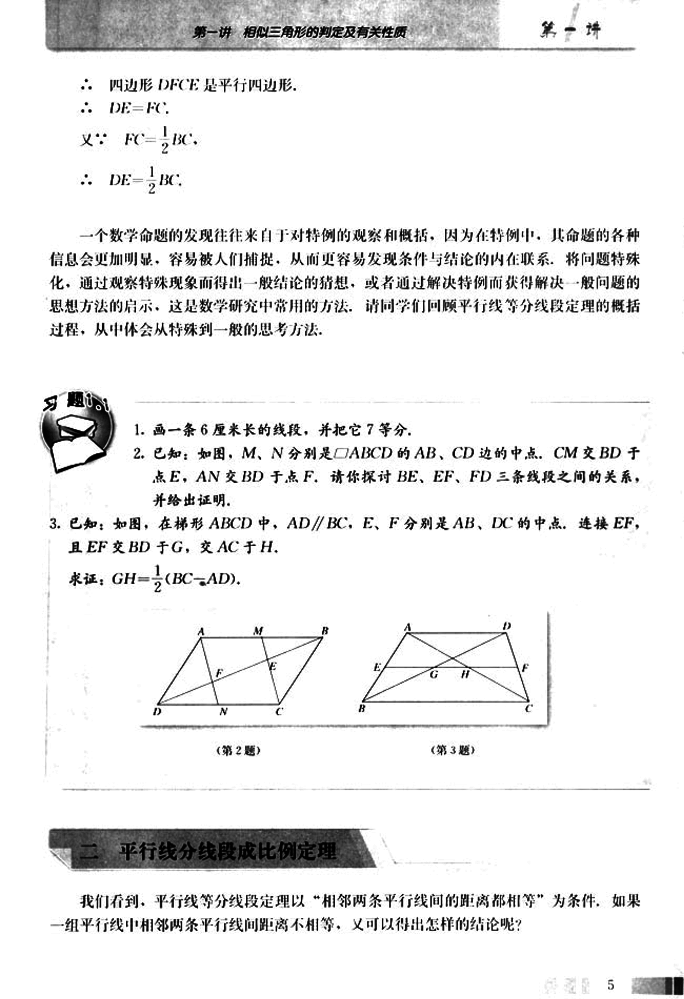
12 

# CHAPTER

普通高中课程标准实验教科书 数学(选修4-1) 几何证明选讲

## 观察

如图1-8,两条直线被一组平行线所截，当平行线间的距离不相等时，所截得的线段AB与BC、DE与EF之间有什么关系？

 


容易发现，AB≠BC；DE≠EF.

由以往学习平面几何的经验，当几何图形不全等时，可以考察它们是否相似，而相似是通过“对应边成比例，对应角相等”来表现的，由此得到启发，我们可以研究被一组平行线截得的线段是否有“对应边成比例”？

## 观察

在图1-8中，$\frac{AB}{BC}$与$\frac{DE}{EF}$相等吗？取$\frac{AB}{BC}=\frac{2}{3}$的特殊情形进行探讨。

我们可以将上述问题化归为平行线间距离相等的情形。

如图1-9，如果$\frac{AB}{BC}=\frac{2}{3}$，设线段AB的中点为P₁，线段BC的三等分点为P₂，P₃，这
时有

AP₁=P₁B=BP₂=P₂P₃=P₃C.

分别过点P₁，P₂，P₃作直线a₁，a₂，a₃平行于l，与l’的交点分别为Q₁，Q₂，Q₃.

由平行线等分线段定理可知：

DQ₁=Q₁E=EQ₂=Q₂Q₃=Q₃F.

∴ DE=DQ₁+Q₁E=2DQ₁.

EF=EQ₂+Q₂Q₃+Q₃F=3DQ₁.

6

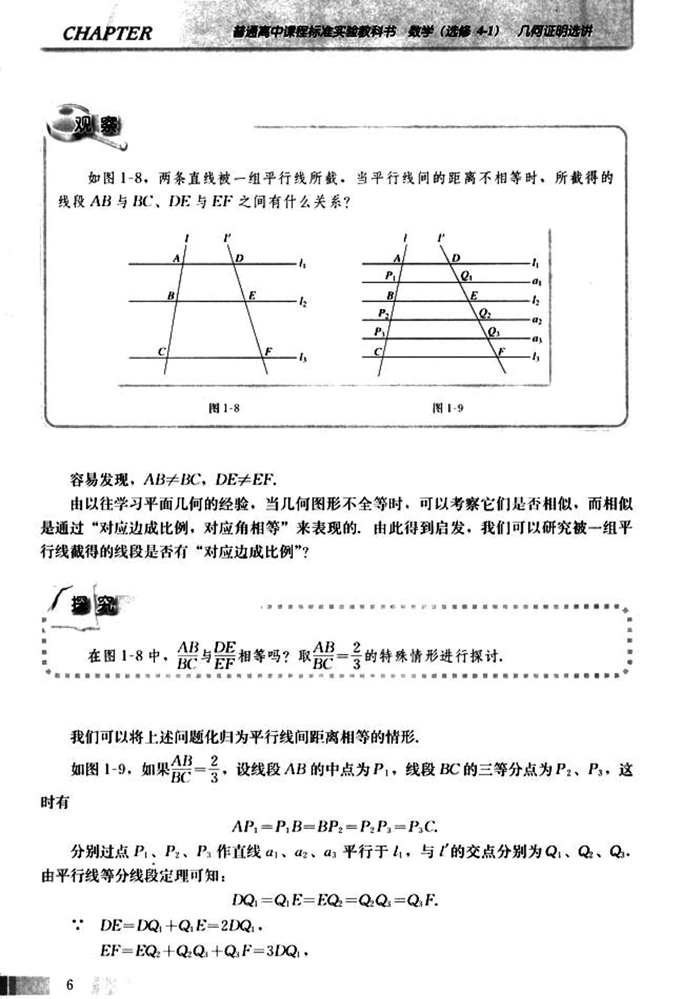
13 

# 第一讲 相似三角形的判定及有关性质

DE  2DQ  2
:  —— = —— = ——
EF  3DQ  3
AB  DE
:  —— = ——
BC  EF

当$\frac{AB}{BC}$为有理数时,即$\frac{AB}{BC} = \frac{m}{n}$(m, n是互质的正整数),AB是长度单位的m倍,BC是长度单位的n倍,依照上面的方法,可以证明(1)成立. 更一般地,可以证明,当$l_1//l_2//l_3$且$\frac{AB}{BC}$是实数时,(1)式也成立.

由(1)式和比例性质,可以得到

$\frac{AB}{BC} = \frac{DE}{EF}$, $\frac{AB}{AC} = \frac{DE}{DF}$, $\frac{BC}{AC} = \frac{EF}{DF}$

一般地,我们有

**平行线分线段成比例定理**  三条平行线截两条直线,所得的对应线段成比例.

观察图1-10和图1-11,它们是图1-8的特殊情形,即$l$与$l'$的交点分别在$l_1, l_2$上. 根据平行线分线段成比例定理,可得:

$\frac{AD}{AB} = \frac{AE}{AC}$

如果把图1-10、1-11中的直线$l_2$看成是平行于△ABC的BC边的直线,那么可以得到:

**推论** 平行于三角形一边的直线截其他两边(或两边的延长线)所得的对应线段成比例.

[图1-10](images/1-10.png) [图1-11](images/1-11.png)


**例1** 如图1-12, △ABC中, DE//BC, DF//AC, AE=4, EC=2, BC=8. 求BF和CF的长.

解:

: DE//BC.

$\frac{AD}{AB} = \frac{AE}{AC} = \frac{4}{6} = \frac{2}{3}$. (1)

: DF//AC.

7

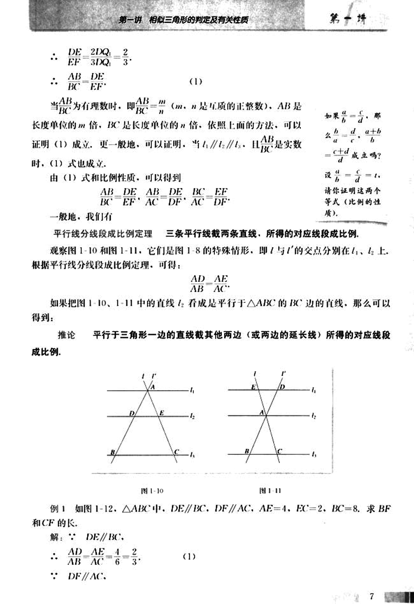
14 

# CHAPTER

$\because \frac{AD}{AB} = \frac{CF}{CB}$

(2)

由 (1) (2) 式得：

$\frac{2}{3} = \frac{CF}{8}$，即 $CF = \frac{16}{3}$

$\because BF = 8 - \frac{16}{3} = \frac{8}{3}$

例 2  如图 1-13，△ABC 中，DE//BC，EF//CD。求证：AD 是 AB 和 AF 的比例中项。

证明：在△ABC 中，$\because$ DE//BC，

$\therefore \frac{AB}{AD} = \frac{AC}{AE}$  (1)

在△ADC 中，$\because$ EF//CD，

$\therefore \frac{AD}{AF} = \frac{AC}{AE}$  (2)

由 (1) (2) 式得

$\frac{AB}{AD} = \frac{AD}{AF}$

$\therefore AD^2 = AB \cdot AF$，即 AD 是 AB 和 AF 的比例中项。

例 3 用平行于三角形一边且和其他两边相交的直线截三角形，所截得的三角形的三边与原三角形的三边对应成比例。

已知：如图 1-14，DE//BC，DE 分别交 AB、AC 于点 D、E。

求证：$\frac{AD}{AB} = \frac{AE}{AC} = \frac{DE}{BC}$

分析：由平行线分线段成比例定理的推论可直接得到 $\frac{AE}{AC} = \frac{DE}{BC}$，为了用平行线分线段成比例定理证明 $\frac{AE}{AC} = \frac{DE}{BC}$，需要构造一组平行线，使 AE、AC、DE、BC 成为由这组平行线截得的线段，只要过点 E 作 EF//AB，交 BC 于点 F，就可以达到上述目的。

证明：过点 E 作 EF//AB，交 BC 于点 F，

$\because$ DE//BC，EF//AB，

$\therefore \frac{AD}{AB} = \frac{AE}{AC} = \frac{BF}{BC} = \frac{AE}{AC}$

且四边形 DEFB 为平行四边形，

$\therefore$ DE = BF

$\therefore \frac{AE}{AC} = \frac{DE}{BC}$

8

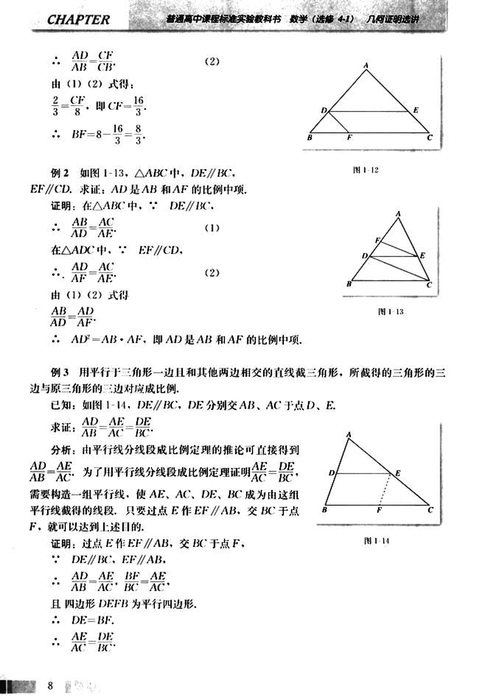
15 

# 第一讲 相似三角形的判定及有关性质

$\because \frac{AD}{AB} = \frac{AE}{AC} = \frac{DE}{BC}$

“平行线分线段成比例定理”是平面几何中的定理。一个自然的想法是，这个定理在空间中也成立吗？请你自己完成这个探究。

实际上，命题的推广可以有不同的方向。例如，在“平行线分线段成比例定理”中，如果将平行线改为平行平面，也可以探究相应命题是否成立。请完成下列探究。

如图1-15，直线 $l_1$、$l_2$ 被三个平行平面 $\alpha$、$\beta$、$\gamma$ 所截，直线 $l_1$ 与它们 的交点分别为 A、B、C；直线 $l_2$ 与它们 的交点分别为 D、E、F。$\frac{DE}{EF}$ 与 $\frac{AB}{BC}$ 相等吗？

[图1-15](images/图1-15.png)

1. 已知 AB、CD 为梯形 ABCD 的底，对角线 AC、BD 的交点为 O，且 AB=8，CD=6，BD=15。求 OB、OD 的长。

2. 如图，在△ABC 中，作平行于 BC 的直线交 AB 于 D，交 AC 于 E。如果 BE 和 CD 相交于 O，AO 和 DE 相交于 F，AO 的延长线和 BC 相交于 G。证明：

(1) $\frac{BG}{GC} = \frac{DF}{FE}$；

(2) BG=GC。

[第2题](images/第2题.png)  [第3题](images/第3题.png)

9

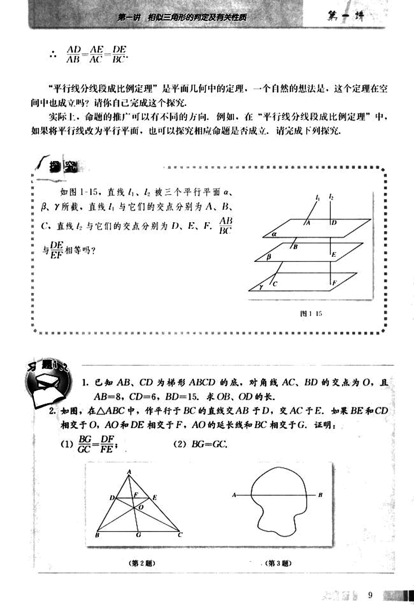
16 

# CHAPTER

三 相似三角形的判定及性质

## 1. 相似三角形的判定

先回顾初中已学的相似三角形知识.

**定义** 对应角相等，对应边成比例的两个三角形叫做相似三角形. 相似三角形对应边的比值叫做相似比（或相似系数）.

由于从定义出发判断两个三角形是否相似，需要考虑6个元素，即三组对应角是否分别相等，三组对应边是否分别成比例，显然比较麻烦，所以我们曾经给出过如下几个判定两个三角形相似的简单方法：

(1) 两角对应相等，两三角形相似；

(2) 两边对应成比例且夹角相等，两三角形相似；

(3) 三边对应成比例，两三角形相似.

下面对这些判定方法进行严格证明.

如图1-16，在△ABC中，D、E分别是AB、AC边上的点，且DE//BC. 由上一节的例3可知，△ADE和△ABC的三边对应成比例，又由DE // BC可得，∠ADE=∠B，∠AED=∠C，而∠A是公共角，因此△ADE∽△ABC.

[图1-16](images/图1-16.png)
[图1-17](images/图1-17.png)

10

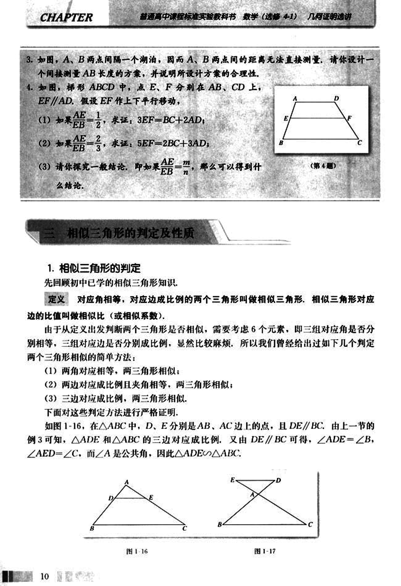
17 

# 第一讲 相似三角形的判定及有关性质

如果D、E交于BA、CA的延长线上,且DE//BC(图1-17),那么结论是否还成立?

对于图1-17的情形，同样可以证明△ADE∽△ABC. 这是判定两个三角形相似的一个定理，我们把它称为预备定理。

## 预备定理

平行于三角形一边的直线和其他两边（或两边的延长线）相交，所构成的三角形与原三角形相似。

下面从预备定理出发，看看能否得出一些新的结论。

可以发现，只要DE//BC，无论D、E在AB、AC边上的什么位置，都有△ADE∽△ABC. 如图1-18. 如果DE<sub>i</sub>//BC (i=1,2,…), 那么也有△ABC∽△AD<sub>i</sub>E<sub>i</sub>, (i=1, 2, …)。从运动变化的观点看，由于DE//BC，因此在D、E的变化过程中，△ADE的边长在改变，而角的大小始终不变。这说明，只要两个三角形的三个对应角相等，那么它们就相似。又由于三角形的内角和为180°，所以只要两个三角形中有两个对应角相等，那么第三个对应角一定相等。这样就有“两角对应相等，两三角形相似”。

一般地，我们有

## 判定定理1

对于任意两个三角形，如果一个三角形的两个角与另一个三角形的两个角对应相等，那么这两个三角形相似。简述为：两角对应相等，两三角形相似。

已知：如图1-19，在△ABC和△A'B'C'中，∠A=∠A'，∠B=∠B'.

求证：△ABC∽△A'B'C'.

证明：在△ABC的边AB（或AB的延长线）上，截取AD=A'B'，过点D作DE//BC，交AC于点E. 由预备定理得：

△ADE∽△ABC.

∠ADE=∠B, ∠B=∠B'.

∴∠ADE=∠B'.

∠A=∠A'. AD=A'B'.

∴△ADE≌△A'B'C'.

∴△ABC∽△A'B'C'.

例1  如图1-20，在△ABC中，AB=AC，D是AC边上一点，BD=BC，求证：BC<sup>2</sup>=AC·CD.

11

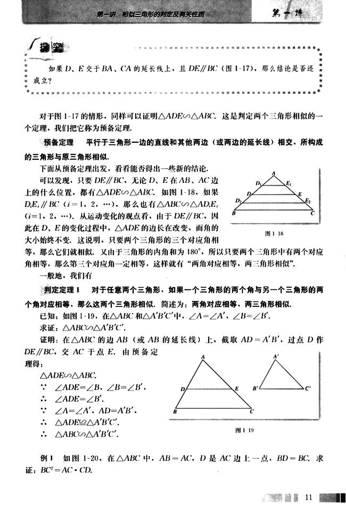
18 

# CHAPTER

普通高中课程标准实验教科书 数学(选修4-1) 几何证明选讲

分析：要证明 $BC^2 = AC \cdot CD$，即证明 $\frac{AC}{BC} = \frac{BC}{CD}$，只要证明 AC，BC 和 BC，CD 为一对相似三角形的两组对应边即可。为此，要证明△ABC 和△BDC 相似。

证明：∵△ABC 是等腰三角形，
∴∠A = 180° - 2∠C.
∵△BCD 也是等腰三角形，
∴∠DBC = 180° - 2∠C.
∴∠A = ∠DBC.
又∵∠C 是公共角，
∴△ABC ∽ △BDC.
∴$\frac{AC}{BC} = \frac{BC}{CD}$，即 $BC^2 = AC \cdot CD$.

[图1-20](images/1-20.png)

例2 如图 1-21，圆内接△ABC 的角平分线 CD 延长后交圆于一点 E.

求证：$\frac{EB}{EC} = \frac{DB}{CB}$

分析：要证 $\frac{EB}{EC} = \frac{DB}{CB}$，应考虑 EB，EC，DB，CB 这四条线段所在的两个三角形是否相似。EB，DB 在△EBD 中，EC，CB 在△ECB 中，因此可以考虑证明△EBD 与△ECB 相似。

证明：由已知条件，可得∠ACE = ∠BCE.
∴∠ACE 与∠ABE 是同弧上的圆周角，
∴∠ACE = ∠ABE.
∴∠BCE = ∠ABE.
又∵∠BED = ∠CEB,
∴△EBD ∽ △ECB.
∴$\frac{EB}{EC} = \frac{DB}{CB}$.

[图1-21](images/1-21.png)

沿着“从运动变化中找不变性”的思路，可以发现，在图 1-18 中，对于 DE 的任意一个位置，∠A 是△ABC 和△ADE 的公共角，而且 $\frac{AD}{AC} = \frac{AE}{AB}$，即两边对应成比例，夹角相等。满足这两个条件时，两个三角形是否一定相似？你能否依照判定定理 1 的证明思路证明它？

12

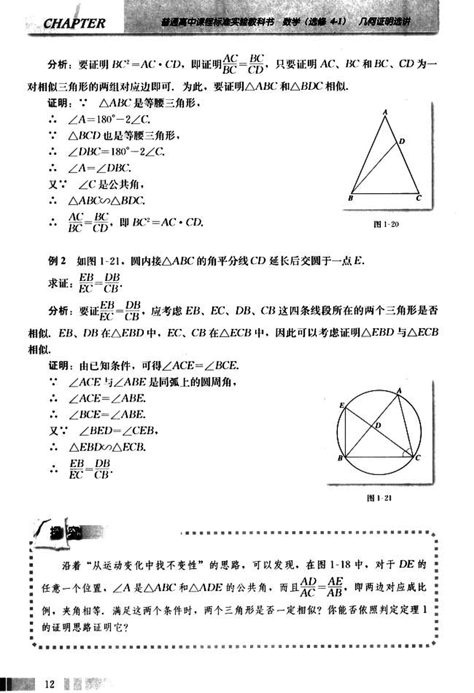
19 

# 第一讲 相似三角形的判定及有关性质

## 判定定理2

对于任意两个三角形，如果一个三角形的两边和另一个三角形的两边对应成比例，并且夹角相等，那么这两个三角形相似。简述为：两边对应成比例且夹角相等，两三角形相似。

已知：如图1-22，在△ABC和△A'B'C'中，∠A=∠A'，$\frac{A'B'}{AB}=\frac{A'C'}{AC}$。

求证：△ABC∽△A'B'C'。

分析：如图1-22，在△ABC的边AB，AC（或它们的延长线）上截取AD=A'B'，AE=A'C'，连接DE。因为∠A=∠A'，所以△ADE≅△A'B'C'。这样，我们可以通过证明△ABC∽△ADE而证明△ABC∽△A'B'C'。由预备定理可知，只要证明DE//BC，就可以得到△ABC∽△ADE。

由条件$\frac{A'B'}{AB}=\frac{A'C'}{AC}$以及AD = A'B'，AE=A'C'，有$\frac{AD}{AB}=\frac{AE}{AC}$。

于是，如果能从$\frac{AD}{AB}=\frac{AE}{AC}$推出DE//BC，那么就能得到判定定理2的证明。

由平行线分线段成比例定理的推论可知，当DE//BC时，有$\frac{AD}{AB}=\frac{AE}{AC}$。因而我们猜想，这个推论的逆命题可能是成立的。这样，我们需要先证明下面的命题。

## 引理

如果一条直线截三角形的两边（或两边的延长线）所得的对应线段成比例，那么这条直线平行于三角形的第三边。

已知：如图1-23，△ABC中，点D，E分别在边AB，AC上，且$\frac{AD}{AB}=\frac{AE}{AC}$。

求证：DE//BC。

证明：过D作直线DE'//BC，交AC于点E'，则$\frac{AD}{AB}=\frac{AE'}{AC}$（为什么？）

$\because \frac{AD}{AB}=\frac{AE}{AC}$

$\because \frac{AD}{AB}=\frac{AE'}{AC}$

$\therefore \frac{AE}{AC}=\frac{AE'}{AC}$

$\therefore AE=AE'$

因此点E与点E'重合，即直线DE'与直线DE重合，所以DE//BC。

请同学们写出判定定理2的证明过程。

在探究数学问题的过程中，应当做到“步步有据”。有时，为了寻找某个步骤的推理依据，往往会产生一个原问题的辅助问题，数学家把这种辅助问题称为引理。显然，引理的


[图1-22](images/1-22.png)
[图1-23](images/1-23.png)

13

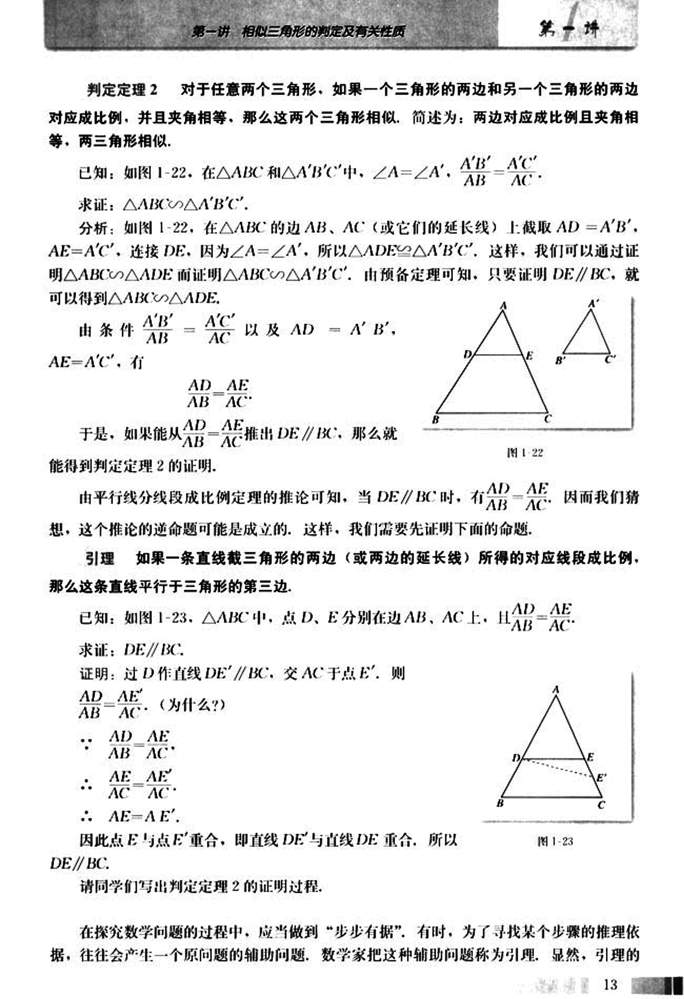
20 

# CHAPTER

证明为解决原问题奠定了基础。

当直接证明一个问题比较困难时，往往采用间接的方法。上述引理的证明采用的“同一法”就是一种间接证明方法，应用同一法证明问题时，往往先作出一个满足命题结论的图形，然后证明图形符合命题已知条件，确定所作图形与题设条件所指的图形相同，从而证明命题成立。

判定定理2的证明可以采用判定定理1的思路，即在AB上截取AD=A'B'，过D作DE//BC，交AC于点E……这样就可以绕开引理，殊途同归，你能给出证明吗？

## 例3

如图1-24，在△ABC内任取一点D.连接AD和BD.点E在△ABC外，∠EBC=∠ABD，∠ECB=∠DAB.求证：△DBE∽△ABC.

证明：在△DBE与△ABC中，∠DBE = ∠EBC + ∠CBD，∠ABC = ∠ABD +∠DBC.

∠ABD=∠EBC，
∴∠DBE=∠ABC.  (1)

在△ABD和△CBE中，由已知条件有
∠EBC=∠DBA，∠ECB=∠DAB，
∴△ABD∽△CBE.

$\frac{BE}{BC} = \frac{BD}{AB}$

即$\frac{BE}{BC} = \frac{BD}{AB}$   (2)

综合(1)(2)式，由判定定理2知
△DBE∽△ABC.

[图1-24](images/1-24.png)

研究两个三角形相似的判定问题，除了上面的方法外，还可以通过与三角形全等的判定进行类比，得出有关猜想，例如，类比“三边对应相等，两三角形全等”，可以得猜想：“三边对应成比例，两三角形全等”。

## 判定定理3

对于任意两个三角形，如果一个三角形的三条边和另一个三角形的三条边对应成比例，那么这两个三角形相似，简述为：三边对应成比例，两三角形相似。

已知：如图1-25，在△ABC和△A'B'C'中，$\frac{A'B'}{AB} = \frac{B'C'}{BC} = \frac{C'A'}{CA}$

求证：△A'B'C'∽△ABC.

证明：在△ABC的边AB(或延长线)上截取AD=A'B'，过点D作DE//BC，交AC于点E.于是可得


14

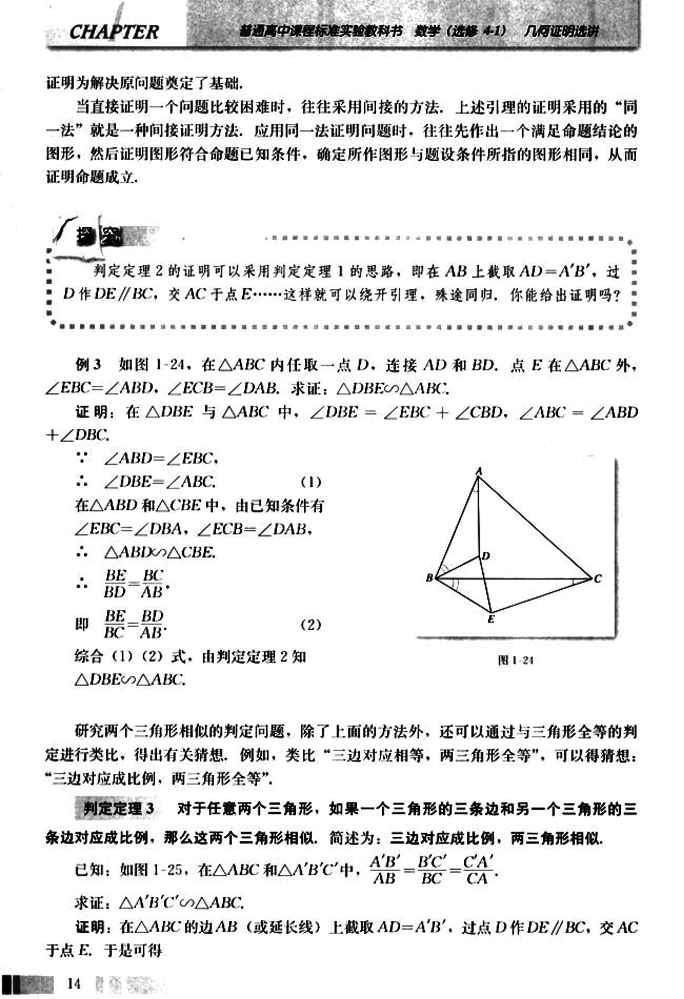
21 

# 第一讲 相似三角形的判定及有关性质

AD = A'B'
AD  A'B'
AB  AB

又∵ A'B'  B'C'  C'A'
       AB   BC    CA

∴ DE = B'C', EA = C'A'
BC = BC, CA = CA

∴ DE = B'C', EA = C'A'
∴ △ADE ≌ △A'B'C'
∴ △A'B'C' ∽ △ABC

例4 如图 1-26，已知 D、E、F 分别是 △ABC 三边 BC、CA、AB 的中点，求证：△DEF ∽ △ABC。

证明：线段 EF、FD、DE 都是 △ABC 的中位线，
EF = 1/2 BC，FD = 1/2 CA，DE = 1/2 AB

∴ EF / BC = FD / CA = DE / AB = 1/2

∴ △DEF 与 △ABC 的三边对应成比例。
∴ △DEF ∽ △ABC


[图1-25](images/1-25.png)
[图1-26](images/1-26.png)

以上我们得到了三个判定三角形相似的定理。如果要判断两个直角三角形相似，条件可以怎样简化？

我们知道，与一般三角形相比，直角三角形有一个角为直角，三边长满足勾股定理等特殊的边角关系，这种关系可以使判定两个直角三角形相似的条件得到简化，例如，我们有

**定理**

(1) 如果两个直角三角形有一个锐角对应相等，那么它们相似；

(2) 如果两个直角三角形的两条直角边对应成比例，那么它们相似；

此外，与直角三角形全等的判定定理类比，可引出直角三角形相似的另一个判定定理。

**定理**  如果一个直角三角形的斜边和一条直角边与另一个三角形的斜边和一条直角边对应成比例，那么这两个直角三角形相似。

15

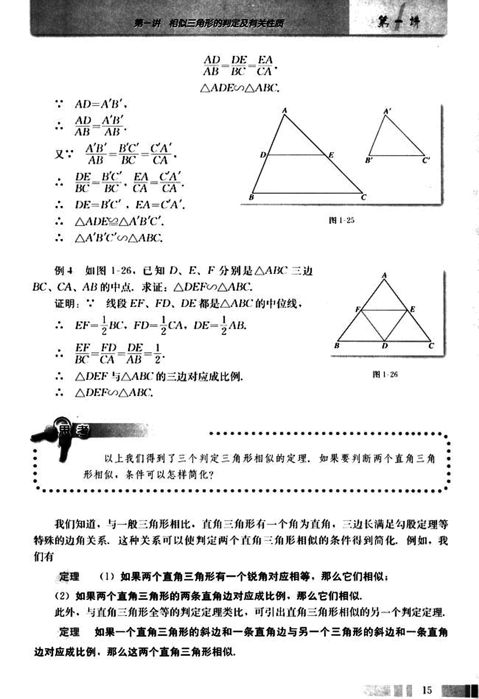
22 

# CHAPTER

普通高中课程标准实验教科书 数学(选修4-1) 几何证明选讲

已知:如图1-27,Rt△ABC与Rt△A'B'C'
AB AC
中,∠C=∠C'=90°,  $\frac{AB}{A'B'} = \frac{AC}{A'C'}$。
求证:Rt△ABC∽Rt△A'B'C'.

证明:由已知,可设
$\frac{AB}{A'B'} = \frac{AC}{A'C'} = k$。
那么
AB = kA'B', AC = kA'C'.
∴ BC² = AB² - AC²
= k²(A'B'² - A'C'²)
= k²B'C'².
∴ BC = kB'C'.
∴ $\frac{AB}{A'B'} = \frac{AC}{A'C'} = \frac{BC}{B'C'} = k$。
由判定定理3得 Rt△ABC∽Rt△A'B'C'.

例5 如图1-28,已知AD、BE分别是△ABC中BC边和AC边上的高，H是AD、BE的交点。

求证：(1) AD·BC = BE·AC;  (2) AH·HD = BH·HE.

证明：(1) 在Rt△ADC和Rt△BEC中，
∠ACD = ∠BCE,
∴ Rt△ADC∽Rt△BEC.
∴ $\frac{AD}{BE} = \frac{AC}{BC}$，即AD·BC = BE·AC.

(2) 在Rt△AHE和Rt△BHD中，
∠AHE = ∠BHD.
∴ △AHE∽△BHD.
∴ $\frac{AH}{BH} = \frac{HE}{HD}$，即AH·HD = BH·HE.


2. 相似三角形的性质

我们知道，相似三角形的判定，讨论的是具备哪些条件，才能有两个三角形相似。相似三角形的性质讨论的则是在两个三角形相似的条件下，可以得出哪些结论。一般地，我们可以在两个三角形相似的条件下，考察与三角形相关的元素，如两个三角形的高、周长、角平分线、中线、面积等所具有的关系。

[图1-27](images/1-27.png)
[图1-28](images/1-28.png)

16

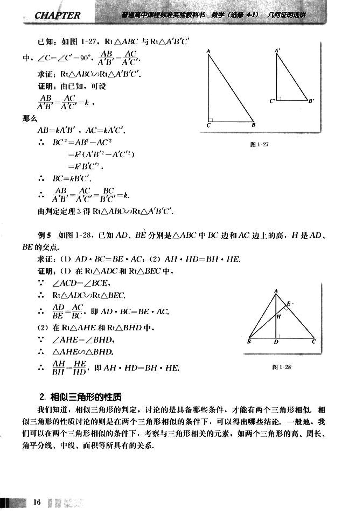
23 

# 第一讲 相似三角形的判定及有关性质

## 信息技术应用

利用计算机任意作两个相似三角形，测出相似比，分别测量它们的高、周长、面积…………………分别计算两个高之比、周长之比、面积之比…………………并观察它们与相似比的关系，按照相同比例放大这两个三角形，相似比的关系有怎样的变化？

可以发现下列相似三角形的性质定理：

(1) 相似三角形对应高的比、对应中线的比和对应角平分线的比都等于相似比；
(2) 相似三角形周长的比等于相似比；
(3) 相似三角形面积的比等于相似比的平方。

下面给出证明。

证明：(1) 如图1-29. △ABC∽△A'B'C'，设相似比为k、AD、A'D'分别是△ABC和△A'B'C'对应边上的高。

∵△ABC∽△A'B'C'
∴∠B=∠B'
又∵∠ADB=∠A'D'B'=90°
∴△ABD∽△A'B'D'
$\frac{AD}{A'D'} = \frac{AB}{A'B'} = k$

其余两个结论请同学们自己给出证明。

(2) ∵△ABC∽△A'B'C'
∴$\frac{AB}{A'B'} = \frac{BC}{B'C'} = \frac{CA}{C'A'} = k$
∴AB=kA'B'，BC=kB'C'，CA=kC'A'
∴$\frac{AB+BC+CA}{A'B'+B'C'+C'A'} = \frac{k(A'B'+B'C'+C'A')}{A'B'+B'C'+C'A'} = k$

(3) $\frac{S_{\triangle ABC}}{S_{\triangle A'B'C'}} = \frac{\frac{1}{2}BC \cdot AD}{\frac{1}{2}B'C' \cdot A'D'} = \frac{BC}{B'C'} \cdot \frac{AD}{A'D'} = k \cdot k = k^2$

[图1-29](images/1-29.png)

例6 如图1-30. 锐角三角形ABC是一块钢板的余料，边BC=24cm，BC边上的高AD=12cm，要把它加工成正方形零件，使正方形的一边在BC上，其余两个顶点分别在AB、AC上，求这个正方形零件的边长。

解：设正方形PQMN为加工成的正方形零件，边QM在BC上，顶点P、N分别在


17

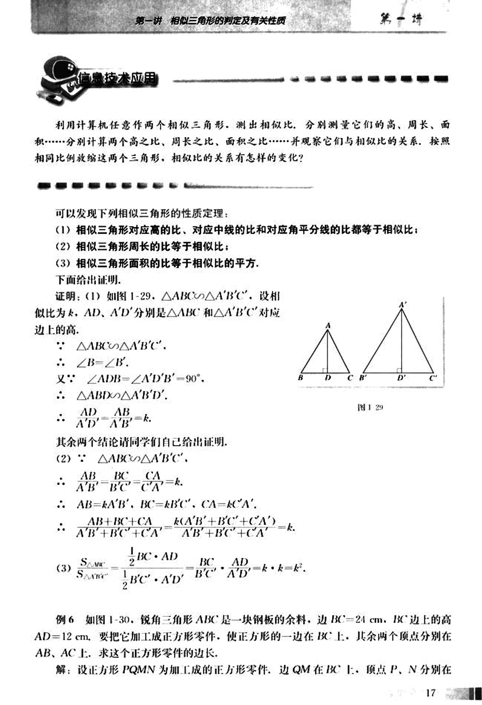
24 

# CHAPTER

普通高中课程标准实验教科书 数学(选修4-1) 几何证明选讲

AB、AC上.△ABC的高与边PN相交于点E.设正方形的边长为x cm.

:: PN//BC.
:: △APN∽△ABC.
:: $\frac{AE}{AD} = \frac{PN}{BC}$
:: $\frac{12-x}{12} = \frac{x}{24}$

解得 x=8(cm).

## 思考

由相似三角形的性质定理可知,相似三角形的高、中线、内角平分线、周长、面积等要素都与相似比有关,拓宽思路,考虑与三角形有关但不在三角形內的其他元素,这些元素是否与三角形的相似比有联系呢?你想到了哪些元素?

## 问题1

两个相似三角形的外接圆的直径比、周长比、面积比与相似比有什么关系?

### 探究:

如图1-31 (1)(2), △ABC∽△A'B'C'. AD、A'D'分别是△ABC和△A'B'C'外接圆的直径,连接BD、B'D',则∠ABD=∠A'B'D'=90°.

:: △ABC∽△A'B'C',
:: ∠C=∠C'. 而∠D=∠C, ∠D'=∠C'.
:: ∠D=∠D'.
:: Rt△ABD∽Rt△A'B'D'.
:: $\frac{AD}{A'D'} = \frac{AB}{A'B'} = k.$
:: ⊙O的周长=$2\pi \cdot \frac{AD}{2} = \pi \cdot AD.$
:: ⊙O'的周长=$2\pi \cdot \frac{A'D'}{2} = \pi \cdot A'D'.$
:: ⊙O的周长:⊙O'的周长=$\frac{AD}{A'D'} = k.$
又:: ⊙O的面积=$\pi (\frac{AD}{2})^2$,
:: ⊙O'的面积=$\pi (\frac{A'D'}{2})^2$.
:: ⊙O的面积:⊙O'的面积=$\frac{AD^2}{A'D'^2} = k^2.$

于是可得结论:

相似三角形外接圆的直径比、周长比等于相似比,外接圆的面积比等于相似比的平方.

18


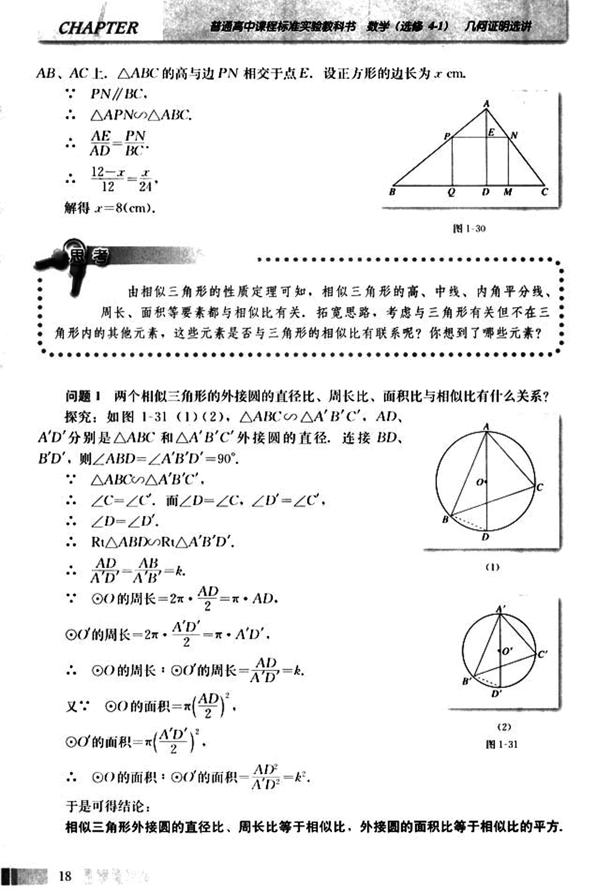
25 

# 第一讲 相似三角形的判定及有关性质

## 问题2

两个相似三角形的内切圆的直径比、周长比、面积比与相似比有什么关系？

请同学们自己探究。


## 习题

1. 如果一个圆过△ABC的顶点B和C，并且分别交AB、AC于点D和点E。
求证：$\frac{AD}{AC} = \frac{AE}{AB}$

2. 已知E是内接四边形ABCD的对角线BD上的一点，并且∠BAE=∠CAD。
求证：(1) AB · CD = AC · BE；(2) AD · BC = AC · ED。

3. 已知：在△ABC和△A'B'C'中，∠A=∠A'，AB=a，AC=b，A'B'=a'。当A'C'为多少(用a、b、a'表示)，△ABC∽△A'B'C'?

4. 已知△ABC，求作△A'B'C'，使它与△ABC相似，并使△ABC与△A'B'C'的相似比为2：3。

5. 如图[图5](images/图5.png)，线段EF平行于平行四边形ABCD的一边AD，BE与CF交于一点G，AE与DF交于一点H。求证：GH//AB。

6. 如图[图6](images/图6.png)，已知：DE // AB，EF // BC。求证：△DEF ∽△ABC。

7. 如图[图7](images/图7.png)，△ABC是钝角三角形，AD、BE、CF分别是△ABC的三条高，求证：AD · BC = BE · AC。

8. 如图[图8](images/图8.png)，要测量树AB的高，可以利用相似三角形的知识，请你设计几种测量方案，并说明每种方案的理由。

---
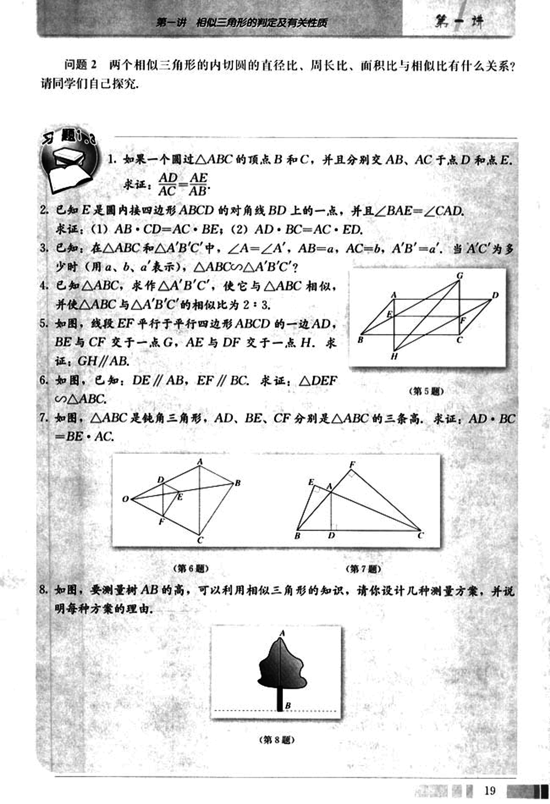
26 

# CHAPTER

9. 证明：相似三角形对应中线的比，对应角平分线的比都等于相似比。

10. 如图，平行四边形ABCD中，AE：EB=1：2，求△AEF与△CDF的周长比。如果△AEF的面积等于6 cm²，求△CDF的面积。


11. 探究本节中的问题2。由问题1、问题2的启示，你还能提出其他问题吗？

# 四 直角三角形的射影定理

在太阳光的照射下，物体总会在地面上留下阴影，这就是射影的概念。下面讨论垂直于某直线的光线，把一个点或一条线段投射到该直线上的射影。

从一点向一直线所引垂线的垂足，叫做这个点在这条直线上正射影。在图1-32中，AA'⊥MN，垂足A'是点A在直线MN上的正射影。如果点A是MN上的点，那么A在MN上的正射影就是它本身。

一条线段在直线上的正射影，是指线段的两个端点在这条直线上的正射影间的线段。

图1-33中，线段AB的两个端点A和B在直线MN上的正射影分别是A'和B'，线段A'B'是线段AB在直线MN上的正射影。

点和线段的正射影简称为射影。

      

如图1-34，△ABC是直角三角形，CD为斜边AB上的高。在这个图形中，由于线段AD与CD、BD与CD、BC与AC等相互垂直，因此可以从射影的角度来考察它们的关系。你能发现这些线段之间的某些关系吗？

20

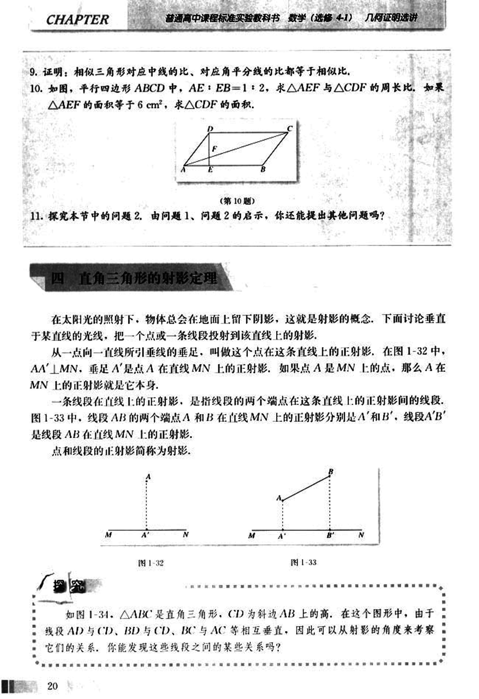
27 

# 第一讲 相似三角形的判定及有关性质

实际上，有些关系是非常明显的。例如，由△BDX，为直角三角形可知BD<BC；因为$S_{△ABC} = \frac{1}{2}AC \cdot BC = CD \cdot AB$；等等。

考察Rt△ACD和Rt△CBD。

$\because \angle ACD = 90^\circ - \angle BCD$, $\angle B = 90^\circ - \angle BCD$。

$\therefore \angle B = \angle ACD$。

$\therefore \triangle ACD \sim \triangle CBD$。

$\therefore \frac{AD}{CD} = \frac{CD}{BD}$。

即$CD^2 = AD \cdot BD$。(1)

考察Rt△BDC和Rt△BCA。

$\because \angle B$是公共角。

$\therefore \triangle BDC \sim \triangle BCA$。

$\therefore \frac{BD}{BC} = \frac{BC}{AB}$。

即$BC^2 = BD \cdot AB$。(2)

同理，由△CDA～△BCA，有

$AC^2 = AD \cdot AB$。(3)

(1)(2)(3)式反映了直角三角形两直角边在斜边上的射影与其他线段之间的关系，因而把这三个等式统称为直角三角形的射影定理。

## 射影定理

直角三角形斜边上的高是两直角边在斜边上射影的比例中项；两直角边分别是它们在斜边上射影与斜边的比例中项。


**例1** 如图1-35，圆上一点C在直径AB上的射影为D，AD=2，DB=8，求CD，AC和BC的长。

解：$\because \angle ACB$是半圆上的圆周角，

$\therefore \angle ACB = 90^\circ$，即△ABC是直角三角形。

由射影定理可得

$CD^2 = AD \cdot BD = 2 \times 8 = 16$。解得CD=4；

$AC^2 = AD \cdot AB = 2 \times 10 = 20$。解得$AC = 2\sqrt{5}$；

$BC^2 = BD \cdot AB = 8 \times 10 = 80$。解得$BC = 4\sqrt{5}$。

**例2** 如图1-36，△ABC中，顶点C在AB边上的射影为D，且$CD^2 = AD \cdot DB$，求证：△ABC是直角三角形。

证明：在△CDA和△BDC中，

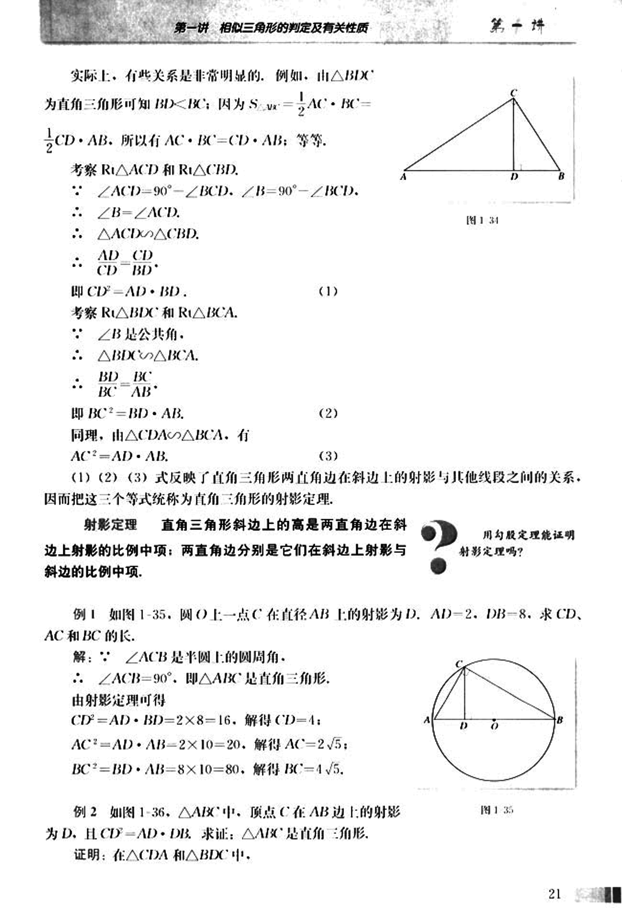
28 

# CHAPTER  普通高中课程标准实验教科书 数学(选修4-1) 几何证明选讲

∵点C在AB上的射影为D.
∵CD⊥AB.
∴∠CDA=∠BDC=90°.
又∵$CD^2=AD\cdot DB$,
AD:CD=CD:DB.
∴△CDA∽△BDC.
∴∠CAD=∠BCD.
在△ACD中,
∴∠CAD+∠ACD=90°,
∴∠BCD+∠ACD=90°.
∴∠BCD+∠ACD=∠ACB=90°.
∴△ABC是直角三角形.

[图1-36](images/图1-36.png)

1. 在△ABC中，∠C=90°，CD是斜边AB上的高，已知CD=60，AD=25，求BD，AB，AC，BC的长。

2. 如图，△ABC中，∠BAC=60°，CD⊥AB，求证：BD=AB-$\frac{1}{2}$AC.

[第2题](images/第2题.png)  [第3题](images/第3题.png)

3. 如图，已知线段a，b，求作线段a和b的比例中项。


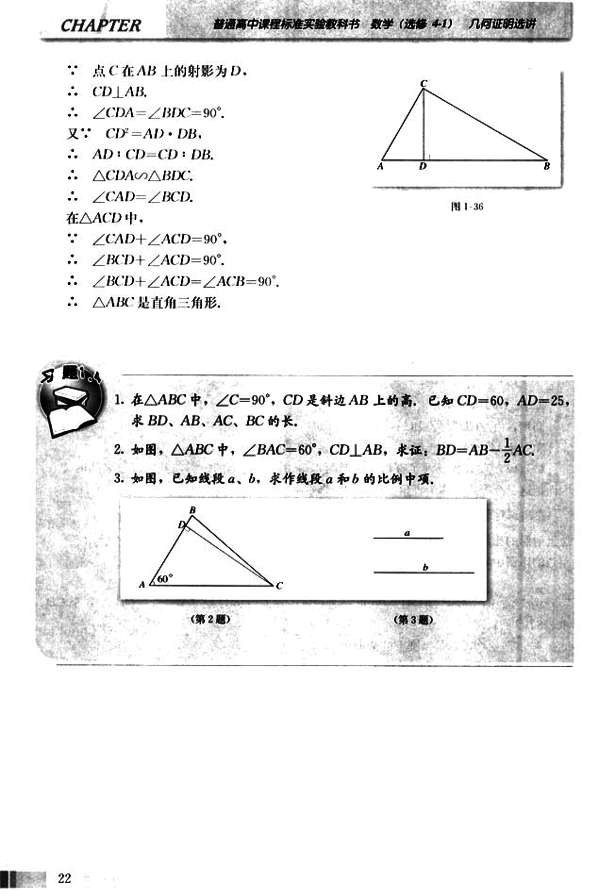
29 

# 第一讲 相似三角形的判定及有关性质

## 第一讲 小结

### 1. 知识结构

本讲主要证明了相似三角形的判定定理，为了证明这些定理，我们先引入了预备定理，这是证明三个判定定理的基础。但是，预备定理本身并不是问题研究的起点，它的证明需要平行线分线段成比例定理和相似三角形的定义，而要证明平行线分线段成比例定理，又要追溯到平行线等分线段定理，这样就构成了本讲内容的逻辑体系。另一方面，作为相似三角形判定定理的特例和应用，推出了直角三角形相似的判定定理和直角三角形的射影定理，从而使逻辑体系进一步地发展、充实和完善。

本讲的知识结构图如下：

```
平行线等分线段定理 → 平行线分线段成比例定理 → 推论
                                                                    ↘判定定理3
                                                                     
推论1     推论2                                                   
                                                                     ↘判定定理2 → 引理
相似三角形的概念 → 预备定理 →                                     
                                                                     
                                                                     ↘判定定理1
                                                                       
                                                        勾股定理 → 直角三角形相似判定定理
                                                                        
                                                                        射影概念 → 射影定理

```


### 2. 数学思想方法

从特殊到一般的思考方法。

特殊性蕴含于一般性之中，一般性的规律往往可以通过特殊性表现出来。对特殊性问题的考察，会使我们获得直观和简化的信息，并可能从中发现一般规律，发现解决问题的方法。当然，特殊性不能代替一般性，因为特殊性往往会缩小所研究问题的范围。因此在研究数学问题时，可以通过考察特殊性问题获得一般规律的猜想，并从中得到证明一般规律的思想方法的启发；然后由特殊过渡到一般，对一般性结论作出严格证明。

化归思想方法：

在研究问题时，常常通过一定的逻辑推理，将困难的、不熟悉的问题转化为容易的、熟悉的问题，这是解决数学问题不可缺少的思想方法。同学们已经熟悉的恒等变形、换元法、数形结合、参数法等，都是具体的化归方法。本讲中，相似三角形判定定理的证明采用了化归为预备定理的方法。

23

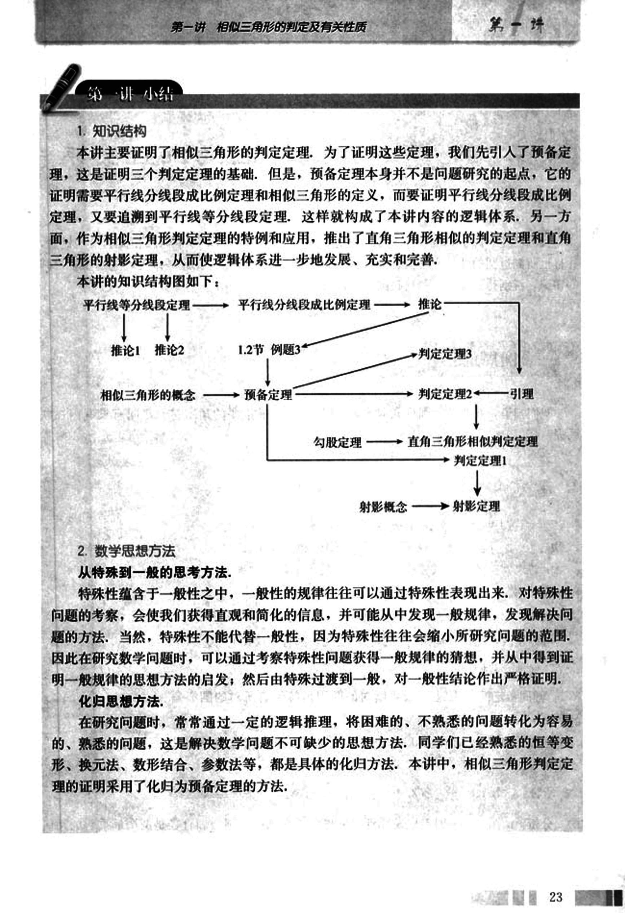
30 

# 第二讲 直线与圆的位置关系

我们已经掌握了圆的一些知识，知道了圆的结构特点，学习了与圆相关的一些概念，并且也研究过圆的弦、圆心角、圆周角、切线等性质，本讲将在此基础上，进一步学习圆的知识，特别是要证明一些反映圆与直线关系的重要定理。

## 圆周角定理

我们知道，圆心角和圆周角是与圆相关的两个最重要的角，它们之间有没有内在联系呢？

在⊙O中作一个顶点为A的圆周角∠BAC，连接OB、OC，得圆心角∠BOC，度量∠BAC和∠BOC的度数，它们之间有什么关系？改变圆周角的大小，这种关系会改变吗？

可以发现，无论圆周角的大小怎样改变，都有∠BAC = $\frac{1}{2}$∠BOC。

一般地，我们有

**圆周角定理**  圆上一条弧所对的圆周角等于它所对的圆心角的一半。

已知：如图2-1，在⊙O中，$\stackrel{\frown}{BC}$所对的圆周角和圆心角分别是∠BAC、∠BOC。

求证：∠BAC = $\frac{1}{2}$∠BOC。

分析：从图2-1一时难以发现证明的思路，在圆中，圆心和直径是两个最重要的几何元素，利用直径，先考察一个特殊位置，即圆周角的一边是直径，如图2-2(1)，圆周角∠BAC是等腰三角形AOC的底角，圆心角∠BOC是等腰三角形AOC的外角，利用“三


24

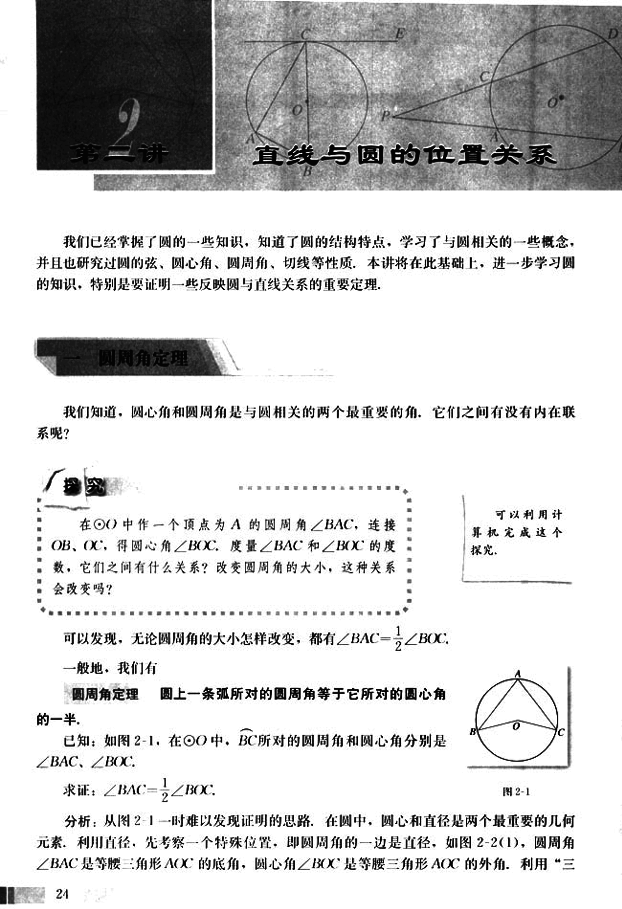
31 

# 第二讲 直线与圆的位置关系

角形的外角等于不相邻两内角的和”以及等腰三角形的性质，可以得到结论成立。
以直径为分界线，可以得到另外两类圆周角及相应的圆心角，如图2-2(2)(3)所示。
只要能将它们化归为(1)的情形，问题就能解决。


证明：分三种情况讨论，

(1)如图2-2(1)，圆心O在∠BAC的一条边上：

OA=OC.
∴∠C=∠BAC，
∴∠BOC=∠BAC+∠C，
∴∠BAC=$\frac{1}{2}$∠BOC.

(2)如图2-2(2)，圆心O在∠BAC的内部，作直径AD，利用(1)的结果，有
∠BAD=$\frac{1}{2}$∠BOD，∠DAC=$\frac{1}{2}$∠DOC.
∴∠BAD+∠DAC=$\frac{1}{2}$(∠BOD+∠DOC)，即
∠BAC=$\frac{1}{2}$∠BOC.

(3)如图2-2(3)，圆心O在∠BAC的外部，作直径AD，利用(1)的结果可得
∠DAB=$\frac{1}{2}$∠DOB，∠DAC=$\frac{1}{2}$∠DOC.
∴∠DAC-∠DAB=$\frac{1}{2}$(∠DOC-∠DOB)，即∠BAC=$\frac{1}{2}$∠BOC.

上面的证明考虑了圆周角的三类情形，因为圆周角与圆的任意位置关系都包含在这三类情形中，分三类情形讨论就覆盖了所有可能的位置关系，使证明具有一般性，这种依据问题的特点进行分类讨论的方法，是数学中常用的方法。

我们知道，一个周角是360°，把圆周等分成360份，每一份叫做1°的弧，由此，“α”的圆心角所对的弧是“α”的弧；反之，“α”的弧所对的圆心角的度数是“α”，从而有：

**圆心角定理**  圆心角的度数等于它所对弧的度数。

在同圆或等圆中，相等的弧所对的圆心角相等，因此，由圆周角定理可以直接得到：

25

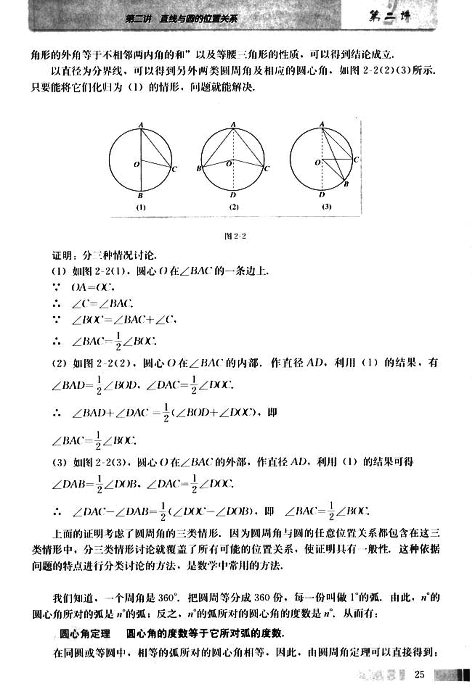
32 

# CHAPTER 几何证明选讲

## 推论1

同弧或等弧所对的圆周角相等；同圆或等圆中，相等的圆周角所对的弧也相等。

## 推论2

半圆（或直径）所对的圆周角是直角；90°的圆周角所对的弦是直径。

**例1** 如图2-3. AD是△ABC的高，AE是△ABC的外接圆直径，求证：AB⋅AC=AE⋅AD.

证明：连接BE.

∵∠ADC=∠ABE=90°，∠C=∠E，

∴△ADC∽△ABE.

∴$\frac{AC}{AE}$=$\frac{AD}{AB}$

∴AB⋅AC=AE⋅AD.

[图2-3](images/2-3.png)

**例2** 如图2-4，AB与CD相交于圆内一点P. 求证：$\overset{\frown}{AD}$的度数与$\overset{\frown}{BC}$的度数和的一半等于∠APD的度数.

分析：由于∠APD既不是圆心角，也不是圆周角，为此我们需要构造一个与它相等的圆心角或圆周角，以便利用定理。

证明：如图2-4，过点C作CE//AB交圆于E，则有

∠APD=∠C.

∵AE=BC. (为什么？)

∴DAE=DA+AE=AD+BC.

又∵∠C的度数等于∠DAE的度数的一半，

∴∠APD的度数等于$\overset{\frown}{AD}$的度数与$\overset{\frown}{BC}$的度数和的一半.

[图2-4](images/2-4.png)

**习题2.1**

1. 如图，OA是⊙O的半径，以OA为直径的⊙C与⊙O的弦AB相交于点D，求证：D是AB的中点.

[图(第1题)](images/1.png)

2. 如图，圆的直径AB=13cm，C为圆上一点，CD⊥AB，垂足为D，且CD=6cm，求AD的长.

[图(第2题)](images/2.png)

3. 如图，BC为⊙O的直径，AD⊥BC，垂足为D，$\overset{\frown}{AB}$=$\overset{\frown}{AF}$，BF和AD相交于E，求证：AE=BE.

[图(第3题)](images/3.png)

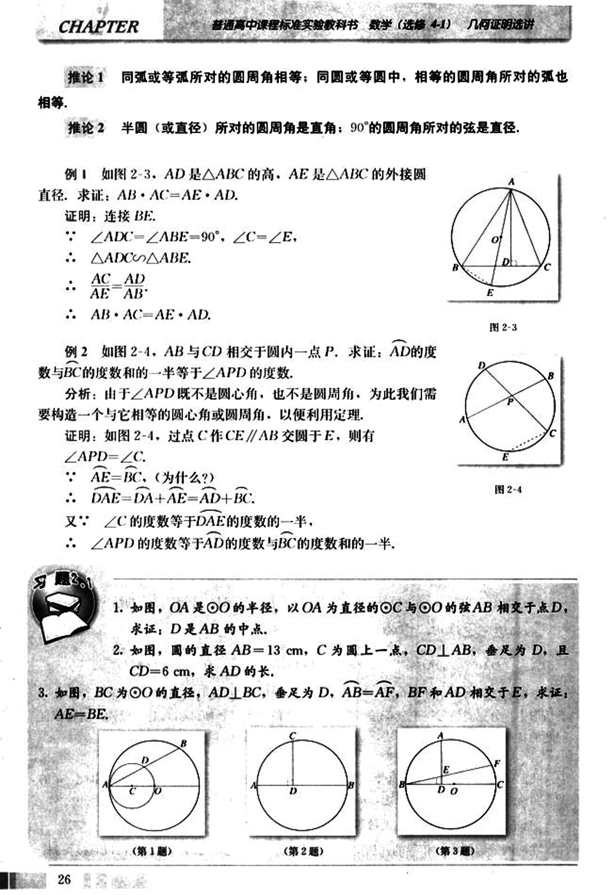
33 

# 第二讲 直线与圆的位置关系

## 二 圆内接四边形的性质与判定定理

在讨论了圆内的角以后，我们再来讨论与圆相关的多边形。如果多边形的所有顶点都在一个圆上，那么这个多边形叫做圆内接多边形，这个圆叫做多边形的外接圆。

### 思考

我们知道，任意三角形都有外接圆，那么，任意正方形有外接圆吗？为什么？任意矩形是否有外接圆？一般地，任意四边形都有外接圆吗？

我们从问题的反面入手：如果一个四边形内接于圆，那么这样的四边形有什么特征？

### 观察图 2-5

观察图 2-5. 这组图中的四边形都内接于圆，你能从中发现这些四边形的共同特征吗？

[图2-5](images/图2-5.png)

一般地，我们可以从四边形的边的关系、角的关系等来考察这些图形的共同特征，下面考察四个角的关系。

显然，圆内接四边形的角都是圆周角，因此，为了考察这些圆周角的关系，我们可以借助圆周角定理。

如图 2-6(1)，连接 OA、OC，则∠B = $\frac{1}{2}$α，∠D = $\frac{1}{2}$β。

可以借助计算机来探究圆内接四边形的特征。

27

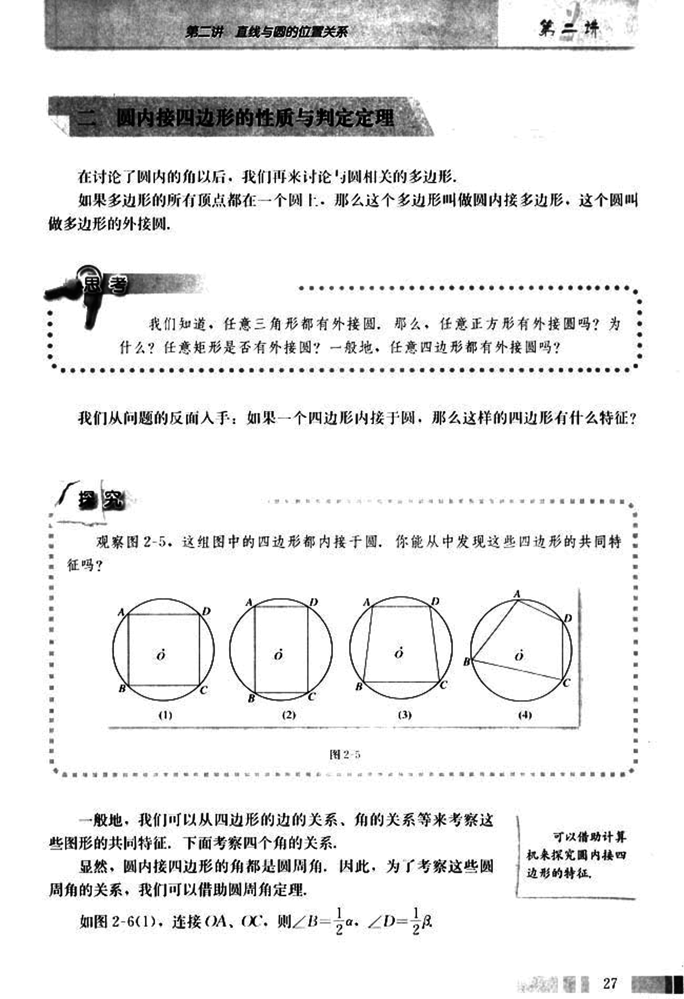
34 

# CHAPTER

普通高中课程标准实验教科书 数学(选修4-1) 几何证明选讲

*: α+β=360°，

*: ∠B+∠D=$\frac{1}{2}$×360°=180°，

同理可得：∠A+∠C=180°。

由此得圆内接四边形的性质定理1：

## 定理1

圆的内接四边形的对角互补。

将图2-6(1)中线段AB延长到点E，得到图2-6(2)。

由于∠ABC+∠EBC=180°，而∠ABC+∠D=180°，

∴ ∠EBC=∠D。

于是又得性质定理2：

## 定理2

圆内接四边形的外角等于它的内角的对角。

经过上面的讨论，我们得到了圆内接四边形的两条性质，一个自然的想法是，它们的逆命题成立吗？如果成立，就可以得到四边形存在外接圆的判定定理。

假设：四边形ABCD中，∠B+∠D=180°。

求证：A、B、C、D在同一圆周上（简称四点共圆）。

分析：不在同一直线上的三点确定一个圆，经过A、B、C三点作⊙O，如果能够由条件得到⊙O过点D，那么就证明了命题。

显然，⊙O与点D有且只有三种位置关系：

(1)点D在圆外；

(2)点D在圆内；

(3)点D在圆上。

只要证明在假设条件下只有(3)成立，也就证明了命题。

证明：(1)如果点D在⊙O的外部(图2-7)。设E是AD与圆周的交点，连接EC，则有∠AEC+∠B=180°，由题设∠B+∠D=180°，可得∠D=∠AEC。这与“三角形的外角大于任一不相邻的内角”矛盾，故点D不可能在圆外。

(2)如果点D在⊙O的内部(图2-8)。显然，AD的延长线必与圆相交，设交点为E，连接CE，则∠B+∠E=180°。

∴∠B+∠ADC=180°，

∴∠E=∠ADC。

同样产生矛盾。

∴点D不可能在圆内。

综上所述，点D只能在圆周上。即A、B、C、D四点共圆。因为


圆内接四边形判定定理 如果一个四边形的对角互补，那么这个四边形的四个顶点


[图2-6(1)](/images/2-6-1.png)
[图2-6(2)](/images/2-6-2.png)
[图2-7](/images/2-7.png)
[图2-8](/images/2-8.png)


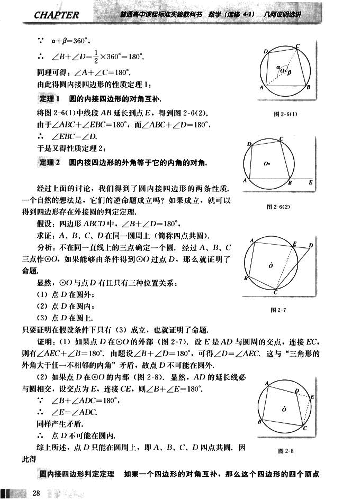
35 

# 第二讲 直线与圆的位置关系

**共圆.**

在圆内接四边形判定定理的证明中，我们用分类思想对点D与A、B、C三点确定的圆的位置关系进行讨论，在每一种情形中都运用了反证法。当问题的结论存在多种情形时，通过对每一种情形分别论证，最后获证结论的方法，称为穷举法。

**推论** 如果四边形的一个外角等于它的内角的对角，那么这个四边形的四个顶点共圆。

请同学们自己写出推论的证明。

## 例1

如图2-9. $O_1$与$O_2$都经过A、B两点，经过点A的直线CD与$O_1$交于点C，与$O_2$交于点D。经过点B的直线EF与$O_1$交于点E，与$O_2$交于点F。求证：CE//DF。

**证明：** 连接AB.

* ∵四边形ABEC是$O_1$的内接四边形，
* ∴∠BAD=∠E.
* 又∵四边形ADFB是$O_2$的内接四边形，
* ∴∠BAD+∠F=180°.
* ∴∠E+∠F=180°.
* ∴CE//DF.

[图2-9](images/2-9.png)

## 例2

如图2-10. CF是△ABC的AB边上的高，FP⊥BC，FQ⊥AC，求证：A、B、P、Q四点共圆。

**证明：** 连接PQ. 在四边形QFPC中，∵FP⊥BC，FQ⊥AC，∴∠FQA=∠FPC。

* Q、F、P、C四点共圆。
* ∴∠QFC=∠QPC。
* 又∵CF⊥AB.
* ∴∠QFC与∠QFA互余，而∠A与∠QFA也互余。
* ∴∠A=∠QFC。
* ∴∠A=∠QPC。
* A、B、P、Q四点共圆。

[图2-10](images/2-10.png)

29

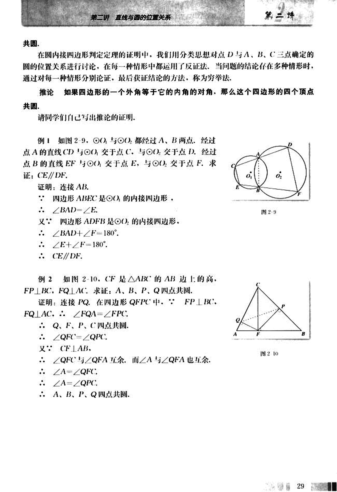
36 

# CHAPTER

普通高中课程标准实验教科书 数学(选修4-1) 几何证明选讲

## 习题2.2

1. 如图,AD、BE是△ABC的两条高,求证:∠CED=∠ABC.
2. 求证:对角线互相垂直的四边形中,各边中点在同一个圆周上。


3. 如图,已知四边形ABCD内接于圆,延长AB和DC相交于E,EG平分∠E,且与BC、AD分别相交于F、G. 求证:∠CFG=∠DGF.

## 三 圆的切线的性质及判定定理

我们知道,直线与圆有相交、相切和相离三种位置关系,这是从直线与圆的公共点个数刻画的。直线与圆有两个公共点,称直线与圆相交;直线与圆只有一个公共点,称直线与圆相切;直线与圆没有公共点,称直线与圆相离。

本节专门讨论直线与圆相切的情形，我们先看当直线与圆相切时有什么性质。

如图2-11, 直线l是⊙O的切线，A为切点，观察、测量图形可以发现l⊥OA.那么l与半径OA是否一定垂直呢？

假如l与OA不垂直，那么过点O作OM⊥l，垂足为M。

根据“垂线段最短”的性质，可得OA>OM.这就是说圆心到直线的距离小于圆的半径，于是l就应与⊙O相交，这与l是⊙O的切线相矛盾。因此，l与OA一定垂直。

于是有：

**切线的性质定理** 圆的切线垂直于经过切点的半径。


因为经过一点只有一条直线与已知直线垂直，所以经过圆心垂直于切线的直线一定过切点；反之，过切点且垂直于切线的直线也一定经过圆心。由此得到：

**推论1** 经过圆心且垂直于切线的直线必经过切点。

**推论2** 经过切点且垂直于切线的直线必经过圆心。

下面通过考察性质定理的逆命题来得到判定定理。

如图2-11，点A是⊙O与直线l的公共点且l⊥OA。在直线l上任取异于点A的点B。


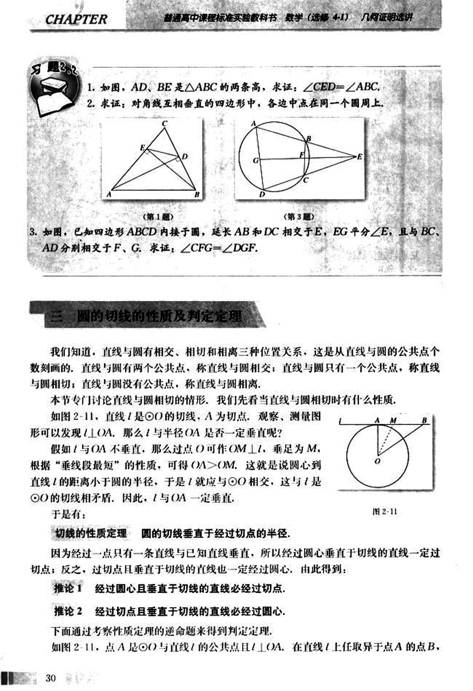
37 

# 第二讲 直线与圆的位置关系

都有OB>OA，这是因为△OBA是直角三角形，而OB是R△OBA的斜边，因此，点B在圆外，由点B的任意性，知圆与直线只有一个公共点，因此/是圆的切线，由此可得：

**切线的判定定理** 经过半径的外端并且垂直于这条半径的直线是圆的切线。

## 例1

如图2-12，AB是⊙O的直径，过BC的中点D，DE⊥AC。求证：DE是⊙O的切线。

**证明：**连接OD。
∵ BD=CD，OA=OB，
∴ OD是△ABC的中位线，
∴ OD∥AC。
又∵ ∠DEC=90°，
∴ ∠ODE=90°。
又∵ D在圆周上，
∴ DE是⊙O的切线。

[图2-12](images/2-12.png)


## 例2

如图2-13，AB为⊙O的直径，C为⊙O上一点，AD和过C点的切线互相垂直，垂足为D。求证：AC平分∠DAB。

**证明：**连接OC。
∵ CD是⊙O的切线，
∴ OC⊥CD，
又∵ AD⊥CD，
∴ OC∥AD，由此得∠ACO=∠CAD。
OC=OA，
∴ ∠CAO=∠ACO。
∴ ∠CAD=∠CAO，故AC平分∠DAB。

[图2-13](images/2-13.png)

## 思考

圆的切线性质定理及它的两个推论，涉及一条直线的三个性质：(1)经过圆心；(2)经过切点；(3)垂直于切线。你能把圆的切线性质及它的两个推论概括在同一个定理中吗？


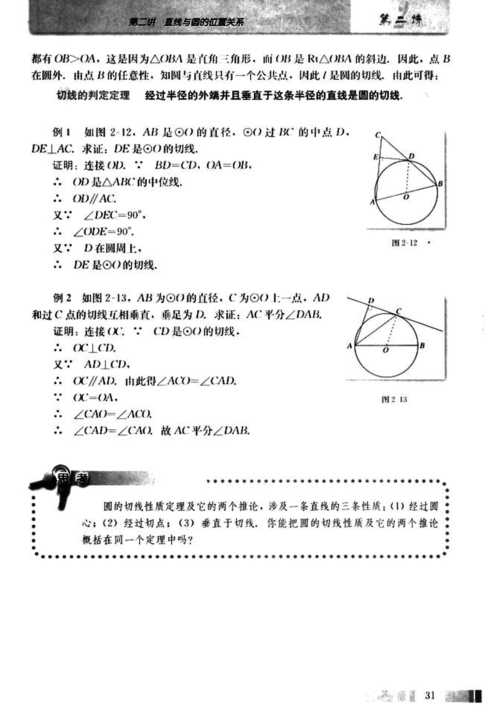
38 

# CHAPTER

普通高中课程标准实验教科书 数学(选修4-1) 几何证明选讲

1. 如图,△ABC为等腰三角形,O是底边BC的中点，⊙O与腰AB相切于点D. 求证:AC与⊙O相切.

2. 如图,OA和OB是⊙O的半径,并且OA⊥OB,P是OA上任意一点,BP的延长线交⊙O于Q. 过Q作⊙O的切线交OA的延长线于R, 求证:RP=RQ.

[图1](images/图1.png)
[图2](images/图2.png)
[图3](images/图3.png)

3. 如图,AB是⊙O的直径,BC是⊙O的切线,切点为B,OC平行于弦AD. 求证:DC是⊙O的切线.

# 四 弦切角的性质

观察题

在图2-14中,以点D为中心旋转直线DE,同时保证直线BC与DE的交点落在圆周上. 当DE变为圆的切线时(如图2-15),你能发现什么现象?

[图2-14](images/图2-14.png)
[图2-15](images/图2-15.png)

图2-14中,根据圆内接四边形的性质,有∠BCE=∠A. 在图2-15中,DE是切线,∠BCE=∠A仍然成立吗?

32

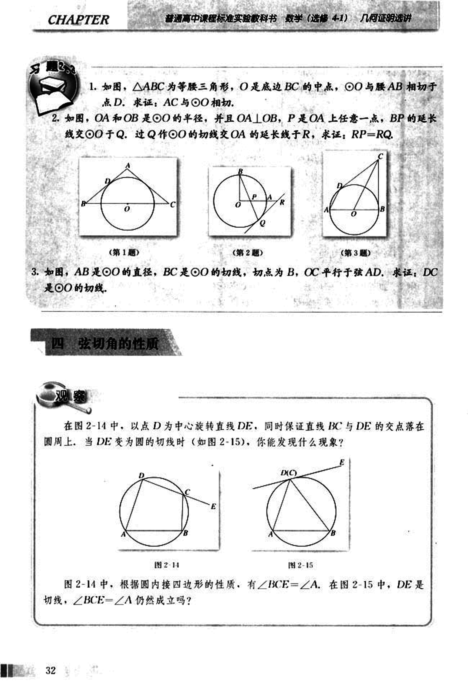
39 

# 第二讲 直线与圆的位置关系

## 猜想

△ABC是⊙O的内接三角形，CE是⊙O的切线，则∠BCE=∠A.

## 分析

延用从特殊到一般的思路，先分析△ABC为直角三角形时的情形，再将锐角三角形和钝角三角形的情形化归为直角三角形的情形。

## 证明

(1) 如图2-16. 圆心O在△ABC的边BC上，即
△ABC是直角三角形。

∵ CE为切线，
∴ ∠BCE=90°.
又∵ ∠A是半圆上的圆周角，
∴ ∠A=90°.
∴ ∠BCE=∠A.

(2) 如图2-17. 圆心O在△ABC的内部，即△ABC为锐角三角形，作⊙O的直径CP，连接AP，则∠PCE=∠CAP=90°.

∴ ∠BCE=∠PCE-∠PCB=90°-∠PCB，
∠BAC=∠CAP-∠PAB=90°-∠PAB，
而∠PAB=∠PCB.
∴ ∠BCE=∠BAC.

(3) 如图2-18. 圆心O在△ABC的外部，即△ABC为钝角三角形，作⊙O的直径CP，连接AP，则∠PCE=∠CAP=90°.

∴ ∠BCE=∠PCE+∠PCB=90°+∠PCB，
∠BAC=∠CAP+∠PAB=90°+∠PAB.
而∠PAB=∠PCB.
∴ ∠BCE=∠BAC.

## 综上所述

猜想成立。

在图2-15中，由于∠BDE是由一条弦和一条切线组成的角，因此给它取名为弦切角。

即：顶点在圆上，一边和圆相交，另一边和圆相切的角叫做弦切角。

于是我们可以将上述经过证明后的猜想表述为：

## 弦切角定理

弦切角等于它所夹的弧所对的圆周角。

由上述定理的发现和证明过程可以看到，对一个图形进行适当的变化，往往能够发现几何中的一些有价值的结论。另外，猜想的证明渗透了分类思想、运动变化思想和化归思想，你能从中体会这些思想方法吗？

## 例1

如图2-19. AB是⊙O的直径，AC是弦，直线CE和⊙O切于点C，AD⊥CE. 垂足为D. 求证：AC平分∠BAD.

证明：连接BC.  ∵ AB是⊙O的直径，
∴ ∠ACB=90°.
∴ ∠B+∠CAB=90°.

[图2-16](images/2-16.png)
[图2-17](images/2-17.png)
[图2-18](images/2-18.png)
[图2-19](images/2-19.png)
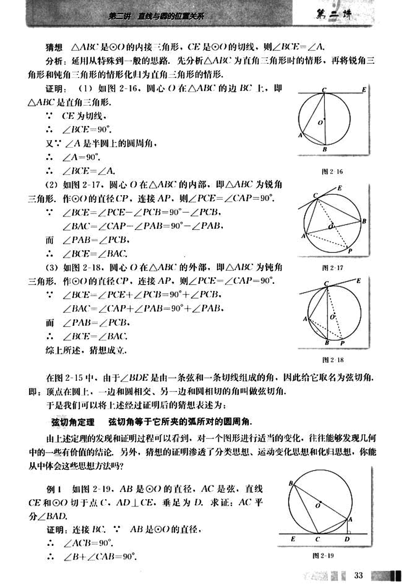
40 

# CHAPTER

普通高中课程标准实验教科书 数学(选修4-1) 几何证明选讲

* AD⊥CE.
* ∠ADC=90°.
* ∠ACD+∠DAC=90°.
* AC是弦，且直线CE和⊙O切于点C.
* ∠ACD=∠B.
* ∠DAC=∠CAB，即AC平分∠BAD.


## 习题2.4

1. 如图，经过圆上的点T的切线和弦AB的延长线相交于点C. 求证：∠ATC=∠TBC.


2. 如图，⊙O和⊙O'都经过A、B两点，AC是⊙O的切线，交⊙O'于点C，AD是⊙O'的切线，交⊙O于点D，求证：AB<sup>2</sup>=BC·BD.


## 五 与圆有关的比例线段

前面我们讨论了与圆有关的角之间的关系，自然的，我们可以讨论与圆有关的线段的关系及其度量问题。下面沿用从特殊到一般的思路，讨论与圆的相交弦有关的问题。

如图2-20，AB是⊙O的直径，CD⊥AB，AB与CD相交于P，线段PA、PB、PC、PD之间有什么关系？


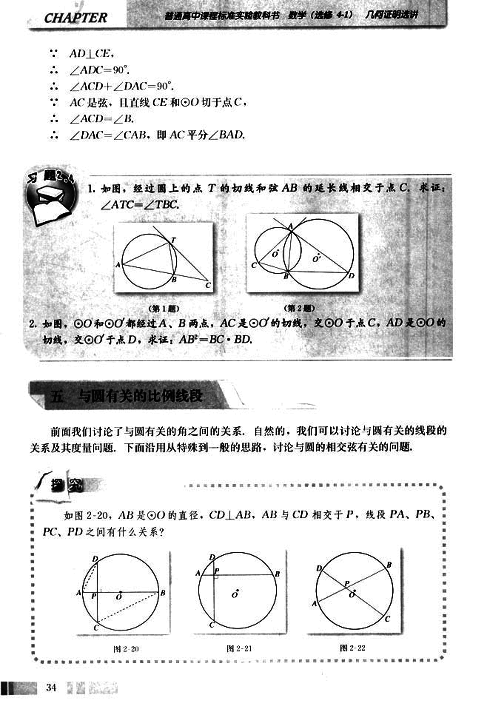
41 

# 第二讲 直线与圆的位置关系

连接AD，BC，则由圆周角定理的推论可得：

∠A = ∠C.

∴ △APD ∽ △CPB.

∴  $\frac{PA}{PC} = \frac{PD}{PB}$

∴ PA · PB = PC · PD.

(1)

## 探究

将图2-20中的AB向上(或向下)平移，使AB不再是直径(图2-21)，结论(1)还成立吗？

连接AD，BC. 请同学们自己给出证明。


上面讨论了CD ⊥ AB的情形。进一步地，如果CD与AB不垂直，如图2-22，CD、AB是圆内的任意两条相交弦，结论(1)是否仍然成立？

事实上，AB、CD是圆内的任意两条相交弦时，结论(1)仍然成立，而且证明方法不变，请同学们自己给出证明。

由上述探究及论证，我们有

**相交弦定理** 圆内的两条相交弦，被交点分成的两条线段长的积相等。

以上通过考察相交弦交角变化中有关线段的关系，得出了相交弦定理。下面从新的角度考察与圆有关的比例线段。

## 探究

使圆的两条相交弦的交点P从圆内运动到圆上(图2-23)，再到圆外(图2-24)，结论(1)是否还能成立？

当点P在圆上时，PA = PC = 0，所以PA · PB = PC · PD仍成立。

当点P在圆外时，在图2-24中，连接AD，BC，容易证明△PAD ∽ △PCB，所以

$\frac{PA}{PC} = \frac{PD}{PB}$，即PA · PB = PC · PD.

35

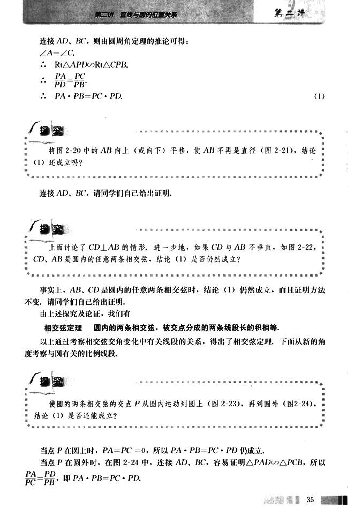
42 

# CHAPTER 普通高中课程标准实验教科书 数学(选修4-1) 几何证明选讲

D
C
O
(C,P) A
P
A
B

图 2-23
图 2-24

根据上述探究和论证，我们有

**割线定理** 从圆外一点引圆的两条割线，这一点到每条割线与圆的交点的两条线段长的积相等。

下面继续用运动变化思想探究。

**思考**

在图 2-24 中，使割线 PB 绕 P 点运动到切线的位置（图 2-25），是否还有 PA · PB = PC · PD？

连接 AC、AD，同样可以证明 △PAC ∽ △PDA（请同学们自己证明），因而 (1) 式仍然成立。在这种情况下，A、B 两点重合，PA · PB = PC · PD 变形为：

PA<sup>2</sup> = PC · PD.      (2)

由上述探究和论证，我们有

**切割线定理** 从圆外一点引圆的切线和割线，切线长是这点到割线与圆交点的两条线段长的比例中项。

设 P 为圆外一点，过 P 的圆的切线的切点为 A，称 PA 为点 P 到圆的切线长。

C
P
D
P
C(D)
O
A(B)

图 2-25
A(B)

图 2-26

在图 2-25 中，使割线 PD 绕 P 点运动到切线位置（图 2-26），可以得出什么结论？

36

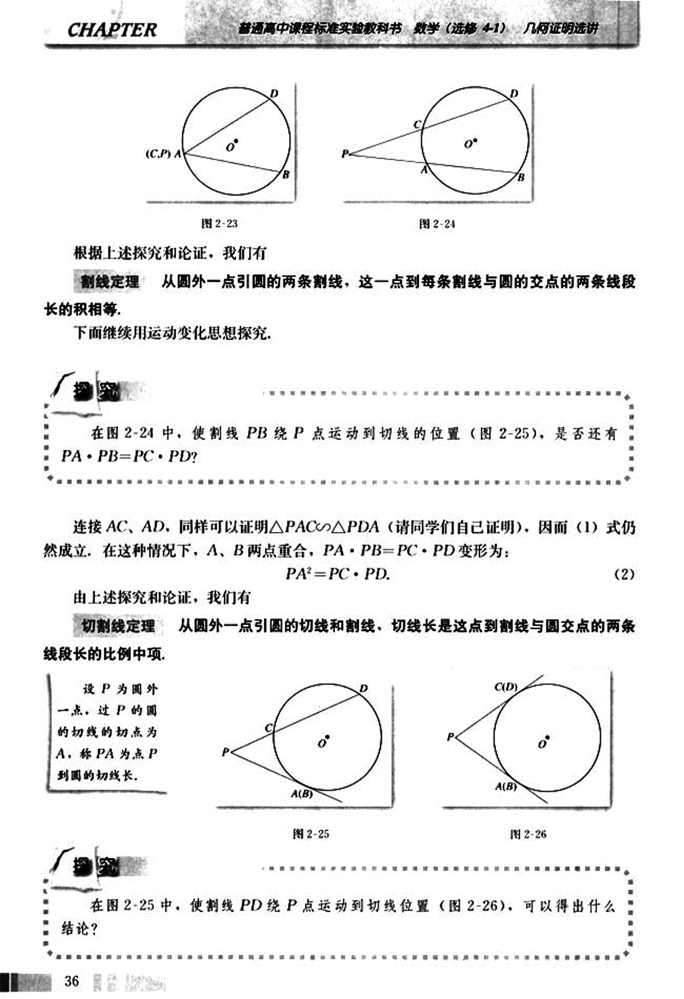
43 

# 第二讲 直线与圆的位置关系

从图2-25变到图2-26时，点C与点D重合，因此(1)式变为PA² = PC，所以PA=PC。

结合切线的性质定理，我们有

## 切线长定理

从圆外一点引圆的两条切线，它们的切线长相等，圆心和这一点的连线平分两条切线的夹角。

证明：如图2-27，连接OA、OC，则
OA⊥PA，OC⊥PC。
* ∵OA=OC，OP=OP，
* ∴△OAP≅△OCP。
* ∴PA=PC，∠APO=∠CPO。

[图2-27](images/2-27.png)

思考

由切割线定理能证明切线长定理吗？在图2-26中，由P向圆任作一条割线试一试。另外，你能将切线长定理推广到空间的情形吗？


## 例1

如图2-28，圆内的两条弦AB、CD相交于圆内一点P，已知PA=PB=4，PC=$\frac{1}{4}$PD。求CD的长。

解：设CD=x，则PD=$\frac{4}{5}$x，PC=$\frac{1}{5}$x。

由相交弦定理，得

PA·PB=PC·PD，

∴4×4=$\frac{1}{5}$x·$\frac{4}{5}$x，x=10。

∴CD=10。

[图2-28](images/2-28.png)


## 例2

如图2-29，E是圆内两弦AB和CD的交点，直线EF//CB，交AD的延长线于F，FG切圆于G。

求证：(1)△DFE≅△EFA；(2)EF=FG。

证明：(1)∵EF//CB，

∴∠DEF=∠DCB。

∵∠DCB和∠DAB都是DB上的圆周角，

∴∠DAB=∠DCB=∠DEF。

∠DFE=∠EFA。

∴△DFE≅△EFA。

(2)由(1)知△DFE≅△EFA。

[图2-29](images/2-29.png)

37

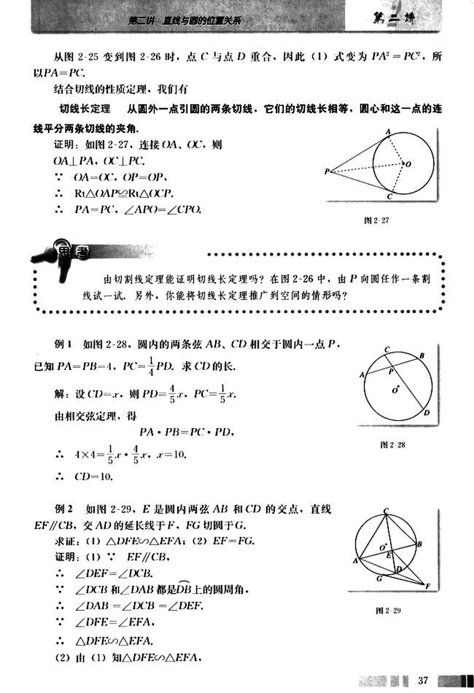
44 

# CHAPTER 普通高中课程标准实验教科书 数学(选修4-1) 几何证明选讲

* $\frac{EF}{FA} = \frac{FD}{EF}$，即 $EF^2 = FA \cdot FD$。
* FG是圆的切线，
* $FG^2 = FA \cdot FD$。
* $FG^2 = EF^2$，即 $FG = EF$。

例3 如图 [2-30](images/2-30.png)，两圆相交于A、B两点，P为两圆公共弦AB上任一点，从P引两圆的切线PC、PD，求证：PC=PD。

证明：由切割线定理可得：
$PC^2 = PA \cdot PB$，$PD^2 = PA \cdot PB$。
∴ $PC^2 = PD^2$，
即 PC=PD。

例4 如图 [2-31](images/2-31.png)，AB是⊙O的直径，过A、B引两条弦AD和BE，相交于点C。求证：$AC \cdot AD + BC \cdot BE = AB^2$。

证明：连接AE、BD，过C作CF⊥AB，与AB交于F。
* AB是圆的直径，
* ∠AEB = ∠ADB = 90°。
* ∠AFC = 90°，
* A、F、C、E四点共圆。
* $BC \cdot BE = BF \cdot BA$。(1)
同理可证F、B、D、C四点共圆。
* $AC \cdot AD = AF \cdot AB$。(2)
(1)+(2)得
$AC \cdot AD + BC \cdot BE = AB(AF + BF) = AB^2$。

例5 如图 [2-32](images/2-32.png)，AB、AC是⊙O的切线，ADE是⊙O的割线，连接CD、BD、BE、CE。

问题1 由上述条件能推出哪些结论？

探究1：由已知条件可知∠ACD = ∠AEC，
而∠CAD = ∠EAC，
∴ △ADC ∽ △ACE。
* $\frac{CD}{CE} = \frac{AC}{AE}$
* $CD \cdot AE = AC \cdot CE$。(2)
同理可证
$BD \cdot AE = AB \cdot BE$。(3)
因为AC=AB，所以由(2)(3)可得


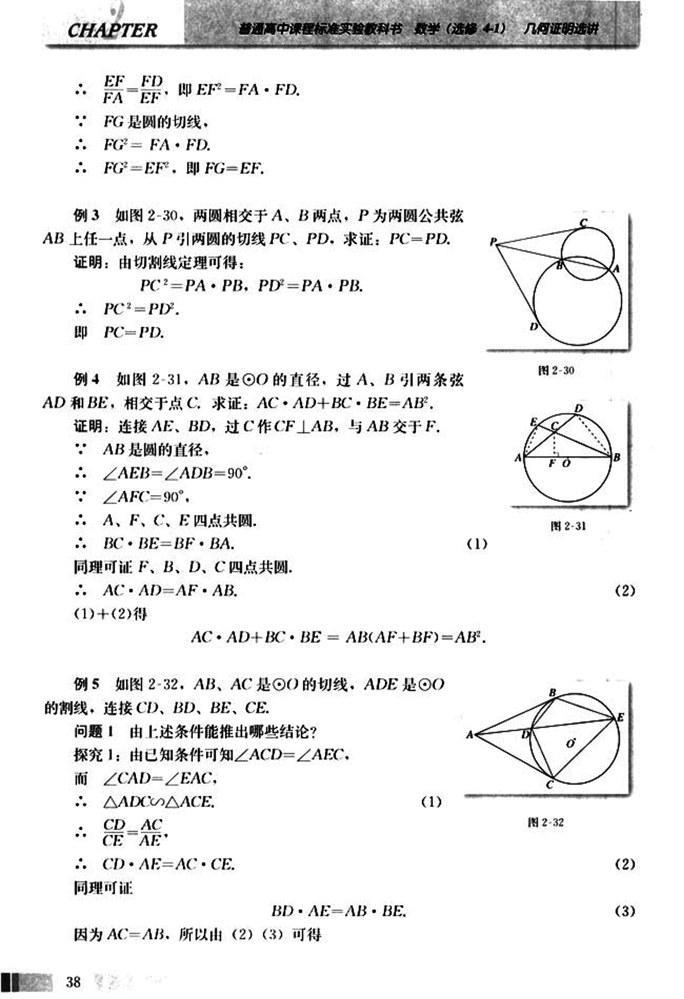
45 

# 第二讲 直线与圆的位置关系

BE · CD = BD · CE. (4)

你还能推出其他结论吗？

问题 2 在图 2-32 中，使线段 AC 绕 A 旋转，得到图 2-33。其中 EC 交圆于 G，DC 交圆于 F。此时又能推出哪些结论？

探究 2：连接 FG，与探究 1 所得到的结论相比较，可以猜想 △ADC ∽ △ACE。下面给出证明：

* $AB^2 = AD \cdot AE$，而 AB = AC。
* $AC^2 = AD \cdot AE$，即 $\frac{AC}{AE} = \frac{AD}{AC}$。
* ∠CAD = ∠EAC。
* △ADC 与 △ACE 两边对应成比例，夹角相等。
* 故 △ADC ∽ △ACE。

同探究 1 的思路，还可得到探究 1 得出的结论 (2) (3) (4)。

另一方面，由于 F、G、E、D 四点共圆，

* ∠CFG = ∠AEC。
* 又 ∠ACF = ∠AEC。
* ∠CFG = ∠ACF。
* FG // AC。

你还能推出其他结论吗？

问题 3 在图 2-33 中，使 AC 继续绕 A 旋转，使割线 CFD 变成切线 CD，得到图 2-34。此时又能推出什么结论？

探究 3：可以推出探究 1、2 中得到的 (1)~(6) 的所有结论，此外，

* AC // DG。
* $\frac{AD}{CG} = \frac{AE}{CE}$。
* AD · CE = AE · CG。 (7)
* △ACD ∽ △AEC。
* $\frac{CD}{CE} = \frac{AD}{AC}$。
* AC · CD = AD · CE。 (8)

由 (7) (8) 式可得：

AC · CD = AE · CG。(9)


[图2-33](images/2-33.png)
[图2-34](images/2-34.png)

39

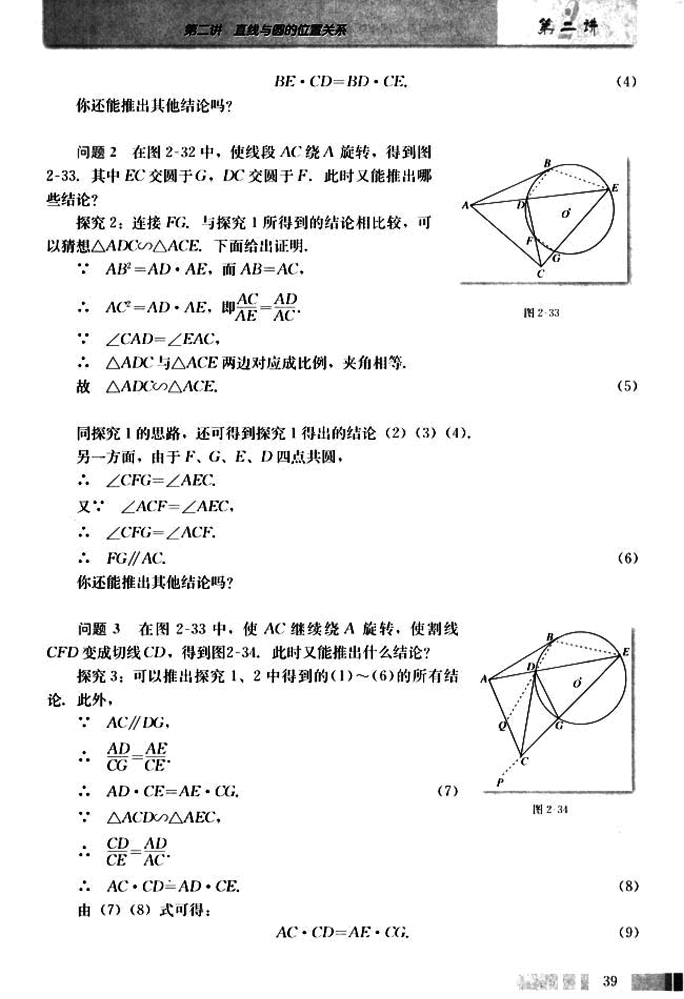
46 

# CHAPTER

普通高中课程标准实验教科书 数学(选修4-1) 几何证明选讲

连接BD、BE，延长GC到P，延长BD交AC于Q，则∠PCQ=∠PGD=∠DBE，
所以
C、E、B、Q四点共圆.

你还能推出其他结论吗？

(10)

1. 两弦相交，一弦被分为12 cm和18 cm两段，另一弦被分为3：8，求另一
弦的长。

2. 如图为一根轴的纵断面图，求这根轴的全长。


3. 如图，点P为⊙O的弦AB上的任意点，连接PO，PC⊥OP，PC交⊙O于C. 求证：
PA·PB=PC<sup>2</sup>.


4. 如图，⊙O的割线PAB交⊙O于A、B两点，割线PCD经过圆心，已知PA=6，
AB=$7\frac{1}{3}$，PO=12. 求⊙O的半径.


5. 如图，⊙O和⊙O’都经过点A和点B，PQ切⊙O于点P，交⊙O’于Q，M，交AB的延
长线于N，求证：PN<sup>2</sup>=NM·NQ.


6. 如图，PA是⊙O的切线，切点为A，过PA的中点M作割线交⊙O于点B和C. 求证：
∠MPB=∠MCP.

40

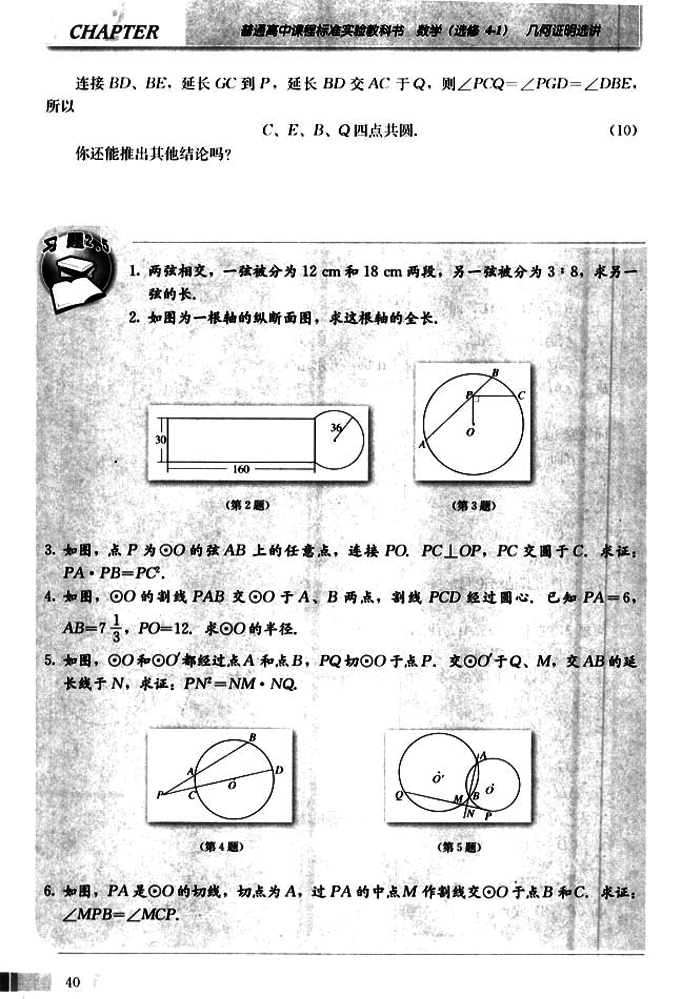
47 

# 第二讲 直线与圆的位置关系

## 7. 如图，已知AD、BE、CF分别是△ABC三边的高，H是垂心，AD的延长线交△ABC的外接圆于点G。求证：DH=DG。


## 8. 如图，⊙O的直径AB的延长线与弦CD的延长线相交于点P，E为⊙O上一点，AE=AC，DE交AB于点F。求证：PF·PO=PA·PB。


## 9. 将例5的图2-32作如下变化：以A为中心，把AC绕A逆时针旋转一个角度，连接EC并延长与圆相交于F，连接DC并延长与圆相交于G，连接FG（如图），其他条件同例5。你能从这个图中推出哪些结论？如果∠BAD=∠CAD，又有什么结论？（可以在图中增添线段。）


41

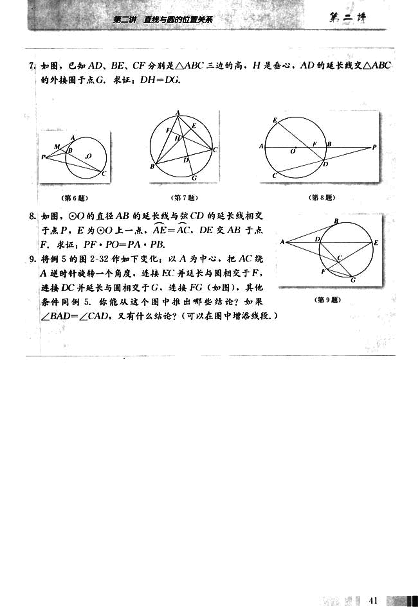
48 

# 第二讲 小结

## 1. 知识结构

在本讲中，我们从圆周角定理出发得到了推论1、推论2。又以圆周角定理为基础，推出了圆内接四边形的性质定理和判定定理。由切线的定义推出圆的切线的性质定理和判定定理。借助于圆内接四边形性质定理，以圆的切线的性质定理为基础，引出了弦切角的概念和有关性质。以圆周角定理和相似三角形判定定理为逻辑起点，推出了相交弦定理、割线定理、切割线定理及切线长定理。知识结构图如下：

```
推论1             四点共圆判定定理
      ┌───────┐
圆周角定理────┤
      └───────┘         弦切角的性质定理
                  推论2
      ┌───────┐
切线的定义────┤
      └───────┘         圆的切线的性质定理
                  圆的切线的判定定理
      ┌───────┐
垂线段最短────┤
      └───────┘         相交弦定理
                  相似三角形
                              割线定理
                              切割线定理
                                      切线长定理
```

## 2. 数学思想方法

### 分类思想方法

所谓分类思想方法，就是依据一定的标准，按照既不重复也不遗漏的原则，将所要研究的对象划分为若干类别，然后通过对每一类别的研究去达到对事物整体研究的目的。譬如，按角的关系分类，可以将三角形分为钝角三角形、直角三角形和锐角三角形，每种类型的三角形有自身的一些特性。如果不作分类讨论，那么就很难找出这些特性。另一方面，对一些问题的讨论，必须通过分类才能穷尽各个方面，使得到的结论具有一般性。请同学们结合圆周角定理、四点共圆判定定理和弦切角定理的证明，谈谈对分类思想方法的体会。

### 运动变化思想

在本讲中，我们充分展示了运动变化思想，具体体现为图形的运动变化。几何中的许多问题源于相同的模型，尽管图形中某些要素的位置关系有差异，但其本质是相同的。请同学们结合相交弦定理、割线定理、切割线定理、切线长定理之间的关系以及例5的探究思路，领悟运动变化思想在数学探究中的作用。

### 猜想与证明

数学中的许多定理都是先对一定的典型事例进行观察、实验、类比和归纳后，发现一定的规律性，并提出一个猜想，然后再对猜想的严格证明得来的。猜想和证明既是数学研究的常用方法，同时又是训练思维的两种重要工具。本讲在推导许多定理时都使用了这种方法，你能谈谈体会吗？

42

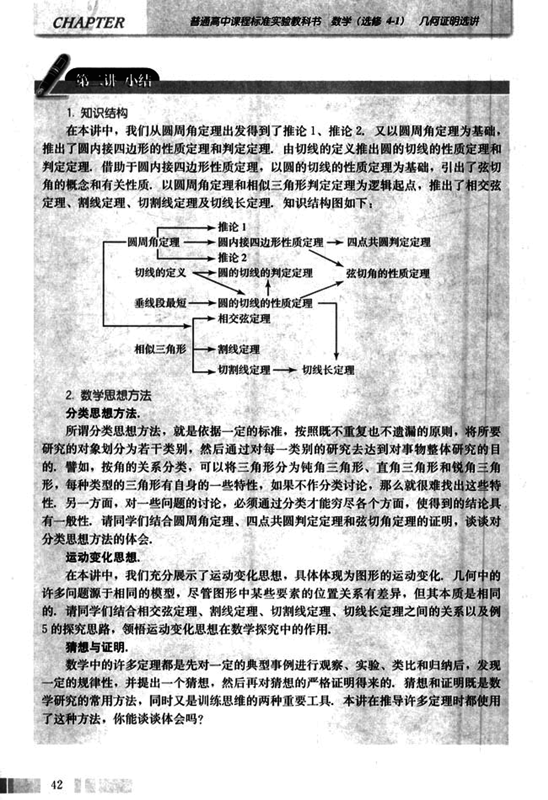
