# 选修4-4

1 

# 数学

## 选修 4-4

# 坐标系与参数方程

人民教育出版社 课程教材研究所 编著

中学数学课程教材研究开发中心


[laptop](images/laptop.png)

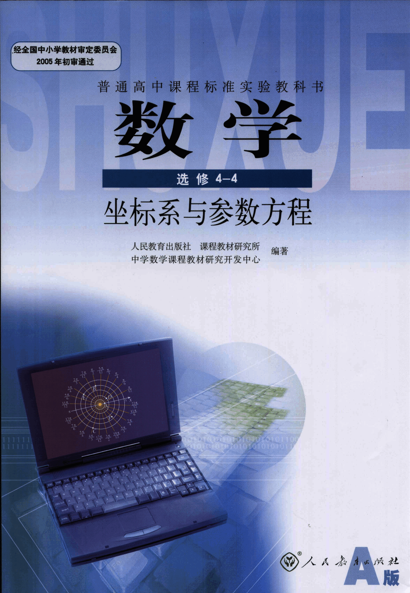
2 

# 普通高中课程标准实验教科书
# 数学

## 选修 4-4

# 坐标系与参数方程

人民教育出版社 课程教材研究所  编著

中学数学课程教材研究开发中心

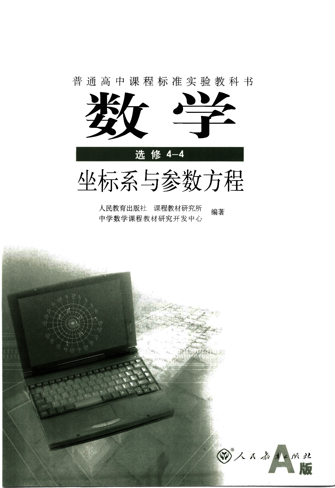
3 

# 目录

引言                                                        1

# 第一讲 坐标系                                                2

- 平面直角坐标系                                          2
- 极坐标系                                                8
- 简单曲线的极坐标方程                                    12
- 柱坐标系与球坐标系简介                                16

# 第二讲 参数方程                                                21

- 曲线的参数方程                                          21
- 圆锥曲线的参数方程                                      27
- 直线的参数方程                                          35
- 渐开线与摆线                                          40

学习总结报告                                                45


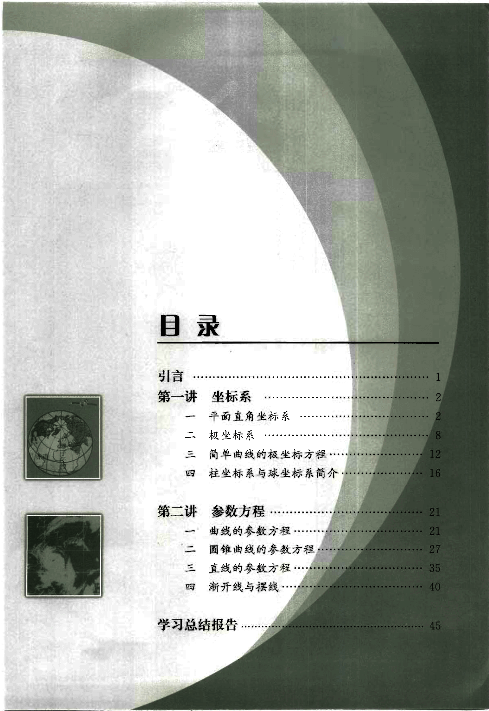
4 

# 引言

本专题是高中数学课程选修系列4中的第4个专题，包括“坐标系”“参数方程”两个部分的内容。

坐标法思想是17世纪的数学家笛卡儿、费马提出的，坐标法思想为牛顿、莱布尼茨创立微积分奠定了基础，它是近代数学发展的开端，已成为现代数学最重要的基本思想之一。坐标系是联系几何与代数的桥梁，是数形结合的有力工具，利用它可以使数与形相互转化。

同学们已学过数轴、平面直角坐标系、空间直角坐标系的初步知识。在此基础上，本专题将进一步介绍极坐标系、空间柱坐标系、球坐标系等，展示不同坐标系在刻画几何图形或描述自然现象中的作用，拓广坐标系的知识；通过介绍简单曲线的极坐标方程等知识，使同学们更全面地理解坐标法思想。

参数方程是以参变量为中介来表示曲线上点的坐标的方程，是曲线在同一坐标系下的另一种表示形式。本专题通过实例展示了在建立曲线方程过程中，引进参数的意义和作用。某些曲线用参数方程表示比用普通方程表示更方便，根据曲线的特点，选取适当曲线方程的表示形式，体现了解决问题中数学方法的灵活性。

作为参数方程的应用实例，本专题介绍了渐开线与摆线，为同学们提供欣赏各种曲线（如心脏线、螺线、玫瑰线、叶形线、平摆线、渐开线等）的机会，从中体会参数对研究这些曲线的作用。

使用信息技术研究本专题的内容，例如用计算机软件认识参数意义，观察渐开线与平摆线的生成过程等，可以使同学们更直观、有效地认识各种曲线的生成过程、性质和实际应用。

本专题力求通过实际问题，深入浅出地帮助同学们理解数学概念；通过“思考”“探究”“信息技术应用”等，启发和引导同学们的数学思维，养成主动探索，积极思考的好习惯。

祝愿同学们通过本专题的学习，不仅对数学产生更大的兴趣，学到更多的数学知识，提高自己利用数学知识解决实际问题的能力，形成对数学更加全面的了解，而且逐步认识到数学的科学价值、应用价值和文化价值。

1

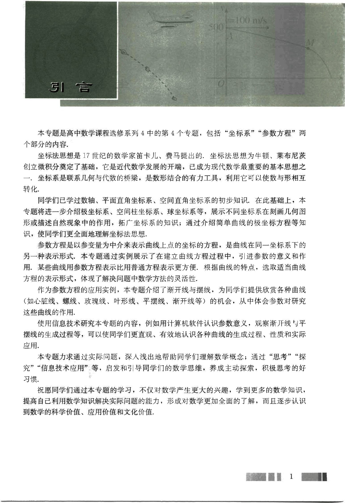
5 

# 第一讲

我们知道，通过直角坐标系，平面上的点与坐标（有序实数对）、曲线与方程建立了联系，从而实现了数与形的结合。根据几何对象的特征，选择适当的坐标系，建立它的方程，通过方程研究它的性质及与其他几何图形的关系，这就是研究几何问题的坐标法。

由于现实问题的复杂性，有时在直角坐标系下建立几何图形的方程并不方便，为便于用代数方法研究几何图形，需要建立不同的坐标系。在建立某些几何图形的方程时，用极坐标系、柱坐标系和球坐标系会更加方便。

下面我们先回顾直角坐标系中解决实际问题的过程。

## 平面直角坐标系

### 1. 平面直角坐标系

**思考**

某信息中心接到位于正东、正西、正北方向三个观测点的报告：正西、正北两个观测点同时听到一声巨响；正东观测点听到巨响的时间比它们晚4 s。已知各观测点到中心的距离都是1020 m。试确定巨响发生的位置。（假定声音传播的速度为340 m/s，各观测点均在同一平面上。）

| 观测点 | 信息中心 | 观测点 |
|---|---|---|


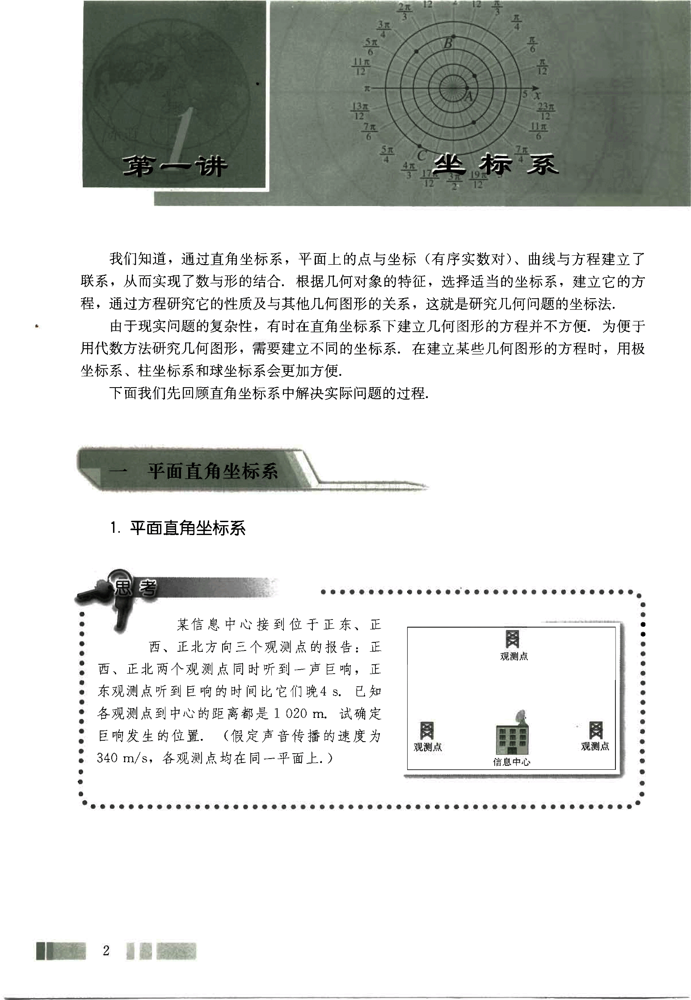
6 

# 第一讲 坐标系

## 图1-1，将三个观测点记为A，B，C。

由于B，C同时听到由点P发出的响声，因此$|PB|=|PC|$，说明点P在线段BC的垂直平分线上；由于A听到响声的时间比B，C晚4s，因此$|PA|-|PB|=4\times340=1360 < AB$，说明点P在以点A，B为焦点的双曲线Γ上，所以，点P就是直线l与双曲线Γ的交点。

下面利用问题的几何特征，通过建立适当的直角坐标系，具体确定点P的位置。

## 怎样建立直角坐标系才有利于我们解决这个问题？

由于点P是直线l与双曲线Γ的交点，因此，直角坐标系的选取应尽量使直线l和双曲线Γ的方程简单，以便于解方程组求点P的坐标。

## 图1-2，以信息中心为原点O，直线BA为x轴，

建立直角坐标系。由已知，点A，B，C的坐标分别为
A(1 020, 0), B(-1 020, 0), C(0, 1 020),

于是，直线的方程为  $y = -x$。

设双曲线Γ的方程是  $\frac{x^2}{a^2} - \frac{y^2}{b^2} = 1 (a>0, b>0)$，

由已知得 a = 680, c = 1 020,

$b^2 = c^2 - a^2 = 1020^2 - 680^2 = 5 \times 340^2$，

于是，双曲线Γ的方程为  $\frac{x^2}{680^2} - \frac{y^2}{5 \times 340^2} = 1$。

将 $y = -x$ 代入上述方程，解得 $x = \pm 680\sqrt{5}$，$y = \mp 680\sqrt{5}$。

由已知，响声应在双曲线Γ的左半支，因此点P的坐标为 $(-680\sqrt{5}, 680\sqrt{5})$。从而 $|PO| = 680\sqrt{10} (m)$。

因此，巨响在信息中心的西偏北45°方向，距离$680\sqrt{10}m$处。

## 我们以信息中心为基点，用角和距离刻画了点P的位置，这种方法与用直角坐标刻画点P的位置有什么区别和联系？你认为哪种方法更方便？

---
[图1-1](images/1-1.png)
[图1-2](images/1-2.png)


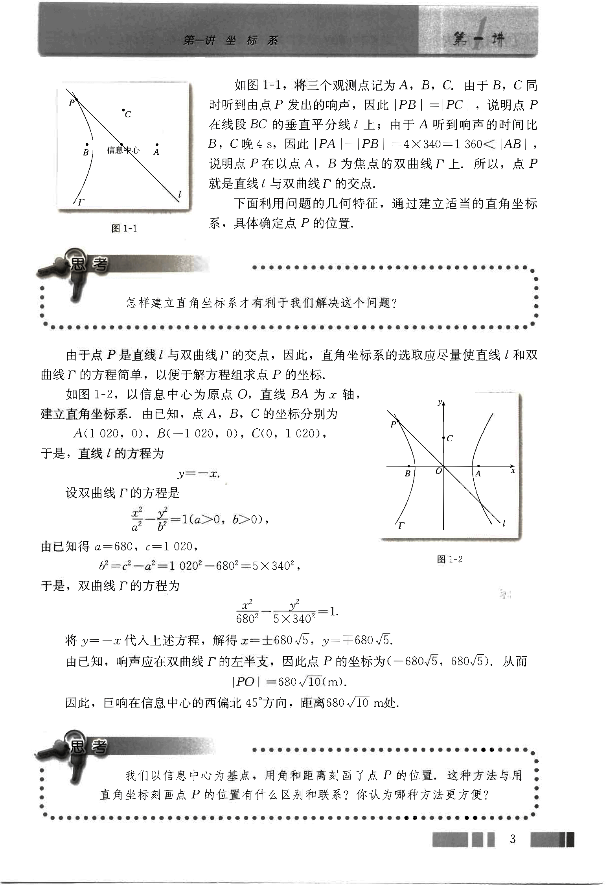
7 

# CHAPTER 普通高中课程标准实验教科书 数学(选修4-4) 坐标系与参数方程

上述问题的解决充分体现了坐标法思想.

## 例1

已知△ABC的三边a,b,c满足b²+c² = 5a², BE,CF分别为边AC,AB上的中线,建立适当的平面直角坐标系探究BE与CF的位置关系.

解:如图1-3,以△ABC的顶点A为原点O,边AB所在的直线为x轴,建立直角坐标系,由已知,点A,B,F的坐标分别为

A(0, 0), B(c, 0), F($\frac{c}{2}$, 0).

设点C的坐标为(x,y),则点E的坐标为($\frac{x}{2}$, $\frac{y}{2}$).

由b²+c²=5a²,可得到|AC|²+ |AB|²=5|BC|²,即

x²+y²+c²=5[(x-c)²+y²].

整理得

2x²+2y²+2c²-5cx=0.

因为

$\overrightarrow{BE}$=( $\frac{x}{2}$-c, $\frac{y}{2}$).  $\overrightarrow{CF}$=( $\frac{c}{2}$-x, -y),

所以

$\overrightarrow{BE}$·$\overrightarrow{CF}$=( $\frac{x}{2}$-c)( $\frac{c}{2}$-x)-$\frac{y²}{2}$

= $\frac{1}{4}$(2x²+2y²+2c²-5cx)

=0.

因此,BE与CF互相垂直.

## 探究

你能建立与上述解答中不同的直角坐标系解决这个问题吗?比较不同的直角坐标系下解决问题的过程,你认为建立直角坐标系时应注意些什么?

## 2.平面直角坐标系中的伸缩变换

在三角函数图象的学习中,我们研究过下面一些问题:

(1)怎样由正弦曲线y=sinx得到曲线y=sin 2x?

如图1-4,在正弦曲线y=sinx上任取一点P(x,y),保持纵坐标y不变,将横坐标x缩为原来的$\frac{1}{2}$,那么正弦曲线y=sin x 就变成曲线y=sin 2x.

[图1-3](images/1-3.png)


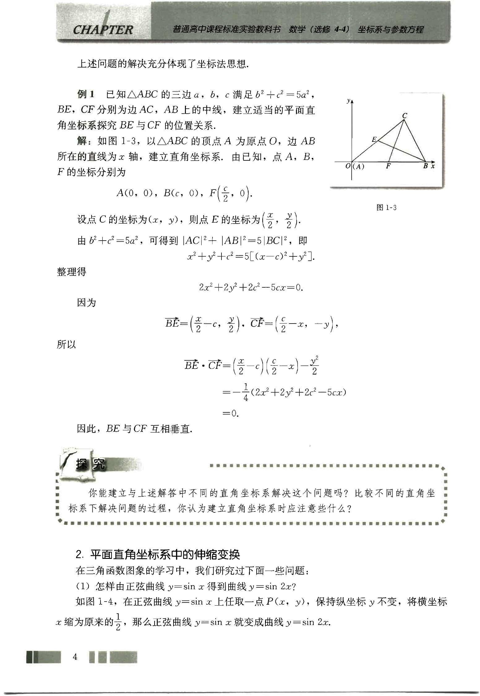
8 

# 第一讲 坐标系

## 图1-4


从平面直角坐标系中的点的对应关系出发，你认为“保持纵坐标y不变，将横坐标x缩为原来的$\frac{1}{2}$”的实质是什么？

实际上，“保持纵坐标y不变，将横坐标x缩为原来的$\frac{1}{2}$”是一个坐标的压缩变换，即

设P(x, y)是平面直角坐标系中的任意一点，保持纵坐标y不变，将横坐标x缩为原来的$\frac{1}{2}$，得到点P′(x′, y′)，那么

$\begin{cases} x' = \frac{1}{2}x \\ y' = y \end{cases}$  ①

我们把①式叫做平面直角坐标系中的一个坐标压缩变换。

(2) 怎样由正弦曲线y=sinx得到曲线y=3sinx?

如图1-5，在正弦曲线y=sinx上任取一点P(x, y)，保持横坐标x不变，将纵坐标y伸长为原来的3倍，那么正弦曲线y=sinx就变成曲线y=3sinx.

## 图1-5


5

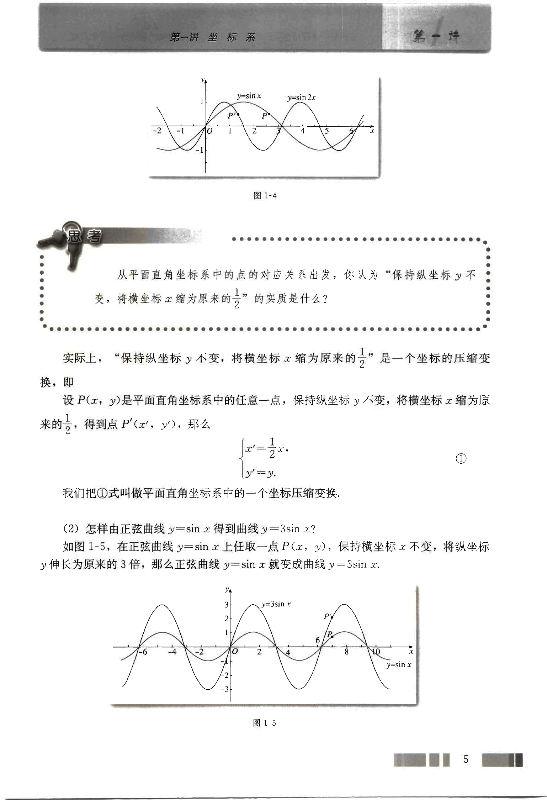
9 

# CHAPTER

普通高中课程标准实验教科书 数学(选修4-4) 坐标系与参数方程

## 思考

从平面直角坐标系中的点的对应关系出发，你认为“保持横坐标x不变，将纵坐标y伸长为原来的3倍”的实质是什么？

实际上，“保持横坐标x不变，将纵坐标y伸长为原来的3倍”是一个坐标的伸长变换，即

设P(x, y)是平面直角坐标系中的任意一点，保持横坐标x不变，将纵坐标y伸长为原来的3倍，得到点P'(x', y')，那么

$\begin{cases} x'=x, \\ y'=3y. \end{cases}$

②

我们把②式叫做平面直角坐标系中的一个坐标伸长变换.

(3) 怎样由正弦曲线y=sinx得到曲线y=3sin 2x?

实际上，这是上述(1)(2)的“合成”;如图1-6，先保持纵坐标y不变，将横坐标x缩为原来的$\frac{1}{2}$；在此基础上再将纵坐标y变为原来的3倍，就可以由正弦曲线y=sinx得到曲线y=3sin 2x.

[image](images/graph.png)

图1-6

与上述讨论一样，设平面直角坐标系中的任意一点P(x, y)经过上述变换后变为点P'(x', y')，那么

$\begin{cases} x'=\frac{1}{2}x, \\ y'=3y. \end{cases}$

③

我们把③式叫做平面直角坐标系中的坐标伸缩变换.


6
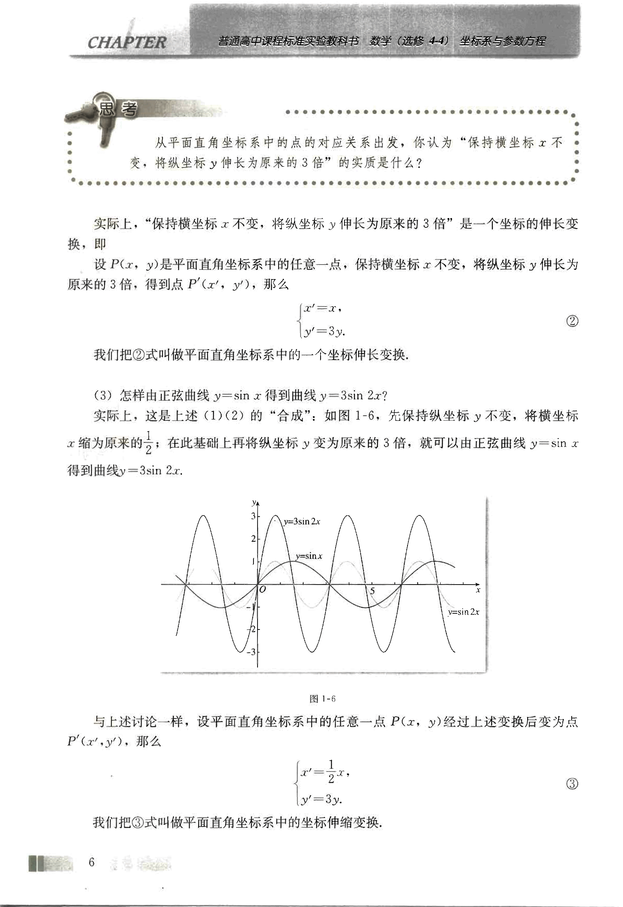
10 

# 第一讲 坐标系

下面给出平面直角坐标系中坐标伸缩变换的定义。

## 定义

设点$P(x, y)$是平面直角坐标系中的任意一点，在变换

$\varphi: \begin{cases} x' = \lambda \cdot x, & (\lambda > 0) \\ y' = \mu \cdot y, & (\mu > 0) \end{cases}$

的作用下，点$P(x, y)$对应到点$P'(x', y')$，称为平面直角坐标系中的坐标伸缩变换，简称伸缩变换。

上述①②③都是坐标伸缩变换，在它们的作用下，可以实现平面图形的伸缩。例如，在伸缩变换③的作用下，正弦曲线$y = \sin x$变换为曲线$y = 3\sin 2x$。因此，平面图形的伸缩变换可以用坐标伸缩变换来表示。


## 例2

在平面直角坐标系中，求下列方程所对应的图形经过伸缩变换后的图形。

(1) $2x + 3y = 0$；

(2) $x^2 + y^2 = 1$。

### 解：

(1) 由伸缩变换$\begin{cases} x' = 2x \\ y' = 3y \end{cases}$得到$\begin{cases} x = \frac{1}{2}x' \\ y = \frac{1}{3}y' \end{cases}$。

将⑤代入$2x + 3y = 0$，得到经过伸缩变换后的图形的方程是$x' + y' = 0$。[图1-7](images/1-7.png)

因此，经过伸缩变换$\begin{cases} x' = 2x \\ y' = 3y \end{cases}$后，直线$2x + 3y = 0$变成直线$x' + y' = 0$ (图1-7)。

(2) 将⑤代入$x^2 + y^2 = 1$，得到经过伸缩变换后的图形的方程是$\frac{x'^2}{4} + \frac{y'^2}{9} = 1$。

因此，经过伸缩变换$\begin{cases} x' = 2x \\ y' = 3y \end{cases}$后，圆$x^2 + y^2 = 1$变成椭圆$\frac{x^2}{4} + \frac{y^2}{9} = 1$ (图1-8)。[图1-8](images/1-8.png)

由上所述可以发现，在伸缩变换④下，直线仍然变成直线，而圆可以变成椭圆。


7

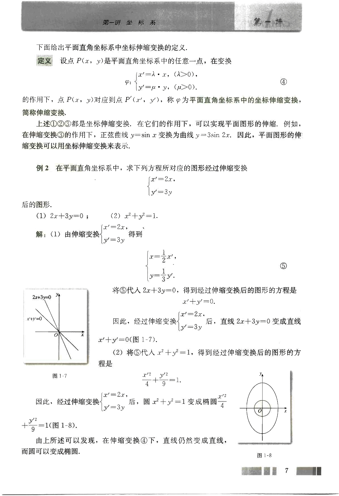
11 

# CHAPTER 普通高中课程标准实验教科书 数学(选修4-4) 坐标系与参数方程

## 思考

在伸缩变换④下，椭圆是否可以变成圆？抛物线、双曲线变成什么曲线？

## 习题1.1

1. 两个定点的距离为6，点M到这两个定点的距离的平方和为26，求点M的轨迹。
2. 已知点A为定点，线段BC在定直线上滑动，已知$|BC|=4$，点A到直线的距离为3，求$\triangle ABC$的外心的轨迹方程。
3. 用两种以上的方法证明：三角形的三条高线交于一点。
4. 在同一平面直角坐标系中，求下列方程所对应的图形经过伸缩变换后的图形：
    (1) $\frac{x^2}{9} + \frac{y^2}{4} = 1;$
    (2) $\frac{x^2}{18} - \frac{y^2}{12} = 1;$
    (3) $y^2 = 2x$.
5. 在同一平面直角坐标系中，经过伸缩变换$\begin{cases} x' = 3x \\ y' = y \end{cases}$后，曲线C变为曲线$x^2 + 9y^2 = 9$，求曲线C的方程并画出图象。
6. 在同一平面直角坐标系中，求满足下列图形变换的伸缩变换：
    (1) 直线$x - 2y = 2$变成直线$2x' - y' = 4;$
    (2) 曲线$x^2 - y^2 - 2x = 0$变成曲线$x'^2 - 16y'^2 - 4x' = 0$.

## 二 极坐标系

在解决本节开头的问题时，我们用“在信息中心的西偏北45°方向，距离$680\sqrt{10}$ m处”描述了巨响的位置，实际上，这是以信息中心为基点，以正西方向为参照，用与信息中心的距离和与正西方向所成的角来刻画巨响的位置，这是日常生活中常用的刻画位置的方法，体现了极坐标思想。

8

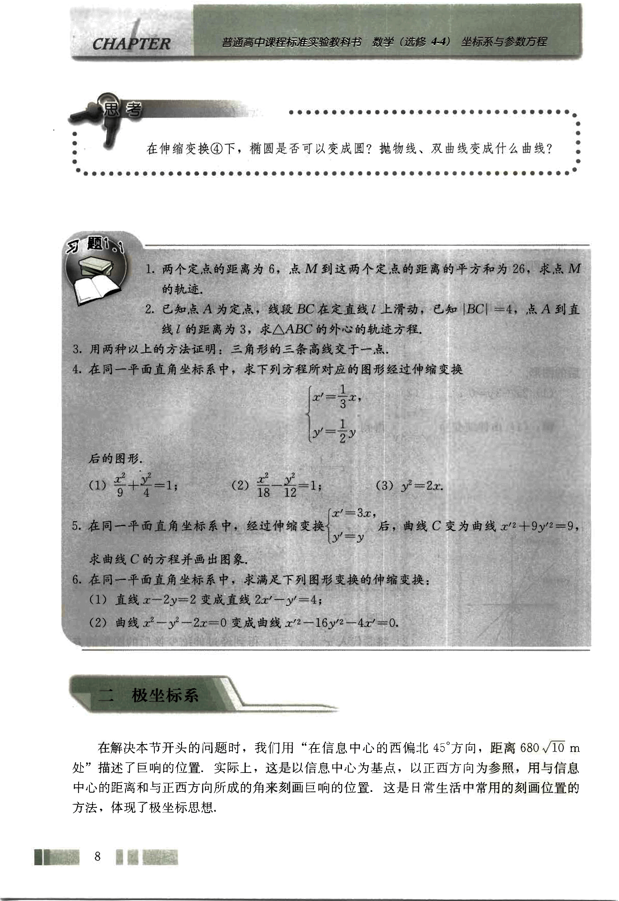
12 

# 极坐标系的概念

图1-9是某校园的平面示意图。假设某同学在教学楼处，请回答下列问题：

(1) 他向东偏北60°方向走120m后到达什么位置？该位置唯一确定吗？

(2) 如果有人打听体育馆和办公楼的位置，他应如何描述？

[图1-9](images/1-9.png)

以A为基点，射线AB为参照方向，利用与A的距离、与AB所成的角，就可以刻画平面上点的位置。有时它比直角坐标更方便，如在台风预报、地震预报、测量、航空、航海中就主要采用这种方法。

## 类比建立平面直角坐标系的过程，怎样建立用距离与角度确定平面上点的位置的坐标系？

如图1-10，在平面内取一个定点O，叫做极点；自极点O引一条射线$Ox$，叫做极轴；再选定一个长度单位、一个角度单位（通常取弧度）及其正方向（通常取逆时针方向），这样就建立了一个极坐标系。

[图1-10](images/1-10.png)

设M是平面内一点，极点O与点M的距离$|OM|$叫做点M的极径，记为$\rho$；以极轴$Ox$为始边，射线OM为终边的角$\angle xOM$叫做点M的极角，记为$\theta$。有序数对$(\rho, \theta)$叫做点M的极坐标，记作$M(\rho, \theta)$。

一般地，不作特殊说明时，我们认为$\rho \ge 0$，$\theta$可取任意实数。


例1 如图1-11，在极坐标系中，写出点A，B，C的极坐标，并标出点$D(2, \frac{\pi}{6})$，$E(4, \frac{3\pi}{4})$，$F(3.5, \frac{5\pi}{3})$所在的位置。

解：由图1-11，可得点A，B，C的极坐标分别为

$(1, 0)$，$(4, \frac{\pi}{2})$，$(5, \frac{4\pi}{3})$。

9

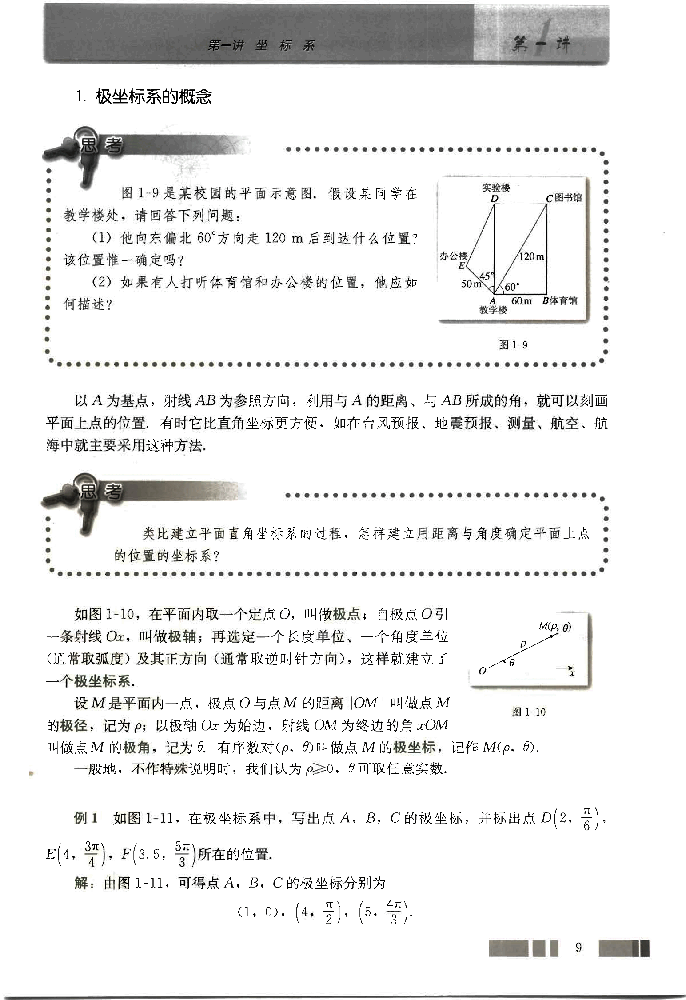
13 

# CHAPTER 普通高中课程标准实验教科书 数学(选修4-4) 坐标系与参数方程

图1-11

图1-12

点D, E, F的位置如图1-12所示.

例2 在图1-9中，用点A, B, C, D, E分别表示教学楼，体育馆，图书馆，实验楼，办公楼的位置。建立适当的极坐标系，写出各点的极坐标。

解：以点A为极点，AB所在的射线为极轴（单位长度为1m），建立极坐标系（图1-13）。点A，B，C，D，E的极坐标分别为(0, 0), (60, 0), (120, $\frac{\pi}{3}$), (60$\sqrt{3}$, $\frac{\pi}{2}$), (50, $\frac{3\pi}{4}$).

图1-13

建立极坐标系后，给定ρ和θ，就可以在平面内唯一确定点M；反过来，给定平面内任意一点，也可以找到它的极坐标(ρ, θ).

思考

在极坐标系中，(4, $\frac{\pi}{6}$), (4, $\frac{\pi}{6}$ + 2π), (4, $\frac{\pi}{6}$ + 4π), (4, $\frac{\pi}{6}$ - 2π)表示的点有什么关系？你能从中体会极坐标与直角坐标在刻画点的位置时的区别吗？

由终边相同的角的定义可知，上述极坐标表示同一个点。实际上，(4, $\frac{\pi}{6}$ + 2kπ)(k∈Z)都表示这个点。

一般地，极坐标(ρ, θ)与(ρ, θ + 2kπ)(k∈Z)表示同一个点。特别地，极点的坐标为(0, 0)(θ∈R)。和直角坐标不同，平面内一个点的极坐标有无数种表示。

如果规定ρ≥0, 0 < θ < 2π，那么除极点外，平面内的点可用唯一的极坐标(ρ, θ)表示；同时，极坐标(ρ, θ)表示的点也是唯一确定的。

10

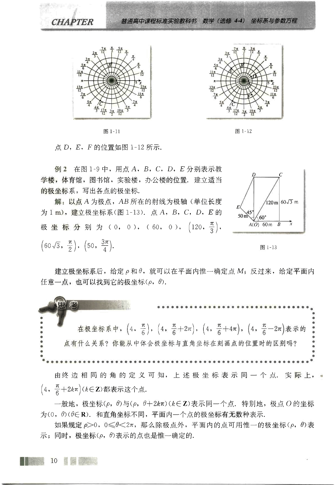
14 

# 第一讲 坐标系

## 2. 极坐标和直角坐标的互化

**思考**

平面内的一个点既可以用直角坐标表示，也可以用极坐标表示，那么，这两种坐标之间有什么关系呢？

把直角坐标系的原点作为极点，x轴的正半轴作为极轴，并在两种坐标系中取相同的长度单位。设M是平面内任意一点，它的直角坐标是(x, y)，极坐标是(ρ, θ)。从图1-14可以得出它们之间的关系：

$x = \rho cos\theta$,  $y = \rho sin\theta$. ①

由①又可得到下面的关系式：

$\rho^2 = x^2 + y^2$,  $tan\theta = \frac{y}{x} (x \neq 0)$.

这就是极坐标与直角坐标的互化公式。

[图1-14](images/1-14.png)


**例3** 将点M的极坐标$(5, \frac{2\pi}{3})$化成直角坐标。

解：$x = 5cos\frac{2\pi}{3} = -\frac{5}{2}$， $y = 5sin\frac{2\pi}{3} = \frac{5\sqrt{3}}{2}$.

因此，点M的直角坐标为$(-\frac{5}{2}, \frac{5\sqrt{3}}{2})$.


**例4** 将点M的直角坐标$(-\sqrt{3}, -1)$化成极坐标。

解：$\rho = \sqrt{(-\sqrt{3})^2 + (-1)^2} = \sqrt{3 + 1} = 2$,

$tan\theta = \frac{-1}{-\sqrt{3}} = \frac{\sqrt{3}}{3}$.

因为点M在第三象限，所以$\theta = \frac{7\pi}{6}$.

因此，点M的极坐标为$(2, \frac{7\pi}{6})$.


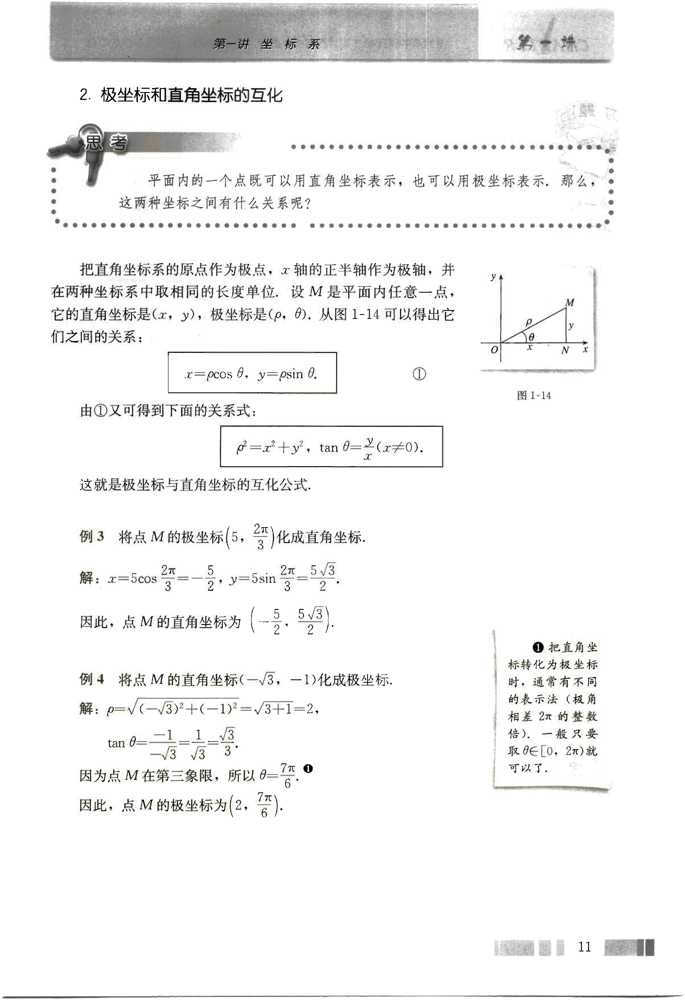
15 

# CHAPTER

普通高中课程标准实验教科书 数学(选修4-4) 坐标系与参数方程

## 习题1.2

1. 写出图中A, B, C, D, E, F, G各点的极坐标($\rho$>0, 0<$ \theta $<2$\pi$).

2. 中央气象台在2004年7月15日10:30发布的一则台风消息:今年第9号热带风暴“圆规”的中心今天上午八点钟已经移到了广东省汕尾市东南方大约440公里的南海东北部海面上,中心附近最大风力有9级,请建立适当的坐标系,用坐标表示出该台风中心的位置.

3. 在极坐标系中,已知两点A(3, $\frac{\pi}{3}$), B(1, $\frac{2\pi}{3}$), 求A, B两点间的距离.

4. 已知点的极坐标分别为(3, $\frac{\pi}{4}$), (2, $\frac{2\pi}{3}$), (4, $\frac{\pi}{2}$), ($\frac{\sqrt{3}}{2}$, $\pi$), 求它们的直角坐标.

5. 已知点的直角坐标分别为(3, $\sqrt{3}$), (0, $-\frac{\sqrt{5}}{3}$), ($\frac{7}{2}$, 0), (-2, -2$\sqrt{3}$), 求它们的极坐标.

## 三 简单曲线的极坐标方程

在平面直角坐标系中,平面曲线C可以用方程f(x, y) = 0表示,曲线与方程满足如下关系:

(1) 曲线C上点的坐标都是方程f(x, y) = 0的解;

(2) 以方程f(x, y) = 0的解为坐标的点都在曲线C上.

那么,在极坐标系中,平面曲线是否可以用方程f($\rho$, $\theta$) = 0表示呢?

## 1. 圆的极坐标方程

**探究**

如图1-15, 半径为a的圆的圆心坐标为C(a, 0)(a>0). 你能用一个等式表示圆上任意一点的极坐标($\rho$, $\theta$)满足的条件吗?

如图1-15, 圆经过极点O. 设圆和极轴的另一个交点是A, 那么|OA| = 2a. 设M($\rho$, $\theta$)为圆上除点O, A以外的任意一点, 则OM$\perp$AM. 在Rt$\triangle$AMO中,


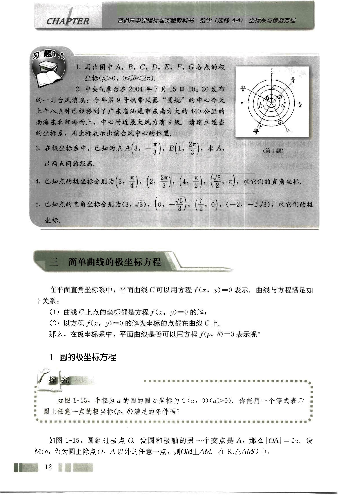
16 

# 第一讲 坐标系

## 极坐标系

|OM| = |OA| cos ∠MOA,

p = 2a cos θ. ①

可以验证，点 O(0, $\frac{\pi}{2}$), A(2a, 0) 的坐标满足等式 ①。

于是，等式 ① 就是圆上任意一点的极坐标 (ρ, θ) 满足的条件。另一方面，可以验证，坐标适合等式 ① 的点都在这个圆上。

一般地，在极坐标系中，如果平面曲线 C 上任意一点的极坐标中至少有一个满足方程 f(ρ, θ) = 0，并且坐标适合方程 f(ρ, θ) = 0 的点都在曲线 C 上，那么方程 f(ρ, θ) = 0 叫做曲线 C 的极坐标方程。

因此，① 就是圆心在 C(a, 0) (a > 0)，半径为 a 的圆的极坐标方程。

可以看到，在求曲线方程时，关键是找出曲线上的点满足的几何条件，将它用坐标表示，再通过代数变换进行化简。而且，与求圆的直角坐标方程相比，求它的极坐标方程更加简便，因为在极坐标系下，圆上点的坐标 ρ, θ 所满足的条件更容易表示，代数变换也更加直接。

例 1  已知圆 O 的半径为 r，建立怎样的极坐标系，可以使圆的极坐标方程更简单？

解：如果以圆心 O 为极点，从 O 出发的一条射线为极轴建立坐标系（图 1-16），那么圆上各点的几何特征就是它们的极径都等于半径 r。

设 M(ρ, θ) 为圆上任意一点，则 |MO| = r，即

ρ = r。

显然，使极点与圆心重合时的圆的极坐标方程在形式上比 ① 简单。

## 直线的极坐标方程

探究

如图 1-17，直线 l 经过极点，从极轴到直线的角是 $\frac{\pi}{4}$，求直线的极坐标方程。

如图 1-18，以极点 O 为分界点，直线上点的极坐标分成射线 OM、射线 OM’ 两部分。射线 OM 上任意一点的极角都是 $\frac{\pi}{4}$，因此射线 OM 的极坐标方程是


13

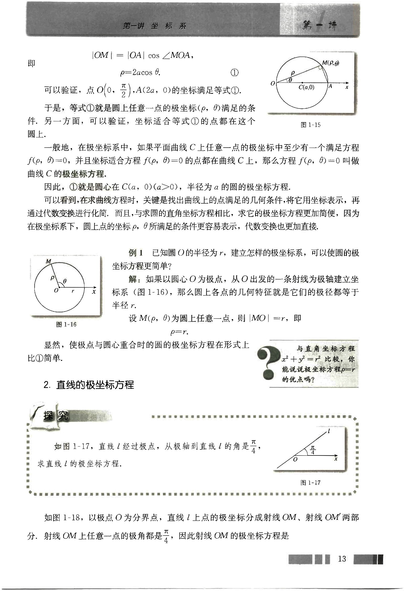
17 

# CHAPTER

普通高中课程标准实验教科书 数学(选修4-4) 坐标系与参数方程

$\theta = \frac{\pi}{4} \quad (\rho \ge 0);$

射线 OM上任意一点的极角都是$\frac{\pi}{4}$，因此射线 OM的极坐标方程是

$\theta = \frac{5\pi}{4} \quad (\rho \ge 0).$

[图1-18](images/1-18.png)

因此，直线的方程可以用$\theta = \frac{\pi}{4}$和$\theta = \frac{5\pi}{4}$表示。

与用直角坐标方程 $y = x$ 表示直线比较，用极坐标方程表示过极点的直线并不方便。当然，如果允许$\rho$取全体实数，那么极坐标方程

$\theta = \frac{\pi}{4} \quad (\rho \in R)$或$\theta = \frac{5\pi}{4} \quad (\rho \in R)$

都是直线的方程。

若$\rho < 0$，则$-\rho > 0$，我们规定点M($\rho$,$\theta$)与点P(-$\rho$,$\theta$)关于极点对称。


## 例2 求过点A(a, 0) (a > 0), 且垂直于极轴的直线的极坐标方程.

解：如图1-19，设M($\rho$, $\theta$)为$l$上除点A外的任意一点。连接OM，由Rt△MOA有

$|OM| \cos \angle MOA = |OA|$，

$\rho \cos \theta = a$.

[图1-19](images/1-19.png)

可以验证，点A的坐标(a, 0)满足上式，因此，这就是所求直线的极坐标方程。


## 例3 设点P的极坐标为($\rho_1$, $\theta_1$), 直线$l$过点P且与极轴所成的角为$\alpha$，求直线$l$的极坐标方程.

解：如图1-20，设M($\rho$, $\theta$)为直线$l$上除点P外的任意一点，连接OM，则$|OM| = \rho$，$\angle xOM = \theta$。由点P的极坐标为($\rho_1$, $\theta_1$)知$|OP| = \rho_1$，$\angle xOP = \theta_1$。

设直线$l$与极轴交于点A，已知直线$l$与极轴成角$\alpha$，于是$\angle xAM = \alpha$。在△MOP中，

$\angle OMP = \alpha - \theta$，$\angle OPM = \pi - (\alpha - \theta)$，

[图1-20](images/1-20.png)

由正弦定理，得

$\frac{|OM|}{\sin \angle OPM} = \frac{|OP|}{\sin \angle OMP}$

$\frac{\rho}{\sin [\pi - (\alpha - \theta)]} = \frac{\rho_1}{\sin (\alpha - \theta)}$，

$\rho \sin (\alpha - \theta) = \rho_1 \sin (\alpha - \theta_1)$.

②

显然，点P的坐标($\rho_1$, $\theta_1$)是方程①的解，因此，方程②为直线的极坐标方程。

14

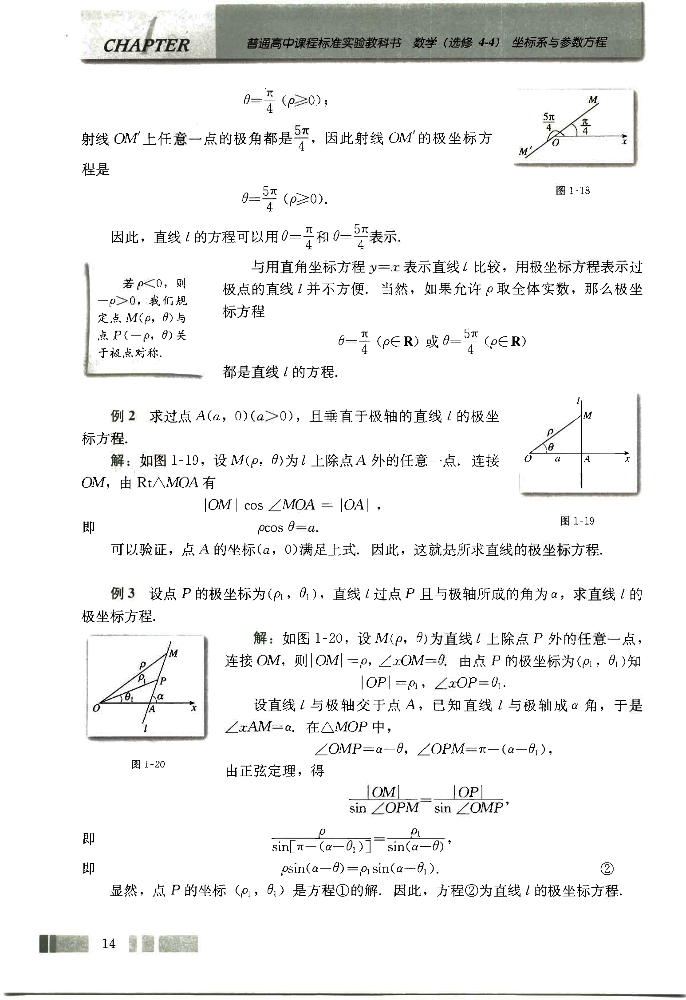
18 

# 习题 1.3

## 1.

说明下列极坐标方程表示什么曲线，并画图。

(1) $\rho = 5$;

(2) $\theta = \frac{5\pi}{6}$ ($\rho \in R$);

(3) $\rho = 2\sin\theta$.


## 2.

在极坐标系中，求适合下列条件的直线或圆的极坐标方程：

(1) 过极点，倾斜角是 $\frac{\pi}{3}$ 的直线；

(2) 过点 $(2, \frac{\pi}{3})$，并且和极轴垂直的直线；

(3) 圆心在 A$(1, \frac{\pi}{4})$，半径为 1 的圆；

(4) 圆心在 $(a, \frac{3\pi}{2})$，半径为 $a$ 的圆。


## 3.

把下列直角坐标方程化成极坐标方程：

(1) $x = 4$;

(2) $y + 2 = 0$;

(3) $2x - 3y - 1 = 0$;

(4) $x^2 - y^2 = 16$.


## 4.

把下列极坐标方程化成直角坐标方程：

(1) $\rho \sin\theta = 2$;

(2) $\rho(2\cos\theta + 5\sin\theta) - 4 = 0$;

(3) $\rho = -10\cos\theta$;

(4) $\rho = 2\cos\theta - 4\sin\theta$.


## 5.

已知直线的极坐标方程为 $\rho \sin(\theta + \frac{\pi}{4}) = \frac{\sqrt{2}}{2}$，求点 A$(2, \frac{7\pi}{4})$ 到这条直线的距离。


## 6.

已知椭圆的中心为 O，长轴、短轴的长分别为 2a, 2b ($a > b > 0$), A, B 分别为椭圆上的两点，且 OA $\perp$ OB.

(1) 求证：$\frac{1}{|OA|^2} + \frac{1}{|OB|^2}$ 为定值；

(2) 求 $\triangle AOB$ 面积的最大值和最小值。

15

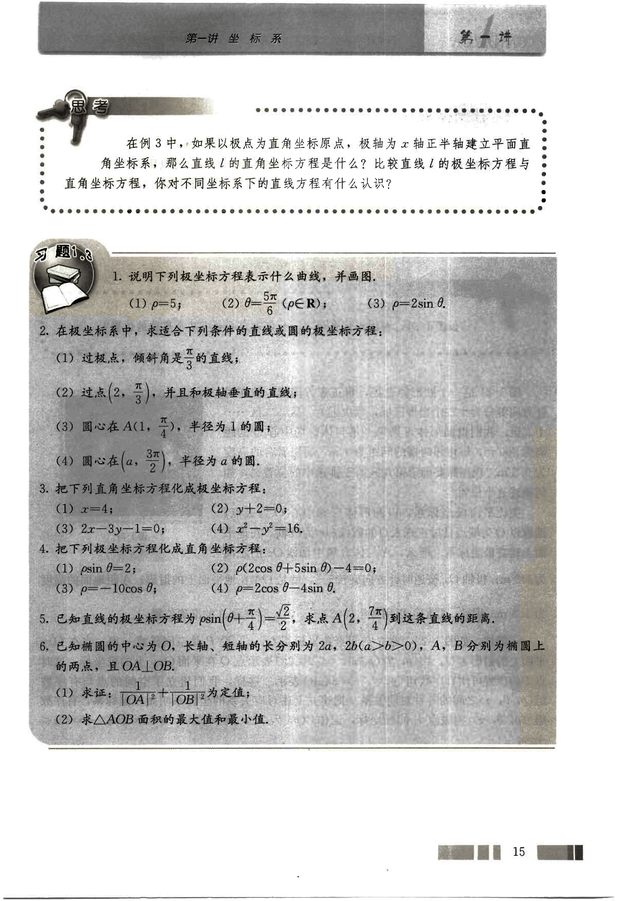
19 

# 四 柱坐标系与球坐标系简介

建立平面(或空间)直角坐标系后，平面上(或空间)的点可以用直角坐标表示；建
立极坐标系后，平面上的点可以用极坐标表示，类似地，是否能建立空间极坐标系，用极
坐标表示空间的点呢？

## 1. 柱坐标系

思考

如图1-21，在圆形体育场内，如何确定看台上某个座位的位置？

图1-21是一个圆形体育场，自正东方向起，按逆时
针方向等分为十二个扇形区域，顺次记为一区，二区……
十二区。我们设圆形体育场第一排与体育场中心的距
离为300 m，每相邻两排的间距为1 m，每层看台的高度
为0.6 m。现在需要确定第九区第三排正中的位置A，如
何描述这个位置？

类比平面极坐标系，以圆形体育场中心O为极点，
选取以O为端点且过正东入口的射线Ox为极轴，在地平
面上建立极坐标系。那么，A与体育场中轴线Oz的距离
为302 m；极轴Ox按逆时针方向旋转$\frac{17\pi}{12}$，就是OA在地平面上的射影；A距地面的高度
为1.8 m。因此，我们可以用数组(302, $\frac{17\pi}{12}$, 1.8)表示A的准确位置。

一般地，如图1-22，建立空间直角坐标系Oxyz。设P是空间任意一点，它在Oxy
平面上的射影为Q，用(ρ, θ)(ρ≥0, 0＜θ＜2π)表示点Q在平面Oxy上的极坐标，这时
点P的位置可用有序数组(ρ, θ, z)(z∈R)表示。这样，我们建立了空间的点与有序数
组(ρ, θ, z)之间的一种对应关系，把建立上述对应关系的坐标系叫做柱坐标系，有序数
组(ρ, θ, z)叫做点P的柱坐标，记作P(ρ, θ, z)，其中ρ≥0, 0＜θ＜2π, -∞＜z＜
+∞。

16

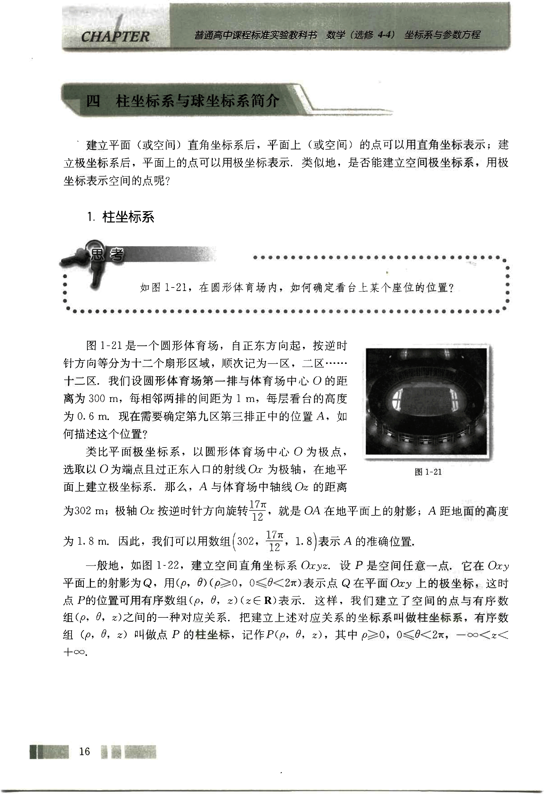
20 

# 第一讲 坐标系

## 柱坐标系

图1-22

柱坐标系又称半极坐标系，它是由平面极坐标系及空间直角坐标系中的一部分建立起来的。

**思考**

1. 给定一个底面半径为r，高为h的圆柱，建立柱坐标系，利用柱坐标描述圆柱侧面以及底面上点的位置。
2. 举例说明柱坐标系在日常生活中的应用。

## 球坐标系

**思考**

在航空航天领域，人们怎样确定航天器的准确位置呢？

图1-23

如图1-23，为确定航天器在某一时刻的位置，需要在地球上建立若干个固定和流动的地面遥感观测站监测航天器的运行数据，并将这些数据汇总到监测中心，由监测中心根据数据计算出某一时刻航天器到地球表面的距离r，以及此时航天器所处位置的经度φ和纬度θ，从而可以用有序数组(r, φ, θ)表示此时航天器的具体位置。

那么如何建立坐标系，才能方便地得出r, φ, θ的值，并由有序数组(r, φ, θ)找到航天器的具体位置呢？

在赤道平面上，我们选取地球球心为极点，O为端点且与零子午线相交的射线Ox为极轴，建立平面极坐标系，在此基础


---
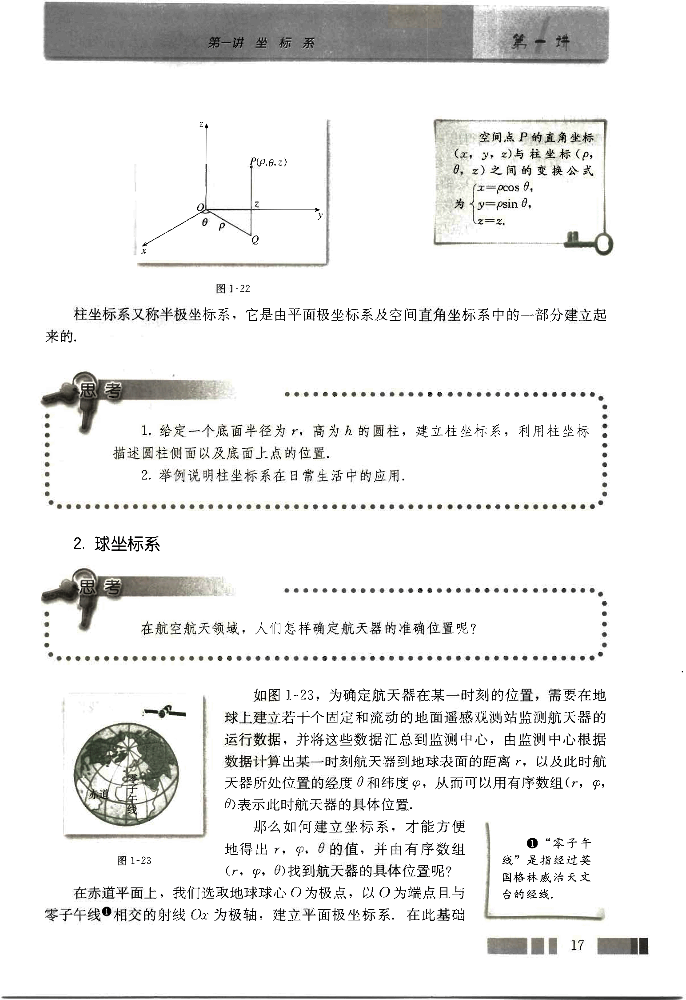
21 

# CHAPTER

普通高中课程标准实验教科书 数学(选修 4-4) 坐标系与参数方程

上，取 O 为端点且经过北极的射线 Oz（垂直于赤道平面）为另一条极轴，这样就与前面建立的平面极坐标系一起建立了空间坐标系。在这个坐标系中，r，φ，θ 的值都有明确的意义，从而便于我们得出 r，φ，θ 的值，并由有序数组 (r，φ，θ) 找到航天器的具体位置。

一般地，如图 1-24，建立空间直角坐标系 Oxyz。设 P 是空间任意一点，连接 OP，记 |OP| = r，OP 与 Oz 轴正向所夹的角为 φ。设 P 在 Oxy 平面上的射影为 Q，Ox 轴按逆时针方向旋转到 OQ 时所转过的最小正角为 θ。这样点 P 的位置就可以用有序数组 (r，φ，θ) 表示。这样，空间的点与有序数组 (r，φ，θ) 之间建立了一种对应关系，把建立上述对应关系的坐标系叫做球坐标系（或空间极坐标系），有序数组 (r，φ，θ) 叫做点 P 的球坐标，记做 P(r, φ, θ)，其中 r≥0，0 < φ < π，0 < θ < 2π.


空间点 P 的直角坐标 (x, y, z) 与球坐标 (r, φ, θ) 之间的变换关系为：

```
x = rsinφcosθ
y = rsinφsinθ
z = rcosφ
```

球坐标系在地理学、天文学中有着广泛应用。在测量实践中，球坐标中的角 θ 称为被测点 P(r, φ, θ) 的方位角，90° - φ 称为高低角。

## 思考

在研究空间图形的几何特征时，我们应该怎样选择坐标系呢？

至此，我们已经学习了数轴、平面直角坐标系、平面极坐标系、空间直角坐标系、柱坐标系、球坐标系等知识。可以看到，坐标系是联系形与数的桥梁，利用坐标系可以实现几何问题与代数问题的相互转化。不同的坐标系有不同的特点，在实际应用时，我们可以根据问题的特点选择适当的坐标系，借助坐标系方便、简捷地研究问题。

1. 请利用球坐标系说明人们如何确定地面上一点的位置。
2. 举例说明球坐标系在日常生活中的应用。

18

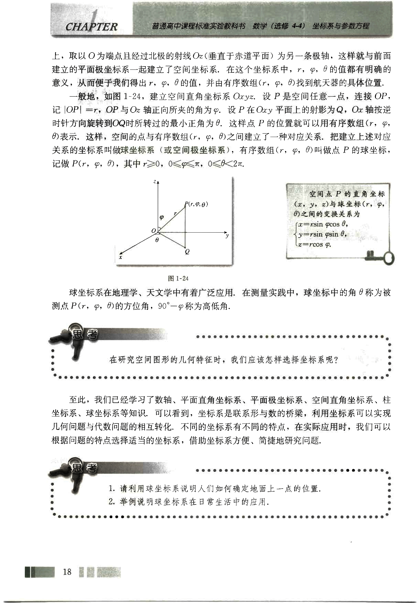
22 

# 笛卡儿、费马与坐标方法

坐标方法的诞生与生产和科技的发展紧密相关。十六世纪以后，天文、力学、航海等都对几何学提出了新需要。比如，德国天文学家开普勒发现行星是绕着太阳沿椭圆轨道运行的，太阳处在这个椭圆的一个焦点上；意大利科学家伽利略发现投掷物体是沿着抛物线运动的……因此，如何更加精确地刻画圆锥曲线，使圆锥曲线的性质得到定量化表述，成为急需数学家解决的问题。

解析几何的基本思想就是在平面上引进“坐标”的概念，建立平面上的点和坐标之间的一一对应，从而建立曲线的方程，并通过方程研究曲线的性质。尽管用坐标确定点的位 置的基本思想古已有之（如地理中所用的“经线”和“纬线”），而且有先驱者曾经研究过这个问题，但解析几何的真正发明要归功于法国数学家笛卡儿和他的同胞费马。

笛卡儿 (R. Descartes, 1596—1650) 是法国 17 世纪的哲学家、数学家，近代科学方法论的创始人。1637 年，他发表了著名的《几何学》，这标志着解析几何的诞生。在《几何学》中，笛卡儿引用“变量”这个概念，并建立平面上的坐标系。他在解决作图问题时，把坐标平面上的“点”与作为坐标的有序“数对”对应起来，再把平面上的“曲线”与含有两个未知量的“方程”对应起来。最重要的是点与坐标的对应，流动的坐标就是变量，方程既表示已知量与未知量之间的关系，又确定了变量之间的关系。所有这些都依赖于平面上坐标系的建立。

费马 (P. d. Fermat, 1601—1665) 是 17 世纪上半叶最伟大的数学家之一，以公元前 3 世纪古希腊几何学家阿波罗尼奥斯的工作为出发点，他在竭力恢复失传的阿波罗尼奥斯的著作《论平面轨迹》时发现，如果通过坐标系把代数用于几何，轨迹的研究就容易进行。他所创建的坐标系比笛卡儿的坐标系更为明显，也更接近现代坐标系，而笛卡儿的坐标系尽管并不像现在这样明确（例如，他甚至没有考虑坐标的负值，等等），但笛卡儿的方法更具一般性，适用范围也更加广泛。

费马从方程出发研究它的轨迹，笛卡儿则从轨迹开始建立它的方程，这正是解析几何中一个问题的正反两种提法，但各有侧重。前者是从代数到几何，后者是从几何到代数。

笛卡儿和费马共同分享了创立解析几何的殊荣。

解析几何的创立引入了一系列新的数学概念，特别是将变量引入数学，使数学进入了一个新的发展时期，即变量数学时期。恩格斯对此曾经作过评价：“数学中的转折点是笛卡儿的变数，有了变数，运动进入了数学；有了变数，辩证法进入了数学；有了变数，微分和积分也就立刻成为必要的了。”

1655 年，英国数学家沃利斯首先有意识地引进负的纵、横坐标，改进了笛卡儿、费马的坐标系，得到了完整的圆锥曲线的方程，并用这些方程直接推导出圆锥曲线的几何性质，充分显示出坐标方法的巨大力量。意大利数学家卡瓦列里最先使用极坐标来求阿基米德螺线下的面积。英国物理学家、数学家牛顿第一个把极坐标看成是确定平面上点的位置

19

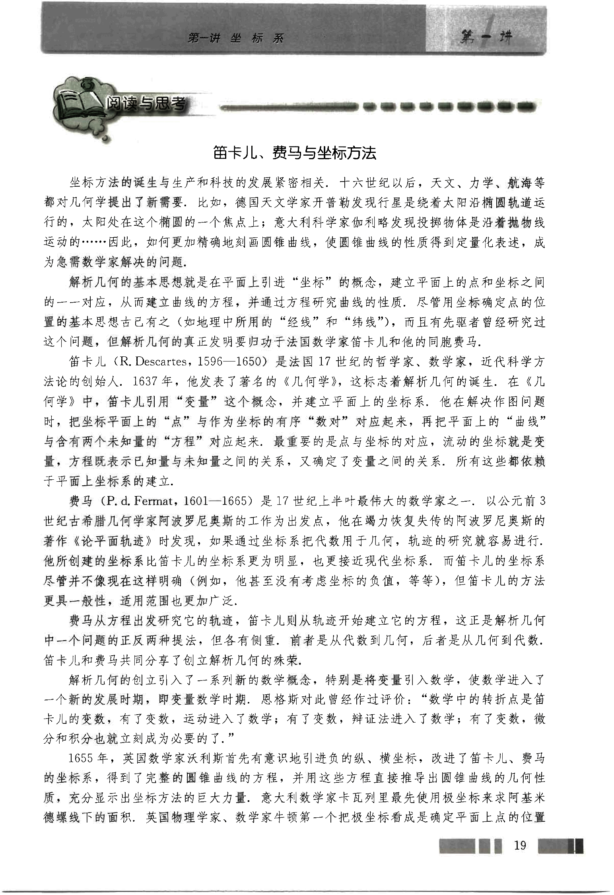
23 

# CHAPTER

普通高中课程标准实验教科书 数学(选修 4-4) 坐标系与参数方程

的一种方法。瑞士数学家伯努利于 1691 年最先发表了上述有关极坐标系的文章，所以一般人们都称伯努利为极坐标系的发明者。此后，数学家们还引进了空间直角坐标系、柱坐标系和球坐标系，用坐标方法讨论曲面和空间曲线。

坐标法的思想促使人们运用各种代数的方法解决几何问题，这种方法具有一般性，它沟通了数学内部数与形、代数与几何两大学科之间的联系，从此代数和几何互相汲取新鲜的活力，得到迅速的发展，并且为近代数学的机械化证明提供了有力的工具。

随着数学学习的不断深入，同学们会看到坐标方法的更广泛应用，感受到它的巨大力量，你能联系自己的学习经历，谈谈坐标方法的作用与意义吗？

20

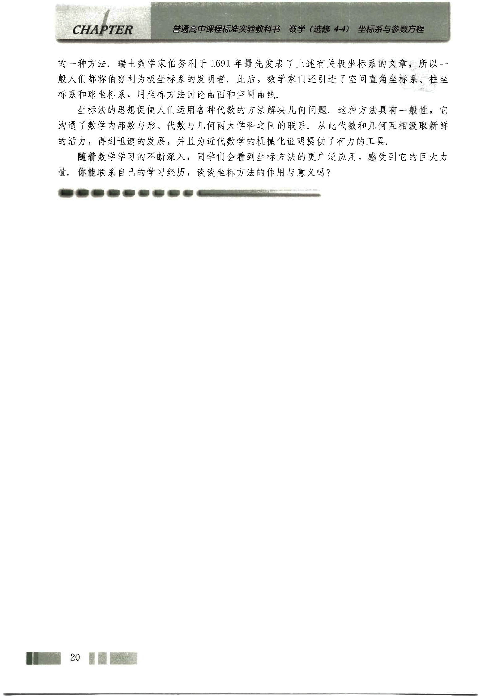
24 

# 第二讲 参数方程

在过去的学习中我们已经掌握了一些求曲线方程的方法，在求某些曲线方程时，直接确定曲线上点的坐标x，y的关系并不容易，但如果利用某个参数作为联系它们的桥梁，那么就可以方便地得出坐标x，y所要适合的条件，即参数可以帮助我们得出曲线的方程f(x,y)=0. 下面我们就来研究求曲线参数方程的问题。

## 曲线的参数方程

### 1.参数方程的概念

**探究**

如图2-1，一架救援飞机在离灾区地面500 m高处以100 m/s的速度作水平直线飞行，为使投放的救援物资准确落于灾区指定的地面（不计空气阻力），飞行员应如何确定投放时机呢？

[图2-1](images/2-1.png)

如图2-2，设飞机在点A将物资投出机舱，在经过飞行航线（直线）且垂直于地平面的平面上建立平面直角坐标系，其中x轴为地平面与这个平面的交线，y轴经过点A. 记物资投出机舱时为时刻0，在时刻t时物资的位置为点M(x,y)，则x表示物资的水平位移量，y表示物资距地面的高度，由于水平位移量x与高度y是由两种不同的运动得到的，因此直接建立x，y所要满足的关系式并不容易。

换一个角度看这个问题。

[图2-2](images/2-2.png)

21

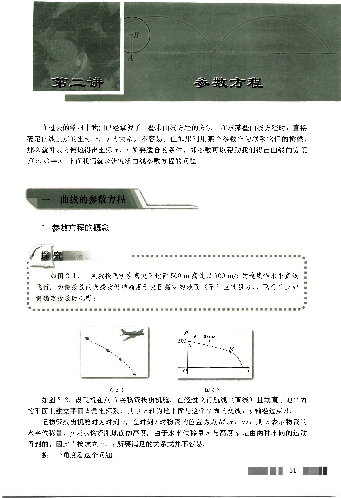
25 

# CHAPTER

普通高中课程标准实验教科书 数学(选修4-4) 坐标系与参数方程

由物理知识，物资投出机舱后，它的运动是下列两种运动的合成：
沿 Ox 方向以 100 m/s 的速度作匀速直线运动；
沿 Oy 的反方向作自由落体运动.

物资出舱后，在时刻 t，它在水平方向的位移量 x = 100t，离地面的高度 y = 500 - $\frac{1}{2}gt^2$，即

$\begin{cases}
x = 100t \\
y = 500 - \frac{1}{2}gt^2
\end{cases}$  ①

其中，g 是重力加速度 (g = 9.8 m/s²).

在 t 的取值范围内，给定的 t 的一个值，由 ① 可以唯一确定 x，y 的值，也就是说，当 t 确定时，点 M(x, y) 的位置就唯一确定了. 比如，当 t = 6 s 时，x = 600 m，y ≈ 324 m，即物资的水平位移量为 600 m，高度约为 324 m.

救援物资落地时，应有 y = 0，即

500 - $\frac{1}{2}gt^2$ = 0,

解得 t ≈ 10.10 s. 将 t = 10.10 代入 ①，得到 x ≈ 1010 m. 因此，飞行员在离救援点的水平距离约为 1010 m 时投放物资，可以使其准确落在指定地点.

由上所述，由 ① 可以确定物资投放后每一个时刻的位置，还可以确定物资投放时机.

一般地，在平面直角坐标系中，如果曲线上任意一点的坐标 x，y 都是某个变数 t 的函数

$\begin{cases}
x = f(t) \\
y = g(t)
\end{cases}$ ②

并且对于 t 的每一个允许值，由方程组 ② 所确定的点 M(x, y) 都在这条曲线上，那么方程组 ② 就叫做这条曲线的参数方程，联系变数 x，y 的变数 t 叫做参数变数，简称参数. 相对于参数方程而言，直接给出点的坐标间关系的方程叫做普通方程.

参数是联系变数 x，y 的桥梁，可以是一个有物理意义或几何意义的变数，也可以是没有明显实际意义的变数.


例 1  已知曲线 C 的参数方程是 $\begin{cases}
x = 3t \\
y = 2t^2 + 1
\end{cases}$ (t 为参数)

(1) 判断点 M₁(0, 1), M₂(5, 4) 与曲线 C 的位置关系;

(2) 已知点 M₃(6, a) 在曲线 C 上，求 a 的值.

解：(1) 把点 M₁ 的坐标 (0, 1) 代入方程组，解得 t = 0，因此 M₁ 在曲线 C 上.

把点 M₂ 的坐标 (5, 4) 代入方程组，得到

$\begin{cases}
5 = 3t \\
4 = 2t^2 + 1
\end{cases}$

这个方程组无解，因此点 M₂ 不在曲线 C 上.

22

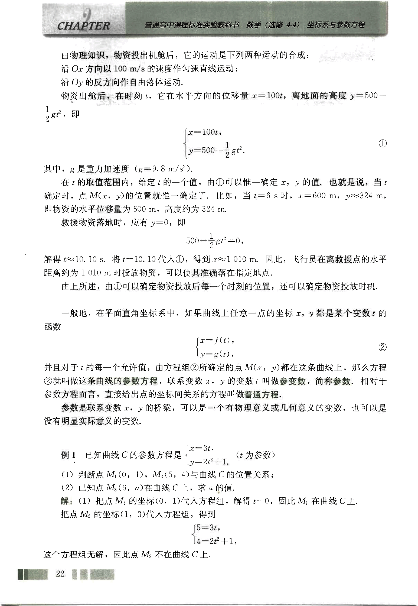
26 

# 第二讲 参数方程

(2) 因为点M₃(6,a)在曲线C上,所以

$\begin{cases} 6=3t \\ a=2t^2+1 \end{cases}$

解得 t=2, a=9.
因此，a=9.

## 2. 圆的参数方程

圆周运动是生产生活中常见的，当物体绕定轴作匀速转动时，物体中各个点都作匀速圆周运动（图2-3）。那么，怎样刻画运动中点的位置呢？

[图2-3](images/2-3.png) [图2-4](images/2-4.png)

如图2-4，设圆O的半径是r，点M从初始位置M₀(t=0时的位置)出发，按逆时针方向在圆O上作匀速圆周运动，点M绕点O转动的角速度为ω。以圆心O为原点，OM₀所在的直线为x轴，建立直角坐标系。显然，点M的位置由时刻t唯一确定，因此可以取t为参数。

如果在时刻t，点M转过的角度是θ，坐标是M(x, y)，那么θ=ωt。设|OM|=r，那么由三角函数定义，有

cos ωt = $\frac{x}{r}$, sin ωt = $\frac{y}{r}$

即

$\begin{cases} x = rcos ωt \\ y = rsin ωt \end{cases}$ (t为参数)

这就是圆心在原点O，半径为r的圆的参数方程，其中参数t有明确的物理意义（质点作匀速圆周运动的时刻）。

考虑到θ=ωt，也可以取θ为参数，于是有

$\begin{cases} x = rcos θ \\ y = rsin θ \end{cases}$ (θ为参数)

这也是圆心在原点O，半径为r的圆的参数方程，其中参数θ的几何意义是OM₀绕点O逆时针旋转到OM的位置时，OM₀转过的角度。

由于选取的参数不同，圆有不同的参数方程。一般地，同一条曲线，可以选择不同的变量为参数，因此得到的参数方程也可以有不同的形式，形式不同的参数方程，它们表示的曲线相同。


23

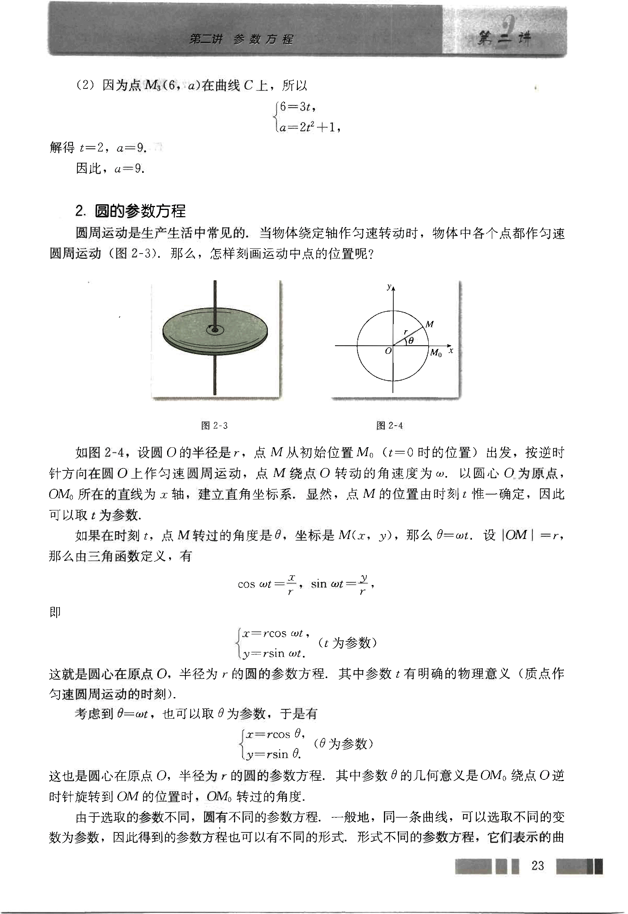
27 

# CHAPTER 9  坐标系与参数方程

线却可以是相同的.另外,在建立曲线的参数方程时,要注明参数及参数的取值范围.

## 例2

如图2-5,圆O的半径为2,P是圆上的动点,Q(6,0)是x轴上的定点,M是PQ的中点,当点P绕O作匀速圆周运动时,求点M的轨迹的参数方程.


**分析**:取∠xOP=θ为参数,则圆O的参数方程是

```
x = 2cos θ;
y = 2sin θ.     (θ为参数)
```

当θ变化时,动点P在圆O上运动,线段PQ也随之变动,从而使点M运动. 因此,点M的运动可以看成是由角θ决定的,于是,选θ为参数是合适的.

**解**:设点M的坐标是(x, y), ∠xOP=θ,则点P的坐标是(2cosθ, 2sinθ). 由中点坐标公式可得

```
x = (2cosθ + 6) / 2 = cosθ + 3;
y = (2sinθ) / 2 = sinθ.
```

因此,点M的轨迹的参数方程是

```
x = cosθ + 3;
y = sinθ.       (θ为参数)
```

## 思考

这里定点Q在圆O外,你能判断这个轨迹表示什么曲线吗?如果定点Q在圆O上,轨迹是什么?如果定点Q在圆O内,轨迹又是什么?


## 3. 参数方程和普通方程的互化

上例中,由参数方程

```
x = cosθ + 3;
y = sinθ.       (θ为参数)
```

直接判断点M的轨迹的曲线类型并不容易,但如果将参数方程转化为熟悉的普通方程,


24

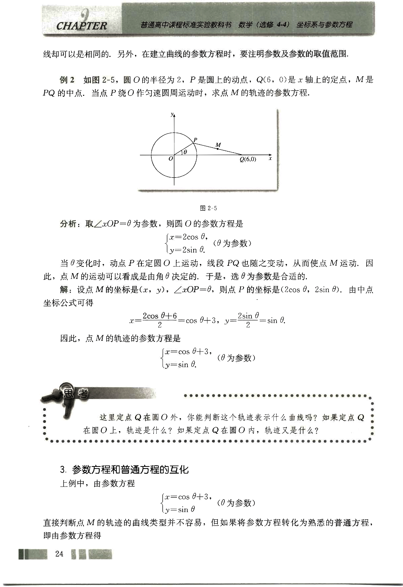
28 

# 第二讲 参数方程

## 于是

cos θ = x - 3, sin θ = y,

(x - 3)² + y² = 1.

这就容易得出点M的轨迹是圆心在(3, 0), 半径为1的圆.

将曲线的参数方程化为普通方程, 有利于识别曲线的类型.

曲线的参数方程和普通方程是曲线方程的不同形式, 一般地, 可以通过消去参数而从
参数方程得到普通方程. 如果知道变数x, y中的一个与参数t的关系, 例如x = f(t), 把
它代入普通方程, 求出另一个变数与参数的关系 y = g(t), 那么

$\begin{cases}
x = f(t), \\
y = g(t)
\end{cases}$

就是曲线的参数方程.

在参数方程与普通方程的互化中, 必须使x, y的取值范围保持一致.

## 例3 把下列参数方程化为普通方程, 并说明它们各表示什么曲线:

(1) $\begin{cases}
x = \sqrt{t} + 1, \\
y = 1 - 2\sqrt{t};
\end{cases}$ (t为参数)          (2) $\begin{cases}
x = \sin θ + \cos θ, \\
y = 1 + \sin 2θ.
\end{cases}$ (θ为参数)

解: (1) 由 x = $\sqrt{t}$ + 1 ≥ 1 有

$\sqrt{t}$ = x - 1,

代入 y = 1 - 2$\sqrt{t}$, 得到

y = -2x + 3.

又因为 x = $\sqrt{t}$ + 1 ≥ 1, 所以与参数方程等价的普通方程是

y = -2x + 3  (x ≥ 1).

这是以(1, 1)为端点的一条射线(包括端点)(图2-6).

(2) 把 x = sin θ + cos θ 平方后减去 y = 1 + sin 2θ, 得到

x² = y.

又因为 x = sin θ + cos θ = $\sqrt{2}\sin(\frac{\pi}{4} + θ)$, 所以 x ∈ [-$\sqrt{2}$, $\sqrt{2}$].

因此, 与参数方程等价的普通方程是

x² = y, x ∈ [-$\sqrt{2}$, $\sqrt{2}$].

这是抛物线的一部分(图2-7).

## 例4 求椭圆 $\frac{x^2}{9} + \frac{y^2}{4} = 1$ 的参数方程:

(1) 设 x = 3cos φ, φ 为参数;

(2) 设 y = 2t, t 为参数.

解: (1) 把 x = 3cos φ 代入椭圆方程, 得到

$\frac{9\cos^2\varphi}{9} + \frac{y^2}{4} = 1,$


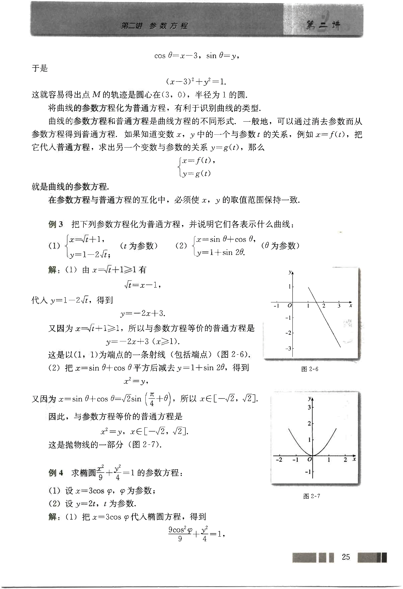
29 

# CHAPTER 2

普通高中课程标准实验教科书 数学(选修 4-4) 坐标系与参数方程

## 于是
即
$y^2 = 4(1 - cos^2 φ) = 4sin^2 φ,$
$y = ±2sin φ.$

由参数 φ 的任意性，可取 $y = 2sin φ$. 因此，椭圆 $\frac{x^2}{9} + \frac{y^2}{4} = 1$ 的参数方程是

$\begin{cases}
x = 3cos φ, \\
y = 2sin φ.
\end{cases}$ (φ 为参数)

## (2) 把 y = 2t 代入椭圆方程，得
$\frac{x^2}{9} + \frac{4t^2}{4} = 1,$
$x^2 = 9(1 - t^2), x = ±3\sqrt{1 - t^2}.$

因此，椭圆 $\frac{x^2}{9} + \frac{y^2}{4} = 1$ 的参数方程是

$\begin{cases}
x = 3\sqrt{1 - t^2}, \\
y = 2t,
\end{cases}$ (t 为参数) 和 $\begin{cases}
x = -3\sqrt{1 - t^2}, \\
y = 2t.
\end{cases}$ (t 为参数)

## 思考

为什么例 4(2) 中的两个参数方程合起来才是椭圆的参数方程？

## 习题 2.1

1. 一架救援飞机以 100 m/s 的速度作水平直线飞行，在离灾区指定目标的水平距离还有 1000 m 时投放救灾物资（不计空气阻力，重力加速度 g = 9.8 m/s²），问此时飞机的飞行高度约是多少？（精确到 1 m）

2. 动点 M 作匀速直线运动，它在 x 轴和 y 轴方向的分速度分别为 3 m/s 和 4 m/s，直角坐标系的长度单位是 1 m，点 M 的起始位置在点 M₂(2, 1) 处，求点 M 的轨迹的参数方程。

3. 已知 M 是正三角形 ABC 的外接圆上的任意一点，求证：$|MA|^2 + |MB|^2 + |MC|^2$ 为定值。

4. 把下列参数方程化为普通方程，并说明它们各表示什么曲线：

(1) $\begin{cases}
x = 3 - 2t, \\
y = -1 - 4t;
\end{cases}$ (t 为参数)

(3) $\begin{cases}
x = \frac{1}{t}, \\
y = t - \frac{1}{t};
\end{cases}$ (t 为参数)

(2) $\begin{cases}
x = cos θ, \\
y = cos 2θ + 1;
\end{cases}$ (θ 为参数)

(4) $\begin{cases}
x = 5cos φ, \\
y = 3sin φ.
\end{cases}$ (φ 为参数)

5. 根据所给条件，把曲线的普通方程化为参数方程：

(1) $y^2 - x - y - 1 = 0$，设 $y = t - 1$，t 为参数；

(2) $x^2 + y^2 = a^2$，设 $x = acos^2 φ$，φ 为参数.

26

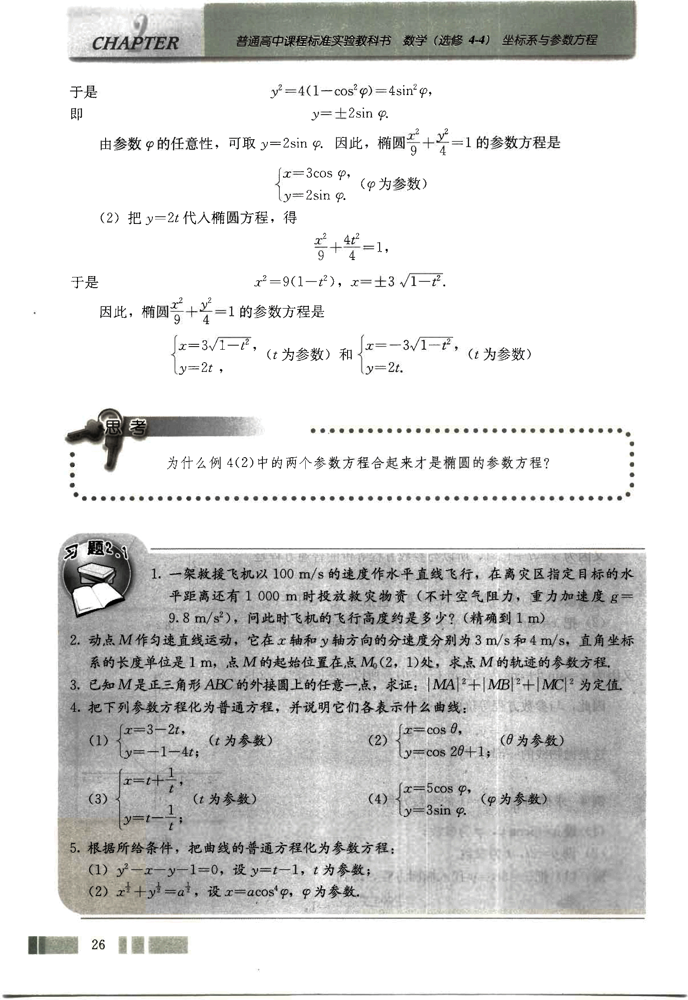
30 

# 第二讲 参数方程

## 二 圆锥曲线的参数方程

### 1.椭圆的参数方程

与上一节例4的方法类似，我们可以得到椭圆$\frac{x^2}{a^2} + \frac{y^2}{b^2} = 1 (a>b>0)$ 的一个参数方程

$\begin{cases}
x = a\cos\varphi \\
y = b\sin\varphi
\end{cases}$ ($\varphi$为参数)

这是中心在原点O，焦点在x轴上的椭圆的参数方程.

**思考**

类比圆的参数方程中参数的意义，椭圆的参数方程①中参数$\varphi$的意义是什么？

如图2-8，以原点O为圆心，a, b (a>b>0)为半径分别作两个同心圆.设A为大圆上的任一点，连接OA，与小圆交于点B.过点A, B分别作x轴，y轴的垂线，两垂线交于点M.

[图2-8](images/2-8.png)

设以Ox为始边，OA为终边的角为$\varphi$，点M的坐标是(x, y)，那么点A的横坐标为x，点B的纵坐标为y.由于点A, B均在角$\varphi$的终边上，由三角函数的定义有

$x = |OA|\cos\varphi = a\cos\varphi$

$y = |OB|\sin\varphi = b\sin\varphi$

当半径OA绕点O旋转一周时，就得到了点M的轨迹，它的参数方程是

$\begin{cases}
x = a\cos\varphi \\
y = b\sin\varphi
\end{cases}$ ($\varphi$为参数)

27

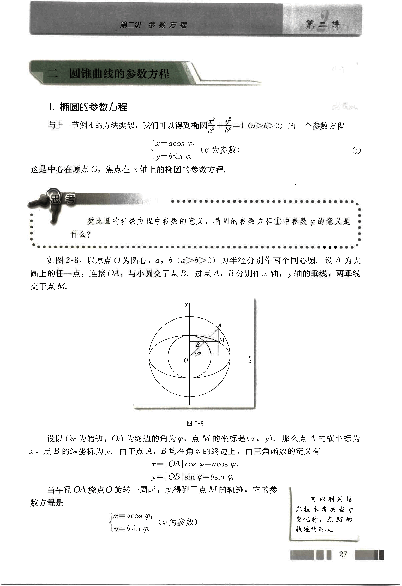
31 

# CHAPTER 普通高中课程标准实验教科书 数学(选修4-4) 坐标系与参数方程

这是中心在原点O，焦点在x轴上的椭圆。
在椭圆的参数方程①中，通常规定参数φ的范围为φ∈[0, 2π).

## 思考

椭圆的参数方程①中参数φ的意义与圆的参数方程
$\begin{cases} x = r\cos\theta \\ y = r\sin\theta \end{cases}$ (θ为参数)
中参数θ的意义类似吗？

由图2-8可以看出，参数φ是点M所对应的圆的半径OA(或OB)的旋转角（称为点M的离心角），不是OM的旋转角，参数θ是半径OM的旋转角。

## 探究

椭圆规是用来画椭圆的一种器械，它的构造如图2-9所示。在一个十字形的金属板上有两条互相垂直的导槽，在直尺上有两个固定滑块A，B，它们可分别在纵槽和横槽中滑动，在直尺上的点M处用套管装上铅笔，使直尺转动一周就画出一个椭圆。
你能说明它的构造原理吗？（提示：可以用直尺AB和横槽所成的角为参数，求出点M的轨迹的参数方程。）

[image1](images/image1.png)

## 例1

在椭圆$\frac{x^2}{9} + \frac{y^2}{4} = 1$上求一点M，使点M到直线x+2y-10=0的距离最小，并求出最小距离。

解：因为椭圆的参数方程为
$\begin{cases} x = 3\cosφ \\ y = 2\sinφ \end{cases}$ (φ为参数)

28
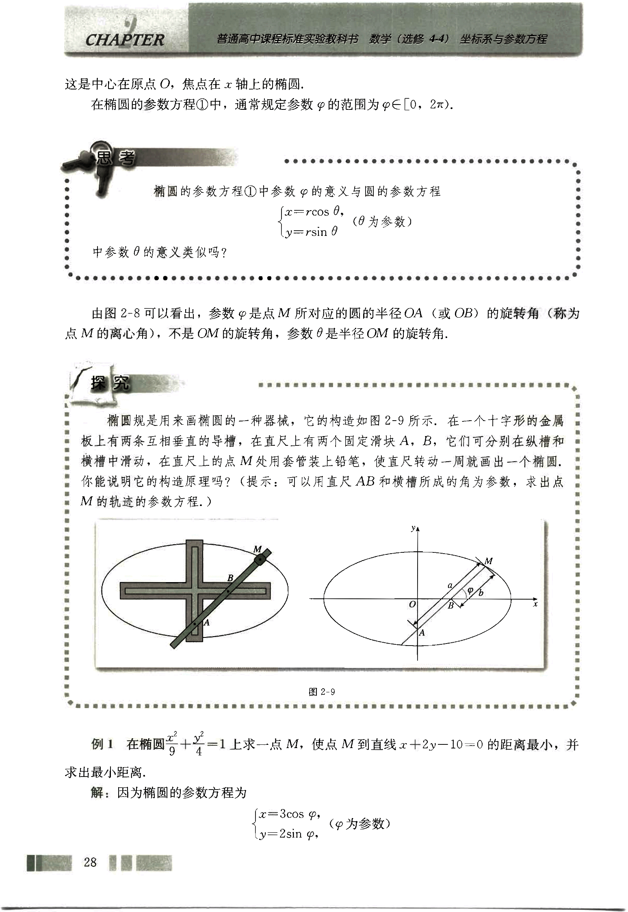
32 

# 第二讲 参数方程

##  所以可设点的坐标为(3cosφ, 2sin φ).

由点到直线的距离公式，得到点M到直线的距离为

$d = \frac{|3cosφ + 4sinφ - 10|}{\sqrt{5}}$

$= \frac{|5(cosφ \cdot \frac{3}{5} + sinφ \cdot \frac{4}{5}) - 10|}{\sqrt{5}}$

$= \frac{1}{\sqrt{5}} |5cos(φ - φ_0) - 10|$,

其中$φ_0$满足 $cos φ_0 = \frac{3}{5}$, $sin φ_0 = \frac{4}{5}$。

由三角函数性质知，当$φ - φ_0 = 0$时，d取最小值$\sqrt{5}$。此时，

$3cosφ = 3cosφ_0 = \frac{9}{5}$， $2sinφ = 2sinφ_0 = \frac{8}{5}$。

因此，当点M位于$(\frac{9}{5}, \frac{8}{5})$时，点M与直线x + 2y - 10 = 0的距离取最小值$\sqrt{5}$。

## 思考

与简单的线性规划问题进行类比，你能在实数x, y满足$\frac{x^2}{25} + \frac{y^2}{16} = 1$的前提下，求出z = x - 2y的最大值和最小值吗？由此可以提出哪些类似的问题？

## 2. 双曲线的参数方程

类似于探究椭圆参数方程的方法，我们来探究双曲线

$\frac{x^2}{a^2} - \frac{y^2}{b^2} = 1$  (a > 0, b > 0)

的参数方程。

如图2-10，以原点O为圆心，a, b (a > 0, b > 0)为半径分别作同心圆$C_1$, $C_2$。设A为圆$C_1$上任一点，作直线OA，过点A作圆$C_1$的切线AA'与x轴交于点A'，过圆$C_2$与x轴的交点B作圆$C_2$的切线BB'与直线OA交于点B'。过点A', B'分别作y轴，x轴的平行线A'M, B'M交于点M。

设Ox为始边，OA为终边的角为φ，点M的坐标是(x, y)。那么点A'的坐标为(x, 0)，点B'的坐标为(0, y)。

因为点A在圆$C_1$上，由圆的参数方程得点A的坐标为(acosφ, asinφ)，所以，

$\vec{OA} = (acosφ, asinφ)$， $\vec{AA'} = (x - acosφ, -asinφ)$。

因为$\vec{OA} \perp \vec{AA'}$，所以$\vec{OA} \cdot \vec{AA'} = 0$，从而

$acosφ(x - acosφ) - (asinφ)^2 = 0$，

29

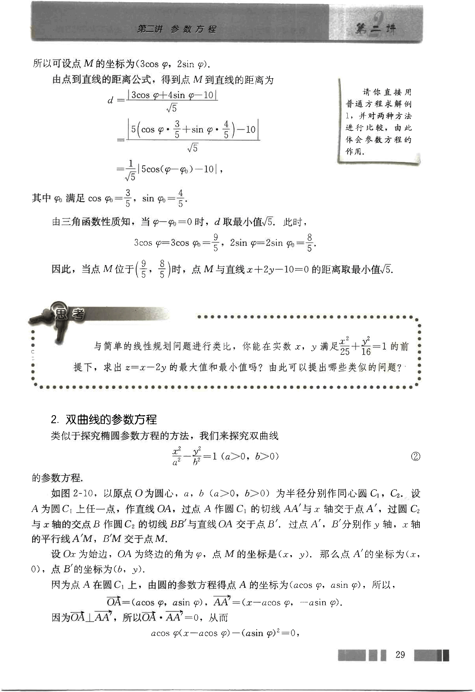
33 

# CHAPTER

普通高中课程标准实验教科书 数学(选修4-4) 坐标系与参数方程

## 解得

$\frac{1}{\cos\varphi} = \sec\varphi$, 则 $x = a\sec\varphi$

因为点B'在$\varphi$的终边上，由三角函数的定义有

$\tan\varphi = \frac{y}{b}$

$y = b\tan\varphi$

所以，点M的轨迹的参数方程为

$\begin{cases}
x = a\sec\varphi \\
y = b\tan\varphi
\end{cases}$ ($\varphi$为参数)

③

因为$\frac{\sin^2\varphi}{\cos^2\varphi} = \sec^2\varphi - 1$, 即

$\sec^2\varphi - \tan^2\varphi = 1$,

所以，从③消去参数后得到点M的轨迹的普通方程为②，这是中心在原点，焦点在x轴上的双曲线，所以③就是双曲线②的参数方程.

在双曲线的参数方程③中，通常规定参数$\varphi$的范围为$\varphi \in [0, 2\pi)$, 且$\varphi \neq \frac{\pi}{2}$, $\varphi \neq \frac{3\pi}{2}$.

## 思考

类比椭圆的参数方程，从双曲线的参数方程中可以得出哪些结论？

由图2-10可以看到，参数$\varphi$是点M所对应的圆的半径OA的旋转角（称为点M的离心角），而不是OM的旋转角.

与椭圆类似，双曲线$\frac{x^2}{a^2} - \frac{y^2}{b^2} = 1$上任意一点的坐标可以设为$(a\sec\varphi, b\tan\varphi)$，这是解决与双曲线有关的问题的重要方法.

30

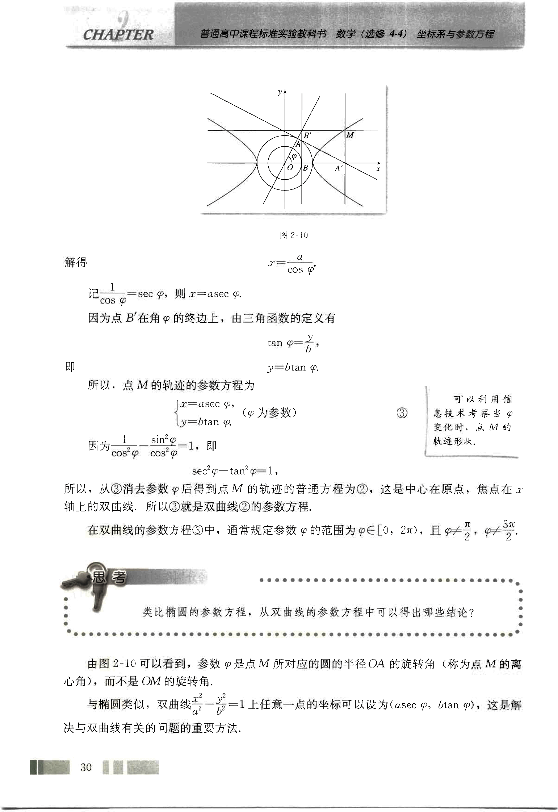
34 

# 第二讲 参数方程

## 例2

如图2-11，设M为双曲线$\frac{x^2}{a^2} - \frac{y^2}{b^2} = 1$ (a, b > 0)上任意一点，O为原点，过点M作双曲线两渐近线的平行线，分别与两渐近线交于A，B两点，探求平行四边形MAOB的面积，由此可以发现什么结论？

**解：**双曲线的渐近线方程为

$y = \pm \frac{b}{a}x$.

[图2-11](images/2-11.png)

不妨设M为双曲线右支上一点，其坐标为(asecφ, btanφ)，则直线MA的方程为

$y - btanφ = \frac{b}{a}(x - asecφ)$.

将$y = \frac{b}{a}x$代入④，解得点A的横坐标为

$x_A = \frac{a}{2}(secφ + tanφ)$.

同理可得，点B的横坐标为

$x_B = \frac{a}{2}(secφ - tanφ)$.

设∠AOx = α，则$tanα = \frac{b}{a}$.

因此，□MAOB的面积为

$S_{MAOB} = |OA| \cdot |OB|sin2α = \frac{x_A}{cosα} \cdot \frac{x_B}{cosα} \cdot sin2α$

$= \frac{a^2(sec^2φ - tan^2φ)}{4cos^2α} \cdot sin2α$

$= a^2 \cdot tanα = a^2 \cdot \frac{b}{a} = ab$.

由此可见，平行四边形MAOB的面积恒为定值，与点M在双曲线上的位置无关。


## 圆锥曲线参数方程中参数的几何意义

利用计算机软件可以直观形象地理解曲线参数方程中参数的几何意义，并由此看到在参数控制下的曲线形成的过程。下面我们以《几何画板》为例，探究椭圆、双曲线的参数方程中参数的几何意义，以及在参数控制下椭圆、双曲线的形成过程。

1. 探究椭圆的参数方程中参数的几何意义及椭圆形成过程。
(1) 打开几何画板，执行“图表/定义坐标系”，取原点为圆心，用画圆工具画两个大小不等的同心圆；
(2) 用画点工具在大圆上取点A，用画线工具作大圆的半径OA，作出OA与小圆的

31

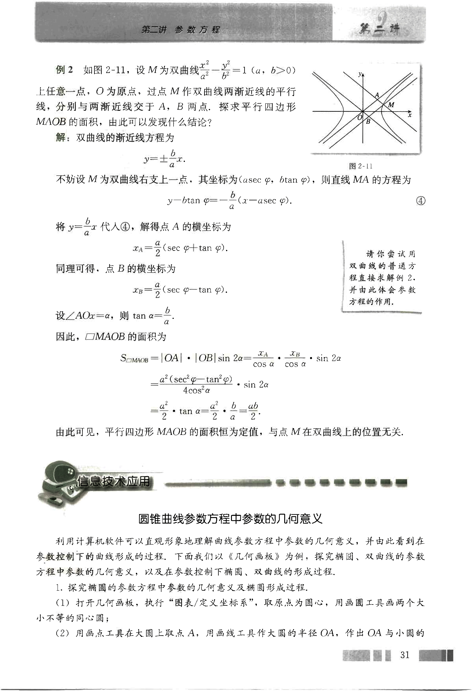
35 

# CHAPTER

普通高中课程标准实验教科书 数学(选修4-4) 坐标系与参数方程

交点B;同时选择点A与x轴,执行“构造/垂线”;同时选择点B与y轴,执行“构造/垂线”;同时选择所作的两条垂线,执行“构造/交点”,这样得到交点M(图1);
(3)同时选择点A,M,执行“构造/轨迹”;选择点M,执行“显示/追踪点”;选择点A,执行“显示/动画”(图2).

[图1](images/图1.png)
[图2](images/图2.png)

这样,我们能看到点A在大圆上运动时,点M就移动形成椭圆.同时,作为参数的角$\phi$的终边一般与OM不重合,从而使参数$\phi$的几何意义一目了然.

2. 探究双曲线的参数方程中参数的几何意义及双曲线形成过程.

(1)打开几何画板,执行“图表/定义坐标系”,取原点为圆心,用画圆工具画两个大小不等的同心圆;

(2)用画点工具在大圆上取点A,用画线工具作直线OA;同时选择直线OA与点A,执行“构造/垂线”,作出所作垂线与x轴的交点A';作出小圆与x轴的交点B,同时选择点B与x轴,执行“构造/垂线”;同时选择直线OA与刚作的垂线,执行“构造/交点”,得到交点B';

(3)同时选择点A'与x轴,执行“构造/垂线”;同时选择点B'与y轴,执行“构造/垂线”;同时选择刚作的两条垂线,执行“构造/交点”,这样得到交点M(图3);

(4)同时选择点A,M,执行“构造/轨迹”;选择点M,执行“显示/追踪点”;选择点A,执行“显示/动画”(图4).

[图3](images/图3.png)
[图4](images/图4.png)

这样,当点A在大圆上运动时,点M就移动形成双曲线.与椭圆类似,作为参数的角$\phi$的终边一般与OM不重合,在点M作动画运动时可以更清楚地看到参数$\phi$的几何意义.

32

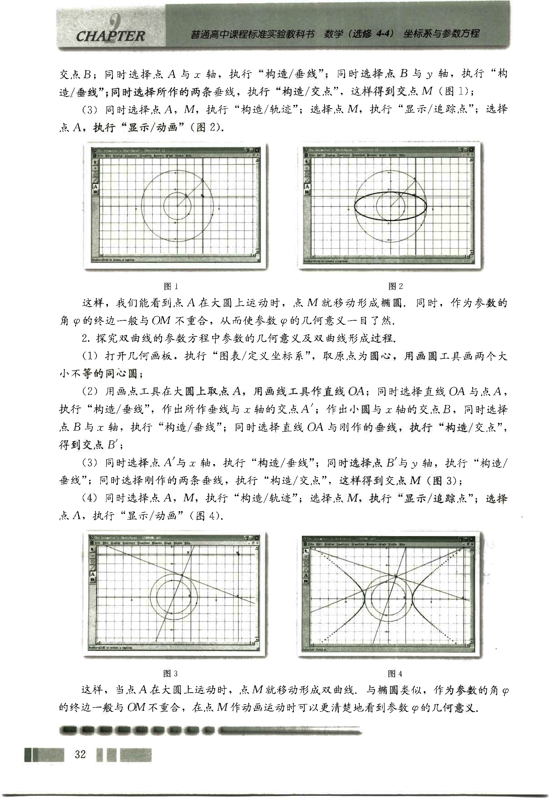
36 

# 第二讲 参数方程

## 3. 抛物线的参数方程

前面曾经得到以时刻 *t* 作参数的抛物线的参数方程：

$\begin{cases}
x = 100t,\\
y = 500 - \frac{1}{2}gt^2
\end{cases}$ ( *t* 为参数，且 $0 \le t \le \sqrt{\frac{1000}{g}}$ )

对于一般的抛物线，怎样建立相应的参数方程呢？

如图 2-12，设抛物线的普通方程为

$y^2 = 2px$,

其中 *p* 表示焦点到准线的距离。

设 M(*x*, *y*) 为抛物线上除顶点外的任意一点，以射线 OM 为终边的角记作 $\alpha$。

显然，当 $\alpha \in (-\frac{\pi}{2}, \frac{\pi}{2})$ 内变化时，点 M 在抛物线上运动，并且对于 $\alpha$ 的每一个值，在抛物线上都有惟一的点 M 与之对应。因此，可以取 $\alpha$ 为参数来探求抛物线的参数方程。

由于点 M 在 $\alpha$ 的终边上，根据三角函数定义可得

$\frac{y}{x} = \tan \alpha$。

由⑤，⑥解出 *x*, *y*，得到

$\begin{cases}
x = \frac{2p}{\tan^2 \alpha}, \\
y = \frac{2p}{\tan \alpha}
\end{cases}$ ($\alpha$ 为参数)

这就是抛物线⑤（不包括顶点）的参数方程。

如果令 $t = \frac{1}{\tan \alpha}$，$t \in (-\infty, 0) \cup (0, +\infty)$，则有

$\begin{cases}
x = 2pt^2, \\
y = 2pt.
\end{cases}$ (*t* 为参数)

当 *t* = 0 时，由参数方程⑦表示的点正好就是抛物线的顶点 (0, 0)。因此，当 $t \in (-\infty, +\infty)$ 时，参数方程⑦就表示整条抛物线，参数 *t* 表示抛物线上除顶点外的任意一点与原点连线的斜率的倒数。

## 思考

怎样根据抛物线的定义选取参数，建立抛物线 $x^2 = 2py$ (*p* > 0) 的参数方程？

## 例 3

如图 2-13，O 是直角坐标原点，A，B 是抛物线 $y^2 = 2px$ (*p* > 0) 上异于顶点的两动点，且 OA ⊥ OB，OM ⊥ AB 并与 AB 相交于点 M，求点 M 的轨迹方程。

33

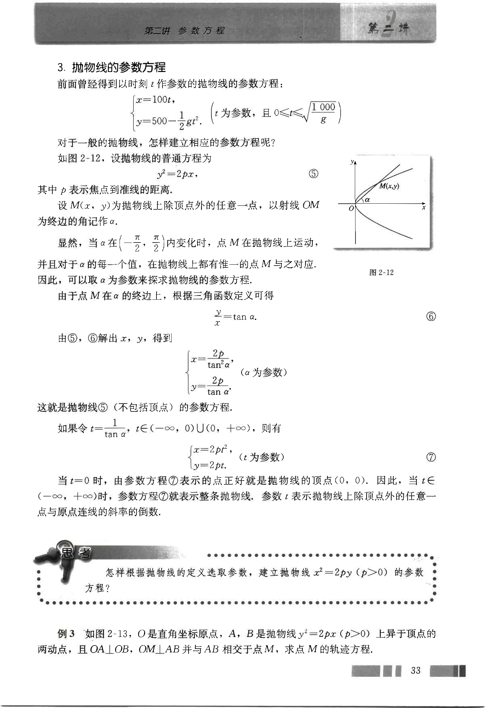
37 

# CHAPTER 普通高中课程标准实验教科书 数学(选修4-4) 坐标系与参数方程

## 解：

根据条件，设点M，A，B的坐标分别为
(x, y), (2pt₁², 2pt₁), (2pt₂², 2pt₂) (t₁≠t₂, 且
t₁t₂≠0), 则

OM = (x, y), OA = (2pt₁², 2pt₁),
OB = (2pt₂², 2pt₂),
AB = (2p(t₂² - t₁²), 2p(t₂ - t₁)).

因为OA⊥OB，所以OA・OB = 0，即
(2pt₁²)² + (2p)²t₁t₂ = 0,
t₁t₂ = -1.

因为OM⊥AB，所以OM・AB = 0，即
2px(t₂² - t₁²) + 2py(t₂ - t₁) = 0,
x(t₁ + t₂) + y = 0,
t₁ + t₂ = -y/x (x≠0).

因为AM = (x - 2pt₁², y - 2pt₁), MB = (2pt₂² - x, 2pt₂ - y), 且A, M, B三点共线，
(x - 2pt₁²)(2pt₂ - y) = (y - 2pt₁)(2pt₂² - x),
y(t₁ + t₂) - 2pt₁t₂ - x = 0.

化简，得
将⑧，⑨代入⑩，得到

y(-y/x) + 2px - x = 0,
x² + y² - 2px = 0 (x≠0),

这就是点M的轨迹方程。

## 探究

在例3中，点A，B在什么位置时，△AOB的面积最小？最小值是多少？

## 习题2.2

1. 一颗人造地球卫星的运行轨道是一个椭圆，长轴长为15 565 km，短轴长为15 443 km。取椭圆中心为坐标原点，求卫星轨道的参数方程。

2. 已知椭圆$\frac{x^2}{a^2} + \frac{y^2}{b^2} = 1$上任意一点M（除短轴端点外）与短轴两端点B₁, B₂的连线分别与x轴交于P，Q两点，O为椭圆的中心，求证：|OP|・|OQ|为定值。

3. 求证：等轴双曲线上任意一点到两渐近线的距离之积是常数。

34

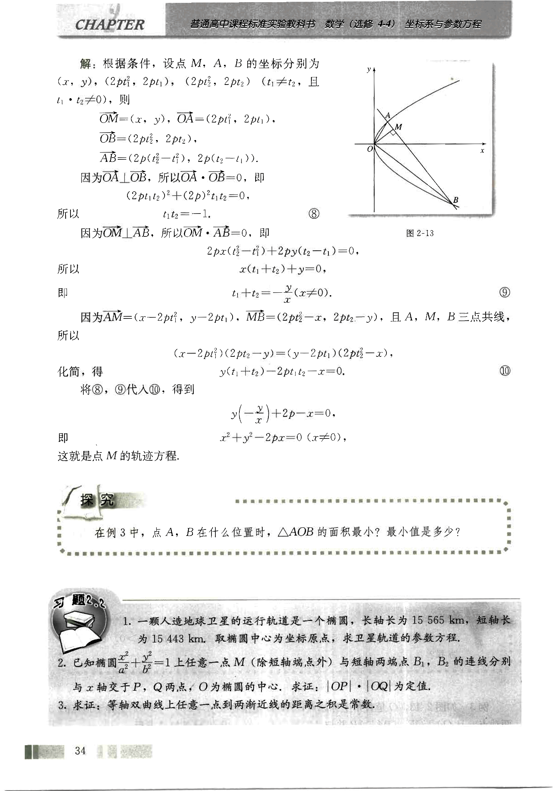
38 

# 第二讲 参数方程

4. 已知A，B，C是抛物线$y^2=2px$上的三个点，且BC与x轴垂直，直线AB，AC分别与抛物线的轴交于D，E两点，求证：抛物线的顶点平分线段DE.

5. 经过抛物线$y^2=2px$ ($p>0$)的顶点O任作两条互相垂直的线段OA和OB，以直线OA的斜率为参数，求线段AB的中点M的轨迹的参数方程。

## 三 直线的参数方程

我们知道，经过点$M_0(x_0, y_0)$，倾斜角为$\alpha$($\alpha \neq \frac{\pi}{2}$)的直线的普通方程是
$y - y_0 = \tan\alpha(x - x_0)$.

怎样建立直线的参数方程呢？

如图2-14，在直线$l$上任取一点M(x, y)，则
$\overrightarrow{M_0M} = (x, y) - (x_0, y_0) = (x - x_0, y - y_0)$.


设$\vec{e}$是直线的单位方向向量（单位长度与坐标轴的单位长度相同），则
$\vec{e} = (\cos\alpha, \sin\alpha)$，($\alpha \in [0, \pi)$).

因为$\overrightarrow{M_0M} // \vec{e}$，所以存在实数$t \in R$，使$\overrightarrow{M_0M} = t\vec{e}$，即
$(x - x_0, y - y_0) = t(\cos\alpha, \sin\alpha)$,

$x - x_0 = t\cos\alpha$，$y - y_0 = t\sin\alpha$,

$x = x_0 + t\cos\alpha$，$y = y_0 + t\sin\alpha$.

因此，经过点$M_0(x_0, y_0)$，倾斜角为$\alpha$的直线的参数方程为
$\begin{cases}
x = x_0 + t\cos\alpha \\
y = y_0 + t\sin\alpha
\end{cases}$
($t$为参数)

①

②
35


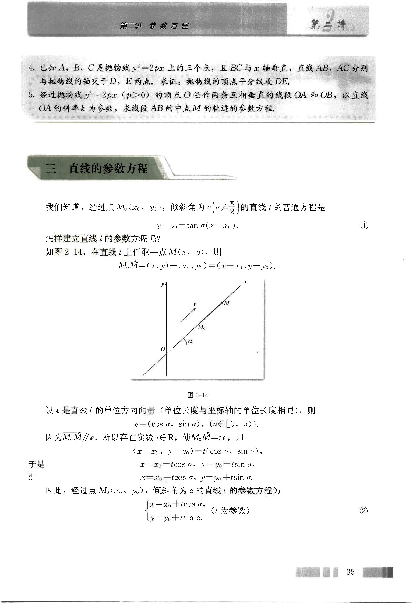
39 

# CHAPTER

普通高中课程标准实验教科书 数学(选修4-4) 坐标系与参数方程

## 思考

由$\overrightarrow{M_0M}=te$，你能得到直线l的参数方程②中参数t的几何意义吗？

因为$\vec{e} = (\cos\alpha, \sin\alpha)$，所以$|\vec{e}| = 1$。由$\overrightarrow{M_0M} = t\vec{e}$，得到$|M_0M| = |t|$。因此，直线上
的动点M到定点$M_0$的距离，等于②中参数t的绝对值。

当$0 < \alpha < \pi$时，$\sin\alpha \ge 0$，所以，直线的单位方向向量$\vec{e}$的方向总是向上。此时，若
$t > 0$，则$\overrightarrow{M_0M}$的方向向上；若$t < 0$，则$\overrightarrow{M_0M}$的方向向下；若$t = 0$，则点M与点$M_0$重合。

## 例1

已知直线l：$x + y - 1 = 0$与抛物线$y = x^2$交于A，B两点，求线段AB的长和点M(-1, 2)到A，B两点的距离之积。

解：因为直线l过定点M，且l的倾斜角为$\frac{3\pi}{4}$，所以它的参数方程是

$\begin{cases}
x = -1 + t\cos\frac{3\pi}{4} \\
y = 2 + t\sin\frac{3\pi}{4}
\end{cases}$ (t为参数)

或

$\begin{cases}
x = -1 - \frac{\sqrt{2}}{2}t \\
y = 2 + \frac{\sqrt{2}}{2}t
\end{cases}$ (t为参数)

把它代入抛物线的方程，得

$t^2 + \sqrt{2}t - 2 = 0$，

解得$t_1 = \frac{-\sqrt{2} + \sqrt{10}}{2}$，$t_2 = \frac{-\sqrt{2} - \sqrt{10}}{2}$。

由参数t的几何意义得

$|AB| = |t_1 - t_2| = \sqrt{10}$，

$|MA| \cdot |MB| = |t_1 t_2| = 2$。

## 探究

直线②与曲线$y = f(x)$交于$M_1$，$M_2$两点，对应的参数分别为$t_1$，$t_2$。

(1) 曲线的弦$M_1M_2$的长是多少？

(2) 线段$M_1M_2$的中点M对应的参数t的值是多少？

(3) 你还能提出和解决哪些问题？

36

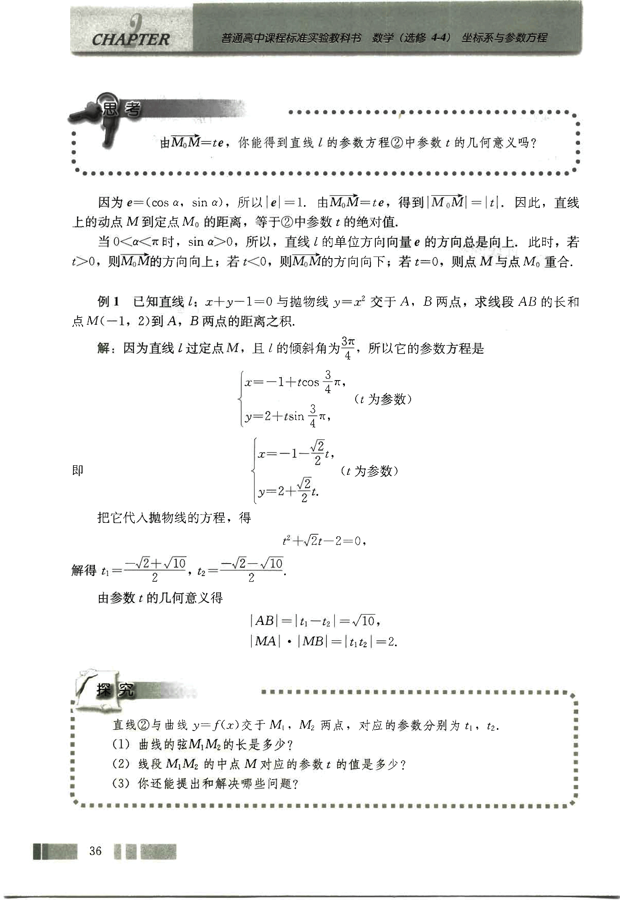
40 

# 第二讲 参数方程

## 例2

经过点M(2,1)作直线 *l*, 交椭圆 $\frac{x^2}{16} + \frac{y^2}{4} = 1$ 于A, B两点. 如果点M恰好为线段AB的中点, 求直线 *l* 的方程.

**解:** 设过点M(2,1)的直线的参数方程为

$
\begin{cases}
x = 2 + t\cos\alpha \\
y = 1 + t\sin\alpha
\end{cases}
$

( *t* 为参数)

代入椭圆方程, 整理得

$(3\sin^2\alpha + 1)t^2 + 4(\cos\alpha + 2\sin\alpha)t - 8 = 0$.

由 *t* 的几何意义知 $|MA| = |t_1|$, $|MB| = |t_2|$. 因为点M在椭圆内, 这个方程必有两个实根, 所以

$t_1 + t_2 = -\frac{4(\cos\alpha + 2\sin\alpha)}{3\sin^2\alpha + 1}$.

因为点M为线段AB的中点, 所以 $\frac{t_1 + t_2}{2} = 0$, 即

$\cos\alpha + 2\sin\alpha = 0$,

于是直线的斜率为

$k = \tan\alpha = -\frac{1}{2}$.

因此, 直线 *l* 的方程是

$y - 1 = -\frac{1}{2}(x - 2)$,

$x + 2y - 4 = 0$.


## 例3

当前台风中心P在某海滨城市O向东300 km处生成, 并以40 km/h的速度向西偏北45°方向移动. 已知距台风中心250 km以内的地方都属于台风侵袭的范围, 那么经过多长时间后该城市开始受到台风侵袭?

**解:** 取O为原点, OP所在直线为x轴, 建立直角坐标系(图2-15), 则点P的坐标是(300, 0).

以O为圆心, 250 km为半径作圆O, 当台风中心移动后的位置M在圆O内或圆O上时, 城市O将受到台风侵袭.

圆O的方程为

$x^2 + y^2 = 250^2$.

[image](images/image.png)

37

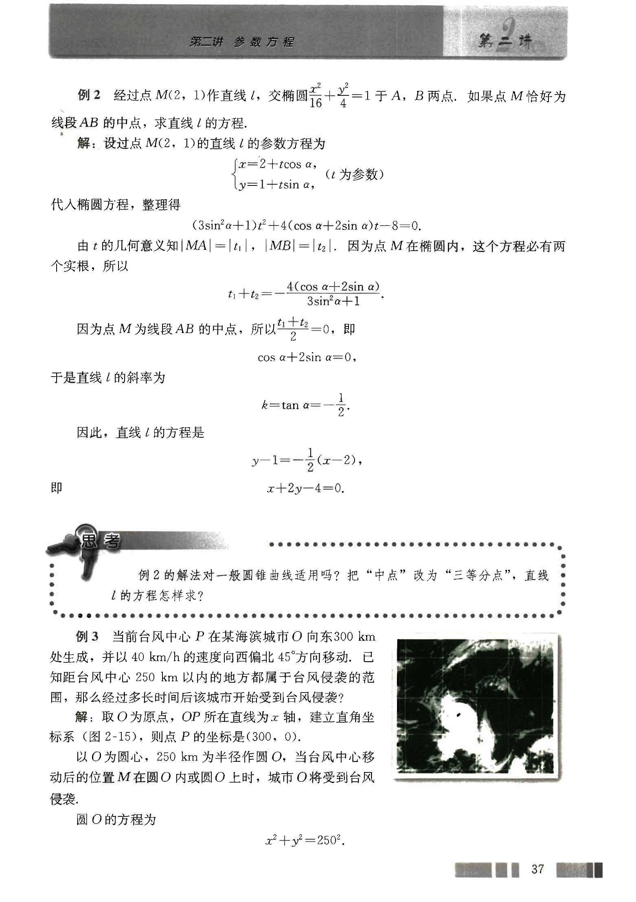
41 

# CHAPTER 2 坐标系与参数方程

设经过时间 *t* 后，台风中心 M 的坐标为 (*x*, *y*)，根据条件知台风中心 M 移动形成的直线的方程为：

$\begin{cases}
x = 300 + 40t \cdot \cos 135^\circ \\
y = 40t \cdot \sin 135^\circ
\end{cases}$ (*t* 为参数，*t* ≥ 0)

即

$\begin{cases}
x = 300 - 20\sqrt{2}t \\
y = 20\sqrt{2}t
\end{cases}$ (*t* 为参数，*t* ≥ 0)

当点 M(300 - 20√2*t*, 20√2*t*) 在圆 O 内或圆 O 上时，有

$(300 - 20\sqrt{2}t)^2 + (20\sqrt{2}t)^2 < 250^2$

$16t^2 - 120\sqrt{2}t + 275 < 0$

$\frac{15\sqrt{2} - 5\sqrt{7}}{4} < t < \frac{15\sqrt{2} + 5\sqrt{7}}{4}$

即

解得

由计算器计算可得，*t* 的范围约为

2.0 ≤ *t* ≤ 8.6

因此，大约在 2h 后该城市开始受到台风侵袭。

## 思考

在例 3 中，海滨城市 O 受到台风侵袭大概持续多长时间？如果台风侵袭的半径也发生变化（比如：当前半径为 250 km，并以 10 km/h 的速度不断增大），那么问题又该如何解决？


## 例 4

如图 2-16(1) 所示，AB，CD 是中心为 O 的椭圆的两条相交弦，交点为 P。两弦 AB，CD 与椭圆长轴的夹角分别为 ∠1，∠2，且 ∠1 = ∠2。求证：

|PA| ⋅ |PB| = |PC| ⋅ |PD|

[图2-16(1)](images/2-16-1.png)
[图2-16(2)](images/2-16-2.png)

证明：如图 2-16(2) 建立平面直角坐标系，设椭圆的长轴、短轴的长分别为 2*a*，2*b*，则椭圆的方程为

$\frac{x^2}{a^2} + \frac{y^2}{b^2} = 1$
---
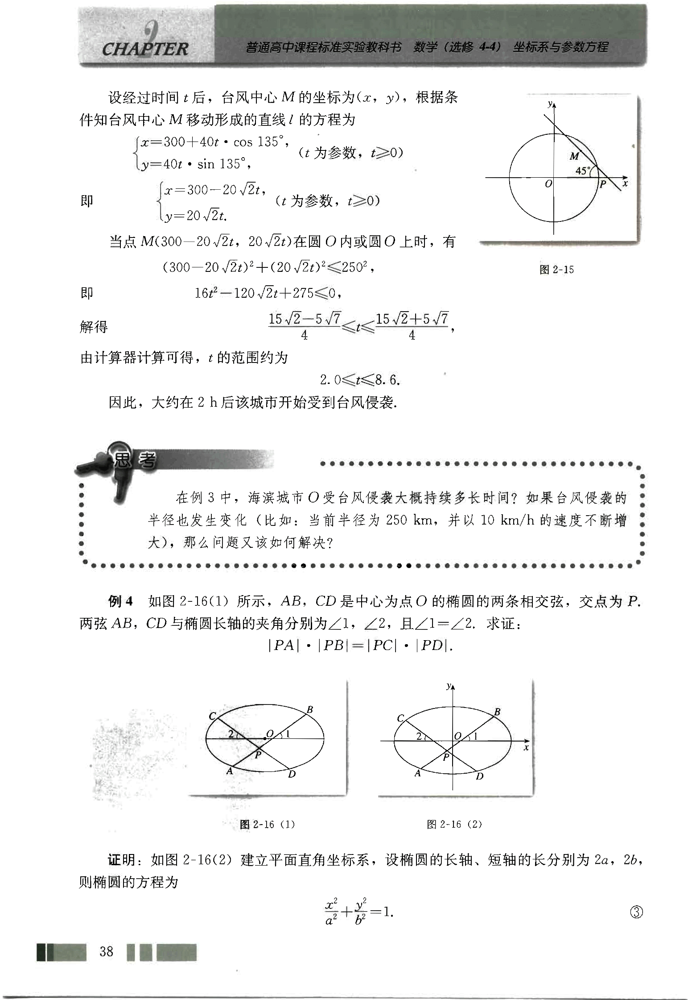
42 

# 第二讲 参数方程

设∠1=θ，点P的坐标为($x_0$，$y_0$)，则直线AB的参数方程为

$\begin{cases}
x = x_0 + tcos θ \\
y = y_0 + tsin θ
\end{cases}$ (t为参数)

将④代入③并整理，得到

($b^2cos^2θ + a^2sin^2θ$)$t^2$ + 2($b^2x_0cosθ + a^2y_0sinθ$)t + ($b^2x_0^2 + a^2y_0^2 - a^2b^2$) = 0.

由于$b^2cos^2θ + a^2sin^2θ$≠0，又已知直线AB与椭圆有两个交点，

因此方程⑤有两个根，设这两个根分别为$t_1$, $t_2$，容易得到

|PA|·|PB| = $|t_1|\cdot|t_2| = |t_1t_2| = \frac{b^2x_0^2 + a^2y_0^2 - a^2b^2}{b^2cos^2θ + a^2sin^2θ}$  ⑥

同理，对于直线CD，将θ换为π-θ，即得到

|PC|·|PD| = $\frac{b^2x_0^2 + a^2y_0^2 - a^2b^2}{b^2cos^2(π-θ) + a^2sin^2(π-θ)} = \frac{b^2x_0^2 + a^2y_0^2 - a^2b^2}{b^2cos^2θ + a^2sin^2θ}$ ⑦

由⑥，⑦，得到|PA|·|PB| = |PC|·|PD|.


## 探究

如果把椭圆改为双曲线，是否会有类似的结论？


## 习题2.3

1. 设直线l经过点$M_0$(1, 5)，倾斜角为$\frac{\pi}{3}$。

(1) 求直线l的参数方程；

(2) 求直线l和直线x - y - $2\sqrt{3}$ = 0的交点到点$M_0$的距离；

(3) 求直线l和圆$x^2 + y^2 = 16$的两个交点到点$M_0$的距离的和与积；

2. 已知经过点P(2, 0)，斜率为$\frac{4}{3}$的直线和抛物线$y^2 = 2x$相交于A，B两点，设线段AB的中点为M. 求点M的坐标.

3. 经过点M(2, 1)作直线交双曲线$x^2 - y^2 = 1$于A，B两点，如果点M为线段AB的中点，求直线AB的方程.

4. 经过抛物线$y^2 = 2px (p > 0)$外的一点A(-2, -4)且倾斜角为45°的直线l与抛物线分别交于$M_1$，$M_2$. 如果|AM₁|，|M₁M₂|，|AM₂|成等比数列，求p的值.

39

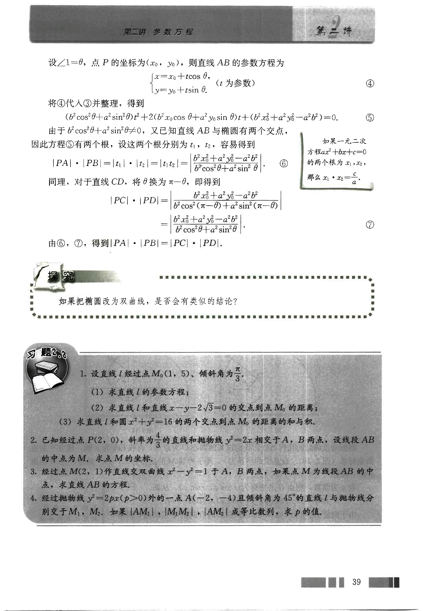
43 

# 四 渐开线与摆线

## 1.渐开线

### 探究

把一条没有弹性的细绳绕在一个圆盘上，在绳的外端系上一支铅笔，将绳子拉紧，保持绳子与圆相切而逐渐展开，那么铅笔会画出一条曲线。这条曲线的形状怎样？能否求出它的轨迹方程？

我们先分析动点（笔尖）所满足的几何条件。如图2-17，设开始时绳子外端（笔尖）位于点A，当外端展开到点M时，因为绳子对圆心角φ（单位是弧度）的一段弧AB，展开后成为切线BM，所以切线BM的长就是AB的长，这是动点（笔尖）满足的几何条件。我们把笔尖画出的曲线叫做圆的渐开线，相应的定圆叫做渐开线的基圆。

[图2-17](images/2-17.png)
[图2-18](images/2-18.png)

根据动点满足的几何条件，我们以基圆圆心O为原点，直线OA为x轴，建立平面直角坐标系（图2-18）。设基圆的半径为r，绳子外端M的坐标为(x, y)。显然，点M由角φ唯一确定。

取φ为参数，则点B的坐标为($rcosφ, rsinφ$)，从而

$BM = (x - rcosφ, y - rsinφ)$，$|BM| = rφ$。

由于向量$e_1 = (cosφ, sinφ)$是与OB同方向的单位向量，因而向量$e_2 = (sinφ, -cosφ)$是与向量BM同方向的单位向量，因此

$BM = (rφ)e_2$，即

$(x - rcosφ, y - rsinφ) = (rφ)(sinφ, -cosφ)$。

根据动点满足的几何条件，利用计算机画出圆的渐开线.

40

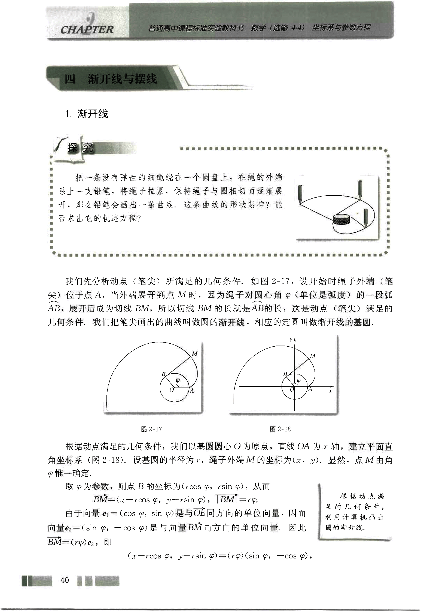
44 

# 第二讲 参数方程

解得

$\begin{cases}
x = r(\cos\varphi + \varphi\sin\varphi), \\
y = r(\sin\varphi - \varphi\cos\varphi).
\end{cases}$ (φ是参数)

这就是圆的渐开线的参数方程.

在机械工业中，广泛地使用齿轮传递动力，由于渐开线齿形的齿轮磨损少，传动平稳，制造安装较为方便，因此大多数齿轮采用这种齿形，设计加工这种齿轮，需要借助圆的渐开线方程。

## 思考

在探究圆的渐开线的参数方程的过程中用到“向量$\vec{e_2} = (\sin\varphi, -\cos\varphi)$与向量$\vec{BM}$有相同方向”这一结论，你能说明这个结论为什么成立吗？

## 2. 摆线

### 思考

如果在自行车的轮子上喷一个白色印记，那么当自行车在笔直的道路上行驶时，白色印记会画出什么样的曲线？

上述问题抽象成数学问题就是：当一个圆沿着一条定直线无滑动地滚动时，圆周上一个定点的轨迹是什么？

[图2-19](images/2-19.png)

同样地，我们先分析圆在滚动过程中，圆周上的这个定点满足的几何条件。

如图2-19，假设B为圆心，圆周上的定点为M，开始时位于O处。圆在直线上滚动时，点M绕圆心作圆周运动，转过φ(弧度)角后，圆与直线相切于A，线段OA的长等于MA的长，即OA = rφ。这就是圆周上的定点M在圆B沿直线滚动过程中满足的几何条件。我们把点M的轨迹叫做平摆线，简称摆线，又叫旋轮线。

41

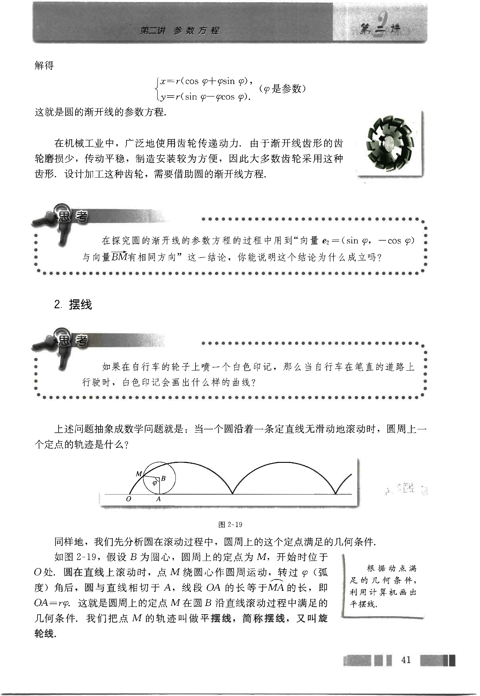
45 

# CHAPTER 9 坐标系与参数方程

## 摆线的参数方程

下面我们来求摆线的参数方程。

根据点M满足的几何条件，我们取定直线为x轴，定点M滚动时落在定直线上的一
个位置为原点，建立直角坐标系（图2-20）。设圆的半径为r。

[图2-20](images/2-20.png)

设开始时定点M在原点，圆滚动了φ角后与x轴相切于点A，圆心在点B。从点M
分别作AB，x轴的垂线，垂足分别是C，D。设点M的坐标为(x, y)，取φ为参数，根
据点M满足的几何条件，有

x = OD = OA - DA = OA - MC = rφ - rsin φ,
y = DM = AC = AB - CB = r - rcos φ.

因此，摆线的参数方程是

$\begin{cases}
x = r(\varphi - \sin \varphi), \\
y = r(1 - \cos \varphi).
\end{cases}$ (φ是参数)

①


## 思考题

在摆线的参数方程①中，参数φ的取值范围是什么？一个拱的宽度与高
度各是多少？


## 习题2.4

1. 如图，有一标准的渐开线齿轮，齿轮的齿廓线的
基圆直径是225 mm，求齿廓线AB所在的渐开线
的参数方程，

2. 当 $\varphi = \frac{\pi}{2}, \frac{3\pi}{2}$ 时，求出渐开线 $\begin{cases}
x = \cos \varphi + \varphi \sin \varphi, \\
y = \sin \varphi - \varphi \cos \varphi
\end{cases}$ 上的对应点
A，B，并求出点A，B间的距离。

3. 有一个半径是a的轮子沿着直线轨道滚动，在轮辐上有一点
M，与轮子中心的距离是b (b<a)，求点M的轨迹方程，

[图](images/2.4.png)


42

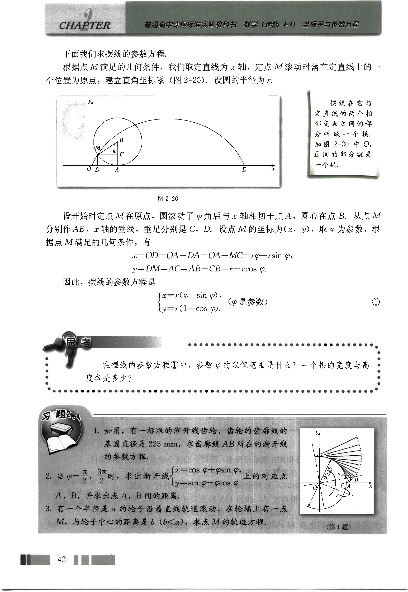
46 

# 第二讲 参数方程

4. 一个半径是 4r 的定圆 O 和一个半径是 r 的动圆 C 相内切。当圆 C 沿圆 O 无滑动地滚动时，探求圆 C 上定点 M（开始时在点 A）的轨迹的参数方程。

[image](images/image.png)

(第 4 题)


## 摆线及其应用

在数学史上，发现圆锥曲线后，受到科学家关注最多的曲线应是摆线，伽利略是最早注意到摆线的科学家之一，他曾经尝试以操作的方法计算摆线的一拱与其底线间的面积；后来，笛卡儿、费马、帕斯卡、伯努利等人都研究过摆线，获得了关于摆线的一些性质和应用。

摆线的种类丰富，性质优美，应用广泛。下面，我们介绍其中几种美丽的、有用的摆线。

在商场中有一种绘制曲线的工具，它包含一个在圆周上刻满锯齿的小圆板，以及一个在内外圆周上都刻有锯齿的大圆环板（图 1）。使用时，将小圆板放在大圆环板内部并让锯齿套合，将笔插入小圆板上的一个小洞，当小圆板沿着大圆板滚动时，铅笔就会描绘出一条曲线，这曲线是什么形状呢？

小圆板在大圆环板内部滚动，用数学语言表示，就是一个 小圆沿着一个大圆的内部无滑动地滚动，滚动时，小圆圆周上的某个定点所描绘的曲线称为**内摆线**。

图 1 中的小圆形板，自然也可以与大圆环板的外圆周套合而滚动，即一个小圆沿着一个大圆的外部无滑动地滚动，滚动时，小圆圆周上的某个定点所描绘的曲线，称为**外摆线**。

内、外摆线的形状，由固定圆（即大圆）与滚动圆（即小圆）的半径之比决定。下面展示了几种由不同半径比得到的内、外摆线。

[image](images/image2.png)

图 1

43

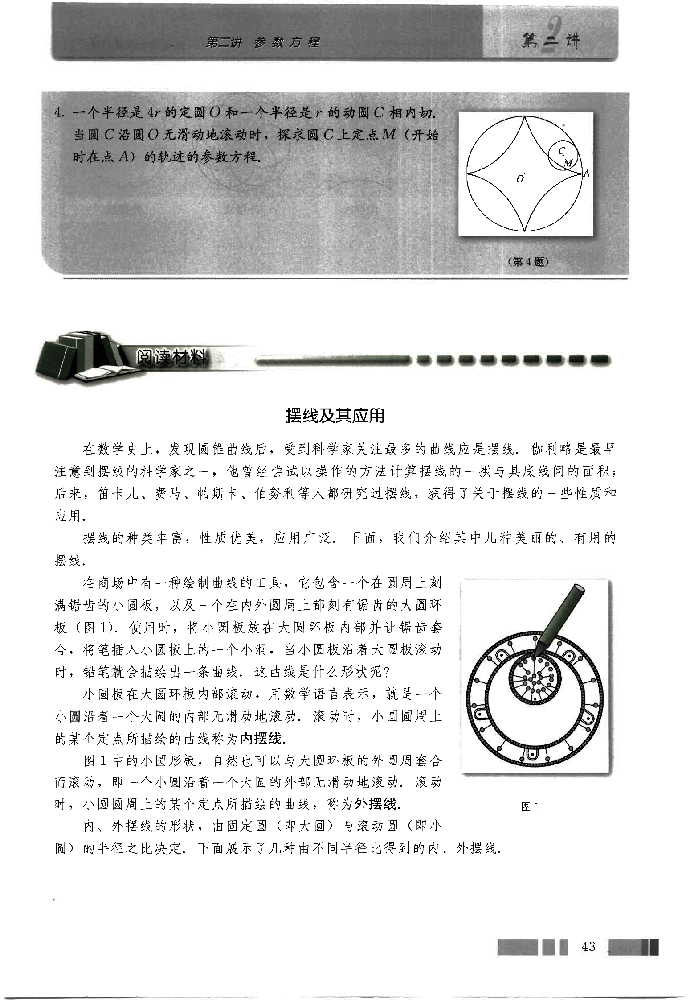
47 

# CHAPTER

普通高中课程标准实验教科书 数学 (选修 4-4) 坐标系与参数方程

## 图形

| 摆线种类 | 内摆线 | 内摆线 | 外摆线 | 外摆线 |
|---|---|---|---|---|
| 固定圆与滚动圆的半径之比 | 4:1 | 5:1 | 7:3 | 1:1 |

可以看到，固定圆与滚动圆的半径之比为 4:1 的内摆线有四个尖角，就像夜空中一颗光芒四射的星星，因此我们称之为星形线。在前面的学习中，我们已经得到了星形线的参数方程（习题 2.4 第 4 题），利用这个方程就可以算出公共汽车车门节省的活动面积。

普通的房门是完整的一扇，大门是对开的两扇。而公共汽车采用折叠式的车门，这种门明显的优点是车门开、关所需的活动范围比较小，因而在乘车高峰时能够多载运乘客。利用星形线及有关数学知识，我们可以算出，相同宽度的折叠式车门所需的活动面积仅为 $\frac{5}{16}$ 普通门的。

除了我们已经了解的平摆线、内外摆线，还有各种各样的摆线，它们已被应用在图案设计、摆线齿轮、少齿差行星减速器、摆线转子油泵、旋转活塞发动机的缸体曲线以及多边形切削等方面。如果你有兴趣，可以查找相关资料，进一步了解摆线的知识。

[摆线转子油泵](images/摆线转子油泵.png)
[旋转活塞发动机](images/旋转活塞发动机.png)

44

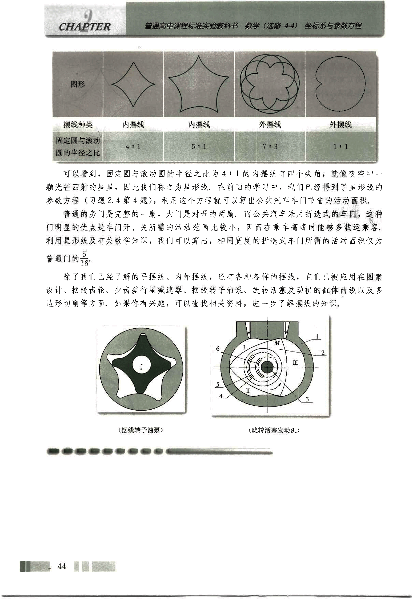
48 

# 学习总结报告

在本专题中，同学们学习了几种不同的坐标系以及用这些坐标系刻画点的位
置的方法，在不同的坐标系中求出了一些简单曲线的方程，进一步体会了坐标法
思想，围绕这部分内容，以下问题值得思考：

1. 不同坐标系在刻画点的位置与曲线的方程时各有什么特点？
2. 为使曲线的方程变得简单，建立坐标系时应注意什么？
3. 平面直角坐标系中的伸缩变换的本质是什么？在伸缩变换的作用下，平面
图形会有怎样的变化？
4. 极坐标系与直角坐标系有哪些不同？举例说明如何根据动点满足的几何条
件选择极坐标系或直角坐标系。

参数方程是以参变量为中介来表示曲线上点的坐标的方程，是曲线在同一坐
标系下的一种表示形式，有时，用具有几何意义或物理意义的参数描述动点轨迹
比较方便，围绕这部分内容，以下问题值得思考：

5. 参数方程与普通方程的异同点是什么？
6. 面临一个轨迹问题，如何选择参数？举例说明如何根据轨迹的特点选择
参数。
7. 在参数方程与普通方程互化过程中，需要注意什么？
8. 你知道直线、圆、圆锥曲线的参数方程中参数的意义了吗？举例说明如何
利用参数的意义解决问题。
9. 借助信息技术研究平摆线、渐开线等曲线非常有趣，请你亲自尝试一下。

请你完成一份学习总结报告，建议包括以下内容：

1. 本讲知识的总结：知识结构框图，重要数学思想与方法，本专题与高中其
他内容之间的联系。
2. 举例说明如何用坐标法思想解决问题。
3. 通过查阅资料、调查研究、访问求教、独立思考，探讨参数方程、摆线的
应用，拓展自己的知识。
4. 学习本讲内容后的感受与体会。

45

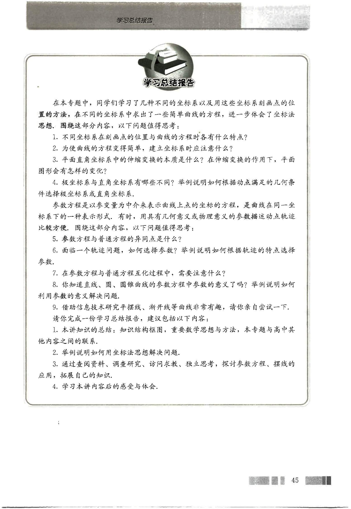
49 

# 后记

为了全面贯彻党的教育方针，适应时代发展的需要，为学生的终身发展奠定基础，根据教育部制订的普通高中各学科课程标准（实验），人民教育出版社课程教材研究所编写的各学科普通高中课程标准实验教科书，得到了诸多教育界前辈和各学科专家学者的热情帮助和大力支持。在各学科教科书终于同课程改革实验区的师生见面时，我们特别感谢担任教科书总顾问的丁石孙、许嘉璐、叶至善、顾明远、吕型伟、王梓坤、梁衡、金冲及、白春礼、陶西平同志，感谢担任教科书编写指导委员会主任委员的柳斌同志和编写指导委员会委员的江蓝生、李吉林、杨焕明、顾泠沅、袁行霈等同志。

根据教育部制订的《普通高中数学课程标准(实验)》，我们聘请北京师范大学刘绍学教授为主编，与高中数学课程标准研制组的部分成员、大学数学教师、数学教育理论工作者、中学数学教研员和数学教师共同组成编写委员会，编写了这套数学实验教科书。这里特别要感谢北京师范大学数学科学学院领导对本套教科书编写工作的高度重视和大力支持，同时还要感谢所有对本套教科书提出修改意见，提供过帮助与支持的专家、学者和教师，以及社会各界朋友。

本册教科书是编委会全体成员集体智慧的成果，除已列出的主要编写者外，参加本册教科书讨论的还有：徐勇，张文俊，张劲松等。

我们还要感谢使用本套教材的实验区的师生们，希望你们在使用本套教材的过程中，能够及时把意见和建议反馈给我们，对此，我们将深表谢意。让我们携起手来，共同完成教材建设工作。我们的联系方式如下：

电话：(010) 58758318

E-mail: jcfk@pep.com.cn wangr@pep.com.cn

人民教育出版社  课程教材研究所
中学数学课程教材研究开发中心

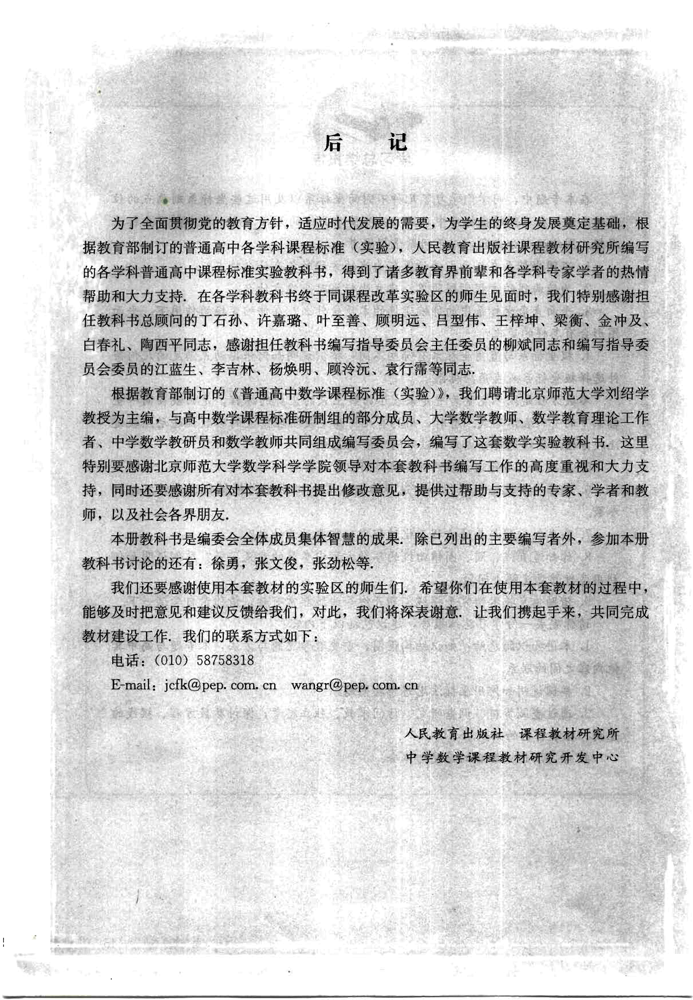
