# 选修 4-5

1

# 普通高中课程标准实验教科书

## 数学

### 选修 4-5

### 不等式选讲

人民教育出版社 课程教材研究所 编著

中学数学课程教材研究开发中心

$\frac{a+b+c}{3} \ge \sqrt[3]{abc}$

$| \alpha \cdot \beta | \le |\alpha||\beta|$

2

# 普通高中课程标准实验教科书

## 数学

### 选修 4-5

## 不等式选讲

人民教育出版社 课程教材研究所 编著
中学数学课程教材研究开发中心

$\frac{a+b+c}{3} \ge \sqrt[3]{abc}$

$|a \cdot b| \le |a||b|$

3

# 目录

引言 1

第一讲 不等式和绝对值不等式 2

一 不等式 2

1. 不等式的基本性质 2
2. 基本不等式 5
3. 三个正数的算术-几何平均不等式 8

二 绝对值不等式 11

1. 绝对值三角不等式 11
2. 绝对值不等式的解法 15

第二讲 证明不等式的基本方法 21
一 比较法 21
二 综合法与分析法 23
三 反证法与放缩法 26

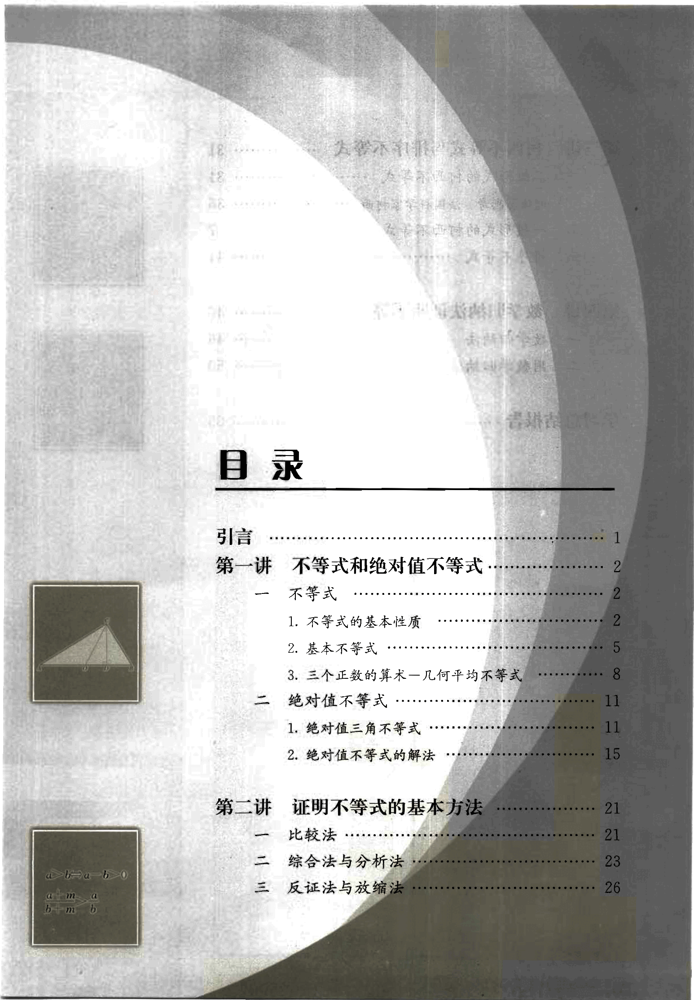
4

# 第三讲 柯西不等式与排序不等式

31

- 二维形式的柯西不等式 31
- 阅读与思考 法国科学家柯西 36
- 一般形式的柯西不等式 37
- 排序不等式 41

# 第四讲 数学归纳法证明不等式

46

- 数学归纳法 46
- 用数学归纳法证明不等式 50

学习总结报告 55

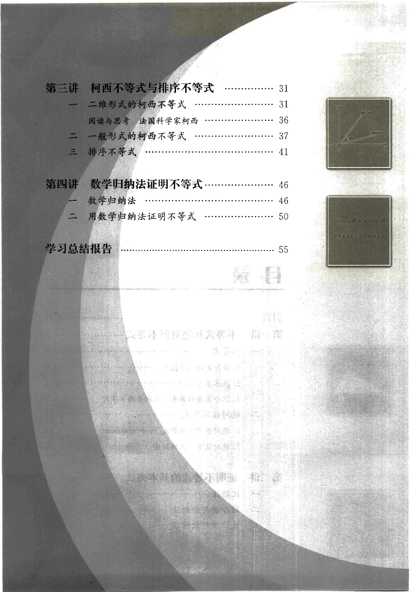
5

# 引言

在自然界中，等量关系和不等量关系是普遍存在的。描述等量关系可以用等式，描述不等量关系可以用不等式。与等量关系一样，不等关系也是数学研究的重要内容。所以，研究不等关系和不等式，既是数学研究的重要方面，也是我们认识世界的重要途径。

本专题将在复习已有不等式知识（不等式的性质，基本不等式等）的基础上，继续学习不等式的知识，包括一些关于绝对值不等式的性质；证明不等式的基本方法：比较法，综合法和分析法，反证法和放缩法；几个重要的不等式：基本不等式，二维形式，向量形式和一般形式的柯西不等式，排序不等式；数学归纳法及其在证明不等式中的应用；等等。

许多重要的不等式有深刻的数学意义和背景，本专题中给出的不等式大都有明确的几何背景。把握这些几何背景，对于我们理解这些不等式的实质是非常重要的。因此，在学习过程中，同学们应当注意理解这些不等式的背景（特别是几何背景）及其蕴涵的数学思想，尽可能借助几何直观来证明这些基本而重要的不等式，从中领悟数形结合等重要数学思想在研究不等式中的作用。

希望同学们通过本书的学习，在数学知识的积累、数学能力的提高、对数学的理解和认识等方面都能再上一个新台阶。

1

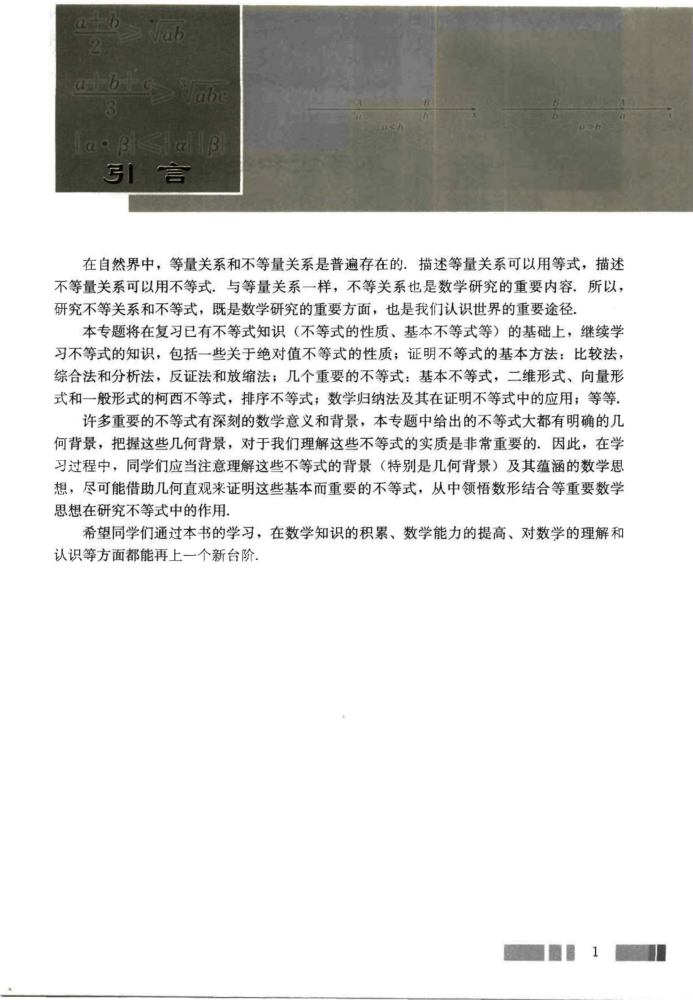
6

# 第一讲 不等式和绝对值不等式

现实中，人们常用长与短、多与少、高与矮、轻与重……来描述客观事物在数量上存在的不等关系。数学中，人们常用不等式表示这样的不等关系，不等式是数学研究的重要内容。

## 一 不等式

### 1. 不等式的基本性质

研究不等式的出发点是实数的大小关系。我们知道，数轴上的点与实数一一对应，因此可以利用数轴上点的左右位置关系来规定实数的大小：

设 $a$，$b$ 是两个实数，它们在数轴上所对应的点分别是 A，B。那么，当点 A 在点 B 的左边时，$a < b$；当点 A 在点 B 的右边时，$a > b$ (图 1.1-1).

A      B
a     b     x
a < b

B A
b a x
a > b

图 1.1-1

关于实数 $a$，$b$ 的大小关系，有以下基本事实：

如果 $a > b$，那么 $a - b$ 是正数；如果 $a = b$，那么 $a - b$ 等于零；如果 $a < b$，那么 $a - b$ 是负数，反过来也对。

这个基本事实可以表示为

$a > b \Leftrightarrow a - b > 0$；

$a = b \Leftrightarrow a - b = 0$；

$a < b \Leftrightarrow a - b < 0$。

上面的符号“$\Leftrightarrow$”表示“等价于”，即可以互相推出。

思考

从上述基本事实出发，你认为可以用什么方法比较两个实数的大小？

2

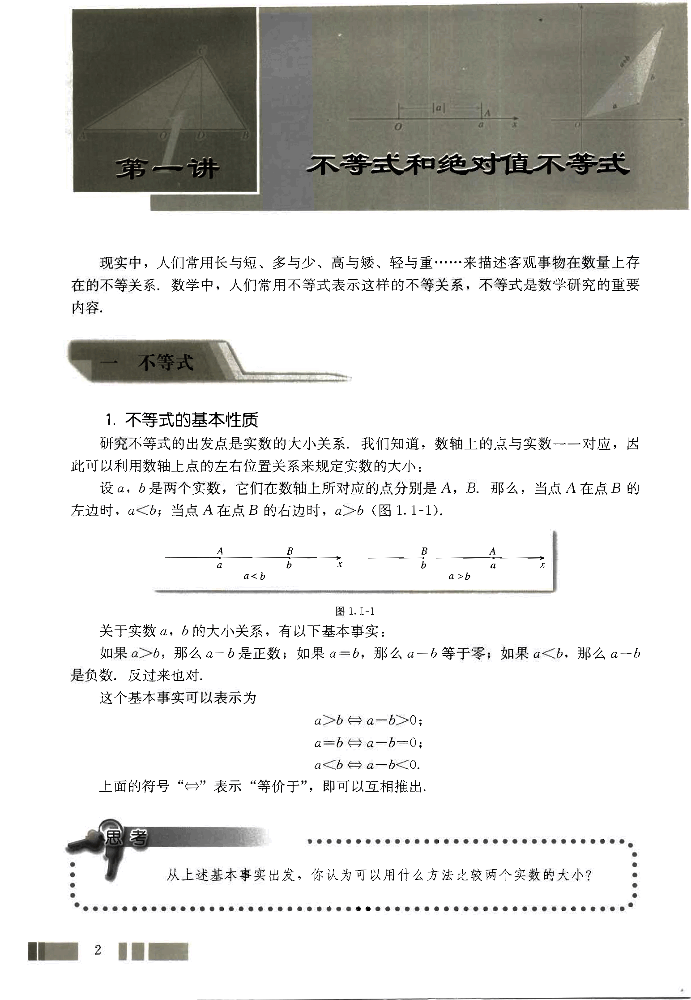
7

# 第一讲 不等式和绝对值不等式

从上述基本事实可知，要比较两个实数的大小，可以转
化为比较它们的差与 0 的大小。这是研究不等关系的一个
出发点。

例 1 比较(x+3)(x+7)和(x+4)(x+6)的大小。

分析：通过考察它们的差与 0 的大小关系，得出这两个多项式的大小关系。

解：因为

(x+3)(x+7) - (x+4)(x+6)
= (x² + 10x + 21) - (x² + 10x + 24)
= -3 < 0,

所以

(x+3)(x+7) < (x+4)(x+6).

探究

我们知道，等式有“等式两边同加(或减)一个数，等式仍然成立”“等式两边
同乘(或除以)一个数，等式仍然成立”等基本性质，类比等式的这些性质，不等式
有哪些基本性质呢？

我们知道，等式的基本性质是从数的运算的角度提出
的。同样的，由于不等式也研究实数之间的关系，所以联系
数的运算(加、减、乘、除、乘方、开方等)来思考不等式
的基本性质是非常自然的。例如，不等式两边加(或乘)
同一个数，不等式是否仍然成立？等等。

由两个实数大小关系的基本事实，可以得出不等式的一些基本性质：

(1) 如果 a > b，那么 b < a；如果 b < a，那么 a > b。即
a > b ⇔ b < a.

(2) 如果 a > b，b > c，那么 a > c。即
a > b, b > c ⇒ a > c.

(3) 如果 a > b，那么 a + c > b + c.

(4) 如果 a > b，c > 0，那么 ac > bc；如果 a > b，c < 0，那么 ac < bc.

(5) 如果 a > b > 0，那么 an > bn (n∈N, n ≥ 2).

(6) 如果 a > b > 0，那么 $\sqrt[n]{a} > \sqrt[n]{b}$ (n∈N, n ≥ 2).

通过语言叙述可以加深理解上述基本性质，例如，性质(4)可以表述为：不等式两边
同乘一个正数，不等号同向；不等式两边同乘一个负数，不等号反向。你能用自己的语言
叙述上述各条性质吗？

3

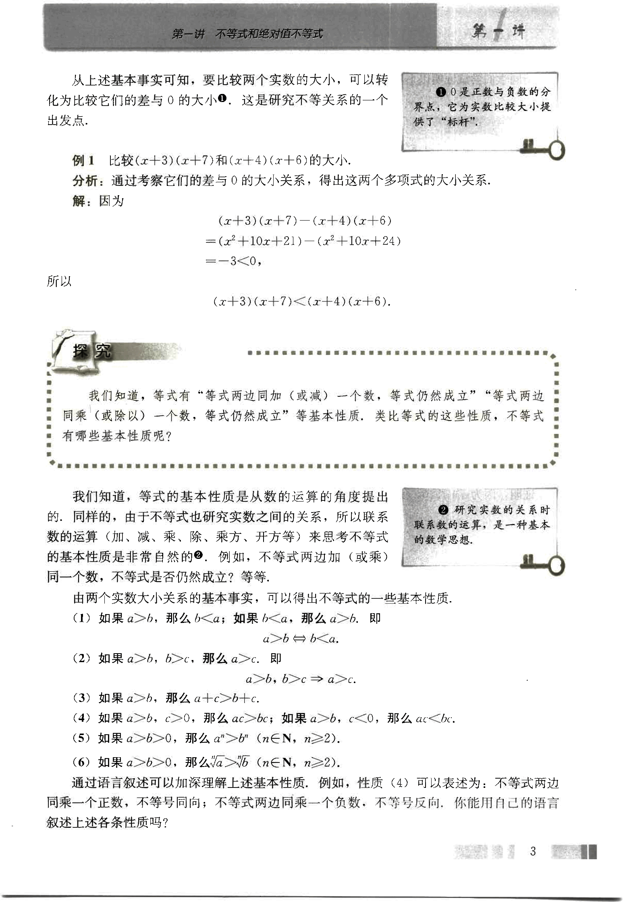
8

# CHAPTER

普通高中课程标准实验教科书 数学(选修 4-5) 不等式选讲

请同学们尝试证明以上不等式的基本性质.

## 思考

观察不等式的基本性质(1)~(6),并与等式的基本性质比较,你认为
在研究不等式时,需要特别注意什么问题?

事实上,从上述基本性质可以发现,在研究不等式时,需要特别注意“符号问题”,即
在作乘(除)运算时,乘(除)数的符号会影响不等号的方向.

上述关于不等式的基本事实和基本性质是解决不等式问题的基本依据,研究不等式时,
经常以它们作为出发点,例如,利用不等式的基本性质可以得到下列结论:

如果 $a>b$ , $c>d$ , 那么 $a+c>b+d$ ;
如果 $a>b>0$ , $c>d>0$ , 那么 $ac>bd$ .

## 例 2

已知 $a>b>0$ , $c>d>0$ , 求证 $\frac{a}{ \sqrt{d} } > \frac{b}{ \sqrt{c} }$ .

**分析:** 观察要证的不等式,联系性质(6),可知关键是证明 $\frac{a}{d} > \frac{b}{c}$ . 为此先要证

**证明:** 因为 $c>d>0$ , 所以

$cd>0$ , $c-d>0$ , $\frac{1}{cd} > 0$ .

于是

$\frac{1}{d} - \frac{1}{c} = \frac{c-d}{cd} > 0$ ,

因此

由 $a>0$ 及性质(4),得 $\frac{a}{d} > \frac{a}{c} > 0$ .

由 $a>b>0$ , $\frac{1}{c} > 0$ 及性质(4),得 $\frac{a}{c} > \frac{b}{c} > 0$ .

由性质(2),得 $\frac{a}{d} > \frac{b}{d} > 0$ .

根据性质(6),有 $\frac{a}{d} > \frac{b}{c}$ .

4

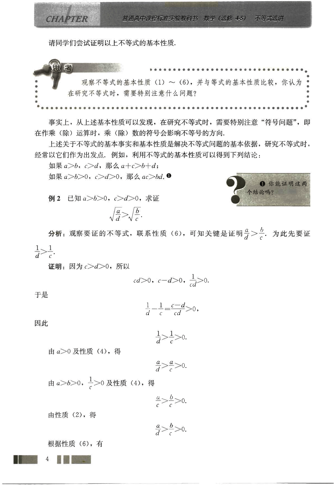
9

# 第一讲 不等式和绝对值不等式

## 2. 基本不等式

我们已经学过重要不等式 $a^2+b^2≥2ab$ (a, b∈R), 为了方便同学们学习, 下面将它以定理的形式给出, 并给出证明.

**定理 1** 如果 a, b∈R, 那么

$a^2+b^2≥2ab$,

当且仅当 a=b 时, 等号成立.

**证明:** 因为 $a^2+b^2-2ab=(a-b)^2≥0$, 当且仅当 a=b 时等号成立, 所以,

当且仅当 a=b 时, 等号成立.

**探究**

你能从几何的角度解释定理 1 吗？

如果把实数 a, b 作为线段长度, 那么可以这样来解释定理 1:

以 a≥b 为例, 如图[图 1.1-2](images/图1.1-2.png)。在正方形 ABCD 中, AB=a; 在正方形 CEFG 中, EF=b. 那么

$S_{正方形ABCD} + S_{正方形CEFG} = a^2+b^2$.

矩形 BCGH 和矩形 JCDI 的长均为 a, 宽均为 b, 它们的面积的和是

$S_{矩形BCGH} + S_{矩形JCDI} = 2ab$.

矩形 BCGH 和矩形 JCDI 的公共部分是正方形 JCGK, 它的边长等于 b, 其面积与正方形 CEFG 相等. 所以, 上述两个矩形的面积和 2ab 就等于图中阴影部分的面积, 它不大于正方形 ABCD 与正方形 CEFG 的面积的和, 即

$a^2+b^2≥2ab$.

当且仅当 a=b 时, 两个矩形成为两个正方形, 阴影部分面积等于正方形 ABCD 与正方形 CEFG 的面积和, 即

$a^2+b^2=2ab$.

将定理 1 作简单的恒等变形, 就可以得到以下的基本不等式 (basic inequality).

**定理 2** (基本不等式) 如果 a, b>0, 那么

$\frac{a+b}{2}≥\sqrt{ab}$.

5

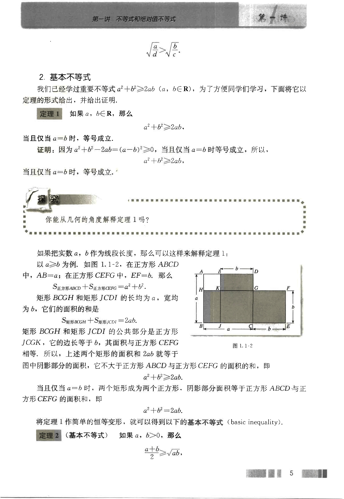
10

# CHAPTER

普通高中课程标准实验教科书 数学(选修 4-5) 不等式选讲

当且仅当 a=b 时，等号成立。

证明：因为 $a+b=(\sqrt{a})^2+(\sqrt{b})^2 \ge 2\sqrt{a}\cdot\sqrt{b}=2\sqrt{ab}$，所以

$\frac{a+b}{2} \ge \sqrt{ab}$。

当且仅当 $\sqrt{a}=\sqrt{b}$，即 a=b 时，等号成立。

如果 a，b 都是正数，我们就称为 $\frac{a+b}{2}$ 为 a，b 的算术平均 (arithmetic mean)，$\sqrt{ab}$ 为 a，b 的几何平均 (geometric mean)。于是，基本不等式可以表述为：

两个正数的算术平均不小于（即大于或等于）它们的几何平均。

下面我们讨论一下基本不等式的几何意义。在图 1.1-3 中，CD 是 Rt△ABC 中斜边 AB 上的高，OC 是斜边 AB 上的中线，AD=a，BD=b。于是，

$OC = \frac{1}{2}AB = \frac{1}{2}(a+b)$。

因为 ∠DCA+∠A=90°，∠B+∠A=90°，

所以 ∠DCA=∠B。

于是 Rt△DCA≅Rt△DBC。

$\frac{AD}{CD} = \frac{CD}{BD}$，即 $\frac{a}{CD} = \frac{CD}{b}$。

所以 $CD = \sqrt{ab}$。

当 a≠b 时，在 Rt△OCD 中，斜边 OC 大于直角边 CD，所以 $\frac{a+b}{2} > \sqrt{ab}$。

当 a=b 时，Rt△ABC 斜边 AB 上的中线 OC 和高 CD 重合，所以 $\frac{a+b}{2} = \sqrt{ab}$。

综上所述可知，基本不等式的几何意义是：直角三角形斜边上的中线不小于斜边上的高。

[图 1.1-3](images/1.1-3.png)

探究

你能给出基本不等式的其他几何解释吗？

例 3 求证：（1）在所有周长相同的矩形中，正方形的面积最大；（2）在所有面积相同的矩形中，正方形的周长最短。

分析：设矩形的长为 x，宽为 y，那么该矩形的周长为 2(x+y)，面积为 xy。这样，问题就转化为：

(1) 如果 2(x+y) (从而 x+y) 为定值，那么正数 x，y 有什么关系时 xy 最大？

(2) 如果 xy 为定值，那么正数 x，y 有什么关系时 2(x+y) (从而 x+y) 最小？

由于基本不等式恰好涉及两个正数的和与积之间的数量关系，所以可以利用基本不等式证明。

6

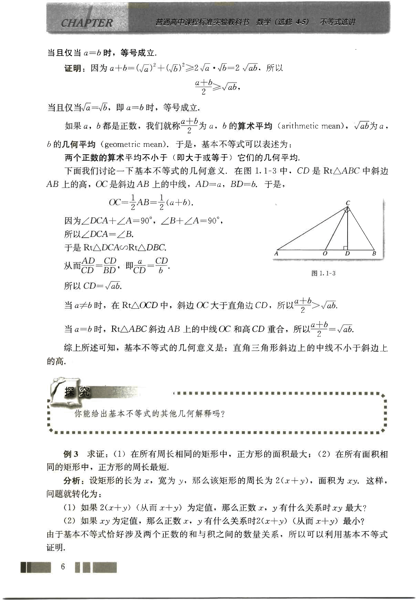
11

# 第一讲 不等式和绝对值不等式

**证明**: 设矩形的长为 x，宽为 y.

**(1)** 设矩形周长为定值 l，即 2x + 2y = l 为定值，根据基本不等式

$\frac{x+y}{2} \ge \sqrt{xy}$,

可得

$\frac{l}{4} \ge \sqrt{xy}$.

于是，矩形的面积

$xy \le \frac{l^2}{16}$.

当且仅当 x = y 时，等号成立，即当且仅当矩形是正方形时，面积 xy 取得最大值 $\frac{l^2}{16}$.

**(2)** 设矩形面积为定值 S，即 xy = S 为定值，根据基本不等式

$\frac{x+y}{2} \ge \sqrt{xy}$,

矩形的周长

$2(x+y) \ge 4\sqrt{xy} = 4\sqrt{S}$.

当且仅当 x = y 时，等号成立，即当且仅当矩形是正方形时，周长 2(x+y) 取最小值 $4\sqrt{S}$.

一般地，从基本不等式可以得到下面结论：对两个正实数 x, y，如果它们的和 S 是定值，则当且仅当 x = y 时，它们的积 P 取得最大值；如果它们的积 P 是定值，则当且仅当 x = y 时，它们的和 S 取得最小值.

利用基本不等式可以解决一些最大(小)值问题.

**例 4** 某居民小区要建一座八边形的休闲场所，它的主体造型平面图 (图 1.1-4) 是由两个相同的矩形 ABCD 和 EFGH 构成的 200 平方米的十字型地域，计划在正方形 MNPQ 上建一座花坛，造价为每平方米 4200 元，在四个相同的矩形上 (图中阴影部分) 铺花岗岩地坪，造价为每平方米 210 元，再在四个空角 (图中四个三角形) 上铺草坪，造价为每平方米 80 元.

**(1)** 设总造价为 S 元，AD 长为 x 米，试建立 S 关于 x 的函数关系式；

**(2)** 当 x 为何值时 S 最小，并求出这个最小值.

**解:** (1) 设 DQ = y 米，则 $x^2 + 4xy = 200$，从而

$y = \frac{200 - x^2}{4x}$.

于是

$S = 4 \times 200x^2 + 210 \times 4xy + 80 \times 2y^2$

$= 4 \times 200x^2 + 210 \times 4x \times \frac{200 - x^2}{4x} + 80 \times 2 (\frac{200 - x^2}{4x})^2$

7

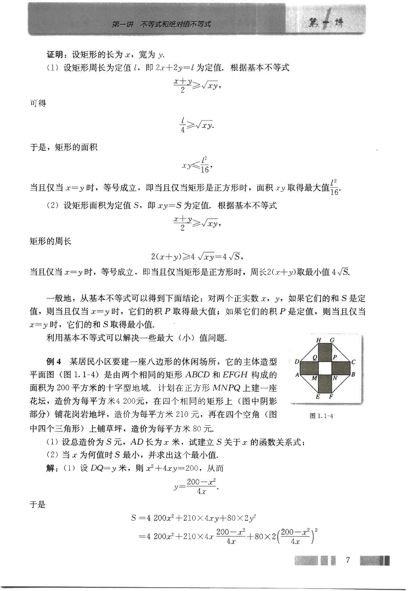
12

# CHAPTER

普通高中课程标准实验教科书 数学(选修 4-5) 不等式选讲

(2)由基本不等式可知，

$4000x^2 + \frac{400000}{x^2} \ge 2\sqrt{4000x^2 \times \frac{400000}{x^2}} = 80000$，

所以

当且仅当

$S \ge 38000 + 80000 = 118000$，

$4000x^2 = \frac{400000}{x^2}$，

即$x = \sqrt{10} \approx 3.16$时，等号成立.

由上可知，当 AD 约为 3.16 米时，休闲场所总造价 S 取最小值 118000 元.

# 3.三个正数的算术—几何平均不等式

**思考**

基本不等式给出了两个正数的算术平均与几何平均的关系，这个不等式能否推广呢？例如，对于 3 个正数，会有怎样的不等式成立？

类比基本不等式的形式，我们猜想，对于 3 个正数 a, b, c,可能有：如果 a, b, c ∈ R+，那么$\frac{a+b+c}{3} \ge \sqrt[3]{abc}$，当且仅当 a=b=c 时，等号成立.

如何证明这个猜想呢？仍然类比基本不等式的推出过程，我们先证明：

已知 a, b, c ∈ R+，那么$a^3+b^3+c^3 \ge 3abc$，当且仅当 a=b=c 时，等号成立.

证明：因为

$a^3+b^3+c^3-3abc$

$= (a+b)^3 - 3a^2b -3ab^2 + c^3 - 3abc$

$= (a+b)^3 + c^3 - 3a^2b - 3ab^2 - 3abc$

$= (a+b+c)[(a+b)^2 - (a+b)c + c^2] - 3ab(a+b+c)$

$= (a+b+c)[a^2 + 2ab + b^2 - ac - bc + c^2 - 3ab]$

$= (a+b+c)(a^2 + b^2 + c^2 - ab - bc - ca)$

$= (a+b+c) \times [(a-b)^2 + (b-c)^2 + (c-a)^2] \ge 0$，

所以

$a^3+b^3+c^3 \ge 3abc$，

当且仅当 a=b=c 时，等号成立.

对上述结果作简单的恒等变形，就可以得到

8

(1) $(x+y)^3$

$= x^3 + 3x^2y + 3xy^2 + y^3$；

(2) $x^3 + y^3$

$= (x+y)(x^2 - xy + y^2)$.

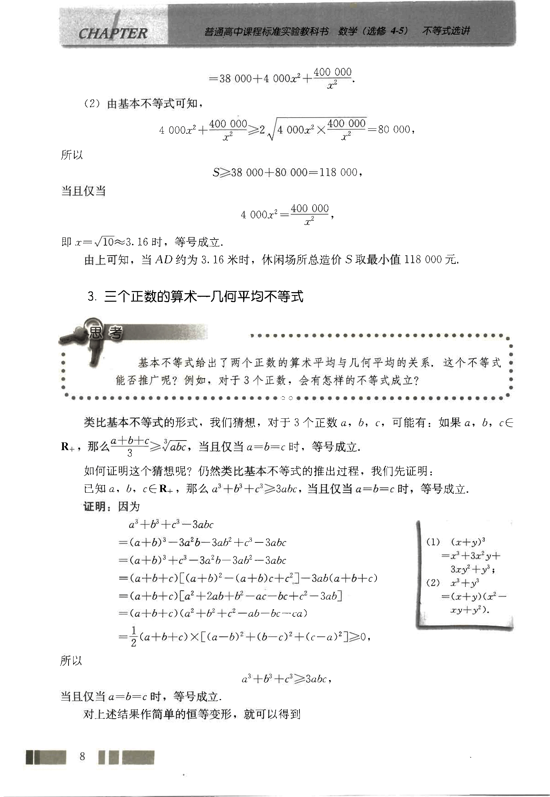
13

# 第一讲 不等式和绝对值不等式

## 定理 3

如果 a, b, c∈R+, 那么$\frac{a+b+c}{3} \ge \sqrt[3]{abc}$，当且仅当 a=b=c 时，等号成立.

这个不等式可以表述为：三个正数的算术平均不小于它们的几何平均.

事实上，基本不等式可以推广到一般的情形：对于 n 个正数$a_1, a_2,..., a_n$，它们的算术平均不小于它们的几何平均，即

$\frac{a_1 + a_2 + ... + a_n}{n} \ge \sqrt[n]{a_1 a_2 ... a_n}$

当且仅当$a_1 = a_2 = ... = a_n$时，等号成立.

## 例 5

已知 x, y, z∈R+，求证$(x+y+z)^3 \ge 27xyz$.

证明：因为$\frac{x+y+z}{3} \ge \sqrt[3]{xyz} > 0$，所以

$\frac{(x+y+z)^3}{27} \ge xyz$

$(x+y+z)^3 \ge 27xyz$.

## 例 6

如图[图 1.1-5](images/图1.1-5.png)，把一块边长是 a 的正方形铁片的各角切去大小相同的小正方形，再把它的边沿着虚线折转作成一个无盖方底的盒子，问切去的正方形边长是多少时，才能使盒子的容积最大？

解：设切去的正方形边长为 x，无盖方底盒子的容积为 V，则

$V = (a-2x)^2 x$

$= \frac{1}{4}(a-2x)(a-2x) \times 4x$

$\le \frac{1}{4} [\frac{(a-2x) + (a-2x) + 4x}{3}]^3$

$= \frac{2a^3}{27}$

当且仅当 a-2x = a-2x = 4x，即当$x = \frac{a}{6}$时，不等式取等号，此时 V 取最大值$\frac{2a^3}{27}$. 即当切去的小正方形边长是原来正方形边长的$\frac{1}{6}$时，盒子的容积最大.

## 习题 1.1

1. 判断下列各命题的真假，并说明理由：

(1) 如果 a>b，那么 ac>bc；

(2) 如果 a>b，那么$ac^2 > bc^2$；

(3) 如果 a>b，那么$a^n > b^n$ (n∈N+)；

(4) 如果 a>b，c<d，那么 a-c>b-d.

2. 比较(x+1)(x+2)和(x-3)(x+6)的大小.

9

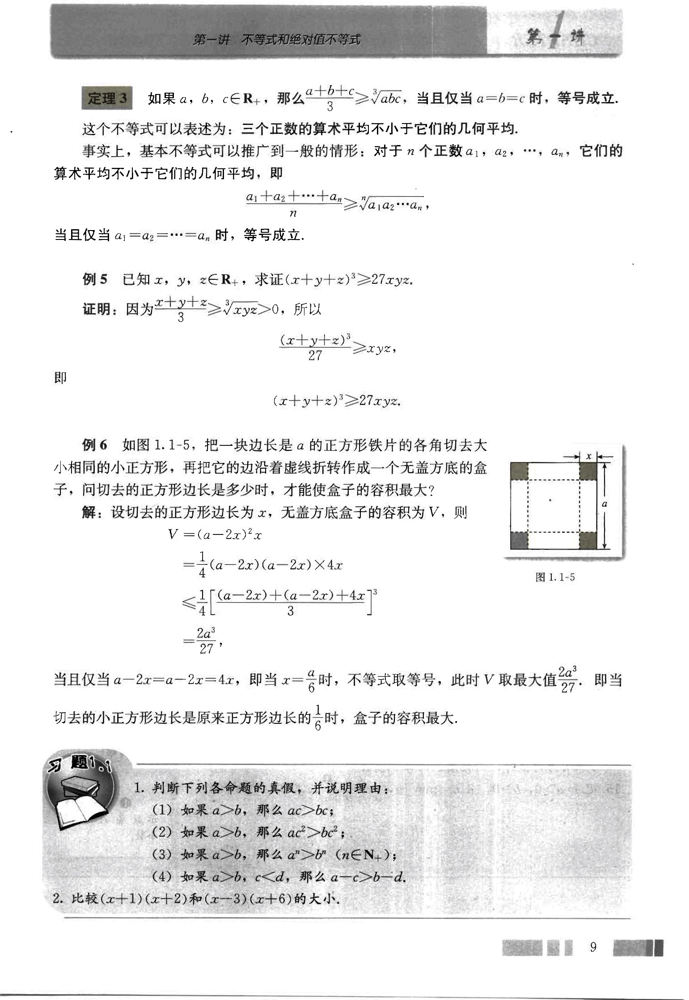
14

# CHAPTER

普通高中课程标准实验教科书 数学(选修 4-5) 不等式选讲

3. 求证：

(1) 如果 $a > b$，$ab \ge 0$，那么 $\frac{1}{a} < \frac{1}{b}$；

(2) 如果 $a > b > 0$，$c < d < 0$，那么 $ac < bd$。

4. 如果 $a > b$，$c > d$，是否一定能得出 $ac > bd$? 并说明理由。

5. 设 $a, b \in R^+$，且 $a \ne b$。求证：

(1) $\frac{a}{b} + \frac{b}{a} > 2$；

(2) $\frac{2ab}{a+b} < \sqrt{ab}$。

6. 设 $a, b, c$ 是不全相等的正数，求证：

(1) $(a+b)(b+c)(c+a) > 8abc$；

(2) $a+b+c > \sqrt{ab} + \sqrt{bc} + \sqrt{ca}$。

7. 求证 $a^2 + b^2 + c^2 + d^2 \ge ab + bc + cd + da$。

8. 已知 $a_1^2 + a_2^2 + \dots + a_n^2 = 1$，$x_1^2 + x_2^2 + \dots + x_n^2 = 1$，求证
   $a_1x_1 + a_2x_2 + \dots + a_nx_n \le 1$。

9. 已知 $x, y \in R$，求证 $\frac{x^2+y^2}{2} \ge (\frac{x+y}{2})^2$。

10. 求证 $\frac{x^2+2}{\sqrt{x^2+1}} \ge 2$。

11. 已知 $a, b, c \in R^+$，$a + b + c = 1$，求证 $a^2 + b^2 + c^2 \ge \frac{1}{3}$。

12. 已知 $a, b, c \in R^+$，求证：

(1) $(\frac{a}{b} + \frac{b}{c} + \frac{c}{a})(\frac{b}{a} + \frac{c}{b} + \frac{a}{c}) \ge 9$；

(2) $(a+b+c)(a^2+b^2+c^2) \ge 9abc$。

13. 在对角线有相同长度的所有矩形中，怎样的矩形周长最长，怎样的矩形面积最大？

14. 已知球的半径为 R，球内接圆柱的底面半径为 r，高为 h，则 r 和 h 为何值时，内接圆柱的体积最大？[第 14 题](images/第14题.png)

15. 已知 $a > 0$，$b > 0$，且 $h = min\{a, \frac{a^2+b^2}{b}\}$，求证 $h \le \frac{\sqrt{2}}{2}$。

10

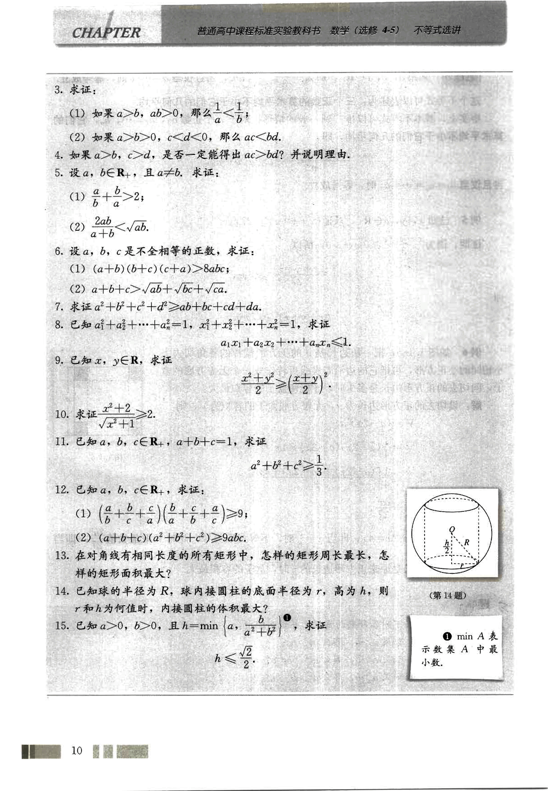
15

# 第一讲 不等式和绝对值不等式

## 二 绝对值不等式

从不等式的背景可以看到，许多不等关系都涉及到距离的长短，面积或体积的大小，重量的大小，等等，它们都要通过非负数来表示。因此，研究含有绝对值的不等式具有重要意义。

### 1. 绝对值三角不等式

我们知道，实数 $a$ 的绝对值 $|a|$ 有明确的几何意义，它表示数轴上坐标为 $a$ 的点 A 到原点的距离（图 1.2-1(1)）。

.png>)
.png>)

对于任意两个实数 $a, b$，设它们在数轴上的对应点分别为 A, B，那么 $|a - b|$ 的几何意义是数轴上 A, B 两点之间的距离，即线段 AB 的长度（图 1.2-1(2)）。

绝对值的几何意义是我们认识绝对值不等式的重要工具。实际上，我们可把“距离大小”作为解决绝对值不等式的基本出发点，研究和解决相应的问题。

**思考**

类比不等式基本性质的得出过程，你认为可以怎样提出关于绝对值不等式性质的猜想？

我们仍然可以从“运算”的角度考察绝对值不等式，例如，对于实数 $a, b$，可以考察 $|a|, |b|, |a + b|, |a - b|$ 等之间的关系，在研究过程中应特别注意利用绝对值的几何意义。

下面研究 $|a|, |b|, |a + b|$ 之间的关系。

**探究**

用恰当的方法在数轴上把 $|a|, |b|, |a + b|$ 表示出来，你能发现它们之间的什么关系？

我们先分 $ab > 0$ 和 $ab < 0$ 两种情况讨论。

11

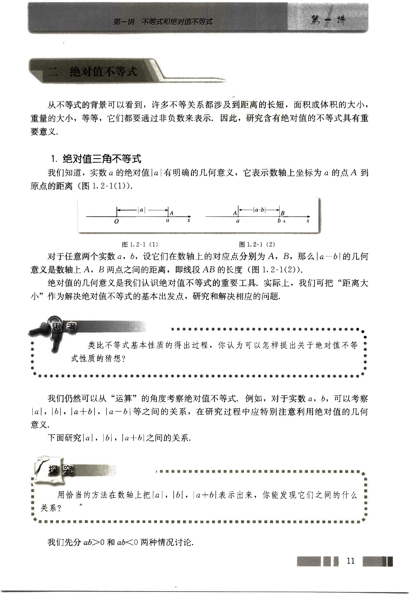
16

# CHAPTER 普通高中课程标准实验教科书 数学(选修 4-5) 不等式选讲

当 ab>0 时，如图 1.2-2，容易得到：

|a+b| = |a|+|b|.

当 ab<0 时，又可以分 a>0, b<0 和 a<0, b>0 两种情况。如果 a>0, b<0，如图 1.2-3(1)，坐标为 a 的点在原点的右边，坐标为 b 的点在原点的左边，可以发现：

|a+b| < |a|+|b|.

同理，当 a<0, b>0 时，如图 1.2-3(2)，也有

|a+b| < |a|+|b|.

如果 ab=0，则 a=0 或 b=0，容易看出：

|a+b| = |a|+|b|.

综上所述，可以得到：

**定理 1** 如果 a, b 是实数，则

|a+b| ≤ |a|+|b|,

当且仅当 ab≥0 时，等号成立。

**探究**

如果把定理 1 中的实数 a, b 分别换为向量$\vec{a}$, $\vec{b}$，能得出什么结果？你能解释它的几何意义吗？

在上面的不等式中，用向量$\vec{a}$, $\vec{b}$分别替换实数 a, b，当向量$\vec{a}$, $\vec{b}$不共线时，那么由向量加法的三角形法则，向量$\vec{a}$+$\vec{b}$, $\vec{a}$, $\vec{b}$构成三角形，因此我们有向量形式的不等式

|$\vec{a}$+$\vec{b}$| < |$\vec{a}$|+|$\vec{b}$|.

它的几何意义就是三角形的两边之和大于第三边（图 1.2-4）。

由于定理 1 与三角形之间的这种联系，我们称其中的不等式为绝对值三角不等式

12

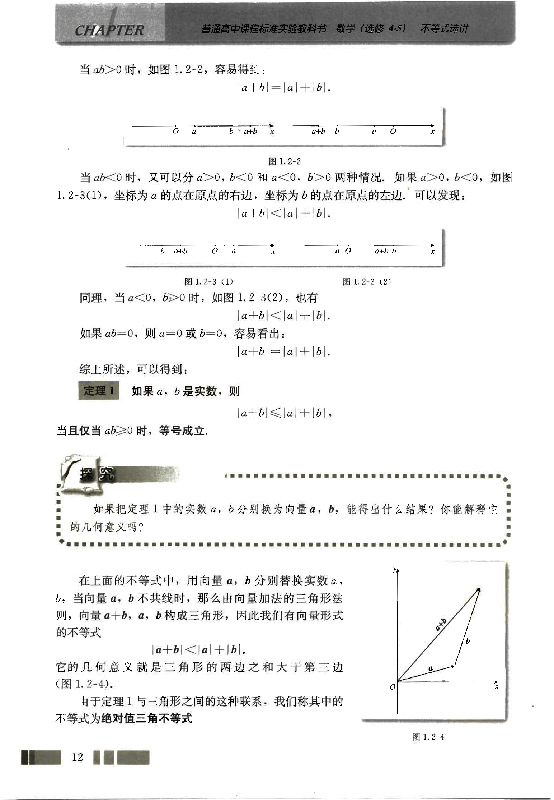
17

# 第一讲 不等式和绝对值不等式

## 探究

当向量 $a$, $b$ 共线时，有怎样的结论？

一般地，我们有

$|a + b| \le |a| + |b|$.

为了更好地理解定理 1，我们再从代数推理的角度给出它的证明。

证明：当 $ab \ge 0$ 时，$ab = |ab|$，所以

$|a + b| = \sqrt{(a + b)^2} = \sqrt{a^2 + 2ab + b^2} = \sqrt{|a|^2 + 2|ab| + |b|^2} = \sqrt{(|a| + |b|)^2} = |a| + |b|$.

当 $ab < 0$ 时，$ab = -|ab|$，所以

$|a + b| = \sqrt{(a + b)^2} = \sqrt{a^2 + 2ab + b^2} = \sqrt{a^2 - 2|ab| + b^2} < \sqrt{a^2 + 2|ab| + b^2} = \sqrt{|a|^2 + 2|ab| + |b|^2} = \sqrt{(|a| + |b|)^2} = |a| + |b|$.

所以

$|a + b| \le |a| + |b|$.

当且仅当 $ab \ge 0$ 时，等号成立.

## 探究

你能根据定理 1 的研究思路，探究一下 $|a|, |b|, |a + b|, |a - b|$ 等之间的其他关系吗？例如：$|a - b|$ 与 $a + b$，$|a + b|$ 与 $a - b$，$|a| - |b|$ 与 $a - b$ 等之间的关系.

事实上，我们可以得出许多正确的结论，例如：

如果 $a, b$ 是实数，那么

13

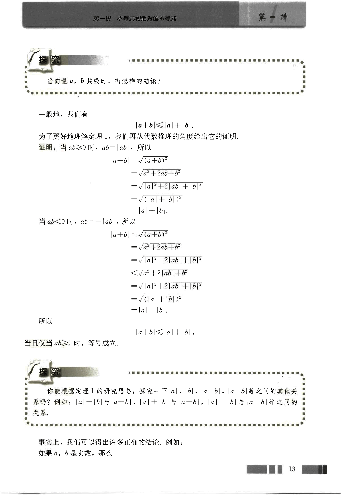
18

# CHAPTER 普通高中课程标准实验教科书 数学(选修 4-5) 不等式选讲

$|a - b| \le |a - b| \le |a| + |b|$.

以上我们讨论了关于两个实数的绝对值不等式，这是最基本、最重要的。根据这样的思想方法，我们可以讨论涉及多个实数的绝对值不等式问题。例如，我们有

## 定理 2

如果 $a, b, c$ 是实数，那么

$|a - c| \le |a - b| + |b - c|$,

当且仅当 $(a - b)(b - c) \ge 0$ 时，等号成立。

分析：由于 $a - c$, $a - b$ 与 $b - c$ 都是实数，且 $a - c = (a - b) + (b - c)$，因而定理 2 中不等式的形式与定理 1 的形式一致，所以考虑利用定理 1 来证明定理 2。

证明：根据定理 1，有

$|a - c| = |(a - b) + (b - c)| \le |a - b| + |b - c|$,

当且仅当 $(a - b)(b - c) \ge 0$ 时，等号成立。

你能给出定理 2 的几何解释吗？

如图 [1.2-5](images/1.2-5.png)，在数轴上，$a, b, c$ 所对应的点分别为 A, B, C，当点 B 在点 A, C 之间时，$|a - c| = |a - b| + |b - c|$.

图 [1.2-6](images/1.2-6.png) 给出了当点 B 不在点 A, C 之间时的一种情形，请同学们自己给出其他情形时定理 2 的几何解释。

## 例 1

已知 $\epsilon > 0$，$|x - a| < \epsilon$，$|y - b| < \epsilon$，求证

$|2x + 3y - 2a - 3b| < 5\epsilon$.

证明：

$|2x + 3y - 2a - 3b|$

$= |(2x - 2a) + (3y - 3b)|$

$\le |2(x - a)| + |3(y - b)|$

$= 2|x - a| + 3|y - b|$

$< 2\epsilon + 3\epsilon = 5\epsilon$,

所以

$|2x + 3y - 2a - 3b| < 5\epsilon$.

14

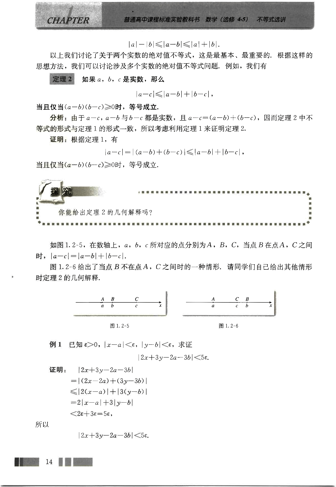
19

# 第一讲 不等式和绝对值不等式

## 例 2

两个施工队分别被安排在公路沿线的两个地点施工，这两个地点分别位于公路路碑的第 10 km 和第 20 km 处。现要在公路沿线建两个施工队的共同临时生活区，每个施工队每天在生活区和施工地点之间往返一次，要使两个施工队每天往返的路程之和最小，生活区应该建于何处？

**分析：**如果生活区建于公路路碑的第$x$ km 处，两个施工队每天往返的路程之和为$S(x)$ km，那么$S(x) = 2(|x - 10| + |x - 20|)$。于是，上面的问题就化归为数学问题：当$x$取何值时，函数$S(x) = 2(|x - 10| + |x - 20|)$取得最小值。这个问题可以应用绝对值不等式的性质来解。

**解：**设生活区应该建于公路路碑的第$x$ km 处，两个施工队每天往返的路程之和为$S(x)$ km，则

$S(x) = 2(|x - 10| + |x - 20|)$。

因为$|x - 10| + |x - 20| = |x - 10| + |20 - x|$

$\ge (x - 10) + (20 - x) = 10$，

当且仅当$(x - 10)(20 - x) \ge 0$时取等号。

解不等式$(x - 10)(20 - x) \ge 0$，

得$10 \le x \le 20$。

所以，当$10 \le x \le 20$时，函数

$S(x) = 2(|x - 10| + |x - 20|)$

取最小值 20。于是，生活区建于两个施工地点之间的任何一个位置时，都能使两个施工队每天往返的路程之和最小。

画出函数$S(x)$的图象（图 1.2-7），从图象上也可以直观地看出结论。

[图 1.2-7](images/1.2-7.png)

## 2. 绝对值不等式的解法

我们知道，对于不等式$|x| < 1$，由绝对值的几何意义，它的解集是数轴上到原点距离小于 1 的点的集合，即$(-1, 1)$；对于不等式$|x| > 1$，由绝对值的几何意义，它的解集是数轴上到原点距离大于 1 的点的集合，即$(-\infty, -1) \cup (1, \infty)$。

一般地，如果$a > 0$，那么从绝对值的几何意义看，$|x| < a$表示数轴上到原点距离小于$a$的点的集合，$|x| > a$表示到原点距离大于$a$的点的集合，因而

$|x| < a \Leftrightarrow -a < x < a$；

$|x| > a \Leftrightarrow x < -a 或 x > a$。

(\*)

因此，不等式$|x| < a$的解集是$(-a, a)$；不等式$|x| > a$的解集是$(-\infty, -a) \cup (a, +\infty)$，在数轴上表示如下（图 1.2-8）：

15

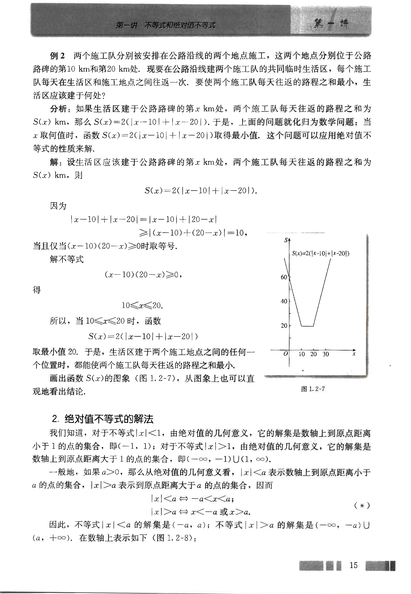
20

# CHAPTER 普通高中课程标准实验教科书 数学(选修 4-5) 不等式选讲

-a 0 a x

|x|<a

-a 0 a x

|x|>a

图 1.2-8

上述绝对值不等式(\*),是解其他绝对值不等式的基础,即其他绝对值不等式的解一般可以通过转化为上述不等式而得到,例如,a 是一个正实数,对于绝对值不等式$|x-x_1|<a$(或$|x-x_1|>a$),我们有

$|x-x_1|<a \Leftrightarrow -a<x-x_1<a \Leftrightarrow x_1-a<x<x_1+a;$

$|x-x_1|>a \Leftrightarrow x-x_1<-a,$ 或 $x-x_1>a \Leftrightarrow x<x_1-a,$ 或 $x>x_1+a.$

由于绝对值$|x-x_1|$的几何意义是数轴上坐标为 x 的点与坐标为$x_1$的点的距离,所以,以上不等式的解可以在数轴上表示出来,如图 1.2-9 所示.

$x_1-a$ $x_1$ $x_1+a$ x

$|x-x_1|<a$

$x_1-a$ $x_1$ $x_1+a$ x

$|x-x_1|>a$

图 1.2-9

利用上述(\*)式及绝对值的几何意义,可以解一些含有绝对值的不等式.

(1) $|ax+b|\le c$和$|ax+b|\ge c$型不等式的解法

例 3 解不等式$|3x-1|\le2$.

分析:如果把$(3x-1)$看成一个整体 X,那么所解的不等式就是$|X|\le2$,这是我们熟悉的.

解:由$|3x-1|\le2$得

$-2\le3x-1\le2,$

$-\frac{1}{3}\le x\le1.$

因此,原不等式的解集为$\{x|-\frac{1}{3}\le x\le1\}.$

从几何上看,如果将$|3x-1|\le2$两边除以 3,得

$|x-\frac{1}{3}|\le\frac{2}{3},$它的解集是数轴上到坐标为$\frac{1}{3}$的点的距离不大于$\frac{2}{3}$的点的集合,如图 1.2-10 所示.

例 4 解不等式$|2-3x|\ge7.$

16

$-\frac{1}{3}$ 0 $\frac{1}{3}$ 1 x

图 1.2-10

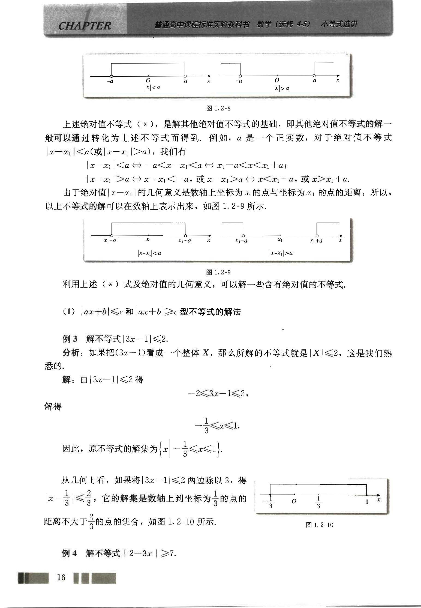
21

# 第一讲 不等式和绝对值不等式

解：由$|2-3x| \ge 7$得

$|3x-2| \ge 7$,

所以

$3x-2 \le -7$, 或 $3x-2 \ge 7$,

从而

$x \le -\frac{5}{3}$, 或 $x \ge 3$.

所以原不等式的解集为$\{x|x \le -\frac{5}{3} 或 x \ge 3\}$.

## 探究

你能给出上述绝对值不等式的解的几何解释吗？

## (2) $|x-a|+|x-b| \ge c$ 和 $|x-a|+|x-b| \le c$ 型不等式的解法

### 例 5 解不等式

$|x-1|+|x+2| \ge 5$.

分析：这个绝对值不等式比较复杂，我们从它的几何意义来分析，如图 1.2-11，设数轴上与 -2, 1 对应的点分别是 A, B，那么不等式的解就是数轴上到 A, B 两点的距离之和不小于 5 的点所对应的实数，所以，我们只要在数轴上确定出具有上述特点的点的位置，就可以得出不等式的解。

解法一：如图 1.2-11，设数轴上与 -2, 1 对应的点分别是 A, B，那么 A, B 两点的距离是 3，因此区间 $[-2, 1]$ 上的数都不是原不等式的解，为了求出不等式的解，关键要在数轴上找出与点 A, B 的距离之和为 5 的点，将点 A 向左移动 1 个单位到点 A₁，这时有

$|A_1A| + |A_1B| = 5$;

同理，将点 B 向右移动 1 个单位到点 B₁，这时也有

$|B_1A| + |B_1B| = 5$.

从数轴上可以看到，点 A₁ 与 B₁ 之间的任何点到点 A, B 的距离之和都小于 5；点 A₁ 的左边或点 B₁ 的右边的任何点到点 A, B 的距离之和都大于 5.

所以，原不等式的解集是 $(-\infty, -3] \cup [2, +\infty)$.

分析上述解法，可以发现，解 $|x-1|+|x+2| \ge 5$ 时，数轴上与 -2, 1 对应的点 A, B 把实数集分成了三个区间 $(-\infty, -2]$, $(-2, 1)$, $[1, +\infty)$，先分别在这三个区间上讨论不等式的解的情况，然后把它们综合在一起就得到不等式的解集。事实上，以点 A, B 为分界点，将数轴分为三个区间，在这三个区间上，绝对值不等式可以转化为不含绝对值

17

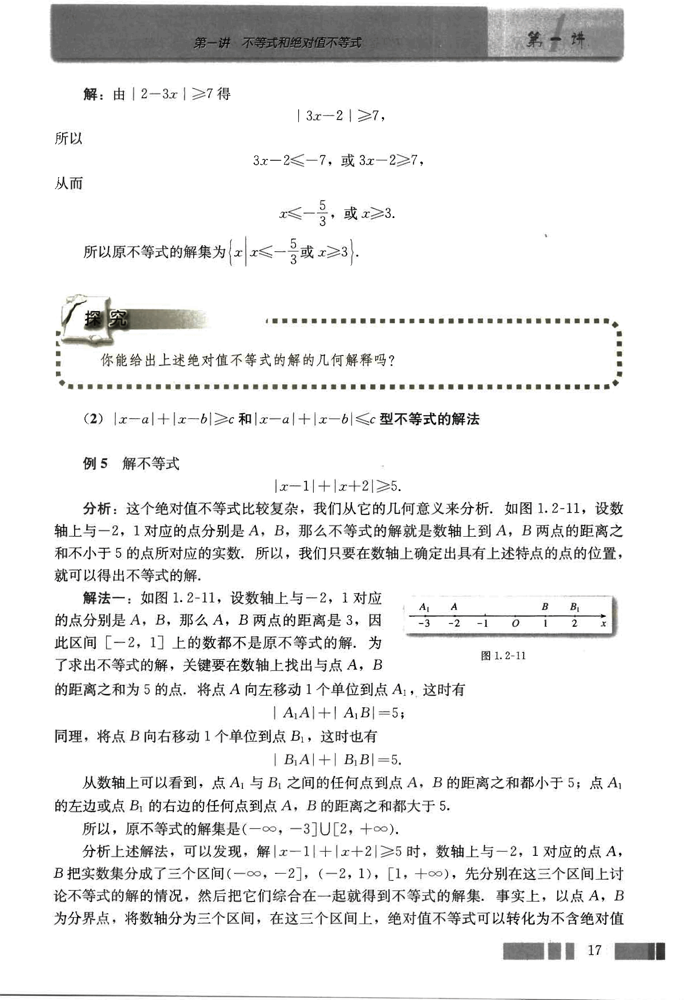
22

# CHAPTER

普通高中课程标准实验教科书 数学(选修 4-5) 不等式选讲

的不等式，因此我们有如下解法。

## 解法二：当 $x \le -2$ 时，原不等式可以化为

$-(x-1) - (x+2) \ge 5,$

解得

$x \le -3,$

即不等式组

$\begin{cases}
x \le -2, \\
|x-1| + |x+2| \ge 5
\end{cases}$

的解集是 $(-\infty, -3]$。

当 $-2 < x < 1$ 时，原不等式可以化为

$-(x-1) + (x+2) \ge 5,$

即 $3 \ge 5$，矛盾，所以不等式组

$\begin{cases}
-2 < x < 1, \\
|x-1| + |x+2| \ge 5
\end{cases}$

的解集为 $\emptyset$。

当 $x \ge 1$ 时，原不等式可以化为

$(x-1) + (x+2) \ge 5,$

解得

$x \ge 2,$

即不等式组

$\begin{cases}
x \ge 1, \\
|x-1| + |x+2| \ge 5
\end{cases}$

的解集是 $[2, +\infty)$。

综上所述，原不等式的解集是 $(-\infty, -3] \cup [2, +\infty)$。

在学习函数知识时我们知道，由函数 $y = f(x)$ 的零点与方程 $f(x) = 0$ 的根的关系，可以利用函数图象求方程的(近似)根，类似地，我们也可以从函数的观点，利用函数图象求不等式的解集。

## 解法三：将原不等式转化为

$|x-1| + |x+2| - 5 \ge 0$。

构造函数 $y = |x-1| + |x+2| - 5$，即

$y = \begin{cases}
2x - 6, & x \le -2, \\
-2, & -2 < x < 1, \\
2x - 4, & x \ge 1.
\end{cases}$

作出函数的图象 ([图 1.2-12](images/1.2-12.png))，它是分段线性函数，函数的零点是 -3, 2. 从图象可知，当 $x \in (-\infty, -3] \cup [2, +\infty)$ 时，有 $y \ge 0$，即 $|x-1| + |x+2| - 5 \ge 0$。所以原不等式的解集是 $(-\infty, -3] \cup [2, +\infty)$。

18

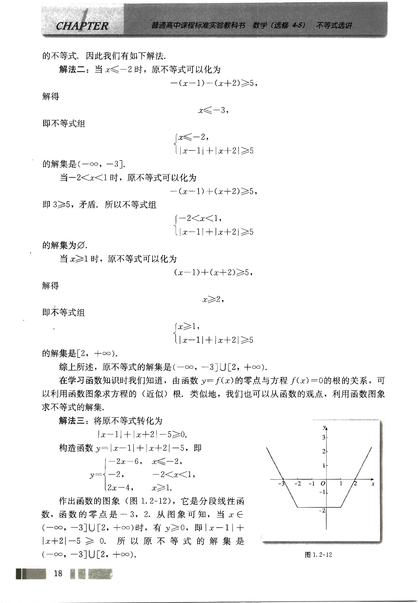
23

# 第一讲 不等式和绝对值不等式

## 思考

例 5 中给出了三种解绝对值不等式的方法，你能概括一下它们各自的特点吗？

从例 5 的解题过程可以看到，上述三种方法各有特点。

解法一利用了绝对值不等式的几何意义，体现了数形结合思想。从中可以发现，理解绝对值的几何意义，给绝对值不等式以准确的几何解释是解题关键。

解法二利用$|x-1|=0$，$|x+2|=0$的解，将数轴分为三个区间，然后在这三个区间上将原不等式转化为不含绝对值的不等式而解之，体现了分类讨论思想。从中可以发现，以绝对值的“零点”为分界点，将数轴分为几个区间的目的是为了确定各个绝对值中的多项式的符号，进而去掉绝对值符号。

解法三通过构造函数，利用了函数的图象，体现了函数与方程的思想。从中可以发现，正确求出函数的零点并画出函数图象（有时需要考察函数的增减性）是解题的关键。

## 探究

$|x-a|+|x-b|\le c$型不等式的解法与$|x-a|+|x-b|\ge c$型不等式的解法完全类似，你能用一个具体例子说明吗？

## 习题 1.2

1. 求证：
   (1) $|a+b|+|a-b|\ge2|a|$；
   (2) $|a+b|-|a-b|\le2|b|$.

2. 用几种方法证明
   $|\frac{x+1}{x}|\ge2\ (x\ne0)$.

3. 求证：
   (1) $|x-a|+|x-b|\ge|a-b|$；
   (2) $|x-a|-|x-b|\le|a-b|$.

4. 已知$|A-a|<\frac{\epsilon}{2}$，$|B-b|<\frac{\epsilon}{2}$，求证：
   (1) $|(A+B)-(a+b)|<\epsilon$；
   (2) $|(A-B)-(a-b)|<\epsilon$.

5. 求函数$y=|x-4|+|x-6|$的最小值.

19

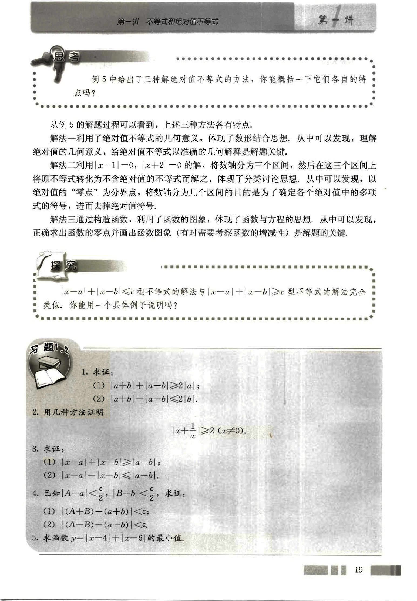
24

# CHAPTER

普通高中课程标准实验教科书 数学(选修 4-5) 不等式选讲

6. 解不等式：
   (1) |2x - 3| < 5;
   (2) |2x - 5| ≥ 1;
   (3) |$\frac{1}{2}$x + 1| < 3;
   (4) 2|4x - 1| + 2 > 10.

7. 解不等式：
   (1) 1 < |3x + 4| < 6;
   (2) 3 ≤ |5 - 2x| < 9.

8. 解不等式：
   (1) |x - 3| + |x - 5| ≥ 4;
   (2) |x - 2| + |x + 3| ≥ 4;
   (3) |x - 1| + |x - 2| < 2.

9. 如果关于 x 的不等式 |x - 3| + |x - 4| < a 的解集不是空集，求参数 a 的取值范围.

20
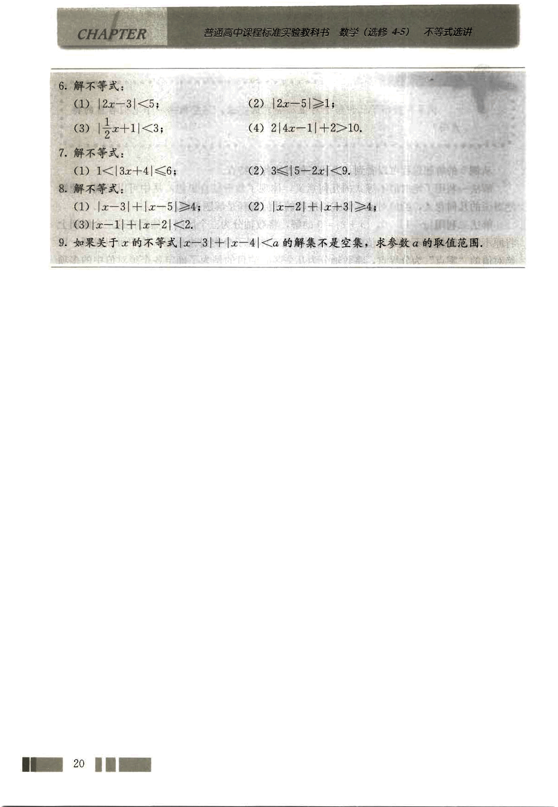
25

# 第二讲 证明不等式的基本方法

前面已经学习了一些证明不等式的方法。我们知道，关于数的大小的基本事实，不等式的基本性质，基本不等式以及绝对值不等式 $|x| < a$ 和 $|x| \ge a$ 的解集的规律等，都可以作为证明不等式的出发点。本讲中，我们进一步学习证明不等式的基本方法。

## 一 比较法

要证明 $a > b$，最基本的方法就是证明 $a - b > 0$，即把不等式两边相减，转化为比较差与 0 的大小。

**例 1** 已知 $a$，$b$ 都是正数，且 $a \ne b$，求证 $a^3 + b^3 > a^2b + ab^2$。

**分析:** 可以把不等式两边相减，通过适当的恒等变形，转化为一个能够明确确定正负的代数式。

**证明:** $(a^3 + b^3) - (a^2b + ab^2) = (a^3 - a^2b) - (ab^2 - b^3)$
$= a^2(a - b) - b^2(a - b)$
$= (a^2 - b^2)(a - b)$
$= (a + b)(a - b)^2$

因为 $a$，$b$ 都是正数，所以 $a + b > 0$。

又因为 $a \ne b$，所以 $(a - b)^2 > 0$。

于是 $(a + b)(a - b)^2 > 0$。

即 $(a^3 + b^3) - (a^2b + ab^2) > 0$。

所以 $a^3 + b^3 > a^2b + ab^2$。

**例 2** 如果用 $a$ kg 白糖制出 $b$ kg 糖溶液，则其浓度为 $\frac{a}{b}$。若在上述溶液中再添加 $m$ kg

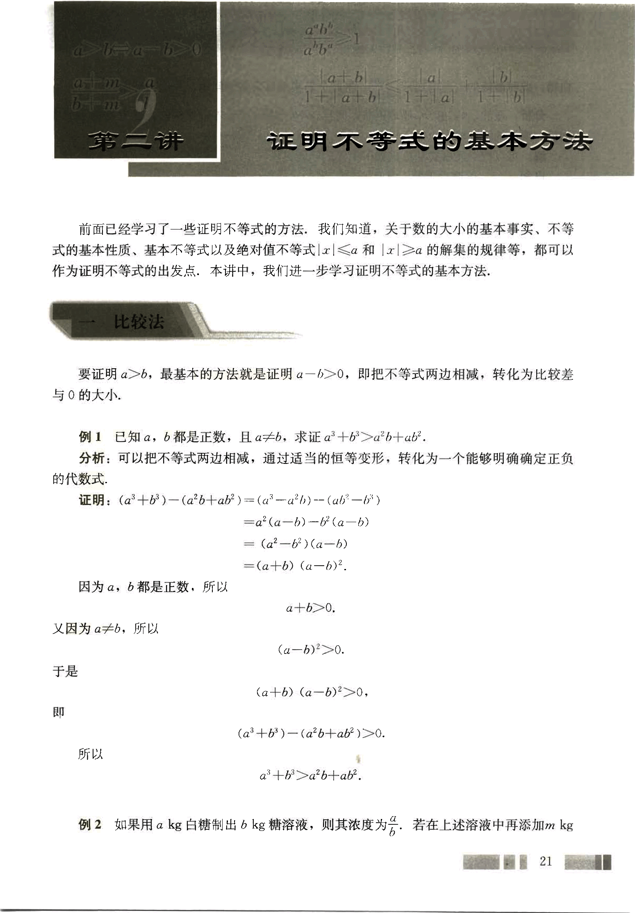
26

# CHAPTER

普通高中课程标准实验教科书 数学(选修 4-5) 不等式选讲

白糖，此时溶液的浓度增加到$\frac{a+m}{b+m}$。将这个事实抽象为数学问题，并给出证明。

分析：显然，$a, b, m$都是正数，而且$a < b$。生活经验告诉我们，在已有的糖溶液中加糖，溶液的浓度增大。

解：可以把上述事实抽象成如下不等式问题：

已知$a, b, m$都是正数，并且$a < b$，则

$\frac{a+m}{b+m} > \frac{a}{b}$

下面给出证明。

将不等式两边相减，得

$\frac{a+m}{b+m} - \frac{a}{b}$

所以

$\frac{a+m}{b+m} - \frac{a}{b} = \frac{m(b-a)}{b(b+m)}$

因为$a < b$，所以$b - a > 0$；又因为$a, b, m$都是正数，所以$m(b-a) > 0$, $b(b+m) > 0$。

$\frac{m(b-a)}{b(b+m)} > 0$

即

$\frac{a+m}{b+m} - \frac{a}{b} > 0$

所以

$\frac{a+m}{b+m} > \frac{a}{b}$

除了把不等式两边相减，通过比较差与 0 的大小来证明不等式外，有时也通过把不等式两边相除，转化为证明所得的商式与 1 的大小关系。

例 3 已知$a, b$是正数，求证$a^b b^a \ge a^a b^b$，当且仅当$a = b$时，等号成立。

分析：由于$a, b$是正数，所以不等式的两边都是正数。由于要证的不等式两边都是指数的形式，把它们相除并考察商式与 1 的大小关系比较方便。

证明：将不等式两边相除，得

$\frac{a^b b^a}{a^a b^b} = a^{b-a} \cdot b^{a-b} = \left( \frac{a}{b} \right)^{b-a}$

根据要证的不等式的特点（交换$a, b$的位置，不等式不变），不妨设$a \ge b > 0$，于是

$\frac{a}{b} \ge 1, a - b \ge 0$

所以

$\left( \frac{a}{b} \right)^{a-b} \ge 1$

当且仅当$a = b$时，等号成立，所以

$a^b b^a \ge a^a b^b$

22

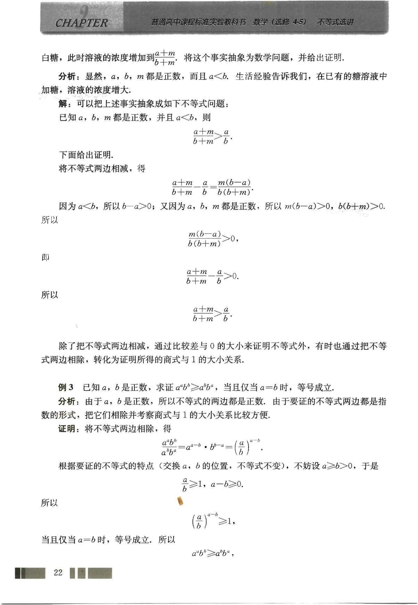
27

# 第二讲 证明不等式的基本方法

当且仅当 a=b 时，等号成立。

## 习题 2.1

1. 已知 a>b，求证 a³-b³>ab(a-b).
2. 已知 ad≠bc，求证(a²+b²)(c²+d²)>(ac+bd)².
3. 已知 a≠b，求证 a⁴+6a²b²+b⁴>4ab(a²+b²).
4. 已知 a, b, c 是正数，求证$\frac{a^2b^2}{c^2} + \frac{b^2c^2}{a^2} + \frac{c^2a^2}{b^2} \ge a^2 + b^2 + c^2$.

## 二 综合法与分析法

在不等式的证明中，我们经常从已知条件和不等式的性质、基本不等式等出发，通过逻辑推理，推导出所要证明的结论。

### 例 1

已知 a, b, c>0，且不全相等，求证

a(b²+c²)+b(c²+a²)+c(a²+b²)>6abc.

**分析:** 观察欲证不等式的特点，左边 3 项每一项都是两个数的平方之和与另一个数之积，右边是三个数的积的 6 倍，这种结构特点启发我们采用如下方法。

**证明:** 因为 b²+c²≥2bc，a>0，所以

a(b²+c²)≥2abc. ①

因为 c²+a²≥2ac，b>0，所以

b(c²+a²)≥2abc. ②

因为 a²+b²≥2ab，c>0，所以

c(a²+b²)≥2abc. ③

由于 a, b, c 不全相等，所以上述 ①②③ 式中至少有一个不取等号，把它们相加得

a(b²+c²)+b(c²+a²)+c(a²+b²)>6abc.

一般地，从已知条件出发，利用定义、公理、定理、性质等，经过一系列的推理、论证而得出命题成立，这种证明方法叫做综合法(synthetical method)。综合法又叫顺推证法或由因导果法。

### 例 2

已知$a_1, a_2, ..., a_n∈R+$，且$a_1a_2...a_n = 1$，求证

$(1+a_1)(1+a_2)...(1+a_n) \ge 2^n$.

**分析:** 观察要证明的结论，左边是个因式的乘积，右边是 2 的 n 次方，再结合$a_1a_2...a_n = 1$，发现如果能将左边转化为$a_1, a_2, ..., a_n$的乘积，问题就能得到解决。

**证明:** 因为$a_i∈R+$，所以$\frac{1+a_i}{2} \ge \sqrt{1 \cdot a_i} = \sqrt{a_i}$，即

23

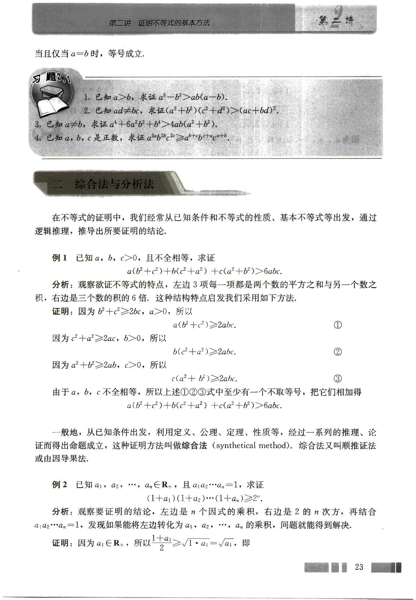
28

# CHAPTER 2 普通高中课程标准实验教科书 数学(选修 4-5) 不等式选讲

1+a₁≥2√a₁.

同理，

1+a₂≥2√a₂，

…

1+aₙ≥2√aₙ.

因为 a₁, a₂, …, aₙ∈R⁺，由不等式的性质，得

(1+a₁)(1+a₂) … (1+aₙ) ≥ 2ⁿ√a₁a₂…aₙ = 2ⁿ.

因为 aᵢ=1 时，1+aᵢ≥2√aᵢ 取等号，所以原式在 a₁=a₂=…=aₙ=1 时取等号。

证明命题时，我们还常常从要证的结论出发，逐步寻求使它成立的充分条件，直至所需条件为已知条件或一个明显成立的事实（定义、公理或已证明的定理、性质等），从而得出要证的命题成立，这种证明方法叫做分析法 (analytical method)，这是一种执果索因的思考和证明方法。

## 例 3 求证 √2+√7 < √3+√6

**分析：** 从不等式的结构不易发现需要用哪些不等式的性质或事实解决这个问题，因此用分析法。

**证明：** 因为 √2+√7 和 √3+√6 都是正数，所以要证

√2+√7 < √3+√6，

只需证

(√2+√7)² < (√3+√6)²，

展开得

9+2√14 < 9+2√18，

只需证

√14 < √18，

只需证

14 < 18.

因为 14 < 18 成立，所以 √2+√7 < √3+√6 成立。

从上述证明过程可以发现，如果从 14 < 18 出发逐步倒推，即

14 < 18 ⇒ √14 < √18 ⇒ 9+2√14 < 9+2√18

⇒ (√2+√7)² < (√3+√6)² ⇒ √2+√7 < √3+√6，

也能得出结论，这实际上就是综合法证明，因此，综合过程正好与分析过程相反，只是如果没有分析过程，我们很难想到要以 14 < 18 作为证明的出发点。

当问题比较复杂时，通常把分析法和综合法结合起来使用，以分析法寻找证明的思路，

24

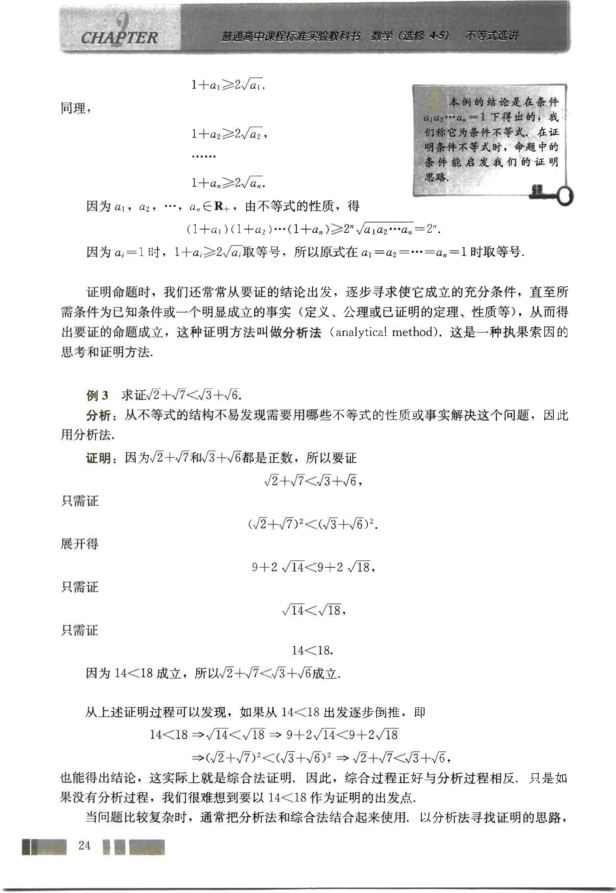
29

# 第二讲 证明不等式的基本方法

而用综合法叙述、表达整个证明过程。

## 例 4

已知 $a, b, c > 0$，求证 $\frac{a^2b^2 + b^2c^2 + c^2a^2}{a+b+c} \ge abc$。

**分析:** 要证的不等式可以化为

$a^2b^2 + b^2c^2 + c^2a^2 \ge abc(a+b+c)$，

即

$a^2b^2 + b^2c^2 + c^2a^2 \ge a^2bc + b^2ac + c^2ab$。

观察上式，左边各项是两个字母的平方之积，右边各项涉及三个字母，可以考虑用

$x^2(y^2+z^2) \ge 2x^2yz$。

**证明:** 因为 $b^2 + c^2 \ge 2bc$，$a^2 > 0$，所以

$a^2(b^2 + c^2) \ge 2a^2bc$ ①

因为 $c^2 + a^2 \ge 2ac$，$b^2 > 0$，所以

$b^2(c^2 + a^2) \ge 2b^2ac$ ②

因为 $a^2 + b^2 \ge 2ab$，$c^2 > 0$，所以

$c^2(a^2 + b^2) \ge 2c^2ab$ ③

①②③ 相加得

$2(a^2b^2 + b^2c^2 + c^2a^2) \ge 2a^2bc + 2b^2ac + 2c^2ab$，

从而

$a^2b^2 + b^2c^2 + c^2a^2 \ge abc(a+b+c)$。

由 $a, b, c > 0$，得 $a+b+c > 0$，于是 $\frac{1}{a+b+c} > 0$。由不等式的基本性质，得

$\frac{a^2b^2 + b^2c^2 + c^2a^2}{a+b+c} \ge abc$。

在思考数学命题时，执果索因和由因导果总是不断交替地出现在思维过程中，有些问题一时难以看出综合推理的出发点，我们可以从要证的结论入手，去逐步地推求使之成立所需的条件，这就是用分析法证明的理由，但必须注意，推演过程中的每一步都是寻求相应结论成立的充分条件，这时又需以综合推理来考虑如何得到使这一步成立的条件，这样反复推演直到找出起始条件，就完成了证明的思考过程。

## 习题 2.2

1. 求证 $a^2 + b^2 + 5 \ge 2(2a - b)$。
2. 已知 $a, b, c \in R$，用综合法证明：
   (1) $(ab + a + b + 1)(ab + ac + bc + c^2) \ge 16abc$;
   (2) $2(a^3 + b^3 + c^3) \ge a^2(b+c) + b^2(a+c) + c^2(a+b)$。

25

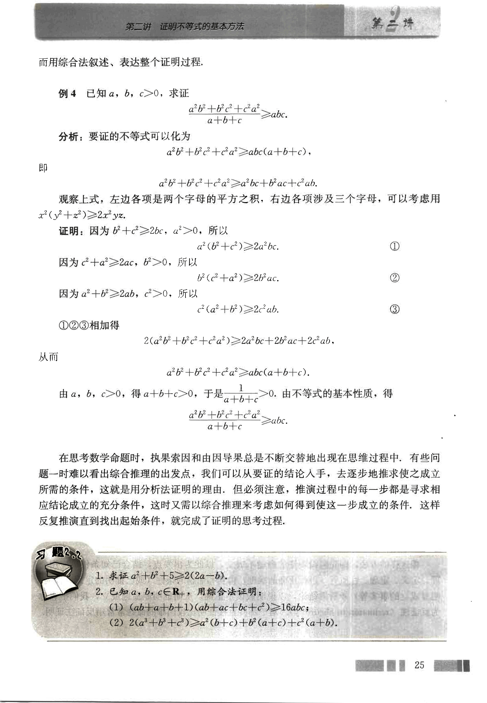
30

# CHAPTER

3. 求证 √3+√8 > 1+√10.

4. 已知 a > b > c, 求证 $\frac{1}{a-b} + \frac{1}{b-c} + \frac{1}{c-a} > 0$.

5. 已知 m, n ∈ R+, 求证 $\frac{m+n}{2} \ge \sqrt[m+n]{m^m n^n}$.

6. 已知 f(x) = √1+x², a ≠ b, 求证 |f(a) - f(b)| < |a - b|.

7. 已知 0 < x < 1, a > 0, a ≠ 1, 试比较 |loga(1 - x)| 与 |loga(1 + x)| 的大小,并说明理由.

8. 已知 n > 0, 求证 $n + \frac{4}{n^2} \ge 3$.

9. 已知 |a| < 1, |b| < 1, 求证 |1 - ab| > |a - b|.

## 三 反证法与放缩法

前面我们曾经研究过不等式的基本性质，可以发现，6 条性质中，有的可以由实数大小关系的基本事实直接推出。例如，对于性质 (3) “如果 a > b，那么 a + c > b + c”，我们可以这样来证明：

由 a > b 得 a - b > 0，于是 (a + c) - (b + c) = a - b > 0，

所以 a + c > b + c.

但对于性质 (6) “如果 a > b > 0，那么 √a > √b (n ∈ N, n ≥ 2)”，我们很难从条件和已有事实直接推证出结论，这时可以采用如下方法：

假设 √a ≥ √b 不成立，那么必有 √a = √b，或 √a < √b.

如果 √a = √b，那么 a = b；如果 √a < √b，那么由性质 (5) 有 a < b. 这些都与 a > b > 0 矛盾，于是，√a > √b 成立.

像这样的方法，即先假设要证的命题不成立，以此为出发点，结合已知条件，应用公理、定义、定理、性质等，进行正确的推理，得到和命题的条件（或已证明的定理、性质、明显成立的事实等）矛盾的结论，以说明假设不正确，从而证明原命题成立，我们把它称为反证法 (reduction to absurdity)。对于那些直接证明比较困难的命题常常用反证法证明。

**例 1** 已知 x, y > 0, 且 x + y > 2. 试证：

26

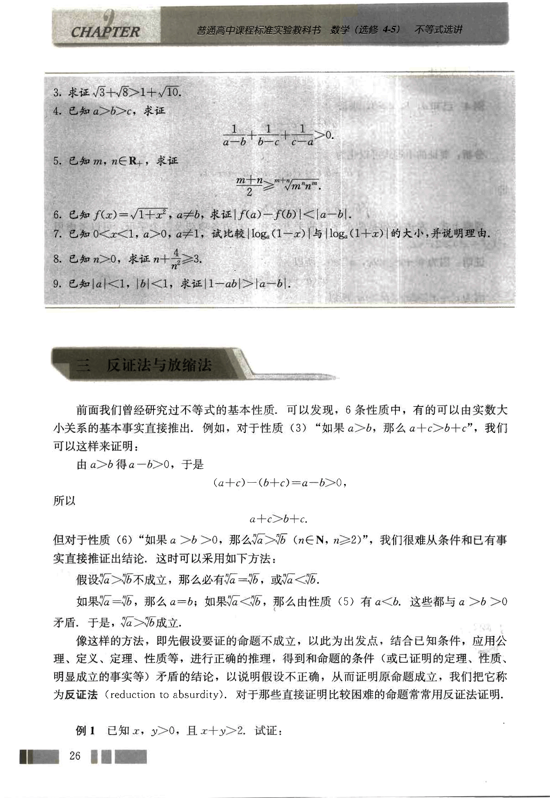
31

# 第二讲 证明不等式的基本方法

## 例 1

$\frac{1+x}{y}$, $\frac{1+y}{x}$ 中至少有一个小于 2.

分析：要证的结论与条件之间的联系不明显，直接由条件推出结论的线索不够清晰。另外，如果从正面证明，需要对某一个分式小于 2 或两个分式都小于 2 等进行分类讨论，而从反面证明，则只要证明两个分式都不小于 2 是不可能的即可，于是考虑采用反证法。

证明：假设 $\frac{1+x}{y}$, $\frac{1+y}{x}$ 都不小于 2，即

$\frac{1+x}{y} \ge 2$，且 $\frac{1+y}{x} \ge 2$.

因为 $x, y > 0$，所以

$1+x \ge 2y$，且 $1+y \ge 2x$.

把这两个不等式相加，得

$2+x+y \ge 2(x+y)$，

从而 $x+y \le 2$。这与已知条件 $x+y > 2$ 矛盾。

因此，$\frac{1+x}{y}$，$\frac{1+y}{x}$ 都不小于 2 是不可能的，即原命题成立。

## 例 2

已知 $a, b, c$ 为实数，$a+b+c > 0$，$ab+bc+ca > 0$，$abc > 0$，求证：$a > 0$，$b > 0$，$c > 0$。

分析：要证的结论与条件之间的联系不明显，直接由条件推出结论的线索不够清晰。

于是考虑采用反证法。

假设 $a, b, c$ 不全是正数，这时需要逐个讨论 $a, b, c$ 不是正数的情形，但注意到条件的特点（任意交换 $a, b, c$ 的位置不改变命题的条件），我们只要讨论其中一个数（例如 $a$），其他两个数（例如 $b, c$）与这种情形类似。

证明：假设 $a, b, c$ 不全是正数，即其中至少有一个不是正数，不妨先设 $a \le 0$。下面分 $a = 0$ 和 $a < 0$ 两种情况讨论。

(1) 如果 $a = 0$，则 $abc = 0$，与 $abc > 0$ 矛盾，所以 $a = 0$ 不可能。

(2) 如果 $a < 0$，那么由 $abc > 0$ 可得

$bc < 0$.

又因为 $a+b+c > 0$，所以

$b+c > -a > 0$.

于是

$ab+bc+ca = a(b+c) + bc < 0$，

这和已知 $ab+bc+ca > 0$ 相矛盾。

因此，$a < 0$ 也不可能。

综上所述，$a > 0$。

同理可证 $b > 0$，$c > 0$。

所以原命题成立。

27

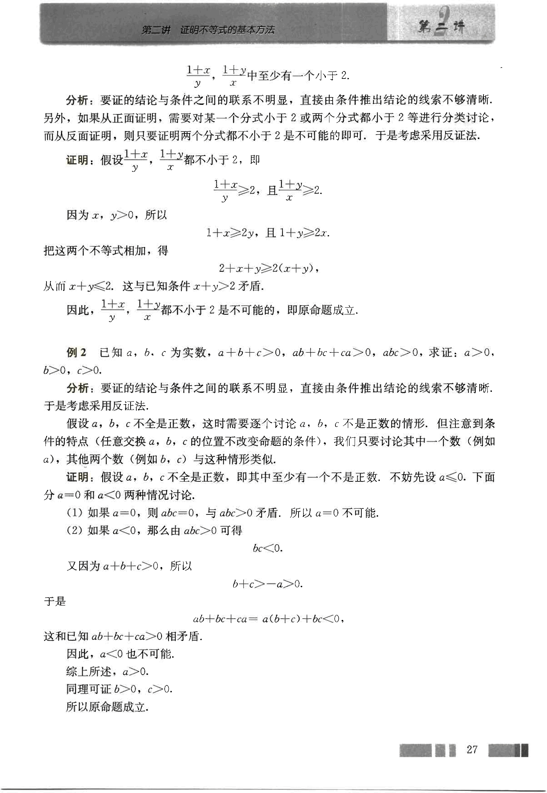
32

# CHAPTER

普通高中课程标准实验教科书 数学(选修 4-5) 不等式选讲

证明不等式时，通过把不等式中的某些部分的值放大或缩小，简化不等式，从而达到证明的目的。我们把这种方法称为放缩法

## 例 3

已知 $a, b, c, d \in R^+$，求证

$1 < \frac{a}{a+b+d} + \frac{b}{b+c+a} + \frac{c}{c+d+b} + \frac{d}{d+a+c} < 2$.

分析：若把 $\frac{a}{a+b+d} + \frac{b}{b+c+a} + \frac{c}{c+d+b} + \frac{d}{d+a+c}$ 直接通分相加则会使运算非常复杂，不易达到证明的目的。分析此式的形式特点，可以通过适当放缩，使不等式简化，从而得出证明。

证明：因为 $a, b, c, d$ 都是正数，所以

$\frac{a}{a+b+c+d} < \frac{a}{a+b+d} < \frac{a}{a+b}$,

$\frac{b}{a+b+c+d} < \frac{b}{b+c+a} < \frac{b}{b+a}$,

$\frac{c}{a+b+c+d} < \frac{c}{c+d+b} < \frac{c}{c+d}$,

$\frac{d}{a+b+c+d} < \frac{d}{d+a+c} < \frac{d}{d+c}$.

把以上四个不等式相加，得

$\frac{a+b+c+d}{a+b+c+d} < \frac{a}{a+b+d} + \frac{b}{b+c+a} + \frac{c}{c+d+b} + \frac{d}{d+a+c} < \frac{a+b}{a+b} + \frac{c+d}{c+d} = 2$.

即

$1 < \frac{a}{a+b+d} + \frac{b}{b+c+a} + \frac{c}{c+d+b} + \frac{d}{d+a+c} < 2$.

用放缩法证明不等式，关键是放、缩适当。例如上述过程中，如果把和式的 4 项分母依次缩为 $a, b, c, d$，那么和放大为 4，显然太大了。

## 例 4

已知 $a, b$ 是实数，求证

$1 + \frac{|a+b|}{1+|a+b|} \le 1 + \frac{|a|}{1+|a|} + \frac{|b|}{1+|b|}$.

分析：将不等式左边用 $\frac{|a+b|}{1+|a+b|}$ 替代，得到

$\frac{|a+b|}{1+|a+b|} \le \frac{|a|}{1+|a|} + \frac{|b|}{1+|b|}$,

这个不等式是很容易证明的。所以，如果能证明

$\frac{|a+b|}{1+|a+b|} \le \frac{|a|+|b|}{1+|a|+|b|}$,

那么原不等式就可以得到证明。

证明：因为 $0 \le |a+b| \le |a| + |b|$，所以

28

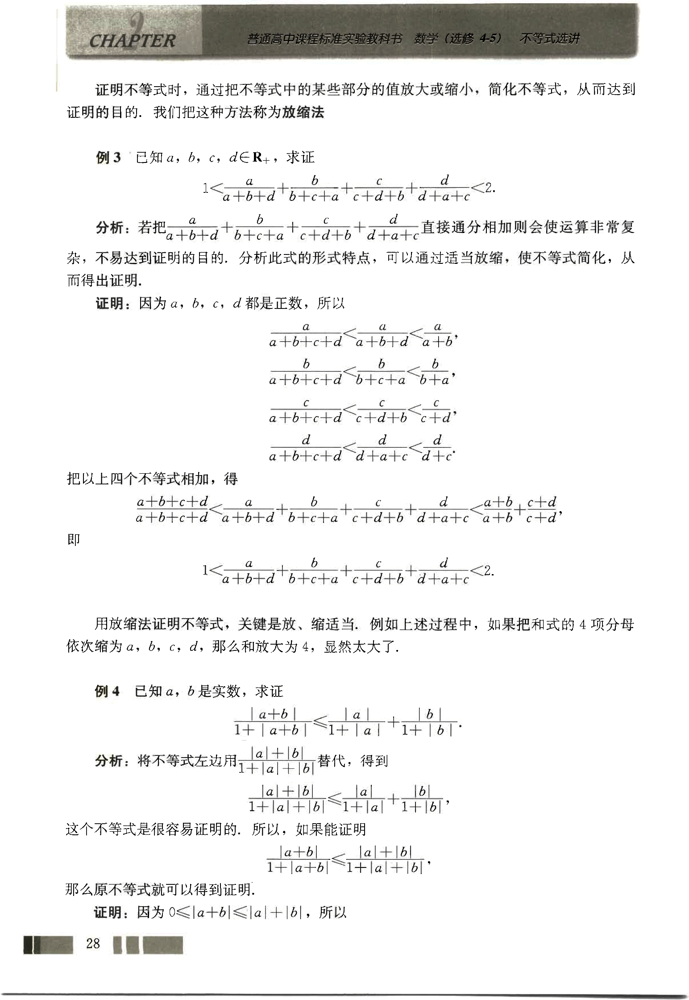
33

# 第二讲 证明不等式的基本方法

$\cdot \left| \frac{a+b}{1+|a+b|} \right| = 1 - \frac{1}{1+|a+b|}$

$< 1 - \frac{1}{1+|a|+|b|}$

$= \frac{|a|+|b|}{1+|a|+|b|}$

$= \frac{|a|}{1+|a|+|b|} + \frac{|b|}{1+|a|+|b|}$

$< \frac{|a|}{1+|a|} + \frac{|b|}{1+|b|}$

在上述过程中，我们证明了

$\left| \frac{a+b}{1+|a+b|} \right| \le \frac{|a|+|b|}{1+|a|+|b|}$

如果令

$f(x) = \frac{x}{1+x}, x \in [0, +\infty),$

那么从函数的观点看，只要证明函数$f(x)$为增函数，就可以由$0 \le |a+b| \le |a|+|b|$得到

① 式成立，而$f(x)$为增函数是容易证的.

上面介绍了证明不等式的几种常用方法，除以上方法外，还有其他一些方法，如在第四讲中要介绍的数学归纳法等，应该注意，不等式证明与数学上所有其他证明问题一样，没有一种适用于所有问题的统一方法，应该对具体问题的特点作具体分析，选择合适的方法.

## 习题 2.3

1. 设 $0 < a, b, c < 1$，证明：$(1-a)b, (1-b)c, (1-c)a$ 不能都大于$\frac{1}{4}$.

2. 用放缩法证明

$\frac{1}{2} < \frac{1}{n+1} < \frac{1}{2^2} + \frac{1}{3^2} + \dots + \frac{1}{n^2} < \frac{n-1}{n}  (n = 2, 3, 4, \dots).$

3. 用放缩法证明

$1 + \frac{1}{\sqrt{2}} + \frac{1}{\sqrt{3}} + \dots + \frac{1}{\sqrt{n}} < 2\sqrt{n}.$

(提示：当 $i > 1$ 时，$\sqrt{i} + \sqrt{i-1} < 2\sqrt{i}$，从而 $\frac{1}{\sqrt{i}} < 2(\sqrt{i} - \sqrt{i-1}).$)

4. 设 $x, y$ 为正数，且 $x+y=1$，用反证法证明

$(\frac{1}{x^2}-1)(\frac{1}{y^2}-1) \ge 9.$

29

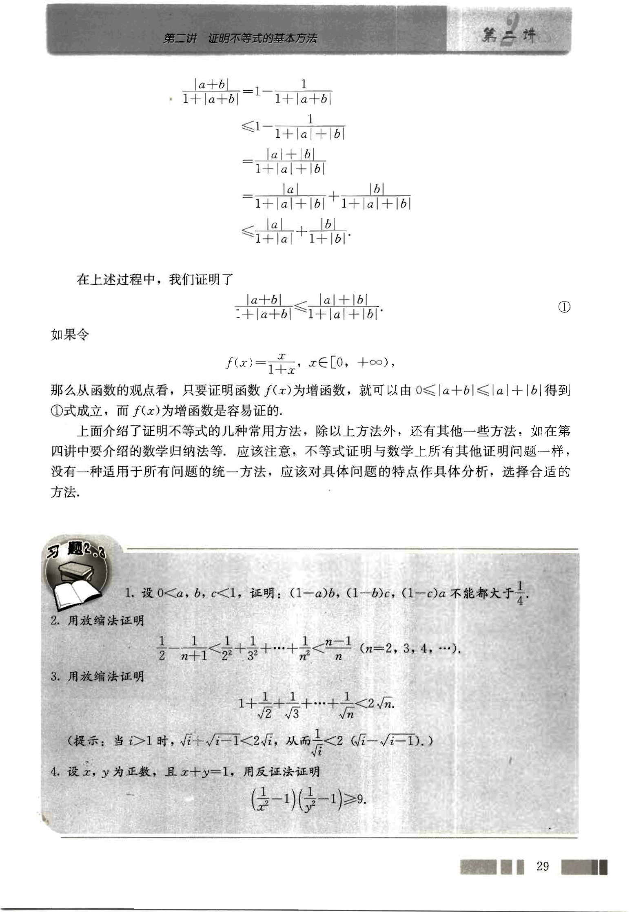
34

# CHAPTER

普通高中课程标准实验教科书 数学(选修 4-5) 不等式选讲

5. 体积为 V 的圆柱中，底面半径 r 和圆柱的高 h 为多少时，其表面积最小？

6. 在半径为 R 的圆形铁皮上割去一个圆心角为 θ 的扇形，使剩下部分围成一个圆锥，θ 为何值时圆锥的容积最大？

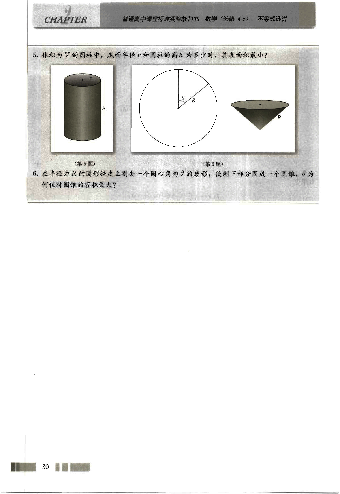
35

# 第三讲 柯西不等式与排序不等式

数学研究中，发现了一些不仅形式优美而且具有重要应用价值的不等式，人们称它们为经典不等式，柯西不等式与排序不等式就属于这样的不等式。通过本讲的学习，我们可以领略这些不等式的数学意义、几何背景、证明方法及其应用，感受数学的美妙，提高数学素养。

## 二维形式的柯西不等式

**探究**

$a^2+b^2≥2ab$ (a, b 为实数)是我们非常熟悉的不等式，它反映了两个实数的平方和与乘积的大小关系。现在考虑乘积

$(a^2+b^2)(c^2+d^2)$ (a, b, c, d 为实数),

它涉及到 4 个实数，并且形式上也与平方和有关。你能类比$a^2+b^2≥2ab$的推导过程，研究一下关于它的不等关系吗？

展开这个乘积，得

$(a^2+b^2)(c^2+d^2) = a^2c^2+b^2d^2+a^2d^2+b^2c^2.$

由于

即

$a^2c^2+b^2d^2+a^2d^2+b^2c^2=(ac+bd)^2+(ad-bc)^2,$

$(a^2+b^2)(c^2+d^2)=(ac+bd)^2+(ad-bc)^2,$

而$(ad-bc)^2≥0$，因此

$(a^2+b^2)(c^2+d^2)≥(ac+bd)^2.$

① 式反映了 4 个实数的特定数量关系，不仅排列形式上规律明显，具有简洁、对称的美感，而且在数学和物理中有重要作用。它是柯西不等式(Cauchy inequality)的最简形式，即二维形式的柯西不等式。

① 式中每个括号内都是二项式，通过后面的学习会进一步认识二维形式的含义.

31

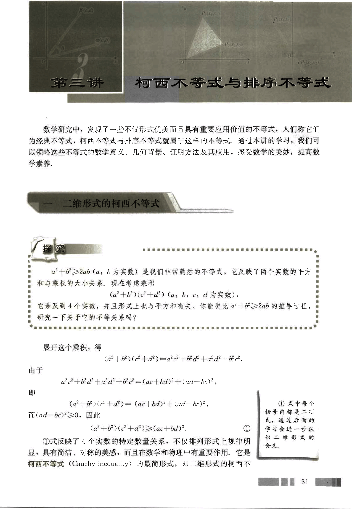
36

# CHAPTER

普通高中课程标准实验教科书 数学(选修 4-5) 不等式选讲

等式.

从上面的探究过程可以发现，当且仅当 $ad-bc=0$ 时，① 式中的等号成立，于是我

## 定理 1 (二维形式的柯西不等式)

若 $a,b,c,d$ 都是实数，则

$(a^2+b^2)(c^2+d^2) \ge (ac+bd)^2,$

当且仅当 $ad=bc$ 时，等号成立.

### 思考

你能简明地写出定理 1 的证明吗？

根据二维形式的柯西不等式，容易得出

$\sqrt{a^2+b^2} \cdot \sqrt{c^2+d^2} = \sqrt{(a^2+b^2)(c^2+d^2)}$

$\ge \sqrt{(ac+bd)^2} = |ac+bd|,$

$\sqrt{a^2+b^2} \cdot \sqrt{c^2+d^2} = \sqrt{|a|^2+|b|^2}\sqrt{|c|^2+|d|^2}$

$\ge |ac|+|bd| = |ac|+|bd|.$

所以，对于任何实数 $a,b,c,d$，以下不等式成立：

$\sqrt{a^2+b^2} \cdot \sqrt{c^2+d^2} \ge |ac+bd|,$

$\sqrt{a^2+b^2} \cdot \sqrt{c^2+d^2} \ge |ac|+|bd|.$

这也是两个非常有用的不等式，请同学们考虑，上述不等式中的等号何时成立？

对一个代数结果进行最简单的诠释，往往要借助直观的几何背景，下面看一看柯西不等式的几何意义，

如图 3.1-1，设在平面直角坐标系 xOy 中有向量 $\alpha=(a,b)$，$\beta=(c,d)$，$\alpha$ 与 $\beta$ 之间的夹角为 $\theta$，$0 \le \theta \le \pi$。

根据向量数量积（内积）的定义，我们有

$\alpha \cdot \beta = |\alpha||\beta|\cos\theta,$

$|\alpha \cdot \beta| = |\alpha||\beta||\cos\theta|.$

因为 $|\cos\theta| \le 1$，所以

$|\alpha \cdot \beta| \le |\alpha||\beta|.$

用平面（二维）向量的坐标表示不等式 ②，得

$|ac+bd| \le \sqrt{a^2+b^2}\sqrt{c^2+d^2}.$

上式两边平方，得

[图](images/3.1-1.png)

32

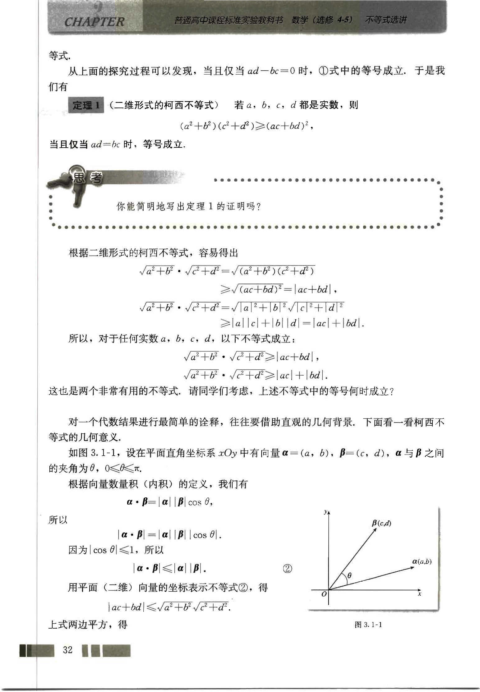
37

# 第三讲 柯西不等式与排序不等式

(ac+bd)² ≤ (a²+b²)(c²+d²). ①

这就是二维形式的柯西不等式，由此可知，二维形式的柯西不等式 ① 是向量形式的不等式 ② 的坐标表示。如果向量$\alpha$和$\beta$中有零向量，则 ad-bc=0，以上不等式取等号。如果向量$\alpha$和$\beta$都不是零向量，则当且仅当$|\cos\theta|=1$，即向量$\alpha$和$\beta$共线时，以上不等式取等号，这时存在非零实数 k，使

即

a=kβ,

(a, b) = k(c, d).

ad-bc = kcd-kcd = 0.

从上面的分析可知，不等式 ② 与不等式 ① 有相同的意义，所以我们把不等式 ② 叫做柯西不等式 ① 的向量形式。

综上所述，得

## 定理 2 (柯西不等式的向量形式)

设$\alpha$,$\beta$是两个向量，则

$|\alpha\cdot\beta| \le |\alpha||\beta|$,

当且仅当$\beta$是零向量，或存在实数 k，使$\alpha$=k$\beta$时，等号成立。

### 探究

试从不等式 ① 推导不等式 ②，再进行反方向的推导，从数形结合的角度体会两者的等价关系。

### 观察

如图 3.1-2，在平面直角坐标系中，设点 P₁,P₂ 的坐标分别为(x₁,y₁)，(x₂,y₂)，根据 △OP₁P₂ 的边长关系，你能发现 x₁,y₁,x₂,y₂ 这 4 个实数蕴涵着何种大小关系吗？

如图 3.1-2，根据两点间距离公式以及三角形的边长关系，容易发现

$\sqrt{x_1^2+y_1^2} + \sqrt{x_2^2+y_2^2} \ge \sqrt{(x_1-x_2)^2+(y_1-y_2)^2}$, ③

当且仅当点 P₁,P₂ 与原点 O 在同一直线上，并且点 P₁,P₂ 在原点 O 两旁时，③ 式中的等号成立。

不等式 ③ 叫做二维形式的三角不等式 (triangle inequality).

33

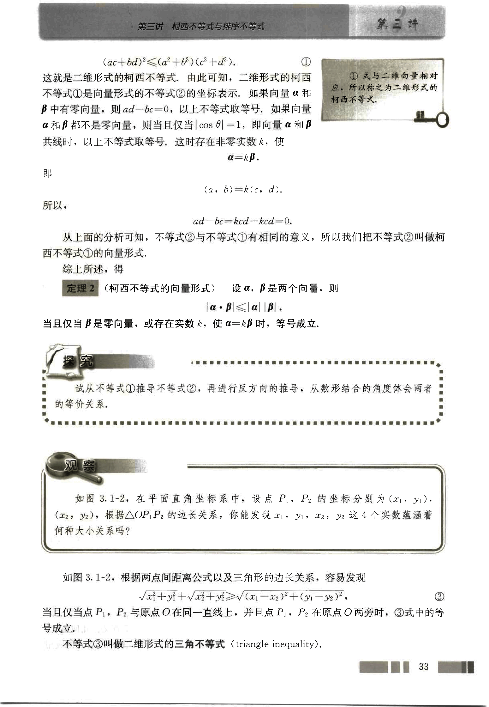
38

# CHAPTER

普通高中课程标准实验教科书 数学(选修 4-5) 不等式选讲

# 定理 3 (二维形式的三角不等式)

设 $x_1, y_1, x_2, y_2 \in R$, 那么

$\sqrt{x_1^2 + y_1^2} + \sqrt{x_2^2 + y_2^2} \ge \sqrt{(x_1 - x_2)^2 + (y_1 - y_2)^2}$.

分析：上面从几何角度发现了三角不等式，下面我们利用柯西不等式，从代数的角度证明这个不等式。证明中，为了使用柯西不等式，需要进行式子变形，设法构造两数平方和乘另两数平方和的形式，例如构造出 $(x_1^2 + y_1^2)(x_2^2 + y_2^2)$，这样就能使用柯西不等式了。

证明：$(\sqrt{x_1^2 + y_1^2} + \sqrt{x_2^2 + y_2^2})^2$

$= x_1^2 + y_1^2 + 2\sqrt{x_1^2 + y_1^2}\sqrt{x_2^2 + y_2^2} + x_2^2 + y_2^2$

$\ge x_1^2 + y_1^2 + 2|x_1x_2 + y_1y_2| + x_2^2 + y_2^2$

$\ge x_1^2 + y_1^2 + 2(x_1x_2 + y_1y_2) + x_2^2 + y_2^2$

$\ge x_1^2 + y_1^2 - 2(x_1x_2 + y_1y_2) + x_2^2 + y_2^2$

$= x_1^2 - 2x_1x_2 + x_2^2 + y_1^2 - 2y_1y_2 + y_2^2$

$= (x_1 - x_2)^2 + (y_1 - y_2)^2$

所以

$\sqrt{x_1^2 + y_1^2} + \sqrt{x_2^2 + y_2^2} \ge \sqrt{(x_1 - x_2)^2 + (y_1 - y_2)^2}$.

由于不等式 ③ 对于任何实数都成立，不妨用 $x_1 - x_3$ 代 $x_1$，用 $y_1 - y_3$ 代 $y_1$，用 $x_2 - x_3$ 代 $x_2$，用 $y_2 - y_3$ 代 $y_2$，代入不等式 ③，得

$\sqrt{(x_1 - x_3)^2 + (y_1 - y_3)^2} + \sqrt{(x_2 - x_3)^2 + (y_2 - y_3)^2} \ge \sqrt{(x_1 - x_2)^2 + (y_1 - y_2)^2}$. ④

探究

请结合平面直角坐标系，解释不等式 ④ 的几何意义。

不等式 ④ 有明显的几何意义，仍被称为二维形式的三角不等式。

上面得出三个定理的过程，分别讨论了二维形式柯西不等式的数学意义、几何背景及其在不等式证明中的应用，下面继续结合不等式的证明，介绍二维形式柯西不等式的应用。

34

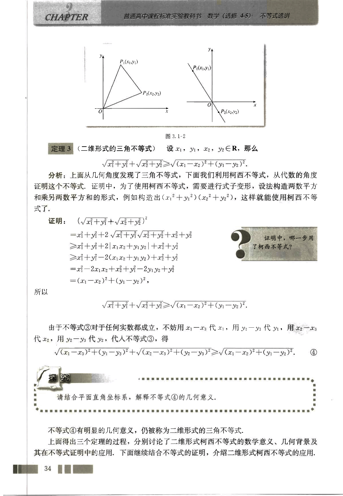
39

# 第三讲 柯西不等式与排序不等式

## 例 1

已知 $a, b$ 为实数，证明 $(a^2 + b^2)(a^2 + b^2) \ge (a^3 + b^3)^2$。

**分析**: 虽然可以作乘法展开上式的两边，然后再比较它们，但是如果注意到这个不等式的形式与柯西不等式的一致性，就可以避免繁杂的计算。

**证明**: 根据柯西不等式，有

$(a^2 + b^2)(a^2 + b^2) \ge (a^2 \cdot a + b^2 \cdot b)^2 = (a^3 + b^3)^2$。

本例说明，在证明不等式时，联系经典不等式，既可以启发证明思路，又可以简化运算，所以，经典不等式是数学研究的有力工具。

## 例 2

求函数 $y = 5\sqrt{x - 1} + \sqrt{10 - 2x}$ 的最大值。

**分析**: 利用不等式解决极值问题，通常设法在不等式一边得到一个常数，并寻找不等式取等号的条件，这个函数的解析式是两部分的和，若能化为 $ac + bd$ 的形式就能利用柯西不等式求其最大值。

**解**: 函数的定义域为 $[1, 5]$，且 $y \ge 0$。

$y = 5 \times \sqrt{x - 1} + \sqrt{2} \times \sqrt{5 - x}$

$\le \sqrt{5^2 + (\sqrt{2})^2} \times \sqrt{(\sqrt{x - 1})^2 + (\sqrt{5 - x})^2}$

$= \sqrt{27} \times \sqrt{4} = 6\sqrt{3}$，

当且仅当 $\sqrt{2} \times \sqrt{x - 1} = 5 \times \sqrt{5 - x}$ 时，等号成立，即 $x = \frac{127}{27}$ 时函数取最大值 $6\sqrt{3}$。

回顾例 2 的求解过程，可以体会其中式子变形的作用，提高利用柯西不等式解题的能力。

## 例 3

设 $a, b \in R^+$，$a + b = 1$，求证 $\frac{1}{a} + \frac{1}{b} \ge 4$。

**分析**: 问题中有 $a + b = 1$ 这个条件，由于常数 1 的特殊性，用 $a + b$ 去乘任何数或式子，都不会改变它们的值；根据证明的需要可以应用这个条件。在本例中，注意到 $1 + \frac{1}{a} + \frac{1}{b} = (a + b)(\frac{1}{a} + \frac{1}{b})$，有了 $(a + b)(\frac{1}{a} + \frac{1}{b})$，就可以使用柯西不等式了。

**证明**: 由于 $a, b \in R^+$，根据柯西不等式，得

$(a + b)(\frac{1}{a} + \frac{1}{b}) \ge (\sqrt{a} \times \frac{1}{\sqrt{a}} + \sqrt{b} \times \frac{1}{\sqrt{b}})^2 = 4$。

所以

$a + b = 1$。

35

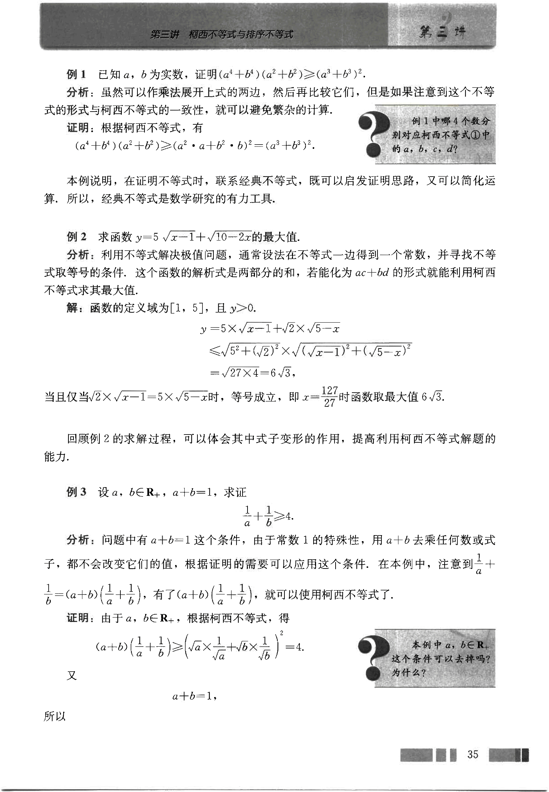
40

# CHAPTER

普通高中课程标准实验教科书 数学(选修 4-5) 不等式选讲

$\frac{1}{a} + \frac{1}{b} \ge 4$.

以上通过几个例题说明了柯西不等式在证明不等式时的简单应用. 使用柯西不等式时,
既要注意它的数学意义, 又要注意它的外在形式. 当一个式子与柯西不等式的左边或右边
具有一致的形式时, 就可以考虑利用柯西不等式对这个式子进行缩小或放大.

## 阅读与思考

## 法国科学家柯西

柯西 (Cauchy, Augustin-Louis, 1789—1857) 是法国数学家,
力学家. 他在大学期间, 就开始研读拉格朗日和拉普拉斯的著作.
他最重要的数学贡献在微积分、复变函数和微分方程等方面. 他提
出关于极限论的 $\epsilon - \delta$ 方法, 把整个极限过程用不等式描述, 后来经改
进形成的 $\epsilon - \delta$ ($\epsilon - N$) 方法沿用至今. 他还给出了如今通用的函数
连续性的概念, 给出定积分的第一个确切定义等.

此外, 柯西对力学和天文学也有许多贡献. 柯西著作甚丰, 共
出版了 7 部著作和 800 多篇论文, 以《分析教程》(1821 年) 和
《关于定积分理论的报告》(1827 年) 最为著名. 1882 年开始出版他
的全集, 至 1970 年已达 27 卷之多.

柯西不等式是在数学分析和数学物理方程研究中的一个非常重要的不等式. 柯西不等
式有二维形式、三维形式等, 一般形式是 n 维形式, 它们分别对应不同维数的向量不等式,
本质上是一致的.

## 习题 3.1

1. 求函数 $y = 3\sqrt{x-5} + 4\sqrt{6-x}$ 的最大值.
2. 试写出三维形式的柯西不等式和三角不等式.
3. 已知 $2x^2 + 3y^2 \le 6$, 求证 $x + 2y \le \sqrt{11}$.
4. 已知 $a^2 + b^2 = 1$, 求证 $|a \cos \theta + b \sin \theta| \le 1$.
5. 已知 $a, b \in R^+$, $a + b = 1$, $x_1, x_2 \in R^+$, 求证
   $(ax_1 + bx_2)(bx_1 + ax_2) \ge x_1 x_2$.

36

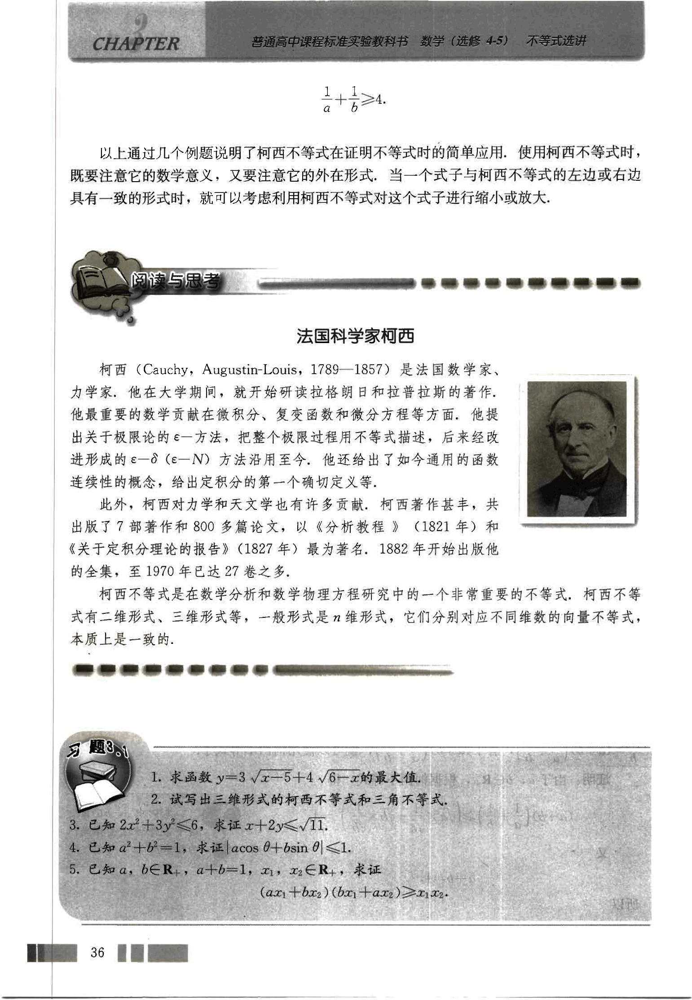
41

# 第三讲 柯西不等式与排序不等式

6. 已知 x + 2y = 1，求 x² + y² 的最小值.

7. 设 a, b 为正数，求

$(\frac{a+1}{b})(\frac{2b+1}{2a})$

的最小值.

8. 设 f(x) = √x, p, q > 0, 且 p + q = 1, 求证

pf(x₁) + qf(x₂) ≤ f(px₁ + qx₂).

9. 求函数 y = 3sin x + 4√1 + cos 2x 的最大值.

## 一般形式的柯西不等式

我们知道，平面上向量的坐标 (x, y) 是二维的形式，空间向量的坐标 (x, y, z) 是三维的形式。

[图 3.2-1](images/3.2-1.png)

**思考**

联系前一节的内容，从三维的角度思考问题，关于柯西不等式会有什么结论呢？

观察图 3.2-1，从平面向量的几何背景能得到 |α||β| ≥ α · β. 将平面向量的坐标代入，化简后得二维形式的柯西不等式

(a₁² + a₂²)(b₁² + b₂²) ≥ (a₁b₁ + a₂b₂)²,

当且仅当 a₁b₂ = a₂b₁ 时，等号成立.

类似地，从空间向量的几何背景也能得到 |α||β| ≥ α · β. 将空间向量的坐标代入，

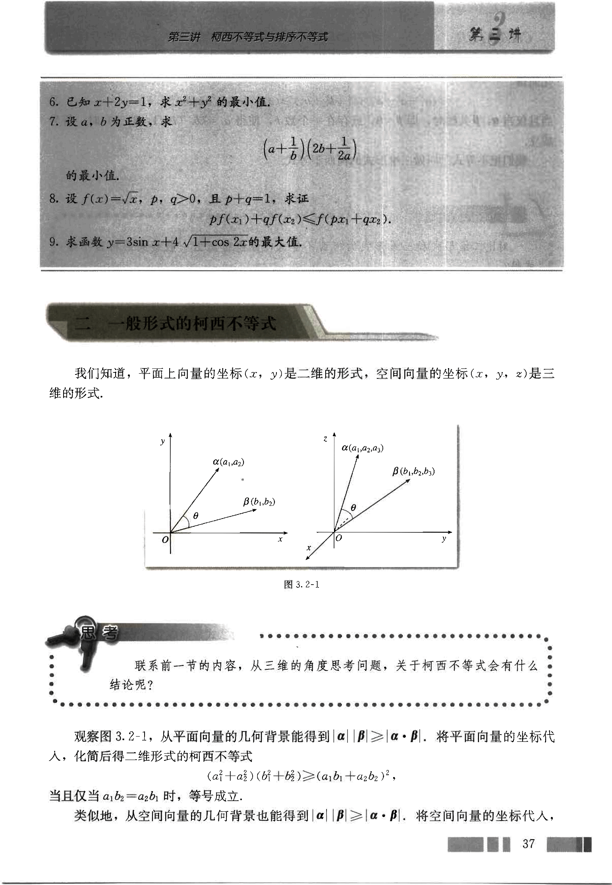
42

# CHAPTER 普通高中课程标准实验教科书 数学(选修 4-5) 不等式选讲

## 化简得

(a₁²+a₂²+a₃²)(b₁²+b₂²+b₃²)≥(a₁b₁+a₂b₂+a₃b₃)² ①

当且仅当 α,β 共线时，即 β=0，或存在一个数 k，使得 aᵢ=kbᵢ (i=1, 2, 3)时，等号成立.

我们把不等式 ① 叫做三维形式的柯西不等式.

## 探究

对比二维形式和三维形式的柯西不等式，你能猜想出一般形式的柯西不等式吗？

我们猜想，柯西不等式的一般形式为

(a₁²+a₂²+…+aₙ²)(b₁²+b₂²+…+bₙ²)≥(a₁b₁+a₂b₂+…+aₙbₙ)² ②

如何证明以上猜想？

由于不等式 ② 中括号内含较多的项，直接展开并比较左右比较麻烦，我们采用下面的证法.

如果设

A = a₁²+a₂²+…+aₙ²,
B = a₁b₁+a₂b₂+…+aₙbₙ,
C = b₁²+b₂²+…+bₙ²,

那么，不等式 ② 就是

AC≥B²

这正好与二次函数

y = Ax²+2Bx+C

的判别式 4B²-4AC 密切相关.这就启发我们可以构造二次函数，并通过讨论相应的判别式来证明不等式.

## 证明：

当 a₁=a₂=…=aₙ=0 或 b₁=b₂=…=bₙ=0 时 ② 式显然成立.

设 a₁, a₂, …, aₙ 中至少有一个不为 0, 则

a₁²+a₂²+…+aₙ²>0.

考虑二次函数

f(x) = (a₁²+a₂²+…+aₙ²)x²+2(a₁b₁+a₂b₂+…+aₙbₙ)x+(b₁²+b₂²+…+bₙ²) ①

因为对于任意实数 x,

f(x) = (a₁x+b₁)²+(a₂x+b₂)²+…+(aₙx+bₙ)²≥0,

所以二次函数 f(x)的判别式 △≤0，即

38

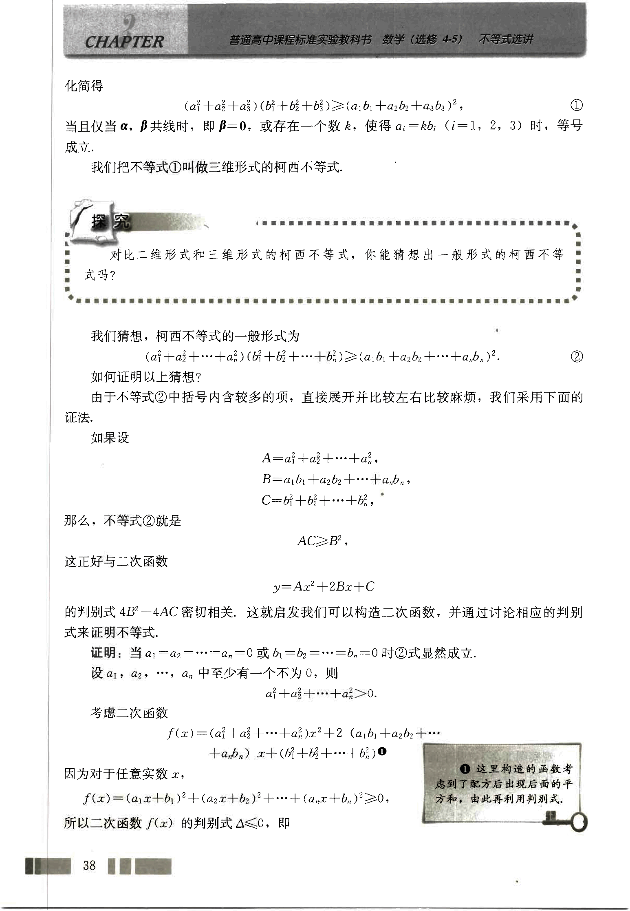
43

# 第三讲 柯西不等式与排序不等式

## 于是得

4(a₁b₁+a₂b₂+……+aₙbₙ)²-4(a₁²+a₂²+…+aₙ²)(b₁²+b₂²+…+bₙ²)≤0.

(a₁²+a₂²+…+aₙ²)(b₁²+b₂²+…+bₙ²)≥(a₁b₁+a₂b₂+……+aₙbₙ)²

当且仅当 f(x)有唯一零点时，判别式 △=0，以上不等式取等号，此时，有唯一实数 x，使

aᵢx+bᵢ=0 (i=1, 2, …, n).

若 x=0，则 b₁=b₂=…=bₙ=0，② 式成立；若 x≠0，则有 aᵢ=-bᵢ/x.总之，当且仅当 bᵢ=0 (i=1, 2, …, n)或 aᵢ=kbᵢ;(i=1, 2, …, n)时，等号成立.

通过以上证明，得知猜想成立，于是有

## 定理

设 a₁, a₂, a₃, …, aₙ, b₁, b₂, b₃,…,bₙ 是实数，则

(a₁²+a₂²+…+aₙ²)(b₁²+b₂²+…+bₙ²)≥(a₁b₁+a₂b₂+……+aₙbₙ)²

当且仅当 bᵢ=0 (i=1, 2, …, n)或存在一个数 k，使得 aᵢ=kbᵢ;(i=1, 2, …, n)时，等号成立.

以上不等式称为一般形式的柯西不等式

## 探究

一般形式的三角不等式应是怎样的？如何应用一般形式的柯西不等式证明它？请同学们自己进行探究.

下面介绍一般形式的柯西不等式的一些应用.

## 例 1

已知 a₁, a₂, …, aₙ 都是实数，求证

$\frac{1}{n}(a_1+a_2+...+a_n)^2≤a_1^2+a_2^2+...+a_n^2$.

分析：用 n 乘要证的式子两边，能使式子变成明显符合柯西不等式的形式，这就引出了证明的思路.

证明：根据柯西不等式，有

$(\sum_{i=1}^{n}1^2)(\sum_{i=1}^{n}a_i^2)≥(\sum_{i=1}^{n}1×a_i)^2$,

所以

n(a₁²+a₂²+…+aₙ²)≥(a₁+a₂+…+aₙ)²

39

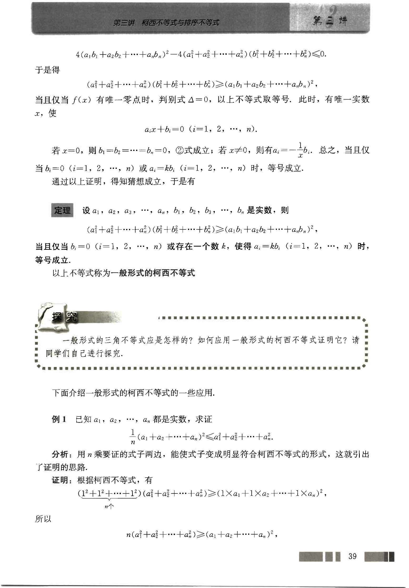
44

# CHAPTER 普通高中课程标准实验教科书 数学(选修 4-5) 不等式选讲

即

$\frac{1}{n}(a_1+a_2+...+a_n)^2 ≤ a_1^2+a_2^2+...+a_n^2$.

## 例 2

已知 $a, b, c, d$ 是不全相等的正数，证明

$a^2+b^2+c^2+d^2 > ab+bc+cd+da$.

分析：上式两边都是由 $a, b, c, d$ 这四个数组成的式子，特别是右边式子的字母排列顺序启发我们，可以用柯西不等式进行证明.

证明：根据柯西不等式，有

$(a^2+b^2+c^2+d^2)(b^2+c^2+d^2+a^2) ≥ (ab+bc+cd+da)^2$.

因为 $a, b, c, d$ 是不全相等的正数，所以等式

$\frac{a}{b} = \frac{b}{c} = \frac{c}{d} = \frac{d}{a}$ ①

不成立，所以

$(a^2+b^2+c^2+d^2)^2 > (ab+bc+cd+da)^2$,

即

$a^2+b^2+c^2+d^2 > ab+bc+cd+da$.

## 例 3

已知 $x+2y+3z=1$，求 $x^2+y^2+z^2$ 的最小值.

分析：由 $x+2y+3z=1$ 以及 $x^2+y^2+z^2$ 的形式，联系柯西不等式，可以通过构造 $(1^2+2^2+3^2)$ 作为一个因式而解决问题.

解：根据柯西不等式，有

$(x^2+y^2+z^2)(1^2+2^2+3^2) ≥ (x+2y+3z)^2=1$,

所以

$x^2+y^2+z^2 ≥ \frac{1}{14}$,

当且仅当

$\frac{x}{1} = \frac{y}{2} = \frac{z}{3}$,

即 $x=\frac{1}{14}, y=\frac{1}{7}, z=\frac{3}{14}$ 时，$x^2+y^2+z^2$ 取最小值 $\frac{1}{14}$.

对于许多不等式问题，用柯西不等式解往往是简明的. 正确理解柯西不等式，掌握它的结构特点，就能更灵活地应用它.

40

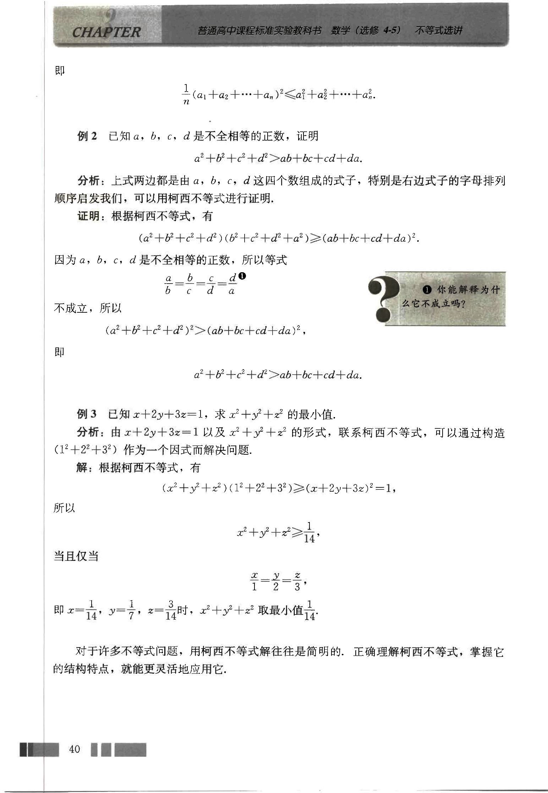
45

# 第三讲 柯西不等式与排序不等式

## 习题 3.2

1. 已知 $a, b, c \in R_+$，且 $a + b + c = 1$，求证
   $\frac{1}{a} + \frac{1}{b} + \frac{1}{c} \ge 9$.

你能否把结论作一些推广，并写出证明.

2. 已知 $a, b, c, d \in R_+$，且 $a + b + c + d = 1$，求证
   $a^2 + b^2 + c^2 + d^2 \ge \frac{1}{4}$.

3. 设 $x_1, x_2, \dots, x_n$ 是正数，求证
   $(x_1 + x_2 + \dots + x_n)(\frac{1}{x_1} + \frac{1}{x_2} + \dots + \frac{1}{x_n}) \ge n^2$.

4. 已知 $a, b, c$ 是互不相等的正数，求证
   $\frac{2}{a + b} + \frac{2}{b + c} + \frac{2}{c + a} > \frac{9}{a + b + c}$.

5. 已知 $2x + 3y + 4z = 10$，求 $x^2 + y^2 + z^2$ 的最小值.

6. 设 $x_1, x_2, \dots, x_n \in R_+$，且 $x_1 + x_2 + \dots + x_n = 1$，求证
   $\frac{x_1^2}{1 + x_1} + \frac{x_2^2}{1 + x_2} + \dots + \frac{x_n^2}{1 + x_n} \ge \frac{1}{n + 1}$.

## 三 排序不等式

### 探究

如图 3.3-1，设 $\angle AOB = \alpha$，自点 O 沿 OA 边依次取 n 个点 $A_1, A_2, \dots, A_n$，沿 OB 边也依次取 n 个点 $B_1, B_2, \dots, B_n$。选取某个点 $A_i (i = 1, 2, \dots, n)$ 与某个点 $B_j (j = 1, 2, \dots, n)$ 连接，得到 $\triangle A_i O B_j$。这样一一搭配，一共可以得到 n 个三角形。显然，搭配的方法不同，得到的 $\triangle A_i O B_j$ 不同，因而三角形的面积也可能不同。问：OA 边上的点与 OB 边上的点如何一一搭配，才能使得到 的 n 个三角形面积之和最大？如何一一搭配，才能使得到的 n 个三角形的面积之和最小？

[图 3.3-1](images/3.3-1.png)

41

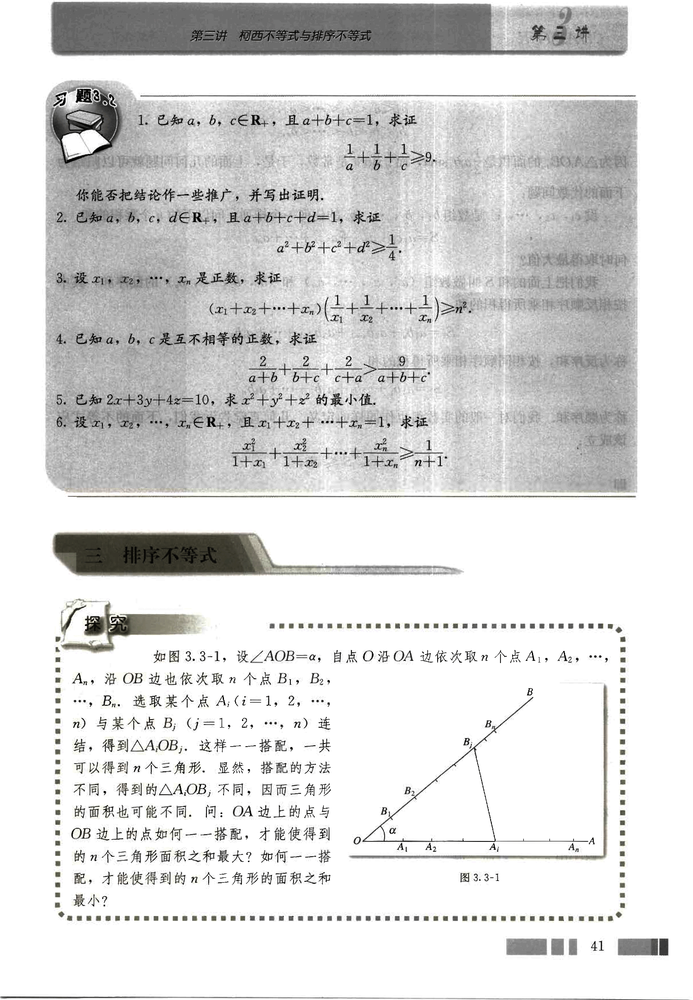
46

# CHAPTER 2

普通高中课程标准实验教科书 数学(选修 4-5) 不等式选讲

设 OAi = ai, OBj = bj (i, j = 1, 2, …, n), 由已知条件, 得
a1 < a2 < a3 < … < an,
b1 < b2 < b3 < … < bn.

因为 △AiOBj 的面积是 $\frac{1}{2}a_ib_j \sin \alpha$ , 而 $\frac{1}{2}\sin \alpha$ 是常数, 于是, 上面的几何问题就可以归结为
下面的代数问题:

设 c1, c2, …, cn 是数组 b1, b2, …, bn 的任何一个排列, 问以下的 n 个乘积的和
S = a1c1 + a2c2 + a3c3 + … + ancn

何时取得最大值?

我们把上面的和 S 叫做数组 (a1, a2, …, an) 和 (b1, b2, …, bn) 的乱序和, 其中
按相反顺序相乘所得积的和
S1 = a1bn + a2bn-1 + a3bn-2 + … + anb1

称为反序和, 按相同顺序相乘所得积的和
S2 = a1b1 + a2b2 + a3b3 + … + anbn

称为顺序和. 我们对一般的实数组也作同样的定义. 几何直觉告诉我们, 下面的不等式应
该成立:

S1 ≤ S ≤ S2,

反序和 ≤ 乱序和 ≤ 顺序和.

探究

为初步检验上面的直觉, 不妨用两组数 (例如 1, 2, 3 和 4, 5, 6) 试试, 看看
顺序和是否最大, 反序和是否最小.

证明:

检验结果会与直觉一致, 但这还不能完全说明直觉一定正确. 下面我们进行一般性
证明: 设 a1 ≤ a2 ≤ … ≤ an, b1 ≤ b2 ≤ … ≤ bn 为两组实数, c1, c2, …, cn 是 b1,
b2, …, bn 的任一排列, 因为 b1, b2, …, bn 的全排列只有 n! 个, 所以

S = a1c1 + a2c2 + … + ancn

的不同的值也只有有限个 (个数 ≤ n!), 其中必有最大值和最小值.

考虑 ① 式, 若 c1 ≠ b1, 则有某 ck = b1 (k > 1), c1 > ck.
将 ① 中 c1, ck 对换, 得

S' = akck + … + a1ck + … + ancn.

② - ① 得

42

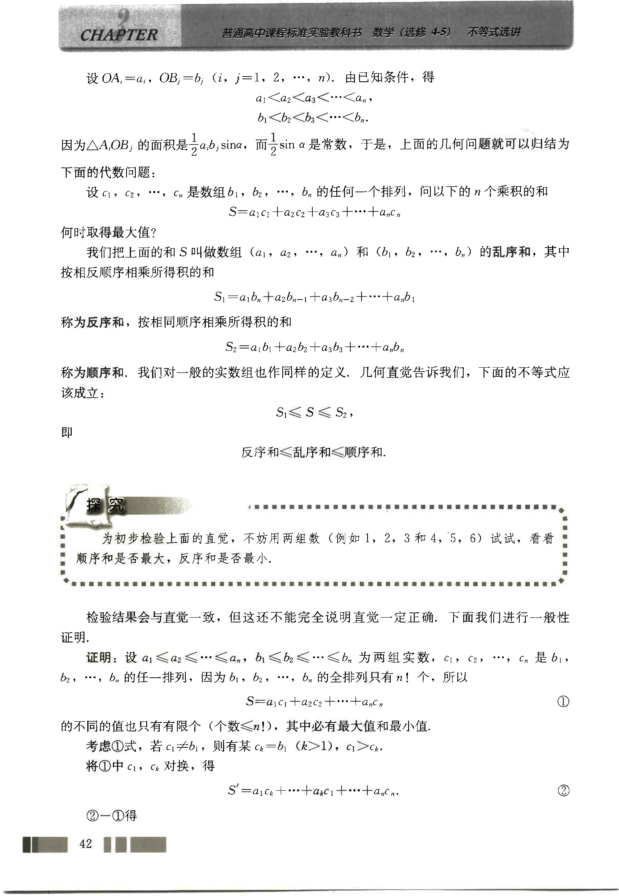
47

# 第三讲 柯西不等式与排序不等式

$S'-S=a_kc_1+a_1c_k-a_1c_1-a_kc_k=(a_k-a_1)(c_1-c_k)≥0.$

这说明将 ① 中的第一项调换为$a_1b_1$后，和式不减小。

若$c_1=b_1$，则转而考察$c_2$，并进行类似讨论。

类似地，可以证明，将 ① 中的第一项换为$a_1b_1$，第二项换为$a_2b_2$后，和式不减小。

如此继续下去，经有限步调整，可知一切和数中，最大和数所对应的情况只能是数组{$c_i$}由小到大排序的情况，最大和数是顺序和，即

$S ≤ S_2$.

同样可证，最小和数是反序和，即

$S_1 ≤ S$.

因此

$S_1 ≤ S ≤ S_2$.

至此我们已经证明了前面的直觉是正确的。

## 思考

顺序和$S_2$与反序和$S_1$能相等吗？如果能，那么什么条件下两者相等？

容易发现，当$a_1=a_2=…=a_n$，或$b_1=b_2=…=b_n$时，顺序和等于反序和，即

$S_1=S=S_2$.

事实上，如果$a_1, a_2,…, a_n$不全相等，并且$b_1, b_2,…, b_n$也不全相等，则一定可以找到$i, j(1≤i, j≤n)$和$l, k(1≤l, k≤n)$使得$a_i<a_j, b_l<b_k$.用类似上面证明的方法，考虑和数

$S*=S_2-(a_ib_j+a_jb_i+a_lb_k+a_kb_l)+(a_ib_k+a_jb_l+a_lb_i+a_kb_j),$

$S**=S_2-(a_ib_j+a_jb_i+a_lb_k+a_kb_l)+(a_ib_l+a_jb_k+a_lb_j+a_kb_i).$

可以看出，这两个和数都符合前面 S 的形式，而且

$S**-S*=(a_j-a_i)(b_k-b_l)>0,$

即

$S* < S**.$

$S_1 ≤ S* < S** ≤ S_2.$

## 进而得

归纳以上证明的结论，得

**定理**(排序不等式 sequence inequality，又称排序原理) 设$a_1 < a_2 < … < a_n$, $b_1 ≤ b_2 ≤ … ≤ b_n$为两组实数，$c_1, c_2,…, c_n$是$b_1, b_2,…, b_n$的任一排列，则

$a_1b_n + a_2b_{n-1} + … + a_nb_1 ≤ a_1c_1 + a_2c_2 + … + a_nc_n ≤ a_1b_1 + a_2b_2 + … + a_nb_n,$

43

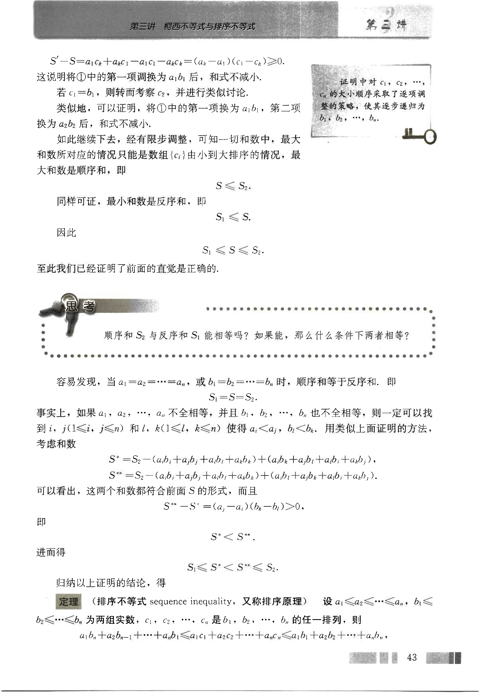
48

# CHAPTER

普通高中课程标准实验教科书 数学(选修 4-5) 不等式选讲

当且仅当 $a_1=a_2=…=a_n$ 或 $b_1=b_2=…=b_n$ 时，反序和等于顺序和。

排序不等式也是基本而重要的不等式，它的思想简单明了，便于记忆和使用，许多重要的不等式可以借助排序不等式得到证明。下面举例说明排序不等式的应用。

## 例 1

有 10 人各拿一只水桶去接水，设水龙头注满第 $i$ ($i=1,2,…,10$) 个人的水桶需要 $t_i$ 分，假定这些 $t_i$ 各不相同，问只有一个水龙头时，应如何安排 10 人的顺序，使他们等候的总时间最少？这个最少的总时间等于多少？

**分析**:这是一个实际问题，需要将它数学化，即转化为数学问题。若第一个接水的人需要 $t_1$ 分，接这桶水时 10 人所需等候的总时间是 $10t_1$ 分；第二个接水的人需 $t_2$ 分，接这桶水时 9 人所需等候的总时间是 $9t_2$ 分；如此继续下去，到第 10 人接水时，只有他一人在等，需要 $t_{10}$ 分。所以，按这个顺序，10 人都接满水所需的等待总时间(分)是

$10t_1+9t_2+…+2t_9+t_{10}$。

这个和数就是问题的数学模型，现要考虑 $t_1, t_2,…, t_{10}$ 满足什么条件时这个和数最小。

**解**:等待总时间(分)是

$10t_1+9t_2+…+2t_9+t_{10}$。

根据排序不等式，当

$t_1<t_2<…<t_9<t_{10}$

时，总时间取最小值，这就是说，按水桶的大小由小到大依次接水，10 人等候的总时间最少，这个最少的总时间是 $10t_1+9t_2+…+2t_9+t_{10}$，其中 $t_1<t_2<…<t_9<t_{10}$。

## 例 2

设 $a_1, a_2,…, a_n$ 是 $n$ 个互不相同的正整数，求证

$1+\frac{1}{2}+\frac{1}{3}+…+\frac{1}{n} < \frac{a_1}{1^2}+\frac{a_2}{2^2}+\frac{a_3}{3^2}+…+\frac{a_n}{n^2}$

**分析**: $a_1, a_2,…, a_n$ 是 $n$ 个互不相同的正整数，因此它们可以从小到大排序，观察问题中的式子，可以猜想到与 $a_1, a_2,…, a_n$ 对应的另一列数是 $1, \frac{1}{2^2}, \frac{1}{3^2},…, \frac{1}{n^2}$。

由此可以联想到用排序不等式证明的思路。

**证明**:设 $b_1, b_2,…, b_n$ 是 $a_1, a_2,…, a_n$ 的一个排列，且满足 $b_1<b_2<…<b_n$。因为 $b_1, b_2,…, b_n$ 是互不相同的正整数，故 $b_1≥1, b_2≥2,…, b_n≥n$。

又因为

$1>\frac{1}{2^2}>\frac{1}{3^2}>…>\frac{1}{n^2}$

故由排序不等式，得

$\frac{a_1}{1^2}+\frac{a_2}{2^2}+\frac{a_3}{3^2}+…+\frac{a_n}{n^2} ≥ b_1+ \frac{b_2}{2^2}+\frac{b_3}{3^2}+…+\frac{b_n}{n^2}$

$≥1×1+2×\frac{1}{2^2}+3×\frac{1}{3^2}+…+n×\frac{1}{n^2}$

$=1+\frac{1}{2}+\frac{1}{3}+…+\frac{1}{n}$

44

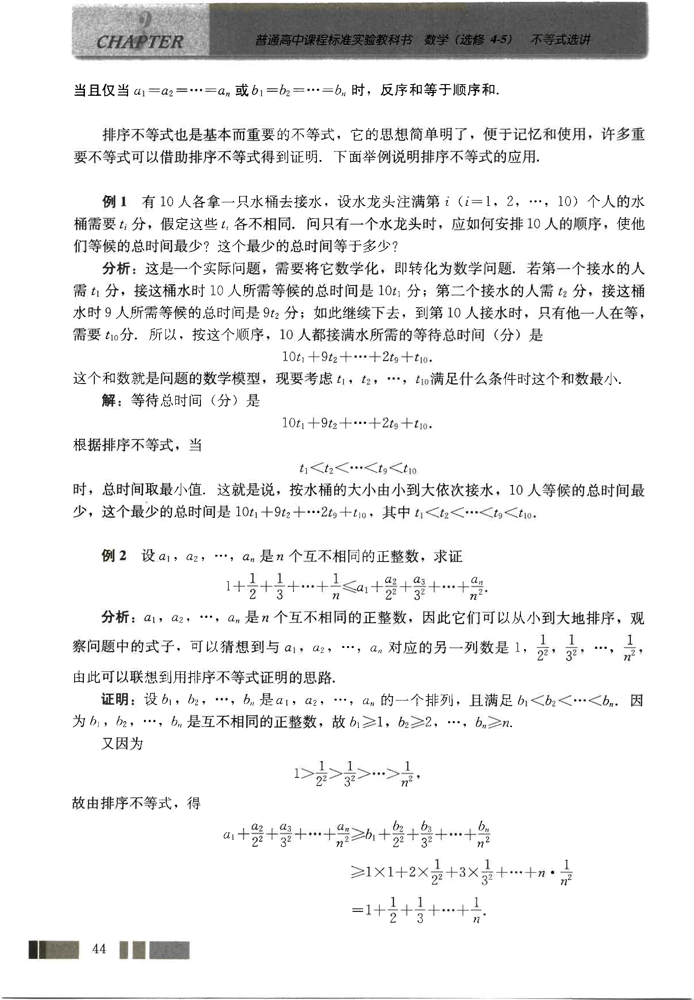
49

# 第三讲 柯西不等式与排序不等式

## 习题 3.3

1. 设 $a_1, a_2, \dots, a_n$ 为实数，证明：
   $a_1c_1 + a_2c_2 + \dots + a_nc_n \le \sqrt{a_1^2 + a_2^2 + \dots + a_n^2}$，
   其中 $c_1, c_2, \dots, c_n$ 是 $a_1, a_2, \dots, a_n$ 的任一排列.

2. 已知 $a, b, c$ 为正数，用排序不等式证明
   $2(a^3 + b^3 + c^3) \ge a^2(b + c) + b^2(a + c) + c^2(a + b)$.

3. 设 $a_1, a_2, a_3$ 为正数，求证
   $\frac{a_1a_2}{a_3} + \frac{a_2a_3}{a_1} + \frac{a_3a_1}{a_2} \ge a_1 + a_2 + a_3$.

4. 设 $a_1, a_2, \dots, a_n$ 为正数，试分别用柯西不等式与排序不等式证明
   $\frac{a_1^2}{a_2} + \frac{a_2^2}{a_3} + \dots + \frac{a_{n-1}^2}{a_n} + \frac{a_n^2}{a_1} \ge a_1 + a_2 + \dots + a_n$.

45

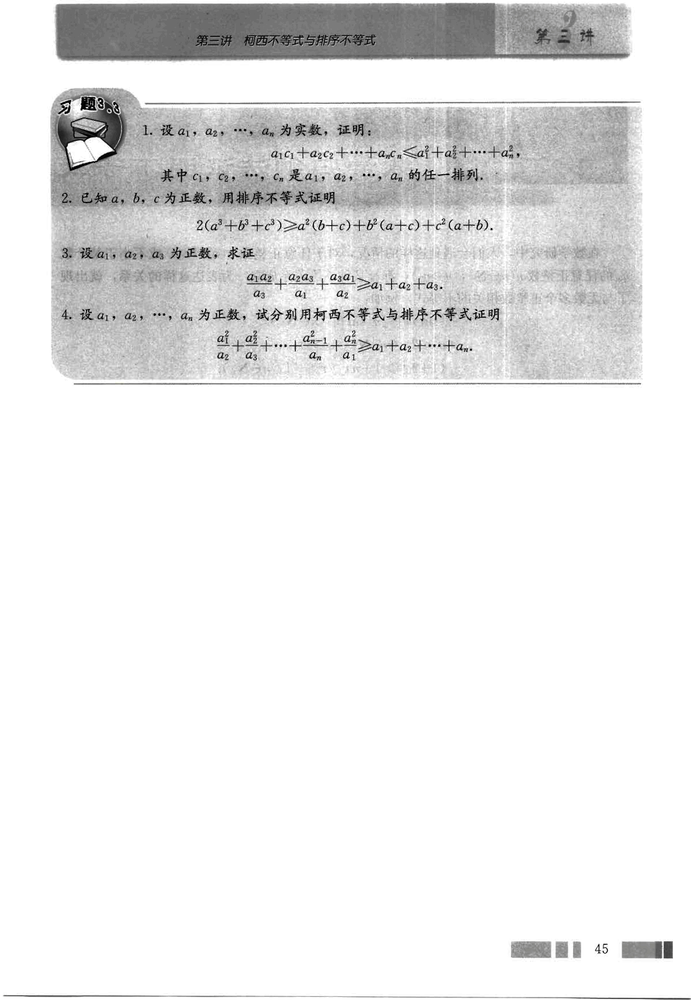
50

# 第四讲 数学归纳法证明不等式

在数学研究中，人们会遇到这样的情况，对于任意正整数 $n(n∈N+)$ 或不小于某个数 $n_0$ 的任意正整数 $n(n∈N+, n≥n_0)$，都有某种不等关系成立，为表达这样的关系，就出现了与无数多个正整数相关的不等式，例如：

$|sin nθ| < n|sin θ|$ ($n∈N+$),

$n^2 < 2^n$ ($n∈N+, n≥5$),

$(1+x)^n > 1+nx$ ($x>-1, n∈N+$).

这一讲将讨论这类不等式的证明，我们将使用一种重要的数学推理方法——数学归纳法。

## 数学归纳法

### 思考

通过计算下面的式子，你能猜想出 $-1+3-5+…+(-1)^n(2n-1)$ 的结果吗？证明你的结论。

$-1+3=$\_\_\_\_

$-1+3-5=$\_\_\_\_

$-1+3-5+7=$\_\_\_\_

$-1+3-5+7-9=$\_\_\_\_

上面四个式子的结果分别是 2, -3, 4, -5, 由此猜想：

$-1+3-5+…+(-1)^n(2n-1)=(-1)^nn$.

(\*)

怎样证明它呢？

分析：这个问题的特点是：要证等式(\*)在 n 为任何正整数时都成立，虽然我们可以验证 n=1, 2, 3, 4, 5,… 甚至 n=1000, 100000,… 时这个等式成立，但是正整数有无限多个，我们无法对它们一一验证，所以，通过验证的方法无法完成证明。

46

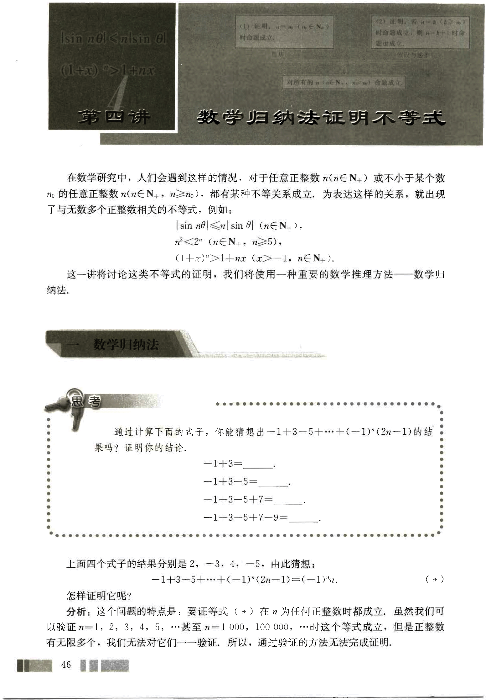
51

# 第四讲 数学归纳法证明不等式

要证明这个问题，必须寻找一种用有限个步骤，就能能够处理完无限多个对象的方法。
我们先从多米诺骨牌游戏说起，这是一种码放骨牌的游戏，码放时保证任意相邻的两块骨牌，若前一块骨牌倒下，则一定导致后一块骨牌倒下。这样，只要推倒第 1 块骨牌，由于第 1 块骨牌倒下，就可导致第 2 块骨牌倒下；而第 2 块骨牌倒下，就可导致第 3 块骨牌倒下……最后，不论有多少块骨牌，都能全部倒下。

可以看出，使所有骨牌都能倒下的条件有两个：

(1) 第一块骨牌倒下；

(2) 任意相邻的两块骨牌，前一块倒下一定导致后一块倒下。

其中，条件(2)事实上就是一个递推关系：

当第 k 块倒下时，相邻的第 k+1 块也倒下。

只要保证(1)(2)成立，那么所有的骨牌一定可以全部倒下。

类比多米诺骨牌游戏，我们设想将全部正整数由小到大依次排列为无限长的一队
1, 2, 3, …, k, k+1, …

可以验证：

(1) 当 n=1 时，等式(_)的左右两边都等于-1，即这时等式(_)成立。

(2) 若从“n=k 时等式(_)成立”能推出“n=k+1 时等式(_)也成立”，则可以建立一种像推多米诺骨牌那样的“由前到后”的自动递推关系。

综合(1)(2)，就自然地想到一种证明这个等式的方法：

首先证明(1) n=1 时等式(\*)成立；

然后证明(2)中的递推关系。

完成以上两步后，就可由 n=1 时等式(_)成立为起点，递推出 n=2 时等式(_)成立；再由 n=2 时等式(_)成立，递推出 n=3 时等式(_)成立……如此继续自动递推下去，就可以说：对于任意正整数 n，等式(\*)成立。

下面按照上述思路具体证明等式(\*)。

证明：(1) 当 n=1 时，式(_)左右两边都等于-1，即这时等式(_)成立。

(2) 假设当 n=k (k≥1)时等式(\*)成立，即
-1+3-5+…+(-1)^(2k-1) = (-1)^k k.

在这个假设下，再考虑 n=k+1 时式(\*)的左右两边。

左边 = -1+3-5+…+(-1)^(2k-1) + (-1)^(2k+1)[2(k+1)-1]
= (-1)^k k + (-1)^(2k+1)[2(k+1)-1]
= (-1)^k k + (-1)[2k+2-1]
= (-1)^k k + (-1)(k+1) = 右边.

所以当 n=k+1 时等式(\*)成立。

由(1)(2)可知，-1+3-5+…+(-1)^n(2n-1) = (-1)^n n (n∈N).

总结上述过程，我们用了两个步骤：第一步，证明当 n=1 时命题成立，从而奠定了命题成立的一个起点；第二步，先作归纳假设，然后证明“由前向后”的递推关系，由这两

47

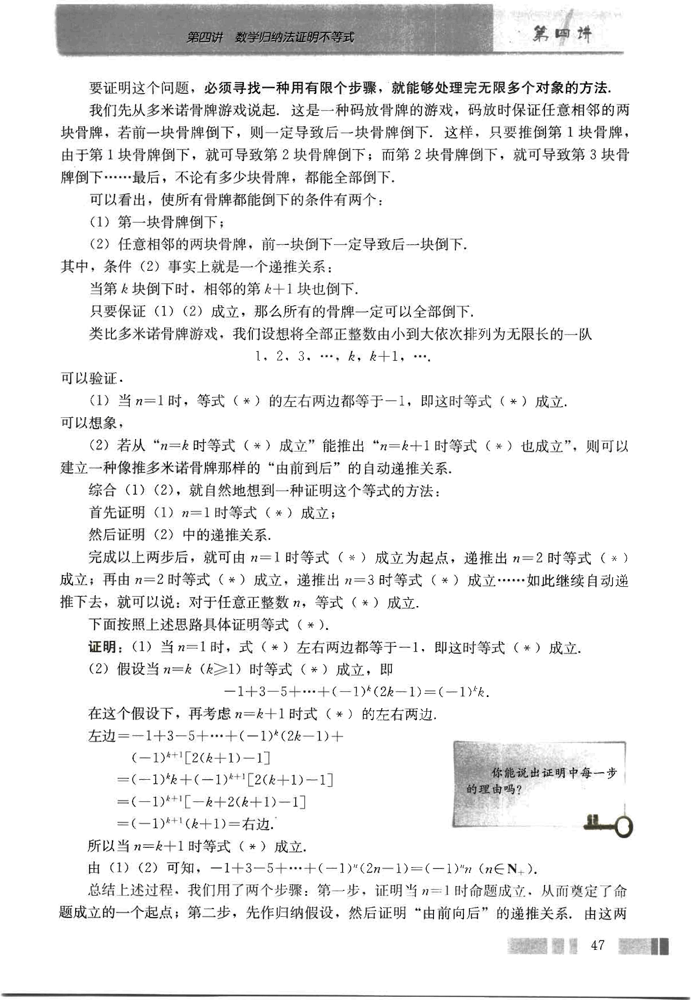
52

# CHAPTER

普通高中课程标准实验教科书 数学(选修 4-5) 不等式选讲

## 步保证：对于从起点向后的所有正整数 $n \in N^+$，命题都成立。

一般地，当要证明一个命题对于不小于某正整数 $n_0$ 的所有正整数 $n$ 都成立时，可以用以下两个步骤：

(1) 证明当 $n = n_0$ 时命题成立；

(2) 假设当 $n = k$ ($k \in N^+$，且 $k \ge n_0$) 时命题成立，证明 $n = k + 1$ 时命题也成立。

在完成了这两个步骤后，就可以断定命题对于不小于 $n_0$ 的所有正整数都成立，这种证明方法称为数学归纳法 (mathematical induction)。

## 思考

结合上面的证明，你认为数学归纳法的基本思想是什么？

在数学归纳法的两个步骤中，第一步是奠基，第二步是假设与递推，这两步都非常重要，缺一不可。第一步确定了 $n = n_0$ 时命题成立，$n = n_0$ 成为后面递推的出发点，没有它递推就成为无源之水；第二步确认一种递推关系，借助它，命题成立的范围就能从正整数 $n_0$ 开始，向后一个数一个数地无限传递到 $n_0$ 以后的每一个正整数，从而完成证明。因此，递推是实现从有限到无限的飞跃的关键，没有它我们就只能停留在对有限情况的把握上。以上就是数学归纳法的基本原理。

下面的框图表示了数学归纳法的基本过程。

(1) 证明：$n = n_0$ ($n_0 \in N^+$) 时命题成立。

(2) 证明：若 $n = k$ ($k \ge n_0$) 时命题成立，则 $n = k + 1$ 时命题也成立。

奠基

↓

假设与递推

对所有的 $n$ ($n \in N^+$，$n \ge n_0$) 命题成立。

## 数学归纳法适用于证明什么样的命题呢？

对于一些与无限多个正整数相关的命题，如果不易用以前学习过的方法证明，用数学归纳法可能会收到较好的效果。

## 思考

如果要用数学归纳法证明某命题对于全体正整数都成立，应取 $n_0$ 为何值？为什么？

## 例 1

证明：$n^3 + 5n$ ($n \in N^+$) 能够被 6 整除。

分析：这是一个与整除有关的命题，它涉及全体正整数，若用数学归纳法证明，第一

48

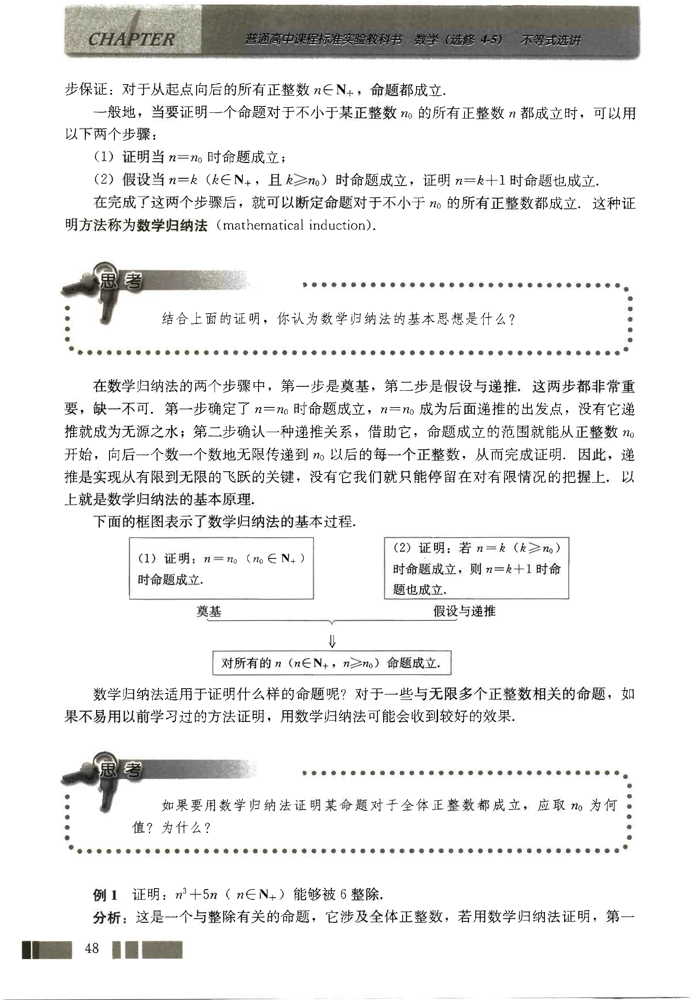
53

# 第四讲 数学归纳法证明不等式

## 步应证 $n=1$ 时命题成立;第二步要明确目标,即在假设 $k^3+5k$ 能够被 6 整除的前提下,证明 $(k+1)^3+5(k+1)$ 也能够被 6 整除.

### 证明:

(1) 当 $n=1$ 时, $n^3+5n=6$ 显然能够被 6 整除,命题成立.

(2) 假设当 $n=k (k≥1)$ 时,命题成立,即 $k^3+5k$ 能够被 6 整除.

当 $n=k+1$ 时,

$(k+1)^3+5(k+1) = k^3+3k^2+3k+1+5k+5$

$= (k^3+5k)+3k^2+3k+6$

$= (k^3+5k)+3k(k+1)+6.$

由假设知 $k^3+5k$ 能够被 6 整除,而 $k(k+1)$ 是偶数,

故 $3k(k+1)$ 能够被 6 整除,从而 $(k^3+5k)+3k(k+1)+6$ 即

$(k+1)^3+5(k+1)$ 能够被 6 整除,因此,当 $n=k+1$ 时命题成立.

由 (1) (2) 知,命题对一切正整数成立,即 $n^3+5n (n∈N+)$ 能够被 6 整除.

## 例 2 平面上有 $n (n∈N+, n≥3)$ 个点,其中任何三点都不在同一条直线上,过这些点中任意两点作直线,这样的直线共有多少条?证明你的结论.

### 分析: 可以先从有限个点的情形中,归纳出一个猜想;然后再用数学归纳法证明猜想成立.

### 解:

当 $n=3$ 时,过 3 个点中任意两点作直线,这样的直线共有 3 条.

当 $n=4$ 时,共有 4 个点,记它们为 $P_1, P_2, P_3, P_4$. 过点 $P_1, P_2, P_3$ 有 3 条直线,过 $P_1, P_2, P_3$ 中任意一个点与点 $P_4$ 作直线,共有 3 条,因此,过 4 个点共有 $3+3$ 条直线.

当 $n=5$ 时,共有 5 个点,记它们为 $P_1, P_2, P_3, P_4, P_5$. 同前,在过点 $P_1, P_2, P_3, P_4$ 的 6 条直线的基础上,过 $P_1, P_2, P_3, P_4$ 中任意一个点与点 $P_5$ 作直线,共有 4 条,因此,过 5 个点共有 $3+3+4$ 条直线.

我们猜想,过 $n$ 个点(任意三点不共线)中任意两点作直线,共有 $\frac{1}{2}n(n-1)$ 条. 下面用数学归纳法证明.

(1) 当 $n=3$ 时,由上述过程知,命题成立.

(2) 假设当 $n=k (k≥3)$ 时命题成立,即过 $k$ 个点(任意三点不共线)中任意两点作直线,这样的直线共有 $\frac{1}{2}k(k-1)$ 条.

当 $n=k+1$ 时,共有 $k+1$ 个点 $P_1, P_2, …, P_k, P_{k+1}$ (任意三点不共线),过 $k$ 个点 $P_1, P_2, …, P_k$ 中的任意两点作直线,这样的直线共有 $\frac{1}{2}k(k-1)$ 条;过这个点中的任意一个点与第 $k+1$ 个点 $P_{k+1}$ 作直线,这样的直线共有 $k$ 条,因此,过这 $k+1$ 个点中任意两点作直线,这样的直线共有

49

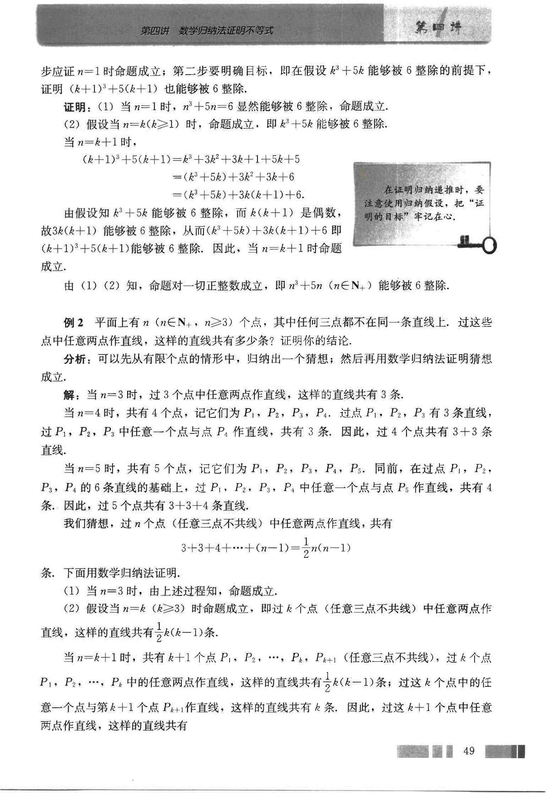
54

# CHAPTER

普通高中课程标准实验教科书 数学(选修 4-5) 不等式选讲

$\frac{1}{2}k(k-1)+k = \frac{1}{2}k(k-1+2)$

$= \frac{1}{2}k(k+1)$

$= \frac{1}{2}(k+1)[(k+1)-1].$

所以当$n=k+1$时命题成立。

由(1)(2)可知，对于$n$($n∈N_+，n≥3$)个点，相应的直线共有$\frac{1}{2}n(n-1)$条。

[image](images/image.png)

结合上述证明过程，你认为数学归纳法有什么特殊作用？

数学归纳法是证明一些与无限多个正整数相关的命题的有力工具，它用有限的步骤——
(1)奠基和(2)递推，取代了难以实现的无限验证，实现了由有限到无限的飞跃。

## 习题 4.1

1. 用数学归纳法证明$1+3+5+…+(2n-1)=n^2$。
2. 用数学归纳法证明$1+4+9+…+n^2=\frac{1}{6}n(n+1)(2n+1)$。
3. 用数学归纳法证明$1×4+2×7+3×10+…+n(3n+1)=n(n+1)^2$。
4. 用数学归纳法证明：$x^{2n-1}+y^{2n-1}$能被$x+y$整除。
5. 凸$n$边形有多少条对角线？证明你的结论。
6. 平面上有$n$条直线，其中任意两条都相交，任意三条不共点，这些直线把平面分成多少个区域？证明你的结论。

## 二 用数学归纳法证明不等式

下面我们结合具体例题进一步讨论如何用数学归纳法证明不等式。

**例 1** 观察下面两个数列，从第几项起，$a_n$始终小于$b_n$? 证明你的结论。

$\{a_n=n^2\}$: 1, 4, 9, 16, 25, 36, 49, 64, 81, ……;

$\{b_n=2^n\}$: 2, 4, 8, 16, 32, 64, 128, 256, 512, ……

**分析:** 由数列的前几项猜想，从第 5 项起，$a_n<b_n$，即$n^2<2^n$($n∈N_+，n≥5$)。

50

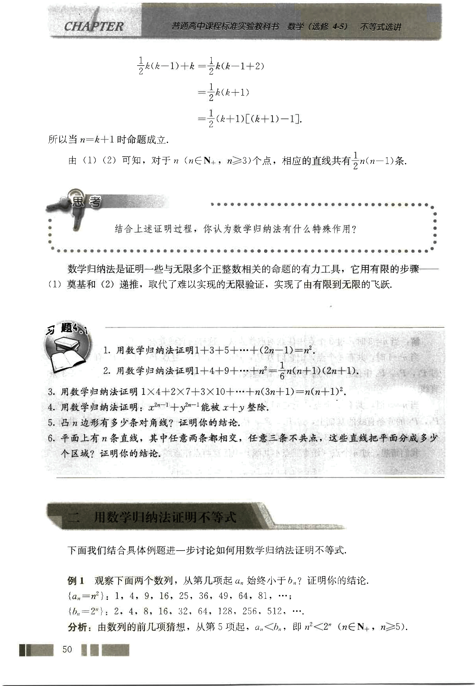
55

# 第四讲 数学归纳法证明不等式

用数学归纳法证明上述猜想时，第(1)步应证明 _n_=5 的情形.

**证明:**

(1) 当 _n_=5 时有 5²<2⁵，命题成立.

(2) 假设当 _n_=k(k≥5) 时命题成立，即有 k²<2ᵏ.

当 _n_=k+1 时，因为

(k+1)²=k²+2k+1 < k²+2k+k = k²+3k
<k²+k²=2k²
<2×2ᵏ=2ᵏ⁺¹.

所以 (k+1)²<2ᵏ⁺¹，即当 _n_=k+1 时命题成立.

由 (1)(2) 可知，*n*²<2ⁿ (*n*∈N+, *n*≥5).

**例 2** 证明不等式 |sin *n*θ| ≤ _n_|sin θ| (*n*∈N+).

**分析:** 这是一个涉及正整数 _n_ 的三角函数问题，又与绝对值有关，在证明递推关系时，应注意利用三角函数的性质及绝对值不等式.

**证明:**

(1) 当 _n_=1 时，上式左边=|sin θ|=右边，不等式成立.

(2) 假设当 _n_=k(k≥1) 时，不等式成立，即有 |sin kθ| ≤ k|sin θ|.

当 _n_=k+1 时,

|sin(k+1)θ| = |sin kθcos θ + cos kθsin θ|
≤ |sin kθcos θ| + |cos kθsin θ|
= |sin kθ|•|cos θ| + |cos kθ|•|sin θ|
≤ |sin kθ| + |sin θ|
≤ k|sin θ| + |sin θ|
= (k+1)|sin θ|.

所以当 _n_=k+1 时不等式也成立.

由 (1)(2) 可知，不等式对一切正整数 _n_ 均成立.

**例 3** 证明贝努利 (Bernoulli) 不等式:

如果 _x_ 是实数，且 _x_>-1, *x*≠0, _n_ 为大于 1 的自然数，那么有

(1+_x_)ⁿ>1+_nx_.

**分析:** 贝努利不等式中涉及两个字母，_x_ 表示大于 -1 且不等于 0 的任意实数，_n_ 是大于 1 的自然数，我们用数学归纳法只能对 _n_ 进行归纳.

**证明:**

(1) 当 _n_=2 时，由 *x*≠0 得 (1+_x_)²=1+2*x*+*x*²>1+2*x*，不等式成立.

(2) 假设当 _n_=k(k≥2) 时不等式成立，即有 (1+_x_)ᵏ>1+_kx_.

当 _n_=k+1 时，

(1+_x_)ᵏ⁺¹ = (1+_x_)(1+_x_)ᵏ

> (1+_x_)(1+_kx_)
> =1+_x_+_kx_+*kx*²

51

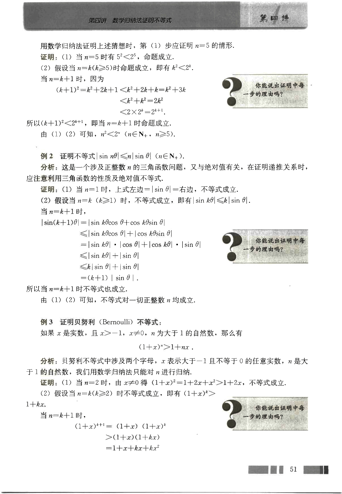
56

# CHAPTER

普通高中课程标准实验教科书 数学(选修 4-5) 不等式选讲

> 1+(k+1)x.

所以当 n=k+1 时不等式成立.

由(1)(2)可知,贝努利不等式成立.

在数学研究中,人们经常用贝努利不等式把二项式的乘方(1+x)n缩小为简单的
1+nx 的形式,这在数值估计和放缩法证明不等式中可以发挥作用,例如,当 x 是实数,
且 x>-1, x≠0 时,由贝努利不等式不难得到不等式

$\frac{x}{(1-1+x)^n} > 1 - \frac{nx}{1+x}$

对一切不小于 2 的正整数 n 成立.

事实上,把贝努利不等式中的正整数 n 改为实数 α 时,仍有类似不等式成立,它们是
贝努利不等式的更一般的形式:

当 α 是实数,并且满足 α>1 或者 α<0 时,有(1+x)α≥1+αx (x>-1);

当 α 是实数,并且满足 0<α<1 时,有(1+x)α<1+αx (x>-1).

我们不在这里给出上述结果的证明.随着指数范围扩充到实数,贝努利不等式可以被
更广泛地应用.

使用数学归纳法证明不等式,难点往往出现在由 n=k 时命题成立推出 n=k+1 时命题
成立这一步.为完成这步证明,不仅要正确使用归纳假设,还要灵活利用问题的其他条件
及相关知识,如前面学习的证明不等式的各种方法和一些重要的不等式,注意发现或设法
创设归纳假设与 n=k+1 时命题之间的联系,充分利用这样的联系来证明 n=k+1 时命题
成立.

## 例 4

证明:如果 n(n 为正整数)个正数 a1,a2,…,an的乘积 a1a2…an=1,那么
它们的和 a1+a2+...+an≥n.

分析:这是与正整数密切相关的不等式,它的形式简洁和谐.用数学归纳法证明它时,
应注意利用 n 个正数的乘积为 1 的条件,并对什么是归纳假设和由它要递推的目标心中
有数.

证明:(1)当 n=1 时,有 a1=1,命题成立.

(2)假设当 n=k 时,命题成立,即若 k 个正数的乘积 a1a2…ak=1,则
a1+a2+…+ak≥k.

当 n=k+1 时,已知 k+1 个正数 a1,a2,…,ak, ak+1满足条件 a1a2…ak+1=1.

若这 k+1 个正数 a1,a2,…,ak, ak+1都相等,则它们都是 1.其和为 k+1,命题
成立.

若这 k+1 个正数 a1,a2,…,ak, ak+1不全相等,则其
中必有大于 1 的数,也有小于 1 的数(否则与 a1a2…ak+1=1
矛盾),不妨设 a1>1, a2<1.

为利用归纳假设,我们把乘积 a1a2看作一个数,这样就
得到 k 个正数 a1a2, a3,…,ak, ak+1的乘积是 1,由归纳假

52

[key](images/key.png)

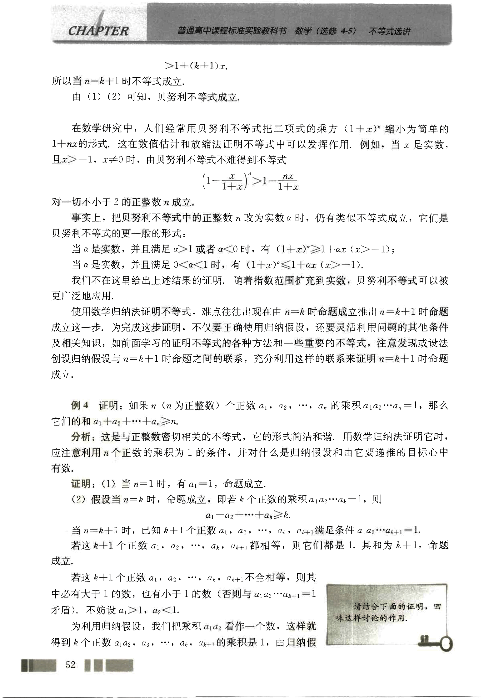
57

# 第四讲 数学归纳法证明不等式

设可以得到 $a_1a_2 + a_3 + ... + a_k + a_{k+1} \ge k$. ①

我们的目标是要证明 $a_1 + a_2 + a_3 + ... + a_k + a_{k+1} \ge k+1$. ②

对比 ①② 可以发现，若有 $a_1 + a_2 - a_1a_2 \ge 1$. ③

则 ①+③ 就得到 ②.

由$a_1 > 1$, $a_2 < 1$得$(a_1 - 1)(a_2 - 1) < 0$, 即$a_1 + a_2 - a_1a_2 > 1$. 于是目标得证.

这就是说，当$n = k + 1$时命题成立.

由(1)(2)可知，对一切正整数 n，如果 n 个正数$a_1, a_2, ..., a_n$的乘积$a_1a_2...a_n = 1$，

那么它们的和$a_1 + a_2 + ... + a_n \ge n$成立.

## 探究

(1) 回顾例 4 的证明过程，体会其中为了利用归纳假设以及证出递推关系做了哪些式子变形，它们起了什么作用.

(2) 利用例 4 的结论，考虑 n 个正数$\sqrt{\frac{a_1}{a_1a_2...a_n}}$, $\sqrt{\frac{a_2}{a_1a_2...a_n}}$, ..., $\sqrt{\frac{a_n}{a_1a_2...a_n}}$ ($a_1, a_2, ..., a_n$是正数)，你能得出 n 个正数的均值不等式吗？

## 习题 4.2

1. 证明：对大于 2 的一切正整数 n，下列不等式都成立

$(1 + 2 + 3 + ... + n)(\frac{1}{2} + \frac{1}{3} + ... + \frac{1}{n}) \ge n^2 + n - 1$.

2. (1) 不等式$2^n > n^2$对哪些正整数 n 成立？证明你的结论；

(2) 求满足不等式$(1 + \frac{1}{n})^n < n$的正整数 n 的范围.

3. 用数学归纳法证明：对于任意大于 1 的正整数 n，不等式$\frac{1}{2^2} + \frac{1}{3^2} + ... + \frac{1}{n^2} < \frac{n-1}{n}$都成立.

4. 若 a, b, c 三个正数成等差数列，公差 d≠0，自然数 n≥2，求证$a^n + c^n > 2b^n$.

5. 证明：当$a_n = \sqrt{1 \cdot 2} + \sqrt{2 \cdot 3} + ... + \sqrt{n(n+1)}$ (n 是正整数)时，不等式$\frac{n(n+1)}{2} < a_n < \frac{(n+1)^2}{2}$对一切正整数 n 都成立.

53

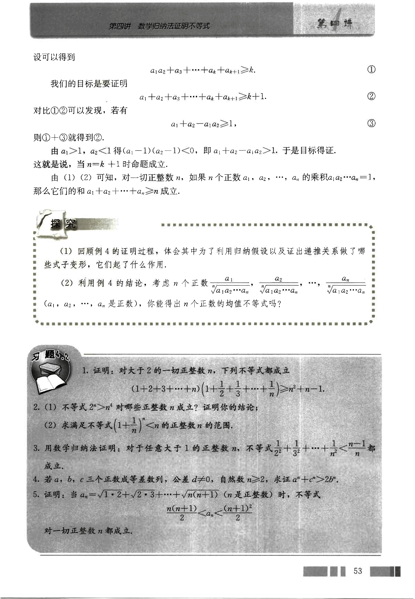
58

# CHAPTER

普通高中课程标准实验教科书 数学(选修 4-5) 不等式选讲

6. 已知 $a_1, a_2, \dots, a_n \in (0, \pi)$，$n$ 是大于 1 的正整数，求证
   $|sin(a_1 + a_2 + \dots + a_n)| < sin a_1 + sin a_2 + \dots + sin a_n$.

7. 用数学归纳法证明一般形式的柯西不等式.

8. 已知对于任意正数 $a_1, a_2, a_3$，有不等式：
   $\frac{1}{a_1} \ge 1,$

$(a_1 + a_2)(\frac{1}{a_1} + \frac{1}{a_2}) \ge 4,$

$(a_1 + a_2 + a_3)(\frac{1}{a_1} + \frac{1}{a_2} + \frac{1}{a_3}) \ge 9.$

(1) 从上述不等式归纳出一个适合任意正数 $a_1, a_2, \dots, a_n$ 的不等式.

(2) 用数学归纳法证明你归纳得到的不等式.

54

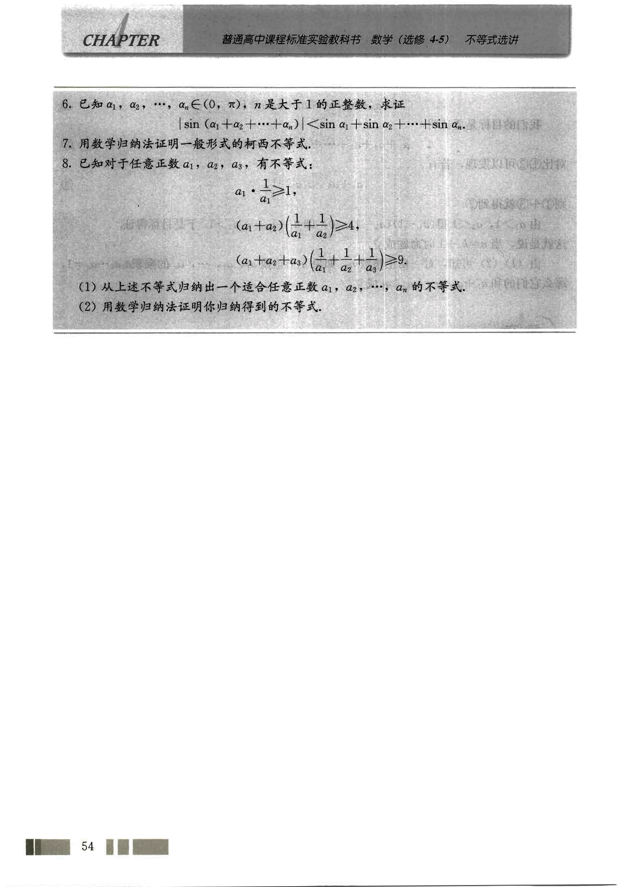
59

# 学习总结报告

## 学习总结报告

与等量关系一样，不等量关系也是自然界中存在着的基本数学关系。它们在现实世界和日常生活中大量存在，在数学研究和数学应用中也起着重要的作用。

本专题介绍了一些重要的不等式（绝对值三角不等式、基本不等式、柯西不等式、排序不等式等）及其应用，证明不等式的基本方法（比较法、综合法、分析法、反证法、放缩法等），数学归纳法和它在证明不等式中的简单应用。

类比对等量关系的研究，我们不但获得了关于不等量关系的基本事实及基本性质，而且还从中得到思想方法的启发。另外，在研究不等式时，注意数形结合的思想方法，对于我们把握不等式的实质有很好的作用。

1. 绝对值 $|a|$ 有着很明确的几何意义，即数轴上坐标为 $a$ 的点到原点的距离。利用绝对值的几何意义，可以证明和求解一些基本的含绝对值的不等式。
2. 基本不等式也有明确的几何意义，在实际中有许多重要应用，也是证明其它不等式的重要工具。从基本不等式可以推广到一般的算术-几何平均不等式，这是一类应用广泛的不等式，尤其在和为定值或积为定值的极值问题中非常有用。
3. 柯西不等式有很重要的数学背景，在许多数学分支中都有柯西不等式的影子，二维形式的柯西不等式是其中最基本而重要的不等式。柯西不等式的向量形式给代数形式以直观的描述，对我们理解它的本质很有帮助。我们还利用柯西不等式推导出三角不等式（实际上，三角不等式是柯西不等式的等价形式），这些不等式在实际中都有广泛应用。
4. 排序不等式也是基本而重要的不等式，许多不等式都可以借助它得到证明。

本专题强调不等式的几何意义及其背景，以加深对不等式的数学本质的理解，提高逻辑思维能力和分析解决问题的能力。

5. 相减求差的比较法是证明不等式的最基本方法。
6. 从对于证明过程的陈述形式角度，证明方法可以分为综合法和分析法。综合法是从已知条件或已知成立的不等式逐步推理论证直至结论，这是一种由果的证明方法。分析法是从要证的不等式着手，逐步推求使它成立的条件，直至所需条件为已知正确的不等式或所需条件为已知条件，这是一种执果索因的证明方法。在探寻不等式的证明途径中，当问题比较复杂时，通常把分析法和综合法结合起来。
7. 直接证明某些不等式比较困难时，可以考虑用反证法。用反证法证明不等式时，先假设要证明的不等式不成立，结合已知条件，应用公理、定义、定理，

55

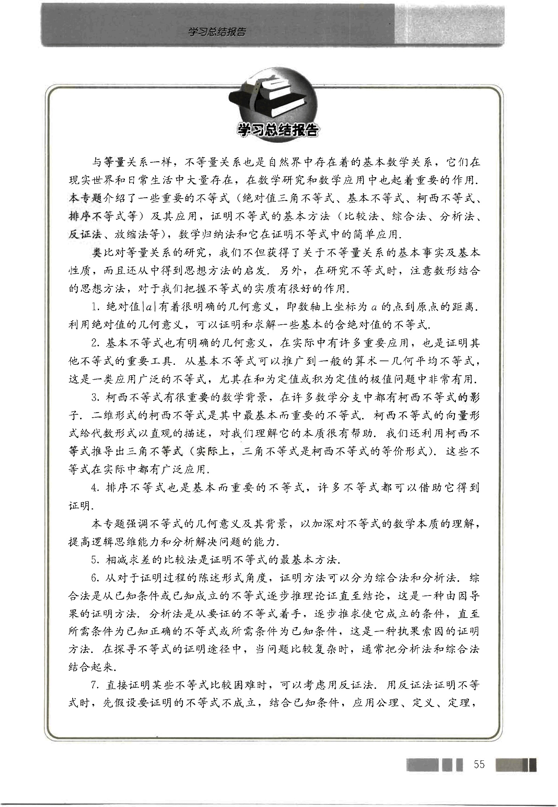
60

# 普通高中课程标准实验教科书 数学(选修 4-5)

进行推理论证，得到和已知条件、已证明的定理或明显成立的事实矛盾的结论，从而说明假设是错误的，因此要证的不等式成立。

8. 放缩法是把不等式中的某些部分的值放大或缩小，达到证明的目的。注意用放缩法证明不等式时，放大或缩小要适度。

9. 数学归纳法是证明关于自然数的有关命题的一种重要方法，数学归纳法的两个步骤组成完整的证明，两个步骤缺一不可。

请你写一篇学习总结报告，报告应包括三方面的内容：

一、知识的总结 对本专题介绍的不等式知识及其中蕴涵的数学思想方法和数学背景进行总结；

二、拓展 通过查阅资料、调查研究、访问求教、独立思考，进一步探讨不等式的应用；

三、学习体会 学习本专题的感受、体会、看法。

同学们可以参考下列书籍：

1. 华罗庚，《数学归纳法》，科学出版社，2002。
2. 史济怀，《平均》，科学出版社，2002。
3. 范会国，《几种类型的极值问题》，科学出版社，2002。
4. E. 贝肯巴赫，R. 贝尔曼，文丽译，《不等式入门》，北京大学出版社，1985。
5. 南山，《柯西不等式与排序不等式》，上海教育出版社，2002。
6. 吴承鄫，李绍宗，《不等式的证明》，上海教育出版社，1987。
7. G. H. 哈代，J. E. 李特伍德，G. 波里亚，越明义译，《不等式》，科学出版社，1965。
8. 严镇军，《不等式》，人民教育出版社，1990。

56

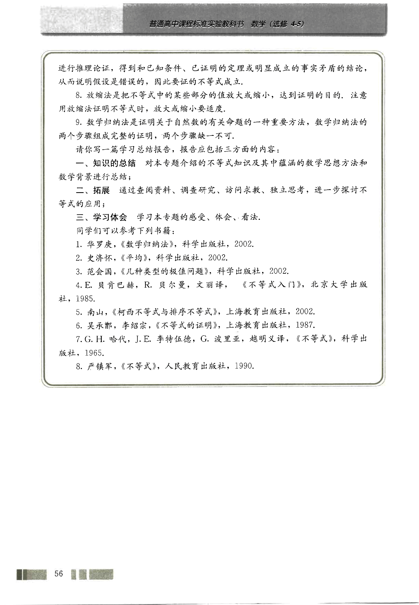
61

# 后记

为了全面贯彻党的教育方针，适应时代发展的需要，为学生的终身发展奠定基础，根据教育部制订的普通高中各学科课程标准（实验），人民教育出版社课程教材研究所编写的各学科普通高中课程标准实验教科书，得到了诸多教育界前辈和各学科专家学者的热情帮助和大力支持，在各学科教科书终于同课程改革实验区的师生见面时，我们特别感谢担任教科书总顾问的丁石孙、许嘉璐、叶至善、顾明远、吕型伟、王梓坤、梁衡、金冲及、白春礼、陶西平同志，感谢担任教科书编写指导委员会主任委员的柳斌同志和编写指导委员会委员江蓝生、李吉林、杨焕明、顾泠沅、袁行霈等同志。

根据教育部制订的《普通高中数学课程标准(实验)》，我们聘请北京师范大学刘绍学教授为主编，与高中数学课程标准研制组的部分成员、大学数学教师、数学教育理论工作者、中学数学教研员和数学教师共同组成编写委员会，编写了这套数学实验教科书，这里特别要感谢北京师范大学数学科学学院领导对本套教科书编写工作的高度重视和大力支持，同时还要感谢所有对本套教科书提出修改意见，提供过帮助与支持的专家、学者和教师，以及社会各界朋友。

本册教科书是编委会全体成员集体智慧的成果，除已列出的主要编写者外，参加本册教科书讨论的还有刘意竹、钱珮玲、马成瑞等。

我们还要感谢使用本套教材的实验区的师生们，希望你们在使用本套教材的过程中，能够及时把意见和建议反馈给我们，对此，我们将深表谢意。让我们携起手来，共同完成教材建设工作。我们的联系方式如下：

电话：(010) 58758330

E-mail: jcfk@pep.com.cn lilc@pep.com.cn

人民教育出版社 课程教材研究所
中学数学课程教材研究开发中心

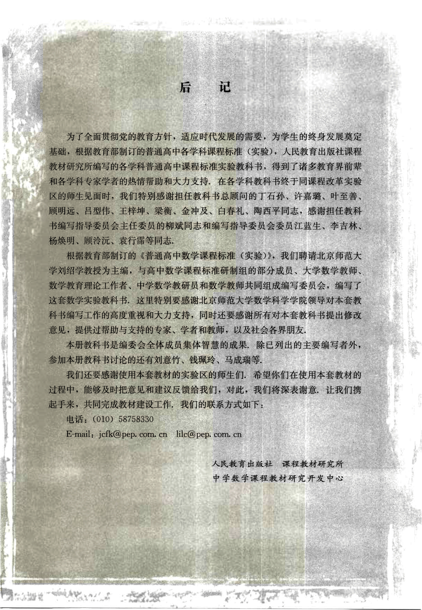
